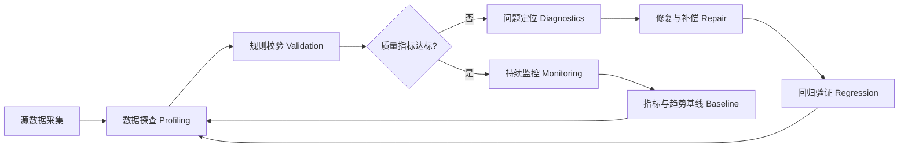
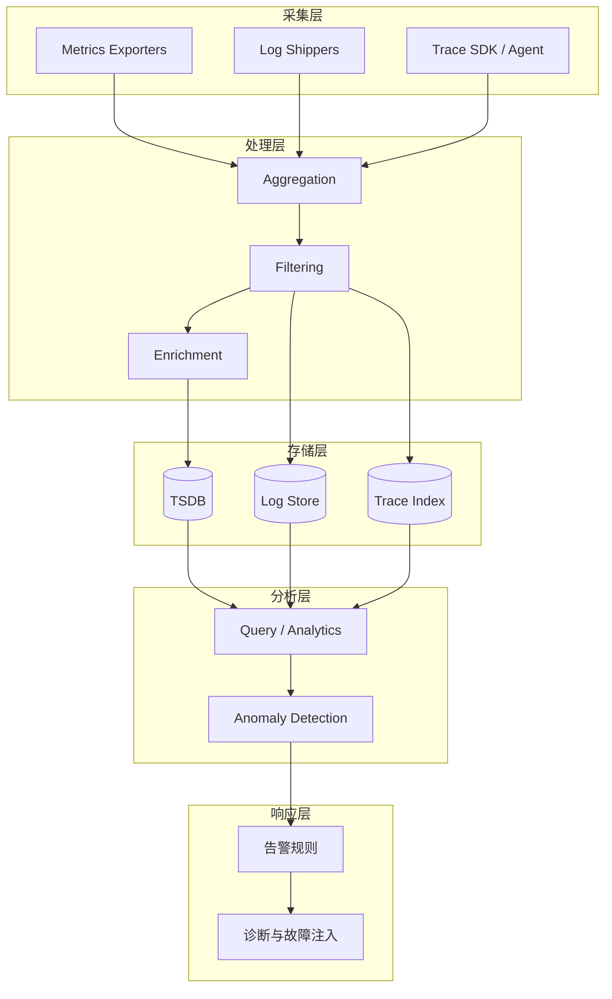

# 附录 图表目录

> 说明：本附录列出新增结构/流程类图示，以 Mermaid 渲染。后续可将图示引用 ID 嵌入正文。若渲染环境不支持 Mermaid，可使用预生成 PNG 资源（待补充）。

## 图表清单

| ID | 名称 | 类型 | 测试关注点 | 引用建议章节 |
|----|------|------|------------|--------------|
| FIG-DQ-LOOP | 数据质量闭环流程 | Flowchart | 采集→规则→监控→反馈→改进 | 数据质量管理与测试章节 6.x |
| FIG-OBS-PIPE | 可观测性数据管道 | Flowchart | 指标/日志/追踪统一采集与处理延迟 | 可观测性章节 13.x |
| FIG-TDM-LC | 测试数据生命周期 | Flowchart | 规划/生成/存储/使用/归档/销毁 | 测试数据管理章节 4.x / 10.x |
| FIG-FINOPS | 成本治理迭代环 | Flowchart | 计量→分析→优化→基线更新 | 性能与成本章节 18.x |

## FIG-DQ-LOOP 数据质量闭环



## FIG-OBS-PIPE 可观测性数据管道



## FIG-TDM-LC 测试数据生命周期

```mermaid
flowchart LR
	P[规划 Planning]\n需求/范围 --> G[生成 Generation]\n合成/抽样/克隆
	G --> S[存储 Storage]\n分层/标签/加密
	S --> U[使用 Usage]\n测试/分析/训练
	U --> M[监控 Monitoring]\n漂移/质量指标
	M --> A[归档 Archival]\n分级留存
	A --> D[销毁 Destruction]\n合规与证明
	D --> P
	M --> P
```

## FIG-FINOPS 成本治理迭代环

```mermaid
flowchart LR
	C1[计量测量 Metering] --> A1[分析 Analysis]\n成本剖析
	A1 --> O1[优化 Optimization]\n调度/压缩/分层
	O1 --> B1[基线更新 Baseline Update]
	B1 --> C1
	O1 --> R1[回归验证 Regression]
	R1 --> C1
```

> 后续：如需在 CI 中自动校验 Mermaid 语法，可加入脚本解析 code fence 并运行简单正则/关键词检查；若需 PNG 导出，可集成 mermaid-cli。

