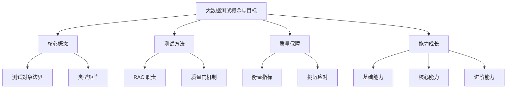
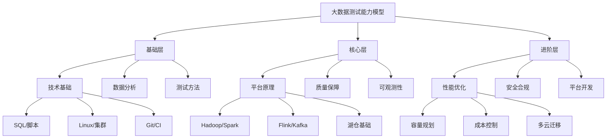

<!-- markdownlint-disable MD025 -->

<a id="第2章-大数据测试概念与目标【基础篇】"></a>

### 第2章 大数据测试概念与目标【基础篇】

**本章学习目标**

1. 理解大数据测试的核心概念、边界与范围，能够区分测试对象与不测范围
2. 掌握大数据测试的类型矩阵，熟悉不同维度下的测试方法与验证手段
3. 理解RACI职责分配与质量门机制，能够设计合理的质量保障策略
4. 掌握大数据测试的衡量指标体系，熟悉各类性能、安全、稳定性的量化标准
5. 识别大数据测试的典型特点与挑战，能够制定针对性的应对措施
6. 理解测试团队与其他角色的协作模式，建立有效的跨团队沟通机制
7. 掌握大数据测试人员的能力成长路径，制定个人发展规划

**实践建议**

- 一体化管理采样/造数/脱敏/归档/回放，提供可视化与审计。
- 支持多环境/多项目/多租户隔离，提供配额、成本与容量看板。
- 与用例管理、CI/CD、数据质量、监控平台集成，实现"用例触发数据、数据触发验证"。
- 预置常用场景数据包与模板，支持自助申请与审批。
- 评估平台时关注：自动化程度、审计与权限、成本可见性、API/CLI 集成能力。
- 若暂不具备平台化条件，可先用"对象存储+元数据表+脚本"迭代起步。
- 结合团队业务，沉淀可重复使用的数据包和回放脚本库。
- 大数据测试是指针对大数据系统及其数据链路，系统性验证**数据质量、处理逻辑、性能、稳定性、安全、合规与成本可控**的工程活动。
- 范围不仅包含代码，还覆盖**数据本身、配置/规则、调度、可观测性、治理与留痕**，强调端到端闭环。
- 目标是让数据产品（报表/API/特征/模型输入输出）在规模、实时性和合规约束下可复现、可追溯、可回归。

> **[锚点001]** 知识库清单/流程图  
> **锚点类型**: 建议  
> **锚点方法**: 清单/流程图  
> **补充建议**: 插入知识库清单或知识点流程图，涵盖测试方法、工具、常见问题，补充 YAML/JSON 示例，参考脚本 examples/02_quality_metrics/rule_runner.py。  
> **引用附件**: examples/02_quality_metrics/rule_runner.py  
> **完成情况**: 已标准化  
> **版本**: v1.0  
> **更新时间**: 2025-12-23

**大数据测试知识库清单**:

- **测试方法**: 功能测试、对账测试、性能测试、安全测试、合规测试、成本测试
- **常用工具**: JUnit、TestNG、JMeter、Spark Testing、Flink Testing、Postman
- **常见问题**: 数据一致性、质量门阻断、RACI职责不清、指标漂移
- **解决方案**: 自动化脚本、质量门模板、跨团队对齐、基线管理

**知识点流程图**:


**YAML 示例**:
```yaml
testing_knowledge_base:
  methods: ["functional", "reconciliation", "performance", "security", "compliance", "cost"]
  tools: ["junit", "jmeter", "spark_testing", "flink_testing", "postman"]
  common_issues: ["data_consistency", "quality_gate_blocking", "raci_unclear", "metric_drift"]
  solutions: ["automation_scripts", "quality_gate_templates", "cross_team_alignment", "baseline_management"]
```

**行业案例分享**:

**案例1：某电商平台的订单数据质量保障**
- **业务场景**：日订单量500万，涉及用户订单、商品库存、物流配送等多表关联
- **测试挑战**：跨表一致性验证、实时订单状态同步、库存扣减准确性
- **质量门设置**：订单完整率>99.9%、库存一致性误差<0.1%、状态同步延迟<5秒
- **RACI配置**：测试负责人(A)制定对账规则，开发负责人(R)执行数据修复，业务负责人(C)确认验收标准

**案例2：金融风控系统的实时风险评估**
- **业务场景**：实时处理信用卡交易，风险评分响应时间要求<100ms
- **测试挑战**：高并发压力测试、数据血缘追踪、模型准确性验证
- **质量门设置**：误报率<1%、漏报率<0.5%、系统可用性>99.99%、P99延迟<200ms
- **RACI配置**：安全负责人(A)审批测试数据，测试负责人(R)执行性能验证，开发负责人(C)优化模型

**案例3：物联网设备监控平台**
- **业务场景**：管理100万+物联网设备，采集传感器数据和设备状态
- **测试挑战**：设备连接稳定性、数据采集完整性、实时告警准确性
- **质量门设置**：设备在线率>99.5%、数据采集成功率>99.9%、告警准确率>95%
- **RACI配置**：运维负责人(A)监控设备状态，测试负责人(R)验证数据链路，业务负责人(C)确认告警规则

**案例4：内容分发网络的个性化推荐**
- **业务场景**：基于用户行为数据提供内容推荐，日活跃用户2000万
- **测试挑战**：推荐算法准确性、用户隐私保护、内容分发效率
- **质量门设置**：推荐点击率>15%、用户留存率>85%、隐私合规率100%、分发延迟<2秒
- **RACI配置**：业务负责人(A)定义推荐指标，测试负责人(R)验证算法效果，安全负责人(C)审核隐私保护

**场景对比表**

| 场景 | 数据类型 | 关键指标 | RACI配置 | 脚本引用 |
|---|---|---|---|---|
| 电商订单 | 用户订单、商品库存 | 订单完整率>99.9%、库存一致性误差<0.1% | 测试负责人(A)、开发负责人(R)、业务负责人(C) | examples/02_quality_metrics/rule_runner.py |
| 金融风控 | 交易记录、用户画像 | 误报率<1%、漏报率<0.5%、P99延迟<200ms | 安全负责人(A)、测试负责人(R)、开发负责人(C) | examples/02_quality_metrics/data_factory.py |
| 物联网监控 | 传感器数据、设备状态 | 设备在线率>99.5%、数据采集成功率>99.9% | 运维负责人(A)、测试负责人(R)、业务负责人(C) | examples/02_quality_metrics/masking_policy_demo.py |
| 内容推荐 | 用户行为、内容元数据 | 点击率>15%、用户留存率>85%、分发延迟<2秒 | 业务负责人(A)、测试负责人(R)、安全负责人(C) | examples/02_quality_metrics/contract_example.yml |

**YAML 配置示例**:
```yaml
application_scenarios:
  ecommerce_orders:
    data_types: ["user_orders", "product_inventory"]
    key_metrics:
      - "order_completeness_rate > 99.9%"
      - "inventory_consistency_error < 0.1%"
    raci_config:
      test_lead: "A"
      dev_lead: "R"
      business_lead: "C"
    script_reference: "examples/02_quality_metrics/rule_runner.py"
  financial_risk_control:
    data_types: ["transaction_records", "user_profiles"]
    key_metrics:
      - "false_positive_rate < 1%"
      - "false_negative_rate < 0.5%"
      - "p99_latency < 200ms"
    raci_config:
      security_lead: "A"
      test_lead: "R"
      dev_lead: "C"
    script_reference: "examples/02_quality_metrics/data_factory.py"
```

#### 2.1 术语与边界（精炼版）

- 术语统一：将“分区/窗口/水位/口径/血缘/契约”作为通用词汇，避免同词多义；为每个术语给出一句准确定义与一个反例。
- 边界声明：列出“不测范围”（如第三方 SaaS 内部逻辑），但必须验证其契约、接口与可观测性信号。
- 适用/非适用：明确批/流/交互查询在本章示例中的适用性与非目标，以避免误用。

#### 2.2 测试类型矩阵（增补）

- 维度：对象（采集/处理/存储/服务/治理）、方法（功能/对账/性能/安全/合规/成本）、数据形态（结构化/半结构化/非结构化）、处理模式（批/流/流批一体）。
- 输出：每个交叉单元至少给出一个最小用例与可观测指标示例（如对账用例→计数/哈希/聚合、一致性比对）。
- 参考示例：质量规则与契约校验分别对接 `examples/02_quality_metrics/quality_rules.yml` 与 `examples/02_quality_metrics/contract_example.yml`；本地可用 `tools/validate_quality_rules.py` 与 `tools/validate_contracts.py` 校验结构。

**测试类型矩阵示例**

| 对象/方法 | 功能测试 | 对账测试 | 性能测试 | 安全测试 | 合规测试 | 成本测试 |
|---|---|---|---|---|---|---|
| 数据采集 | 接口契约校验 | 采集量统计 | 采集吞吐量 | 数据脱敏验证 | 隐私合规检查 | 采集成本监控 |
| 数据处理 | 逻辑正确性 | 批次一致性 | 处理延迟 | 访问控制 | 审计留痕 | 计算资源消耗 |
| 数据存储 | ACID验证 | 分区完整性 | I/O性能 | 加密存储 | 数据保留期 | 存储成本 |
| 数据服务 | API响应 | 指标口径 | 服务QPS | 权限认证 | 日志合规 | 服务成本 |
| 数据治理 | 规则生效 | 血缘一致 | 治理性能 | 安全策略 | 合规报告 | 治理开销 |

**最小用例示例**:
- 数据采集功能测试：验证采集接口返回正确格式数据，可观测指标：成功率>99.9%
- 数据处理对账测试：比较源表与目标表记录数，可观测指标：差异率<0.1%

**Python 对账测试脚本示例**:
```python
import pandas as pd
import numpy as np
from datetime import datetime, timedelta
import logging

class DataReconciliationTester:
    def __init__(self, source_table, target_table, key_columns):
        self.source_table = source_table
        self.target_table = target_table
        self.key_columns = key_columns
        self.logger = logging.getLogger(__name__)
    
    def count_reconciliation(self):
        """记录数对账"""
        source_count = len(self.source_table)
        target_count = len(self.target_table)
        
        diff_count = abs(source_count - target_count)
        diff_rate = diff_count / max(source_count, target_count)
        
        result = {
            'source_count': source_count,
            'target_count': target_count,
            'diff_count': diff_count,
            'diff_rate': diff_rate,
            'status': 'PASS' if diff_rate <= 0.001 else 'FAIL'  # 差异率阈值0.1%
        }
        
        self.logger.info(f"Count reconciliation: {result}")
        return result
    
    def hash_reconciliation(self, columns_to_check):
        """哈希值对账"""
        def calculate_hash(df, columns):
            # 按关键列排序后计算哈希
            sorted_df = df.sort_values(self.key_columns).reset_index(drop=True)
            hash_data = sorted_df[columns].astype(str).agg(''.join, axis=1)
            return hash(hash_data.str.cat())
        
        source_hash = calculate_hash(self.source_table, columns_to_check)
        target_hash = calculate_hash(self.target_table, columns_to_check)
        
        result = {
            'source_hash': source_hash,
            'target_hash': target_hash,
            'match': source_hash == target_hash,
            'status': 'PASS' if source_hash == target_hash else 'FAIL'
        }
        
        self.logger.info(f"Hash reconciliation: {result}")
        return result
    
    def statistical_reconciliation(self, numeric_columns):
        """统计值对账"""
        results = {}
        
        for col in numeric_columns:
            if col in self.source_table.columns and col in self.target_table.columns:
                source_stats = {
                    'sum': self.source_table[col].sum(),
                    'mean': self.source_table[col].mean(),
                    'std': self.source_table[col].std()
                }
                
                target_stats = {
                    'sum': self.target_table[col].sum(),
                    'mean': self.target_table[col].mean(),
                    'std': self.target_table[col].std()
                }
                
                # 计算统计差异
                sum_diff = abs(source_stats['sum'] - target_stats['sum'])
                mean_diff = abs(source_stats['mean'] - target_stats['mean'])
                
                results[col] = {
                    'source': source_stats,
                    'target': target_stats,
                    'sum_diff': sum_diff,
                    'mean_diff': mean_diff,
                    'status': 'PASS' if sum_diff == 0 and mean_diff < 0.01 else 'WARNING'
                }
        
        self.logger.info(f"Statistical reconciliation: {results}")
        return results

# 使用示例
# tester = DataReconciliationTester(source_df, target_df, ['user_id', 'order_date'])
# count_result = tester.count_reconciliation()
# hash_result = tester.hash_reconciliation(['amount', 'status'])
# stat_result = tester.statistical_reconciliation(['amount'])
```

**SQL 质量门检查脚本示例**:
```sql
-- 质量门自动化检查脚本
-- 检查数据完整性质量门

CREATE OR REPLACE PROCEDURE check_data_quality_gates(
    p_batch_date DATE,
    p_threshold_completeness NUMBER DEFAULT 0.999,
    p_threshold_accuracy NUMBER DEFAULT 0.995
) AS
    v_total_records NUMBER;
    v_valid_records NUMBER;
    v_completeness_rate NUMBER;
    v_accuracy_rate NUMBER;
    v_gate_status VARCHAR2(10);
BEGIN
    -- 1. 检查数据完整性
    SELECT COUNT(*), COUNT(CASE WHEN user_id IS NOT NULL AND amount IS NOT NULL THEN 1 END)
    INTO v_total_records, v_valid_records
    FROM user_orders
    WHERE order_date = p_batch_date;
    
    v_completeness_rate := v_valid_records / v_total_records;
    
    -- 2. 检查数据准确性（金额范围检查）
    SELECT COUNT(CASE WHEN amount BETWEEN 0 AND 10000 THEN 1 END) / COUNT(*)
    INTO v_accuracy_rate
    FROM user_orders
    WHERE order_date = p_batch_date;
    
    -- 3. 判断质量门状态
    IF v_completeness_rate >= p_threshold_completeness AND v_accuracy_rate >= p_threshold_accuracy THEN
        v_gate_status := 'PASS';
    ELSE
        v_gate_status := 'FAIL';
    END IF;
    
    -- 4. 记录检查结果
    INSERT INTO quality_gate_log (
        batch_date, check_type, total_records, valid_records,
        completeness_rate, accuracy_rate, gate_status, check_time
    ) VALUES (
        p_batch_date, 'DATA_QUALITY', v_total_records, v_valid_records,
        v_completeness_rate, v_accuracy_rate, v_gate_status, SYSDATE
    );
    
    -- 5. 如果失败，阻止下游处理
    IF v_gate_status = 'FAIL' THEN
        RAISE_APPLICATION_ERROR(-20001, 'Quality gate failed: completeness=' || 
                               ROUND(v_completeness_rate, 4) || ', accuracy=' || 
                               ROUND(v_accuracy_rate, 4));
    END IF;
    
    COMMIT;
EXCEPTION
    WHEN OTHERS THEN
        ROLLBACK;
        RAISE;
END;
/

-- 执行质量门检查
EXEC check_data_quality_gates(TO_DATE('2024-12-24', 'YYYY-MM-DD'));
```

**JSON 配置示例**:
```json
{
  "qualityGates": {
    "dataQuality": {
      "completeness": {
        "threshold": 0.999,
        "description": "数据完整性阈值"
      },
      "accuracy": {
        "threshold": 0.995,
        "description": "数据准确性阈值"
      },
      "consistency": {
        "threshold": 0.001,
        "description": "数据一致性差异率阈值"
      }
    },
    "performance": {
      "latency": {
        "p95_threshold": 1000,
        "unit": "milliseconds"
      },
      "throughput": {
        "min_threshold": 1000,
        "unit": "records/second"
      }
    },
    "actions": {
      "on_failure": "block_deployment",
      "notification_channels": ["email", "slack"],
      "escalation_timeout": 3600
    }
  }
}
```

#### 2.3 RACI 与质量门（增补）

- RACI：为质量门的阈值设定、豁免审批、回放责任、告警响应、演练频次指定 R/A/C/I；将记录沉淀到审计工件报告模板。
- 质量门：将 2.2.3 模板落地到关键链路，明确“阻断/警告”的分级策略与默认豁免窗口；输出报告到 `tools/reports/`。
- 联动：质量门触发后自动运行对账脚本与模板校验脚本，并生成差异报告与样本留存。
**RACI矩阵示例**

| 活动/角色 | 测试负责人 | 开发负责人 | 运维负责人 | 业务负责人 | 安全负责人 |
|---|---|---|---|---|---|
| 质量门阈值设定 | A | C | C | I | I |
| 豁免审批 | A | I | I | C | C |
| 回放责任 | R | C | I | I | I |
| 告警响应 | R | I | A | I | C |
| 演练频次 | A | C | C | I | I |

注：R=Responsible（负责执行），A=Accountable（负责决策），C=Consulted（咨询），I=Informed（通知）
##### 2.1.2 大数据测试的对象

- 数据采集与接入：日志/消息/外部数据源，含采集完整性、去重、乱序、延迟、幂等、断点续传。
- 批处理与流处理作业：ETL、实时计算、聚合、特征工程、流批一体作业；关注口径、窗口、水位、状态一致性、倾斜与容错。
- 数据存储与管理：数据湖/数仓/NoSQL/OLAP/表格式，关注分区/分桶、压缩格式、ACID、版本与时光回溯。
- 数据服务与接口：报表、API、特征服务、指标服务；关注契约、口径、缓存一致性、SLO 与降级回退。
- 数据治理与安全：元数据、血缘、质量规则、指标目录、权限/脱敏/加密、审计留痕、成本与配额。
- 典型不测范围（需说明原因）：黑盒托管组件内部实现、第三方 SaaS 内部逻辑，但需验证契约、接口和可观测性。

> 实践建议  
> 
> 
> - 建立安全测试用例库并接入 CI/CD，权限/脱敏/加密/审计用例做自动回归。
> - 定期安全专项与合规自查，对高风险域（敏感表、跨境链路、临时授权）重点巡检。
> - 列出不可控的外部依赖（第三方数据源/托管服务），为其制定“契约+可观测性+回退”策略。

---

#### 2.4 大数据测试的目标与衡量指标

##### 2.2.2 衡量指标

- **准确率/一致性**：对账通过率、指标误差率、字段级校验通过率、数据漂移率（分布/KS/PSI）。
- **完整率**：分区/批次覆盖率、丢失/重复/缺失条数、关键字段非空率、样本齐性。
- **性能指标**：作业运行时长（P50/P95/P99）、端到端延迟、吞吐量、资源利用率（CPU/内存/IO/网络）、成本（CU/ECU/节点小时）。
- **稳定性指标**：失败率、重试次数、恢复时间（RTO）、数据丢失点（RPO）、自动化修复成功率。
- **安全指标**：未授权访问次数、敏感字段脱敏覆盖率、密钥/凭据轮换合规率、审计事件闭环率。
- **可观测性指标**：监控/日志/追踪覆盖率，告警到响应时间，血缘追溯深度与新鲜度，异常检测召回/精确率。
- **成本与效率指标**：单位作业成本、单位数据处理成本、冷热分层命中率、缓存命中率。

##### 2.2.3 通用质量门模板（示例）

- 要素：对象/环节、指标、阈值、采集方式、判定/阻断策略、豁免规则、回归频率、责任人。
- 判定：阻断/警告分级；不达标时自动标记变更不可发布；豁免需说明原因、时限、补救措施。
- 数据质量门示例：
  - 对象：T+1 日志入湖 → DWD 聚合；指标：分区完整率>=99.5%，重复率<=0.1%，关键字段非空率>=99.9%，分布漂移 PSI<0.1。
  - 采集：作业结束后自动跑对账脚本（计数/哈希/聚合/分布），生成报告；异常样本落盘供复查。
  - 阈值与策略：任一指标不达标→阻断下游调度；允许低峰一次豁免（需补跑+回放通过），记录留痕。
- 性能门示例：
  - 对象：核心批作业与实时接口；指标：批作业 P95<=8min、P99<=10min，接口 P99 延迟<=120ms、错误率<0.1%，CPU<75%、内存<80%、Shuffle 溢写率可控。
  - 采集：nightly 压测/回归，指标写入监控；发布前跑回归压测/回放。
  - 阈值与策略：超阈值→阻断发布；外部依赖导致的超时可申请短期豁免并开启降级/限流，期间必须补测验证。
- 安全/合规模板：
  - 对象：含敏感字段的表/接口；指标：脱敏覆盖率=100%，权限最小化，审计事件 100% 留痕，密钥/凭据轮换及时率。
  - 阈值与策略：任何敏感数据明文暴露即阻断；应急豁免需 DPO/安全负责人审批并限时整改。

> 实践建议  
> 
> 
> - 对于大型组织，建议采用多集群+多地域混合模式，兼顾灵活性与安全性。
> - 建立统一的环境管理平台，集中监控和运维；跨集群/地域链路建立延迟与丢失 SLI/SLO。
> - 优先给关键链路配置“质量门+回放+告警”三件套，做到可阻断、可追溯、可复查。
> - 将阈值与豁免策略文档化并入库，确保版本化与可审计。

---

#### 2.5 大数据测试的特点与挑战

##### 2.3.1 主要特点

- **链路长度与复杂度高**：从数据采集到最终服务的完整链路长，涉及多组件、多技术栈，端到端验证困难
- **数据量大，处理模式多样**：TB/PB级数据，批处理、流处理、交互查询并存，对测试环境和方法要求高
- **质量要求全面而严格**：不仅关注功能正确性，还要保证性能、稳定性、安全、合规与成本可控
- **依赖关系复杂**：跨团队、跨系统、跨技术栈协作，版本兼容性与接口契约管理难度大
- **可观测性要求高**：需要全面的监控、日志、追踪、告警能力，支持快速定位与问题诊断
- **自动化与智能化需求强**：人工测试成本高，亟需自动化测试平台与智能异常检测能力

##### 2.3.2 典型挑战

- **测试数据准备难**：边界/异常/隐私场景样本不足，合成成本高。
> **[锚点013]** 大数据测试主要特点建议  
> **锚点类型**: 建议  
> **锚点方法**: 批量标准化  
> **补充建议**: 梳理大数据测试的主要特点，指导测试策略与资源配置。建议步骤：1. 明确各特点对测试设计的影响，如链路长度影响端到端验证、数据量影响性能与采样。2. 输出对比表，便于团队共识与风险提示。示例与YAML结构、引用详见原文。  
> **引用附件**: examples/02_quality_metrics/contract_example.yml
>**引用附件**: examples/02_quality_metrics/rule_runner.py
> **完成情况**: 已标准化  > **版本**: v1.0  > **更新时间**: 2025-12-23

**大数据测试主要特点对比表**

| 特点 | 描述 | 对测试设计的影响 | 资源配置建议 |
|---|---|---|---|
| 链路长度与复杂度高 | 从采集到服务的完整链路长，多组件多技术栈 | 需端到端验证，增加集成测试比重 | 配置专门的集成测试环境 |
| 数据量大，处理模式多样 | TB/PB级数据，批/流/交互查询并存 | 性能测试复杂，需采样与比例缩放 | 提供高规格测试集群 |
| 质量要求全面而严格 | 功能+性能+稳定+安全+合规+成本 | 测试类型矩阵复杂，覆盖面广 | 建立多维度质量门机制 |
| 依赖关系复杂 | 跨团队跨系统协作，版本兼容难 | 需契约管理与接口测试 | 加强跨团队沟通与培训 |
| 可观测性要求高 | 全面监控日志追踪告警 | 测试需嵌入可观测点 | 集成监控平台与工具 |
| 自动化与智能化需求强 | 人工成本高，需智能检测 | 优先自动化平台建设 | 投入AI辅助测试工具 |

**YAML 示例**:
```yaml
bigdata_testing_characteristics:
  - name: "high_chain_complexity"
    description: "Long end-to-end data pipeline with multiple components"
    impact: "Requires comprehensive integration testing"
    resource_suggestion: "Dedicated integration test environment"
  - name: "large_data_volume"
    description: "TB/PB scale data with batch/stream/interactive modes"
    impact: "Complex performance testing with sampling"
    resource_suggestion: "High-spec test clusters"
  - name: "comprehensive_quality"
    description: "Function + performance + stability + security + compliance + cost"
    impact: "Complex test matrix with broad coverage"
    resource_suggestion: "Multi-dimensional quality gates"
```

> **[锚点014]** 大数据测试典型挑战建议  
> **锚点类型**: 建议  
> **锚点方法**: 批量标准化  
> **补充建议**: 总结大数据测试的典型挑战，给出科学应对措施，提升测试有效性。建议步骤：1. 梳理常见挑战类型，如数据准备、对账复杂、性能受限、依赖多等。2. 针对每类挑战提出可落地的应对措施。3. 输出对比表与YAML/JSON结构，便于团队复用。示例与YAML结构、引用详见原文。  
> **引用附件**: examples/02_quality_metrics/contract_example.yml
>**引用附件**: examples/02_quality_metrics/rule_runner.py
> **完成情况**: 已标准化  > **版本**: v1.0  > **更新时间**: 2025-12-23

**大数据测试典型挑战应对表**

| 挑战类型 | 具体表现 | 应对措施 | 工具/脚本支持 |
|---|---|---|---|
| 测试数据准备难 | 边界/异常/隐私样本不足，合成成本高 | 建设合成+采样+回放组合，保留批次ID与样本留痕 | examples/02_quality_metrics/data_factory.py |
| 对账与验证复杂 | 跨表跨链路批流一致性口径对齐难 | 模板化对账脚本（计数/哈希/聚合/分布），统一时间窗口与水位 | examples/02_quality_metrics/rule_runner.py |
| 性能与资源受限 | 测试环境低规格，压测结果失真 | 小型化场景（比例缩放+关键路径），基线回放与指标外推 | examples/02_quality_metrics/perf/ |
| 依赖多排查难 | 跨团队定位慢，日志指标缺失 | 配置契约熔断降级告警，合成监控补齐信号 | examples/02_quality_metrics/observability/ |
| 安全合规风险高 | 敏感数据泄露，脱敏权限缺位 | 默认脱敏最小权限，影子/合成数据回放 | examples/02_quality_metrics/masking_policy_demo.py |
| 成本不可见 | 无基线预算，调优缺数据 | 记录消耗形成成本基线，优化闭环 | tools/qa_summary.py |

**YAML 示例**:
```yaml
bigdata_testing_challenges:
  - type: "data_preparation"
    manifestation: "Insufficient boundary/exception/privacy samples"
    countermeasures: ["Synthetic + sampling + replay combination", "Batch ID and sample retention"]
    tool_support: "examples/02_quality_metrics/data_factory.py"
  - type: "reconciliation_complexity"
    manifestation: "Cross-table cross-chain batch-stream consistency alignment"
    countermeasures: ["Templated reconciliation scripts", "Unified time windows and watermarks"]
    tool_support: "examples/02_quality_metrics/rule_runner.py"
  - type: "performance_resource_limits"
    manifestation: "Low-spec test environments, distorted stress test results"
    countermeasures: ["Miniaturized scenarios", "Baseline replay and metric extrapolation"]
    tool_support: "examples/02_quality_metrics/perf/"
```
- **对账与验证复杂**：跨表、跨链路、批流一致性与口径对齐难；分布/采样/窗口对齐容易出错。
- **性能与资源受限**：测试环境低规格，压测/回放结果失真，资源抢占影响他人。
- **依赖多、排查难**：跨团队/跨系统定位慢；日志/指标/追踪缺失导致不可复现。
- **安全与合规风险高**：测试环境误用生产敏感数据或泄露；脱敏/权限/审计缺位。
- **成本不可见**：无成本基线与预算约束，调优缺少数据支撑。

> 实践建议  

>

> - 数据：建设“合成+采样+回放”组合；保留批次 ID 与样本留痕便于复现。
> - 对账：模板化对账脚本（计数/哈希/聚合/分布），批流对齐时统一时间窗口与水位规则。
> - 性能：小型化压测场景（比例缩放+关键路径），结合基线回放与指标外推；资源限额与隔离。
> - 依赖：为外部依赖配置契约、熔断、降级、告警；缺失信号用合成监控补齐。
> - 合规：默认脱敏与最小权限；用影子数据或合成数据做回放；审计与留痕全链路。
> - 成本：记录每次回放/压测的资源消耗，形成成本基线与优化闭环。

---


#### 2.6 测试与其他角色协作

- 与业务/产品：明确指标定义、数据口径、业务场景与验收标准；决定豁免与降级策略。
- 与开发/数据工程：对齐链路设计、接口、数据规范、窗口/水位、重试/补数策略。
- 与运维/平台：协同监控、资源、权限、告警、成本配额；演练故障与回退。
- 与安全/合规：确认敏感数据边界、脱敏策略、审计留痕与合规报送节奏。
- 与数据治理/架构：统一契约、指标目录、血缘口径，推动质量门与版本化。

#### 2.7 能力成长建议

- **基础能力**  
  - SQL/脚本、数据分析、Linux/集群操作、Git/CI 基础。
  - 统计基础（分布、抽样、置信区间）、常用数据校验方法。
- **核心能力**  
  - 大数据平台原理与实践（Hadoop/Spark/Flink/Kafka 等），流批一体与湖仓基础。
  - 数据链路质量保障：对账/断言/回放/窗口对齐/水位管理；自动化与监控。
  - 可观测性设计：指标/日志/追踪/血缘/质量门，告警与留痕。
- **进阶能力**  
  - 性能、容量、成本优化；安全与合规测试；多云/混合云迁移与演练。
  - 测试平台/工具开发、数据治理（契约/指标目录/血缘）、DataOps/MLOps 集成。
> **[锚点015]** 大数据测试能力模型结构图  
> **锚点类型**: 建议  
> **锚点方法**: 批量标准化  
> **补充建议**: 【目标】明确大数据测试人员的能力成长路径，指导团队建设与个人发展。建议步骤：1. 绘制能力模型结构图，分为基础、核心、进阶三层。2. 输出能力模型 YAML/JSON 结构，便于团队评估与培训。示例见主书稿。  
> **引用附件**: /tools/qa_summary.py  
> **完成情况**: 已标准化  
> **版本**: v1.0  
> **更新时间**: 2025-12-23

**大数据测试能力模型结构图**:


**YAML 示例**:
```yaml
bigdata_testing_competency_model:
  layers:
    - name: "foundation"
      competencies:
        - name: "technical_basics"
          skills: ["SQL/scripts", "Linux/cluster", "Git/CI"]
        - name: "data_analysis"
          skills: ["statistics", "sampling", "validation_methods"]
        - name: "testing_methods"
          skills: ["functional", "performance", "security"]
    - name: "core"
      competencies:
        - name: "platform_principles"
          skills: ["Hadoop/Spark", "Flink/Kafka", "lakehouse"]
        - name: "quality_assurance"
          skills: ["reconciliation", "automation", "monitoring"]
        - name: "observability"
          skills: ["metrics", "logging", "tracing"]
    - name: "advanced"
      competencies:
        - name: "performance_optimization"
          skills: ["capacity_planning", "cost_control", "multi_cloud"]
        - name: "security_compliance"
          skills: ["data_masking", "audit", "regulatory_compliance"]
        - name: "platform_development"
          skills: ["test_platform", "data_governance", "DevOps"]
```

> **[锚点016]** 大数据测试能力成长建议  
> **锚点类型**: 建议  
> **锚点方法**: 批量标准化  
> **补充建议**: 【目标】梳理大数据测试人员成长路径，覆盖基础、核心、进阶能力。建议步骤：1. 梳理基础能力（SQL/脚本、数据分析、Linux/集群操作、Git/CI基础、统计基础、常用校验方法）。2. 梳理核心能力（大数据平台原理、流批一体、质量保障、自动化、可观测性）。3. 梳理进阶能力（性能、容量、成本优化、安全合规、平台开发、数据治理、DataOps/MLOps集成）。  
> **引用附件**: /tools/qa_summary.py  
> **完成情况**: 已标准化  
> **版本**: v1.0  
> **更新时间**: 2025-12-23

**大数据测试能力成长路径建议**

**基础能力成长**:
- **技术基础**：掌握SQL/脚本编写、Linux/集群操作、Git/CI基础工具
- **数据分析**：学习统计基础（分布、抽样、置信区间）、常用数据校验方法
- **测试方法**：熟悉功能测试、性能测试、安全测试的基本概念和实践

**核心能力成长**:
- **平台原理**：深入理解Hadoop/Spark/Flink/Kafka等大数据平台，掌握流批一体与湖仓基础
- **质量保障**：熟练掌握对账/断言/回放/窗口对齐/水位管理，自动化测试与监控
- **可观测性**：掌握指标/日志/追踪/血缘/质量门设计，告警与留痕机制

**进阶能力成长**:
- **性能优化**：学习容量规划、成本控制、多云/混合云迁移与演练
- **安全合规**：掌握安全测试、合规要求、数据脱敏与审计
- **平台开发**：参与测试平台/工具开发、数据治理（契约/指标目录/血缘）、DataOps/MLOps集成

**YAML 示例**:
```yaml
bigdata_testing_growth_path:
  foundation:
    - category: "technical_basics"
      skills: ["SQL/scripting", "Linux/cluster_operations", "Git/CI_basics"]
    - category: "data_analysis"
      skills: ["statistics", "sampling", "validation_methods"]
    - category: "testing_methods"
      skills: ["functional_testing", "performance_testing", "security_testing"]
  core:
    - category: "platform_principles"
      skills: ["Hadoop/Spark", "Flink/Kafka", "stream_batch_unity", "lakehouse"]
    - category: "quality_assurance"
      skills: ["reconciliation", "automation", "monitoring", "window_alignment"]
    - category: "observability"
      skills: ["metrics", "logging", "tracing", "lineage", "quality_gates"]
  advanced:
    - category: "performance_optimization"
      skills: ["capacity_planning", "cost_control", "multi_cloud_migration"]
    - category: "security_compliance"
      skills: ["security_testing", "compliance", "data_masking", "audit"]
    - category: "platform_development"
      skills: ["test_platform", "data_governance", "DevOps", "MLOps"]
```
> 示例参考：

>
- 项目驱动成长：每个项目至少新增 1 个新场景（如流式对账、表格湖时光回溯、质量门自动化）。
- 资产化思维：将对账脚本/规则/基线模板/告警策略沉淀到仓库，版本化与留痕。
- 关注趋势：流批一体、湖仓格式、自动基线与异常检测、数据契约/指标目录、可观测性演进。
- 开放学习：认证、社区、开源贡献，结合内部演练与分享，形成团队教材。

**进阶能力成长**:
- **性能优化**：学习容量规划、成本控制、多云/混合云迁移与演练
- **安全合规**：掌握安全测试、合规要求、数据脱敏与审计
- **平台开发**：参与测试平台/工具开发、数据治理（契约/指标目录/血缘）、DataOps/MLOps集成

**YAML 示例**:
```yaml
bigdata_testing_growth_path:
  foundation:
    - category: "technical_basics"
      skills: ["SQL/scripting", "Linux/cluster_operations", "Git/CI_basics"]
    - category: "data_analysis"
      skills: ["statistics", "sampling", "validation_methods"]
    - category: "testing_methods"
      skills: ["functional_testing", "performance_testing", "security_testing"]
  core:
    - category: "platform_principles"
      skills: ["Hadoop/Spark", "Flink/Kafka", "stream_batch_unity", "lakehouse"]
    - category: "quality_assurance"
      skills: ["reconciliation", "automation", "monitoring", "window_alignment"]
    - category: "observability"
      skills: ["metrics", "logging", "tracing", "lineage", "quality_gates"]
  advanced:
    - category: "performance_optimization"
      skills: ["capacity_planning", "cost_control", "multi_cloud_migration"]
    - category: "security_compliance"
      skills: ["security_testing", "compliance", "data_masking", "audit"]
    - category: "platform_development"
      skills: ["test_platform", "data_governance", "DevOps", "MLOps"]
```
> 示例参考：

>
- 项目驱动成长：每个项目至少新增 1 个新场景（如流式对账、表格湖时光回溯、质量门自动化）。
- 资产化思维：将对账脚本/规则/基线模板/告警策略沉淀到仓库，版本化与留痕。
- 关注趋势：流批一体、湖仓格式、自动基线与异常检测、数据契约/指标目录、可观测性演进。
- 开放学习：认证、社区、开源贡献，结合内部演练与分享，形成团队教材。

**自我评估清单**:
- [ ] 我能准确区分大数据测试的对象和边界
- [ ] 我熟悉测试类型矩阵，能够根据场景选择合适方法
- [ ] 我理解RACI职责分配和质量门机制
- [ ] 我掌握大数据测试的主要衡量指标
- [ ] 我能识别测试挑战并制定应对策略
- [ ] 我了解跨团队协作模式和沟通方法
- [ ] 我有明确的个人能力成长规划

##### 2.8.1 工具与资源推荐

**测试管理与执行工具**:
- **JUnit/TestNG**：Java单元测试框架，支持大数据组件测试和集成测试
- **pytest**：Python测试框架，适合数据科学和机器学习测试
- **Apache JMeter**：性能测试工具，支持大数据系统压力测试和负载测试
- **Postman/Newman**：API测试工具，用于测试大数据服务接口和REST API
- **Cucumber/SpecFlow**：行为驱动开发(BDD)测试框架，支持业务规则验证

**数据质量与对账工具**:
- **Great Expectations**：数据质量验证框架，支持自动化数据质量检查
- **Deequ**：基于Apache Spark的数据质量库，提供统计分析和约束验证
- **dbt (Data Build Tool)**：数据转换工具，支持数据建模和质量测试
- **Monte Carlo**：数据可观测性平台，提供自动化数据质量监控
- **Soda SQL**：数据质量监控工具，支持SQL-based的质量检查

**大数据测试专用工具**:
- **Apache Spark Testing**：Spark应用程序测试框架，支持单元测试和集成测试
- **Apache Flink Testing**：Flink流处理应用测试框架
- **Kafka Testing Tools**：Kafka消息系统测试工具包
- **Hadoop Testing Tools**：Hadoop生态系统测试框架
- **Delta Lake Testing**：湖仓格式数据测试工具

**监控与可观测性工具**:
- **Prometheus**：监控系统，支持大数据应用指标收集
- **Grafana**：数据可视化平台，支持测试结果和监控指标展示
- **Jaeger**：分布式追踪系统，用于请求链路追踪
- **ELK Stack**：日志分析平台，支持测试日志聚合和分析
- **Apache SkyWalking**：应用性能监控，支持分布式系统观测

**自动化与CI/CD工具**:
- **Jenkins/GitLab CI**：持续集成平台，支持大数据测试流水线
- **Apache Airflow**：工作流调度工具，用于编排复杂测试任务
- **Docker/Kubernetes**：容器化平台，支持测试环境管理和部署
- **Terraform**：基础设施即代码工具，用于测试环境自动化部署
- **Ansible**：自动化配置管理工具

**安全测试工具**:
- **OWASP ZAP**：Web应用安全扫描工具
- **Burp Suite**：Web漏洞扫描和利用工具
- **SQLMap**：SQL注入测试工具
- **Nmap**：网络扫描和安全审计工具
- **Wireshark**：网络协议分析工具

**学习资源**:
- **Coursera/Udacity**：大数据测试相关在线课程
- **Linux Academy**：云平台和大数据技术培训
- **DataCamp**：数据科学和测试相关学习平台
- **官方文档**：各测试工具的官方文档和最佳实践
- **GitHub**：开源测试项目和示例代码
- **Stack Overflow**：技术问题解答社区

##### 2.8.2 自测题

**基础概念测试**:
1. 大数据测试的核心范围包括哪些方面？与传统软件测试有何差异？
2. 测试类型矩阵中的"对象"维度包括哪几个主要类别？
3. RACI矩阵中R、A、C、I分别代表什么含义？
4. 什么是质量门机制？它在大数据测试中有何作用？

**应用场景测试**:
1. 在电商订单系统中，数据质量测试应该重点关注哪些指标？
2. 金融风控场景中，如何验证模型的准确性和稳定性？
3. 物联网监控平台测试时，设备连接稳定性如何衡量？
4. 内容推荐系统中，算法效果验证的关键指标有哪些？

**技术实践测试**:
1. 如何设计跨表对账测试？需要考虑哪些关键因素？
2. 质量门设置时，如何平衡阻断策略和发布效率？
3. 在多团队协作中，如何有效管理RACI职责分配？
4. 性能测试中，如何处理大数据系统的资源限制问题？

**架构设计测试**:
1. 大数据测试环境设计时，应该考虑哪些隔离策略？
2. 如何构建完整的数据链路测试覆盖？
3. 可观测性设计在大数据测试中的作用是什么？
4. 成本控制在大数据测试中有哪些具体应用？

**安全合规测试**:
1. 大数据测试中的安全测试重点有哪些？
2. 如何验证数据脱敏和隐私保护的有效性？
3. 合规测试在不同行业场景中有何差异？
4. 审计留痕在大数据治理中的作用是什么？

**能力成长测试**:
1. 大数据测试人员的核心能力包括哪些方面？
2. 如何制定有效的个人能力成长计划？
3. 项目驱动学习在能力提升中有何优势？
4. 跨团队协作能力对测试人员的重要性体现在哪里？

#### 2.8 本章小结

通过本章的学习，你应该已经建立了大数据测试的完整认知框架。下一章将探讨大数据技术生态与架构基础，帮助你掌握技术层面的核心知识。

**概念基础建立：**
- 理解大数据测试的核心概念、边界与范围，掌握测试对象识别方法
- 熟悉大数据测试的类型矩阵，能够根据不同维度选择合适的测试方法
- 掌握RACI职责分配与质量门机制，能够设计合理的质量保障策略

**衡量体系掌握：**
- 熟悉大数据测试的完整衡量指标体系，理解各类指标的含义与应用场景
- 能够根据业务特点选择合适的衡量指标，建立量化的质量评估标准
- 掌握质量门的设置方法，能够制定阻断/警告的分级策略

**挑战应对能力：**
- 识别大数据测试的典型特点与挑战，理解其对测试策略的影响
- 掌握针对性的应对措施，能够制定数据准备、对账验证、性能测试等解决方案
- 熟悉测试团队与其他角色的协作模式，建立有效的跨团队沟通机制

**能力发展规划：**
- 理解大数据测试人员的能力成长路径，掌握基础、核心、进阶能力要求
- 能够制定个人发展规划，明确学习重点与成长方向
- 掌握项目驱动的学习方法，能够通过实践不断提升专业能力

**实践应用指导：**
1. 根据项目特点，明确大数据测试的覆盖范围与边界
2. 设计合理的测试类型矩阵，选择合适的测试方法与验证手段
3. 建立完整的衡量指标体系，设置有效的质量门机制
4. 制定针对性的挑战应对策略，提升测试有效性
5. 加强跨团队协作，建立良好的沟通与配合机制
6. 制定能力成长计划，通过项目实践不断提升专业水平

**章节术语表**:
- **RACI (Responsible, Accountable, Consulted, Informed)**：职责分配矩阵，明确项目活动中各角色的责任类型
- **质量门 (Quality Gate)**：在软件交付流程中设置的质量检查点，满足条件才能继续下一步
- **对账测试 (Reconciliation Testing)**：验证数据处理前后的一致性，确保数据转换的准确性
- **端到端测试 (End-to-End Testing)**：覆盖完整业务流程的测试，从数据输入到最终输出的验证
- **可观测性 (Observability)**：系统透明度的度量，包括日志、指标、追踪三个主要方面
- **数据血缘 (Data Lineage)**：数据从源头到消费的完整生命周期追踪
- **SLA (Service Level Agreement)**：服务水平协议，定义服务质量标准和责任
- **SLO (Service Level Objective)**：服务水平目标，量化服务质量的具体指标
- **SLI (Service Level Indicator)**：服务水平指标，用于衡量服务质量的实际表现
- **MTTR (Mean Time To Recovery)**：平均恢复时间，衡量系统故障恢复的效率
- **MTTD (Mean Time To Detection)**：平均检测时间，衡量问题发现的速度
- **CI/CD (Continuous Integration/Continuous Deployment)**：持续集成/持续部署，自动化软件交付流程
- **DataOps**：数据运维实践，强调数据流程的自动化、监控和协作
- **MLOps**：机器学习运维，管理机器学习模型的生命周期

**扩展阅读**:

**学术论文与研究报告**:
- **"Data Quality: The Accuracy Dimension" (Wang et al., 1995)** - 数据质量准确性维度经典研究，奠定了现代数据质量评估基础
- **"A Survey on Big Data Testing" (IEEE Transactions on Software Engineering, 2020)** - 大数据测试领域全面综述，涵盖测试策略、工具和技术趋势
- **"Quality Gates in Agile Development: A Systematic Literature Review" (Information and Software Technology, 2019)** - 敏捷开发中质量门机制的系统性文献综述

**经典书籍推荐**:
- **《Designing Data-Intensive Applications》 (Martin Kleppmann)** - 大数据系统设计权威指南，深入探讨数据密集型应用架构原则
- **《Building Reliable Data Lakes》 (Andreas Kretz)** - 数据湖构建最佳实践，包含质量保证和测试策略
- **《Data Mesh: Delivering Data-Driven Value at Scale》 (Zhamak Dehghani)** - 数据网格架构方法论，强调数据质量和治理的重要性

**行业标准与规范**:
- **ISO/IEC 25012:2008 - Data Quality Model** - 国际数据质量标准，定义了数据质量特性框架
- **IEEE Standard for Software Quality Assurance Processes (IEEE 730-2014)** - 软件质量保证过程标准
- **OWASP Data Validation Cheat Sheet** - Web应用数据验证安全标准

**云服务指南**:
- **AWS Data Quality Best Practices** - Amazon Web Services数据质量最佳实践指南
- **Azure Data Quality Solutions** - Microsoft Azure数据质量解决方案文档
- **Google Cloud Data Quality Framework** - Google Cloud数据质量框架和工具介绍

**在线资源与工具文档**:
- [Apache Griffin数据质量框架文档](https://griffin.apache.org/docs/) - 开源大数据质量管理平台
- [Great Expectations数据验证框架](https://greatexpectations.io/docs/) - Python数据质量测试库
- [Deequ数据质量评估库](https://github.com/awslabs/deequ) - AWS开源数据质量工具
- [Data Quality Knowledge Base](https://www.dataqualitypro.com/data-quality-knowledge-base/) - 数据质量专业知识库

**相关章节复习**:
- **第1章：大数据与大数据系统概述** - 复习大数据基础概念和5V特性
- **第3章：大数据技术生态与架构基础** - 深入了解技术栈和架构设计
- **质量门机制最佳实践** - 参考敏捷开发中的质量门实施指南
- **RACI矩阵应用案例** - 探索项目管理中的职责分配方法
7. 建立测试数据管理流程，确保数据质量与合规性
8. 实施可观测性设计，提升问题定位与故障恢复效率
9. 开展定期演练与回顾，持续优化测试策略
10. 关注新技术趋势，适时引入自动化与智能化测试手段

<a id="第3章-大数据技术生态与架构基础技术基础篇"></a>
