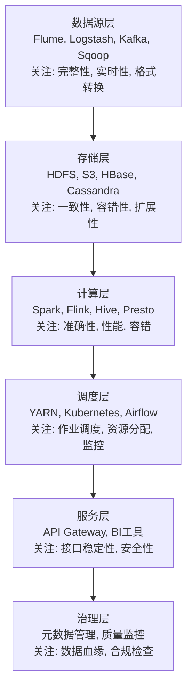
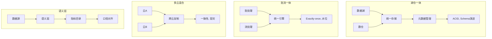

<!-- markdownlint-disable MD025 -->

<a id="第3章-大数据技术生态与架构基础【技术基础篇】"></a>

### 第3章 大数据技术生态与架构基础【技术基础篇】

**本章学习目标**

1. 理解大数据技术生态的分层架构，掌握各层的核心组件和功能
2. 熟悉主流大数据技术栈（Hadoop/Spark/Flink等）的特点和测试关注点
3. 掌握大数据架构设计的核心原则和常见模式
4. 了解大数据基础设施和云平台的特性与发展趋势
5. 掌握技术选型的测试视角，能够识别关键质量风险
6. 能够绘制项目的技术生态分层图，识别质量关注点

**实践建议**

- 在技术选型时，从测试视角评估各组件的兼容性、扩展性和监控能力，确保架构的可观测性。
- 绘制项目技术生态分层图，标注各层的质量关注点，如数据源层的完整性、存储层的容错性、计算层的性能优化。
- 关注云平台特性，选择支持弹性伸缩和自动化部署的组件，降低运维复杂度。
- 建立技术栈的测试基准，定期验证组件的稳定性和性能，避免技术债务积累。

#### 3.1 大数据技术生态系统层次

##### 3.1.1 生态系统分层

大数据技术生态通常可以分为以下层次，每层都有特定的组件和技术栈：

**数据源层**：负责数据采集和接入
- 组件：Flume、Logstash、Kafka、Sqoop等
- 关注点：数据完整性、实时性、格式转换、异常处理

**存储层**：提供数据存储和管理能力
- 组件：HDFS、S3、HBase、Cassandra等
- 关注点：数据一致性、容错性、扩展性、访问性能

**计算层**：执行数据处理和分析
- 组件：Spark、Flink、Hive、Presto等
- 关注点：计算准确性、性能优化、资源利用、容错机制

**调度层**：协调和管理作业执行
- 组件：YARN、Kubernetes、Airflow等
- 关注点：作业调度、依赖管理、资源分配、监控告警

**服务层**：提供数据访问和应用接口
- 组件：API Gateway、数据服务、BI工具等
- 关注点：接口稳定性、数据一致性、安全性、性能

**治理层**：确保数据质量、安全和合规
- 组件：元数据管理、质量监控、权限控制等
- 关注点：数据血缘、质量规则、安全审计、合规检查

> **[锚点017]** 大数据技术生态分层图  
> **锚点类型**: 建议  
> **锚点方法**: 批量标准化  
> **补充建议**: 【目标】梳理大数据技术生态分层，明确各层组件与测试关注点。建议步骤：1. 绘制分层图，标注采集、存储、计算、调度、服务、治理等层。2. 输出每层典型组件与关注点。详见主书稿。  
> **引用附件**: /tools/qa_summary.py  
> **状态**: 已完成  
> **版本**: v1.0  
> **时间戳**: 2025-12-23  



##### 3.1.2 生态系统演进趋势

- 从“烟囱式”单点到“平台化+可插拔”一体化方案，统一调度/监控/治理。
- 批流一体、湖仓一体、表格式标准化（Iceberg/Delta/Hudi）成为主流，影响测试策略与回放方式。
- 云原生与 Serverless 普及，资源弹性和环境漂移增多，要求更强的可观测性与自动化验证。
- 治理、质量、可观测性前置为底座能力，测试需与契约/指标目录/血缘深度对齐。

> 实践建议  

>

> - 画出你们项目的技术生态分层图，标注每一层的主要组件。
> - 关注治理、安全、质量等“非功能性”能力的集成方式。

**案例1：电商平台实时推荐系统**
- **业务场景**：基于用户行为数据提供个性化商品推荐，日处理10亿+用户行为事件
- **技术栈选择**：Kafka（数据源层）+ Spark Streaming（计算层）+ HBase（存储层）+ Airflow（调度层）
- **架构挑战**：实时性要求高（延迟<100ms）、数据量巨大、推荐算法准确性
- **测试关注点**：流处理Exactly-once、数据倾斜处理、推荐效果验证、系统弹性伸缩

**案例2：金融风控实时监控平台**
- **业务场景**：实时分析交易数据识别异常行为，支撑反欺诈和风险控制
- **技术栈选择**：Flink（流批一体）+ Kafka（消息队列）+ Cassandra（存储层）+ Kubernetes（调度层）
- **架构挑战**：金融级数据一致性要求、毫秒级延迟处理、合规性要求严格
- **测试关注点**：数据一致性验证、Checkpoint机制、跨AZ容灾、审计日志完整性

**案例3：物联网设备状态监控系统**
- **业务场景**：监控数百万物联网设备状态，实时告警异常情况
- **技术栈选择**：Kafka（数据采集）+ Flink（流处理）+ InfluxDB（时序存储）+ Prometheus（监控）
- **架构挑战**：设备连接不稳定、海量并发连接、数据压缩传输
- **测试关注点**：连接稳定性测试、数据压缩算法验证、告警准确性、资源弹性伸缩

**案例4：内容平台用户画像分析系统**
- **业务场景**：基于用户行为和内容数据构建用户画像，支持精准内容分发
- **技术栈选择**：Spark（批处理）+ Delta Lake（数据湖）+ Presto（查询）+ Airflow（调度）
- **架构挑战**：数据湖Schema演进、批流数据一致性、多维度画像计算
- **测试关注点**：数据血缘追踪、画像准确性验证、查询性能优化、存储成本控制

**技术栈应用场景对比表**

| 场景 | 数据特征 | 核心技术栈 | 关键挑战 | 测试重点 |
|---|---|---|---|---|
| 实时推荐 | 高并发、毫秒级延迟 | Kafka+Spark Streaming+HBase | 数据倾斜、推荐准确性 | Exactly-once、A/B测试、性能基准 |
| 金融风控 | 强一致性、金融合规 | Flink+Kafka+Cassandra | 数据一致性、审计要求 | 事务完整性、容灾演练、合规验证 |
| 物联网监控 | 海量设备、连接不稳定 | Kafka+Flink+时序数据库 | 连接稳定性、压缩效率 | 连接池测试、数据压缩、告警准确性 |
| 用户画像 | 大规模批处理、Schema演进 | Spark+Delta Lake+Presto | 数据血缘、查询性能 | Schema兼容性、血缘追踪、性能调优 |

**YAML 配置示例**:
```yaml
application_scenarios:
  realtime_recommendation:
    data_characteristics: ["high_concurrency", "millisecond_latency"]
    tech_stack: ["Kafka", "Spark_Streaming", "HBase", "Airflow"]
    key_challenges: ["data_skew", "recommendation_accuracy"]
    test_focus: ["exactly_once", "ab_testing", "performance_baseline"]
  financial_risk_control:
    data_characteristics: ["strong_consistency", "financial_compliance"]
    tech_stack: ["Flink", "Kafka", "Cassandra", "Kubernetes"]
    key_challenges: ["data_consistency", "audit_requirements"]
    test_focus: ["transaction_integrity", "disaster_recovery", "compliance_validation"]
```

---

#### 3.2 主流大数据技术栈（Hadoop/Spark/流批一体等）

##### 3.2.2 Spark 生态

> **[锚点018]** Spark生态主要组件与测试关注点表  
> **锚点类型**: 建议  
> **锚点方法**: 批量标准化  
> **补充建议**: 【目标】梳理Spark生态主要组件及其测试关注点。建议步骤：1. 输出Spark Core、SQL、Streaming、MLlib等组件及关注点。2. 用表格和YAML结构总结。详见主书稿。  
> **引用附件**: /tools/qa_summary.py  
> **状态**: 已完成  
> **版本**: v1.0  
> **时间戳**: 2025-12-23  

| 组件 | 主要功能 | 测试关注点 |
|------|----------|------------|
| Spark Core | 内存计算框架 | Shuffle、资源隔离、数据倾斜、容错与Checkpoint |
| Spark SQL | 结构化查询 | CBO/统计信息、分区裁剪、AQE、数据倾斜与UDF |
| Structured Streaming | 流处理 | 触发模式、状态存储、Exactly-once、延迟/水位、重放 |
| MLlib/GraphX | 机器学习与图计算 | 数据准备、特征缓存、模型持久化与评估 |

```yaml
spark_components:
  - name: Spark Core
    focus: [shuffle, resource_isolation, skew, fault_tolerance, checkpoint]
  - name: Spark SQL
    focus: [cbo, statistics, partition_pruning, aqe, skew, udf]
  - name: Structured Streaming
    focus: [trigger_mode, state_storage, exactly_once, latency, watermark, replay]
  - name: MLlib/GraphX
    focus: [data_prep, feature_cache, model_persistence, evaluation]
```

**Spark Core**：内存计算；关注 shuffle、资源隔离、倾斜、容错与 checkpoint。
- **Spark SQL**：结构化查询；关注 CBO/统计信息、分区裁剪、AQE、数据倾斜与 UDF。
- **Structured Streaming**：流处理；关注触发模式、状态存储、Exactly-once、延迟/水位、重放。
- **MLlib/GraphX**：机器学习与图计算；关注数据准备、特征缓存、模型持久化与评估。

**Python 代码示例 - Spark 数据处理**:
```python
from pyspark.sql import SparkSession
from pyspark.sql.functions import col, window, avg

# 创建 Spark 会话
spark = SparkSession.builder \
    .appName("DataQualityValidation") \
    .config("spark.sql.adaptive.enabled", "true") \
    .config("spark.sql.adaptive.coalescePartitions.enabled", "true") \
    .getOrCreate()

# 数据质量校验示例
def validate_data_quality(df):
    """数据质量校验函数"""
    # 检查数据完整性
    completeness_check = df.filter(col("user_id").isNotNull()).count() / df.count()
    
    # 检查数据一致性
    consistency_check = df.groupBy("user_id").count().filter("count > 1").count() == 0
    
    # 检查数据准确性
    accuracy_check = df.filter(col("amount") > 0).count() / df.count()
    
    return {
        "completeness": completeness_check,
        "consistency": consistency_check,
        "accuracy": accuracy_check
    }

# 流处理示例 - 实时数据聚合
streaming_df = spark.readStream \
    .format("kafka") \
    .option("kafka.bootstrap.servers", "localhost:9092") \
    .option("subscribe", "user_events") \
    .load()

# 窗口聚合计算
windowed_counts = streaming_df \
    .withWatermark("timestamp", "10 minutes") \
    .groupBy(window(col("timestamp"), "5 minutes"), col("event_type")) \
    .count()

# 输出到控制台（测试用）
query = windowed_counts.writeStream \
    .outputMode("update") \
    .format("console") \
    .start()

query.awaitTermination()
```

**SQL 示例 - Spark SQL 查询优化**:
```sql
-- 创建测试表并插入数据
CREATE TABLE user_events (
    user_id STRING,
    event_type STRING,
    event_time TIMESTAMP,
    amount DECIMAL(10,2)
) USING DELTA
PARTITIONED BY (date(event_time));

-- CBO 优化示例 - 使用统计信息
ANALYZE TABLE user_events COMPUTE STATISTICS;

-- 分区裁剪查询
SELECT 
    user_id,
    COUNT(*) as event_count,
    SUM(amount) as total_amount,
    AVG(amount) as avg_amount
FROM user_events 
WHERE date(event_time) BETWEEN '2024-01-01' AND '2024-01-31'
  AND event_type = 'purchase'
GROUP BY user_id
HAVING COUNT(*) > 5;

-- 数据倾斜处理示例
SELECT 
    user_id,
    event_type,
    COUNT(*) as cnt
FROM (
    SELECT 
        user_id,
        event_type,
        -- 添加盐值处理数据倾斜
        CASE WHEN hash(user_id) % 10 = 0 THEN concat(user_id, '_salt')
             ELSE user_id END as salted_user_id
    FROM user_events
) t
GROUP BY salted_user_id, event_type;
```

##### 3.2.3 流批一体与新一代技术

> **[锚点019]** 流批一体与新一代技术对比表  
> **锚点类型**: 建议  
> **锚点方法**: 对比表  
> **补充建议**: 【目标】梳理流批一体与新一代技术对比。建议步骤：1. 输出Flink、Kafka Streams、Presto/Trino、数据湖技术等组件对比。2. 用表格结构总结技术特点与测试关注点。详见主书稿。  
> **引用附件**: /tools/qa_summary.py  
> **状态**: 已完成  
> **版本**: v1.0  
> **时间戳**: 2025-12-23  

| 技术 | 特点 | 测试关注点 |
|------|------|------------|
| Flink | 原生流处理/批流一体 | Checkpoint/Savepoint、状态后端、Watermark、窗口、Exactly-once、升级与回放 |
| Kafka Streams / Pulsar Functions | 轻量流计算 | 状态存储、重平衡、幂等与容错、延迟监控 |
| Presto/Trino | 交互式查询 | 多源/异构连接器、并发、内存/Spill、CBO与安全 |
| 数据湖技术（Iceberg/Delta/Hudi） | 支持ACID、Schema演进、时光回溯、CDC/增量读取、流批一体 | Schema变更、快照切换、时点回放与并发写 |

**Flink**：原生流处理/批流一体；关注 checkpoint/savepoint、状态后端、Watermark、窗口、Exactly-once、升级与回放。
- **Kafka Streams / Pulsar Functions**：轻量流计算；关注状态存储、重平衡、幂等与容错、延迟监控。
- **Presto/Trino**：交互式查询；关注多源/异构连接器、并发、内存/Spill、CBO 与安全。
- **数据湖技术（Iceberg/Delta/Hudi）**：支持 ACID、Schema 演进、时光回溯、CDC/增量读取、流批一体；测试需覆盖 Schema 变更、快照切换、时点回放与并发写。

**Java 代码示例 - Flink 流处理**:
```java
import org.apache.flink.api.common.eventtime.WatermarkStrategy;
import org.apache.flink.api.common.functions.MapFunction;
import org.apache.flink.api.common.state.ValueState;
import org.apache.flink.api.common.state.ValueStateDescriptor;
import org.apache.flink.api.common.typeinfo.Types;
import org.apache.flink.streaming.api.datastream.DataStream;
import org.apache.flink.streaming.api.environment.StreamExecutionEnvironment;
import org.apache.flink.streaming.api.functions.KeyedProcessFunction;
import org.apache.flink.streaming.api.windowing.assigners.TumblingEventTimeWindows;
import org.apache.flink.streaming.api.windowing.time.Time;
import org.apache.flink.util.Collector;

public class FraudDetectionJob {
    public static void main(String[] args) throws Exception {
        // 创建执行环境
        StreamExecutionEnvironment env = StreamExecutionEnvironment.getExecutionEnvironment();
        
        // 设置检查点
        env.enableCheckpointing(60000); // 60秒
        env.getCheckpointConfig().setCheckpointStorage("file:///tmp/checkpoints");
        
        // 数据源 - Kafka
        DataStream<Transaction> transactions = env
            .fromSource(
                KafkaSource.<Transaction>builder()
                    .setBootstrapServers("localhost:9092")
                    .setTopics("transactions")
                    .setGroupId("fraud-detection")
                    .setStartingOffsets(OffsetsInitializer.earliest())
                    .setDeserializer(new TransactionDeserializer())
                    .build(),
                WatermarkStrategy.<Transaction>forMonotonousTimestamps()
                    .withTimestampAssigner((event, timestamp) -> event.getTimestamp()),
                "Kafka Source"
            );
        
        // 欺诈检测逻辑 - 基于状态的处理
        DataStream<Alert> alerts = transactions
            .keyBy(Transaction::getUserId)
            .process(new FraudDetector())
            .name("Fraud Detection");
        
        // 输出到 Kafka
        alerts.sinkTo(
            KafkaSink.<Alert>builder()
                .setBootstrapServers("localhost:9092")
                .setRecordSerializer(new AlertSerializer())
                .setTopic("fraud-alerts")
                .build()
        );
        
        env.execute("Fraud Detection Job");
    }
    
    // 欺诈检测处理函数
    public static class FraudDetector extends KeyedProcessFunction<String, Transaction, Alert> {
        private ValueState<Double> avgAmountState;
        private ValueState<Long> countState;
        
        @Override
        public void open(Configuration parameters) {
            avgAmountState = getRuntimeContext().getState(
                new ValueStateDescriptor<>("avgAmount", Types.DOUBLE));
            countState = getRuntimeContext().getState(
                new ValueStateDescriptor<>("count", Types.LONG));
        }
        
        @Override
        public void processElement(Transaction transaction, Context ctx, Collector<Alert> out) {
            // 更新状态
            Long count = countState.value();
            if (count == null) count = 0L;
            count++;
            countState.update(count);
            
            Double avgAmount = avgAmountState.value();
            if (avgAmount == null) avgAmount = 0.0;
            
            // 计算新的平均值
            avgAmount = (avgAmount * (count - 1) + transaction.getAmount()) / count;
            avgAmountState.update(avgAmount);
            
            // 检测异常 - 如果交易金额超过平均值的3倍
            if (transaction.getAmount() > avgAmount * 3) {
                out.collect(new Alert(
                    transaction.getUserId(), 
                    transaction.getAmount(), 
                    avgAmount, 
                    "High amount transaction detected"));
            }
        }
    }
}
```

**SQL 示例 - Presto 交互式查询**:
```sql
-- 多源异构查询示例
SELECT 
    u.user_id,
    u.user_name,
    u.registration_date,
    COUNT(o.order_id) as total_orders,
    SUM(o.amount) as total_amount,
    AVG(o.amount) as avg_order_amount,
    MAX(o.order_date) as last_order_date
FROM 
    mysql.users u
LEFT JOIN 
    hive.orders o ON u.user_id = o.user_id
WHERE 
    u.registration_date >= DATE '2024-01-01'
    AND o.order_date >= DATE '2024-01-01'
GROUP BY 
    u.user_id, u.user_name, u.registration_date
HAVING 
    COUNT(o.order_id) > 0
ORDER BY 
    total_amount DESC
LIMIT 100;

-- 数据质量检查查询
SELECT 
    'data_quality_check' as check_type,
    COUNT(*) as total_records,
    COUNT(CASE WHEN user_id IS NULL THEN 1 END) as null_user_ids,
    COUNT(CASE WHEN amount < 0 THEN 1 END) as negative_amounts,
    COUNT(DISTINCT user_id) as unique_users,
    ROUND(AVG(amount), 2) as avg_amount,
    ROUND(STDDEV(amount), 2) as stddev_amount
FROM 
    delta.transactions
WHERE 
    transaction_date >= CURRENT_DATE - INTERVAL '30' DAY;
```

##### 3.2.4 云原生与托管服务

- 云厂商托管平台（EMR、Databricks、BigQuery、MaxCompute 等），提供弹性/自动运维/安全合规；测试需关注多租户隔离、配额、跨区/跨云复制、版本/引擎兼容性、账单与成本可观测性。

> 实践建议  

>

> - 梳理项目技术栈，标注用途、关键配置、依赖与质量关注点（对账/可观测/性能/安全）。
> - 为流批一体与湖仓引入准备迁移与验证清单：Schema 兼容、口径对齐、回放与回滚策略。

---

#### 3.3 大数据架构设计原则

##### 3.3.2 架构设计常见模式

> **[锚点020]** 大数据架构设计常见模式示意图  
> **锚点类型**: 建议  
> **锚点方法**: 示意图  
> **补充建议**: 【目标】梳理大数据架构设计常见模式。建议步骤：1. 绘制湖仓一体、批流一体、多云混合、语义层等模式示意图。2. 标注各模式的测试关注点与验证策略。详见主书稿。  
> **引用附件**: /tools/qa_summary.py  
> **状态**: 已完成  
> **版本**: v1.0  
> **时间戳**: 2025-12-23  



**数据湖+数仓融合**：湖仓一体，统一存储/元数据/权限；测试需覆盖 ACID、时光回溯、Schema 演进、热冷分层。
- **批流一体**：同一链路批/流共用代码或算子；测试需验证窗口/水位、Exactly-once、补数/重放、延迟/口径一致。
- **多云/混合云**：跨云部署，关注一致性、合规、成本；测试需验证跨区复制、延迟、容灾、配置漂移与权限对齐。
- **层次化数据服务/语义层**：语义层/指标目录抽象，减少报表/接口口径分裂；测试需对齐口径卡片与数据契约。

> 实践建议  

>

> - 用“分层+契约”梳理架构，识别耦合点与最小切分单元，确定测试隔离面。
> - 在设计评审中要求血缘、元数据、可观测性、质量门一同落地，避免事后补救。

---

#### 3.4 大数据基础设施与云平台概览

##### 3.4.2 云平台能力

- 弹性扩缩容、自动故障恢复、按需计费，配合配额/预算与标签计费。
- 生态集成（存储/计算/AI/可观测性/治理），需验证跨服务权限与审计。
- 支持多源/多引擎/多接口；需验证连接器兼容性、跨区/跨云延迟与带宽。
- 提供观测/日志/追踪与安全中心；将测试指标/告警纳入平台统一看板。

##### 3.4.3 云原生趋势

- 容器化（Kubernetes）、Serverless、环境即代码（IaC）；需要镜像/镜像签名、配置/密钥管理、灰度与回滚策略。
- 多云/混合云：关注数据一致性、合规、成本优化、网络质量与出入口限流；测试需演练跨云容灾与降级。
- 可观察性与自动化：默认接入监控/日志/追踪与审计，结合 GitOps/FinOps 做变更与成本管控。

> 实践建议  

>

> - 评估基础设施现状，规划“先 IaC、再弹性、后 Serverless”的演进路径，并定义验证清单（兼容性/性能/成本/安全/合规）。
> - 将监控/日志/追踪/审计与测试用例联动，确保环境变更可观测、可回滚、可审计。

---

#### 3.5 技术选型与测试关注点

##### 3.5.2 测试关注点

> **[锚点021]** 大数据测试关注点清单  
> **锚点类型**: 建议  
> **锚点方法**: 清单表  
> **补充建议**: 【目标】梳理大数据测试关注点清单。建议步骤：1. 输出性能、安全、自动化、可观测性、成本等测试关注点。2. 用清单和表格结构总结关键指标与验证策略。详见主书稿。  
> **引用附件**: /tools/qa_summary.py  
> **状态**: 已完成  
> **版本**: v1.0  
> **时间戳**: 2025-12-23  

| 类别 | 关注点 | 关键指标/验证策略 |
|------|--------|-------------------|
| 性能 | 作业运行时长、端到端延迟、吞吐量、资源利用率与成本 | 基准测试、负载压测、回归对比 |
| 并发 | 资源竞争、调度/队列/优先级、抢占与混部影响 | 多作业并发模拟、隔离验证 |
| 数据处理 | 数据倾斜、热点分区、Shuffle/Skew/Spill、GC、Checkpoint开销 | 数据分布分析、异常注入 |
| 依赖 | 外部服务尾延迟与容量瓶颈 | 依赖mock、限流测试 |
| 安全 | 访问控制、脱敏/加密、审计、密钥管理、跨租户隔离 | 权限矩阵、审计日志检查 |
| 自动化 | 用例/对账脚本/回放、监控/日志/追踪、质量门与告警集成 | CI/CD集成、自动化脚本 |
| 成本 | 压测/回放资源账单、预算与配额守护、成本回归 | 资源监控、预算预警 |
| 扩展 | 数据量扩展、并发扩展、节点扩容、异常场景 | 渐进式压测、故障注入 |

> **架构复杂度评估公式**  
> 为了量化架构设计的复杂度，可使用以下简单公式：  
> $$ \text{复杂度评分} = \frac{\text{组件数量} \times \text{依赖关系数}}{\text{架构层数}} $$  
> 示例：若项目有20个组件、50个依赖关系、6个层次，则评分 ≈ 16.7（越高越复杂，需加强测试）。此公式帮助从测试视角评估选型风险。

作业运行时长、端到端延迟、吞吐量、资源利用率与成本。
- 并发作业下的资源竞争、调度/队列/优先级、抢占与混部影响。
- 数据倾斜、热点分区、Shuffle/Skew/Spill、GC、Checkpoint/Savepoint 开销。
- 依赖外部服务（元数据、存储、消息队列）的尾延迟与容量瓶颈。
- **安全与权限**：访问控制、脱敏/加密、审计、密钥管理、跨租户隔离；影子数据与最小权限。
- **自动化与可观测性**：用例/对账脚本/回放、监控/日志/追踪、质量门与告警集成；IaC/GitOps 驱动的可重复验证。
- **成本与配额**：压测/回放的资源账单、预算与配额守护、成本回归与优化空间。
- **数据量扩展测试**：逐步放大输入量，观察延迟/吞吐/成本、是否线性扩展。
- **并发扩展测试**：增加并发作业，评估调度/队列/资源隔离与互扰。
- **节点扩容测试**：横向扩容、自动扩缩容的收敛时间与性价比；Spot/按量策略。
- **异常与极端场景**：高峰、倾斜、网络抖动、依赖抖动、外部服务限流，验证降级与重试。
- **计划与回归**：建立性能基线，定期回归；升级/配置变更后做性能对比。

> - 技术选型阶段即介入测试视角，设计“兼容性+性能+质量+安全+成本”验证方案与回滚预案。
> - 为关键组件建立“选型+测试”清单：必测场景、基线指标、对账/回放、告警与质量门、成本与配额守护。

---

#### 3.6 本章小结

- 大数据技术生态分层清晰：采集/存储/计算/调度/服务/治理并行，测试需按层布控质量点与可观测性。
- 主流技术栈演进：批流一体、湖仓一体、表格式、云原生/Serverless，要求回放、对账与兼容性测试同步升级。
- 架构设计要分层解耦并契约化，强调弹性/高可用/一致性/安全与合规，提前设计降级与回退。
- 基础设施云化、托管化，需验证跨区/跨云一致性、成本与配额、监控与审计可见性。
- 技术选型应结合业务/生态/运维/安全/成本/治理多维度，测试全程参与并聚焦兼容性、性能、质量、安全、成本与可观测性。

> **前瞻展望**  
> 本章奠定了大数据技术架构的基础，下一章将聚焦测试环境的搭建与运维，确保这些架构原则在实践中落地。

**扩展阅读**:

**学术论文与研究报告**:
- **"The Data Lakehouse: Data Warehousing and More" (Armbrust et al., 2021)** - 湖仓一体架构的奠基性论文，探讨数据湖和数据仓库的融合趋势
- **"Streaming Systems: The What, Where, When, and How of Large-Scale Data Processing" (Akidau et al., 2015)** - 流处理系统权威指南，涵盖流批一体设计原则
- **"Architecture of a Database System" (Stonebraker et al., 2007)** - 数据库系统架构经典论文，为大数据系统设计提供理论基础

**经典书籍推荐**:
- **《Designing Data-Intensive Applications》 (Martin Kleppmann)** - 大数据系统设计圣经，深入探讨数据密集型应用架构模式
- **《Streaming Systems》 (Tyler Akidau, Slava Chernyak)** - Google流处理专家撰写，流批一体架构设计指南
- **《Big Data: Principles and Best Practices of Scalable Realtime Data Systems》 (Nathan Marz)** - 大数据系统设计原则和最佳实践

**行业标准与规范**:
- **Apache Iceberg Specification** - 开源数据湖表格式规范，定义ACID事务和Schema演进标准
- **Delta Lake Protocol** - 数据湖协议规范，支持可靠的元数据管理和时序数据处理
- **CNCF Cloud Native Landscape** - 云原生技术全景图，指导大数据云原生架构选型

**云服务指南**:
- **AWS Well-Architected Framework: Data Analytics Lens** - Amazon大数据架构设计框架
- **Azure Data Architecture Guide** - Microsoft Azure大数据架构设计指南
- **Google Cloud Data Processing Architectures** - Google Cloud数据处理架构最佳实践

**在线资源与工具文档**:
- [Spark官方文档](https://spark.apache.org/docs/latest/) - Apache Spark官方文档和最佳实践
- [Flink官方文档](https://flink.apache.org/docs/stable/) - Apache Flink流处理框架文档
- [Presto文档](https://prestodb.io/docs/current/) - Presto/Trino交互式查询引擎文档
- [Delta Lake文档](https://docs.delta.io/latest/index.html) - Delta Lake数据湖技术文档
- [Iceberg文档](https://iceberg.apache.org/docs/latest/) - Apache Iceberg表格式文档

**相关章节复习**:
- **第1篇-第1章**：大数据与大数据系统概述 - 复习大数据基础概念和5V特性
- **第1篇-第2章**：大数据测试目标与挑战 - 深入了解测试策略和质量保障方法

> 动手思考
> 1. 画出你们项目的技术生态分层图，标注每一层的主要组件。
> 2. 结合你们的技术栈，列出 3 个最需要重点测试的环节，并说明原因。
> 3. 针对一个新引入的技术组件，写出你会关注的 2 个测试重点。
> 4. 分析一个具体的业务场景（如电商推荐系统），为其设计合适的技术栈选型方案。
> 5. 评估当前项目架构的复杂度，并提出相应的测试策略优化建议。
> **预计用时：45-60分钟**

> **知识点练习**
> 1. 请解释大数据技术生态的6个层次及其在测试中的关注点。
> 2. 比较Spark和Flink在流处理场景下的异同点及其测试策略差异。
> 3. 分析湖仓一体架构的优势，并说明其对数据质量测试的影响。
> 4. 讨论云原生技术对大数据测试环境搭建的影响和应对策略。
> 5. 设计一个完整的技术选型评估框架，包含哪些关键维度？

> 示例参考：

> - 架构评审 Checklist 模板：`examples/03_arch_review/arch_review_checklist.md`

> **章节自评清单**
> - [ ] 我能准确描述大数据技术生态的6个层次及其核心组件。
> - [ ] 我理解Spark、Flink等主流技术栈的特点和测试关注点。
> - [ ] 我能识别大数据架构设计的常见模式及其验证策略。
> - [ ] 我熟悉云平台能力和云原生趋势对测试的影响。
> - [ ] 我能从测试视角评估技术选型的兼容性、性能和成本风险。
> - [ ] 我能分析具体业务场景并为其推荐合适的技术栈方案。
> - [ ] 我理解流批一体和湖仓一体架构的核心优势和测试挑战。
> - [ ] 我能设计技术选型评估框架并识别关键质量风险。
> - [ ] 我熟悉主流大数据工具的配置和监控要点。
> - [ ] 我能制定针对性测试策略应对不同架构复杂度。

> **本章关键字总结**  
> 大数据生态分层、Spark生态、流批一体、湖仓一体、云原生、架构模式、技术选型、测试关注点、可观测性、成本优化。

<a id="第4章-大数据测试环境搭建基础环境与运维篇"></a>
