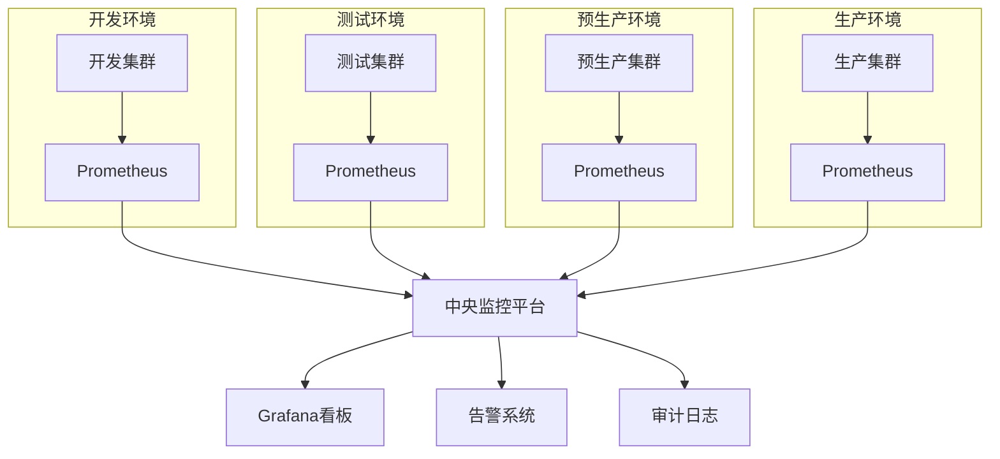

<!-- markdownlint-disable MD025 -->

<a id="第4章-大数据测试环境搭建基础【环境与运维篇】"></a>

### 第4章 大数据测试环境搭建基础【环境与运维篇】

**本章学习目标**

1. 画出你们团队的测试环境拓扑并指出主要风险点；
2. 写出一份适合你们项目的环境容量规划与搭建清单；
3. 设计一个简单可执行的环境变更与回滚流程。

**实践建议**

- 为关键作业设定 SLI/SLO（延迟、吞吐、成本/作业），并用基线用例持续回归。
- 大规模作业在准生产环境做"放量+故障注入+扩缩容"组合测试，记录瓶颈与降级路径。
- 记录环境配置/镜像/数据批次/凭据的变更历史与审批，便于追溯与回滚。

**案例1：电商平台测试环境架构优化**
- **业务场景**：双11大促前测试环境容量不足，影响测试效率和质量
- **环境架构**：开发环境(1/10规模)+测试环境(1/3规模)+预生产环境(1/1镜像)+生产环境
- **容量规划**：基于历史峰值数据，测试环境CPU 200核、内存2TB、存储50TB
- **测试挑战**：环境隔离不彻底导致数据串扰，多租户资源竞争，变更频繁影响稳定性

**案例2：金融风控系统环境高可用保障**
- **业务场景**：金融级测试环境要求99.9%可用性，支持7x24小时测试
- **环境架构**：多AZ部署，Kubernetes集群，自动扩缩容，异地灾备
- **容量规划**：核心交易链路1:1复制，外围服务1:3缩放，监控指标全面覆盖
- **测试挑战**：合规性要求严格，敏感数据脱敏，审计日志完整性，快速回滚能力

**案例3：物联网数据平台环境弹性伸缩**
- **业务场景**：设备数据量波动大，测试环境需支持弹性扩缩容
- **环境架构**：云原生架构，Serverless计算，自动扩缩容，成本优化
- **容量规划**：基于设备连接数动态调整，峰值支持10万并发，成本控制在预算80%内
- **测试挑战**：连接稳定性测试，数据压缩传输验证，告警时效性，资源利用率优化

**案例4：内容分发网络测试环境多租户管理**
- **业务场景**：多业务线共享测试环境，需严格隔离和资源控制
- **环境架构**：多租户Kubernetes，命名空间隔离，配额管理，成本分摊
- **容量规划**：各租户独立配额，共享资源池，动态调度，成本透明化
- **测试挑战**：租户间干扰最小化，资源公平分配，权限精细控制，审计合规

**测试环境架构对比表**

| 场景 | 环境类型 | 容量规划 | 关键挑战 | IaC工具 | 监控重点 |
|---|---|---|---|---|---|
| 电商大促 | 多环境隔离 | 基于峰值缩放 | 数据串扰、稳定性 | Terraform | 资源利用、响应时间 |
| 金融风控 | 高可用多AZ | 1:1核心链路 | 合规性、审计 | CloudFormation | SLA达成、数据一致性 |
| 物联网平台 | 云原生弹性 | 动态扩缩容 | 连接稳定性 | Kubernetes | 并发处理、成本控制 |
| 内容分发 | 多租户隔离 | 配额管理 | 资源公平性 | Ansible | 租户隔离、权限控制 |

**YAML 配置示例**:
```yaml
test_environments:
  ecommerce_platform:
    environment_types: ["dev", "test", "staging", "prod"]
    capacity_planning:
      scale_factors: {"dev": 0.1, "test": 0.3, "staging": 1.0}
      resources:
        cpu_cores: 200
        memory_gb: 2048
        storage_tb: 50
    challenges: ["data_contamination", "resource_competition", "change_frequency"]
    iac_tools: ["Terraform", "Ansible"]
  financial_risk:
    high_availability: true
    multi_az: true
    compliance_level: "financial_grade"
    monitoring:
      availability_sla: 0.999
      audit_retention_days: 2555
    disaster_recovery: "cross_region"
```

#### 4.1 测试环境类型与特点（开发/测试/预生产/生产镜像）

##### 4.1.2 环境隔离与切换

- 物理或逻辑隔离（网络/VPC/命名空间/租户/队列），防止数据串扰与权限越界。
- 支持一键切换配置、数据源、凭据和访问权限；敏感数据默认脱敏与最小权限。
- 预设回滚与快照，环境可快速复原；记录环境基线（版本、配置、镜像、数据批次）。

> 实践建议  
> 
> 
> - 为关键作业设定 SLI/SLO（延迟、吞吐、成本/作业），并用基线用例持续回归。
> - 大规模作业在准生产环境做“放量+故障注入+扩缩容”组合测试，记录瓶颈与降级路径。
> - 记录环境配置/镜像/数据批次/凭据的变更历史与审批，便于追溯与回滚。

---

#### 4.2 测试环境需求分析与容量规划

##### 4.2.2 容量规划方法

> **[锚点022]** Python容量规划计算示例  
> **锚点类型**: 建议  
> **锚点方法**: 脚本示例  
> **补充建议**: 【目标】提供容量规划的Python计算示例。建议步骤：1. 输出基于生产消耗的缩放计算脚本。2. 包含CPU、内存、存储等资源评估。详见主书稿。  
> **引用附件**: examples/04_env/env_health_check.py  
> **状态**: 已完成  
> **版本**: v1.0  
> **时间戳**: 2025-12-23  

```python
# 容量规划计算示例：基于生产消耗的缩放
def calculate_test_capacity(prod_cpu, prod_mem_gb, prod_storage_tb, scale_factor=0.1):
    """
    计算测试环境容量
    :param prod_cpu: 生产CPU核心数
    :param prod_mem_gb: 生产内存GB
    :param prod_storage_tb: 生产存储TB
    :param scale_factor: 缩放因子 (e.g., 0.1 for 1/10 scale)
    :return: 测试环境推荐容量
    """
    test_cpu = max(4, int(prod_cpu * scale_factor))  # 最小4核心
    test_mem_gb = max(16, prod_mem_gb * scale_factor)  # 最小16GB
    test_storage_tb = max(1, prod_storage_tb * scale_factor)  # 最小1TB
    
    # 预留冗余 (20%)
    redundancy = 1.2
    test_cpu = int(test_cpu * redundancy)
    test_mem_gb = test_mem_gb * redundancy
    test_storage_tb = test_storage_tb * redundancy
    
    return {
        'cpu_cores': test_cpu,
        'memory_gb': round(test_mem_gb, 1),
        'storage_tb': round(test_storage_tb, 1)
    }

# 示例使用
prod_resources = {'cpu': 100, 'mem': 500, 'storage': 50}  # 生产环境
test_resources = calculate_test_capacity(**prod_resources)
print(f"测试环境推荐容量: {test_resources}")
# 输出: {'cpu_cores': 12, 'memory_gb': 120.0, 'storage_tb': 12.0}
```

> **环境复杂度评估公式**  
> 为了量化环境管理的复杂度，可使用以下简单公式：  
> $$ \text{复杂度评分} = \frac{\text{环境数量} \times \text{组件数}}{\text{隔离级别}} $$  
> 示例：若有4个环境、20个组件、隔离级别为3（高隔离），则评分 ≈ 26.7（越高越复杂，需加强变更控制）。此公式帮助从测试视角评估环境管理风险。

参考生产消耗按比例缩放（1/10、1/3 或基于关键链路的等比缩放），对压测/回放链路适当放大。
- 预留高峰与突发冗余，关注 CPU/内存/IO/网络/队列/连接池上限。
- 评估存储/计算/网络瓶颈，规划分区分桶、冷热分层、缓存与限流策略。
- 为关键作业设定性能与成本双基线，建立容量告警与扩缩容阈值。

##### 4.2.3 典型容量规划清单

- 计算节点/实例规格与数量（CPU/内存/磁盘/IOPS）
- 存储容量（HDFS/对象存储/数据库），分区/冷热/压缩策略
- 网络带宽、延迟、跨区/跨云链路与出口成本
- 组件服务实例数、高可用/主备/多 AZ，连接池/队列/Topic/并发限制
- 监控/日志/追踪与审计存储预算，成本配额与标签

> 实践建议  

>

> - 搭建前与业务/开发/运维/安全对齐容量、预算与扩容策略，形成书面清单与审批记录。
> - 定期复盘资源与账单，调整配额/限流/调度权重，避免测试环境“吃掉”生产资源。

---

#### 4.3 测试环境搭建流程与常用工具

##### 4.3.2 常用工具与平台

> **[锚点023]** 大数据测试环境常用工具对比表  
> **锚点类型**: 建议  
> **锚点方法**: 对比表  
> **补充建议**: 【目标】梳理大数据测试环境常用工具对比。建议步骤：1. 输出自动化部署、监控、IaC等工具对比。2. 用表格结构总结优缺点与适用场景。详见主书稿。  
> **引用附件**: examples/04_env/env_health_check.py  
> **状态**: 已完成  
> **版本**: v1.0  
> **时间戳**: 2025-12-23  

| 工具类别 | 工具名称 | 优点 | 缺点 | 适用场景 |
|----------|----------|------|------|----------|
| IaC | Terraform | 跨云支持、状态管理、模块化 | 学习曲线陡峭、HCL语法 | 多云环境、复杂基础设施 |
| IaC | Ansible | 简单易用、Agentless、丰富模块 | 大规模时性能较慢 | 快速部署、配置管理 |
| 监控 | Prometheus | 时间序列数据库、强大查询、集成Grafana | 存储扩展复杂 | 指标监控、告警 |
| 监控 | Zabbix | 企业级、多种监控方式 | 配置复杂、界面较旧 | 传统企业环境 |
| 部署 | CloudFormation | AWS原生、集成服务 | AWS限定 | AWS云环境 |
| 部署 | Cloudera Manager | 大数据栈优化、一键安装 | 商业化、成本高 | Hadoop/Spark集群 |

**自动化部署工具**：Ansible、Terraform、CloudFormation、SaltStack（IaC 优先）
- **大数据平台安装器**：Ambari、Cloudera Manager、KubeOperator、云厂商一键部署服务
- **环境即代码（IaC）**：用脚本/配置文件描述环境与参数，支持幂等、审计、回滚
- **监控/告警/审计**：Prometheus、Grafana、Zabbix、云平台监控；日志/追踪/审计中心
**自动化部署工具**：Ansible、Terraform、CloudFormation、SaltStack（IaC 优先）
- **大数据平台安装器**：Ambari、Cloudera Manager、KubeOperator、云厂商一键部署服务
- **环境即代码（IaC）**：用脚本/配置文件描述环境与参数，支持幂等、审计、回滚
- **监控/告警/审计**：Prometheus、Grafana、Zabbix、云平台监控；日志/追踪/审计中心
- **成本与配额**：云成本看板、配额守护、标签计费工具

**Ansible Playbook 示例 - 环境部署自动化**:
```yaml
---
# 大数据测试环境自动化部署
- name: Deploy Big Data Test Environment
  hosts: test_cluster
  become: yes
  vars:
    cluster_name: "test-bigdata-cluster"
    hadoop_version: "3.3.4"
    spark_version: "3.3.0"
    
  tasks:
    - name: Install Java
      apt:
        name: openjdk-8-jdk
        state: present
        
    - name: Create Hadoop user
      user:
        name: hadoop
        system: yes
        shell: /bin/bash
        
    - name: Download Hadoop
      get_url:
        url: "https://downloads.apache.org/hadoop/common/hadoop-{{ hadoop_version }}/hadoop-{{ hadoop_version }}.tar.gz"
        dest: "/tmp/hadoop-{{ hadoop_version }}.tar.gz"
        
    - name: Extract Hadoop
      unarchive:
        src: "/tmp/hadoop-{{ hadoop_version }}.tar.gz"
        dest: "/opt"
        remote_src: yes
        
    - name: Configure Hadoop environment
      template:
        src: hadoop-env.sh.j2
        dest: "/opt/hadoop-{{ hadoop_version }}/etc/hadoop/hadoop-env.sh"
        
    - name: Configure core-site.xml
      template:
        src: core-site.xml.j2
        dest: "/opt/hadoop-{{ hadoop_version }}/etc/hadoop/core-site.xml"
        
    - name: Start Hadoop services
      systemd:
        name: "{{ item }}"
        state: started
        enabled: yes
      loop:
        - hadoop-namenode
        - hadoop-datanode
```

**Terraform 配置示例 - 云环境基础设施**:
```hcl
# 大数据测试环境基础设施即代码
terraform {
  required_providers {
    aws = {
      source  = "hashicorp/aws"
      version = "~> 4.0"
    }
  }
}

# VPC 配置
resource "aws_vpc" "test_vpc" {
  cidr_block = "10.0.0.0/16"
  
  tags = {
    Name        = "bigdata-test-vpc"
    Environment = "test"
    Project     = "bigdata-testing"
  }
}

# 子网配置
resource "aws_subnet" "test_subnet" {
  vpc_id     = aws_vpc.test_vpc.id
  cidr_block = "10.0.1.0/24"
  availability_zone = "us-east-1a"
  
  tags = {
    Name = "bigdata-test-subnet"
  }
}

# 安全组
resource "aws_security_group" "test_sg" {
  name   = "bigdata-test-sg"
  vpc_id = aws_vpc.test_vpc.id
  
  ingress {
    from_port   = 22
    to_port     = 22
    protocol    = "tcp"
    cidr_blocks = ["10.0.0.0/16"]
    description = "SSH access"
  }
  
  ingress {
    from_port   = 8080
    to_port     = 8080
    protocol    = "tcp"
    cidr_blocks = ["10.0.0.0/16"]
    description = "Spark UI"
  }
  
  egress {
    from_port   = 0
    to_port     = 0
    protocol    = "-1"
    cidr_blocks = ["0.0.0.0/0"]
  }
}

# EC2 实例 - 主节点
resource "aws_instance" "master_node" {
  ami           = "ami-0abcdef1234567890" # Amazon Linux 2
  instance_type = "m5.xlarge"
  subnet_id     = aws_subnet.test_subnet.id
  vpc_security_group_ids = [aws_security_group.test_sg.id]
  
  root_block_device {
    volume_size = 100
    volume_type = "gp3"
  }
  
  tags = {
    Name        = "bigdata-test-master"
    Environment = "test"
    Role        = "master"
  }
}
```

**Shell 脚本示例 - 环境健康检查**:
```bash
#!/bin/bash
# 大数据测试环境健康检查脚本

# 配置
CLUSTER_NODES=("master-node" "worker-node-01" "worker-node-02")
LOG_FILE="/var/log/env_health_check.log"

# 颜色输出
RED='\033[0;31m'
GREEN='\033[0;32m'
NC='\033[0m' # No Color

log() {
    echo "$(date '+%Y-%m-%d %H:%M:%S') - $1" | tee -a "$LOG_FILE"
}

check_service() {
    local service=$1
    local port=$2
    local node=$3
    
    if nc -z -w5 "$node" "$port" 2>/dev/null; then
        echo -e "${GREEN}✓${NC} $service on $node:$port is running"
        return 0
    else
        echo -e "${RED}✗${NC} $service on $node:$port is not accessible"
        return 1
    fi
}

check_hadoop_services() {
    log "Checking Hadoop services..."
    
    # 检查 NameNode
    check_service "NameNode" 9870 "master-node"
    
    # 检查 DataNodes
    for node in "${CLUSTER_NODES[@]}"; do
        if [[ "$node" != "master-node" ]]; then
            check_service "DataNode" 9864 "$node"
        fi
    done
}

main() {
    log "Starting environment health check..."
    
    local failed_checks=0
    
    # 检查 Hadoop 服务
    if ! check_hadoop_services; then
        ((failed_checks++))
    fi
    
    # 总结
    if [ "$failed_checks" -eq 0 ]; then
        log "All health checks passed!"
        exit 0
    else
        log "Found $failed_checks failed checks"
        exit 1
    fi
}

main "$@"
```

> 实践建议  

>

> - 优先采用自动化部署和 IaC，减少手工与配置漂移；所有参数与密钥纳入管控。
> - 搭建后务必做健康检查、对账/回放、性能与成本基线测试，生成报告存档。

---

#### 4.4 多集群、多租户环境管理

##### 4.4.2 多租户管理

> **[锚点024]** 环境监控关键指标表  
> **锚点类型**: 建议  
> **锚点方法**: 关键指标表  
> **补充建议**: 【目标】梳理环境监控关键指标。建议步骤：1. 输出CPU、内存、网络等关键指标。2. 用表格结构总结阈值与采集方式。详见主书稿。  
> **引用附件**: examples/04_env/env_health_check.py  
> **状态**: 已完成  
> **版本**: v1.0  
> **时间戳**: 2025-12-23  

| 指标类别 | 具体指标 | 阈值建议 | 采集方式 | 告警级别 |
|----------|----------|----------|----------|----------|
| CPU | 使用率 | >80% | Prometheus/Node Exporter | 高 |
| 内存 | 使用率 | >85% | 系统监控 | 高 |
| 磁盘 | IOPS/使用率 | >90% | 系统监控 | 中 |
| 网络 | 带宽/延迟 | >70%/ >100ms | 网络监控 | 中 |
| 队列 | 积压消息数 | >1000 | Kafka监控 | 高 |
| 连接池 | 活跃连接 | >80% | 应用监控 | 中 |
| 存储 | 容量使用率 | >85% | HDFS/S3监控 | 高 |
| 成本 | 小时费用 | 超预算20% | 云计费API | 中 |

- 同集群内通过命名空间/队列/资源池实现多租户隔离；限制跨租户访问。
- 支持租户级配额、权限、监控/告警、成本与审计；敏感数据默认最小权限与脱敏。

##### 4.4.3 管理策略

> **[锚点025]** 多环境多集群监控架构图  
> **锚点类型**: 建议  
> **锚点方法**: 架构图  
> **补充建议**: 【目标】绘制多环境多集群监控架构图。建议步骤：1. 标注关键组件与监控链路。2. 说明架构设计思路与跨集群管理。详见主书稿。  
> **引用附件**: examples/04_env/env_health_check.py  
> **状态**: 已完成  
> **版本**: v1.0  
> **时间戳**: 2025-12-23  



- 制定集群/租户命名规范、资源/配额/优先级策略，统一标签与计费。
- 配置租户级访问控制、审计、监控/告警、成本看板；异常占用自动告警。
- 定期评估资源利用与成本，动态调整或迁移；保留演练与回退脚本。

> 实践建议  

>

> - 大型组织可采用多集群+多租户混合模式，关键链路独立集群，低风险场景共用集群。
> - 建立统一管理平台：集中监控/告警/审计/成本/容量，支持跨集群回放与演练。

---

#### 4.5 测试环境维护与变更控制

##### 4.5.2 变更控制流程

> **[锚点026]** 恢复路径与回退策略对比表  
> **锚点类型**: 建议  
> **锚点方法**: 对比表  
> **补充建议**: 【目标】梳理恢复路径与回退策略对比。建议步骤：1. 输出快照、脚本、灰度等策略对比。2. 用表格结构总结优缺点与适用场景。详见主书稿。  
> **引用附件**: examples/04_env/env_health_check.py  
> **状态**: 已完成  
> **版本**: v1.0  
> **时间戳**: 2025-12-23  

| 策略 | 优点 | 缺点 | 适用场景 | 恢复时间 |
|------|------|------|----------|----------|
| 快照恢复 | 快速、一致性好 | 存储成本高、实时性差 | 定期备份、灾难恢复 | 分钟级 |
| 脚本回滚 | 自动化、可定制 | 依赖脚本准确性 | 配置变更、小规模更新 | 秒到分钟 |
| 灰度回滚 | 低风险、逐步验证 | 复杂、时间长 | 高风险变更、核心服务 | 分钟到小时 |
| 影子环境 | 无生产影响、充分测试 | 资源消耗大 | 重大升级、架构变更 | 小时级 |
| 蓝绿部署 | 零停机、快速切换 | 双倍资源成本 | 应用部署、服务升级 | 秒级 |

- 变更申请与评审：列出影响范围、回滚方案、验证清单（功能/性能/成本/安全/合规）。
- 变更实施与回滚：优先自动化脚本，支持一键回滚与灰度/影子验证。
- 变更记录与审计：内容/时间/责任人/审批/验证结果留痕，关联告警与事故复盘。

##### 4.5.3 常见维护难点与建议

- 避免“测试环境变成生产环境”，定期清理无用数据/账号/密钥/权限。
- 高风险操作（大规模清理、权限变更、跨区复制、重大升级）需多级审批、影子/灰度验证、自动化回滚与告警。
- 建立环境基线、快照与演练计划，定期恢复演练；记录恢复耗时与成功率。

> 实践建议  

>

> - 将维护与变更流程文档化、自动化、审计化，减少人为失误。
> - 定期组织巡检与应急/恢复演练，纳入 KPI；输出报告与改进清单。

---

#### 4.6 本章小结

- 大数据测试环境需覆盖开发、测试、预生产、生产镜像等多种类型，按需隔离和配置。
- 容量规划需结合业务场景、数据量、并发和组件服务，动态调整资源。
- 环境搭建推荐自动化部署和环境即代码，提升效率和一致性。
- 多集群、多租户管理有助于资源隔离和权限控制，适合大型组织。
- 环境维护与变更控制需流程化、自动化，保障环境安全与可用性。

> **前瞻展望**  
> 本章奠定了测试环境的基础，下一章将聚焦数据管理，确保测试数据的质量与合规。

**扩展阅读**:

**学术论文与研究报告**:
- **"Infrastructure as Code: A Systematic Literature Review" (IEEE, 2022)** - IaC技术的系统性文献综述，探讨自动化部署的最佳实践
- **"DevOps and Infrastructure as Code: A Systematic Mapping Study" (Information and Software Technology, 2021)** - DevOps与IaC的系统映射研究
- **"Multi-Tenant Cloud Computing: Issues and Solutions" (IEEE Cloud Computing, 2018)** - 多租户云计算的关键问题与解决方案

**经典书籍推荐**:
- **《Infrastructure as Code》 (Kief Morris)** - IaC权威指南，涵盖Terraform、CloudFormation等工具的实践应用
- **《Site Reliability Engineering》 (Google SRE Team)** - Google SRE团队撰写，基础设施可靠性和自动化运维的经典之作
- **《The Phoenix Project》 (Gene Kim, Kevin Behr, George Spafford)** - DevOps转型小说，深刻阐释基础设施管理和变更控制的重要性

**行业标准与规范**:
- **ISO/IEC 27001:2022 - Information Security Management** - 信息安全管理体系标准，适用于测试环境安全管理
- **NIST SP 800-53 - Security and Privacy Controls** - 安全与隐私控制标准框架
- **ITIL 4 - Service Management** - IT服务管理标准，涵盖变更管理和问题管理

**云服务指南**:
- **AWS Well-Architected Framework: Operational Excellence** - Amazon运维卓越框架
- **Azure Cloud Adoption Framework** - Microsoft云采用框架，包含基础设施管理最佳实践
- **Google Cloud Infrastructure Best Practices** - Google Cloud基础设施最佳实践指南

**在线资源与工具文档**:
- [Terraform官方文档](https://www.terraform.io/docs/) - HashiCorp Terraform IaC工具官方文档
- [Ansible文档](https://docs.ansible.com/) - Red Hat Ansible自动化部署工具文档
- [Prometheus文档](https://prometheus.io/docs/) - CNCF Prometheus监控系统文档
- [Kubernetes多租户指南](https://kubernetes.io/docs/concepts/security/multi-tenancy/) - Kubernetes多租户架构和安全指南
- [AWS CloudFormation用户指南](https://docs.aws.amazon.com/AWSCloudFormation/latest/UserGuide/) - AWS基础设施即代码服务文档

**相关章节复习**:
- **第3章**：大数据技术生态与架构基础 - 复习技术栈选择和架构设计原则
- **第5章**：大数据测试数据管理基础 - 深入了解测试数据管理和质量保障

> 动手思考
> 1. 画出你们团队的测试环境架构图，标注各环境类型及其主要用途。
> 2. 结合你们的业务，列出测试环境容量规划的 3 个关键指标。
> 3. 针对一次环境变更（如组件升级），写出你会关注的 2 个风险点和应对措施。
> 4. 设计一个多租户测试环境的资源分配和监控方案。
> 5. 制定测试环境变更控制流程，包括审批、实施、验证和回滚步骤。
> **预计用时：60-75分钟**

> **知识点练习**
> 1. 解释测试环境类型（开发/测试/预生产/生产镜像）的区别和适用场景。
> 2. 如何进行容量规划？基于生产环境的缩放因子如何确定？
> 3. IaC（Infrastructure as Code）的核心优势是什么？Terraform和Ansible的适用场景有何差异？
> 4. 多租户环境管理中，如何实现资源隔离和成本分摊？
> 5. 环境变更控制的关键步骤有哪些？常见的回滚策略有哪些？
> 6. 如何监控测试环境的健康状态？关键指标包括哪些方面？

> 示例参考：

>

> - 环境健康检查脚本示例：`examples/04_env/env_health_check.py`
> - 最小化 IaC 片段（选读）：`examples/04_env/env_minimal.tf`

> **章节自评清单**
> - [ ] 我能识别不同测试环境类型的特点和隔离要求。
> - [ ] 我理解容量规划的关键指标和计算方法。
> - [ ] 我熟悉测试环境搭建的常用工具和IaC实践。
> - [ ] 我能设计多集群、多租户的环境管理策略。
> - [ ] 我掌握环境变更控制和回滚策略的流程。
> - [ ] 我能制定测试环境监控和告警策略。
> - [ ] 我理解环境复杂度评估和风险控制方法。
> - [ ] 我能设计环境健康检查和自动化维护流程。
> - [ ] 我熟悉云原生环境的特点和运维挑战。
> - [ ] 我能制定环境成本控制和资源优化方案。

> **本章关键字总结**  
> 测试环境、容量规划、IaC、多租户、变更控制、监控指标、回滚策略。

<a id="第5章-大数据测试数据管理基础数据管理篇"></a>
