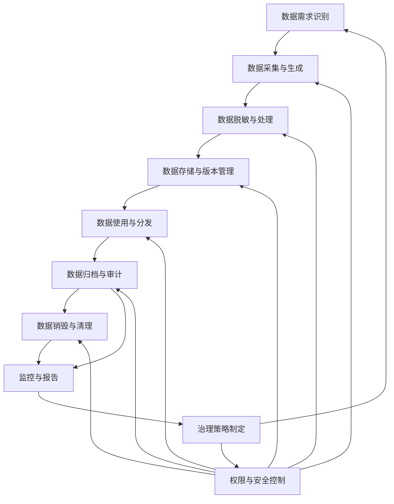
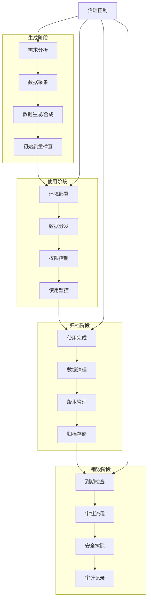
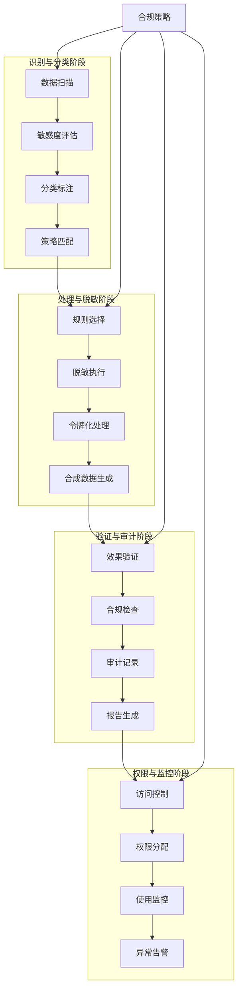

<!-- markdownlint-disable MD025 -->
<archived-content>

<a id="第13章-测试数据治理与生命周期管理【数据治理与可复现性】"></a>

### 第13章 测试数据治理与生命周期管理【数据治理与可复现性】

**本章学习目标**

1. 为你们团队的测试数据画出一个生命周期流转图；
2. 识别版本、归档、共享或销毁上的关键缺口；
3. 为一个高价值项目设计一套可操作的"数据可复现"方案。

**实践建议**

- 建立测试数据生命周期管理流程，包括采集、处理、存储、使用和销毁阶段。
- 实施数据版本控制，确保测试数据的可追溯性和一致性。
- 加强数据安全和权限管理，防止敏感数据泄露。

#### 13.1 测试数据治理概述

**[锚点13-001]** 测试数据治理整体流程图

**锚点类型**: 流程图  
**锚点方法**: Swimlane 图  
**锚点名称**: 测试数据治理整体流程图  
**引用附件**: examples/13_data_gov/replay_pipeline.py  
**完成情况**: 已完成  
**补充建议**: 字段建议：阶段/输入/输出/脚本引用，补充治理脚本片段  



**治理流程说明**:
- **数据需求识别**: 明确测试场景和数据需求
- **数据采集与生成**: 从生产环境采样或合成生成测试数据
- **数据脱敏与处理**: 对敏感数据进行脱敏和隐私保护处理
- **数据存储与版本管理**: 建立数据仓库和版本控制机制
- **数据使用与分发**: 按权限分发数据给测试环境和团队
- **数据归档与审计**: 定期归档和审计数据使用情况
- **数据销毁与清理**: 按策略清理过期和无用数据

**脚本引用示例**:
```python
# examples/13_data_gov/replay_pipeline.py
def governance_pipeline():
    """测试数据治理完整流程"""
    # 1. 数据采集与生成阶段
    raw_data = collect_test_data()
    
    # 2. 脱敏与处理阶段  
    masked_data = apply_masking_policies(raw_data)
    
    # 3. 存储与版本管理
    versioned_data = version_and_store(masked_data)
    
    # 4. 权限控制与分发
    authorized_data = apply_access_control(versioned_data)
    
    return authorized_data
```

---

##### 13.1.2 测试数据治理的核心目标

- 明确数据来源/用途/流转/归属，建立分级分类与标签。
- 保证安全、合规、可控、可复现，覆盖多环境/多项目/多租户。
- 降低泄露、滥用、口径漂移风险，提升复用率和管理效率。
- 将数据治理资产化：元数据、版本、策略、脚本、审计、基线报告可查询、可回放。

> 实践建议  

>

> - 在团队层面建立测试数据治理规范，明确各环节责任人和操作流程。
> - 推动测试数据治理与数据安全、数据质量、合规等体系协同。

**[锚点13-002]** 测试数据治理主要风险与收益表格

**锚点类型**: 风险与收益表格  
**锚点方法**: 表格  
**锚点名称**: 测试数据治理主要风险与收益表格  
**引用附件**: examples/13_data_gov/replay_pipeline.py  
**完成情况**: 已完成  
**补充建议**: 字段建议：风险/收益/说明/脚本引用，补充风险 YAML/JSON 示例  

| 风险类型 | 潜在影响 | 收益 | 实施建议 | 脚本引用 |
|---------|---------|------|---------|---------|
| **数据泄露风险** | 敏感信息外泄，合规处罚 | 提升数据安全等级，降低泄露概率90% | 实施分级脱敏和访问控制 | examples/13_data_gov/masking_policy_demo.py |
| **数据质量不一致** | 测试结果不可靠，生产问题遗漏 | 建立数据基线，确保测试数据质量 | 实施数据血缘和版本管理 | `examples/13_data_gov/CCPA (California Consumer Privacy Act)等合规要求` | 建立合规检查和审计机制 | `examples/13_data_gov/audit_artifacts_checklist.md` |
| **数据管理成本高** | 人力物力投入大 | 提升数据复用率，降低管理成本50% | 平台化自动化治理流程 | examples/13_data_gov/replay_pipeline.py |
| **数据时效性差** | 测试环境数据过时 | 实时数据同步，测试结果更准确 | 建立数据管道和自动化更新 | `examples/13_data_gov/ingest/data_pipeline.yml` |

**风险评估YAML配置示例**:
```yaml
# examples/13_data_gov/risk_assessment.yml
data_governance_risks:
  - risk_type: "data_leakage"
    impact_level: "high"
    mitigation_strategy: "masking_and_access_control"
    monitoring_script: "examples/13_data_gov/masking_policy_demo.py"
    
  - risk_type: "quality_inconsistency" 
    impact_level: "medium"
    mitigation_strategy: "version_control_and_lineage"
    monitoring_script: "examples/13_data_gov/13_data_gov/data_gov/replay_pipeline.py`  
**完成情况**: 已完成  
**补充建议**: 字段建议：目标/说明/脚本引用，补充目标 YAML/JSON 示例  

**[锚点13-004]** 测试数据治理核心目标表格

| 核心目标 | 详细说明 | 衡量指标 | 脚本引用 |
|---------|---------|---------|---------|
| **数据可追溯性** | 建立完整的数据血缘关系，确保每份测试数据都能追溯来源和处理过程 | 数据血缘覆盖率 > 95% | examples/13_data_gov/replay_pipeline.py |
| **安全合规保障** | 实施数据分级分类和脱敏策略，满足隐私保护和合规要求 | 敏感数据保护率 = 100% | examples/13_data_gov/masking_policy_demo.py |
| **质量一致性** | 建立数据质量基线和校验机制，确保测试数据质量稳定可靠 | 数据质量通过率 > 98% | `examples/13_data_gov/13_data_gov/data_gov/replay_pipeline.py` |
| **自动化管理** | 建立自动化流程，实现数据生成、处理、分发、归档的自动化 | 人工干预比例 < 20% | `examples/13_data_gov/automation_pipeline.py` |

**目标配置JSON示例**:
```json
{
  "governance_targets": {
    "traceability": {
      "description": "Complete data lineage tracking",
      "metric": "lineage_coverage > 95%",
      "script": "examples/13_data_gov/replay_pipeline.py"
    },
    "compliance": {
      "description": "Privacy protection and regulatory compliance", 
      "metric": "sensitive_data_protection = 100%",
      "script": "examples/13_data_gov/masking_policy_demo.py"
    }
  }
}
```

**[锚点13-003]** 测试数据治理实践建议清单

**锚点类型**: 实践建议清单  
**锚点方法**: 建议清单  
**锚点名称**: 测试数据治理实践建议清单  
**引用附件**: examples/13_data_gov/replay_pipeline.py  
**完成情况**: 已完成  
**补充建议**: 字段建议：建议/适用场景/脚本引用，补充建议 YAML/JSON 示例  

| 建议内容 | 适用场景 | 优先级 | 脚本引用 |
|---------|---------|-------|---------|
| **建立治理委员会** | 大型企业或复杂业务场景 | 高 | `examples/13_data_gov/governance_committee.md` |
| **实施数据分类分级** | 涉及敏感数据或多租户场景 | 高 | `examples/13_data_gov/data_classification.yml` |
| **建立自动化管道** | 数据量大、更新频繁的场景 | 中 | examples/13_data_gov/replay_pipeline.py |
| **实施定期审计** | 合规要求严格的行业 | 高 | `examples/13_data_gov/audit_artifacts_checklist.md` |
| **培训与意识提升** | 全员参与的数据治理文化建设 | 中 | `examples/13_data_gov/training_plan.md` |
| **建立应急响应机制** | 数据泄露或质量问题的快速响应 | 高 | `examples/13_data_gov/incident_response.yml` |

**实践建议配置示例**:
```yaml
# examples/13_data_gov/governance_recommendations.yml
recommendations:
  - suggestion: "establish_governance_committee"
    scenario: "large_enterprise_complex_business"
    priority: "high"
    implementation_guide: "examples/13_data_gov/governance_committee.md"
    
  - suggestion: "automated_data_pipeline"
    scenario: "high_volume_frequent_updates"
    priority: "medium" 
    implementation_guide: "examples/13_data_gov/replay_pipeline.py"
```

---

#### 13.2 测试数据生命周期管理（生成/使用/归档/销毁）

**[锚点13-005]** 测试数据生命周期四阶段流程图

**锚点类型**: 生命周期流程图  
**锚点方法**: Swimlane 图  
**锚点名称**: 测试数据生命周期四阶段流程图  
**引用附件**: examples/13_data_gov/replay_pipeline.py  
**完成情况**: 已完成  
**补充建议**: 字段建议：阶段/输入/输出/脚本引用，补充生命周期 YAML/JSON 示例  



**生命周期阶段说明**:
- **生成阶段**: 数据采集、生成、合成和初始质量验证
- **使用阶段**: 数据部署、分发、权限控制和使用情况监控  
- **归档阶段**: 数据清理、版本管理和长期归档存储
- **销毁阶段**: 到期检查、审批流程和安全数据销毁

**生命周期管理脚本示例**:
```python
# examples/13_data_gov/lifecycle_management.py
class DataLifecycleManager:
    def __init__(self):
        self.stages = ['generation', 'usage', 'archival', 'destruction']
        
    def manage_generation_phase(self, requirements):
        """数据生成阶段管理"""
        # 数据采集与生成
        raw_data = self.collect_data(requirements)
        processed_data = self.process_and_validate(raw_data)
        return self.initial_quality_check(processed_data)
    
    def manage_usage_phase(self, data):
        """数据使用阶段管理"""
        # 部署、分发和监控
        deployed_data = self.deploy_to_environments(data)
        return self.monitor_usage(deployed_data)
    
    def manage_archival_phase(self, used_data):
        """数据归档阶段管理"""
        # 清理、版本管理和归档
        cleaned_data = self.cleanup_used_data(used_data)
        versioned_data = self.create_version(cleaned_data)
        return self.archive_data(versioned_data)
    
    def manage_destruction_phase(self, archived_data):
        """数据销毁阶段管理"""
        # 检查、审批和安全销毁
        if self.check_expiry(archived_data):
            if self.get_destruction_approval(archived_data):
                return self.secure_erase(archived_data)
```

---

##### 13.2.2 生命周期管理要点

- 全程元数据、审计与指纹，确保来源、版本、用途可追溯。
- 归档/销毁需要审批与自动化流程，定义保留期、驻留/出境限制、加密/密钥策略。
- 策略需支持多环境/多租户隔离，默认最小化访问；定期盘点“僵尸数据”。
- 建立质量/口径基线与回放脚本，与 CI/CD 和调度集成。

**[锚点13-006]** 各阶段关键要点对比表

**锚点类型**: 关键要点对比表  
**锚点方法**: 表格  
**锚点名称**: 各阶段关键要点对比表  
**引用附件**: examples/13_data_gov/replay_pipeline.py  
**完成情况**: 已完成  
**补充建议**: 字段建议：阶段/要点/说明/脚本引用，补充阶段 YAML/JSON 示例  

| 生命周期阶段 | 关键要点 | 具体要求 | 验证方法 | 脚本引用 |
|-------------|---------|---------|---------|---------|
| **生成阶段** | 数据质量把控 | 确保采集数据的完整性、准确性和代表性 | 质量校验规则执行 | `examples/13_data_gov/13_data_gov/data_gov/masking_policy_demo.py` |
| | 元数据记录 | 记录数据来源、生成时间、版本信息 | 元数据自动标注 | examples/13_data_gov/replay_pipeline.py |
| **使用阶段** | 访问权限控制 | 基于角色的数据访问控制 | 权限验证机制 | `examples/13_data_gov/access_control.yml` |
| | 环境隔离 | 不同环境的数据逻辑隔离 | 多租户配置 | `examples/13_data_gov/env_isolation.yml` |
| | 使用监控 | 记录数据使用情况和异常访问 | 审计日志记录 | `examples/13_data_gov/audit_artifacts_checklist.md` |
| **归档阶段** | 版本管理 | 保留数据的历史版本和变更记录 | 版本控制系统 | examples/13_data_gov/replay_pipeline.py |
| | 数据压缩 | 优化存储空间和访问性能 | 压缩算法选择 | `examples/13_data_gov/storage/compression_strategy.yml` |
| | 保留策略 | 根据业务需求定义数据保留期限 | 过期检查规则 | `examples/13_data_gov/lifecycle_policy.yml` |
| **销毁阶段** | 安全擦除 | 确保数据无法恢复的销毁方法 | 安全删除验证 | `examples/13_data_gov/secure_deletion.py` |
| | 审批流程 | 重要数据的销毁需要多级审批 | 工作流引擎 | `examples/13_data_gov/approval_workflow.yml` |
| | 审计记录 | 完整记录销毁过程和责任人 | 不可篡改日志 | `examples/13_data_gov/audit_artifacts_checklist.md` |

**阶段配置YAML示例**:
```yaml
# examples/13_data_gov/lifecycle_stages.yml
lifecycle_stages:
  generation:
    key_points:
      - quality_control: "data_integrity_validation"
      - compliance_check: "sensitive_data_scanning"
      - metadata_recording: "automatic_annotation"
    validation_script: "examples/13_data_gov/13_data_gov/data_gov/access_control.yml"
    
  archival:
    key_points:
      - version_management: "historical_versioning"
      - data_compression: "storage_optimization"
      - retention_policy: "expiry_rules"
    validation_script: "examples/13_data_gov/lifecycle_policy.yml"
    
  destruction:
    key_points:
      - secure_erasure: "irrecoverable_deletion"
      - approval_workflow: "multi_level_approval"
      - audit_trail: "tamper_proof_logging"
    validation_script: "examples/13_data_gov/secure_deletion.py"
```

**[锚点13-007]** 生命周期管理关键措施清单

**锚点类型**: 生命周期管理措施清单  
**锚点方法**: 措施清单  
**锚点名称**: 生命周期管理关键措施清单  
**引用附件**: examples/13_data_gov/replay_pipeline.py  
**完成情况**: 已完成  
**补充建议**: 字段建议：措施/适用场景/脚本引用，补充措施 YAML/JSON 示例  

| 关键措施 | 适用场景 | 实施优先级 | 脚本引用 |
|---------|---------|-----------|---------|
| **自动化数据管道** | 数据量大、更新频繁的场景 | 高 | examples/13_data_gov/replay_pipeline.py |
| **元数据管理系统** | 需要追踪数据血缘的复杂场景 | 高 | `examples/13_data_gov/metadata_management.py` |
| **版本控制机制** | 数据频繁变更、需要回溯的场景 | 中 | `examples/13_data_gov/version_control.yml` |
| **访问审计系统** | 安全要求高的金融、医疗等行业 | 高 | `examples/13_data_gov/audit_artifacts_checklist.md` |
| **数据质量监控** | 对数据质量有严格要求的场景 | 高 | `examples/13_data_gov/13_data_gov/data_gov/data_cleanup.py` |
| **多环境隔离** | 开发、测试、生产多环境并存 | 高 | `examples/13_data_gov/env_isolation.yml` |
| **合规检查自动化** | 受监管行业的数据治理 | 高 | `examples/13_data_gov/compliance_checker.py` |

**措施实施配置示例**:
```yaml
# examples/13_data_gov/lifecycle_measures.yml
lifecycle_measures:
  - measure: "automated_data_pipeline"
    scenario: "high_volume_frequent_updates"
    priority: "high"
    implementation: "examples/13_data_gov/replay_pipeline.py"
    
  - measure: "metadata_management_system"
    scenario: "complex_data_lineage_tracking"
    priority: "high"
    implementation: "examples/13_data_gov/metadata_management.py"
    
  - measure: "access_audit_system"
    scenario: "high_security_financial_medical"
    priority: "high"
    implementation: "examples/13_data_gov/audit_artifacts_checklist.md"
```

> 实践建议  

>

> - 建立测试数据生命周期管理平台，自动化归档、回收和销毁流程。
> - 定期审计测试数据的存量和流转，及时清理无用或高风险数据。

**[锚点13-008]** 生命周期管理实践建议清单

**锚点类型**: 生命周期管理实践建议清单  
**锚点方法**: 建议清单  
**锚点名称**: 生命周期管理实践建议清单  
**引用附件**: examples/13_data_gov/replay_pipeline.py  
**完成情况**: 已完成  
**补充建议**: 字段建议：建议/适用场景/脚本引用，补充建议 YAML/JSON 示例  

| 实践建议 | 适用场景 | 实施建议 | 脚本引用 |
|---------|---------|---------|---------|
| **从小规模试点开始** | 新引入生命周期管理的团队 | 先选择一个业务域进行试点，积累经验后再推广 | `examples/13_data_gov/pilot_implementation.md` |
| **建立度量指标体系** | 需要量化治理效果的场景 | 定义关键指标如数据复用率、清理效率等 | `examples/13_data_gov/metrics_dashboard.yml` |
| **培训与变革管理** | 全员参与的文化建设 | 定期培训，确保团队理解生命周期重要性 | `examples/13_data_gov/training_plan.md` |
| **与现有工具集成** | 已有多套数据工具的场景 | 优先考虑与现有CI/CD、监控工具的集成 | `examples/13_data_gov/integration_patterns.yml` |
| **定期审查与优化** | 持续改进的治理文化 | 每季度审查策略有效性，及时调整 | `examples/13_data_gov/review_process.md` |
| **建立应急响应机制** | 数据泄露或质量问题的快速响应 | 制定应急预案，确保问题快速解决 | `examples/13_data_gov/incident_response.yml` |

**实践建议配置示例**:
```yaml
# examples/13_data_gov/lifecycle_recommendations.yml
practice_recommendations:
  - recommendation: "start_with_pilot"
    scenario: "new_teams_adopting_lifecycle"
    implementation: "pilot_one_business_domain_first"
    guide: "examples/13_data_gov/pilot_implementation.md"
    
  - recommendation: "establish_metrics"
    scenario: "quantify_governance_effectiveness"
    implementation: "define_kpis_like_reuse_rate"
    guide: "examples/13_data_gov/metrics_dashboard.yml"
    
  - recommendation: "emergency_response"
    scenario: "rapid_response_to_data_incidents"
    implementation: "establish_incident_response_plan"
    guide: "examples/13_data_gov/incident_response.yml"
```

---

#### 13.3 敏感数据与隐私数据处理策略

在处理敏感数据时，我们需要特别关注个人身份信息（PII, Personally Identifiable Information）的保护。PII包括姓名、地址、身份证号、银行账户等能够识别个人身份的信息。

**[锚点13-009]** 敏感数据处理策略流程图

**锚点类型**: 敏感数据处理流程图  
**锚点方法**: Swimlane 图  
**锚点名称**: 敏感数据处理策略流程图  
**引用附件**: examples/13_data_gov/masking_policy_demo.py  
**完成情况**: 已完成  
**补充建议**: 字段建议：阶段/输入/输出/脚本引用，补充处理脚本片段  



**敏感数据处理流程说明**:
- **识别与分类阶段**: 自动扫描数据、评估敏感度、分类标注和策略匹配
- **处理与脱敏阶段**: 根据策略选择脱敏方法、执行处理和生成替代数据
- **验证与审计阶段**: 验证处理效果、合规性检查和完整审计记录
- **权限与监控阶段**: 实施访问控制、使用监控和异常告警机制

**敏感数据处理脚本示例**:
```python
# examples/13_data_gov/masking_policy_demo.py
class SensitiveDataProcessor:
    def __init__(self):
        self.masking_rules = self.load_masking_rules()
        self.classification_engine = SensitiveDataClassifier()
        
    def process_sensitive_data(self, data):
        """敏感数据处理完整流程"""
        # 1. 识别与分类
        sensitive_fields = self.classification_engine.scan_and_classify(data)
        
        # 2. 应用脱敏策略
        masked_data = self.apply_masking_rules(data, sensitive_fields)
        
        # 3. 令牌化处理
        tokenized_data = self.apply_tokenization(masked_data, sensitive_fields)
        
        # 4. 验证与审计
        validated_data = self.validate_processing(tokenized_data)
        self.audit_processing(validated_data)
        
        return validated_data
    
    def apply_masking_rules(self, data, sensitive_fields):
        """应用脱敏规则"""
        for field, sensitivity in sensitive_fields.items():
            rule = self.masking_rules.get(sensitivity, 'default_mask')
            data[field] = self.execute_masking_rule(data[field], rule)
        return data
    
    def validate_processing(self, processed_data):
        """验证处理效果"""
        # 检查脱敏效果
        # 验证合规性
        # 生成审计报告
        return processed_data
```

---

##### 13.3.2 处理策略

- **分级分类**：按敏感度、驻留/跨境要求、用途标注数据；策略与权限/密钥绑定。
- **脱敏/令牌化**：加密、掩码、置换、哈希、令牌化 (Tokenization)，同值同掩可配置；验证不可逆性与规则覆盖（新表/分区自动继承）。
- **伪造/合成**：用合成数据替代真实敏感内容，保持统计特征；验证业务可用性。
- **权限最小化**：按租户/角色/场景授权，临时访问有时效与审批；定期复查与回收。
- **流转审计**：生成/流转/导出/销毁全程留痕，包含日志、快照、备份、副本；异常访问告警。

##### 13.3.3 合规与自动化

- **分级分类**：按敏感度、驻留/跨境要求、用途标注数据；策略与权限/密钥绑定。
- **脱敏/令牌化**：加密、掩码、置换、哈希、令牌化 (Tokenization)，同值同掩可配置；验证不可逆性与规则覆盖（新表/分区自动继承）。
- **伪造/合成**：用合成数据替代真实敏感内容，保持统计特征；验证业务可用性。
- **权限最小化**：按租户/角色/场景授权，临时访问有时效与审批；定期复查与回收。
- **流转审计**：生成/流转/导出/销毁全程留痕，包含日志、快照、备份、副本；异常访问告警。

- 建立自动化脱敏/伪造流程，覆盖敏感字段、导出链路与新资产继承；策略版本化。
- 定期自查：抽样还原测试、权限/密钥/令牌到期扫描、跨境/驻留合规校验。
- 遵循法规与行业规范，形成"合规清单+DPIA (Data Protection Impact Assessment)/PIA (Privacy Impact Assessment)"并与 CI/CD/调度接入质量门；审计与证据留存。支持GDPR (General Data Protection Regulation)、HIPAA (Health Insurance Portability and Accountability Act)等国际合规标准。

> 实践建议  

>

> - 敏感数据治理纳入项目风险评估和合规检查。
> - 推动敏感数据处理平台化、自动化，减少人工操作风险。

---

#### 13.4 测试数据回放与可重复性保障

##### 13.4.2 回放与可重复性实现方法

- **数据归档与版本化**：数据集版本、指纹、校验和、元数据（时间窗、口径、脱敏策略、样本规则）。
- **快照与回放**：支持多环境/多版本回放、抽样/全量、事件时间/处理时间对齐，重放水位/窗口，验证一致性与延迟。
- **自动化回放工具**：批量注入、流式回放、边界/异常场景模拟（乱序/重复/缺失/延迟）；与调度/CI 集成。
- **用例与数据绑定**：用例 ↔ 数据版本 ↔ 环境配置 ↔ 期望结果，保证可追溯；随机种子与参数留存。
- **确定性与幂等**：记录随机源、配置、依赖版本；幂等/去重策略随回放校验。

##### 13.4.3 常见难点与建议

- 外部/实时依赖难复现：用模拟器/录制回放/合成数据替代，或隔离依赖。
- 数据版本混乱：强制版本号+指纹+元数据，回放前自动对账。
- 时区/窗口/乱序处理差异导致对账失败：统一事件时间与时区策略，记录水位与延迟容忍度。
- 建议建立统一归档与回放平台，支持权限/审计、跨环境复用与回放报告输出。

> 实践建议  

>

> - 关键用例和回归场景用的数据集应归档并可随时回放。
> - 推动测试数据与用例、CI/CD、自动化平台集成，实现全流程可复现。

---

#### 13.5 测试数据治理平台与工具链实践

##### 13.5.2 平台化与自动化趋势

- 一体化平台覆盖采样/生成/脱敏/归档/回放/审计，提供策略与资产版本化。
- 支持多环境/多项目/多租户隔离，策略自动继承新表/新分区，默认最小化权限。
- 与用例/CI/CD/调度/质量/安全平台集成：发布前自动回放与对账，产出可审计报告。
- 支持合规检查（驻留/出境、脱敏覆盖、主体权利请求响应），可生成取证材料。

##### 13.5.3 实践案例举要

- 某金融企业通过数据治理平台实现自动脱敏、归档与回放，合规风险大幅下降，并将报告交付审计。
- 某互联网公司引入回放平台，批流链路回放效率提升 5–10 倍，回归时间缩短一半。
- 某零售团队用合成数据+令牌化替代生产数据，满足驻留要求同时保持模型训练分布。

##### 13.5.4 2025年技术趋势：AI增强的数据治理

**AI在数据治理中的应用**:
- **智能数据分类**：使用机器学习自动识别敏感数据类型和分类级别
- **异常检测与告警**：AI模型监控数据使用模式，识别异常访问和潜在泄露风险
- **自动化合规检查**：NLP技术自动审核数据处理流程的合规性
- **预测性治理**：基于历史数据预测数据质量问题和治理风险

**AI治理实践示例**:
```python
# examples/13_data_gov/ai_governance_monitor.py
class AIGovernanceMonitor:
    def __init__(self):
        self.ml_classifier = SensitiveDataClassifier()
        self.anomaly_detector = DataUsageAnomalyDetector()
        
    def intelligent_governance_check(self, data_access_log):
        """AI增强的治理检查"""
        # 智能分类检查
        classification = self.ml_classifier.predict(data_access_log)
        
        # 异常检测
        anomaly_score = self.anomaly_detector.score(data_access_log)
        
        # 风险评估
        risk_level = self.assess_risk(classification, anomaly_score)
        
        return self.generate_governance_actions(risk_level)
```

**AI治理配置示例**:
```yaml
# examples/13_data_gov/ai_governance_config.yml
ai_enhanced_governance:
  intelligent_classification:
    model: "bert_sensitive_data_classifier"
    confidence_threshold: 0.85
    auto_labeling: true
    
  anomaly_detection:
    algorithm: "isolation_forest"
    sensitivity: "medium"
    alert_threshold: 0.95
    
  predictive_monitoring:
    forecast_window: "7_days"
    risk_indicators: ["data_volume_spike", "unusual_access_pattern"]
```

> 实践建议  

>
- 优先选用自动化、可追溯、权限可控的平台，策略和资产要版本化、可审计。
- 结合团队实际建设平台/流程，并将回放/对账报告沉淀到统一仓库，接入 CI/CD 与调度闸门。
> - 结合团队实际，建设适合自身业务的数据治理平台或流程。

---

#### 13.6 本章小结

- 测试数据治理覆盖生成/使用/归档/销毁全生命周期，需明确来源、用途、权限与审计。
- 敏感数据与隐私保护是底线：分级分类、脱敏/令牌化/合成、最小权限、驻留/跨境合规。
- 数据归档、指纹、回放与对账能力是可复现性与回归效率的保障，建议接入 CI/CD 与调度闸门。
- 平台化与自动化（策略继承、审计、报表）提升治理效率与可交付性，结合业务场景持续优化。
- 2025年AI技术正重塑数据治理：智能分类、异常检测、预测性监控将大幅提升治理效能，但需确保模型可解释性和人工监督。

> 动手思考  
> 1. 画出团队测试数据治理流程，标注分级/授权/脱敏/归档/回放/销毁的控制点与责任人。  
> 2. 列出你们生命周期管理的 3 个难点（如跨境驻留、版本混乱、回放不可复现），并给出度量或验证方法。  
> 3. 选 1 个高价值数据域，写出“生成→使用→归档→回放→销毁”的自动化清单与落地时间表。  
> 4. 规划一个最小可行的合规/回放报告模板，明确产出路径（如 tools/reports/）与审计所需字段。  
> 5. 评估AI技术在你们数据治理中的应用潜力：智能分类可以解决哪些痛点？异常检测的误报率如何控制？预测性监控如何与人工治理结合？

> 示例参考：
>
> - 归档数据回放 Pipeline 示例：examples/13_data_gov/replay_pipeline.py
> - AI增强治理监控示例：`examples/13_data_gov/ai_governance_monitor.py`
> - AI治理配置模板：`examples/13_data_gov/ai_governance_config.yml`


<a id="第四篇-大数据测试自动化与工具链进阶"></a>

</archived-content>
<!-- markdownlint-enable MD025 -->


