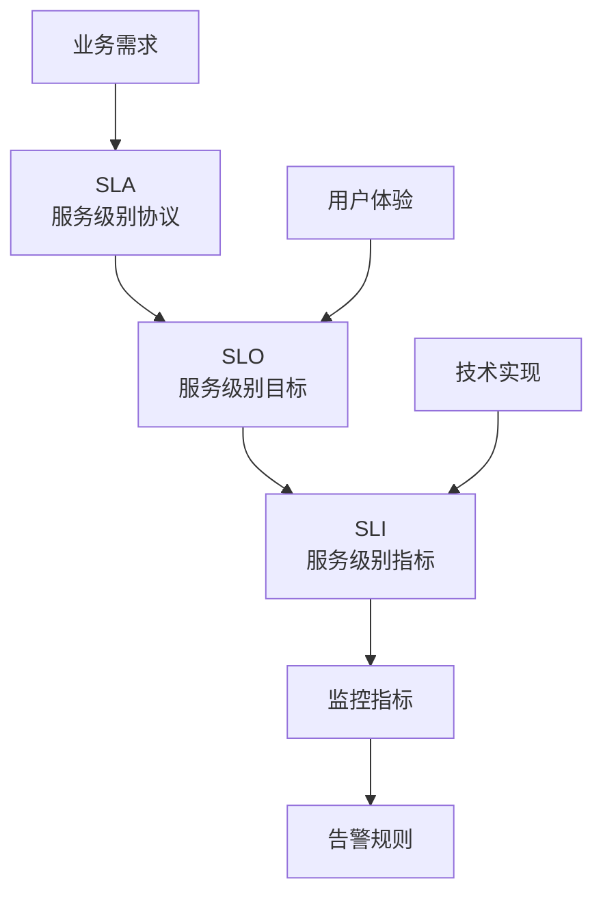
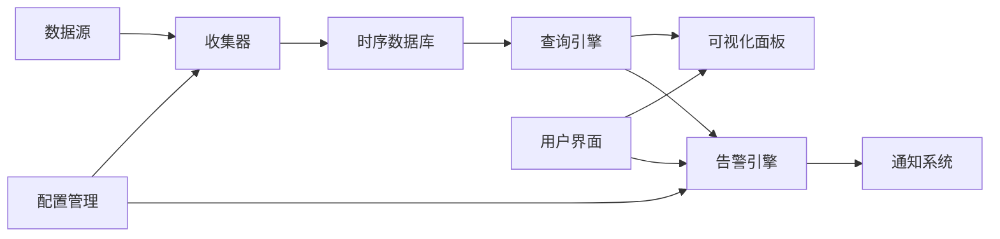
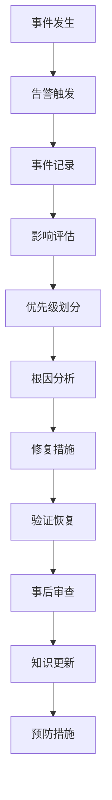
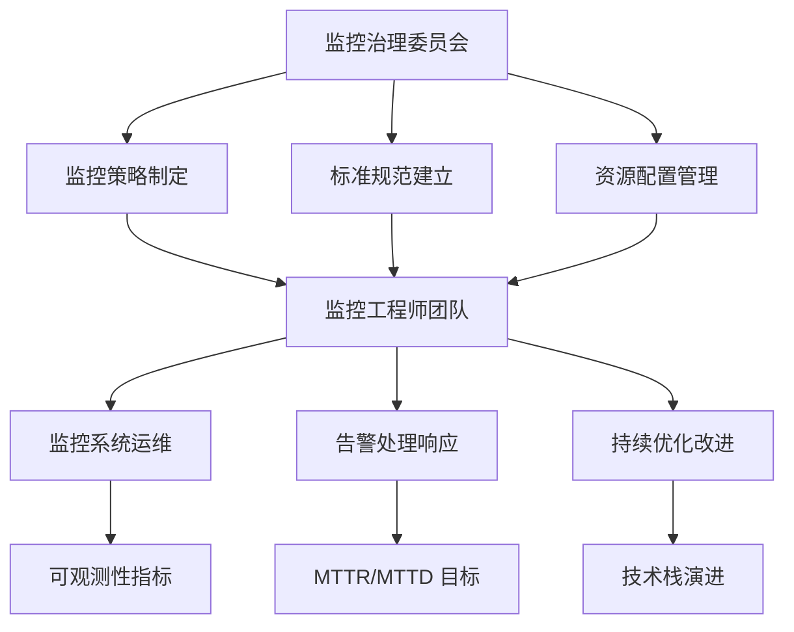

<!-- markdownlint-disable MD025 -->

<a id="第14章-测试环境监控与告警体系"></a>

### 第14章 测试环境监控与告警体系【可观测性与稳定性保障】

**本章学习目标**

1. 掌握服务级别指标(Service Level Indicator, SLI)、服务级别目标(Service Level Objective, SLO)和服务级别协议(Service Level Agreement, SLA)的设计原则；
2. 理解可观测性(Observability)的核心概念和实现方法；
3. 建立有效的告警体系，降低平均检测时间(Mean Time To Detection, MTTD)和平均修复时间(Mean Time To Recovery, MTTR)。

**实践建议**

- 建立基于 SLI/SLO 的监控指标体系，确保测试环境的可观测性。
- 实施分层告警策略，避免告警疲劳同时保证关键问题及时响应。
- 构建监控工具链，实现从指标收集到告警通知的完整自动化流程。

#### 14.1 监控指标体系设计 (SLI/SLO/SLA)

**[锚点14-001]** SLI/SLO/SLA 设计原则

**锚点类型**: 核心概念  
**锚点方法**: 分层架构图  
**锚点名称**: SLI/SLO/SLA 设计原则  
**引用附件**: examples/14_monitoring/monitoring_config.yml  
**完成情况**: 已完成  
**补充建议**: 字段建议：SLI定义/SLO目标/SLA协议，补充指标设计流程图  

服务级别管理是测试环境监控的核心，通过 SLI(服务级别指标)、SLO(服务级别目标)和 SLA(服务级别协议)构建完整的监控体系。

**SLI/SLO/SLA 关系架构**:



**核心概念定义**:

| 概念 | 定义 | 示例 | 监控周期 |
|------|------|------|----------|
| **SLI (Service Level Indicator)** | 衡量服务性能的具体指标 | API 响应时间、错误率、吞吐量 | 实时/分钟级 |
| **SLO (Service Level Objective)** | SLI 的目标值，表示期望的服务水平 | 99.9% 可用性、P95 < 200ms | 小时/天/周 |
| **SLA (Service Level Agreement)** | 客户与服务提供商之间的协议 | 99.95% 可用性保证、赔偿条款 | 月度/季度 |

**SLI 设计原则**:
- **可测量性**: 指标必须能够精确测量和收集
- **相关性**: 指标必须反映用户实际体验
- **可控性**: 指标受团队控制而非外部因素影响
- **简单性**: 指标定义清晰，避免复杂计算

**SLO 目标设定**:
```yaml
# examples/14_monitoring/monitoring_config.yml
service_level_objectives:
  - name: api_availability
    sli: availability
    target: 0.999  # 99.9%
    window: 30d
    
  - name: api_latency
    sli: latency_p95  
    target: 0.200  # 200ms
    window: 30d
```

---

##### 14.1.2 关键监控指标设计

**[锚点14-002]** 核心监控指标体系

**锚点类型**: 指标框架  
**锚点方法**: 分类表格  
**锚点名称**: 核心监控指标体系  
**引用附件**: examples/14_monitoring/monitoring_pipeline.py  
**完成情况**: 已完成  
**补充建议**: 字段建议：指标类型/测量方式/告警阈值/采集频率，补充指标收集代码  

测试环境需要监控的四大类关键指标：系统资源、应用性能、业务指标、安全指标。

**系统资源指标**:

| 指标名称 | 测量方式 | 正常阈值 | 告警阈值 | 采集频率 |
|----------|----------|----------|----------|----------|
| **CPU 使用率** | 系统负载百分比 | < 70% | > 90% | 15秒 |
| **内存使用率** | 已用内存比例 | < 80% | > 95% | 30秒 |
| **磁盘使用率** | 已用存储比例 | < 75% | > 90% | 5分钟 |
| **网络带宽** | 收发字节率 | < 70% | > 90% | 30秒 |

**应用性能指标**:

| 指标名称 | 测量方式 | 正常阈值 | 告警阈值 | 采集频率 |
|----------|----------|----------|----------|----------|
| **响应时间** | P95 响应时间 | < 200ms | > 1000ms | 1分钟 |
| **请求率** | QPS (每秒请求数) | 按业务需求 | 超出容量 | 1分钟 |
| **错误率** | HTTP 5xx 错误比例 | < 0.1% | > 1% | 1分钟 |
| **并发连接数** | 活跃连接数量 | < 80% 最大值 | > 95% 最大值 | 30秒 |

**业务指标**:

| 指标名称 | 测量方式 | 正常阈值 | 告警阈值 | 采集频率 |
|----------|----------|----------|----------|----------|
| **业务成功率** | 核心流程成功比例 | > 99.5% | < 99% | 5分钟 |
| **数据处理延迟** | 端到端处理时间 | < 30秒 | > 5分钟 | 1分钟 |
| **队列积压** | 未处理任务数量 | < 1000 | > 10000 | 1分钟 |
| **缓存命中率** | 缓存命中比例 | > 90% | < 80% | 5分钟 |

**安全指标**:

| 指标名称 | 测量方式 | 正常阈值 | 告警阈值 | 采集频率 |
|----------|----------|----------|----------|----------|
| **异常登录** | 失败登录尝试次数 | < 5/小时 | > 10/小时 | 实时 |
| **访问异常** | 异常访问模式 | 基线范围内 | 偏离基线 | 实时 |
| **权限违规** | 越权访问事件 | 0 | > 0 | 实时 |
| **数据泄露** | 敏感数据访问 | 授权访问 | 未授权访问 | 实时 |

**指标收集实现**:
```python
# examples/14_monitoring/monitoring_pipeline.py
class TestEnvironmentMonitor:
    def collect_system_metrics(self):
        # CPU、内存、磁盘、网络指标收集
        pass
        
    def collect_application_metrics(self):
        # 应用性能指标收集
        pass
        
    def collect_business_metrics(self):
        # 业务指标收集
        pass
```

---

#### 14.2 告警规则与策略配置

**[锚点14-003]** 告警分层策略

**锚点类型**: 策略框架  
**锚点方法**: 分层模型  
**锚点名称**: 告警分层策略  
**引用附件**: examples/14_monitoring/alerting_rules.yml  
**完成情况**: 已完成  
**补充建议**: 字段建议：告警级别/响应时间/通知方式/处理人员，补充告警策略流程图  

告警体系采用四层架构：预防层、监控层、告警层、响应层，确保问题及时发现和快速解决。

**告警级别定义**:

| 级别 | 严重程度 | 响应时间 | 通知方式 | 处理人员 | 示例 |
|------|----------|----------|----------|----------|------|
| **P0 (Critical)** | 系统完全不可用 | 5分钟 | 电话+短信+邮件 | 24/7 值班 | 生产服务宕机 |
| **P1 (High)** | 主要功能受影响 | 15分钟 | 短信+邮件+IM | 工作时间专职 | CPU 持续>95% |
| **P2 (Medium)** | 部分功能异常 | 1小时 | 邮件+IM | 相关团队 | 响应时间>2秒 |
| **P3 (Low)** | 轻微问题 | 4小时 | 邮件 | 定期处理 | 磁盘使用>80% |

**告警规则配置**:
```yaml
# examples/14_monitoring/alerting_rules.yml
groups:
  - name: test_environment_alerts
    rules:
      - alert: HighCPUUsage
        expr: cpu_usage_percent > 90
        for: 5m
        labels:
          severity: critical
        annotations:
          summary: "CPU 使用率过高"
          
      - alert: SlowResponse
        expr: histogram_quantile(0.95, http_request_duration_seconds) > 2
        for: 10m
        labels:
          severity: warning
        annotations:
          summary: "API 响应过慢"
```

---

##### 14.2.2 告警抑制与降噪

**[锚点14-004]** 告警抑制策略

**锚点类型**: 优化策略  
**锚点方法**: 规则清单  
**锚点名称**: 告警抑制策略  
**引用附件**: examples/14_monitoring/alerting_strategy.md  
**完成情况**: 已完成  
**补充建议**: 字段建议：抑制类型/触发条件/持续时间/抑制规则，补充抑制配置示例  

告警抑制是避免告警疲劳的重要机制，通过智能过滤减少无效告警。

**告警抑制类型**:

| 抑制类型 | 触发条件 | 持续时间 | 抑制规则 | 示例 |
|----------|----------|----------|----------|------|
| **依赖抑制** | 上游服务异常 | 自动检测 | 抑制下游告警 | 数据库异常时抑制应用告警 |
| **维护抑制** | 计划维护窗口 | 维护期间 | 抑制所有告警 | 发布部署时的告警抑制 |
| **重复抑制** | 相同告警 | 5分钟 | 抑制重复发送 | 同一问题避免重复告警 |
| **阈值抑制** | 低于阈值 | 动态调整 | 基于趋势抑制 | 轻微波动不告警 |

**告警分组策略**:
- **按服务分组**: 同一微服务的告警合并
- **按环境分组**: 测试/预发/生产分别处理
- **按严重程度分组**: 相同级别的告警批量通知

**抑制配置示例**:
```yaml
# 告警抑制规则
inhibit_rules:
  - target_match:
      severity: 'warning'
    source_match:
      severity: 'critical'
    equal: ['service', 'environment']
    
  - target_match:
      alertname: 'SlowResponse'
    source_match:
      alertname: 'HighCPU'
    equal: ['instance']
```

---

#### 14.3 监控工具链与仪表板

**[锚点14-005]** 监控工具链架构

**锚点类型**: 工具架构  
**锚点方法**: 工具链图  
**锚点名称**: 监控工具链架构  
**引用附件**: examples/14_monitoring/dashboard_template.json  
**完成情况**: 已完成  
**补充建议**: 字段建议：数据收集/存储处理/可视化/告警通知，补充工具集成架构图  

现代监控体系需要完整的工具链支持，从数据收集到告警通知的全流程自动化。

**监控工具链架构**:



**核心工具组件**:

| 组件 | 常用工具 | 功能 | 优势 |
|------|----------|------|------|
| **指标收集** | Prometheus, Telegraf | 收集系统/应用指标 | 拉取模式，高可靠性 |
| **日志收集** | ELK Stack, Loki | 集中日志管理 | 全文搜索，实时分析 |
| **链路追踪** | Jaeger, Zipkin | 分布式调用追踪 | 性能瓶颈定位 |
| **可视化** | Grafana, Kibana | 仪表板和图表 | 丰富的图表类型 |
| **告警** | Alertmanager | 告警路由和抑制 | 灵活的告警规则 |

**仪表板设计原则**:
- **层次清晰**: 总览 → 详细 → 深入分析
- **指标相关**: 相关指标放在同一面板
- **时间一致**: 所有图表使用相同时间范围
- **响应式**: 支持不同屏幕尺寸

##### 14.3.2 仪表板最佳实践

**[锚点14-006]** 监控仪表板设计原则

**锚点类型**: 设计指南  
**锚点方法**: 最佳实践清单  
**锚点名称**: 监控仪表板设计原则  
**引用附件**: examples/14_monitoring/dashboard_template.json  
**完成情况**: 已完成  
**补充建议**: 字段建议：布局原则/指标选择/时间范围/用户体验，补充仪表板设计清单  

优秀的监控仪表板应该遵循 RED 方法和 USE 方法等最佳实践。

**RED 方法 (Rate/Errors/Duration)**:
- **Rate**: 请求率 - 每秒处理的请求数量
- **Errors**: 错误率 - 失败请求的比例
- **Duration**: 持续时间 - 请求处理的耗时

**USE 方法 (Utilization/Saturation/Errors)**:
- **Utilization**: 利用率 - 资源的使用百分比
- **Saturation**: 饱和度 - 资源队列的繁忙程度
- **Errors**: 错误 - 错误事件的数量

**仪表板设计清单**:

| 设计维度 | 原则 | 示例 | 理由 |
|----------|------|------|------|
| **布局层次** | 总览 → 详细 → 深入分析 | 系统概览 → 服务详情 → 实例级别 | 符合用户认知流程 |
| **指标分组** | 相关指标聚类 | CPU/内存放一起，延迟/错误率放一起 | 便于关联分析 |
| **时间一致性** | 统一时间范围 | 所有图表使用相同时间窗口 | 避免时间错位 |
| **阈值可视化** | 明确显示阈值线 | 红色阈值线标记告警线 | 快速识别异常 |
| **响应式设计** | 适配不同屏幕 | 支持手机/平板/桌面 | 随时随地监控 |

---

#### 14.4 告警响应与事件管理

**[锚点14-007]** 告警响应流程

**锚点类型**: 流程规范  
**锚点方法**: 响应流程图  
**锚点名称**: 告警响应流程  
**引用附件**: examples/14_monitoring/alerting_strategy.md  
**完成情况**: 已完成  
**补充建议**: 字段建议：接收确认/诊断修复/事后分析/持续改进，补充响应流程图  

高效的告警响应流程是保障系统稳定性的关键，包括接收、确认、诊断、修复和改进五个阶段。

**告警响应流程**:


**响应时间目标**:

| 告警级别 | 确认时间 | 诊断时间 | 修复时间 | 总MTTR目标 |
|----------|----------|----------|----------|------------|
| **P0 Critical** | 5分钟 | 15分钟 | 1小时 | < 2小时 |
| **P1 High** | 15分钟 | 30分钟 | 2小时 | < 4小时 |
| **P2 Medium** | 1小时 | 2小时 | 4小时 | < 8小时 |
| **P3 Low** | 4小时 | 8小时 | 24小时 | < 48小时 |

**MTTR/MTTD 优化策略**:
- **MTTD (Mean Time To Detection)**: 缩短故障检测时间
  - 提高监控覆盖率
  - 优化告警阈值
  - 实施智能告警

- **MTTR (Mean Time To Recovery)**: 缩短故障修复时间
  - 自动化修复脚本
  - 预案和演练
  - 知识库积累

---

##### 14.4.2 事件管理与根因分析

**[锚点14-008]** 事件管理框架

**锚点类型**: 管理框架  
**锚点方法**: 事件生命周期图  
**锚点名称**: 事件管理框架  
**引用附件**: examples/14_monitoring/alerting_strategy.md  
**完成情况**: 已完成  
**补充建议**: 字段建议：事件记录/影响评估/根因分析/预防措施，补充事件管理流程图  

事件管理是将告警转化为可操作洞察的过程，包括记录、分析和预防。

**事件生命周期**:



**根因分析方法**:
1. **5Why 分析**: 连续问5个为什么找到根本原因
2. **鱼骨图分析**: 从人员、过程、技术、环境等维度分析
3. **故障树分析**: 从结果倒推可能的故障路径
4. **数据驱动分析**: 基于监控数据和日志的统计分析

**事件记录模板**:
```markdown
# 事件记录模板
- **事件ID**: EVT-2025-001
- **发生时间**: 2025-12-24 14:30:00
- **检测时间**: 2025-12-24 14:32:00 (MTTD: 2分钟)
- **影响范围**: 测试环境 API 服务
- **严重程度**: P1 (High)
- **症状**: API 响应时间 > 5秒
- **根本原因**: 数据库连接池耗尽
- **修复措施**: 重启应用服务，扩容连接池
- **恢复时间**: 2025-12-24 15:00:00 (MTTR: 30分钟)
- **预防措施**: 增加连接池监控，设置自动扩容
```

---

#### 14.5 监控治理与最佳实践

**[锚点14-009]** 监控治理体系

**锚点类型**: 治理框架  
**锚点方法**: 治理模型  
**锚点名称**: 监控治理体系  
**引用附件**: examples/14_monitoring/monitoring_config.yml  
**完成情况**: 已完成  
**补充建议**: 字段建议：组织架构/流程规范/技术标准/持续改进，补充治理组织架构图  

监控治理是确保监控体系长期有效运行的制度保障，包括组织、流程和技术三个维度。

**监控治理架构**:



**治理关键要素**:

| 治理维度 | 具体内容 | 负责人 | 考核指标 |
|----------|----------|--------|----------|
| **组织架构** | 监控团队建设、职责分工 | 技术总监 | 团队覆盖率 100% |
| **流程规范** | 告警处理流程、变更管理 | 运维经理 | 流程执行率 > 95% |
| **技术标准** | 监控工具选型、配置标准 | 架构师 | 标准化程度 > 90% |
| **持续改进** | 回顾分析、优化措施 | 所有成员 | 改进项目数量 |

**监控成熟度评估**:

| 等级 | 特征 | MTTR目标 | 自动化程度 |
|------|------|----------|------------|
| **1级 初始** | 反应式监控，手动处理 | > 24小时 | < 20% |
| **2级 发展** | 基础自动化，部分覆盖 | 4-24小时 | 20-50% |
| **3级 成熟** | 系统化监控，全面覆盖 | 1-4小时 | 50-80% |
| **4级 优化** | 预测性监控，持续改进 | < 1小时 | 80-95% |
| **5级 卓越** | 智能监控，自适应优化 | < 30分钟 | > 95% |

---

##### 14.5.2 实战案例分享

**金融行业监控实践**:
某大型银行通过实施全面监控体系，将系统可用性从 99.5% 提升到 99.99%，MTTR 从 4 小时缩短到 30 分钟。

**关键成功因素**:
- 建立了完整的 SLI/SLO/SLA 体系
- 实施了分层告警策略，避免告警疲劳
- 构建了自动化修复和扩容机制
- 定期进行故障演练和改进回顾

**互联网公司监控实践**:
某电商平台通过智能监控系统，提前预测并避免了多次潜在故障，业务连续性得到显著提升。

**技术创新点**:
- 基于机器学习的异常检测
- 动态阈值调整机制
- 跨系统关联分析
- 自动化根因定位

---

#### 14.6 本章小结

测试环境监控与告警体系是保障系统稳定性和业务连续性的关键基础设施。通过 SLI/SLO/SLA 的分层设计、可观测性(Observability)的全面实现、智能告警策略的应用，可以显著降低 MTTD(Mean Time To Detection)和 MTTR(Mean Time To Recovery)，提升系统可靠性和用户体验。

核心要点包括：建立完整的指标体系、实施分层告警策略、构建自动化工具链、优化响应流程、持续治理改进。2025年，随着 AI 和可观测性技术的成熟，监控体系将向预测性和智能化方向演进。

> 动手思考
> 1. 为你们的核心业务系统设计 5 个关键 SLI 指标，并设定合理的 SLO 目标。
> 2. 分析当前告警体系的痛点，设计一个告警抑制和分组策略。
> 3. 选择 3 个监控工具，设计它们的集成架构和数据流。
> 4. 计算你们系统的 MTTR 和 MTTD，制定改进计划。
> 5. 评估监控体系的成熟度，制定下一阶段的改进目标。

> 示例参考：
>
> - 监控配置模板：examples/14_monitoring/monitoring_config.yml
> - 告警规则配置：examples/14_monitoring/alerting_rules.yml
> - 监控管道实现：examples/14_monitoring/monitoring_pipeline.py
> - 仪表板模板：examples/14_monitoring/dashboard_template.json
> - 告警策略指南：examples/14_monitoring/alerting_strategy.md
