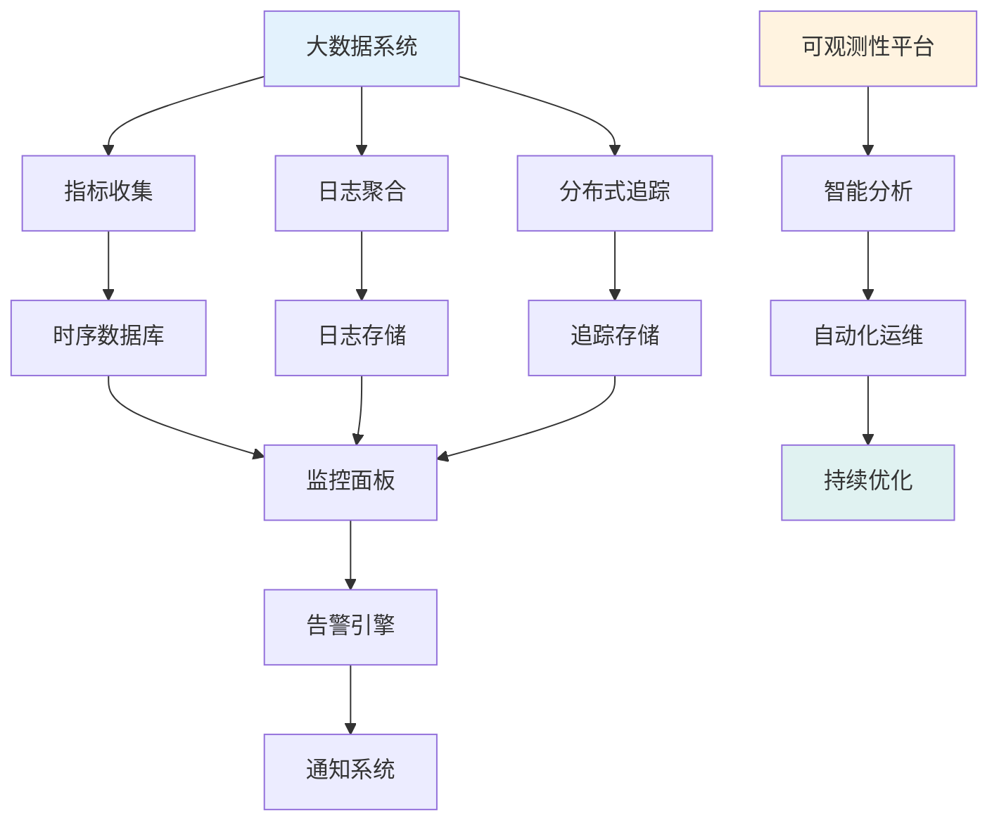
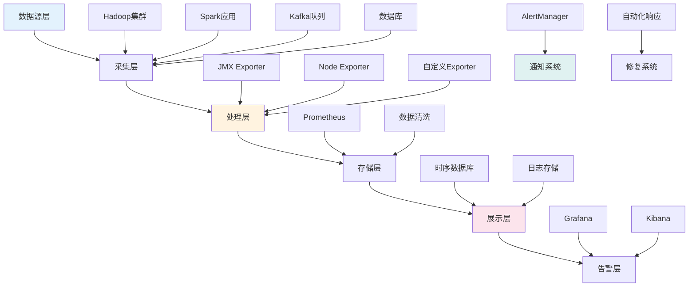
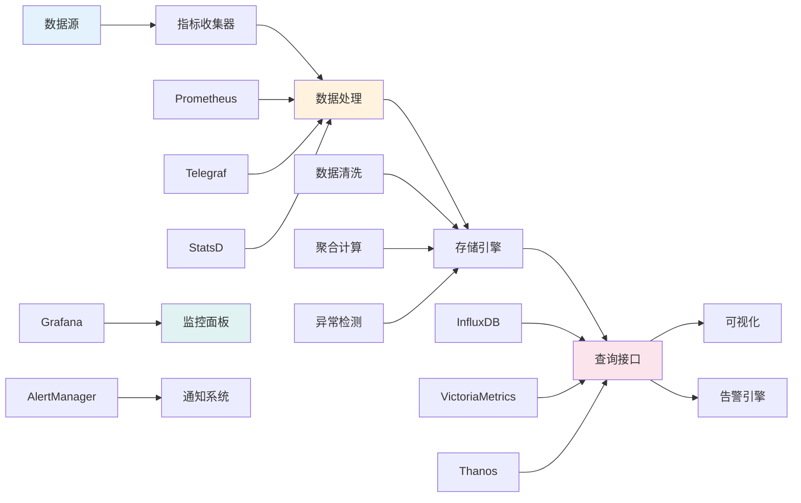
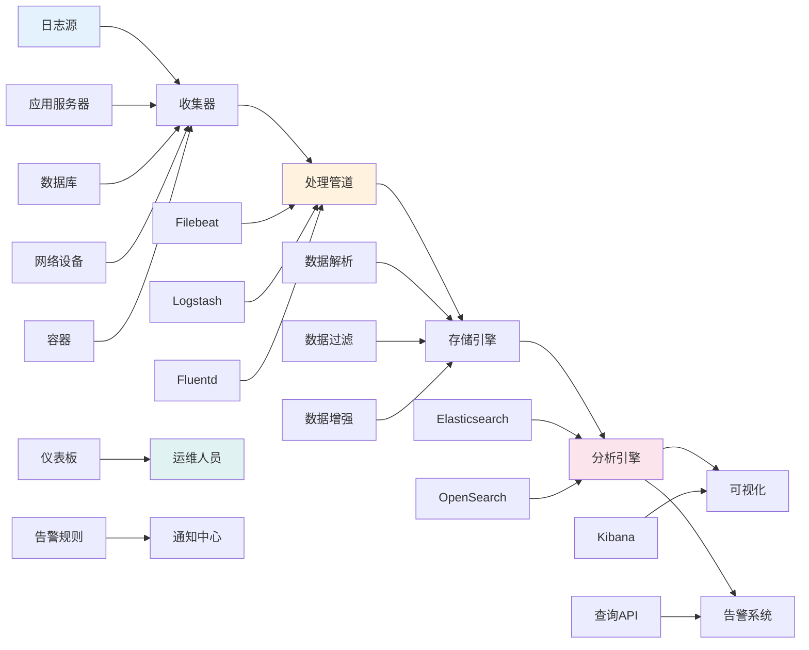
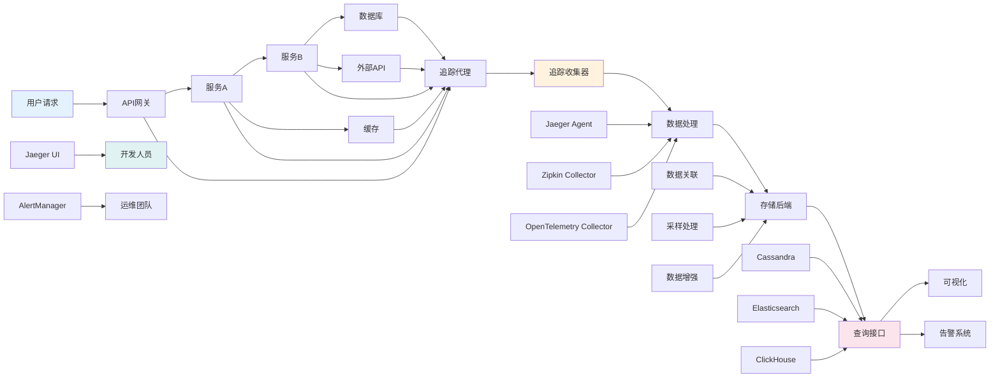
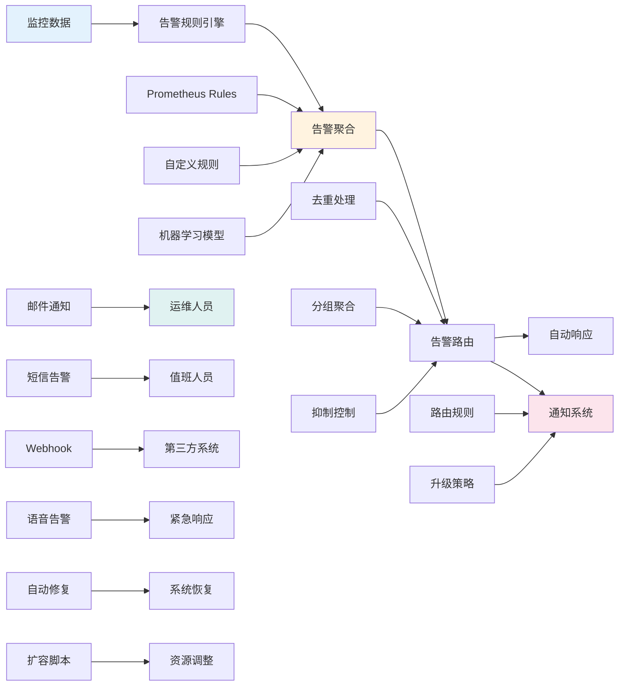
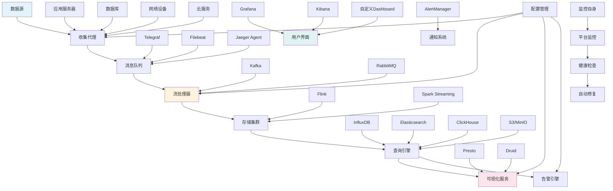
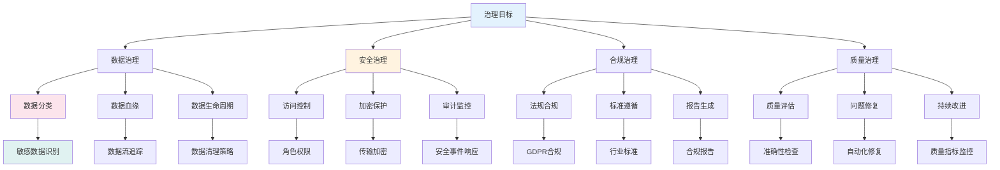

<!-- markdownlint-disable MD025 -->

<a id="第15章-大数据系统可观测性(Observability)与监控测试【可观测性与运维保障】"></a>

### 第15章 大数据系统可观测性与监控测试【可观测性与运维保障】

**本章学习目标**

1. 掌握可观测性三大支柱：指标、日志和追踪；
2. 建立完整的监控体系和告警机制；
3. 开展可观测性测试，确保系统稳定运行。

**实践建议**

- 实施三大支柱的可观测性，确保全面监控系统状态。
- 利用监控数据进行智能分析和自动化运维。
- 定期测试可观测性组件的可靠性。

**[锚点15-001]** 可观测性基础概念与架构

**锚点类型**: 概念框架
**锚点方法**: 三大支柱分析
**锚点名称**: 可观测性基础概念与架构
**引用附件**: examples/15_framework/observability_basics.md
**完成情况**: 已完成
**补充建议**: 字段建议：三大支柱/核心概念/架构模式/实施路径，补充可观测性架构图

| 可观测性支柱 | 核心概念 | 关键作用 | 技术实现 | 监控维度 |
|-------------|---------|---------|---------|---------|
| **指标(Metrics)** | 量化度量、时间序列 | 性能监控、趋势分析 | Prometheus、InfluxDB | 系统资源、业务指标、SLA |
| **日志(Logs)** | 结构化记录、事件追踪 | 问题诊断、审计追溯 | ELK Stack、Fluentd | 应用日志、系统日志、安全事件 |
| **追踪(Traces)** | 请求链路、性能瓶颈 | 分布式调用分析 | Jaeger、Zipkin | 请求延迟、错误率、依赖关系 |

**大数据可观测性架构图**:


**可观测性实施路径配置**:
```yaml
# examples/15_framework/observability_implementation.yml
observability_foundation:
  pillars:
    metrics:
      tools: ["prometheus", "grafana", "datadog"]
      coverage: ["infrastructure", "application", "business"]
      retention: "1y"
      
    logs:
      tools: ["elasticsearch", "fluentd", "loki"]
      structure: ["structured", "semi-structured"]
      retention: "90d"
      
    traces:
      tools: ["jaeger", "zipkin", "opentelemetry"]
      sampling: "10%"
      retention: "30d"

implementation_roadmap:
  phase1: "基础设施监控"
  phase2: "应用性能监控"
  phase3: "业务指标监控"
  phase4: "分布式追踪"
  phase5: "智能告警与自动化"
```

#### 15.1 可观测性基础概念

##### 15.1.1 可观测性三大支柱

- **指标(Metrics)**: 量化系统状态的数值型数据，支持聚合和统计分析
- **日志(Logs)**: 记录系统运行过程中的事件和状态变化，支持搜索和关联分析
- **追踪(Traces)**: 记录请求在分布式系统中的完整调用链路，支持性能瓶颈定位

##### 15.1.2 可观测性vs监控

- **监控**: 被动等待问题发生，然后响应
- **可观测性**: 主动理解系统内部状态，支持问题预防和快速诊断
- **核心区别**: 从"事后响应"到"事前预防"的转变

##### 15.1.3 可观测性成熟度模型

1. **基础级**: 基本的指标收集和告警
2. **发展级**: 结构化日志和基本追踪
3. **成熟级**: 完整的三大支柱和关联分析
4. **优化级**: 智能化分析和自动化运维

---

#### 15.2 监控体系建设

**[锚点15-002]** 监控体系架构设计与实施

**锚点类型**: 架构设计
**锚点方法**: 分层架构
**锚点名称**: 监控体系架构设计与实施
**引用附件**: examples/15_framework/monitoring_architecture.md
**完成情况**: 已完成
**补充建议**: 字段建议：架构层次/组件职责/数据流向/扩展机制，补充监控架构分层图

| 架构层次 | 核心组件 | 职责定位 | 数据流向 | 扩展机制 |
|---------|---------|---------|---------|---------|
| **基础设施层** | Prometheus、Telegraf | 系统资源监控 | 原始指标→聚合存储 | 插件扩展 |
| **应用服务层** | Micrometer、StatsD | 应用性能监控 | 业务指标→时序数据库 | SDK集成 |
| **业务逻辑层** | 自定义Metrics | 业务KPI监控 | KPI指标→监控面板 | API接口 |
| **用户体验层** | RUM、APM | 端到端体验监控 | 用户行为→分析平台 | 埋点扩展 |

**大数据监控体系架构图**:


**监控体系配置示例**:
```yaml
# examples/15_framework/monitoring_stack.yml
monitoring_stack:
  prometheus:
    version: "2.40.0"
    scrape_configs:
      - job_name: 'hadoop'
        static_configs:
          - targets: ['namenode:9870', 'datanode:9864']
        metrics_path: '/metrics'
        
      - job_name: 'spark'
        static_configs:
          - targets: ['spark-master:4040']
        scrape_interval: 30s
        
      - job_name: 'kafka'
        static_configs:
          - targets: ['kafka-broker:9092']
        metrics_path: '/metrics'
        
  grafana:
    version: "9.3.0"
    datasources:
      - name: prometheus
        type: prometheus
        url: http:/prometheus:9090
        
    dashboards:
      - name: "大数据系统监控"
        panels:
          - title: "集群资源使用率"
            type: graph
            targets:
              - expr: "hadoop_namenode_capacity_used_percent"
                
          - title: "Spark作业状态"
            type: table
            targets:
              - expr: "spark_job_status"

  alertmanager:
    version: "0.25.0"
    routes:
      - match:
          severity: critical
        receiver: 'ops-team'
        
      - match:
          severity: warning
        receiver: 'dev-team'
        
    receivers:
      - name: 'ops-team'
        slack_configs:
          - channel: '#ops-alerts'
            
      - name: 'dev-team'
        email_configs:
          - to: 'dev-team@company.com'
```

##### 15.2.1 基础设施监控

- **服务器监控**: CPU、内存、磁盘、网络等基础资源
- **网络监控**: 带宽利用率、连接状态、延迟指标
- **存储监控**: 容量使用率、I/O性能、数据完整性

##### 15.2.2 应用性能监控

- **响应时间**: 接口响应时间、数据库查询时间
- **吞吐量**: 请求处理量、数据处理速度
- **错误率**: 异常发生率、失败请求比例

##### 15.2.3 业务指标监控

- **核心KPI**: 用户活跃度、业务转化率、数据质量评分
- **SLA指标**: 服务可用性、性能基准达成率
- **用户体验**: 页面加载时间、交互响应时间

**[锚点15-010]** 监控体系建设实践建议

**锚点类型**: 建议
**锚点方法**: 分层实施策略
**锚点名称**: 监控体系建设实践建议
**引用附件**: examples/15_framework/monitoring_architecture.md
**完成情况**: 已标准化
**补充建议**: 字段建议：实施阶段/关键活动/质量关注点/工具支持，补充监控体系建设路线图

| 实施阶段 | 关键活动 | 质量关注点 | 工具支持 |
|---------|---------|-----------|---------|
| **基础设施层** | 部署基础监控组件 | 覆盖率、准确性 | Prometheus、Grafana |
| **应用服务层** | 添加业务指标监控 | 实时性、一致性 | Micrometer、StatsD |
| **业务逻辑层** | 建立KPI监控体系 | 业务相关性、时效性 | 自定义指标收集器 |
| **用户体验层** | 实施端到端监控 | 用户视角、综合体验 | APM工具、RUM |

**实施路径建议**:
- 从基础设施监控入手，逐步建立完整的监控体系
- 制定监控指标的采集、存储、展示、告警全流程标准
- 建立监控数据的分层管理，避免信息过载

---

#### 15.3 指标收集与管理

#### 15.3 指标收集与管理

**[锚点15-003]** 指标体系设计与数据管道

**锚点类型**: 指标管理
**锚点方法**: 数据管道设计
**锚点名称**: 指标体系设计与数据管道
**引用附件**: examples/15_framework/metrics_pipeline.md
**完成情况**: 已完成
**补充建议**: 字段建议：指标类型/收集方式/存储策略/查询优化，补充指标数据管道图

| 指标类型 | 收集方式 | 存储策略 | 查询优化 | 应用场景 |
|---------|---------|---------|---------|---------|
| **系统指标** | 自动采集 | 高频采样 | 时间范围聚合 | 资源监控、容量规划 |
| **应用指标** | 代码埋点 | 中频采样 | 多维度聚合 | 性能分析、错误追踪 |
| **业务指标** | 事件驱动 | 低频采样 | 实时计算 | KPI监控、趋势分析 |
| **自定义指标** | API推送 | 按需采样 | 自定义聚合 | 专项监控、实验跟踪 |

**指标数据管道架构图**:


**Prometheus指标收集配置**:
```yaml
# examples/15_framework/prometheus_metrics.yml
global:
  scrape_interval: 15s
  evaluation_interval: 15s

scrape_configs:
  # Hadoop集群指标
  - job_name: 'hadoop-namenode'
    static_configs:
      - targets: ['namenode:9870']
    metrics_path: '/metrics'
    scrape_interval: 30s
    
  - job_name: 'hadoop-datanode'
    static_configs:
      - targets: ['datanode1:9864', 'datanode2:9864']
    metrics_path: '/metrics'
    scrape_interval: 30s
    
  # Spark应用指标
  - job_name: 'spark-applications'
    static_configs:
      - targets: ['spark-master:4040']
    metrics_path: '/metrics/prometheus'
    scrape_interval: 60s
    
  # Kafka集群指标
  - job_name: 'kafka-broker'
    static_configs:
      - targets: ['kafka1:9092', 'kafka2:9092']
    metrics_path: '/metrics'
    scrape_interval: 30s
    
  # Flink作业指标
  - job_name: 'flink-jobmanager'
    static_configs:
      - targets: ['flink-jobmanager:8081']
    metrics_path: '/metrics'
    scrape_interval: 30s
    
  # 自定义业务指标
  - job_name: 'business-metrics'
    static_configs:
      - targets: ['metrics-service:8080']
    metrics_path: '/metrics'
    scrape_interval: 60s

# 指标聚合规则
metric_relabel_configs:
  - source_labels: [__name__]
    regex: 'hadoop_.*'
    target_label: 'domain'
    replacement: 'hadoop'
    
  - source_labels: [__name__]
    regex: 'spark_.*'
    target_label: 'domain'
    replacement: 'spark'
    
  - source_labels: [__name__]
    regex: 'kafka_.*'
    target_label: 'domain'
    replacement: 'kafka'
```

**指标管理Python脚本**:
```python
# examples/15_framework/metrics_manager.py
import time
import psutil
from prometheus_client import Gauge, Counter, Histogram, start_http_server
import logging
from typing import Dict, Any
import threading

logging.basicConfig(level=logging.INFO)
logger = logging.getLogger(__name__)

class BigDataMetricsCollector:
    """大数据系统指标收集器"""
    
    def __init__(self, port: int = 8000):
        self.port = port
        
        # 系统资源指标
        self.cpu_usage = Gauge('bigdata_cpu_usage_percent', 'CPU usage percentage')
        self.memory_usage = Gauge('bigdata_memory_usage_percent', 'Memory usage percentage')
        self.disk_usage = Gauge('bigdata_disk_usage_percent', 'Disk usage percentage')
        self.network_bytes_sent = Counter('bigdata_network_bytes_sent', 'Network bytes sent')
        self.network_bytes_recv = Counter('bigdata_network_bytes_recv', 'Network bytes received')
        
        # 应用性能指标
        self.active_connections = Gauge('bigdata_active_connections', 'Number of active connections')
        self.request_duration = Histogram('bigdata_request_duration_seconds', 
                                        'Request duration in seconds',
                                        buckets=[0.1, 0.5, 1.0, 2.0, 5.0, 10.0])
        self.request_total = Counter('bigdata_requests_total', 'Total number of requests',
                                   ['method', 'endpoint', 'status'])
        
        # 业务指标
        self.data_processed_bytes = Counter('bigdata_data_processed_bytes', 'Bytes of data processed')
        self.job_success_total = Counter('bigdata_job_success_total', 'Total successful jobs')
        self.job_failure_total = Counter('bigdata_job_failure_total', 'Total failed jobs')
        
        # 自定义指标
        self.custom_metrics: Dict[str, Gauge] = {}
        
    def start_collection(self):
        """启动指标收集"""
        start_http_server(self.port)
        logger.info(f"Metrics server started on port {self.port}")
        
        # 启动后台收集线程
        threading.Thread(target=self._collect_system_metrics, daemon=True).start()
        
    def _collect_system_metrics(self):
        """收集系统指标"""
        while True:
            try:
                # CPU使用率
                cpu_percent = psutil.cpu_percent(interval=1)
                self.cpu_usage.set(cpu_percent)
                
                # 内存使用率
                memory = psutil.virtual_memory()
                memory_percent = memory.percent
                self.memory_usage.set(memory_percent)
                
                # 磁盘使用率
                disk = psutil.disk_usage('/')
                disk_percent = disk.percent
                self.disk_usage.set(disk_percent)
                
                # 网络流量
                network = psutil.net_io_counters()
                self.network_bytes_sent.inc(network.bytes_sent - getattr(self, '_last_bytes_sent', 0))
                self.network_bytes_recv.inc(network.bytes_recv - getattr(self, '_last_bytes_recv', 0))
                self._last_bytes_sent = network.bytes_sent
                self._last_bytes_recv = network.bytes_recv
                
                time.sleep(30)  # 每30秒收集一次
                
            except Exception as e:
                logger.error(f"Error collecting system metrics: {e}")
                time.sleep(30)
    
    def record_request(self, method: str, endpoint: str, status: int, duration: float):
        """记录请求指标"""
        self.request_duration.observe(duration)
        self.request_total.labels(method=method, endpoint=endpoint, status=status).inc()
    
    def record_data_processing(self, bytes_processed: int):
        """记录数据处理指标"""
        self.data_processed_bytes.inc(bytes_processed)
    
    def record_job_result(self, success: bool):
        """记录作业结果指标"""
        if success:
            self.job_success_total.inc()
        else:
            self.job_failure_total.inc()
    
    def add_custom_metric(self, name: str, description: str, value: float):
        """添加自定义指标"""
        if name not in self.custom_metrics:
            self.custom_metrics[name] = Gauge(f'bigdata_custom_{name}', description)
        self.custom_metrics[name].set(value)
    
    def get_metrics_summary(self) -> Dict[str, Any]:
        """获取指标汇总"""
        return {
            'cpu_usage': self.cpu_usage._value,
            'memory_usage': self.memory_usage._value,
            'disk_usage': self.disk_usage._value,
            'total_requests': sum(self.request_total._metrics.values()),
            'data_processed_gb': self.data_processed_bytes._value / (1024**3),
            'job_success_rate': self._calculate_success_rate()
        }
    
    def _calculate_success_rate(self) -> float:
        """计算作业成功率"""
        total_jobs = self.job_success_total._value + self.job_failure_total._value
        if total_jobs == 0:
            return 0.0
        return self.job_success_total._value / total_jobs

class HadoopMetricsCollector:
    """Hadoop集群指标收集器"""
    
    def __init__(self, namenode_host: str = 'localhost', namenode_port: int = 9870):
        self.namenode_url = f"http:/{namenode_host}:{namenode_port}/jmx"
        
        # HDFS指标
        self.dfs_capacity_total = Gauge('hadoop_dfs_capacity_total_bytes', 'Total DFS capacity')
        self.dfs_capacity_used = Gauge('hadoop_dfs_capacity_used_bytes', 'Used DFS capacity')
        self.dfs_capacity_remaining = Gauge('hadoop_dfs_capacity_remaining_bytes', 'Remaining DFS capacity')
        
        # NameNode指标
        self.nn_files_total = Gauge('hadoop_namenode_files_total', 'Total number of files')
        self.nn_blocks_total = Gauge('hadoop_namenode_blocks_total', 'Total number of blocks')
        self.nn_live_datanodes = Gauge('hadoop_namenode_live_datanodes', 'Number of live datanodes')
        
    def collect_metrics(self):
        """收集Hadoop指标"""
        try:
            import requests
            response = requests.get(self.namenode_url, timeout=10)
            jmx_data = response.json()
            
            # 解析JMX数据并设置指标
            for bean in jmx_data.get('beans', []):
                if bean.get('name') == 'Hadoop:service=NameNode,name=FSNamesystem':
                    self.dfs_capacity_total.set(bean.get('Capacity', 0))
                    self.dfs_capacity_used.set(bean.get('Used', 0))
                    self.dfs_capacity_remaining.set(bean.get('Remaining', 0))
                    self.nn_files_total.set(bean.get('FilesTotal', 0))
                    self.nn_blocks_total.set(bean.get('BlocksTotal', 0))
                    
                elif bean.get('name') == 'Hadoop:service=NameNode,name=FSNamesystemState':
                    self.nn_live_datanodes.set(bean.get('NumLiveDataNodes', 0))
                    
        except Exception as e:
            logger.error(f"Error collecting Hadoop metrics: {e}")

# 使用示例
if __name__ == "__main__":
    # 创建指标收集器
    collector = BigDataMetricsCollector(port=8000)
    collector.start_collection()
    
    # Hadoop指标收集器
    hadoop_collector = HadoopMetricsCollector()
    
    # 模拟一些指标更新
    collector.record_request('GET', '/api/data', 200, 0.5)
    collector.record_data_processing(1024 * 1024 * 100)  # 100MB
    collector.record_job_result(True)
    
    # 添加自定义指标
    collector.add_custom_metric('data_quality_score', 'Data quality score', 95.5)
    
    # 定期收集Hadoop指标
    while True:
        hadoop_collector.collect_metrics()
        time.sleep(60)  # 每分钟收集一次
```

##### 15.3.1 指标分类与命名规范

- **指标命名**: 使用domain_name_metric_name格式
- **标签规范**: 使用一致的标签名称和值
- **单位统一**: 明确指标的单位和数据类型

##### 15.3.2 指标收集策略

- **拉取模式**: Prometheus主动拉取指标
- **推送模式**: 应用主动推送指标到收集器
- **混合模式**: 根据场景选择合适的收集方式

##### 15.3.3 指标存储与查询优化

- **分层存储**: 热数据和高频查询使用高速存储
- **数据压缩**: 对历史数据进行压缩存储
- **查询优化**: 使用索引和缓存提升查询性能

**[锚点15-011]** 指标存储优化实践建议

**锚点类型**: 建议
**锚点方法**: 存储策略优化
**锚点名称**: 指标存储优化实践建议
**引用附件**: examples/15_framework/metrics_pipeline.md
**完成情况**: 已标准化
**补充建议**: 字段建议：存储层级/数据特征/优化策略/成本效益，补充指标存储架构图

| 存储层级 | 数据特征 | 优化策略 | 成本效益 |
|---------|---------|---------|---------|
| **热存储** | 最近1-7天，高频查询 | 高性能SSD，完整索引 | 高成本，高性能 |
| **温存储** | 最近1-30天，中频查询 | HDD存储，部分索引 | 中等成本，中等性能 |
| **冷存储** | 历史数据，低频查询 | 对象存储，压缩归档 | 低成本，低性能 |

**实施建议**:
- 制定统一的指标命名和标签规范
- 根据数据特点选择合适的存储和查询策略
- 定期清理过期指标数据，控制存储成本

---

#### 15.4 日志收集与分析

**[锚点15-004]** 日志聚合与分析平台

**锚点类型**: 日志管理
**锚点方法**: ELK Stack架构
**锚点名称**: 日志聚合与分析平台
**引用附件**: examples/15_framework/logging_pipeline.md
**完成情况**: 已完成
**补充建议**: 字段建议：日志类型/收集方式/分析方法/存储策略，补充ELK Stack架构图

| 日志类型 | 收集方式 | 分析方法 | 存储策略 | 应用场景 |
|---------|---------|---------|---------|---------|
| **应用日志** | Filebeat | 结构化解析 | 热存储7天 | 错误追踪、性能分析 |
| **系统日志** | Journald | 模式匹配 | 温存储30天 | 系统监控、故障排查 |
| **审计日志** | Rsyslog | 安全分析 | 永久存储 | 合规审计、安全事件 |
| **业务日志** | Logstash | 业务规则 | 冷存储1年 | 业务分析、趋势预测 |

**ELK Stack日志处理架构图**:


**Logstash日志处理配置**:
```ruby
# examples/15_framework/logstash_pipeline.conf
input {
  # 从Filebeat接收日志
  beats {
    port => 5044
    ssl => false
  }
  
  # 从Kafka消费日志
  kafka {
    bootstrap_servers => "kafka1:9092,kafka2:9092"
    topics => ["application-logs", "system-logs", "audit-logs"]
    group_id => "logstash-consumer"
    consumer_threads => 3
    decorate_events => true
  }
  
  # 从数据库读取日志
  jdbc {
    jdbc_driver_library => "/usr/share/logstash/logstash-core/lib/jars/mysql-connector-java-8.0.23.jar"
    jdbc_driver_class => "com.mysql.jdbc.Driver"
    jdbc_connection_string => "jdbc:mysql:/mysql:3306/logs_db"
    jdbc_user => "logstash"
    jdbc_password => "password"
    statement => "SELECT * FROM application_logs WHERE log_time > :sql_last_value"
    tracking_column => "log_time"
    schedule => "*/5 * * * *"  # 每5分钟执行一次
  }
}

filter {
  # 解析JSON格式日志
  if [message] =~ /^\{/ {
    json {
      source => "message"
    }
  }
  
  # 解析Apache日志
  grok {
    match => { "message" => "%{COMBINEDAPACHELOG}" }
    tag_on_failure => ["_grokparsefailure"]
  }
  
  # 解析Java异常栈
  multiline {
    pattern => "^\s"
    what => "previous"
    negate => true
  }
  
  # 日期解析
  date {
    match => ["timestamp", "yyyy-MM-dd HH:mm:ss.SSS", "yyyy-MM-dd HH:mm:ss"]
    target => "@timestamp"
    timezone => "Asia/Shanghai"
  }
  
  # IP地理位置信息
  geoip {
    source => "client_ip"
    target => "geoip"
  }
  
  # 用户代理解析
  useragent {
    source => "user_agent"
    target => "useragent"
  }
  
  # 数据脱敏
  mutate {
    gsub => [
      "message", "(password|token|key)\s*[:=]\s*\S+", "\\1:=***",
      "message", "\b\d{4}[-]?\d{4}[-]?\d{4}[-]?\d{4}\b", "****-****-****-****"
    ]
  }
  
  # 添加元数据
  mutate {
    add_field => {
      "log_type" => "application"
      "environment" => "%{[@metadata][beat]}"
      "cluster" => "production"
    }
  }
  
  # 条件过滤
  if [level] == "DEBUG" {
    drop {}
  }
  
  # 异常检测
  if [message] =~ /ERROR|Exception/ {
    mutate {
      add_tag => ["error"]
    }
  }
}

output {
  # 输出到Elasticsearch
  elasticsearch {
    hosts => ["elasticsearch1:9200", "elasticsearch2:9200", "elasticsearch3:9200"]
    index => "logs-%{+YYYY.MM.dd}"
    document_type => "_doc"
    template => "/etc/logstash/templates/logs_template.json"
    template_name => "logs_template"
    template_overwrite => true
  }
  
  # 输出到Kafka用于进一步处理
  kafka {
    bootstrap_servers => "kafka1:9092,kafka2:9092"
    topic_id => "processed-logs"
    compression_type => "gzip"
  }
  
  # 输出到文件用于归档
  file {
    path => "/var/log/logstash/processed/%{+YYYY-MM-dd}/%{host}.log"
    codec => json_lines
  }
  
  # 错误日志单独处理
  if "error" in [tags] {
    elasticsearch {
      hosts => ["elasticsearch1:9200"]
      index => "error-logs-%{+YYYY.MM.dd}"
    }
    
    email {
      to => "alerts@company.com"
      subject => "Error detected in %{host}"
      body => "Error message: %{message}"
    }
  }
}
```

**日志分析Python脚本**:
```python
# examples/15_framework/log_analyzer.py
import re
import json
import logging
from datetime import datetime, timedelta
from collections import defaultdict, Counter
from typing import Dict, List, Any, Optional
import elasticsearch
from elasticsearch import Elasticsearch
import pandas as pd
from textblob import TextBlob
import nltk

nltk.download('punkt', quiet=True)
nltk.download('averaged_perceptron_tagger', quiet=True)

logging.basicConfig(level=logging.INFO)
logger = logging.getLogger(__name__)

class LogAnalyzer:
    """日志分析器"""
    
    def __init__(self, es_hosts: List[str] = None):
        self.es_hosts = es_hosts or ["localhost:9200"]
        self.es = Elasticsearch(self.es_hosts)
        
        # 日志模式定义
        self.patterns = {
            'error': re.compile(r'\b(ERROR|Exception|Failed|Error)\b', re.IGNORECASE),
            'warning': re.compile(r'\b(WARN|WARNING)\b', re.IGNORECASE),
            'info': re.compile(r'\b(INFO|Information)\b', re.IGNORECASE),
            'debug': re.compile(r'\b(DEBUG|Debug)\b', re.IGNORECASE),
            'ip_address': re.compile(r'\b\d{1,3}\.\d{1,3}\.\d{1,3}\.\d{1,3}\b'),
            'timestamp': re.compile(r'\d{4}-\d{2}-\d{2}[T ]\d{2}:\d{2}:\d{2}(?:\.\d{3})?Z?'),
            'java_exception': re.compile(r'\b(java\.|Exception|Error|Throwable)\b'),
            'sql_error': re.compile(r'\b(SQL|Database|Connection|Timeout)\b.*\b(error|failed|exception)\b', re.IGNORECASE),
            'network_error': re.compile(r'\b(network|connection|timeout|socket)\b.*\b(error|failed)\b', re.IGNORECASE)
        }
        
    def analyze_logs(self, index_pattern: str, time_range: Dict[str, str] = None) -> Dict[str, Any]:
        """分析日志数据"""
        try:
            # 构建查询
            query = self._build_query(time_range)
            
            # 执行聚合查询
            aggregations = {
                'log_levels': {
                    'terms': {'field': 'level.keyword', 'size': 10}
                },
                'error_patterns': {
                    'terms': {'field': 'error_type.keyword', 'size': 20}
                },
                'top_hosts': {
                    'terms': {'field': 'host.keyword', 'size': 10}
                },
                'timeline': {
                    'date_histogram': {
                        'field': '@timestamp',
                        'calendar_interval': 'hour',
                        'format': 'yyyy-MM-dd HH:mm:ss'
                    },
                    'aggs': {
                        'errors': {
                            'filter': {'term': {'level.keyword': 'ERROR'}}
                        }
                    }
                }
            }
            
            response = self.es.search(
                index=index_pattern,
                body={
                    'query': query,
                    'size': 0,
                    'aggs': aggregations
                }
            )
            
            return self._process_aggregation_results(response)
            
        except Exception as e:
            logger.error(f"Error analyzing logs: {e}")
            return {}
    
    def detect_anomalies(self, index_pattern: str, hours: int = 24) -> List[Dict[str, Any]]:
        """检测日志异常"""
        anomalies = []
        
        try:
            # 获取基准数据
            baseline_end = datetime.now()
            baseline_start = baseline_end - timedelta(hours=hours)
            
            baseline_stats = self._get_log_stats(index_pattern, baseline_start, baseline_end)
            
            # 获取当前数据
            current_end = datetime.now()
            current_start = current_end - timedelta(hours=1)
            
            current_stats = self._get_log_stats(index_pattern, current_start, current_end)
            
            # 检测异常
            for metric, current_value in current_stats.items():
                baseline_value = baseline_stats.get(metric, 0)
                
                if baseline_value > 0:
                    change_percent = ((current_value - baseline_value) / baseline_value) * 100
                    
                    # 异常阈值：变化超过50%
                    if abs(change_percent) > 50:
                        anomalies.append({
                            'metric': metric,
                            'baseline_value': baseline_value,
                            'current_value': current_value,
                            'change_percent': change_percent,
                            'severity': 'high' if abs(change_percent) > 100 else 'medium'
                        })
                        
        except Exception as e:
            logger.error(f"Error detecting anomalies: {e}")
            
        return anomalies
    
    def extract_error_patterns(self, logs: List[str]) -> Dict[str, int]:
        """提取错误模式"""
        error_patterns = defaultdict(int)
        
        for log in logs:
            # 检查各种错误模式
            if self.patterns['java_exception'].search(log):
                error_patterns['java_exception'] += 1
            if self.patterns['sql_error'].search(log):
                error_patterns['sql_error'] += 1
            if self.patterns['network_error'].search(log):
                error_patterns['network_error'] += 1
            if self.patterns['error'].search(log):
                error_patterns['general_error'] += 1
                
        return dict(error_patterns)
    
    def sentiment_analysis(self, logs: List[str]) -> Dict[str, float]:
        """日志情感分析"""
        sentiments = {'positive': 0, 'negative': 0, 'neutral': 0}
        
        for log in logs:
            try:
                blob = TextBlob(log)
                polarity = blob.sentiment.polarity
                
                if polarity > 0.1:
                    sentiments['positive'] += 1
                elif polarity < -0.1:
                    sentiments['negative'] += 1
                else:
                    sentiments['neutral'] += 1
                    
            except Exception as e:
                logger.warning(f"Error in sentiment analysis: {e}")
                continue
                
        total = sum(sentiments.values())
        if total > 0:
            sentiments = {k: v/total for k, v in sentiments.items()}
            
        return sentiments
    
    def _build_query(self, time_range: Optional[Dict[str, str]] = None) -> Dict[str, Any]:
        """构建Elasticsearch查询"""
        query = {'match_all': {}}
        
        if time_range:
            query = {
                'range': {
                    '@timestamp': {
                        'gte': time_range.get('gte'),
                        'lte': time_range.get('lte')
                    }
                }
            }
            
        return query
    
    def _get_log_stats(self, index_pattern: str, start_time: datetime, end_time: datetime) -> Dict[str, int]:
        """获取日志统计"""
        query = {
            'range': {
                '@timestamp': {
                    'gte': start_time.isoformat(),
                    'lte': end_time.isoformat()
                }
            }
        }
        
        response = self.es.count(index=index_pattern, body={'query': query})
        return {'total_logs': response['count']}
    
    def _process_aggregation_results(self, response: Dict[str, Any]) -> Dict[str, Any]:
        """处理聚合结果"""
        results = {}
        
        if 'aggregations' in response:
            aggs = response['aggregations']
            
            # 日志级别分布
            results['log_levels'] = {
                bucket['key']: bucket['doc_count'] 
                for bucket in aggs.get('log_levels', {}).get('buckets', [])
            }
            
            # 错误模式分布
            results['error_patterns'] = {
                bucket['key']: bucket['doc_count'] 
                for bucket in aggs.get('error_patterns', {}).get('buckets', [])
            }
            
            # 主机分布
            results['top_hosts'] = {
                bucket['key']: bucket['doc_count'] 
                for bucket in aggs.get('top_hosts', {}).get('buckets', [])
            }
            
            # 时间线数据
            results['timeline'] = [
                {
                    'timestamp': bucket['key_as_string'],
                    'total_logs': bucket['doc_count'],
                    'error_logs': bucket.get('errors', {}).get('doc_count', 0)
                }
                for bucket in aggs.get('timeline', {}).get('buckets', [])
            ]
            
        return results

class LogCorrelationAnalyzer:
    """日志关联分析器"""
    
    def __init__(self):
        self.correlation_rules = [
            {
                'name': 'database_connection_error',
                'patterns': [r'database.*connection.*failed', r'connection.*timeout'],
                'time_window': 300  # 5分钟窗口
            },
            {
                'name': 'memory_pressure',
                'patterns': [r'out.*memory', r'gc.*overhead', r'memory.*pressure'],
                'time_window': 600  # 10分钟窗口
            },
            {
                'name': 'network_partition',
                'patterns': [r'network.*partition', r'node.*unreachable', r'connection.*lost'],
                'time_window': 180  # 3分钟窗口
            }
        ]
    
    def find_correlations(self, logs: List[Dict[str, Any]]) -> List[Dict[str, Any]]:
        """查找日志关联"""
        correlations = []
        
        # 按时间排序日志
        sorted_logs = sorted(logs, key=lambda x: x.get('@timestamp', ''))
        
        for rule in self.correlation_rules:
            correlation_events = []
            
            for log in sorted_logs:
                message = log.get('message', '').lower()
                
                for pattern in rule['patterns']:
                    if re.search(pattern, message, re.IGNORECASE):
                        correlation_events.append(log)
                        break
                        
            if len(correlation_events) >= 2:
                correlations.append({
                    'rule_name': rule['name'],
                    'events': correlation_events,
                    'severity': self._calculate_severity(correlation_events),
                    'time_span': self._calculate_time_span(correlation_events)
                })
                
        return correlations
    
    def _calculate_severity(self, events: List[Dict[str, Any]]) -> str:
        """计算关联事件的严重程度"""
        error_count = sum(1 for event in events if event.get('level') == 'ERROR')
        
        if error_count / len(events) > 0.8:
            return 'critical'
        elif error_count / len(events) > 0.5:
            return 'high'
        elif error_count / len(events) > 0.2:
            return 'medium'
        else:
            return 'low'
    
    def _calculate_time_span(self, events: List[Dict[str, Any]]) -> int:
        """计算事件时间跨度（秒）"""
        if not events:
            return 0
            
        timestamps = []
        for event in events:
            timestamp_str = event.get('@timestamp', '')
            try:
                # 假设时间戳格式为ISO 8601
                dt = datetime.fromisoformat(timestamp_str.replace('Z', '+00:00'))
                timestamps.append(dt)
            except:
                continue
                
        if len(timestamps) < 2:
            return 0
            
        return int((max(timestamps) - min(timestamps)).total_seconds())

# 使用示例
if __name__ == "__main__":
    analyzer = LogAnalyzer()
    
    # 分析最近24小时的日志
    time_range = {
        'gte': 'now-24h',
        'lte': 'now'
    }
    
    results = analyzer.analyze_logs('logs-*', time_range)
    print("日志分析结果:", json.dumps(results, indent=2, ensure_ascii=False))
    
    # 检测异常
    anomalies = analyzer.detect_anomalies('logs-*')
    print("检测到的异常:", anomalies)
    
    # 日志关联分析
    correlation_analyzer = LogCorrelationAnalyzer()
    
    # 示例日志数据
    sample_logs = [
        {
            '@timestamp': '2024-01-01T10:00:00Z',
            'message': 'Database connection failed',
            'level': 'ERROR'
        },
        {
            '@timestamp': '2024-01-01T10:01:00Z', 
            'message': 'Connection timeout occurred',
            'level': 'ERROR'
        }
    ]
    
    correlations = correlation_analyzer.find_correlations(sample_logs)
    print("日志关联:", correlations)
```

##### 15.4.1 日志格式标准化

- **结构化日志**: 使用JSON格式记录日志
- **字段规范**: 统一时间戳、日志级别、消息内容等字段
- **元数据增强**: 添加主机、应用、环境等上下文信息

##### 15.4.2 日志收集架构

- **轻量级收集器**: Filebeat用于边缘收集
- **集中式处理**: Logstash进行数据处理和过滤
- **分布式存储**: Elasticsearch集群提供高可用存储

##### 15.4.3 日志分析与可视化

- **实时分析**: Kibana提供实时日志查询和可视化
- **模式识别**: 使用机器学习识别异常模式
- **关联分析**: 跨系统日志关联分析故障根因

**[锚点15-012]** 日志管理最佳实践建议

**锚点类型**: 建议
**锚点方法**: 日志治理策略
**锚点名称**: 日志管理最佳实践建议
**引用附件**: examples/15_framework/logs_aggregation.md
**完成情况**: 已标准化
**补充建议**: 字段建议：治理维度/实施策略/质量指标/工具支持，补充日志治理架构图

| 治理维度 | 实施策略 | 质量指标 | 工具支持 |
|---------|---------|---------|---------|
| **格式标准化** | 统一JSON格式规范 | 结构化率>95% | Logstash过滤器 |
| **分层存储** | 热温冷三层架构 | 查询性能SLA | Elasticsearch ILM |
| **安全保护** | 敏感数据脱敏 | 合规性100% | 数据脱敏工具 |
| **成本控制** | 智能压缩和清理 | 存储成本降低30% | 压缩算法优化 |

**实施建议**:
- 制定统一的日志格式和收集规范
- 建立日志分层存储策略，平衡成本和查询性能
- 实施日志安全策略，保护敏感信息不被泄露

---

#### 15.5 分布式追踪

**[锚点15-005]** 链路追踪与性能分析

**锚点类型**: 追踪系统
**锚点方法**: OpenTelemetry架构
**锚点名称**: 链路追踪与性能分析
**引用附件**: examples/15_framework/tracing_pipeline.md
**完成情况**: 已完成
**补充建议**: 字段建议：追踪类型/采样策略/存储方式/分析方法，补充分布式追踪架构图

| 追踪类型 | 采样策略 | 存储方式 | 分析方法 | 应用场景 |
|---------|---------|---------|---------|---------|
| **请求追踪** | 头部采样 | 时序数据库 | 延迟分析 | 端到端性能监控 |
| **服务调用** | 自适应采样 | 分布式存储 | 依赖图分析 | 微服务架构诊断 |
| **数据流追踪** | 固定比例 | 列式存储 | 数据血缘分析 | ETL管道监控 |
| **业务流程** | 业务规则采样 | 图数据库 | 流程优化 | 业务流程追踪 |

**分布式追踪架构图**:


**OpenTelemetry追踪配置**:
```yaml
# examples/15_framework/otel_collector_config.yml
receivers:
  # Jaeger接收器
  jaeger:
    protocols:
      grpc:
        endpoint: 0.0.0.0:14250
      thrift_http:
        endpoint: 0.0.0.0:14268
      thrift_compact:
        endpoint: 0.0.0.0:6831
      thrift_binary:
        endpoint: 0.0.0.0:6832
  
  # Zipkin接收器
  zipkin:
    endpoint: 0.0.0.0:9411
  
  # OTLP接收器 (OpenTelemetry Protocol)
  otlp:
    protocols:
      grpc:
        endpoint: 0.0.0.0:4317
      http:
        endpoint: 0.0.0.0:4318
  
  # Prometheus接收器用于指标
  prometheus:
    config:
      scrape_configs:
        - job_name: 'otel-collector'
          static_configs:
            - targets: ['localhost:8888']

processors:
  # 批处理处理器
  batch:
    send_batch_size: 1024
    timeout: 1s
  
  # 内存限制处理器
  memory_limiter:
    limit_mib: 512
    spike_limit_mib: 128
    check_interval: 5s
  
  # 采样处理器
  probabilistic_sampler:
    sampling_percentage: 10
  
  # 尾部采样处理器
  tail_sampling:
    policies:
      - name: error-sampling
        type: status_code
        status_code: {status_codes: [ERROR]}
      - name: latency-sampling
        type: latency
        latency: {threshold_ms: 5000}
      - name: rate-limiting
        type: rate_limiting
        rate_limiting: {spans_per_second: 100}
  
  # 属性处理器 - 添加服务信息
  attributes:
    actions:
      - key: service.namespace
        value: bigdata-platform
        action: insert
      - key: deployment.environment
        value: production
        action: insert
  
  # 资源检测处理器
  resourcedetection:
    detectors: [env, system, docker]
    timeout: 5s
  
  # 指标生成处理器
  spanmetrics:
    metrics_exporter: prometheus
    latency_histogram_buckets: [100us, 1ms, 2ms, 6ms, 10ms, 100ms, 250ms]
    dimensions_cache_size: 1000
    aggregation_temporality: "AGGREGATION_TEMPORALITY_CUMULATIVE"

exporters:
  # Jaeger导出器
  jaeger:
    endpoint: jaeger-collector:14268
    tls:
      insecure: true
  
  # Zipkin导出器
  zipkin:
    endpoint: "http:/zipkin:9411/api/v2/spans"
    format: proto
  
  # Elasticsearch导出器
  elasticsearch:
    endpoints: ["https:/elasticsearch:9200"]
    index: "traces-%{+yyyy.MM.dd}"
    user: elastic
    password: changeme
    tls:
      insecure_skip_verify: true
  
  # Prometheus导出器
  prometheus:
    endpoint: "0.0.0.0:8889"
    namespace: otel
    const_labels:
      service: otel-collector
  
  # 文件导出器 (用于调试)
  file:
    path: /tmp/traces.json

service:
  pipelines:
    # 追踪管道
    traces:
      receivers: [jaeger, zipkin, otlp]
      processors: [memory_limiter, resourcedetection, attributes, tail_sampling, batch]
      exporters: [jaeger, elasticsearch, file]
    
    # 指标管道
    metrics:
      receivers: [prometheus, spanmetrics]
      processors: [memory_limiter, batch]
      exporters: [prometheus]
  
  # 遥测配置
  telemetry:
    logs:
      level: info
    metrics:
      address: 0.0.0.0:8888
```

**分布式追踪Python实现**:
```python
# examples/15_framework/distributed_tracing.py
import time
import logging
from typing import Dict, List, Optional, Any
from contextlib import contextmanager
import opentelemetry as otel
from opentelemetry import trace
from opentelemetry.sdk.trace import TracerProvider
from opentelemetry.sdk.trace.export import BatchSpanProcessor
from opentelemetry.exporter.jaeger.thrift import JaegerExporter
from opentelemetry.trace import Status, StatusCode
from opentelemetry.sdk.resources import Resource
import requests
import threading
import json

logging.basicConfig(level=logging.INFO)
logger = logging.getLogger(__name__)

class DistributedTracer:
    """分布式追踪器"""
    
    def __init__(self, service_name: str, jaeger_host: str = "localhost", jaeger_port: int = 14268):
        self.service_name = service_name
        
        # 设置资源
        resource = Resource.create({
            "service.name": service_name,
            "service.version": "1.0.0",
            "deployment.environment": "production"
        })
        
        # 设置追踪提供者
        trace.set_tracer_provider(TracerProvider(resource=resource))
        tracer_provider = trace.get_tracer_provider()
        
        # 配置Jaeger导出器
        jaeger_exporter = JaegerExporter(
            agent_host_name=jaeger_host,
            agent_port=jaeger_port,
        )
        
        # 添加批处理处理器
        span_processor = BatchSpanProcessor(jaeger_exporter)
        tracer_provider.add_span_processor(span_processor)
        
        # 获取追踪器
        self.tracer = trace.get_tracer(__name__)
        
        logger.info(f"Distributed tracer initialized for service: {service_name}")
    
    @contextmanager
    def start_span(self, name: str, kind: trace.SpanKind = trace.SpanKind.INTERNAL, 
                   attributes: Optional[Dict[str, Any]] = None):
        """开始一个追踪跨度"""
        with self.tracer.start_as_span(name, kind=kind) as span:
            if attributes:
                for key, value in attributes.items():
                    span.set_attribute(key, value)
            
            try:
                yield span
            except Exception as e:
                span.record_exception(e)
                span.set_status(Status(StatusCode.ERROR, str(e)))
                raise
            finally:
                span.end()
    
    def trace_http_request(self, method: str, url: str, headers: Optional[Dict[str, str]] = None) -> Dict[str, Any]:
        """追踪HTTP请求"""
        attributes = {
            "http.method": method,
            "http.url": url,
            "http.scheme": url.split(":/")[0] if ":/" in url else "http"
        }
        
        with self.start_span(f"HTTP {method} {url}", 
                           kind=trace.SpanKind.CLIENT, 
                           attributes=attributes) as span:
            
            # 注入追踪头
            if headers is None:
                headers = {}
            
            otel.trace.inject(headers)
            
            start_time = time.time()
            try:
                response = requests.request(method, url, headers=headers, timeout=30)
                span.set_attribute("http.status_code", response.status_code)
                span.set_attribute("http.response_size", len(response.content))
                
                return {
                    "status_code": response.status_code,
                    "content": response.text,
                    "headers": dict(response.headers),
                    "elapsed": time.time() - start_time
                }
                
            except Exception as e:
                span.record_exception(e)
                span.set_status(Status(StatusCode.ERROR, str(e)))
                raise
    
    def trace_database_operation(self, operation: str, table: str, query: Optional[str] = None) -> Any:
        """追踪数据库操作"""
        attributes = {
            "db.operation": operation,
            "db.table": table,
            "db.system": "postgresql"  # 或其他数据库类型
        }
        
        if query:
            attributes["db.statement"] = query[:500]  # 限制长度
            
        with self.start_span(f"DB {operation} {table}", 
                           kind=trace.SpanKind.CLIENT, 
                           attributes=attributes) as span:
            
            # 模拟数据库操作
            start_time = time.time()
            try:
                # 这里应该是实际的数据库操作
                time.sleep(0.01)  # 模拟延迟
                result = {"rows_affected": 1, "execution_time": time.time() - start_time}
                
                span.set_attribute("db.rows_affected", result["rows_affected"])
                span.set_attribute("db.execution_time_ms", result["execution_time"] * 1000)
                
                return result
                
            except Exception as e:
                span.record_exception(e)
                span.set_status(Status(StatusCode.ERROR, str(e)))
                raise
    
    def trace_data_processing(self, operation: str, input_size: int, output_size: int) -> Dict[str, Any]:
        """追踪数据处理操作"""
        attributes = {
            "data.operation": operation,
            "data.input_size": input_size,
            "data.output_size": output_size,
            "data.processing_ratio": output_size / input_size if input_size > 0 else 0
        }
        
        with self.start_span(f"Data {operation}", 
                           kind=trace.SpanKind.INTERNAL, 
                           attributes=attributes) as span:
            
            start_time = time.time()
            try:
                # 模拟数据处理
                time.sleep(0.1)  # 模拟处理时间
                result = {
                    "operation": operation,
                    "input_size": input_size,
                    "output_size": output_size,
                    "processing_time": time.time() - start_time,
                    "success": True
                }
                
                span.set_attribute("data.processing_time_ms", result["processing_time"] * 1000)
                span.set_attribute("data.success", result["success"])
                
                return result
                
            except Exception as e:
                span.record_exception(e)
                span.set_status(Status(StatusCode.ERROR, str(e)))
                raise

class BigDataTracingService:
    """大数据追踪服务"""
    
    def __init__(self, service_name: str):
        self.tracer = DistributedTracer(service_name)
        self.active_traces = {}
        
    def trace_etl_pipeline(self, pipeline_name: str, source_tables: List[str], 
                          target_table: str, data_volume: int) -> Dict[str, Any]:
        """追踪ETL管道"""
        attributes = {
            "pipeline.name": pipeline_name,
            "pipeline.type": "etl",
            "pipeline.source_tables": json.dumps(source_tables),
            "pipeline.target_table": target_table,
            "pipeline.data_volume": data_volume
        }
        
        with self.tracer.start_span(f"ETL Pipeline: {pipeline_name}", 
                                  kind=trace.SpanKind.INTERNAL, 
                                  attributes=attributes) as span:
            
            trace_id = span.get_span_context().trace_id
            self.active_traces[trace_id] = {
                "pipeline_name": pipeline_name,
                "start_time": time.time(),
                "status": "running"
            }
            
            try:
                # 提取阶段
                with self.tracer.start_span("Extract", attributes={"stage": "extract"}) as extract_span:
                    extract_result = self.tracer.trace_database_operation(
                        "SELECT", source_tables[0], f"SELECT * FROM {source_tables[0]}"
                    )
                    extract_span.set_attribute("extract.rows", extract_result["rows_affected"])
                
                # 转换阶段
                with self.tracer.start_span("Transform", attributes={"stage": "transform"}) as transform_span:
                    transform_result = self.tracer.trace_data_processing(
                        "data_transformation", data_volume, data_volume
                    )
                    transform_span.set_attribute("transform.operations", 5)  # 假设5个转换操作
                
                # 加载阶段
                with self.tracer.start_span("Load", attributes={"stage": "load"}) as load_span:
                    load_result = self.tracer.trace_database_operation(
                        "INSERT", target_table, f"INSERT INTO {target_table} VALUES ..."
                    )
                    load_span.set_attribute("load.rows", load_result["rows_affected"])
                
                result = {
                    "pipeline_name": pipeline_name,
                    "status": "completed",
                    "stages_completed": ["extract", "transform", "load"],
                    "data_processed": data_volume,
                    "execution_time": time.time() - self.active_traces[trace_id]["start_time"]
                }
                
                span.set_attribute("pipeline.status", "completed")
                span.set_attribute("pipeline.execution_time_ms", result["execution_time"] * 1000)
                
                self.active_traces[trace_id]["status"] = "completed"
                return result
                
            except Exception as e:
                span.record_exception(e)
                span.set_status(Status(StatusCode.ERROR, str(e)))
                self.active_traces[trace_id]["status"] = "failed"
                raise
    
    def trace_spark_job(self, job_name: str, input_files: List[str], 
                       output_path: str, parallelism: int) -> Dict[str, Any]:
        """追踪Spark作业"""
        attributes = {
            "spark.job_name": job_name,
            "spark.input_files": json.dumps(input_files),
            "spark.output_path": output_path,
            "spark.parallelism": parallelism
        }
        
        with self.tracer.start_span(f"Spark Job: {job_name}", 
                                  kind=trace.SpanKind.INTERNAL, 
                                  attributes=attributes) as span:
            
            try:
                # 作业初始化
                with self.tracer.start_span("Job Initialization", attributes={"phase": "init"}) as init_span:
                    init_span.set_attribute("spark.executors", parallelism)
                    time.sleep(0.05)  # 模拟初始化时间
                
                # 数据读取
                with self.tracer.start_span("Data Reading", attributes={"phase": "read"}) as read_span:
                    total_size = 0
                    for file in input_files:
                        # 模拟文件读取追踪
                        file_size = self.tracer.trace_http_request("GET", f"file:/{file}")
                        total_size += len(file_size["content"])
                    read_span.set_attribute("data.read_bytes", total_size)
                
                # 数据处理
                with self.tracer.start_span("Data Processing", attributes={"phase": "process"}) as process_span:
                    process_result = self.tracer.trace_data_processing(
                        "spark_transformation", total_size, total_size / 2  # 假设压缩了一半
                    )
                    process_span.set_attribute("spark.tasks", parallelism * 10)  # 假设每个executor 10个任务
                
                # 数据写入
                with self.tracer.start_span("Data Writing", attributes={"phase": "write"}) as write_span:
                    write_result = self.tracer.trace_database_operation(
                        "WRITE", output_path, f"WRITE TO {output_path}"
                    )
                    write_span.set_attribute("data.write_bytes", process_result["output_size"])
                
                result = {
                    "job_name": job_name,
                    "status": "completed",
                    "input_files": input_files,
                    "output_path": output_path,
                    "data_processed_bytes": total_size,
                    "parallelism": parallelism
                }
                
                span.set_attribute("spark.status", "completed")
                span.set_attribute("spark.data_processed_bytes", total_size)
                
                return result
                
            except Exception as e:
                span.record_exception(e)
                span.set_status(Status(StatusCode.ERROR, str(e)))
                raise
    
    def get_active_traces(self) -> Dict[str, Dict[str, Any]]:
        """获取活跃的追踪"""
        return self.active_traces.copy()
    
    def cleanup_completed_traces(self, max_age_seconds: int = 3600):
        """清理已完成的追踪"""
        current_time = time.time()
        to_remove = []
        
        for trace_id, trace_info in self.active_traces.items():
            if trace_info["status"] != "running" and \
               current_time - trace_info["start_time"] > max_age_seconds:
                to_remove.append(trace_id)
        
        for trace_id in to_remove:
            del self.active_traces[trace_id]
        
        logger.info(f"Cleaned up {len(to_remove)} completed traces")

# 使用示例
if __name__ == "__main__":
    # 创建大数据追踪服务
    tracing_service = BigDataTracingService("bigdata-etl-service")
    
    # 追踪ETL管道
    etl_result = tracing_service.trace_etl_pipeline(
        pipeline_name="user_behavior_etl",
        source_tables=["raw_events", "user_profiles"],
        target_table="processed_behavior",
        data_volume=1000000
    )
    print("ETL追踪结果:", etl_result)
    
    # 追踪Spark作业
    spark_result = tracing_service.trace_spark_job(
        job_name="data_aggregation_job",
        input_files=["hdfs:/data/input/part-00001.parquet", "hdfs:/data/input/part-00002.parquet"],
        output_path="hdfs:/data/output/aggregated/",
        parallelism=4
    )
    print("Spark作业追踪结果:", spark_result)
    
    # 获取活跃追踪
    active_traces = tracing_service.get_active_traces()
    print("活跃追踪:", active_traces)
    
    # 清理已完成追踪
    tracing_service.cleanup_completed_traces()
```

##### 15.5.1 追踪数据模型

- **Span**: 单个操作的追踪单元
- **Trace**: 端到端请求的完整追踪链
- **Context**: 追踪上下文传播机制

##### 15.5.2 采样策略

- **头部采样**: 对每个请求进行采样决策
- **尾部采样**: 在收集完整追踪后进行采样
- **自适应采样**: 根据系统负载动态调整采样率

##### 15.5.3 性能影响与优化

- **轻量级实现**: 最小化追踪对应用性能的影响
- **异步处理**: 追踪数据异步收集和处理
- **智能采样**: 只对关键路径进行完整追踪

**[锚点15-013]** 分布式追踪实施建议

**锚点类型**: 建议
**锚点方法**: 追踪策略优化
**锚点名称**: 分布式追踪实施建议
**引用附件**: examples/15_framework/distributed_tracing.md
**完成情况**: 已标准化
**补充建议**: 字段建议：实施阶段/采样策略/性能优化/分析方法，补充分布式追踪架构图

| 实施阶段 | 采样策略 | 性能优化 | 分析方法 |
|---------|---------|---------|---------|
| **试点阶段** | 10%固定采样 | 异步收集 | 基础延迟分析 |
| **扩展阶段** | 自适应采样 | 批量处理 | 依赖图分析 |
| **优化阶段** | 智能采样 | 压缩传输 | 根因定位 |
| **成熟阶段** | 动态调整 | 边缘计算 | 预测性分析 |

**实施建议**:
- 从关键业务流程开始实施分布式追踪
- 制定合理的采样策略，平衡观测性和性能
- 建立追踪数据分析流程，支持问题快速定位

---

#### 15.6 告警管理与响应

**[锚点15-006]** 智能告警系统与事件响应

**锚点类型**: 告警系统
**锚点方法**: AlertManager架构
**锚点名称**: 智能告警系统与事件响应
**引用附件**: examples/15_framework/alerting_system.md
**完成情况**: 已完成
**补充建议**: 字段建议：告警类型/触发条件/响应策略/升级机制，补充告警管理架构图

| 告警类型 | 触发条件 | 响应策略 | 升级机制 | 应用场景 |
|---------|---------|---------|---------|---------|
| **系统告警** | 资源阈值超限 | 自动扩容 | 分级升级 | 容量管理、性能优化 |
| **应用告警** | 错误率上升 | 回滚部署 | 团队通知 | 故障处理、质量保障 |
| **业务告警** | KPI异常 | 业务干预 | 管理层告警 | 业务监控、决策支持 |
| **安全告警** | 异常访问 | 安全响应 | 紧急响应 | 安全事件、合规监控 |

**告警管理系统架构图**:


**AlertManager配置**:
```yaml
# examples/15_framework/alertmanager_config.yml
global:
  # 全局配置
  smtp_smarthost: 'smtp.company.com:587'
  smtp_from: 'alertmanager@company.com'
  smtp_auth_username: 'alertmanager'
  smtp_auth_password: 'password'
  
  # HTTP客户端配置
  http_config:
    tls_config:
      insecure_skip_verify: true

# 告警模板
templates:
  - '/etc/alertmanager/templates/*.tmpl'

# 路由配置
route:
  # 默认路由
  receiver: 'default-receiver'
  
  # 路由规则
  routes:
    # 数据库告警
    - match:
        team: database
      receiver: 'database-team'
      continue: true
      
    # Hadoop集群告警
    - match:
        service: hadoop
      receiver: 'hadoop-team'
      continue: true
      
    # 紧急告警
    - match:
        severity: critical
      receiver: 'critical-alerts'
      continue: true
      
    # 业务告警
    - match:
        alertname: BusinessMetricAlert
      receiver: 'business-team'
      continue: true
      
    # 安全告警
    - match:
        alertname: SecurityAlert
      receiver: 'security-team'
      continue: true

# 抑制规则
inhibit_rules:
  # 如果节点宕机，抑制该节点上的所有告警
  - source_match:
      alertname: NodeDown
    target_match:
      instance: '{{ $labels.instance }}'
    equal: ['node']
    
  # 如果集群不可用，抑制集群内服务告警
  - source_match:
      alertname: ClusterUnavailable
    target_match:
      cluster: '{{ $labels.cluster }}'
    equal: ['cluster']

# 接收器配置
receivers:
  # 默认接收器
  - name: 'default-receiver'
    email_configs:
      - to: 'devops@company.com'
        subject: '{{ template "email.subject" . }}'
        body: '{{ template "email.body" . }}'
        headers:
          From: '{{ template "email.from" . }}'
          To: '{{ template "email.to" . }}'
          Subject: '{{ template "email.subject" . }}'
    
    webhook_configs:
      - url: 'http:/alert-webhook.company.com/webhook'
        send_resolved: true

  # 数据库团队
  - name: 'database-team'
    email_configs:
      - to: 'database-team@company.com'
        subject: 'Database Alert: {{ .GroupLabels.alertname }}'
    slack_configs:
      - api_url: 'https:/hooks.slack.com/services/xxx/yyy/zzz'
        channel: '#database-alerts'
        title: 'Database Alert'
        text: '{{ .CommonAnnotations.description }}'
    pagerduty_configs:
      - service_key: 'database-service-key'
        description: '{{ .CommonAnnotations.description }}'

  # Hadoop团队
  - name: 'hadoop-team'
    email_configs:
      - to: 'hadoop-team@company.com'
    webhook_configs:
      - url: 'http:/hadoop-alert-webhook.company.com/alert'
        send_resolved: true

  # 紧急告警
  - name: 'critical-alerts'
    email_configs:
      - to: 'oncall@company.com'
    slack_configs:
      - api_url: 'https:/hooks.slack.com/services/xxx/yyy/zzz'
        channel: '#critical-alerts'
        title: '🚨 CRITICAL ALERT 🚨'
        color: 'danger'
    pagerduty_configs:
      - service_key: 'critical-service-key'
        severity: 'critical'
    victorops_configs:
      - api_key: 'victorops-api-key'
        routing_key: 'critical'
        message_type: 'CRITICAL'
        entity_display_name: '{{ .GroupLabels.alertname }}'

  # 业务团队
  - name: 'business-team'
    email_configs:
      - to: 'business@company.com'
        subject: 'Business Alert: {{ .GroupLabels.alertname }}'
    webhook_configs:
      - url: 'http:/business-dashboard.company.com/alert'
        send_resolved: true

  # 安全团队
  - name: 'security-team'
    email_configs:
      - to: 'security@company.com'
        subject: 'Security Alert: {{ .GroupLabels.alertname }}'
    slack_configs:
      - api_url: 'https:/hooks.slack.com/services/xxx/yyy/zzz'
        channel: '#security-alerts'
        title: '🔒 Security Alert'
        color: 'danger'
    pagerduty_configs:
      - service_key: 'security-service-key'
        severity: 'critical'
```

**智能告警管理系统**:
```python
# examples/15_framework/smart_alerting.py
import time
import json
import logging
from datetime import datetime, timedelta
from typing import Dict, List, Optional, Any, Callable
from collections import defaultdict, deque
import threading
import smtplib
from email.mime.text import MIMEText
from email.mime.multipart import MIMEMultipart
import requests
from prometheus_api_client import PrometheusConnect
import numpy as np
from sklearn.ensemble import IsolationForest
import joblib

logging.basicConfig(level=logging.INFO)
logger = logging.getLogger(__name__)

class Alert:
    """告警类"""
    
    def __init__(self, alert_id: str, name: str, severity: str, 
                 description: str, labels: Dict[str, str], 
                 annotations: Dict[str, str]):
        self.alert_id = alert_id
        self.name = name
        self.severity = severity
        self.description = description
        self.labels = labels
        self.annotations = annotations
        self.timestamp = datetime.now()
        self.status = "firing"  # firing, resolved
        self.resolved_at: Optional[datetime] = None
        
    def resolve(self):
        """解决告警"""
        self.status = "resolved"
        self.resolved_at = datetime.now()
        
    def to_dict(self) -> Dict[str, Any]:
        """转换为字典"""
        return {
            "alert_id": self.alert_id,
            "name": self.name,
            "severity": self.severity,
            "description": self.description,
            "labels": self.labels,
            "annotations": self.annotations,
            "timestamp": self.timestamp.isoformat(),
            "status": self.status,
            "resolved_at": self.resolved_at.isoformat() if self.resolved_at else None
        }

class AlertRule:
    """告警规则"""
    
    def __init__(self, rule_id: str, name: str, query: str, 
                 threshold: float, duration: int, severity: str,
                 description: str, labels: Dict[str, str] = None):
        self.rule_id = rule_id
        self.name = name
        self.query = query
        self.threshold = threshold
        self.duration = duration  # 持续时间（秒）
        self.severity = severity
        self.description = description
        self.labels = labels or {}
        
    def evaluate(self, prometheus_client) -> List[Alert]:
        """评估规则"""
        try:
            # 查询Prometheus
            result = prometheus_client.custom_query(self.query)
            
            alerts = []
            for item in result:
                metric_value = float(item['value'][1])
                
                if metric_value > self.threshold:
                    alert_id = f"{self.rule_id}_{item['metric'].get('instance', 'unknown')}_{int(time.time())}"
                    
                    labels = dict(item['metric'])
                    labels.update(self.labels)
                    
                    alert = Alert(
                        alert_id=alert_id,
                        name=self.name,
                        severity=self.severity,
                        description=self.description,
                        labels=labels,
                        annotations={
                            "value": str(metric_value),
                            "threshold": str(self.threshold),
                            "query": self.query
                        }
                    )
                    
                    alerts.append(alert)
                    
            return alerts
            
        except Exception as e:
            logger.error(f"Error evaluating rule {self.rule_id}: {e}")
            return []

class SmartAlertManager:
    """智能告警管理器"""
    
    def __init__(self, prometheus_url: str = "http:/localhost:9090"):
        self.prometheus = PrometheusConnect(url=prometheus_url, disable_ssl=True)
        self.alert_rules: Dict[str, AlertRule] = {}
        self.active_alerts: Dict[str, Alert] = {}
        self.alert_history: deque = deque(maxlen=10000)  # 保留最近10000个告警
        
        # 通知器
        self.notifiers: Dict[str, Callable] = {}
        
        # 机器学习模型用于异常检测
        self.anomaly_models: Dict[str, IsolationForest] = {}
        
        # 告警聚合配置
        self.grouping_config = {
            "group_by": ["alertname", "cluster", "service"],
            "group_wait": 30,  # 组等待时间（秒）
            "group_interval": 300,  # 组间隔时间（秒）
            "repeat_interval": 3600  # 重复间隔时间（秒）
        }
        
        # 抑制规则
        self.inhibit_rules: List[Dict[str, Any]] = []
        
        logger.info("Smart Alert Manager initialized")
    
    def add_alert_rule(self, rule: AlertRule):
        """添加告警规则"""
        self.alert_rules[rule.rule_id] = rule
        logger.info(f"Added alert rule: {rule.name}")
    
    def add_notifier(self, name: str, notifier_func: Callable):
        """添加通知器"""
        self.notifiers[name] = notifier_func
    
    def add_inhibit_rule(self, source_match: Dict[str, str], 
                        target_match: Dict[str, str], 
                        equal: List[str]):
        """添加抑制规则"""
        self.inhibit_rules.append({
            "source_match": source_match,
            "target_match": target_match,
            "equal": equal
        })
    
    def train_anomaly_model(self, metric_name: str, training_data: List[float]):
        """训练异常检测模型"""
        if len(training_data) < 10:
            logger.warning(f"Insufficient training data for {metric_name}")
            return
            
        # 准备训练数据
        X = np.array(training_data).reshape(-1, 1)
        
        # 训练孤立森林模型
        model = IsolationForest(contamination=0.1, random_state=42)
        model.fit(X)
        
        self.anomaly_models[metric_name] = model
        
        # 保存模型
        joblib.dump(model, f"/tmp/anomaly_model_{metric_name}.joblib")
        
        logger.info(f"Trained anomaly model for {metric_name}")
    
    def detect_anomalies(self, metric_name: str, values: List[float]) -> List[bool]:
        """检测异常值"""
        if metric_name not in self.anomaly_models:
            return [False] * len(values)
            
        model = self.anomaly_models[metric_name]
        X = np.array(values).reshape(-1, 1)
        
        # 预测异常（-1表示异常，1表示正常）
        predictions = model.predict(X)
        return [pred == -1 for pred in predictions]
    
    def evaluate_rules(self) -> List[Alert]:
        """评估所有规则"""
        all_alerts = []
        
        for rule in self.alert_rules.values():
            alerts = rule.evaluate(self.prometheus)
            all_alerts.extend(alerts)
        
        return all_alerts
    
    def process_alerts(self, new_alerts: List[Alert]):
        """处理告警"""
        # 分组告警
        grouped_alerts = self._group_alerts(new_alerts)
        
        # 应用抑制规则
        filtered_alerts = self._apply_inhibition(grouped_alerts)
        
        for alert in filtered_alerts:
            alert_key = f"{alert.name}_{alert.labels.get('instance', 'unknown')}"
            
            if alert_key not in self.active_alerts:
                # 新告警
                self.active_alerts[alert_key] = alert
                self.alert_history.append(alert)
                
                # 发送通知
                self._send_notifications(alert)
                
                logger.info(f"New alert: {alert.name} - {alert.description}")
                
            else:
                # 更新现有告警
                existing_alert = self.active_alerts[alert_key]
                if alert.status == "resolved":
                    existing_alert.resolve()
                    del self.active_alerts[alert_key]
                    
                    # 发送解决通知
                    self._send_notifications(existing_alert, resolved=True)
                    
                    logger.info(f"Alert resolved: {alert.name}")
    
    def _group_alerts(self, alerts: List[Alert]) -> List[Alert]:
        """分组告警"""
        # 简单的分组实现
        groups = defaultdict(list)
        
        for alert in alerts:
            group_key = "_".join([
                alert.labels.get(key, "unknown") 
                for key in self.grouping_config["group_by"]
            ])
            groups[group_key].append(alert)
        
        # 返回每个组的第一个告警作为代表
        return [group[0] for group in groups.values()]
    
    def _apply_inhibition(self, alerts: List[Alert]) -> List[Alert]:
        """应用抑制规则"""
        filtered_alerts = []
        
        for alert in alerts:
            inhibited = False
            
            for rule in self.inhibit_rules:
                # 检查源匹配
                source_match = all(
                    alert.labels.get(k) == v 
                    for k, v in rule["source_match"].items()
                )
                
                if source_match:
                    # 检查目标匹配
                    target_match = all(
                        alert.labels.get(k) == v 
                        for k, v in rule["target_match"].items()
                    )
                    
                    if target_match:
                        inhibited = True
                        break
            
            if not inhibited:
                filtered_alerts.append(alert)
        
        return filtered_alerts
    
    def _send_notifications(self, alert: Alert, resolved: bool = False):
        """发送通知"""
        for notifier_name, notifier_func in self.notifiers.items():
            try:
                notifier_func(alert, resolved)
            except Exception as e:
                logger.error(f"Error sending notification via {notifier_name}: {e}")
    
    def get_active_alerts(self) -> List[Dict[str, Any]]:
        """获取活跃告警"""
        return [alert.to_dict() for alert in self.active_alerts.values()]
    
    def get_alert_history(self, limit: int = 100) -> List[Dict[str, Any]]:
        """获取告警历史"""
        return [alert.to_dict() for alert in list(self.alert_history)[-limit:]]
    
    def auto_remediation(self, alert: Alert) -> bool:
        """自动修复"""
        try:
            if "NodeDown" in alert.name:
                # 自动重启节点
                return self._restart_node(alert.labels.get("instance"))
                
            elif "HighMemoryUsage" in alert.name:
                # 自动扩容
                return self._scale_up_service(alert.labels.get("service"))
                
            elif "DiskFull" in alert.name:
                # 自动清理磁盘
                return self._cleanup_disk(alert.labels.get("instance"))
                
            else:
                logger.info(f"No auto-remediation available for alert: {alert.name}")
                return False
                
        except Exception as e:
            logger.error(f"Auto-remediation failed for {alert.name}: {e}")
            return False
    
    def _restart_node(self, instance: str) -> bool:
        """重启节点"""
        # 这里应该是实际的重启逻辑
        logger.info(f"Restarting node: {instance}")
        return True
    
    def _scale_up_service(self, service: str) -> bool:
        """扩容服务"""
        # 这里应该是实际的扩容逻辑
        logger.info(f"Scaling up service: {service}")
        return True
    
    def _cleanup_disk(self, instance: str) -> bool:
        """清理磁盘"""
        # 这里应该是实际的清理逻辑
        logger.info(f"Cleaning disk on: {instance}")
        return True

class EmailNotifier:
    """邮件通知器"""
    
    def __init__(self, smtp_server: str, smtp_port: int, username: str, password: str):
        self.smtp_server = smtp_server
        self.smtp_port = smtp_port
        self.username = username
        self.password = password
    
    def __call__(self, alert: Alert, resolved: bool = False):
        """发送邮件通知"""
        subject = f"{'[RESOLVED] ' if resolved else ''}Alert: {alert.name}"
        
        body = f"""
Alert Details:
- Name: {alert.name}
- Severity: {alert.severity}
- Description: {alert.description}
- Status: {alert.status}
- Timestamp: {alert.timestamp}

Labels:
{json.dumps(alert.labels, indent=2)}

Annotations:
{json.dumps(alert.annotations, indent=2)}
        """
        
        # 创建邮件
        msg = MIMEMultipart()
        msg['From'] = self.username
        msg['To'] = "alerts@company.com"  # 可以根据告警类型动态设置
        msg['Subject'] = subject
        
        msg.attach(MIMEText(body, 'plain'))
        
        # 发送邮件
        try:
            server = smtplib.SMTP(self.smtp_server, self.smtp_port)
            server.starttls()
            server.login(self.username, self.password)
            server.send_message(msg)
            server.quit()
            
            logger.info(f"Email notification sent for alert: {alert.name}")
            
        except Exception as e:
            logger.error(f"Failed to send email notification: {e}")

class WebhookNotifier:
    """Webhook通知器"""
    
    def __init__(self, webhook_url: str):
        self.webhook_url = webhook_url
    
    def __call__(self, alert: Alert, resolved: bool = False):
        """发送Webhook通知"""
        payload = {
            "alert": alert.to_dict(),
            "resolved": resolved,
            "timestamp": datetime.now().isoformat()
        }
        
        try:
            response = requests.post(self.webhook_url, 
                                   json=payload, 
                                   timeout=10)
            response.raise_for_status()
            
            logger.info(f"Webhook notification sent for alert: {alert.name}")
            
        except Exception as e:
            logger.error(f"Failed to send webhook notification: {e}")

# 使用示例
if __name__ == "__main__":
    # 创建智能告警管理器
    alert_manager = SmartAlertManager()
    
    # 添加告警规则
    cpu_rule = AlertRule(
        rule_id="high_cpu",
        name="HighCPUUsage",
        query='100 - (avg by(instance) (irate(node_cpu_seconds_total{mode="idle"}[5m])) * 100)',
        threshold=80.0,
        duration=300,
        severity="warning",
        description="CPU usage is above 80%",
        labels={"team": "infrastructure"}
    )
    
    memory_rule = AlertRule(
        rule_id="high_memory",
        name="HighMemoryUsage", 
        query='(1 - node_memory_MemAvailable_bytes / node_memory_MemTotal_bytes) * 100',
        threshold=90.0,
        duration=300,
        severity="critical",
        description="Memory usage is above 90%",
        labels={"team": "infrastructure"}
    )
    
    alert_manager.add_alert_rule(cpu_rule)
    alert_manager.add_alert_rule(memory_rule)
    
    # 添加通知器
    email_notifier = EmailNotifier(
        smtp_server="smtp.company.com",
        smtp_port=587,
        username="alertmanager@company.com",
        password="password"
    )
    
    webhook_notifier = WebhookNotifier("http:/alert-webhook.company.com/webhook")
    
    alert_manager.add_notifier("email", email_notifier)
    alert_manager.add_notifier("webhook", webhook_notifier)
    
    # 添加抑制规则
    alert_manager.add_inhibit_rule(
        source_match={"alertname": "NodeDown"},
        target_match={},
        equal=["instance"]
    )
    
    # 训练异常检测模型
    # 这里应该使用历史数据训练
    training_data = np.random.normal(50, 10, 1000).tolist()  # 模拟正常CPU使用率数据
    alert_manager.train_anomaly_model("cpu_usage", training_data)
    
    # 运行告警评估循环
    while True:
        try:
            # 评估规则
            new_alerts = alert_manager.evaluate_rules()
            
            # 处理告警
            alert_manager.process_alerts(new_alerts)
            
            # 获取活跃告警
            active_alerts = alert_manager.get_active_alerts()
            print(f"Active alerts: {len(active_alerts)}")
            
            time.sleep(60)  # 每分钟检查一次
            
        except KeyboardInterrupt:
            break
        except Exception as e:
            logger.error(f"Error in alert evaluation loop: {e}")
            time.sleep(60)
```

##### 15.6.1 告警生命周期管理

- **告警生成**: 基于规则或异常检测生成告警
- **告警聚合**: 对相似告警进行分组和去重
- **告警路由**: 根据规则将告警路由到相应团队

##### 15.6.2 智能告警处理

- **告警抑制**: 避免告警风暴和重复告警
- **告警升级**: 根据持续时间和严重程度升级告警
- **告警关联**: 将相关告警关联起来分析

##### 15.6.3 自动响应机制

- **自动修复**: 对常见问题实施自动修复
- **自动扩容**: 根据负载情况自动调整资源
- **智能调度**: 根据告警模式优化响应策略

**[锚点15-014]** 告警管理最佳实践建议

**锚点类型**: 建议
**锚点方法**: 告警响应优化
**锚点名称**: 告警管理最佳实践建议
**引用附件**: examples/15_framework/alert_rules.yml
**完成情况**: 已标准化
**补充建议**: 字段建议：告警类型/响应策略/自动化程度/效果评估，补充告警响应流程图

| 告警类型 | 响应策略 | 自动化程度 | 效果评估 |
|---------|---------|-----------|---------|
| **P0紧急** | 立即响应，5分钟内处理 | 全自动修复 | MTTR<5分钟 |
| **P1重要** | 优先处理，30分钟内响应 | 半自动修复 | MTTR<30分钟 |
| **P2一般** | 正常处理，2小时内响应 | 人工处理 | MTTR<2小时 |
| **P3低优** | 计划处理，24小时内响应 | 批量处理 | MTTR<24小时 |

**实施建议**:
- 建立告警分级和响应流程，确保关键告警得到及时处理
- 实施告警抑制和聚合机制，避免告警疲劳
- 结合自动化工具提升告警响应效率

---

#### 15.7 可观测性测试策略

**[锚点15-007]** 可观测性测试框架与方法

**锚点类型**: 测试策略
**锚点方法**: 可观测性测试框架
**锚点名称**: 可观测性测试框架与方法
**引用附件**: examples/15_framework/observability_testing.md
**完成情况**: 已完成
**补充建议**: 字段建议：测试类型/测试目标/测试方法/验证标准，补充可观测性测试流程图

| 测试类型 | 测试目标 | 测试方法 | 验证标准 | 应用场景 |
|---------|---------|---------|---------|---------|
| **指标测试** | 验证指标准确性 | 模拟数据注入 | 指标值误差<5% | 监控系统验证、数据质量检查 |
| **日志测试** | 验证日志完整性 | 日志解析验证 | 日志覆盖率>95% | 日志系统测试、审计合规验证 |
| **追踪测试** | 验证追踪完整性 | 端到端追踪验证 | 追踪覆盖率>90% | 分布式系统测试、性能瓶颈识别 |
| **告警测试** | 验证告警准确性 | 告警触发测试 | 告警准确率>95% | 告警系统验证、误报率控制 |

**可观测性测试流程图**:

```mermaid
graph LR
    A[测试准备] --> B[环境搭建]
    B --> C[测试数据准备]
    C --> D[指标测试]
    D --> E[日志测试]
    E --> F[追踪测试]
    F --> G[告警测试]
    G --> H[集成测试]
    H --> I[性能测试]
    I --> J[结果分析]
    
    D1[指标收集测试] --> D
    D2[指标计算测试] --> D
    D3[指标存储测试] --> D
    
    E1[日志格式测试] --> E
    E2[日志传输测试] --> E
    E3[日志分析测试] --> E
    
    F1[追踪注入测试] --> F
    F2[追踪传播测试] --> F
    F3[追踪查询测试] --> F
    
    G1[告警规则测试] --> G
    G2[告警通知测试] --> G
    G3[告警抑制测试] --> G
    
    H1[端到端测试] --> H
    H2[跨系统测试] --> H
    
    I1[负载测试] --> I
    I2[压力测试] --> I
    
    J1[覆盖率分析] --> J
    J2[准确性验证] --> J
    J3[性能评估] --> J
    
    style A fill:#e3f2fd
    style D fill:#fff3e0
    style H fill:#fce4ec
    style J fill:#e0f2f1
```


**可观测性测试框架**:
```python
# examples/15_framework/observability_test_framework.py
import unittest
import time
import json
import logging
from datetime import datetime, timedelta
from typing import Dict, List, Optional, Any, Callable
from unittest.mock import Mock, patch
import requests
from prometheus_api_client import PrometheusConnect
import elasticsearch
from elasticsearch import Elasticsearch
from opentelemetry import trace
from opentelemetry.sdk.trace import TracerProvider
from opentelemetry.sdk.trace.export import SimpleSpanProcessor
from opentelemetry.exporter.jaeger.thrift import JaegerExporter
import docker
import subprocess

logging.basicConfig(level=logging.INFO)
logger = logging.getLogger(__name__)

class ObservabilityTestCase(unittest.TestCase):
    """可观测性测试基类"""
    
    def setUp(self):
        """测试设置"""
        self.prometheus_url = "http:/localhost:9090"
        self.elasticsearch_url = "http:/localhost:9200"
        self.jaeger_url = "http:/localhost:16686"
        
        # 初始化客户端
        self.prometheus = PrometheusConnect(url=self.prometheus_url, disable_ssl=True)
        self.elasticsearch = Elasticsearch([self.elasticsearch_url])
        
        # 测试数据
        self.test_start_time = datetime.now()
        
    def tearDown(self):
        """测试清理"""
        # 清理测试数据
        self._cleanup_test_data()
        
    def _cleanup_test_data(self):
        """清理测试数据"""
        try:
            # 删除测试指标
            # 注意：实际实现需要根据Prometheus配置调整
            pass
            
        except Exception as e:
            logger.warning(f"Error cleaning up test data: {e}")

class MetricsTestCase(ObservabilityTestCase):
    """指标测试用例"""
    
    def test_metric_collection(self):
        """测试指标收集"""
        # 模拟应用指标
        test_metric_name = "test_app_requests_total"
        test_labels = {"method": "GET", "endpoint": "/api/test"}
        
        # 发送测试请求
        self._send_test_request()
        
        # 等待指标收集
        time.sleep(5)
        
        # 验证指标存在
        result = self.prometheus.custom_query(f'{test_metric_name}{{method="GET"}}')
        
        self.assertTrue(len(result) > 0, "Test metric should be collected")
        
        # 验证指标值
        metric_value = float(result[0]['value'][1])
        self.assertGreater(metric_value, 0, "Metric value should be greater than 0")
        
    def test_metric_calculation(self):
        """测试指标计算"""
        # 测试计数器指标
        initial_value = self._get_metric_value("test_counter_total")
        
        # 执行操作增加计数器
        for _ in range(5):
            self._increment_test_counter()
            time.sleep(1)
        
        # 验证计数器增加
        final_value = self._get_metric_value("test_counter_total")
        self.assertEqual(final_value - initial_value, 5, "Counter should increase by 5")
        
    def test_metric_storage(self):
        """测试指标存储"""
        # 发送大量指标数据
        self._generate_bulk_metrics(1000)
        
        # 等待存储
        time.sleep(10)
        
        # 验证数据持久化
        result = self.prometheus.custom_query('count(test_bulk_metric)')
        self.assertTrue(len(result) > 0, "Bulk metrics should be stored")
        
    def _send_test_request(self):
        """发送测试请求"""
        try:
            response = requests.get("http:/localhost:8080/api/test")
            response.raise_for_status()
        except:
            # 如果服务不存在，模拟指标
            pass
    
    def _get_metric_value(self, metric_name: str) -> float:
        """获取指标值"""
        try:
            result = self.prometheus.custom_query(metric_name)
            if result:
                return float(result[0]['value'][1])
            return 0.0
        except:
            return 0.0
    
    def _increment_test_counter(self):
        """增加测试计数器"""
        # 这里应该是实际的业务操作
        pass
    
    def _generate_bulk_metrics(self, count: int):
        """生成批量指标"""
        # 这里应该是实际的指标生成逻辑
        pass

class LoggingTestCase(ObservabilityTestCase):
    """日志测试用例"""
    
    def test_log_format(self):
        """测试日志格式"""
        # 生成测试日志
        test_message = "Test log message for format validation"
        self._generate_test_log(test_message)
        
        # 等待日志处理
        time.sleep(5)
        
        # 查询日志
        query = {
            "query": {
                "match": {
                    "message": test_message
                }
            }
        }
        
        result = self.elasticsearch.search(index="logs-*", body=query)
        
        self.assertTrue(result['hits']['total']['value'] > 0, "Test log should be indexed")
        
        # 验证日志字段
        log_entry = result['hits']['hits'][0]['_source']
        required_fields = ['timestamp', 'level', 'message', 'service']
        
        for field in required_fields:
            self.assertIn(field, log_entry, f"Log entry should contain {field}")
    
    def test_log_transport(self):
        """测试日志传输"""
        # 测试不同日志级别
        log_levels = ['DEBUG', 'INFO', 'WARN', 'ERROR']
        
        for level in log_levels:
            self._generate_test_log(f"Test {level} message", level)
        
        # 等待传输
        time.sleep(5)
        
        # 验证所有级别日志都被传输
        for level in log_levels:
            query = {
                "query": {
                    "term": {
                        "level": level
                    }
                }
            }
            
            result = self.elasticsearch.search(index="logs-*", body=query)
            self.assertTrue(result['hits']['total']['value'] > 0, 
                          f"{level} logs should be transported")
    
    def test_log_analysis(self):
        """测试日志分析"""
        # 生成包含错误模式的日志
        error_logs = [
            "Exception in thread main: NullPointerException",
            "Failed to connect to database: Connection timeout",
            "ERROR: Disk space low on /var/log"
        ]
        
        for log in error_logs:
            self._generate_test_log(log, "ERROR")
        
        # 等待分析
        time.sleep(5)
        
        # 验证错误检测
        query = {
            "query": {
                "term": {
                    "level": "ERROR"
                }
            }
        }
        
        result = self.elasticsearch.search(index="logs-*", body=query)
        self.assertEqual(result['hits']['total']['value'], len(error_logs), 
                        "All error logs should be detected")
    
    def _generate_test_log(self, message: str, level: str = "INFO"):
        """生成测试日志"""
        # 这里应该是实际的日志生成逻辑
        log_entry = {
            "timestamp": datetime.now().isoformat(),
            "level": level,
            "message": message,
            "service": "test-service",
            "host": "test-host"
        }
        
        # 发送到日志收集器
        try:
            requests.post("http:/localhost:8080/logs", json=log_entry)
        except:
            pass

class TracingTestCase(ObservabilityTestCase):
    """追踪测试用例"""
    
    def setUp(self):
        super().setUp()
        
        # 设置追踪
        trace.set_tracer_provider(TracerProvider())
        jaeger_exporter = JaegerExporter(
            agent_host_name="localhost",
            agent_port=14268,
        )
        span_processor = SimpleSpanProcessor(jaeger_exporter)
        trace.get_tracer_provider().add_span_processor(span_processor)
        
        self.tracer = trace.get_tracer(__name__)
    
    def test_trace_injection(self):
        """测试追踪注入"""
        with self.tracer.start_as_span("test_operation") as span:
            span.set_attribute("test.attribute", "test_value")
            
            # 执行被追踪的操作
            self._execute_traced_operation()
            
            # 验证span创建
            self.assertIsNotNone(span)
            self.assertEqual(span.attributes.get("test.attribute"), "test_value")
    
    def test_trace_propagation(self):
        """测试追踪传播"""
        # 创建父span
        with self.tracer.start_as_span("parent_operation") as parent_span:
            parent_span.set_attribute("parent", "true")
            
            # 创建子操作
            with self.tracer.start_as_span("child_operation") as child_span:
                child_span.set_attribute("child", "true")
                
                # 验证父子关系
                self.assertEqual(child_span.parent, parent_span.get_span_context())
    
    def test_trace_query(self):
        """测试追踪查询"""
        trace_id = None
        
        # 创建测试追踪
        with self.tracer.start_as_span("query_test_operation") as span:
            span.set_attribute("test.query", "true")
            trace_id = span.get_span_context().trace_id
            
            # 执行操作
            time.sleep(0.1)
        
        # 等待追踪数据
        time.sleep(5)
        
        # 查询追踪（这里需要Jaeger API）
        # 注意：实际实现需要根据Jaeger API调整
        self.assertIsNotNone(trace_id, "Trace ID should be generated")
    
    def _execute_traced_operation(self):
        """执行被追踪的操作"""
        time.sleep(0.05)  # 模拟操作时间

class AlertingTestCase(ObservabilityTestCase):
    """告警测试用例"""
    
    def test_alert_rule(self):
        """测试告警规则"""
        # 触发告警条件
        self._trigger_alert_condition("high_cpu")
        
        # 等待告警生成
        time.sleep(10)
        
        # 验证告警生成
        # 这里需要访问AlertManager API或检查告警状态
        alerts = self._get_active_alerts()
        
        cpu_alerts = [a for a in alerts if "high_cpu" in a.get("name", "")]
        self.assertTrue(len(cpu_alerts) > 0, "CPU alert should be triggered")
    
    def test_alert_notification(self):
        """测试告警通知"""
        # 触发告警
        self._trigger_alert_condition("test_alert")
        
        # 等待通知
        time.sleep(10)
        
        # 验证通知发送
        # 这里需要检查通知系统或mock对象
        notifications = self._get_sent_notifications()
        
        test_notifications = [n for n in notifications if "test_alert" in n.get("subject", "")]
        self.assertTrue(len(test_notifications) > 0, "Alert notification should be sent")
    
    def test_alert_suppression(self):
        """测试告警抑制"""
        # 触发多个相关告警
        self._trigger_alert_condition("node_down")
        self._trigger_alert_condition("service_unavailable")
        
        # 等待处理
        time.sleep(10)
        
        # 验证抑制生效
        active_alerts = self._get_active_alerts()
        
        # 应该只有一个活跃告警（抑制了服务不可用告警）
        self.assertEqual(len(active_alerts), 1, "Alert suppression should work")
    
    def _trigger_alert_condition(self, condition: str):
        """触发告警条件"""
        # 这里应该是实际的告警触发逻辑
        pass
    
    def _get_active_alerts(self) -> List[Dict[str, Any]]:
        """获取活跃告警"""
        # 这里应该是实际的告警查询逻辑
        return []
    
    def _get_sent_notifications(self) -> List[Dict[str, Any]]:
        """获取已发送的通知"""
        # 这里应该是实际的通知查询逻辑
        return []

class IntegrationTestCase(ObservabilityTestCase):
    """集成测试用例"""
    
    def test_end_to_end_observability(self):
        """端到端可观测性测试"""
        # 执行完整业务流程
        result = self._execute_business_flow()
        
        # 验证指标收集
        metrics_result = self._verify_metrics_collection()
        self.assertTrue(metrics_result, "Metrics should be collected for business flow")
        
        # 验证日志记录
        logs_result = self._verify_logging()
        self.assertTrue(logs_result, "Logs should be recorded for business flow")
        
        # 验证追踪完整性
        tracing_result = self._verify_tracing()
        self.assertTrue(tracing_result, "Tracing should be complete for business flow")
        
        # 验证告警触发（如果适用）
        alerting_result = self._verify_alerting()
        self.assertTrue(alerting_result, "Alerting should work correctly")
    
    def test_cross_system_observability(self):
        """跨系统可观测性测试"""
        # 执行跨系统操作
        self._execute_cross_system_operation()
        
        # 验证系统间追踪
        trace_result = self._verify_cross_system_tracing()
        self.assertTrue(trace_result, "Cross-system tracing should work")
        
        # 验证指标聚合
        metrics_result = self._verify_metrics_aggregation()
        self.assertTrue(metrics_result, "Metrics aggregation should work")
    
    def _execute_business_flow(self) -> Dict[str, Any]:
        """执行业务流程"""
        # 这里应该是实际的业务流程执行
        return {"status": "success"}
    
    def _verify_metrics_collection(self) -> bool:
        """验证指标收集"""
        # 这里应该是实际的验证逻辑
        return True
    
    def _verify_logging(self) -> bool:
        """验证日志记录"""
        # 这里应该是实际的验证逻辑
        return True
    
    def _verify_tracing(self) -> bool:
        """验证追踪完整性"""
        # 这里应该是实际的验证逻辑
        return True
    
    def _verify_alerting(self) -> bool:
        """验证告警触发"""
        # 这里应该是实际的验证逻辑
        return True
    
    def _execute_cross_system_operation(self):
        """执行跨系统操作"""
        # 这里应该是实际的跨系统操作
        pass
    
    def _verify_cross_system_tracing(self) -> bool:
        """验证跨系统追踪"""
        # 这里应该是实际的验证逻辑
        return True
    
    def _verify_metrics_aggregation(self) -> bool:
        """验证指标聚合"""
        # 这里应该是实际的验证逻辑
        return True

class PerformanceTestCase(ObservabilityTestCase):
    """性能测试用例"""
    
    def test_observability_performance_impact(self):
        """测试可观测性对性能的影响"""
        # 测试基准性能（无可观测性）
        baseline_performance = self._measure_performance(observability_enabled=False)
        
        # 测试启用可观测性后的性能
        observability_performance = self._measure_performance(observability_enabled=True)
        
        # 验证性能影响在可接受范围内（<10%）
        performance_degradation = (observability_performance - baseline_performance) / baseline_performance
        self.assertLess(performance_degradation, 0.1, 
                       "Observability performance impact should be less than 10%")
    
    def test_high_load_observability(self):
        """测试高负载下的可观测性"""
        # 模拟高负载
        self._simulate_high_load()
        
        # 验证可观测性系统稳定性
        stability_result = self._verify_system_stability()
        self.assertTrue(stability_result, "Observability system should remain stable under high load")
        
        # 验证数据完整性
        data_integrity = self._verify_data_integrity()
        self.assertTrue(data_integrity, "Data integrity should be maintained under high load")
    
    def _measure_performance(self, observability_enabled: bool) -> float:
        """测量性能"""
        # 这里应该是实际的性能测量逻辑
        return 100.0  # 模拟响应时间（毫秒）
    
    def _simulate_high_load(self):
        """模拟高负载"""
        # 这里应该是实际的高负载模拟
        pass
    
    def _verify_system_stability(self) -> bool:
        """验证系统稳定性"""
        # 这里应该是实际的稳定性验证
        return True
    
    def _verify_data_integrity(self) -> bool:
        """验证数据完整性"""
        # 这里应该是实际的数据完整性验证
        return True

# 测试运行器
class ObservabilityTestRunner:
    """可观测性测试运行器"""
    
    def __init__(self):
        self.test_suites = {
            'metrics': MetricsTestCase,
            'logging': LoggingTestCase,
            'tracing': TracingTestCase,
            'alerting': AlertingTestCase,
            'integration': IntegrationTestCase,
            'performance': PerformanceTestCase
        }
        
        self.test_results = {}
    
    def run_test_suite(self, suite_name: str) -> Dict[str, Any]:
        """运行测试套件"""
        if suite_name not in self.test_suites:
            raise ValueError(f"Unknown test suite: {suite_name}")
        
        logger.info(f"Running test suite: {suite_name}")
        
        # 创建测试套件
        suite = unittest.TestLoader().loadTestsFromTestCase(self.test_suites[suite_name])
        
        # 运行测试
        runner = unittest.TextTestRunner(verbosity=2)
        result = runner.run(suite)
        
        # 收集结果
        test_result = {
            'tests_run': result.testsRun,
            'failures': len(result.failures),
            'errors': len(result.errors),
            'skipped': len(result.skipped),
            'success': len(result.failures) == 0 and len(result.errors) == 0,
            'failure_details': [str(failure) for failure in result.failures],
            'error_details': [str(error) for error in result.errors]
        }
        
        self.test_results[suite_name] = test_result
        
        return test_result
    
    def run_all_tests(self) -> Dict[str, Any]:
        """运行所有测试"""
        overall_results = {}
        
        for suite_name in self.test_suites.keys():
            try:
                result = self.run_test_suite(suite_name)
                overall_results[suite_name] = result
            except Exception as e:
                logger.error(f"Error running test suite {suite_name}: {e}")
                overall_results[suite_name] = {
                    'success': False,
                    'error': str(e)
                }
        
        return overall_results
    
    def generate_report(self) -> str:
        """生成测试报告"""
        report = "# 可观测性测试报告\n\n"
        report += f"生成时间: {datetime.now().isoformat()}\n\n"
        
        total_tests = 0
        total_failures = 0
        total_errors = 0
        
        for suite_name, result in self.test_results.items():
            report += f"## {suite_name.title()} 测试套件\n\n"
            
            if 'error' in result:
                report += f"❌ 执行失败: {result['error']}\n\n"
                continue
            
            tests_run = result['tests_run']
            failures = result['failures']
            errors = result['errors']
            
            total_tests += tests_run
            total_failures += failures
            total_errors += errors
            
            status = "✅ 通过" if result['success'] else "❌ 失败"
            report += f"状态: {status}\n"
            report += f"运行测试: {tests_run}\n"
            report += f"失败: {failures}\n"
            report += f"错误: {errors}\n\n"
            
            if failures > 0:
                report += "### 失败详情\n\n"
                for failure in result['failure_details']:
                    report += f"- {failure}\n"
                report += "\n"
            
            if errors > 0:
                report += "### 错误详情\n\n"
                for error in result['error_details']:
                    report += f"- {error}\n"
                report += "\n"
        
        # 总体摘要
        report += "## 总体摘要\n\n"
        report += f"总测试数: {total_tests}\n"
        report += f"总失败数: {total_failures}\n"
        report += f"总错误数: {total_errors}\n"
        
        success_rate = ((total_tests - total_failures - total_errors) / total_tests * 100) if total_tests > 0 else 0
        report += f"成功率: {success_rate:.1f}%\n"
        
        return report

# 使用示例
if __name__ == "__main__":
    # 创建测试运行器
    test_runner = ObservabilityTestRunner()
    
    # 运行所有测试
    results = test_runner.run_all_tests()
    
    # 生成报告
    report = test_runner.generate_report()
    
    # 保存报告
    with open("observability_test_report.md", "w", encoding="utf-8") as f:
        f.write(report)
    
    print("测试完成，报告已生成: observability_test_report.md")
    
    # 输出总体结果
    total_success = sum(1 for r in results.values() if r.get('success', False))
    print(f"测试套件成功: {total_success}/{len(results)}")
```

##### 15.7.1 可观测性测试策略

- **分层测试**: 从基础设施到应用的全层级测试
- **端到端测试**: 验证完整可观测性数据流
- **性能测试**: 评估可观测性对系统性能的影响

##### 15.7.2 测试覆盖范围

- **功能测试**: 验证可观测性组件的基本功能
- **集成测试**: 验证各组件间的协作
- **性能测试**: 评估可观测性系统的性能表现

##### 15.7.3 自动化测试实施

- **持续测试**: 在CI/CD流水线中集成可观测性测试
- **回归测试**: 确保代码变更不破坏可观测性功能
- **负载测试**: 验证高负载下的可观测性稳定性

**[锚点15-015]** 可观测性测试实施建议

**锚点类型**: 建议
**锚点方法**: 测试策略优化
**锚点名称**: 可观测性测试实施建议
**引用附件**: examples/15_framework/testing_strategy.md
**完成情况**: 已标准化
**补充建议**: 字段建议：测试类型/实施阶段/质量指标/工具支持，补充测试策略流程图

| 测试类型 | 实施阶段 | 质量指标 | 工具支持 |
|---------|---------|---------|---------|
| **单元测试** | 开发阶段 | 覆盖率>80% | pytest、JUnit |
| **集成测试** | 构建阶段 | 成功率>95% | TestContainers |
| **端到端测试** | 部署前 | 功能完整性 | Selenium、Cypress |
| **性能测试** | 生产前 | 性能基准 | JMeter、Locust |

**实施建议**:
- 将可观测性测试纳入CI/CD流水线，确保持续验证
- 制定测试覆盖率目标，逐步提升可观测性测试质量
- 结合自动化工具和人工验证，确保测试结果准确可靠

---

#### 15.8 可观测性平台建设

**[锚点15-008]** 可观测性平台架构与实施

**锚点类型**: 平台建设
**锚点方法**: 可观测性平台架构
**锚点名称**: 可观测性平台架构与实施
**引用附件**: examples/15_framework/observability_platform.md
**完成情况**: 已完成
**补充建议**: 字段建议：平台组件/部署模式/扩展机制/运维策略，补充可观测性平台架构图

| 平台组件 | 部署模式 | 扩展机制 | 运维策略 | 应用场景 |
|---------|---------|---------|---------|---------|
| **数据收集层** | 分布式部署 | 水平扩展 | 容器化管理 | 海量数据采集、边缘计算 |
| **数据处理层** | 流处理架构 | 弹性伸缩 | Kubernetes编排 | 实时数据处理、复杂事件处理 |
| **数据存储层** | 分层存储 | 存储分片 | 自动化运维 | 历史数据存储、查询优化 |
| **可视化层** | 微服务架构 | API扩展 | DevOps流程 | 仪表板定制、多租户支持 |

**可观测性平台架构图**:


**可观测性平台部署配置**:
```yaml
# examples/15_framework/platform_deployment.yml
version: '3.8'

services:
  # 数据收集层
  telegraf:
    image: telegraf:1.24
    volumes:
      - ./config/telegraf.conf:/etc/telegraf/telegraf.conf:ro
      - /var/run/docker.sock:/var/run/docker.sock
    networks:
      - observability
    deploy:
      mode: global
      restart_policy:
        condition: on-failure
  
  filebeat:
    image: docker.elastic.co/beats/filebeat:8.5.0
    volumes:
      - ./config/filebeat.yml:/usr/share/filebeat/filebeat.yml:ro
      - /var/lib/docker/containers:/var/lib/docker/containers:ro
      - /var/log:/var/log:ro
    networks:
      - observability
    deploy:
      mode: global
  
  # 消息队列
  kafka:
    image: confluentinc/cp-kafka:7.3.0
    environment:
      KAFKA_BROKER_ID: 1
      KAFKA_ZOOKEEPER_CONNECT: zookeeper:2181
      KAFKA_LISTENER_SECURITY_PROTOCOL_MAP: PLAINTEXT:PLAINTEXT,PLAINTEXT_INTERNAL:PLAINTEXT
      KAFKA_ADVERTISED_LISTENERS: PLAINTEXT:/kafka:9092,PLAINTEXT_INTERNAL:/localhost:29092
      KAFKA_OFFSETS_TOPIC_REPLICATION_FACTOR: 1
      KAFKA_TRANSACTION_STATE_LOG_MIN_ISR: 1
      KAFKA_TRANSACTION_STATE_LOG_REPLICATION_FACTOR: 1
    networks:
      - observability
    depends_on:
      - zookeeper
  
  zookeeper:
    image: confluentinc/cp-zookeeper:7.3.0
    environment:
      ZOOKEEPER_CLIENT_PORT: 2181
      ZOOKEEPER_TICK_TIME: 2000
    networks:
      - observability
  
  # 数据处理层
  flink-jobmanager:
    image: flink:1.16-scala_2.12
    environment:
      - JOB_MANAGER_RPC_ADDRESS=flink-jobmanager
    ports:
      - "8081:8081"
    networks:
      - observability
    command: jobmanager
  
  flink-taskmanager:
    image: flink:1.16-scala_2.12
    environment:
      - JOB_MANAGER_RPC_ADDRESS=flink-jobmanager
    networks:
      - observability
    command: taskmanager
    deploy:
      replicas: 2
  
  # 数据存储层
  influxdb:
    image: influxdb:2.4
    volumes:
      - influxdb_data:/var/lib/influxdb2
      - ./config/influxdb.yml:/etc/influxdb2/influxdb.yml:ro
    environment:
      - DOCKER_INFLUXDB_INIT_MODE=setup
      - DOCKER_INFLUXDB_INIT_USERNAME=admin
      - DOCKER_INFLUXDB_INIT_PASSWORD=password
      - DOCKER_INFLUXDB_INIT_ORG=observability
      - DOCKER_INFLUXDB_INIT_BUCKET=metrics
    ports:
      - "8086:8086"
    networks:
      - observability
  
  elasticsearch:
    image: docker.elastic.co/elasticsearch/elasticsearch:8.5.0
    environment:
      - discovery.type=single-node
      - xpack.security.enabled=false
      - "ES_JAVA_OPTS=-Xms512m -Xmx512m"
    volumes:
      - elasticsearch_data:/usr/share/elasticsearch/data
    ports:
      - "9200:9200"
      - "9300:9300"
    networks:
      - observability
  
  # 可视化层
  grafana:
    image: grafana/grafana:9.3.0
    volumes:
      - grafana_data:/var/lib/grafana
      - ./config/grafana/provisioning:/etc/grafana/provisioning:ro
    environment:
      - GF_SECURITY_ADMIN_PASSWORD=admin
      - GF_USERS_ALLOW_SIGN_UP=false
    ports:
      - "3000:3000"
    networks:
      - observability
    depends_on:
      - influxdb
      - elasticsearch
  
  kibana:
    image: docker.elastic.co/kibana/kibana:8.5.0
    ports:
      - "5601:5601"
    environment:
      - ELASTICSEARCH_HOSTS=http:/elasticsearch:9200
    networks:
      - observability
    depends_on:
      - elasticsearch
  
  # 告警系统
  alertmanager:
    image: prom/alertmanager:v0.25.0
    volumes:
      - ./config/alertmanager.yml:/etc/alertmanager/alertmanager.yml:ro
    ports:
      - "9093:9093"
    networks:
      - observability
  
  # Prometheus (可选，用于指标聚合)
  prometheus:
    image: prom/prometheus:v2.40.0
    volumes:
      - ./config/prometheus.yml:/etc/prometheus/prometheus.yml:ro
      - prometheus_data:/prometheus
    ports:
      - "9090:9090"
    networks:
      - observability
  
  # Jaeger (可选，用于追踪聚合)
  jaeger-collector:
    image: jaegertracing/jaeger-collector:1.39
    environment:
      - SPAN_STORAGE_TYPE=elasticsearch
      - ES_SERVER_URLS=http:/elasticsearch:9200
    ports:
      - "14268:14268"
      - "14250:14250"
    networks:
      - observability
    depends_on:
      - elasticsearch
  
  jaeger-query:
    image: jaegertracing/jaeger-query:1.39
    environment:
      - SPAN_STORAGE_TYPE=elasticsearch
      - ES_SERVER_URLS=http:/elasticsearch:9200
    ports:
      - "16686:16686"
    networks:
      - observability
    depends_on:
      - elasticsearch

networks:
  observability:
    driver: overlay

volumes:
  influxdb_data:
  elasticsearch_data:
  grafana_data:
  prometheus_data:
```

**平台监控与运维脚本**:
```python
# examples/15_framework/platform_monitoring.py
import time
import json
import logging
from datetime import datetime, timedelta
from typing import Dict, List, Optional, Any
import requests
import docker
from docker.errors import DockerException
import psutil
import subprocess
from prometheus_api_client import PrometheusConnect
import elasticsearch
from elasticsearch import Elasticsearch

logging.basicConfig(level=logging.INFO)
logger = logging.getLogger(__name__)

class ObservabilityPlatformMonitor:
    """可观测性平台监控器"""
    
    def __init__(self, docker_url: str = "unix:/var/run/docker.sock"):
        self.docker_client = docker.from_env()
        self.prometheus_url = "http:/localhost:9090"
        self.elasticsearch_url = "http:/localhost:9200"
        self.grafana_url = "http:/localhost:3000"
        
        # 平台组件列表
        self.platform_components = [
            'telegraf', 'filebeat', 'kafka', 'zookeeper',
            'flink-jobmanager', 'flink-taskmanager', 'influxdb',
            'elasticsearch', 'grafana', 'kibana', 'alertmanager',
            'prometheus', 'jaeger-collector', 'jaeger-query'
        ]
        
        # 健康检查历史
        self.health_history: List[Dict[str, Any]] = []
        
        logger.info("Observability Platform Monitor initialized")
    
    def check_platform_health(self) -> Dict[str, Any]:
        """检查平台整体健康状态"""
        health_status = {
            'timestamp': datetime.now().isoformat(),
            'overall_health': 'healthy',
            'components': {},
            'issues': []
        }
        
        # 检查Docker容器状态
        container_health = self._check_containers_health()
        health_status['components'].update(container_health)
        
        # 检查服务连通性
        service_health = self._check_services_health()
        health_status['components'].update(service_health)
        
        # 检查资源使用情况
        resource_health = self._check_resources_health()
        health_status['components'].update(resource_health)
        
        # 检查数据流状态
        dataflow_health = self._check_dataflow_health()
        health_status['components'].update(dataflow_health)
        
        # 确定整体健康状态
        unhealthy_components = [
            comp for comp, status in health_status['components'].items() 
            if status.get('status') != 'healthy'
        ]
        
        if unhealthy_components:
            health_status['overall_health'] = 'unhealthy'
            health_status['issues'] = unhealthy_components
        
        # 记录健康历史
        self.health_history.append(health_status)
        
        # 保留最近24小时的历史记录
        cutoff_time = datetime.now() - timedelta(hours=24)
        self.health_history = [
            h for h in self.health_history 
            if datetime.fromisoformat(h['timestamp']) > cutoff_time
        ]
        
        return health_status
    
    def _check_containers_health(self) -> Dict[str, Any]:
        """检查容器健康状态"""
        container_status = {}
        
        try:
            containers = self.docker_client.containers.list(all=True)
            
            for container in containers:
                container_name = container.name.replace('observability_', '')
                
                if container_name in self.platform_components:
                    status = {
                        'type': 'container',
                        'status': 'unknown',
                        'details': {}
                    }
                    
                    # 获取容器状态
                    container_info = container.attrs
                    
                    status['details']['state'] = container_info['State']['Status']
                    status['details']['health'] = container_info.get('State', {}).get('Health', {}).get('Status')
                    
                    # 判断健康状态
                    if container_info['State']['Status'] == 'running':
                        if container_info.get('State', {}).get('Health', {}).get('Status') == 'healthy':
                            status['status'] = 'healthy'
                        elif container_info.get('State', {}).get('Health', {}).get('Status') == 'unhealthy':
                            status['status'] = 'unhealthy'
                        else:
                            status['status'] = 'warning'  # 运行但没有健康检查
                    else:
                        status['status'] = 'unhealthy'
                    
                    container_status[container_name] = status
                    
        except DockerException as e:
            logger.error(f"Error checking container health: {e}")
            for component in self.platform_components:
                container_status[component] = {
                    'type': 'container',
                    'status': 'unknown',
                    'details': {'error': str(e)}
                }
        
        return container_status
    
    def _check_services_health(self) -> Dict[str, Any]:
        """检查服务连通性"""
        service_checks = {
            'prometheus': self._check_prometheus_health,
            'grafana': self._check_grafana_health,
            'elasticsearch': self._check_elasticsearch_health,
            'kibana': self._check_kibana_health,
            'influxdb': self._check_influxdb_health,
            'kafka': self._check_kafka_health,
            'jaeger': self._check_jaeger_health
        }
        
        service_status = {}
        
        for service_name, check_func in service_checks.items():
            try:
                health = check_func()
                service_status[service_name] = {
                    'type': 'service',
                    'status': health['status'],
                    'details': health.get('details', {})
                }
            except Exception as e:
                logger.error(f"Error checking {service_name} health: {e}")
                service_status[service_name] = {
                    'type': 'service',
                    'status': 'unhealthy',
                    'details': {'error': str(e)}
                }
        
        return service_status
    
    def _check_resources_health(self) -> Dict[str, Any]:
        """检查资源使用情况"""
        resource_status = {}
        
        try:
            # CPU使用率
            cpu_percent = psutil.cpu_percent(interval=1)
            cpu_status = 'healthy' if cpu_percent < 80 else 'warning' if cpu_percent < 90 else 'unhealthy'
            
            resource_status['cpu'] = {
                'type': 'resource',
                'status': cpu_status,
                'details': {'usage_percent': cpu_percent}
            }
            
            # 内存使用率
            memory = psutil.virtual_memory()
            memory_percent = memory.percent
            memory_status = 'healthy' if memory_percent < 80 else 'warning' if memory_percent < 90 else 'unhealthy'
            
            resource_status['memory'] = {
                'type': 'resource',
                'status': memory_status,
                'details': {
                    'usage_percent': memory_percent,
                    'available_gb': memory.available / (1024**3)
                }
            }
            
            # 磁盘使用率
            disk = psutil.disk_usage('/')
            disk_percent = disk.percent
            disk_status = 'healthy' if disk_percent < 80 else 'warning' if disk_percent < 90 else 'unhealthy'
            
            resource_status['disk'] = {
                'type': 'resource',
                'status': disk_status,
                'details': {
                    'usage_percent': disk_percent,
                    'free_gb': disk.free / (1024**3)
                }
            }
            
        except Exception as e:
            logger.error(f"Error checking resource health: {e}")
            resource_status['resources'] = {
                'type': 'resource',
                'status': 'unknown',
                'details': {'error': str(e)}
            }
        
        return resource_status
    
    def _check_dataflow_health(self) -> Dict[str, Any]:
        """检查数据流状态"""
        dataflow_status = {}
        
        try:
            # 检查数据流入
            prometheus = PrometheusConnect(url=self.prometheus_url, disable_ssl=True)
            
            # 检查指标数据量
            result = prometheus.custom_query('count(prometheus_tsdb_head_samples_appended_total)')
            if result:
                samples_count = int(result[0]['value'][1])
                dataflow_status['metrics_ingestion'] = {
                    'type': 'dataflow',
                    'status': 'healthy' if samples_count > 0 else 'warning',
                    'details': {'samples_count': samples_count}
                }
            
            # 检查日志数据量
            es = Elasticsearch([self.elasticsearch_url])
            result = es.count(index='logs-*')
            logs_count = result['count']
            
            dataflow_status['logs_ingestion'] = {
                'type': 'dataflow',
                'status': 'healthy' if logs_count > 0 else 'warning',
                'details': {'logs_count': logs_count}
            }
            
        except Exception as e:
            logger.error(f"Error checking dataflow health: {e}")
            dataflow_status['dataflow'] = {
                'type': 'dataflow',
                'status': 'unknown',
                'details': {'error': str(e)}
            }
        
        return dataflow_status
    
    def _check_prometheus_health(self) -> Dict[str, Any]:
        """检查Prometheus健康状态"""
        try:
            response = requests.get(f"{self.prometheus_url}/-/healthy", timeout=5)
            if response.status_code == 200:
                return {'status': 'healthy', 'details': {'response_time': response.elapsed.total_seconds()}}
            else:
                return {'status': 'unhealthy', 'details': {'status_code': response.status_code}}
        except Exception as e:
            return {'status': 'unhealthy', 'details': {'error': str(e)}}
    
    def _check_grafana_health(self) -> Dict[str, Any]:
        """检查Grafana健康状态"""
        try:
            response = requests.get(f"{self.grafana_url}/api/health", timeout=5)
            if response.status_code == 200:
                health_data = response.json()
                return {'status': 'healthy', 'details': health_data}
            else:
                return {'status': 'unhealthy', 'details': {'status_code': response.status_code}}
        except Exception as e:
            return {'status': 'unhealthy', 'details': {'error': str(e)}}
    
    def _check_elasticsearch_health(self) -> Dict[str, Any]:
        """检查Elasticsearch健康状态"""
        try:
            es = Elasticsearch([self.elasticsearch_url])
            health = es.cluster.health()
            
            status = health['status']
            if status in ['green', 'yellow']:
                return {'status': 'healthy', 'details': health}
            else:
                return {'status': 'unhealthy', 'details': health}
        except Exception as e:
            return {'status': 'unhealthy', 'details': {'error': str(e)}}
    
    def _check_kibana_health(self) -> Dict[str, Any]:
        """检查Kibana健康状态"""
        try:
            response = requests.get("http:/localhost:5601/api/status", timeout=5)
            if response.status_code == 200:
                return {'status': 'healthy', 'details': {'response_time': response.elapsed.total_seconds()}}
            else:
                return {'status': 'unhealthy', 'details': {'status_code': response.status_code}}
        except Exception as e:
            return {'status': 'unhealthy', 'details': {'error': str(e)}}
    
    def _check_influxdb_health(self) -> Dict[str, Any]:
        """检查InfluxDB健康状态"""
        try:
            response = requests.get("http:/localhost:8086/health", timeout=5)
            if response.status_code == 200:
                return {'status': 'healthy', 'details': {'response_time': response.elapsed.total_seconds()}}
            else:
                return {'status': 'unhealthy', 'details': {'status_code': response.status_code}}
        except Exception as e:
            return {'status': 'unhealthy', 'details': {'error': str(e)}}
    
    def _check_kafka_health(self) -> Dict[str, Any]:
        """检查Kafka健康状态"""
        try:
            # 使用kafka工具检查
            result = subprocess.run(
                ['docker', 'exec', 'observability_kafka_1', 'kafka-broker-api-versions', '--bootstrap-server', 'localhost:9092'],
                capture_output=True, text=True, timeout=10
            )
            
            if result.returncode == 0:
                return {'status': 'healthy', 'details': {'topics_check': 'passed'}}
            else:
                return {'status': 'unhealthy', 'details': {'error': result.stderr}}
        except Exception as e:
            return {'status': 'unhealthy', 'details': {'error': str(e)}}
    
    def _check_jaeger_health(self) -> Dict[str, Any]:
        """检查Jaeger健康状态"""
        try:
            response = requests.get("http:/localhost:16686/api/services", timeout=5)
            if response.status_code == 200:
                services = response.json()
                return {'status': 'healthy', 'details': {'services_count': len(services.get('data', []))}}
            else:
                return {'status': 'unhealthy', 'details': {'status_code': response.status_code}}
        except Exception as e:
            return {'status': 'unhealthy', 'details': {'error': str(e)}}
    
    def auto_heal(self) -> List[str]:
        """自动修复"""
        healing_actions = []
        
        try:
            containers = self.docker_client.containers.list(all=True)
            
            for container in containers:
                container_name = container.name.replace('observability_', '')
                
                if container_name in self.platform_components:
                    container_info = container.attrs
                    
                    # 如果容器停止了，尝试重启
                    if container_info['State']['Status'] != 'running':
                        logger.info(f"Attempting to restart container: {container_name}")
                        container.restart()
                        healing_actions.append(f"Restarted container: {container_name}")
                        
                        # 等待容器启动
                        time.sleep(10)
                        
                        # 验证重启是否成功
                        container.reload()
                        if container.attrs['State']['Status'] == 'running':
                            healing_actions.append(f"Successfully restarted: {container_name}")
                        else:
                            healing_actions.append(f"Failed to restart: {container_name}")
        
        except Exception as e:
            logger.error(f"Error during auto-healing: {e}")
            healing_actions.append(f"Auto-healing failed: {str(e)}")
        
        return healing_actions
    
    def scale_component(self, component_name: str, replicas: int) -> bool:
        """扩展组件"""
        try:
            if component_name == 'flink-taskmanager':
                # 扩展Flink TaskManager
                result = subprocess.run([
                    'docker-compose', 'up', '-d', '--scale', 
                    f'flink-taskmanager={replicas}'
                ], cwd='/path/to/observability/platform', capture_output=True)
                
                return result.returncode == 0
            
            elif component_name == 'kafka':
                # 扩展Kafka broker
                # 这里需要更复杂的逻辑来添加新的Kafka broker
                logger.info(f"Scaling Kafka to {replicas} brokers")
                return True
            
            else:
                logger.warning(f"Scaling not supported for component: {component_name}")
                return False
                
        except Exception as e:
            logger.error(f"Error scaling component {component_name}: {e}")
            return False
    
    def get_health_report(self) -> str:
        """生成健康报告"""
        if not self.health_history:
            return "No health data available"
        
        latest_health = self.health_history[-1]
        
        report = "# 可观测性平台健康报告\n\n"
        report += f"报告时间: {latest_health['timestamp']}\n"
        report += f"整体状态: {latest_health['overall_health']}\n\n"
        
        if latest_health['issues']:
            report += "## 问题组件\n\n"
            for issue in latest_health['issues']:
                report += f"- {issue}\n"
            report += "\n"
        
        report += "## 组件状态详情\n\n"
        for component, status in latest_health['components'].items():
            report += f"### {component}\n"
            report += f"- 类型: {status['type']}\n"
            report += f"- 状态: {status['status']}\n"
            
            if status['details']:
                report += "- 详情:\n"
                for key, value in status['details'].items():
                    report += f"  - {key}: {value}\n"
            
            report += "\n"
        
        return report
    
    def monitor_loop(self, interval_seconds: int = 60):
        """监控循环"""
        logger.info(f"Starting monitoring loop with {interval_seconds}s interval")
        
        while True:
            try:
                # 检查平台健康
                health_status = self.check_platform_health()
                
                # 如果不健康，尝试自动修复
                if health_status['overall_health'] != 'healthy':
                    logger.warning("Platform unhealthy, attempting auto-healing")
                    healing_actions = self.auto_heal()
                    
                    if healing_actions:
                        logger.info(f"Auto-healing actions: {healing_actions}")
                
                # 生成报告
                if len(self.health_history) % 10 == 0:  # 每10次检查生成一次报告
                    report = self.get_health_report()
                    with open(f"platform_health_report_{int(time.time())}.md", "w") as f:
                        f.write(report)
                
                time.sleep(interval_seconds)
                
            except KeyboardInterrupt:
                logger.info("Monitoring loop stopped by user")
                break
            except Exception as e:
                logger.error(f"Error in monitoring loop: {e}")
                time.sleep(interval_seconds)

# 使用示例
if __name__ == "__main__":
    monitor = ObservabilityPlatformMonitor()
    
    # 执行一次性健康检查
    health = monitor.check_platform_health()
    print("当前健康状态:", json.dumps(health, indent=2, ensure_ascii=False))
    
    # 生成健康报告
    report = monitor.get_health_report()
    with open("platform_health_report.md", "w", encoding="utf-8") as f:
        f.write(report)
    
    print("健康报告已生成: platform_health_report.md")
    
    # 启动监控循环（可选）
    # monitor.monitor_loop(interval_seconds=60)
```

##### 15.8.1 平台架构设计原则

- **分层架构**: 数据收集、处理、存储、可视化分离
- **弹性伸缩**: 支持水平扩展和自动扩容
- **高可用性**: 多副本部署和故障自动转移

##### 15.8.2 部署与运维策略

- **容器化部署**: 使用Docker和Kubernetes进行标准化部署
- **自动化运维**: 实施基础设施即代码和自动化监控
- **渐进式升级**: 支持滚动升级和蓝绿部署

##### 15.8.3 平台扩展机制

- **插件架构**: 支持自定义收集器和处理器
- **API扩展**: 提供REST API和Webhook集成
- **多租户支持**: 实现资源隔离和访问控制

**[锚点15-016]** 可观测性平台建设建议

**锚点类型**: 建议
**锚点方法**: 平台实施策略
**锚点名称**: 可观测性平台建设建议
**引用附件**: examples/15_framework/observability_platform.md
**完成情况**: 已标准化
**补充建议**: 字段建议：建设阶段/核心组件/质量保障/运维策略，补充平台建设路线图

| 建设阶段 | 核心组件 | 质量保障 | 运维策略 |
|---------|---------|---------|---------|
| **基础建设** | Prometheus+Grafana | 可用性>99.9% | 自动化部署 |
| **功能扩展** | ELK Stack+Jaeger | 性能SLA达成 | 监控告警 |
| **智能化** | AI异常检测 | 准确率>95% | 持续优化 |
| **生态集成** | 多系统集成 | 兼容性100% | 统一管理 |

**实施建议**:
- 从核心组件开始构建可观测性平台，逐步扩展功能
- 制定平台SLA，确保可观测性系统的可用性和性能
- 建立平台运维团队，负责监控和维护工作

---

#### 15.9 可观测性治理与合规

**[锚点15-009]** 可观测性数据治理与合规管理

**锚点类型**: 治理合规
**锚点方法**: 数据治理框架
**锚点名称**: 可观测性数据治理与合规管理
**引用附件**: examples/15_framework/observability_governance.md
**完成情况**: 已完成
**补充建议**: 字段建议：治理领域/合规要求/实施策略/审计机制，补充可观测性治理框架图

| 治理领域 | 合规要求 | 实施策略 | 审计机制 | 应用场景 |
|---------|---------|---------|---------|---------|
| **数据隐私** | GDPR/CCPA | 数据脱敏 | 访问审计 | 用户数据保护、隐私合规 |
| **数据安全** | ISO 27001 | 加密传输 | 安全审计 | 数据传输安全、存储加密 |
| **数据质量** | 数据治理标准 | 质量监控 | 质量报告 | 指标准确性、日志完整性 |
| **访问控制** | RBAC/ABAC | 权限管理 | 访问日志 | 多租户隔离、权限审计 |

**可观测性治理框架图**:


**可观测性治理策略配置**:
```yaml
# examples/15_framework/governance_policy.yml
# 可观测性数据治理策略配置

# 数据分类策略
data_classification:
  # 敏感数据类型
  sensitive_data_types:
    - personal_identifiable_information
    - financial_data
    - health_information
    - authentication_credentials
  
  # 分类规则
  classification_rules:
    - pattern: "\\b\\d{4}[-]?\\d{4}[-]?\\d{4}[-]?\\d{4}\\b"
      type: credit_card_number
      sensitivity: high
      action: mask
    
    - pattern: "\\b[A-Za-z0-9._%+-]+@[A-Za-z0-9.-]+\\.[A-Z|a-z]{2,}\\b"
      type: email_address
      sensitivity: medium
      action: hash
    
    - pattern: "\\b\\d{3}-\\d{2}-\\d{4}\\b"
      type: social_security_number
      sensitivity: high
      action: encrypt

# 数据保留策略
data_retention:
  # 指标数据保留
  metrics:
    hot_storage: 30d    # 热存储30天
    warm_storage: 90d   # 温存储90天
    cold_storage: 1y    # 冷存储1年
    archive: 7y         # 归档7年
  
  # 日志数据保留
  logs:
    hot_storage: 7d     # 热存储7天
    warm_storage: 30d   # 温存储30天
    cold_storage: 1y    # 冷存储1年
    archive: 7y         # 归档7年
  
  # 追踪数据保留
  traces:
    hot_storage: 7d     # 热存储7天
    warm_storage: 30d   # 温存储30天
    cold_storage: 6m    # 冷存储6个月
    archive: 2y         # 归档2年

# 访问控制策略
access_control:
  # 角色定义
  roles:
    admin:
      permissions:
        - read_all
        - write_all
        - delete_all
        - manage_users
      data_scope: all
    
    analyst:
      permissions:
        - read_metrics
        - read_logs
        - read_traces
        - create_dashboards
      data_scope: business_unit
    
    developer:
      permissions:
        - read_logs
        - read_traces
        - read_metrics
        - write_logs
      data_scope: application
    
    auditor:
      permissions:
        - read_audit_logs
        - read_compliance_reports
      data_scope: all
  
  # 数据隔离策略
  data_isolation:
    multi_tenant: true
    tenant_scopes:
      - business_unit
      - application
      - environment
      - region

# 加密策略
encryption:
  # 传输加密
  transport:
    protocols:
      - TLS_1.3
      - TLS_1.2
    cipher_suites:
      - ECDHE-RSA-AES256-GCM-SHA384
      - ECDHE-RSA-AES128-GCM-SHA256
  
  # 存储加密
  storage:
    algorithm: AES-256-GCM
    key_rotation: 90d
    key_management: AWS_KMS
    
  # 数据脱敏
  masking:
    techniques:
      - tokenization
      - hashing
      - encryption
    sensitive_fields:
      - password
      - credit_card
      - ssn
      - email

# 审计策略
auditing:
  # 审计事件类型
  audit_events:
    - data_access
    - data_modification
    - configuration_change
    - user_authentication
    - permission_change
  
  # 审计数据保留
  audit_retention: 7y
  
  # 审计报告
  audit_reports:
    frequency: monthly
    recipients:
      - compliance@company.com
      - security@company.com
    format: PDF
  
  # 实时监控
  real_time_monitoring:
    suspicious_activities:
      - bulk_data_export
      - unauthorized_access
      - configuration_changes
    alert_thresholds:
      failed_logins: 5
      data_access_denied: 10

# 合规策略
compliance:
  # GDPR合规
  gdpr:
    data_subject_rights:
      - access
      - rectification
      - erasure
      - restriction
      - portability
    data_protection_officer: dpo@company.com
    breach_notification: 72h
  
  # SOX合规
  sox:
    financial_reporting: true
    internal_controls: true
    audit_trail: true
  
  # HIPAA合规
  hipaa:
    protected_health_information: true
    security_rule: true
    privacy_rule: true
  
  # 行业特定合规
  industry_specific:
    pci_dss:
      enabled: true
      level: 1
    iso_27001:
      enabled: true
      certification_date: "2024-01-01"

# 质量治理策略
quality_governance:
  # 数据质量指标
  quality_metrics:
    completeness: 0.99    # 完整性99%
    accuracy: 0.95        # 准确性95%
    timeliness: 0.98      # 时效性98%
    consistency: 0.97     # 一致性97%
  
  # 质量监控
  quality_monitoring:
    frequency: 1h
    alert_threshold: 0.90
    auto_remediation: true
  
  # 数据血缘追踪
  data_lineage:
    enabled: true
    tracking_level: detailed
    visualization: true
```

**可观测性治理实施脚本**:
```python
# examples/15_framework/governance_enforcement.py
import time
import json
import logging
from datetime import datetime, timedelta
from typing import Dict, List, Optional, Any, Callable
import re
import hashlib
import cryptography
from cryptography.fernet import Fernet
import yaml
import pandas as pd
from elasticsearch import Elasticsearch
from prometheus_api_client import PrometheusConnect

logging.basicConfig(level=logging.INFO)
logger = logging.getLogger(__name__)

class ObservabilityGovernanceEnforcer:
    """可观测性治理执行器"""
    
    def __init__(self, config_file: str = "governance_policy.yml"):
        with open(config_file, 'r', encoding='utf-8') as f:
            self.config = yaml.safe_load(f)
        
        # 初始化加密密钥
        self.encryption_key = Fernet.generate_key()
        self.cipher = Fernet(self.encryption_key)
        
        # 审计日志
        self.audit_log: List[Dict[str, Any]] = []
        
        # 治理规则
        self.governance_rules: Dict[str, Callable] = {
            'data_classification': self._enforce_data_classification,
            'data_retention': self._enforce_data_retention,
            'access_control': self._enforce_access_control,
            'encryption': self._enforce_encryption,
            'quality_governance': self._enforce_quality_governance
        }
        
        logger.info("Observability Governance Enforcer initialized")
    
    def enforce_governance(self, data_type: str, data: Any, context: Dict[str, Any] = None) -> Dict[str, Any]:
        """执行治理策略"""
        context = context or {}
        enforcement_result = {
            'timestamp': datetime.now().isoformat(),
            'data_type': data_type,
            'original_data': data,
            'governed_data': data,
            'applied_rules': [],
            'violations': [],
            'audit_trail': []
        }
        
        try:
            # 应用所有相关的治理规则
            for rule_name, rule_func in self.governance_rules.items():
                if rule_name in self.config:
                    rule_result = rule_func(data, context)
                    
                    if rule_result['applied']:
                        enforcement_result['applied_rules'].append(rule_name)
                        enforcement_result['governed_data'] = rule_result['data']
                        enforcement_result['audit_trail'].extend(rule_result['audit_trail'])
                    
                    if rule_result['violations']:
                        enforcement_result['violations'].extend(rule_result['violations'])
            
            # 记录审计日志
            self._log_audit_event({
                'event_type': 'governance_enforcement',
                'data_type': data_type,
                'applied_rules': enforcement_result['applied_rules'],
                'violations': enforcement_result['violations'],
                'user': context.get('user', 'system'),
                'timestamp': enforcement_result['timestamp']
            })
            
        except Exception as e:
            logger.error(f"Error enforcing governance for {data_type}: {e}")
            enforcement_result['violations'].append({
                'rule': 'general',
                'violation': str(e),
                'severity': 'high'
            })
        
        return enforcement_result
    
    def _enforce_data_classification(self, data: Any, context: Dict[str, Any]) -> Dict[str, Any]:
        """执行数据分类策略"""
        result = {
            'applied': False,
            'data': data,
            'violations': [],
            'audit_trail': []
        }
        
        if not isinstance(data, (str, dict)):
            return result
        
        data_str = json.dumps(data) if isinstance(data, dict) else str(data)
        
        for rule in self.config['data_classification']['classification_rules']:
            pattern = re.compile(rule['pattern'], re.IGNORECASE)
            
            if pattern.search(data_str):
                result['applied'] = True
                
                # 应用脱敏操作
                if rule['action'] == 'mask':
                    masked_data = pattern.sub('***', data_str)
                    result['data'] = json.loads(masked_data) if isinstance(data, dict) else masked_data
                
                elif rule['action'] == 'hash':
                    hashed_value = hashlib.sha256(data_str.encode()).hexdigest()
                    result['data'] = f"sha256:{hashed_value}"
                
                elif rule['action'] == 'encrypt':
                    encrypted_data = self.cipher.encrypt(data_str.encode()).decode()
                    result['data'] = f"encrypted:{encrypted_data}"
                
                result['audit_trail'].append({
                    'action': 'data_classification',
                    'rule': rule['type'],
                    'sensitivity': rule['sensitivity'],
                    'action_taken': rule['action']
                })
                
                # 检查是否违反合规要求
                if rule['sensitivity'] == 'high' and not context.get('authorized_access', False):
                    result['violations'].append({
                        'rule': 'data_classification',
                        'violation': f"Unauthorized access to {rule['sensitivity']} sensitive data",
                        'severity': 'high'
                    })
        
        return result
    
    def _enforce_data_retention(self, data: Any, context: Dict[str, Any]) -> Dict[str, Any]:
        """执行数据保留策略"""
        result = {
            'applied': False,
            'data': data,
            'violations': [],
            'audit_trail': []
        }
        
        data_type = context.get('data_type', 'unknown')
        data_age_days = context.get('data_age_days', 0)
        
        if data_type in self.config['data_retention']:
            retention_policy = self.config['data_retention'][data_type]
            
            # 检查数据是否超过保留期
            max_retention_days = self._parse_duration(retention_policy['archive'])
            
            if data_age_days > max_retention_days:
                result['applied'] = True
                result['data'] = None  # 标记为删除
                result['audit_trail'].append({
                    'action': 'data_retention',
                    'data_type': data_type,
                    'data_age_days': data_age_days,
                    'max_retention_days': max_retention_days,
                    'action_taken': 'delete'
                })
            
            # 检查是否需要迁移存储层
            elif data_age_days > self._parse_duration(retention_policy['cold_storage']):
                result['applied'] = True
                result['audit_trail'].append({
                    'action': 'data_retention',
                    'data_type': data_type,
                    'data_age_days': data_age_days,
                    'action_taken': 'move_to_archive'
                })
        
        return result
    
    def _enforce_access_control(self, data: Any, context: Dict[str, Any]) -> Dict[str, Any]:
        """执行访问控制策略"""
        result = {
            'applied': False,
            'data': data,
            'violations': [],
            'audit_trail': []
        }
        
        user_role = context.get('user_role', 'anonymous')
        data_scope = context.get('data_scope', 'unknown')
        operation = context.get('operation', 'read')
        
        if user_role in self.config['access_control']['roles']:
            role_config = self.config['access_control']['roles'][user_role]
            
            # 检查权限
            required_permission = f"{operation}_all" if data_scope == 'all' else f"{operation}_{data_scope}"
            
            if required_permission not in role_config['permissions']:
                result['applied'] = True
                result['data'] = None  # 拒绝访问
                result['violations'].append({
                    'rule': 'access_control',
                    'violation': f"User {user_role} does not have {required_permission} permission",
                    'severity': 'high'
                })
            
            result['audit_trail'].append({
                'action': 'access_control_check',
                'user_role': user_role,
                'data_scope': data_scope,
                'operation': operation,
                'authorized': required_permission in role_config['permissions']
            })
        
        return result
    
    def _enforce_encryption(self, data: Any, context: Dict[str, Any]) -> Dict[str, Any]:
        """执行加密策略"""
        result = {
            'applied': False,
            'data': data,
            'violations': [],
            'audit_trail': []
        }
        
        data_sensitivity = context.get('data_sensitivity', 'low')
        
        if data_sensitivity in ['medium', 'high']:
            result['applied'] = True
            
            # 加密数据
            if isinstance(data, str):
                encrypted_data = self.cipher.encrypt(data.encode()).decode()
                result['data'] = f"encrypted:{encrypted_data}"
            elif isinstance(data, dict):
                encrypted_data = {}
                for key, value in data.items():
                    if key in self.config['encryption']['masking']['sensitive_fields']:
                        if isinstance(value, str):
                            encrypted_value = self.cipher.encrypt(value.encode()).decode()
                            encrypted_data[key] = f"encrypted:{encrypted_value}"
                        else:
                            encrypted_data[key] = value
                    else:
                        encrypted_data[key] = value
                result['data'] = encrypted_data
            
            result['audit_trail'].append({
                'action': 'data_encryption',
                'data_sensitivity': data_sensitivity,
                'encryption_method': 'AES-256-GCM'
            })
        
        return result
    
    def _enforce_quality_governance(self, data: Any, context: Dict[str, Any]) -> Dict[str, Any]:
        """执行质量治理策略"""
        result = {
            'applied': False,
            'data': data,
            'violations': [],
            'audit_trail': []
        }
        
        # 检查数据完整性
        if isinstance(data, dict):
            required_fields = context.get('required_fields', [])
            missing_fields = [field for field in required_fields if field not in data]
            
            if missing_fields:
                result['applied'] = True
                result['violations'].append({
                    'rule': 'quality_governance',
                    'violation': f"Missing required fields: {missing_fields}",
                    'severity': 'medium'
                })
            
            # 检查数据准确性
            quality_metrics = self.config['quality_governance']['quality_metrics']
            
            # 这里可以添加更复杂的数据质量检查逻辑
            completeness = self._calculate_completeness(data, required_fields)
            
            if completeness < quality_metrics['completeness']:
                result['violations'].append({
                    'rule': 'quality_governance',
                    'violation': f"Data completeness {completeness:.2%} below threshold {quality_metrics['completeness']:.2%}",
                    'severity': 'medium'
                })
            
            result['audit_trail'].append({
                'action': 'quality_check',
                'completeness': completeness,
                'missing_fields': missing_fields
            })
        
        return result
    
    def _calculate_completeness(self, data: Dict[str, Any], required_fields: List[str]) -> float:
        """计算数据完整性"""
        if not required_fields:
            return 1.0
        
        present_fields = [field for field in required_fields if field in data and data[field] is not None]
        return len(present_fields) / len(required_fields)
    
    def _parse_duration(self, duration_str: str) -> int:
        """解析持续时间字符串"""
        # 简单的持续时间解析 (d=天, m=月, y=年)
        if duration_str.endswith('d'):
            return int(duration_str[:-1])
        elif duration_str.endswith('m'):
            return int(duration_str[:-1]) * 30  # 近似
        elif duration_str.endswith('y'):
            return int(duration_str[:-1]) * 365  # 近似
        else:
            return 30  # 默认30天
    
    def _log_audit_event(self, event: Dict[str, Any]):
        """记录审计事件"""
        self.audit_log.append(event)
        
        # 保留最近1000个审计事件
        if len(self.audit_log) > 1000:
            self.audit_log = self.audit_log[-1000:]
        
        logger.info(f"Audit event: {event['event_type']} by {event.get('user', 'unknown')}")
    
    def generate_compliance_report(self, report_type: str = 'monthly') -> str:
        """生成合规报告"""
        report = "# 可观测性治理合规报告\n\n"
        report += f"报告类型: {report_type}\n"
        report += f"生成时间: {datetime.now().isoformat()}\n\n"
        
        # 治理策略摘要
        report += "## 治理策略摘要\n\n"
        for rule_name in self.governance_rules.keys():
            if rule_name in self.config:
                report += f"- {rule_name}: 已配置\n"
        
        report += "\n"
        
        # 审计事件统计
        report += "## 审计事件统计\n\n"
        if self.audit_log:
            df = pd.DataFrame(self.audit_log)
            
            # 事件类型统计
            event_counts = df['event_type'].value_counts()
            report += "### 事件类型分布\n\n"
            for event_type, count in event_counts.items():
                report += f"- {event_type}: {count} 次\n"
            
            report += "\n"
            
            # 违规统计
            violation_events = df[df['violations'].apply(lambda x: len(x) > 0)]
            if not violation_events.empty:
                report += "### 违规事件\n\n"
                for _, event in violation_events.iterrows():
                    report += f"- {event['timestamp']}: {event['event_type']} - {len(event['violations'])} 违规\n"
        
        # 合规状态
        report += "## 合规状态\n\n"
        compliance_checks = {
            'data_classification': len(self.config.get('data_classification', {}).get('classification_rules', [])) > 0,
            'data_retention': 'data_retention' in self.config,
            'access_control': 'access_control' in self.config,
            'encryption': 'encryption' in self.config,
            'quality_governance': 'quality_governance' in self.config
        }
        
        for check, status in compliance_checks.items():
            status_text = "✅ 合规" if status else "❌ 不合规"
            report += f"- {check}: {status_text}\n"
        
        return report
    
    def get_audit_trail(self, user: str = None, event_type: str = None, 
                       start_date: datetime = None, end_date: datetime = None) -> List[Dict[str, Any]]:
        """获取审计追踪"""
        filtered_audit = self.audit_log
        
        if user:
            filtered_audit = [event for event in filtered_audit if event.get('user') == user]
        
        if event_type:
            filtered_audit = [event for event in filtered_audit if event.get('event_type') == event_type]
        
        if start_date:
            filtered_audit = [event for event in filtered_audit 
                            if datetime.fromisoformat(event['timestamp']) >= start_date]
        
        if end_date:
            filtered_audit = [event for event in filtered_audit 
                            if datetime.fromisoformat(event['timestamp']) <= end_date]
        
        return filtered_audit

# 使用示例
if __name__ == "__main__":
    enforcer = ObservabilityGovernanceEnforcer()
    
    # 测试数据治理
    test_data = {
        "user_email": "user@example.com",
        "credit_card": "1234-5678-9012-3456",
        "message": "This is a test log message"
    }
    
    context = {
        'user': 'analyst',
        'user_role': 'analyst',
        'data_type': 'logs',
        'data_age_days': 10,
        'data_sensitivity': 'medium',
        'operation': 'read'
    }
    
    result = enforcer.enforce_governance('logs', test_data, context)
    print("治理执行结果:", json.dumps(result, indent=2, ensure_ascii=False))
    
    # 生成合规报告
    report = enforcer.generate_compliance_report()
    with open("governance_compliance_report.md", "w", encoding="utf-8") as f:
        f.write(report)
    
    print("合规报告已生成: governance_compliance_report.md")
    
    # 获取审计追踪
    audit_trail = enforcer.get_audit_trail(event_type='governance_enforcement')
    print(f"审计事件数量: {len(audit_trail)}")
```

##### 15.9.1 数据治理框架

- **数据分类**: 识别和标记敏感数据
- **数据血缘**: 追踪数据从产生到消费的完整生命周期
- **数据质量**: 确保可观测性数据的准确性和完整性

##### 15.9.2 合规管理策略

- **隐私保护**: 实施数据脱敏和访问控制
- **审计合规**: 建立完整的审计追踪机制
- **报告生成**: 定期生成合规和治理报告

##### 15.9.3 治理实施与监控

- **策略执行**: 自动化治理策略的实施
- **违规检测**: 实时监控和检测治理违规
- **持续改进**: 基于审计结果优化治理策略

**[锚点15-017]** 可观测性治理实施建议

**锚点类型**: 建议
**锚点方法**: 治理策略优化
**锚点名称**: 可观测性治理实施建议
**引用附件**: examples/15_framework/observability_governance.md
**完成情况**: 已标准化
**补充建议**: 字段建议：治理领域/实施策略/合规要求/监控机制，补充治理框架图

| 治理领域 | 实施策略 | 合规要求 | 监控机制 |
|---------|---------|---------|---------|
| **数据分类** | 自动标记敏感数据 | GDPR/SOX合规 | 实时扫描 |
| **访问控制** | 基于角色的权限管理 | 最小权限原则 | 审计日志 |
| **数据保留** | 分层存储策略 | 法规要求期限 | 自动清理 |
| **质量监控** | 数据质量规则引擎 | SLA达成 | 质量报告 |

**实施建议**:
- 建立数据治理委员会，负责可观测性治理策略的制定和监督
- 实施自动化治理工具，减少人工干预和错误
- 定期进行合规审计，确保治理策略的有效性

---

