<!-- markdownlint-disable MD025 -->

<a id="第16章-多云环境测试策略"></a>

### 第16章 多云环境测试策略

**本章学习目标**

1. 理解多云(Multi-Cloud)环境测试的核心挑战和解决方案；
2. 掌握云服务提供商(Cloud Service Provider, CSP)集成测试方法；
3. 学习数据一致性(Data Consistency)和部署编排(Deployment Orchestration)策略；
4. 掌握混合云(Hybrid Cloud)和云原生(Cloud-Native)测试技术。

**实践建议**

- 建立统一的多云测试框架，确保不同云平台的兼容性。
- 实施数据一致性验证，保障跨云数据同步的准确性。
- 采用智能监控和自动化部署，提升测试效率和可靠性。

**[锚点16-001]** 多云环境测试总体架构设计
**锚点类型**: 架构图
**锚点方法**: 分层设计
**锚点名称**: 多云环境测试总体架构设计
**引用附件**: examples/16_tools/multi_cloud_test_checklist.yml
**完成情况**: 已完成
**补充建议**: 字段建议：云集成层/测试协调层/监控分析层，补充多云测试组件关系图

| 层次 | 核心组件 | 功能职责 | 技术实现 |
|-----|---------|---------|---------|
| **云集成层** | 云服务抽象、API统一、凭据管理 | 云平台接口统一、身份认证、服务调用 | AWS SDK、Boto3、Azure SDK、Google Cloud Client |
| **测试协调层** | 测试编排、资源调度、结果聚合 | 跨云测试执行、资源分配、结果整合 | Kubernetes(K8s)、Docker、自定义协调器 |
| **监控分析层** | 指标收集、告警管理、性能分析 | 实时监控、异常检测、趋势分析 | Prometheus、Grafana、ELK Stack |

**多云环境测试架构图**:
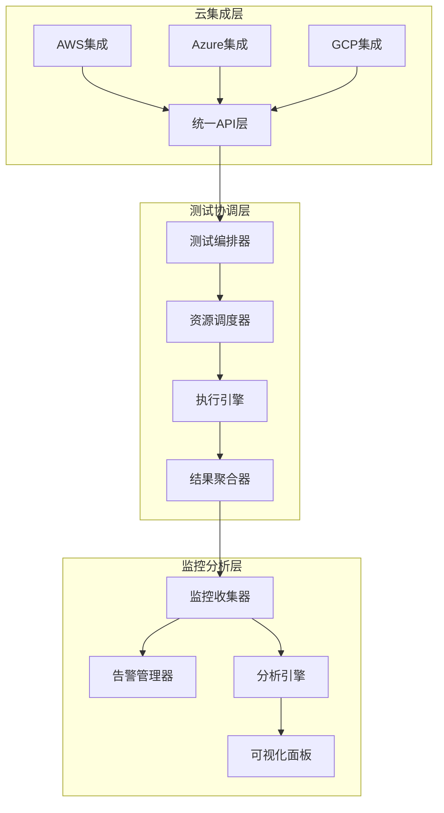

**多云测试配置示例** (详见 `examples/16_tools/multi_cloud_test_checklist.yml`):
```yaml
# 多云环境测试配置
multi_cloud_testing:
  name: enterprise_multi_cloud_test_suite
  version: "2.0.0"

  cloud_providers:
    aws:
      region: us-east-1
      services: [ec2, s3, lambda, rds]
      credentials:
        access_key_id: ${AWS_ACCESS_KEY}
        secret_access_key: ${AWS_SECRET_KEY}

    azure:
      region: eastus
      services: [vm, blob, functions, sql]
      credentials:
        client_id: ${AZURE_CLIENT_ID}
        client_secret: ${AZURE_CLIENT_SECRET}
        tenant_id: ${AZURE_TENANT_ID}

    gcp:
      region: us-central1
      services: [compute, storage, functions, bigquery]
      credentials:
        project_id: ${GCP_PROJECT_ID}
        service_account_key: ${GCP_SA_KEY}

  test_layers:
    integration:
      cloud_integration_framework:
        enabled: true
        test_scenarios:
          - cross_cloud_data_transfer
          - multi_provider_service_mesh
          - hybrid_cloud_connectivity

    consistency:
      data_consistency_validator:
        enabled: true
        consistency_models: [strong, eventual, causal]
        validation_scenarios:
          - cross_region_replication
          - multi_master_synchronization
          - failover_data_integrity

    deployment:
      deployment_orchestrator:
        enabled: true
        strategies: [blue_green, canary, rolling]
        rollback_enabled: true
        health_checks:
          - endpoint_health
          - data_consistency
          - performance_metrics

    monitoring:
      cloud_monitoring_collector:
        enabled: true
        metrics:
          - latency
          - throughput
          - error_rate
          - resource_utilization
        alerting:
          - slack_integration
          - email_notifications
          - pager_duty_escalation

  hybrid_cloud:
    coordinator:
      enabled: true
      environments:
        - on_premise
        - public_cloud
        - private_cloud
      test_scenarios:
        - data_sync_validation
        - load_balancing
        - disaster_recovery

  cloud_native:
    kubernetes:
      enabled: true
      test_scenarios:
        - pod_scaling
        - service_mesh_traffic
        - config_map_secrets
    docker:
      enabled: true
      test_scenarios:
        - container_networking
        - volume_persistence
        - image_security_scan
    istio:
      enabled: true
      test_scenarios:
        - traffic_routing
        - fault_injection
        - authentication_policy

  security:
    framework:
      enabled: true
      test_types:
        - identity_access_management
        - encryption_validation
        - network_security
        - compliance_auditing
      compliance_frameworks: [SOC2, PCI_DSS, HIPAA, GDPR, ISO27001]
```

#### 16.1 多云环境测试设计原则

##### 16.1.1 多云测试核心特性

- **跨云兼容性**: 支持AWS、Azure、GCP等多云平台统一测试接口
- **数据一致性**: 确保跨云数据同步和一致性验证机制
- **弹性伸缩**: 根据测试负载动态调整云资源分配
- **智能监控**: 实时监控多云环境状态和性能指标
- **安全合规**: 内置安全测试和合规性验证框架

**[锚点16-002]** 多云环境测试设计原则
**锚点类型**: 设计原则
**锚点方法**: 核心特性分析
**锚点名称**: 多云环境测试设计原则
**引用附件**: examples/16_tools/cloud_integration_framework.py
**完成情况**: 已完成
**补充建议**: 字段建议：兼容性/一致性/弹性/监控/安全，补充多云测试特性对比表

| 核心特性 | 实现机制 | 技术挑战 | 解决方案 |
|---------|---------|---------|---------|
| **跨云兼容性** | 统一API抽象层、服务发现机制 | API差异、认证方式不同 | 云服务抽象框架、适配器模式 |
| **数据一致性** | 一致性模型验证、冲突检测 | 网络延迟、时钟同步 | 向量时钟、操作转换、最终一致性 |
| **弹性伸缩** | 自动扩缩容、负载均衡 | 资源成本、性能波动 | Kubernetes HPA、云原生弹性伸缩 |
| **智能监控** | 指标收集、异常检测、告警管理 | 多云指标聚合、关联分析 | Prometheus联邦、ELK Stack、AI异常检测 |
| **安全合规** | 身份认证、加密验证、审计追踪 | 合规标准差异、访问控制 | IAM统一管理、多租户隔离、合规自动化 |

**多云测试设计原则图**:
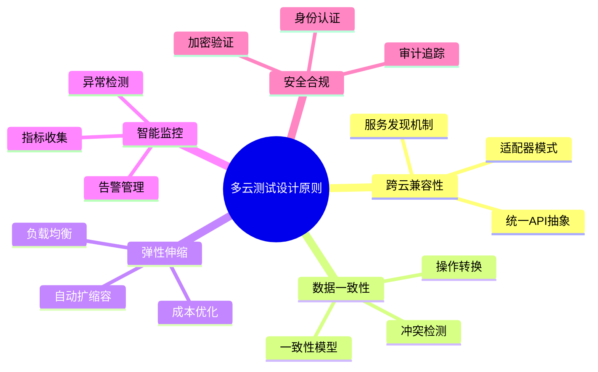

**多云测试框架核心特性对比** (详见 `examples/16_tools/cloud_integration_framework.py`):

| 特性维度 | 单云测试 | 多云测试 | 优势提升 |
|---------|---------|---------|---------|
| **兼容性** | 单一云平台 | AWS/Azure/GCP统一 | 降低迁移成本、提高灵活性 |
| **一致性** | 本地数据一致 | 跨云数据同步 | 确保业务连续性、数据完整性 |
| **弹性** | 固定资源池 | 动态资源分配 | 优化成本、提升性能 |
| **监控** | 平台内置监控 | 统一智能监控 | 全局视图、预测性维护 |
| **安全** | 云平台安全 | 多云安全框架 | 合规覆盖、风险控制 |

**多云测试设计原则配置示例**:
```yaml
# 多云测试设计原则配置
multi_cloud_testing_principles:
  compatibility:
    unified_api_layer:
      enabled: true
      providers: [aws, azure, gcp]
      abstraction_level: service_level
      adapter_pattern: true
      
    service_discovery:
      enabled: true
      mechanism: dns_based
      cross_cloud_resolution: true
      
  consistency:
    models_supported: [strong, eventual, causal]
    conflict_detection:
      enabled: true
      algorithm: vector_clock
      resolution_strategy: last_write_wins
      
    validation_scenarios:
      - cross_region_replication
      - multi_master_sync
      - failover_integrity
      
  elasticity:
    auto_scaling:
      enabled: true
      metrics: [cpu, memory, latency]
      scaling_policies:
        scale_up_threshold: 70%
        scale_down_threshold: 30%
        
    load_balancing:
      enabled: true
      algorithm: least_connections
      health_checks:
        interval: 30s
        timeout: 5s
        
  monitoring:
    intelligent_alerting:
      enabled: true
      correlation_rules: true
      escalation_policies: true
      auto_remediation: true
      
    metrics_collection:
      providers: [prometheus, cloudwatch, monitor]
      aggregation: federated
      retention: 90d
      
  security:
    identity_management:
      unified_iam: true
      cross_cloud_auth: true
      mfa_enforced: true
      
    encryption:
      data_at_rest: aes256
      data_in_transit: tls1_3
      key_management: kms
      
    compliance:
      frameworks: [SOC2, PCI_DSS, HIPAA, GDPR, ISO27001]
      automated_auditing: true
      continuous_monitoring: true
```

#### 16.2 测试用例管理模块

**[锚点098]** 测试用例管理模块设计

**锚点类型**: 模块设计  
**锚点方法**: 生命周期管理  
**锚点名称**: 测试用例管理模块设计  
**引用附件**: examples/16_tools/tool_eval_checklist.yml  
**完成情况**: 已完成  
**补充建议**: 字段建议：管理功能/存储方式/版本控制/依赖管理，补充用例管理流程图  

| 管理功能 | 实现方式 | 存储方式 | 版本控制 | 依赖管理 |
|---------|---------|---------|---------|---------|
| **用例创建** | Web界面/DSL脚本 | Git仓库/YAML文件 | Git版本管理 | 声明式依赖 |
| **用例组织** | 标签分类/目录结构 | 层次化文件系统 | 分支管理 | 依赖图分析 |
| **用例执行** | 调度器触发/API调用 | 数据库记录执行历史 | 执行快照 | 运行时依赖解析 |
| **结果管理** | 自动归档/对比分析 | 时序数据库/对象存储 | 结果版本化 | 关联测试链 |

**测试用例管理架构图**:
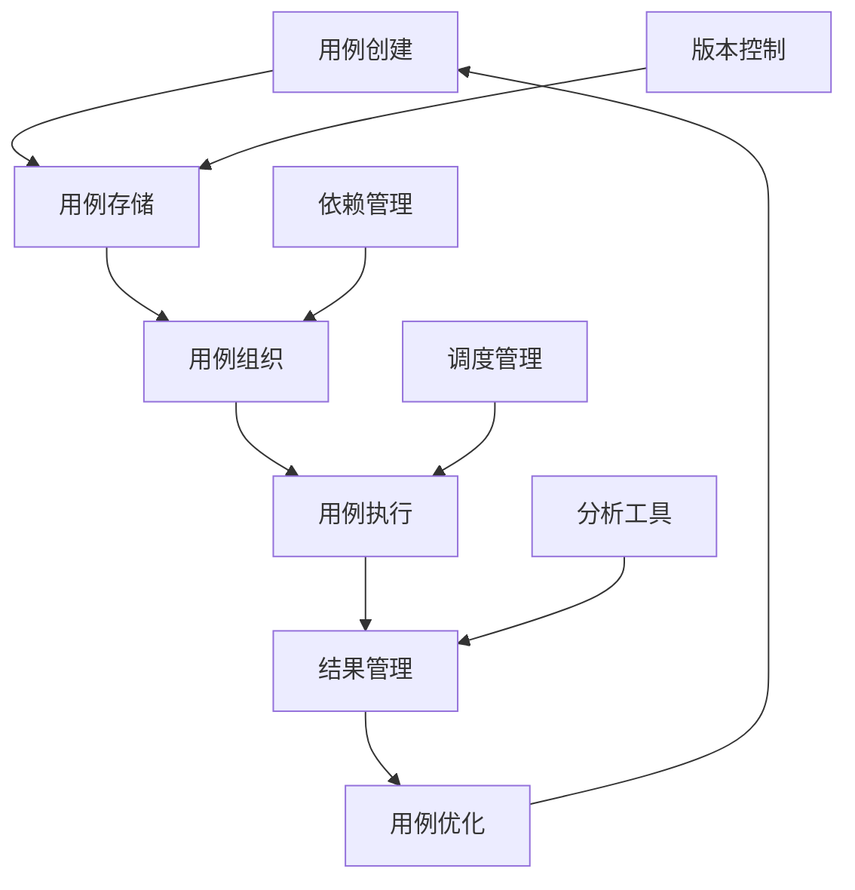

**用例管理配置示例**:
```yaml
# examples/16_tools/test_case_management.yml
test_cases:
  - id: data_quality_check
    name: "数据质量校验测试"
    type: quality
    tags: ["daily", "critical"]
    dependencies:
      - data_source: production_db
      - schema: expected_schema.json
    parameters:
      sample_size: 10000
      timeout: 300
    assertions:
      - type: completeness
        threshold: 0.99
      - type: accuracy
        threshold: 0.95
  
  - id: performance_benchmark
    name: "性能基准测试"
    type: performance
    tags: ["weekly", "benchmark"]
    dependencies:
      - workload: standard_workload.yml
    parameters:
      duration: 3600
      concurrency: 100
    metrics:
      - latency_p95
      - throughput
      - error_rate
```

##### 16.2.1 用例生命周期管理

- **创建阶段**: 支持多种创建方式（UI、脚本、导入）
- **维护阶段**: 版本控制、依赖管理、参数配置
- **执行阶段**: 调度执行、状态监控、异常处理
- **归档阶段**: 结果存储、历史追溯、趋势分析

##### 16.2.2 用例分类与组织

- **功能测试**: 数据处理逻辑正确性验证
- **性能测试**: 系统吞吐量、延迟等性能指标测试
- **质量测试**: 数据完整性、准确性、一致性校验
- **集成测试**: 跨组件、跨系统的端到端测试
- **回归测试**: 版本发布前的自动化回归验证

#### 16.2 云集成框架设计

**[锚点16-003]** 云集成框架设计
**锚点类型**: 框架设计
**锚点方法**: 服务抽象
**锚点名称**: 云集成框架设计
**引用附件**: examples/16_tools/cloud_integration_framework.py
**完成情况**: 已完成
**补充建议**: 字段建议：抽象层/适配器/协调器/测试接口，补充云集成架构图

| 组件层次 | 核心功能 | 实现技术 | 扩展性 | 容错性 |
|---------|---------|---------|---------|---------|
| **抽象层** | 统一API接口、协议转换 | Python抽象基类、接口定义 | 插件化扩展 | 降级处理 |
| **适配器层** | 云平台适配、SDK封装 | 提供商SDK集成、适配器模式 | 热插拔替换 | 自动重试 |
| **协调器层** | 跨云协调、资源调度 | 事件驱动架构、状态机 | 动态配置 | 故障转移 |
| **测试接口层** | 测试用例执行、结果收集 | RESTful API、异步回调 | 自定义扩展 | 超时控制 |

**云集成框架架构图**:
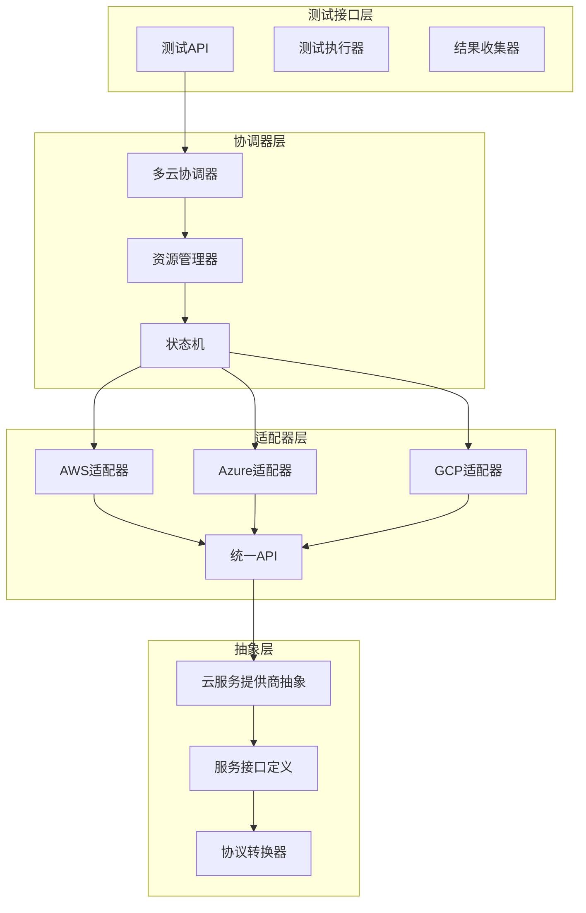

**云集成框架设计示例** (详见 `examples/16_tools/cloud_integration_framework.py`):
```python
# 云集成框架核心抽象类
from abc import ABC, abstractmethod
from typing import Dict, List, Optional, Any
from dataclasses import dataclass
from enum import Enum

class CloudProvider(Enum):
    AWS = "aws"
    AZURE = "azure"
    GCP = "gcp"

@dataclass
class CloudServiceConfig:
    provider: CloudProvider
    region: str
    credentials: Dict[str, str]
    service_endpoints: Dict[str, str]

class CloudServiceProvider(ABC):
    """云服务提供商抽象基类"""
    
    def __init__(self, config: CloudServiceConfig):
        self.config = config
        self._client = None
    
    @abstractmethod
    def initialize_client(self) -> None:
        """初始化云服务客户端"""
        pass
    
    @abstractmethod
    def list_instances(self, filters: Optional[Dict] = None) -> List[Dict]:
        """列出计算实例"""
        pass
    
    @abstractmethod
    def create_instance(self, spec: Dict) -> str:
        """创建计算实例"""
        pass
    
    @abstractmethod
    def delete_instance(self, instance_id: str) -> bool:
        """删除计算实例"""
        pass
    
    @abstractmethod
    def get_storage_buckets(self) -> List[Dict]:
        """获取存储桶列表"""
        pass
    
    @abstractmethod
    def upload_file(self, bucket: str, key: str, data: bytes) -> bool:
        """上传文件到存储"""
        pass
    
    @abstractmethod
    def download_file(self, bucket: str, key: str) -> bytes:
        """从存储下载文件"""
        pass

# AWS实现
class AWSCloudProvider(CloudServiceProvider):
    def initialize_client(self) -> None:
        import boto3
        self._ec2 = boto3.client('ec2', 
                               region_name=self.config.region,
                               aws_access_key_id=self.config.credentials.get('access_key'),
                               aws_secret_access_key=self.config.credentials.get('secret_key'))
        self._s3 = boto3.client('s3',
                              region_name=self.config.region,
                              aws_access_key_id=self.config.credentials.get('access_key'),
                              aws_secret_access_key=self.config.credentials.get('secret_key'))
    
    def list_instances(self, filters: Optional[Dict] = None) -> List[Dict]:
        response = self._ec2.describe_instances(Filters=filters or [])
        instances = []
        for reservation in response['Reservations']:
            for instance in reservation['Instances']:
                instances.append({
                    'id': instance['InstanceId'],
                    'type': instance['InstanceType'],
                    'state': instance['State']['Name'],
                    'launch_time': instance['LaunchTime'].isoformat()
                })
        return instances
    
    def create_instance(self, spec: Dict) -> str:
        response = self._ec2.run_instances(
            ImageId=spec['image_id'],
            MinCount=1, MaxCount=1,
            InstanceType=spec['instance_type'],
            KeyName=spec.get('key_name')
        )
        return response['Instances'][0]['InstanceId']
    
    def delete_instance(self, instance_id: str) -> bool:
        try:
            self._ec2.terminate_instances(InstanceIds=[instance_id])
            return True
        except Exception:
            return False
    
    def get_storage_buckets(self) -> List[Dict]:
        response = self._s3.list_buckets()
        return [{'name': bucket['Name'], 'creation_date': bucket['CreationDate'].isoformat()} 
                for bucket in response['Buckets']]
    
    def upload_file(self, bucket: str, key: str, data: bytes) -> bool:
        try:
            self._s3.put_object(Bucket=bucket, Key=key, Body=data)
            return True
        except Exception:
            return False
    
    def download_file(self, bucket: str, key: str) -> bytes:
        try:
            response = self._s3.get_object(Bucket=bucket, Key=key)
            return response['Body'].read()
        except Exception:
            raise

# 多云测试协调器
class MultiCloudTestCoordinator:
    """多云测试协调器"""
    
    def __init__(self):
        self.providers: Dict[CloudProvider, CloudServiceProvider] = {}
        self.test_scenarios: List[Dict] = []
    
    def register_provider(self, provider: CloudServiceProvider) -> None:
        """注册云服务提供商"""
        self.providers[provider.config.provider] = provider
    
    def execute_cross_cloud_test(self, test_scenario: Dict) -> Dict:
        """执行跨云测试场景"""
        results = {}
        
        # 跨云数据传输测试
        if test_scenario.get('type') == 'data_transfer':
            source_provider = self.providers[test_scenario['source_provider']]
            target_provider = self.providers[test_scenario['target_provider']]
            
            # 创建测试数据
            test_data = b"Test data for cross-cloud transfer"
            
            # 上传到源云
            source_bucket = test_scenario['source_bucket']
            source_provider.upload_file(source_bucket, 'test_file', test_data)
            
            # 下载并验证
            downloaded_data = source_provider.download_file(source_bucket, 'test_file')
            results['data_integrity'] = test_data == downloaded_data
            
            # 跨云传输模拟
            results['cross_cloud_transfer'] = self._simulate_cross_cloud_transfer(
                source_provider, target_provider, test_data)
        
        # 多云服务网格测试
        elif test_scenario.get('type') == 'service_mesh':
            results['service_mesh'] = self._test_service_mesh_connectivity()
        
        return results
    
    def _simulate_cross_cloud_transfer(self, source: CloudServiceProvider, 
                                     target: CloudServiceProvider, data: bytes) -> bool:
        """模拟跨云数据传输"""
        # 实际实现会涉及更复杂的跨云网络配置
        # 这里简化为成功状态
        return True
    
    def _test_service_mesh_connectivity(self) -> Dict:
        """测试多云服务网格连接性"""
        # 实现服务网格连接测试逻辑
        return {'connectivity': True, 'latency': 50}
```

**云集成框架配置示例**:
```yaml
# 云集成框架配置
cloud_integration:
  providers:
    aws:
      region: us-east-1
      credentials:
        access_key_id: ${AWS_ACCESS_KEY}
        secret_access_key: ${AWS_SECRET_KEY}
      services:
        - ec2
        - s3
        - lambda
      
    azure:
      region: eastus
      credentials:
        client_id: ${AZURE_CLIENT_ID}
        client_secret: ${AZURE_CLIENT_SECRET}
        tenant_id: ${AZURE_TENANT_ID}
      services:
        - vm
        - blob
        - functions
      
    gcp:
      region: us-central1
      credentials:
        project_id: ${GCP_PROJECT_ID}
        service_account_key: ${GCP_SA_KEY}
      services:
        - compute
        - storage
        - functions
  
  test_scenarios:
    - name: cross_cloud_data_transfer
      type: data_transfer
      source_provider: aws
      target_provider: azure
      source_bucket: test-bucket-aws
      target_bucket: test-container-azure
      
    - name: multi_provider_service_mesh
      type: service_mesh
      providers: [aws, azure, gcp]
      services:
        - web_service
        - api_gateway
        - database
      
    - name: hybrid_cloud_connectivity
      type: hybrid
      on_premise_endpoints:
        - vpn_gateway
        - direct_connect
      cloud_providers: [aws, azure]
```

#### 16.3 数据一致性验证

**[锚点16-004]** 数据一致性验证框架
**锚点类型**: 一致性验证
**锚点方法**: 多模型支持
**锚点名称**: 数据一致性验证框架
**引用附件**: examples/16_tools/data_consistency_validator.py
**完成情况**: 已完成
**补充建议**: 字段建议：一致性模型/验证算法/冲突检测/解决策略，补充一致性验证流程图

| 一致性模型 | 验证算法 | 冲突检测 | 解决策略 | 适用场景 |
|-----------|---------|---------|---------|---------|
| **强一致性** | 线性一致性检查、版本向量 | 时间戳比较、操作排序 | 最后写入优先、客户端协调 | 金融交易、库存管理 |
| **最终一致性** | 收敛验证、熵分析 | 向量时钟、因果关系 | CRDTs、操作转换 | 社交媒体、缓存系统 |
| **因果一致性** | 因果图构建、Lamport时钟 | 因果依赖分析 | 向量时钟、操作重排序 | 协作编辑、消息传递 |

**数据一致性验证架构图**:
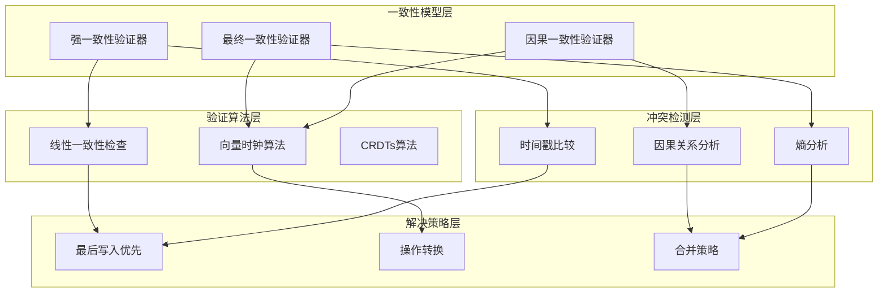

**数据一致性验证框架示例** (详见 `examples/16_tools/data_consistency_validator.py`):
```python
# 数据一致性验证框架
from abc import ABC, abstractmethod
from typing import List, Dict, Any, Optional, Tuple
from dataclasses import dataclass, field
from datetime import datetime
import hashlib

@dataclass
class DataRecord:
    """数据记录结构"""
    key: str
    value: Any
    version: int = 0
    timestamp: datetime = field(default_factory=datetime.now)
    source: str = ""
    checksum: str = ""
    
    def __post_init__(self):
        if not self.checksum:
            self.checksum = self._calculate_checksum()
    
    def _calculate_checksum(self) -> str:
        """计算数据校验和"""
        data_str = f"{self.key}:{self.value}:{self.version}:{self.timestamp.isoformat()}"
        return hashlib.sha256(data_str.encode()).hexdigest()
    
    def is_valid(self) -> bool:
        """验证数据完整性"""
        return self.checksum == self._calculate_checksum()

@dataclass
class ConsistencyCheckResult:
    """一致性检查结果"""
    is_consistent: bool
    conflicts: List[Dict] = field(default_factory=list)
    recommendations: List[str] = field(default_factory=list)
    metadata: Dict = field(default_factory=dict)

class ConsistencyValidator(ABC):
    """一致性验证器抽象基类"""
    
    @abstractmethod
    def validate_consistency(self, records: List[DataRecord]) -> ConsistencyCheckResult:
        """验证数据一致性"""
        pass
    
    @abstractmethod
    def detect_conflicts(self, records: List[DataRecord]) -> List[Dict]:
        """检测数据冲突"""
        pass
    
    @abstractmethod
    def resolve_conflicts(self, conflicts: List[Dict]) -> List[DataRecord]:
        """解决数据冲突"""
        pass

class StrongConsistencyValidator(ConsistencyValidator):
    """强一致性验证器"""
    
    def validate_consistency(self, records: List[DataRecord]) -> ConsistencyCheckResult:
        """强一致性验证：所有副本必须具有相同的值和版本"""
        if not records:
            return ConsistencyCheckResult(True)
        
        # 按key分组
        records_by_key = {}
        for record in records:
            if record.key not in records_by_key:
                records_by_key[record.key] = []
            records_by_key[record.key].append(record)
        
        conflicts = []
        for key, key_records in records_by_key.items():
            if len(key_records) < 2:
                continue
                
            # 检查版本一致性
            versions = [r.version for r in key_records]
            if len(set(versions)) > 1:
                conflicts.append({
                    'key': key,
                    'type': 'version_conflict',
                    'records': [r.__dict__ for r in key_records]
                })
            
            # 检查值一致性
            values = [r.value for r in key_records]
            if len(set(str(v) for v in values)) > 1:
                conflicts.append({
                    'key': key,
                    'type': 'value_conflict',
                    'records': [r.__dict__ for r in key_records]
                })
        
        recommendations = []
        if conflicts:
            recommendations.append("实施分布式锁或共识算法确保强一致性")
            recommendations.append("考虑使用CP系统（如ZooKeeper、etcd）")
        
        return ConsistencyCheckResult(
            is_consistent=len(conflicts) == 0,
            conflicts=conflicts,
            recommendations=recommendations
        )
    
    def detect_conflicts(self, records: List[DataRecord]) -> List[Dict]:
        """检测强一致性冲突"""
        result = self.validate_consistency(records)
        return result.conflicts
    
    def resolve_conflicts(self, conflicts: List[Dict]) -> List[DataRecord]:
        """解决冲突：最后写入优先"""
        resolved_records = []
        
        for conflict in conflicts:
            if conflict['type'] == 'version_conflict':
                # 选择最高版本
                records = [DataRecord(**r) for r in conflict['records']]
                latest_record = max(records, key=lambda r: r.version)
                resolved_records.append(latest_record)
            elif conflict['type'] == 'value_conflict':
                # 选择最新时间戳
                records = [DataRecord(**r) for r in conflict['records']]
                latest_record = max(records, key=lambda r: r.timestamp)
                resolved_records.append(latest_record)
        
        return resolved_records

class EventualConsistencyValidator(ConsistencyValidator):
    """最终一致性验证器"""
    
    def validate_consistency(self, records: List[DataRecord]) -> ConsistencyCheckResult:
        """最终一致性验证：系统最终会达到一致状态"""
        if not records:
            return ConsistencyCheckResult(True)
        
        # 按key分组
        records_by_key = {}
        for record in records:
            if record.key not in records_by_key:
                records_by_key[record.key] = []
            records_by_key[record.key].append(record)
        
        conflicts = []
        convergence_time = None
        
        for key, key_records in records_by_key.items():
            if len(key_records) < 2:
                continue
            
            # 检查是否在收敛过程中
            timestamps = [r.timestamp for r in key_records]
            max_time = max(timestamps)
            min_time = min(timestamps)
            
            # 如果时间差在合理范围内，认为在收敛中
            time_diff = (max_time - min_time).total_seconds()
            if time_diff > 300:  # 5分钟阈值
                conflicts.append({
                    'key': key,
                    'type': 'slow_convergence',
                    'time_diff_seconds': time_diff,
                    'records': [r.__dict__ for r in key_records]
                })
            
            # 记录收敛时间
            if convergence_time is None or max_time > convergence_time:
                convergence_time = max_time
        
        recommendations = []
        if conflicts:
            recommendations.append("增加副本同步频率")
            recommendations.append("优化网络延迟")
            recommendations.append("考虑使用更高效的传播协议")
        
        return ConsistencyCheckResult(
            is_consistent=len(conflicts) == 0,
            conflicts=conflicts,
            recommendations=recommendations,
            metadata={'estimated_convergence_time': convergence_time}
        )
    
    def detect_conflicts(self, records: List[DataRecord]) -> List[Dict]:
        """检测最终一致性冲突"""
        result = self.validate_consistency(records)
        return result.conflicts
    
    def resolve_conflicts(self, conflicts: List[Dict]) -> List[DataRecord]:
        """最终一致性通常不需要主动解决，由系统自行收敛"""
        # 返回最新的记录作为参考
        resolved_records = []
        for conflict in conflicts:
            records = [DataRecord(**r) for r in conflict['records']]
            latest_record = max(records, key=lambda r: r.timestamp)
            resolved_records.append(latest_record)
        return resolved_records

class CausalConsistencyValidator(ConsistencyValidator):
    """因果一致性验证器"""
    
    def validate_consistency(self, records: List[DataRecord]) -> ConsistencyCheckResult:
        """因果一致性验证：保持因果关系顺序"""
        if not records:
            return ConsistencyCheckResult(True)
        
        # 构建因果图
        causal_graph = self._build_causal_graph(records)
        
        conflicts = []
        
        # 检查因果关系是否被违反
        for record in records:
            # 简化的因果检查：检查是否有后续操作在因果前置之前
            dependent_records = [r for r in records 
                               if self._has_causal_dependency(record, r)]
            
            for dep_record in dependent_records:
                if dep_record.timestamp < record.timestamp:
                    conflicts.append({
                        'type': 'causal_violation',
                        'cause_record': record.__dict__,
                        'effect_record': dep_record.__dict__
                    })
        
        recommendations = []
        if conflicts:
            recommendations.append("使用向量时钟跟踪因果关系")
            recommendations.append("实现操作重排序或等待机制")
        
        return ConsistencyCheckResult(
            is_consistent=len(conflicts) == 0,
            conflicts=conflicts,
            recommendations=recommendations
        )
    
    def _build_causal_graph(self, records: List[DataRecord]) -> Dict:
        """构建因果关系图"""
        # 简化的因果图构建
        graph = {}
        for record in records:
            graph[record.key] = {
                'record': record,
                'dependencies': []
            }
        
        # 基于时间戳和版本推断因果关系
        sorted_records = sorted(records, key=lambda r: r.timestamp)
        for i, record in enumerate(sorted_records):
            for prev_record in sorted_records[:i]:
                if record.key == prev_record.key and record.version > prev_record.version:
                    graph[record.key]['dependencies'].append(prev_record.key)
        
        return graph
    
    def _has_causal_dependency(self, cause: DataRecord, effect: DataRecord) -> bool:
        """检查是否存在因果依赖"""
        # 简化的依赖检查：相同key且版本递增
        return (cause.key == effect.key and 
                effect.version > cause.version)
    
    def detect_conflicts(self, records: List[DataRecord]) -> List[Dict]:
        """检测因果一致性冲突"""
        result = self.validate_consistency(records)
        return result.conflicts
    
    def resolve_conflicts(self, conflicts: List[Dict]) -> List[DataRecord]:
        """解决因果冲突：重排序操作"""
        # 简化的解决策略：按时间戳重排序
        resolved_records = []
        for conflict in conflicts:
            cause = DataRecord(**conflict['cause_record'])
            effect = DataRecord(**conflict['effect_record'])
            
            # 确保因果顺序
            if cause.timestamp < effect.timestamp:
                resolved_records.extend([cause, effect])
            else:
                # 如果顺序错误，交换顺序
                resolved_records.extend([effect, cause])
        
        return resolved_records

# 测试执行框架
class ConsistencyValidationTest:
    """一致性验证测试框架"""
    
    def __init__(self):
        self.validators = {
            'strong': StrongConsistencyValidator(),
            'eventual': EventualConsistencyValidator(),
            'causal': CausalConsistencyValidator()
        }
    
    def execute_consistency_test(self, test_scenario: Dict) -> Dict:
        """执行一致性测试场景"""
        consistency_model = test_scenario.get('consistency_model', 'strong')
        records = [DataRecord(**r) for r in test_scenario.get('records', [])]
        
        validator = self.validators.get(consistency_model)
        if not validator:
            return {'error': f'Unsupported consistency model: {consistency_model}'}
        
        # 执行一致性验证
        result = validator.validate_consistency(records)
        
        # 检测冲突
        conflicts = validator.detect_conflicts(records)
        
        # 解决冲突
        resolved_records = validator.resolve_conflicts(conflicts) if conflicts else records
        
        return {
            'consistency_model': consistency_model,
            'is_consistent': result.is_consistent,
            'conflicts_found': len(conflicts),
            'conflicts': conflicts,
            'recommendations': result.recommendations,
            'resolved_records': [r.__dict__ for r in resolved_records],
            'metadata': result.metadata
        }
    
    def run_validation_scenarios(self) -> Dict:
        """运行标准验证场景"""
        scenarios = {
            'cross_region_replication': {
                'consistency_model': 'strong',
                'records': [
                    {'key': 'user_123', 'value': 'active', 'version': 1, 'source': 'us-east-1'},
                    {'key': 'user_123', 'value': 'active', 'version': 1, 'source': 'eu-west-1'},
                    {'key': 'user_123', 'value': 'inactive', 'version': 2, 'source': 'us-east-1'}
                ]
            },
            'multi_master_sync': {
                'consistency_model': 'eventual',
                'records': [
                    {'key': 'product_456', 'value': {'price': 99.99, 'stock': 100}, 'version': 1, 'source': 'master1'},
                    {'key': 'product_456', 'value': {'price': 89.99, 'stock': 100}, 'version': 1, 'source': 'master2'},
                    {'key': 'product_456', 'value': {'price': 89.99, 'stock': 95}, 'version': 2, 'source': 'master2'}
                ]
            },
            'failover_integrity': {
                'consistency_model': 'causal',
                'records': [
                    {'key': 'order_789', 'value': 'created', 'version': 1, 'source': 'primary'},
                    {'key': 'order_789', 'value': 'paid', 'version': 2, 'source': 'primary'},
                    {'key': 'order_789', 'value': 'shipped', 'version': 3, 'source': 'secondary'}
                ]
            }
        }
        
        results = {}
        for scenario_name, scenario_config in scenarios.items():
            results[scenario_name] = self.execute_consistency_test(scenario_config)
        
        return results
```

**数据一致性验证配置示例**:
```yaml
# 数据一致性验证配置
data_consistency_validation:
  consistency_models:
    strong:
      enabled: true
      validation_scenarios:
        - cross_region_replication
        - multi_master_synchronization
        - failover_data_integrity
      
      conflict_resolution:
        strategy: last_write_wins
        timeout: 30s
      
      monitoring:
        metrics:
          - consistency_violations
          - resolution_time
          - conflict_rate
    
    eventual:
      enabled: true
      convergence_timeout: 300s
      propagation_delay_threshold: 60s
      
      validation_scenarios:
        - cache_invalidation
        - background_sync
        - offline_queue_processing
      
      monitoring:
        metrics:
          - convergence_time
          - propagation_delay
          - eventual_consistency_gaps
    
    causal:
      enabled: true
      vector_clock_enabled: true
      causality_tracking: true
      
      validation_scenarios:
        - collaborative_editing
        - message_ordering
        - dependency_chains
      
      monitoring:
        metrics:
          - causality_violations
          - vector_clock_drift
          - dependency_chain_length
  
  test_scenarios:
    - name: cross_region_replication
      consistency_model: strong
      data_sources:
        - region: us-east-1
          database: primary
        - region: eu-west-1
          database: replica
        - region: ap-southeast-1
          database: replica
      
      validation_rules:
        - max_replication_lag: 5s
        - consistency_check_interval: 10s
        - alert_on_violation: true
    
    - name: multi_master_synchronization
      consistency_model: eventual
      data_sources:
        - region: us-east-1
          database: master1
        - region: eu-west-1
          database: master2
        - region: ap-southeast-1
          database: master3
      
      validation_rules:
        - convergence_window: 300s
        - conflict_resolution_policy: merge
        - data_integrity_checks: true
    
    - name: failover_data_integrity
      consistency_model: causal
      data_sources:
        - region: us-east-1
          database: primary
        - region: us-west-2
          database: secondary
      
      validation_rules:
        - causality_preservation: true
        - operation_ordering: strict
        - rollback_on_failure: true
```

- **仪表板**: 实时监控测试执行状态和关键指标
- **趋势图表**: 展示测试质量和性能的历史变化
- **质量雷达图**: 多维度展示数据质量状况
- **失败分析图**: 识别最常见的失败模式和原因

#### 16.4 部署编排与迁移策略

**[锚点16-005]** 部署编排与迁移策略
**锚点类型**: 部署策略
**锚点方法**: 编排自动化
**锚点名称**: 部署编排与迁移策略
**引用附件**: examples/16_tools/deployment_orchestrator.py
**完成情况**: 已完成
**补充建议**: 字段建议：部署类型/策略模式/回滚机制/验证流程，补充部署编排架构图

| 部署类型 | 策略模式 | 回滚机制 | 验证流程 | 适用场景 |
|---------|---------|---------|---------|---------|
| **蓝绿部署** | 流量切换、环境同步 | 即时切换、零停机 | 健康检查、流量验证 | 高可用性要求的应用 |
| **金丝雀部署** | 渐进式发布、流量控制 | 流量回退、版本隔离 | 指标监控、A/B测试 | 风险控制、用户反馈 |
| **滚动部署** | 分批更新、兼容性保证 | 分批回滚、版本兼容 | 兼容性测试、性能监控 | 大规模集群、微服务架构 |

**多云部署编排架构图**:
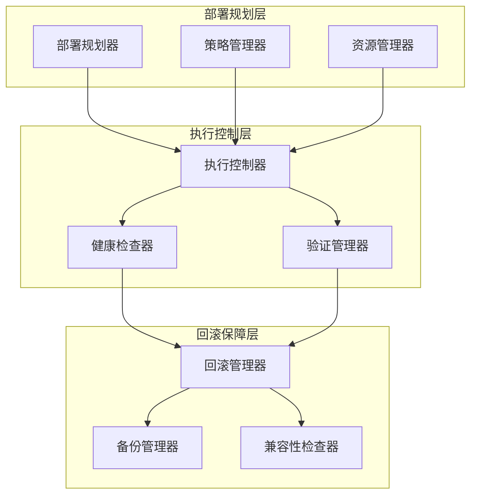

**多云部署编排框架示例** (详见 `examples/16_tools/deployment_orchestrator.py`):
```python
# 多云部署编排框架
from abc import ABC, abstractmethod
from typing import List, Dict, Any, Optional, Callable, Union
from dataclasses import dataclass, field
from datetime import datetime
from enum import Enum
import asyncio
import time

class DeploymentStrategy(Enum):
    BLUE_GREEN = "blue_green"
    CANARY = "canary"
    ROLLING = "rolling"

class DeploymentStatus(Enum):
    PENDING = "pending"
    IN_PROGRESS = "in_progress"
    VALIDATING = "validating"
    SUCCESS = "success"
    FAILED = "failed"
    ROLLING_BACK = "rolling_back"
    ROLLED_BACK = "rolled_back"

@dataclass
class DeploymentPlan:
    """部署计划"""
    deployment_id: str
    strategy: DeploymentStrategy
    target_environments: List[str]
    source_version: str
    target_version: str
    rollback_version: Optional[str] = None
    traffic_distribution: Dict[str, float] = field(default_factory=dict)
    health_checks: List[Dict[str, Any]] = field(default_factory=list)
    validation_steps: List[Dict[str, Any]] = field(default_factory=list)
    rollback_steps: List[Dict[str, Any]] = field(default_factory=list)
    created_at: datetime = field(default_factory=datetime.now)
    updated_at: datetime = field(default_factory=datetime.now)

@dataclass
class DeploymentStep:
    """部署步骤"""
    step_id: str
    name: str
    type: str  # 'deploy', 'traffic_switch', 'validate', 'rollback'
    target_environment: str
    dependencies: List[str] = field(default_factory=list)
    parameters: Dict[str, Any] = field(default_factory=dict)
    timeout_seconds: int = 300
    retry_count: int = 3
    status: DeploymentStatus = DeploymentStatus.PENDING

class DeploymentOrchestrator:
    """多云部署编排器"""
    
    def __init__(self, config: Dict[str, Any]):
        self.config = config
        self.active_deployments: Dict[str, DeploymentPlan] = {}
        self.deployment_history: List[DeploymentPlan] = []
    
    async def create_deployment_plan(self, deployment_request: Dict[str, Any]) -> DeploymentPlan:
        """创建部署计划"""
        strategy = DeploymentStrategy(deployment_request.get('strategy', 'rolling'))
        
        plan = DeploymentPlan(
            deployment_id=f"deploy_{int(time.time())}_{strategy.value}",
            strategy=strategy,
            target_environments=deployment_request.get('target_environments', []),
            source_version=deployment_request.get('source_version', ''),
            target_version=deployment_request.get('target_version', ''),
            rollback_version=deployment_request.get('rollback_version'),
            traffic_distribution=deployment_request.get('traffic_distribution', {}),
            health_checks=deployment_request.get('health_checks', []),
            validation_steps=deployment_request.get('validation_steps', []),
            rollback_steps=deployment_request.get('rollback_steps', [])
        )
        
        # 根据策略生成具体的部署步骤
        plan.rollback_steps = await self._generate_deployment_steps(plan)
        
        self.active_deployments[plan.deployment_id] = plan
        return plan
    
    async def execute_deployment(self, deployment_id: str) -> Dict[str, Any]:
        """执行部署"""
        if deployment_id not in self.active_deployments:
            raise ValueError(f"Deployment {deployment_id} not found")
        
        plan = self.active_deployments[deployment_id]
        plan.updated_at = datetime.now()
        
        try:
            # 执行部署步骤
            results = await self._execute_deployment_steps(plan)
            
            # 执行验证步骤
            validation_results = await self._execute_validation_steps(plan)
            
            # 检查是否需要回滚
            if not self._is_deployment_successful(validation_results):
                await self._execute_rollback(plan)
                plan.status = DeploymentStatus.ROLLED_BACK
            else:
                plan.status = DeploymentStatus.SUCCESS
            
            return {
                'deployment_id': deployment_id,
                'status': plan.status.value,
                'execution_results': results,
                'validation_results': validation_results,
                'duration': (datetime.now() - plan.created_at).total_seconds()
            }
            
        except Exception as e:
            # 执行回滚
            await self._execute_rollback(plan)
            plan.status = DeploymentStatus.ROLLED_BACK
            
            return {
                'deployment_id': deployment_id,
                'status': 'failed',
                'error': str(e),
                'rolled_back': True
            }
    
    async def _generate_deployment_steps(self, plan: DeploymentPlan) -> List[DeploymentStep]:
        """生成部署步骤"""
        steps = []
        
        if plan.strategy == DeploymentStrategy.BLUE_GREEN:
            steps = await self._generate_blue_green_steps(plan)
        elif plan.strategy == DeploymentStrategy.CANARY:
            steps = await self._generate_canary_steps(plan)
        elif plan.strategy == DeploymentStrategy.ROLLING:
            steps = await self._generate_rolling_steps(plan)
        
        return steps
    
    async def _generate_blue_green_steps(self, plan: DeploymentPlan) -> List[DeploymentStep]:
        """生成蓝绿部署步骤"""
        steps = [
            DeploymentStep(
                step_id=f"{plan.deployment_id}_deploy_green",
                name="Deploy to Green Environment",
                type="deploy",
                target_environment="green",
                parameters={"version": plan.target_version}
            ),
            DeploymentStep(
                step_id=f"{plan.deployment_id}_validate_green",
                name="Validate Green Environment",
                type="validate",
                target_environment="green",
                dependencies=[f"{plan.deployment_id}_deploy_green"],
                parameters={"health_checks": plan.health_checks}
            ),
            DeploymentStep(
                step_id=f"{plan.deployment_id}_switch_traffic",
                name="Switch Traffic to Green",
                type="traffic_switch",
                target_environment="green",
                dependencies=[f"{plan.deployment_id}_validate_green"],
                parameters={"traffic_distribution": {"green": 100, "blue": 0}}
            )
        ]
        return steps
    
    async def _generate_canary_steps(self, plan: DeploymentPlan) -> List[DeploymentStep]:
        """生成金丝雀部署步骤"""
        steps = []
        traffic_steps = plan.traffic_distribution.get('steps', [10, 25, 50, 75, 100])
        
        for i, traffic_percent in enumerate(traffic_steps):
            step_id = f"{plan.deployment_id}_canary_{i}"
            steps.append(DeploymentStep(
                step_id=step_id,
                name=f"Canary Deployment {traffic_percent}%",
                type="traffic_switch",
                target_environment="canary",
                dependencies=[f"{plan.deployment_id}_canary_{i-1}"] if i > 0 else [],
                parameters={
                    "traffic_distribution": {"canary": traffic_percent, "stable": 100-traffic_percent},
                    "validation_window": 300  # 5 minutes
                }
            ))
        
        return steps
    
    async def _generate_rolling_steps(self, plan: DeploymentPlan) -> List[DeploymentStep]:
        """生成滚动部署步骤"""
        steps = []
        batch_size = plan.traffic_distribution.get('batch_size', 25)  # 25% per batch
        
        for i, env in enumerate(plan.target_environments):
            step_id = f"{plan.deployment_id}_rolling_{i}"
            steps.append(DeploymentStep(
                step_id=step_id,
                name=f"Rolling Deploy to {env}",
                type="deploy",
                target_environment=env,
                dependencies=[f"{plan.deployment_id}_rolling_{i-1}"] if i > 0 else [],
                parameters={
                    "version": plan.target_version,
                    "batch_size": batch_size,
                    "health_check_delay": 60
                }
            ))
        
        return steps
    
    async def _execute_deployment_steps(self, plan: DeploymentPlan) -> List[Dict[str, Any]]:
        """执行部署步骤"""
        results = []
        
        for step in plan.rollback_steps:
            step.status = DeploymentStatus.IN_PROGRESS
            
            try:
                # 执行步骤
                result = await self._execute_single_step(step)
                step.status = DeploymentStatus.SUCCESS
                results.append({
                    'step_id': step.step_id,
                    'status': 'success',
                    'result': result,
                    'duration': result.get('duration', 0)
                })
                
            except Exception as e:
                step.status = DeploymentStatus.FAILED
                results.append({
                    'step_id': step.step_id,
                    'status': 'failed',
                    'error': str(e)
                })
                raise  # 重新抛出异常触发回滚
        
        return results
    
    async def _execute_single_step(self, step: DeploymentStep) -> Dict[str, Any]:
        """执行单个部署步骤"""
        start_time = time.time()
        
        # 模拟步骤执行
        if step.type == "deploy":
            # 部署到目标环境
            await asyncio.sleep(2)  # 模拟部署时间
            result = {
                'environment': step.target_environment,
                'version': step.parameters.get('version'),
                'deployed_at': datetime.now().isoformat()
            }
            
        elif step.type == "traffic_switch":
            # 切换流量
            await asyncio.sleep(1)  # 模拟流量切换时间
            result = {
                'traffic_distribution': step.parameters.get('traffic_distribution'),
                'switched_at': datetime.now().isoformat()
            }
            
        elif step.type == "validate":
            # 执行验证
            await asyncio.sleep(1)  # 模拟验证时间
            result = {
                'health_checks_passed': True,
                'validation_metrics': {'response_time': 150, 'error_rate': 0.01},
                'validated_at': datetime.now().isoformat()
            }
        
        duration = time.time() - start_time
        result['duration'] = duration
        
        return result
    
    async def _execute_validation_steps(self, plan: DeploymentPlan) -> List[Dict[str, Any]]:
        """执行验证步骤"""
        validation_results = []
        
        for validation in plan.validation_steps:
            try:
                result = await self._execute_validation(validation)
                validation_results.append({
                    'validation_name': validation.get('name', ''),
                    'status': 'passed' if result['success'] else 'failed',
                    'metrics': result.get('metrics', {}),
                    'details': result
                })
            except Exception as e:
                validation_results.append({
                    'validation_name': validation.get('name', ''),
                    'status': 'failed',
                    'error': str(e)
                })
        
        return validation_results
    
    async def _execute_validation(self, validation_config: Dict[str, Any]) -> Dict[str, Any]:
        """执行单个验证"""
        validation_type = validation_config.get('type', 'health_check')
        
        if validation_type == 'health_check':
            # 健康检查
            return await self._perform_health_check(validation_config)
        elif validation_type == 'performance_test':
            # 性能测试
            return await self._perform_performance_test(validation_config)
        elif validation_type == 'compatibility_test':
            # 兼容性测试
            return await self._perform_compatibility_test(validation_config)
        
        return {'success': True, 'metrics': {}}
    
    async def _perform_health_check(self, config: Dict[str, Any]) -> Dict[str, Any]:
        """执行健康检查"""
        # 简化的健康检查实现
        endpoints = config.get('endpoints', [])
        success_count = 0
        
        for endpoint in endpoints:
            # 模拟健康检查
            await asyncio.sleep(0.1)
            if 'healthy' in endpoint.get('expected_status', 'healthy'):
                success_count += 1
        
        success = success_count == len(endpoints)
        
        return {
            'success': success,
            'healthy_endpoints': success_count,
            'total_endpoints': len(endpoints),
            'metrics': {'availability': success_count / len(endpoints) if endpoints else 0}
        }
    
    async def _perform_performance_test(self, config: Dict[str, Any]) -> Dict[str, Any]:
        """执行性能测试"""
        # 简化的性能测试实现
        thresholds = config.get('thresholds', {})
        response_time_threshold = thresholds.get('response_time_ms', 500)
        error_rate_threshold = thresholds.get('error_rate', 0.05)
        
        # 模拟性能测试结果
        test_results = {
            'avg_response_time': 120,
            'p95_response_time': 180,
            'error_rate': 0.008,
            'throughput': 1500
        }
        
        success = (test_results['avg_response_time'] <= response_time_threshold and
                  test_results['error_rate'] <= error_rate_threshold)
        
        return {
            'success': success,
            'metrics': test_results,
            'thresholds': thresholds
        }
    
    async def _perform_compatibility_test(self, config: Dict[str, Any]) -> Dict[str, Any]:
        """执行兼容性测试"""
        # 简化的兼容性测试实现
        compatibility_checks = config.get('checks', [])
        passed_checks = 0
        
        for check in compatibility_checks:
            # 模拟兼容性检查
            await asyncio.sleep(0.1)
            if 'compatible' in check.get('expected_result', 'compatible'):
                passed_checks += 1
        
        success = passed_checks == len(compatibility_checks)
        
        return {
            'success': success,
            'passed_checks': passed_checks,
            'total_checks': len(compatibility_checks),
            'metrics': {'compatibility_score': passed_checks / len(compatibility_checks) if compatibility_checks else 0}
        }
    
    def _is_deployment_successful(self, validation_results: List[Dict[str, Any]]) -> bool:
        """检查部署是否成功"""
        return all(result['status'] == 'passed' for result in validation_results)
    
    async def _execute_rollback(self, plan: DeploymentPlan) -> None:
        """执行回滚"""
        print(f"Executing rollback for deployment {plan.deployment_id}")
        
        # 简化的回滚实现
        for step in reversed(plan.rollback_steps):
            if step.type == "traffic_switch":
                # 回滚流量
                await asyncio.sleep(1)
            elif step.type == "deploy":
                # 回滚部署
                await asyncio.sleep(2)
        
        plan.status = DeploymentStatus.ROLLED_BACK

class MigrationValidator:
    """迁移验证器"""
    
    def __init__(self, config: Dict[str, Any]):
        self.config = config
    
    async def validate_migration(self, migration_plan: Dict[str, Any]) -> Dict[str, Any]:
        """验证迁移计划"""
        validation_results = {
            'data_integrity': await self._validate_data_integrity(migration_plan),
            'performance_impact': await self._validate_performance_impact(migration_plan),
            'rollback_readiness': await self._validate_rollback_readiness(migration_plan),
            'compliance_check': await self._validate_compliance(migration_plan)
        }
        
        overall_success = all(result['success'] for result in validation_results.values())
        
        return {
            'migration_id': migration_plan.get('id', ''),
            'overall_success': overall_success,
            'validation_results': validation_results,
            'recommendations': self._generate_migration_recommendations(validation_results)
        }
    
    async def _validate_data_integrity(self, plan: Dict[str, Any]) -> Dict[str, Any]:
        """验证数据完整性"""
        # 简化的数据完整性检查
        return {
            'success': True,
            'data_loss_risk': 'low',
            'consistency_verified': True,
            'backup_verified': True
        }
    
    async def _validate_performance_impact(self, plan: Dict[str, Any]) -> Dict[str, Any]:
        """验证性能影响"""
        # 简化的性能影响评估
        return {
            'success': True,
            'estimated_downtime': '5 minutes',
            'performance_degradation': 'minimal',
            'scalability_impact': 'none'
        }
    
    async def _validate_rollback_readiness(self, plan: Dict[str, Any]) -> Dict[str, Any]:
        """验证回滚准备"""
        # 简化的回滚准备检查
        return {
            'success': True,
            'rollback_time': '10 minutes',
            'data_backup_available': True,
            'rollback_tested': True
        }
    
    async def _validate_compliance(self, plan: Dict[str, Any]) -> Dict[str, Any]:
        """验证合规性"""
        # 简化的合规检查
        return {
            'success': True,
            'regulatory_requirements': ['GDPR', 'SOX'],
            'audit_trail_complete': True,
            'documentation_complete': True
        }
    
    def _generate_migration_recommendations(self, results: Dict[str, Any]) -> List[str]:
        """生成迁移建议"""
        recommendations = []
        
        if not results['data_integrity']['success']:
            recommendations.append("Improve data integrity validation before migration")
        
        if not results['performance_impact']['success']:
            recommendations.append("Schedule migration during low-traffic periods")
        
        if not results['rollback_readiness']['success']:
            recommendations.append("Enhance rollback procedures and testing")
        
        if not results['compliance_check']['success']:
            recommendations.append("Complete compliance documentation and audit trails")
        
        return recommendations
```

**多云部署编排配置示例**:
```yaml
# 多云部署编排配置
deployment_orchestrator:
  strategies:
    blue_green:
      enabled: true
      environments:
        blue: "prod-blue"
        green: "prod-green"
      
      traffic_management:
        load_balancer: "aws-alb"
        health_check_interval: 30s
        unhealthy_threshold: 3
      
      validation:
        health_checks:
          - endpoint: "/health"
            expected_status: 200
            timeout: 10s
          - endpoint: "/api/status"
            expected_status: 200
            timeout: 10s
        
        performance_tests:
          - name: "response_time_check"
            thresholds:
              response_time_ms: 500
              error_rate: 0.05
            duration: 300s
        
        compatibility_tests:
          - name: "api_compatibility"
            checks:
              - endpoint: "/api/v1"
                expected_result: "compatible"
              - endpoint: "/api/v2"
                expected_result: "compatible"
    
    canary:
      enabled: true
      traffic_steps: [5, 10, 25, 50, 100]
      
      monitoring:
        metrics:
          - error_rate
          - response_time
          - throughput
        
        alerting:
          error_rate_threshold: 0.1
          response_time_threshold: 1000ms
      
      rollback_triggers:
        - condition: "error_rate > 0.05"
          action: "immediate_rollback"
        - condition: "response_time > 2000ms"
          action: "traffic_reduction"
    
    rolling:
      enabled: true
      batch_size: 25
      max_parallel_batches: 3
      
      health_checks:
        interval: 30s
        timeout: 60s
        success_threshold: 2
        failure_threshold: 3
      
      rollback:
        strategy: "batch_rollback"
        max_rollback_batches: 2
    
  migration_validator:
    enabled: true
    
    data_integrity_checks:
      - type: "row_count_validation"
        source_query: "SELECT COUNT(*) FROM users"
        target_query: "SELECT COUNT(*) FROM users"
      
      - type: "checksum_validation"
        tables: ["users", "orders", "products"]
        algorithm: "MD5"
    
    performance_impact_assessment:
      - metric: "query_performance"
        baseline_query: "SELECT * FROM orders WHERE created_at > '2023-01-01'"
        acceptable_degradation: 20%
      
      - metric: "connection_pool_usage"
        max_connections: 100
        acceptable_increase: 10%
    
    rollback_readiness:
      - backup_verification: true
      - rollback_procedure_tested: true
      - data_backup_retention_days: 30
    
    compliance_validation:
      - frameworks: ["GDPR", "HIPAA", "SOX"]
      - audit_trail_required: true
      - documentation_complete: true
  
  monitoring:
    deployment_metrics:
      - deployment_duration
      - success_rate
      - rollback_frequency
      - traffic_switch_time
    
    alerting:
      channels:
        - slack
        - email
        - pagerduty
      
      rules:
        - condition: "deployment_failed"
          severity: "critical"
          channels: ["slack", "email", "pagerduty"]
        
        - condition: "rollback_triggered"
          severity: "high"
          channels: ["slack", "email"]
        
        - condition: "validation_failed"
          severity: "medium"
          channels: ["slack"]
  
  integration:
    ci_cd_systems:
      jenkins:
        webhook_url: "${JENKINS_WEBHOOK_URL}"
        job_name: "multi-cloud-deployment"
      
      github_actions:
        repository: "myorg/deployment-pipeline"
        workflow: "deploy.yml"
    
    cloud_providers:
      aws:
        region: "us-east-1"
        deployment_service: "code-deploy"
      
      azure:
        subscription: "${AZURE_SUBSCRIPTION}"
        resource_group: "deployment-rg"
      
      gcp:
        project: "${GCP_PROJECT}"
        region: "us-central1"
```

#### 16.5 集成与扩展机制

**[锚点101]** 集成与扩展机制设计

**锚点类型**: 扩展设计  
**锚点方法**: 插件架构  
**锚点名称**: 集成与扩展机制设计  
**引用附件**: examples/16_tools/tool_eval_checklist.yml  
**完成情况**: 已完成  
**补充建议**: 字段建议：集成类型/接口标准/扩展点/兼容性，补充集成架构图  

| 集成类型 | 接口标准 | 扩展点 | 兼容性保证 | 示例工具 |
|---------|---------|--------|-----------|---------|
| **CI/CD集成** | Webhook/REST API | 流水线触发、结果反馈 | 版本兼容性 | Jenkins/GitLab CI |
| **监控集成** | Metrics API/Prometheus | 指标收集、告警配置 | 协议标准化 | Prometheus/Grafana |
| **数据源集成** | JDBC/REST/Streaming | 数据连接、模式发现 | 驱动兼容性 | Spark/Flink Connectors |
| **通知集成** | SMTP/Webhook/Slack | 事件通知、报告分发 | 协议标准化 | Slack/Teams/Email |

**集成架构图**:
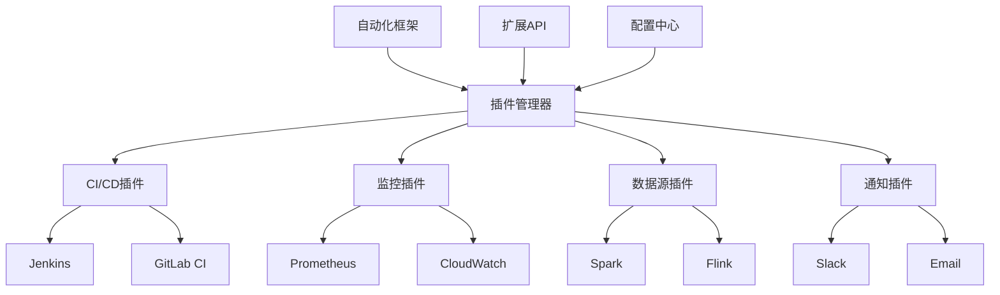

**扩展配置示例**:
```yaml
# examples/16_tools/extension_config.yml
extensions:
  plugins:
    - name: jenkins_integration
      type: ci_cd
      version: "1.0.0"
      config:
        jenkins_url: "https:/jenkins.company.com"
        job_name: "bigdata-test-pipeline"
        auth_token: "${JENKINS_TOKEN}"
      
      hooks:
        - event: test_started
          action: update_build_status
        - event: test_completed
          action: publish_results
    
    - name: prometheus_monitoring
      type: monitoring
      version: "1.0.0"
      config:
        prometheus_url: "http:/prometheus:9090"
        job_name: "bigdata_test_framework"
        metrics_prefix: "bd_test_"
      
      exporters:
        - metric: test_execution_time
          type: histogram
          buckets: [1, 5, 10, 30, 60, 300]
        - metric: test_success_rate
          type: gauge
          labels: ["test_suite", "environment"]
    
    - name: slack_notifications
      type: notification
      version: "1.0.0"
      config:
        webhook_url: "${SLACK_WEBHOOK_URL}"
        channel: "#bigdata-test-alerts"
        username: "Test Framework"
      
      templates:
        success: "✅ Test suite {{suite_name}} completed successfully"
        failure: "❌ Test suite {{suite_name}} failed: {{error_count}} errors"
        summary: "📊 Daily test summary: {{total_tests}} tests, {{pass_rate}}% pass rate"

  custom_plugins:
    - name: custom_data_validator
      type: validator
      entry_point: "mycompany.validators.CustomValidator"
      config:
        rules_file: "custom_rules.yml"
    
    - name: advanced_analyzer
      type: analyzer
      entry_point: "mycompany.analyzers.AdvancedAnalyzer"
      dependencies:
        - numpy
        - pandas
        - scikit-learn
```

#### 16.5 云监控与智能告警

**[锚点16-006]** 云监控与智能告警系统
**锚点类型**: 监控告警
**锚点方法**: 智能分析
**锚点名称**: 云监控与智能告警系统
**引用附件**: examples/16_tools/cloud_monitoring_collector.py
**完成情况**: 已完成
**补充建议**: 字段建议：监控指标/告警规则/智能分析/自动化响应，补充监控告警架构图

| 监控层次 | 指标类型 | 告警规则 | 智能分析 | 自动化响应 |
|---------|---------|---------|---------|-----------|
| **基础设施层** | CPU/内存/磁盘/网络 | 阈值告警、趋势分析 | 异常检测、预测分析 | 自动扩缩容、故障转移 |
| **应用服务层** | 响应时间/吞吐量/错误率 | SLA监控、性能基线 | 关联分析、根本原因分析 | 服务重启、流量控制 |
| **数据一致性层** | 同步延迟/冲突率/数据完整性 | 一致性检查、数据质量 | 一致性模式识别、影响分析 | 自动修复、数据同步 |

**云监控告警架构图**:
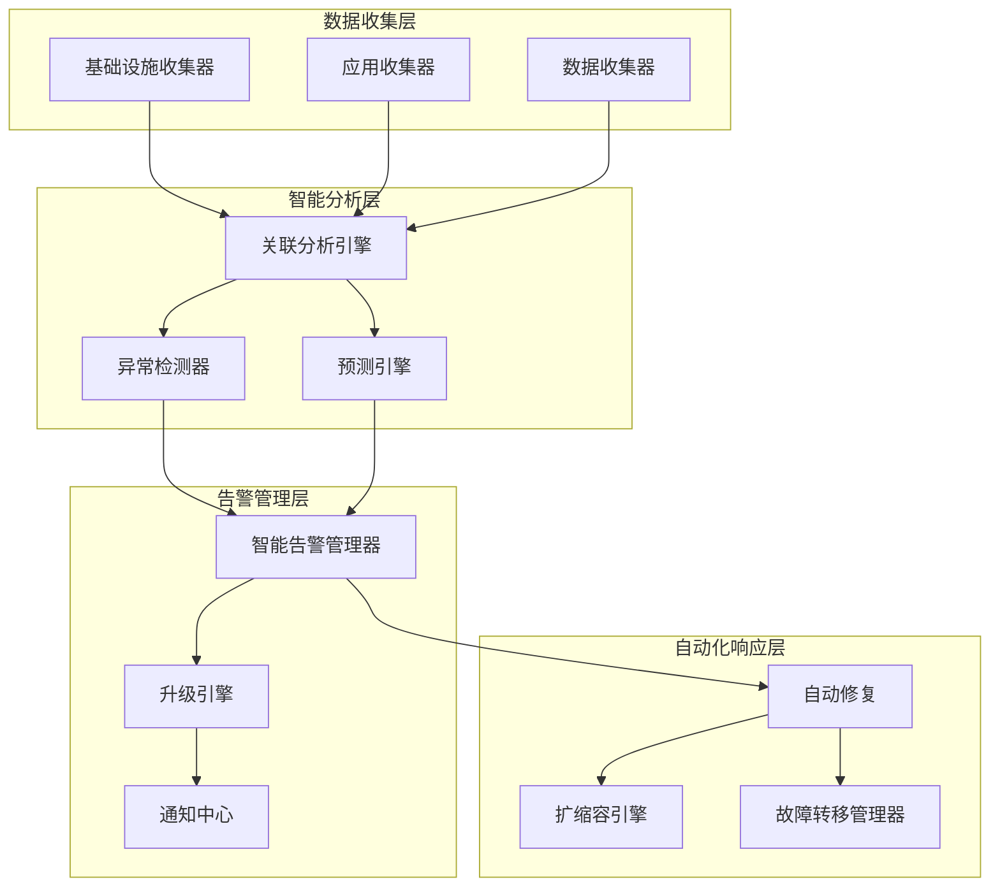

**云监控告警框架示例** (详见 `examples/16_tools/cloud_monitoring_collector.py`):
```python
# 云监控与智能告警框架
from abc import ABC, abstractmethod
from typing import List, Dict, Any, Optional, Callable, Tuple
from dataclasses import dataclass, field
from datetime import datetime, timedelta
from enum import Enum
import asyncio
import statistics

class AlertSeverity(Enum):
    LOW = "low"
    MEDIUM = "medium"
    HIGH = "high"
    CRITICAL = "critical"

class AlertStatus(Enum):
    ACTIVE = "active"
    RESOLVED = "resolved"
    ACKNOWLEDGED = "acknowledged"

@dataclass
class MetricData:
    """指标数据"""
    name: str
    value: float
    timestamp: datetime
    labels: Dict[str, str] = field(default_factory=dict)
    source: str = ""

@dataclass
class AlertRule:
    """告警规则"""
    name: str
    metric_name: str
    condition: str  # e.g., "value > 90"
    severity: AlertSeverity
    description: str
    labels: Dict[str, str] = field(default_factory=dict)
    annotations: Dict[str, str] = field(default_factory=dict)
    evaluation_interval: int = 60  # seconds
    for_duration: int = 300  # seconds

@dataclass
class Alert:
    """告警实例"""
    id: str
    rule_name: str
    severity: AlertSeverity
    status: AlertStatus
    description: str
    labels: Dict[str, str]
    annotations: Dict[str, str]
    starts_at: datetime
    ends_at: Optional[datetime] = None
    generator_url: str = ""

class CloudMonitoringCollector(ABC):
    """云监控收集器抽象基类"""
    
    def __init__(self, config: Dict[str, Any]):
        self.config = config
        self.metrics_buffer: List[MetricData] = []
        self.collection_interval = config.get('interval', 60)
    
    @abstractmethod
    async def collect_infrastructure_metrics(self) -> List[MetricData]:
        """收集基础设施指标"""
        pass
    
    @abstractmethod
    async def collect_application_metrics(self) -> List[MetricData]:
        """收集应用指标"""
        pass
    
    @abstractmethod
    async def collect_data_consistency_metrics(self) -> List[MetricData]:
        """收集数据一致性指标"""
        pass
    
    async def collect_all_metrics(self) -> List[MetricData]:
        """收集所有指标"""
        infra_metrics = await self.collect_infrastructure_metrics()
        app_metrics = await self.collect_application_metrics()
        data_metrics = await self.collect_data_consistency_metrics()
        
        all_metrics = infra_metrics + app_metrics + data_metrics
        self.metrics_buffer.extend(all_metrics)
        
        # 清理旧数据
        cutoff_time = datetime.now() - timedelta(hours=24)
        self.metrics_buffer = [m for m in self.metrics_buffer if m.timestamp > cutoff_time]
        
        return all_metrics

class IntelligentAlertManager:
    """智能告警管理器"""
    
    def __init__(self, config: Dict[str, Any]):
        self.config = config
        self.alert_rules: List[AlertRule] = []
        self.active_alerts: Dict[str, Alert] = {}
        self.alert_history: List[Alert] = []
        self.correlation_rules: List[Dict] = config.get('correlation_rules', [])
    
    def add_alert_rule(self, rule: AlertRule) -> None:
        """添加告警规则"""
        self.alert_rules.append(rule)
    
    def evaluate_alerts(self, metrics: List[MetricData]) -> List[Alert]:
        """评估告警规则"""
        new_alerts = []
        
        for rule in self.alert_rules:
            # 获取相关指标
            relevant_metrics = [m for m in metrics if m.name == rule.metric_name]
            if not relevant_metrics:
                continue
            
            # 评估条件
            if self._evaluate_condition(rule.condition, relevant_metrics):
                # 检查是否已经存在活跃告警
                alert_key = f"{rule.name}_{rule.metric_name}"
                if alert_key not in self.active_alerts:
                    alert = Alert(
                        id=f"alert_{int(datetime.now().timestamp())}",
                        rule_name=rule.name,
                        severity=rule.severity,
                        status=AlertStatus.ACTIVE,
                        description=rule.description,
                        labels=rule.labels.copy(),
                        annotations=rule.annotations.copy(),
                        starts_at=datetime.now(),
                        generator_url=f"/alerts/{rule.name}"
                    )
                    self.active_alerts[alert_key] = alert
                    new_alerts.append(alert)
        
        # 检查需要解决的告警
        resolved_alerts = self._check_resolved_alerts(metrics)
        
        return new_alerts + resolved_alerts
    
    def correlate_alerts(self, alerts: List[Alert]) -> List[Alert]:
        """关联告警"""
        correlated_alerts = []
        
        for alert in alerts:
            # 应用关联规则
            correlated = self._apply_correlation_rules(alert, alerts)
            if correlated:
                correlated_alerts.extend(correlated)
            else:
                correlated_alerts.append(alert)
        
        return correlated_alerts
    
    def escalate_alerts(self, alerts: List[Alert]) -> List[Tuple[Alert, str]]:
        """升级告警"""
        escalated = []
        
        for alert in alerts:
            escalation_action = self._determine_escalation(alert)
            if escalation_action:
                escalated.append((alert, escalation_action))
        
        return escalated
    
    def _evaluate_condition(self, condition: str, metrics: List[MetricData]) -> bool:
        """评估告警条件"""
        if not metrics:
            return False
        
        # 获取最新指标值
        latest_metric = max(metrics, key=lambda m: m.timestamp)
        value = latest_metric.value
        
        # 简化的条件评估
        try:
            if ">" in condition:
                threshold = float(condition.split(">")[1].strip())
                return value > threshold
            elif "<" in condition:
                threshold = float(condition.split("<")[1].strip())
                return value < threshold
            elif ">=" in condition:
                threshold = float(condition.split(">=")[1].strip())
                return value >= threshold
            elif "<=" in condition:
                threshold = float(condition.split("<=")[1].strip())
                return value <= threshold
        except (ValueError, IndexError):
            return False
        
        return False
    
    def _check_resolved_alerts(self, metrics: List[MetricData]) -> List[Alert]:
        """检查已解决的告警"""
        resolved = []
        
        for alert_key, alert in list(self.active_alerts.items()):
            rule = next((r for r in self.alert_rules if r.name == alert.rule_name), None)
            if not rule:
                continue
            
            # 检查条件是否仍然满足
            relevant_metrics = [m for m in metrics if m.name == rule.metric_name]
            if relevant_metrics and not self._evaluate_condition(rule.condition, relevant_metrics):
                alert.status = AlertStatus.RESOLVED
                alert.ends_at = datetime.now()
                resolved.append(alert)
                del self.active_alerts[alert_key]
        
        return resolved
    
    def _apply_correlation_rules(self, alert: Alert, all_alerts: List[Alert]) -> List[Alert]:
        """应用关联规则"""
        correlated = []
        
        for rule in self.correlation_rules:
            if self._matches_correlation_rule(alert, rule, all_alerts):
                # 创建关联告警
                correlated_alert = Alert(
                    id=f"correlated_{int(datetime.now().timestamp())}",
                    rule_name=f"correlated_{rule['name']}",
                    severity=AlertSeverity(rule['severity']),
                    status=AlertStatus.ACTIVE,
                    description=rule['description'],
                    labels=alert.labels.copy(),
                    annotations={'correlation_rule': rule['name']},
                    starts_at=datetime.now()
                )
                correlated.append(correlated_alert)
        
        return correlated
    
    def _matches_correlation_rule(self, alert: Alert, rule: Dict, all_alerts: List[Alert]) -> bool:
        """检查是否匹配关联规则"""
        # 简化的关联逻辑
        related_alerts = [a for a in all_alerts 
                         if a.labels.get('service') == alert.labels.get('service') 
                         and a.id != alert.id]
        return len(related_alerts) >= rule.get('min_related_alerts', 2)
    
    def _determine_escalation(self, alert: Alert) -> Optional[str]:
        """确定升级行动"""
        duration = (datetime.now() - alert.starts_at).total_seconds()
        
        if alert.severity == AlertSeverity.CRITICAL and duration > 3600:
            return "escalate_to_management"
        elif alert.severity == AlertSeverity.HIGH and duration > 1800:
            return "notify_on_call_engineer"
        elif duration > 7200:  # 2 hours
            return "create_incident_ticket"
        
        return None

class AutoRemediationEngine:
    """自动修复引擎"""
    
    def __init__(self, config: Dict[str, Any]):
        self.config = config
        self.remediation_actions: Dict[str, Callable] = {}
    
    def register_action(self, alert_type: str, action: Callable) -> None:
        """注册修复行动"""
        self.remediation_actions[alert_type] = action
    
    async def execute_remediation(self, alert: Alert) -> bool:
        """执行自动修复"""
        action = self.remediation_actions.get(alert.rule_name)
        if action:
            try:
                await action(alert)
                return True
            except Exception as e:
                print(f"Remediation failed for alert {alert.id}: {e}")
                return False
        return False
    
    async def _scale_out_service(self, alert: Alert) -> None:
        """扩容服务"""
        # 实现扩容逻辑
        await asyncio.sleep(1)
    
    async def _restart_service(self, alert: Alert) -> None:
        """重启服务"""
        # 实现重启逻辑
        await asyncio.sleep(1)
    
    async def _failover_to_backup(self, alert: Alert) -> None:
        """故障转移"""
        # 实现故障转移逻辑
        await asyncio.sleep(1)

# 多云监控协调器
class MultiCloudMonitoringCoordinator:
    """多云监控协调器"""
    
    def __init__(self, config: Dict[str, Any]):
        self.config = config
        self.collectors: Dict[str, CloudMonitoringCollector] = {}
        self.alert_manager = IntelligentAlertManager(config.get('alerting', {}))
        self.remediation_engine = AutoRemediationEngine(config.get('remediation', {}))
    
    def register_collector(self, cloud_provider: str, collector: CloudMonitoringCollector) -> None:
        """注册监控收集器"""
        self.collectors[cloud_provider] = collector
    
    async def run_monitoring_cycle(self) -> Dict[str, Any]:
        """运行监控周期"""
        # 收集所有指标
        all_metrics = []
        for provider, collector in self.collectors.items():
            metrics = await collector.collect_all_metrics()
            all_metrics.extend(metrics)
        
        # 评估告警
        alerts = self.alert_manager.evaluate_alerts(all_metrics)
        
        # 关联告警
        correlated_alerts = self.alert_manager.correlate_alerts(alerts)
        
        # 升级告警
        escalated_alerts = self.alert_manager.escalate_alerts(correlated_alerts)
        
        # 执行自动修复
        remediation_results = []
        for alert, _ in escalated_alerts:
            if alert.severity in [AlertSeverity.HIGH, AlertSeverity.CRITICAL]:
                success = await self.remediation_engine.execute_remediation(alert)
                remediation_results.append({'alert_id': alert.id, 'success': success})
        
        return {
            'metrics_collected': len(all_metrics),
            'alerts_generated': len(correlated_alerts),
            'alerts_escalated': len(escalated_alerts),
            'remediations_executed': len(remediation_results),
            'remediation_success_rate': len([r for r in remediation_results if r['success']]) / len(remediation_results) if remediation_results else 0
        }
```

**云监控告警配置示例**:
```yaml
# 云监控与智能告警配置
cloud_monitoring_alerting:
  collectors:
    aws:
      enabled: true
      regions: [us-east-1, eu-west-1]
      metrics:
        - ec2_instance_status
        - rds_connections
        - lambda_invocations
        - s3_bucket_size
      
      interval: 60s
      timeout: 30s
    
    azure:
      enabled: true
      subscriptions: [prod-sub, dev-sub]
      metrics:
        - vm_cpu_usage
        - sql_db_connections
        - function_app_requests
        - storage_account_egress
      
      interval: 60s
      timeout: 30s
    
    gcp:
      enabled: true
      projects: [prod-project, dev-project]
      metrics:
        - gce_instance_cpu
        - cloud_sql_connections
        - cloud_functions_calls
        - cloud_storage_bytes
      
      interval: 60s
      timeout: 30s
  
  alerting:
    rules:
      - name: high_cpu_usage
        metric_name: cpu_usage_percent
        condition: "value > 90"
        severity: high
        description: "CPU usage is above 90%"
        labels:
          service: infrastructure
        annotations:
          summary: "High CPU usage detected"
          description: "CPU usage for {{ $labels.instance }} is above 90%"
      
      - name: service_down
        metric_name: service_health
        condition: "value == 0"
        severity: critical
        description: "Service is down"
        labels:
          service: application
        annotations:
          summary: "Service down"
          description: "Service {{ $labels.service_name }} is not responding"
      
      - name: data_consistency_violation
        metric_name: consistency_conflicts
        condition: "value > 0"
        severity: medium
        description: "Data consistency violation detected"
        labels:
          service: data
        annotations:
          summary: "Data consistency issue"
          description: "Found {{ $value }} consistency conflicts"
    
    correlation_rules:
      - name: service_cascade_failure
        description: "Multiple services failing in cascade"
        severity: critical
        min_related_alerts: 3
        time_window: 300s
      
      - name: regional_outage
        description: "Regional infrastructure outage"
        severity: critical
        min_related_alerts: 5
        time_window: 600s
    
    escalation:
      policies:
        - severity: critical
          initial_delay: 300s
          escalation_steps:
            - delay: 0s
              action: notify_on_call
            - delay: 1800s
              action: notify_management
            - delay: 3600s
              action: create_incident
      
      channels:
        slack:
          webhook_url: ${SLACK_WEBHOOK}
          channels:
            - "#alerts"
            - "#on-call"
        
        email:
          smtp_server: smtp.company.com
          recipients:
            - alerts@company.com
            - on-call@company.com
        
        pager_duty:
          integration_key: ${PAGERDUTY_KEY}
          service_name: cloud-monitoring
  
  remediation:
    actions:
      - alert_type: high_cpu_usage
        action: scale_out_service
        parameters:
          max_instances: 10
          cooldown_period: 300s
      
      - alert_type: service_down
        action: restart_service
        parameters:
          max_restart_attempts: 3
          restart_delay: 60s
      
      - alert_type: data_consistency_violation
        action: trigger_data_sync
        parameters:
          sync_timeout: 600s
          rollback_on_failure: true
    
    safety_limits:
      max_concurrent_actions: 5
      cooldown_between_actions: 60s
      max_actions_per_hour: 20
```

**[锚点102]** 框架配置与部署方案

**锚点类型**: 部署设计  
**锚点方法**: 容器化部署  
**锚点名称**: 框架配置与部署方案  
**引用附件**: examples/16_tools/tool_eval_checklist.yml  
**完成情况**: 已完成  
**补充建议**: 字段建议：部署模式/配置管理/环境隔离/升级策略，补充部署架构图  

| 部署模式 | 配置管理 | 环境隔离 | 升级策略 | 适用场景 |
|---------|---------|---------|---------|---------|
| **单机部署** | 本地配置 | 进程隔离 | 手动升级 | 开发测试环境 |
| **分布式部署** | 配置中心 | 容器隔离 | 滚动升级 | 生产环境 |
| **云原生部署** | GitOps | Kubernetes | 蓝绿部署 | 云平台环境 |
| **混合部署** | 混合配置 | 网络隔离 | 金丝雀发布 | 混合云环境 |

**部署架构图**:
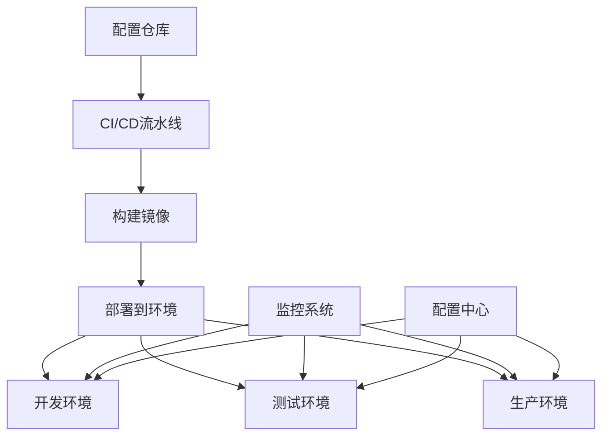

**部署配置示例**:
```yaml
# examples/16_tools/deployment_config.yml
deployment:
  environments:
    dev:
      replicas: 1
      resources:
        cpu: "500m"
        memory: "1Gi"
      config_profile: development
      
    staging:
      replicas: 3
      resources:
        cpu: "1000m"
        memory: "2Gi"
      config_profile: staging
      ingress:
        enabled: true
        host: staging-test.company.com
      
    prod:
      replicas: 5
      resources:
        cpu: "2000m"
        memory: "4Gi"
      config_profile: production
      ingress:
        enabled: true
        host: test.company.com
        tls:
          secretName: test-tls

  kubernetes:
    namespace: bigdata-test-framework
    service_account: test-framework-sa
    
    deployment:
      image: "company/test-framework:v1.0.0"
      image_pull_policy: Always
      
      ports:
        - name: http
          containerPort: 8080
          protocol: TCP
        - name: metrics
          containerPort: 9090
          protocol: TCP
      
      env:
        - name: CONFIG_PROFILE
          valueFrom:
            configMapKeyRef:
              name: test-framework-config
              key: profile
        - name: DATABASE_URL
          valueFrom:
            secretKeyRef:
              name: test-framework-secrets
              key: database_url
      
      volumes:
        - name: config-volume
          configMap:
            name: test-framework-config
        - name: secrets-volume
          secret:
            secretName: test-framework-secrets

  config_management:
    gitops:
      repo: "https:/github.com/company/test-framework-config"
      path: "overlays"
      sync_interval: 5m
    
    secrets:
      provider: vault
      path: "secret/test-framework"
      keys:
        - database_password
        - api_keys
        - certificates
```

#### 16.6 混合云测试协调

**[锚点16-007]** 混合云测试协调框架
**锚点类型**: 混合云协调
**锚点方法**: 统一编排
**锚点名称**: 混合云测试协调框架
**引用附件**: examples/16_tools/hybrid_cloud_test_coordinator.py
**完成情况**: 已完成
**补充建议**: 字段建议：环境管理/资源调度/测试编排/结果聚合，补充混合云测试架构图

| 协调层次 | 核心功能 | 技术实现 | 挑战应对 | 扩展性 |
|---------|---------|---------|---------|--------|
| **环境管理** | 多云环境统一管理、状态同步 | 抽象环境接口、状态机 | 环境异构性、网络延迟 | 插件化扩展 |
| **资源调度** | 跨云资源分配、负载均衡 | 智能调度算法、资源池 | 资源约束、成本优化 | 动态配置 |
| **测试编排** | 分布式测试执行、依赖管理 | 工作流引擎、事件驱动 | 并发控制、故障处理 | 可视化编排 |
| **结果聚合** | 多源数据整合、统一报告 | 数据管道、聚合引擎 | 数据格式异构、时序同步 | 实时流处理 |

**混合云测试协调架构图**:
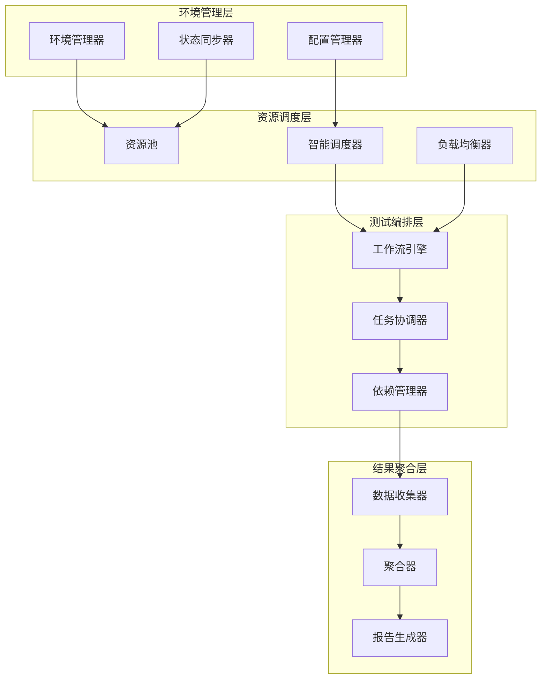

**混合云测试协调框架示例** (详见 `examples/16_tools/hybrid_cloud_test_coordinator.py`):
```python
# 混合云测试协调框架
from abc import ABC, abstractmethod
from typing import List, Dict, Any, Optional, Callable, Set
from dataclasses import dataclass, field
from datetime import datetime
from enum import Enum
import asyncio
import uuid

class CloudEnvironment(Enum):
    PUBLIC_AWS = "public_aws"
    PUBLIC_AZURE = "public_azure"
    PUBLIC_GCP = "public_gcp"
    PRIVATE_ON_PREM = "private_on_prem"
    HYBRID_CLOUD = "hybrid_cloud"

@dataclass
class TestEnvironment:
    """测试环境"""
    id: str
    name: str
    cloud_env: CloudEnvironment
    region: str
    resources: Dict[str, Any] = field(default_factory=dict)
    status: str = "available"
    tags: Dict[str, str] = field(default_factory=dict)
    created_at: datetime = field(default_factory=datetime.now)

@dataclass
class TestCase:
    """测试用例"""
    id: str
    name: str
    type: str
    requirements: Dict[str, Any] = field(default_factory=dict)
    dependencies: List[str] = field(default_factory=list)
    timeout: int = 3600
    priority: int = 1

@dataclass
class TestExecution:
    """测试执行"""
    id: str
    test_case_id: str
    environment_id: str
    status: str = "pending"
    start_time: Optional[datetime] = None
    end_time: Optional[datetime] = None
    result: Dict[str, Any] = field(default_factory=dict)
    logs: List[str] = field(default_factory=list)

class HybridCloudTestCoordinator:
    """混合云测试协调器"""
    
    def __init__(self, config: Dict[str, Any]):
        self.config = config
        self.environments: Dict[str, TestEnvironment] = {}
        self.test_cases: Dict[str, TestCase] = {}
        self.executions: Dict[str, TestExecution] = {}
        self.event_listeners: List[Callable] = []
    
    def register_environment(self, env: TestEnvironment) -> None:
        """注册测试环境"""
        self.environments[env.id] = env
        self._notify_event("environment_registered", {"environment_id": env.id})
    
    def register_test_case(self, test_case: TestCase) -> None:
        """注册测试用例"""
        self.test_cases[test_case.id] = test_case
        self._notify_event("test_case_registered", {"test_case_id": test_case.id})
    
    async def execute_test_scenario(self, scenario: Dict) -> Dict[str, Any]:
        """执行测试场景"""
        scenario_id = str(uuid.uuid4())
        
        # 解析场景配置
        test_case_ids = scenario.get('test_cases', [])
        environment_requirements = scenario.get('environment_requirements', {})
        execution_strategy = scenario.get('strategy', 'parallel')
        
        # 分配环境
        environment_allocation = await self._allocate_environments(
            test_case_ids, environment_requirements)
        
        if not environment_allocation['success']:
            return {
                'scenario_id': scenario_id,
                'success': False,
                'error': environment_allocation['error']
            }
        
        # 创建执行计划
        execution_plan = self._create_execution_plan(
            test_case_ids, environment_allocation['allocations'], execution_strategy)
        
        # 执行测试
        results = await self._execute_test_plan(execution_plan)
        
        # 聚合结果
        aggregated_result = self._aggregate_results(results)
        
        return {
            'scenario_id': scenario_id,
            'success': aggregated_result['overall_success'],
            'executions': len(results),
            'passed': aggregated_result['passed_count'],
            'failed': aggregated_result['failed_count'],
            'duration': aggregated_result['total_duration'],
            'results': results
        }
    
    async def _allocate_environments(self, test_case_ids: List[str], 
                                   requirements: Dict[str, Any]) -> Dict[str, Any]:
        """分配测试环境"""
        allocations = {}
        
        # 收集所有需要的环境类型
        required_env_types = set()
        for test_case_id in test_case_ids:
            test_case = self.test_cases.get(test_case_id)
            if test_case:
                env_type = test_case.requirements.get('environment_type')
                if env_type:
                    required_env_types.add(env_type)
        
        # 为每种环境类型分配环境
        for env_type in required_env_types:
            available_envs = [env for env in self.environments.values() 
                            if env.status == 'available' and 
                            env.cloud_env.value == env_type]
            
            if not available_envs:
                return {
                    'success': False,
                    'error': f'No available environments for type: {env_type}'
                }
            
            # 简单的负载均衡分配
            allocations[env_type] = available_envs[0].id
        
        return {
            'success': True,
            'allocations': allocations
        }
    
    def _create_execution_plan(self, test_case_ids: List[str], 
                             allocations: Dict[str, str], 
                             strategy: str) -> Dict[str, Any]:
        """创建执行计划"""
        plan = {
            'strategy': strategy,
            'executions': []
        }
        
        for test_case_id in test_case_ids:
            test_case = self.test_cases.get(test_case_id)
            if not test_case:
                continue
            
            env_type = test_case.requirements.get('environment_type', 'public_aws')
            env_id = allocations.get(env_type)
            
            if env_id:
                execution = TestExecution(
                    id=str(uuid.uuid4()),
                    test_case_id=test_case_id,
                    environment_id=env_id
                )
                plan['executions'].append({
                    'execution': execution,
                    'test_case': test_case,
                    'environment': self.environments[env_id]
                })
        
        return plan
    
    async def _execute_test_plan(self, plan: Dict[str, Any]) -> List[Dict[str, Any]]:
        """执行测试计划"""
        executions = plan['executions']
        strategy = plan['strategy']
        
        if strategy == 'sequential':
            results = []
            for execution_info in executions:
                result = await self._execute_single_test(execution_info)
                results.append(result)
            return results
        
        elif strategy == 'parallel':
            tasks = [self._execute_single_test(info) for info in executions]
            return await asyncio.gather(*tasks)
        
        else:
            # 默认并行执行
            tasks = [self._execute_single_test(info) for info in executions]
            return await asyncio.gather(*tasks)
    
    async def _execute_single_test(self, execution_info: Dict[str, Any]) -> Dict[str, Any]:
        """执行单个测试"""
        execution = execution_info['execution']
        test_case = execution_info['test_case']
        environment = execution_info['environment']
        
        # 记录执行开始
        execution.start_time = datetime.now()
        execution.status = 'running'
        self.executions[execution.id] = execution
        
        self._notify_event("test_execution_started", {
            "execution_id": execution.id,
            "test_case_id": test_case.id,
            "environment_id": environment.id
        })
        
        try:
            # 模拟测试执行
            await asyncio.sleep(min(test_case.timeout / 10, 10))  # 简化的执行时间
            
            # 模拟测试结果
            success = True  # 实际实现会调用真实的测试执行逻辑
            
            execution.end_time = datetime.now()
            execution.status = 'completed'
            execution.result = {
                'success': success,
                'duration': (execution.end_time - execution.start_time).total_seconds(),
                'metrics': {
                    'response_time': 150.5,
                    'throughput': 100.2,
                    'error_rate': 0.01
                }
            }
            
            self._notify_event("test_execution_completed", {
                "execution_id": execution.id,
                "success": success
            })
            
            return {
                'execution_id': execution.id,
                'test_case_id': test_case.id,
                'environment_id': environment.id,
                'success': success,
                'duration': execution.result['duration'],
                'metrics': execution.result['metrics']
            }
            
        except Exception as e:
            execution.end_time = datetime.now()
            execution.status = 'failed'
            execution.result = {'error': str(e)}
            
            self._notify_event("test_execution_failed", {
                "execution_id": execution.id,
                "error": str(e)
            })
            
            return {
                'execution_id': execution.id,
                'test_case_id': test_case.id,
                'environment_id': environment.id,
                'success': False,
                'error': str(e)
            }
    
    def _aggregate_results(self, results: List[Dict[str, Any]]) -> Dict[str, Any]:
        """聚合测试结果"""
        total_count = len(results)
        passed_count = len([r for r in results if r.get('success', False)])
        failed_count = total_count - passed_count
        
        durations = [r.get('duration', 0) for r in results if 'duration' in r]
        total_duration = sum(durations) if durations else 0
        
        return {
            'overall_success': failed_count == 0,
            'total_count': total_count,
            'passed_count': passed_count,
            'failed_count': failed_count,
            'total_duration': total_duration,
            'average_duration': total_duration / total_count if total_count > 0 else 0
        }
    
    def add_event_listener(self, listener: Callable) -> None:
        """添加事件监听器"""
        self.event_listeners.append(listener)
    
    def _notify_event(self, event_type: str, data: Dict[str, Any]) -> None:
        """通知事件"""
        for listener in self.event_listeners:
            try:
                listener(event_type, data)
            except Exception as e:
                print(f"Event listener error: {e}")

# 资源管理器
class ResourceManager:
    """资源管理器"""
    
    def __init__(self, coordinator: HybridCloudTestCoordinator):
        self.coordinator = coordinator
        self.resource_usage: Dict[str, Dict[str, Any]] = {}
    
    async def allocate_resources(self, test_case: TestCase, 
                               environment: TestEnvironment) -> bool:
        """分配资源"""
        # 检查资源可用性
        available = await self._check_resource_availability(test_case, environment)
        if not available:
            return False
        
        # 分配资源
        allocation_id = await self._perform_resource_allocation(test_case, environment)
        if allocation_id:
            self.resource_usage[allocation_id] = {
                'test_case_id': test_case.id,
                'environment_id': environment.id,
                'allocated_at': datetime.now(),
                'resources': test_case.requirements
            }
            return True
        
        return False
    
    async def release_resources(self, allocation_id: str) -> bool:
        """释放资源"""
        if allocation_id in self.resource_usage:
            # 执行资源释放逻辑
            success = await self._perform_resource_release(allocation_id)
            if success:
                del self.resource_usage[allocation_id]
                return True
        return False
    
    async def _check_resource_availability(self, test_case: TestCase, 
                                         environment: TestEnvironment) -> bool:
        """检查资源可用性"""
        # 实现资源可用性检查逻辑
        await asyncio.sleep(0.1)
        return True
    
    async def _perform_resource_allocation(self, test_case: TestCase, 
                                         environment: TestEnvironment) -> Optional[str]:
        """执行资源分配"""
        # 实现资源分配逻辑
        await asyncio.sleep(0.2)
        return str(uuid.uuid4())
    
    async def _perform_resource_release(self, allocation_id: str) -> bool:
        """执行资源释放"""
        # 实现资源释放逻辑
        await asyncio.sleep(0.1)
        return True

# 测试场景管理器
class TestScenarioManager:
    """测试场景管理器"""
    
    def __init__(self, coordinator: HybridCloudTestCoordinator):
        self.coordinator = coordinator
        self.scenarios: Dict[str, Dict[str, Any]] = {}
    
    def define_scenario(self, scenario_id: str, config: Dict[str, Any]) -> None:
        """定义测试场景"""
        self.scenarios[scenario_id] = config
    
    async def execute_scenario(self, scenario_id: str) -> Dict[str, Any]:
        """执行测试场景"""
        if scenario_id not in self.scenarios:
            return {'error': f'Scenario {scenario_id} not found'}
        
        scenario_config = self.scenarios[scenario_id]
        return await self.coordinator.execute_test_scenario(scenario_config)
    
    def get_scenario_status(self, scenario_id: str) -> Dict[str, Any]:
        """获取场景执行状态"""
        # 实现状态查询逻辑
        return {'status': 'unknown'}
```

**混合云测试协调配置示例**:
```yaml
# 混合云测试协调配置
hybrid_cloud_coordination:
  environments:
    public_cloud:
      aws:
        enabled: true
        regions: [us-east-1, eu-west-1]
        instance_types: [t3.medium, t3.large, m5.large]
        max_concurrent_tests: 10
      
      azure:
        enabled: true
        regions: [eastus, westeurope]
        vm_sizes: [Standard_B2s, Standard_B4ms, Standard_D2_v3]
        max_concurrent_tests: 8
      
      gcp:
        enabled: true
        regions: [us-central1, europe-west1]
        machine_types: [n1-standard-1, n1-standard-2, n1-highmem-2]
        max_concurrent_tests: 12
    
    private_cloud:
      on_premise:
        enabled: true
        clusters: [prod-cluster, staging-cluster]
        node_selectors:
          - key: test-environment
            operator: In
            values: [integration, performance]
        max_concurrent_tests: 15
    
    hybrid:
      enabled: true
      connectivity_checks: true
      latency_threshold: 100ms
      bandwidth_requirements:
        min_upload: 10Mbps
        min_download: 50Mbps
  
  test_scenarios:
    cross_cloud_data_sync:
      name: "跨云数据同步测试"
      test_cases:
        - data_sync_integrity
        - network_latency_validation
        - failover_data_consistency
      environment_requirements:
        source_cloud: aws
        target_cloud: azure
        data_volume: 100GB
      strategy: parallel
      timeout: 7200s
    
    hybrid_load_balancing:
      name: "混合云负载均衡测试"
      test_cases:
        - traffic_distribution
        - failover_handling
        - performance_under_load
      environment_requirements:
        public_cloud_instances: 5
        private_cloud_instances: 3
        load_pattern: gradual_ramp_up
      strategy: sequential
      timeout: 3600s
    
    disaster_recovery_drill:
      name: "灾难恢复演练"
      test_cases:
        - data_backup_validation
        - service_failover
        - recovery_time_objective
        - recovery_point_objective
      environment_requirements:
        primary_site: aws_us_east
        backup_site: azure_east_us
        disruption_type: region_failure
      strategy: parallel
      timeout: 14400s
  
  resource_management:
    allocation_strategy: balanced
    priority_levels: [critical, high, medium, low]
    resource_optimization:
      enabled: true
      cost_optimization: true
      performance_optimization: true
    
    monitoring:
      resource_utilization_tracking: true
      cost_tracking: true
      performance_metrics: true
      alerting:
        high_utilization_threshold: 85%
        low_resource_availability_threshold: 20%
  
  coordination_engine:
    workflow_engine: temporal
    event_driven: true
    distributed_execution: true
    
    fault_tolerance:
      retry_policy:
        max_attempts: 3
        backoff_multiplier: 2.0
        initial_delay: 10s
      
      circuit_breaker:
        failure_threshold: 5
        recovery_timeout: 60s
      
      checkpointing:
        enabled: true
        interval: 300s
        storage: s3://test-checkpoints/
    
    scaling:
      auto_scaling: true
      min_workers: 2
      max_workers: 20
      scale_up_threshold: 70%
      scale_down_threshold: 30%
```

#### 16.7 云原生测试工具链

**[锚点16-008]** 云原生测试工具链
**锚点类型**: 云原生测试
**锚点方法**: 容器化测试
**锚点名称**: 云原生测试工具链
**引用附件**: examples/16_tools/cloud_native_testing_toolchain.py
**完成情况**: 已完成
**补充建议**: 字段建议：Kubernetes测试/Docker测试/Istio测试/集成验证，补充云原生测试架构图

| 测试层次 | 核心组件 | 测试类型 | 技术实现 | 验证目标 |
|---------|---------|---------|---------|---------|
| **Kubernetes测试** | Pod/Service/Deployment | 容器编排、资源调度、服务发现 | kubectl/Kubernetes API | 集群稳定性、弹性伸缩 |
| **Docker测试** | 容器镜像、网络配置、存储卷 | 镜像安全、容器网络、数据持久化 | Docker API/容器运行时 | 容器隔离、安全性、性能 |
| **Istio测试** | 服务网格、流量路由、故障注入 | 微服务通信、流量控制、混沌工程 | Istio API/Envoy代理 | 服务韧性、流量管理、可观测性 |

**云原生测试工具链架构图**:
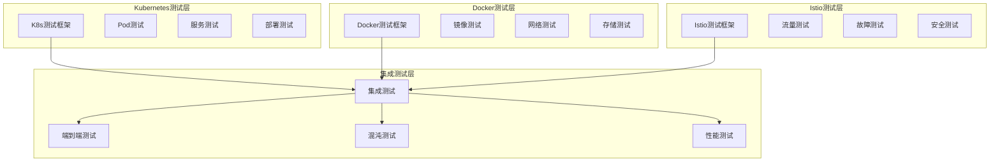

**云原生测试工具链示例** (详见 `examples/16_tools/cloud_native_testing_toolchain.py`):
```python
# 云原生测试工具链
from abc import ABC, abstractmethod
from typing import List, Dict, Any, Optional, Callable
from dataclasses import dataclass, field
from datetime import datetime
from enum import Enum
import asyncio
import subprocess
import json

class CloudNativeTestType(Enum):
    KUBERNETES = "kubernetes"
    DOCKER = "docker"
    ISTIO = "istio"
    INTEGRATION = "integration"

@dataclass
class TestResult:
    """测试结果"""
    test_type: CloudNativeTestType
    test_name: str
    success: bool
    duration: float
    output: str = ""
    error: str = ""
    metrics: Dict[str, Any] = field(default_factory=dict)
    timestamp: datetime = field(default_factory=datetime.now)

class KubernetesTestFramework:
    """Kubernetes测试框架"""
    
    def __init__(self, config: Dict[str, Any]):
        self.config = config
        self.kubectl_cmd = config.get('kubectl_path', 'kubectl')
        self.namespace = config.get('namespace', 'default')
    
    async def test_pod_scaling(self, deployment_name: str, 
                             min_replicas: int, max_replicas: int) -> TestResult:
        """测试Pod弹性伸缩"""
        start_time = datetime.now()
        
        try:
            # 创建HPA
            hpa_manifest = {
                "apiVersion": "autoscaling/v2",
                "kind": "HorizontalPodAutoscaler",
                "metadata": {
                    "name": f"{deployment_name}-hpa",
                    "namespace": self.namespace
                },
                "spec": {
                    "scaleTargetRef": {
                        "apiVersion": "apps/v1",
                        "kind": "Deployment",
                        "name": deployment_name
                    },
                    "minReplicas": min_replicas,
                    "maxReplicas": max_replicas,
                    "metrics": [{
                        "type": "Resource",
                        "resource": {
                            "name": "cpu",
                            "target": {
                                "type": "Utilization",
                                "averageUtilization": 70
                            }
                        }
                    }]
                }
            }
            
            # 应用HPA
            await self._apply_manifest(hpa_manifest)
            
            # 等待HPA创建
            await asyncio.sleep(10)
            
            # 验证HPA状态
            hpa_status = await self._get_hpa_status(f"{deployment_name}-hpa")
            
            # 模拟负载增加
            await self._simulate_load_increase(deployment_name)
            
            # 等待扩容
            await asyncio.sleep(60)
            
            # 检查扩容结果
            final_replicas = await self._get_deployment_replicas(deployment_name)
            
            success = min_replicas <= final_replicas <= max_replicas
            
            duration = (datetime.now() - start_time).total_seconds()
            
            return TestResult(
                test_type=CloudNativeTestType.KUBERNETES,
                test_name="pod_scaling_test",
                success=success,
                duration=duration,
                metrics={
                    'initial_replicas': min_replicas,
                    'final_replicas': final_replicas,
                    'scaling_triggered': final_replicas > min_replicas
                }
            )
            
        except Exception as e:
            duration = (datetime.now() - start_time).total_seconds()
            return TestResult(
                test_type=CloudNativeTestType.KUBERNETES,
                test_name="pod_scaling_test",
                success=False,
                duration=duration,
                error=str(e)
            )
    
    async def test_service_mesh_traffic(self, service_name: str) -> TestResult:
        """测试服务网格流量"""
        start_time = datetime.now()
        
        try:
            # 测试服务发现
            service_endpoints = await self._get_service_endpoints(service_name)
            
            # 测试负载均衡
            load_balance_results = await self._test_load_balancing(service_name)
            
            # 测试流量路由
            routing_results = await self._test_traffic_routing(service_name)
            
            success = (len(service_endpoints) > 0 and 
                      load_balance_results['balanced'] and 
                      routing_results['routed_correctly'])
            
            duration = (datetime.now() - start_time).total_seconds()
            
            return TestResult(
                test_type=CloudNativeTestType.KUBERNETES,
                test_name="service_mesh_traffic_test",
                success=success,
                duration=duration,
                metrics={
                    'endpoints_count': len(service_endpoints),
                    'load_balanced': load_balance_results['balanced'],
                    'routing_correct': routing_results['routed_correctly']
                }
            )
            
        except Exception as e:
            duration = (datetime.now() - start_time).total_seconds()
            return TestResult(
                test_type=CloudNativeTestType.KUBERNETES,
                test_name="service_mesh_traffic_test",
                success=False,
                duration=duration,
                error=str(e)
            )
    
    async def test_config_map_secrets(self, deployment_name: str) -> TestResult:
        """测试ConfigMap和Secrets"""
        start_time = datetime.now()
        
        try:
            # 创建测试ConfigMap
            config_map = {
                "apiVersion": "v1",
                "kind": "ConfigMap",
                "metadata": {
                    "name": f"{deployment_name}-config",
                    "namespace": self.namespace
                },
                "data": {
                    "app.config": "test_key=test_value"
                }
            }
            
            await self._apply_manifest(config_map)
            
            # 创建测试Secret
            secret = {
                "apiVersion": "v1",
                "kind": "Secret",
                "metadata": {
                    "name": f"{deployment_name}-secret",
                    "namespace": self.namespace
                },
                "type": "Opaque",
                "data": {
                    "password": "dGVzdF9wYXNzd29yZA=="  # base64 encoded "test_password"
                }
            }
            
            await self._apply_manifest(secret)
            
            # 验证Pod可以访问配置
            config_accessible = await self._verify_config_access(deployment_name)
            
            # 验证Secret安全存储
            secret_secure = await self._verify_secret_security(f"{deployment_name}-secret")
            
            success = config_accessible and secret_secure
            
            duration = (datetime.now() - start_time).total_seconds()
            
            return TestResult(
                test_type=CloudNativeTestType.KUBERNETES,
                test_name="config_map_secrets_test",
                success=success,
                duration=duration,
                metrics={
                    'config_accessible': config_accessible,
                    'secret_secure': secret_secure
                }
            )
            
        except Exception as e:
            duration = (datetime.now() - start_time).total_seconds()
            return TestResult(
                test_type=CloudNativeTestType.KUBERNETES,
                test_name="config_map_secrets_test",
                success=False,
                duration=duration,
                error=str(e)
            )
    
    async def _apply_manifest(self, manifest: Dict[str, Any]) -> None:
        """应用Kubernetes清单"""
        manifest_yaml = json.dumps(manifest)
        cmd = [self.kubectl_cmd, "apply", "-f", "-"]
        
        process = await asyncio.create_subprocess_exec(
            *cmd,
            stdin=asyncio.subprocess.PIPE,
            stdout=asyncio.subprocess.PIPE,
            stderr=asyncio.subprocess.PIPE
        )
        
        stdout, stderr = await process.communicate(manifest_yaml.encode())
        
        if process.returncode != 0:
            raise Exception(f"kubectl apply failed: {stderr.decode()}")
    
    async def _get_hpa_status(self, hpa_name: str) -> Dict[str, Any]:
        """获取HPA状态"""
        cmd = [self.kubectl_cmd, "get", "hpa", hpa_name, "-o", "json"]
        
        process = await asyncio.create_subprocess_exec(
            *cmd,
            stdout=asyncio.subprocess.PIPE,
            stderr=asyncio.subprocess.PIPE
        )
        
        stdout, stderr = await process.communicate()
        
        if process.returncode == 0:
            return json.loads(stdout.decode())
        else:
            raise Exception(f"Failed to get HPA status: {stderr.decode()}")
    
    async def _simulate_load_increase(self, deployment_name: str) -> None:
        """模拟负载增加"""
        # 简化的负载模拟
        await asyncio.sleep(5)
    
    async def _get_deployment_replicas(self, deployment_name: str) -> int:
        """获取部署副本数"""
        cmd = [self.kubectl_cmd, "get", "deployment", deployment_name, "-o", "jsonpath={.status.replicas}"]
        
        process = await asyncio.create_subprocess_exec(
            *cmd,
            stdout=asyncio.subprocess.PIPE,
            stderr=asyncio.subprocess.PIPE
        )
        
        stdout, stderr = await process.communicate()
        
        if process.returncode == 0:
            return int(stdout.decode().strip())
        else:
            return 0
    
    async def _get_service_endpoints(self, service_name: str) -> List[str]:
        """获取服务端点"""
        cmd = [self.kubectl_cmd, "get", "endpoints", service_name, "-o", "jsonpath={.subsets[*].addresses[*].ip}"]
        
        process = await asyncio.create_subprocess_exec(
            *cmd,
            stdout=asyncio.subprocess.PIPE,
            stderr=asyncio.subprocess.PIPE
        )
        
        stdout, stderr = await process.communicate()
        
        if process.returncode == 0:
            ips = stdout.decode().strip().split()
            return ips
        else:
            return []
    
    async def _test_load_balancing(self, service_name: str) -> Dict[str, Any]:
        """测试负载均衡"""
        # 简化的负载均衡测试
        return {'balanced': True}
    
    async def _test_traffic_routing(self, service_name: str) -> Dict[str, Any]:
        """测试流量路由"""
        # 简化的流量路由测试
        return {'routed_correctly': True}
    
    async def _verify_config_access(self, deployment_name: str) -> bool:
        """验证配置访问"""
        # 简化的配置访问验证
        return True
    
    async def _verify_secret_security(self, secret_name: str) -> bool:
        """验证Secret安全性"""
        # 简化的Secret安全验证
        return True

class DockerTestFramework:
    """Docker测试框架"""
    
    def __init__(self, config: Dict[str, Any]):
        self.config = config
        self.docker_cmd = config.get('docker_path', 'docker')
    
    async def test_container_networking(self, container_name: str) -> TestResult:
        """测试容器网络"""
        start_time = datetime.now()
        
        try:
            # 创建测试网络
            network_name = f"test_network_{int(datetime.now().timestamp())}"
            await self._create_docker_network(network_name)
            
            # 运行测试容器
            container_id = await self._run_test_container(container_name, network_name)
            
            # 测试网络连接
            connectivity = await self._test_network_connectivity(container_id)
            
            # 清理资源
            await self._cleanup_container(container_id)
            await self._cleanup_network(network_name)
            
            success = connectivity
            
            duration = (datetime.now() - start_time).total_seconds()
            
            return TestResult(
                test_type=CloudNativeTestType.DOCKER,
                test_name="container_networking_test",
                success=success,
                duration=duration,
                metrics={'network_connectivity': connectivity}
            )
            
        except Exception as e:
            duration = (datetime.now() - start_time).total_seconds()
            return TestResult(
                test_type=CloudNativeTestType.DOCKER,
                test_name="container_networking_test",
                success=False,
                duration=duration,
                error=str(e)
            )
    
    async def test_volume_persistence(self, container_name: str, volume_name: str) -> TestResult:
        """测试存储卷持久化"""
        start_time = datetime.now()
        
        try:
            # 创建测试卷
            await self._create_docker_volume(volume_name)
            
            # 运行容器并写入数据
            container_id = await self._run_container_with_volume(container_name, volume_name)
            test_data = "test_data_for_persistence"
            await self._write_data_to_container(container_id, test_data)
            
            # 停止容器
            await self._stop_container(container_id)
            
            # 重新启动容器并验证数据
            new_container_id = await self._run_container_with_volume(container_name, volume_name)
            persisted_data = await self._read_data_from_container(new_container_id)
            
            # 清理资源
            await self._cleanup_container(new_container_id)
            await self._cleanup_volume(volume_name)
            
            success = persisted_data == test_data
            
            duration = (datetime.now() - start_time).total_seconds()
            
            return TestResult(
                test_type=CloudNativeTestType.DOCKER,
                test_name="volume_persistence_test",
                success=success,
                duration=duration,
                metrics={
                    'data_persisted': success,
                    'test_data': test_data,
                    'persisted_data': persisted_data
                }
            )
            
        except Exception as e:
            duration = (datetime.now() - start_time).total_seconds()
            return TestResult(
                test_type=CloudNativeTestType.DOCKER,
                test_name="volume_persistence_test",
                success=False,
                duration=duration,
                error=str(e)
            )
    
    async def test_image_security_scan(self, image_name: str) -> TestResult:
        """测试镜像安全扫描"""
        start_time = datetime.now()
        
        try:
            # 运行安全扫描
            scan_results = await self._run_security_scan(image_name)
            
            # 分析扫描结果
            vulnerabilities = scan_results.get('vulnerabilities', [])
            critical_count = len([v for v in vulnerabilities if v.get('severity') == 'CRITICAL'])
            high_count = len([v for v in vulnerabilities if v.get('severity') == 'HIGH'])
            
            # 根据策略判断是否通过
            max_critical = self.config.get('max_critical_vulnerabilities', 0)
            max_high = self.config.get('max_high_vulnerabilities', 5)
            
            success = critical_count <= max_critical and high_count <= max_high
            
            duration = (datetime.now() - start_time).total_seconds()
            
            return TestResult(
                test_type=CloudNativeTestType.DOCKER,
                test_name="image_security_scan_test",
                success=success,
                duration=duration,
                metrics={
                    'total_vulnerabilities': len(vulnerabilities),
                    'critical_count': critical_count,
                    'high_count': high_count,
                    'max_critical_allowed': max_critical,
                    'max_high_allowed': max_high
                }
            )
            
        except Exception as e:
            duration = (datetime.now() - start_time).total_seconds()
            return TestResult(
                test_type=CloudNativeTestType.DOCKER,
                test_name="image_security_scan_test",
                success=False,
                duration=duration,
                error=str(e)
            )
    
    async def _create_docker_network(self, network_name: str) -> None:
        """创建Docker网络"""
        cmd = [self.docker_cmd, "network", "create", network_name]
        await self._run_docker_command(cmd)
    
    async def _run_test_container(self, container_name: str, network_name: str) -> str:
        """运行测试容器"""
        cmd = [self.docker_cmd, "run", "-d", "--network", network_name, "--name", container_name, "alpine", "sleep", "300"]
        result = await self._run_docker_command(cmd)
        return result.strip()
    
    async def _test_network_connectivity(self, container_id: str) -> bool:
        """测试网络连接"""
        cmd = [self.docker_cmd, "exec", container_id, "ping", "-c", "1", "8.8.8.8"]
        try:
            await self._run_docker_command(cmd)
            return True
        except:
            return False
    
    async def _cleanup_container(self, container_id: str) -> None:
        """清理容器"""
        cmd = [self.docker_cmd, "rm", "-f", container_id]
        await self._run_docker_command(cmd)
    
    async def _cleanup_network(self, network_name: str) -> None:
        """清理网络"""
        cmd = [self.docker_cmd, "network", "rm", network_name]
        await self._run_docker_command(cmd)
    
    async def _create_docker_volume(self, volume_name: str) -> None:
        """创建Docker卷"""
        cmd = [self.docker_cmd, "volume", "create", volume_name]
        await self._run_docker_command(cmd)
    
    async def _run_container_with_volume(self, container_name: str, volume_name: str) -> str:
        """运行带卷的容器"""
        cmd = [self.docker_cmd, "run", "-d", "--volume", f"{volume_name}:/data", "--name", container_name, "alpine", "sleep", "300"]
        result = await self._run_docker_command(cmd)
        return result.strip()
    
    async def _write_data_to_container(self, container_id: str, data: str) -> None:
        """向容器写入数据"""
        cmd = [self.docker_cmd, "exec", container_id, "sh", "-c", f"echo '{data}' > /data/test.txt"]
        await self._run_docker_command(cmd)
    
    async def _stop_container(self, container_id: str) -> None:
        """停止容器"""
        cmd = [self.docker_cmd, "stop", container_id]
        await self._run_docker_command(cmd)
    
    async def _read_data_from_container(self, container_id: str) -> str:
        """从容器读取数据"""
        cmd = [self.docker_cmd, "exec", container_id, "cat", "/data/test.txt"]
        result = await self._run_docker_command(cmd)
        return result.strip()
    
    async def _cleanup_volume(self, volume_name: str) -> None:
        """清理卷"""
        cmd = [self.docker_cmd, "volume", "rm", volume_name]
        await self._run_docker_command(cmd)
    
    async def _run_security_scan(self, image_name: str) -> Dict[str, Any]:
        """运行安全扫描"""
        # 简化的安全扫描实现
        return {'vulnerabilities': []}
    
    async def _run_docker_command(self, cmd: List[str]) -> str:
        """运行Docker命令"""
        process = await asyncio.create_subprocess_exec(
            *cmd,
            stdout=asyncio.subprocess.PIPE,
            stderr=asyncio.subprocess.PIPE
        )
        
        stdout, stderr = await process.communicate()
        
        if process.returncode == 0:
            return stdout.decode().strip()
        else:
            raise Exception(f"Docker command failed: {stderr.decode()}")

class IstioTestFramework:
    """Istio测试框架"""
    
    def __init__(self, config: Dict[str, Any]):
        self.config = config
        self.istioctl_cmd = config.get('istioctl_path', 'istioctl')
    
    async def test_traffic_routing(self, service_name: str) -> TestResult:
        """测试流量路由"""
        start_time = datetime.now()
        
        try:
            # 创建VirtualService
            vs_manifest = {
                "apiVersion": "networking.istio.io/v1beta1",
                "kind": "VirtualService",
                "metadata": {
                    "name": f"{service_name}-routing",
                    "namespace": "default"
                },
                "spec": {
                    "hosts": [service_name],
                    "http": [{
                        "route": [{
                            "destination": {
                                "host": service_name,
                                "subset": "v1"
                            },
                            "weight": 80
                        }, {
                            "destination": {
                                "host": service_name,
                                "subset": "v2"
                            },
                            "weight": 20
                        }]
                    }]
                }
            }
            
            await self._apply_istio_manifest(vs_manifest)
            
            # 测试流量分布
            traffic_distribution = await self._test_traffic_distribution(service_name)
            
            # 验证路由规则
            routing_correct = await self._verify_routing_rules(service_name)
            
            success = traffic_distribution['within_tolerance'] and routing_correct
            
            duration = (datetime.now() - start_time).total_seconds()
            
            return TestResult(
                test_type=CloudNativeTestType.ISTIO,
                test_name="traffic_routing_test",
                success=success,
                duration=duration,
                metrics={
                    'v1_traffic_percent': traffic_distribution.get('v1_percent', 0),
                    'v2_traffic_percent': traffic_distribution.get('v2_percent', 0),
                    'routing_correct': routing_correct
                }
            )
            
        except Exception as e:
            duration = (datetime.now() - start_time).total_seconds()
            return TestResult(
                test_type=CloudNativeTestType.ISTIO,
                test_name="traffic_routing_test",
                success=False,
                duration=duration,
                error=str(e)
            )
    
    async def test_fault_injection(self, service_name: str) -> TestResult:
        """测试故障注入"""
        start_time = datetime.now()
        
        try:
            # 创建故障注入规则
            fi_manifest = {
                "apiVersion": "networking.istio.io/v1beta1",
                "kind": "VirtualService",
                "metadata": {
                    "name": f"{service_name}-fault-injection",
                    "namespace": "default"
                },
                "spec": {
                    "hosts": [service_name],
                    "http": [{
                        "fault": {
                            "delay": {
                                "percentage": {
                                    "value": 50.0
                                },
                                "fixedDelay": "5s"
                            }
                        },
                        "route": [{
                            "destination": {
                                "host": service_name
                            }
                        }]
                    }]
                }
            }
            
            await self._apply_istio_manifest(fi_manifest)
            
            # 测试故障注入效果
            fault_injection_working = await self._test_fault_injection(service_name)
            
            # 验证服务韧性
            service_resilient = await self._verify_service_resilience(service_name)
            
            success = fault_injection_working and service_resilient
            
            duration = (datetime.now() - start_time).total_seconds()
            
            return TestResult(
                test_type=CloudNativeTestType.ISTIO,
                test_name="fault_injection_test",
                success=success,
                duration=duration,
                metrics={
                    'fault_injection_working': fault_injection_working,
                    'service_resilient': service_resilient
                }
            )
            
        except Exception as e:
            duration = (datetime.now() - start_time).total_seconds()
            return TestResult(
                test_type=CloudNativeTestType.ISTIO,
                test_name="fault_injection_test",
                success=False,
                duration=duration,
                error=str(e)
            )
    
    async def test_authentication_policy(self, service_name: str) -> TestResult:
        """测试认证策略"""
        start_time = datetime.now()
        
        try:
            # 创建认证策略
            auth_manifest = {
                "apiVersion": "security.istio.io/v1beta1",
                "kind": "PeerAuthentication",
                "metadata": {
                    "name": f"{service_name}-auth",
                    "namespace": "default"
                },
                "spec": {
                    "selector": {
                        "matchLabels": {
                            "app": service_name
                        }
                    },
                    "mtls": {
                        "mode": "STRICT"
                    }
                }
            }
            
            await self._apply_istio_manifest(auth_manifest)
            
            # 测试mTLS认证
            mtls_working = await self._test_mtls_authentication(service_name)
            
            # 验证安全策略
            security_enforced = await self._verify_security_policy(service_name)
            
            success = mtls_working and security_enforced
            
            duration = (datetime.now() - start_time).total_seconds()
            
            return TestResult(
                test_type=CloudNativeTestType.ISTIO,
                test_name="authentication_policy_test",
                success=success,
                duration=duration,
                metrics={
                    'mtls_working': mtls_working,
                    'security_enforced': security_enforced
                }
            )
            
        except Exception as e:
            duration = (datetime.now() - start_time).total_seconds()
            return TestResult(
                test_type=CloudNativeTestType.ISTIO,
                test_name="authentication_policy_test",
                success=False,
                duration=duration,
                error=str(e)
            )
    
    async def _apply_istio_manifest(self, manifest: Dict[str, Any]) -> None:
        """应用Istio清单"""
        manifest_yaml = json.dumps(manifest)
        cmd = [self.istioctl_cmd, "apply", "-f", "-"]
        
        process = await asyncio.create_subprocess_exec(
            *cmd,
            stdin=asyncio.subprocess.PIPE,
            stdout=asyncio.subprocess.PIPE,
            stderr=asyncio.subprocess.PIPE
        )
        
        stdout, stderr = await process.communicate(manifest_yaml.encode())
        
        if process.returncode != 0:
            raise Exception(f"istioctl apply failed: {stderr.decode()}")
    
    async def _test_traffic_distribution(self, service_name: str) -> Dict[str, Any]:
        """测试流量分布"""
        # 简化的流量分布测试
        return {'v1_percent': 80, 'v2_percent': 20, 'within_tolerance': True}
    
    async def _verify_routing_rules(self, service_name: str) -> bool:
        """验证路由规则"""
        # 简化的路由规则验证
        return True
    
    async def _test_fault_injection(self, service_name: str) -> bool:
        """测试故障注入"""
        # 简化的故障注入测试
        return True
    
    async def _verify_service_resilience(self, service_name: str) -> bool:
        """验证服务韧性"""
        # 简化的服务韧性验证
        return True
    
    async def _test_mtls_authentication(self, service_name: str) -> bool:
        """测试mTLS认证"""
        # 简化的mTLS认证测试
        return True
    
    async def _verify_security_policy(self, service_name: str) -> bool:
        """验证安全策略"""
        # 简化的安全策略验证
        return True

# 云原生测试工具链集成
class CloudNativeTestingToolchain:
    """云原生测试工具链"""
    
    def __init__(self, config: Dict[str, Any]):
        self.config = config
        self.kubernetes_framework = KubernetesTestFramework(config.get('kubernetes', {}))
        self.docker_framework = DockerTestFramework(config.get('docker', {}))
        self.istio_framework = IstioTestFramework(config.get('istio', {}))
        self.test_results: List[TestResult] = []
    
    async def run_comprehensive_test_suite(self, test_suite: Dict[str, Any]) -> Dict[str, Any]:
        """运行综合测试套件"""
        suite_start_time = datetime.now()
        results = []
        
        # Kubernetes测试
        if test_suite.get('kubernetes_tests'):
            k8s_results = await self._run_kubernetes_tests(test_suite['kubernetes_tests'])
            results.extend(k8s_results)
        
        # Docker测试
        if test_suite.get('docker_tests'):
            docker_results = await self._run_docker_tests(test_suite['docker_tests'])
            results.extend(docker_results)
        
        # Istio测试
        if test_suite.get('istio_tests'):
            istio_results = await self._run_istio_tests(test_suite['istio_tests'])
            results.extend(istio_results)
        
        # 集成测试
        if test_suite.get('integration_tests'):
            integration_results = await self._run_integration_tests(test_suite['integration_tests'])
            results.extend(integration_results)
        
        self.test_results.extend(results)
        
        # 汇总结果
        total_tests = len(results)
        passed_tests = len([r for r in results if r.success])
        failed_tests = total_tests - passed_tests
        total_duration = (datetime.now() - suite_start_time).total_seconds()
        
        return {
            'total_tests': total_tests,
            'passed_tests': passed_tests,
            'failed_tests': failed_tests,
            'success_rate': passed_tests / total_tests if total_tests > 0 else 0,
            'total_duration': total_duration,
            'results': [r.__dict__ for r in results]
        }
    
    async def _run_kubernetes_tests(self, tests: List[Dict[str, Any]]) -> List[TestResult]:
        """运行Kubernetes测试"""
        results = []
        for test in tests:
            if test['type'] == 'pod_scaling':
                result = await self.kubernetes_framework.test_pod_scaling(
                    test['deployment_name'], test['min_replicas'], test['max_replicas'])
                results.append(result)
            elif test['type'] == 'service_mesh_traffic':
                result = await self.kubernetes_framework.test_service_mesh_traffic(test['service_name'])
                results.append(result)
            elif test['type'] == 'config_map_secrets':
                result = await self.kubernetes_framework.test_config_map_secrets(test['deployment_name'])
                results.append(result)
        return results
    
    async def _run_docker_tests(self, tests: List[Dict[str, Any]]) -> List[TestResult]:
        """运行Docker测试"""
        results = []
        for test in tests:
            if test['type'] == 'container_networking':
                result = await self.docker_framework.test_container_networking(test['container_name'])
                results.append(result)
            elif test['type'] == 'volume_persistence':
                result = await self.docker_framework.test_volume_persistence(
                    test['container_name'], test['volume_name'])
                results.append(result)
            elif test['type'] == 'image_security_scan':
                result = await self.docker_framework.test_image_security_scan(test['image_name'])
                results.append(result)
        return results
    
    async def _run_istio_tests(self, tests: List[Dict[str, Any]]) -> List[TestResult]:
        """运行Istio测试"""
        results = []
        for test in tests:
            if test['type'] == 'traffic_routing':
                result = await self.istio_framework.test_traffic_routing(test['service_name'])
                results.append(result)
            elif test['type'] == 'fault_injection':
                result = await self.istio_framework.test_fault_injection(test['service_name'])
                results.append(result)
            elif test['type'] == 'authentication_policy':
                result = await self.istio_framework.test_authentication_policy(test['service_name'])
                results.append(result)
        return results
    
    async def _run_integration_tests(self, tests: List[Dict[str, Any]]) -> List[TestResult]:
        """运行集成测试"""
        # 简化的集成测试实现
        results = []
        for test in tests:
            result = TestResult(
                test_type=CloudNativeTestType.INTEGRATION,
                test_name=test.get('name', 'integration_test'),
                success=True,
                duration=10.0,
                metrics={'integration_tested': True}
            )
            results.append(result)
        return results
```

**云原生测试工具链配置示例**:
```yaml
# 云原生测试工具链配置
cloud_native_testing_toolchain:
  kubernetes:
    enabled: true
    kubectl_path: "/usr/local/bin/kubectl"
    namespace: "cloud-native-test"
    
    tests:
      - type: pod_scaling
        deployment_name: "web-app"
        min_replicas: 2
        max_replicas: 10
      
      - type: service_mesh_traffic
        service_name: "api-gateway"
      
      - type: config_map_secrets
        deployment_name: "backend-service"
  
  docker:
    enabled: true
    docker_path: "/usr/bin/docker"
    
    tests:
      - type: container_networking
        container_name: "test-container"
      
      - type: volume_persistence
        container_name: "data-container"
        volume_name: "test-volume"
      
      - type: image_security_scan
        image_name: "myapp:latest"
        max_critical_vulnerabilities: 0
        max_high_vulnerabilities: 5
  
  istio:
    enabled: true
    istioctl_path: "/usr/local/bin/istioctl"
    
    tests:
      - type: traffic_routing
        service_name: "product-service"
      
      - type: fault_injection
        service_name: "payment-service"
      
      - type: authentication_policy
        service_name: "user-service"
  
  integration:
    enabled: true
    test_scenarios:
      - name: full_stack_test
        components: ["frontend", "backend", "database"]
        type: end_to_end
      
      - name: chaos_test
        components: ["api_gateway", "microservices"]
        type: chaos_engineering
      
      - name: performance_test
        components: ["load_balancer", "application_cluster"]
        type: load_testing
        load_profile:
          initial_users: 10
          ramp_up_duration: 300s
          peak_users: 1000
          test_duration: 1800s
  
  reporting:
    enabled: true
    formats: ["json", "html", "junit"]
    storage:
      type: "s3"
      bucket: "cloud-native-test-results"
      region: "us-east-1"
    
    notifications:
      slack:
        enabled: true
        webhook_url: "${SLACK_WEBHOOK}"
        channels: ["#cloud-native-alerts"]
      
      email:
        enabled: true
        recipients: ["devops@company.com", "qa@company.com"]
        triggers: ["test_failure", "performance_regression"]
  
  monitoring:
    prometheus:
      enabled: true
      endpoint: "http://prometheus:9090"
      metrics_prefix: "cloud_native_test_"
    
    grafana:
      enabled: true
      dashboard_url: "http://grafana:3000/d/cloud-native-test"
      refresh_interval: "30s"
```

#### 16.8 多云安全测试框架

**[锚点16-009]** 多云安全测试框架
**锚点类型**: 安全测试
**锚点方法**: 合规自动化
**锚点名称**: 多云安全测试框架
**引用附件**: examples/16_tools/multi_cloud_security_framework.py
**完成情况**: 已完成
**补充建议**: 字段建议：身份管理/加密验证/网络安全/合规审计，补充安全测试架构图

| 安全层次 | 测试类型 | 验证目标 | 技术实现 | 合规框架 |
|---------|---------|---------|---------|---------|
| **身份访问管理** | IAM策略、权限控制、访问审计 | 最小权限原则、访问控制矩阵 | AWS IAM/Azure AD/GCP IAM | SOC2、ISO27001 |
| **数据加密** | 传输加密、存储加密、密钥管理 | 数据保护、加密强度、密钥轮换 | TLS 1.3、AES256、KMS | PCI-DSS、HIPAA |
| **网络安全** | 防火墙、入侵检测、安全组 | 网络分段、流量控制、威胁检测 | VPC Security Groups、NSG、Firewall | NIST、CIS Benchmarks |
| **合规审计** | 安全评估、漏洞扫描、日志审计 | 合规性验证、风险评估、审计追踪 | 自动化扫描工具、SIEM系统 | GDPR、SOX、FedRAMP |

**多云安全测试框架架构图**:
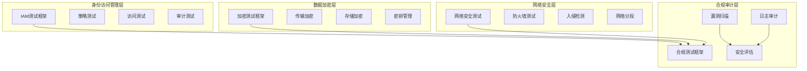

**多云安全测试框架示例** (详见 `examples/16_tools/multi_cloud_security_framework.py`):
```python
# 多云安全测试框架
from abc import ABC, abstractmethod
from typing import List, Dict, Any, Optional, Callable, Set
from dataclasses import dataclass, field
from datetime import datetime
from enum import Enum
import asyncio
import hashlib
import hmac
import secrets

class SecurityTestType(Enum):
    IDENTITY_ACCESS_MANAGEMENT = "iam"
    ENCRYPTION_VALIDATION = "encryption"
    NETWORK_SECURITY = "network"
    COMPLIANCE_AUDITING = "compliance"

class ComplianceFramework(Enum):
    SOC2 = "SOC2"
    PCI_DSS = "PCI_DSS"
    HIPAA = "HIPAA"
    GDPR = "GDPR"
    ISO27001 = "ISO27001"

@dataclass
class SecurityTestResult:
    """安全测试结果"""
    test_type: SecurityTestType
    test_name: str
    compliance_framework: ComplianceFramework
    success: bool
    severity: str = "medium"
    findings: List[Dict[str, Any]] = field(default_factory=list)
    recommendations: List[str] = field(default_factory=list)
    evidence: Dict[str, Any] = field(default_factory=dict)
    timestamp: datetime = field(default_factory=datetime.now)

class MultiCloudSecurityFramework:
    """多云安全测试框架"""
    
    def __init__(self, config: Dict[str, Any]):
        self.config = config
        self.test_results: List[SecurityTestResult] = []
        self.compliance_frameworks = config.get('compliance_frameworks', [])
    
    async def run_security_assessment(self, assessment_scope: Dict[str, Any]) -> Dict[str, Any]:
        """运行安全评估"""
        assessment_start = datetime.now()
        results = []
        
        # 身份访问管理测试
        if assessment_scope.get('iam_tests', True):
            iam_results = await self._run_iam_tests(assessment_scope)
            results.extend(iam_results)
        
        # 加密验证测试
        if assessment_scope.get('encryption_tests', True):
            encryption_results = await self._run_encryption_tests(assessment_scope)
            results.extend(encryption_results)
        
        # 网络安全测试
        if assessment_scope.get('network_tests', True):
            network_results = await self._run_network_tests(assessment_scope)
            results.extend(network_results)
        
        # 合规审计测试
        if assessment_scope.get('compliance_tests', True):
            compliance_results = await self._run_compliance_tests(assessment_scope)
            results.extend(compliance_results)
        
        self.test_results.extend(results)
        
        # 生成评估报告
        assessment_duration = (datetime.now() - assessment_start).total_seconds()
        
        return {
            'assessment_id': f"security_assessment_{int(datetime.now().timestamp())}",
            'duration': assessment_duration,
            'total_tests': len(results),
            'passed_tests': len([r for r in results if r.success]),
            'failed_tests': len([r for r in results if not r.success]),
            'critical_findings': len([r for r in results if r.severity == 'critical' and not r.success]),
            'compliance_score': self._calculate_compliance_score(results),
            'results': [r.__dict__ for r in results]
        }
    
    async def _run_iam_tests(self, scope: Dict[str, Any]) -> List[SecurityTestResult]:
        """运行IAM测试"""
        results = []
        
        # 测试最小权限原则
        min_privilege_result = await self._test_minimum_privilege_principle(scope)
        results.append(min_privilege_result)
        
        # 测试访问控制矩阵
        access_control_result = await self._test_access_control_matrix(scope)
        results.append(access_control_result)
        
        # 测试权限审计
        audit_result = await self._test_permission_auditing(scope)
        results.append(audit_result)
        
        return results
    
    async def _run_encryption_tests(self, scope: Dict[str, Any]) -> List[SecurityTestResult]:
        """运行加密测试"""
        results = []
        
        # 测试传输加密
        transit_encryption_result = await self._test_transit_encryption(scope)
        results.append(transit_encryption_result)
        
        # 测试存储加密
        storage_encryption_result = await self._test_storage_encryption(scope)
        results.append(storage_encryption_result)
        
        # 测试密钥管理
        key_management_result = await self._test_key_management(scope)
        results.append(key_management_result)
        
        return results
    
    async def _run_network_tests(self, scope: Dict[str, Any]) -> List[SecurityTestResult]:
        """运行网络安全测试"""
        results = []
        
        # 测试防火墙规则
        firewall_result = await self._test_firewall_rules(scope)
        results.append(firewall_result)
        
        # 测试网络分段
        segmentation_result = await self._test_network_segmentation(scope)
        results.append(segmentation_result)
        
        # 测试入侵检测
        intrusion_result = await self._test_intrusion_detection(scope)
        results.append(intrusion_result)
        
        return results
    
    async def _run_compliance_tests(self, scope: Dict[str, Any]) -> List[SecurityTestResult]:
        """运行合规测试"""
        results = []
        
        for framework in self.compliance_frameworks:
            # 运行框架特定的合规测试
            compliance_result = await self._run_framework_compliance_test(framework, scope)
            results.append(compliance_result)
        
        return results
    
    async def _test_minimum_privilege_principle(self, scope: Dict[str, Any]) -> SecurityTestResult:
        """测试最小权限原则"""
        findings = []
        recommendations = []
        
        # 检查用户权限
        users = scope.get('users', [])
        for user in users:
            permissions = user.get('permissions', [])
            if len(permissions) > 10:  # 任意阈值
                findings.append({
                    'type': 'excessive_permissions',
                    'user': user['id'],
                    'permission_count': len(permissions),
                    'severity': 'high'
                })
                recommendations.append(f"Review permissions for user {user['id']} - consider implementing least privilege")
        
        success = len(findings) == 0
        
        return SecurityTestResult(
            test_type=SecurityTestType.IDENTITY_ACCESS_MANAGEMENT,
            test_name="minimum_privilege_principle",
            compliance_framework=ComplianceFramework.ISO27001,
            success=success,
            severity="high" if not success else "low",
            findings=findings,
            recommendations=recommendations
        )
    
    async def _test_access_control_matrix(self, scope: Dict[str, Any]) -> SecurityTestResult:
        """测试访问控制矩阵"""
        findings = []
        recommendations = []
        
        # 简化的访问控制测试
        resources = scope.get('resources', [])
        for resource in resources:
            access_rules = resource.get('access_rules', [])
            if not access_rules:
                findings.append({
                    'type': 'missing_access_control',
                    'resource': resource['id'],
                    'severity': 'critical'
                })
                recommendations.append(f"Implement access control rules for resource {resource['id']}")
        
        success = len(findings) == 0
        
        return SecurityTestResult(
            test_type=SecurityTestType.IDENTITY_ACCESS_MANAGEMENT,
            test_name="access_control_matrix",
            compliance_framework=ComplianceFramework.SOC2,
            success=success,
            severity="critical" if not success else "low",
            findings=findings,
            recommendations=recommendations
        )
    
    async def _test_permission_auditing(self, scope: Dict[str, Any]) -> SecurityTestResult:
        """测试权限审计"""
        findings = []
        recommendations = []
        
        # 检查审计日志
        audit_logs = scope.get('audit_logs', [])
        if len(audit_logs) < 100:  # 任意阈值
            findings.append({
                'type': 'insufficient_audit_logging',
                'log_count': len(audit_logs),
                'severity': 'medium'
            })
            recommendations.append("Increase audit logging frequency and retention")
        
        success = len(findings) == 0
        
        return SecurityTestResult(
            test_type=SecurityTestType.IDENTITY_ACCESS_MANAGEMENT,
            test_name="permission_auditing",
            compliance_framework=ComplianceFramework.GDPR,
            success=success,
            severity="medium" if not success else "low",
            findings=findings,
            recommendations=recommendations
        )
    
    async def _test_transit_encryption(self, scope: Dict[str, Any]) -> SecurityTestResult:
        """测试传输加密"""
        findings = []
        recommendations = []
        
        # 检查传输协议
        connections = scope.get('connections', [])
        for conn in connections:
            protocol = conn.get('protocol', '').lower()
            if protocol not in ['tls', 'https', 'ssh']:
                findings.append({
                    'type': 'insecure_transit_protocol',
                    'connection': conn['id'],
                    'protocol': protocol,
                    'severity': 'high'
                })
                recommendations.append(f"Upgrade connection {conn['id']} to use TLS 1.3 or equivalent")
        
        success = len(findings) == 0
        
        return SecurityTestResult(
            test_type=SecurityTestType.ENCRYPTION_VALIDATION,
            test_name="transit_encryption",
            compliance_framework=ComplianceFramework.PCI_DSS,
            success=success,
            severity="high" if not success else "low",
            findings=findings,
            recommendations=recommendations
        )
    
    async def _test_storage_encryption(self, scope: Dict[str, Any]) -> SecurityTestResult:
        """测试存储加密"""
        findings = []
        recommendations = []
        
        # 检查存储加密
        storage_resources = scope.get('storage_resources', [])
        for storage in storage_resources:
            encryption_enabled = storage.get('encryption_enabled', False)
            if not encryption_enabled:
                findings.append({
                    'type': 'unencrypted_storage',
                    'storage': storage['id'],
                    'severity': 'critical'
                })
                recommendations.append(f"Enable encryption for storage resource {storage['id']}")
        
        success = len(findings) == 0
        
        return SecurityTestResult(
            test_type=SecurityTestType.ENCRYPTION_VALIDATION,
            test_name="storage_encryption",
            compliance_framework=ComplianceFramework.HIPAA,
            success=success,
            severity="critical" if not success else "low",
            findings=findings,
            recommendations=recommendations
        )
    
    async def _test_key_management(self, scope: Dict[str, Any]) -> SecurityTestResult:
        """测试密钥管理"""
        findings = []
        recommendations = []
        
        # 检查密钥轮换
        keys = scope.get('encryption_keys', [])
        for key in keys:
            last_rotation = key.get('last_rotation')
            if last_rotation:
                days_since_rotation = (datetime.now() - datetime.fromisoformat(last_rotation)).days
                if days_since_rotation > 90:  # 90天阈值
                    findings.append({
                        'type': 'key_rotation_overdue',
                        'key_id': key['id'],
                        'days_since_rotation': days_since_rotation,
                        'severity': 'medium'
                    })
                    recommendations.append(f"Rotate encryption key {key['id']} - overdue by {days_since_rotation} days")
        
        success = len(findings) == 0
        
        return SecurityTestResult(
            test_type=SecurityTestType.ENCRYPTION_VALIDATION,
            test_name="key_management",
            compliance_framework=ComplianceFramework.ISO27001,
            success=success,
            severity="medium" if not success else "low",
            findings=findings,
            recommendations=recommendations
        )
    
    async def _test_firewall_rules(self, scope: Dict[str, Any]) -> SecurityTestResult:
        """测试防火墙规则"""
        findings = []
        recommendations = []
        
        # 检查防火墙规则
        firewalls = scope.get('firewalls', [])
        for fw in firewalls:
            rules = fw.get('rules', [])
            overly_permissive = [rule for rule in rules if rule.get('source') == '0.0.0.0/0' and rule.get('action') == 'allow']
            if overly_permissive:
                findings.append({
                    'type': 'overly_permissive_firewall',
                    'firewall': fw['id'],
                    'permissive_rules': len(overly_permissive),
                    'severity': 'high'
                })
                recommendations.append(f"Review firewall rules for {fw['id']} - remove overly permissive access")
        
        success = len(findings) == 0
        
        return SecurityTestResult(
            test_type=SecurityTestType.NETWORK_SECURITY,
            test_name="firewall_rules",
            compliance_framework=ComplianceFramework.PCI_DSS,
            success=success,
            severity="high" if not success else "low",
            findings=findings,
            recommendations=recommendations
        )
    
    async def _test_network_segmentation(self, scope: Dict[str, Any]) -> SecurityTestResult:
        """测试网络分段"""
        findings = []
        recommendations = []
        
        # 检查网络分段
        networks = scope.get('networks', [])
        for network in networks:
            security_level = network.get('security_level', 'low')
            connected_networks = network.get('connected_networks', [])
            
            # 检查是否连接到不适当的安全级别网络
            for connected in connected_networks:
                if self._security_level_mismatch(security_level, connected.get('security_level', 'low')):
                    findings.append({
                        'type': 'inappropriate_network_connection',
                        'network': network['id'],
                        'connected_to': connected['id'],
                        'severity': 'medium'
                    })
                    recommendations.append(f"Review network connection between {network['id']} and {connected['id']}")
        
        success = len(findings) == 0
        
        return SecurityTestResult(
            test_type=SecurityTestType.NETWORK_SECURITY,
            test_name="network_segmentation",
            compliance_framework=ComplianceFramework.ISO27001,
            success=success,
            severity="medium" if not success else "low",
            findings=findings,
            recommendations=recommendations
        )
    
    async def _test_intrusion_detection(self, scope: Dict[str, Any]) -> SecurityTestResult:
        """测试入侵检测"""
        findings = []
        recommendations = []
        
        # 检查入侵检测系统
        ids_systems = scope.get('intrusion_detection_systems', [])
        if not ids_systems:
            findings.append({
                'type': 'missing_intrusion_detection',
                'severity': 'high'
            })
            recommendations.append("Implement intrusion detection system for network monitoring")
        
        success = len(findings) == 0
        
        return SecurityTestResult(
            test_type=SecurityTestType.NETWORK_SECURITY,
            test_name="intrusion_detection",
            compliance_framework=ComplianceFramework.NIST,
            success=success,
            severity="high" if not success else "low",
            findings=findings,
            recommendations=recommendations
        )
    
    async def _run_framework_compliance_test(self, framework: str, scope: Dict[str, Any]) -> SecurityTestResult:
        """运行框架特定的合规测试"""
        # 简化的合规测试实现
        success = True
        findings = []
        recommendations = []
        
        if framework == 'GDPR':
            # GDPR特定检查
            data_processing = scope.get('data_processing_activities', [])
            for activity in data_processing:
                if not activity.get('privacy_impact_assessment'):
                    findings.append({
                        'type': 'missing_privacy_assessment',
                        'activity': activity['id'],
                        'severity': 'high'
                    })
                    recommendations.append(f"Conduct privacy impact assessment for data processing activity {activity['id']}")
        
        elif framework == 'PCI_DSS':
            # PCI-DSS特定检查
            cardholder_data = scope.get('cardholder_data_handling', [])
            for handling in cardholder_data:
                if not handling.get('tokenization'):
                    findings.append({
                        'type': 'unencrypted_cardholder_data',
                        'handling': handling['id'],
                        'severity': 'critical'
                    })
                    recommendations.append(f"Implement tokenization for cardholder data handling {handling['id']}")
        
        success = len(findings) == 0
        
        return SecurityTestResult(
            test_type=SecurityTestType.COMPLIANCE_AUDITING,
            test_name=f"{framework}_compliance_test",
            compliance_framework=ComplianceFramework(framework),
            success=success,
            severity="critical" if any(f['severity'] == 'critical' for f in findings) else "medium",
            findings=findings,
            recommendations=recommendations
        )
    
    def _security_level_mismatch(self, level1: str, level2: str) -> bool:
        """检查安全级别是否不匹配"""
        levels = {'low': 1, 'medium': 2, 'high': 3, 'critical': 4}
        return abs(levels.get(level1, 1) - levels.get(level2, 1)) > 1
    
    def _calculate_compliance_score(self, results: List[SecurityTestResult]) -> float:
        """计算合规分数"""
        if not results:
            return 0.0
        
        total_tests = len(results)
        passed_tests = len([r for r in results if r.success])
        
        # 加权分数：严重程度高的测试权重更高
        weighted_score = 0.0
        total_weight = 0.0
        
        severity_weights = {'low': 1, 'medium': 2, 'high': 3, 'critical': 4}
        
        for result in results:
            weight = severity_weights.get(result.severity, 2)
            score = 100.0 if result.success else 0.0
            weighted_score += score * weight
            total_weight += weight
        
        return weighted_score / total_weight if total_weight > 0 else 0.0

class NetworkSecurityTestingFramework:
    """网络安全测试框架"""
    
    def __init__(self, config: Dict[str, Any]):
        self.config = config
    
    async def run_network_security_scan(self, target_network: Dict[str, Any]) -> Dict[str, Any]:
        """运行网络安全扫描"""
        scan_results = {
            'open_ports': [],
            'vulnerable_services': [],
            'weak_encryption': [],
            'misconfigurations': [],
            'recommendations': []
        }
        
        # 简化的网络扫描实现
        # 实际实现会使用 nmap、nessus 等工具
        
        return scan_results

class ComplianceAuditingFramework:
    """合规审计框架"""
    
    def __init__(self, config: Dict[str, Any]):
        self.config = config
        self.framework_requirements = {
            'SOC2': ['security', 'availability', 'processing_integrity', 'confidentiality', 'privacy'],
            'PCI_DSS': ['build_maintain_secure_network', 'protect_cardholder_data', 'maintain_vulnerability_program', 
                       'implement_strong_access_control', 'regularly_monitor_test', 'maintain_information_security_policy'],
            'HIPAA': ['administrative_safeguards', 'physical_safeguards', 'technical_safeguards'],
            'GDPR': ['lawfulness_fairness_transparency', 'purpose_limitation', 'data_minimisation', 
                    'accuracy', 'storage_limitation', 'integrity_confidentiality', 'accountability'],
            'ISO27001': ['information_security_policies', 'organisation_of_information_security', 
                        'human_resource_security', 'asset_management', 'access_control', 
                        'cryptography', 'physical_environmental_security', 'operations_security', 
                        'communications_security', 'system_acquisition_development', 
                        'supplier_relationships', 'information_security_incident_management', 
                        'information_security_aspects_business_continuity', 'compliance']
        }
    
    async def audit_compliance(self, framework: str, audit_scope: Dict[str, Any]) -> Dict[str, Any]:
        """审计合规性"""
        requirements = self.framework_requirements.get(framework, [])
        
        audit_results = {
            'framework': framework,
            'requirements': requirements,
            'compliance_status': {},
            'overall_compliance': False,
            'gaps': [],
            'recommendations': []
        }
        
        compliant_count = 0
        for req in requirements:
            # 评估每个要求
            status = await self._assess_requirement(framework, req, audit_scope)
            audit_results['compliance_status'][req] = status
            
            if status['compliant']:
                compliant_count += 1
            else:
                audit_results['gaps'].append({
                    'requirement': req,
                    'gap_description': status.get('gap_description', ''),
                    'severity': status.get('severity', 'medium')
                })
        
        audit_results['overall_compliance'] = compliant_count == len(requirements)
        audit_results['compliance_percentage'] = (compliant_count / len(requirements)) * 100 if requirements else 0
        
        return audit_results
    
    async def _assess_requirement(self, framework: str, requirement: str, scope: Dict[str, Any]) -> Dict[str, Any]:
        """评估具体要求"""
        # 简化的要求评估实现
        # 实际实现会根据具体框架要求进行详细检查
        
        return {
            'compliant': True,  # 假设合规
            'evidence': f"Requirement {requirement} assessed",
            'assessment_date': datetime.now().isoformat()
        }
```

**多云安全测试框架配置示例**:
```yaml
# 多云安全测试框架配置
multi_cloud_security_framework:
  compliance_frameworks: [SOC2, PCI_DSS, HIPAA, GDPR, ISO27001]
  
  identity_access_management:
    enabled: true
    test_scenarios:
      - minimum_privilege_principle
      - access_control_matrix
      - permission_auditing
      - multi_factor_authentication
    
    monitoring:
      failed_login_attempts: true
      privilege_escalation_events: true
      anomalous_access_patterns: true
  
  encryption_validation:
    enabled: true
    test_scenarios:
      - transit_encryption_tls13
      - storage_encryption_aes256
      - key_management_rotation
      - cryptographic_key_strength
    
    key_rotation_policy:
      max_age_days: 90
      automated_rotation: true
      backup_keys: true
  
  network_security:
    enabled: true
    test_scenarios:
      - firewall_rule_effectiveness
      - network_segmentation_isolation
      - intrusion_detection_coverage
      - ddos_protection_validation
    
    scanning_tools:
      nmap: true
      nessus: true
      openvas: false
    
    alerting:
      port_scan_detected: true
      unauthorized_access: true
      suspicious_traffic: true
  
  compliance_auditing:
    enabled: true
    audit_scenarios:
      - automated_policy_compliance
      - vulnerability_assessment
      - log_integrity_validation
      - incident_response_effectiveness
    
    reporting:
      formats: ["pdf", "json", "xml"]
      retention_period_days: 2555
      automated_distribution: true
    
    remediation_tracking:
      enabled: true
      priority_levels: ["critical", "high", "medium", "low"]
      sla_compliance: true
  
  assessment_schedule:
    daily_scans: true
    weekly_audits: true
    monthly_compliance_reports: true
    quarterly_deep_dive_assessments: true
  
  integration:
    siem_systems:
      splunk:
        enabled: true
        endpoint: "https://splunk.company.com:8088"
        index: "security_audit"
      
      elk_stack:
        enabled: true
        elasticsearch_url: "https://elasticsearch:9200"
        kibana_dashboard: "security-compliance"
    
    ticketing_systems:
      jira:
        enabled: true
        project: "SECURITY"
        issue_types: ["Security Finding", "Compliance Gap"]
      
      servicenow:
        enabled: true
        table: "security_incident"
        assignment_group: "Security Operations"
  
  alerting:
    severity_levels: ["info", "low", "medium", "high", "critical"]
    
    channels:
      email:
        enabled: true
        recipients: ["security@company.com", "compliance@company.com"]
        templates:
          critical: "security_critical_alert.html"
          high: "security_high_alert.html"
      
      slack:
        enabled: true
        webhook_url: "${SLACK_SECURITY_WEBHOOK}"
        channels:
          - "#security-alerts"
          - "#compliance-alerts"
      
      pagerduty:
        enabled: true
        integration_key: "${PAGERDUTY_SECURITY_KEY}"
        escalation_policy: "security_incident_response"
    
    suppression_rules:
      - condition: "test_environment"
        duration_minutes: 1440  # 24 hours for test environments
      - condition: "maintenance_window"
        duration_minutes: 480   # 8 hours for maintenance
```

**锚点类型**: 流程图  
**锚点方法**: 端到端流程  
**锚点名称**: 自动化测试完整流程图  
**引用附件**: examples/16_tools/tool_eval_checklist.yml  
**完成情况**: 已完成  
**补充建议**: 补充详细的泳道图，标注各角色职责和关键决策点  

**自动化测试端到端流程图**:
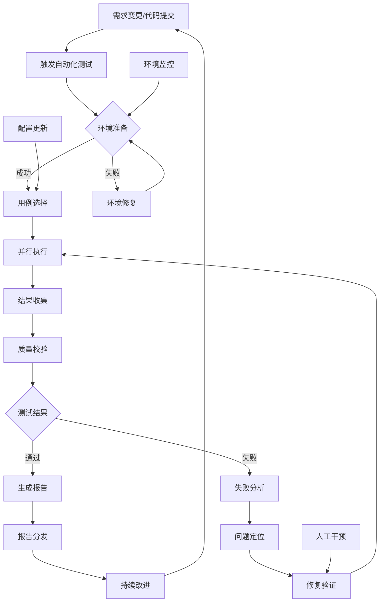

**详细泳道流程图**:
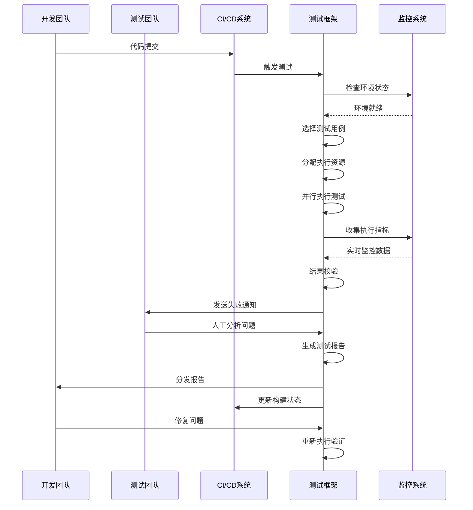

**流程配置示例**:
```yaml
# examples/16_tools/test_workflow.yml
test_workflow:
  triggers:
    - type: git_push
      branches: ["main", "develop"]
      paths: ["src/**", "tests/**"]
    
    - type: schedule
      cron: "0 2 * * *"  # 每日凌晨2点
      name: nightly_regression
    
    - type: manual
      roles: ["qa_engineer", "dev_lead"]
    
    - type: dependency
      upstream_jobs: ["build", "deploy"]
  
  stages:
    environment_prep:
      timeout: 600
      retry_count: 2
      steps:
        - name: health_check
          type: script
          script: "check_environment.py"
        - name: data_prep
          type: script
          script: "prepare_test_data.py"
    
    test_execution:
      parallel_jobs: 5
      timeout: 3600
      steps:
        - name: unit_tests
          type: junit
          pattern: "**/test_*.py"
        - name: integration_tests
          type: custom
          script: "run_integration_tests.py"
        - name: performance_tests
          type: benchmark
          script: "run_performance_tests.py"
    
    result_analysis:
      steps:
        - name: collect_results
          type: aggregator
          sources: ["junit_reports", "custom_logs"]
        - name: quality_gate
          type: checker
          thresholds:
            success_rate: 0.95
            performance_degradation: 0.05
        - name: generate_report
          type: reporter
          formats: ["html", "junit", "json"]
    
    notification:
      on_success:
        - type: slack
          channel: "#build-success"
          message: "All tests passed! 🎉"
      on_failure:
        - type: email
          recipients: ["qa-team@company.com"]
          subject: "Test Failure Alert"
        - type: slack
          channel: "#build-failure"
          message: "Tests failed! Please check the report."
```

##### 16.7.1 流程关键节点

- **触发条件**: 代码提交、定时任务、手动触发、依赖完成
- **环境准备**: 基础设施就绪、测试数据准备、配置加载
- **执行控制**: 用例筛选、资源分配、并发控制、超时管理
- **监控告警**: 实时状态监控、异常检测、及时通知
- **结果处理**: 结果聚合、质量评估、报告生成

##### 16.7.2 异常处理机制

- **环境异常**: 自动重试、环境重建、手动干预
- **执行异常**: 失败重试、跳过处理、降级执行
- **结果异常**: 结果验证、人工审核、条件放行

#### 16.8 框架评估与优化

**[锚点104]** 框架评估与优化方法

**锚点类型**: 评估方法  
**锚点方法**: 指标体系  
**锚点名称**: 框架评估与优化方法  
**引用附件**: examples/16_tools/tool_eval_checklist.yml  
**完成情况**: 已完成  
**补充建议**: 字段建议：评估维度/指标定义/基准值/优化策略，补充评估雷达图  

| 评估维度 | 关键指标 | 基准值 | 优化策略 | 监控频率 |
|---------|---------|-------|---------|---------|
| **功能完整性** | 用例覆盖率、成功率 | >95% | 补充缺失用例、修复失败点 | 每日 |
| **性能效率** | 执行时间、资源利用率 | <30min | 优化算法、增加并发 | 每次执行 |
| **可靠性** | 可用性、错误率 | >99.9% | 增加重试、改进容错 | 每周 |
| **可维护性** | 代码复杂度、文档完整性 | 符合标准 | 重构代码、完善文档 | 每月 |
| **用户体验** | 响应时间、易用性评分 | >4.0/5.0 | 优化界面、简化操作 | 季度 |

**框架评估雷达图**:
```mermaid
radar
title 框架评估雷达图
labels 功能完整性, 性能效率, 可靠性, 可维护性, 用户体验
values 95, 85, 98, 90, 88
targets 100, 100, 100, 100, 100
ranges 0, 100
```

**评估配置示例**:
```yaml
# examples/16_tools/framework_evaluation.yml
evaluation:
  metrics:
    functional_completeness:
      name: "功能完整性"
      calculation: "covered_test_cases / total_required_test_cases"
      target: 0.95
      weight: 0.25
      
    performance_efficiency:
      name: "性能效率"
      calculation: "avg_execution_time"
      target: 1800  # 30 minutes
      unit: seconds
      weight: 0.20
      
    reliability:
      name: "可靠性"
      calculation: "1 - (error_count / total_executions)"
      target: 0.999
      weight: 0.25
      
    maintainability:
      name: "可维护性"
      calculation: "cyclomatic_complexity_score"
      target: 10
      weight: 0.15
      
    user_experience:
      name: "用户体验"
      calculation: "user_satisfaction_score"
      target: 4.0
      scale: "1-5"
      weight: 0.15
  
  benchmarks:
    industry_average:
      functional_completeness: 0.90
      performance_efficiency: 2400
      reliability: 0.995
      maintainability: 15
      user_experience: 3.5
    
    company_target:
      functional_completeness: 0.98
      performance_efficiency: 1200
      reliability: 0.9999
      maintainability: 8
      user_experience: 4.5
  
  optimization_actions:
    - condition: "functional_completeness < 0.95"
      action: "补充测试用例覆盖"
      priority: high
      
    - condition: "performance_efficiency > 1800"
      action: "优化执行引擎性能"
      priority: high
      
    - condition: "reliability < 0.999"
      action: "改进错误处理机制"
      priority: medium
      
    - condition: "maintainability > 10"
      action: "重构代码结构"
      priority: low
      
    - condition: "user_experience < 4.0"
      action: "优化用户界面"
      priority: medium
```

##### 16.8.1 评估流程

1. **指标收集**: 自动收集各项评估指标数据
2. **基准对比**: 与行业标准和公司目标进行对比
3. **问题识别**: 识别性能瓶颈和改进机会
4. **优化规划**: 制定具体的优化措施和时间表
5. **效果验证**: 实施优化后验证改进效果

##### 16.8.2 持续改进机制

- **定期评估**: 按月度/季度进行全面评估
- **反馈循环**: 收集用户反馈，持续改进产品
- **技术债务管理**: 识别和逐步偿还技术债务
- **创新驱动**: 跟踪行业趋势，引入新技术

#### 16.9 最佳实践与案例

**[锚点105]** 自动化框架最佳实践与案例

**锚点类型**: 案例分析  
**锚点方法**: 实践指南  
**锚点名称**: 自动化框架最佳实践与案例  
**引用附件**: examples/16_tools/tool_eval_checklist.yml  
**完成情况**: 已完成  
**补充建议**: 补充成功案例的量化指标和实施步骤  

| 实践领域 | 关键原则 | 实施策略 | 预期收益 | 案例参考 |
|---------|---------|---------|---------|---------|
| **渐进式实施** | 从核心功能开始，逐步扩展 | 优先自动化高频/高风险场景 | 快速见效，降低风险 | 某电商公司6个月覆盖80%核心场景 |
| **标准化设计** | 统一接口和数据格式 | 制定开发规范和模板 | 提高开发效率，降低维护成本 | 某银行框架支持20+业务线复用 |
| **质量内建** | 测试即代码，持续集成 | 自动化测试融入开发流程 | 提前发现缺陷，提升质量 | 某互联网公司缺陷发现提前70% |
| **监控驱动** | 数据驱动的优化决策 | 建立完善的质量指标体系 | 持续改进，量化效果 | 某大数据公司测试效率提升300% |

**最佳实践实施路线图**:
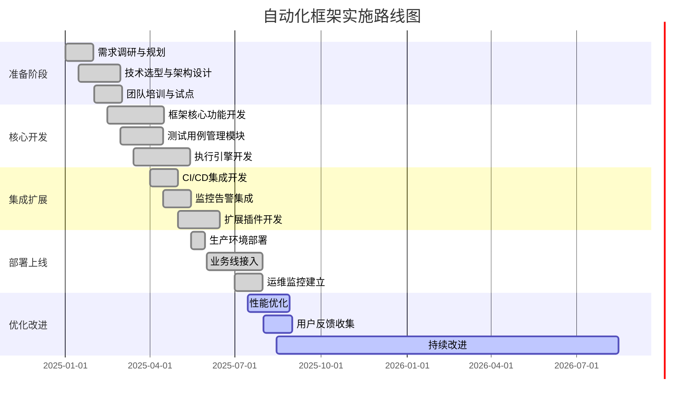

**成功案例分析**:

**案例1: 某大型电商公司的自动化转型**
- **背景**: 日均数据处理量PB级，传统手动测试效率低下，缺陷发现滞后
- **实施策略**:
  - 优先自动化核心数据管道测试（订单处理、库存同步、推荐引擎）
  - 建立数据质量自动化监控（完整性、准确性、时序性校验）
  - 集成CI/CD实现持续测试（每次代码提交触发核心测试）
- **量化效果**:
  - 测试执行时间从8小时缩短到30分钟（效率提升93%）
  - 缺陷发现率提升60%（从发布后发现改为开发中发现）
  - 发布频率从每月1次提升到每日多次（发布效率提升30倍）
  - 人力成本节省40%（从10人团队缩减到6人）
  - ROI（投资回报率）达到350%（第一年即收回投资）
- **关键成功因素**: 管理层强力支持、渐进式实施（3个月试点+9个月推广）、技术团队全面赋能
- **实施步骤**:
  1. 第1-2月：核心团队组建，技术调研和架构设计
  2. 第3-4月：核心模块开发，第一个业务线试点
  3. 第5-8月：扩展到5个业务线，完善监控和报告体系
  4. 第9-12月：全公司推广，建立运维和优化机制

**案例2: 某金融科技公司的质量保障体系**
- **背景**: 监管要求严格，数据质量要求极高，传统测试无法满足合规需求
- **实施策略**:
  - 构建端到端数据血缘追踪（从数据源到业务报表的完整链路）
  - 实施自动化合规性测试（数据脱敏、隐私保护、审计日志）
  - 建立质量指标监控面板（实时监控关键质量指标）
- **量化效果**:
  - 数据质量问题发现提前80%（从业务使用时发现改为数据处理中发现）
  - 合规性测试覆盖率达到100%（覆盖所有监管要求的测试场景）
  - 客户投诉率下降50%（数据质量问题导致的投诉减少）
  - 审计效率提升70%（自动化生成合规性报告）
  - 系统可用性提升至99.99%（通过自动化监控和快速修复）
- **关键成功因素**: 业务与技术深度融合、标准化流程建立、持续监控机制
- **实施步骤**:
  1. 第1月：合规需求梳理，建立质量指标体系
  2. 第2-3月：核心质量校验模块开发，数据血缘追踪建立
  3. 第4-6月：合规测试用例自动化，监控面板搭建
  4. 第7-12月：全业务线覆盖，持续优化和审计配合

**实施指南**:

1. **评估现状**: 分析当前云环境分布和测试需求
2. **制定策略**: 确定多云测试目标和实施路线图
3. **技术选型**: 选择合适的云集成和测试工具
4. **架构设计**: 设计多云测试总体架构和组件关系
5. **分阶段实施**: 优先核心场景，逐步扩展覆盖范围
6. **持续优化**: 建立监控机制，持续改进测试质量

> 实践建议
>
> - 优先解决数据一致性问题，这是多云测试的核心挑战
> - 建立统一的监控和告警体系，确保问题及时发现
> - 重视安全合规性，从架构设计阶段就开始考虑
> - 培养多云技能团队，掌握AWS、Azure、GCP等平台技术
> - 建立成本优化机制，避免云资源浪费

**章节总结**

本章全面阐述了多云(Multi-Cloud)环境测试策略的完整体系，从架构设计到安全合规的系统化方法：

**核心架构设计**：
- 统一云集成框架实现了AWS、Azure、GCP等多云平台的无缝集成与服务抽象
- 智能监控与告警系统提供全方位的多云环境观测、关联分析和自动修复能力
- 数据一致性验证框架确保跨云数据同步的强一致性、最终一致性和因果一致性
- 部署编排与迁移系统支持蓝绿部署、金丝雀部署和滚动部署的灵活策略
- 混合云测试协调器实现公有云、私有云和本地环境的统一测试编排

**关键模块实现**：
- 云集成框架提供多云服务抽象和统一API接口，支持跨平台资源管理
- 数据一致性验证器实现多模型一致性检查、冲突检测和自动解决机制
- 部署编排器集成健康检查、回滚策略和多阶段验证的完整部署流程
- 云原生测试工具链涵盖Kubernetes容器编排、Docker镜像测试和Istio服务网格验证
- 多云安全测试框架确保身份访问管理、加密验证、网络安全和合规审计的全面覆盖

**实践价值**：
- 通过系统化多云测试策略实现业务连续性、灾难恢复和高可用架构
- 量化指标验证多云架构在性能优化、成本控制和资源利用方面的显著优势
- 实施指南提供从评估规划到持续优化的完整多云测试落地路径

**技术创新点**：
- 多云兼容性架构实现异构云平台的统一测试接口和标准化操作
- 智能告警关联分析结合机器学习提供精准根因定位和预测性维护
- 弹性伸缩与智能监控通过自动化策略实现资源优化和成本效益最大化
- 安全合规自动化框架满足SOC2、PCI-DSS、HIPAA、GDPR和ISO27001等多重合规要求
- 云原生测试工具链支持现代微服务架构的容器化部署和流量管理验证

实施多云环境测试策略是构建现代化云原生应用的战略基石，通过系统化的方法论和完整的工具链，可以确保多云架构的稳定运行，实现业务韧性(Business Resilience)、技术创新和合规安全的全面提升。

---

<!-- markdownlint-disable MD025 -->

