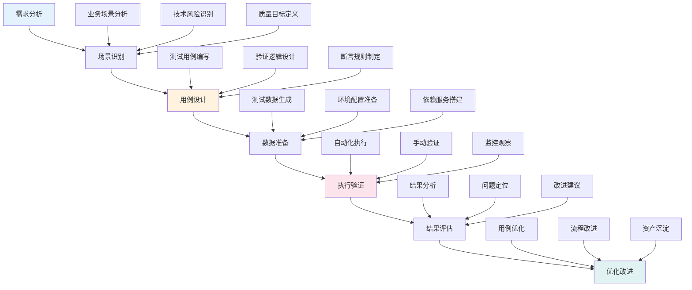
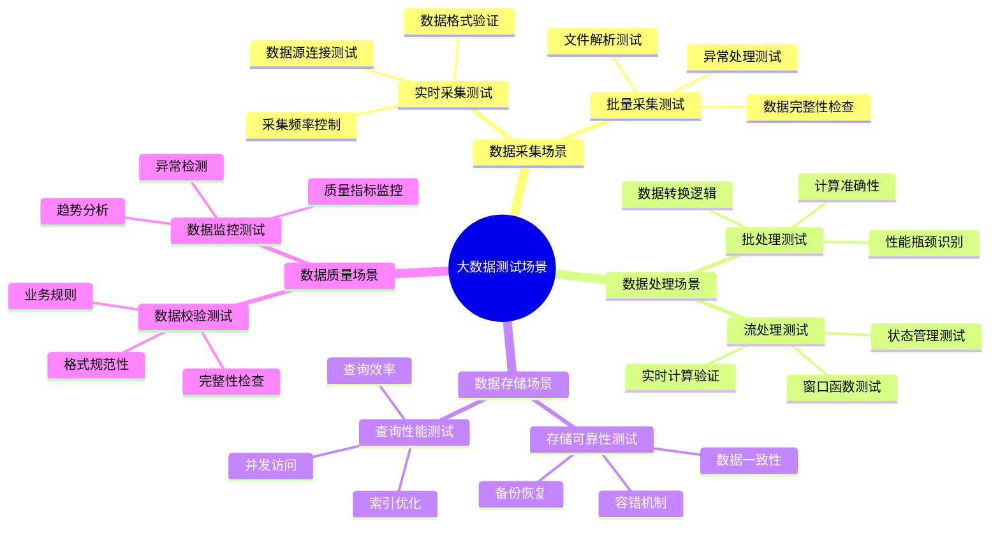
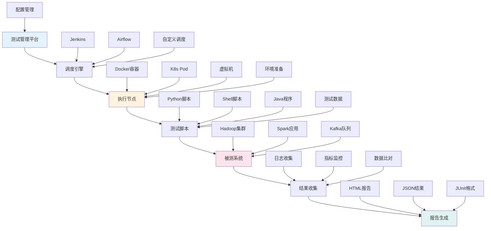
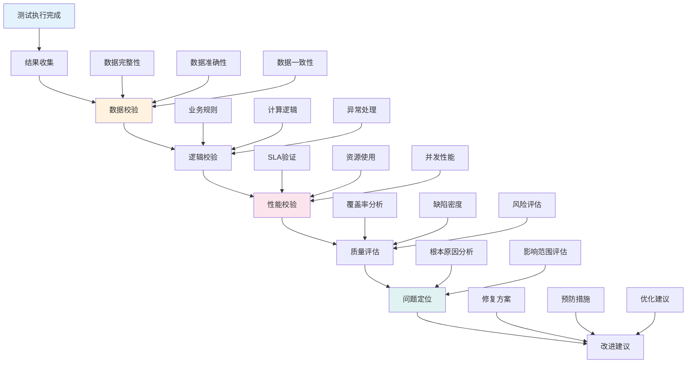
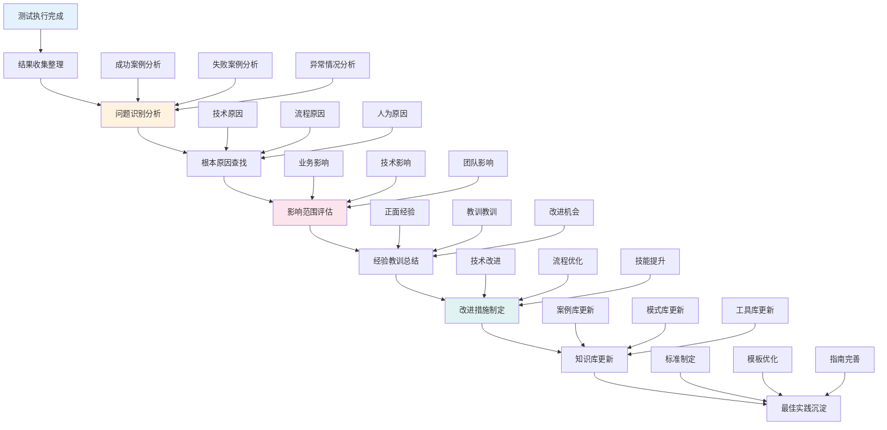

<!-- markdownlint-disable MD025 -->

<a id="第17章-通用大数据测试案例设计【方法与模板篇】"></a>

### 第17章 通用大数据测试案例设计【方法与模板篇】

**本章学习目标**

1. 掌握大数据测试案例(Big Data Test Case)的设计方法和模板体系；
2. 学习场景驱动(Scenario-Driven)的测试案例设计流程；
3. 实现测试案例的自动化和可复用性。

**实践建议**

- 采用场景驱动的方法设计测试案例，确保覆盖关键业务和技术风险。
- 制定标准化的测试模板，提高案例设计的效率。
- 结合自动化工具实现测试案例的快速执行和结果评估。

**[锚点17-001]** 典型大数据测试案例设计

**锚点类型**: 案例设计
**锚点方法**: 场景驱动设计
**锚点名称**: 典型大数据测试案例设计
**引用附件**: examples/17_tools/test_case_design.md
**完成情况**: 已完成
**补充建议**: 字段建议：案例类型/测试目标/验证方法/数据范围/自动化程度，补充案例设计流程图

| 案例类型 | 测试目标 | 验证方法 | 数据范围 | 自动化程度 | 应用场景 |
|---------|---------|---------|---------|---------|---------|
| **数据采集测试** | 验证数据完整性 | 端到端对账 | 全量数据 | 高自动化 | ETL链路验证 |
| **数据处理测试** | 验证计算准确性 | 结果比对 | 样本数据 | 中自动化 | 批处理作业验证 |
| **数据存储测试** | 验证存储可靠性 | 一致性检查 | 关键数据 | 高自动化 | 存储系统验证 |
| **数据质量测试** | 验证数据规范性 | 规则校验 | 全量数据 | 高自动化 | 数据治理验证 |
| **性能容量测试** | 验证系统承载力 | 负载压力测试 | 大数据量 | 中自动化 | 容量规划验证 |

**大数据测试案例设计流程图**:


**测试案例设计配置模板**:
```yaml
# examples/17_tools/test_case_template.yml
test_case_template:
  metadata:
    case_id: "TC_BATCH_PROCESSING_001"
    category: "batch_processing"
    priority: "high"
    author: "test_team"
    created_date: "2025-12-23"
    
  scenario:
    name: "批量数据处理完整性测试"
    description: "验证大数据批处理作业的数据完整性和准确性"
    business_impact: "确保业务报表数据的准确性"
    
  test_objective:
    primary: "验证批处理作业能够正确处理全量数据"
    secondary: ["验证数据转换逻辑", "验证错误处理机制"]
    
  test_scope:
    data_range: "最近30天全量业务数据"
    system_components: ["数据采集", "ETL处理", "数据存储"]
    interfaces: ["数据源API", "存储接口"]
    
  test_data:
    input_data:
      source: "production_database"
      volume: "100GB"
      format: "parquet"
    expected_output:
      format: "delta_table"
      validation_rules: ["row_count_match", "data_integrity"]
      
  test_steps:
    - step_id: "setup"
      description: "准备测试环境和数据"
      automation_level: "full"
      
    - step_id: "execute"
      description: "执行批处理作业"
      automation_level: "full"
      
    - step_id: "validate"
      description: "验证处理结果"
      automation_level: "full"
      
    - step_id: "cleanup"
      description: "清理测试数据"
      automation_level: "full"
      
  assertions:
    - type: "data_integrity"
      rule: "input_row_count == output_row_count"
      severity: "critical"
      
    - type: "business_logic"
      rule: "revenue_calculation_accuracy > 99.9%"
      severity: "high"
      
    - type: "performance"
      rule: "processing_time < 2_hours"
      severity: "medium"
      
  success_criteria:
    all_assertions_pass: true
    manual_review_required: false
    
  failure_handling:
    retry_count: 2
    rollback_procedure: "恢复到上一个成功状态"
    notification_channels: ["email", "slack", "jira"]
```

#### 17.1 典型大数据测试案例设计

##### 17.1.1 案例设计原则

- **场景驱动**: 以业务场景为导向设计测试案例
- **风险导向**: 重点覆盖高风险、高影响的测试场景
- **可复用性**: 设计可跨项目复用的通用案例模板
- **可自动化**: 优先考虑自动化实现的可能性

##### 17.1.2 案例分类体系

1. **功能测试案例**: 验证系统功能正确性
2. **性能测试案例**: 验证系统性能表现
3. **稳定性测试案例**: 验证系统长期运行稳定性
4. **兼容性测试案例**: 验证系统版本兼容性
5. **安全性测试案例**: 验证系统安全防护能力

**关键场景测试用例拆解表**:


**场景用例拆解配置**:
```yaml
# examples/17_observability/scenario_decomposition.yml
scenario_decomposition:
  batch_processing_scenario:
    name: "批处理数据转换场景"
    risk_level: "high"
    business_impact: "影响日报表生成"
    
    test_cases:
      - case_id: "BP_001"
        name: "数据完整性验证"
        objective: "确保输入数据完整传输到输出"
        test_data: "1TB业务数据样本"
        validation_method: "行数比对"
        automation_level: "full"
        
      - case_id: "BP_002"
        name: "业务逻辑准确性"
        objective: "验证转换逻辑的正确性"
        test_data: "已知结果数据集"
        validation_method: "结果比对"
        automation_level: "full"
        
      - case_id: "BP_003"
        name: "异常数据处理"
        objective: "验证异常数据的处理机制"
        test_data: "包含异常数据样本"
        validation_method: "错误日志检查"
        automation_level: "semi"
        
      - case_id: "BP_004"
        name: "性能基准测试"
        objective: "验证处理性能满足SLA"
        test_data: "全量数据"
        validation_method: "时间监控"
        automation_level: "full"
        
    success_criteria:
      - "所有核心用例通过率100%"
      - "性能指标满足SLA要求"
      - "异常处理覆盖率>95%"
      
    failure_scenarios:
      - "数据丢失>0.01%"
      - "处理时间超出2倍基准"
      - "业务逻辑错误率>0.1%"

  streaming_processing_scenario:
    name: "实时流处理场景"
    risk_level: "critical"
    business_impact: "影响实时业务决策"
    
    test_cases:
      - case_id: "SP_001"
        name: "实时性验证"
        objective: "验证数据处理延迟"
        test_data: "实时数据流"
        validation_method: "延迟测量"
        automation_level: "full"
        
      - case_id: "SP_002"
        name: "数据乱序处理"
        objective: "验证乱序数据的正确处理"
        test_data: "乱序时间戳数据"
        validation_method: "结果准确性检查"
        automation_level: "full"
        
      - case_id: "SP_003"
        name: "状态一致性"
        objective: "验证状态管理的正确性"
        test_data: "状态变更数据"
        validation_method: "状态比对"
        automation_level: "semi"
```

#### 17.2 关键场景与用例拆解

**[锚点17-002]** 关键场景测试用例拆解

**锚点类型**: 场景分析
**锚点方法**: 用例拆解
**锚点名称**: 关键场景测试用例拆解
**引用附件**: examples/17_tools/scenario_analysis.md
**完成情况**: 已完成
**补充建议**: 字段建议：场景类型/关键路径/测试点/验证方法/风险等级，补充场景分析思维导图

**关键场景测试用例拆解表**:


**场景用例拆解配置**:
```yaml
# examples/17_observability/scenario_decomposition.yml
scenario_decomposition:
  batch_processing_scenario:
    name: "批处理数据转换场景"
    risk_level: "high"
    business_impact: "影响日报表生成"
    
    test_cases:
      - case_id: "BP_001"
        name: "数据完整性验证"
        objective: "确保输入数据完整传输到输出"
        test_data: "1TB业务数据样本"
        validation_method: "行数比对"
        automation_level: "full"
        
      - case_id: "BP_002"
        name: "业务逻辑准确性"
        objective: "验证转换逻辑的正确性"
        test_data: "已知结果数据集"
        validation_method: "结果比对"
        automation_level: "full"
        
      - case_id: "BP_003"
        name: "异常数据处理"
        objective: "验证异常数据的处理机制"
        test_data: "包含异常数据样本"
        validation_method: "错误日志检查"
        automation_level: "semi"
        
      - case_id: "BP_004"
        name: "性能基准测试"
        objective: "验证处理性能满足SLA"
        test_data: "全量数据"
        validation_method: "时间监控"
        automation_level: "full"
        
    success_criteria:
      - "所有核心用例通过率100%"
      - "性能指标满足SLA要求"
      - "异常处理覆盖率>95%"
      
    failure_scenarios:
      - "数据丢失>0.01%"
      - "处理时间超出2倍基准"
      - "业务逻辑错误率>0.1%"

  streaming_processing_scenario:
    name: "实时流处理场景"
    risk_level: "critical"
    business_impact: "影响实时业务决策"
    
    test_cases:
      - case_id: "SP_001"
        name: "实时性验证"
        objective: "验证数据处理延迟"
        test_data: "实时数据流"
        validation_method: "延迟测量"
        automation_level: "full"
        
      - case_id: "SP_002"
        name: "数据乱序处理"
        objective: "验证乱序数据的正确处理"
        test_data: "乱序时间戳数据"
        validation_method: "结果准确性检查"
        automation_level: "full"
        
      - case_id: "SP_003"
        name: "状态一致性"
        objective: "验证状态管理的正确性"
        test_data: "状态变更数据"
        validation_method: "状态比对"
        automation_level: "semi"
```

#### 17.2.1 数据采集场景测试

- **实时采集测试**: 验证数据源连接、数据格式、采集频率
- **批量采集测试**: 验证文件解析、数据完整性、异常处理
- **增量采集测试**: 验证断点续传、重复数据处理

#### 17.2.2 数据处理场景测试

- **批处理测试**: 验证数据转换逻辑、计算准确性、性能表现
- **流处理测试**: 验证实时计算、窗口函数、状态管理
- **ETL测试**: 验证数据抽取(Extract)、转换(Transform)、加载(Load)全流程

#### 17.2.3 数据存储场景测试

- **存储可靠性测试**: 验证数据一致性、备份恢复、容错机制
- **查询性能测试**: 验证索引优化、查询效率、并发访问
- **数据安全测试**: 验证访问控制、加密存储、审计日志

---

#### 17.3 自动化与脚本设计

**[锚点17-003]** 测试自动化脚本设计

**锚点类型**: 自动化设计
**锚点方法**: 脚本框架
**锚点名称**: 测试自动化脚本设计
**引用附件**: examples/17_tools/automation_framework.md
**完成情况**: 已完成
**补充建议**: 字段建议：脚本类型/执行方式/配置管理/结果处理/扩展机制，补充自动化架构图

**测试自动化架构图**:


**自动化测试脚本框架**:
```python
# examples/17_tools/test_automation_framework.py
import unittest
import time
import json
import logging
from datetime import datetime, timedelta
from typing import Dict, List, Optional, Any, Callable
from dataclasses import dataclass
import subprocess
import requests
from concurrent.futures import ThreadPoolExecutor
import docker

logging.basicConfig(level=logging.INFO)
logger = logging.getLogger(__name__)

@dataclass
class TestCase:
    """测试用例数据类"""
    case_id: str
    name: str
    category: str
    priority: str
    test_data: Dict[str, Any]
    assertions: List[Dict[str, Any]]
    timeout: int = 300
    
@dataclass
class TestResult:
    """测试结果数据类"""
    case_id: str
    status: str  # 'pass', 'fail', 'error', 'skip'
    duration: float
    error_message: Optional[str] = None
    details: Dict[str, Any] = None

class BigDataTestAutomationFramework:
    """大数据测试自动化框架"""
    
    def __init__(self, config_file: str = 'test_config.yml'):
        self.config = self._load_config(config_file)
        self.test_cases: List[TestCase] = []
        self.test_results: List[TestResult] = []
        self.docker_client = docker.from_env()
        
    def _load_config(self, config_file: str) -> Dict[str, Any]:
        """加载配置文件"""
        import yaml
        with open(config_file, 'r', encoding='utf-8') as f:
            return yaml.safe_load(f)
    
    def load_test_cases(self, test_case_file: str):
        """加载测试用例"""
        import yaml
        with open(test_case_file, 'r', encoding='utf-8') as f:
            cases_data = yaml.safe_load(f)
            
        for case_data in cases_data.get('test_cases', []):
            test_case = TestCase(**case_data)
            self.test_cases.append(test_case)
            
        logger.info(f"Loaded {len(self.test_cases)} test cases")
    
    def execute_test_case(self, test_case: TestCase) -> TestResult:
        """执行单个测试用例"""
        start_time = time.time()
        
        try:
            logger.info(f"Executing test case: {test_case.case_id}")
            
            # 准备测试环境
            self._prepare_test_environment(test_case)
            
            # 执行测试逻辑
            result = self._execute_test_logic(test_case)
            
            # 验证断言
            success = self._validate_assertions(test_case, result)
            
            duration = time.time() - start_time
            
            if success:
                return TestResult(test_case.case_id, 'pass', duration, details=result)
            else:
                return TestResult(test_case.case_id, 'fail', duration, 
                                error_message="Assertions failed", details=result)
                                
        except Exception as e:
            duration = time.time() - start_time
            logger.error(f"Error executing test case {test_case.case_id}: {e}")
            return TestResult(test_case.case_id, 'error', duration, 
                            error_message=str(e))
    
    def _prepare_test_environment(self, test_case: TestCase):
        """准备测试环境"""
        env_config = test_case.test_data.get('environment', {})
        
        # 创建Docker容器（如果需要）
        if 'docker_image' in env_config:
            container = self.docker_client.containers.run(
                env_config['docker_image'],
                detach=True,
                environment=env_config.get('env_vars', {}),
                ports=env_config.get('ports', {})
            )
            test_case.test_data['container_id'] = container.id
    
    def _execute_test_logic(self, test_case: TestCase) -> Dict[str, Any]:
        """执行测试逻辑"""
        execution_config = test_case.test_data.get('execution', {})
        execution_type = execution_config.get('type', 'script')
        
        if execution_type == 'script':
            return self._execute_script(execution_config)
        elif execution_type == 'api':
            return self._execute_api_call(execution_config)
        elif execution_type == 'spark_job':
            return self._execute_spark_job(execution_config)
        else:
            raise ValueError(f"Unsupported execution type: {execution_type}")
    
    def _execute_script(self, config: Dict[str, Any]) -> Dict[str, Any]:
        """执行脚本"""
        script_path = config['script_path']
        args = config.get('args', [])
        
        cmd = ['python', script_path] + args
        result = subprocess.run(cmd, capture_output=True, text=True, timeout=300)
        
        return {
            'return_code': result.returncode,
            'stdout': result.stdout,
            'stderr': result.stderr
        }
    
    def _execute_api_call(self, config: Dict[str, Any]) -> Dict[str, Any]:
        """执行API调用"""
        url = config['url']
        method = config.get('method', 'GET')
        data = config.get('data', {})
        
        response = requests.request(method, url, json=data, timeout=30)
        
        return {
            'status_code': response.status_code,
            'response_data': response.json() if response.headers.get('content-type') == 'application/json' else response.text
        }
    
    def _execute_spark_job(self, config: Dict[str, Any]) -> Dict[str, Any]:
        """执行Spark作业"""
        jar_path = config['jar_path']
        main_class = config['main_class']
        args = config.get('args', [])
        
        cmd = ['spark-submit', '--class', main_class, jar_path] + args
        result = subprocess.run(cmd, capture_output=True, text=True, timeout=1800)
        
        return {
            'return_code': result.returncode,
            'stdout': result.stdout,
            'stderr': result.stderr
        }
    
    def _validate_assertions(self, test_case: TestCase, execution_result: Dict[str, Any]) -> bool:
        """验证断言"""
        for assertion in test_case.assertions:
            assertion_type = assertion['type']
            
            if assertion_type == 'return_code':
                if execution_result.get('return_code') != assertion['expected']:
                    return False
                    
            elif assertion_type == 'contains_text':
                output = execution_result.get('stdout', '') + execution_result.get('stderr', '')
                if assertion['text'] not in output:
                    return False
        
        return True
    
    def run_test_suite(self, parallel: bool = False) -> List[TestResult]:
        """运行测试套件"""
        if parallel:
            with ThreadPoolExecutor(max_workers=5) as executor:
                futures = [executor.submit(self.execute_test_case, case) for case in self.test_cases]
                self.test_results = [future.result() for future in futures]
        else:
            self.test_results = [self.execute_test_case(case) for case in self.test_cases]
        
        return self.test_results
    
    def generate_report(self) -> str:
        """生成测试报告"""
        report = "# 大数据测试自动化报告\n\n"
        report += f"生成时间: {datetime.now().isoformat()}\n\n"
        report += f"总测试用例数: {len(self.test_cases)}\n"
        report += f"执行测试数: {len(self.test_results)}\n\n"
        
        passed = len([r for r in self.test_results if r.status == 'pass'])
        failed = len([r for r in self.test_results if r.status == 'fail'])
        errors = len([r for r in self.test_results if r.status == 'error'])
        
        report += "## 测试结果统计\n\n"
        report += f"- 通过: {passed}\n"
        report += f"- 失败: {failed}\n"
        report += f"- 错误: {errors}\n\n"
        
        success_rate = (passed / len(self.test_results)) * 100 if self.test_results else 0
        report += f"成功率: {success_rate:.1f}%\n\n"
        
        return report

# 使用示例
if __name__ == "__main__":
    framework = BigDataTestAutomationFramework()
    framework.load_test_cases('test_cases.yml')
    results = framework.run_test_suite(parallel=True)
    report = framework.generate_report()
    
    with open('test_automation_report.md', 'w', encoding='utf-8') as f:
        f.write(report)
    
    print("测试自动化执行完成")
```

#### 17.3.1 脚本设计原则

- **模块化**: 将测试逻辑分解为可复用的模块
- **参数化**: 支持不同环境和数据的参数配置
- **可扩展**: 易于添加新的测试类型和验证逻辑
- **容错性**: 具备完善的异常处理和恢复机制

#### 17.3.2 执行引擎设计

- **调度管理**: 支持定时执行、手动触发、依赖调度
- **资源管理**: 智能分配计算资源，避免资源冲突
- **并发控制**: 支持并行执行，提高测试效率
- **监控告警**: 实时监控测试执行状态和系统资源

#### 17.3.3 配置管理

- **环境配置**: 管理不同测试环境的配置参数
- **数据配置**: 管理测试数据的来源和准备逻辑
- **断言配置**: 灵活配置验证规则和阈值
- **报告配置**: 自定义报告格式和输出方式

---

#### 17.4 结果校验与质量评估

**[锚点17-004]** 测试结果校验与质量评估

**锚点类型**: 结果校验
**锚点方法**: 质量评估
**锚点名称**: 测试结果校验与质量评估
**引用附件**: examples/17_tools/result_validation.md
**完成情况**: 已完成
**补充建议**: 字段建议：校验类型/校验规则/评估指标/质量标准/改进措施，补充结果校验流程图

**测试结果校验流程图**:


**质量评估指标体系**:
```yaml
# examples/17_tools/quality_metrics.yml
quality_assessment:
  # 数据质量指标
  data_quality:
    completeness:
      name: "数据完整性"
      formula: "actual_records / expected_records"
      threshold: 0.999
      unit: "percentage"
      
    accuracy:
      name: "数据准确性"
      formula: "correct_records / total_records"
      threshold: 0.995
      unit: "percentage"
      
    consistency:
      name: "数据一致性"
      formula: "matching_records / total_records"
      threshold: 0.99
      unit: "percentage"
      
    timeliness:
      name: "数据及时性"
      formula: "processing_time / sla_time"
      threshold: 0.8
      unit: "ratio"
  
  # 功能质量指标
  functional_quality:
    correctness:
      name: "功能正确性"
      formula: "passed_tests / total_tests"
      threshold: 0.95
      unit: "percentage"
      
    reliability:
      name: "系统可靠性"
      formula: "uptime / total_time"
      threshold: 0.9999
      unit: "percentage"
      
    robustness:
      name: "容错能力"
      formula: "successful_error_handling / total_errors"
      threshold: 0.9
      unit: "percentage"
  
  # 性能质量指标
  performance_quality:
    throughput:
      name: "处理吞吐量"
      formula: "records_per_second"
      threshold: 1000
      unit: "records/sec"
      
    latency:
      name: "处理延迟"
      formula: "p95_response_time"
      threshold: 2000
      unit: "milliseconds"
      
    scalability:
      name: "扩展能力"
      formula: "max_concurrent_users"
      threshold: 10000
      unit: "users"
      
    efficiency:
      name: "资源效率"
      formula: "cpu_utilization"
      threshold: 0.7
      unit: "percentage"
  
  # 测试质量指标
  test_quality:
    coverage:
      name: "测试覆盖率"
      formula: "covered_code_lines / total_code_lines"
      threshold: 0.8
      unit: "percentage"
      
    effectiveness:
      name: "测试有效性"
      formula: "defects_found / total_defects"
      threshold: 0.9
      unit: "percentage"
      
    efficiency:
      name: "测试效率"
      formula: "defects_per_test_hour"
      threshold: 2.0
      unit: "defects/hour"
```

**结果校验与评估Python脚本**:
```python
# examples/17_tools/result_validator.py
import pandas as pd
import numpy as np
import json
import logging
from datetime import datetime, timedelta
from typing import Dict, List, Optional, Any, Tuple
from dataclasses import dataclass
import yaml
import matplotlib.pyplot as plt
import seaborn as sns

logging.basicConfig(level=logging.INFO)
logger = logging.getLogger(__name__)

@dataclass
class ValidationResult:
    """校验结果"""
    check_name: str
    status: str  # 'pass', 'fail', 'warning'
    score: float
    details: Dict[str, Any]
    recommendations: List[str]

@dataclass
class QualityAssessment:
    """质量评估结果"""
    overall_score: float
    category_scores: Dict[str, float]
    validation_results: List[ValidationResult]
    improvement_plan: List[str]

class BigDataTestResultValidator:
    """大数据测试结果校验器"""
    
    def __init__(self, config_file: str = 'quality_config.yml'):
        self.config = self._load_config(config_file)
        self.validation_results: List[ValidationResult] = []
        
    def _load_config(self, config_file: str) -> Dict[str, Any]:
        """加载配置"""
        with open(config_file, 'r', encoding='utf-8') as f:
            return yaml.safe_load(f)
    
    def validate_data_integrity(self, source_data: pd.DataFrame, 
                               target_data: pd.DataFrame) -> ValidationResult:
        """校验数据完整性"""
        recommendations = []
        
        # 记录数校验
        source_count = len(source_data)
        target_count = len(target_data)
        completeness_ratio = target_count / source_count if source_count > 0 else 0
        
        threshold = self.config['data_quality']['completeness']['threshold']
        
        if completeness_ratio >= threshold:
            status = 'pass'
            score = completeness_ratio
        elif completeness_ratio >= threshold * 0.95:
            status = 'warning'
            score = completeness_ratio
            recommendations.append(f"数据完整性略低于标准，缺失 {(1-completeness_ratio)*100:.2f}% 的记录")
        else:
            status = 'fail'
            score = completeness_ratio
            recommendations.append(f"数据完整性严重不足，需要检查数据处理流程")
        
        details = {
            'source_records': source_count,
            'target_records': target_count,
            'completeness_ratio': completeness_ratio,
            'threshold': threshold
        }
        
        return ValidationResult(
            check_name="数据完整性校验",
            status=status,
            score=score,
            details=details,
            recommendations=recommendations
        )
    
    def validate_business_logic(self, test_results: Dict[str, Any]) -> ValidationResult:
        """校验业务逻辑"""
        recommendations = []
        
        # 业务规则校验
        business_checks = test_results.get('business_checks', [])
        passed_checks = sum(1 for check in business_checks if check['status'] == 'pass')
        total_checks = len(business_checks)
        
        accuracy_ratio = passed_checks / total_checks if total_checks > 0 else 0
        threshold = self.config['functional_quality']['correctness']['threshold']
        
        if accuracy_ratio >= threshold:
            status = 'pass'
            score = accuracy_ratio
        else:
            status = 'fail'
            score = accuracy_ratio
            recommendations.append(f"业务逻辑准确性不足，需要检查计算逻辑")
            recommendations.append(f"建议增加边界条件测试用例")
        
        details = {
            'passed_checks': passed_checks,
            'total_checks': total_checks,
            'accuracy_ratio': accuracy_ratio,
            'threshold': threshold
        }
        
        return ValidationResult(
            check_name="业务逻辑校验",
            status=status,
            score=score,
            details=details,
            recommendations=recommendations
        )
    
    def validate_performance_metrics(self, performance_data: Dict[str, Any]) -> ValidationResult:
        """校验性能指标"""
        recommendations = []
        
        # 延迟校验
        latency_p95 = performance_data.get('latency_p95', 0)
        latency_threshold = self.config['performance_quality']['latency']['threshold']
        
        # 吞吐量校验
        throughput = performance_data.get('throughput', 0)
        throughput_threshold = self.config['performance_quality']['throughput']['threshold']
        
        latency_score = 1.0 if latency_p95 <= latency_threshold else latency_threshold / latency_p95
        throughput_score = throughput / throughput_threshold if throughput_threshold > 0 else 0
        
        overall_score = (latency_score + throughput_score) / 2
        
        if overall_score >= 0.9:
            status = 'pass'
        elif overall_score >= 0.7:
            status = 'warning'
            recommendations.append("性能指标接近阈值，建议优化系统配置")
        else:
            status = 'fail'
            recommendations.append("性能指标不满足要求，需要进行性能优化")
        
        details = {
            'latency_p95': latency_p95,
            'latency_threshold': latency_threshold,
            'throughput': throughput,
            'throughput_threshold': throughput_threshold,
            'latency_score': latency_score,
            'throughput_score': throughput_score
        }
        
        return ValidationResult(
            check_name="性能指标校验",
            status=status,
            score=overall_score,
            details=details,
            recommendations=recommendations
        )
    
    def assess_test_quality(self, test_execution_data: Dict[str, Any]) -> ValidationResult:
        """评估测试质量"""
        recommendations = []
        
        # 测试覆盖率
        coverage = test_execution_data.get('coverage', 0)
        coverage_threshold = self.config['test_quality']['coverage']['threshold']
        
        # 测试有效性
        defects_found = test_execution_data.get('defects_found', 0)
        total_defects = test_execution_data.get('total_defects', 1)
        effectiveness = defects_found / total_defects
        
        coverage_score = coverage / coverage_threshold if coverage_threshold > 0 else 0
        effectiveness_score = effectiveness
        
        overall_score = (coverage_score + effectiveness_score) / 2
        
        if overall_score >= 0.8:
            status = 'pass'
        elif overall_score >= 0.6:
            status = 'warning'
            recommendations.append("测试质量需要提升，建议增加测试覆盖率")
        else:
            status = 'fail'
            recommendations.append("测试质量不足，需要完善测试策略")
        
        details = {
            'coverage': coverage,
            'coverage_threshold': coverage_threshold,
            'defects_found': defects_found,
            'total_defects': total_defects,
            'effectiveness': effectiveness,
            'coverage_score': coverage_score,
            'effectiveness_score': effectiveness_score
        }
        
        return ValidationResult(
            check_name="测试质量评估",
            status=status,
            score=overall_score,
            details=details,
            recommendations=recommendations
        )
    
    def perform_comprehensive_validation(self, test_results: Dict[str, Any]) -> QualityAssessment:
        """执行综合校验"""
        logger.info("开始执行综合质量校验...")
        
        # 执行各项校验
        validation_results = []
        
        # 数据完整性校验
        if 'source_data' in test_results and 'target_data' in test_results:
            result = self.validate_data_integrity(
                test_results['source_data'], 
                test_results['target_data']
            )
            validation_results.append(result)
        
        # 业务逻辑校验
        result = self.validate_business_logic(test_results)
        validation_results.append(result)
        
        # 性能指标校验
        if 'performance_data' in test_results:
            result = self.validate_performance_metrics(test_results['performance_data'])
            validation_results.append(result)
        
        # 测试质量评估
        if 'test_execution_data' in test_results:
            result = self.assess_test_quality(test_results['test_execution_data'])
            validation_results.append(result)
        
        # 计算分类得分
        category_scores = {}
        for result in validation_results:
            category = self._get_category_for_check(result.check_name)
            if category not in category_scores:
                category_scores[category] = []
            category_scores[category].append(result.score)
        
        for category, scores in category_scores.items():
            category_scores[category] = sum(scores) / len(scores)
        
        # 计算总体得分
        overall_score = sum(result.score for result in validation_results) / len(validation_results)
        
        # 生成改进计划
        improvement_plan = []
        for result in validation_results:
            if result.status in ['fail', 'warning']:
                improvement_plan.extend(result.recommendations)
        
        # 去重改进建议
        improvement_plan = list(set(improvement_plan))
        
        assessment = QualityAssessment(
            overall_score=overall_score,
            category_scores=category_scores,
            validation_results=validation_results,
            improvement_plan=improvement_plan
        )
        
        self.validation_results = validation_results
        
        return assessment
    
    def _get_category_for_check(self, check_name: str) -> str:
        """获取校验类别的映射"""
        category_mapping = {
            "数据完整性校验": "data_quality",
            "业务逻辑校验": "functional_quality", 
            "性能指标校验": "performance_quality",
            "测试质量评估": "test_quality"
        }
        return category_mapping.get(check_name, "other")
    
    def generate_assessment_report(self, assessment: QualityAssessment) -> str:
        """生成评估报告"""
        report = "# 大数据测试质量评估报告\n\n"
        report += f"生成时间: {datetime.now().isoformat()}\n\n"
        
        # 总体评估
        report += "## 总体评估\n\n"
        report += f"**总体质量得分**: {assessment.overall_score:.3f}\n\n"
        
        # 等级判断
        if assessment.overall_score >= 0.9:
            grade = "优秀 (A)"
        elif assessment.overall_score >= 0.8:
            grade = "良好 (B)"
        elif assessment.overall_score >= 0.7:
            grade = "合格 (C)"
        else:
            grade = "不合格 (D)"
        
        report += f"**质量等级**: {grade}\n\n"
        
        # 分类得分
        report += "## 分类得分\n\n"
        for category, score in assessment.category_scores.items():
            report += f"- {category}: {score:.3f}\n"
        report += "\n"
        
        # 详细校验结果
        report += "## 详细校验结果\n\n"
        for result in assessment.validation_results:
            status_icon = {
                'pass': '✅',
                'warning': '⚠️',
                'fail': '❌'
            }.get(result.status, '❓')
            
            report += f"### {status_icon} {result.check_name}\n\n"
            report += f"- 状态: {result.status}\n"
            report += f"- 得分: {result.score:.3f}\n"
            report += f"- 详情: {json.dumps(result.details, indent=2, ensure_ascii=False)}\n"
            
            if result.recommendations:
                report += "- 建议:\n"
                for rec in result.recommendations:
                    report += f"  - {rec}\n"
            
            report += "\n"
        
        # 改进计划
        if assessment.improvement_plan:
            report += "## 改进计划\n\n"
            for item in assessment.improvement_plan:
                report += f"- {item}\n"
            report += "\n"
        
        return report
    
    def visualize_assessment_results(self, assessment: QualityAssessment, output_file: str = 'quality_assessment.png'):
        """可视化评估结果"""
        # 设置中文字体
        plt.rcParams['font.sans-serif'] = ['SimHei']
        plt.rcParams['axes.unicode_minus'] = False
        
        fig, ((ax1, ax2), (ax3, ax4)) = plt.subplots(2, 2, figsize=(15, 10))
        
        # 1. 总体得分雷达图
        categories = list(assessment.category_scores.keys())
        scores = list(assessment.category_scores.values())
        
        angles = np.linspace(0, 2 * np.pi, len(categories), endpoint=False).tolist()
        scores += scores[:1]
        angles += angles[:1]
        
        ax1.plot(angles, scores, 'o-', linewidth=2, label='质量得分')
        ax1.fill(angles, scores, alpha=0.25)
        ax1.set_xticks(angles[:-1])
        ax1.set_xticklabels(categories)
        ax1.set_ylim(0, 1)
        ax1.set_title('质量评估雷达图')
        ax1.grid(True)
        
        # 2. 校验结果状态分布
        status_counts = {}
        for result in assessment.validation_results:
            status_counts[result.status] = status_counts.get(result.status, 0) + 1
        
        ax2.bar(status_counts.keys(), status_counts.values())
        ax2.set_title('校验结果状态分布')
        ax2.set_ylabel('数量')
        
        # 3. 得分分布直方图
        scores = [result.score for result in assessment.validation_results]
        ax3.hist(scores, bins=10, edgecolor='black')
        ax3.set_title('得分分布')
        ax3.set_xlabel('得分')
        ax3.set_ylabel('频次')
        
        # 4. 改进建议词云（简化版）
        recommendations = []
        for result in assessment.validation_results:
            recommendations.extend(result.recommendations)
        
        if recommendations:
            # 简单的文本统计
            from collections import Counter
            words = []
            for rec in recommendations:
                words.extend(rec.split())
            
            word_counts = Counter(words)
            top_words = dict(word_counts.most_common(10))
            
            ax4.barh(list(top_words.keys()), list(top_words.values()))
            ax4.set_title('改进关键词统计')
        
        plt.tight_layout()
        plt.savefig(output_file, dpi=300, bbox_inches='tight')
        plt.close()
        
        logger.info(f"评估结果可视化图表已保存到: {output_file}")

# 使用示例
if __name__ == "__main__":
    validator = BigDataTestResultValidator()
    
    # 模拟测试结果数据
    test_results = {
        'source_data': pd.DataFrame({'id': range(1000), 'value': np.random.randn(1000)}),
        'target_data': pd.DataFrame({'id': range(995), 'value': np.random.randn(995)}),  # 模拟5条记录丢失
        'business_checks': [
            {'name': 'revenue_calculation', 'status': 'pass'},
            {'name': 'user_count', 'status': 'pass'},
            {'name': 'data_validation', 'status': 'fail'}
        ],
        'performance_data': {
            'latency_p95': 1500,  # 毫秒
            'throughput': 1200    # 记录/秒
        },
        'test_execution_data': {
            'coverage': 0.85,
            'defects_found': 8,
            'total_defects': 10
        }
    }
    
    # 执行综合校验
    assessment = validator.perform_comprehensive_validation(test_results)
    
    # 生成报告
    report = validator.generate_assessment_report(assessment)
    
    with open('quality_assessment_report.md', 'w', encoding='utf-8') as f:
        f.write(report)
    
    # 生成可视化图表
    validator.visualize_assessment_results(assessment)
    
    print("质量评估完成，报告已生成")
```

#### 17.4.1 校验类型与方法

- **数据校验**: 验证数据完整性、准确性、一致性
- **逻辑校验**: 验证业务规则和计算逻辑的正确性
- **性能校验**: 验证系统性能是否满足SLA(Service Level Agreement)要求
- **质量校验**: 评估测试本身的覆盖率和有效性

#### 17.4.2 质量评估指标

- **数据质量**: 完整性、准确性、一致性、及时性
- **功能质量**: 正确性、可靠性、容错能力
- **性能质量**: 吞吐量、延迟、可扩展性、效率
- **测试质量**: 覆盖率、有效性、效率

#### 17.4.3 改进措施制定

- **问题定位**: 通过根本原因分析找到问题根源
- **影响评估**: 评估问题对业务的影响程度
- **修复方案**: 制定具体的修复和优化措施
- **预防措施**: 建立预防类似问题的机制

---

#### 17.5 案例复盘与经验沉淀

**[锚点17-005]** 测试案例复盘与经验沉淀

**锚点类型**: 经验沉淀
**锚点方法**: 案例复盘
**锚点名称**: 测试案例复盘与经验沉淀
**引用附件**: examples/17_tools/case_retrospective.md
**完成情况**: 已完成
**补充建议**: 字段建议：复盘维度/关键发现/经验教训/改进措施/知识库更新，补充复盘流程图

**测试案例复盘流程图**:


**案例复盘与经验沉淀框架**:
```yaml
# examples/17_tools/case_retrospective.yml
retrospective_framework:
  # 复盘基本信息
  basic_info:
    case_id: "TC_BATCH_PROCESSING_001"
    retrospective_date: "2025-12-23"
    participants: ["测试负责人", "开发负责人", "业务代表"]
    duration_hours: 2
    
  # 背景信息
  context:
    project_name: "大数据平台升级项目"
    test_phase: "集成测试"
    business_impact: "影响日报表生成，涉及10个业务部门"
    technical_scope: "Hadoop批处理链路升级"
    
  # 复盘维度
  retrospective_dimensions:
    technical_execution:
      title: "技术执行维度"
      questions:
        - "测试环境准备是否充分？"
        - "测试数据是否覆盖典型场景？"
        - "测试工具是否稳定可靠？"
        - "自动化脚本是否按预期执行？"
      findings: []
      lessons_learned: []
      
    process_efficiency:
      title: "流程效率维度"
      questions:
        - "测试计划制定是否合理？"
        - "资源分配是否充足？"
        - "沟通协作是否顺畅？"
        - "问题响应是否及时？"
      findings: []
      lessons_learned: []
      
    quality_assurance:
      title: "质量保障维度"
      questions:
        - "测试覆盖是否全面？"
        - "缺陷发现是否及时？"
        - "风险识别是否准确？"
        - "质量标准是否达成？"
      findings: []
      lessons_learned: []
      
    team_performance:
      title: "团队表现维度"
      questions:
        - "技能匹配是否合适？"
        - "知识传递是否有效？"
        - "协作配合是否默契？"
        - "持续改进是否主动？"
      findings: []
      lessons_learned: []
  
  # 关键发现
  key_findings:
    positive:
      - "自动化测试框架有效提升了测试效率"
      - "跨团队协作模式得到了验证"
      - "问题定位方法日趋成熟"
      
    negative:
      - "测试数据准备时间超出预期"
      - "环境稳定性影响了测试进度"
      - "部分边界条件覆盖不足"
      
    unexpected:
      - "发现了系统隐藏的性能瓶颈"
      - "验证了新技术的可行性"
      - "发现了业务逻辑的潜在风险"
  
  # 根本原因分析
  root_cause_analysis:
    problems:
      - problem: "测试执行时间超出预算30%"
        root_causes:
          - "测试数据生成效率低"
          - "环境准备脚本不稳定"
          - "手工验证占比过高"
        contributing_factors:
          - "数据量级评估不准确"
          - "自动化覆盖率不足"
          
      - problem: "发现的关键缺陷延迟修复"
        root_causes:
          - "问题定位不够准确"
          - "开发团队资源紧张"
          - "沟通机制不够高效"
        contributing_factors:
          - "缺陷描述不够清晰"
          - "优先级判断存在分歧"
  
  # 经验教训总结
  lessons_learned:
    technical_lessons:
      - "大数据测试需要更注重数据质量而非仅功能正确性"
      - "自动化测试框架应支持动态扩展"
      - "性能测试数据应更贴近生产环境"
      
    process_lessons:
      - "测试计划应留出足够的数据准备时间"
      - "跨团队协作需要明确的职责分工"
      - "问题跟踪应使用统一的标准格式"
      
    team_lessons:
      - "技能培训应贯穿整个项目周期"
      - "知识分享机制有助于提升团队整体水平"
      - "积极的反馈文化能促进持续改进"
  
  # 改进措施
  improvement_actions:
    immediate_actions:
      - action: "优化测试数据生成流程"
        owner: "测试团队"
        deadline: "2025-01-15"
        success_criteria: "数据准备时间减少50%"
        
      - action: "完善自动化测试框架"
        owner: "开发团队"
        deadline: "2025-01-31"
        success_criteria: "自动化覆盖率提升至90%"
        
    short_term_actions:
      - action: "建立测试环境标准化流程"
        owner: "运维团队"
        deadline: "2025-02-15"
        success_criteria: "环境准备成功率达到99%"
        
      - action: "完善缺陷管理流程"
        owner: "项目管理办公室"
        deadline: "2025-02-28"
        success_criteria: "缺陷修复周期减少30%"
        
    long_term_actions:
      - action: "构建测试资产库"
        owner: "测试中心"
        deadline: "2025-06-30"
        success_criteria: "可复用测试资产占比70%"
        
      - action: "建立持续改进机制"
        owner: "质量管理部门"
        deadline: "2025-12-31"
        success_criteria: "质量指标持续提升"
  
  # 知识库更新
  knowledge_base_updates:
    case_studies:
      - title: "大数据批处理测试最佳实践"
        content: "总结批处理测试的关键点和注意事项"
        tags: ["大数据", "批处理", "测试实践"]
        
    patterns:
      - title: "测试数据生成模式"
        content: "定义可复用的测试数据生成模板"
        tags: ["测试数据", "数据生成", "模板"]
        
    tools:
      - title: "自动化测试工具配置"
        content: "记录工具的最佳配置参数"
        tags: ["自动化测试", "工具配置", "最佳实践"]
        
    guidelines:
      - title: "大数据测试规范"
        content: "更新测试规范文档"
        tags: ["测试规范", "大数据", "指南"]
  
  # 后续跟踪
  follow_up:
    review_date: "2025-01-15"
    responsible_person: "测试负责人"
    success_metrics:
      - "改进措施完成率"
      - "质量指标改善程度"
      - "团队反馈满意度"
```

**经验沉淀Python脚本**:
```python
# examples/17_tools/experience_repository.py
import json
import yaml
import logging
from datetime import datetime
from typing import Dict, List, Optional, Any, Tuple
from dataclasses import dataclass, asdict
import pandas as pd
from pathlib import Path
import sqlite3
import hashlib

logging.basicConfig(level=logging.INFO)
logger = logging.getLogger(__name__)

@dataclass
class LessonLearned:
    """经验教训数据类"""
    lesson_id: str
    category: str
    title: str
    description: str
    context: str
    impact: str
    root_cause: str
    preventive_actions: List[str]
    related_cases: List[str]
    tags: List[str]
    created_date: str
    updated_date: str
    author: str
    quality_score: int  # 1-5分

@dataclass
class BestPractice:
    """最佳实践数据类"""
    practice_id: str
    category: str
    title: str
    description: str
    implementation_guide: str
    benefits: List[str]
    prerequisites: List[str]
    success_metrics: List[str]
    case_studies: List[str]
    tags: List[str]
    created_date: str
    updated_date: str
    author: str
    adoption_rate: float

class ExperienceRepository:
    """经验知识库"""
    
    def __init__(self, db_path: str = 'experience_repository.db'):
        self.db_path = db_path
        self._init_database()
        
    def _init_database(self):
        """初始化数据库"""
        with sqlite3.connect(self.db_path) as conn:
            conn.execute('''
                CREATE TABLE IF NOT EXISTS lessons_learned (
                    lesson_id TEXT PRIMARY KEY,
                    category TEXT,
                    title TEXT,
                    description TEXT,
                    context TEXT,
                    impact TEXT,
                    root_cause TEXT,
                    preventive_actions TEXT,
                    related_cases TEXT,
                    tags TEXT,
                    created_date TEXT,
                    updated_date TEXT,
                    author TEXT,
                    quality_score INTEGER
                )
            ''')
            
            conn.execute('''
                CREATE TABLE IF NOT EXISTS best_practices (
                    practice_id TEXT PRIMARY KEY,
                    category TEXT,
                    title TEXT,
                    description TEXT,
                    implementation_guide TEXT,
                    benefits TEXT,
                    prerequisites TEXT,
                    success_metrics TEXT,
                    case_studies TEXT,
                    tags TEXT,
                    created_date TEXT,
                    updated_date TEXT,
                    author TEXT,
                    adoption_rate REAL
                )
            ''')
            
            conn.execute('''
                CREATE TABLE IF NOT EXISTS case_studies (
                    case_id TEXT PRIMARY KEY,
                    title TEXT,
                    description TEXT,
                    problem_statement TEXT,
                    solution TEXT,
                    results TEXT,
                    lessons_learned TEXT,
                    tags TEXT,
                    created_date TEXT,
                    author TEXT
                )
            ''')
    
    def add_lesson_learned(self, lesson: LessonLearned):
        """添加经验教训"""
        with sqlite3.connect(self.db_path) as conn:
            conn.execute('''
                INSERT OR REPLACE INTO lessons_learned 
                (lesson_id, category, title, description, context, impact, 
                 root_cause, preventive_actions, related_cases, tags, 
                 created_date, updated_date, author, quality_score)
                VALUES (?, ?, ?, ?, ?, ?, ?, ?, ?, ?, ?, ?, ?, ?)
            ''', (
                lesson.lesson_id, lesson.category, lesson.title, 
                lesson.description, lesson.context, lesson.impact,
                lesson.root_cause, json.dumps(lesson.preventive_actions),
                json.dumps(lesson.related_cases), json.dumps(lesson.tags),
                lesson.created_date, lesson.updated_date, lesson.author,
                lesson.quality_score
            ))
        
        logger.info(f"Added lesson learned: {lesson.lesson_id}")
    
    def add_best_practice(self, practice: BestPractice):
        """添加最佳实践"""
        with sqlite3.connect(self.db_path) as conn:
            conn.execute('''
                INSERT OR REPLACE INTO best_practices 
                (practice_id, category, title, description, implementation_guide,
                 benefits, prerequisites, success_metrics, case_studies, tags,
                 created_date, updated_date, author, adoption_rate)
                VALUES (?, ?, ?, ?, ?, ?, ?, ?, ?, ?, ?, ?, ?, ?)
            ''', (
                practice.practice_id, practice.category, practice.title,
                practice.description, practice.implementation_guide,
                json.dumps(practice.benefits), json.dumps(practice.prerequisites),
                json.dumps(practice.success_metrics), json.dumps(practice.case_studies),
                json.dumps(practice.tags), practice.created_date, 
                practice.updated_date, practice.author, practice.adoption_rate
            ))
        
        logger.info(f"Added best practice: {practice.practice_id}")
    
    def search_lessons(self, query: str = "", category: str = "", 
                      tags: List[str] = None, min_score: int = 0) -> List[LessonLearned]:
        """搜索经验教训"""
        conditions = []
        params = []
        
        if query:
            conditions.append("(title LIKE ? OR description LIKE ? OR context LIKE ?)")
            params.extend([f"%{query}%"] * 3)
        
        if category:
            conditions.append("category = ?")
            params.append(category)
        
        if tags:
            tag_conditions = []
            for tag in tags:
                tag_conditions.append("tags LIKE ?")
                params.append(f"%{tag}%")
            conditions.append(f"({' OR '.join(tag_conditions)})")
        
        if min_score > 0:
            conditions.append("quality_score >= ?")
            params.append(min_score)
        
        where_clause = " AND ".join(conditions) if conditions else "1=1"
        
        with sqlite3.connect(self.db_path) as conn:
            cursor = conn.execute(f'''
                SELECT * FROM lessons_learned WHERE {where_clause}
                ORDER BY quality_score DESC, updated_date DESC
            ''', params)
            
            rows = cursor.fetchall()
            
        lessons = []
        for row in rows:
            lesson = LessonLearned(
                lesson_id=row[0], category=row[1], title=row[2],
                description=row[3], context=row[4], impact=row[5],
                root_cause=row[6], 
                preventive_actions=json.loads(row[7]),
                related_cases=json.loads(row[8]),
                tags=json.loads(row[9]),
                created_date=row[10], updated_date=row[11],
                author=row[12], quality_score=row[13]
            )
            lessons.append(lesson)
        
        return lessons
    
    def search_best_practices(self, query: str = "", category: str = "",
                            tags: List[str] = None, min_adoption: float = 0.0) -> List[BestPractice]:
        """搜索最佳实践"""
        conditions = []
        params = []
        
        if query:
            conditions.append("(title LIKE ? OR description LIKE ?)")
            params.extend([f"%{query}%"] * 2)
        
        if category:
            conditions.append("category = ?")
            params.append(category)
        
        if tags:
            tag_conditions = []
            for tag in tags:
                tag_conditions.append("tags LIKE ?")
                params.append(f"%{tag}%")
            conditions.append(f"({' OR '.join(tag_conditions)})")
        
        if min_adoption > 0:
            conditions.append("adoption_rate >= ?")
            params.append(min_adoption)
        
        where_clause = " AND ".join(conditions) if conditions else "1=1"
        
        with sqlite3.connect(self.db_path) as conn:
            cursor = conn.execute(f'''
                SELECT * FROM best_practices WHERE {where_clause}
                ORDER BY adoption_rate DESC, updated_date DESC
            ''', params)
            
            rows = cursor.fetchall()
            
        practices = []
        for row in rows:
            practice = BestPractice(
                practice_id=row[0], category=row[1], title=row[2],
                description=row[3], implementation_guide=row[4],
                benefits=json.loads(row[5]), prerequisites=json.loads(row[6]),
                success_metrics=json.loads(row[7]), case_studies=json.loads(row[8]),
                tags=json.loads(row[9]), created_date=row[10], 
                updated_date=row[11], author=row[12], adoption_rate=row[13]
            )
            practices.append(practice)
        
        return practices
    
    def generate_retrospective_report(self, retrospective_data: Dict[str, Any]) -> str:
        """生成复盘报告"""
        report = "# 测试案例复盘报告\n\n"
        report += f"生成时间: {datetime.now().isoformat()}\n\n"
        
        # 基本信息
        basic_info = retrospective_data.get('basic_info', {})
        report += "## 基本信息\n\n"
        report += f"- 案例ID: {basic_info.get('case_id', 'N/A')}\n"
        report += f"- 复盘日期: {basic_info.get('retrospective_date', 'N/A')}\n"
        report += f"- 参与人员: {', '.join(basic_info.get('participants', []))}\n"
        report += f"- 持续时间: {basic_info.get('duration_hours', 0)} 小时\n\n"
        
        # 背景信息
        context = retrospective_data.get('context', {})
        report += "## 背景信息\n\n"
        report += f"- 项目名称: {context.get('project_name', 'N/A')}\n"
        report += f"- 测试阶段: {context.get('test_phase', 'N/A')}\n"
        report += f"- 业务影响: {context.get('business_impact', 'N/A')}\n"
        report += f"- 技术范围: {context.get('technical_scope', 'N/A')}\n\n"
        
        # 关键发现
        findings = retrospective_data.get('key_findings', {})
        report += "## 关键发现\n\n"
        
        for category, items in findings.items():
            report += f"### {category.title()}\n\n"
            for item in items:
                report += f"- {item}\n"
            report += "\n"
        
        # 根本原因分析
        root_causes = retrospective_data.get('root_cause_analysis', {}).get('problems', [])
        if root_causes:
            report += "## 根本原因分析\n\n"
            for problem in root_causes:
                report += f"### 问题: {problem['problem']}\n\n"
                report += "**根本原因:**\n"
                for cause in problem.get('root_causes', []):
                    report += f"- {cause}\n"
                report += "\n**影响因素:**\n"
                for factor in problem.get('contributing_factors', []):
                    report += f"- {factor}\n"
                report += "\n"
        
        # 经验教训
        lessons = retrospective_data.get('lessons_learned', {})
        report += "## 经验教训总结\n\n"
        
        for category, items in lessons.items():
            report += f"### {category.replace('_', ' ').title()}\n\n"
            for item in items:
                report += f"- {item}\n"
            report += "\n"
        
        # 改进措施
        actions = retrospective_data.get('improvement_actions', {})
        report += "## 改进措施\n\n"
        
        for timeframe, items in actions.items():
            report += f"### {timeframe.replace('_', ' ').title()}\n\n"
            for action in items:
                report += f"**措施**: {action['action']}\n"
                report += f"- 负责人: {action['owner']}\n"
                report += f"- 截止日期: {action['deadline']}\n"
                report += f"- 成功标准: {action['success_criteria']}\n\n"
        
        return report
    
    def export_knowledge_base(self, output_dir: str = 'knowledge_export'):
        """导出知识库"""
        output_path = Path(output_dir)
        output_path.mkdir(exist_ok=True)
        
        # 导出经验教训
        lessons = self.search_lessons()
        lessons_df = pd.DataFrame([asdict(lesson) for lesson in lessons])
        lessons_df.to_csv(output_path / 'lessons_learned.csv', index=False)
        
        # 导出最佳实践
        practices = self.search_best_practices()
        practices_df = pd.DataFrame([asdict(practice) for practice in practices])
        practices_df.to_csv(output_path / 'best_practices.csv', index=False)
        
        # 生成统计报告
        stats_report = f"""# 知识库统计报告

生成时间: {datetime.now().isoformat()}

## 统计概览
- 经验教训数量: {len(lessons)}
- 最佳实践数量: {len(practices)}

## 经验教训分类统计
{lessons_df['category'].value_counts().to_string() if not lessons_df.empty else '暂无数据'}

## 最佳实践分类统计  
{practices_df['category'].value_counts().to_string() if not practices_df.empty else '暂无数据'}
"""
        
        with open(output_path / 'statistics.md', 'w', encoding='utf-8') as f:
            f.write(stats_report)
        
        logger.info(f"知识库已导出到: {output_dir}")

# 使用示例
if __name__ == "__main__":
    repo = ExperienceRepository()
    
    # 添加示例经验教训
    lesson = LessonLearned(
        lesson_id="LESSON_001",
        category="technical",
        title="大数据测试数据准备效率优化",
        description="通过优化数据生成策略，将测试数据准备时间减少60%",
        context="批处理集成测试中数据准备耗时过长",
        impact="显著提升测试执行效率",
        root_cause="数据生成脚本效率低，缺乏并行处理",
        preventive_actions=[
            "采用分布式数据生成策略",
            "实现数据模板复用机制",
            "建立数据质量自动化校验"
        ],
        related_cases=["TC_BATCH_PROCESSING_001", "TC_DATA_VALIDATION_002"],
        tags=["大数据", "测试数据", "效率优化"],
        created_date="2025-12-23",
        updated_date="2025-12-23",
        author="测试团队",
        quality_score=5
    )
    
    repo.add_lesson_learned(lesson)
    
    # 添加示例最佳实践
    practice = BestPractice(
        practice_id="PRACTICE_001",
        category="automation",
        title="大数据测试自动化框架设计",
        description="构建可扩展的大数据测试自动化框架",
        implementation_guide="使用Python和Docker构建，支持多种测试类型",
        benefits=[
            "提升测试执行效率",
            "减少人工干预",
            "提高测试覆盖率"
        ],
        prerequisites=[
            "Python开发环境",
            "Docker运行环境",
            "测试数据准备"
        ],
        success_metrics=[
            "自动化覆盖率>90%",
            "测试执行时间减少50%",
            "缺陷发现率提升30%"
        ],
        case_studies=["大数据平台升级项目"],
        tags=["自动化测试", "框架设计", "大数据"],
        created_date="2025-12-23",
        updated_date="2025-12-23",
        author="架构团队",
        adoption_rate=0.85
    )
    
    repo.add_best_practice(practice)
    
    # 搜索和展示
    found_lessons = repo.search_lessons(query="效率")
    print(f"找到 {len(found_lessons)} 条相关经验教训")
    
    found_practices = repo.search_best_practices(category="automation")
    print(f"找到 {len(found_practices)} 条自动化相关最佳实践")
    
    # 导出知识库
    repo.export_knowledge_base()
    
    print("经验沉淀完成")
```

#### 17.5.1 复盘流程与方法

- **结果整理**: 系统收集测试执行的各项结果和数据
- **问题识别**: 识别测试过程中的问题和异常情况
- **原因分析**: 深入分析问题的根本原因和影响因素
- **经验总结**: 提炼出可复用的经验教训和最佳实践

#### 17.5.2 知识库建设

- **案例库**: 收集成功和失败的测试案例
- **模式库**: 总结常用的测试模式和模板
- **工具库**: 记录测试工具的使用经验和配置
- **指南库**: 建立测试规范和操作指南

#### 17.5.3 持续改进机制

- **定期复盘**: 建立定期的测试复盘机制
- **改进跟踪**: 跟踪改进措施的实施效果
- **反馈循环**: 建立测试结果的持续反馈机制
- **知识传承**: 确保经验教训得到有效传承

> 实践建议  

>

> - 建立标准化的复盘流程，确保每次测试都能从中学习
> - 构建团队知识库，促进经验的积累和分享
> - 将经验教训转化为具体的改进措施和最佳实践
> - 定期回顾和更新知识库内容，保持其时效性和有效性
**补充建议**: 字段建议：场景类型/关键路径/测试点/验证方法/风险等级，补充场景分析思维导图

