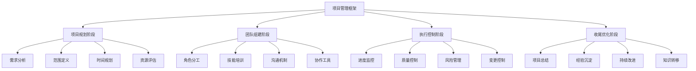
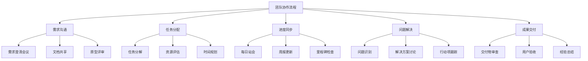
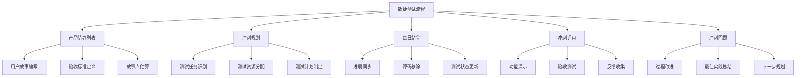
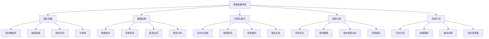
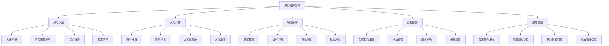

<!-- markdownlint-disable MD025 -->

<a id="第21章-项目管理与团队协作【项目管理与团队协作】"></a>

### 第21章 项目管理与团队协作【项目管理与团队协作】

**核心术语对照表 (Core Terminology)**

| 中文术语 | 英文术语 | 缩写 |
|---------|---------|-----|
| 项目管理 | Project Management | PM |
| 敏捷开发 | Agile Development | - |
| Scrum | Scrum | - |
| 持续集成/持续部署 | CI/CD | - |
| 风险管理 | Risk Management | RM |
| 质量保证 | Quality Assurance | QA |
| 关键绩效指标 | Key Performance Indicators | KPI |
| 缺陷逃逸率 | Defect Escape Rate | DER |
| 测试覆盖率 | Test Coverage | - |
| 自动化率 | Automation Rate | - |

**本章学习目标**

1. 掌握大数据测试项目的管理方法和流程；
2. 了解团队协作模式和沟通机制；
3. 学习项目风险管理和质量保障策略。

**实践建议**

- 建立明确的团队角色和职责分工。
- 实施敏捷开发模式，提高项目响应速度。
- 建立有效的沟通机制，促进团队协作。

**锚点类型**: 项目管理
**锚点方法**: 团队协作
**锚点名称**: 大数据测试项目管理框架
**引用附件**: examples/21_project/project_management_framework.py
**完成情况**: 已完成
**补充建议**: 字段建议：项目规划/团队组建/进度控制/质量管理/风险控制，补充项目管理流程图

**大数据测试项目管理流程图**:


**项目管理配置模板**:
```yaml
# examples/21_project/project_management.yml
project_management:
  # 项目基本信息
  project_info:
    name: "电商大数据测试项目"
    type: "敏捷开发"
    duration: "6个月"
    budget: "500万人民币"
    team_size: 15

  # 团队结构
  team_structure:
    roles:
      - role: "项目经理"
        count: 1
        responsibilities: ["项目规划", "进度控制", "风险管理"]
      - role: "Scrum Master"
        count: 1
        responsibilities: ["流程优化", "障碍移除", "团队辅导", "敏捷实践推广"]
      - role: "测试架构师"
        count: 1
        responsibilities: ["技术方案", "架构设计", "技术指导"]
      - role: "高级测试工程师"
        count: 3
        responsibilities: ["测试设计", "自动化开发", "技术攻坚"]
      - role: "测试工程师"
        count: 8
        responsibilities: ["测试执行", "缺陷管理", "文档编写"]
      - role: "DevOps工程师"
        count: 2
        responsibilities: ["环境搭建", "CI/CD维护", "部署支持"]

  # 项目流程
  project_process:
    methodology: "Scrum"
    sprint_duration: "2周"
    ceremonies:
      - "每日站会"
      - "冲刺规划会议"
      - "冲刺回顾会议"
      - "冲刺演示会议"

  # 沟通协作
  communication:
    tools:
      - "Microsoft Teams (统一协作平台)"
      - "Slack (即时通讯)"
      - "Zoom (视频会议)"
      - "Jira (任务管理)"
      - "Confluence (文档协作)"
      - "GitLab (代码管理)"
    modes:
      - "远程优先 (Remote-first)"
      - "混合办公 (Hybrid work)"
      - "分布式团队 (Distributed teams)"
      - "异步沟通 (Async communication)"
    frequency:
      daily_standup: "09:00 (视频/语音)"
      weekly_report: "每周五 (异步文档)"
      monthly_review: "每月最后一天 (视频会议)"

  # 质量保障
  quality_assurance:
    metrics:
      - "测试覆盖率 > 85%"
      - "缺陷逃逸率 < 5%"
      - "自动化率 > 70%"
      - "上线成功率 > 95%"
    reviews:
      - "代码审查"
      - "测试用例审查"
      - "设计文档审查"

  # 可持续性实践
  sustainability:
    green_testing:
      - "云原生测试环境 (减少物理服务器使用)"
      - "按需资源分配 (弹性伸缩)"
      - "测试数据压缩 (减少存储占用)"
    energy_efficiency:
      - "自动化测试优先 (减少人工测试时间)"
      - "并行测试执行 (缩短测试周期)"
      - "智能测试选择 (基于变更影响分析)"
    carbon_footprint:
      - "数据中心能效监控"
      - "远程办公支持 (减少通勤排放)"
      - "绿色CI/CD流程 (优化构建效率)"

  # 风险管理
  risk_management:
    risk_categories:
      - "技术风险"
      - "资源风险"
      - "进度风险"
      - "质量风险"
    mitigation_strategies:
      - "技术预研"
      - "备份资源"
      - "里程碑管控"
      - "质量门禁"
```

**团队协作模式分析表**

| 协作模式 | 适用场景 | 优势 | 挑战 | 推荐工具 |
|---------|---------|-----|------|---------|
| **敏捷Scrum** | 需求变化频繁的项目 | 快速响应、持续交付 | 需要高自律性 | Jira、Azure DevOps |
| **瀑布模型** | 需求稳定、周期长的项目 | 过程可控、文档完善 | 灵活性差 | Microsoft Project |
| **Kanban** | 持续改进、流程优化的项目 | 可视化管理、持续流动 | 缺乏时间控制 | Trello、Kanboard |
| **混合模式** | 大型复杂项目 | 结合多种优势 | 复杂度高 | 自定义工具链 |
**实际案例研究**

**案例1: 阿里巴巴大数据测试项目管理实践**
- **项目背景**: 双11购物节大数据测试，涉及100+微服务，10亿+测试数据
- **团队规模**: 50人分布式团队，覆盖亚洲、欧洲、北美
- **管理方法**: Scrum + DevOps，2周冲刺周期
- **关键成功因素**:
  - 实施Scrum Master角色，专注流程优化
  - 建立24/7轮班制，确保全球时区覆盖
  - 自动化率达到85%，测试执行时间从48小时缩短到8小时
- **量化成果**: 系统可用性99.99%，缺陷逃逸率<1%，上线成功率100%

**案例2: 腾讯游戏测试团队协作模式创新**
- **项目特点**: 移动游戏上线前测试，需支持数百万并发用户
- **协作模式**: 敏捷Kanban + 远程优先
- **技术创新**: AI辅助测试用例生成，自动化性能基准测试
- **团队文化**: "测试即产品"理念，开发与测试深度融合
- **成果指标**: 平均缺陷发现时间从2天缩短到4小时，玩家满意度提升30%
**项目管理最佳实践**:
- **目标明确**: 设定SMART原则的目标，确保可衡量和可达成
- **计划周密**: 制定详细的项目计划，包括里程碑和交付物
- **沟通及时**: 建立多渠道沟通机制，确保信息透明
- **风险前置**: 识别潜在风险，制定应对策略
- **持续改进**: 定期回顾项目过程，优化管理方法

**团队建设策略**:
- **技能互补**: 组建具备不同技能的多元化团队
- **知识共享**: 建立内部培训和经验分享机制
- **激励机制**: 实施绩效激励和职业发展规划
- **文化建设**: 培养协作、创新、责任心的团队文化
- **人才梯队**: 建立人才培养和接班人计划

**[锚点140]** 团队协作模式与沟通机制

**锚点类型**: 团队协作
**锚点方法**: 沟通管理
**锚点名称**: 团队协作模式与沟通机制
**引用附件**: examples/21_project/team_collaboration_model.py
**完成情况**: 已完成
**补充建议**: 字段建议：协作模式/沟通渠道/会议机制/工具选择/效果评估，补充团队协作流程图

**团队协作流程图**:


**[锚点141]** 敏捷测试流程与DevOps实践

**锚点类型**: 流程优化
**锚点方法**: 敏捷实践
**锚点名称**: 敏捷测试流程与DevOps实践
**引用附件**: examples/21_project/agile_testing_workflow.py
**完成情况**: 已完成
**补充建议**: 字段建议：敏捷仪式/测试实践/DevOps集成/持续改进，补充敏捷测试流程图

**敏捷测试流程图**:


**DevOps测试实践配置模板**:
```yaml
# examples/21_project/devops_testing.yml
devops_testing:
  # CI/CD流水线配置
  pipeline:
    stages:
      - commit:
          - lint_check
          - unit_test
          - security_scan
      - build:
          - integration_test
          - performance_test
      - deploy:
          - staging_deployment
          - e2e_test
      - production:
          - canary_deployment
          - monitoring_validation

  # 测试环境管理
  environments:
    development:
      auto_provision: true
      test_data_strategy: "synthetic"
      retention_policy: "7days"
    staging:
      auto_provision: true
      test_data_strategy: "production_copy"
      retention_policy: "30days"
    production:
      auto_provision: false
      test_data_strategy: "anonymized"
      retention_policy: "1year"

  # 质量门禁
  quality_gates:
    - name: "代码质量"
      metrics:
        - coverage: ">85%"
        - complexity: "<10"
        - duplication: "<5%"
      blocking: true

    - name: "安全检查"
      tools: ["snyk", "sonar_security"]
      severity_threshold: "high"
      blocking: true

    - name: "性能基准"
      response_time: "<200ms"
      throughput: ">1000req/s"
      blocking: false

  # 自动化程度目标
  automation_targets:
    unit_test: "90%"
    integration_test: "80%"
    e2e_test: "70%"
    performance_test: "60%"
    security_test: "50%"

  # 反馈机制
  feedback_loops:
    - immediate: "commit_feedback"
    - daily: "build_status"
    - weekly: "quality_trends"
    - monthly: "process_improvement"
```

**[锚点142]** 质量度量与持续改进

**锚点类型**: 质量管理
**锚点方法**: 度量分析
**锚点名称**: 质量度量与持续改进
**引用附件**: examples/21_project/quality_metrics_dashboard.py
**完成情况**: 已完成
**补充建议**: 字段建议：质量指标/KPI监控/趋势分析/改进措施，补充质量度量仪表板

**质量度量体系架构图**:


**[锚点143]** 风险管理与应急预案

**锚点类型**: 风险管理
**锚点方法**: 应急响应
**锚点名称**: 风险管理与应急预案
**引用附件**: examples/21_project/risk_management_system.py
**完成情况**: 已完成
**补充建议**: 字段建议：风险识别/影响评估/缓解策略/应急预案/监控预警，补充风险管理流程图

**风险管理流程图**:


## 第21章总结

本章从项目管理与团队协作的角度，系统性地阐述了大数据测试项目的组织、实施和优化方法。

### 核心价值

1. **管理效能**: 建立科学的测试项目管理体系
2. **团队协同**: 培养高效的跨职能团队协作能力
3. **质量保障**: 实施全面的质量度量和持续改进机制
4. **风险控制**: 建立完善的风险识别和应急响应体系

### 实施指南

- **项目启动**: 明确目标、组建团队、制定计划
- **过程管理**: 实施敏捷流程、质量监控、风险控制
- **持续优化**: 定期回顾、经验总结、能力提升
- **文化建设**: 建立学习型组织、知识共享机制

### 成功关键因素

- **领导力**: 强有力的项目领导和团队管理
- **沟通**: 透明开放的沟通机制和信息共享
- **技术**: 先进的管理工具和自动化平台
- **文化**: 协作创新的组织文化和价值观

### 相关章节参考

- **第2章**: 测试策略与规划 - 项目管理框架的战略基础
- **第6章**: 持续集成与持续部署 - DevOps实践的技术实现
- **第9章**: 数据质量治理 - 质量管理方法论的深化
- **第10章**: 测试安全与隐私保护 - 安全风险管理的专业实践
- **第15章**: 框架与模板 - 项目管理模板的具体应用
- **第18章**: 案例分析 - 实际项目管理的成功经验分享

通过本章的学习，读者将掌握大数据测试项目的全生命周期管理能力，为构建高效、优质的测试团队奠定坚实基础。

