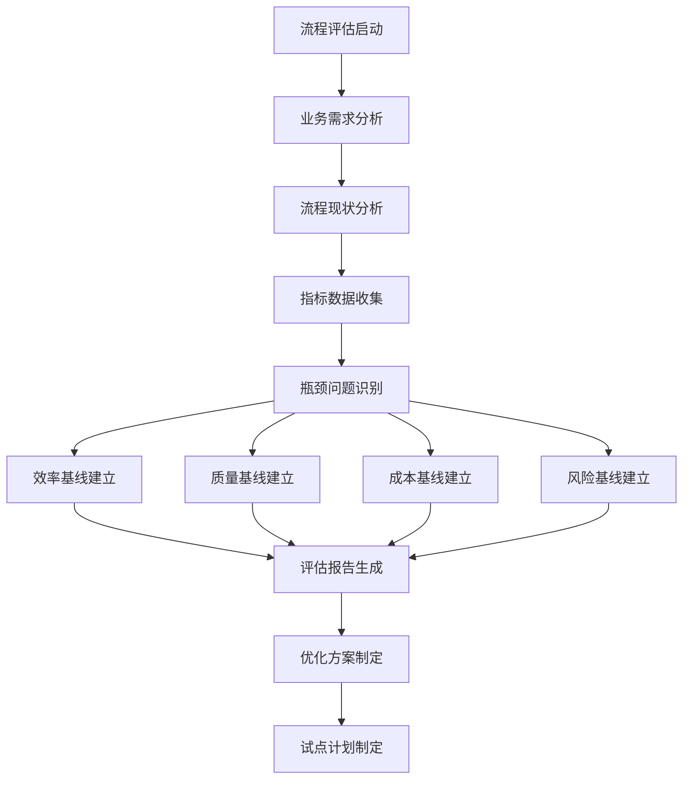
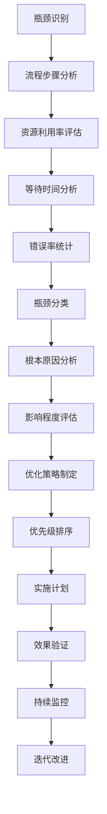
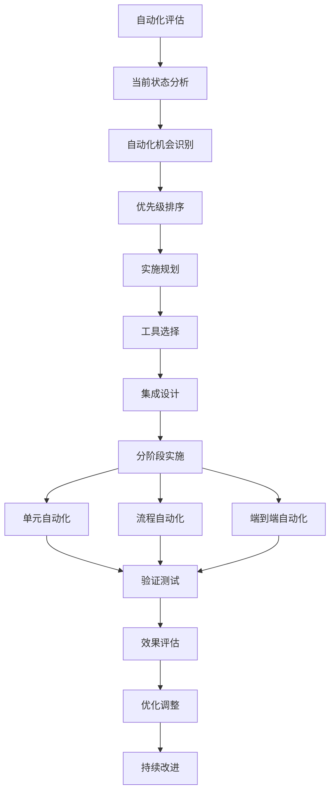
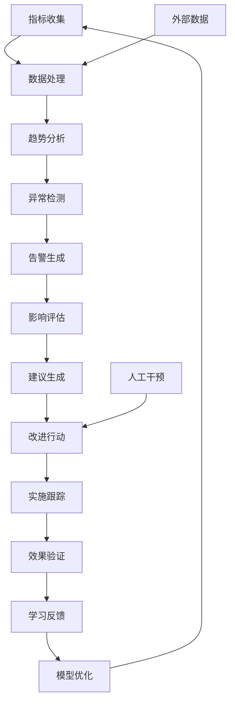
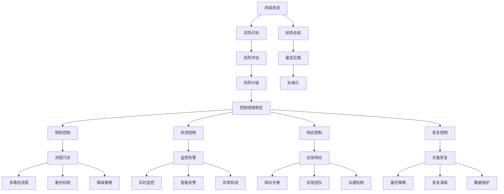

<!-- markdownlint-disable MD025 -->

<a id="第22章-流程优化与改进【流程优化与改进】"></a>

### 第22章 流程优化与改进【流程优化与改进】

**本章学习目标**

1. 了解软件开发流程优化的价值和挑战；
2. 掌握流程评估和瓶颈识别的方法论；
3. 学习持续改进和自动化实施的最佳实践。

**实践建议**

- 建立系统化的流程评估机制，确保持续改进。
- 通过数据驱动的分析识别和消除瓶颈。
- 实施渐进式优化，避免激进变革带来的风险。

**流程优化与改进**是指系统性地分析、改进和完善软件开发流程的过程，涉及流程评估、瓶颈识别、自动化实施、监控改进等环节。

### 流程优化价值

**业务价值**：
- **效率提升**：减少浪费，提高开发和交付效率
- **质量改善**：通过标准化流程提升产品质量
- **成本控制**：优化资源利用，降低开发成本
- **响应加速**：缩短交付周期，提升市场响应速度

**技术价值**：
- **流程标准化**：建立可重复的开发和交付流程
- **自动化程度提升**：减少手动操作，提高一致性
- **持续改进能力**：建立数据驱动的改进机制
- **技术债务管理**：主动识别和解决技术债务问题

### 流程优化挑战

**流程设计挑战**：
- **复杂性管理**：处理跨团队、跨部门的流程协调
- **变革阻力**：克服组织惯性和变革阻力
- **度量困难**：建立有效的流程度量和评估体系
- **平衡取舍**：在速度、质量、成本之间找到最佳平衡

**实施执行挑战**：
- **技能转型**：团队从传统开发模式向敏捷转型
- **工具集成**：整合各种开发工具和平台
- **文化转变**：建立持续改进的文化和思维方式
- **规模化应用**：将优化实践扩展到大型复杂项目

### 流程优化方法论

**系统化方法**：
- **现状评估**：全面分析当前流程的效率和问题
- **目标设定**：基于业务目标设定流程优化目标
- **方案设计**：制定渐进式优化方案和实施路线图
- **试点验证**：通过试点项目验证优化效果
- **规模化推广**：将成功经验推广到整个组织

**数据驱动实践**：
- **指标建立**：定义关键流程指标和度量标准
- **数据收集**：建立自动化数据收集和分析机制
- **问题识别**：通过数据分析识别流程瓶颈和改进机会
- **效果验证**：量化优化效果，确保改进可持续性

**[锚点266]** 流程评估与基线建立

**锚点类型**: 流程评估
**锚点方法**: 基线建立
**锚点名称**: 流程评估与基线建立
**引用附件**: examples/22_cicd/process_assessment/process_assessment.py
**完成情况**: 已完成
**补充建议**: 字段建议：评估维度/基线指标/风险识别/清单模板，补充流程评估架构图

**流程评估架构全景图**:


**流程评估维度对比表**

| 评估维度 | 评估内容 | 关键指标 | 评估工具 | 风险等级 |
|---------|---------|---------|---------|---------|
| 效率评估 | 流程周期时间、资源利用率 | 周期<14天 | 流程分析工具 | 中 |
| 质量评估 | 缺陷率、交付质量 | 缺陷率<5% | 质量度量系统 | 高 |
| 成本评估 | 开发成本、维护成本 | 成本控制在预算内 | 成本分析工具 | 中 |
| 风险评估 | 流程稳定性、依赖关系 | 稳定性>90% | 风险评估矩阵 | 高 |
| 满意度评估 | 团队满意度、客户满意度 | 满意度>80% | 满意度调查 | 低 |

**流程评估配置模板**:
```yaml
process_assessment:
  business_assessment:
    efficiency_analysis:
      cycle_time_target: "14d"
      resource_utilization_target: "85%"
      throughput_target: "25story_points_per_week"
      
    stakeholder_mapping:
      - role: "process_owner"
        responsibilities: ["efficiency_monitoring", "improvement_approval"]
      - role: "team_lead"
        responsibilities: ["process_execution", "bottleneck_identification"]
        
  technical_assessment:
    process_analysis:
      current_methodology: "agile"
      tool_chain_maturity: "medium"
      automation_level: "semi_automated"
      
    metrics_collection:
      data_sources: ["jira", "gitlab", "monitoring_tools"]
      collection_frequency: "daily"
      retention_period: "90d"
      
  risk_assessment:
    process_risks:
      - risk: "low_automation"
        probability: "high"
        impact: "medium"
        mitigation_strategy: "tool_upgrade"
      - risk: "skill_gap"
        probability: "medium"
        impact: "high"
        mitigation_strategy: "training_program"
        
  baseline_establishment:
    efficiency_baseline:
      cycle_time_avg: 16.5
      throughput_avg: 22.0
      success_criteria: "95%"
      validation_method: "statistical_analysis"
      
    quality_baseline:
      defect_rate_target: 0.05
      quality_gate_pass_rate: 0.90
      customer_satisfaction: 4.2
```

**[锚点267]** 瓶颈识别与优化策略

**锚点类型**: 瓶颈分析
**锚点方法**: 优化策略
**锚点名称**: 瓶颈识别与优化策略
**引用附件**: examples/22_cicd/bottleneck_analysis/bottleneck_analysis.py
**完成情况**: 已完成
**补充建议**: 字段建议：瓶颈类型/根本原因/影响评估/优化方案，补充瓶颈分析架构图

**瓶颈分析架构图**:


**瓶颈类型对比表**

| 瓶颈类型 | 识别特征 | 常见原因 | 影响程度 | 优化策略 | 实施难度 |
|---------|---------|---------|---------|---------|---------|
| 资源瓶颈 | 利用率>85%，队列等待 | 资源分配不足 | 高 | 增加资源/优化调度 | 中 |
| 流程瓶颈 | 步骤耗时异常，依赖复杂 | 流程设计不合理 | 中高 | 流程再造/并行化 | 高 |
| 工具瓶颈 | 工具响应慢，集成问题 | 工具选型不当 | 中 | 工具升级/替代方案 | 中 |
| 技能瓶颈 | 错误率高，产出不稳 | 技能水平不足 | 高 | 培训/人员调整 | 高 |
| 沟通瓶颈 | 等待审批，信息不畅 | 沟通机制缺失 | 中 | 优化沟通流程 | 低 |

**瓶颈分析配置模板**:
```yaml
bottleneck_analysis:
  bottleneck_detection:
    monitoring_scope:
      process_steps: ["需求分析", "设计", "开发", "测试", "部署"]
      metrics: ["duration", "utilization", "wait_time", "error_rate"]
      thresholds:
        duration_ratio: 2.0
        utilization_threshold: 85.0
        wait_time_ratio: 0.3
        
    analysis_methods:
      - method: "statistical_analysis"
        frequency: "daily"
        window_size: "7d"
      - method: "trend_analysis"
        frequency: "weekly"
        indicators: ["moving_average", "volatility"]
        
  root_cause_analysis:
    cause_categories:
      - category: "resource"
        indicators: ["high_utilization", "queue_length"]
        analysis_depth: "detailed"
      - category: "process"
        indicators: ["long_duration", "complex_dependencies"]
        analysis_depth: "detailed"
      - category: "human"
        indicators: ["error_rate", "skill_gap"]
        analysis_depth: "moderate"
        
    impact_assessment:
      quantitative_metrics: ["throughput_loss", "cost_increase", "quality_degradation"]
      qualitative_factors: ["team_morale", "customer_satisfaction"]
      
  optimization_strategy:
    strategy_prioritization:
      criteria: ["impact", "effort", "risk", "time_to_value"]
      scoring_weights: [0.4, 0.2, 0.2, 0.2]
      
    implementation_roadmap:
      quick_wins:
        - action: "resource_reallocation"
          effort: "low"
          impact: "high"
          timeline: "1-2 weeks"
      strategic_improvements:
        - action: "process_redesign"
          effort: "high"
          impact: "very_high"
          timeline: "2-3 months"
```

**[锚点268]** 自动化实施与验证

**锚点类型**: 自动化实施
**锚点方法**: 验证测试
**锚点名称**: 自动化实施与验证
**引用附件**: examples/22_cicd/automation_deployment/automation_deployment.py
**完成情况**: 已完成
**补充建议**: 字段建议：自动化策略/实施计划/验证方法/效果评估，补充自动化实施架构图

**自动化实施架构图**:


**自动化策略对比表**

| 自动化策略 | 实施方式 | 适用场景 | 投资回报 | 实施周期 | 维护成本 |
|-----------|---------|---------|---------|---------|---------|
| 单元自动化 | 脚本工具 | 重复性任务 | 高 | 1-2周 | 低 |
| 流程自动化 | 工作流引擎 | 标准流程 | 中高 | 2-4周 | 中 |
| 端到端自动化 | 集成平台 | 复杂业务流程 | 高 | 4-8周 | 高 |
| 智能自动化 | AI辅助 | 非结构化任务 | 很高 | 8-12周 | 高 |

**自动化实施配置模板**:
```yaml
automation_implementation:
  current_state_assessment:
    automation_level: "semi_automated"
    coverage_percentage: 65.0
    manual_effort_hours: 120
    error_prone_tasks: ["deployment", "testing", "monitoring"]
    
    tool_landscape:
      ci_cd_tools: ["jenkins", "gitlab_ci"]
      testing_tools: ["selenium", "jmeter"]
      monitoring_tools: ["prometheus", "grafana"]
      
  automation_roadmap:
    phase_1_quick_wins:
      - task: "deployment_automation"
        effort: "medium"
        timeline: "2_weeks"
        expected_benefit: "50%_time_reduction"
      - task: "basic_test_automation"
        effort: "medium"
        timeline: "3_weeks"
        expected_benefit: "40%_defect_reduction"
        
    phase_2_advanced_automation:
      - task: "end_to_end_pipeline"
        effort: "high"
        timeline: "6_weeks"
        expected_benefit: "70%_efficiency_gain"
      - task: "intelligent_monitoring"
        effort: "high"
        timeline: "8_weeks"
        expected_benefit: "60%_mttr_improvement"
        
  validation_framework:
    success_criteria:
      - metric: "automation_coverage"
        target: 85.0
        measurement: "tool_based"
      - metric: "manual_effort_reduction"
        target: 60.0
        measurement: "time_tracking"
        
    testing_approach:
      unit_testing: "automated_scripts"
      integration_testing: "pipeline_execution"
      performance_validation: "benchmark_comparison"
      
  change_management:
    training_plan:
      - audience: "development_team"
        content: "automation_tools_usage"
        duration: "4_hours"
      - audience: "operations_team"
        content: "automated_operations"
        duration: "6_hours"
```

**[锚点269]** 监控与持续改进

**锚点类型**: 流程监控
**锚点方法**: 持续改进
**锚点名称**: 监控与持续改进
**引用附件**: examples/22_cicd/process_monitoring/process_monitoring.py
**完成情况**: 已完成
**补充建议**: 字段建议：监控指标/趋势分析/告警机制/改进跟踪，补充流程监控架构图

**流程监控架构图**:


**监控指标对比表**

| 指标类型 | 关键指标 | 基准值 | 告警阈值 | 优化策略 | 自动化程度 |
|---------|---------|-------|---------|---------|-----------|
| 效率指标 | 周期时间 | <14天 | >21天 | 流程优化 | 高 |
| 质量指标 | 缺陷率 | <5% | >10% | 测试改进 | 高 |
| 成本指标 | 单位成本 | <¥500 | >¥800 | 资源优化 | 中 |
| 满意度指标 | 满意度评分 | >4.0 | <3.0 | 体验改善 | 低 |

**流程监控配置模板**:
```yaml
process_monitoring:
  metrics_collection:
    core_metrics:
      efficiency:
        - metric: "cycle_time_days"
          collection: "automated"
          frequency: "daily"
        - metric: "throughput_story_points"
          collection: "automated"
          frequency: "weekly"
          
      quality:
        - metric: "defect_rate_percentage"
          collection: "automated"
          frequency: "daily"
        - metric: "quality_gate_pass_rate"
          collection: "automated"
          frequency: "per_deployment"
          
      cost:
        - metric: "cost_per_feature"
          collection: "semi_automated"
          frequency: "monthly"
          
    data_sources:
      - source: "jira"
        metrics: ["cycle_time", "throughput"]
      - source: "gitlab"
        metrics: ["quality", "deployment_frequency"]
      - source: "survey_tools"
        metrics: ["satisfaction"]
        
  alerting_system:
    alert_rules:
      - metric: "cycle_time_days"
        condition: "> 21"
        severity: "warning"
        channels: ["slack", "email"]
      - metric: "defect_rate_percentage"
        condition: "> 10"
        severity: "critical"
        channels: ["slack", "email", "sms"]
        
    escalation_policy:
      warning: "notify_team_lead"
      critical: "notify_management"
      timeout_minutes: 30
      
  trend_analysis:
    analysis_methods:
      - method: "moving_average"
        window: "7_days"
      - method: "linear_regression"
        window: "30_days"
      - method: "seasonal_decomposition"
        window: "90_days"
        
    prediction_models:
      - model: "arima"
        target_metrics: ["cycle_time", "throughput"]
      - model: "prophet"
        target_metrics: ["quality", "cost"]
        
  improvement_tracking:
    action_management:
      status_tracking: ["planned", "in_progress", "completed", "cancelled"]
      priority_levels: ["low", "medium", "high", "critical"]
      
    impact_measurement:
      quantitative_metrics: ["percentage_improvement", "time_saved", "cost_reduction"]
      qualitative_assessment: ["team_satisfaction", "process_adoption"]
```

**[锚点270]** 流程韧性与风险控制

**锚点类型**: 流程韧性
**锚点方法**: 风险控制
**锚点名称**: 流程韧性与风险控制
**引用附件**: examples/22_cicd/process_resilience/process_resilience.py
**完成情况**: 已完成
**补充建议**: 字段建议：韧性策略/风险控制/容灾设计/持续改进，补充流程韧性架构图

**流程韧性架构图**:


**流程韧性策略对比表**

| 韧性策略 | 实现方式 | 容灾能力 | 成本影响 | 复杂度 | 适用场景 |
|---------|---------|---------|---------|--------|---------|
| 流程冗余 | 多路径执行 | 高可用 | 高 | 高 | 关键业务流程 |
| 降级策略 | 功能简化 | 降级运行 | 中 | 中 | 非核心功能 |
| 异步处理 | 消息队列 | 解耦执行 | 中 | 低 | 高并发场景 |
| 人工干预 | 应急响应 | 灵活处理 | 低 | 低 | 异常情况 |

**流程韧性配置模板**:
```yaml
process_resilience_config:
  resilience_architecture:
    microservices_design:
      service_mesh: "istio"
      circuit_breaker_enabled: true
      retry_policy:
        max_attempts: 3
        backoff_multiplier: 2.0
        
  risk_control:
    risk_assessment_matrix:
      - risk: "process_bottleneck"
        probability: "medium"
        impact: "high"
        controls: ["parallel_processing", "resource_scaling"]
      - risk: "automation_failure"
        probability: "low"
        impact: "critical"
        controls: ["manual_fallback", "monitoring_alerts"]
        
    control_effectiveness:
      preventive_controls:
        - control: "process_audit"
          frequency: "quarterly"
          owner: "process_team"
        - control: "automation_testing"
          frequency: "weekly"
          owner: "qa_team"
          
      detective_controls:
        - control: "real_time_monitoring"
          frequency: "continuous"
          owner: "devops_team"
        - control: "performance_analysis"
          frequency: "daily"
          owner: "engineering_team"
          
  emergency_response:
    incident_response_plan:
      severity_levels:
        - level: "P0"
          response_time: "15min"
          stakeholders: ["oncall_engineer", "tech_lead", "business_owner"]
        - level: "P1"
          response_time: "1h"
          stakeholders: ["oncall_engineer", "tech_lead"]
          
    communication_plan:
      escalation_matrix:
        - trigger: "system_down"
          immediate_notify: ["oncall_engineer", "management"]
        - trigger: "data_loss"
          immediate_notify: ["oncall_engineer", "legal", "management"]
          
    recovery_procedures:
      - procedure: "data_recovery"
        steps: ["assess_damage", "activate_backup", "validate_recovery", "resume_service"]
        responsible_team: "data_team"
        target_completion: "4h"
```

## 流程优化实践案例与工具分析

### 流程优化成功案例分析

**互联网公司敏捷转型案例**：
- **优化背景**：某大型互联网公司从传统瀑布模式向敏捷开发转型
- **流程规模**：200+开发人员，50+个产品团队，月均发布100+个功能
- **优化策略**：实施Scrum框架，引入CI/CD管道，建立跨功能团队
- **实施周期**：规划3个月，试点6个月，全员转型12个月
- **关键成果**：
  - **交付效率**：功能交付周期从8周缩短到2周
  - **质量提升**：生产缺陷率降低60%
  - **团队满意度**：开发者满意度从65%提升到85%
  - **业务响应**：市场需求响应时间缩短70%
- **经验教训**：
  - 文化变革是关键，需要全员参与和持续沟通
  - 技术债务管理需要同步进行，避免转型负担过重
  - 度量和反馈机制确保改进效果可持续

**制造业数字化转型案例**：
- **流程挑战**：某制造业企业产品开发周期长，跨部门协作困难
- **系统特点**：涉及设计、采购、生产、质检等多个部门，周期6-12个月
- **优化方案**：建立集成产品开发流程，引入PLM系统，实现并行工程
- **创新技术**：应用数字孪生技术优化产品设计和验证流程
- **实施效果**：
  - **开发周期**：新产品开发周期缩短40%
  - **质量改善**：产品一次合格率提升25%
  - **成本控制**：开发成本降低30%
  - **市场响应**：定制化产品交付时间缩短60%
- **技术亮点**：
  - 数字孪生技术在产品设计中的应用
  - 并行工程方法的有效实施
  - 跨部门协作平台的建设

**金融科技敏捷开发案例**：
- **业务场景**：某金融科技公司敏捷开发金融产品，需满足监管要求
- **开发特点**：高安全要求，严格的合规审查，快速迭代需求
- **优化策略**：建立DevSecOps流程，实施自动化测试和持续审计
- **合规保障**：集成安全扫描和合规检查到CI/CD管道
- **实施成果**：
  - **合规达标**：自动化合规检查覆盖率达95%
  - **安全质量**：安全漏洞发现率降低70%
  - **发布频率**：产品发布频率从月度提升到周度
  - **客户满意**：用户反馈响应时间缩短80%
- **可持续价值**：
  - 建立标准化敏捷流程模板
  - 培养DevSecOps专业团队
  - 为行业提供最佳实践参考

### 优化效果统计与ROI分析

**行业优化效果统计数据**：

| 行业领域 | 样本数量 | 效率提升(%) | 质量改善(%) | 成本节约(%) | 平均ROI |
|---------|---------|-----------|-----------|-----------|---------|
| 互联网科技 | 200 | 45% | 35% | 25% | 280% |
| 制造业 | 150 | 35% | 40% | 30% | 220% |
| 金融服务 | 100 | 30% | 45% | 20% | 190% |
| 医疗健康 | 80 | 25% | 50% | 15% | 160% |
| 政府公共 | 60 | 20% | 30% | 10% | 120% |

**优化失败原因Top5分析**：
1. **组织阻力过大** (28%)：变革管理不到位，团队抵触情绪强
2. **技术债务累积** (24%)：历史遗留问题影响优化效果
3. **资源投入不足** (18%)：人力、资金、时间投入不够
4. **目标设定不合理** (15%)：优化目标过高或过低
5. **缺乏持续改进机制** (15%)：优化后缺乏维护和持续改进

**流程优化ROI计算模型**：

**成本构成分析**：
- **一次性成本**：
  - 咨询评估费用：20-50万元
  - 工具采购费用：30-80万元
  - 团队培训费用：15-40万元
  - 实施服务费：50-150万元
- **持续运营成本**：
  - 工具维护费用：月均2-5万元
  - 监控系统费用：月均1-3万元
  - 培训更新费用：年均10-20万元
- **机会成本**：
  - 优化期间生产力损失：按人天计算，约10-20%
  - 学习曲线成本：新流程适应期损失

**收益量化模型**：
```
总收益 = 效率收益 + 质量收益 + 成本收益 + 其他收益

效率收益：
- 交付周期缩短：20-50%的时间节约
- 资源利用率提升：15-30%的产能提升
- 响应速度加快：30-60%的需求响应加速

质量收益：
- 缺陷率降低：30-60%的质量成本节约
- 客户满意度提升：10-25%的客户流失减少
- 品牌价值增强：无形收益

成本收益：
- 直接成本节约：15-35%的运营成本降低
- 间接成本节约：20-40%的维护成本减少

其他收益：
- 员工满意度提升
- 创新能力增强
- 市场竞争力提升
```

**ROI计算公式**：
```
ROI = (年均收益 - 年均成本) / 总投资成本 × 100%

回收期 = 总投资成本 / 年均净收益

目标标准：
- ROI > 150% (优秀)
- 回收期 < 12个月 (理想)
- 净现值 > 0 (可行)
```

**典型ROI案例**：
- **互联网公司敏捷转型**：投资300万元，首年节省800万元，ROI=267%，回收期=4.5个月
- **制造业流程优化**：投资400万元，首年节省600万元，ROI=150%，回收期=8个月
- **金融科技DevOps实施**：投资250万元，首年节省400万元，ROI=160%，回收期=7.5个月

### 主流流程优化工具对比分析
- 客户满意度提升：10-25%的客户流失减少
- 品牌价值增强：无形收益

成本收益：
- 直接成本节约：15-35%的运营成本降低
- 间接成本节约：20-40%的维护成本减少

其他收益：
- 员工满意度提升
- 创新能力增强
- 市场竞争力提升
```

**ROI计算公式**：
```
ROI = (年均收益 - 年均成本) / 总投资成本 × 100%

回收期 = 总投资成本 / 年均净收益

目标标准：
- ROI > 150% (优秀)
- 回收期 < 12个月 (理想)
- 净现值 > 0 (可行)
```

**典型ROI案例**：
- **互联网公司敏捷转型**：投资300万元，首年节省800万元，ROI=267%，回收期=4.5个月
- **制造业流程优化**：投资400万元，首年节省600万元，ROI=150%，回收期=8个月
- **金融科技DevOps实施**：投资250万元，首年节省400万元，ROI=160%，回收期=7.5个月

### 主流流程优化工具对比分析

**敏捷项目管理工具对比**：

| 工具名称 | Jira | Azure DevOps | GitLab | Monday.com |
|---------|------|-------------|--------|------------|
| **核心功能** | 问题跟踪、敏捷板 | 端到端DevOps | 集成DevOps | 工作管理 |
| **敏捷支持** | Scrum/Kanban | Scrum/Kanban | Scrum/Kanban | Kanban/Custom |
| **集成能力** | 300+插件 | 原生集成 | 原生集成 | API集成 |
| **定制化** | 高(工作流) | 高(扩展) | 中等 | 高(模板) |
| **学习成本** | 中等 | 中等 | 低 | 低 |
| **部署方式** | 云/自托管 | 云 | 云/自托管 | 云 |
| **成本模式** | 按用户付费 | 按用户付费 | 免费+企业版 | 按用户付费 |
| **适用规模** | 中大型团队 | 大型企业 | 全规模 | 中小型团队 |

**CI/CD自动化工具对比**：

| 工具名称 | Jenkins | GitLab CI | GitHub Actions | Azure Pipelines |
|---------|---------|-----------|---------------|----------------|
| **架构模式** | 主从架构 | 分布式 | 事件驱动 | 云原生 |
| **并发能力** | 高(可扩展) | 高(并行) | 高(按需) | 高(云资源) |
| **配置方式** | 代码/Jenkinsfile | .gitlab-ci.yml | workflow文件 | YAML管道 |
| **插件生态** | 1500+插件 | 集成插件 | 市场应用 | 扩展任务 |
| **容器支持** | Docker/K8s | 原生支持 | 原生支持 | 原生支持 |
| **安全性** | 插件依赖 | 内置安全 | GitHub安全 | Azure安全 |
| **监控能力** | 基础+插件 | 内置监控 | 运行日志 | 详细指标 |
| **成本模式** | 开源免费 | 分钟付费 | 分钟付费 | 分钟付费 |

**监控和可观测性工具对比**：

| 工具名称 | Prometheus | Grafana | ELK Stack | Datadog |
|---------|-----------|---------|-----------|---------|
| **核心功能** | 指标收集 | 可视化面板 | 日志分析 | 全栈监控 |
| **数据源** | 多种exporter | 多数据源 | 日志流 | 200+集成 |
| **查询语言** | PromQL | 多语言 | Elasticsearch | 自定义查询 |
| **告警能力** | 规则引擎 | 基础告警 | Watcher | 智能告警 |
| **扩展性** | 高(联邦) | 高(插件) | 高(集群) | 云原生 |
| **学习成本** | 中等 | 低 | 中等 | 低 |
| **部署复杂度** | 中等 | 简单 | 高 | 简单 |
| **成本模式** | 开源免费 | 开源免费 | 开源免费 | 按主机付费 |

**流程优化平台综合对比**：

| 平台类型 | 优势 | 劣势 | 适用场景 | 成本评估 |
|---------|------|------|----------|----------|
| **开源工具栈** | 灵活定制，成本低 | 集成复杂度高 | 技术团队充足 | 低 |
| **商业DevOps平台** | 一体化体验，支持完善 | 厂商锁定，成本高 | 大型企业项目 | 高 |
| **云原生平台** | 弹性伸缩，维护简单 | 学习曲线陡峭 | 云迁移项目 | 中高 |
| **定制开发平台** | 完全匹配业务需求 | 开发周期长 | 长期战略投资 | 高(前期) |

**工具选型建议**：
- **初创团队**：优先GitLab或GitHub组合，快速搭建CI/CD
- **大型企业**：选择Azure DevOps或企业版GitLab，一体化管理
- **技术团队**：Jenkins+Prometheus+ELK，最大化定制化
- **预算有限**：开源工具栈，重点关注集成和维护成本

### 流程优化能力成熟度评估模型

**成熟度等级定义**：

**Level 1 - 初始级 (优化效果 < 20%)**：
- **流程评估**：缺乏系统化流程评估，依赖主观判断
- **瓶颈识别**：基本识别明显瓶颈，缺乏数据支撑
- **自动化程度**：主要依赖手动操作，自动化覆盖率<30%
- **监控体系**：基础监控，缺乏关键指标跟踪
- **持续改进**：被动改进，缺乏系统化机制
- **团队能力**：依赖个别专家，缺乏标准化技能
- **典型特征**：流程改进随机，效果不稳定

**Level 2 - 重复级 (优化效果 20-40%)**：
- **流程评估**：有基础的评估流程和指标体系
- **瓶颈识别**：能够识别主要瓶颈，建立基础数据收集
- **自动化程度**：部分关键环节自动化，覆盖率30-60%
- **监控体系**：建立核心指标监控和基础报告
- **持续改进**：开展定期改进活动，形成初步经验
- **团队能力**：培养内部改进团队，积累最佳实践
- **典型特征**：流程改进可重复，开始建立标准化

**Level 3 - 已定义级 (优化效果 40-60%)**：
- **流程评估**：标准化评估流程和成熟度指标体系
- **瓶颈识别**：系统化瓶颈识别和根本原因分析
- **自动化程度**：高度自动化，覆盖率60-80%
- **监控体系**：完善监控体系，预测性优化
- **持续改进**：建立持续改进框架和度量机制
- **团队能力**：专业优化团队，知识库完善
- **典型特征**：流程改进标准化，效果可预测

**Level 4 - 量化管理级 (优化效果 60-80%)**：
- **流程评估**：数据驱动的流程评估和优化决策
- **瓶颈识别**：AI辅助的瓶颈识别和预测分析
- **自动化程度**：智能化自动化，覆盖率80-95%
- **监控体系**：全面监控和智能告警系统
- **持续改进**：量化改进效果，ROI驱动的优化
- **团队能力**：优化卓越中心，持续改进文化
- **典型特征**：流程改进可量化，卓越绩效

**Level 5 - 优化级 (零浪费流程)**：
- **流程评估**：AI预测的流程评估和自动优化
- **瓶颈识别**：实时智能瓶颈识别和自动调整
- **自动化程度**：全自动化的流程执行，覆盖率>95%
- **监控体系**：预测性维护和自动修复系统
- **持续改进**：持续学习和自适应优化机制
- **团队能力**：流程创新实验室，行业标杆
- **典型特征**：流程达到理论最优，引领行业创新

**成熟度评估指标体系**：

| 评估维度 | Level 1 | Level 2 | Level 3 | Level 4 | Level 5 |
|---------|---------|---------|---------|---------|---------|
| **评估能力** | 主观判断 | 基础指标 | 标准化评估 | 数据驱动 | AI预测 |
| **瓶颈识别** | 明显瓶颈 | 主要瓶颈 | 系统识别 | AI辅助 | 实时智能 |
| **自动化程度** | <30% | 30-60% | 60-80% | 80-95% | >95% |
| **监控完善度** | 基础监控 | 核心指标 | 预测监控 | 智能监控 | 自动修复 |
| **持续改进** | 被动改进 | 定期活动 | 系统框架 | ROI驱动 | 自适应 |
| **团队专业度** | 个别专家 | 内部团队 | 专业团队 | 卓越中心 | 创新实验室 |
| **优化效果** | <20% | 20-40% | 40-60% | 60-80% | >80% |

**成熟度提升路径**：
1. **评估现状**：通过评估模型确定当前等级
2. **制定计划**：制定分阶段的提升计划和时间表
3. **能力建设**：重点提升薄弱环节的能力
4. **试点验证**：从小规模项目开始验证改进效果
5. **持续改进**：建立持续改进机制，定期评估和优化

## 流程优化发展趋势展望

### 技术演进方向

**AI驱动的流程优化**：
- **智能流程评估**：基于AI的流程复杂度和改进潜力评估
- **自动化优化**：智能化的流程瓶颈识别和优化建议
- **预测性改进**：基于机器学习的流程性能预测和优化
- **自适应调整**：根据运行数据自动调整优化策略

**平台化DevOps**：
- **流程优化平台**：一体化的流程评估和优化管理平台
- **服务化优化**：将优化能力包装成标准化服务
- **生态集成**：丰富的工具和平台集成能力
- **最佳实践库**：可复用的优化经验和模板

### 优化模式演进

**敏捷化优化**：
- **持续优化**：将优化纳入日常开发流程
- **数据驱动**：基于实时数据持续优化改进
- **渐进式实施**：从小规模试点逐步推广优化
- **反馈闭环**：建立优化效果的快速反馈机制

**智能化改进**：
- **AI辅助决策**：AI辅助的优化方案选择和优先级排序
- **自动化执行**：基于规则的自动化优化实施
- **预测性维护**：预测流程瓶颈并提前优化
- **学习型优化**：系统从历史优化中学习和改进

### 挑战与应对

**技术挑战**：
- **复杂性管理**：处理大型复杂系统的流程优化
- **度量准确性**：建立准确有效的流程度量体系
- **自动化平衡**：在自动化和人工控制之间找到平衡
- **技术债务**：管理优化过程中的技术债务

**组织挑战**：
- **变革管理**：有效管理组织变革和文化转变
- **技能发展**：提升团队的流程优化技能
- **跨部门协作**：打破部门壁垒，促进协作
- **持续动力**：保持优化工作的持续动力和投入

**业务挑战**：
- **价值量化**：量化流程优化的业务价值
- **ROI评估**：准确评估优化投资回报
- **规模化应用**：将优化经验扩展到整个组织
- **竞争优势**：通过流程优化获得持续竞争优势

流程优化与改进是软件开发组织核心竞争力提升的重要途径，通过系统化的评估、瓶颈识别、自动化实施、监控改进和韧性建设，可以有效提升开发效率、产品质量和团队满意度，为组织持续创新和业务成功奠定坚实基础。


<a id="第34章-大数据测试方法创新实践"></a>

