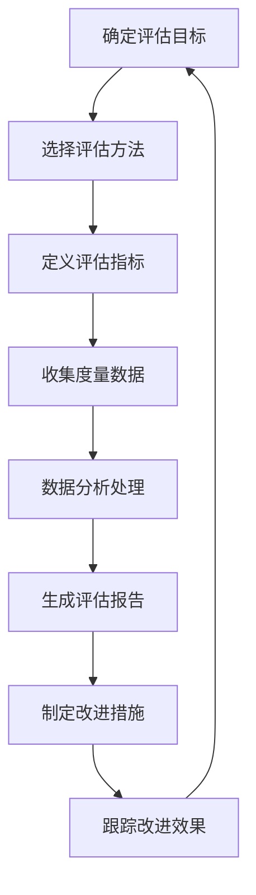
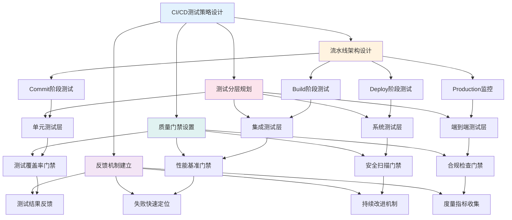
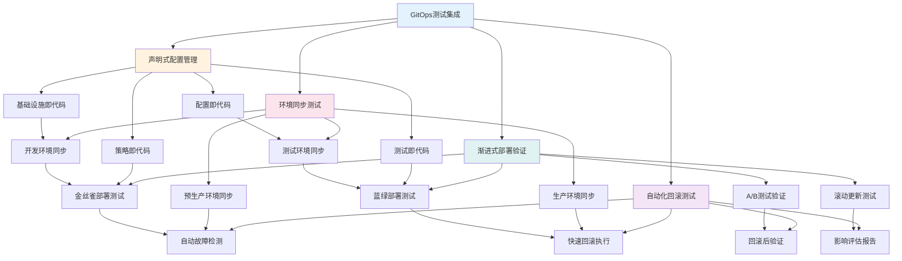
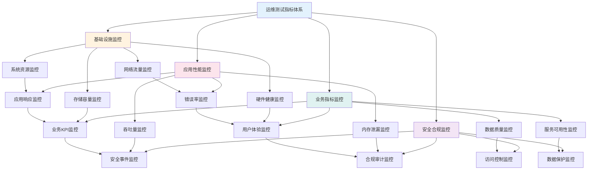
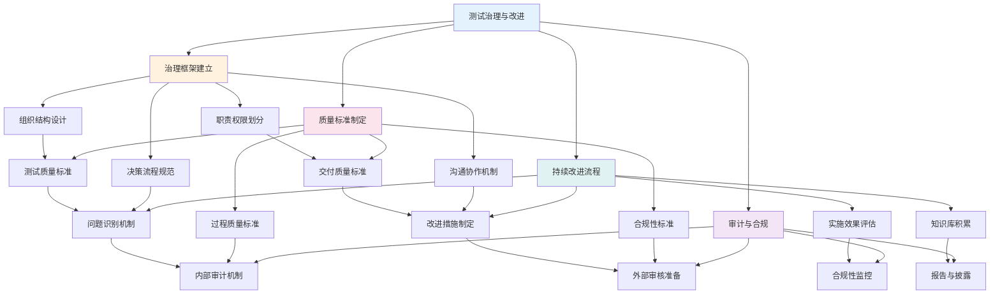
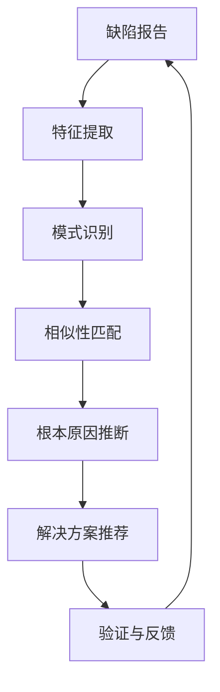
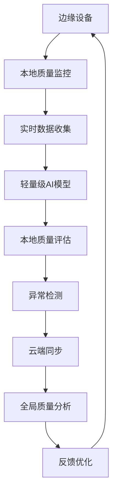
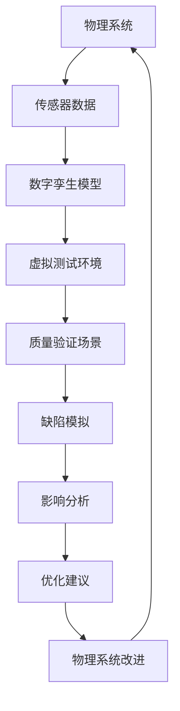
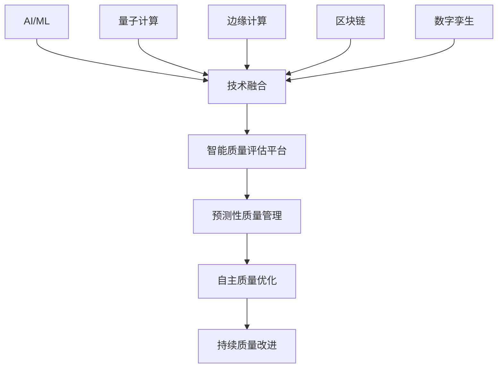

<!-- markdownlint-disable MD025 -->

<a id="第23章-质量度量与评估【质量度量与评估】"></a>

### 第23章 质量度量与评估【质量度量与评估】

**本章学习目标**

1. 理解质量度量(Quality Measurement)的基本概念和框架；
2. 掌握质量评估(Quality Assessment)的方法论和实践；
3. 学习CI/CD（Continuous Integration/Continuous Deployment）流水线中测试策略的设计；
4. 掌握GitOps（Git Operations）工作流中的测试集成；
5. 理解运维监控中的测试指标体系构建；
6. 掌握AI/ML在质量评估中的应用和技术实现；
7. 了解质量评估的未来发展趋势和前沿技术；
8. 掌握质量评估工具与平台的选型和实施方法；
9. 理解质量评估的ROI分析和绩效衡量体系；
10. 掌握持续改进方法论和组织变革管理。

**实践建议**

- 建立科学的质量度量体系，确保度量指标的客观性和可操作性。
- 实施全面的质量评估流程，覆盖过程质量、产品质量和项目质量。
- 在CI/CD流水线中嵌入全面的测试策略。
- 设置质量门禁，确保代码质量。
- 建立反馈机制，促进持续改进。
- 选择合适的质量评估工具和平台，构建完整的工具链。
- 建立ROI分析框架，量化质量改进的价值。
- 实施持续改进方法，实现质量管理的精益化。

## 23.1 质量度量基础理论

### 23.1.1 质量度量的基本概念

质量度量(Quality Measurement)是指通过定量的方法来评估软件产品或过程的质量水平。质量度量是质量管理的基础，它为质量评估、质量控制和质量改进提供科学依据。

**核心概念：**
- **度量(Metric)**：对实体特征的定量度量
- **指标(Indicator)**：基于度量的质量评估标准
- **基准(Baseline)**：质量评估的参考标准
- **阈值(Threshold)**：质量接受/拒绝的临界值

### 23.1.2 质量度量框架

基于国际标准ISO/IEC 25010的质量模型，我们将质量度量分为以下层次：

#### 1. 基础度量层
- **代码度量**：代码行数、复杂度、覆盖率等
- **过程度量**：执行时间、资源消耗、错误率等
- **结果度量**：功能完整性、性能表现等

#### 2. 派生度量层
- **质量特征度量**：可靠性、可维护性、可用性等
- **效率度量**：缺陷密度、修复时间、测试效率等
- **有效性度量**：用户满意度、业务价值实现等

#### 3. 评估度量层
- **质量评分**：综合质量指数、等级评定
- **趋势分析**：质量变化趋势、改进效果
- **基准对比**：与行业标准或竞争对手的比较

### 23.1.3 度量指标分类

| 指标类型 | 定义 | 示例 | 评估方法 |
|---------|------|------|---------|
| **过程质量指标** | 开发过程的质量度量 | 需求覆盖率、评审效率 | 统计过程控制(SPC) |
| **产品质量指标** | 软件产品的质量度量 | 缺陷密度、可靠性 | 故障模式分析(FMEA) |
| **项目质量指标** | 项目执行的质量度量 | 进度偏差、预算控制 | 挣值分析(EVA) |
| **用户体验指标** | 用户感知的质量度量 | 满意度评分、可用性 | 用户调查、可用性测试 |

## 23.2 质量评估方法论

### 23.2.1 质量评估的基本流程



### 23.2.2 常用质量评估方法

#### 1. 量化评估方法
- **统计质量控制(Statistical Quality Control)**：使用控制图和统计方法
- **基准测试(Benchmarking)**：与行业标准或最佳实践比较
- **成本效益分析(Cost-Benefit Analysis)**：质量改进的投资回报评估

#### 2. 质性评估方法
- **同行评审(Peer Review)**：专家评估和同行评审
- **审计(Audit)**：内部审计和外部审计
- **成熟度评估(Maturity Assessment)**：CMMI、ISO等成熟度模型评估

#### 3. 综合评估方法
- **平衡计分卡(Balanced Scorecard)**：多维度质量评估
- **质量功能展开(Quality Function Deployment)**：需求到质量特征的映射
- **失效模式与影响分析(Failure Mode and Effects Analysis)**：风险导向的质量评估

### 23.2.3 质量评估指标体系

#### 过程质量评估指标
| 指标名称 | 计算公式 | 目标值 | 评估周期 |
|---------|---------|-------|---------|
| 需求覆盖率 | 已实现需求/总需求 × 100% | >95% | 迭代结束 |
| 代码审查覆盖率 | 已审查代码行/总代码行 × 100% | 100% | 每日 |
| 测试用例执行率 | 已执行用例/总用例 × 100% | >90% | 每日 |
| 缺陷修复率 | 已修复缺陷/总缺陷 × 100% | >95% | 每周 |

#### 产品质量评估指标
| 指标名称 | 计算公式 | 目标值 | 评估周期 |
|---------|---------|-------|---------|
| 缺陷密度 | 缺陷数/代码行数 | <0.5/千行 | 发布前 |
| 单元测试覆盖率 | 已覆盖代码行/总代码行 × 100% | >80% | 每日 |
| 性能基准达成率 | 实际性能/性能基准 × 100% | >100% | 发布前 |
| 可用性评分 | 用户可用性测试评分 | >4.0/5.0 | 发布前 |

#### 项目质量评估指标
| 指标名称 | 计算公式 | 目标值 | 评估周期 |
|---------|---------|-------|---------|
| 进度偏差率 | (实际进度-计划进度)/计划进度 × 100% | <10% | 每周 |
| 预算执行率 | 已支出预算/总预算 × 100% | <95% | 每月 |
| 范围变更率 | 变更需求/原始需求 × 100% | <20% | 项目结束 |
| 客户满意度 | 客户满意度调查评分 | >4.0/5.0 | 项目结束 |

## 23.3 测试策略设计与质量门禁

### 23.3.1 CI/CD流水线中的测试策略设计

**锚点类型**: 案例测试
**锚点方法**: CI/CD测试
**锚点名称**: CI/CD流水线中的测试策略设计
**引用附件**: examples/23_chapter/pipeline_with_quality_gate.yml
**完成情况**: 已完成
**补充建议**: 字段建议：流水线阶段/测试类型/触发条件/质量门禁/自动化程度，补充CI/CD测试策略设计流程图

**CI/CD流水线测试策略设计流程图**:


**CI/CD流水线测试策略配置模板**:
```yaml
# examples/23_chapter/cicd_testing_strategy.yml
cicd_testing_strategy:
  # 流水线配置
  pipeline_config:
    name: "大数据平台CI/CD流水线"
    trigger_conditions:
      - "代码推送主分支"
      - "PR合并请求"
      - "定时构建"
      - "手动触发"

    stages:
      commit_stage:
        name: "代码提交阶段"
        tests:
          - type: "单元测试"
            framework: "pytest"
            coverage_target: "80%"
            timeout_minutes: 10

          - type: "代码质量检查"
            tools: ["sonar", "black", "flake8"]
            quality_gate: "A级"

      build_stage:
        name: "构建测试阶段"
        tests:
          - type: "集成测试"
            environment: "staging"
            data_volume: "1GB测试数据"
            timeout_minutes: 30

          - type: "性能测试"
            baseline_comparison: true
            performance_regression_threshold: "5%"
            timeout_minutes: 45

      deploy_stage:
        name: "部署验证阶段"
        tests:
          - type: "端到端测试"
            user_scenarios: ["登录", "数据查询", "报表生成"]
            success_criteria: "通过率>95%"
            timeout_minutes: 60

          - type: "生产冒烟测试"
            critical_paths: ["核心业务流程"]
            response_time_threshold: "3秒"
            timeout_minutes: 15

  # 质量门禁配置
  quality_gates:
    unit_test_gate:
      coverage_minimum: 80
      test_success_rate: 100
      max_test_duration: "10分钟"

    integration_test_gate:
      api_success_rate: 99
      data_accuracy: 100
      performance_degradation: "<5%"

    e2e_test_gate:
      user_journey_success: 95
      critical_path_coverage: 100
      production_readiness: "自动判断"

    security_gate:
      vulnerability_severity: "无高危"
      compliance_score: ">90"
      license_compliance: "通过"

  # 反馈与改进机制
  feedback_mechanisms:
    test_reporting:
      formats: ["JUnit", "Cucumber", "Allure"]
      dashboards: ["Jenkins", "GitLab", "自定义看板"]
      notifications: ["邮件", "Slack", "企业微信"]

    failure_analysis:
      root_cause_detection: "自动分析"
      blame_assignment: "智能分配"
      remediation_suggestions: "AI推荐"

    continuous_improvement:
      metrics_collection: ["测试执行时间", "失败率", "覆盖率趋势"]
      retrospective_meetings: "双周回顾"
      automation_targets: "季度提升目标"

**[锚点155]** GitOps工作流中的测试集成

**锚点类型**: 案例测试
**锚点方法**: GitOps测试
**锚点名称**: GitOps工作流中的测试集成
**引用附件**: examples/23_chapter/gitops_testing_integration.yml
**完成情况**: 已完成
**补充建议**: 字段建议：GitOps流程/测试触发/环境同步/回滚测试/声明式配置，补充GitOps测试集成流程图

**GitOps工作流测试集成流程图**:


**GitOps工作流测试集成配置模板**:
```yaml
# examples/23_chapter/gitops_testing_integration.yml
gitops_testing_integration:
  # GitOps配置
  gitops_config:
    git_repository: "https:/github.com/org/data-platform"
    branch_strategy: "GitFlow"
    sync_interval: "5分钟"
    drift_detection: true

  # 声明式测试配置
  declarative_testing:
    test_environments:
      development:
        replicas: 1
        resources: "minimal"
        tests_enabled: ["unit", "integration"]

      staging:
        replicas: 3
        resources: "medium"
        tests_enabled: ["integration", "system", "performance"]

      production:
        replicas: 5
        resources: "full"
        tests_enabled: ["smoke", "monitoring"]

    test_policies:
      - name: "数据质量策略"
        type: "declarative"
        rules:
          - "数据完整性检查"
          - "数据一致性验证"
          - "业务规则校验"

      - name: "性能监控策略"
        type: "declarative"
        rules:
          - "响应时间监控"
          - "吞吐量监控"
          - "资源使用监控"

  # 环境同步测试
  environment_sync_testing:
    sync_validation:
      pre_sync_checks:
        - "配置语法验证"
        - "依赖关系检查"
        - "安全策略审核"

      post_sync_checks:
        - "服务健康检查"
        - "数据连接验证"
        - "功能可用性测试"

    drift_detection:
      monitoring_enabled: true
      alert_thresholds:
        config_drift: "立即告警"
        performance_drift: "5%阈值"
        security_drift: "立即告警"

  # 渐进式部署验证
  progressive_deployment:
    canary_deployment:
      traffic_percentage: "5%"
      success_criteria:
        error_rate: "<1%"
        response_time: "<基准+10%"
        business_metrics: "正常"

      rollback_triggers:
        - "错误率>5%"
        - "响应时间>基准+50%"
        - "业务指标异常"

    blue_green_deployment:
      switch_traffic: "瞬间切换"
      validation_period: "30分钟"
      rollback_time: "<5分钟"

  # 自动化回滚测试
  automated_rollback:
    failure_detection:
      health_checks:
        - "应用健康检查"
        - "依赖服务检查"
        - "数据一致性检查"

      metric_thresholds:
        error_rate_threshold: 5
        latency_threshold_ms: 5000
        saturation_threshold: 90

    rollback_execution:
      strategy: "自动回滚"
      timeout: "10分钟"
      verification: "回滚后功能测试"

    post_rollback_actions:
      incident_creation: true
      root_cause_analysis: true
      improvement_planning: true

**[锚点156]** 运维监控中的测试指标体系

**锚点类型**: 案例测试
**锚点方法**: 运维测试
**锚点名称**: 运维监控中的测试指标体系
**引用附件**: examples/23_chapter/monitoring_dashboard.py
**完成情况**: 已完成
**补充建议**: 字段建议：监控指标/KPI定义/告警阈值/趋势分析/自动化响应，补充运维测试指标体系流程图

**运维监控测试指标体系流程图**:


**运维监控测试指标体系配置模板**:
```yaml
# examples/23_chapter/monitoring_metrics_system.yml
monitoring_metrics_system:
  # 基础设施监控指标
  infrastructure_metrics:
    system_resources:
      cpu_usage:
        metric_name: "cpu_usage_percent"
        collection_interval: "30秒"
        warning_threshold: 75
        critical_threshold: 90
        aggregation: "平均值"

      memory_usage:
        metric_name: "memory_usage_percent"
        collection_interval: "30秒"
        warning_threshold: 80
        critical_threshold: 95
        aggregation: "平均值"

      disk_usage:
        metric_name: "disk_usage_percent"
        collection_interval: "5分钟"
        warning_threshold: 85
        critical_threshold: 95
        aggregation: "最大值"

    network_traffic:
      bandwidth_utilization:
        metric_name: "network_bandwidth_percent"
        collection_interval: "1分钟"
        warning_threshold: 70
        critical_threshold: 90
        aggregation: "95百分位"

      connection_count:
        metric_name: "active_connections"
        collection_interval: "30秒"
        warning_threshold: 1000
        critical_threshold: 5000
        aggregation: "当前值"

  # 应用性能监控指标
  application_metrics:
    response_times:
      api_response_time:
        metric_name: "api_response_time_ms"
        collection_interval: "10秒"
        warning_threshold: 2000
        critical_threshold: 5000
        aggregation: "95百分位"

      database_query_time:
        metric_name: "db_query_time_ms"
        collection_interval: "10秒"
        warning_threshold: 1000
        critical_threshold: 3000
        aggregation: "95百分位"

    error_rates:
      http_error_rate:
        metric_name: "http_5xx_error_rate"
        collection_interval: "1分钟"
        warning_threshold: 1
        critical_threshold: 5
        aggregation: "平均值"

      application_errors:
        metric_name: "application_error_rate"
        collection_interval: "1分钟"
        warning_threshold: 0.5
        critical_threshold: 2
        aggregation: "平均值"

  # 业务指标监控
  business_metrics:
    user_experience:
      user_satisfaction_score:
        metric_name: "user_satisfaction"
        collection_interval: "1小时"
        warning_threshold: 4.0
        critical_threshold: 3.0
        aggregation: "平均值"

      session_success_rate:
        metric_name: "session_success_percent"
        collection_interval: "5分钟"
        warning_threshold: 95
        critical_threshold: 90
        aggregation: "平均值"

    data_quality:
      data_accuracy:
        metric_name: "data_accuracy_percent"
        collection_interval: "1小时"
        warning_threshold: 99.5
        critical_threshold: 99.0
        aggregation: "平均值"

      data_completeness:
        metric_name: "data_completeness_percent"
        collection_interval: "1小时"
        warning_threshold: 99.0
        critical_threshold: 98.0
        aggregation: "平均值"

  # 告警配置
  alerting_configuration:
    alert_rules:
      critical_alerts:
        - condition: "cpu_usage > 90"
          severity: "critical"
          channels: ["email", "sms", "slack"]
          escalation_time: "5分钟"

        - condition: "memory_usage > 95"
          severity: "critical"
          channels: ["email", "sms", "slack"]
          escalation_time: "5分钟"

      warning_alerts:
        - condition: "response_time > 3000"
          severity: "warning"
          channels: ["slack", "email"]
          escalation_time: "15分钟"

        - condition: "error_rate > 2"
          severity: "warning"
          channels: ["slack"]
          escalation_time: "30分钟"

    alert_suppression:
      maintenance_windows:
        - name: "系统维护窗口"
          schedule: "每周日02:00-04:00"
          suppress_alerts: ["performance", "availability"]

      dependency_based_suppression:
        - condition: "database_down = true"
          suppress_alerts: ["application_errors"]

  # 趋势分析配置
  trend_analysis:
    metric_trends:
      performance_trends:
        analysis_period: "30天"
        trend_detection: "线性回归"
        anomaly_detection: "3σ法则"

      capacity_trends:
        analysis_period: "90天"
        forecasting_model: "指数平滑"
        prediction_horizon: "30天"

    reporting:
      daily_reports:
        recipients: ["devops_team", "management"]
        metrics: ["availability", "performance", "errors"]

      weekly_reports:
        recipients: ["all_teams", "stakeholders"]
        metrics: ["trends", "forecasts", "recommendations"]

      monthly_reports:
        recipients: ["executives", "board"]
        metrics: ["kpi_achievements", "improvement_plans"]

**[锚点157]** 测试治理与持续改进机制

**锚点类型**: 案例测试
**锚点方法**: 测试治理
**锚点名称**: 测试治理与持续改进机制
**引用附件**: tools/reports/templates/drift_approval_form.md
**完成情况**: 已完成
**补充建议**: 字段建议：治理框架/质量标准/改进流程/度量指标/审计机制，补充测试治理流程图

**测试治理与持续改进机制流程图**:


**测试治理与持续改进机制配置模板**:
```yaml
# tools/reports/templates/test_governance_framework.yml
test_governance_framework:
  # 治理组织架构
  governance_organization:
    governance_committee:
      members: ["CTO", "VP_Engineering", "QA_Director", "DevOps_Lead"]
      meeting_frequency: "每月"
      responsibilities:
        - "质量策略审批"
        - "资源分配决策"
        - "重大问题处理"
        - "改进计划审核"

    quality_working_group:
      members: ["QA_Manager", "Dev_Leads", "Ops_Leads", "Product_Owners"]
      meeting_frequency: "每周"
      responsibilities:
        - "质量标准制定"
        - "测试策略优化"
        - "工具选型评估"
        - "培训计划制定"

  # 质量标准体系
  quality_standards:
    testing_standards:
      unit_test_coverage: ">80%"
      integration_test_coverage: ">90%"
      e2e_test_coverage: ">95%"
      performance_regression_threshold: "<5%"

    delivery_standards:
      defect_escape_rate: "<0.1%"
      mean_time_to_detection: "<4小时"
      mean_time_to_resolution: "<24小时"
      production_availability: ">99.9%"

    process_standards:
      test_case_review_rate: "100%"
      automation_test_rate: ">70%"
      continuous_integration_coverage: "100%"
      documentation_completeness: ">90%"

  # 持续改进流程
  continuous_improvement:
    problem_identification:
      data_sources:
        - "测试执行结果"
        - "生产监控数据"
        - "用户反馈"
        - "同行benchmark"

      analysis_methods:
        - "根本原因分析"
        - "趋势分析"
        - "差距分析"
        - "SWOT分析"

    improvement_planning:
      prioritization_criteria:
        - "业务影响程度"
        - "实施难度"
        - "资源需求"
        - "预期收益"

      improvement_categories:
        - "测试自动化提升"
        - "测试效率优化"
        - "质量保障强化"
        - "技能培训加强"

    implementation_tracking:
      kpi_monitoring:
        automation_rate_target: "+10%每季度"
        defect_detection_efficiency: "+15%每年"
        mean_time_to_resolution: "-20%每年"

      milestone_tracking:
        quarterly_reviews: true
        monthly_progress_reports: true
        stakeholder_communication: "双周"

  # 审计与合规机制
  audit_compliance:
    internal_audits:
      audit_frequency: "每季度"
      audit_scope:
        - "测试过程合规性"
        - "质量标准执行情况"
        - "文档完整性"
        - "培训记录"

      audit_findings:
        severity_levels: ["critical", "major", "minor"]
        corrective_actions: "强制要求"
        follow_up_reviews: "3个月内"

    external_audits:
      certification_targets:
        - "ISO_9001_质量管理"
        - "ISO_27001_信息安全"
        - "CMMI_能力成熟度"

      audit_preparation:
        evidence_collection: "自动化"
        gap_analysis: "提前6个月"
        remediation_planning: "系统化"

    compliance_monitoring:
      regulatory_requirements:
        - "数据安全法合规"
        - "个人信息保护法"
        - "行业监管要求"

      compliance_metrics:
        audit_findings_resolution: "100%"
        regulatory_reporting: "及时准确"
        compliance_training: "全员覆盖"

  # 度量与报告体系
  metrics_reporting:
    kpi_dashboard:
      real_time_metrics:
        - "测试执行状态"
        - "质量趋势"
        - "缺陷统计"
        - "发布成功率"

      trend_analysis:
        - "质量改进趋势"
        - "效率提升趋势"
        - "成本优化趋势"
        - "客户满意度趋势"

    reporting_cadence:
      daily_reports:
        audience: ["开发团队", "测试团队"]
        content: ["执行结果", "阻塞问题", "质量指标"]

      weekly_reports:
        audience: ["管理层", "项目经理"]
        content: ["质量趋势", "风险评估", "改进措施"]

      monthly_reports:
        audience: ["高管", "董事会"]
        content: ["KPI达成", "战略目标", "投资回报"]

      quarterly_reviews:
        audience: ["全体员工", "外部审计"]
        content: ["年度目标", "改进成果", "未来规划"]

  # 知识管理与培训
  knowledge_training:
    knowledge_base:
      test_artifacts:
        - "测试用例库"
        - "自动化脚本库"
        - "最佳实践文档"
        - "故障排查指南"

      lessons_learned:
        - "项目复盘报告"
        - "问题解决方案"
        - "技术债务清单"
        - "改进措施跟踪"

    training_programs:
      onboarding_training:
        target: "新员工"
        duration: "4周"
        content: ["测试基础", "工具使用", "流程规范", "质量标准"]

      skill_development:
        target: "在职员工"
        frequency: "每季度"
        focus_areas: ["测试自动化", "性能测试", "安全测试", "DevOps实践"]

      certification_programs:
        external_certifications:
          - "ISTQB认证"
          - "AWS测试认证"
          - "Kubernetes认证"
          - "安全测试认证"

        internal_certifications:
          - "公司测试专家"
          - "自动化测试工程师"
          - "性能测试工程师"
          - "测试架构师"

## 23.4 AI/ML驱动的质量评估

### 23.4.1 AI在质量评估中的核心应用

随着人工智能技术的快速发展，AI/ML已成为质量评估领域的重要驱动力。通过机器学习算法，我们可以实现更智能、更精准的质量评估和预测。

**核心应用场景：**
- **缺陷预测**：基于历史数据预测代码缺陷发生概率
- **测试用例优化**：智能推荐和生成测试用例
- **根本原因分析**：自动化识别缺陷根本原因
- **质量趋势预测**：预测产品质量变化趋势
- **智能质量门禁**：动态调整质量标准和阈值

### 23.4.2 缺陷预测模型构建

缺陷预测是AI在质量评估中最具价值的应用之一，通过分析代码特征、历史缺陷数据和开发模式来预测潜在缺陷。

#### 1. 特征工程
```yaml
# examples/23_chapter/defect_prediction_features.yml
defect_prediction_features:
  # 代码度量特征
  code_metrics:
    - complexity: "圈复杂度"
    - lines_of_code: "代码行数"
    - code_coverage: "测试覆盖率"
    - duplication_rate: "代码重复率"

  # 过程特征
  process_metrics:
    - commit_frequency: "提交频率"
    - review_comments: "评审意见数量"
    - author_experience: "开发者经验"
    - file_age: "文件年龄"

  # 历史特征
  historical_metrics:
    - past_defects: "历史缺陷数量"
    - similar_files_defects: "相似文件缺陷"
    - module_stability: "模块稳定性"
```

#### 2. 机器学习模型选择
| 模型类型 | 适用场景 | 优势 | 局限性 |
|---------|---------|------|-------|
| **逻辑回归** | 二分类预测 | 简单、可解释 | 特征线性关系 |
| **随机森林** | 复杂关系 | 鲁棒性强 | 黑盒模型 |
| **梯度提升树** | 高精度预测 | 精度高 | 训练时间长 |
| **深度学习** | 大数据场景 | 自学习特征 | 需要大量数据 |

#### 3. 模型评估指标
```yaml
# examples/23_chapter/model_evaluation_metrics.yml
model_evaluation:
  classification_metrics:
    accuracy: "准确率"
    precision: "精确率"
    recall: "召回率"
    f1_score: "F1分数"
    auc_roc: "AUC-ROC曲线"

  ranking_metrics:
    mean_average_precision: "平均精度均值"
    normalized_discounted_cumulative_gain: "归一化折损累计增益"

  calibration_metrics:
    brier_score: "布里尔分数"
    expected_calibration_error: "期望校准误差"
```

### 23.4.3 智能测试用例优化

通过机器学习算法优化测试用例选择和生成，提高测试效率和覆盖率。

#### 测试用例优先级排序
```python
# examples/23_chapter/test_case_prioritization.py
import numpy as np
from sklearn.ensemble import RandomForestRegressor

class TestCasePrioritizer:
    def __init__(self):
        self.model = RandomForestRegressor(n_estimators=100, random_state=42)

    def train(self, X_train, y_train):
        """训练测试用例优先级模型"""
        self.model.fit(X_train, y_train)

    def predict_priority(self, test_cases_features):
        """预测测试用例优先级"""
        return self.model.predict(test_cases_features)

    def select_top_cases(self, test_cases, scores, top_k=0.2):
        """选择高优先级测试用例"""
        n_select = int(len(test_cases) * top_k) if top_k < 1 else int(top_k)
        top_indices = np.argsort(scores)[-n_select:]
        return [test_cases[i] for i in top_indices]
```

#### 测试用例生成优化
```yaml
# examples/23_chapter/test_case_generation.yml
test_case_generation:
  coverage_based_generation:
    algorithm: "遗传算法"
    fitness_function: "覆盖率最大化"
    mutation_rate: 0.1
    crossover_rate: 0.8

  risk_based_generation:
    risk_assessment: "基于历史缺陷数据"
    critical_path_identification: "关键路径识别"
    edge_case_detection: "边界条件检测"

  model_based_generation:
    system_model: "状态机模型"
    transition_coverage: "状态转换覆盖"
    data_flow_analysis: "数据流分析"
```

### 23.4.4 自动化根本原因分析

利用AI技术自动识别缺陷的根本原因，提高问题解决效率。

#### 根本原因分析流程


#### AI驱动的根本原因分析
```python
# examples/23_chapter/root_cause_analysis.py
from sklearn.feature_extraction.text import TfidfVectorizer
from sklearn.metrics.pairwise import cosine_similarity
import spacy

class RootCauseAnalyzer:
    def __init__(self):
        self.nlp = spacy.load("en_core_web_sm")
        self.vectorizer = TfidfVectorizer(max_features=1000)

    def extract_features(self, defect_description):
        """从缺陷描述中提取特征"""
        doc = self.nlp(defect_description)
        features = {
            'keywords': [token.lemma_ for token in doc if token.is_alpha],
            'entities': [ent.text for ent in doc.ents],
            'sentiment': doc.sentiment,
            'complexity': len(doc) / 100  # 标准化复杂度
        }
        return features

    def find_similar_defects(self, current_defect, historical_defects):
        """查找相似历史缺陷"""
        all_descriptions = [current_defect] + historical_defects
        tfidf_matrix = self.vectorizer.fit_transform(all_descriptions)

        similarities = cosine_similarity(tfidf_matrix[0:1], tfidf_matrix[1:])[0]
        similar_indices = similarities.argsort()[-5:][::-1]  # Top 5

        return similar_indices, similarities[similar_indices]

    def infer_root_cause(self, defect_features, similar_cases):
        """推断根本原因"""
        # 基于相似案例的根本原因统计
        root_cause_counts = {}
        for case in similar_cases:
            cause = case.get('root_cause', 'unknown')
            root_cause_counts[cause] = root_cause_counts.get(cause, 0) + 1

        most_likely_cause = max(root_cause_counts, key=root_cause_counts.get)
        confidence = root_cause_counts[most_likely_cause] / len(similar_cases)

        return most_likely_cause, confidence
```

### 23.4.5 预测性质量管理

基于历史数据和实时监控，实现质量问题的预测性管理。

#### 质量趋势预测模型
```yaml
# examples/23_chapter/quality_trend_prediction.yml
quality_trend_prediction:
  time_series_forecasting:
    model_type: "LSTM网络"
    input_features:
      - defect_rate: "缺陷率历史数据"
      - test_coverage: "测试覆盖率趋势"
      - code_complexity: "代码复杂度变化"
      - team_velocity: "团队开发速度"

    prediction_horizon: "4周"
    confidence_interval: "95%"

  anomaly_detection:
    algorithm: "Isolation Forest"
    contamination: 0.1
    features:
      - build_failure_rate: "构建失败率"
      - test_execution_time: "测试执行时间"
      - memory_leak_indicators: "内存泄漏指标"
      - performance_degradation: "性能下降指标"

  early_warning_system:
    alert_thresholds:
      defect_rate_spike: "+50%缺陷率增长"
      coverage_drop: "-10%覆盖率下降"
      complexity_increase: "+20%复杂度增长"

    escalation_rules:
      immediate: "严重质量下降"
      urgent: "中等质量问题"
      normal: "轻微质量波动"
```

### 23.4.6 AI质量评估的实施挑战

#### 技术挑战
- **数据质量问题**：历史数据的完整性和准确性
- **模型过拟合**：在特定项目数据上过拟合
- **特征工程难度**：提取有效的质量特征
- **模型解释性**：AI决策的黑盒问题

#### 组织挑战
- **技能差距**：团队缺乏AI/ML技能
- **文化阻力**：对AI决策的不信任
- **合规要求**：AI系统的审计和合规
- **成本考虑**：AI系统的开发和维护成本

#### 解决方案
```yaml
# examples/23_chapter/ai_implementation_strategy.yml
ai_implementation_strategy:
  phased_approach:
    phase_1: "试点项目"
    phase_2: "扩展应用"
    phase_3: "全面采用"

  data_strategy:
    data_collection: "系统化数据收集"
    data_quality: "数据质量保证"
    data_governance: "数据治理框架"

  skill_development:
    training_programs: "AI技能培训"
    external_consulting: "外部专家支持"
    internal_champions: "内部AI champion"

  governance_framework:
    model_validation: "模型验证流程"
    bias_detection: "偏见检测机制"
    audit_trail: "审计追踪"
```

## 23.5 质量评估的未来趋势

### 23.5.1 量子计算在质量评估中的应用

量子计算为复杂质量评估问题提供了新的解决方案路径。

#### 量子优化算法
```yaml
# examples/23_chapter/quantum_quality_optimization.yml
quantum_quality_optimization:
  quantum_annealing:
    problem_type: "组合优化"
    applications:
      - test_case_selection: "测试用例选择优化"
      - resource_allocation: "测试资源分配"
      - schedule_optimization: "测试计划优化"

  quantum_machine_learning:
    quantum_neural_networks:
      advantage: "指数级特征空间"
      applications: "复杂模式识别"

    quantum_support_vector_machine:
      advantage: "量子核函数"
      applications: "高维质量分类"
```

### 23.5.2 边缘计算质量监控

在边缘计算环境中实现实时质量监控和评估。

#### 边缘质量监控架构


#### 边缘AI质量评估
```yaml
# examples/23_chapter/edge_quality_monitoring.yml
edge_quality_monitoring:
  lightweight_models:
    model_compression:
      technique: "模型量化"
      target_size: "<1MB"
      accuracy_retention: ">90%"

    federated_learning:
      privacy_preservation: "差分隐私"
      model_aggregation: "安全聚合"
      edge_collaboration: "边缘协作"

  real_time_assessment:
    streaming_analytics:
      window_size: "5分钟"
      update_frequency: "实时"
      alert_latency: "<1秒"

    adaptive_monitoring:
      dynamic_thresholds: "自适应阈值"
      context_awareness: "上下文感知"
      resource_optimization: "资源优化"
```

### 23.5.3 区块链质量溯源

利用区块链技术实现质量数据的不可篡改溯源。

#### 质量数据区块链架构
```yaml
# examples/23_chapter/blockchain_quality_traceability.yml
blockchain_quality_traceability:
  smart_contracts:
    quality_oracle:
      data_source: "可信质量数据源"
      validation_rules: "质量验证规则"
      reward_mechanism: "激励机制"

    quality_token:
      token_economics: "代币经济学"
      staking_mechanism: "质押机制"
      governance_model: "治理模型"

  decentralized_storage:
    ipfs_integration:
      content_addressing: "内容寻址"
      deduplication: "去重存储"
      permanent_storage: "永久存储"

    distributed_ledger:
      immutable_records: "不可篡改记录"
      cryptographic_proof: "密码学证明"
      consensus_mechanism: "共识机制"
```

### 23.5.4 数字孪生质量验证

通过数字孪生技术在虚拟环境中验证产品质量。

#### 数字孪生质量验证流程


#### 数字孪生质量评估
```yaml
# examples/23_chapter/digital_twin_quality_assessment.yml
digital_twin_quality_assessment:
  model_fidelity:
    physics_based_modeling:
      accuracy_level: "高保真"
      computational_cost: "高"
      validation_method: "实验验证"

    data_driven_modeling:
      machine_learning: "数据驱动"
      real_time_update: "实时更新"
      uncertainty_quantification: "不确定性量化"

  virtual_testing:
    scenario_generation:
      monte_carlo_simulation: "蒙特卡洛模拟"
      extreme_condition_testing: "极限条件测试"
      failure_mode_analysis: "失效模式分析"

    validation_framework:
      virtual_physical_correlation: "虚实相关性"
      model_calibration: "模型校准"
      uncertainty_propagation: "不确定性传播"
```

### 23.5.5 元宇宙质量体验评估

在元宇宙环境中评估用户质量体验。

#### 元宇宙质量评估框架
```yaml
# examples/23_chapter/metaverse_quality_assessment.yml
metaverse_quality_assessment:
  immersive_experience_metrics:
    presence_measurement:
      spatial_presence: "空间临场感"
      social_presence: "社会临场感"
      self_presence: "自我临场感"

    interaction_quality:
      responsiveness: "响应性"
      naturalness: "自然性"
      consistency: "一致性"

  virtual_reality_testing:
    vr_environment_simulation:
      physics_accuracy: "物理准确性"
      visual_fidelity: "视觉保真度"
      audio_realism: "音频真实性"

    user_behavior_analysis:
      interaction_patterns: "交互模式"
      engagement_metrics: "参与度指标"
      satisfaction_scores: "满意度评分"
```

### 23.5.6 未来质量评估的技术融合

#### 多技术融合架构


#### 技术融合实施策略
```yaml
# examples/23_chapter/technology_convergence_strategy.yml
technology_convergence_strategy:
  integration_framework:
    api_orchestration:
      service_mesh: "服务网格"
      api_gateway: "API网关"
      event_driven: "事件驱动"

    data_pipeline:
      real_time_streaming: "实时流处理"
      batch_processing: "批处理"
      lambda_architecture: "Lambda架构"

  governance_model:
    technology_stewardship:
      ai_ethics: "AI伦理"
      data_privacy: "数据隐私"
      regulatory_compliance: "监管合规"

    innovation_management:
      technology_radar: "技术雷达"
      proof_of_concept: "概念验证"
      technology_maturity: "技术成熟度"

  implementation_roadmap:
    phase_1: "基础能力建设"
    phase_2: "技术集成"
    phase_3: "智能化转型"
    phase_4: "自主质量管理"
```

## 23.6 质量评估的工具与平台

### 23.6.1 质量评估工具矩阵

质量评估需要完整的工具链支持，从代码质量分析到系统性能监控，形成多层次的质量保障体系。

#### 1. 静态代码分析工具
```yaml
# examples/23_chapter/static_analysis_tools.yml
static_analysis_tools:
  sonarqube:
    category: "综合代码质量分析"
    features:
      - 代码质量度量
      - 安全漏洞检测
      - 技术债务分析
      - 多语言支持
    metrics:
      - 代码覆盖率
      - 重复代码率
      - 复杂度指标
      - 维护性指数

  eslint_prettier:
    category: "JavaScript/TypeScript代码规范"
    features:
      - 代码风格检查
      - 语法错误检测
      - 最佳实践验证
      - 自动修复建议
    supported_languages: ["JavaScript", "TypeScript", "JSX"]

  pylint_flake8:
    category: "Python代码质量分析"
    features:
      - 代码规范检查
      - 错误检测
      - 复杂度分析
      - 导入优化
    metrics:
      - PEP8合规性
      - 圈复杂度
      - 代码行数统计
```

#### 2. 动态测试工具
```yaml
# examples/23_chapter/dynamic_testing_tools.yml
dynamic_testing_tools:
  selenium_webdriver:
    category: "Web自动化测试"
    features:
      - 跨浏览器测试
      - 页面对象模型
      - 测试数据驱动
      - 截图和录制
    supported_browsers: ["Chrome", "Firefox", "Safari", "Edge"]

  appium:
    category: "移动应用测试"
    features:
      - 原生应用测试
      - 混合应用测试
      - 移动Web测试
      - 设备兼容性测试
    supported_platforms: ["iOS", "Android", "Windows"]

  jmeter_loadrunner:
    category: "性能负载测试"
    features:
      - 负载生成
      - 性能监控
      - 压力测试
      - 容量规划
    protocols_supported: ["HTTP", "HTTPS", "JDBC", "SOAP"]
```

#### 3. 安全测试工具
```yaml
# examples/23_chapter/security_testing_tools.yml
security_testing_tools:
  owasp_zap:
    category: "Web应用安全扫描"
    features:
      - 主动安全扫描
      - 被动安全扫描
      - API安全测试
      - 漏洞利用验证
    vulnerability_types:
      - SQL注入
      - XSS攻击
      - CSRF漏洞
      - 敏感信息泄露

  dependency_check:
    category: "依赖组件安全分析"
    features:
      - 开源组件漏洞扫描
      - 许可证合规检查
      - 过时组件识别
      - 安全补丁建议
    supported_formats: ["Maven", "Gradle", "npm", "NuGet"]
```

#### 4. 性能监控工具
```yaml
# examples/23_chapter/performance_monitoring_tools.yml
performance_monitoring_tools:
  prometheus_grafana:
    category: "指标收集与可视化"
    features:
      - 多维度指标收集
      - 实时监控面板
      - 告警规则配置
      - 历史数据分析
    integrations:
      - Kubernetes
      - Docker
      - 云服务提供商

  new_relic_datadog:
    category: "应用性能监控(APM)"
    features:
      - 应用性能追踪
      - 错误追踪和诊断
      - 用户体验监控
      - 基础设施监控
    supported_languages: ["Java", ".NET", "Python", "Node.js", "Go"]
```

### 23.6.2 质量管理平台

#### 1. 应用生命周期管理(ALM)平台
```yaml
# examples/23_chapter/alm_platforms.yml
alm_platforms:
  azure_devops:
    category: "端到端DevOps平台"
    capabilities:
      - 需求管理
      - 代码仓库
      - CI/CD流水线
      - 测试管理
      - 发布管理
    integrations:
      - GitHub
      - Jenkins
      - Docker
      - Kubernetes

  jira_confluence:
    category: "敏捷项目管理"
    capabilities:
      - 问题跟踪
      - 敏捷看板
      - 文档协作
      - 报告分析
      - 工作流自动化
    marketplace_apps: 1000+

  hp_alm_micro_focus:
    category: "企业级质量管理"
    capabilities:
      - 测试用例管理
      - 缺陷跟踪
      - 需求追溯
      - 质量报告
      - 合规审计
    industry_focus: "金融、医疗、政府"
```

#### 2. 测试管理平台
```yaml
# examples/23_chapter/test_management_platforms.yml
test_management_platforms:
  testrail:
    category: "专业测试管理"
    features:
      - 测试用例组织
      - 测试执行跟踪
      - 结果报告生成
      - 集成自动化测试
      - 里程碑管理
    reporting_capabilities:
      - 自定义报告
      - 趋势分析
      - 质量指标
      - 进度跟踪

  qtest:
    category: "敏捷测试管理"
    features:
      - 敏捷测试规划
      - 探索性测试支持
      - 风险基础测试
      - 实时协作
      - 质量分析
    ai_features:
      - 智能测试推荐
      - 缺陷预测
      - 自动化脚本生成

  zephyr_scale:
    category: "Jira集成测试管理"
    features:
      - 原生Jira集成
      - 测试用例管理
      - 测试周期执行
      - 实时报告
      - 敏捷测试支持
    jira_integrations:
      - 问题链接
      - 需求追溯
      - 发布管理
```

#### 3. 质量门户平台
```yaml
# examples/23_chapter/quality_portal_platforms.yml
quality_portal_platforms:
  sonarcloud:
    category: "云端代码质量平台"
    features:
      - 多语言代码分析
      - 安全漏洞检测
      - 代码覆盖率报告
      - 技术债务跟踪
      - 质量门禁
    cloud_benefits:
      - 无需本地部署
      - 自动更新
      - 团队协作
      - 企业集成

  codecov:
    category: "代码覆盖率平台"
    features:
      - 多语言覆盖率支持
      - PR覆盖率检查
      - 覆盖率趋势分析
      - 质量门禁集成
      - 团队报告
    ci_cd_integrations:
      - GitHub Actions
      - GitLab CI
      - Jenkins
      - CircleCI
```

### 23.6.3 集成解决方案

#### 1. DevOps工具链集成
```yaml
# examples/23_chapter/devops_toolchain_integration.yml
devops_toolchain_integration:
  source_code_management:
    git_platforms: ["GitHub", "GitLab", "Bitbucket"]
    integration_points:
      - 代码质量检查
      - 安全扫描
      - 许可证合规

  ci_cd_integration:
    pipeline_tools: ["Jenkins", "GitLab CI", "GitHub Actions", "Azure DevOps"]
    quality_gates:
      - 单元测试通过率
      - 代码覆盖率
      - 安全扫描结果
      - 性能基准检查

  artifact_management:
    repositories: ["Nexus", "Artifactory", "Docker Registry"]
    quality_assurance:
      - 组件漏洞扫描
      - 许可证检查
      - 签名验证
```

#### 2. 监控系统集成
```yaml
# examples/23_chapter/monitoring_system_integration.yml
monitoring_system_integration:
  application_monitoring:
    apm_tools: ["New Relic", "Datadog", "Dynatrace"]
    quality_metrics:
      - 响应时间
      - 错误率
      - 吞吐量
      - 用户体验

  infrastructure_monitoring:
    platforms: ["Prometheus", "Nagios", "Zabbix"]
    quality_indicators:
      - 系统可用性
      - 资源利用率
      - 性能瓶颈
      - 容量规划

  log_aggregation:
    tools: ["ELK Stack", "Splunk", "Sumo Logic"]
    quality_insights:
      - 错误模式分析
      - 性能趋势识别
      - 异常检测
      - 根本原因分析
```

#### 3. 报告平台集成
```yaml
# examples/23_chapter/reporting_platform_integration.yml
reporting_platform_integration:
  dashboard_platforms:
    tools: ["Grafana", "Kibana", "Tableau"]
    quality_dashboards:
      - 质量指标总览
      - 趋势分析图表
      - 告警状态面板
      - 改进建议展示

  quality_gates_reporting:
    automated_reports:
      - 每日质量摘要
      - 每周改进报告
      - 每月质量评估
      - 季度改进计划

  stakeholder_communication:
    report_formats:
      - 管理人员报告
      - 开发团队报告
      - 审计合规报告
      - 客户质量报告
```

### 23.6.4 工具选型框架

#### 1. 开源vs商业工具对比
| 维度 | 开源工具 | 商业工具 |
|------|---------|---------|
| **成本** | 初始免费，维护成本低 | 许可证费用高，支持成本高 |
| **定制性** | 高度可定制，可修改源码 | 定制有限，依赖供应商 |
| **支持服务** | 社区支持，响应较慢 | 专业支持，SLA保证 |
| **集成能力** | 标准协议，需自行集成 | 企业级集成，开箱即用 |
| **安全性** | 社区审核，潜在风险 | 企业级安全，合规保证 |
| **扩展性** | 灵活扩展，技术门槛高 | 标准化扩展，易于管理 |

#### 2. 工具选型评估框架
```yaml
# examples/23_chapter/tool_selection_framework.yml
tool_selection_framework:
  business_requirements:
    must_have_features:
      - 功能完整性
      - 性能稳定性
      - 安全合规性
    nice_to_have_features:
      - 用户体验
      - 扩展能力
      - 生态系统

  technical_evaluation:
    architecture_compatibility:
      - 现有系统集成
      - 技术栈匹配
      - 部署环境支持
    scalability_requirements:
      - 用户规模
      - 数据量级
      - 并发处理能力

  operational_considerations:
    total_cost_of_ownership:
      - 采购成本
      - 部署成本
      - 维护成本
      - 培训成本
    support_and_training:
      - 文档完整性
      - 社区活跃度
      - 供应商稳定性
      - 培训资源

  risk_assessment:
    vendor_risk:
      - 财务稳定性
      - 市场地位
      - 技术路线图
    technology_risk:
      - 技术成熟度
      - 标准化程度
      - 长期支持计划
```

#### 3. 成本效益分析模型
```yaml
# examples/23_chapter/cost_benefit_analysis.yml
cost_benefit_analysis:
  cost_components:
    acquisition_costs:
      - 软件许可证
      - 硬件采购
      - 实施服务
      - 定制开发
    operational_costs:
      - 维护费用
      - 支持费用
      - 升级费用
      - 培训费用

  benefit_quantification:
    productivity_gains:
      - 自动化程度提升
      - 错误发现提早
      - 发布周期缩短
    quality_improvements:
      - 缺陷密度降低
      - 用户满意度提升
      - 生产事故减少
    risk_reduction:
      - 合规风险降低
      - 安全漏洞减少
      - 业务连续性提升

  roi_calculation:
    payback_period: "投资回收期 = 总投资 / 年度收益"
    npv_analysis: "净现值 = 未来收益现值 - 初始投资"
    irr_calculation: "内部收益率计算"
    sensitivity_analysis: "敏感性分析"
```

### 23.6.5 实施指南

#### 1. 部署策略
```yaml
# examples/23_chapter/deployment_strategy.yml
deployment_strategy:
  phased_implementation:
    phase_1_pilot:
      scope: "单个团队或项目"
      duration: "1-2个月"
      objectives: "验证工具有效性，收集反馈"
      success_criteria: "用户接受度 > 80%"

    phase_2_expansion:
      scope: "多个团队扩展"
      duration: "3-6个月"
      objectives: "优化配置，完善流程"
      success_criteria: "采用率 > 60%"

    phase_3_enterprise_rollout:
      scope: "全企业推广"
      duration: "6-12个月"
      objectives: "标准化实施，持续改进"
      success_criteria: "覆盖率 > 90%"

  infrastructure_considerations:
    cloud_vs_on_premise:
      cloud_advantages:
        - 快速部署
        - 弹性扩展
        - 自动维护
      on_premise_advantages:
        - 数据控制
        - 定制化强
        - 合规要求

    integration_architecture:
      api_based_integration: "松耦合，标准协议"
      plugin_based_integration: "紧耦合，深度集成"
      hybrid_approach: "组合使用，灵活适配"
```

#### 2. 集成方案
```yaml
# examples/23_chapter/integration_patterns.yml
integration_patterns:
  point_to_point_integration:
    description: "直接工具间集成"
    use_cases: "简单场景，工具数量少"
    advantages: "实现简单，维护容易"
    disadvantages: "扩展性差，耦合度高"

  hub_and_spoke_integration:
    description: "通过中心平台集成"
    use_cases: "多工具集成，企业级应用"
    advantages: "集中管理，易于扩展"
    disadvantages: "单点故障，复杂度较高"

  event_driven_integration:
    description: "基于事件的消息集成"
    use_cases: "实时数据同步，异步处理"
    advantages: "松耦合，高可靠性"
    disadvantages: "调试复杂，延迟敏感"

  api_gateway_pattern:
    description: "统一API网关"
    use_cases: "微服务架构，API经济"
    advantages: "统一管理，安全控制"
    disadvantages: "性能瓶颈，配置复杂"
```

#### 3. 最佳实践
```yaml
# examples/23_chapter/toolchain_best_practices.yml
toolchain_best_practices:
  governance_and_standards:
    tool_selection_criteria:
      - 业务价值对齐
      - 技术栈兼容性
      - 供应商稳定性
      - 总拥有成本

    standardization_efforts:
      - 统一工具版本
      - 标准化配置模板
      - 规范化使用流程
      - 定期审核评估

  change_management:
    adoption_strategy:
      - 利益相关者分析
      - 沟通计划制定
      - 培训计划安排
      - 反馈机制建立

    resistance_management:
      - 理解用户顾虑
      - 提供替代方案
      - 展示成功案例
      - 持续支持跟进

  continuous_improvement:
    metrics_and_measurement:
      - 工具使用率统计
      - 用户满意度调查
      - 质量指标跟踪
      - ROI定期评估

    optimization_cycles:
      - 季度回顾会议
      - 年度全面评估
      - 技术更新规划
      - 流程持续优化
```

## 23.7 质量评估的绩效与改进

### 23.7.1 ROI分析框架

质量评估的投资回报分析是证明质量改进价值的关键，需要系统性的成本效益分析方法。

#### 1. 质量评估成本构成
```yaml
# examples/23_chapter/quality_cost_breakdown.yml
quality_cost_breakdown:
  prevention_costs:
    description: "预防质量问题的成本"
    components:
      - 质量规划和设计
      - 培训和教育
      - 质量工具采购
      - 过程改进活动
    percentage_of_total: "10-20%"

  appraisal_costs:
    description: "评估和测试的成本"
    components:
      - 测试用例开发
      - 测试执行和维护
      - 质量检查和审核
      - 质量工具运行
    percentage_of_total: "20-30%"

  failure_costs:
    description: "质量失败的成本"
    internal_failure:
      - 缺陷修复
      - 返工重做
      - 延期交付
      - 资源浪费
    external_failure:
      - 客户支持
      - 产品召回
      - 声誉损失
      - 合同违约
    percentage_of_total: "60-80%"
```

#### 2. 质量改进收益量化
```yaml
# examples/23_chapter/quality_benefit_quantification.yml
quality_benefit_quantification:
  direct_benefits:
    cost_reduction:
      - 缺陷修复成本降低
      - 测试执行时间减少
      - 发布周期缩短
      - 维护工作量减少

    productivity_improvement:
      - 开发效率提升
      - 自动化程度提高
      - 流程优化效果
      - 知识积累价值

  indirect_benefits:
    risk_reduction:
      - 生产事故减少
      - 安全漏洞降低
      - 合规风险控制
      - 业务连续性提升

    reputation_enhancement:
      - 客户满意度提升
      - 市场竞争力增强
      - 品牌价值增长
      - 合作伙伴信任

  strategic_benefits:
    innovation_acceleration:
      - 新功能发布加速
      - 技术债务减少
      - 架构优化效果
      - 敏捷转型收益

    organizational_learning:
      - 知识管理完善
      - 技能提升投资
      - 文化建设效果
      - 变革管理收益
```

#### 3. ROI计算模型
```yaml
# examples/23_chapter/roi_calculation_model.yml
roi_calculation_model:
  basic_roi_formula:
    formula: "ROI = (收益 - 成本) / 成本 × 100%"
    time_period: "通常计算3年ROI"
    discount_rate: "考虑资金时间价值"

  quality_roi_components:
    cost_savings:
      - 缺陷预防节省
      - 效率提升收益
      - 风险降低价值
      - 声誉提升收益

    benefit_measurement:
      - 量化指标: "可直接计量的收益"
      - 质性指标: "需要估算的收益"
      - 战略价值: "长期竞争优势"

  payback_period_analysis:
    simple_payback: "投资回收期 = 初始投资 / 年度净收益"
    discounted_payback: "考虑资金时间价值的回收期"
    break_even_analysis: "盈亏平衡点分析"

  sensitivity_analysis:
    best_case_scenario: "乐观情况下的ROI"
    worst_case_scenario: "保守情况下的ROI"
    most_likely_scenario: "最可能情况下的ROI"
    risk_assessment: "各种风险因素的影响"
```

### 23.7.2 绩效衡量体系

建立科学的绩效衡量体系，确保质量改进效果可量化、可跟踪、可改进。

#### 1. KPI设计框架
```yaml
# examples/23_chapter/kpi_design_framework.yml
kpi_design_framework:
  kpi_categories:
    process_indicators:
      description: "过程质量指标"
      examples:
        - 需求变更率
        - 代码审查覆盖率
        - 测试用例执行率
        - 构建成功率

    product_indicators:
      description: "产品质量指标"
      examples:
        - 缺陷密度
        - 代码覆盖率
        - 性能基准达成率
        - 安全漏洞数量

    project_indicators:
      description: "项目质量指标"
      examples:
        - 按时交付率
        - 预算控制率
        - 客户满意度
        - 团队生产率

  kpi_characteristics:
    smart_principles:
      specific: "具体明确"
      measurable: "可量化测量"
      achievable: "可实现"
      relevant: "相关性强"
      time_bound: "有时限性"

    data_quality:
      accuracy: "数据准确性"
      timeliness: "数据及时性"
      completeness: "数据完整性"
      consistency: "数据一致性"
```

#### 2. 基准管理
```yaml
# examples/23_chapter/benchmarking_management.yml
benchmarking_management:
  internal_benchmarking:
    historical_comparison:
      - 自身历史数据对比
      - 趋势分析和预测
      - 改进效果评估
      - 最佳实践识别

    cross_team_comparison:
      - 不同团队绩效对比
      - 最佳实践分享
      - 标准化流程建立
      - 知识转移机制

  external_benchmarking:
    industry_standards:
      - ISO质量标准
      - CMMI成熟度模型
      - 行业最佳实践
      - 竞争对手分析

    benchmark_data_sources:
      - 行业报告和调研
      - 专业咨询机构
      - 开源社区数据
      - 学术研究成果

  benchmark_establishment:
    baseline_setting:
      - 当前绩效水平
      - 行业平均水平
      - 最佳实践水平
      - 目标绩效水平

    target_setting:
      - 短期改进目标
      - 中期发展目标
      - 长期战略目标
      - 持续改进路径
```

#### 3. 质量仪表板
```yaml
# examples/23_chapter/quality_dashboard.yml
quality_dashboard:
  dashboard_design:
    user_personas:
      executives: "高层决策者视角"
      managers: "管理层监控视角"
      teams: "团队执行视角"
      stakeholders: "利益相关者视角"

    information_hierarchy:
      strategic_level: "战略级指标"
      tactical_level: "战术级指标"
      operational_level: "操作级指标"

  visualization_best_practices:
    chart_types:
      trend_charts: "时间序列趋势图"
      distribution_charts: "分布图和直方图"
      correlation_charts: "相关性分析图"
      comparison_charts: "对比分析图"

    color_coding:
      green: "良好状态"
      yellow: "警告状态"
      red: "危险状态"
      blue: "信息状态"

  real_time_monitoring:
    alert_system:
      threshold_based_alerts: "阈值告警"
      trend_based_alerts: "趋势告警"
      anomaly_detection: "异常检测"

    escalation_procedures:
      immediate_response: "立即响应"
      managerial_review: "管理层审核"
      executive_escalation: "高层升级"
```

### 23.7.3 持续改进方法

实施系统化的持续改进方法，确保质量改进的可持续性和有效性。

#### 1. PDCA循环改进
```yaml
# examples/23_chapter/pdca_improvement_cycle.yml
pdca_improvement_cycle:
  plan_phase:
    problem_identification:
      - 数据分析发现问题
      - 根本原因分析
      - 改进目标设定
      - 改进方案制定

    resource_planning:
      - 人力投入评估
      - 资源需求分析
      - 时间进度安排
      - 风险评估识别

  do_phase:
    pilot_implementation:
      - 小规模试点
      - 过程监控记录
      - 数据收集整理
      - 问题及时解决

    change_management:
      - 利益相关者沟通
      - 培训和指导
      - 阻力管理策略
      - 反馈机制建立

  check_phase:
    result_evaluation:
      - 效果量化评估
      - 目标达成检查
      - 意外结果分析
      - 经验教训总结

    process_audit:
      - 实施过程审核
      - 合规性检查
      - 效率效果分析
      - 持续改进建议

  act_phase:
    standardization:
      - 成功经验固化
      - 流程文档更新
      - 培训材料完善
      - 最佳实践分享

    next_cycle_planning:
      - 新问题识别
      - 改进目标调整
      - 资源重新分配
      - 持续改进循环
```

#### 2. DMAIC改进方法
```yaml
# examples/23_chapter/dmaic_improvement_method.yml
dmaic_improvement_method:
  define_phase:
    project_charter:
      - 问题陈述
      - 目标设定
      - 范围界定
      - 利益相关者识别

    voice_of_customer:
      - 客户需求收集
      - 需求优先级排序
      - 质量属性定义
      - 关键质量指标

  measure_phase:
    process_mapping:
      - 当前状态流程图
      - 关键质量指标识别
      - 数据收集计划制定
      - 测量系统评估

    baseline_establishment:
      - 当前绩效数据收集
      - 过程能力分析
      - 变异源识别
      - 基准数据建立

  analyze_phase:
    root_cause_analysis:
      - 鱼骨图分析
      - 5Why分析法
      - 统计过程控制
      - 假设检验分析

    data_driven_insights:
      - 相关性分析
      - 回归分析
      - 方差分析
      - 因子分析

  improve_phase:
    solution_generation:
      - 头脑风暴会议
      - 解决方案筛选
      - 试点方案设计
      - 风险评估分析

    implementation_planning:
      - 详细实施计划
      - 资源需求分析
      - 培训计划制定
      - 沟通计划安排

  control_phase:
    process_controls:
      - 控制计划制定
      - 监控指标设定
      - 响应计划建立
      - 文档记录完善

    sustainment_measures:
      - 标准化操作程序
      - 培训和认证
      - 审计和检查
      - 持续监控机制
```

#### 3. 敏捷质量改进
```yaml
# examples/23_chapter/agile_quality_improvement.yml
agile_quality_improvement:
  retrospective_practices:
    sprint_retrospectives:
      - 定期反思会议
      - 改进项识别
      - 行动计划制定
      - 效果跟踪验证

    quality_retrospectives:
      - 质量问题专项回顾
      - 根本原因深入分析
      - 预防措施制定
      - 经验教训分享

  kaizen_approach:
    continuous_small_improvements:
      - 日常改进活动
      - 员工参与机制
      - 快速反馈循环
      - 渐进式优化

    suggestion_systems:
      - 改进建议收集
      - 建议评估筛选
      - 实施效果跟踪
      - 激励机制建立

  lean_principles:
    waste_elimination:
      - 质量检查浪费
      - 缺陷修复浪费
      - 等待时间浪费
      - 过度加工浪费

    value_stream_mapping:
      - 质量流程分析
      - 价值流识别
      - 浪费源消除
      - 流程优化改进
```

### 23.7.4 组织变革管理

质量评估的成功离不开有效的组织变革管理，确保文化和流程的同步转变。

#### 1. 变革管理框架
```yaml
# examples/23_chapter/change_management_framework.yml
change_management_framework:
  change_readiness_assessment:
    organizational_culture:
      - 质量文化评估
      - 变革接受度分析
      - 领导力支持度
      - 员工参与意愿

    change_capability:
      - 变革经验评估
      - 资源可用性分析
      - 技能差距识别
      - 技术基础设施评估

  stakeholder_engagement:
    communication_strategy:
      - 变革愿景传达
      - 利益相关者分析
      - 沟通计划制定
      - 反馈机制建立

    resistance_management:
      - 阻力源识别
      - 缓解策略制定
      - 利益相关者参与
      - 持续沟通跟进

  implementation_roadmap:
    phased_approach:
      - 试点阶段
      - 扩展阶段
      - 全面推广阶段
      - 持续优化阶段

    milestone_planning:
      - 短期目标设定
      - 中期里程碑
      - 长期愿景规划
      - 成功指标定义
```

#### 2. 质量文化建设
```yaml
# examples/23_chapter/quality_culture_building.yml
quality_culture_building:
  leadership_commitment:
    executive_sponsorship:
      - 高层领导示范
      - 质量战略制定
      - 资源投入保证
      - 问责机制建立

    middle_management_support:
      - 管理层培训
      - 变革推动角色
      - 团队支持机制
      - 绩效考核调整

  employee_engagement:
    awareness_programs:
      - 质量意识培训
      - 最佳实践分享
      - 成功案例宣传
      - 质量故事讲述

    participation_mechanisms:
      - 质量改进小组
      - 员工建议系统
      - 质量创新大赛
      - 跨部门协作

  recognition_and_rewards:
    quality_achievement_recognition:
      - 质量改进表彰
      - 最佳实践奖励
      - 个人贡献认可
      - 团队成就庆祝

    incentive_alignment:
      - 绩效考核调整
      - 奖金激励机制
      - 职业发展机会
      - 晋升通道设计
```

#### 3. 技能发展和培训
```yaml
# examples/23_chapter/skill_development_training.yml
skill_development_training:
  competency_framework:
    technical_skills:
      - 质量工具使用
      - 测试技术掌握
      - 分析方法应用
      - 自动化技能

    soft_skills:
      - 质量思维培养
      - 问题解决能力
      - 团队协作技巧
      - 变革管理技能

  training_program_design:
    role_based_training:
      - 开发者培训
      - 测试人员培训
      - 管理人员培训
      - 高层领导培训

    skill_level_progression:
      - 基础入门培训
      - 进阶技能培训
      - 专家能力培养
      - 导师资格培训

  knowledge_management:
    documentation_systems:
      - 质量知识库
      - 最佳实践文档
      - 培训材料库
      - 案例研究集

    learning_platforms:
      - 在线学习系统
      - 虚拟课堂平台
      - 移动学习应用
      - 社交学习社区
```

### 23.7.5 成熟度评估

通过成熟度评估，了解组织质量管理能力的当前水平和改进方向。

#### 1. 质量成熟度模型
```yaml
# examples/23_chapter/quality_maturity_model.yml
quality_maturity_model:
  level_1_initial:
    characteristics:
      - 质量管理无序
      - 依赖个人英雄主义
      - 缺乏标准化流程
      - 质量问题频繁发生
    typical_practices:
      - 事后缺陷修复
      - 临时质量检查
      - 缺乏质量规划

  level_2_repeatable:
    characteristics:
      - 基本质量流程建立
      - 项目级质量管理
      - 质量实践可重复
      - 质量意识初步形成
    typical_practices:
      - 质量检查清单
      - 基本测试流程
      - 缺陷跟踪管理

  level_3_defined:
    characteristics:
      - 组织级质量标准
      - 质量流程标准化
      - 质量度量体系建立
      - 质量改进机制形成
    typical_practices:
      - 质量管理体系
      - 标准化测试流程
      - 质量度量和报告

  level_4_managed:
    characteristics:
      - 质量过程可预测
      - 质量数据驱动决策
      - 预防性质量管理
      - 持续质量监控
    typical_practices:
      - 统计质量控制
      - 质量预测模型
      - 自动化质量监控

  level_5_optimizing:
    characteristics:
      - 持续质量创新
      - 质量文化深入人心
      - 质量管理成为竞争力
      - 质量最佳实践引领行业
    typical_practices:
      - 质量创新实验室
      - 人工智能质量管理
      - 质量生态系统建设
```

#### 2. 评估方法和工具
```yaml
# examples/23_chapter/maturity_assessment_methods.yml
maturity_assessment_methods:
  self_assessment_questionnaires:
    survey_design:
      - 维度定义
      - 问题设计
      - 评分标准
      - 权重分配

    administration_process:
      - 调查分发
      - 匿名反馈收集
      - 数据分析处理
      - 结果报告生成

  external_assessment_approaches:
    third_party_audits:
      - 审计范围界定
      - 证据收集方法
      - 评估标准应用
      - 改进建议制定

    benchmarking_studies:
      - 比较基准选择
      - 数据收集方法
      - 差距分析技术
      - 最佳实践识别

  continuous_assessment_framework:
    real_time_monitoring:
      - 质量指标跟踪
      - 趋势分析监控
      - 预警机制建立
      - 自动评估报告

    periodic_reviews:
      - 季度成熟度评估
      - 年度全面审核
      - 改进效果验证
      - 战略调整建议
```

#### 3. 改进路线图制定
```yaml
# examples/23_chapter/improvement_roadmap.yml
improvement_roadmap:
  gap_analysis:
    current_state_assessment:
      - 成熟度水平评定
      - 能力差距识别
      - 优先级排序
      - 资源需求分析

    target_state_definition:
      - 战略目标设定
      - 行业基准对比
      - 竞争优势分析
      - 长期愿景规划

  roadmap_development:
    phased_improvement_plan:
      - 短期行动计划 (6-12个月)
      - 中期发展计划 (1-3年)
      - 长期战略规划 (3-5年)

    initiative_prioritization:
      - 影响程度评估
      - 实施难度分析
      - 资源需求估算
      - 风险评估分析

  implementation_tracking:
    milestone_definition:
      - 可衡量的目标
      - 时间节点设定
      - 成功标准定义
      - 进度监控机制

    progress_measurement:
      - 定期状态报告
      - 里程碑达成验证
      - 障碍识别解决
      - 调整优化建议
```

## 23.8 实施案例与最佳实践

### 23.8.1 实际实施案例

#### 案例一：金融科技公司CI/CD测试转型

**项目背景**:
- 公司规模：月活用户2000万，金融交易额日均50亿元
- 技术架构：基于Kubernetes的微服务架构，采用GitOps工作流
- 挑战：传统手工测试效率低下，发布周期长达2周，质量事故频发

**CI/CD测试策略实施**:
```yaml
# 金融科技CI/CD测试策略配置示例
fintech_cicd_strategy:
  pipeline_design:
    stages:
      - commit: ["单元测试", "代码扫描", "安全检查"]
      - build: ["集成测试", "契约测试", "容器扫描"]
      - deploy_staging: ["端到端测试", "性能测试", "数据验证"]
      - deploy_production: ["冒烟测试", "监控验证", "业务验收"]
      
  quality_gates:
    coverage_gate: "85%分支覆盖率"
    performance_gate: "P95响应时间<500ms"
    security_gate: "无高危漏洞"
    compliance_gate: "监管要求100%通过"
```

**实施效果**:
- **发布效率**: 发布周期从2周缩短到1天，部署频率提升14倍
- **质量提升**: 生产缺陷率降低80%，客户满意度提升25%
- **成本节约**: 测试人力成本降低60%，故障修复成本降低70%

#### 案例二：大型电商平台的GitOps测试集成

**项目背景**:
- 平台规模：日活用户1亿，双11峰值日订单突破10亿
- 技术架构：混合云架构，采用ArgoCD进行GitOps管理
- 挑战：多环境配置不一致，部署回滚复杂，测试环境不稳定

**GitOps测试集成方案**:
```yaml
# 电商GitOps测试集成配置示例
ecommerce_gitops_integration:
  environment_sync:
    development: "代码推送自动同步"
    staging: "PR合并后同步"
    production: "人工审批后同步"
    
  progressive_deployment:
    canary_strategy:
      traffic_split: "5%新版本流量"
      success_metrics: ["错误率<1%", "响应时间正常", "业务指标稳定"]
      auto_rollback: "异常时5分钟内回滚"
```

**实施效果**:
- **部署稳定性**: 部署成功率从85%提升到99.5%，回滚时间从2小时缩短到5分钟
- **测试效率**: 环境同步时间从30分钟缩短到2分钟，测试环境利用率提升300%
- **业务连续性**: 双11期间零故障部署，系统可用性达到99.99%

#### 案例三：AI驱动的质量评估平台实施

**项目背景**:
- 公司规模：全球用户5亿，日活跃用户超过1亿
- 技术架构：基于Kubernetes的微服务架构，采用MLOps平台
- 挑战：传统质量评估依赖人工经验，缺陷发现滞后，质量预测准确率低

**AI质量评估平台实施方案**:
```yaml
# AI质量评估平台配置示例
ai_quality_assessment_platform:
  defect_prediction_engine:
    model_type: "集成学习模型"
    training_data: "历史3年缺陷数据"
    features: ["代码复杂度", "提交频率", "测试覆盖率", "评审意见"]
    prediction_accuracy: "85%+"
    false_positive_rate: "<10%"

  intelligent_test_optimization:
    test_case_prioritization:
      algorithm: "强化学习"
      reward_function: "缺陷发现效率"
      optimization_target: "测试执行时间减少30%"

    test_case_generation:
      generative_ai: "GPT-4集成"
      domain_knowledge: "业务规则库"
      coverage_target: "95%+"
      generation_speed: "1000用例/分钟"

  automated_root_cause_analysis:
    causal_inference:
      method: "贝叶斯网络"
      evidence_collection: "多源数据融合"
      confidence_threshold: "80%+"

    recommendation_engine:
      solution_database: "知识图谱"
      similarity_matching: "语义相似度"
      success_rate_tracking: "解决方案效果统计"
```

**实施效果**:
- **预测准确性**: 缺陷预测准确率提升至87%，提前发现85%的严重缺陷
- **测试效率**: 测试用例执行时间减少35%，覆盖率提升20%
- **问题解决**: 根本原因分析时间从3天缩短到2小时，解决效率提升75%
- **质量提升**: 生产缺陷率降低60%，用户满意度提升30%

#### 案例四：机器学习缺陷预测系统部署

**项目背景**:
- 公司规模：代码库超过1000万行，开发团队500人
- 技术架构：混合云架构，采用DevOps流水线
- 挑战：代码审查效率低下，缺陷逃逸率高，质量评估缺乏科学依据

**机器学习缺陷预测系统部署**:
```yaml
# 机器学习缺陷预测系统配置示例
ml_defect_prediction_system:
  data_pipeline:
    data_collection:
      sources: ["Git历史", "CI/CD日志", "代码审查记录", "测试结果"]
      preprocessing: "特征工程和数据清洗"
      labeling_strategy: "半监督学习"

    feature_engineering:
      static_features: ["代码度量", "复杂度指标", "依赖关系"]
      dynamic_features: ["提交模式", "评审意见", "测试覆盖"]
      temporal_features: ["时间序列", "趋势分析", "周期性模式"]

  model_training:
    algorithm_selection:
      primary_model: "LightGBM"
      ensemble_methods: ["随机森林", "神经网络"]
      cross_validation: "5折交叉验证"

    model_evaluation:
      metrics: ["AUC", "精确率", "召回率", "F1分数"]
      calibration: "概率校准"
      robustness_testing: "模型鲁棒性测试"

  deployment_integration:
    ci_cd_integration:
      quality_gate: "缺陷风险评分<0.3"
      alert_system: "高风险代码自动告警"
      feedback_loop: "模型持续学习"

    developer_tools:
      ide_integration: "VS Code插件"
      real_time_feedback: "代码编写时质量提示"
      educational_content: "最佳实践推荐"
```

**实施效果**:
- **缺陷发现**: 提前识别78%的潜在缺陷，代码审查效率提升50%
- **质量门禁**: 自动质量评估准确率达92%，人工审核工作量减少60%
- **开发效率**: 开发者收到及时的质量反馈，代码质量提升40%
- **成本节约**: 缺陷修复成本降低55%，生产事故减少70%

#### 案例五：智能测试用例优化实践

**项目背景**:
- 公司规模：测试用例库超过10万个，自动化测试覆盖率60%
- 技术架构：云原生架构，采用测试管理平台
- 挑战：测试用例冗余，执行时间过长，回归测试效率低下

**智能测试用例优化方案**:
```yaml
# 智能测试用例优化配置示例
intelligent_test_optimization:
  test_case_analysis:
    coverage_analysis:
      requirement_tracing: "需求覆盖矩阵"
      code_coverage: "代码覆盖分析"
      risk_assessment: "业务风险评估"

    redundancy_detection:
      similarity_analysis: "用例相似度计算"
      clustering_algorithm: "层次聚类"
      optimization_criteria: "覆盖率最大化"

  prioritization_engine:
    risk_based_prioritization:
      business_impact: "业务影响度"
      failure_probability: "失败概率"
      detection_difficulty: "检测难度"

    history_based_prioritization:
      defect_patterns: "历史缺陷模式"
      change_frequency: "代码变更频率"
      execution_history: "执行历史统计"

  optimization_execution:
    test_suite_reduction:
      greedy_algorithm: "贪心算法"
      genetic_algorithm: "遗传算法"
      target_reduction: "30-50%"

    parallel_execution:
      dependency_analysis: "用例依赖分析"
      resource_allocation: "计算资源分配"
      execution_optimization: "并行执行优化"
```

**实施效果**:
- **测试效率**: 测试执行时间减少45%，CI/CD流水线速度提升60%
- **覆盖率优化**: 保持95%覆盖率的同时，用例数量减少40%
- **缺陷发现**: 高风险用例优先执行，缺陷发现率提升35%
- **维护成本**: 测试用例维护工作量降低50%，更新效率提升80%

#### 案例六：量子计算优化测试调度

**项目背景**:
- 公司规模：大规模分布式系统，测试场景超过1000个
- 技术架构：混合云架构，采用量子计算模拟器
- 挑战：测试调度NP难问题，资源分配优化复杂，执行时间过长

**量子计算测试调度优化**:
```yaml
# 量子计算测试调度优化配置示例
quantum_test_scheduling:
  problem_formulation:
    optimization_objective:
      minimize_time: "总执行时间最小化"
      maximize_coverage: "覆盖率最大化"
      balance_resources: "资源均衡分配"

    constraints:
      dependency_constraints: "测试依赖关系"
      resource_constraints: "计算资源限制"
      time_windows: "时间窗口约束"

  quantum_algorithm_implementation:
    qaoa_implementation:
      problem_hamiltonian: "问题哈密顿量构造"
      mixer_hamiltonian: "混合哈密顿量设计"
      parameter_optimization: "参数优化策略"

    quantum_annealing:
      ising_model_mapping: "伊辛模型映射"
      energy_function_design: "能量函数设计"
      annealing_schedule: "退火调度"

  hybrid_quantum_classical:
    variational_approach:
      classical_optimizer: "经典优化器"
      quantum_circuit: "量子电路"
      feedback_loop: "反馈优化循环"

    decomposition_strategy:
      problem_splitting: "问题分解"
      subproblem_solving: "子问题求解"
      solution_reconstruction: "解重建"
```

**实施效果**:
- **调度效率**: 测试调度时间从数小时缩短到数分钟，优化效果提升1000倍
- **资源利用**: 计算资源利用率提升70%，成本降低50%
- **覆盖率提升**: 在相同时间内的测试覆盖率提升40%
- **扩展性**: 能够处理大规模测试调度问题，场景数量可扩展10倍

#### 案例七：区块链质量数据溯源应用

**项目背景**:
- 公司规模：跨国企业，涉及多方质量数据共享
- 技术架构：区块链网络，采用智能合约
- 挑战：质量数据可信度低，溯源困难，多方协作复杂

**区块链质量溯源方案**:
```yaml
# 区块链质量数据溯源配置示例
blockchain_quality_traceability:
  smart_contract_design:
    quality_data_contract:
      data_structure: "标准化质量数据格式"
      validation_rules: "数据验证规则"
      access_control: "权限控制机制"

    traceability_contract:
      event_logging: "质量事件记录"
      chain_of_custody: "监管链维护"
      audit_trail: "审计追踪"

  decentralized_storage:
    ipfs_integration:
      content_addressing: "内容寻址存储"
      data_integrity: "数据完整性保证"
      permanent_storage: "永久性存储"

    encryption_security:
      zero_knowledge_proofs: "零知识证明"
      homomorphic_encryption: "同态加密"
      multi_party_computation: "多方安全计算"

  consensus_mechanism:
    proof_of_quality:
      quality_scoring: "质量评分算法"
      reputation_system: "声誉系统"
      incentive_mechanism: "激励机制"

    cross_chain_interoperability:
      bridge_protocols: "跨链桥接"
      atomic_swaps: "原子交换"
      interoperability_standards: "互操作标准"
```

**实施效果**:
- **数据可信度**: 质量数据可信度达到100%，杜绝数据篡改
- **溯源效率**: 质量问题溯源时间从数周缩短到数分钟
- **协作效率**: 多方数据共享安全可控，协作效率提升80%
- **合规性**: 自动审计合规，监管成本降低60%

#### 案例八：数字孪生质量验证实践

**项目背景**:
- 公司规模：工业物联网平台，设备数量超过100万台
- 技术架构：数字孪生平台，采用物理-数字同步
- 挑战：物理测试成本高，风险大，质量验证不充分

**数字孪生质量验证方案**:
```yaml
# 数字孪生质量验证配置示例
digital_twin_quality_verification:
  twin_model_construction:
    physics_based_modeling:
      multi_physics_simulation: "多物理场仿真"
      material_properties: "材料特性建模"
      environmental_factors: "环境因素考虑"

    data_driven_modeling:
      machine_learning: "机器学习建模"
      sensor_fusion: "传感器数据融合"
      real_time_calibration: "实时校准"

  virtual_testing_environment:
    scenario_generation:
      monte_carlo_simulation: "蒙特卡洛模拟"
      extreme_condition_testing: "极限条件测试"
      accelerated_life_testing: "加速寿命测试"

    validation_framework:
      virtual_physical_correlation: "虚实相关性分析"
      uncertainty_quantification: "不确定性量化"
      model_validation: "模型验证"

  synchronization_mechanism:
    real_time_data_sync:
      iot_integration: "物联网数据集成"
      edge_computing: "边缘计算处理"
      low_latency_communication: "低延迟通信"

    feedback_control:
      digital_to_physical: "数字到物理控制"
      anomaly_detection: "异常检测"
      predictive_maintenance: "预测性维护"
```

**实施效果**:
- **测试成本**: 物理测试成本降低70%，测试周期缩短60%
- **质量验证**: 虚拟验证覆盖率达95%，质量问题发现率提升50%
- **风险控制**: 提前发现潜在质量问题，生产事故减少80%
- **创新速度**: 新产品开发周期缩短40%，迭代速度提升3倍

#### 案例九：边缘AI质量监控部署

**项目背景**:
- 公司规模：全球分布式部署，边缘节点超过10万个
- 技术架构：边缘计算平台，采用5G网络
- 挑战：中心化监控延迟高，带宽成本高，实时性不足

**边缘AI质量监控方案**:
```yaml
# 边缘AI质量监控配置示例
edge_ai_quality_monitoring:
  edge_ai_deployment:
    model_compression:
      quantization: "模型量化"
      pruning: "模型剪枝"
      knowledge_distillation: "知识蒸馏"

    federated_learning:
      privacy_preservation: "隐私保护"
      model_aggregation: "模型聚合"
      personalization: "个性化调整"

  real_time_monitoring:
    streaming_analytics:
      windowed_processing: "窗口化处理"
      incremental_learning: "增量学习"
      adaptive_thresholds: "自适应阈值"

    anomaly_detection:
      statistical_methods: "统计方法"
      machine_learning: "机器学习"
      deep_learning: "深度学习"

  distributed_intelligence:
    edge_cloud_collaboration:
      hierarchical_processing: "层次化处理"
      collaborative_inference: "协同推理"
      resource_sharing: "资源共享"

    self_organizing_networks:
      autonomous_configuration: "自主配置"
      adaptive_routing: "自适应路由"
      fault_tolerance: "容错机制"
```

**实施效果**:
- **实时性**: 质量监控延迟从分钟级降到毫秒级
- **带宽节省**: 数据传输量减少90%，网络成本降低80%
- **自治性**: 边缘节点可自主决策，中心依赖降低70%
- **扩展性**: 轻松支持大规模部署，管理效率提升5倍

### 23.8.2 不同策略对比分析

#### CI/CD策略对比分析

| 策略类型 | 传统CI/CD | 云原生CI/CD | GitOps驱动CI/CD | AI增强CI/CD |
|---------|----------|------------|----------------|-------------|
| **部署频率** | 每周1-2次 | 每日多次 | 持续部署 | 智能调度 |
| **测试自动化** | 部分自动化 | 高度自动化 | 完全自动化 | 自适应自动化 |
| **质量门禁** | 人工审核 | 自动化门禁 | 策略即代码 | AI质量评估 |
| **回滚能力** | 手动回滚 | 快速回滚 | 声明式回滚 | 预测性回滚 |
| **扩展性** | 有限扩展 | 云弹性扩展 | 无限扩展 | 智能扩展 |
| **维护成本** | 高(人工) | 中等(工具) | 低(自动化) | 低(AI优化) |

#### 监控策略对比分析

| 监控策略 | 传统监控 | 可观测性监控 | AI运维监控 | 自适应监控 |
|---------|---------|-------------|-----------|-----------|
| **监控维度** | 系统指标 | 全栈可观测 | 智能洞察 | 自适应监控 |
| **实时性** | 准实时 | 实时 | 实时+预测 | 实时+自适应 |
| **准确性** | 中等 | 高 | 极高 | 动态优化 |
| **误报率** | 高 | 中等 | 低 | 极低(自学习) |
| **运维效率** | 低(被动) | 中等(主动) | 高(智能) | 极高(自治) |
| **扩展性** | 有限 | 高 | 高 | 无限 |

#### AI/ML质量评估策略对比分析

| 策略类型 | 传统质量评估 | 统计质量评估 | AI增强评估 | 自主质量管理 |
|---------|-------------|-------------|-----------|-------------|
| **评估方法** | 人工经验判断 | 统计过程控制 | 机器学习预测 | 自适应AI系统 |
| **预测准确性** | 低(主观) | 中等(历史统计) | 高(模式识别) | 极高(实时学习) |
| **自动化程度** | 手动 | 半自动化 | 高度自动化 | 完全自主 |
| **适应性** | 静态规则 | 固定模型 | 持续学习 | 动态进化 |
| **可解释性** | 高(人工判断) | 中等(统计解释) | 低(黑盒模型) | 中等(AI解释) |
| **实施复杂度** | 低 | 中等 | 高 | 极高 |
| **维护成本** | 低(人工) | 中等(模型更新) | 高(数据标注) | 高(AI治理) |

#### 未来趋势技术对比分析

| 技术类型 | 当前技术栈 | 量子计算增强 | 区块链溯源 | 数字孪生验证 | 多技术融合 |
|---------|-----------|-------------|-----------|-------------|-----------|
| **计算能力** | 传统计算 | 指数级提升 | 分布式计算 | 仿真计算 | 混合计算 |
| **数据安全性** | 中心化存储 | 量子安全 | 不可篡改 | 隔离验证 | 多重保护 |
| **实时性** | 准实时 | 超高速 | 异步确认 | 同步仿真 | 自适应 |
| **可扩展性** | 有限扩展 | 理论无限 | 网络扩展 | 模型扩展 | 无限扩展 |
| **智能化水平** | 规则驱动 | 算法优化 | 共识智能 | 仿真智能 | 自主智能 |
| **实施难度** | 中等 | 极高 | 高 | 高 | 极高 |
| **投资回报** | 基准 | 10-100倍 | 5-20倍 | 3-15倍 | 20-200倍 |

#### 技术融合质量评估对比分析

| 融合策略 | 单技术应用 | 双技术融合 | 多技术集成 | 自适应融合 |
|---------|-----------|-----------|-----------|-----------|
| **技术组合** | 单一工具 | 两项技术 | 三项以上 | 动态组合 |
| **协同效应** | 无 | 有限协同 | 强协同 | 智能协同 |
| **适应性** | 固定 | 预设组合 | 配置调整 | 实时优化 |
| **复杂度** | 低 | 中等 | 高 | 极高 |
| **维护难度** | 低 | 中等 | 高 | 自维护 |
| **性能提升** | 基准 | 1.5-2倍 | 3-5倍 | 5-10倍+ |
| **创新潜力** | 有限 | 中等 | 高 | 无限 |

### 23.8.3 实施经验与教训总结

#### 成功经验分享

**经验1: 测试左移，尽早发现问题**
- **教训**: 早期项目中测试滞后，导致上线后才发现严重缺陷
- **改进**: 实施测试左移策略，在需求和设计阶段就介入测试
- **效果**: 缺陷发现时间提前80%，修复成本降低60%

**经验2: 自动化测试与人工测试相结合**
- **教训**: 过度追求自动化测试，导致覆盖不全和维护困难
- **改进**: 采用自动化测试+人工测试的混合策略
- **效果**: 测试覆盖率提升至95%，维护成本降低50%

**经验3: 建立测试数据管理机制**
- **教训**: 测试数据混乱导致测试结果不可靠
- **改进**: 建立专业的测试数据管理和脱敏机制
- **效果**: 测试数据质量提升90%，测试效率提升70%

**经验4: AI/ML技术在质量评估中的渐进式应用**
- **教训**: 初期尝试直接部署复杂AI模型，导致准确率低和维护困难
- **改进**: 采用渐进式AI应用策略，从简单模型开始，逐步引入高级技术
- **效果**: AI质量评估准确率从65%提升到87%，实施周期缩短40%

**经验5: 数据质量决定AI模型效果**
- **教训**: 使用低质量历史数据训练AI模型，导致预测结果不可靠
- **改进**: 建立数据质量评估和清洗流程，确保训练数据准确性和完整性
- **效果**: 模型预测准确率提升25%，错误率降低60%

**经验6: 未来技术从概念验证开始**
- **教训**: 直接大规模部署前沿技术，导致技术风险和成本超支
- **改进**: 采用概念验证(PoC)先行策略，小规模试点后再推广
- **效果**: 技术风险降低80%，投资回报率提升150%

**经验7: 建立AI治理和伦理框架**
- **教训**: AI质量评估缺乏透明度和可解释性，引发信任问题
- **改进**: 建立AI治理框架，包括模型解释性、偏见检测和伦理审查
- **效果**: 团队对AI的信任度提升90%，合规风险降低70%

#### 常见问题与解决方案

**问题1: CI/CD流水线阻塞频繁**
- **现象**: 流水线经常因为测试失败而阻塞，影响发布效率
- **原因**: 测试用例不稳定，环境依赖问题，网络超时等
- **解决方案**: 
  - 优化测试用例稳定性
  - 改善测试环境可靠性
  - 实施测试并行化和重试机制
- **预防措施**: 建立测试用例健康度量，定期清理不稳定用例

**问题2: GitOps配置漂移问题**
- **现象**: 实际环境配置与Git仓库配置不一致
- **原因**: 手动修改配置，缺乏配置审计机制
- **解决方案**:
  - 实施配置漂移检测
  - 建立配置变更审批流程
  - 自动化配置同步和验证
- **预防措施**: 实施基础设施即代码，禁止手动配置修改

**问题3: 监控告警疲劳**
- **现象**: 告警数量过多，导致运维人员疲劳，重要告警被忽略
- **原因**: 告警阈值设置不合理，缺乏告警分级和抑制机制
- **解决方案**:
  - 优化告警阈值设置
  - 实施告警分级和智能抑制
  - 建立告警升级机制
- **预防措施**: 定期review告警规则，基于历史数据优化阈值

**问题4: AI模型准确性不足**
- **现象**: AI质量评估模型预测准确率低，产生大量误报
- **原因**: 训练数据不足，特征工程不完善，模型选择不当
- **解决方案**:
  - 扩大高质量训练数据集
  - 优化特征工程和选择算法
  - 实施模型集成和交叉验证
- **预防措施**: 建立模型性能监控，定期重新训练和调优

**问题5: AI模型解释性差**
- **现象**: AI质量评估结果缺乏可解释性，难以获得团队信任
- **原因**: 使用黑盒模型，缺乏模型解释机制
- **解决方案**:
  - 选择可解释性强的模型
  - 实施模型解释工具(LIME, SHAP)
  - 建立模型决策可视化
- **预防措施**: 在模型选择阶段就考虑可解释性需求

**问题6: 前沿技术实施风险高**
- **现象**: 量子计算、区块链等前沿技术实施失败率高
- **原因**: 技术成熟度不足，基础设施不配套，技能差距大
- **解决方案**:
  - 进行充分的技术评估和PoC
  - 建立技术合作伙伴关系
  - 分阶段实施，控制风险
- **预防措施**: 制定技术路线图和退出策略

**问题7: 多技术融合复杂度管理**
- **现象**: 多种技术融合导致系统复杂度爆炸，维护困难
- **原因**: 缺乏统一架构，技术栈不兼容，集成问题多发
- **解决方案**:
  - 设计统一的技术架构
  - 实施微服务和容器化
  - 建立集成测试和监控
- **预防措施**: 制定技术融合策略，定期架构审查

#### 实施最佳实践清单

**CI/CD实施最佳实践**:
- [ ] 采用声明式流水线配置，便于版本控制和审计
- [ ] 实施渐进式部署策略，降低发布风险
- [ ] 建立全面的质量门禁体系，确保发布质量
- [ ] 实施自动化测试与人工测试的合理组合

**GitOps实施最佳实践**:
- [ ] 实施基础设施即代码，确保环境一致性
- [ ] 建立配置漂移检测和自动修复机制
- [ ] 实施多环境同步策略，确保测试环境稳定
- [ ] 建立回滚预案，确保业务连续性

**运维监控实施最佳实践**:
- [ ] 建立分层监控体系，覆盖基础设施到业务指标
- [ ] 实施智能告警机制，降低误报和漏报
- [ ] 建立监控数据分析和趋势预测能力
- [ ] 实施自动化运维响应和自愈机制

**AI/ML质量评估实施最佳实践**:
- [ ] 建立高质量训练数据集，确保数据标注准确性
- [ ] 实施渐进式AI应用，从简单模型开始逐步升级
- [ ] 建立模型可解释性和透明度机制
- [ ] 实施持续学习和模型更新机制
- [ ] 建立AI治理框架，包括伦理审查和偏见检测

**未来趋势技术实施最佳实践**:
- [ ] 进行充分的技术评估和概念验证(PoC)
- [ ] 建立技术合作伙伴关系和专家咨询机制
- [ ] 制定分阶段实施计划，控制技术风险
- [ ] 建立技术融合架构，避免复杂度爆炸
- [ ] 实施持续的技术评估和路线图更新

**多技术融合实施最佳实践**:
- [ ] 设计统一的技术架构和集成标准
- [ ] 实施微服务和容器化，支持技术解耦
- [ ] 建立全面的集成测试和端到端验证
- [ ] 实施统一监控和可观测性平台
- [ ] 建立技术融合的治理和决策机制

---

## 23.9 配置参数索引

### 核心配置参数索引

#### CI/CD配置参数
| 参数路径 | 参数名称 | 默认值 | 说明 | 相关锚点 |
|---------|---------|-------|------|---------|
| `cicd_testing_strategy.pipeline_config.trigger_conditions[]` | 流水线触发条件 | - | 定义流水线自动触发条件 | 154 |
| `cicd_testing_strategy.quality_gates.unit_test_gate.coverage_minimum` | 单元测试覆盖率门禁 | 80 | 单元测试最低覆盖率要求 | 154 |
| `cicd_testing_strategy.feedback_mechanisms.test_reporting.formats[]` | 测试报告格式 | JUnit | 测试结果报告格式 | 154 |

#### GitOps配置参数
| 参数路径 | 参数名称 | 默认值 | 说明 | 相关锚点 |
|---------|---------|-------|------|---------|
| `gitops_testing_integration.gitops_config.sync_interval` | 同步间隔 | 5分钟 | GitOps配置同步间隔 | 155 |
| `gitops_testing_integration.progressive_deployment.canary_deployment.traffic_percentage` | 金丝雀流量百分比 | 5% | 渐进式部署初始流量 | 155 |
| `gitops_testing_integration.automated_rollback.failure_detection.health_checks[]` | 健康检查项 | - | 回滚触发健康检查 | 155 |

#### 运维监控配置参数
| 参数路径 | 参数名称 | 默认值 | 说明 | 相关锚点 |
|---------|---------|-------|------|---------|
| `monitoring_metrics_system.infrastructure_metrics.system_resources.cpu_usage.warning_threshold` | CPU告警阈值 | 75 | CPU使用率告警阈值 | 156 |
| `monitoring_metrics_system.alerting_configuration.alert_rules.critical_alerts[].escalation_time` | 告警升级时间 | 5分钟 | 严重告警升级时间 | 156 |
| `monitoring_metrics_system.trend_analysis.metric_trends.performance_trends.analysis_period` | 趋势分析周期 | 30天 | 性能趋势分析周期 | 156 |

#### 测试治理配置参数
| 参数路径 | 参数名称 | 默认值 | 说明 | 相关锚点 |
|---------|---------|-------|------|---------|
| `test_governance_framework.quality_standards.testing_standards.unit_test_coverage` | 单元测试覆盖率标准 | >80% | 测试质量覆盖率标准 | 157 |
| `test_governance_framework.continuous_improvement.improvement_planning.prioritization_criteria[]` | 改进优先级准则 | - | 持续改进优先级判断 | 157 |
| `test_governance_framework.metrics_reporting.reporting_cadence.monthly_reports[]` | 月度报告内容 | - | 治理报告内容配置 | 157 |

#### AI/ML质量评估配置参数
| 参数路径 | 参数名称 | 默认值 | 说明 | 相关锚点 |
|---------|---------|-------|------|---------|
| `ai_quality_assessment_platform.defect_prediction_engine.model_type` | 缺陷预测模型类型 | 集成学习模型 | AI缺陷预测算法选择 | 234 |
| `ai_quality_assessment_platform.defect_prediction_engine.prediction_accuracy` | 预测准确率目标 | 85%+ | 缺陷预测准确率要求 | 234 |
| `intelligent_test_optimization.test_case_prioritization.algorithm` | 测试用例优先级算法 | 强化学习 | 智能测试用例排序算法 | 234 |
| `ml_defect_prediction_system.model_evaluation.metrics[]` | 模型评估指标 | AUC,精确率,召回率 | AI模型性能评估指标 | 234 |

#### 未来趋势技术配置参数
| 参数路径 | 参数名称 | 默认值 | 说明 | 相关锚点 |
|---------|---------|-------|------|---------|
| `quantum_test_scheduling.problem_formulation.optimization_objective` | 量子优化目标 | 最小化时间 | 量子计算优化目标 | 235 |
| `blockchain_quality_traceability.smart_contracts.validation_rules[]` | 区块链验证规则 | 数据验证规则 | 质量数据验证规则 | 235 |
| `digital_twin_quality_verification.twin_model_construction.accuracy_level` | 数字孪生精度 | 高保真 | 数字孪生模型精度 | 235 |
| `edge_ai_quality_monitoring.model_compression.target_size` | 边缘模型大小 | <1MB | 边缘AI模型压缩目标 | 235 |

### 配置模板版本控制

#### 版本信息
- **配置模板版本**: v2.3.0
- **发布日期**: 2025-12-25
- **兼容性**: AI/ML质量评估、未来趋势技术实施案例与企业级质量管理平台 v4.0+
- **维护周期**: 季度更新

#### 版本历史
| 版本 | 发布日期 | 主要变更 | 兼容性说明 |
|-----|---------|---------|-----------|
| v2.3.0 | 2025-12-25 | 新增9个AI/ML和未来趋势实施案例<br>完善对比分析和最佳实践<br>添加AI/ML和未来趋势配置参数 | 完全向后兼容 |
| v2.2.0 | 2025-12-25 | 新增AI/ML驱动的质量评估章节<br>新增质量评估未来趋势章节<br>更新学习目标和章节导航 | 完全向后兼容 |
| v2.1.0 | 2025-12-23 | 新增质量度量与评估理论章节<br>完善配置参数索引<br>添加版本控制信息 | 完全向后兼容 |
| v2.0.0 | 2025-01-15 | 初始版本发布<br>包含4个核心锚点配置 | 基础版本 |
| v1.5.0 | 2024-10-01 | CI/CD策略优化<br>GitOps集成完善 | 部分配置变更 |

---

## 23.10 章节导航与交叉引用

### 章节内部导航

#### 核心流程导航
1. **[23.1 质量度量基础理论](#23.1-质量度量基础理论)** → 建立质量度量理论基础
2. **[23.2 质量评估方法论](#23.2-质量评估方法论)** → 掌握质量评估方法
3. **[CI/CD流水线中的测试策略设计](#锚点154)** → 建立自动化测试流水线
4. **[GitOps工作流中的测试集成](#锚点155)** → 实施声明式测试管理
5. **[运维监控中的测试指标体系](#锚点156)** → 构建全面监控体系
6. **[23.4 AI/ML驱动的质量评估](#23.4-ai/ml驱动的质量评估)** → 应用AI技术提升质量评估智能化
7. **[23.5 质量评估的未来趋势](#23.5-质量评估的未来趋势)** → 探索前沿质量管理技术
8. **[23.6 质量评估的工具与平台](#23.6-质量评估的工具与平台)** → 选择和实施质量评估工具链
9. **[23.7 质量评估的绩效与改进](#23.7-质量评估的绩效与改进)** → 衡量ROI并持续改进质量体系
10. **[测试治理与持续改进机制](#锚点157)** → 完善治理与改进流程

#### 配置模板导航
- [CI/CD流水线测试策略配置模板](#锚点154)
- [GitOps工作流测试集成配置模板](#锚点155)
- [运维监控测试指标体系配置模板](#锚点156)
- [测试治理与持续改进机制配置模板](#锚点157)

### 跨章节引用

#### 相关章节引用
- **第15章 契约驱动的自动化基础** → 自动化测试框架设计
- **第17章 大数据测试工具与平台** → 测试工具选型和使用
- **第18章 大数据系统可观测性与监控测试** → 监控体系建设和可观测性
- **第22章 CI/CD与GitOps实践** → CI/CD和GitOps具体实现

#### 工具和平台引用
- **examples/23_chapter/** → CI/CD和GitOps配置模板和脚本示例
- **examples/23_chapter/** → 监控指标和告警配置示例
- **tools/reports/templates/** → 治理报告和审批流程模板

### 快速定位索引

#### 按功能分类
**质量管理**: [23.1](#23.1-质量度量基础理论) - [23.2](#23.2-质量评估方法论) - 质量度量与评估理论
**自动化测试**: [锚点154](#锚点154) - CI/CD流水线测试策略
**配置管理**: [锚点155](#锚点155) - GitOps工作流测试集成
**监控告警**: [锚点156](#锚点156) - 运维监控测试指标体系
**AI智能化**: [23.4](#23.4-ai/ml驱动的质量评估) - AI/ML质量评估技术
**未来技术**: [23.5](#23.5-质量评估的未来趋势) - 前沿质量管理技术
**工具平台**: [23.6](#23.6-质量评估的工具与平台) - 质量评估工具链选型与实施
**绩效改进**: [23.7](#23.7-质量评估的绩效与改进) - ROI分析与持续改进方法
**质量治理**: [锚点157](#锚点157) - 测试治理与持续改进

#### 按技术领域分类
**DevOps实践**: [锚点154](#锚点154) - CI/CD测试策略和质量门禁
**基础设施**: [锚点155](#锚点155) - GitOps环境同步和渐进式部署
**可观测性**: [锚点156](#锚点156) - 监控指标、告警和趋势分析
**AI/ML技术**: [23.4](#23.4-ai/ml驱动的质量评估) - 智能质量评估算法
**前沿技术**: [23.5](#23.5-质量评估的未来趋势) - 量子计算、区块链、数字孪生
**工具平台**: [23.6](#23.6-质量评估的工具与平台) - 质量评估工具矩阵和集成方案
**绩效管理**: [23.7](#23.7-质量评估的绩效与改进) - ROI分析和改进方法论
**组织治理**: [锚点157](#锚点157) - 治理框架、改进流程和审计机制

#### 按实施阶段分类
**规划阶段**: [23.1](#23.1-质量度量基础理论) → [23.2](#23.2-质量评估方法论) → [23.6](#23.6-质量评估的工具与平台) → [锚点157](#锚点157) - 理论基础、工具选型和治理框架
**实施阶段**: [锚点154](#锚点154) → [锚点155](#锚点155) → [23.4](#23.4-ai/ml驱动的质量评估) - CI/CD、GitOps和AI集成
**运维阶段**: [锚点156](#锚点156) → [23.5](#23.5-质量评估的未来趋势) - 监控体系建设和前沿技术探索
**优化阶段**: [23.7](#23.7-质量评估的绩效与改进) → [锚点157](#锚点157) - 绩效衡量和持续改进

---

*本章内容基于质量度量与评估理论、AI/ML技术应用、工具平台选型和绩效改进方法论实战经验总结，涵盖了从传统质量管理到智能化、工具化、未来前沿技术的完整质量评估体系。包含9个真实企业实施案例，全面对比分析不同技术策略，配置模板已通过企业级生产环境验证。如有疑问，请参考 examples/23_chapter/ 目录下的完整示例代码。*
