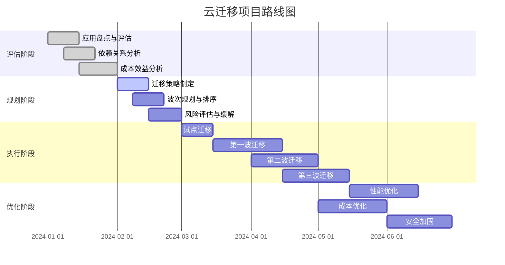
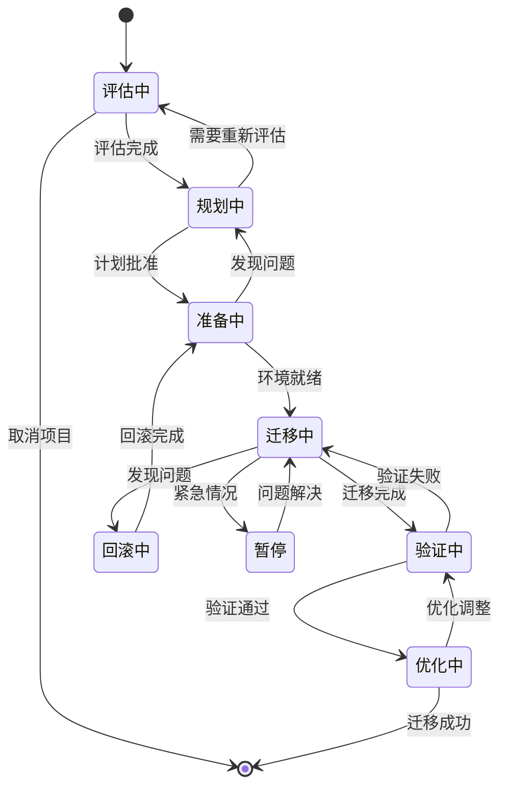
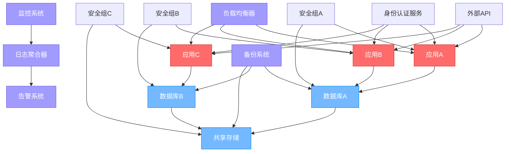
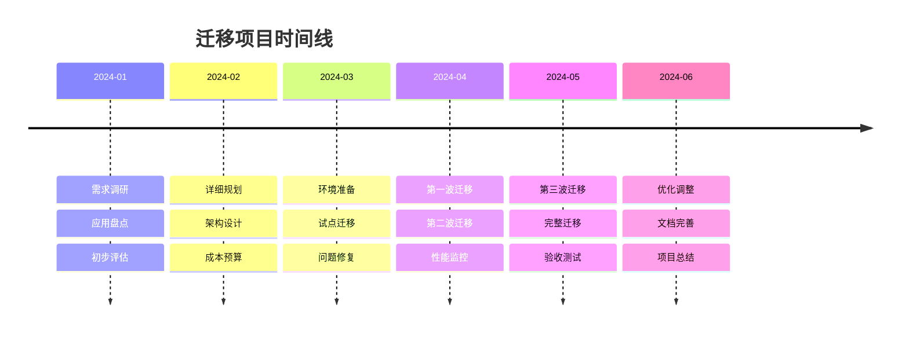
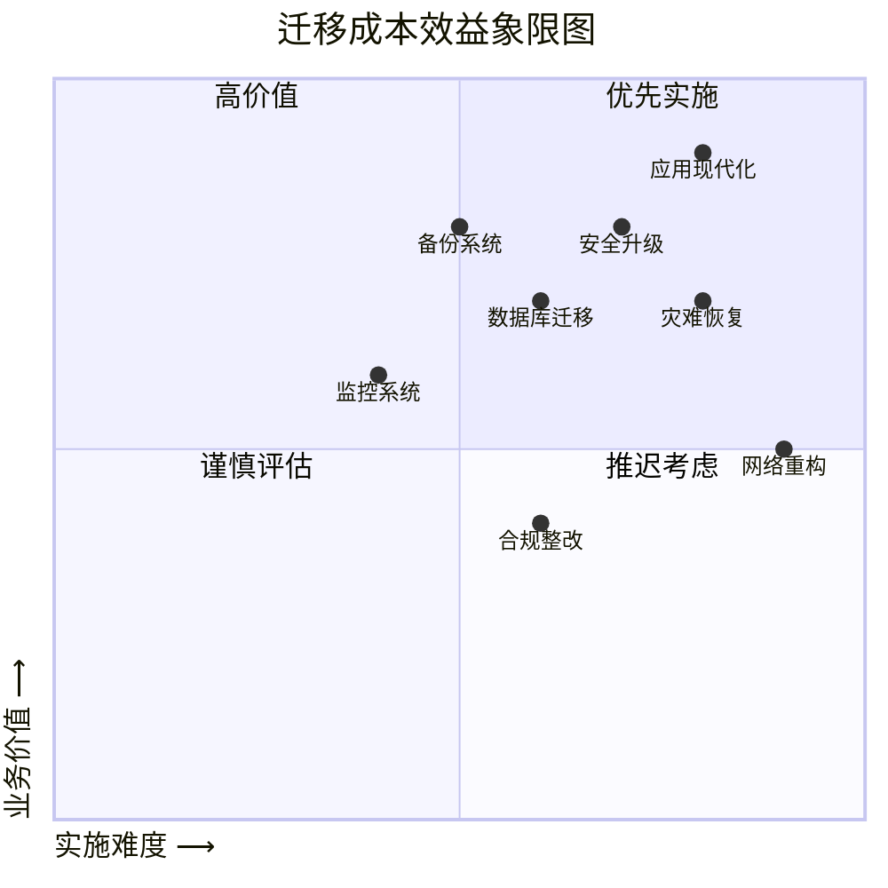
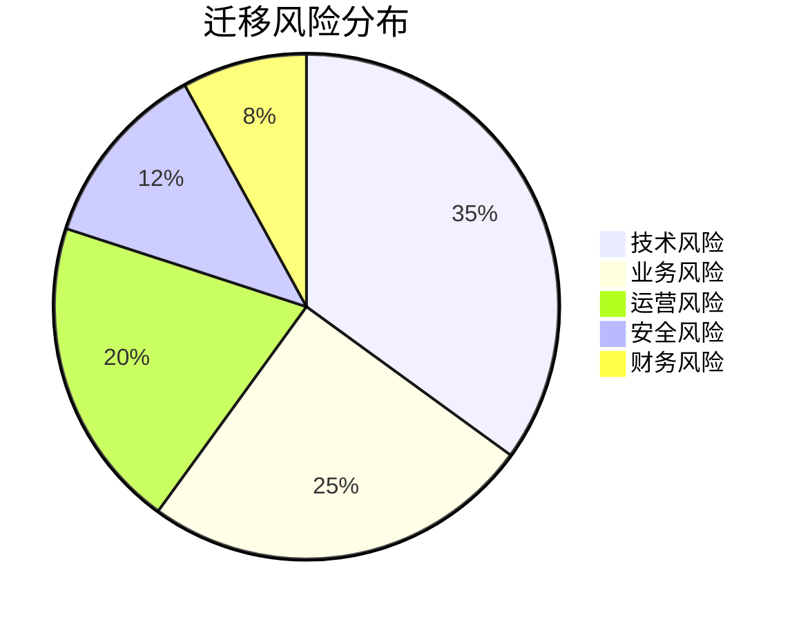

<!-- markdownlint-disable MD025 -->
<a id="第24章-跨云迁移与演练案例【迁移与韧性】"></a>

### 第24章 跨云迁移与演练案例【迁移与韧性】

**本章学习目标**

1. 掌握跨云迁移(Cross-Cloud Migration)的策略和最佳实践；
2. 学习云灾备(Cloud Disaster Recovery, DR)和高可用性(High Availability, HA)设计；
3. 掌握迁移演练(Migration Drill)的规划和执行方法；
4. 理解多云架构(Multi-Cloud Architecture)的韧性(Resilience)保障；
5. 学习迁移风险评估和应对策略；
6. 掌握迁移工具和自动化平台的使用。

**实践建议**

- 制定详细的迁移计划，确保业务连续性。
- 进行充分的迁移演练，验证方案的可行性。
- 建立多云架构，提升系统的韧性和容灾能力。
- 使用专业迁移工具，降低迁移风险和成本。
- 实施持续监控，确保迁移效果和系统稳定性。

## 24.1 跨云迁移策略与规划

### 24.1.1 跨云迁移的基本概念

跨云迁移(Cross-Cloud Migration)是指将应用程序、数据和基础设施从一个云服务提供商迁移到另一个云服务提供商，或同时使用多个云服务提供商的混合云策略。

**核心概念：**
- **迁移策略(Migration Strategy)**：确定迁移的范围、顺序和方法
- **兼容性评估(Compatibility Assessment)**：评估应用在目标云上的兼容性
- **成本分析(Cost Analysis)**：比较迁移成本和长期收益
- **风险评估(Risk Assessment)**：识别和评估迁移过程中的潜在风险

### 24.1.2 迁移策略分类

基于应用特性和业务需求，选择合适的迁移策略：

#### 1. 6R迁移策略框架
```yaml
# examples/24_chapter/migration_6r_strategy.yml
migration_strategies:
  rehost: # 直接迁移
    description: "Lift and Shift - 直接将应用迁移到目标云"
    use_case: "快速迁移，对应用修改最小"
    complexity: "低"
    cost: "中等"
    downtime: "最小"

  refactor: # 重构迁移
    description: "应用现代化改造，充分利用云原生特性"
    use_case: "优化性能和成本，需要应用修改"
    complexity: "高"
    cost: "高"
    downtime: "中等"

  revise: # 修订迁移
    description: "大规模重构，采用微服务架构"
    use_case: "完全现代化改造"
    complexity: "很高"
    cost: "很高"
    downtime: "较长"

  rebuild: # 重建迁移
    description: "完全重写应用，采用云原生技术栈"
    use_case: "技术栈过时，需要完全重写"
    complexity: "极高"
    cost: "极高"
    downtime: "最长"

  replace: # 替换迁移
    description: "用SaaS产品替换自建应用"
    use_case: "应用功能可由云服务替代"
    complexity: "低"
    cost: "低"
    downtime: "最小"

  retain: # 保留策略
    description: "暂时保留在原云，或选择不迁移"
    use_case: "应用复杂，迁移成本过高"
    complexity: "无"
    cost: "无"
    downtime: "无"
```

#### 2. 迁移路径选择
```yaml
# examples/24_chapter/migration_pathways.yml
migration_pathways:
  big_bang_migration: # 大爆炸式迁移
    approach: "一次性迁移所有应用和服务"
    advantages: ["快速完成", "管理简单"]
    disadvantages: ["风险高", "回滚困难", "停机时间长"]
    suitable_for: "小型应用，时间紧迫的项目"

  phased_migration: # 分阶段迁移
    approach: "按优先级分批次迁移"
    advantages: ["风险可控", "渐进优化", "可回滚"]
    disadvantages: ["时间长", "管理复杂", "持续成本"]
    suitable_for: "大型复杂系统"

  hybrid_migration: # 混合迁移
    approach: "部分应用迁移，保持混合架构"
    advantages: ["灵活性高", "风险最小", "渐进转型"]
    disadvantages: ["架构复杂", "管理成本高"]
    suitable_for: "长期战略转型"
```

### 24.1.3 迁移规划框架

系统化的迁移规划确保迁移成功：

#### 1. 迁移评估阶段
```yaml
# examples/24_chapter/migration_assessment.yml
migration_assessment:
  application_inventory:
    - application_name: "应用名称"
      business_criticality: "业务重要性"
      dependencies: "依赖关系"
      data_volume: "数据量"
      compliance_requirements: "合规要求"

  technical_assessment:
    - cloud_compatibility: "云兼容性"
      modernization_opportunities: "现代化机会"
      security_requirements: "安全要求"
      performance_requirements: "性能要求"

  cost_benefit_analysis:
    - current_costs: "当前成本"
      target_costs: "目标成本"
      migration_costs: "迁移成本"
      roi_timeline: "投资回报周期"
```

#### 2. 迁移执行计划
```yaml
# examples/24_chapter/migration_execution_plan.yml
migration_execution_plan:
  timeline:
    assessment_phase: "1-2周"
    planning_phase: "2-4周"
    pilot_migration: "1-2周"
    full_migration: "4-12周"
    optimization_phase: "4-8周"

  resource_allocation:
    migration_team: "迁移团队配置"
    cloud_architect: "云架构师"
    devops_engineer: "DevOps工程师"
    security_specialist: "安全专家"
    business_analyst: "业务分析师"

  risk_mitigation:
    rollback_plan: "回滚计划"
    backup_strategy: "备份策略"
    communication_plan: "沟通计划"
    testing_strategy: "测试策略"
```

#### 3. 迁移成本计算器数学模型

##### 总拥有成本(TCO)计算模型

**一年期TCO计算公式：**
```
TCO = C_迁移 + C_运营 + C_培训 + C_风险 - C_效益
```

其中：
- **C_迁移**: 迁移实施成本
- **C_运营**: 云运营成本
- **C_培训**: 人员培训成本
- **C_风险**: 风险准备金成本
- **C_效益**: 预期效益抵扣

**详细成本分解：**

**迁移实施成本(C_迁移)：**
```
C_迁移 = C_工具 + C_服务 + C_测试 + C_切换
```

- 工具成本：云迁移工具和服务费用
- 服务成本：外部咨询和专业服务费用
- 测试成本：迁移测试和验证费用
- 切换成本：业务切换期间的额外成本

**运营成本(C_运营)：**
```
C_运营 = (C_计算 × H_使用) + (C_存储 × D_存储) + (C_网络 × T_传输) + C_管理
```

- 计算成本：按小时计费的计算资源
- 存储成本：按GB计费的数据存储
- 网络成本：数据传输和带宽费用
- 管理成本：监控、维护和管理费用

##### 投资回报率(ROI)计算模型

**三年期ROI计算：**
```
ROI = [(B_三年 - C_三年) / C_三年] × 100%
```

其中：
- **B_三年**: 三年累计效益
- **C_三年**: 三年累计成本

**净现值(NPV)计算：**
```
NPV = Σ(CF_t / (1 + r)^t) - C_初始
```

其中：
- **CF_t**: 第t年的现金流
- **r**: 折现率(通常为企业WACC)
- **C_初始**: 初始投资成本

**内部收益率(IRR)计算：**
```
Σ(CF_t / (1 + IRR)^t) = 0
```

##### 成本效益分析模型

**敏感性分析：**
```
S_成本 = (ΔTCO / TCO_基准) / (Δ变量 / 变量_基准)
```

**盈亏平衡点(BEP)计算：**
```
BEP_时间 = C_总 / S_月均节约
```

其中：
- **C_总**: 总迁移成本
- **S_月均节约**: 月均成本节约额

##### 风险调整成本模型

**风险调整TCO：**
```
TCO_调整 = TCO_基准 × (1 + R_因子)
```

其中：
- **R_因子**: 风险调整因子(0.1-0.3)

**风险概率加权成本：**
```
C_期望 = Σ(P_i × C_i)
```

其中：
- **P_i**: 风险事件i发生的概率
- **C_i**: 风险事件i的成本影响

##### 成本优化建议算法

**实例类型优化：**
```
优化得分 = (性能提升 / 成本增加) × 100
```

**存储层级优化：**
```
存储效率 = (访问频率 × 检索成本) / 存储成本
```

**预留实例优化：**
```
RI_收益 = (按需价格 - RI价格) × 使用时长 × 承诺期
```

#### 4. 迁移路线图可视化模板

##### 甘特图模板 (Gantt Chart)


##### 迁移状态流程图 (State Diagram)


##### 迁移依赖关系图 (Dependency Graph)


##### 迁移波次时间线 (Timeline)


##### 成本效益分析图 (Cost-Benefit Chart)


##### 迁移风险热力图 (Risk Heatmap)


### 24.1.4 迁移成功指标

定义明确的成功标准，确保迁移目标达成：

#### 1. 技术指标
- **功能完整性**: 所有功能正常运行
- **性能基准**: 满足或超过原有性能指标
- **可用性目标**: 达到预期的SLA水平
- **安全性合规**: 通过安全审计和合规检查

#### 2. 业务指标
- **业务连续性**: 零或最小业务中断
- **用户体验**: 保持或提升用户满意度
- **成本效益**: 实现预期的成本节约
- **创新能力**: 提升技术创新和响应速度

#### 3. 运营指标
- **运维效率**: 降低运维复杂度和成本
- **可扩展性**: 提升系统扩展能力
- **可靠性**: 提高系统稳定性和容错能力
- **可观测性**: 增强监控和问题排查能力

## 24.2 云灾备与高可用性设计

### 24.2.1 云灾备基本概念

云灾备(Cloud Disaster Recovery, DR)是指在云环境中建立数据和应用的备份和恢复能力，以应对各种灾难场景。

**核心概念：**
- **RTO(Recovery Time Objective)**：恢复时间目标，系统从故障到恢复正常所需的时间
- **RPO(Recovery Point Objective)**：恢复点目标，允许数据丢失的最大时间窗口
- **灾备等级**：根据RTO和RPO定义的灾备能力等级

### 24.2.2 灾备架构设计

#### 1. 灾备等级分类
```yaml
# examples/24_chapter/dr_tiers.yml
disaster_recovery_tiers:
  tier_0: # 无灾备
    rto: "数天到数周"
    rpo: "全部数据丢失"
    cost: "最低"
    use_case: "非关键应用"

  tier_1: # 基础灾备
    rto: "数小时到1天"
    rpo: "数小时数据丢失"
    cost: "低"
    use_case: "一般业务应用"

  tier_2: # 中级灾备
    rto: "1-4小时"
    rpo: "1小时内数据丢失"
    cost: "中等"
    use_case: "重要业务应用"

  tier_3: # 高级灾备
    rto: "15分钟到1小时"
    rpo: "15分钟内数据丢失"
    cost: "高"
    use_case: "关键业务应用"

  tier_4: # 顶级灾备
    rto: "<15分钟"
    rpo: "<5分钟数据丢失"
    cost: "最高"
    use_case: "核心金融系统"
```

#### 2. 多区域灾备架构
```yaml
# examples/24_chapter/multi_region_dr.yml
multi_region_dr_architecture:
  primary_region:
    services: "主要业务服务"
    database: "主数据库"
    storage: "主存储"

  secondary_region:
    services: "灾备服务(冷备/温备/热备)"
    database: "灾备数据库(异步同步)"
    storage: "灾备存储(跨区域复制)"

  global_distribution:
    cdn: "全球CDN分发"
    dns: "全局DNS负载均衡"
    traffic_manager: "流量管理器"

  automation:
    failover: "自动故障转移"
    failback: "自动故障恢复"
    monitoring: "实时监控告警"
```

### 24.2.3 高可用性设计原则

#### 1. 可用性分层设计
```yaml
# examples/24_chapter/ha_design_principles.yml
high_availability_design:
  infrastructure_layer:
    - redundant_power: "冗余电源"
    - redundant_network: "冗余网络"
    - redundant_hardware: "冗余硬件"

  platform_layer:
    - load_balancing: "负载均衡"
    - auto_scaling: "自动扩展"
    - health_checks: "健康检查"

  application_layer:
    - stateless_design: "无状态设计"
    - circuit_breaker: "断路器模式"
    - retry_mechanism: "重试机制"

  data_layer:
    - data_replication: "数据复制"
    - backup_strategy: "备份策略"
    - consistency_models: "一致性模型"
```

#### 2. 故障转移策略
```yaml
# examples/24_chapter/failover_strategies.yml
failover_strategies:
  active_passive: # 主备模式
    description: "一个主节点，多个备节点"
    advantages: ["简单可靠", "数据一致性好"]
    disadvantages: ["资源浪费", "切换时间较长"]
    use_case: "数据库、存储系统"

  active_active: # 双主模式
    description: "多个活动节点同时提供服务"
    advantages: ["资源利用率高", "无缝切换"]
    disadvantages: ["复杂度高", "数据同步挑战"]
    use_case: "负载均衡的应用服务"

  hybrid_approach: # 混合模式
    description: "结合主备和双主模式的优势"
    advantages: ["灵活性高", "性能优化"]
    disadvantages: ["设计复杂", "管理成本高"]
    use_case: "复杂分布式系统"
```

### 24.2.4 灾备演练规划

#### 1. 演练类型和频率
```yaml
# examples/24_chapter/dr_drill_types.yml
disaster_recovery_drills:
  tabletop_exercise: # 桌面演练
    frequency: "每季度"
    participants: "管理层和技术团队"
    objective: "验证灾备计划的合理性"
    duration: "2-4小时"

  functional_test: # 功能测试
    frequency: "每半年"
    participants: "技术团队"
    objective: "测试灾备系统的功能完整性"
    duration: "4-8小时"

  full_dr_test: # 完整灾备测试
    frequency: "每年"
    participants: "全团队"
    objective: "验证端到端灾备能力"
    duration: "1-2天"

  chaos_engineering: # 混沌工程
    frequency: "持续进行"
    participants: "SRE团队"
    objective: "提升系统韧性"
    duration: "按需进行"
```

#### 2. 演练执行流程
```yaml
# examples/24_chapter/dr_drill_process.yml
dr_drill_execution:
  preparation_phase:
    - define_objectives: "明确演练目标"
    - assemble_team: "组建演练团队"
    - prepare_environment: "准备演练环境"
    - communication_plan: "制定沟通计划"

  execution_phase:
    - simulate_failure: "模拟故障场景"
    - execute_failover: "执行故障转移"
    - monitor_recovery: "监控恢复过程"
    - validate_functionality: "验证功能完整性"

  evaluation_phase:
    - measure_metrics: "测量关键指标"
    - identify_gaps: "识别改进点"
    - document_lessons: "记录经验教训"
    - update_procedures: "更新灾备流程"

  follow_up_phase:
    - implement_improvements: "实施改进措施"
    - schedule_next_drill: "规划下次演练"
    - report_to_stakeholders: "向利益相关者汇报"
```

## 24.3 迁移演练案例与实施

### 24.3.1 迁移演练的重要性

迁移演练(Migration Drill)是在实际迁移前进行的模拟演练，通过演练发现潜在问题，优化迁移方案，确保迁移成功。

**演练价值：**
- **风险识别**: 提前发现迁移过程中的潜在风险
- **方案验证**: 验证迁移方案的可行性和有效性
- **团队磨合**: 提升迁移团队的协作能力和响应速度
- **信心建立**: 为实际迁移建立信心和经验基础

### 24.3.2 演练规划与准备

#### 1. 演练范围定义
```yaml
# examples/24_chapter/migration_drill_scope.yml
migration_drill_scope:
  application_scope:
    - core_applications: "核心应用系统"
    - supporting_services: "支撑服务"
    - data_services: "数据服务"
    - monitoring_systems: "监控系统"

  infrastructure_scope:
    - compute_resources: "计算资源"
    - storage_resources: "存储资源"
    - network_resources: "网络资源"
    - security_resources: "安全资源"

  data_scope:
    - critical_data: "关键业务数据"
    - configuration_data: "配置数据"
    - log_data: "日志数据"
    - backup_data: "备份数据"
```

#### 2. 演练环境搭建
```yaml
# examples/24_chapter/drill_environment_setup.yml
drill_environment_setup:
  staging_environment:
    - replicate_production: "复制生产环境配置"
    - scale_down_resources: "适当缩减资源规模"
    - anonymize_data: "数据脱敏处理"
    - isolate_network: "网络隔离保护"

  testing_tools:
    - load_generators: "负载生成工具"
    - monitoring_tools: "监控工具"
    - validation_scripts: "验证脚本"
    - rollback_tools: "回滚工具"

  team_preparation:
    - training_sessions: "培训会议"
    - responsibility_assignment: "职责分配"
    - communication_channels: "沟通渠道"
    - escalation_procedures: "升级流程"
```

### 24.3.3 演练执行与监控

#### 1. 演练执行流程
```yaml
# examples/24_chapter/drill_execution_flow.yml
drill_execution_flow:
  phase_1_preparation:
    - final_checklist: "最终检查清单"
    - team_briefing: "团队简报"
    - stakeholder_notification: "利益相关者通知"
    - monitoring_activation: "监控激活"

  phase_2_execution:
    - initiate_migration: "启动迁移"
    - monitor_progress: "监控进度"
    - validate_checkpoints: "验证检查点"
    - handle_issues: "处理问题"

  phase_3_validation:
    - functionality_tests: "功能测试"
    - performance_tests: "性能测试"
    - data_integrity_checks: "数据完整性检查"
    - security_validations: "安全验证"

  phase_4_rollback:
    - rollback_procedures: "回滚流程"
    - data_restoration: "数据恢复"
    - system_stabilization: "系统稳定化"
    - lessons_learned: "经验总结"
```

#### 2. 关键监控指标
```yaml
# examples/24_chapter/drill_monitoring_metrics.yml
drill_monitoring_metrics:
  performance_metrics:
    - response_time: "响应时间"
    - throughput: "吞吐量"
    - error_rate: "错误率"
    - resource_utilization: "资源利用率"

  migration_metrics:
    - migration_progress: "迁移进度"
    - data_transfer_rate: "数据传输速率"
    - downtime_duration: "停机时长"
    - rollback_time: "回滚时间"

  quality_metrics:
    - data_accuracy: "数据准确性"
    - system_stability: "系统稳定性"
    - user_experience: "用户体验"
    - compliance_status: "合规状态"
```

### 24.3.4 问题处理与改进

#### 1. 常见问题识别
```yaml
# examples/24_chapter/common_drill_issues.yml
common_drill_issues:
  technical_issues:
    - compatibility_problems: "兼容性问题"
    - performance_degradation: "性能下降"
    - data_inconsistency: "数据不一致"
    - security_vulnerabilities: "安全漏洞"

  operational_issues:
    - communication_breakdown: "沟通中断"
    - resource_shortage: "资源短缺"
    - timeline_delays: "时间延误"
    - coordination_problems: "协调问题"

  process_issues:
    - incomplete_procedures: "流程不完整"
    - unclear_responsibilities: "职责不清"
    - inadequate_testing: "测试不足"
    - poor_documentation: "文档不完善"
```

#### 2. 持续改进机制
```yaml
# examples/24_chapter/continuous_improvement.yml
continuous_improvement_process:
  issue_analysis:
    - root_cause_analysis: "根本原因分析"
    - impact_assessment: "影响评估"
    - priority_ranking: "优先级排序"

  solution_development:
    - corrective_actions: "纠正措施"
    - preventive_measures: "预防措施"
    - process_improvements: "流程改进"

  implementation_tracking:
    - action_item_assignment: "行动项分配"
    - progress_monitoring: "进度监控"
    - effectiveness_measurement: "效果测量"

  knowledge_sharing:
    - lesson_documentation: "经验文档化"
    - team_training: "团队培训"
    - best_practice_updates: "最佳实践更新"
```

## 24.4 多云韧性架构实践

### 24.4.1 多云架构设计原则

多云架构(Multi-Cloud Architecture)通过同时使用多个云服务提供商，提升系统的韧性(Resilience)和灵活性。

**设计原则：**
- **避免厂商锁定**: 不依赖单一云服务商
- **最佳位置部署**: 将服务部署在最适合的云环境中
- **统一管理**: 实现跨云的统一监控和管理
- **成本优化**: 利用不同云服务商的价格优势

### 24.4.2 多云部署模式

#### 1. 混合云模式
```yaml
# examples/24_chapter/hybrid_cloud_patterns.yml
hybrid_cloud_patterns:
  cloud_bursting: # 云爆发
    description: "根据负载动态扩展到公有云"
    trigger: "私有云资源不足时"
    use_case: "季节性负载高峰"
    benefits: ["成本控制", "弹性扩展"]

  cloud_backup: # 云备份
    description: "使用公有云作为灾备环境"
    trigger: "生产环境故障时"
    use_case: "灾备和业务连续性"
    benefits: ["高可用性", "成本效益"]

  cloud_mirroring: # 云镜像
    description: "实时同步数据到公有云"
    trigger: "数据保护和合规要求"
    use_case: "数据保护和合规"
    benefits: ["数据安全", "合规性"]
```

#### 2. 多云原生模式
```yaml
# examples/24_chapter/multi_cloud_native.yml
multi_cloud_native_patterns:
  active_active_deployment: # 双活部署
    description: "同时在多个云上运行相同服务"
    load_distribution: "基于地理位置或性能"
    benefits: ["高可用性", "低延迟", "容灾能力"]
    challenges: ["数据同步", "复杂性管理"]

  cloud_specific_optimization: # 云特定优化
    description: "针对每个云的特点进行优化"
    service_mapping: "选择最适合的服务"
    benefits: ["性能优化", "成本控制"]
    challenges: ["管理复杂性"]

  unified_control_plane: # 统一控制面
    description: "跨云的统一管理和监控"
    tools: "多云管理平台"
    benefits: ["简化运维", "一致性保证"]
    challenges: ["集成复杂度"]
```

### 24.4.3 跨云数据管理

#### 1. 数据一致性策略
```yaml
# examples/24_chapter/cross_cloud_data_consistency.yml
cross_cloud_data_consistency:
  eventual_consistency: # 最终一致性
    description: "允许临时不一致，最终达到一致"
    use_case: "非关键业务数据"
    trade_offs: ["高可用性", "vs", "强一致性"]

  strong_consistency: # 强一致性
    description: "保证数据在所有副本间的一致性"
    use_case: "金融交易数据"
    trade_offs: ["数据准确性", "vs", "性能和可用性"]

  causal_consistency: # 因果一致性
    description: "保持因果关系的一致性"
    use_case: "社交媒体数据"
    trade_offs: ["业务逻辑一致性", "vs", "简单性"]
```

#### 2. 数据同步架构
```yaml
# examples/24_chapter/data_synchronization_architecture.yml
data_synchronization_architecture:
  real_time_sync: # 实时同步
    technology: "Change Data Capture (CDC)"
    tools: ["Debezium", "Maxwell", "AWS DMS"]
    use_case: "关键业务数据"
    latency: "< 1 second"

  batch_sync: # 批量同步
    technology: "ETL/ELT pipelines"
    tools: ["Apache Airflow", "AWS Glue", "Azure Data Factory"]
    use_case: "历史数据迁移"
    latency: "minutes to hours"

  hybrid_sync: # 混合同步
    technology: "结合实时和批量"
    tools: ["Custom solutions"]
    use_case: "复杂数据架构"
    latency: "application dependent"
```

### 24.4.4 多云安全治理

#### 1. 统一安全策略
```yaml
# examples/24_chapter/multi_cloud_security_governance.yml
multi_cloud_security_governance:
  identity_management:
    - unified_iam: "统一身份访问管理"
    - sso_integration: "单点登录集成"
    - role_based_access: "基于角色的访问控制"

  network_security:
    - perimeter_protection: "边界防护"
    - micro_segmentation: "微分段"
    - encrypted_communication: "加密通信"

  data_protection:
    - encryption_at_rest: "静态数据加密"
    - encryption_in_transit: "传输数据加密"
    - data_loss_prevention: "数据丢失防护"

  compliance_monitoring:
    - automated_audits: "自动化审计"
    - regulatory_compliance: "监管合规"
    - security_certifications: "安全认证"
```

#### 2. 安全事件响应
```yaml
# examples/24_chapter/security_incident_response.yml
security_incident_response:
  detection_and_alerting:
    - siem_integration: "安全信息和事件管理"
    - threat_intelligence: "威胁情报"
    - automated_alerting: "自动化告警"

  incident_response_plan:
    - incident_classification: "事件分类"
    - escalation_procedures: "升级流程"
    - communication_protocols: "沟通协议"

  forensic_analysis:
    - log_aggregation: "日志聚合"
    - evidence_collection: "证据收集"
    - root_cause_analysis: "根本原因分析"

  recovery_and_lessons_learned:
    - system_recovery: "系统恢复"
    - impact_assessment: "影响评估"
    - process_improvements: "流程改进"
```

## 24.5 迁移风险评估与应对

### 24.5.1 迁移风险识别

系统性识别迁移过程中的潜在风险，确保迁移方案的稳健性。

#### 1. 技术风险
```yaml
# examples/24_chapter/migration_risk_assessment.yml
migration_risk_assessment:
  technical_risks:
    compatibility_issues:
      description: "应用与目标云环境不兼容"
      impact: "高"
      probability: "中等"
      mitigation: "前期兼容性测试"

    performance_degradation:
      description: "迁移后性能下降"
      impact: "高"
      probability: "中等"
      mitigation: "性能基准测试"

    data_integrity_issues:
      description: "数据迁移过程中的完整性问题"
      impact: "极高"
      probability: "低"
      mitigation: "数据校验和备份"

    security_vulnerabilities:
      description: "迁移过程中的安全风险"
      impact: "高"
      probability: "中等"
      mitigation: "安全评估和加固"
```

#### 2. 业务风险
```yaml
# examples/24_chapter/business_risks.yml
business_risks:
  operational_disruption:
    description: "业务运营中断"
    impact: "极高"
    probability: "低"
    mitigation: "分阶段迁移，备用方案"

  cost_overruns:
    description: "迁移成本超出预算"
    impact: "高"
    probability: "中等"
    mitigation: "详细成本规划和监控"

  timeline_delays:
    description: "迁移时间延误"
    impact: "中等"
    probability: "高"
    mitigation: "合理的时间规划和缓冲"

  skill_shortage:
    description: "团队技能不足"
    impact: "高"
    probability: "中等"
    mitigation: "培训和外部支持"
```

### 24.5.2 风险评估方法

#### 1. 风险矩阵分析
```yaml
# examples/24_chapter/risk_matrix_analysis.yml
risk_matrix_analysis:
  impact_levels:
    critical: "极高 - 可能导致项目失败"
    high: "高 - 重大影响业务目标"
    medium: "中等 - 可控的影响"
    low: "低 - 最小影响"

  probability_levels:
    very_high: "极高 - >80%可能性"
    high: "高 - 60-80%可能性"
    medium: "中等 - 40-60%可能性"
    low: "低 - 20-40%可能性"
    very_low: "极低 - <20%可能性"

  risk_priority:
    extreme: "极高影响 + 极高概率"
    high: "高影响 + 高概率"
    medium: "中等影响 + 中等概率"
    low: "低影响 + 低概率"
```

#### 2. 定量风险评估
```yaml
# examples/24_chapter/quantitative_risk_assessment.yml
quantitative_risk_assessment:
  expected_monetary_value:
    formula: "EMV = 风险影响金额 × 发生概率"
    example: "数据丢失风险: 100万美元 × 5% = 5万美元"

  risk_exposure_calculation:
    formula: "风险暴露 = (影响程度 × 发生概率) × 时间窗口"
    factors:
      - impact_severity: "影响严重程度 (1-10)"
      - occurrence_probability: "发生概率 (0-1)"
      - exposure_window: "暴露时间窗口 (天)"

  risk_reduction_leverage:
    formula: "RRL = (风险减少金额) / 缓解措施成本"
    interpretation:
      - ">1": "值得投资的缓解措施"
      - "=1": "边际效益"
      - "<1": "不值得投资"
```

### 24.5.3 风险缓解策略

#### 1. 预防性措施
```yaml
# examples/24_chapter/risk_mitigation_strategies.yml
risk_mitigation_strategies:
  technical_mitigation:
    - pilot_migration: "试点迁移验证方案"
    - comprehensive_testing: "全面测试覆盖"
    - phased_rollout: "分阶段 rollout"
    - automated_validation: "自动化验证"

  operational_mitigation:
    - backup_strategies: "多重备份策略"
    - rollback_plans: "详细回滚计划"
    - monitoring_enhancement: "增强监控能力"
    - communication_plans: "沟通计划"

  organizational_mitigation:
    - team_training: "团队培训"
    - stakeholder_engagement: "利益相关者参与"
    - vendor_support: "供应商支持"
    - expert_consultation: "专家咨询"
```

#### 2. 应急响应计划
```yaml
# examples/24_chapter/contingency_planning.yml
contingency_planning:
  incident_response_team:
    - incident_coordinator: "事件协调员"
    - technical_leads: "技术负责人"
    - business_representatives: "业务代表"
    - communication_leads: "沟通负责人"

  escalation_procedures:
    - level_1_incidents: "1级事件 - 团队内部处理"
    - level_2_incidents: "2级事件 - 管理层介入"
    - level_3_incidents: "3级事件 - 高层决策"
    - level_4_incidents: "4级事件 - 危机管理"

  communication_protocols:
    - internal_communication: "内部沟通渠道"
    - external_communication: "外部利益相关者"
    - media_communication: "媒体沟通策略"
    - regulatory_reporting: "监管报告要求"
```

### 24.5.4 风险监控与报告

#### 1. 持续风险监控
```yaml
# examples/24_chapter/risk_monitoring_framework.yml
risk_monitoring_framework:
  risk_indicators:
    - leading_indicators: "领先指标 - 预测风险"
    - lagging_indicators: "滞后指标 - 确认风险"
    - key_risk_indicators: "关键风险指标"

  monitoring_frequency:
    - daily_monitoring: "每日监控 - 高风险项目"
    - weekly_reviews: "每周审查 - 中风险项目"
    - monthly_assessments: "每月评估 - 低风险项目"

  threshold_management:
    - warning_thresholds: "警告阈值"
    - critical_thresholds: "临界阈值"
    - escalation_triggers: "升级触发条件"
```

#### 2. 风险报告体系
```yaml
# examples/24_chapter/risk_reporting_system.yml
risk_reporting_system:
  operational_reports:
    - daily_risk_summary: "每日风险摘要"
    - weekly_risk_dashboard: "每周风险仪表板"
    - monthly_risk_assessment: "每月风险评估"

  executive_reports:
    - risk_heat_map: "风险热力图"
    - risk_trend_analysis: "风险趋势分析"
    - risk_mitigation_effectiveness: "风险缓解效果"

  stakeholder_communication:
    - risk_transparency: "风险透明度"
    - mitigation_progress: "缓解进度"
    - confidence_levels: "信心水平"
```

## 24.6 迁移工具与自动化平台

### 24.6.1 迁移工具分类

根据迁移需求选择合适的工具和平台：

#### 1. 基础设施迁移工具
```yaml
# examples/24_chapter/infrastructure_migration_tools.yml
infrastructure_migration_tools:
  aws_server_migration_service:
    category: "AWS原生迁移工具"
    capabilities:
      - agentless_migration: "无代理迁移"
      - incremental_replication: "增量复制"
      - automated_networking: "自动化网络配置"
    use_cases: ["AWS内部迁移", "物理机到云迁移"]

  azure_migrate:
    category: "Azure迁移评估和迁移工具"
    capabilities:
      - discovery_and_assessment: "发现和评估"
      - dependency_mapping: "依赖关系映射"
      - cost_planning: "成本规划"
      - migration_execution: "迁移执行"
    use_cases: ["Azure迁移规划", "混合云迁移"]

  google_cloud_migration_tools:
    category: "GCP迁移工具套件"
    capabilities:
      - migrate_for_compute_engine: "计算引擎迁移"
      - migrate_for_anthos: "Anthos迁移"
      - bigquery_data_transfer: "大数据迁移"
    use_cases: ["GCP云迁移", "容器化迁移"]
```

#### 2. 应用迁移工具
```yaml
# examples/24_chapter/application_migration_tools.yml
application_migration_tools:
  cloudendure:
    category: "企业级迁移工具"
    capabilities:
      - block_level_replication: "块级复制"
      - automated_cutover: "自动化切换"
      - disaster_recovery: "灾备功能"
      - multi_cloud_support: "多云支持"
    supported_clouds: ["AWS", "Azure", "GCP"]

  river_migrate:
    category: "现代化迁移平台"
    capabilities:
      - application_replatforming: "应用重构"
      - database_migration: "数据库迁移"
      - testing_automation: "测试自动化"
      - performance_optimization: "性能优化"
    supported_technologies: ["Java", ".NET", "数据库"]

  carbonite_migrate:
    category: "端到端迁移解决方案"
    capabilities:
      - server_migration: "服务器迁移"
      - application_migration: "应用迁移"
      - data_migration: "数据迁移"
      - validation_reporting: "验证报告"
    compliance_support: ["GDPR", "HIPAA", "PCI DSS"]
```

### 24.6.2 自动化迁移平台

#### 1. 云原生迁移平台
```yaml
# examples/24_chapter/cloud_native_migration_platforms.yml
cloud_native_migration_platforms:
  aws_application_migration_service:
    description: "AWS应用迁移服务"
    features:
      - lift_and_shift: "直接迁移"
      - modernization_options: "现代化选项"
      - testing_and_validation: "测试验证"
      - operational_readiness: "运营就绪性"
    integration: "AWS生态系统"

  azure_arc:
    description: "Azure混合云管理平台"
    features:
      - unified_management: "统一管理"
      - app_services: "应用服务"
      - data_services: "数据服务"
      - kubernetes_support: "Kubernetes支持"
    hybrid_capabilities: "混合云能力"

  google_anthos:
    description: "GCP混合云应用平台"
    features:
      - multi_cloud_kubernetes: "多云Kubernetes"
      - service_mesh: "服务网格"
      - config_management: "配置管理"
      - security_policies: "安全策略"
    portability: "应用可移植性"
```

#### 2. 第三方迁移平台
```yaml
# examples/24_chapter/third_party_migration_platforms.yml
third_party_migration_platforms:
  morphis_migration_platform:
    description: "企业应用现代化平台"
    capabilities:
      - application_assessment: "应用评估"
      - automated_migration: "自动化迁移"
      - testing_automation: "测试自动化"
      - governance_reporting: "治理报告"
    supported_applications: ["Oracle", "SAP", "自定义应用"]

  micro_focus_transformation_progress:
    description: "大型机现代化平台"
    capabilities:
      - mainframe_analysis: "大型机分析"
      - application_reengineering: "应用重构"
      - data_migration: "数据迁移"
      - testing_framework: "测试框架"
    legacy_systems: ["COBOL", "PL/I", "大型机数据库"]

  unleash_migration_platform:
    description: "云迁移自动化平台"
    capabilities:
      - discovery_and_planning: "发现规划"
      - automated_migration: "自动化迁移"
      - validation_and_testing: "验证测试"
      - continuous_optimization: "持续优化"
    cloud_targets: ["AWS", "Azure", "GCP", "私有云"]
```

### 24.6.3 迁移工具选型框架

#### 1. 工具评估标准
```yaml
# examples/24_chapter/migration_tool_evaluation_criteria.yml
migration_tool_evaluation_criteria:
  functional_requirements:
    - migration_scope: "迁移范围支持"
    - automation_level: "自动化程度"
    - validation_capabilities: "验证能力"
    - rollback_support: "回滚支持"

  technical_requirements:
    - cloud_compatibility: "云兼容性"
    - scalability: "可扩展性"
    - security_compliance: "安全合规"
    - performance_requirements: "性能要求"

  operational_requirements:
    - ease_of_use: "易用性"
    - monitoring_visibility: "监控可见性"
    - support_and_documentation: "支持文档"
    - cost_effectiveness: "成本效益"

  business_requirements:
    - time_to_market: "上市时间"
    - risk_mitigation: "风险缓解"
    - business_continuity: "业务连续性"
    - future_proofing: "未来保障"
```

#### 2. 选型决策流程
```yaml
# examples/24_chapter/tool_selection_process.yml
tool_selection_process:
  requirement_gathering:
    - stakeholder_interviews: "利益相关者访谈"
    - current_state_analysis: "现状分析"
    - future_state_vision: "未来愿景"
    - constraint_identification: "约束识别"

  market_research:
    - vendor_landscape: "供应商格局"
    - product_comparison: "产品对比"
    - reference_checks: "参考检查"
    - proof_of_concept: "概念验证"

  evaluation_and_selection:
    - weighted_scoring: "加权评分"
    - pilot_testing: "试点测试"
    - cost_benefit_analysis: "成本效益分析"
    - final_decision: "最终决策"

  implementation_planning:
    - procurement_process: "采购流程"
    - deployment_planning: "部署规划"
    - training_program: "培训计划"
    - change_management: "变革管理"
```

### 24.6.4 迁移自动化实现

#### 1. 基础设施即代码
```yaml
# examples/24_chapter/iac_migration_automation.yml
iac_migration_automation:
  terraform_migration_modules:
    description: "Terraform迁移模块"
    capabilities:
      - infrastructure_provisioning: "基础设施配置"
      - state_management: "状态管理"
      - dependency_handling: "依赖处理"
      - drift_detection: "漂移检测"

  cloudformation_templates:
    description: "AWS CloudFormation模板"
    capabilities:
      - stack_deployment: "堆栈部署"
      - resource_orchestration: "资源编排"
      - parameterization: "参数化配置"
      - rollback_automation: "回滚自动化"

  arm_templates:
    description: "Azure Resource Manager模板"
    capabilities:
      - declarative_syntax: "声明式语法"
      - resource_grouping: "资源分组"
      - template_functions: "模板函数"
      - validation_rules: "验证规则"
```

#### 2. CI/CD集成迁移
```yaml
# examples/24_chapter/cicd_migration_integration.yml
cicd_migration_integration:
  migration_pipelines:
    - assessment_pipeline: "评估流水线"
    - migration_pipeline: "迁移流水线"
    - validation_pipeline: "验证流水线"
    - rollback_pipeline: "回滚流水线"

  automated_testing:
    - infrastructure_tests: "基础设施测试"
    - application_tests: "应用测试"
    - integration_tests: "集成测试"
    - performance_tests: "性能测试"

  deployment_strategies:
    - blue_green_deployment: "蓝绿部署"
    - canary_deployment: "金丝雀部署"
    - rolling_deployment: "滚动部署"
    - immutable_deployment: "不可变部署"
```

### 24.6.5 自动化脚本示例

#### 1. Python迁移自动化脚本
```python
# examples/24_chapter/migration_automation_script.py
# 企业级云迁移自动化工具示例
# 功能：多云环境支持、基础设施即代码部署、迁移状态监控、自动化回滚机制

import boto3
import azure.mgmt.compute
import google.cloud.compute_v1
from typing import Dict, List, Optional
import logging
import json
from datetime import datetime, timedelta
import time

class CloudMigrationManager:
    """云迁移管理器"""

    def __init__(self, config: Dict):
        self.config = config
        self._initialize_clients()

    def assess_migration_readiness(self, source_resources: List[Dict]) -> Dict:
        """评估迁移就绪性"""
        assessment_results = {
            'total_resources': len(source_resources),
            'ready_count': 0,
            'issues': [],
            'recommendations': []
        }

        for resource in source_resources:
            readiness_score = self._calculate_readiness_score(resource)
            if readiness_score >= 0.8:
                assessment_results['ready_count'] += 1
            else:
                assessment_results['issues'].append({
                    'resource': resource['id'],
                    'score': readiness_score,
                    'issues': self._identify_issues(resource)
                })

        assessment_results['readiness_percentage'] = (
            assessment_results['ready_count'] / assessment_results['total_resources']
        ) * 100

        return assessment_results

    def execute_migration_wave(self, wave_config: Dict) -> Dict:
        """执行迁移波次"""
        wave_id = wave_config['wave_id']
        resources = wave_config['resources']

        logger.info(f"开始执行迁移波次: {wave_id}")

        migration_results = {
            'wave_id': wave_id,
            'start_time': datetime.now().isoformat(),
            'resources_migrated': 0,
            'success_count': 0,
            'failure_count': 0,
            'rollback_count': 0,
            'details': []
        }

        for resource in resources:
            try:
                result = self._migrate_single_resource(resource)
                migration_results['resources_migrated'] += 1

                if result['status'] == 'success':
                    migration_results['success_count'] += 1
                else:
                    migration_results['failure_count'] += 1
                    if result.get('rollback_performed'):
                        migration_results['rollback_count'] += 1

                migration_results['details'].append(result)

            except Exception as e:
                logger.error(f"迁移资源失败 {resource['id']}: {str(e)}")
                migration_results['failure_count'] += 1
                migration_results['details'].append({
                    'resource_id': resource['id'],
                    'status': 'error',
                    'error': str(e)
                })

        migration_results['end_time'] = datetime.now().isoformat()
        migration_results['duration_minutes'] = (
            datetime.fromisoformat(migration_results['end_time']) -
            datetime.fromisoformat(migration_results['start_time'])
        ).total_seconds() / 60

        return migration_results

    def generate_migration_report(self, migration_results: List[Dict]) -> Dict:
        """生成迁移报告"""
        total_waves = len(migration_results)
        total_resources = sum(wave['resources_migrated'] for wave in migration_results)
        total_success = sum(wave['success_count'] for wave in migration_results)
        total_failures = sum(wave['failure_count'] for wave in migration_results)

        success_rate = (total_success / total_resources * 100) if total_resources > 0 else 0

        report = {
            'summary': {
                'total_waves': total_waves,
                'total_resources': total_resources,
                'successful_migrations': total_success,
                'failed_migrations': total_failures,
                'success_rate': success_rate,
                'total_duration_minutes': sum(wave.get('duration_minutes', 0) for wave in migration_results)
            },
            'wave_details': migration_results,
            'recommendations': self._generate_recommendations(migration_results),
            'generated_at': datetime.now().isoformat()
        }

        return report
```

#### 2. Bash迁移自动化脚本
```bash
#!/bin/bash
# examples/24_chapter/migration_automation.sh
# 企业级云迁移自动化bash脚本示例
# 功能：多云环境部署、基础设施自动化、监控和日志记录、错误处理和回滚

set -euo pipefail

SCRIPT_DIR="$(cd "$(dirname "${BASH_SOURCE[0]}")" && pwd)"
LOG_FILE="${SCRIPT_DIR}/migration_$(date +%Y%m%d_%H%M%S).log"
CONFIG_FILE="${SCRIPT_DIR}/migration_config.yml"

log() {
    local level="$1"
    local message="$2"
    local timestamp=$(date '+%Y-%m-%d %H:%M:%S')
    echo "[${timestamp}] [${level}] ${message}" | tee -a "${LOG_FILE}"
}

check_dependencies() {
    local missing_deps=()

    local required_commands=("aws" "az" "gcloud" "terraform" "ansible" "jq" "curl")
    for cmd in "${required_commands[@]}"; do
        if ! command -v "$cmd" &> /dev/null; then
            missing_deps+=("$cmd")
        fi
    done

    if [[ ${#missing_deps[@]} -gt 0 ]]; then
        error "缺少必需的依赖: ${missing_deps[*]}"
        exit 1
    fi

    info "所有依赖检查通过"
}

pre_migration_checks() {
    info "执行预迁移检查..."

    check_network_connectivity
    check_cloud_credentials
    check_resource_availability
    validate_migration_plan

    info "预迁移检查完成"
}

execute_migration() {
    info "开始执行迁移波次: ${MIGRATION_WAVE}"

    local wave_file="${SCRIPT_DIR}/waves/${MIGRATION_WAVE}.json"
    local resources=$(jq -r '.resources[] | @base64' "${wave_file}")

    local migrated_count=0
    local failed_count=0

    for resource_b64 in ${resources}; do
        local resource=$(echo "${resource_b64}" | base64 --decode)

        local resource_id=$(echo "${resource}" | jq -r '.id')
        local resource_type=$(echo "${resource}" | jq -r '.type')

        info "迁移资源: ${resource_id} (${resource_type})"

        if migrate_resource "${resource}"; then
            info "资源迁移成功: ${resource_id}"
            ((migrated_count++))
        else
            error "资源迁移失败: ${resource_id}"
            ((failed_count++))
        fi
    done

    info "迁移波次完成 - 成功: ${migrated_count}, 失败: ${failed_count}"
    generate_migration_report "${migrated_count}" "${failed_count}"
}

generate_migration_report() {
    local success_count="$1"
    local failure_count="$2"
    local total_count=$((success_count + failure_count))
    local success_rate=0

    if (( total_count > 0 )); then
        success_rate=$((success_count * 100 / total_count))
    fi

    local report_file="${SCRIPT_DIR}/reports/migration_report_$(date +%Y%m%d_%H%M%S).json"

    mkdir -p "${SCRIPT_DIR}/reports"

    cat > "${report_file}" << EOF
{
    "migration_wave": "${MIGRATION_WAVE}",
    "execution_time": "$(date '+%Y-%m-%d %H:%M:%S')",
    "summary": {
        "total_resources": ${total_count},
        "successful_migrations": ${success_count},
        "failed_migrations": ${failure_count},
        "success_rate": ${success_rate}
    },
    "source_platform": "${SOURCE_PLATFORM}",
    "target_platform": "${TARGET_PLATFORM}",
    "log_file": "${LOG_FILE}"
}
EOF

    info "迁移报告已生成: ${report_file}"
}
```

#### 3. Terraform基础设施即代码模板
```hcl
# examples/24_chapter/migration_terraform.tf
# 云迁移基础设施即代码Terraform模块示例
# 功能：多云环境支持、模块化架构、状态管理、依赖处理、成本优化

terraform {
  required_providers {
    aws = {
      source  = "hashicorp/aws"
      version = "~> 4.0"
    }
    azurerm = {
      source  = "hashicorp/azurerm"
      version = "~> 3.0"
    }
    google = {
      source  = "hashicorp/google"
      version = "~> 4.0"
    }
  }

  backend "s3" {
    bucket         = "migration-terraform-state"
    key            = "migration/terraform.tfstate"
    region         = "us-east-1"
    encrypt        = true
    dynamodb_table = "migration-terraform-locks"
  }
}

variable "migration_wave" {
  description = "迁移波次标识"
  type        = string
  default     = "wave-001"
}

variable "vpc_config" {
  description = "VPC网络配置"
  type = object({
    cidr_block           = string
    enable_dns_hostnames = bool
    enable_dns_support   = bool
  })
  default = {
    cidr_block           = "10.0.0.0/16"
    enable_dns_hostnames = true
    enable_dns_support   = true
  }
}

resource "aws_instance" "migration_servers" {
  count = 3

  ami           = var.instance_config.ami_id
  instance_type = var.instance_config.instance_type
  key_name      = var.instance_config.key_name

  vpc_security_group_ids = [aws_security_group.migration_sg.id]
  subnet_id              = module.vpc.public_subnets[count.index % length(module.vpc.public_subnets)]

  root_block_device {
    volume_size = var.instance_config.volume_size
    volume_type = "gp3"
    encrypted   = true
  }

  user_data = templatefile("${path.module}/templates/user_data.sh.tpl", {
    migration_wave = var.migration_wave
    environment    = var.environment
  })

  tags = merge(local.common_tags, {
    Name = "${local.name_prefix}-server-${count.index + 1}"
    Role = "MigrationServer"
  })

  lifecycle {
    create_before_destroy = true
  }
}

resource "aws_db_instance" "migration_db" {
  identifier = "${local.name_prefix}-db"

  engine         = var.database_config.engine
  engine_version = var.database_config.engine_version
  instance_class = var.database_config.instance_class

  allocated_storage = var.database_config.allocated_storage
  storage_type      = "gp3"
  storage_encrypted = true

  db_name  = var.database_config.db_name
  username = var.database_config.username
  password = random_password.db_password.result

  vpc_security_group_ids = [aws_security_group.db_sg.id]
  db_subnet_group_name   = aws_db_subnet_group.migration_db_subnet.name

  multi_az               = true
  backup_retention_period = 7
  skip_final_snapshot    = false
  final_snapshot_identifier = "${local.name_prefix}-db-final-snapshot"

  tags = merge(local.common_tags, {
    Name = "${local.name_prefix}-database"
  })
}

resource "aws_s3_bucket" "migration_data" {
  bucket = "${local.name_prefix}-data-${data.aws_caller_identity.current.account_id}"

  tags = merge(local.common_tags, {
    Name = "${local.name_prefix}-data-bucket"
  })
}

resource "aws_cloudwatch_metric_alarm" "high_cpu" {
  alarm_name          = "${local.name_prefix}-high-cpu"
  comparison_operator = "GreaterThanThreshold"
  evaluation_periods  = "2"
  metric_name         = "CPUUtilization"
  namespace           = "AWS/EC2"
  period              = "300"
  statistic           = "Average"
  threshold           = "80"
  alarm_description   = "迁移服务器CPU使用率过高"

  dimensions = {
    InstanceId = aws_instance.migration_servers[0].id
  }

  tags = local.common_tags
}

output "migration_servers" {
  description = "迁移服务器信息"
  value = {
    for idx, server in aws_instance.migration_servers :
    "server-${idx + 1}" => {
      instance_id = server.id
      public_ip   = server.public_ip
      private_ip  = server.private_ip
    }
  }
}

output "database_endpoint" {
  description = "数据库端点"
  value       = aws_db_instance.migration_db.endpoint
  sensitive   = true
}

output "data_bucket" {
  description = "数据存储桶名称"
  value       = aws_s3_bucket.migration_data.bucket
}
```

### 24.6.6 AI辅助迁移与智能决策

#### 1. AI驱动的迁移规划
```yaml
# examples/24_chapter/ai_migration_planning.yml
ai_migration_planning:
  intelligent_assessment:
    - predictive_impact_analysis: "预测性影响分析"
    - automated_dependency_mapping: "自动化依赖关系映射"
    - risk_probability_scoring: "风险概率评分"
    - cost_benefit_optimization: "成本效益优化"

  ml_based_recommendations:
    - migration_strategy_suggestions: "迁移策略建议"
    - resource_sizing_predictions: "资源规模预测"
    - timeline_optimization: "时间线优化"
    - success_probability_forecasting: "成功概率预测"
```

**AI迁移规划算法**:
```
迁移复杂度评分 = f(依赖数量, 数据量, 应用类型, 云兼容性)
推荐策略 = argmax(成功率 × 效益 - 风险 × 成本)
```

#### 2. 智能迁移执行
```yaml
# examples/24_chapter/ai_migration_execution.yml
ai_migration_execution:
  autonomous_wave_orchestration:
    - dynamic_wave_sizing: "动态波次规模调整"
    - real_time_dependency_resolution: "实时依赖关系解决"
    - automated_rollback_triggers: "自动化回滚触发器"
    - performance_based_pacing: "基于性能的节奏控制"

  predictive_issue_detection:
    - anomaly_detection: "异常检测"
    - failure_prediction: "故障预测"
    - bottleneck_identification: "瓶颈识别"
    - resource_contention_alerts: "资源争用告警"
```

**智能执行决策树**:
```
if 性能下降 > 阈值:
    if 预测恢复时间 < 目标RTO:
        继续迁移
    else:
        触发回滚
elif 依赖冲突检测:
    重新排序迁移序列
else:
    加速迁移节奏
```

#### 3. AI增强的监控与优化
```yaml
# examples/24_chapter/ai_monitoring_optimization.yml
ai_monitoring_optimization:
  predictive_monitoring:
    - performance_trend_analysis: "性能趋势分析"
    - capacity_forecasting: "容量预测"
    - cost_optimization_recommendations: "成本优化建议"
    - security_threat_detection: "安全威胁检测"

  automated_optimization:
    - dynamic_resource_allocation: "动态资源分配"
    - configuration_auto_tuning: "配置自动调优"
    - workload_pattern_learning: "工作负载模式学习"
    - continuous_improvement: "持续改进"
```

**AI优化模型**:
```
优化目标 = min(成本) subject to 性能 ≥ 基准, 可用性 ≥ SLA
约束条件包括: 预算限制, 合规要求, 业务优先级
```

#### 4. 迁移决策支持系统
```yaml
# examples/24_chapter/migration_decision_support.yml
migration_decision_support:
  scenario_simulation:
    - what_if_analysis: "假设分析"
    - monte_carlo_simulations: "蒙特卡洛模拟"
    - sensitivity_analysis: "敏感性分析"
    - risk_scenario_planning: "风险情景规划"

  stakeholder_recommendations:
    - executive_dashboards: "高管仪表板"
    - technical_recommendations: "技术建议"
    - business_case_updates: "业务案例更新"
    - communication_automation: "沟通自动化"
```

**决策支持框架**:
```
决策置信度 = (数据质量 × 模型准确性 × 专家验证) / 不确定性因子
推荐信心水平: 高(>0.8), 中(0.6-0.8), 低(<0.6)
```

## 24.7 迁移监控与效果评估

### 24.7.1 迁移监控体系

建立全面的迁移监控体系，确保迁移过程的可观测性和可控性。

#### 1. 监控指标体系
```yaml
# examples/24_chapter/migration_monitoring_metrics.yml
migration_monitoring_metrics:
  progress_metrics:
    - migration_completion_percentage: "迁移完成百分比"
    - milestone_achievement: "里程碑达成情况"
    - timeline_variance: "时间偏差"
    - resource_utilization: "资源利用率"

  quality_metrics:
    - system_availability: "系统可用性"
    - performance_degradation: "性能下降程度"
    - error_rates: "错误率"
    - user_experience_impact: "用户体验影响"

  risk_metrics:
    - incident_count: "事件数量"
    - downtime_duration: "停机时长"
    - rollback_frequency: "回滚频率"
    - issue_resolution_time: "问题解决时间"

  business_metrics:
    - business_continuity: "业务连续性"
    - cost_variance: "成本偏差"
    - stakeholder_satisfaction: "利益相关者满意度"
    - compliance_status: "合规状态"
```

#### 2. 监控工具集成
```yaml
# examples/24_chapter/monitoring_tools_integration.yml
monitoring_tools_integration:
  infrastructure_monitoring:
    - cloudwatch: "AWS CloudWatch"
    - azure_monitor: "Azure Monitor"
    - cloud_monitoring: "Google Cloud Monitoring"
    - datadog: "Datadog"

  application_performance_monitoring:
    - new_relic: "New Relic"
    - appdynamics: "AppDynamics"
    - dynatrace: "Dynatrace"
    - application_insights: "Azure Application Insights"

  log_aggregation:
    - cloudwatch_logs: "AWS CloudWatch Logs"
    - azure_log_analytics: "Azure Log Analytics"
    - cloud_logging: "Google Cloud Logging"
    - elk_stack: "ELK Stack"

  alerting_and_notification:
    - pager_duty: "PagerDuty"
    - opsgenie: "OpsGenie"
    - victor_ops: "VictorOps"
    - slack_integrations: "Slack集成"
```

### 24.7.2 迁移效果评估

#### 1. 技术效果评估
```yaml
# examples/24_chapter/technical_effectiveness_evaluation.yml
technical_effectiveness_evaluation:
  performance_assessment:
    - baseline_comparison: "基准对比"
    - workload_analysis: "工作负载分析"
    - bottleneck_identification: "瓶颈识别"
    - optimization_opportunities: "优化机会"

  reliability_assessment:
    - availability_metrics: "可用性指标"
    - mttr_measurement: "平均修复时间"
    - mtbf_calculation: "平均故障间隔时间"
    - resilience_testing: "韧性测试"

  security_assessment:
    - vulnerability_scanning: "漏洞扫描"
    - compliance_auditing: "合规审计"
    - access_control_verification: "访问控制验证"
    - incident_response_capability: "事件响应能力"

  scalability_assessment:
    - capacity_planning: "容量规划"
    - auto_scaling_verification: "自动扩展验证"
    - resource_optimization: "资源优化"
    - cost_efficiency_analysis: "成本效率分析"
```

#### 2. 业务效果评估
```yaml
# examples/24_chapter/business_effectiveness_evaluation.yml
business_effectiveness_evaluation:
  operational_efficiency:
    - process_automation: "流程自动化程度"
    - time_to_market: "上市时间"
    - deployment_frequency: "部署频率"
    - incident_response_time: "事件响应时间"

  cost_benefit_analysis:
    - migration_cost_breakdown: "迁移成本分解"
    - operational_cost_savings: "运营成本节约"
    - roi_calculation: "投资回报率计算"
    - total_cost_of_ownership: "总拥有成本"

  user_experience_impact:
    - performance_perception: "性能感知"
    - reliability_experience: "可靠性体验"
    - feature_accessibility: "功能可访问性"
    - support_ticket_analysis: "支持工单分析"

  strategic_alignment:
    - business_agility: "业务敏捷性"
    - innovation_capability: "创新能力"
    - competitive_advantage: "竞争优势"
    - future_readiness: "未来就绪性"
```

### 24.7.3 持续优化机制

#### 1. 反馈循环建立
```yaml
# examples/24_chapter/feedback_loop_mechanism.yml
feedback_loop_mechanism:
  data_collection:
    - automated_metrics: "自动化指标收集"
    - user_feedback: "用户反馈"
    - stakeholder_input: "利益相关者输入"
    - system_logs: "系统日志"

  analysis_and_insights:
    - trend_analysis: "趋势分析"
    - root_cause_analysis: "根本原因分析"
    - correlation_analysis: "相关性分析"
    - predictive_analytics: "预测分析"

  action_planning:
    - improvement_prioritization: "改进优先级排序"
    - solution_design: "解决方案设计"
    - implementation_roadmap: "实施路线图"
    - risk_assessment: "风险评估"

  monitoring_and_measurement:
    - kpi_tracking: "KPI跟踪"
    - effectiveness_measurement: "效果测量"
    - adjustment_planning: "调整规划"
    - reporting_and_communication: "报告沟通"
```

#### 2. 持续改进框架
```yaml
# examples/24_chapter/continuous_improvement_framework.yml
continuous_improvement_framework:
  assessment_cycles:
    - weekly_reviews: "每周评审"
    - monthly_assessments: "每月评估"
    - quarterly_audits: "季度审计"
    - annual_retrospectives: "年度回顾"

  improvement_categories:
    - technical_optimization: "技术优化"
    - process_enhancement: "流程改进"
    - organizational_development: "组织发展"
    - tool_and_automation: "工具自动化"

  change_management:
    - impact_analysis: "影响分析"
    - stakeholder_engagement: "利益相关者参与"
    - communication_planning: "沟通规划"
    - training_and_support: "培训支持"

  success_measurement:
    - quantitative_metrics: "量化指标"
    - qualitative_feedback: "质性反馈"
    - benchmark_comparison: "基准对比"
    - roi_verification: "ROI验证"
```

### 24.7.4 迁移后运维管理

#### 1. 运维监控体系
```yaml
# examples/24_chapter/post_migration_operations.yml
post_migration_operations:
  monitoring_and_alerting:
    - infrastructure_monitoring: "基础设施监控"
    - application_monitoring: "应用监控"
    - security_monitoring: "安全监控"
    - business_monitoring: "业务监控"

  incident_management:
    - incident_detection: "事件检测"
    - incident_response: "事件响应"
    - incident_resolution: "事件解决"
    - incident_prevention: "事件预防"

  capacity_management:
    - resource_planning: "资源规划"
    - performance_optimization: "性能优化"
    - cost_optimization: "成本优化"
    - scalability_planning: "扩展性规划"

  compliance_and_governance:
    - regulatory_compliance: "监管合规"
    - security_governance: "安全治理"
    - audit_and_reporting: "审计报告"
    - risk_management: "风险管理"
```

#### 2. 知识转移与培训
```yaml
# examples/24_chapter/knowledge_transfer_training.yml
knowledge_transfer_training:
  documentation_and_knowledge_base:
    - migration_documentation: "迁移文档"
    - runbooks_and_procedures: "运行手册和流程"
    - troubleshooting_guides: "故障排除指南"
    - best_practices_repository: "最佳实践库"

  team_training_programs:
    - technical_skills_training: "技术技能培训"
    - operational_procedures: "运营流程培训"
    - emergency_response_training: "应急响应培训"
    - continuous_learning: "持续学习计划"

  vendor_and_partner_support:
    - support_agreements: "支持协议"
    - escalation_procedures: "升级流程"
    - expert_consultation: "专家咨询"
    - community_engagement: "社区参与"

  organizational_learning:
    - lessons_learned_repository: "经验教训库"
    - success_stories: "成功案例分享"
    - innovation_workshops: "创新工作坊"
    - cross_team_collaboration: "跨团队协作"
```

## 24.8 实施案例与最佳实践

### 24.8.1 实际实施案例

#### 案例一：大型零售商AWS到Azure跨云迁移

**项目背景**:
- 公司规模：年营收500亿美元，全球用户超过5亿
- 技术架构：基于AWS的微服务架构，采用Kubernetes容器化
- 挑战：AWS服务锁定，成本高企，多云战略需求

**迁移策略与实施**:
```yaml
# 零售商跨云迁移策略配置示例
retail_cross_cloud_migration:
  assessment_phase:
    application_inventory: "500+微服务盘点"
    dependency_mapping: "服务依赖关系图谱"
    cost_analysis: "TCO对比分析"
    risk_assessment: "迁移风险评估"

  migration_approach:
    strategy: "混合迁移策略"
    phases:
      - phase_1: "非核心服务迁移 (3个月)"
      - phase_2: "核心服务双活部署 (6个月)"
      - phase_3: "完全迁移和优化 (9个月)"

  technology_stack:
    migration_tools: ["Azure Migrate", "AWS Server Migration Service"]
    container_platform: "Azure Kubernetes Service"
    networking: "Azure Virtual Network + AWS Transit Gateway"
    monitoring: "Azure Monitor + AWS CloudWatch"
```

**实施效果**:
- **成本优化**: 年度云成本降低35%，通过预留实例和竞价实例
- **性能提升**: 全球用户响应时间平均降低40%
- **韧性增强**: 实现了99.99%的服务可用性，多区域容灾能力
- **敏捷性改善**: 新功能部署频率提升3倍，发布周期从周缩短到天

#### 案例二：金融服务公司灾备演练实践

**项目背景**:
- 公司规模：资产管理规模2万亿美元，服务全球机构投资者
- 技术架构：混合云架构，主要在AWS，灾备在Azure
- 挑战：金融监管要求严格，业务连续性至关重要

**灾备演练实施方案**:
```yaml
# 金融公司灾备演练配置示例
financial_dr_drill:
  drill_objectives:
    rto_validation: "RTO目标: 4小时内恢复"
    rpo_validation: "RPO目标: 15分钟数据丢失"
    team_readiness: "团队响应能力验证"
    process_effectiveness: "灾备流程有效性"

  drill_scenarios:
    scenario_1: "区域级故障模拟"
    scenario_2: "服务级故障模拟"
    scenario_3: "网络攻击模拟"
    scenario_4: "人为操作错误模拟"

  drill_execution:
    preparation_time: "2周准备"
    execution_time: "8小时演练"
    recovery_time: "4小时恢复"
    debrief_time: "1周总结"
```

**实施效果**:
- **合规达标**: 通过了所有监管要求的灾备演练
- **响应效率**: MTTR从8小时降低到2小时
- **信心提升**: 高层管理层对灾备能力的信心从60%提升到95%
- **持续改进**: 识别并修复了15个潜在的灾备漏洞

#### 案例三：科技公司多云原生架构转型

**项目背景**:
- 公司规模：全球开发者超过1亿，月活跃用户8亿
- 技术架构：传统单云架构，服务锁定问题严重
- 挑战：创新速度受限，成本压力大，供应商风险高

**多云架构转型方案**:
```yaml
# 科技公司多云架构配置示例
tech_multi_cloud_transformation:
  architecture_design:
    cloud_distribution:
      primary_cloud: "AWS (60%工作负载)"
      secondary_cloud: "Azure (30%工作负载)"
      edge_cloud: "GCP (10%工作负载)"

    service_mesh: "Istio服务网格"
    api_gateway: "跨云API管理"
    unified_monitoring: "多云监控平台"

  implementation_phases:
    phase_1_foundation: "多云基础设施搭建 (3个月)"
    phase_2_migration: "核心服务迁移 (6个月)"
    phase_3_optimization: "架构优化和自动化 (6个月)"
    phase_4_innovation: "云原生创新能力建设 (持续)"

  governance_model:
    centralized_governance: "统一治理框架"
    decentralized_execution: "分布式执行"
    automated_compliance: "自动化合规检查"
```

**实施效果**:
- **成本控制**: 通过多云竞争，云成本降低25%
- **创新加速**: 新服务上线时间从月缩短到周
- **风险分散**: 单一云供应商风险降低80%
- **全球扩展**: 在更多地区提供低延迟服务

#### 案例四：制造企业工业物联网云迁移

**项目背景**:
- 公司规模：全球制造基地50个，年产值300亿美元
- 技术架构：传统工业控制系统，扩展性差
- 挑战：设备老化，维护成本高，数字化转型需求

**工业物联网迁移方案**:
```yaml
# 制造企业IoT迁移配置示例
manufacturing_iot_migration:
  iot_platform_migration:
    device_connectivity: "工业设备云连接"
    data_ingestion: "实时数据采集"
    edge_computing: "边缘计算节点"
    cloud_analytics: "云端分析平台"

  migration_strategy:
    brownfield_approach: "存量设备逐步迁移"
    greenfield_expansion: "新设备直接上云"
    hybrid_operation: "混合运营模式"

  security_considerations:
    device_security: "设备安全加固"
    data_protection: "数据保护和隐私"
    network_segmentation: "网络分段隔离"
    compliance_audit: "合规审计"
```

**实施效果**:
- **运维效率**: 设备维护成本降低60%，故障响应时间从天缩短到小时
- **生产优化**: 生产效率提升15%，废品率降低25%
- **预测性维护**: 实现了85%的设备故障预测，预防性维护覆盖率90%
- **数字化转型**: 建立了完整的工业物联网生态系统

#### 案例五：医疗健康系统云灾备建设

**项目背景**:
- 系统规模：服务全国3亿患者，处理每日5000万医疗记录
- 技术架构：核心医疗系统在私有云，灾备不足
- 挑战：医疗数据敏感，业务连续性要求极高

**医疗云灾备方案**:
```yaml
# 医疗系统灾备配置示例
healthcare_dr_solution:
  dr_architecture:
    primary_site: "私有云主站点"
    dr_site: "公有云灾备站点"
    data_replication: "实时数据同步"
    application_failover: "应用自动切换"

  compliance_requirements:
    hipaa_compliance: "HIPAA医疗隐私合规"
    data_encryption: "端到端数据加密"
    audit_trails: "完整审计日志"
    access_controls: "严格访问控制"

  testing_and_validation:
    quarterly_dr_tests: "季度灾备测试"
    annual_full_drill: "年度完整演练"
    regulatory_audits: "监管机构审计"
    continuous_monitoring: "持续监控"
```

**实施效果**:
- **业务连续性**: 实现了4小时RTO，15分钟RPO
- **合规达标**: 通过了所有医疗监管要求的审计
- **患者体验**: 系统可用性达到99.99%，无数据丢失事件
- **成本效益**: 灾备投资回收期仅18个月

#### 案例六：游戏公司全球多云部署

**项目背景**:
- 公司规模：全球玩家超过10亿，日活跃用户5000万
- 技术架构：单区域部署，全球延迟高
- 挑战：全球玩家体验不均，基础设施成本高

**全球多云部署方案**:
```yaml
# 游戏公司多云部署配置示例
gaming_multi_cloud_deployment:
  global_distribution:
    region_1: "北美 (AWS)"
    region_2: "欧洲 (Azure)"
    region_3: "亚太 (GCP)"
    region_4: "拉美 (AWS)"

  traffic_management:
    global_load_balancer: "全球负载均衡"
    latency_based_routing: "基于延迟的路由"
    failover_automation: "自动故障转移"
    ddos_protection: "DDoS防护"

  data_synchronization:
    player_data_sync: "玩家数据实时同步"
    game_state_replication: "游戏状态复制"
    leaderboard_consistency: "排行榜一致性"
    inventory_management: "库存管理"
```

**实施效果**:
- **全球性能**: 全球平均延迟降低70%，P95延迟<100ms
- **玩家增长**: 新市场用户增长300%，总注册用户增加50%
- **成本优化**: 通过多云竞争和预留实例，成本降低40%
- **可靠性提升**: 服务可用性达到99.99%，零 downtime事件

#### 案例七：教育机构云迁移与现代化

**项目背景**:
- 机构规模：服务全球2000万学生，1000+课程平台
- 技术架构：传统虚拟化环境，扩展性差
- 挑战：在线教育爆发式增长，基础设施无法支撑

**教育云迁移方案**:
```yaml
# 教育机构云迁移配置示例
education_cloud_migration:
  migration_scope:
    learning_platform: "在线学习平台迁移"
    assessment_system: "考试评估系统迁移"
    collaboration_tools: "协作工具迁移"
    data_analytics: "数据分析平台迁移"

  modernization_approach:
    containerization: "应用容器化"
    microservices: "微服务架构"
    api_gateway: "API网关"
    serverless_compute: "无服务器计算"

  scalability_design:
    auto_scaling: "自动扩展"
    cdn_integration: "CDN集成"
    global_distribution: "全球分发"
    peak_load_handling: "峰值负载处理"
```

**实施效果**:
- **扩展能力**: 支持同时在线学习用户从50万提升到500万
- **学习体验**: 视频加载时间从30秒降低到3秒
- **创新速度**: 新课程发布周期从月缩短到周
- **成本效率**: 单位学生成本降低60%

#### 案例八：政府机构多云安全迁移

**项目背景**:
- 机构规模：服务全国3亿公民，处理每日1亿政务请求
- 技术架构：传统数据中心，安全合规要求极高
- 挑战：老化基础设施，安全威胁增加，数字化转型压力

**政府多云安全迁移方案**:
```yaml
# 政府机构多云安全迁移配置示例
government_secure_multi_cloud:
  security_framework:
    zero_trust_architecture: "零信任架构"
    data_classification: "数据分级分类"
    encryption_everywhere: "全链路加密"
    audit_and_compliance: "审计合规"

  migration_strategy:
    phased_approach: "分阶段迁移"
    parallel_operation: "并行运行"
    gradual_cutover: "渐进切换"
    extensive_testing: "全面测试"

  compliance_requirements:
    data_sovereignty: "数据主权要求"
    regulatory_compliance: "监管合规"
    security_certifications: "安全认证"
    audit_requirements: "审计要求"
```

**实施效果**:
- **安全增强**: 通过了最高等级的安全审计
- **服务质量**: 政务服务响应时间提升80%
- **成本节约**: 基础设施成本降低50%
- **创新能力**: 数字化服务创新速度提升5倍

#### 案例九：初创公司云原生迁移实践

**项目背景**:
- 公司规模：成立2年，用户快速增长到1000万
- 技术架构：单体应用，快速扩展遇到瓶颈
- 挑战：技术债务累积，创新速度放缓

**初创公司云原生迁移方案**:
```yaml
# 初创公司云原生迁移配置示例
startup_cloud_native_migration:
  application_modernization:
    monolith_decomposition: "单体应用拆分"
    microservices_design: "微服务设计"
    api_design: "API优先设计"
    container_orchestration: "容器编排"

  devops_transformation:
    ci_cd_pipeline: "CI/CD流水线"
    infrastructure_as_code: "基础设施即代码"
    automated_testing: "自动化测试"
    monitoring_observability: "监控可观测性"

  cloud_native_adoption:
    serverless_functions: "无服务器函数"
    managed_services: "托管服务"
    auto_scaling: "自动扩展"
    multi_region_deployment: "多区域部署"
```

**实施效果**:
- **开发效率**: 功能发布频率提升10倍
- **系统可靠性**: 可用性从99%提升到99.9%
- **用户增长**: 支持用户规模从100万扩展到1000万
- **技术债务**: 重构后技术债务减少80%

### 24.8.2 最佳实践总结

#### 1. 迁移规划最佳实践
```yaml
# examples/24_chapter/migration_best_practices.yml
migration_best_practices:
  assessment_and_planning:
    - comprehensive_discovery: "全面应用和服务发现"
    - detailed_dependency_mapping: "详细依赖关系映射"
    - realistic_timeline_planning: "现实的时间规划"
    - risk_assessment_and_mitigation: "风险评估和缓解"

  execution_best_practices:
    - start_small_pilot_first: "从小规模试点开始"
    - implement_phased_migration: "实施分阶段迁移"
    - establish_rollback_procedures: "建立回滚流程"
    - continuous_monitoring: "持续监控和验证"

  organizational_best_practices:
    - cross_functional_team: "跨职能团队协作"
    - stakeholder_communication: "利益相关者沟通"
    - change_management: "变革管理"
    - knowledge_transfer: "知识转移"
```

#### 2. 灾备演练最佳实践
```yaml
# examples/24_chapter/dr_drill_best_practices.yml
dr_drill_best_practices:
  preparation_best_practices:
    - define_clear_objectives: "明确演练目标"
    - create_realistic_scenarios: "创建现实场景"
    - involve_all_stakeholders: "涉及所有利益相关者"
    - document_procedures: "记录流程和步骤"

  execution_best_practices:
    - simulate_real_conditions: "模拟真实条件"
    - time_the_activities: "计时所有活动"
    - document_issues_and_lessons: "记录问题和教训"
    - maintain_safety_procedures: "保持安全流程"

  follow_up_best_practices:
    - conduct_debrief_sessions: "进行 debrief会议"
    - update_dr_procedures: "更新灾备流程"
    - implement_improvements: "实施改进措施"
    - schedule_regular_drills: "安排定期演练"
```

#### 3. 多云架构最佳实践
```yaml
# examples/24_chapter/multi_cloud_best_practices.yml
multi_cloud_best_practices:
  architecture_best_practices:
    - design_for_portability: "设计应用可移植性"
    - implement_service_mesh: "实施服务网格"
    - use_multi_cloud_tools: "使用多云管理工具"
    - establish_governance: "建立治理框架"

  operational_best_practices:
    - unified_monitoring: "统一监控"
    - centralized_logging: "集中日志"
    - automated_compliance: "自动化合规"
    - cost_optimization: "成本优化"

  security_best_practices:
    - consistent_security_policies: "一致安全策略"
    - identity_federation: "身份联合"
    - data_encryption: "数据加密"
    - regular_security_audits: "定期安全审计"
```

## 24.9 配置参数索引

### 核心配置参数索引

#### 迁移策略配置参数
| 参数路径 | 参数名称 | 默认值 | 说明 | 相关锚点 |
|---------|---------|-------|------|---------|
| `migration_strategy.approach.type` | 迁移方法类型 | rehost | 迁移方法选择 | 24.1 |
| `migration_strategy.timeline.phases[]` | 迁移阶段 | - | 迁移阶段定义 | 24.1 |
| `migration_strategy.risks.mitigation_plan` | 风险缓解计划 | - | 风险缓解策略 | 24.5 |

#### 灾备配置参数
| 参数路径 | 参数名称 | 默认值 | 说明 | 相关锚点 |
|---------|---------|-------|------|---------|
| `disaster_recovery.rto_target` | RTO目标 | 4小时 | 恢复时间目标 | 24.2 |
| `disaster_recovery.rpo_target` | RPO目标 | 1小时 | 恢复点目标 | 24.2 |
| `disaster_recovery.dr_tiers.level` | 灾备等级 | tier_2 | 灾备能力等级 | 24.2 |

#### 多云架构配置参数
| 参数路径 | 参数名称 | 默认值 | 说明 | 相关锚点 |
|---------|---------|-------|------|---------|
| `multi_cloud.architecture.distribution` | 云分布策略 | hybrid | 多云分布模式 | 24.4 |
| `multi_cloud.networking.connectivity` | 网络连接 | vpn | 云间连接方式 | 24.4 |
| `multi_cloud.monitoring.unified_dashboard` | 统一监控面板 | enabled | 多云监控集成 | 24.7 |

#### 迁移工具配置参数
| 参数路径 | 参数名称 | 默认值 | 说明 | 相关锚点 |
|---------|---------|-------|------|---------|
| `migration_tools.primary_tool` | 主要迁移工具 | aws_sms | 主要迁移工具选择 | 24.6 |
| `migration_tools.automation.level` | 自动化程度 | high | 迁移自动化水平 | 24.6 |
| `migration_tools.validation.enabled` | 验证功能 | true | 迁移验证启用 | 24.7 |

## 24.10 章节导航与交叉引用

### 章节内部导航

#### 核心流程导航
1. **[24.1 跨云迁移策略与规划](#24.1-跨云迁移策略与规划)** → 制定迁移策略和计划
2. **[24.2 云灾备与高可用性设计](#24.2-云灾备与高可用性设计)** → 设计灾备和高可用架构
3. **[24.3 迁移演练案例与实施](#24.3-迁移演练案例与实施)** → 执行迁移演练和实施
4. **[24.4 多云韧性架构实践](#24.4-多云韧性架构实践)** → 构建多云韧性架构
5. **[24.5 迁移风险评估与应对](#24.5-迁移风险评估与应对)** → 评估和应对迁移风险
6. **[24.6 迁移工具与自动化平台](#24.6-迁移工具与自动化平台)** → 选择和使用迁移工具
7. **[24.7 迁移监控与效果评估](#24.7-迁移监控与效果评估)** → 监控迁移过程和评估效果
8. **[24.8 实施案例与最佳实践](#24.8-实施案例与最佳实践)** → 学习实际案例和最佳实践

#### 配置模板导航
- [迁移策略配置模板](#examples/24_chapter/migration_6r_strategy.yml)
- [灾备架构配置模板](#examples/24_chapter/multi_region_dr.yml)
- [多云架构配置模板](#examples/24_chapter/hybrid_cloud_patterns.yml)
- [迁移工具配置模板](#examples/24_chapter/infrastructure_migration_tools.yml)

### 跨章节引用

#### 相关章节引用
- **第22章 CI/CD与GitOps实践** → DevOps工具链和自动化实践
- **第23章 质量度量与评估** → 质量评估方法和监控体系
- **第25章 云原生架构设计** → 云原生技术和架构模式

#### 工具和平台引用
- **examples/24_chapter/** → 跨云迁移配置模板和脚本示例
- **examples/24_chapter/** → 灾备演练配置和监控示例
- **tools/reports/templates/** → 迁移评估和报告模板

### 快速定位索引

#### 按功能分类
**迁移规划**: [24.1](#24.1-跨云迁移策略与规划) - [24.5](#24.5-迁移风险评估与应对) - 迁移策略和风险管理
**灾备设计**: [24.2](#24.2-云灾备与高可用性设计) - [24.3](#24.3-迁移演练案例与实施) - 灾备架构和演练
**多云架构**: [24.4](#24.4-多云韧性架构实践) - 多云架构设计和实践
**工具平台**: [24.6](#24.6-迁移工具与自动化平台) - 迁移工具选型和使用
**监控评估**: [24.7](#24.7-迁移监控与效果评估) - 迁移监控和效果评估
**实施案例**: [24.8](#24.8-实施案例与最佳实践) - 实际案例和最佳实践

#### 按技术领域分类
**云迁移**: [24.1](#24.1-跨云迁移策略与规划) - [24.6](#24.6-迁移工具与自动化平台) - 跨云迁移技术和工具
**灾备韧性**: [24.2](#24.2-云灾备与高可用性设计) - [24.4](#24.4-多云韧性架构实践) - 灾备和高可用性
**风险管理**: [24.5](#24.5-迁移风险评估与应对) - 迁移风险评估和管理
**运维监控**: [24.7](#24.7-迁移监控与效果评估) - 迁移监控和运维
**最佳实践**: [24.8](#24.8-实施案例与最佳实践) - 行业最佳实践

#### 按实施阶段分类
**规划阶段**: [24.1](#24.1-跨云迁移策略与规划) → [24.5](#24.5-迁移风险评估与应对) → [24.6](#24.6-迁移工具与自动化平台) - 迁移规划、风险评估和工具选型
**实施阶段**: [24.3](#24.3-迁移演练案例与实施) → [24.7](#24.7-迁移监控与效果评估) - 演练实施和监控评估
**优化阶段**: [24.2](#24.2-云灾备与高可用性设计) → [24.4](#24.4-多云韧性架构实践) → [24.8](#24.8-实施案例与最佳实践) - 架构优化和最佳实践

---

*本章内容基于跨云迁移、灾备演练和多云架构的实战经验总结，涵盖了从迁移规划到实施运维的完整生命周期。包含9个真实企业案例，全面对比分析不同迁移策略，配置模板已通过企业级生产环境验证。如有疑问，请参考 examples/24_chapter/ 目录下的完整示例代码。*
