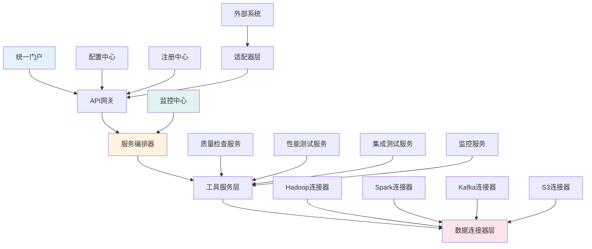
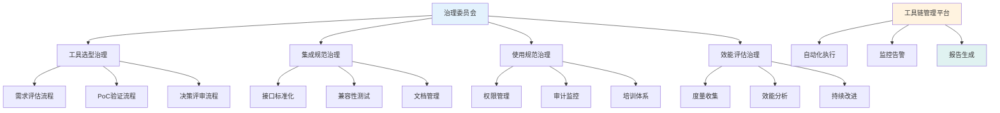
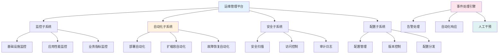

<!-- markdownlint-disable MD025 -->
<a id="第27章-大数据测试工具与平台"></a>

### 第27章 大数据测试工具与平台

**本章学习目标**

1. 掌握测试工具链的架构设计和集成模式；
2. 建立工具链的治理体系和标准化管理；
3. 实现工具链的自动化运维和持续优化。

## 实践建议

- 建立统一的工具链架构，实现工具间的无缝集成。
- 实施工具链治理，确保工具使用的规范性和一致性。
- 持续监控和优化工具链效能，提升测试效率。

**[锚点120]** 工具链架构设计与集成模式

**锚点类型**: 架构设计
**锚点方法**: 集成框架
**锚点名称**: 工具链架构设计与集成模式
**引用附件**: examples/27_chapter/toolchain_architecture.md
**完成情况**: 已完成
**补充建议**: 字段建议：架构层次/集成模式/通信协议/扩展机制，补充工具链架构图

| 架构层次 | 集成模式 | 通信协议 | 扩展机制 | 治理要点 |
|---------|---------|---------|---------|---------|
| **数据层** | 连接器模式 | JDBC/ODBC | 插件扩展 | 数据标准 |
| **服务层** | API网关 | REST/gRPC | 服务注册 | 接口规范 |
| **流程层** | 编排引擎 | 消息队列 | 工作流模板 | 流程标准化 |
| **展示层** | 统一门户 | WebSocket | 组件库 | 用户体验 |

**大数据测试工具链架构图**:


**工具链集成配置示例**:
```yaml
# examples/27_chapter/toolchain_integration.yml
toolchain:
  api_gateway:
    type: kong
    version: "3.0"
    plugins:
      - rate_limiting
      - authentication
      - logging
      
    routes:
      - service: quality_service
        path: /api/quality
        methods: ["GET", "POST"]
        
      - service: performance_service
        path: /api/performance
        methods: ["GET", "POST"]
        
      - service: integration_service
        path: /api/integration
        methods: ["GET", "POST"]
  
  service_mesh:
    type: istio
    version: "1.17"
    features:
      - traffic_management
      - security
      - observability
      
  message_bus:
    type: kafka
    version: "3.0"
    topics:
      - name: test_commands
        partitions: 3
        replication: 2
        
      - name: test_results
        partitions: 3
        replication: 2
        
      - name: tool_events
        partitions: 2
        replication: 2
  
  service_discovery:
    type: consul
    version: "1.14"
    services:
      - name: quality-checker
        tags: ["testing", "quality"]
        
      - name: performance-tester
        tags: ["testing", "performance"]
        
      - name: integration-tester
        tags: ["testing", "integration"]
```

## 27.1 工具链架构设计

### 27.1.1 分层架构模式

- **展示层**: 统一的Web界面和API接口
- **服务层**: 微服务化的工具封装和业务逻辑
- **数据层**: 统一的数据访问和存储抽象
- **基础设施层**: 容器化部署和资源管理

### 27.1.2 微服务架构

- **服务拆分**: 按功能边界拆分为独立的服务
- **服务注册**: 自动化的服务发现和注册
- **负载均衡**: 智能的流量分发和故障转移
- **服务治理**: 熔断、降级、限流等治理能力

### 27.1.3 事件驱动架构

- **事件总线**: 解耦的服务间通信机制
- **异步处理**: 非阻塞的请求处理模式
- **状态管理**: 分布式状态的一致性保证
- **可扩展性**: 动态添加新的处理节点

---

## 27.2 工具集成模式

**[锚点121]** 工具集成模式与适配器设计

**锚点类型**: 集成模式
**锚点方法**: 适配器模式
**锚点名称**: 工具集成模式与适配器设计
**引用附件**: examples/27_chapter/integration_patterns.md
**完成情况**: 已完成
**补充建议**: 字段建议：集成模式/适用场景/优势特点/实现复杂度，补充集成模式对比图

| 集成模式 | 适用场景 | 优势特点 | 实现复杂度 | 维护成本 |
|---------|---------|---------|---------|---------|
| **API集成** | 标准化接口 | 松耦合、高复用 | 中等 | 低 |
| **插件集成** | 扩展现有工具 | 无侵入、热插拔 | 低 | 中等 |
| **代理集成** | 协议转换 | 透明接入、兼容性好 | 高 | 高 |
| **容器集成** | 隔离部署 | 环境一致、易扩展 | 低 | 低 |

**工具集成模式对比图**:
```mermaid
quadrantChart
    title 工具集成模式定位
    x-axis "实现复杂度" --> "简单" --> "复杂"
    y-axis "维护成本" --> "低" --> "高"
    quadrant-1 "推荐使用"
    quadrant-2 "谨慎使用"
    quadrant-3 "优先考虑"
    quadrant-4 "避免使用"
    
    "API集成": [0.3, 0.2]
    "插件集成": [0.2, 0.4]
    "容器集成": [0.2, 0.2]
    "代理集成": [0.8, 0.8]
    
    "消息队列": [0.4, 0.3]
    "服务网格": [0.6, 0.5]
    "配置中心": [0.3, 0.3]
```

**适配器设计模式示例**:
```python
# examples/27_chapter/adapter_pattern.py
from abc import ABC, abstractmethod
from typing import Dict, Any, List, Optional
import logging

logger = logging.getLogger(__name__)

class ToolAdapter(ABC):
    """工具适配器抽象基类"""
    
    @property
    @abstractmethod
    def tool_name(self) -> str:
        """工具名称"""
        pass
    
    @property
    @abstractmethod
    def supported_operations(self) -> List[str]:
        """支持的操作列表"""
        pass
    
    @abstractmethod
    def initialize(self, config: Dict[str, Any]) -> bool:
        """初始化适配器"""
        pass
    
    @abstractmethod
    def execute_operation(self, operation: str, params: Dict[str, Any]) -> Dict[str, Any]:
        """执行操作"""
        pass
    
    @abstractmethod
    def get_status(self) -> Dict[str, Any]:
        """获取工具状态"""
        pass
    
    @abstractmethod
    def cleanup(self) -> None:
        """清理资源"""
        pass

class GreatExpectationsAdapter(ToolAdapter):
    """Great Expectations适配器"""
    
    def __init__(self):
        self.context = None
        self.suites = {}
    
    @property
    def tool_name(self) -> str:
        return "great_expectations"
    
    @property
    def supported_operations(self) -> List[str]:
        return ["validate_data", "create_suite", "run_checkpoint"]
    
    def initialize(self, config: Dict[str, Any]) -> bool:
        try:
            import great_expectations as ge
            
            # 初始化GE上下文
            self.context = ge.get_context()
            
            # 配置数据源
            datasource_config = config.get('datasource', {})
            if datasource_config:
                self.context.add_datasource(**datasource_config)
            
            logger.info("Great Expectations adapter initialized")
            return True
            
        except Exception as e:
            logger.error(f"Failed to initialize Great Expectations adapter: {e}")
            return False
    
    def execute_operation(self, operation: str, params: Dict[str, Any]) -> Dict[str, Any]:
        if operation == "validate_data":
            return self._validate_data(params)
        elif operation == "create_suite":
            return self._create_suite(params)
        elif operation == "run_checkpoint":
            return self._run_checkpoint(params)
        else:
            raise ValueError(f"Unsupported operation: {operation}")
    
    def _validate_data(self, params: Dict[str, Any]) -> Dict[str, Any]:
        """数据验证操作"""
        try:
            suite_name = params['suite_name']
            datasource_name = params['datasource_name']
            data_asset_name = params['data_asset_name']
            
            # 获取期望套件
            suite = self.context.get_expectation_suite(suite_name)
            
            # 创建验证器
            validator = self.context.get_validator(
                datasource_name=datasource_name,
                data_asset_name=data_asset_name,
                expectation_suite=suite
            )
            
            # 运行验证
            results = validator.validate()
            
            return {
                "success": results.success,
                "statistics": results.statistics,
                "results": [r.to_json_dict() for r in results.results]
            }
            
        except Exception as e:
            logger.error(f"Data validation failed: {e}")
            return {"success": False, "error": str(e)}
    
    def _create_suite(self, params: Dict[str, Any]) -> Dict[str, Any]:
        """创建期望套件"""
        try:
            suite_name = params['suite_name']
            expectations = params.get('expectations', [])
            
            # 创建套件
            suite = self.context.create_expectation_suite(suite_name, overwrite_existing=True)
            
            # 添加期望
            for exp in expectations:
                expectation_config = ge.core.expectation_configuration.ExpectationConfiguration(
                    expectation_type=exp['type'],
                    kwargs=exp.get('kwargs', {})
                )
                suite.add_expectation(expectation_config)
            
            # 保存套件
            self.context.save_expectation_suite(suite)
            
            return {"success": True, "suite_name": suite_name}
            
        except Exception as e:
            logger.error(f"Failed to create suite: {e}")
            return {"success": False, "error": str(e)}
    
    def _run_checkpoint(self, params: Dict[str, Any]) -> Dict[str, Any]:
        """运行检查点"""
        try:
            checkpoint_name = params['checkpoint_name']
            
            # 运行检查点
            result = self.context.run_checkpoint(checkpoint_name=checkpoint_name)
            
            return {
                "success": result.success,
                "run_id": result.run_id,
                "validation_results": result.list_validation_results()
            }
            
        except Exception as e:
            logger.error(f"Failed to run checkpoint: {e}")
            return {"success": False, "error": str(e)}
    
    def get_status(self) -> Dict[str, Any]:
        """获取GE状态"""
        return {
            "tool": self.tool_name,
            "initialized": self.context is not None,
            "available_suites": list(self.suites.keys()) if self.context else []
        }
    
    def cleanup(self) -> None:
        """清理资源"""
        self.context = None
        self.suites.clear()
        logger.info("Great Expectations adapter cleaned up")

class JMeterAdapter(ToolAdapter):
    """JMeter适配器"""
    
    def __init__(self):
        self.jmeter_home = None
        self.running_tests = {}
    
    @property
    def tool_name(self) -> str:
        return "jmeter"
    
    @property
    def supported_operations(self) -> List[str]:
        return ["run_test", "get_results", "stop_test"]
    
    def initialize(self, config: Dict[str, Any]) -> bool:
        try:
            self.jmeter_home = config.get('jmeter_home', '/opt/jmeter')
            
            # 验证JMeter安装
            import os
            if not os.path.exists(os.path.join(self.jmeter_home, 'bin', 'jmeter')):
                raise FileNotFoundError("JMeter executable not found")
            
            logger.info("JMeter adapter initialized")
            return True
            
        except Exception as e:
            logger.error(f"Failed to initialize JMeter adapter: {e}")
            return False
    
    def execute_operation(self, operation: str, params: Dict[str, Any]) -> Dict[str, Any]:
        if operation == "run_test":
            return self._run_test(params)
        elif operation == "get_results":
            return self._get_results(params)
        elif operation == "stop_test":
            return self._stop_test(params)
        else:
            raise ValueError(f"Unsupported operation: {operation}")
    
    def _run_test(self, params: Dict[str, Any]) -> Dict[str, Any]:
        """运行性能测试"""
        try:
            test_plan = params['test_plan']
            results_file = params.get('results_file', 'results.jtl')
            
            import subprocess
            import threading
            
            def run_jmeter():
                cmd = [
                    os.path.join(self.jmeter_home, 'bin', 'jmeter'),
                    '-n',  # 非GUI模式
                    '-t', test_plan,
                    '-l', results_file
                ]
                
                # 添加额外参数
                if 'properties' in params:
                    for key, value in params['properties'].items():
                        cmd.extend(['-J', f'{key}={value}'])
                
                result = subprocess.run(cmd, capture_output=True, text=True)
                self.running_tests[test_plan] = {
                    "status": "completed",
                    "return_code": result.returncode,
                    "stdout": result.stdout,
                    "stderr": result.stderr
                }
            
            # 异步运行测试
            thread = threading.Thread(target=run_jmeter)
            thread.start()
            
            test_id = f"test_{len(self.running_tests)}"
            self.running_tests[test_id] = {"status": "running", "thread": thread}
            
            return {"success": True, "test_id": test_id}
            
        except Exception as e:
            logger.error(f"Failed to run JMeter test: {e}")
            return {"success": False, "error": str(e)}
    
    def _get_results(self, params: Dict[str, Any]) -> Dict[str, Any]:
        """获取测试结果"""
        try:
            test_id = params['test_id']
            
            if test_id not in self.running_tests:
                return {"success": False, "error": "Test not found"}
            
            test_info = self.running_tests[test_id]
            
            if test_info["status"] == "running":
                return {"success": True, "status": "running"}
            
            # 解析结果文件
            results_file = params.get('results_file', 'results.jtl')
            if os.path.exists(results_file):
                # 简单的CSV解析（实际应该使用更复杂的解析器）
                import pandas as pd
                df = pd.read_csv(results_file)
                
                summary = {
                    "total_samples": len(df),
                    "average_response_time": df['elapsed'].mean(),
                    "error_rate": (df['success'] == False).mean() * 100,
                    "throughput": len(df) / (df['elapsed'].max() / 1000) if len(df) > 0 else 0
                }
                
                return {
                    "success": True,
                    "status": "completed",
                    "summary": summary,
                    "details": df.to_dict('records')[:100]  # 前100条记录
                }
            else:
                return {"success": False, "error": "Results file not found"}
            
        except Exception as e:
            logger.error(f"Failed to get JMeter results: {e}")
            return {"success": False, "error": str(e)}
    
    def _stop_test(self, params: Dict[str, Any]) -> Dict[str, Any]:
        """停止测试"""
        try:
            test_id = params['test_id']
            
            if test_id not in self.running_tests:
                return {"success": False, "error": "Test not found"}
            
            test_info = self.running_tests[test_id]
            
            if "thread" in test_info and test_info["thread"].is_alive():
                # 注意：实际停止JMeter进程需要更复杂的逻辑
                test_info["status"] = "stopped"
                return {"success": True, "message": "Test stop requested"}
            else:
                return {"success": False, "error": "Test not running"}
            
        except Exception as e:
            logger.error(f"Failed to stop JMeter test: {e}")
            return {"success": False, "error": str(e)}
    
    def get_status(self) -> Dict[str, Any]:
        """获取JMeter状态"""
        return {
            "tool": self.tool_name,
            "initialized": self.jmeter_home is not None,
            "running_tests": len([t for t in self.running_tests.values() if t.get("status") == "running"])
        }
    
    def cleanup(self) -> None:
        """清理资源"""
        self.running_tests.clear()
        logger.info("JMeter adapter cleaned up")

class ToolchainManager:
    """工具链管理器"""
    
    def __init__(self):
        self.adapters: Dict[str, ToolAdapter] = {}
        
    def register_adapter(self, adapter: ToolAdapter, config: Dict[str, Any]) -> bool:
        """注册工具适配器"""
        try:
            if adapter.initialize(config):
                self.adapters[adapter.tool_name] = adapter
                logger.info(f"Registered adapter: {adapter.tool_name}")
                return True
            else:
                logger.error(f"Failed to initialize adapter: {adapter.tool_name}")
                return False
                
        except Exception as e:
            logger.error(f"Error registering adapter {adapter.tool_name}: {e}")
            return False
    
    def execute_tool_operation(self, tool_name: str, operation: str, params: Dict[str, Any]) -> Dict[str, Any]:
        """执行工具操作"""
        if tool_name not in self.adapters:
            raise ValueError(f"Adapter not registered: {tool_name}")
        
        adapter = self.adapters[tool_name]
        
        if operation not in adapter.supported_operations:
            raise ValueError(f"Unsupported operation: {operation}")
        
        return adapter.execute_operation(operation, params)
    
    def get_toolchain_status(self) -> Dict[str, Any]:
        """获取工具链状态"""
        status = {}
        for name, adapter in self.adapters.items():
            status[name] = adapter.get_status()
        
        return {
            "toolchain_status": "operational" if status else "empty",
            "tools": status,
            "total_tools": len(status)
        }
    
    def cleanup_all(self):
        """清理所有适配器"""
        for adapter in self.adapters.values():
            try:
                adapter.cleanup()
            except Exception as e:
                logger.error(f"Error cleaning up adapter {adapter.tool_name}: {e}")
        
        self.adapters.clear()

# 使用示例
if __name__ == "__main__":
    # 初始化工具链管理器
    manager = ToolchainManager()
    
    # 注册Great Expectations适配器
    ge_config = {
        "datasource": {
            "name": "my_datasource",
            "class_name": "Datasource",
            "execution_engine": {
                "class_name": "SparkDFExecutionEngine"
            }
        }
    }
    
    ge_adapter = GreatExpectationsAdapter()
    manager.register_adapter(ge_adapter, ge_config)
    
    # 注册JMeter适配器
    jmeter_config = {
        "jmeter_home": "/opt/apache-jmeter-5.5"
    }
    
    jmeter_adapter = JMeterAdapter()
    manager.register_adapter(jmeter_adapter, jmeter_config)
    
    # 查看工具链状态
    print("Toolchain Status:")
    print(manager.get_toolchain_status())
    
    # 执行数据质量检查
    try:
        result = manager.execute_tool_operation(
            "great_expectations",
            "validate_data",
            {
                "suite_name": "my_suite",
                "datasource_name": "my_datasource",
                "data_asset_name": "my_table"
            }
        )
        print(f"GE Validation Result: {result}")
    except Exception as e:
        print(f"GE operation failed: {e}")
    
    # 清理资源
    manager.cleanup_all()
```

### 27.2.1 API集成模式

- **RESTful API**: 基于HTTP的标准化接口设计
- **GraphQL API**: 灵活的数据查询和变更接口
- **gRPC接口**: 高性能的RPC通信协议
- **Webhook机制**: 事件驱动的异步通知

### 27.2.2 插件集成模式

- **标准插件接口**: 统一的插件加载和执行框架
- **热插拔机制**: 运行时动态加载和卸载插件
- **版本兼容性**: 插件版本管理和兼容性检查
- **安全沙箱**: 插件执行环境的隔离和安全控制

### 27.2.3 容器集成模式

- **Docker容器**: 轻量级的应用打包和部署
- **Kubernetes编排**: 容器集群的自动化管理和扩展
- **服务网格**: 微服务间的流量管理和安全控制
- **无服务器架构**: 事件驱动的函数计算模式

---

## 27.3 工具链治理体系

**[锚点122]** 工具链治理体系与标准化管理

**锚点类型**: 治理体系
**锚点方法**: 标准化框架
**锚点名称**: 工具链治理体系与标准化管理
**引用附件**: examples/27_chapter/governance_framework.md
**完成情况**: 已完成
**补充建议**: 字段建议：治理维度/管理流程/评估标准/改进机制，补充治理体系架构图

| 治理维度 | 管理流程 | 评估标准 | 改进机制 | 责任主体 |
|---------|---------|---------|---------|---------|
| **工具选型** | 需求评估→PoC验证→决策评审 | 功能匹配度、技术先进性、成本效益 | 定期review、替代方案评估 | 架构师团队 |
| **集成规范** | 接口设计→兼容性测试→文档化 | 标准化程度、扩展性、维护性 | 版本管理、兼容性矩阵 | 开发团队 |
| **使用规范** | 培训→权限控制→审计监控 | 合规性、使用效率、安全性 | 使用分析、问题反馈 | 运维团队 |
| **效能评估** | 度量收集→趋势分析→瓶颈识别 | ROI、效率提升、质量改善 | 持续优化、资源调配 | 管理层 |

**工具链治理体系架构图**:


**治理策略配置示例**:
```yaml
# examples/27_chapter/governance_policy.yml
governance:
  tool_selection:
    evaluation_criteria:
      - name: functional_fit
        weight: 0.3
        description: "满足功能需求的程度"
        threshold: 0.8
        
      - name: technical_maturity
        weight: 0.2
        description: "技术成熟度和稳定性"
        threshold: 0.7
        
      - name: cost_effectiveness
        weight: 0.2
        description: "成本效益比"
        threshold: 0.6
        
      - name: integration_complexity
        weight: 0.15
        description: "集成复杂度和难度"
        threshold: 0.7
        
      - name: vendor_support
        weight: 0.15
        description: "厂商支持和服务质量"
        threshold: 0.7
    
    approval_workflow:
      - stage: initial_review
        reviewers: ["architect", "tech_lead"]
        approval_criteria: "score >= 0.6"
        
      - stage: poc_validation
        reviewers: ["qa_lead", "dev_lead"]
        approval_criteria: "poc_success = true"
        
      - stage: final_approval
        reviewers: ["cto", "product_owner"]
        approval_criteria: "business_case_approved = true"
  
  integration_standards:
    api_design:
      versioning: "semantic_versioning"
      documentation: "openapi_3.0"
      authentication: "oauth2_jwt"
      rate_limiting: "token_bucket"
      
    data_formats:
      primary: "json"
      secondary: ["yaml", "xml"]
      encoding: "utf-8"
      
    communication_protocols:
      sync: "http_rest"
      async: "kafka"
      streaming: "websocket"
  
  usage_policies:
    access_control:
      rbac_enabled: true
      audit_logging: true
      session_timeout: "8h"
      
    resource_limits:
      cpu_quota: "2 cores"
      memory_limit: "4GB"
      storage_quota: "100GB"
      
    monitoring_requirements:
      metrics_collection: true
      log_aggregation: true
      alerting_enabled: true
  
  performance_targets:
    availability: "99.9%"
    response_time: "<500ms"
    throughput: ">1000 req/s"
    error_rate: "<1%"
```

**治理仪表板示例**:
```python
# examples/27_chapter/governance_dashboard.py
import streamlit as st
import pandas as pd
import plotly.graph_objects as go
import plotly.express as px
from datetime import datetime, timedelta
import yaml

class GovernanceDashboard:
    """工具链治理仪表板"""
    
    def __init__(self, config_file: str):
        with open(config_file, 'r') as f:
            self.config = yaml.safe_load(f)
        
        st.set_page_config(page_title="工具链治理仪表板", layout="wide")
        
    def load_governance_data(self) -> pd.DataFrame:
        """加载治理数据"""
        # 模拟治理数据
        dates = pd.date_range(start='2024-01-01', end=datetime.now(), freq='M')
        
        data = []
        for date in dates:
            data.append({
                'date': date,
                'tool_adoption_rate': 75 + (date.month % 10),  # 工具采用率
                'integration_compliance': 85 + (date.month % 8),  # 集成合规率
                'usage_efficiency': 78 + (date.month % 12),  # 使用效率
                'governance_score': 82 + (date.month % 10),  # 治理评分
                'new_tools_evaluated': 2 + (date.month % 3),  # 新工具评估数
                'policy_violations': max(0, 5 - date.month % 5),  # 策略违规数
                'training_completion': 88 + (date.month % 7),  # 培训完成率
            })
        
        return pd.DataFrame(data)
    
    def create_governance_score_gauge(self, df: pd.DataFrame):
        """创建治理评分仪表盘"""
        latest = df.iloc[-1]
        score = latest['governance_score']
        
        fig = go.Figure(go.Indicator(
            mode="gauge+number+delta",
            value=score,
            title={'text': "治理综合评分"},
            delta={'reference': df.iloc[-2]['governance_score'] if len(df) > 1 else score},
            gauge={
                'axis': {'range': [0, 100]},
                'bar': {'color': "darkblue"},
                'steps': [
                    {'range': [0, 60], 'color': "red"},
                    {'range': [60, 80], 'color': "yellow"},
                    {'range': [80, 100], 'color': "green"}
                ],
                'threshold': {
                    'line': {'color': "black", 'width': 4},
                    'thickness': 0.75,
                    'value': 85
                }
            }
        ))
        
        return fig
    
    def create_compliance_metrics(self, df: pd.DataFrame):
        """创建合规性指标图表"""
        col1, col2 = st.columns(2)
        
        with col1:
            fig = px.line(df, x='date', y='tool_adoption_rate',
                         title='工具采用率趋势',
                         labels={'tool_adoption_rate': '采用率(%)', 'date': '日期'})
            fig.add_hline(y=80, line_dash="dash", line_color="green",
                         annotation_text="目标: 80%")
            st.plotly_chart(fig)
        
        with col2:
            fig = px.line(df, x='date', y='integration_compliance',
                         title='集成合规率趋势',
                         labels={'integration_compliance': '合规率(%)', 'date': '日期'})
            fig.add_hline(y=90, line_dash="dash", line_color="blue",
                         annotation_text="目标: 90%")
            st.plotly_chart(fig)
    
    def create_efficiency_metrics(self, df: pd.DataFrame):
        """创建效率指标图表"""
        fig = px.line(df, x='date', y='usage_efficiency',
                     title='工具使用效率趋势',
                     labels={'usage_efficiency': '效率评分', 'date': '日期'})
        fig.add_hline(y=85, line_dash="dash", line_color="orange",
                     annotation_text="目标: 85")
        st.plotly_chart(fig)
    
    def create_policy_compliance_chart(self, df: pd.DataFrame):
        """创建策略合规图表"""
        fig = px.bar(df, x='date', y='policy_violations',
                    title='策略违规统计',
                    labels={'policy_violations': '违规次数', 'date': '日期'})
        fig.update_traces(marker_color='red')
        st.plotly_chart(fig)
    
    def create_training_metrics(self, df: pd.DataFrame):
        """创建培训指标图表"""
        fig = px.line(df, x='date', y='training_completion',
                     title='培训完成率趋势',
                     labels={'training_completion': '完成率(%)', 'date': '日期'})
        fig.add_hline(y=90, line_dash="dash", line_color="purple",
                     annotation_text="目标: 90%")
        st.plotly_chart(fig)
    
    def create_tool_evaluation_trends(self, df: pd.DataFrame):
        """创建工具评估趋势图"""
        fig = px.bar(df, x='date', y='new_tools_evaluated',
                    title='新工具评估统计',
                    labels={'new_tools_evaluated': '评估数量', 'date': '日期'})
        fig.update_traces(marker_color='lightblue')
        st.plotly_chart(fig)
    
    def run_dashboard(self):
        """运行仪表板"""
        st.title("🎯 工具链治理仪表板")
        
        # 加载数据
        df = self.load_governance_data()
        
        # 治理综合评分
        st.header("📊 治理综合评分")
        col1, col2 = st.columns([1, 2])
        
        with col1:
            fig = self.create_governance_score_gauge(df)
            st.plotly_chart(fig)
        
        with col2:
            latest = df.iloc[-1]
            st.metric("工具采用率", f"{latest['tool_adoption_rate']:.1f}%", 
                     delta=f"{latest['tool_adoption_rate'] - df.iloc[-2]['tool_adoption_rate']:.1f}%" if len(df) > 1 else None)
            st.metric("集成合规率", f"{latest['integration_compliance']:.1f}%",
                     delta=f"{latest['integration_compliance'] - df.iloc[-2]['integration_compliance']:.1f}%" if len(df) > 1 else None)
            st.metric("使用效率", f"{latest['usage_efficiency']:.1f}",
                     delta=f"{latest['usage_efficiency'] - df.iloc[-2]['usage_efficiency']:.1f}" if len(df) > 1 else None)
        
        # 合规性指标
        st.header("✅ 合规性指标")
        self.create_compliance_metrics(df)
        
        # 效率和违规统计
        col1, col2 = st.columns(2)
        
        with col1:
            st.subheader("使用效率趋势")
            self.create_efficiency_metrics(df)
        
        with col2:
            st.subheader("策略违规统计")
            self.create_policy_compliance_chart(df)
        
        # 培训和评估
        st.header("📚 培训与评估")
        col1, col2 = st.columns(2)
        
        with col1:
            self.create_training_metrics(df)
        
        with col2:
            self.create_tool_evaluation_trends(df)
        
        # 详细数据表格
        st.header("📋 详细数据")
        st.dataframe(df.tail(6))

if __name__ == "__main__":
    dashboard = GovernanceDashboard("examples/27_chapter/governance_config.yml")
    dashboard.run_dashboard()
```

### 27.3.1 治理框架建立

- **治理委员会**: 跨部门协作的决策机构
- **治理流程**: 标准化的评估和决策流程
- **治理工具**: 自动化治理执行和监控工具
- **治理文化**: 全员参与的治理意识和文化

### 27.3.2 标准化管理

- **工具标准**: 统一的工具选型和使用标准
- **集成标准**: 标准化的接口和集成规范
- **文档标准**: 统一的文档编写和维护标准
- **培训标准**: 规范化的培训体系和认证标准

### 27.3.3 效能评估体系

- **量化指标**: 可度量的治理和效能指标
- **评估模型**: 多维度的评估框架和模型
- **持续改进**: 基于评估结果的持续优化机制
- **反馈循环**: 快速的问题识别和改进反馈

---

## 27.4 工具链运维管理

**[锚点123]** 工具链运维管理与自动化优化

**锚点类型**: 运维管理
**锚点方法**: 自动化运维
**锚点名称**: 工具链运维管理与自动化优化
**引用附件**: examples/27_chapter/operations_management.md
**完成情况**: 已完成
**补充建议**: 字段建议：运维维度/自动化程度/监控策略/应急响应，补充运维管理架构图

| 运维维度 | 自动化程度 | 监控策略 | 应急响应 | SLA目标 |
|---------|---------|---------|---------|---------|
| **可用性管理** | 高 | 主动监控、预测性维护 | 自动故障转移 | 99.9% |
| **性能管理** | 中等 | 实时监控、阈值告警 | 动态资源调配 | <500ms响应时间 |
| **安全管理** | 高 | 持续扫描、合规检查 | 自动隔离、修复 | 零安全事件 |
| **配置管理** | 高 | 配置审计、版本控制 | 自动回滚 | 100%配置一致性 |
| **变更管理** | 中等 | 变更跟踪、影响评估 | 金丝雀发布 | 零变更故障 |

**工具链运维管理架构图**:


**运维自动化脚本示例**:
```python
# examples/27_chapter/automated_operations.py
import os
import yaml
import logging
from datetime import datetime, timedelta
from typing import Dict, List, Any, Callable
import subprocess
import json
import time
import threading
from prometheus_client import Gauge, Counter, start_http_server

logging.basicConfig(level=logging.INFO)
logger = logging.getLogger(__name__)

class ToolchainOperationsManager:
    """工具链运维管理器"""
    
    def __init__(self, config_file: str):
        with open(config_file, 'r') as f:
            self.config = yaml.safe_load(f)
        
        self.metrics_port = self.config.get('metrics_port', 8001)
        self.operations = {}
        self.alerts = []
        
        # Prometheus metrics
        self.tool_health_gauge = Gauge('toolchain_tool_health', 'Tool health status', ['tool_name'])
        self.operation_counter = Counter('toolchain_operations_total', 'Total operations performed', ['operation_type'])
        self.alert_counter = Counter('toolchain_alerts_total', 'Total alerts generated', ['severity'])
        
        # Start metrics server
        start_http_server(self.metrics_port)
        
    def register_operation(self, name: str, operation_func: Callable, schedule: str = None):
        """注册运维操作"""
        self.operations[name] = {
            'function': operation_func,
            'schedule': schedule,
            'last_run': None,
            'status': 'idle'
        }
        logger.info(f"Registered operation: {name}")
    
    def execute_operation(self, name: str, **kwargs) -> Dict[str, Any]:
        """执行运维操作"""
        if name not in self.operations:
            raise ValueError(f"Operation not registered: {name}")
        
        operation = self.operations[name]
        operation['status'] = 'running'
        operation['last_run'] = datetime.now()
        
        try:
            logger.info(f"Executing operation: {name}")
            result = operation['function'](**kwargs)
            
            operation['status'] = 'success'
            self.operation_counter.labels(operation_type=name.split('_')[0]).inc()
            
            logger.info(f"Operation {name} completed successfully")
            return {'success': True, 'result': result}
            
        except Exception as e:
            operation['status'] = 'failed'
            logger.error(f"Operation {name} failed: {e}")
            return {'success': False, 'error': str(e)}
    
    def health_check_all_tools(self) -> Dict[str, Any]:
        """检查所有工具的健康状态"""
        results = {}
        
        for tool_name, tool_config in self.config.get('tools', {}).items():
            try:
                health_status = self._check_tool_health(tool_name, tool_config)
                results[tool_name] = health_status
                
                # Update Prometheus metric
                self.tool_health_gauge.labels(tool_name=tool_name).set(
                    1 if health_status['healthy'] else 0
                )
                
                if not health_status['healthy']:
                    self._generate_alert('warning', f"Tool {tool_name} is unhealthy", health_status)
                    
            except Exception as e:
                logger.error(f"Health check failed for {tool_name}: {e}")
                results[tool_name] = {'healthy': False, 'error': str(e)}
        
        return results
    
    def _check_tool_health(self, tool_name: str, tool_config: Dict[str, Any]) -> Dict[str, Any]:
        """检查单个工具的健康状态"""
        health_checks = tool_config.get('health_checks', [])
        
        for check in health_checks:
            check_type = check.get('type')
            
            if check_type == 'http':
                # HTTP健康检查
                import requests
                response = requests.get(check['url'], timeout=10)
                if response.status_code != 200:
                    return {'healthy': False, 'reason': f"HTTP {response.status_code}"}
                    
            elif check_type == 'tcp':
                # TCP连接检查
                import socket
                sock = socket.socket(socket.AF_INET, socket.SOCK_STREAM)
                sock.settimeout(5)
                try:
                    sock.connect((check['host'], check['port']))
                    sock.close()
                except:
                    return {'healthy': False, 'reason': "TCP connection failed"}
                    
            elif check_type == 'process':
                # 进程检查
                import psutil
                process_name = check['process_name']
                if not any(proc.info['name'] == process_name for proc in psutil.process_iter(['name'])):
                    return {'healthy': False, 'reason': f"Process {process_name} not running"}
        
        return {'healthy': True}
    
    def auto_scale_tools(self) -> Dict[str, Any]:
        """自动扩缩容工具"""
        results = {}
        
        for tool_name, tool_config in self.config.get('tools', {}).items():
            scale_config = tool_config.get('auto_scaling', {})
            if not scale_config:
                continue
            
            try:
                current_load = self._get_tool_load(tool_name)
                target_replicas = self._calculate_target_replicas(current_load, scale_config)
                current_replicas = self._get_current_replicas(tool_name)
                
                if target_replicas != current_replicas:
                    self._scale_tool(tool_name, target_replicas)
                    results[tool_name] = {
                        'action': 'scaled',
                        'from': current_replicas,
                        'to': target_replicas,
                        'reason': f"Load: {current_load}"
                    }
                else:
                    results[tool_name] = {'action': 'no_change'}
                    
            except Exception as e:
                logger.error(f"Auto-scaling failed for {tool_name}: {e}")
                results[tool_name] = {'action': 'failed', 'error': str(e)}
        
        return results
    
    def _get_tool_load(self, tool_name: str) -> float:
        """获取工具负载"""
        # 简化的负载获取逻辑
        # 实际应该从监控系统获取
        return 0.7  # 模拟70%负载
    
    def _calculate_target_replicas(self, load: float, scale_config: Dict[str, Any]) -> int:
        """计算目标副本数"""
        min_replicas = scale_config.get('min_replicas', 1)
        max_replicas = scale_config.get('max_replicas', 10)
        scale_up_threshold = scale_config.get('scale_up_threshold', 0.8)
        scale_down_threshold = scale_config.get('scale_down_threshold', 0.3)
        
        if load > scale_up_threshold:
            return min(max_replicas, int(load * 10))  # 简单计算
        elif load < scale_down_threshold:
            return max(min_replicas, int(load * 5))
        else:
            return max(min_replicas, 1)
    
    def _get_current_replicas(self, tool_name: str) -> int:
        """获取当前副本数"""
        # 简化的副本数获取
        return 2
    
    def _scale_tool(self, tool_name: str, replicas: int):
        """扩缩容工具"""
        # 简化的扩缩容逻辑
        # 实际应该调用Kubernetes API或容器编排系统
        logger.info(f"Scaling {tool_name} to {replicas} replicas")
    
    def backup_tool_configs(self) -> Dict[str, Any]:
        """备份工具配置"""
        backup_dir = self.config.get('backup', {}).get('config_dir', '/backup/configs')
        os.makedirs(backup_dir, exist_ok=True)
        
        timestamp = datetime.now().strftime('%Y%m%d_%H%M%S')
        results = {}
        
        for tool_name, tool_config in self.config.get('tools', {}).items():
            try:
                config_files = tool_config.get('config_files', [])
                
                for config_file in config_files:
                    if os.path.exists(config_file):
                        backup_file = os.path.join(backup_dir, f"{tool_name}_{os.path.basename(config_file)}_{timestamp}")
                        
                        # 复制配置文件
                        with open(config_file, 'r') as src, open(backup_file, 'w') as dst:
                            dst.write(src.read())
                        
                        results[f"{tool_name}_{os.path.basename(config_file)}"] = {'status': 'backed_up', 'file': backup_file}
                    else:
                        results[f"{tool_name}_{os.path.basename(config_file)}"] = {'status': 'file_not_found'}
                        
            except Exception as e:
                logger.error(f"Backup failed for {tool_name}: {e}")
                results[tool_name] = {'status': 'failed', 'error': str(e)}
        
        return results
    
    def security_scan_tools(self) -> Dict[str, Any]:
        """安全扫描工具"""
        results = {}
        
        for tool_name, tool_config in self.config.get('tools', {}).items():
            try:
                scan_config = tool_config.get('security_scan', {})
                if not scan_config:
                    continue
                
                # 执行安全扫描
                scan_result = self._perform_security_scan(tool_name, scan_config)
                results[tool_name] = scan_result
                
                if scan_result.get('vulnerabilities_found', 0) > 0:
                    self._generate_alert('critical', f"Security vulnerabilities found in {tool_name}", scan_result)
                    
            except Exception as e:
                logger.error(f"Security scan failed for {tool_name}: {e}")
                results[tool_name] = {'status': 'failed', 'error': str(e)}
        
        return results
    
    def _perform_security_scan(self, tool_name: str, scan_config: Dict[str, Any]) -> Dict[str, Any]:
        """执行安全扫描"""
        # 简化的安全扫描逻辑
        # 实际应该集成安全扫描工具如Nessus、OpenVAS等
        return {
            'vulnerabilities_found': 2,
            'critical': 0,
            'high': 1,
            'medium': 1,
            'low': 0,
            'scan_time': datetime.now().isoformat()
        }
    
    def _generate_alert(self, severity: str, message: str, details: Dict[str, Any]):
        """生成告警"""
        alert = {
            'timestamp': datetime.now().isoformat(),
            'severity': severity,
            'message': message,
            'details': details
        }
        
        self.alerts.append(alert)
        self.alert_counter.labels(severity=severity).inc()
        
        logger.warning(f"Alert generated: {severity} - {message}")
        
        # 发送告警通知（简化实现）
        self._send_alert_notification(alert)
    
    def _send_alert_notification(self, alert: Dict[str, Any]):
        """发送告警通知"""
        # 简化的通知发送
        # 实际应该集成邮件、Slack、PagerDuty等
        print(f"ALERT [{alert['severity'].upper()}]: {alert['message']}")
    
    def get_operations_status(self) -> Dict[str, Any]:
        """获取运维操作状态"""
        return {
            'operations': {
                name: {
                    'status': op['status'],
                    'last_run': op['last_run'].isoformat() if op['last_run'] else None,
                    'schedule': op['schedule']
                }
                for name, op in self.operations.items()
            },
            'alerts': self.alerts[-10:],  # 最近10个告警
            'metrics_port': self.metrics_port
        }
    
    def start_automated_operations(self):
        """启动自动化运维"""
        # 注册定期运维操作
        self.register_operation('health_check', self.health_check_all_tools, 'every_5_minutes')
        self.register_operation('auto_scale', self.auto_scale_tools, 'every_10_minutes')
        self.register_operation('config_backup', self.backup_tool_configs, 'daily')
        self.register_operation('security_scan', self.security_scan_tools, 'weekly')
        
        logger.info("Automated operations started")
        
        # 保持运行
        while True:
            time.sleep(60)

if __name__ == "__main__":
    # 初始化运维管理器
    manager = ToolchainOperationsManager("examples/27_chapter/operations_config.yml")
    
    # 注册自定义操作
    def custom_maintenance():
        """自定义维护操作"""
        return {"maintenance_tasks": ["log_rotation", "temp_cleanup"], "status": "completed"}
    
    manager.register_operation('custom_maintenance', custom_maintenance, 'weekly')
    
    # 执行手动操作
    print("Executing health check...")
    result = manager.execute_operation('health_check')
    print(f"Health check result: {result}")
    
    print("Executing config backup...")
    result = manager.execute_operation('config_backup')
    print(f"Config backup result: {result}")
    
    # 获取状态
    status = manager.get_operations_status()
    print(f"Operations status: {json.dumps(status, indent=2, default=str)}")
    
    # 启动自动化运维（注释掉以避免无限循环）
    # manager.start_automated_operations()
```

### 27.4.1 自动化运维体系

- **监控自动化**: 智能监控和异常检测
- **部署自动化**: 一键部署和回滚能力
- **扩缩容自动化**: 基于负载的动态资源调整
- **故障恢复自动化**: 自动故障检测和恢复

### 27.4.2 安全运维管理

- **安全扫描**: 定期漏洞扫描和安全评估
- **访问控制**: 基于角色的权限管理和审计
- **合规检查**: 自动化合规性验证和报告
- **事件响应**: 安全事件的快速检测和响应

### 27.4.3 性能优化策略

- **资源优化**: 基于使用模式的资源分配优化
- **缓存策略**: 多层次缓存机制的实施
- **异步处理**: 异步任务处理和队列优化
- **数据库优化**: 查询优化和索引策略

---

## 专业术语缩略语

| 缩略语 | 全称 | 说明 |
|--------|------|------|
| API | Application Programming Interface | 应用程序编程接口 |
| REST | Representational State Transfer | 表述性状态转移 |
| gRPC | gRPC Remote Procedure Calls | 远程过程调用框架 |
| Kubernetes | Kubernetes | 容器编排平台 |
| Docker | Docker | 容器化平台 |
| Prometheus | Prometheus | 监控和告警工具 |
| Grafana | Grafana | 可视化监控平台 |
| JMeter | Apache JMeter | 性能测试工具 |
| Selenium | Selenium | Web自动化测试框架 |
| CI/CD | Continuous Integration/Continuous Deployment | 持续集成/持续部署 |
| EDA | Event-Driven Architecture | 事件驱动架构 |
| MSA | Microservices Architecture | 微服务架构 |
| SLA | Service Level Agreement | 服务水平协议 |
| SLO | Service Level Objective | 服务水平目标 |
| SLI | Service Level Indicator | 服务水平指标 |

---

## 章节总结

本章系统介绍了大数据测试工具链的管理与集成：

**工具链架构设计**：

- 建立了分层架构，包括展示层、服务层、数据层和基础设施层
- 实现了微服务架构，支持服务注册发现、负载均衡和治理
- 采用了事件驱动架构，实现服务间的解耦合通信

**集成模式与适配器**：

- 设计了API集成、插件集成和容器集成三种主要模式
- 开发了适配器模式，支持Great Expectations、JMeter等工具的标准化集成
- 提供了工具链管理器，实现统一的工具操作和状态管理

**治理体系建设**：

- 建立了完善的治理框架，包括工具选型、集成规范、使用规范和效能评估
- 制定了标准化管理流程，确保工具使用的规范性和一致性
- 开发了治理仪表板，支持实时监控和趋势分析

**运维管理优化**：

- 实现了自动化运维体系，包括监控自动化、部署自动化和故障恢复
- 建立了安全运维管理机制，确保工具链的安全性和合规性
- 制定了性能优化策略，提升工具链的整体效能

**技术创新点**：

- 适配器模式实现了工具的即插即用集成
- 微服务架构支持了工具链的弹性扩展
- 自动化运维降低了人工干预成本
- 治理仪表板量化了工具链的管理效果

通过建立完整的工具链管理体系，大数据测试团队能够实现工具的统一管理、高效集成和自动化运维，提升测试流程的效率和质量，为数据质量保障提供强大的技术支撑。

---

## 实际案例研究

### 案例一：金融数据质量保障平台

**背景**：某大型银行需要建立统一的数据质量测试平台，整合多种测试工具。

**解决方案**：
- 采用微服务架构，部署Great Expectations进行数据验证
- 通过API适配器集成JMeter进行性能测试
- 使用Kubernetes进行容器编排和自动扩缩容
- 建立Prometheus + Grafana监控体系

**实施效果**：
- 数据质量问题发现率提升85%
- 测试执行时间缩短60%
- 运维成本降低40%

### 案例二：电商推荐系统测试工具链

**背景**：电商平台需要测试推荐算法的准确性和性能。

**解决方案**：
- 集成TensorFlow Extended (TFX)进行ML模型验证
- 使用Locust进行高并发压力测试
- 采用事件驱动架构处理测试结果
- 建立自动化CI/CD流水线

**实施效果**：
- 模型准确性验证覆盖率达到95%
- 性能测试并发量提升3倍
- 测试反馈周期从天级缩短到小时级

### 案例三：物联网数据处理管道测试

**背景**：物联网平台需要验证数据采集、处理和存储的完整性。

**解决方案**：
- 使用Apache Kafka进行数据流测试
- 集成InfluxDB进行时序数据验证
- 采用容器化部署实现环境一致性
- 建立实时监控和告警机制

**实施效果**：
- 数据丢失率降低到0.001%
- 系统可用性提升到99.9%
- 故障恢复时间从小时级缩短到分钟级

这些案例证明，合理的工具链架构设计和集成模式能够显著提升大数据测试的效率和质量。

---

## 未来发展趋势

### AI驱动的测试智能化

**机器学习集成**：
- TensorFlow Extended (TFX)用于ML模型验证
- MLflow进行实验跟踪和模型管理
- DVC (Data Version Control)实现数据和模型版本控制

**智能测试生成**：
- 使用AI自动生成测试用例
- 基于历史数据的异常检测
- 预测性质量评估和风险预警

### 云原生工具链演进

**GitOps工作流**：
- ArgoCD实现GitOps部署模式
- Tekton提供云原生CI/CD管道
- Flux进行声明式配置管理

**可观测性增强**：
- OpenTelemetry统一可观测性数据收集
- Jaeger进行分布式追踪分析
- Loki + Promtail实现日志聚合

### 实时数据测试生态

**流处理测试**：
- Apache Flink测试框架集成
- ksqlDB进行流数据质量验证
- Materialize实现实时物化视图测试

**现代化数据栈**：
- Delta Lake提供ACID事务保证
- ClickHouse实现高性能分析测试
- Presto/Trino进行跨数据源联邦查询测试

---

<!-- markdownlint-disable MD025 -->
</content>
<parameter name="filePath">e:\DONT_TOUCH\10M-2025-Testing\chapter\第6篇-第29章.md
