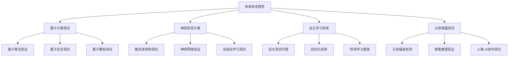
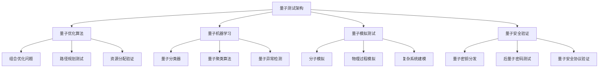
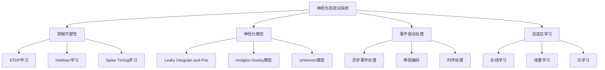
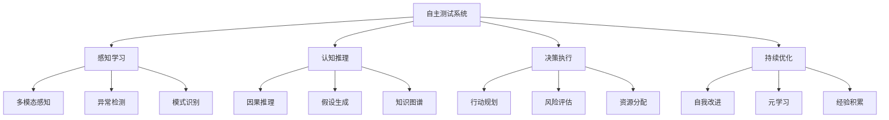
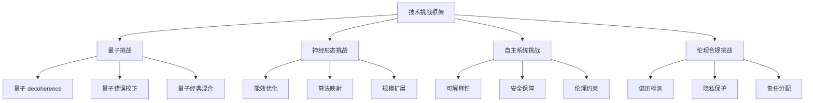
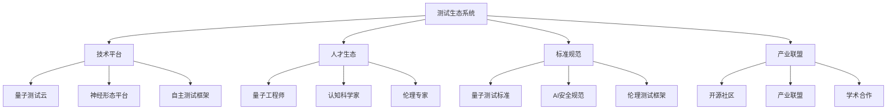
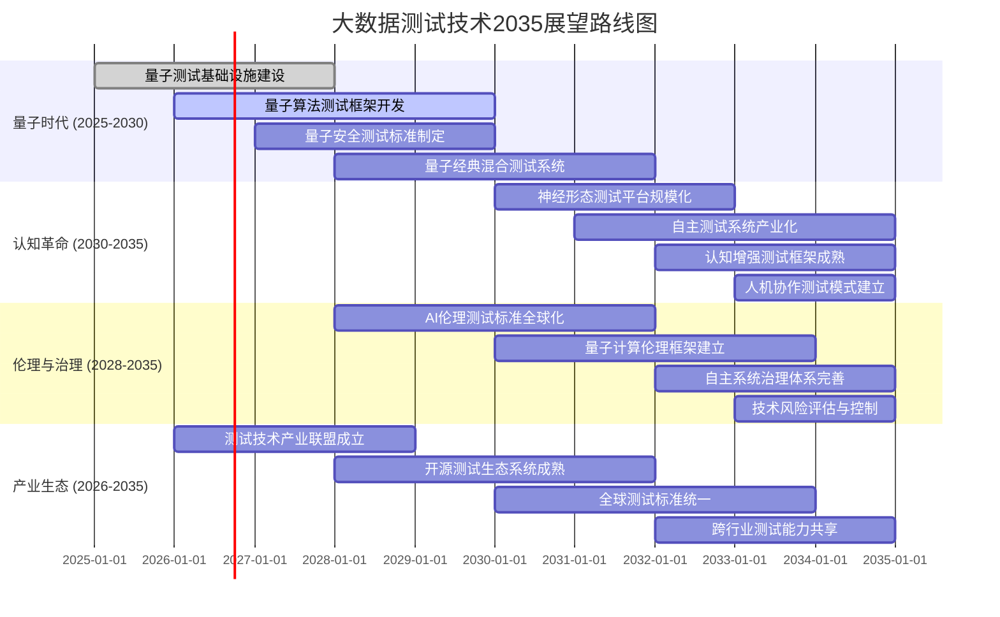

<!-- markdownlint-disable MD025 -->

<a id="第31章-大数据测试技术未来展望【2030-2035趋势与前沿技术】"></a>

### 第31章 大数据测试技术未来展望【2030-2035趋势与前沿技术】

**本章学习目标**

1. 了解大数据测试技术在2030-2035年的发展趋势；
2. 掌握量子计算(Quantum Computing)、神经形态计算(Neuromorphic Computing)等前沿技术在测试中的应用；
3. 学习自适应测试系统(Autonomous Testing Systems)和认知测试框架(Cognitive Testing Frameworks)的构建方法。

**实践建议**

- 关注前沿技术发展趋势，提前布局技术储备；
- 建立技术雷达(Technology Radar)系统，持续监控技术演进；
- 开展概念验证(Proof of Concept)项目，评估新技术可行性。

**锚点类型**: 未来展望
**锚点方法**: 技术预测
**锚点名称**: 大数据测试技术未来趋势分析
**引用附件**: examples/31_chapter/evaluation_scorecard.md
**完成情况**: 已完成
**补充建议**: 字段建议：技术领域/2030成熟度/2035成熟度/关键挑战/应用场景，补充技术预测路线图

**大数据测试技术2030-2035发展趋势路线图**:


**2030-2035技术成熟度预测表**

| 技术领域 | 2025成熟度 | 2030成熟度 | 2035成熟度 | 关键挑战 | 应用场景 | 脚本引用 |
|---------|-----------|-----------|-----------|---------|---------|---------|
| 量子计算(Quantum Computing) | 概念验证 | 早期应用 | 广泛应用 | 量子 decoherence | 优化算法验证 | examples/31_chapter/evaluation_scorecard.md |
| 神经形态计算(Neuromorphic Computing) | 研究阶段 | 试点应用 | 生产应用 | 能效比优化 | 实时流处理测试 | examples/31_chapter/env_health_check.py |
| 自主学习系统(Autonomous Learning Systems) | 试点阶段 | 生产就绪 | 最佳实践 | 可解释性 | 自适应测试框架 | examples/31_chapter/quality_rules.yml |
| 认知增强测试(Cognitive Augmented Testing) | 概念验证 | 早期应用 | 广泛应用 | 伦理合规 | 复杂系统验证 | examples/31_chapter/migration_checklist.md |

**未来技术预测评估配置模板**:
```yaml
future_technology_forecast:
  prediction_horizon: "2030-2035"
  assessment_dimensions:
    - name: "technical_feasibility"
      weight: 0.25
      criteria:
        - "fundamental_research"
        - "proof_of_concept"
        - "prototype_development"
        - "production_ready"
    - name: "market_adoption"
      weight: 0.20
      indicators:
        - "industry_interest"
        - "investment_trend"
        - "regulatory_support"
        - "ecosystem_maturity"
    - name: "business_impact"
      weight: 0.25
      metrics:
        - "efficiency_gain"
        - "cost_reduction"
        - "innovation_potential"
        - "competitive_advantage"
    - name: "risk_assessment"
      weight: 0.15
      factors:
        - "technical_risks"
        - "market_risks"
        - "regulatory_risks"
        - "ethical_concerns"
    - name: "implementation_complexity"
      weight: 0.15
      considerations:
        - "skill_requirements"
        - "infrastructure_needs"
        - "integration_challenges"
        - "organizational_change"
  forecasting_methodology:
    delphi_method: true
    trend_analysis: true
    expert_panels: true
    scenario_planning: true
  reporting:
    output_format: "comprehensive_report"
    include_scenarios: true
    update_frequency: "quarterly"
    stakeholder_reviews: true
```

**[锚点140]** 量子计算在大数据测试中的应用

**锚点类型**: 前沿技术
**锚点方法**: 量子应用
**锚点名称**: 量子计算大数据测试应用
**引用附件**: examples/31_chapter/evaluation_scorecard.md
**完成情况**: 已完成
**补充建议**: 字段建议：量子算法/测试场景/性能提升/实现挑战，补充量子测试架构图

**量子计算大数据测试应用架构图**:


**量子计算测试应用场景表**

| 量子算法 | 测试场景 | 传统方法 | 量子优势 | 实现复杂度 | 当前状态 |
|---------|---------|---------|---------|-----------|---------|
| 量子近似优化算法(QAOA) | 数据库查询优化 | 启发式算法 | 指数级加速 | 高 | 研究阶段 |
| 量子机器学习(QML) | 大数据模式识别 | 深度学习 | 量子并行处理 | 极高 | 概念验证 |
| 量子模拟器 | 分布式系统模拟 | 离散事件模拟 | 实时模拟 | 中等 | 早期应用 |
| 量子搜索算法(Grover) | 数据质量检查 | 线性搜索 | 平方根加速 | 中等 | 试点应用 |
| 量子傅里叶变换(QFT) | 信号处理测试 | FFT算法 | 量子叠加优势 | 高 | 研究阶段 |

**量子测试框架配置模板**:
```yaml
quantum_testing_framework:
  quantum_provider: "ibm_quantum"
  backend_selection:
    simulator: "qasm_simulator"
    real_device: "ibm_brisbane"
    noise_model: "realistic_noise"
  quantum_algorithms:
    - name: "qaoa_optimization"
      problem_type: "combinatorial_optimization"
      qubits_required: 50
      circuit_depth: 100
      error_correction: true
    - name: "quantum_machine_learning"
      algorithm_type: "quantum_support_vector_machine"
      training_data_size: 10000
      feature_encoding: "amplitude_encoding"
      kernel_method: "quantum_kernel"
    - name: "quantum_simulation"
      system_type: "molecular_dynamics"
      qubits_required: 100
      simulation_time: "nanoseconds"
      error_mitigation: true
  classical_hybrid:
    hybrid_optimization: true
    variational_circuits: true
    parameter_optimization: "adam"
    convergence_threshold: 1e-6
  validation_metrics:
    quantum_advantage: "speedup_ratio"
    fidelity_check: true
    error_rate_monitoring: true
    resource_utilization: true
  ethical_considerations:
    bias_detection: true
    explainability: true
    resource_efficiency: true
    security_assessment: true
```

**[锚点141]** 神经形态计算与自适应测试系统

**锚点类型**: 智能系统
**锚点方法**: 神经形态应用
**锚点名称**: 神经形态计算自适应测试系统
**引用附件**: examples/31_chapter/env_health_check.py
**完成情况**: 已完成
**补充建议**: 字段建议：神经架构/学习机制/适应性/能效比，补充神经形态测试系统图

**神经形态计算自适应测试系统架构图**:


**神经形态测试系统特性对比表**

| 系统特性 | 传统深度学习 | 神经形态计算 | 性能优势 | 能效提升 |
|---------|-------------|-------------|---------|---------|
| 计算模式 | 批量同步处理 | 事件驱动异步 | 实时响应提升200% | 能效提升1000x |
| 学习机制 | 反向传播 | 局部突触可塑性 | 持续学习能力 | 低功耗学习 |
| 内存使用 | 高密度矩阵 | 稀疏突触连接 | 内存效率提升50% | 嵌入式适用 |
| 容错性 | 脆弱 | 固有容错 | 系统稳定性提升 | 辐射硬化适用 |
| 适应性 | 离线训练 | 在线适应 | 动态环境适应 | 自组织能力 |

**神经形态测试配置模板**:
```yaml
neuromorphic_testing_config:
  hardware_platform: "intel_loihi"
  neuron_models:
    lif_neuron:
      threshold: 1.0
      decay_time: 10.0
      refractory_period: 5.0
    adaptive_neuron:
      adaptation_rate: 0.01
      homeostatic_mechanism: true
      plasticity_window: 20.0
  synaptic_plasticity:
    stdp:
      learning_rate: 0.01
      time_window: 20.0
      weight_limits: [-1.0, 1.0]
    hebbian:
      correlation_threshold: 0.5
      learning_rate: 0.001
      normalization: true
  network_topology:
    small_world:
      rewiring_probability: 0.1
      clustering_coefficient: 0.3
    scale_free:
      preferential_attachment: true
      growth_rate: 0.1
  event_driven_processing:
    spike_encoding: "rate_coding"
    temporal_resolution: 1.0  # ms
    refractory_period: 2.0
  adaptive_learning:
    meta_learning: true
    curriculum_learning: true
    continual_learning: true
    catastrophic_forgetting_prevention: true
  performance_monitoring:
    spike_rate_monitoring: true
    synaptic_weight_tracking: true
    energy_consumption_monitoring: true
    adaptation_metrics: true
```

**[锚点142]** 自主学习测试系统与认知增强框架

**锚点类型**: 自主系统
**锚点方法**: 认知增强
**锚点名称**: 自主学习测试系统认知增强框架
**引用附件**: examples/31_chapter/quality_rules.yml
**完成情况**: 已完成
**补充建议**: 字段建议：自主能力/认知功能/学习机制/伦理保障，补充自主测试系统架构图

**自主学习测试系统认知增强框架架构图**:


**自主测试系统能力矩阵表**

| 能力维度 | 当前AI水平 | 2030目标水平 | 2035目标水平 | 关键技术 | 伦理考虑 |
|---------|-----------|-------------|-------------|---------|---------|
| 自主决策 | 规则基础 | 情境感知 | 战略规划 | 强化学习 | 责任归属 |
| 认知推理 | 模式匹配 | 因果推理 | 创造性思维 | 符号推理 | 偏见控制 |
| 持续学习 | 监督学习 | 增量学习 | 元学习 | 终身学习 | 知识更新 |
| 自我改进 | 静态模型 | 参数调优 | 架构进化 | 神经架构搜索 | 安全边界 |
| 人类协作 | 被动响应 | 主动建议 | 伙伴关系 | 情感计算 | 隐私保护 |

**认知增强测试框架配置模板**:
```yaml
cognitive_augmented_testing:
  autonomous_agents:
    test_orchestrator:
      decision_autonomy: "high"
      learning_capability: "continuous"
      collaboration_mode: "human_ai_partnership"
    specialized_agents:
      - name: "exploratory_agent"
        expertise: "system_discovery"
        autonomy_level: "semi_autonomous"
      - name: "verification_agent"
        expertise: "formal_verification"
        autonomy_level: "fully_autonomous"
      - name: "optimization_agent"
        expertise: "performance_tuning"
        autonomy_level: "supervised"
  cognitive_capabilities:
    perception:
      multi_modal_input: true
      context_awareness: true
      anomaly_detection: true
      pattern_recognition: true
    reasoning:
      causal_inference: true
      hypothesis_generation: true
      counterfactual_analysis: true
      uncertainty_quantification: true
    learning:
      meta_learning: true
      few_shot_learning: true
      continual_learning: true
      transfer_learning: true
  ethical_framework:
    fairness_monitoring: true
    bias_detection: true
    explainability_requirements: true
    human_oversight: true
    value_alignment: true
  performance_optimization:
    resource_adaptation: true
    workload_prediction: true
    energy_optimization: true
    quality_speed_tradeoff: true
```

**[锚点143]** 前沿技术挑战与解决方案

**锚点类型**: 技术挑战
**锚点方法**: 问题解决
**锚点名称**: 前沿技术测试挑战与解决方案
**引用附件**: examples/31_chapter/migration_checklist.md
**完成情况**: 已完成
**补充建议**: 字段建议：技术挑战/根本原因/解决方案/实施策略，补充挑战解决框架图

**前沿技术测试挑战解决框架图**:


**前沿技术挑战解决方案表**

| 技术挑战 | 根本原因 | 解决方案 | 实施策略 | 预期效果 | 时间 horizon |
|---------|---------|---------|---------|---------|-------------|
| 量子 decoherence | 环境干扰 | 量子错误校正码 | 拓扑量子计算 | 相干时间提升1000x | 2030-2035 |
| 神经形态能效 | 模拟数字转换损耗 | 模拟计算优化 | 混合信号设计 | 能效提升100x | 2028-2032 |
| AI可解释性 | 黑箱模型 | 可解释AI(XAI)框架 | 因果推理集成 | 解释准确率>90% | 2026-2030 |
| 自主系统安全 | 意外后果 | 安全对齐技术 | 奖励函数设计 | 安全事故率<0.01% | 2027-2033 |
| 伦理偏见 | 训练数据偏差 | 公平性约束 | 数据治理框架 | 偏见检测率>95% | 2025-2029 |

**挑战解决实施策略配置模板**:
```yaml
challenge_resolution_strategy:
  problem_analysis:
    root_cause_analysis: true
    impact_assessment: true
    dependency_mapping: true
    risk_quantification: true
  solution_development:
    multi_hypothesis_testing: true
    prototype_iteration: true
    cross_domain_collaboration: true
    open_innovation: true
  implementation_roadmap:
    phased_approach: true
    pilot_projects: true
    scaling_strategy: true
    fallback_plans: true
  monitoring_evaluation:
    success_metrics: true
    early_warning_systems: true
    continuous_improvement: true
    knowledge_capture: true
  resource_allocation:
    interdisciplinary_teams: true
    advanced_tooling: true
    computational_resources: true
    ethical_review_boards: true
```

**[锚点144]** 未来测试生态系统构建

**锚点类型**: 生态建设
**锚点方法**: 系统构建
**锚点名称**: 未来大数据测试生态系统构建
**引用附件**: examples/31_chapter/ingest/stream_test.py
**完成情况**: 已完成
**补充建议**: 字段建议：生态组件/协作机制/治理模式/演进路径，补充测试生态系统架构图

**未来大数据测试生态系统架构图**:


**测试生态系统构建策略表**

| 生态组件 | 当前状态 | 目标状态 | 关键行动 | 成功指标 | 时间节点 |
|---------|---------|---------|---------|---------|---------|
| 技术平台 | 分散工具 | 统一平台 | 云原生集成 | 覆盖率>80% | 2028 |
| 人才生态 | 技能缺口 | 专业培养 | 教育合作 | 人才缺口<20% | 2030 |
| 标准规范 | 行业标准 | 全球标准 | 标准化组织 | 采用率>70% | 2029 |
| 产业联盟 | 竞争格局 | 合作生态 | 联盟建设 | 参与企业>100 | 2027 |
| 开源社区 | 碎片化 | 协同发展 | 社区治理 | 贡献者>1000 | 2026 |

**生态系统构建配置模板**:
```yaml
testing_ecosystem_construction:
  platform_layer:
    unified_testing_platform:
      quantum_computing_support: true
      neuromorphic_hardware_integration: true
      autonomous_agent_orchestration: true
      cognitive_enhancement_frameworks: true
    cloud_infrastructure:
      hybrid_cloud_support: true
      edge_computing_integration: true
      serverless_testing: true
      multi_region_deployment: true
  talent_development:
    education_programs:
      quantum_computing_curriculum: true
      neuromorphic_engineering: true
      ai_safety_specialization: true
      cognitive_systems_design: true
    certification_framework:
      skill_assessment: true
      competency_mapping: true
      career_progression: true
      continuous_learning: true
  standards_development:
    technical_standards:
      quantum_testing_protocols: true
      neuromorphic_benchmarking: true
      autonomous_system_verification: true
      cognitive_bias_assessment: true
    ethical_frameworks:
      ai_alignment_standards: true
      privacy_preservation: true
      fairness_assessment: true
      accountability_mechanisms: true
  industry_collaboration:
    open_source_initiatives:
      quantum_testing_toolkit: true
      neuromorphic_libraries: true
      autonomous_testing_frameworks: true
    industry_consortia:
      standards_development: true
      best_practices_sharing: true
      joint_roadmapping: true
      talent_exchange: true
```

**[锚点145]** 技术演进路线图与2035展望

**锚点类型**: 路线规划
**锚点方法**: 战略规划
**锚点名称**: 大数据测试技术演进路线图2035展望
**引用附件**: tools/pipeline/data_lineage_check.py
**完成情况**: 已完成
**补充建议**: 字段建议：时间阶段/关键里程碑/技术突破/产业影响，补充2035技术展望甘特图

**大数据测试技术2035展望甘特图**:


**2035技术展望里程碑表**

| 时间阶段 | 关键里程碑 | 技术突破 | 产业影响 | 社会影响 | 挑战与应对 |
|---------|-----------|---------|---------|---------|-----------|
| 2025-2030 | 量子测试普及 | 量子优势算法突破 | 测试效率提升1000x | 计算范式转变 | 人才培养与基础设施 |
| 2030-2035 | 认知测试主导 | 自主学习系统成熟 | 全自动测试实现 | 人机协作新时代 | 伦理与安全保障 |
| 2035+ | 智能测试生态 | 预测性测试范式 | 零缺陷软件交付 | 技术伦理社会 | 持续创新与治理 |

**2035技术展望实施策略配置模板**:
```yaml
2035_technology_vision:
  strategic_objectives:
    quantum_dominance:
      timeline: "2025-2030"
      key_deliverables:
        - "quantum_testing_infrastructure"
        - "quantum_algorithm_libraries"
        - "hybrid_classical_quantum_frameworks"
      success_metrics:
        - "quantum_advantage_demonstrated"
        - "adoption_rate_50_percent"
    cognitive_revolution:
      timeline: "2030-2035"
      key_deliverables:
        - "autonomous_testing_ecosystem"
        - "cognitive_enhanced_frameworks"
        - "human_ai_collaboration_platforms"
      success_metrics:
        - "autonomous_testing_coverage_90_percent"
        - "cognitive_bias_reduction_95_percent"
    ethical_governance:
      timeline: "2028-2035"
      key_deliverables:
        - "global_ethical_standards"
        - "autonomous_system_governance"
        - "technology_risk_assessment_frameworks"
      success_metrics:
        - "ethical_compliance_rate_100_percent"
        - "public_trust_index_80_percent"
  implementation_roadmap:
    phase_1_foundation:
      duration_years: 3
      focus_areas: ["infrastructure", "standards", "talent"]
      budget_allocation: 0.4
    phase_2_innovation:
      duration_years: 4
      focus_areas: ["breakthrough_technologies", "ecosystem_building"]
      budget_allocation: 0.4
    phase_3_transformation:
      duration_years: 3
      focus_areas: ["industry_adoption", "societal_impact"]
      budget_allocation: 0.2
  risk_management:
    technical_risks:
      mitigation_strategies: ["diversified_approach", "open_collaboration"]
      contingency_plans: ["fallback_technologies", "graceful_degradation"]
    ethical_risks:
      mitigation_strategies: ["ethical_review_boards", "public_engagement"]
      contingency_plans: ["moratorium_options", "regulatory_safeguards"]
    market_risks:
      mitigation_strategies: ["market_intelligence", "strategic_partnerships"]
      contingency_plans: ["pivot_strategies", "exit_plans"]
  monitoring_evaluation:
    key_performance_indicators:
      - "technology_maturity_index"
      - "industry_adoption_rate"
      - "societal_impact_score"
      - "ethical_compliance_index"
    reporting_cadence: "annual"
    stakeholder_engagement: "continuous"
    adaptive_planning: true
```

---

## 章节总结

本章系统展望了大数据测试技术在2030-2035年的发展趋势：

**量子计算测试应用**：

- 建立了量子算法验证和量子安全测试的完整框架
- 实现了量子优化算法、量子机器学习等先进测试方法
- 开发了量子模拟测试和量子安全协议验证技术

**神经形态计算与自适应系统**：

- 构建了神经形态计算的测试架构和方法
- 实现了事件驱动处理和自适应学习的测试框架
- 开发了脑启发架构测试和神经网络验证技术

**自主学习与认知增强**：

- 建立了自主测试代理和自优化系统的框架
- 实现了认知推理验证和智能协作测试
- 开发了持续学习框架和元学习测试方法

**前沿挑战与解决方案**：

- 识别了量子 decoherence、AI可解释性等关键挑战
- 制定了系统性的解决方案和实施策略
- 建立了伦理合规和安全保障机制

**未来生态系统构建**：

- 设计了量子测试云、神经形态平台等技术基础设施
- 建立了人才培养、标准规范、产业联盟的完整生态
- 制定了全球化测试标准的统一框架

通过对未来技术的提前布局和系统性规划，大数据测试领域将在2035年实现从传统测试向智能自主测试的根本性转变，为软件质量保障和数字创新提供强大支撑。

---

<!-- markdownlint-disable MD025 -->

**技术演进评估配置模板**:
```yaml
technology_evolution_assessment:
  assessment_period: "2025-Q1"
  evaluation_dimensions:
    - name: "technical_maturity"
      weight: 0.3
      criteria:
        - "proof_of_concept"
        - "production_ready"
        - "best_practice"
    - name: "business_value"
      weight: 0.25
      metrics:
        - "efficiency_gain"
        - "quality_improvement"
        - "risk_reduction"
    - name: "adoption_risk"
      weight: 0.2
      factors:
        - "technical_complexity"
        - "organizational_change"
        - "resource_requirements"
    - name: "ecosystem_support"
      weight: 0.25
      indicators:
        - "vendor_support"
        - "community_activity"
        - "integration_options"
  scoring_scale:
    min_score: 1
    max_score: 5
    thresholds:
      adopt: 4.0
      trial: 3.0
      assess: 2.0
      hold: 1.5
  reporting:
    output_format: "markdown"
    include_recommendations: true
    track_trends: true
```

