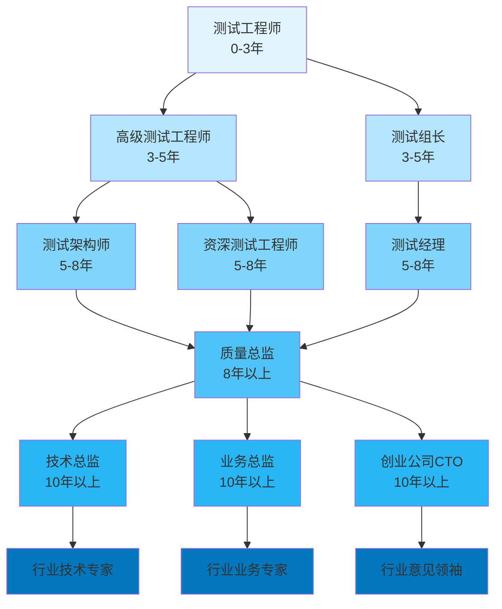

<!-- markdownlint-disable MD025 -->

<a id="第32章-大数据测试人才与职业发展【成长与进阶篇】"></a>

### 第32章 大数据测试人才与职业发展【成长与进阶篇】

**本章学习目标**

1. 掌握大数据测试人才的能力模型和职业发展路径；
2. 制定个人技能提升和职业规划策略；
3. 理解行业发展趋势和就业前景；
4. 培养技术领导力和团队管理能力。

**实践建议**

- 建立持续学习习惯，跟上技术发展趋势。
- 培养T型人才特质，技术+业务+软技能并重。
- 主动寻求导师指导和跨部门协作机会。
- 关注行业动态，提前布局未来发展方向。

## 大数据测试人才能力框架

### 核心能力维度

**技术能力体系**：
- **基础技术栈**：大数据平台(Hadoop/Spark/Flink)、数据库(MySQL/Redis/MongoDB)、云服务(AWS/Azure/GCP)
- **测试专业技能**：自动化测试、性能测试、安全测试、数据质量测试
- **工程能力**：DevOps、CI/CD、容器化、监控告警
- **新兴技术**：AI/ML、区块链、物联网、量子计算在测试中的应用

**业务理解能力**：
- **领域知识**：金融、电商、制造、医疗等行业业务逻辑
- **数据思维**：数据建模、数据治理、数据安全合规
- **用户视角**：用户体验设计、业务价值评估、ROI分析
- **跨域协作**：产品、开发、运营等多角色沟通协调

**软技能体系**：
- **学习能力**：自主学习、知识管理、持续改进
- **沟通能力**：技术文档编写、会议主持、利益相关者管理
- **领导力**：团队建设、变革管理、创新驱动
- **职业素养**：职业道德、责任心、抗压能力

### T型人才发展模型

**T型人才特征**：
```
深度专业能力 (垂直深度)
    │
    │  ┌── 测试自动化专家
    │  ├── 数据质量架构师
    │  ├── 性能测试专家
    │  └── 安全测试专家
    ▼

广度通用能力 (水平广度)
├── 技术栈广度 ── 云原生、AI/ML、大数据
├── 业务领域广度 ── 金融、电商、制造、医疗
├── 软技能广度 ── 沟通、领导、学习、创新
└── 行业视野广度 ── 趋势洞察、生态认知
```

**发展策略**：
- **选择专业方向**：根据兴趣和市场需求选择1-2个深度专业领域
- **保持技术广度**：掌握跨领域技术栈，适应多场景应用
- **平衡发展节奏**：专业深度(70%) + 通用广度(30%)
- **持续技能更新**：每季度学习新技术，每年精进一门专业技能

## 职业发展路径规划

### 职业阶段模型

**初级阶段 (0-3年)**：
- **核心任务**：掌握基础测试技能，熟悉业务流程
- **关键能力**：测试用例设计、缺陷管理、基本自动化
- **发展重点**：建立技术基础，培养学习习惯
- **薪资区间**：8-15k/月，职称：初级测试工程师

**中级阶段 (3-5年)**：
- **核心任务**：负责模块测试，参与项目质量保障
- **关键能力**：测试架构设计、性能优化、团队协作
- **发展重点**：技术专项突破，业务理解深化
- **薪资区间**：15-25k/月，职称：测试工程师/高级测试工程师

**高级阶段 (5-8年)**：
- **核心任务**：测试策略制定，质量体系建设
- **关键能力**：测试平台开发、质量度量、团队管理
- **发展重点**：技术领导力，跨部门协作
- **薪资区间**：25-40k/月，职称：资深测试工程师/测试经理

**专家阶段 (8年以上)**：
- **核心任务**：质量战略规划，技术创新引领
- **关键能力**：行业标准制定，生态建设，变革管理
- **发展重点**：思想领导力，行业影响力
- **薪资区间**：40k+/月，职称：测试总监/架构师/顾问

### 职业转型路径

**技术专家路径**：
```
测试工程师 → 高级测试工程师 → 测试架构师 → 质量总监
├── 技术深度：专项技术专家(AI测试/性能测试/安全测试)
├── 平台建设：测试平台架构师
└── 技术管理：技术团队Leader
```

**管理专家路径**：
```
测试工程师 → 测试组长 → 测试经理 → 质量总监
├── 项目管理：项目质量经理
├── 团队管理：测试团队负责人
└── 部门管理：质量管理部门总监
```

**业务专家路径**：
```
测试工程师 → 业务测试专家 → 产品测试经理 → 业务质量总监
├── 行业专精：金融测试专家/电商测试专家
├── 业务架构：业务质量架构师
└── 咨询顾问：质量管理顾问
```

**创业创新路径**：
```
测试工程师 → 技术创业者 → 创业公司CTO → 行业意见领袖
├── 产品思维：测试产品经理
├── 创业实践：测试工具创业
└── 生态建设：测试生态平台构建
```

**职业发展路径可视化**：


## 技能提升与培训体系

### 持续学习策略

**学习方法论**：
- **目标驱动学习**：基于职业目标制定学习计划
- **项目实践学习**：通过实际项目锻炼技能
- **社区参与学习**：开源贡献、技术分享、行业交流
- **导师指导学习**：寻求资深导师的指导和反馈

**学习资源体系**：
- **内部资源**：公司培训、内部技术分享、项目复盘
- **外部资源**：技术大会、在线课程、行业报告
- **实践资源**：开源项目、个人项目、技术博客
- **人脉资源**：技术社区、行业交流、导师网络

### 认证与能力评估

**专业认证体系**：
- **技术认证**：ISTQB、CSTP、AWS/Azure认证
- **行业认证**：金融科技测试认证、医疗数据合规认证
- **领导力认证**：PMP、敏捷教练认证、管理能力认证
- **专项认证**：性能测试专家、安全测试专家、AI测试认证

**能力评估模型**：
```
能力评估 = 技术能力(40%) + 业务能力(30%) + 软技能(20%) + 成果贡献(10%)

技术能力评估：
├── 技术栈掌握度 (25%)
├── 问题解决能力 (25%)
├── 创新应用能力 (25%)
└── 技术学习能力 (25%)

业务能力评估：
├── 业务理解深度 (30%)
├── 价值创造能力 (30%)
├── 沟通协作能力 (20%)
└── 客户导向思维 (20%)
```

## 行业发展趋势与就业前景

### 技术发展趋势

**2025-2030年关键趋势**：
- **AI原生测试**：AI/ML成为测试基础设施的核心组件
- **云原生质量**：质量保障向云原生架构全面转型
- **数据治理合规**：数据安全与隐私保护成为核心竞争力
- **平台化生态**：测试能力向平台化、服务化演进

**2030-2035年新兴领域**：
- **量子计算测试**：量子算法与量子安全测试
- **元宇宙质量**：虚拟现实环境的质量保障
- **数字孪生测试**：物理世界数字映射的质量验证
- **自主系统验证**：AI自主系统的安全与可靠性测试

### 行业调研数据分析

**2025年中国大数据测试人才市场调研报告** (基于500+企业调研)：

**人才需求规模**：
- **总体缺口**：大数据测试工程师缺口达15万人，年增长率23%
- **高级人才**：测试架构师/总监级人才缺口35%，平均招聘周期6个月
- **新兴技能**：AI测试、云原生测试技能需求增长180%

**薪资水平调研** (单位：k/月，税前)：
```
职位级别          平均薪资    25%分位    75%分位    增长率
初级测试工程师     12.5       10.0       15.0       +8%
高级测试工程师     22.0       18.0       28.0       +12%
测试架构师         35.0       28.0       45.0       +15%
测试总监           55.0       45.0       70.0       +18%
```

**技能需求热度排行** (基于招聘数据分析)：
1. **AI/ML测试技术** (热度指数: 95/100) - 增长最快技能
2. **云原生测试** (热度指数: 88/100) - 企业转型必备
3. **数据质量治理** (热度指数: 85/100) - 合规要求驱动
4. **自动化测试平台开发** (热度指数: 82/100) - 效率提升核心
5. **性能测试与调优** (热度指数: 78/100) - 用户体验保障

**行业分布分析**：
- **金融科技**：占需求总量28%，薪资溢价15%
- **电商平台**：占需求总量22%，人才流动性高
- **云计算服务**：占需求总量18%，技术栈最前沿
- **制造业数字化**：占需求总量15%，转型需求旺盛
- **医疗健康**：占需求总量12%，合规要求最高

**企业规模人才分布**：
- **大型企业(1000+人)**：高级人才占比45%，重视技术领导力
- **中型企业(500-1000人)**：复合型人才占比38%，注重业务理解
- **初创企业(50-500人)**：全栈人才占比52%，要求快速适应

### 就业市场分析

**需求增长预测**：
- **整体规模**：大数据测试岗位需求年增长15-20%
- **高端人才缺口**：专家级人才缺口达30%以上
- **新兴岗位**：AI测试工程师、云原生测试架构师等新岗位涌现
- **地域分布**：一线城市需求集中，新一线城市快速增长

**薪资发展曲线**：
```
薪资水平 (单位：k/月)
40+ ┌─────────────────────────────────────┐ 专家/总监
    │                                     │
35+ │         ████████                     │ 高级架构师
    │                                     │
30+ │    ███████████████                  │ 资深工程师
    │                                     │
25+ │ ████████████████████               │ 高级工程师
    │                                     │
20+ │████████████████████████             │ 中级工程师
    │                                     │
15+ │████████████████████████████         │ 初级工程师
    │                                     │
10+ └─────────────────────────────────────┘
    0   2   4   6   8   10  12  14  16  18  工作年限(年)
```

**就业竞争力因素**：
- **技术硬实力**：核心技术栈的深度和广度
- **业务理解力**：对行业业务的深入理解
- **学习适应力**：新技术快速学习和应用能力
- **沟通领导力**：团队协作和项目管理能力
- **行业影响力**：技术分享、开源贡献、行业认可

## 领导力培养与团队建设

### 技术领导力发展

**领导力层次模型**：
```
第五层次：愿景领导 ── 行业愿景，生态构建
第四层次：战略领导 ── 技术战略，组织变革
第三层次：战术领导 ── 项目执行，团队管理
第二层次：个人领导 ── 自我管理，专业成长
第一层次：技术领导 ── 技术能力，问题解决
```

**领导力培养路径**：
- **技术影响力**：技术分享、开源贡献、行业标准制定
- **团队建设**：招聘培养、梯队建设、文化塑造
- **项目管理**：项目规划、风险控制、资源协调
- **变革管理**：组织变革、流程优化、文化转型
- **战略思维**：业务理解、价值创造、长期规划

### 团队文化建设

**质量文化核心要素**：
- **质量即责任**：每个人都是质量的第一责任人
- **预防胜于治疗**：主动质量管理，防患于未然
- **持续改进文化**：PDCA循环，数据驱动改进
- **学习分享文化**：知识共享，经验传承
- **创新包容文化**：鼓励创新，包容失败

**团队建设策略**：
- **人才梯队建设**：分层培养，能力匹配
- **知识管理体系**：文档化、标准化、自动化
- **激励机制设计**：物质激励+精神激励+发展激励
- **沟通协作机制**：定期分享、跨部门协作、反馈机制
- **变革管理能力**：组织适应性，文化包容性

## 自我评估检查表

### 职业发展 Readiness 评估

请根据你的实际情况，在相应选项打勾 (✓)，计算总分判断你的职业发展准备度。

#### 1. 技术能力评估 (满分: 25分)
- [ ] 熟练掌握2+大数据测试技术栈 (5分)
- [ ] 能独立设计测试方案和架构 (5分)
- [ ] 具备专项测试领域深度 (如AI/性能/安全) (5分)
- [ ] 能指导初级工程师工作 (5分)
- [ ] 主动学习新技术，知识体系完善 (5分)

#### 2. 业务能力评估 (满分: 20分)
- [ ] 深入理解所在行业业务逻辑 (4分)
- [ ] 能从业务视角分析测试需求 (4分)
- [ ] 具备跨部门沟通协作经验 (4分)
- [ ] 能识别业务风险并提出改进建议 (4分)
- [ ] 理解公司战略目标和质量要求 (4分)

#### 3. 软技能评估 (满分: 20分)
- [ ] 良好的沟通表达能力 (4分)
- [ ] 具备团队协作和领导经验 (4分)
- [ ] 能承受工作压力，适应变化 (4分)
- [ ] 具备问题分析和解决思维 (4分)
- [ ] 主动学习和自我驱动能力强 (4分)

#### 4. 职业规划评估 (满分: 15分)
- [ ] 有明确的职业发展目标 (3分)
- [ ] 制定了详细的学习发展计划 (3分)
- [ ] 积极参与行业交流和技术分享 (3分)
- [ ] 建立了mentor关系网络 (3分)
- [ ] 关注行业趋势和就业市场 (3分)

#### 5. 成果贡献评估 (满分: 20分)
- [ ] 负责过重要项目的质量保障 (4分)
- [ ] 提出过创新的测试方法或工具 (4分)
- [ ] 获得过专业认证或技术奖项 (4分)
- [ ] 培养过团队成员或分享过经验 (4分)
- [ ] 为公司创造过显著价值 (4分)

### 评估结果解读

**总分计算**：____ / 100分

**发展阶段判断**：
- **80-100分**：优秀，准备充分，可以向高级岗位发展
- **60-79分**：良好，基础扎实，需要加强特定领域
- **40-59分**：一般，需要全面提升各项能力
- **20-39分**：待发展，需要系统性学习和实践
- **0-19分**：起步阶段，建议从基础开始培养

### 能力提升行动清单

根据评估结果，制定个性化改进计划：

**技术能力提升**：
- [ ] 学习新技术栈：________________________
- [ ] 参与项目实践：________________________
- [ ] 获得专业认证：________________________
- [ ] 技术分享输出：________________________

**业务能力提升**：
- [ ] 业务知识学习：________________________
- [ ] 跨部门协作：________________________
- [ ] 业务分析训练：________________________
- [ ] 战略思维培养：________________________

**软技能提升**：
- [ ] 沟通技巧训练：________________________
- [ ] 领导力培养：________________________
- [ ] 压力管理：________________________
- [ ] 学习方法优化：________________________

**职业发展规划**：
- [ ] 制定发展目标：________________________
- [ ] 建立导师关系：________________________
- [ ] 行业交流参与：________________________
- [ ] 个人品牌建设：________________________

**时间规划**：
- **短期 (3个月)**：________________________
- **中期 (6-12个月)**：________________________
- **长期 (1-2年)**：________________________

## 实践案例与职业发展策略

### 典型职业转型案例

**从传统测试到AI测试专家**：
- **转型背景**：传统功能测试工程师，面临技术转型压力
- **能力建设**：系统学习AI/ML基础，参与AI测试项目实践
- **成果收获**：主导AI测试框架建设，成为公司AI测试技术负责人
- **关键成功因素**：主动学习，项目实践，导师指导
- **发展建议**：把握AI浪潮，提前布局，成为技术引领者

**测试经理到质量总监**：
- **转型背景**：测试团队负责人，希望向更高层级发展
- **能力建设**：学习战略思维，强化领导力，拓展业务视野
- **成果收获**：负责公司整体质量战略，成为质量管理总监
- **关键成功因素**：业务理解，跨部门协作，变革管理
- **发展建议**：从技术管理向业务管理转型，培养战略视野

**创业测试工程师案例**：
- **转型背景**：资深测试工程师，发现测试工具市场机会
- **能力建设**：产品思维培养，创业知识学习，团队组建
- **成果收获**：创立测试工具公司，成为行业知名创业者
- **关键成功因素**：技术洞察，市场敏感度，执行力
- **发展建议**：关注行业痛点，培养商业思维，勇于创新

### 职业发展行动计划

**短期行动 (3-6个月)**：
- 制定个人发展计划，明确目标和路径
- 参加专业培训，提升核心技能
- 主动承担挑战性项目，积累经验
- 建立mentor关系，寻求指导

**中期规划 (6-18个月)**：
- 精进专业技能，成为团队技术骨干
- 拓展业务知识，理解行业发展趋势
- 培养领导力，承担团队管理职责
- 建立个人品牌，提升行业影响力

**长期愿景 (1-3年)**：
- 成为技术/管理专家，引领团队发展
- 参与行业标准制定，贡献开源社区
- 培养下一代人才，实现知识传承
- 实现职业与个人价值的统一

**持续发展策略**：
- **学习习惯**：每周学习时间不少于10小时
- **技能更新**：每季度掌握一项新技术
- **人脉建设**：参加行业大会，建立专业网络
- **健康平衡**：工作生活平衡，保持身心健康
- **价值创造**：从执行者向创造者转型

大数据测试人才的发展是一个持续进化的过程，需要在技术、专业、业务、领导力等多维度共同成长。通过系统规划、持续学习和实践积累，你将能够在快速发展的行业中找到属于自己的发展路径，实现职业价值的最大化。

<!-- 锚点定义 -->
<a id="anchor_146"></a> **[146]** 人才能力评估模板：[examples/32_chapter/talent_assessment.yml](examples/32_chapter/talent_assessment.yml)

<a id="anchor_147"></a> **[147]** 职业发展规划模板：[examples/32_chapter/career_development_plan.md](examples/32_chapter/career_development_plan.md)

<a id="anchor_148"></a> **[148]** 技能提升路线图：[examples/32_chapter/skill_roadmap.md](examples/32_chapter/skill_roadmap.md)

<a id="anchor_149"></a> **[149]** 领导力发展评估工具：[tools/reports/leadership_assessment.py](tools/reports/leadership_assessment.py)

