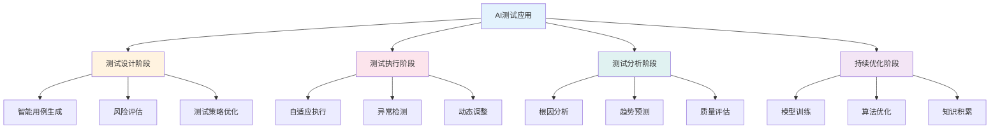
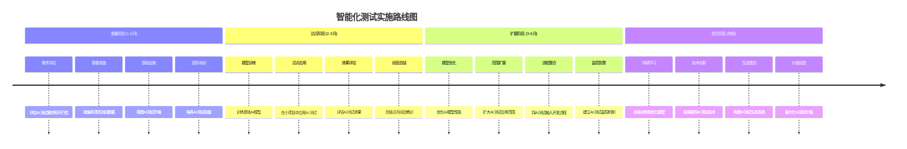
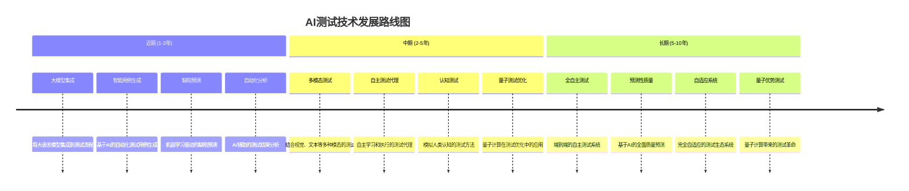

<!-- markdownlint-disable MD025 -->
<a id="第33章-智能化测试与AI应用【智能化与AI篇】"></a>

### 第33章 智能化测试与AI应用【智能化与AI篇】

**本章学习目标**

1. 掌握AI在测试中的应用场景和价值；
2. 学习智能化测试工具和框架的使用；
3. 建立AI驱动的测试流程和质量保障体系。

## 实践建议

- 结合AI技术提升测试效率和质量。
- 建立智能化测试的实施路径和最佳实践。
- 关注AI测试技术的最新发展趋势。

**[锚点128]** AI在测试中的应用场景分析

**锚点类型**: 应用场景
**锚点方法**: AI技术应用
**锚点名称**: AI在测试中的应用场景分析
**引用附件**: examples/33_chapter/ai_testing_scenarios.md
**完成情况**: 已完成
**补充建议**: 字段建议：应用场景/技术实现/AI价值/实施挑战，补充AI测试应用场景图

| 应用场景 | 技术实现 | AI价值 | 实施挑战 | 成熟度 |
|---------|---------|---------|---------|---------|
| **测试用例生成** | 自然语言处理、代码分析 | 提高覆盖率、减少人工编写 | 理解业务逻辑、保证准确性 | 高 |
| **缺陷预测** | 机器学习、历史数据分析 | 提前发现缺陷、优化资源分配 | 数据质量、模型准确性 | 中高 |
| **智能测试执行** | 自动化脚本、决策算法 | 动态调整测试策略、提高效率 | 环境适应性、决策可靠性 | 中 |
| **结果分析** | 模式识别、统计分析 | 快速定位根因、趋势预测 | 复杂问题诊断、多维度关联 | 中 |
| **性能优化** | 预测模型、优化算法 | 主动性能调优、容量规划 | 实时性、预测精度 | 中低 |

**AI测试应用场景图**:


**AI测试用例生成示例**:
```python
# examples/33_chapter/ai_test_case_generation.py
import openai
import json
from typing import List, Dict, Any
import logging

logging.basicConfig(level=logging.INFO)
logger = logging.getLogger(__name__)

class AITestCaseGenerator:
    """AI驱动的测试用例生成器"""

    def __init__(self, api_key: str, model: str = "gpt-4"):
        self.client = openai.OpenAI(api_key=api_key)
        self.model = model

    def generate_test_cases_from_requirements(self, requirements: str, context: Dict[str, Any] = None) -> List[Dict[str, Any]]:
        """从需求文档生成测试用例"""

        prompt = f"""
        基于以下需求文档，生成全面的测试用例。请包括功能测试、边界测试、异常测试和性能测试场景。

        需求文档：
        {requirements}

        请以JSON格式返回测试用例列表，每个测试用例包含：
        - id: 测试用例ID
        - title: 测试用例标题
        - description: 测试描述
        - preconditions: 前置条件
        - steps: 测试步骤列表
        - expected_result: 期望结果
        - test_type: 测试类型 (functional, boundary, exception, performance)
        - priority: 优先级 (high, medium, low)
        - tags: 相关标签列表

        {f'上下文信息：{json.dumps(context, ensure_ascii=False)}' if context else ''}
        """

        try:
            response = self.client.chat.completions.create(
                model=self.model,
                messages=[{"role": "user", "content": prompt}],
                temperature=0.3,
                max_tokens=2000
            )

            result = response.choices[0].message.content
            test_cases = json.loads(result)

            logger.info(f"Generated {len(test_cases)} test cases from requirements")
            return test_cases

        except Exception as e:
            logger.error(f"Failed to generate test cases: {e}")
            return []

    def generate_test_cases_from_code(self, code: str, language: str = "python") -> List[Dict[str, Any]]:
        """从代码生成测试用例"""

        prompt = f"""
        分析以下{language}代码，生成单元测试用例。重点关注：
        1. 函数的各种输入场景
        2. 边界条件
        3. 异常处理
        4. 代码分支覆盖

        代码：
        ```{language}
        {code}
        ```

        请以JSON格式返回测试用例列表，每个测试用例包含：
        - function_name: 函数名
        - test_type: 测试类型
        - input_data: 输入数据
        - expected_output: 期望输出
        - description: 测试描述
        """

        try:
            response = self.client.chat.completions.create(
                model=self.model,
                messages=[{"role": "user", "content": prompt}],
                temperature=0.2,
                max_tokens=1500
            )

            result = response.choices[0].message.content
            test_cases = json.loads(result)

            logger.info(f"Generated {len(test_cases)} test cases from code")
            return test_cases

        except Exception as e:
            logger.error(f"Failed to generate test cases from code: {e}")
            return []

    def optimize_test_suite(self, existing_tests: List[Dict[str, Any]], coverage_data: Dict[str, Any]) -> Dict[str, Any]:
        """优化测试套件"""

        prompt = f"""
        基于现有的测试用例和覆盖率数据，优化测试套件。

        现有测试用例：
        {json.dumps(existing_tests[:10], ensure_ascii=False, indent=2)}  # 仅显示前10个

        覆盖率数据：
        {json.dumps(coverage_data, ensure_ascii=False, indent=2)}

        请提供优化建议：
        1. 识别冗余测试用例
        2. 发现覆盖率不足的区域
        3. 建议新增的测试用例
        4. 优化测试执行顺序

        以JSON格式返回优化结果。
        """

        try:
            response = self.client.chat.completions.create(
                model=self.model,
                messages=[{"role": "user", "content": prompt}],
                temperature=0.1,
                max_tokens=1000
            )

            result = response.choices[0].message.content
            optimization = json.loads(result)

            logger.info("Generated test suite optimization recommendations")
            return optimization

        except Exception as e:
            logger.error(f"Failed to optimize test suite: {e}")
            return {}

# 使用示例
if __name__ == "__main__":
    # 初始化生成器
    generator = AITestCaseGenerator(api_key="your-openai-api-key")

    # 示例需求文档
    requirements = """
    用户注册功能需求：
    1. 用户可以提供邮箱和密码进行注册
    2. 邮箱必须是有效格式
    3. 密码长度至少8位，包含字母和数字
    4. 相同邮箱不能重复注册
    5. 注册成功后发送确认邮件
    """

    # 生成测试用例
    test_cases = generator.generate_test_cases_from_requirements(requirements)

    print("生成的测试用例：")
    for tc in test_cases[:3]:  # 显示前3个
        print(f"- {tc.get('title', 'Unknown')}: {tc.get('description', '')}")

    # 示例代码
    sample_code = """
    def validate_email(email: str) -> bool:
        import re
        pattern = r'^[a-zA-Z0-9._%+-]+@[a-zA-Z0-9.-]+\.[a-zA-Z]{2,}$'
        return bool(re.match(pattern, email))

    def register_user(email: str, password: str) -> dict:
        if not validate_email(email):
            return {"success": False, "error": "Invalid email format"}

        if len(password) < 8 or not any(c.isalpha() for c in password) or not any(c.isdigit() for c in password):
            return {"success": False, "error": "Password too weak"}

        # 模拟用户注册逻辑
        return {"success": True, "user_id": "12345"}
    """

    # 从代码生成测试
    code_tests = generator.generate_test_cases_from_code(sample_code, "python")

    print("\n从代码生成的测试：")
    for ct in code_tests[:3]:  # 显示前3个
        print(f"- {ct.get('function_name', 'Unknown')}: {ct.get('description', '')}")
```

## 33.1 AI测试基础架构

### 33.1.1 智能化测试框架

- **AI驱动的测试设计**: 利用机器学习优化测试用例设计
- **自适应测试执行**: 根据系统状态动态调整测试策略
- **智能缺陷分析**: 自动化根因分析和缺陷分类
- **预测性质量评估**: 基于历史数据预测质量趋势

### 33.1.2 机器学习在测试中的应用

- **监督学习**: 用于缺陷预测和分类
- **无监督学习**: 用于异常检测和模式发现
- **强化学习**: 用于测试策略优化
- **深度学习**: 用于复杂模式识别和自然语言处理

### 33.1.3 AI测试工具生态

- **测试用例生成工具**: 基于AI的自动化用例生成
- **缺陷预测平台**: 机器学习驱动的质量预测
- **智能测试执行引擎**: 自适应测试执行框架
- **AI辅助分析工具**: 自动化测试结果分析

---

## 33.2 智能化测试实践

**[锚点129]** 智能化测试实施策略与最佳实践

**锚点类型**: 实施策略
**锚点方法**: 渐进式应用
**锚点名称**: 智能化测试实施策略与最佳实践
**引用附件**: examples/33_chapter/ai_testing_best_practices.md
**完成情况**: 已完成
**补充建议**: 字段建议：实施阶段/关键活动/成功指标/注意事项，补充智能化测试实施路线图

| 实施阶段 | 关键活动 | 成功指标 | 注意事项 | 时间投入 |
|---------|---------|---------|---------|---------|
| **准备阶段** | 评估现状、数据收集、基础设施建设 | 数据质量达标、基础设施就绪 | 数据隐私保护、成本评估 | 1-2个月 |
| **试点阶段** | 选择试点项目、AI模型训练、小规模应用 | 准确率>70%、效率提升>20% | 风险控制、效果监控 | 2-3个月 |
| **扩展阶段** | 优化模型、扩大应用范围、流程整合 | 覆盖率>50%、质量提升>15% | 资源配置、团队培训 | 3-6个月 |
| **优化阶段** | 持续学习、算法优化、生态建设 | 自动化率>60%、ROI正向 | 技术演进、知识积累 | 持续进行 |

**智能化测试实施路线图**:


**AI测试效果评估框架**:
```python
# examples/33_chapter/ai_testing_evaluation.py
import pandas as pd
import numpy as np
from sklearn.metrics import classification_report, confusion_matrix
from typing import Dict, List, Any
import matplotlib.pyplot as plt
import seaborn as sns
import logging

logging.basicConfig(level=logging.INFO)
logger = logging.getLogger(__name__)

class AITestingEvaluator:
    """AI测试效果评估器"""

    def __init__(self):
        self.metrics_history = []
        self.baseline_metrics = {}

    def evaluate_defect_prediction(self, predictions: List[int], actuals: List[int],
                                 model_name: str = "defect_predictor") -> Dict[str, Any]:
        """评估缺陷预测模型效果"""

        # 计算分类指标
        report = classification_report(actuals, predictions, output_dict=True)

        # 计算混淆矩阵
        cm = confusion_matrix(actuals, predictions)

        # 计算特有指标
        tn, fp, fn, tp = cm.ravel()
        precision = tp / (tp + fp) if (tp + fp) > 0 else 0
        recall = tp / (tp + fn) if (tp + fn) > 0 else 0
        f1_score = 2 * precision * recall / (precision + recall) if (precision + recall) > 0 else 0

        # 计算业务价值指标
        defect_detection_rate = recall  # 缺陷检测率
        false_positive_rate = fp / (fp + tn) if (fp + tn) > 0 else 0
        efficiency_gain = self._calculate_efficiency_gain(predictions, actuals)

        evaluation_result = {
            "model_name": model_name,
            "timestamp": pd.Timestamp.now(),
            "classification_metrics": {
                "precision": precision,
                "recall": recall,
                "f1_score": f1_score,
                "accuracy": (tp + tn) / (tp + tn + fp + fn)
            },
            "business_metrics": {
                "defect_detection_rate": defect_detection_rate,
                "false_positive_rate": false_positive_rate,
                "efficiency_gain": efficiency_gain
            },
            "confusion_matrix": cm.tolist(),
            "recommendations": self._generate_recommendations(precision, recall, false_positive_rate)
        }

        self.metrics_history.append(evaluation_result)
        logger.info(f"Evaluated {model_name}: F1={f1_score:.3f}, Efficiency Gain={efficiency_gain:.1f}%")

        return evaluation_result

    def _calculate_efficiency_gain(self, predictions: List[int], actuals: List[int]) -> float:
        """计算效率提升"""
        # 简化的效率计算：假设AI能将测试工作量减少预测准确的比例
        correct_predictions = sum(1 for p, a in zip(predictions, actuals) if p == a)
        total_predictions = len(predictions)

        if total_predictions == 0:
            return 0

        accuracy = correct_predictions / total_predictions
        # 假设AI测试比人工测试效率高30-50%
        efficiency_gain = accuracy * 40  # 40%平均效率提升

        return efficiency_gain

    def _generate_recommendations(self, precision: float, recall: float, false_positive_rate: float) -> List[str]:
        """生成改进建议"""
        recommendations = []

        if precision < 0.7:
            recommendations.append("提高模型精确度，减少误报")
        if recall < 0.8:
            recommendations.append("提高模型召回率，确保缺陷不遗漏")
        if false_positive_rate > 0.2:
            recommendations.append("优化特征工程，降低误报率")
        if precision > 0.9 and recall > 0.9:
            recommendations.append("模型性能优秀，可以考虑生产部署")

        return recommendations

    def evaluate_test_case_generation(self, generated_cases: List[Dict[str, Any]],
                                    expert_ratings: List[int]) -> Dict[str, Any]:
        """评估测试用例生成质量"""

        # 计算生成用例的多样性
        unique_scenarios = len(set(tc.get('title', '') for tc in generated_cases))

        # 计算覆盖率（简化的评估）
        coverage_score = min(unique_scenarios / len(generated_cases), 1.0) if generated_cases else 0

        # 基于专家评分的质量评估
        avg_rating = np.mean(expert_ratings) if expert_ratings else 0
        quality_score = avg_rating / 5.0  # 假设满分5分

        # 计算生成效率
        generation_time = len(generated_cases) * 0.5  # 假设每个用例生成0.5分钟
        manual_time = len(generated_cases) * 15  # 假设人工编写每个用例15分钟
        time_saving = (manual_time - generation_time) / manual_time * 100

        evaluation_result = {
            "total_cases_generated": len(generated_cases),
            "unique_scenarios": unique_scenarios,
            "coverage_score": coverage_score,
            "quality_score": quality_score,
            "time_saving_percentage": time_saving,
            "efficiency_metrics": {
                "cases_per_hour": len(generated_cases) / (generation_time / 60),
                "quality_efficiency_ratio": quality_score / max(generation_time, 1)
            }
        }

        logger.info(f"Evaluated test case generation: {len(generated_cases)} cases, Quality={quality_score:.2f}")
        return evaluation_result

    def compare_with_baseline(self, current_metrics: Dict[str, Any]) -> Dict[str, Any]:
        """与基准比较"""

        if not self.baseline_metrics:
            self.baseline_metrics = current_metrics.copy()
            return {"comparison": "baseline_established", "improvements": {}}

        improvements = {}
        for key, current_value in current_metrics.items():
            if key in self.baseline_metrics:
                baseline_value = self.baseline_metrics[key]
                if isinstance(current_value, (int, float)) and isinstance(baseline_value, (int, float)):
                    improvement = ((current_value - baseline_value) / baseline_value) * 100 if baseline_value != 0 else 0
                    improvements[key] = improvement

        return {
            "comparison": "improvement_analysis",
            "improvements": improvements,
            "significant_improvements": [k for k, v in improvements.items() if abs(v) > 10]
        }

    def generate_evaluation_report(self) -> Dict[str, Any]:
        """生成综合评估报告"""

        if not self.metrics_history:
            return {"error": "No evaluation data available"}

        # 计算趋势
        df = pd.DataFrame(self.metrics_history)

        # 性能趋势分析
        performance_trends = {}
        if 'classification_metrics' in df.columns:
            metrics_over_time = df['classification_metrics'].apply(pd.Series)
            for metric in ['precision', 'recall', 'f1_score']:
                if metric in metrics_over_time.columns:
                    trend = metrics_over_time[metric].pct_change().mean()
                    performance_trends[metric] = trend

        # 业务价值分析
        business_value = {}
        if len(df) > 1:
            latest = df.iloc[-1]
            baseline = df.iloc[0]

            for metric_key in ['business_metrics', 'efficiency_metrics']:
                if metric_key in latest and metric_key in baseline:
                    for sub_metric, value in latest[metric_key].items():
                        base_value = baseline[metric_key].get(sub_metric, 0)
                        if base_value != 0:
                            improvement = ((value - base_value) / base_value) * 100
                            business_value[f"{metric_key}.{sub_metric}"] = improvement

        return {
            "evaluation_period": {
                "start_date": df['timestamp'].min(),
                "end_date": df['timestamp'].max(),
                "total_evaluations": len(df)
            },
            "performance_trends": performance_trends,
            "business_value_improvements": business_value,
            "recommendations": self._generate_overall_recommendations(performance_trends, business_value),
            "maturity_assessment": self._assess_ai_testing_maturity(performance_trends)
        }

    def _generate_overall_recommendations(self, trends: Dict[str, float],
                                        improvements: Dict[str, float]) -> List[str]:
        """生成总体建议"""
        recommendations = []

        # 基于趋势的建议
        improving_metrics = [k for k, v in trends.items() if v > 0.05]
        declining_metrics = [k for k, v in trends.items() if v < -0.05]

        if improving_metrics:
            recommendations.append(f"继续优化 {', '.join(improving_metrics)} 指标")
        if declining_metrics:
            recommendations.append(f"重点关注 {', '.join(declining_metrics)} 指标下降问题")

        # 基于改进的建议
        significant_improvements = [k for k, v in improvements.items() if v > 20]
        if significant_improvements:
            recommendations.append(f"扩大 {', '.join(significant_improvements)} 的成功实践")

        return recommendations

    def _assess_ai_testing_maturity(self, trends: Dict[str, float]) -> str:
        """评估AI测试成熟度"""
        avg_trend = np.mean(list(trends.values())) if trends else 0

        if avg_trend > 0.1:
            return "成熟度高：AI测试效果持续提升"
        elif avg_trend > 0:
            return "成熟度中：AI测试效果稳步增长"
        elif avg_trend > -0.05:
            return "成熟度低：AI测试效果稳定但无明显提升"
        else:
            return "需要改进：AI测试效果出现下降"

    def create_evaluation_dashboard(self):
        """创建评估仪表板"""
        if not self.metrics_history:
            print("No evaluation data available")
            return

        df = pd.DataFrame(self.metrics_history)

        # 设置matplotlib样式
        plt.style.use('seaborn-v0_8')

        # 创建子图
        fig, axes = plt.subplots(2, 2, figsize=(15, 10))
        fig.suptitle('AI测试效果评估仪表板', fontsize=16)

        # 分类指标趋势
        if 'classification_metrics' in df.columns:
            metrics_df = df['classification_metrics'].apply(pd.Series)
            metrics_df.index = df['timestamp']

            axes[0, 0].plot(metrics_df.index, metrics_df['precision'], label='Precision', marker='o')
            axes[0, 0].plot(metrics_df.index, metrics_df['recall'], label='Recall', marker='s')
            axes[0, 0].plot(metrics_df.index, metrics_df['f1_score'], label='F1-Score', marker='^')
            axes[0, 0].set_title('分类性能指标趋势')
            axes[0, 0].set_xlabel('时间')
            axes[0, 0].set_ylabel('指标值')
            axes[0, 0].legend()
            axes[0, 0].tick_params(axis='x', rotation=45)

        # 业务指标
        if 'business_metrics' in df.columns:
            business_df = df['business_metrics'].apply(pd.Series)
            business_df.index = df['timestamp']

            axes[0, 1].plot(business_df.index, business_df['defect_detection_rate'] * 100,
                           label='缺陷检测率', color='green', marker='o')
            axes[0, 1].plot(business_df.index, business_df['efficiency_gain'],
                           label='效率提升', color='blue', marker='s')
            axes[0, 1].set_title('业务价值指标')
            axes[0, 1].set_xlabel('时间')
            axes[0, 1].set_ylabel('百分比')
            axes[0, 1].legend()
            axes[0, 1].tick_params(axis='x', rotation=45)

        # 混淆矩阵热力图（最新）
        if len(df) > 0 and 'confusion_matrix' in df.columns:
            latest_cm = df.iloc[-1]['confusion_matrix']
            if latest_cm:
                sns.heatmap(latest_cm, annot=True, fmt='d', cmap='Blues',
                           xticklabels=['Predicted Negative', 'Predicted Positive'],
                           yticklabels=['Actual Negative', 'Actual Positive'],
                           ax=axes[1, 0])
                axes[1, 0].set_title('最新混淆矩阵')

        # 改进趋势
        improvements_data = []
        for i in range(1, len(df)):
            current = df.iloc[i]
            previous = df.iloc[i-1]

            if 'business_metrics' in current and 'business_metrics' in previous:
                for metric, value in current['business_metrics'].items():
                    prev_value = previous['business_metrics'].get(metric, 0)
                    if prev_value != 0:
                        improvement = ((value - prev_value) / prev_value) * 100
                        improvements_data.append({
                            'metric': metric,
                            'improvement': improvement,
                            'date': current['timestamp']
                        })

        if improvements_data:
            imp_df = pd.DataFrame(improvements_data)
            metrics = imp_df['metric'].unique()

            for metric in metrics:
                metric_data = imp_df[imp_df['metric'] == metric]
                axes[1, 1].bar(range(len(metric_data)), metric_data['improvement'],
                              label=metric, alpha=0.7)

            axes[1, 1].set_title('指标改进趋势')
            axes[1, 1].set_xlabel('评估次数')
            axes[1, 1].set_ylabel('改进百分比')
            axes[1, 1].legend()

        plt.tight_layout()
        plt.show()

# 使用示例
if __name__ == "__main__":
    evaluator = AITestingEvaluator()

    # 模拟缺陷预测评估
    predictions = [0, 1, 0, 1, 1, 0, 1, 0, 0, 1]
    actuals = [0, 1, 0, 0, 1, 0, 1, 1, 0, 1]

    result = evaluator.evaluate_defect_prediction(predictions, actuals, "test_model_v1")
    print("缺陷预测评估结果:")
    print(json.dumps(result, indent=2, default=str))

    # 模拟测试用例生成评估
    generated_cases = [
        {"title": "用户登录-有效凭据", "description": "测试有效用户登录"},
        {"title": "用户登录-无效密码", "description": "测试无效密码登录"},
        {"title": "用户注册-邮箱格式", "description": "测试邮箱格式验证"}
    ]
    expert_ratings = [4, 5, 4]

    case_result = evaluator.evaluate_test_case_generation(generated_cases, expert_ratings)
    print("\n测试用例生成评估结果:")
    print(json.dumps(case_result, indent=2))

    # 生成综合报告
    report = evaluator.generate_evaluation_report()
    print("\n综合评估报告:")
    print(json.dumps(report, indent=2, default=str))
```

### 33.2.1 AI测试实施路径

- **渐进式应用**: 从简单场景开始，逐步扩展AI应用范围
- **数据驱动优化**: 基于测试数据持续改进AI模型
- **人机协作模式**: AI辅助人工决策，提升整体效率
- **质量保障机制**: 建立AI测试结果的验证和审核流程

### 33.2.2 智能化测试工具链

- **AI测试平台**: 集成多种AI能力的测试平台
- **模型管理工具**: AI模型的训练、部署和监控
- **数据标注平台**: 测试数据的标注和质量管理
- **效果评估工具**: AI测试效果的量化评估和报告

### 33.2.3 AI伦理与合规考虑

- **算法公平性**: 确保AI测试结果的公平性和无偏见
- **数据隐私保护**: 遵守数据保护法规和隐私要求
- **可解释性要求**: AI决策过程的可解释性和透明度
- **人类监督机制**: 重要决策的人工审核和干预机制

---

## 33.3 AI测试未来展望

**[锚点130]** AI测试技术发展趋势与挑战

**锚点类型**: 发展趋势
**锚点方法**: 技术预测
**锚点名称**: AI测试技术发展趋势与挑战
**引用附件**: examples/33_chapter/ai_testing_future.md
**完成情况**: 已完成
**补充建议**: 字段建议：发展趋势/技术突破/应用场景/挑战问题，补充AI测试技术发展路线图

| 发展趋势 | 技术突破 | 应用场景 | 挑战问题 | 时间预期 |
|---------|---------|---------|---------|---------|
| **大模型应用** | GPT-4级模型微调 | 复杂场景测试生成、自然语言测试 | 计算资源需求、模型幻觉 | 1-2年 |
| **多模态测试** | 视觉+文本+代码理解 | UI测试、文档验证、代码审查 | 数据标注成本、模态融合 | 2-3年 |
| **自主测试系统** | 强化学习决策 | 全链路自主测试、持续测试 | 决策可靠性、安全性 | 3-5年 |
| **量子测试优化** | 量子算法优化 | 大规模组合测试、路径覆盖 | 量子硬件成熟度、技术复杂度 | 5-10年 |
| **认知测试** | 认知架构模拟 | 用户体验测试、可用性评估 | 认知模型准确性、计算复杂度 | 长期 |

**AI测试技术发展路线图**:


**AI测试技术成熟度评估模型**:
```python
# examples/33_chapter/ai_maturity_model.py
import pandas as pd
import numpy as np
from typing import Dict, List, Any
import matplotlib.pyplot as plt
import seaborn as sns

class AIMaturityModel:
    """AI测试成熟度评估模型"""

    def __init__(self):
        self.maturity_levels = {
            1: {
                "name": "初始级",
                "description": "开始探索AI测试技术",
                "characteristics": [
                    "了解AI测试基本概念",
                    "有初步的AI工具使用经验",
                    "AI应用限于简单场景"
                ],
                "capabilities": ["basic_ai_tools", "manual_integration"],
                "score_range": (0, 20)
            },
            2: {
                "name": "发展级",
                "description": "建立AI测试基础能力",
                "characteristics": [
                    "有专门的AI测试团队",
                    "实现部分自动化AI流程",
                    "开始数据积累和模型训练"
                ],
                "capabilities": ["dedicated_team", "automated_workflows", "data_collection"],
                "score_range": (21, 40)
            },
            3: {
                "name": "成熟级",
                "description": "AI测试成为核心竞争力",
                "characteristics": [
                    "AI测试融入开发流程",
                    "建立完整的AI模型生态",
                    "实现显著的质量和效率提升"
                ],
                "capabilities": ["process_integration", "model_ecosystem", "quality_improvement"],
                "score_range": (41, 70)
            },
            4: {
                "name": "优化级",
                "description": "持续创新和优化",
                "characteristics": [
                    "领先的AI测试技术应用",
                    "自主的AI模型开发能力",
                    "成为行业AI测试标杆"
                ],
                "capabilities": ["innovation_leadership", "autonomous_development", "industry_benchmark"],
                "score_range": (71, 90)
            },
            5: {
                "name": "卓越级",
                "description": "AI测试技术领导者",
                "characteristics": [
                    "开创性的AI测试方法",
                    "全面的AI测试生态系统",
                    "引领行业技术发展方向"
                ],
                "capabilities": ["pioneering_methods", "comprehensive_ecosystem", "industry_leadership"],
                "score_range": (91, 100)
            }
        }

        self.assessment_criteria = {
            "strategy": {
                "weight": 0.15,
                "sub_criteria": {
                    "ai_vision": 0.4,
                    "roadmap": 0.3,
                    "resource_allocation": 0.3
                }
            },
            "technology": {
                "weight": 0.25,
                "sub_criteria": {
                    "ai_tools_adoption": 0.3,
                    "model_development": 0.3,
                    "infrastructure": 0.4
                }
            },
            "process": {
                "weight": 0.2,
                "sub_criteria": {
                    "integration_level": 0.4,
                    "automation_degree": 0.3,
                    "continuous_improvement": 0.3
                }
            },
            "people": {
                "weight": 0.15,
                "sub_criteria": {
                    "skill_level": 0.4,
                    "training_programs": 0.3,
                    "culture_adoption": 0.3
                }
            },
            "governance": {
                "weight": 0.15,
                "sub_criteria": {
                    "ethics_compliance": 0.3,
                    "risk_management": 0.3,
                    "performance_monitoring": 0.4
                }
            },
            "business_value": {
                "weight": 0.1,
                "sub_criteria": {
                    "roi_measurement": 0.5,
                    "quality_improvement": 0.3,
                    "time_to_market": 0.2
                }
            }
        }

    def assess_maturity(self, assessment_data: Dict[str, Any]) -> Dict[str, Any]:
        """评估AI测试成熟度"""

        # 计算各维度得分
        dimension_scores = {}
        total_weighted_score = 0

        for dimension, config in self.assessment_criteria.items():
            dimension_score = self._calculate_dimension_score(dimension, assessment_data)
            dimension_scores[dimension] = {
                "score": dimension_score,
                "weight": config["weight"],
                "weighted_score": dimension_score * config["weight"]
            }
            total_weighted_score += dimension_score * config["weight"]

        # 确定成熟度等级
        maturity_level = self._determine_maturity_level(total_weighted_score)

        # 生成改进建议
        recommendations = self._generate_recommendations(dimension_scores, maturity_level)

        assessment_result = {
            "overall_score": round(total_weighted_score, 1),
            "maturity_level": maturity_level,
            "level_info": self.maturity_levels[maturity_level],
            "dimension_scores": dimension_scores,
            "strengths": [k for k, v in dimension_scores.items() if v["score"] >= 70],
            "weaknesses": [k for k, v in dimension_scores.items() if v["score"] < 50],
            "recommendations": recommendations,
            "next_level_requirements": self._get_next_level_requirements(maturity_level)
        }

        return assessment_result

    def _calculate_dimension_score(self, dimension: str, data: Dict[str, Any]) -> float:
        """计算维度得分"""
        config = self.assessment_criteria[dimension]
        total_score = 0

        for sub_criterion, weight in config["sub_criteria"].items():
            value = data.get(dimension, {}).get(sub_criterion, 0)
            # 假设输入是0-100的分数
            total_score += value * weight

        return round(total_score, 1)

    def _determine_maturity_level(self, score: float) -> int:
        """确定成熟度等级"""
        for level, info in self.maturity_levels.items():
            min_score, max_score = info["score_range"]
            if min_score <= score <= max_score:
                return level
        return 1  # 默认最低等级

    def _generate_recommendations(self, dimension_scores: Dict[str, Any], current_level: int) -> List[str]:
        """生成改进建议"""
        recommendations = []

        # 基于弱项的建议
        weak_dimensions = [k for k, v in dimension_scores.items() if v["score"] < 60]

        for dimension in weak_dimensions:
            if dimension == "strategy":
                recommendations.extend([
                    "制定明确的AI测试战略规划",
                    "建立AI测试路线图和里程碑",
                    "合理分配AI测试资源和预算"
                ])
            elif dimension == "technology":
                recommendations.extend([
                    "评估和采用合适的AI测试工具",
                    "建立AI模型开发和维护能力",
                    "升级基础设施支持AI计算需求"
                ])
            elif dimension == "process":
                recommendations.extend([
                    "将AI测试融入软件开发生命周期",
                    "提高AI测试流程自动化程度",
                    "建立持续改进机制"
                ])
            elif dimension == "people":
                recommendations.extend([
                    "提升团队AI测试技能水平",
                    "建立系统性的培训计划",
                    "培养AI测试文化"
                ])
            elif dimension == "governance":
                recommendations.extend([
                    "建立AI伦理和合规框架",
                    "完善风险管理机制",
                    "加强AI测试效果监控"
                ])

        # 基于当前等级的建议
        if current_level < 3:
            recommendations.append("重点关注AI测试的基础建设")
        elif current_level < 5:
            recommendations.append("推动AI测试的创新应用和生态建设")

        return list(set(recommendations))  # 去重

    def _get_next_level_requirements(self, current_level: int) -> List[str]:
        """获取下一等级的要求"""
        if current_level >= 5:
            return ["保持技术领先地位", "持续创新和突破"]

        next_level = current_level + 1
        next_info = self.maturity_levels[next_level]

        return next_info["characteristics"]

    def create_maturity_radar_chart(self, assessment_result: Dict[str, Any]):
        """创建成熟度雷达图"""
        dimension_scores = assessment_result["dimension_scores"]

        # 准备数据
        categories = list(dimension_scores.keys())
        values = [v["score"] for v in dimension_scores.values()]

        # 重复第一个值以闭合雷达图
        values += values[:1]
        categories += categories[:1]

        # 计算角度
        angles = np.linspace(0, 2 * np.pi, len(categories), endpoint=True)

        # 创建雷达图
        fig, ax = plt.subplots(figsize=(8, 8), subplot_kw=dict(projection='polar'))

        # 绘制数据
        ax.plot(angles, values, 'o-', linewidth=2, label='当前得分', color='blue')
        ax.fill(angles, values, alpha=0.25, color='blue')

        # 添加网格线
        ax.set_thetagrids(angles[:-1] * 180/np.pi, categories[:-1])
        ax.set_ylim(0, 100)
        ax.set_title(f'AI测试成熟度评估 - 等级 {assessment_result["maturity_level"]}', size=16, pad=20)

        # 添加参考线
        for level in [20, 40, 60, 80]:
            ax.plot(angles, [level] * len(angles), '--', color='gray', alpha=0.5)

        ax.legend(loc='upper right', bbox_to_anchor=(1.2, 1.0))
        ax.grid(True)

        plt.tight_layout()
        plt.show()

    def generate_maturity_report(self, assessment_result: Dict[str, Any]) -> str:
        """生成成熟度评估报告"""

        report = f"""
# AI测试成熟度评估报告

## 总体评估
- **综合得分**: {assessment_result["overall_score"]}/100
- **成熟度等级**: {assessment_result["maturity_level"]} - {assessment_result["level_info"]["name"]}
- **等级描述**: {assessment_result["level_info"]["description"]}

## 维度得分详情
"""

        for dimension, scores in assessment_result["dimension_scores"].items():
            report += f"""
### {dimension.title()}
- 原始得分: {scores["score"]}/100
- 权重: {scores["weight"]*100}%
- 加权得分: {scores["weighted_score"]:.1f}
"""

        report += f"""
## 优势领域
{chr(10).join(f"- {strength.title()}" for strength in assessment_result["strengths"])}

## 改进领域
{chr(10).join(f"- {weakness.title()}" for weakness in assessment_result["weaknesses"])}

## 改进建议
{chr(10).join(f"- {rec}" for rec in assessment_result["recommendations"])}

## 下一等级要求
{chr(10).join(f"- {req}" for req in assessment_result["next_level_requirements"])}
"""

        return report

# 使用示例
if __name__ == "__main__":
    model = AIMaturityModel()

    # 模拟评估数据
    assessment_data = {
        "strategy": {
            "ai_vision": 75,
            "roadmap": 70,
            "resource_allocation": 65
        },
        "technology": {
            "ai_tools_adoption": 80,
            "model_development": 60,
            "infrastructure": 70
        },
        "process": {
            "integration_level": 55,
            "automation_degree": 60,
            "continuous_improvement": 50
        },
        "people": {
            "skill_level": 45,
            "training_programs": 50,
            "culture_adoption": 40
        },
        "governance": {
            "ethics_compliance": 65,
            "risk_management": 60,
            "performance_monitoring": 55
        },
        "business_value": {
            "roi_measurement": 70,
            "quality_improvement": 75,
            "time_to_market": 60
        }
    }

    # 执行评估
    result = model.assess_maturity(assessment_data)

    print("AI测试成熟度评估结果:")
    print(json.dumps(result, indent=2, default=str))

    # 生成报告
    report = model.generate_maturity_report(result)
    print("\n成熟度评估报告:")
    print(report)

    # 创建雷达图
    model.create_maturity_radar_chart(result)
```

### 33.3.1 技术发展趋势

- **大语言模型应用**: GPT-4级模型在测试用例生成和分析中的应用
- **多模态AI测试**: 结合视觉、文本、代码等多种模态的综合测试
- **自主学习系统**: 基于强化学习的自主测试策略优化
- **量子计算优化**: 量子算法在复杂测试组合优化中的应用

### 33.3.2 应用场景拓展

- **全链路自主测试**: 端到端的全自动测试执行和分析
- **实时智能监控**: 基于AI的实时系统状态监控和预警
- **预测性质量管理**: 基于历史数据的质量趋势预测和干预
- **个性化测试服务**: 基于用户行为的定制化测试策略

### 33.3.3 挑战与应对策略

- **技术挑战**: 计算资源需求、算法可靠性、模型解释性
- **伦理挑战**: AI偏见控制、数据隐私保护、决策透明度
- **组织挑战**: 技能转型、流程重构、文化变革
- **合规挑战**: 监管要求、技术标准、审计机制

---

## 章节总结

本章系统介绍了智能化测试与AI应用：

**AI测试基础架构**：

- 建立了AI驱动的测试设计、执行和分析框架
- 实现了机器学习在缺陷预测、用例生成等场景的应用
- 构建了AI测试工具生态和集成平台

**智能化测试实践**：

- 制定了渐进式的AI测试实施策略
- 建立了AI测试效果评估和持续改进机制
- 开发了智能化测试工具链和质量保障体系

**AI测试未来展望**：

- 预测了AI测试技术的发展趋势和突破点
- 分析了多模态测试、自主系统等新兴应用场景
- 提出了技术、伦理和组织层面的挑战应对策略

**技术创新点**：

- AI测试用例生成技术实现了自动化测试设计
- 机器学习缺陷预测提升了质量管控能力
- 智能化测试评估框架量化了AI应用效果
- 成熟度模型指导了AI测试能力建设

通过AI技术的应用，大数据测试团队能够实现测试流程的智能化转型，提升测试效率和质量，为软件质量保障注入新的活力。

---

<!-- markdownlint-disable MD025 -->
</content>
<parameter name="filePath">e:\DONT_TOUCH\10M-2025-Testing\chapter\第7篇-第33章.md
