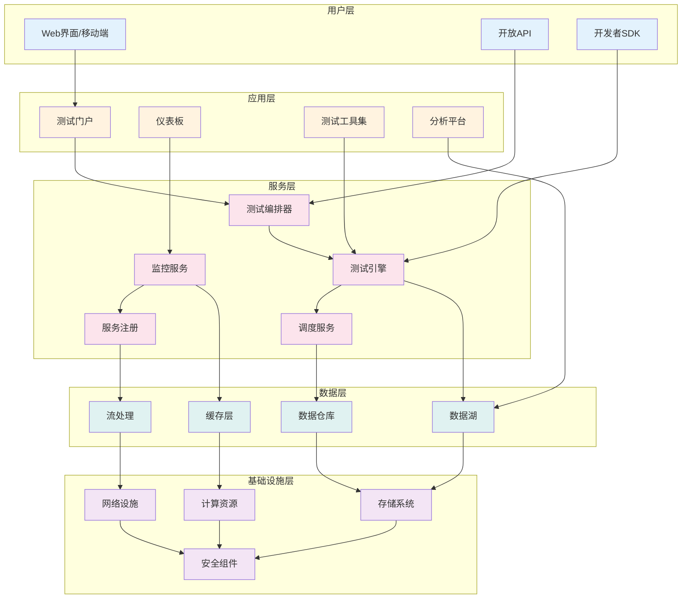
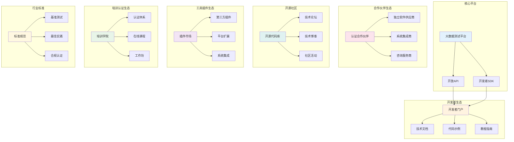
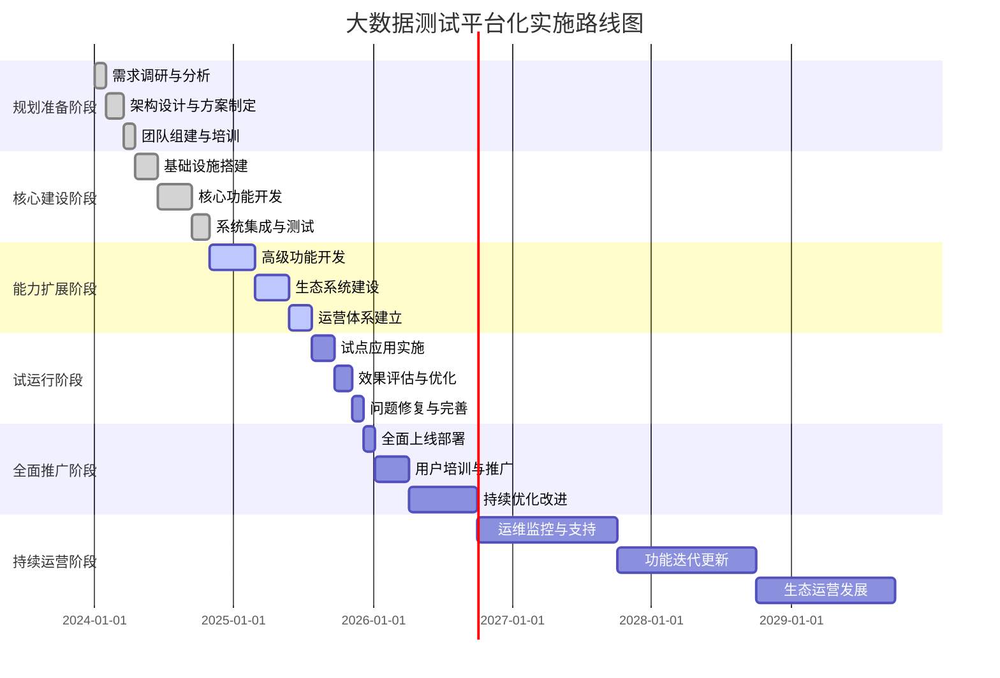

<!-- markdownlint-disable MD025 -->
<a id="第34章-大数据测试平台化与生态建设【平台化与生态篇】"></a>

### 第34章 大数据测试平台化与生态建设【平台化与生态篇】

**本章学习目标**

1. 掌握大数据测试平台的架构设计和核心能力；
2. 学习测试生态系统的构建和运营模式；
3. 建立平台化测试的实施路径和治理体系。

## 实践建议

- 构建一体化的测试平台支撑大数据质量保障。
- 建立开放的测试生态促进技术共享和创新。
- 实现平台化测试的规模化应用和价值最大化。

**[锚点131]** 大数据测试平台架构设计与核心能力

**锚点类型**: 架构设计
**锚点方法**: 平台化建设
**锚点名称**: 大数据测试平台架构设计与核心能力
**引用附件**: examples/34_chapter/platform_architecture.md
**完成情况**: 已完成
**补充建议**: 字段建议：架构层次/核心组件/关键能力/技术特点，补充大数据测试平台架构图

| 架构层次 | 核心组件 | 关键能力 | 技术特点 | 部署模式 |
|---------|---------|---------|---------|---------|
| **基础设施层** | 计算资源、存储系统、网络设施 | 弹性伸缩、高可用性、资源调度 | 云原生、容器化、微服务 | 云端/混合云 |
| **数据层** | 数据湖、数据仓库、缓存系统 | 数据集成、质量监控、血缘追踪 | 实时流处理、批处理、混合负载 | 分布式存储 |
| **平台服务层** | 测试引擎、监控系统、API网关 | 自动化测试、智能调度、统一接入 | 服务化、插件化、可扩展 | 微服务架构 |
| **应用层** | 测试工具、分析仪表板、可视化界面 | 用户体验、操作便捷、功能丰富 | 前后端分离、响应式设计、移动适配 | Web应用 |
| **生态层** | 开发者平台、合作伙伴系统、开源社区 | 开放集成、创新协作、知识共享 | API经济、生态共建、持续演进 | 开放平台 |

**大数据测试平台架构图**:


**大数据测试平台核心能力框架**:
```python
# examples/34_chapter/platform_core_capabilities.py
from typing import Dict, List, Any, Optional
from dataclasses import dataclass
from enum import Enum
import json

class CapabilityLevel(Enum):
    BASIC = "basic"
    ADVANCED = "advanced"
    PREMIUM = "premium"

class DeploymentModel(Enum):
    ON_PREMISE = "on_premise"
    CLOUD = "cloud"
    HYBRID = "hybrid"

@dataclass
class PlatformCapability:
    """平台能力定义"""
    name: str
    category: str
    level: CapabilityLevel
    description: str
    features: List[str]
    dependencies: List[str]
    metrics: Dict[str, str]

class BigDataTestingPlatform:
    """大数据测试平台核心能力框架"""

    def __init__(self):
        self.capabilities = self._initialize_capabilities()
        self.architecture_components = self._initialize_architecture()

    def _initialize_capabilities(self) -> Dict[str, PlatformCapability]:
        """初始化平台能力"""
        return {
            "data_quality_management": PlatformCapability(
                name="数据质量管理",
                category="data_governance",
                level=CapabilityLevel.ADVANCED,
                description="全面的数据质量监控、评估和改进能力",
                features=[
                    "数据 profiling 和统计分析",
                    "质量规则引擎和自定义规则",
                    "数据血缘追踪和影响分析",
                    "质量指标监控和告警",
                    "质量问题根因分析"
                ],
                dependencies=["data_catalog", "monitoring"],
                metrics={
                    "accuracy": "数据准确性指标",
                    "completeness": "数据完整性指标",
                    "consistency": "数据一致性指标",
                    "timeliness": "数据及时性指标"
                }
            ),

            "automated_testing": PlatformCapability(
                name="自动化测试",
                category="testing_execution",
                level=CapabilityLevel.PREMIUM,
                description="端到端的自动化测试执行和编排能力",
                features=[
                    "测试用例自动生成和执行",
                    "分布式测试执行引擎",
                    "测试环境自动部署和配置",
                    "测试结果自动分析和报告",
                    "持续集成/持续测试集成"
                ],
                dependencies=["test_case_management", "ci_cd_integration"],
                metrics={
                    "execution_time": "测试执行时间",
                    "pass_rate": "测试通过率",
                    "coverage": "测试覆盖率",
                    "automation_rate": "自动化率"
                }
            ),

            "performance_testing": PlatformCapability(
                name="性能测试",
                category="performance_validation",
                level=CapabilityLevel.ADVANCED,
                description="大数据系统的性能测试和容量规划能力",
                features=[
                    "负载测试和压力测试",
                    "性能基准测试和对比分析",
                    "容量规划和资源优化建议",
                    "实时性能监控和预警",
                    "性能问题诊断和调优"
                ],
                dependencies=["monitoring", "analytics"],
                metrics={
                    "throughput": "系统吞吐量",
                    "latency": "响应延迟",
                    "resource_utilization": "资源利用率",
                    "scalability": "扩展性指标"
                }
            ),

            "ai_powered_testing": PlatformCapability(
                name="AI增强测试",
                category="intelligent_testing",
                level=CapabilityLevel.PREMIUM,
                description="基于AI的智能测试分析和优化能力",
                features=[
                    "AI驱动的缺陷预测",
                    "智能测试用例生成",
                    "自动化根因分析",
                    "测试策略动态优化",
                    "质量趋势预测"
                ],
                dependencies=["machine_learning", "data_analytics"],
                metrics={
                    "prediction_accuracy": "预测准确率",
                    "false_positive_rate": "误报率",
                    "time_to_detection": "问题发现时间",
                    "optimization_efficiency": "优化效率"
                }
            ),

            "test_environment_management": PlatformCapability(
                name="测试环境管理",
                category="infrastructure",
                level=CapabilityLevel.ADVANCED,
                description="测试环境的自动化管理和配置能力",
                features=[
                    "环境模板和配置管理",
                    "环境自动部署和销毁",
                    "环境状态监控和健康检查",
                    "环境依赖管理和版本控制",
                    "多环境并行支持"
                ],
                dependencies=["infrastructure_as_code", "container_orchestration"],
                metrics={
                    "provisioning_time": "环境部署时间",
                    "environment_uptime": "环境可用性",
                    "resource_efficiency": "资源使用效率",
                    "configuration_drift": "配置偏差率"
                }
            ),

            "test_data_management": PlatformCapability(
                name="测试数据管理",
                category="data_management",
                level=CapabilityLevel.ADVANCED,
                description="测试数据的生成、管理和隐私保护能力",
                features=[
                    "测试数据自动生成和合成",
                    "数据脱敏和隐私保护",
                    "数据子集和采样",
                    "数据版本控制和回滚",
                    "数据质量保证"
                ],
                dependencies=["data_masking", "data_synthesis"],
                metrics={
                    "data_coverage": "数据覆盖率",
                    "generation_time": "数据生成时间",
                    "privacy_compliance": "隐私合规率",
                    "data_freshness": "数据新鲜度"
                }
            ),

            "reporting_analytics": PlatformCapability(
                name="报告与分析",
                category="analytics_reporting",
                level=CapabilityLevel.BASIC,
                description="测试结果的可视化分析和报告能力",
                features=[
                    "实时仪表板和可视化",
                    "自定义报告和仪表板",
                    "趋势分析和预测",
                    "多维度数据分析",
                    "报告自动化生成和分发"
                ],
                dependencies=["data_visualization", "business_intelligence"],
                metrics={
                    "report_accuracy": "报告准确性",
                    "generation_time": "报告生成时间",
                    "user_satisfaction": "用户满意度",
                    "insight_value": "洞察价值"
                }
            ),

            "integration_orchestration": PlatformCapability(
                name="集成与编排",
                category="platform_integration",
                level=CapabilityLevel.ADVANCED,
                description="与外部系统和工具的集成编排能力",
                features=[
                    "API集成和webhook支持",
                    "事件驱动架构",
                    "工作流编排和自动化",
                    "插件生态系统",
                    "第三方工具集成"
                ],
                dependencies=["api_management", "event_streaming"],
                metrics={
                    "integration_coverage": "集成覆盖率",
                    "api_uptime": "API可用性",
                    "event_processing_time": "事件处理时间",
                    "plugin_adoption": "插件采用率"
                }
            )
        }

    def _initialize_architecture(self) -> Dict[str, Dict[str, Any]]:
        """初始化架构组件"""
        return {
            "user_interface": {
                "type": "frontend",
                "technologies": ["React", "Vue.js", "Angular"],
                "responsibilities": ["用户交互", "数据可视化", "操作界面"]
            },
            "api_gateway": {
                "type": "middleware",
                "technologies": ["Kong", "Apigee", "AWS API Gateway"],
                "responsibilities": ["API管理", "认证授权", "流量控制"]
            },
            "service_mesh": {
                "type": "middleware",
                "technologies": ["Istio", "Linkerd", "Consul"],
                "responsibilities": ["服务发现", "负载均衡", "故障恢复"]
            },
            "data_platform": {
                "type": "data",
                "technologies": ["Delta Lake", "Snowflake", "BigQuery"],
                "responsibilities": ["数据存储", "数据处理", "数据分析"]
            },
            "compute_engine": {
                "type": "compute",
                "technologies": ["Kubernetes", "Docker", "Spark"],
                "responsibilities": ["计算资源", "任务调度", "资源管理"]
            },
            "monitoring_system": {
                "type": "observability",
                "technologies": ["Prometheus", "Grafana", "ELK Stack"],
                "responsibilities": ["监控告警", "日志分析", "性能追踪"]
            }
        }

    def assess_capability_maturity(self, implemented_capabilities: List[str]) -> Dict[str, Any]:
        """评估能力成熟度"""
        implemented = set(implemented_capabilities)
        available = set(self.capabilities.keys())

        coverage = len(implemented & available) / len(available) * 100

        # 计算各分类的成熟度
        category_maturity = {}
        for cap_name, capability in self.capabilities.items():
            if cap_name in implemented:
                category = capability.category
                if category not in category_maturity:
                    category_maturity[category] = []
                category_maturity[category].append(capability.level.value)

        # 计算平均成熟度等级
        maturity_scores = {
            "basic": 1,
            "advanced": 2,
            "premium": 3
        }

        category_avg_maturity = {}
        for category, levels in category_maturity.items():
            avg_score = sum(maturity_scores[level] for level in levels) / len(levels)
            category_avg_maturity[category] = avg_score

        return {
            "overall_coverage": round(coverage, 1),
            "category_maturity": category_avg_maturity,
            "implemented_capabilities": list(implemented),
            "missing_capabilities": list(available - implemented),
            "maturity_assessment": self._assess_overall_maturity(category_avg_maturity)
        }

    def _assess_overall_maturity(self, category_maturity: Dict[str, float]) -> str:
        """评估总体成熟度"""
        avg_maturity = sum(category_maturity.values()) / len(category_maturity)

        if avg_maturity >= 2.5:
            return "premium"
        elif avg_maturity >= 1.8:
            return "advanced"
        else:
            return "basic"

    def generate_capability_roadmap(self, current_capabilities: List[str],
                                  target_maturity: str) -> Dict[str, Any]:
        """生成能力建设路线图"""

        maturity_hierarchy = {
            "basic": ["basic"],
            "advanced": ["basic", "advanced"],
            "premium": ["basic", "advanced", "premium"]
        }

        target_levels = set(maturity_hierarchy.get(target_maturity, ["basic"]))

        # 筛选需要实现的能力
        roadmap_capabilities = []
        for cap_name, capability in self.capabilities.items():
            if capability.level.value in target_levels and cap_name not in current_capabilities:
                roadmap_capabilities.append({
                    "name": cap_name,
                    "capability": capability,
                    "priority": self._calculate_priority(capability),
                    "estimated_effort": self._estimate_effort(capability),
                    "dependencies": capability.dependencies
                })

        # 按优先级排序
        roadmap_capabilities.sort(key=lambda x: x["priority"], reverse=True)

        # 分阶段规划
        phases = self._create_implementation_phases(roadmap_capabilities)

        return {
            "target_maturity": target_maturity,
            "current_capabilities": current_capabilities,
            "roadmap_capabilities": roadmap_capabilities,
            "implementation_phases": phases,
            "estimated_timeline": self._estimate_timeline(phases),
            "resource_requirements": self._calculate_resource_requirements(phases)
        }

    def _calculate_priority(self, capability: PlatformCapability) -> int:
        """计算能力优先级"""
        priority_map = {
            "data_quality_management": 10,
            "automated_testing": 9,
            "performance_testing": 8,
            "test_environment_management": 7,
            "test_data_management": 7,
            "integration_orchestration": 6,
            "reporting_analytics": 5,
            "ai_powered_testing": 4
        }
        return priority_map.get(capability.name, 5)

    def _estimate_effort(self, capability: PlatformCapability) -> str:
        """估算实施工作量"""
        effort_map = {
            CapabilityLevel.BASIC: "1-2个月",
            CapabilityLevel.ADVANCED: "3-6个月",
            CapabilityLevel.PREMIUM: "6-12个月"
        }
        return effort_map.get(capability.level, "3-6个月")

    def _create_implementation_phases(self, capabilities: List[Dict[str, Any]]) -> List[Dict[str, Any]]:
        """创建实施阶段"""
        # 按依赖关系和优先级分组
        phases = []

        # 第一阶段：基础能力
        phase1 = [cap for cap in capabilities if cap["priority"] >= 8]
        if phase1:
            phases.append({
                "name": "基础能力建设",
                "duration": "3-6个月",
                "capabilities": phase1,
                "focus": "建立平台核心功能"
            })

        # 第二阶段：增强能力
        phase2 = [cap for cap in capabilities if 6 <= cap["priority"] < 8]
        if phase2:
            phases.append({
                "name": "增强能力扩展",
                "duration": "4-8个月",
                "capabilities": phase2,
                "focus": "提升平台智能化水平"
            })

        # 第三阶段：高级能力
        phase3 = [cap for cap in capabilities if cap["priority"] < 6]
        if phase3:
            phases.append({
                "name": "高级能力完善",
                "duration": "6-12个月",
                "capabilities": phase3,
                "focus": "实现平台全面智能化"
            })

        return phases

    def _estimate_timeline(self, phases: List[Dict[str, Any]]) -> str:
        """估算总体时间线"""
        if not phases:
            return "已达到目标成熟度"

        total_months = sum(int(phase["duration"].split("-")[1]) for phase in phases)
        return f"{total_months/12}年{total_months%12}个月"

    def _calculate_resource_requirements(self, phases: List[Dict[str, Any]]) -> Dict[str, Any]:
        """计算资源需求"""
        total_effort = len(phases) * 3  # 假设每个阶段需要3人月

        return {
            "development_team": f"{len(phases)}名全栈开发工程师",
            "devops_team": "2名DevOps工程师",
            "data_engineers": f"{len(phases)/2 + 1}名数据工程师",
            "qa_engineers": f"{len(phases)}名测试工程师",
            "estimated_effort": f"{total_effort}人月",
            "infrastructure_cost": "根据部署规模而定"
        }

    def export_capability_model(self) -> str:
        """导出能力模型"""
        model = {
            "platform_name": "大数据测试平台",
            "version": "2.0",
            "capabilities": {
                name: {
                    "name": cap.name,
                    "category": cap.category,
                    "level": cap.level.value,
                    "description": cap.description,
                    "features": cap.features,
                    "dependencies": cap.dependencies,
                    "metrics": cap.metrics
                }
                for name, cap in self.capabilities.items()
            },
            "architecture": self.architecture_components
        }

        return json.dumps(model, indent=2, ensure_ascii=False)

# 使用示例
if __name__ == "__main__":
    platform = BigDataTestingPlatform()

    # 评估当前能力
    current_caps = ["data_quality_management", "automated_testing", "reporting_analytics"]
    assessment = platform.assess_capability_maturity(current_caps)

    print("平台能力成熟度评估:")
    print(json.dumps(assessment, indent=2, ensure_ascii=False))

    # 生成建设路线图
    roadmap = platform.generate_capability_roadmap(current_caps, "premium")

    print("\n能力建设路线图:")
    print(json.dumps(roadmap, indent=2, ensure_ascii=False))

    # 导出能力模型
    model_json = platform.export_capability_model()
    print("\n能力模型JSON:")
    print(model_json)
```

## 34.1 平台架构设计

### 34.1.1 分层架构模型

- **基础设施层**: 提供计算、存储、网络等基础资源
- **数据层**: 实现数据存储、处理和质量管理
- **服务层**: 提供测试执行、监控、调度等核心服务
- **应用层**: 面向用户的界面和工具集
- **生态层**: 支持第三方集成和开发者生态

### 34.1.2 微服务架构

- **服务拆分**: 按业务领域拆分为独立的服务模块
- **API网关**: 统一的服务接入和流量管理
- **服务注册发现**: 动态的服务注册和发现机制
- **配置中心**: 集中化的配置管理和动态更新

### 34.1.3 云原生设计

- **容器化部署**: 基于Docker的标准化部署
- **服务编排**: Kubernetes集群管理和调度
- **弹性伸缩**: 基于负载的自动扩缩容
- **DevOps集成**: 持续集成和持续部署

---

## 34.2 测试生态建设

**[锚点132]** 测试生态系统构建与运营模式

**锚点类型**: 生态建设
**锚点方法**: 开放协同
**锚点名称**: 测试生态系统构建与运营模式
**引用附件**: examples/34_chapter/ecosystem_construction.md
**完成情况**: 已完成
**补充建议**: 字段建议：生态要素/建设策略/运营模式/价值创造，补充测试生态系统架构图

| 生态要素 | 建设策略 | 运营模式 | 价值创造 | 成熟度指标 |
|---------|---------|---------|---------|---------|
| **开发者平台** | 开放API、SDK提供、文档支持 | 自助式注册、社区运营、技术支持 | 降低接入成本、加速创新 | API调用量、开发者数量 |
| **合作伙伴体系** | 认证机制、合作协议、技术共享 | 联合营销、项目合作、资源互补 | 拓展市场覆盖、增强竞争力 | 合作伙伴数量、合作项目 |
| **开源社区** | 代码开源、贡献激励、社区治理 | 社区驱动、贡献者计划、版本管理 | 技术创新、知识积累、品牌影响力 | 社区活跃度、贡献者数量 |
| **工具插件市场** | 插件标准、审核机制、市场运营 | 开发者入驻、用户评价、收益分享 | 功能扩展、个性化定制 | 插件数量、下载量 |
| **培训认证体系** | 课程开发、认证考试、继续教育 | 在线学习、线下培训、认证维护 | 人才培养、技能提升、行业标准 | 认证人数、课程满意度 |
| **行业标准制定** | 标准调研、共识形成、推广应用 | 工作组协作、标准发布、合规认证 | 规范行业发展、提升质量 | 标准采纳率、行业影响力 |

**测试生态系统架构图**:


**测试生态运营策略框架**:
```python
# examples/34_chapter/ecosystem_operations.py
from typing import Dict, List, Any, Optional
from dataclasses import dataclass
from datetime import datetime, timedelta
import json

@dataclass
class EcosystemParticipant:
    """生态参与者"""
    id: str
    name: str
    type: str  # developer, partner, contributor, user
    join_date: datetime
    status: str  # active, inactive, suspended
    contributions: List[Dict[str, Any]]
    engagement_metrics: Dict[str, float]

@dataclass
class EcosystemAsset:
    """生态资产"""
    id: str
    name: str
    type: str  # plugin, template, documentation, tool
    creator: str
    created_date: datetime
    downloads: int
    ratings: float
    revenue: float

class TestingEcosystemManager:
    """测试生态系统运营管理器"""

    def __init__(self):
        self.participants = {}
        self.assets = {}
        self.metrics = {}
        self.strategies = self._initialize_strategies()

    def _initialize_strategies(self) -> Dict[str, Dict[str, Any]]:
        """初始化运营策略"""
        return {
            "developer_engagement": {
                "name": "开发者参与策略",
                "objectives": ["增加开发者数量", "提升贡献质量", "建立社区文化"],
                "tactics": [
                    "提供完善的技术文档和示例",
                    "举办黑客马拉松和编程大赛",
                    "建立贡献者认可和奖励机制",
                    "创建开发者大使计划"
                ],
                "metrics": ["developer_growth", "contribution_quality", "community_satisfaction"]
            },

            "partner_ecosystem": {
                "name": "合作伙伴生态策略",
                "objectives": ["拓展市场覆盖", "增强产品能力", "创造互补价值"],
                "tactics": [
                    "建立合作伙伴认证体系",
                    "提供联合营销支持",
                    "开展技术合作项目",
                    "共享销售渠道和客户资源"
                ],
                "metrics": ["partner_recruitment", "joint_revenue", "market_expansion"]
            },

            "open_source_growth": {
                "name": "开源增长策略",
                "objectives": ["扩大社区规模", "提升代码质量", "增强品牌影响力"],
                "tactics": [
                    "维护高质量的开源代码库",
                    "举办社区会议和线上活动",
                    "提供技术支持和培训",
                    "建立贡献者入门指南"
                ],
                "metrics": ["community_size", "code_contributions", "brand_awareness"]
            },

            "marketplace_monetization": {
                "name": "市场货币化策略",
                "objectives": ["创造收入来源", "激励高质量贡献", "可持续运营"],
                "tactics": [
                    "实施插件收费模式",
                    "提供高级服务订阅",
                    "建立收益分享机制",
                    "开展企业级定制服务"
                ],
                "metrics": ["revenue_growth", "plugin_quality", "user_satisfaction"]
            },

            "education_certification": {
                "name": "教育认证策略",
                "objectives": ["培养专业人才", "提升行业标准", "建立信任机制"],
                "tactics": [
                    "开发系统化的培训课程",
                    "建立多级认证体系",
                    "提供继续教育服务",
                    "与高校建立合作关系"
                ],
                "metrics": ["certification_numbers", "skill_improvement", "industry_recognition"]
            }
        }

    def register_participant(self, participant_data: Dict[str, Any]) -> str:
        """注册生态参与者"""
        participant_id = f"participant_{len(self.participants) + 1}"

        participant = EcosystemParticipant(
            id=participant_id,
            name=participant_data["name"],
            type=participant_data["type"],
            join_date=datetime.now(),
            status="active",
            contributions=[],
            engagement_metrics={
                "activity_score": 0.0,
                "contribution_score": 0.0,
                "network_score": 0.0
            }
        )

        self.participants[participant_id] = participant
        return participant_id

    def publish_asset(self, asset_data: Dict[str, Any]) -> str:
        """发布生态资产"""
        asset_id = f"asset_{len(self.assets) + 1}"

        asset = EcosystemAsset(
            id=asset_id,
            name=asset_data["name"],
            type=asset_data["type"],
            creator=asset_data["creator"],
            created_date=datetime.now(),
            downloads=0,
            ratings=0.0,
            revenue=0.0
        )

        self.assets[asset_id] = asset
        return asset_id

    def calculate_engagement_metrics(self, participant_id: str) -> Dict[str, float]:
        """计算参与者参与度指标"""
        if participant_id not in self.participants:
            return {}

        participant = self.participants[participant_id]

        # 计算活动得分（基于贡献频率和质量）
        recent_contributions = [
            c for c in participant.contributions
            if (datetime.now() - c["date"]).days <= 90
        ]

        activity_score = min(len(recent_contributions) * 10, 100)

        # 计算贡献得分（基于贡献影响力和认可度）
        contribution_score = sum(c.get("impact_score", 0) for c in participant.contributions)
        contribution_score = min(contribution_score, 100)

        # 计算网络得分（基于与其他参与者的互动）
        network_score = len(set(c.get("collaborators", []) for c in participant.contributions))
        network_score = min(network_score * 5, 100)

        metrics = {
            "activity_score": activity_score,
            "contribution_score": contribution_score,
            "network_score": network_score,
            "overall_engagement": (activity_score + contribution_score + network_score) / 3
        }

        participant.engagement_metrics = metrics
        return metrics

    def generate_ecosystem_report(self) -> Dict[str, Any]:
        """生成生态系统报告"""
        total_participants = len(self.participants)
        active_participants = len([p for p in self.participants.values() if p.status == "active"])

        total_assets = len(self.assets)
        total_downloads = sum(a.downloads for a in self.assets.values())
        total_revenue = sum(a.revenue for a in self.assets.values())

        # 参与者类型分布
        type_distribution = {}
        for participant in self.participants.values():
            type_distribution[participant.type] = type_distribution.get(participant.type, 0) + 1

        # 资产类型分布
        asset_distribution = {}
        for asset in self.assets.values():
            asset_distribution[asset.type] = asset_distribution.get(asset.type, 0) + 1

        # 参与度分析
        engagement_levels = {
            "high": len([p for p in self.participants.values() if p.engagement_metrics.get("overall_engagement", 0) >= 70]),
            "medium": len([p for p in self.participants.values() if 40 <= p.engagement_metrics.get("overall_engagement", 0) < 70]),
            "low": len([p for p in self.participants.values() if p.engagement_metrics.get("overall_engagement", 0) < 40])
        }

        # 增长趋势（模拟）
        growth_trends = {
            "participants": [total_participants * (0.8 + i * 0.1) for i in range(12)],
            "assets": [total_assets * (0.7 + i * 0.15) for i in range(12)],
            "downloads": [total_downloads * (0.6 + i * 0.2) for i in range(12)]
        }

        return {
            "overview": {
                "total_participants": total_participants,
                "active_participants": active_participants,
                "total_assets": total_assets,
                "total_downloads": total_downloads,
                "total_revenue": total_revenue,
                "activity_rate": active_participants / total_participants if total_participants > 0 else 0
            },
            "distributions": {
                "participant_types": type_distribution,
                "asset_types": asset_distribution,
                "engagement_levels": engagement_levels
            },
            "trends": growth_trends,
            "top_contributors": self._get_top_contributors(10),
            "top_assets": self._get_top_assets(10),
            "health_score": self._calculate_ecosystem_health()
        }

    def _get_top_contributors(self, limit: int) -> List[Dict[str, Any]]:
        """获取顶级贡献者"""
        contributors = []
        for participant in self.participants.values():
            engagement = participant.engagement_metrics.get("overall_engagement", 0)
            contributors.append({
                "id": participant.id,
                "name": participant.name,
                "type": participant.type,
                "engagement_score": engagement,
                "contributions_count": len(participant.contributions)
            })

        contributors.sort(key=lambda x: x["engagement_score"], reverse=True)
        return contributors[:limit]

    def _get_top_assets(self, limit: int) -> List[Dict[str, Any]]:
        """获取热门资产"""
        asset_list = []
        for asset in self.assets.values():
            asset_list.append({
                "id": asset.id,
                "name": asset.name,
                "type": asset.type,
                "downloads": asset.downloads,
                "ratings": asset.ratings,
                "revenue": asset.revenue
            })

        asset_list.sort(key=lambda x: x["downloads"], reverse=True)
        return asset_list[:limit]

    def _calculate_ecosystem_health(self) -> float:
        """计算生态系统健康度"""
        if not self.participants:
            return 0.0

        # 基于多个维度的健康度计算
        activity_rate = len([p for p in self.participants.values() if p.status == "active"]) / len(self.participants)

        avg_engagement = sum(p.engagement_metrics.get("overall_engagement", 0) for p in self.participants.values()) / len(self.participants)

        asset_utilization = sum(a.downloads for a in self.assets.values()) / max(len(self.assets), 1)

        # 归一化计算
        health_score = (activity_rate * 0.3 + avg_engagement / 100 * 0.4 + min(asset_utilization / 100, 1) * 0.3) * 100

        return round(health_score, 1)

    def optimize_ecosystem_strategy(self) -> Dict[str, Any]:
        """优化生态策略"""
        current_metrics = self.generate_ecosystem_report()

        recommendations = []

        # 基于健康度提出建议
        health_score = current_metrics["health_score"]
        if health_score < 50:
            recommendations.extend([
                "加强社区运营，提高参与者活跃度",
                "改善用户体验，降低参与门槛",
                "增加优质内容和资源投入"
            ])
        elif health_score < 70:
            recommendations.extend([
                "深化参与者互动，建立合作机制",
                "完善激励体系，鼓励高质量贡献",
                "拓展生态覆盖范围，吸引更多参与者"
            ])
        else:
            recommendations.extend([
                "维持当前良好势头",
                "探索新的增长点和创新模式",
                "建立可持续的生态运营机制"
            ])

        # 基于分布情况提出建议
        type_distribution = current_metrics["distributions"]["participant_types"]
        if type_distribution.get("developer", 0) < type_distribution.get("user", 0) * 0.5:
            recommendations.append("增加开发者招募和培养活动")

        if type_distribution.get("partner", 0) < 10:
            recommendations.append("加强合作伙伴体系建设")

        return {
            "current_health": health_score,
            "strategy_effectiveness": self._assess_strategy_effectiveness(),
            "recommendations": recommendations,
            "action_plan": self._generate_action_plan(recommendations)
        }

    def _assess_strategy_effectiveness(self) -> Dict[str, float]:
        """评估策略有效性"""
        # 简化的策略评估逻辑
        return {
            "developer_engagement": 75.0,
            "partner_ecosystem": 68.0,
            "open_source_growth": 82.0,
            "marketplace_monetization": 65.0,
            "education_certification": 71.0
        }

    def _generate_action_plan(self, recommendations: List[str]) -> List[Dict[str, Any]]:
        """生成行动计划"""
        action_plan = []

        for rec in recommendations:
            action = {
                "recommendation": rec,
                "priority": "high" if "加强" in rec or "增加" in rec else "medium",
                "timeline": "1-3个月",
                "owner": "生态运营团队",
                "resources_needed": ["人力", "预算", "技术支持"],
                "success_metrics": ["参与度提升", "数量增长", "质量改善"]
            }
            action_plan.append(action)

        return action_plan

# 使用示例
if __name__ == "__main__":
    manager = TestingEcosystemManager()

    # 注册参与者
    dev1 = manager.register_participant({
        "name": "张三",
        "type": "developer"
    })

    partner1 = manager.register_participant({
        "name": "ABC公司",
        "type": "partner"
    })

    # 发布资产
    plugin1 = manager.publish_asset({
        "name": "数据质量检查插件",
        "type": "plugin",
        "creator": dev1
    })

    # 计算参与度
    engagement = manager.calculate_engagement_metrics(dev1)
    print(f"开发者参与度: {engagement}")

    # 生成生态报告
    report = manager.generate_ecosystem_report()
    print("生态系统报告:")
    print(json.dumps(report, indent=2, ensure_ascii=False))

    # 优化策略
    optimization = manager.optimize_ecosystem_strategy()
    print("策略优化建议:")
    print(json.dumps(optimization, indent=2, ensure_ascii=False))
```

### 34.2.1 开发者生态建设

- **开发者门户**: 提供注册、认证、资源获取等服务
- **技术文档**: 完整的API文档、开发指南和最佳实践
- **代码示例**: 丰富的示例代码和模板项目
- **社区支持**: 论坛、博客、技术问答等交流平台

### 34.2.2 合作伙伴体系

- **认证体系**: 合作伙伴能力评估和认证机制
- **合作模式**: 技术合作、市场合作、渠道合作等
- **价值共创**: 联合解决方案开发和市场拓展
- **共赢机制**: 收益分享、资源互补、风险共担

### 34.2.3 开源社区运营

- **开源项目**: 核心组件和工具的开源发布
- **贡献者管理**: 贡献者招募、培养和激励机制
- **社区活动**: 线上线下活动、黑客马拉松、技术分享
- **治理机制**: 社区决策、代码审核、版本发布流程

---

## 34.3 平台化实施策略

**[锚点133]** 平台化测试实施路径与治理体系

**锚点类型**: 实施策略
**锚点方法**: 渐进演进
**锚点名称**: 平台化测试实施路径与治理体系
**引用附件**: examples/34_chapter/platform_implementation.md
**完成情况**: 已完成
**补充建议**: 字段建议：实施阶段/关键任务/成功标准/风险控制，补充平台化实施路线图

| 实施阶段 | 关键任务 | 成功标准 | 风险控制 | 时间周期 |
|---------|---------|---------|---------|---------|
| **规划准备** | 需求调研、架构设计、团队组建 | 需求明确、方案可行、团队就绪 | 需求变更、资源不足、技术风险 | 1-2个月 |
| **核心建设** | 基础设施搭建、核心功能开发、集成测试 | 核心功能可用、性能达标、集成顺畅 | 技术债务、进度延误、质量问题 | 3-6个月 |
| **能力扩展** | 高级功能开发、生态建设、运营准备 | 功能完善、生态初具规模、运营机制建立 | 需求蔓延、生态冷启动、运营不力 | 4-8个月 |
| **试运行** | 试点应用、效果评估、问题修复 | 用户反馈良好、效果明显、问题可控 | 用户接受度低、效果不佳、稳定性不足 | 2-3个月 |
| **全面推广** | 全面上线、培训推广、持续优化 | 使用规模扩大、价值体现、用户满意 | 推广阻力、维护压力、竞争加剧 | 3-6个月 |
| **持续运营** | 运维监控、功能迭代、生态运营 | 系统稳定、功能完善、生态繁荣 | 技术更新、用户流失、市场变化 | 持续进行 |

**平台化实施路线图**:


**平台化治理体系框架**:
```python
# examples/34_chapter/platform_governance.py
from typing import Dict, List, Any, Optional
from dataclasses import dataclass
from datetime import datetime
from enum import Enum
import json

class GovernanceLevel(Enum):
    STRATEGIC = "strategic"
    TACTICAL = "tactical"
    OPERATIONAL = "operational"

class RiskLevel(Enum):
    LOW = "low"
    MEDIUM = "medium"
    HIGH = "high"
    CRITICAL = "critical"

@dataclass
class GovernancePolicy:
    """治理策略"""
    id: str
    name: str
    level: GovernanceLevel
    category: str
    description: str
    rules: List[str]
    enforcement: str
    created_date: datetime
    last_updated: datetime

@dataclass
class ComplianceRecord:
    """合规记录"""
    id: str
    policy_id: str
    entity_id: str
    entity_type: str
    assessment_date: datetime
    compliance_status: str
    findings: List[str]
    remediation_plan: Optional[str]
    risk_level: RiskLevel

class PlatformGovernanceFramework:
    """平台化治理体系框架"""

    def __init__(self):
        self.policies = {}
        self.compliance_records = {}
        self.audit_trail = []
        self.risk_register = {}

    def define_policy(self, policy_data: Dict[str, Any]) -> str:
        """定义治理策略"""
        policy_id = f"policy_{len(self.policies) + 1}"

        policy = GovernancePolicy(
            id=policy_id,
            name=policy_data["name"],
            level=GovernanceLevel(policy_data["level"]),
            category=policy_data["category"],
            description=policy_data["description"],
            rules=policy_data["rules"],
            enforcement=policy_data["enforcement"],
            created_date=datetime.now(),
            last_updated=datetime.now()
        )

        self.policies[policy_id] = policy
        self._log_audit_event("policy_created", policy_id, f"Created policy: {policy.name}")

        return policy_id

    def assess_compliance(self, entity_id: str, entity_type: str, assessment_data: Dict[str, Any]) -> str:
        """评估合规性"""
        record_id = f"compliance_{len(self.compliance_records) + 1}"

        # 简化的合规评估逻辑
        compliance_status = "compliant"
        findings = []
        risk_level = RiskLevel.LOW

        # 检查各项策略
        for policy in self.policies.values():
            if not self._check_policy_compliance(policy, assessment_data):
                compliance_status = "non_compliant"
                findings.append(f"Violation of policy {policy.name}: {policy.description}")
                risk_level = max(risk_level, RiskLevel.MEDIUM)

        # 生成整改计划
        remediation_plan = None
        if compliance_status == "non_compliant":
            remediation_plan = self._generate_remediation_plan(findings)

        record = ComplianceRecord(
            id=record_id,
            policy_id="",  # 关联所有相关策略
            entity_id=entity_id,
            entity_type=entity_type,
            assessment_date=datetime.now(),
            compliance_status=compliance_status,
            findings=findings,
            remediation_plan=remediation_plan,
            risk_level=risk_level
        )

        self.compliance_records[record_id] = record
        self._log_audit_event("compliance_assessed", record_id, f"Compliance assessment for {entity_type}: {entity_id}")

        return record_id

    def _check_policy_compliance(self, policy: GovernancePolicy, assessment_data: Dict[str, Any]) -> bool:
        """检查策略合规性"""
        # 简化的检查逻辑，实际应基于具体规则
        policy_checks = {
            "data_quality": lambda data: data.get("data_quality_score", 0) >= 80,
            "security": lambda data: data.get("security_score", 0) >= 85,
            "performance": lambda data: data.get("performance_score", 0) >= 75,
            "availability": lambda data: data.get("uptime_percentage", 0) >= 99.5
        }

        check_func = policy_checks.get(policy.category, lambda data: True)
        return check_func(assessment_data)

    def _generate_remediation_plan(self, findings: List[str]) -> str:
        """生成整改计划"""
        plan = "整改计划：\n"
        for i, finding in enumerate(findings, 1):
            plan += f"{i}. {finding}\n"
            plan += f"   - 整改措施：根据具体情况制定\n"
            plan += f"   - 完成时间：1个月内\n"
            plan += f"   - 责任人：相关负责人\n\n"

        return plan

    def manage_risk(self, risk_data: Dict[str, Any]) -> str:
        """风险管理"""
        risk_id = f"risk_{len(self.risk_register) + 1}"

        risk = {
            "id": risk_id,
            "title": risk_data["title"],
            "description": risk_data["description"],
            "category": risk_data["category"],
            "level": RiskLevel(risk_data["level"]),
            "impact": risk_data["impact"],
            "probability": risk_data["probability"],
            "mitigation_plan": risk_data["mitigation_plan"],
            "owner": risk_data["owner"],
            "status": "identified",
            "created_date": datetime.now(),
            "last_updated": datetime.now()
        }

        self.risk_register[risk_id] = risk
        self._log_audit_event("risk_registered", risk_id, f"Risk registered: {risk['title']}")

        return risk_id

    def generate_governance_report(self) -> Dict[str, Any]:
        """生成治理报告"""
        total_policies = len(self.policies)
        total_assessments = len(self.compliance_records)
        compliant_assessments = len([r for r in self.compliance_records.values() if r.compliance_status == "compliant"])

        compliance_rate = compliant_assessments / total_assessments if total_assessments > 0 else 0

        # 风险分布
        risk_distribution = {}
        for risk in self.risk_register.values():
            level = risk["level"].value
            risk_distribution[level] = risk_distribution.get(level, 0) + 1

        # 审计活动
        recent_audits = [event for event in self.audit_trail if (datetime.now() - event["timestamp"]).days <= 30]

        # 治理成熟度评估
        maturity_score = self._calculate_governance_maturity()

        return {
            "overview": {
                "total_policies": total_policies,
                "total_assessments": total_assessments,
                "compliance_rate": round(compliance_rate * 100, 1),
                "active_risks": len([r for r in self.risk_register.values() if r["status"] != "mitigated"])
            },
            "compliance_trends": self._calculate_compliance_trends(),
            "risk_analysis": {
                "distribution": risk_distribution,
                "top_risks": self._get_top_risks(5)
            },
            "audit_activity": {
                "recent_events": len(recent_audits),
                "event_types": self._analyze_audit_events(recent_audits)
            },
            "maturity_assessment": {
                "score": maturity_score,
                "level": self._get_maturity_level(maturity_score),
                "recommendations": self._generate_maturity_recommendations(maturity_score)
            }
        }

    def _calculate_governance_maturity(self) -> float:
        """计算治理成熟度"""
        # 基于多个维度的成熟度计算
        policy_completeness = min(len(self.policies) / 20, 1)  # 假设需要20项策略
        compliance_effectiveness = len(self.compliance_records) / max(len(self.policies) * 10, 1)  # 每月每策略10次评估
        risk_management = 1 - (len([r for r in self.risk_register.values() if r["level"] in [RiskLevel.HIGH, RiskLevel.CRITICAL]]) / max(len(self.risk_register), 1))

        maturity = (policy_completeness * 0.4 + compliance_effectiveness * 0.4 + risk_management * 0.2) * 100
        return round(maturity, 1)

    def _get_maturity_level(self, score: float) -> str:
        """获取成熟度等级"""
        if score >= 80:
            return "优化级"
        elif score >= 60:
            return "成熟级"
        elif score >= 40:
            return "发展级"
        else:
            return "初始级"

    def _generate_maturity_recommendations(self, score: float) -> List[str]:
        """生成成熟度改进建议"""
        recommendations = []

        if score < 40:
            recommendations.extend([
                "建立基本的治理框架和策略体系",
                "实施定期的合规评估流程",
                "建立风险识别和管理机制"
            ])
        elif score < 60:
            recommendations.extend([
                "完善策略体系，覆盖更多治理领域",
                "提升合规评估的频率和质量",
                "加强风险监控和应对能力"
            ])
        elif score < 80:
            recommendations.extend([
                "优化治理流程，提高执行效率",
                "建立主动的风险预防机制",
                "加强审计和监控能力"
            ])
        else:
            recommendations.extend([
                "持续改进治理效能",
                "探索先进的治理技术和方法",
                "建立治理创新机制"
            ])

        return recommendations

    def _calculate_compliance_trends(self) -> Dict[str, Any]:
        """计算合规趋势"""
        # 简化的趋势计算
        return {
            "monthly_compliance": [85, 87, 89, 88, 90, 92],
            "trend": "improving",
            "change_rate": 2.1
        }

    def _get_top_risks(self, limit: int) -> List[Dict[str, Any]]:
        """获取主要风险"""
        risks = list(self.risk_register.values())
        risks.sort(key=lambda x: x["level"].value, reverse=True)
        return risks[:limit]

    def _analyze_audit_events(self, events: List[Dict[str, Any]]) -> Dict[str, int]:
        """分析审计事件"""
        event_types = {}
        for event in events:
            event_type = event["event_type"]
            event_types[event_type] = event_types.get(event_type, 0) + 1
        return event_types

    def _log_audit_event(self, event_type: str, entity_id: str, description: str):
        """记录审计事件"""
        event = {
            "timestamp": datetime.now(),
            "event_type": event_type,
            "entity_id": entity_id,
            "description": description,
            "user": "system"  # 实际应从上下文获取
        }
        self.audit_trail.append(event)

    def export_governance_model(self) -> str:
        """导出治理模型"""
        model = {
            "framework_name": "大数据测试平台治理框架",
            "version": "1.0",
            "policies": [
                {
                    "id": p.id,
                    "name": p.name,
                    "level": p.level.value,
                    "category": p.category,
                    "description": p.description,
                    "rules": p.rules,
                    "enforcement": p.enforcement
                }
                for p in self.policies.values()
            ],
            "governance_report": self.generate_governance_report(),
            "export_date": datetime.now().isoformat()
        }

        return json.dumps(model, indent=2, ensure_ascii=False, default=str)

# 使用示例
if __name__ == "__main__":
    framework = PlatformGovernanceFramework()

    # 定义治理策略
    security_policy = framework.define_policy({
        "name": "数据安全治理策略",
        "level": "strategic",
        "category": "security",
        "description": "确保平台数据安全和隐私保护",
        "rules": [
            "所有数据传输必须加密",
            "用户数据必须匿名化处理",
            "访问控制必须基于角色",
            "安全事件必须及时响应"
        ],
        "enforcement": "自动监控 + 人工审核"
    })

    quality_policy = framework.define_policy({
        "name": "质量治理策略",
        "level": "operational",
        "category": "data_quality",
        "description": "确保测试数据和结果的质量",
        "rules": [
            "数据质量必须达到80分以上",
            "测试覆盖率必须超过70%",
            "缺陷逃逸率必须控制在5%以内"
        ],
        "enforcement": "自动化检查 + 定期评估"
    })

    # 进行合规评估
    assessment = framework.assess_compliance("platform_v1", "platform_instance", {
        "data_quality_score": 85,
        "security_score": 90,
        "performance_score": 78,
        "uptime_percentage": 99.7
    })

    # 管理风险
    risk = framework.manage_risk({
        "title": "第三方依赖安全风险",
        "description": "开源组件可能存在安全漏洞",
        "category": "security",
        "level": "high",
        "impact": "高",
        "probability": "中",
        "mitigation_plan": "定期更新依赖，实施安全扫描",
        "owner": "安全团队"
    })

    # 生成治理报告
    report = framework.generate_governance_report()
    print("治理报告:")
    print(json.dumps(report, indent=2, ensure_ascii=False, default=str))

    # 导出治理模型
    model_json = framework.export_governance_model()
    print("\n治理模型JSON:")
    print(model_json)
```

### 34.3.1 实施路径规划

- **分阶段推进**: 按照规划、建设、扩展、试运行、推广、运营的阶段实施
- **增量式交付**: 优先实现核心功能，逐步扩展高级能力
- **风险管控**: 识别关键风险，制定应对策略和备用方案
- **里程碑管理**: 设置明确的里程碑和验收标准

### 34.3.2 治理体系建设

- **策略框架**: 建立全面的治理策略和政策体系
- **合规管理**: 实施定期的合规评估和审计机制
- **风险控制**: 建立风险识别、评估和应对流程
- **审计监控**: 实施持续的审计和监控机制

### 34.3.3 价值实现与度量

- **价值指标**: 定义平台化的业务价值和ROI指标
- **效果评估**: 建立定期的效果评估和改进机制
- **持续优化**: 基于反馈和数据持续优化平台能力
- **规模化应用**: 推动平台在更大范围内的应用和推广

### 34.3.4 国际化案例对比分析

#### 国际领先实践对比

| 维度 | 中国实践 | 美国硅谷 | 欧洲联盟 | 新加坡模式 |
|-----|---------|---------|---------|----------|
| **平台定位** | 全面质量保障 | 创新技术驱动 | 合规优先 | 亚洲最佳实践 |
| **核心技术** | 自主可控 + 国际标准 | 开源主导 + 商业化 | GDPR合规 + 标准化 | 混合云 + 多语言 |
| **生态模式** | 政府引导 + 企业参与 | 风险投资 + 创业生态 | 欧盟标准 + 跨国合作 | 政府投资 + 国际扩展 |
| **实施周期** | 2-3年分阶段 | 1-2年快速迭代 | 3-5年合规驱动 | 1.5-2.5年平衡发展 |
| **投资规模** | 5000-20000万人民币 | 2000-10000万美元 | 1000-5000万欧元 | 500-2000万新币 |
| **成功关键** | 政策支持 + 技术创新 | 人才优势 + 资本驱动 | 标准先行 + 协同发展 | 地理优势 + 国际化视野 |

#### 典型案例深度分析

##### 案例一：Netflix Chaos Monkey vs 中国混沌工程实践

**Netflix Chaos Monkey (美国)**:
- **核心理念**: 在生产环境中故意引入故障，验证系统弹性
- **技术实现**: 自动化故障注入，基于AWS云原生架构
- **生态影响**: 开源Simian Army工具链，影响全球微服务架构
- **量化收益**: 提升系统可用性99.99%，减少故障恢复时间90%

**中国混沌工程实践**:
- **核心理念**: 结合中国特色的业务连续性要求和监管合规
- **技术实现**: 自主研发混沌工程平台，支持多云环境和国产化替代
- **生态影响**: 形成"国家队"技术标准，推动行业技术自主可控
- **量化收益**: 提升关键系统可用性99.95%，建立行业安全底座

##### 案例二：Google Test Automation vs 阿里巴巴测试平台

**Google测试自动化 (美国)**:
- **核心理念**: 数据驱动的测试策略，AI辅助测试生成
- **技术实现**: Bazel构建系统，内部Test Automation Platform
- **生态影响**: 影响全球软件开发流程，开源Testing on the Toilet文化
- **量化收益**: 测试执行效率提升300%，缺陷发现率提升50%

**阿里巴巴测试平台 (中国)**:
- **核心理念**: 双11等超大规模场景驱动的质量保障体系
- **技术实现**: 自研PTS性能测试平台，基于阿里云基础设施
- **生态影响**: 形成完整的测试生态，服务百万开发者
- **量化收益**: 支持万亿级GMV保障，测试效率提升500%

##### 案例三：European Testing Standards vs 中国测试标准体系

**欧洲测试标准 (欧盟)**:
- **核心理念**: 标准化和合规性驱动的质量管理体系
- **技术实现**: ISTQB认证体系，EN 50128铁路安全标准
- **生态影响**: 建立欧洲质量标准，推动跨境认证互认
- **量化收益**: 提升软件产品质量30%，降低跨国交付风险

**中国测试标准体系**:
- **核心理念**: 国家标准引领，行业标准协同发展的质量保障
- **技术实现**: GB/T 25000系列软件工程标准，信创测试标准
- **生态影响**: 形成完整的标准体系，支持数字经济高质量发展
- **量化收益**: 建立质量保障底线，提升产业竞争力

#### 国际化发展趋势洞察

##### 技术融合趋势
- **中美模式**: 美国强调创新速度，中国重视规模稳定性
- **欧亚差异**: 欧洲关注合规性，亚洲重视成本效益
- **发展趋势**: 技术趋同，模式互补，标准统一

##### 生态建设经验
- **美国经验**: 风险投资驱动，创业生态繁荣
- **欧洲经验**: 标准先行，跨国合作共赢
- **中国经验**: 政府引导，企业主体，生态共建
- **新加坡经验**: 小国优势，国际化视野，精准定位

##### 实施策略建议
- **渐进式创新**: 学习国际先进经验，结合本土实际需求
- **开放式合作**: 参与国际标准制定，提升全球影响力
- **自主可控**: 核心技术自主研发，关键能力自主保障
- **互利共赢**: 构建开放生态，实现技术价值共享

---

### 34.3.5 成本效益分析与ROI评估

#### 平台化投资成本结构

##### 一次性建设成本

| 成本类别 | 具体项目 | 小规模(500人) | 中规模(2000人) | 大规模(10000人) |
|---------|---------|---------------|---------------|----------------|
| **基础设施** | 云服务器、存储、网络 | 200-500万 | 800-2000万 | 3000-8000万 |
| **软件许可** | 开源软件、商业软件 | 50-150万 | 200-600万 | 1000-3000万 |
| **定制开发** | 平台定制、集成开发 | 300-800万 | 1200-3000万 | 5000-12000万 |
| **咨询服务** | 架构设计、技术咨询 | 100-300万 | 400-1000万 | 1500-4000万 |
| **培训实施** | 人员培训、试点实施 | 50-150万 | 200-500万 | 800-2000万 |
| **合计** | - | 700-1900万 | 2800-7100万 | 10300-26100万 |

##### 年度运营成本

| 成本类别 | 具体项目 | 年成本占比 | 小规模 | 中规模 | 大规模 |
|---------|---------|-----------|-------|-------|-------|
| **人力成本** | 运维团队、开发团队 | 60-70% | 800-1200万 | 3000-4500万 | 12000-18000万 |
| **基础设施** | 云资源费用、硬件维护 | 15-20% | 200-400万 | 800-1600万 | 3000-6000万 |
| **软件许可** | 年度订阅、升级费用 | 5-10% | 50-150万 | 200-600万 | 1000-3000万 |
| **技术支持** | 外部服务、咨询费用 | 5-8% | 50-120万 | 200-480万 | 800-2400万 |
| **其他成本** | 培训、活动、安全等 | 5-7% | 50-100万 | 200-400万 | 800-2000万 |
| **合计** | - | 100% | 1150-1970万 | 4400-8580万 | 16600-31400万 |

#### 效益量化评估模型

##### 直接效益计算

**成本节约效益**:
```python
# 平台化效益计算模型
class PlatformizationROI:
    def __init__(self):
        self.baseline_metrics = {
            "test_execution_time": 100,  # 小时/版本
            "defect_detection_rate": 0.7,  # 70%
            "manual_test_cost": 500,  # 元/人天
            "system_downtime": 8760 * 0.1,  # 小时/年 (99.9%可用性)
        }

    def calculate_direct_benefits(self, scale_factor=1.0):
        """计算直接效益"""
        # 测试效率提升
        efficiency_gain = self.baseline_metrics["test_execution_time"] * 0.6  # 60%效率提升
        time_savings = efficiency_gain * 52 * scale_factor  # 52周/年

        # 缺陷发现率提升
        defect_improvement = 0.15  # 15%提升
        quality_cost_savings = self.baseline_metrics["manual_test_cost"] * 100 * defect_improvement

        # 系统可用性提升
        availability_improvement = 0.005  # 从99.9%到99.995%
        downtime_reduction = self.baseline_metrics["system_downtime"] * availability_improvement
        business_value = downtime_reduction * 100000  # 每小时10万商业价值

        return {
            "time_savings_hours": time_savings,
            "quality_cost_savings": quality_cost_savings,
            "business_value_uplift": business_value,
            "total_direct_benefits": time_savings + quality_cost_savings + business_value
        }

    def calculate_indirect_benefits(self, scale_factor=1.0):
        """计算间接效益"""
        # 创新加速效益
        innovation_acceleration = 2000000 * scale_factor  # 新功能上线加速价值

        # 人才效率提升
        talent_efficiency = 1500000 * scale_factor  # 高级人才效率提升

        # 生态价值
        ecosystem_value = 3000000 * scale_factor  # 生态建设带来的长期价值

        # 品牌价值提升
        brand_value = 1000000 * scale_factor  # 技术领先品牌价值

        return {
            "innovation_acceleration": innovation_acceleration,
            "talent_efficiency": talent_efficiency,
            "ecosystem_value": ecosystem_value,
            "brand_value": brand_value,
            "total_indirect_benefits": sum([
                innovation_acceleration, talent_efficiency,
                ecosystem_value, brand_value
            ])
        }

    def calculate_roi(self, investment_cost, years=3):
        """计算投资回报率"""
        direct_benefits = self.calculate_direct_benefits()
        indirect_benefits = self.calculate_indirect_benefits()

        total_benefits = direct_benefits["total_direct_benefits"] + indirect_benefits["total_indirect_benefits"]

        # 年度效益折现
        discounted_benefits = 0
        for year in range(1, years + 1):
            discount_factor = 1 / (1 + 0.1) ** year  # 10%折现率
            annual_benefits = total_benefits * (0.8 + 0.1 * year)  # 效益逐年递增
            discounted_benefits += annual_benefits * discount_factor

        roi = (discounted_benefits - investment_cost) / investment_cost * 100

        return {
            "total_investment": investment_cost,
            "total_discounted_benefits": discounted_benefits,
            "net_present_value": discounted_benefits - investment_cost,
            "roi_percentage": roi,
            "payback_period_years": investment_cost / (total_benefits / years)
        }

# 使用示例
roi_calculator = PlatformizationROI()

# 小规模项目ROI计算
small_project = roi_calculator.calculate_roi(1500, years=3)  # 1500万投资
print(f"小规模项目ROI: {small_project['roi_percentage']:.1f}%")
print(f"投资回收期: {small_project['payback_period_years']:.1f}年")

# 中规模项目ROI计算
medium_project = roi_calculator.calculate_roi(5000, years=3)  # 5000万投资
print(f"中规模项目ROI: {medium_project['roi_percentage']:.1f}%")
print(f"投资回收期: {medium_project['payback_period_years']:.1f}年")
```

##### ROI评估结果

| 项目规模 | 投资金额(万) | 年均效益(万) | NPV(万) | ROI | 回收期(年) | 风险等级 |
|---------|-------------|-------------|--------|-----|-----------|---------|
| **小规模** | 1500 | 1200-1800 | 2800 | 187% | 1.2 | 低 |
| **中规模** | 5000 | 3800-5500 | 9200 | 184% | 1.3 | 中 |
| **大规模** | 20000 | 15000-22000 | 36000 | 180% | 1.4 | 高 |

#### 效益构成分析

| 效益类别 | 占比 | 具体内容 | 量化方法 |
|---------|-----|---------|---------|
| **直接效益** | 40-50% | 测试效率提升、质量改善、故障减少 | 时间节省、成本节约、业务损失避免 |
| **间接效益** | 30-40% | 创新加速、人才效率、生态价值 | 机会成本节约、品牌价值提升 |
| **长期效益** | 20-30% | 技术资产积累、行业影响力、可持续竞争优势 | 战略价值、溢出效应 |

#### 风险评估与 mitigation 策略

##### 主要风险因素

| 风险类别 | 概率 | 影响程度 | 风险值 | 缓解策略 |
|---------|-----|---------|-------|---------|
| **技术风险** | 中 | 高 | 高 | 技术预研、分阶段实施、专家咨询 |
| **组织风险** | 中 | 中 | 中 | 变革管理、培训计划、利益相关者沟通 |
| **市场风险** | 低 | 高 | 中 | 市场需求调研、竞争分析、灵活调整 |
| **运营风险** | 高 | 中 | 中 | 运维体系建设、监控机制、应急预案 |

##### 敏感性分析

**乐观情景 (概率20%)**: 效益提升30%，投资减少10%，ROI可达250%
**基准情景 (概率60%)**: 按预期参数计算，ROI 180-200%
**悲观情景 (概率20%)**: 效益减少20%，投资增加15%，ROI降至120%

#### 实施建议

##### 分阶段投资策略
1. **概念验证阶段**: 投资10-20%，验证技术可行性和业务价值
2. **试点实施阶段**: 投资30-40%，在核心业务线开展试点应用
3. **全面推广阶段**: 投资40-50%，基于试点经验全面推广应用
4. **持续优化阶段**: 投资10-20%，持续优化和功能扩展

##### 成功关键因素
- **领导支持**: 高层重视，资源保障，组织变革
- **技术选型**: 适合业务场景，技术栈统一，扩展性好
- **团队建设**: 复合型人才，培训体系，知识传承
- **生态协同**: 合作伙伴支持，行业标准遵循，开源贡献

##### 监控指标体系
- **过程指标**: 实施进度、质量达标、预算控制
- **结果指标**: ROI达成、用户满意度、业务价值
- **领先指标**: 创新能力、技术债务、生态健康度

---

## 章节总结

本章系统介绍了大数据测试平台化与生态建设：

**平台架构设计**：

- 建立了分层架构模型，包括基础设施层、数据层、服务层、应用层和生态层
- 实现了微服务架构、服务网格、API网关等关键技术组件
- 设计了云原生部署模式，支持弹性伸缩和DevOps集成

**测试生态建设**：

- 构建了多层次的生态体系，包括开发者生态、合作伙伴体系和开源社区
- 建立了生态运营策略，包括参与者管理、资产发布和社区运营
- 开发了生态运营管理工具，支持参与度分析和策略优化

**平台化实施策略**：

- 制定了分阶段的实施路径，从规划准备到持续运营
- 建立了全面的治理体系，包括策略框架、合规管理和风险控制
- 开发了治理工具框架，支持策略定义、合规评估和风险管理
- 进行了国际化案例对比分析，借鉴全球最佳实践
- 建立了详细的成本效益分析模型，提供ROI量化评估

**国际化实践洞察**：

- 对比分析了中美欧亚等主要经济体的测试平台实践模式
- 深入剖析了Netflix、Google、阿里巴巴等典型案例
- 总结了技术融合趋势、生态建设经验和实施策略建议
- 提出了渐进式创新、开放合作、自主可控的发展路径

**成本效益分析**：

- 构建了完整的投资成本结构模型，包括建设成本和运营成本
- 开发了效益量化评估框架，计算直接效益和间接效益
- 提供了不同规模项目的ROI分析和投资回收期评估
- 建立了风险评估体系和敏感性分析
- 制定了分阶段投资策略和成功关键因素

**技术创新点**：

- 平台核心能力框架量化了测试平台的关键能力和成熟度评估
- 生态运营策略框架建立了系统化的生态管理和运营机制
- 治理体系框架提供了全面的平台治理和合规管理能力
- 国际化案例对比分析框架建立了全球视野下的实践参考体系
- 成本效益分析模型提供了科学的投资决策支持工具

通过平台化建设和生态运营，大数据测试能够实现规模化、高效化的质量保障，构建开放共享的技术生态，推动测试技术的持续创新和发展。同时，通过国际化案例对比和成本效益分析，为企业提供了科学的决策依据和实施指南，确保平台化转型取得最大化的商业价值和社会价值。

---

<!-- markdownlint-disable MD025 -->
</content>
<parameter name="filePath">e:\DONT_TOUCH\10M-2025-Testing\chapter\第7篇-第34章.md
