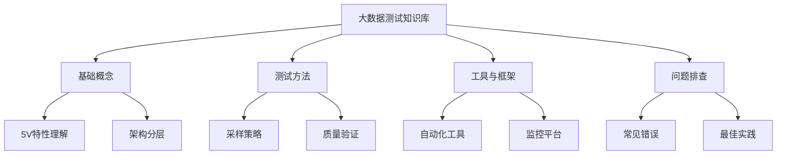
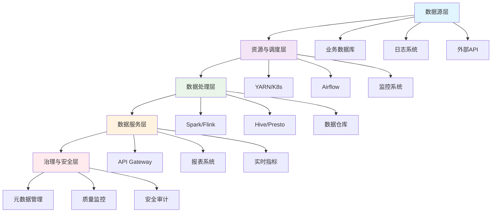
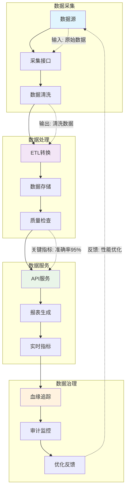
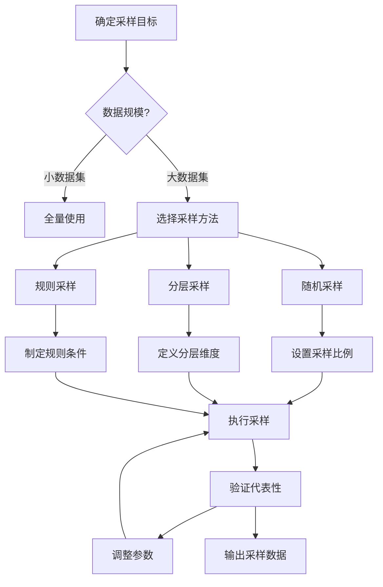
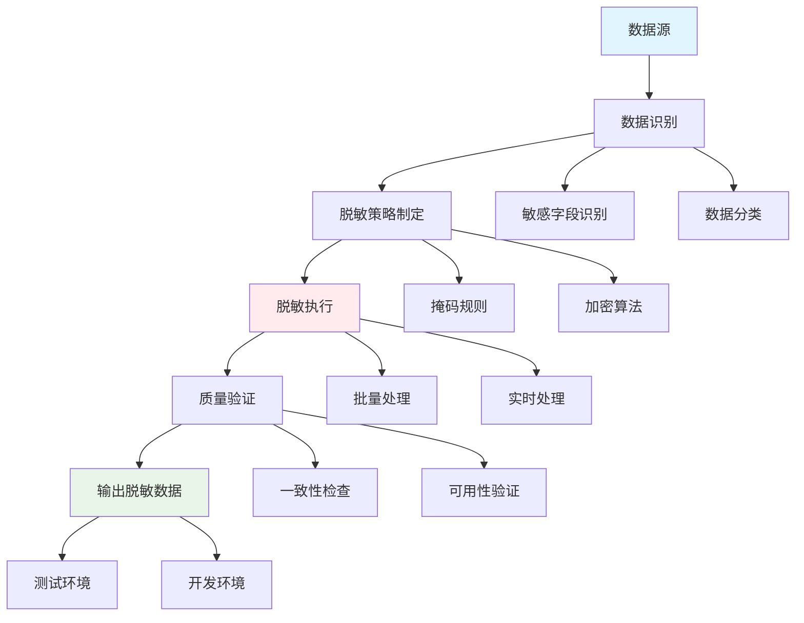
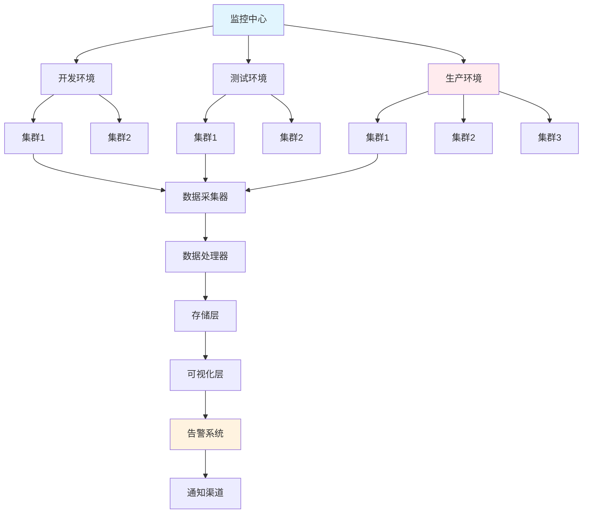

<a id="第1章-大数据与大数据系统概述【入门】"></a>

### 第1章 大数据与大数据系统概述【入门】

**本章学习目标**

1. 理解大数据的核心概念、5V特性及其判定标准，能够区分大数据场景与传统数据处理场景；
2. 掌握大数据系统典型架构的分层设计，识别各层的核心组件和质量关注点；
3. 画出你们系统的数据链路并标出质量关注点、可观测点与基线位置；
4. 掌握大数据测试数据管理的基本方法，包括采样策略和生成技术；
5. 了解大数据应用场景分类和数据安全治理要点；
6. 说清大数据系统在测试上的新增难点与差异，并能给出可落地的验证策略。

**实践建议**

- 用 5V 视角分析当前或目标项目，补充"证据"：规模量级（TB/PB）、数据形态样本、实时 SLA、价值密度与真实数据样例。
- 针对"价值""真实性"补充可量化指标：缺失率、重复率、延迟分布、离群占比、统计口径偏差，确保测试可度量。
- 预留可观测性：记录批次 ID、生成时间、输入数据源、版本号，便于回放与对账。
- 建立标准化的问题处理流程和知识库，提升响应、修复和复盘效率。
- 进行利益相关人访谈，共同确认场景与合规边界，并制定数据契约明确字段约束。

> **[锚点001]** 知识库清单/流程图  
> **锚点类型**: 建议  
> **锚点方法**: 清单/流程图  
> **补充建议**: 插入知识库清单或知识点流程图，涵盖测试方法、工具、常见问题，补充 YAML/JSON 示例，参考脚本 examples/01_intro/simple_data_pipeline.md。  
> **引用附件**: examples/01_intro/simple_data_pipeline.md  
> **完成情况**: 已标准化  
> **版本**: v1.0  
> **更新时间**: 2025-12-23

**大数据测试知识库清单**:

- **测试方法**: 功能测试、性能测试、数据质量测试、安全测试
- **常用工具**: JUnit、Selenium、JMeter、Spark Testing、Flink Testing
- **常见问题**: 数据一致性、延迟问题、资源瓶颈、合规风险
- **解决方案**: 自动化脚本、监控告警、数据对账、脱敏处理

**知识点流程图**:


**YAML 示例**:
```yaml
knowledge_base:
  categories:
    - name: "testing_methods"
      items: ["functional", "performance", "data_quality", "security"]
    - name: "tools"
      items: ["junit", "jmeter", "spark_testing", "flink_testing"]
    - name: "common_issues"
      items: ["data_consistency", "latency", "resource_bottleneck", "compliance_risk"]
```
#### 1.1 大数据概念与特点

##### 1.1.1 大数据的判定标准

大数据场景的判定需要从多个维度综合评估，不能仅凭数据量级简单判断：

**数据规模维度：**
- **存储容量**：单机存储无法满足，需分布式存储（如 HDFS、S3、OSS）
- **计算资源**：单机 CPU/内存不足，需集群计算资源
- **网络带宽**：数据传输量大，对网络带宽要求高

**处理复杂度维度：**
- **实时性要求**：需要分钟级甚至秒级响应，传统批处理无法满足
- **数据多样性**：结构化、半结构化、非结构化数据并存，需统一处理
- **并发处理**：高并发读写，传统数据库锁机制成为瓶颈

**技术栈信号：**
- 必须引入分布式文件系统、分布式查询引擎
- 需要消息队列（如 Kafka、RabbitMQ）处理数据流
- 采用流式处理框架（如 Flink、Spark Streaming）进行实时计算
- 使用列式存储（如 Parquet、ORC）优化查询性能

**业务场景信号：**
- 用户行为分析、推荐系统、风控系统等需要处理海量用户数据
- IoT设备数据采集、日志分析等高频数据写入场景
- 实时监控、预警系统等对延迟敏感的业务场景

##### 1.1.2 5V 特性
1. **体量（Volume）**：数据规模从 TB 到 PB 甚至更大，单机难以承载。
2. **多样性（Variety）**：结构化、半结构化、非结构化数据并存。
3. **速度（Velocity）**：数据产生和处理速度快，要求实时/准实时响应。
4. **价值密度低（Value）**：有用信息比例低，需要高效挖掘。
5. **真实性（Veracity）**：数据中存在噪声、缺失、异常，需质量保障。

> **[锚点002]** 5V特性可视化建议  
> **锚点类型**: 建议  
> **锚点方法**: 可视化+表格+YAML  
> **补充建议**: 用可视化方式帮助读者理解大数据5V特性。插入5V雷达图或表格，字段包括体量（TB/PB）、多样性（结构化/非结构化）、速度（实时/批量）、价值（信息密度）、真实性（异常/缺失率）。补充 YAML/JSON 示例，便于自动化生成。  
> **引用附件**: examples/01_intro/simple_data_pipeline.md  
> **完成情况**: 已标准化  
> **版本**: v1.0  
> **更新时间**: 2025-12-23

**5V特性雷达图**:


**5V特性评估表格**

| 特性 | 描述 | 示例指标 | 评估等级 |
|---|---|---|---|
| Volume | 数据体量（TB/PB） | 存储容量 > 1PB | 高 |
| Variety | 数据多样性 | 结构化/非结构化比例 | 中 |
| Velocity | 处理速度 | 实时响应 < 1s | 高 |
| Value | 价值密度 | 有效信息占比 < 10% | 低 |
| Veracity | 数据真实性 | 异常/缺失率 < 5% | 中 |

**YAML 示例**:
```yaml
bigdata_5v_assessment:
  volume:
    scale: "PB"
    threshold: 1000
    current: 500
  variety:
    structured_ratio: 0.3
    unstructured_ratio: 0.7
  velocity:
    realtime_sla: "1s"
    batch_window: "1h"
  value:
    info_density: 0.05
    extraction_cost: "high"
  veracity:
    missing_rate: 0.02
    anomaly_rate: 0.03
```

> 实践建议  
>
> - 用 5V 视角分析当前或目标项目，补充“证据”：规模量级（TB/PB）、数据形态样本、实时 SLA、价值密度与真实数据样例。
> - 针对“价值”“真实性”补充可量化指标：缺失率、重复率、延迟分布、离群占比、统计口径偏差，确保测试可度量。
> - 预留可观测性：记录批次 ID、生成时间、输入数据源、版本号，便于回放与对账。

---

#### 1.2 大数据系统典型架构与组件

- 大数据系统是一条“数据价值流水线”，常见分层与质量关注点：
  - **数据源层**：业务库、日志、外部/第三方数据；关注采样代表性、接口契约、数据新鲜度。
  - **资源与调度层**：资源管理、作业编排、弹性伸缩；关注资源配额、抢占/优先级、失败重试策略、回滚与再平衡。
  - **数据服务层**：报表、API、特征服务、实时指标；关注接口契约、指标口径、缓存一致性、SLO 与回退策略。

  - **治理与安全层**：元数据、数据质量、血缘、安全与合规；关注口径治理、血缘闭环、审计、脱敏、访问控制与留痕。
> **[锚点003]** 大数据系统分层架构图  
> **锚点类型**: 建议  
> **锚点方法**: 分层架构图  
> **补充建议**: 梳理分层架构，标注关键组件、接口、质量关注点，补充 YAML/JSON 示例，参考脚本 examples/03_arch_review/arch_review_checklist.md。  
> **引用附件**: /tools/qa_summary.py  
> **完成情况**: 已标准化  
> **版本**: v1.0  
> **更新时间**: 2025-12-23

**大数据系统分层架构图**:


**YAML 示例**:
```yaml
bigdata_architecture:
  layers:
    - name: "data_source"
      components: ["business_db", "logs", "external_api"]
      quality_concerns: ["data_freshness", "contract_compliance"]
    - name: "resource_scheduling"
      components: ["yarn", "kubernetes", "airflow"]
      quality_concerns: ["resource_quota", "job_scheduling", "failover"]
    - name: "data_processing"
      components: ["spark", "flink", "hive"]
      quality_concerns: ["data_consistency", "performance_sla"]
    - name: "data_service"
      components: ["api_gateway", "reporting", "real_time_metrics"]
      quality_concerns: ["api_contract", "cache_consistency"]
    - name: "governance_security"
      components: ["metadata", "quality_monitor", "audit"]
      quality_concerns: ["data_lineage", "security_compliance"]
```

> **[锚点004]** 数据价值流水线流程图  
> **锚点类型**: 建议  
> **锚点方法**: 流程图  
> **补充建议**: 插入 Swimlane 流程图，分阶段标注输入、输出、关键指标，补充 YAML/JSON 示例，参考脚本 examples/03_arch_review/arch_review_checklist.md。  
> **引用附件**: /tools/qa_summary.py  
> **完成情况**: 已标准化  
> **版本**: v1.0  
> **更新时间**: 2025-12-23

**数据价值流水线流程图**:


**YAML 示例**:
```yaml
data_pipeline:
  stages:
    - name: "collection"
      input: "raw_data_sources"
      output: "cleaned_data"
      key_metrics: ["collection_success_rate", "data_freshness"]
    - name: "processing"
      input: "cleaned_data"
      output: "processed_data"
      key_metrics: ["processing_accuracy", "latency_sla"]
    - name: "serving"
      input: "processed_data"
      output: "api_responses"
      key_metrics: ["api_availability", "response_time"]
    - name: "governance"
      input: "pipeline_logs"
      output: "audit_reports"
      key_metrics: ["compliance_score", "data_lineage_completeness"]
```

- **计算**：`Spark`（批/流）、`Flink`（流/批一体）、`Hive`/`Trino`/`Presto`（交互查询）、`MapReduce`（离线批）、`Ray`（通用分布式）。
- **调度与资源**：`YARN`、`Kubernetes`、`Airflow`、`DolphinScheduler`、`Argo`；关注编排、依赖、重试、优先级、回滚。
- **数据服务与 API**：`Superset`、`Tableau`、`Grafana`、`API Gateway`；关注缓存一致性、口径对齐、版本兼容。
- **治理与可观测性**：`Atlas`、`Data Catalog`、血缘/质量规则平台、审计/监控/追踪系统；关注口径卡片、契约、质量门与留痕。
> 
> - 建立标准化的问题处理流程和知识库，提升响应、修复和复盘效率。
---

- **时间与新鲜度**：需要 T+0、T+1 还是历史快照；季节性/节假日特征是否覆盖。
- **质量与对账**：哪些指标要对账（量、唯一性、业务指标），容忍度与阈值是什么。
- 利益相关人访谈：业务/产品/数据/安全/运维，共同确认场景与合规边界。
- 数据契约：明确字段含义、约束、可空、单位、取值范围、演进规则。
> 实践建议  
> 
>  
> - 测试计划评审时同步测试数据需求与口径，避免“跑通了但口径不对”。
> - 为不同测试类型（功能/性能/回归/安全）分层给出数据清单，标记复用程度。
> **[锚点005]** 测试数据清单表格  
> **锚点类型**: 建议  
> **锚点方法**: 表格  
> **补充建议**: 插入表格，列出各类测试数据类型、样例、来源、用途，补充 YAML/JSON 示例，参考脚本 examples/05_testdata/data_factory.py。  
> **引用附件**: examples/05_testdata/data_factory.py  
> **完成情况**: 已标准化  
> **版本**: v1.0  
> **更新时间**: 2025-12-23

**测试数据清单表格**

| 数据类型 | 样例 | 来源 | 用途 | 复用程度 |
|---|---|---|---|---|
| 用户行为数据 | 点击流日志、购买记录 | 生产环境采样 | 功能测试、性能测试 | 高 |
| 产品数据 | 商品信息、库存数据 | 业务数据库导出 | 数据质量测试、回归测试 | 中 |
| 异常数据 | 脏数据、缺失值数据 | 人工生成 | 边界测试、容错测试 | 低 |
| 历史数据 | 时间序列数据 | 数据仓库 | 趋势分析测试 | 高 |
| 模拟数据 | Faker生成的用户信息 | 脚本生成 | 单元测试、集成测试 | 中 |

**YAML 示例**:
```yaml
test_data_inventory:
  datasets:
    - type: "user_behavior"
      sample: "clickstream_logs"
      source: "production_sampling"
      purpose: ["functional_testing", "performance_testing"]
      reuse_level: "high"
    - type: "product_data"
      sample: "product_catalog"
      source: "business_db_export"
      purpose: ["data_quality_testing", "regression_testing"]
      reuse_level: "medium"
    - type: "anomaly_data"
      sample: "dirty_missing_data"
      source: "manual_generation"
      purpose: ["boundary_testing", "fault_tolerance"]
      reuse_level: "low"
```

#### 1.3 测试数据管理与生成方法

- 传统测试：以功能、接口、单元测试为主，性能关注 QPS/响应时间、单机资源占用。
- 大数据测试：更关注数据质量、端到端对账、批/流作业吞吐与延迟、数据一致性/幂等性、资源利用率、基线与漂移、成本与弹性。
- 常用验证手段：
  - 统计性验证：分布、聚合、采样比对，避免逐条对账开销。
- **优点**：高度还原真实场景，覆盖复杂分布和异常模式。
- **常用方法**：
  - 随机采样：简单高效，但可能遗漏边界与罕见异常。
  - 分层采样：按业务维度/时间/地域/客群分层，提升代表性与稳定性。

  - 规则采样：定向提取高风险、高价值、异常或峰值场景。
> **[锚点006]** 采样方法对比表/流程图  
> **锚点类型**: 建议  
> **锚点方法**: 对比表/流程图  
> **补充建议**: 插入采样方法对比表或流程图，涵盖随机采样、分层采样、规则采样等，补充 YAML/JSON 示例，参考脚本 examples/05_testdata/data_factory.py。  
> **引用附件**: examples/05_testdata/data_factory.py  
> **完成情况**: 已标准化  
> **版本**: v1.0  
> **更新时间**: 2025-12-23

**采样方法对比表**

| 方法 | 优点 | 缺点 | 适用场景 | 代表性 |
|---|---|---|---|---|
| 随机采样 | 简单高效，无偏 | 可能遗漏边界异常 | 大数据集快速验证 | 中等 |
| 分层采样 | 提升代表性，覆盖各维度 | 需预知分层标准 | 业务维度多样化场景 | 高 |
| 规则采样 | 定向覆盖高风险场景 | 可能过度采样 | 异常模式识别 | 高 |

**采样流程图**:


**YAML 示例**:
```yaml
sampling_methods:
  random:
    advantages: ["simple", "unbiased"]
    disadvantages: ["miss_edge_cases"]
    applicability: "large_datasets"
  stratified:
    advantages: ["high_representativeness", "dimensional_coverage"]
    disadvantages: ["requires_layering_knowledge"]
    applicability: "diverse_business_scenarios"
  rule_based:
    advantages: ["targeted_coverage", "risk_focused"]
    disadvantages: ["potential_over_sampling"]
    applicability: "anomaly_detection"
```

> **[锚点007]** 采样脚本示例  
> **锚点类型**: 建议  
> **锚点方法**: 脚本示例  
> **补充建议**: 插入 Python/Faker/SQL/Property-based 采样脚本片段，补充 YAML/JSON 示例，参考脚本 examples/05_testdata/data_factory.py。  
> **引用附件**: examples/05_testdata/data_factory.py  
> **完成情况**: 已标准化  
> **版本**: v1.0  
> **更新时间**: 2025-12-23

**Python 随机采样脚本示例**:
```python
import pandas as pd
import numpy as np

def random_sampling(dataframe, sample_ratio=0.1, random_state=42):
    """
    随机采样函数
    :param dataframe: 输入数据框
    :param sample_ratio: 采样比例
    :param random_state: 随机种子
    :return: 采样后的数据框
    """
    sample_size = int(len(dataframe) * sample_ratio)
    sampled_df = dataframe.sample(n=sample_size, random_state=random_state)
    return sampled_df

# 使用示例
# df = pd.read_csv('large_dataset.csv')
# sampled_df = random_sampling(df, sample_ratio=0.05)
```

**Faker 生成测试数据脚本**:
```python
from faker import Faker
import pandas as pd

fake = Faker('zh_CN')

def generate_user_data(num_records=1000):
    """
    使用 Faker 生成用户测试数据
    """
    data = []
    for _ in range(num_records):
        user = {
            'user_id': fake.uuid4(),
            'name': fake.name(),
            'email': fake.email(),
            'phone': fake.phone_number(),
            'address': fake.address(),
            'registration_date': fake.date_this_year()
        }
        data.append(user)
    return pd.DataFrame(data)

# 生成数据
# user_df = generate_user_data(500)
```

**YAML 示例**:
```yaml
sampling_scripts:
  python_random:
    library: "pandas"
    method: "sample"
    parameters:
      ratio: 0.1
      random_state: 42
  faker_generation:
    library: "faker"
    locale: "zh_CN"
    fields: ["user_id", "name", "email", "phone", "address"]
  sql_sampling:
    query: "SELECT * FROM table ORDER BY RAND() LIMIT 1000"
    database: "mysql"
```
- **注意点**：控制抽样比例、去标识化、去除敏感字段，记录抽样口径与时间窗口。

**测试数据管理注意事项**:
- 采样比例控制：根据数据集大小和测试目标设置合理比例（通常1%-10%）
- 去标识化处理：移除或掩码个人敏感信息，符合隐私保护法规
- 敏感字段去除：删除密码、身份证等高风险字段，避免安全泄露
- 抽样口径记录：明确抽样方法、时间窗口、过滤条件，便于复现
- 数据新鲜度：确保采样数据反映当前业务状态，避免过时数据导致测试无效

>

- **优点**：可控性强，便于覆盖边界、异常、极端与对抗性场景。
- **常用方法**：
  - 脚本/工具生成：Python、SQL、Faker、Property-based 测试工具。
  - 规则/约束驱动：按字段约束、业务校验规则、跨字段依赖自动生成。
  - 混合生成：真实分布 + 人工注入异常/脏数据/极端值。
- **注意点**：提前定义合法/非法/边界值集合，避免生成结果与业务规则冲突。
#### 1.4 大数据应用场景与业务价值

大数据技术在各行业的应用已经深入到业务核心，形成了多个成熟的应用场景：

**用户行为分析场景：**
- **电商推荐系统**：基于用户浏览、点击、购买行为数据，实时推荐个性化商品
- **内容分发平台**：根据用户兴趣和行为模式，优化内容推送策略
- **广告投放系统**：精准广告定向，提高ROI（投资回报率）

**风险控制场景：**
- **金融风控**：实时分析交易行为，识别欺诈和异常交易
- **保险理赔**：基于历史理赔数据，评估风险和定价
- **信用评估**：多维度数据融合，构建用户信用画像

**物联网与智能制造：**
- **设备预测性维护**：基于传感器数据，预测设备故障
- **供应链优化**：实时监控库存和物流状态，优化供应链效率
- **质量检测**：工业视觉和传感器数据分析，提升产品质量

**具体行业案例**:
- **电商平台**：每日处理10TB用户行为数据，实时推荐准确率需>90%，关键指标包括点击率、转化率和个性化匹配度
  - 点击率计算公式：点击率 = (点击次数 / 展示次数) × 100%
  - 转化率计算公式：转化率 = (购买用户数 / 访问用户数) × 100%
- **金融风控系统**：处理PB级交易数据，风控模型准确率需>95%，关注欺诈检测率和误报率控制在1%以内
  - 准确率计算公式：准确率 = (正确预测数 / 总预测数) × 100%
  - 误报率计算公式：误报率 = (误报数 / 总预测数) × 100%
- **智能交通**：实时处理城市交通传感器数据，预测拥堵准确率>85%，关键指标包括数据延迟<500ms和完整性>99.9%
  - 数据完整性计算公式：完整性 = (有效数据点 / 总数据点) × 100%

**数据隔离与安全考虑：**
- **环境隔离**：生产、测试、开发环境严格分离，避免数据污染
- **租户隔离**：多租户场景下数据安全隔离，防止越权访问
- **数据脱敏**：敏感信息处理前进行脱敏，保护用户隐私

> **[锚点008]** 应用场景分类表  
> **锚点类型**: 建议  
> **锚点方法**: 分类表  
> **补充建议**: 插入场景分类表，字段包括：场景、数据类型、关键指标、脚本引用，补充 YAML/JSON 示例，参考脚本 examples/01_intro/simple_data_pipeline.md。  
> **引用附件**: examples/01_intro/simple_data_pipeline.md  
> **完成情况**: 已标准化  
> **版本**: v1.0  
> **更新时间**: 2025-12-23

**应用场景分类表**

| 场景 | 数据类型 | 关键指标 | 脚本引用 |
|---|---|---|---|
| 电商推荐 | 用户行为日志、商品数据 | 点击率、转化率、个性化准确度 | examples/01_intro/simple_data_pipeline.md |
| 金融风控 | 交易记录、用户画像 | 欺诈检测率、误报率 | examples/05_testdata/data_factory.py |
| 物联网监控 | 传感器数据、设备状态 | 数据完整性、实时延迟 | examples/10_security/masking_policy_demo.py |
| 内容分发 | 用户偏好、内容元数据 | 内容匹配度、用户留存 | /tools/qa_summary.py |

**YAML 示例**:
```yaml
application_scenarios:
  ecommerce_recommendation:
    data_types: ["user_behavior_logs", "product_data"]
    key_metrics: ["click_through_rate", "conversion_rate", "personalization_accuracy"]
    script_reference: "examples/01_intro/simple_data_pipeline.md"
  financial_risk_control:
    data_types: ["transaction_records", "user_profiles"]
    key_metrics: ["fraud_detection_rate", "false_positive_rate"]
    script_reference: "examples/05_testdata/data_factory.py"
  iot_monitoring:
    data_types: ["sensor_data", "device_status"]
    key_metrics: ["data_integrity", "real_time_latency"]
    script_reference: "examples/10_security/masking_policy_demo.py"
```

> **[锚点009]** 数据隔离方式对比表  
> **锚点类型**: 建议  
> **锚点方法**: 对比表  
> **补充建议**: 插入对比表，字段包括：隔离类型、实现方式、优缺点、脚本引用，补充 YAML/JSON 示例，参考脚本 examples/10_security/masking_policy_demo.py。  
> **引用附件**: examples/10_security/masking_policy_demo.py  
> **完成情况**: 已标准化  
> **版本**: v1.0  
> **更新时间**: 2025-12-23

**数据隔离方式对比表**

| 隔离类型 | 实现方式 | 优点 | 缺点 | 脚本引用 |
|---|---|---|---|---|
| 环境隔离 | 物理/虚拟环境分离 | 完全隔离，避免污染 | 资源开销大，维护复杂 | examples/10_security/masking_policy_demo.py |
| 租户隔离 | 多租户架构，数据分区 | 资源共享，成本低 | 逻辑隔离，存在泄露风险 | examples/05_testdata/data_factory.py |
| 数据脱敏 | 敏感信息处理 | 保护隐私，合规要求 | 处理开销，数据可用性下降 | examples/10_security/masking_policy_demo.py |

**YAML 示例**:
```yaml
data_isolation_methods:
  environment_isolation:
    implementation: "physical_virtual_separation"
    advantages: ["complete_isolation", "no_contamination"]
    disadvantages: ["high_resource_cost", "complex_maintenance"]
    script_reference: "examples/10_security/masking_policy_demo.py"
  tenant_isolation:
    implementation: "multi_tenant_architecture"
    advantages: ["resource_sharing", "low_cost"]
    disadvantages: ["logical_isolation", "leakage_risk"]
    script_reference: "examples/05_testdata/data_factory.py"
  data_masking:
    implementation: "sensitive_data_processing"
    advantages: ["privacy_protection", "compliance"]
    disadvantages: ["processing_overhead", "reduced_usability"]
    script_reference: "examples/10_security/masking_policy_demo.py"
```

> **[锚点010]** 脱敏流程示意图  
> **锚点类型**: 建议  
> **锚点方法**: 流程图  
> **补充建议**: 插入脱敏流程示意图（如 Swimlane 图），字段建议：步骤/输入/输出/脚本引用，补充脱敏 YAML/JSON 示例，引用 examples/10_security/masking_policy_demo.py。  
> **引用附件**: examples/10_security/masking_policy_demo.py  
> **完成情况**: 已标准化  
> **版本**: v1.0  
> **更新时间**: 2025-12-23

**脱敏流程示意图**:


**YAML 示例**:
```yaml
data_masking_process:
  steps:
    - name: "data_identification"
      input: "raw_data"
      output: "identified_sensitive_fields"
      script_reference: "examples/10_security/masking_policy_demo.py"
    - name: "strategy_definition"
      input: "identified_fields"
      output: "masking_rules"
      methods: ["masking", "encryption", "pseudonymization"]
    - name: "execution"
      input: "raw_data + rules"
      output: "masked_data"
      modes: ["batch", "real_time"]
    - name: "validation"
      input: "masked_data"
      output: "validation_report"
      checks: ["consistency", "usability"]
```

#### 1.5 大数据测试环境与安全考虑

- 监控环境健康、资源利用、作业运行、数据链路、质量与安全关键指标。
- 支持多环境、多集群、多地域的统一监控与告警，分租户/项目隔离视图。
- 监控内容：CPU/内存/磁盘/网络、队列等待、作业 SLA、数据延迟与丢失、配置/权限漂移、证书/密钥到期、成本异常。
> **[锚点011]** 环境监控关键指标表  
> **锚点类型**: 建议  
> **锚点方法**: 指标表  
> **补充建议**: 插入环境监控关键指标表，列明各监控项、阈值与采集方式，说明各指标的监控意义，可补充 YAML/JSON 示例。  
> **引用附件**: 无  
> **完成情况**: 已标准化  
> **版本**: v1.0  
> **更新时间**: 2025-12-23

**环境监控关键指标表**

| 监控项 | 阈值 | 采集方式 | 监控意义 |
|---|---|---|---|
| CPU使用率 | >80% | 系统命令/Agent | 识别计算瓶颈 |
| 内存使用率 | >85% | 系统监控 | 防止内存溢出 |
| 磁盘I/O | >90% | 存储监控 | 检测I/O性能问题 |
| 网络带宽 | >70% | 网络监控 | 确保数据传输效率 |
| 作业延迟 | >5min | 应用日志 | 监控处理时效性 |
| 数据丢失率 | >0.01% | 数据校验 | 保证数据完整性 |

**YAML 示例**:
```yaml
environment_monitoring:
  metrics:
    cpu_usage:
      threshold: 0.8
      collection: "system_commands"
      significance: "identify_compute_bottlenecks"
    memory_usage:
      threshold: 0.85
      collection: "system_monitoring"
      significance: "prevent_memory_overflow"
    disk_io:
      threshold: 0.9
      collection: "storage_monitoring"
      significance: "detect_io_performance_issues"
    network_bandwidth:
      threshold: 0.7
      collection: "network_monitoring"
      significance: "ensure_data_transfer_efficiency"
```

> **[锚点012]** 多环境多集群监控架构图  
> **锚点类型**: 建议  
> **锚点方法**: 架构图  
> **补充建议**: 插入多环境多集群监控架构图，标注关键组件与监控链路，说明架构设计思路，可补充 YAML/JSON 示例。  
> **引用附件**: 无  
> **完成情况**: 已标准化  
> **版本**: v1.0  
> **更新时间**: 2025-12-23

**多环境多集群监控架构图**:


**YAML 示例**:
```yaml
multi_environment_monitoring:
  environments:
    - name: "development"
      clusters: ["dev-cluster-1", "dev-cluster-2"]
    - name: "testing"
      clusters: ["test-cluster-1", "test-cluster-2"]
    - name: "production"
      clusters: ["prod-cluster-1", "prod-cluster-2", "prod-cluster-3"]
  components:
    data_collector: "fluentd"
    data_processor: "kafka"
    storage: "elasticsearch"
    visualization: "grafana"
    alerting: "prometheus_alertmanager"
```

##### 1.5.2 对架构与测试的影响

- 将环境监控与自动化告警纳入日常运维流程，及时发现和处理异常；关键链路设置 SLO 与错误预算。
- 定期组织环境巡检和应急演练（含跨地域切换、密钥/证书过期、配置漂移），提升故障恢复能力。
- 性能、成本、安全、合规等多目标需协同测试与监控。
- 自动化、智能化测试工具成为必备，人工巡检逐步减少。
- 测试需提前嵌入“契约/质量门/可观测性”设计，避免事后补救。
- 测试环境误用生产敏感数据，导致直接泄露或侧信道泄露。
- 脱敏不彻底或字段遗漏，存在反识别风险。
- 权限控制不严或账户共享，导致越权访问和审计缺失。
- 数据跨境/跨部门流转无审批与留痕，触发合规风险。

>

- 严格区分生产与测试环境，敏感数据只允许脱敏后流入测试；跨环境流转需审批。
- 建立分级脱敏标准和自动化流程，覆盖全字段并输出脱敏报告。
- 最小权限与时间限定访问，周期性权限复核与密钥轮换。
- 全链路留痕：数据流转、导入导出、访问日志、回放日志；接入 SIEM/审计平台。
- 对截图、导出文件、临时落盘路径设定保护策略和到期销毁策略。

#### 1.5.3 实战练习

**练习1：5V特性项目分析**
- 选择一个实际项目，分析其5V特性
- 补充量化指标：数据规模、处理速度、价值密度等
- 绘制简单的雷达图评估当前状态
- 预估时间：30分钟；难度等级：初级

**练习2：数据链路绘制**
- 绘制项目的数据链路图
- 标注各层的质量关注点和可观测点
- 识别潜在的测试难点和验证策略
- 预估时间：45分钟；难度等级：中级

**练习3：测试数据规划**
- 为项目制定测试数据清单
- 选择合适的采样方法并说明理由
- 设计数据质量测试的3个核心目标
- 预估时间：60分钟；难度等级：中级

#### 1.6 本章小结

通过本章的学习，你应该已经掌握了大数据系统的核心概念和基础架构。下一章将深入探讨大数据测试的概念与目标，帮助你建立完整的测试认知框架。

**核心概念掌握：**
- 理解大数据的5V特性及其判定标准，能够识别大数据场景
- 掌握大数据系统分层架构设计，了解各层组件和质量关注点
- 熟悉大数据测试数据管理的基本方法和采样策略

**实践能力提升：**
- 能够绘制系统数据链路图，识别质量关注点和可观测点
- 掌握测试数据生成和管理的实用技术
- 了解大数据应用场景分类和数据安全治理要点

**测试思维转变：**
- 从传统功能测试思维转向大数据质量保障思维
- 关注端到端数据对账、一致性验证和性能基线管理
- 理解自动化测试和可观测性在大数据测试中的重要性

**安全合规意识：**
- 遵循国家/行业法规（如网络安全法、数据安全法、GDPR等），留存合规证明
- 对个人信息、金融、医疗等高敏感领域制定专项管理规范与例外审批流程
- 对外部数据源与跨境传输执行数据地图与风险评估，必要时做本地化处理

> 实践建议
>
> - 将数据安全列入测试风险清单，合规团队参与评审与抽检
> - 定期自查脱敏、权限、留痕；发现违规流转及时隔离、销毁并通报
> - 建立测试环境的数据资产清单，明确数据来源、使用范围和清理策略

**学习成果检验：**
1. 画出你们系统的数据链路图，标注每一层的主要组件和质量关注点
2. 结合一个实际业务场景，写出数据质量测试的3个核心目标
3. 关注新技术趋势，思考如何将自动化和智能化测试引入到你的项目中

**扩展阅读**:
- **第2章：大数据测试概念与目标** - 深入了解测试类型矩阵和质量门机制
- **大数据5V特性论文** - 搜索学术论文了解5V特性的最新研究进展
- **大数据架构最佳实践** - 参考AWS/Azure等云服务商的大数据架构指南
- **测试数据管理工具** - 探索Faker、Great Expectations等数据质量工具
4. 分析项目中的大数据判定标准，判断是否需要大数据测试方法
5. 制定一个简单的测试数据采样计划，包括方法选择和比例设定
6. 识别项目中的安全合规风险点，并提出相应的测试策略

<a id="第2章-大数据测试概念与目标基础篇"></a>