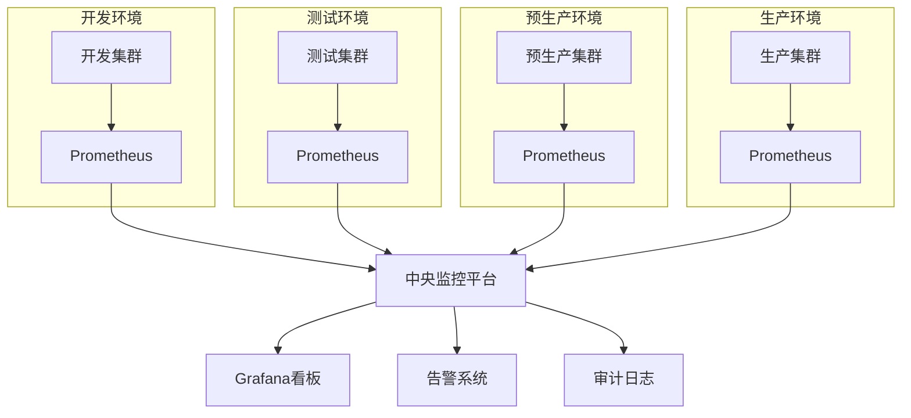

<a id="第4章-大数据测试环境搭建基础【环境与运维篇】"></a>

### 第4章 大数据测试环境搭建基础【环境与运维篇】

**本章学习目标**

1. 画出你们团队的测试环境拓扑并指出主要风险点；
2. 写出一份适合你们项目的环境容量规划与搭建清单；
3. 设计一个简单可执行的环境变更与回滚流程。

**实践建议**

- 为关键作业设定 SLI/SLO（延迟、吞吐、成本/作业），并用基线用例持续回归。
- 大规模作业在准生产环境做"放量+故障注入+扩缩容"组合测试，记录瓶颈与降级路径。
- 记录环境配置/镜像/数据批次/凭据的变更历史与审批，便于追溯与回滚。

#### 4.1 测试环境类型与特点（开发/测试/预生产/生产镜像）

##### 4.1.2 环境隔离与切换

- 物理或逻辑隔离（网络/VPC/命名空间/租户/队列），防止数据串扰与权限越界。
- 支持一键切换配置、数据源、凭据和访问权限；敏感数据默认脱敏与最小权限。
- 预设回滚与快照，环境可快速复原；记录环境基线（版本、配置、镜像、数据批次）。

> 实践建议  
> 
> 
> - 为关键作业设定 SLI/SLO（延迟、吞吐、成本/作业），并用基线用例持续回归。
> - 大规模作业在准生产环境做“放量+故障注入+扩缩容”组合测试，记录瓶颈与降级路径。
> - 记录环境配置/镜像/数据批次/凭据的变更历史与审批，便于追溯与回滚。

---

#### 4.2 测试环境需求分析与容量规划

##### 4.2.2 容量规划方法

> **[锚点022]** Python容量规划计算示例  
> **锚点类型**: 建议  
> **锚点方法**: 脚本示例  
> **补充建议**: 【目标】提供容量规划的Python计算示例。建议步骤：1. 输出基于生产消耗的缩放计算脚本。2. 包含CPU、内存、存储等资源评估。详见主书稿。  
> **引用附件**: /tools/qa_summary.py  
> **状态**: 已完成  
> **版本**: v1.0  
> **时间戳**: 2025-12-23  

```python
# 容量规划计算示例：基于生产消耗的缩放
def calculate_test_capacity(prod_cpu, prod_mem_gb, prod_storage_tb, scale_factor=0.1):
    """
    计算测试环境容量
    :param prod_cpu: 生产CPU核心数
    :param prod_mem_gb: 生产内存GB
    :param prod_storage_tb: 生产存储TB
    :param scale_factor: 缩放因子 (e.g., 0.1 for 1/10 scale)
    :return: 测试环境推荐容量
    """
    test_cpu = max(4, int(prod_cpu * scale_factor))  # 最小4核心
    test_mem_gb = max(16, prod_mem_gb * scale_factor)  # 最小16GB
    test_storage_tb = max(1, prod_storage_tb * scale_factor)  # 最小1TB
    
    # 预留冗余 (20%)
    redundancy = 1.2
    test_cpu = int(test_cpu * redundancy)
    test_mem_gb = test_mem_gb * redundancy
    test_storage_tb = test_storage_tb * redundancy
    
    return {
        'cpu_cores': test_cpu,
        'memory_gb': round(test_mem_gb, 1),
        'storage_tb': round(test_storage_tb, 1)
    }

# 示例使用
prod_resources = {'cpu': 100, 'mem': 500, 'storage': 50}  # 生产环境
test_resources = calculate_test_capacity(**prod_resources)
print(f"测试环境推荐容量: {test_resources}")
# 输出: {'cpu_cores': 12, 'memory_gb': 120.0, 'storage_tb': 12.0}
```

> **环境复杂度评估公式**  
> 为了量化环境管理的复杂度，可使用以下简单公式：  
> $$ \text{复杂度评分} = \frac{\text{环境数量} \times \text{组件数}}{\text{隔离级别}} $$  
> 示例：若有4个环境、20个组件、隔离级别为3（高隔离），则评分 ≈ 26.7（越高越复杂，需加强变更控制）。此公式帮助从测试视角评估环境管理风险。

参考生产消耗按比例缩放（1/10、1/3 或基于关键链路的等比缩放），对压测/回放链路适当放大。
- 预留高峰与突发冗余，关注 CPU/内存/IO/网络/队列/连接池上限。
- 评估存储/计算/网络瓶颈，规划分区分桶、冷热分层、缓存与限流策略。
- 为关键作业设定性能与成本双基线，建立容量告警与扩缩容阈值。

##### 4.2.3 典型容量规划清单

- 计算节点/实例规格与数量（CPU/内存/磁盘/IOPS）
- 存储容量（HDFS/对象存储/数据库），分区/冷热/压缩策略
- 网络带宽、延迟、跨区/跨云链路与出口成本
- 组件服务实例数、高可用/主备/多 AZ，连接池/队列/Topic/并发限制
- 监控/日志/追踪与审计存储预算，成本配额与标签

> 实践建议  

>

> - 搭建前与业务/开发/运维/安全对齐容量、预算与扩容策略，形成书面清单与审批记录。
> - 定期复盘资源与账单，调整配额/限流/调度权重，避免测试环境“吃掉”生产资源。

---

#### 4.3 测试环境搭建流程与常用工具

##### 4.3.2 常用工具与平台

> **[锚点023]** 大数据测试环境常用工具对比表  
> **锚点类型**: 建议  
> **锚点方法**: 对比表  
> **补充建议**: 【目标】梳理大数据测试环境常用工具对比。建议步骤：1. 输出自动化部署、监控、IaC等工具对比。2. 用表格结构总结优缺点与适用场景。详见主书稿。  
> **引用附件**: /tools/qa_summary.py  
> **状态**: 已完成  
> **版本**: v1.0  
> **时间戳**: 2025-12-23  

| 工具类别 | 工具名称 | 优点 | 缺点 | 适用场景 |
|----------|----------|------|------|----------|
| IaC | Terraform | 跨云支持、状态管理、模块化 | 学习曲线陡峭、HCL语法 | 多云环境、复杂基础设施 |
| IaC | Ansible | 简单易用、Agentless、丰富模块 | 大规模时性能较慢 | 快速部署、配置管理 |
| 监控 | Prometheus | 时间序列数据库、强大查询、集成Grafana | 存储扩展复杂 | 指标监控、告警 |
| 监控 | Zabbix | 企业级、多种监控方式 | 配置复杂、界面较旧 | 传统企业环境 |
| 部署 | CloudFormation | AWS原生、集成服务 | AWS限定 | AWS云环境 |
| 部署 | Cloudera Manager | 大数据栈优化、一键安装 | 商业化、成本高 | Hadoop/Spark集群 |

**自动化部署工具**：Ansible、Terraform、CloudFormation、SaltStack（IaC 优先）
- **大数据平台安装器**：Ambari、Cloudera Manager、KubeOperator、云厂商一键部署服务
- **环境即代码（IaC）**：用脚本/配置文件描述环境与参数，支持幂等、审计、回滚
- **监控/告警/审计**：Prometheus、Grafana、Zabbix、云平台监控；日志/追踪/审计中心
- **成本与配额**：云成本看板、配额守护、标签计费工具

> 实践建议  

>

> - 优先采用自动化部署和 IaC，减少手工与配置漂移；所有参数与密钥纳入管控。
> - 搭建后务必做健康检查、对账/回放、性能与成本基线测试，生成报告存档。

---

#### 4.4 多集群、多租户环境管理

##### 4.4.2 多租户管理

> **[锚点024]** 环境监控关键指标表  
> **锚点类型**: 建议  
> **锚点方法**: 关键指标表  
> **补充建议**: 【目标】梳理环境监控关键指标。建议步骤：1. 输出CPU、内存、网络等关键指标。2. 用表格结构总结阈值与采集方式。详见主书稿。  
> **引用附件**: /tools/qa_summary.py  
> **状态**: 已完成  
> **版本**: v1.0  
> **时间戳**: 2025-12-23  

| 指标类别 | 具体指标 | 阈值建议 | 采集方式 | 告警级别 |
|----------|----------|----------|----------|----------|
| CPU | 使用率 | >80% | Prometheus/Node Exporter | 高 |
| 内存 | 使用率 | >85% | 系统监控 | 高 |
| 磁盘 | IOPS/使用率 | >90% | 系统监控 | 中 |
| 网络 | 带宽/延迟 | >70%/ >100ms | 网络监控 | 中 |
| 队列 | 积压消息数 | >1000 | Kafka监控 | 高 |
| 连接池 | 活跃连接 | >80% | 应用监控 | 中 |
| 存储 | 容量使用率 | >85% | HDFS/S3监控 | 高 |
| 成本 | 小时费用 | 超预算20% | 云计费API | 中 |

- 同集群内通过命名空间/队列/资源池实现多租户隔离；限制跨租户访问。
- 支持租户级配额、权限、监控/告警、成本与审计；敏感数据默认最小权限与脱敏。

##### 4.4.3 管理策略

> **[锚点025]** 多环境多集群监控架构图  
> **锚点类型**: 建议  
> **锚点方法**: 架构图  
> **补充建议**: 【目标】绘制多环境多集群监控架构图。建议步骤：1. 标注关键组件与监控链路。2. 说明架构设计思路与跨集群管理。详见主书稿。  
> **引用附件**: /tools/qa_summary.py  
> **状态**: 已完成  
> **版本**: v1.0  
> **时间戳**: 2025-12-23  



- 制定集群/租户命名规范、资源/配额/优先级策略，统一标签与计费。
- 配置租户级访问控制、审计、监控/告警、成本看板；异常占用自动告警。
- 定期评估资源利用与成本，动态调整或迁移；保留演练与回退脚本。

> 实践建议  

>

> - 大型组织可采用多集群+多租户混合模式，关键链路独立集群，低风险场景共用集群。
> - 建立统一管理平台：集中监控/告警/审计/成本/容量，支持跨集群回放与演练。

---

#### 4.5 测试环境维护与变更控制

##### 4.5.2 变更控制流程

> **[锚点026]** 恢复路径与回退策略对比表  
> **锚点类型**: 建议  
> **锚点方法**: 对比表  
> **补充建议**: 【目标】梳理恢复路径与回退策略对比。建议步骤：1. 输出快照、脚本、灰度等策略对比。2. 用表格结构总结优缺点与适用场景。详见主书稿。  
> **引用附件**: /tools/qa_summary.py  
> **状态**: 已完成  
> **版本**: v1.0  
> **时间戳**: 2025-12-23  

| 策略 | 优点 | 缺点 | 适用场景 | 恢复时间 |
|------|------|------|----------|----------|
| 快照恢复 | 快速、一致性好 | 存储成本高、实时性差 | 定期备份、灾难恢复 | 分钟级 |
| 脚本回滚 | 自动化、可定制 | 依赖脚本准确性 | 配置变更、小规模更新 | 秒到分钟 |
| 灰度回滚 | 低风险、逐步验证 | 复杂、时间长 | 高风险变更、核心服务 | 分钟到小时 |
| 影子环境 | 无生产影响、充分测试 | 资源消耗大 | 重大升级、架构变更 | 小时级 |
| 蓝绿部署 | 零停机、快速切换 | 双倍资源成本 | 应用部署、服务升级 | 秒级 |

- 变更申请与评审：列出影响范围、回滚方案、验证清单（功能/性能/成本/安全/合规）。
- 变更实施与回滚：优先自动化脚本，支持一键回滚与灰度/影子验证。
- 变更记录与审计：内容/时间/责任人/审批/验证结果留痕，关联告警与事故复盘。

##### 4.5.3 常见维护难点与建议

- 避免“测试环境变成生产环境”，定期清理无用数据/账号/密钥/权限。
- 高风险操作（大规模清理、权限变更、跨区复制、重大升级）需多级审批、影子/灰度验证、自动化回滚与告警。
- 建立环境基线、快照与演练计划，定期恢复演练；记录恢复耗时与成功率。

> 实践建议  

>

> - 将维护与变更流程文档化、自动化、审计化，减少人为失误。
> - 定期组织巡检与应急/恢复演练，纳入 KPI；输出报告与改进清单。

---

#### 4.6 本章小结

- 大数据测试环境需覆盖开发、测试、预生产、生产镜像等多种类型，按需隔离和配置。
- 容量规划需结合业务场景、数据量、并发和组件服务，动态调整资源。
- 环境搭建推荐自动化部署和环境即代码，提升效率和一致性。
- 多集群、多租户管理有助于资源隔离和权限控制，适合大型组织。
- 环境维护与变更控制需流程化、自动化，保障环境安全与可用性。

> **前瞻展望**  
> 本章奠定了测试环境的基础，下一章将聚焦数据管理，确保测试数据的质量与合规。

> **阅读扩展**  
> - [Terraform官方文档](https://www.terraform.io/docs/)：IaC最佳实践。  
> - [Prometheus监控指南](https://prometheus.io/docs/)：指标采集与告警。  
> - [AWS Well-Architected Framework](https://aws.amazon.com/architecture/well-architected/)：云环境设计原则。  
> - [Kubernetes多租户](https://kubernetes.io/docs/concepts/security/multi-tenancy/)：容器化环境隔离。  
> - 相关章节：[第3篇-第12章](第3篇-第12章.md)治理与合规，[第5篇-第19章](第5篇-第19章.md)数据血缘管理。

> 动手思考  
> 1. 画出你们团队的测试环境架构图，标注各环境类型及其主要用途。  
> 2. 结合你们的业务，列出测试环境容量规划的 3 个关键指标。  
> 3. 针对一次环境变更（如组件升级），写出你会关注的 2 个风险点和应对措施。  
> **预计用时：45-60分钟**

> 示例参考：

>

> - 环境健康检查脚本示例：`examples/04_env/env_health_check.py`
> - 最小化 IaC 片段（选读）：`examples/04_env_iac/env_minimal.tf`

> **章节自评清单**  
> - [ ] 我能识别不同测试环境类型的特点和隔离要求。  
> - [ ] 我理解容量规划的关键指标和计算方法。  
> - [ ] 我熟悉测试环境搭建的常用工具和IaC实践。  
> - [ ] 我能设计多集群、多租户的环境管理策略。  
> - [ ] 我掌握环境变更控制和回滚策略的流程。

> **本章关键字总结**  
> 测试环境、容量规划、IaC、多租户、变更控制、监控指标、回滚策略。

<a id="第5章-大数据测试数据管理基础数据管理篇"></a>