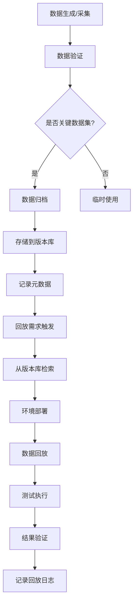

<a id="第5章-大数据测试数据管理基础【数据管理篇】"></a>

### 第5章 大数据测试数据管理基础【数据管理篇】

**本章学习目标**

1. 为真实项目写出一份有结构的测试数据需求清单；
2. 设计结合采样、造数、脱敏的测试数据准备方案；
3. 搭出一条"数据版本–归档–回放"的简单闭环流程。

**实践建议**

- 在测试设计初期就与业务、开发、数据团队沟通，明确测试数据需求
- 针对不同测试类型（功能、性能、回归等）制定差异化的数据需求清单

#### 5.1 测试数据需求分析

##### 5.1.2 需求分析的关键维度

- **业务覆盖**：是否能覆盖主要业务流程、关键字段、典型数据分布
- **数据规模**：是否能模拟生产级别的数据量和分布
- **数据多样性**：是否包含多种类型、格式、边界和异常数据
- **数据新鲜度**：是否需要最新数据，还是历史快照即可
- **合规与安全**：是否涉及敏感信息，需不需要脱敏或权限控制

> **测试数据复杂度评估公式**  
> 为了量化测试数据准备的复杂度，可使用以下简单公式：  
> $$ \text{复杂度评分} = \frac{\text{数据类型数} \times \text{数据规模因子}}{\text{合规级别}} $$  
> 示例：若有5种数据类型、规模因子为10（大数据）、合规级别为3（高敏感），则评分 ≈ 16.7（越高越复杂，需加强数据管理）。此公式帮助从测试视角评估数据准备风险。

> 实践建议  

>

> - 在测试设计初期就与业务、开发、数据团队沟通，明确测试数据需求
> - 针对不同测试类型（功能、性能、回归等）制定差异化的数据需求清单

---

#### 5.2 测试数据设计与生成方法（采样/合成/脱敏）

##### 5.2.2 数据合成与造数

> **[锚点027]** Python数据合成示例  
> **锚点类型**: 建议  
> **锚点方法**: 脚本示例  
> **补充建议**: 【目标】提供数据合成的Python示例。建议步骤：1. 输出使用Faker等库生成测试数据的脚本。2. 包含边界、异常数据生成逻辑。详见主书稿。  
> **引用附件**: /tools/qa_summary.py  
> **状态**: 已完成  
> **版本**: v1.0  
> **时间戳**: 2025-12-23  

```python
# 数据合成示例：使用Faker生成测试数据
from faker import Faker
import pandas as pd
import random

fake = Faker('zh_CN')  # 中文数据

def generate_test_data(num_records=1000):
    data = []
    for _ in range(num_records):
        record = {
            'user_id': fake.uuid4(),
            'name': fake.name(),
            'email': fake.email(),
            'phone': fake.phone_number(),
            'address': fake.address(),
            'age': random.randint(18, 80),
            'income': round(random.uniform(3000, 50000), 2),
            'registration_date': fake.date_this_decade(),
            # 边界数据
            'edge_case_name': '' if random.random() < 0.01 else fake.name(),  # 空值
            'invalid_email': 'invalid' if random.random() < 0.05 else fake.email(),  # 异常格式
            'extreme_age': random.choice([0, 150]) if random.random() < 0.02 else random.randint(18, 80),  # 极端年龄
        }
        data.append(record)
    return pd.DataFrame(data)

# 生成示例数据
test_df = generate_test_data(100)
print(test_df.head())
# 保存为CSV
test_df.to_csv('test_data.csv', index=False)
```

**优点**：可控性强，便于覆盖边界、异常、极端场景
- **常用方法**：
  - 脚本/工具生成：Python、SQL、Faker 等
  - 规则驱动：根据业务规则、字段约束自动生成
  - 混合生成：真实数据基础上补充合成异常/边界数据

##### 5.2.3 数据脱敏与伪造

- **脱敏**：对敏感字段（如姓名、手机号、身份证号）做加密、掩码、置换等处理，保障隐私
- **伪造**：用虚构数据替换敏感内容，保证结构和分布合理但不可还原

##### 5.2.4 数据生成的常见误区

- 只用小样本或全量生产数据，忽略边界和异常
- 合成数据过于理想化，缺乏真实分布和脏数据
- 脱敏不彻底，导致隐私泄露风险

> 实践建议  

>

> - 生产数据采样与合成造数结合，兼顾真实性与覆盖面
> - 关键场景下优先用分层采样+规则造数，补齐边界和异常
> - 脱敏流程标准化，确保敏感数据全流程可控

---

#### 5.3 测试数据管理策略（版本、归档、回放）

##### 5.3.2 数据归档与回放

> **[锚点028]** 测试数据归档与回放流程图  
> **锚点类型**: 建议  
> **锚点方法**: 流程图  
> **补充建议**: 【目标】绘制测试数据归档与回放流程图。建议步骤：1. 标注归档、存储、回放等步骤。2. 说明流程中的关键控制点与自动化脚本。详见主书稿。  
> **引用附件**: /tools/qa_summary.py  
> **状态**: 已完成  
> **版本**: v1.0  
> **时间戳**: 2025-12-23  



归档：定期保存关键测试数据快照，支持历史问题复现和回归
- 回放：支持将归档数据在不同环境、不同时间点重复使用，验证系统一致性和回归能力

##### 5.3.3 数据生命周期管理

> **[锚点029]** 金数据集管理与回放表  
> **锚点类型**: 建议  
> **锚点方法**: 管理与回放表  
> **补充建议**: 【目标】梳理金数据集管理与回放。建议步骤：1. 输出数据集、脚本、版本等信息。2. 用表格结构总结回放管理流程。详见主书稿。  
> **引用附件**: /tools/qa_summary.py  
> **状态**: 已完成  
> **版本**: v1.0  
> **时间戳**: 2025-12-23  

| 数据集名称 | 版本号 | 生成脚本 | 适用场景 | 回放频率 | 最后更新 | 负责人 |
|------------|--------|----------|----------|----------|----------|--------|
| user_base_v1.0 | 1.0 | generate_users.py | 用户注册测试 | 每周 | 2025-12-01 | 张三 |
| order_flow_v2.1 | 2.1 | synth_orders.sql | 订单处理回归 | 每日 | 2025-12-15 | 李四 |
| edge_cases_v1.5 | 1.5 | edge_data_factory.py | 边界异常测试 | 按需 | 2025-11-30 | 王五 |
| prod_sample_2025Q4 | 2025Q4 | prod_sampler.py | 性能基准测试 | 每月 | 2025-12-20 | 赵六 |

- 明确数据生成、使用、归档、销毁的全流程
- 对过期、无用或敏感数据定期清理，降低安全风险和存储成本

> 实践建议  

>

> - 建立测试数据版本库，配套元数据和说明文档
> - 关键用例和回归场景用的数据集应归档并可随时回放

---

#### 5.4 测试数据安全与隐私保护

##### 5.4.2 保护措施

> **[锚点030]** 脚本与数据版本管理表  
> **锚点类型**: 建议  
> **锚点方法**: 版本管理表  
> **补充建议**: 【目标】梳理脚本与数据版本管理。建议步骤：1. 输出脚本名称、数据集、版本号等信息。2. 用表格结构总结变更说明与管理流程。详见主书稿。  
> **引用附件**: /tools/qa_summary.py  
> **状态**: 已完成  
> **版本**: v1.0  
> **时间戳**: 2025-12-23  

| 脚本/数据集 | 版本号 | 变更说明 | 兼容性 | 审核状态 | 更新日期 |
|--------------|--------|----------|--------|----------|----------|
| data_mask.py | v2.1 | 增加手机号脱敏规则 | 向后兼容 | 已审核 | 2025-12-10 |
| user_gen.sql | v1.8 | 修复年龄分布偏差 | 破坏性变更 | 待审核 | 2025-12-18 |
| replay_tool.py | v3.0 | 支持多环境回放 | 向后兼容 | 已审核 | 2025-12-05 |
| sensitive_data.csv | v2025Q4 | Q4生产采样更新 | N/A | 已审核 | 2025-12-20 |

- 严格区分生产与测试环境，敏感数据只允许脱敏后流入测试
- 建立脱敏标准和自动化流程，覆盖所有敏感字段
- 测试数据访问权限最小化，按需授权、定期复查
- 记录数据流转和访问日志，支持审计和追溯

##### 5.4.3 合规要求

- 遵循国家/行业数据安全法规（如GDPR、网络安全法等）
- 对涉及个人信息、金融、医疗等高敏感领域，制定专项数据管理规范

> 实践建议  

>

> - 测试数据安全纳入项目风险评估和合规检查
> - 定期自查脱敏流程和权限配置，防止“习惯性违规”

---

#### 5.5 测试数据管理平台与工具

##### 5.5.2 平台化趋势

> **[锚点031]** 数据质量规则表  
> **锚点类型**: 建议  
> **锚点方法**: 质量规则表  
> **补充建议**: 【目标】梳理数据质量规则。建议步骤：1. 输出规则编号、描述、适用范围等。2. 用表格结构总结检测方法与示例。详见主书稿。  
> **引用附件**: /tools/qa_summary.py  
> **状态**: 已完成  
> **版本**: v1.0  
> **时间戳**: 2025-12-23  

| 规则编号 | 规则描述 | 适用范围 | 检测方法 | 示例 |
|----------|----------|----------|----------|------|
| DQ001 | 非空检查 | 关键字段 | COUNT(*) WHERE field IS NULL | 用户ID不能为空 |
| DQ002 | 格式验证 | 邮箱/手机号 | REGEX匹配 | 邮箱格式: xxx@domain.com |
| DQ003 | 范围检查 | 数值字段 | MIN/MAX阈值 | 年龄: 0-150 |
| DQ004 | 唯一性检查 | 主键字段 | COUNT(DISTINCT) vs COUNT(*) | 用户ID唯一 |
| DQ005 | 一致性检查 | 关联字段 | JOIN验证 | 订单用户ID存在于用户表 |
| DQ006 | 完整性检查 | 数据集 | 行数/列数统计 | 数据集至少1000行 |

- 一体化管理测试数据的采集、生成、脱敏、归档、回放等全流程
- 支持多环境、多项目、多租户的数据隔离与权限管理
- 与测试用例、CI/CD、数据质量平台集成，实现自动化测试数据流转

> 实践建议  

>

> - 优先选用支持自动化、可追溯、权限可控的平台工具
> - 结合团队实际，建设适合自身业务的数据管理平台或流程

---

#### 5.6 本章小结

- 测试数据管理是大数据测试工程的基础，直接影响测试效果和风险
- 需求分析需覆盖业务、规模、多样性、新鲜度和安全等多维度
- 数据采样、合成、脱敏等方法需结合使用，兼顾真实性与合规性
- 数据版本、归档、回放等管理策略保障测试可复现和可追溯
- 数据安全与隐私保护是底线，平台化工具提升效率和规范性

> **前瞻展望**  
> 本章奠定了测试数据管理的基础，下一章将聚焦数据采集测试，确保数据链路的起点质量。

> **阅读扩展**  
> - [Faker官方文档](https://faker.readthedocs.io/)：Python数据生成库。  
> - [数据脱敏最佳实践](https://owasp.org/www-project-data-privacy/)：隐私保护指南。  
> - [GDPR合规指南](https://gdpr-info.eu/)：欧洲数据保护法规。  
> - [数据质量管理](https://www.dama.org/)：DAMA数据质量框架。  
> - 相关章节：[第4篇-第14章](第4篇-第14章.md)数据质量治理，[第6篇-第21章](第6篇-第21章.md)数据采集链路测试。

> 动手思考  
> 1. 画出你们团队的测试数据流转流程图，标注每一步的关键控制点  
> 2. 针对你们业务，列出 3 个最难准备的测试数据场景，并说明原因  
> 3. 结合本章内容，写出你希望引入或优化的 2 个测试数据管理工具或流程  
> **预计用时：50-70分钟**

> 示例参考：

>

> - 测试数据工厂脚本：`examples/05_testdata/data_factory.py`
> - 回放入口骨架（选读）：`examples/05_replay/file_replay_entry.py`

> **章节自评清单**  
> - [ ] 我能分析测试数据的需求维度，包括业务覆盖和合规要求。  
> - [ ] 我理解数据采样、合成和脱敏的方法及其优缺点。  
> - [ ] 我掌握测试数据版本、归档和回放的管理策略。  
> - [ ] 我熟悉数据安全与隐私保护的措施和合规要求。  
> - [ ] 我能评估测试数据管理平台的平台化趋势和工具选择。

> **本章关键字总结**  
> 测试数据、数据合成、脱敏、归档回放、数据质量、隐私保护、合规要求。

<a id="第二篇-大数据测试方法与技术进阶"></a>

<!-- END 第1篇 -->

<!-- BEGIN 第2篇 -->
## 第2篇 大数据测试方法与技术（进阶）
<a id="第6章-数据采集测试采集与链路起点"></a>