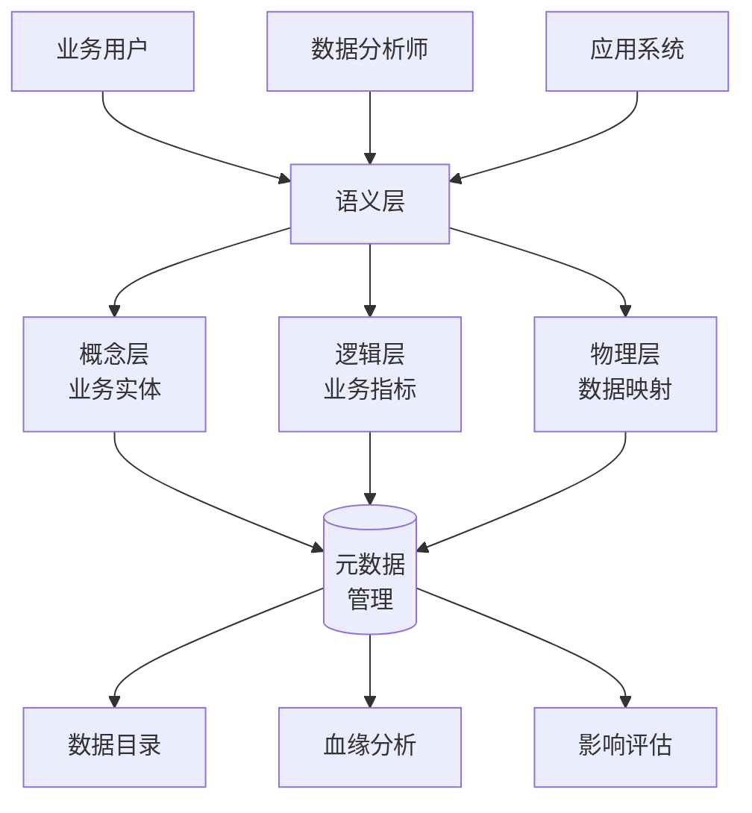

<a id="第14章-测试环境监控与告警体系"></a>

### 第14章 测试环境监控与告警体系

**本章学习目标**

1. 掌握数据契约的设计原则和实现方法；
2. 理解语义层和指标目录的核心概念；
3. 建立血缘治理体系，确保数据可追溯性。

**实践建议**

- 实施数据契约驱动的开发模式，确保数据质量从源头把控。
- 构建语义层抽象，统一数据理解和使用。
- 建立完整的血缘追踪体系，支持影响分析和问题定位。

**[锚点124]** 数据契约设计与管理

**锚点类型**: 概念框架
**锚点方法**: 模板+示例
**锚点名称**: 数据契约设计与管理
**引用附件**: `examples/13_data_gov/contract_example.yml`
**完成情况**: 已完成
**补充建议**: 字段建议：schema/约束/质量规则/版本控制，补充数据契约模板

数据契约是数据提供者和消费者之间的正式协议，定义了数据的结构、质量标准和使用约定。

**数据契约核心要素**:

| 要素 | 说明 | 示例 |
|------|------|------|
| **数据模式(Schema)** | 字段定义、类型、约束 | 字段名、数据类型、是否可空 |
| **质量规则** | 数据质量标准和校验规则 | 非空检查、范围校验、格式验证 |
| **版本控制** | 契约版本管理和兼容性 | 版本号、兼容性标记、迁移策略 |
| **血缘关系** | 数据来源和流向追踪 | 上游表、下游消费、转换逻辑 |

**数据契约示例**:
```yaml
# examples/13_data_gov/contract_example.yml
version: "1.0.0"
dataset: user_events
description: "用户行为事件数据契约"

schema:
  fields:
    - name: user_id
      type: string
      nullable: false
      description: "用户唯一标识"
    - name: event_type
      type: string
      nullable: false
      enum: ["click", "view", "purchase"]
    - name: event_time
      type: timestamp
      nullable: false
    - name: event_data
      type: json
      nullable: true

quality_rules:
  - rule: "user_id_not_null"
    expression: "user_id IS NOT NULL"
    severity: "error"
  - rule: "event_time_valid"
    expression: "event_time BETWEEN '2020-01-01' AND CURRENT_DATE"
    severity: "warning"

compatibility:
  breaking_changes: false
  migration_required: false
```

**[锚点125]** 语义层构建与管理

**锚点类型**: 架构设计
**锚点方法**: 分层架构图
**锚点名称**: 语义层构建与管理
**引用附件**: `examples/13_data_gov/metadata_management.py`
**完成情况**: 已完成
**补充建议**: 字段建议：概念层/逻辑层/物理层/业务术语，补充语义层架构图

语义层是介于原始数据和业务应用之间的抽象层，提供统一的业务术语和数据理解。

**语义层架构**:



**语义层核心组件**:

| 组件 | 功能 | 实现方式 |
|------|------|----------|
| **概念层** | 定义业务实体和关系 | 实体-属性-关系模型 |
| **逻辑层** | 定义业务指标和计算规则 | 指标定义和计算公式 |
| **物理层** | 映射到物理数据源 | 表-字段映射关系 |
| **元数据管理** | 管理语义定义和版本 | 元数据仓库 |

**[锚点126]** 指标目录与血缘治理

**锚点类型**: 治理框架
**锚点方法**: 治理流程图
**锚点名称**: 指标目录与血缘治理
**引用附件**: `examples/13_data_gov/lifecycle_management.py`
**完成情况**: 已完成
**补充建议**: 字段建议：指标定义/血缘追踪/影响分析/版本管理，补充治理流程图

指标目录是企业级数据资产的管理体系，血缘治理确保数据的可追溯性和影响分析。

**指标目录结构**:

| 维度 | 内容 | 管理要点 |
|------|------|----------|
| **指标定义** | 名称、计算公式、业务含义 | 标准化命名、版本控制 |
| **数据血缘** | 来源表、转换逻辑、目标表 | 自动发现、手动维护 |
| **质量监控** | 准确性、及时性、一致性 | 自动化校验、告警机制 |
| **使用管理** | 访问权限、审批流程 | 权限控制、审计日志 |

**血缘治理流程**:


**实施建议**:

1. **自动化发现**: 利用数据血缘分析工具自动发现表间依赖关系
2. **版本管理**: 为指标定义和血缘关系建立版本控制机制
3. **影响评估**: 在数据变更前进行全面的影响分析
4. **监控告警**: 建立血缘断裂和质量异常的监控机制

通过数据契约、语义层和指标目录/血缘治理的有机结合，企业可以构建完整的数据治理体系，实现从治理到自动化的平滑过渡。