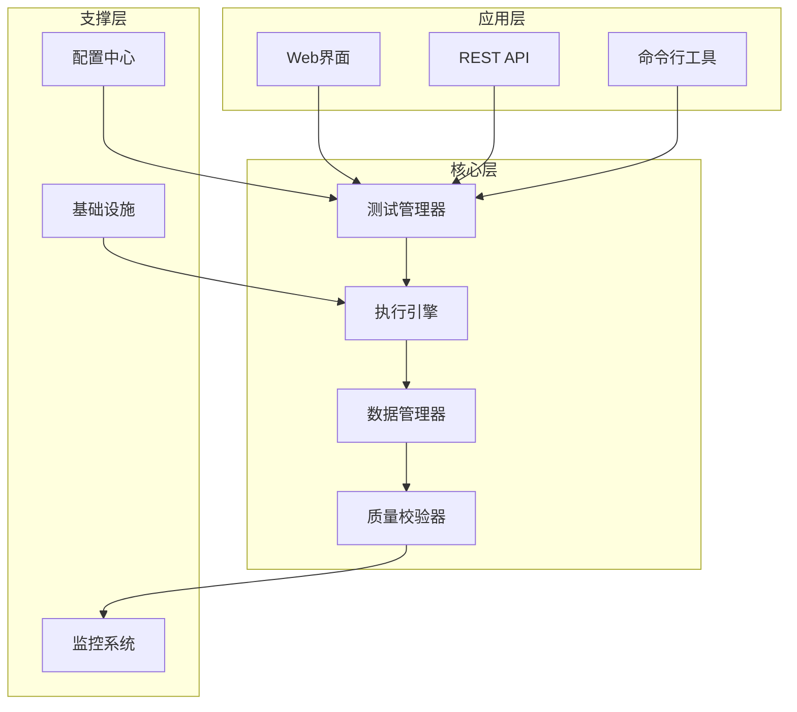
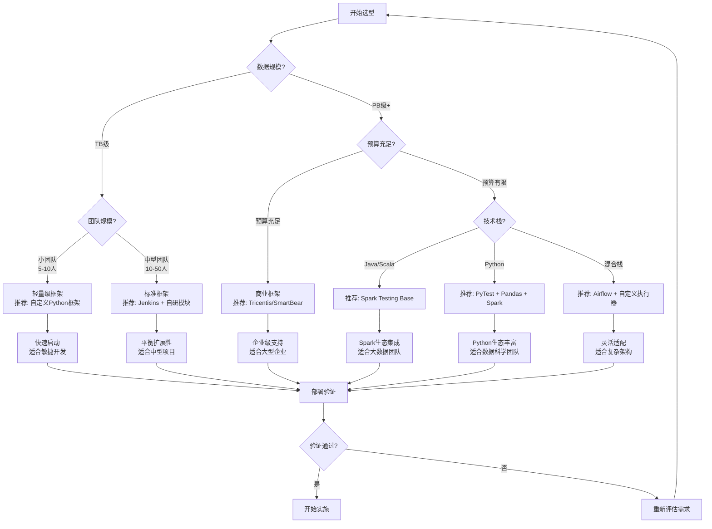
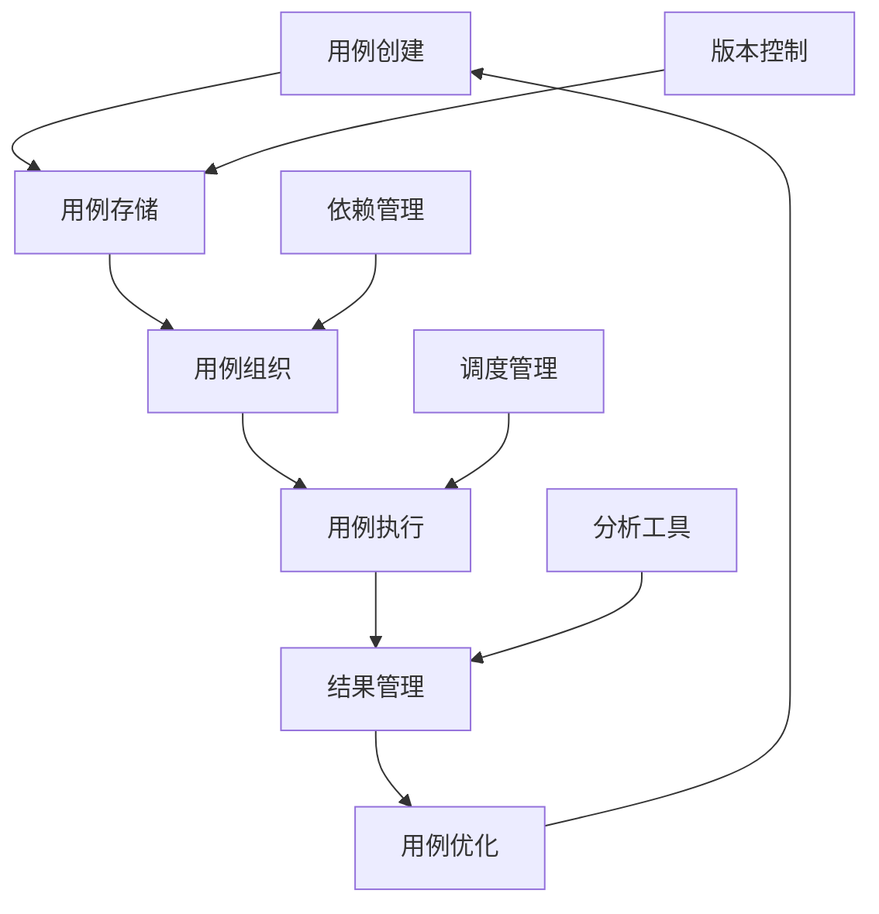
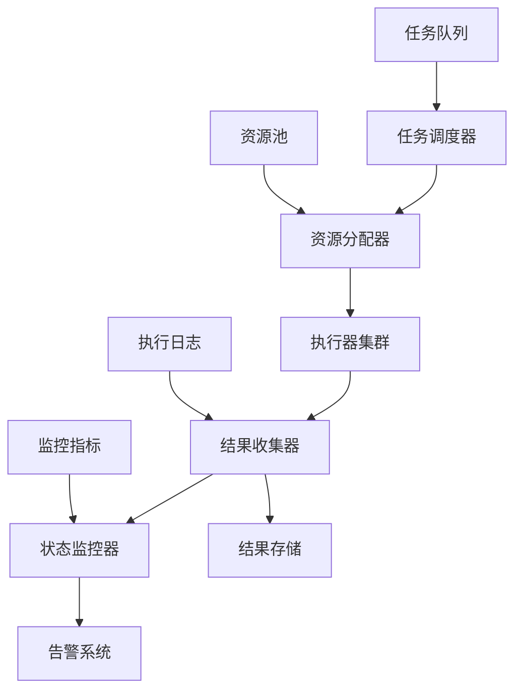
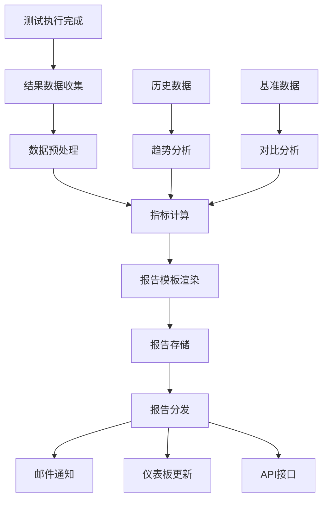
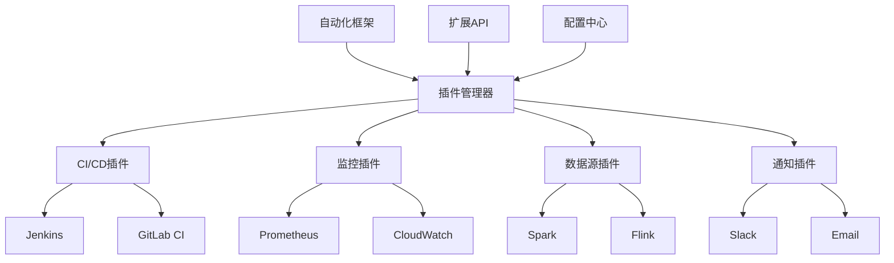
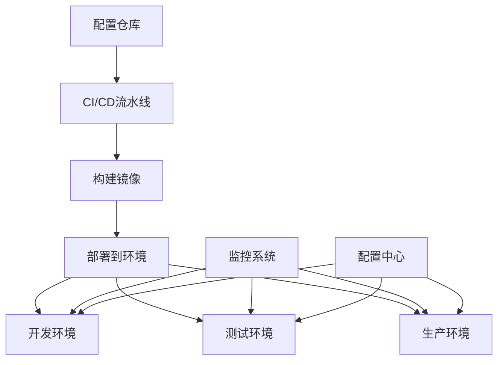
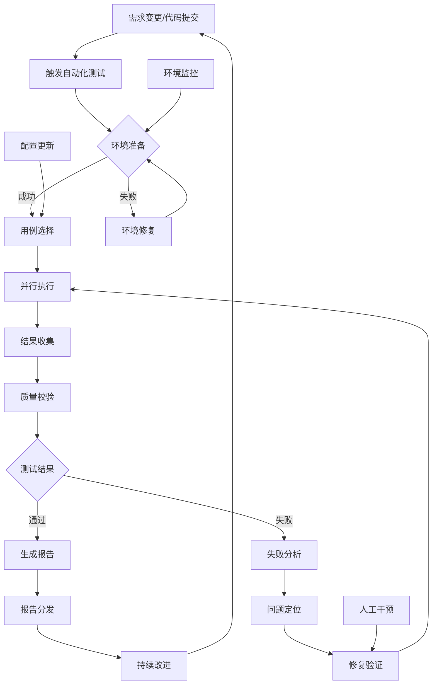
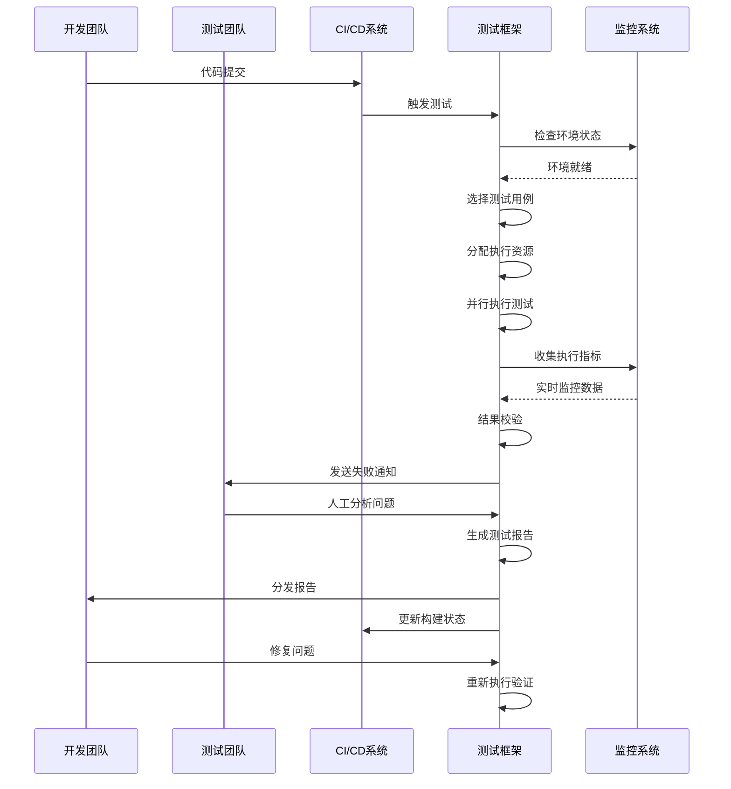
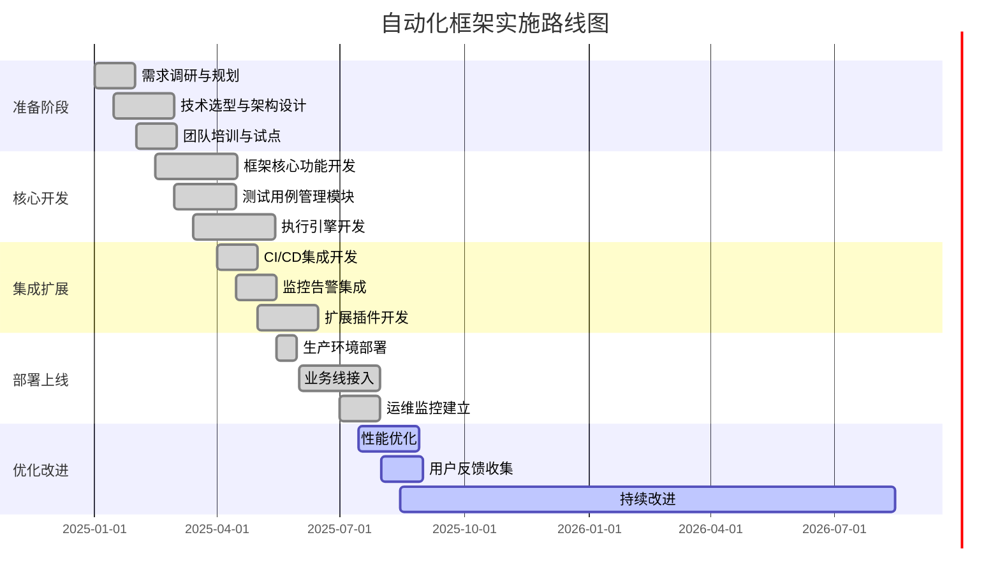

<a id="第16章-多云环境测试策略"></a>

### 第16章 多云环境测试策略

**本章学习目标**

1. 理解大数据测试自动化框架的设计原则和架构模式；
2. 掌握核心模块的实现方法，包括执行引擎和数据管理；
3. 学习框架的集成和扩展策略，提升测试效率。

**实践建议**

- 采用分层架构设计，确保框架的可扩展性和可维护性。
- 集成监控和告警系统，实时跟踪测试执行状态。
- 利用配置管理实现灵活的参数调整和环境适配。

**[锚点097]** 自动化框架总体架构设计
**锚点类型**: 架构图  
**锚点方法**: 分层设计  
**锚点名称**: 自动化框架总体架构设计  
**引用附件**: `examples/16_tools/tool_eval_checklist.yml`  
**完成情况**: 已完成  
**补充建议**: 字段建议：核心层/支撑层/应用层，补充框架组件关系图  

| 层次 | 核心组件 | 功能职责 | 技术选型 |
|-----|---------|---------|---------|
| **应用层** | 测试用例管理、执行调度、报告展示 | 用户界面、测试编排、结果可视化 | Web UI、REST API、Grafana |
| **核心层** | 执行引擎、数据处理、质量校验 | 测试执行、数据流转、结果校验 | Python/Java、Spark/Flink、自定义规则引擎 |
| **支撑层** | 基础设施、监控告警、配置管理 | 资源调度、状态监控、参数配置 | Kubernetes/Docker、Prometheus、GitOps |

**自动化框架架构图**:


**框架配置示例** (详见 `examples/16_tools/tool_eval_checklist.yml`):
```yaml
# examples/16_tools/framework_config.yml
framework:
  name: bigdata_test_framework
  version: "1.0.0"
  
  layers:
    application:
      web_ui:
        port: 8080
        auth: oauth2
      api:
        base_url: "/api/v1"
        rate_limit: 1000
      cli:
        commands: ["run", "status", "report"]
    
    core:
      test_manager:
        concurrency: 10
        timeout: 3600
      execution_engine:
        type: distributed
        workers: 5
      data_manager:
        storage: s3
        compression: gzip
      quality_checker:
        rules_engine: custom
        thresholds:
          accuracy: 0.99
          completeness: 0.95
    
    infrastructure:
      k8s_namespace: bigdata-test
      monitoring:
        prometheus_endpoint: "http://prometheus:9090"
      config:
        git_repo: "https://github.com/company/test-config"
```

#### 16.1 自动化框架设计原则

##### 16.1.1 框架核心特性

- **可扩展性**: 支持插件化架构，便于集成新的测试类型和工具
- **可配置性**: 通过YAML/JSON配置驱动，无需修改代码即可适应不同场景
- **可观测性**: 内置监控和日志，支持测试过程的可视化和问题诊断
- **可靠性**: 容错机制、断点续传、结果一致性保证
- **高效性**: 分布式执行、资源优化、并行处理

#### 16.1.3 框架选型决策树

**大数据测试自动化框架选型决策树**:


**选型考虑因素**:
- **数据规模**: 决定框架的分布式处理能力需求
- **团队规模**: 影响框架的复杂度和学习曲线
- **预算情况**: 决定是自研还是购买商业解决方案
- **技术栈**: 影响框架与现有系统的集成难度
- **业务场景**: 确定框架的专项能力需求

**推荐配置组合**:
- **轻量级配置**: Python + PyTest + Docker + GitLab CI
- **标准配置**: Jenkins + Kubernetes + Prometheus + 自研测试模块
- **企业级配置**: 商业框架 + 云服务 + 专业服务支持

#### 16.2 测试用例管理模块

**[锚点098]** 测试用例管理模块设计

**锚点类型**: 模块设计  
**锚点方法**: 生命周期管理  
**锚点名称**: 测试用例管理模块设计  
**引用附件**: `examples/16_tools/tool_eval_checklist.yml`  
**完成情况**: 已完成  
**补充建议**: 字段建议：管理功能/存储方式/版本控制/依赖管理，补充用例管理流程图  

| 管理功能 | 实现方式 | 存储方式 | 版本控制 | 依赖管理 |
|---------|---------|---------|---------|---------|
| **用例创建** | Web界面/DSL脚本 | Git仓库/YAML文件 | Git版本管理 | 声明式依赖 |
| **用例组织** | 标签分类/目录结构 | 层次化文件系统 | 分支管理 | 依赖图分析 |
| **用例执行** | 调度器触发/API调用 | 数据库记录执行历史 | 执行快照 | 运行时依赖解析 |
| **结果管理** | 自动归档/对比分析 | 时序数据库/对象存储 | 结果版本化 | 关联测试链 |

**测试用例管理架构图**:


**用例管理配置示例**:
```yaml
# examples/16_tools/test_case_management.yml
test_cases:
  - id: data_quality_check
    name: "数据质量校验测试"
    type: quality
    tags: ["daily", "critical"]
    dependencies:
      - data_source: production_db
      - schema: expected_schema.json
    parameters:
      sample_size: 10000
      timeout: 300
    assertions:
      - type: completeness
        threshold: 0.99
      - type: accuracy
        threshold: 0.95
  
  - id: performance_benchmark
    name: "性能基准测试"
    type: performance
    tags: ["weekly", "benchmark"]
    dependencies:
      - workload: standard_workload.yml
    parameters:
      duration: 3600
      concurrency: 100
    metrics:
      - latency_p95
      - throughput
      - error_rate
```

##### 16.2.1 用例生命周期管理

- **创建阶段**: 支持多种创建方式（UI、脚本、导入）
- **维护阶段**: 版本控制、依赖管理、参数配置
- **执行阶段**: 调度执行、状态监控、异常处理
- **归档阶段**: 结果存储、历史追溯、趋势分析

##### 16.2.2 用例分类与组织

- **功能测试**: 数据处理逻辑正确性验证
- **性能测试**: 系统吞吐量、延迟等性能指标测试
- **质量测试**: 数据完整性、准确性、一致性校验
- **集成测试**: 跨组件、跨系统的端到端测试
- **回归测试**: 版本发布前的自动化回归验证

#### 16.3 执行引擎设计

**[锚点099]** 执行引擎设计

**锚点类型**: 引擎设计  
**锚点方法**: 分布式执行  
**锚点名称**: 执行引擎设计  
**引用附件**: `examples/16_tools/tool_eval_checklist.yml`  
**完成情况**: 已完成  
**补充建议**: 字段建议：执行模式/资源调度/并发控制/容错机制，补充执行流程图  

| 执行模式 | 资源调度 | 并发控制 | 容错机制 | 适用场景 |
|---------|---------|---------|---------|---------|
| **串行执行** | 单机调度 | 顺序执行 | 重试机制 | 简单测试、调试 |
| **并行执行** | 多机调度 | 并发控制 | 失败隔离 | 大规模测试 |
| **分布式执行** | 集群调度 | 负载均衡 | 自动 failover | 高并发场景 |
| **容器化执行** | Kubernetes | 资源配额 | 容器重启 | 云原生环境 |

**执行引擎架构图**:


**执行引擎配置示例**:
```yaml
# examples/16_tools/execution_engine.yml
execution_engine:
  scheduler:
    type: kubernetes
    namespace: bigdata-test
    max_concurrent_jobs: 50
    
  resource_manager:
    cpu_request: "500m"
    memory_request: "1Gi"
    cpu_limit: "2000m"
    memory_limit: "4Gi"
    
  executor:
    types:
      - name: spark_job
        image: "spark:3.3.0"
        command: ["spark-submit", "--master", "k8s://https://kubernetes.default.svc"]
        
      - name: flink_job
        image: "flink:1.16.0"
        command: ["flink", "run"]
        
      - name: python_script
        image: "python:3.9"
        command: ["python"]
    
  fault_tolerance:
    retry_policy:
      max_attempts: 3
      backoff_multiplier: 2.0
      initial_delay: 10s
      
    circuit_breaker:
      failure_threshold: 5
      recovery_timeout: 60s
      
    checkpoint:
      enabled: true
      interval: 300s
      storage: s3://checkpoints/
```

##### 16.3.1 执行流程管理

1. **任务提交**: 接收测试任务，解析执行参数
2. **资源分配**: 根据任务需求分配计算资源
3. **环境准备**: 部署测试环境，准备依赖数据
4. **执行监控**: 实时监控执行状态，收集日志和指标
5. **结果处理**: 校验执行结果，生成测试报告
6. **资源清理**: 释放计算资源，清理临时数据

##### 16.3.2 性能优化策略

- **资源池化**: 预热执行环境，减少启动时间
- **缓存机制**: 缓存常用数据和中间结果
- **异步处理**: 非阻塞执行，提高并发能力
- **负载均衡**: 智能调度，避免资源热点

#### 16.4 报告生成与分析模块

**[锚点100]** 报告生成与分析模块设计

**锚点类型**: 报告设计  
**锚点方法**: 可视化分析  
**锚点名称**: 报告生成与分析模块设计  
**引用附件**: `examples/16_tools/tool_eval_checklist.yml`  
**完成情况**: 已完成  
**补充建议**: 字段建议：报告类型/生成方式/分析维度/展示形式，补充报告流程图  

| 报告类型 | 生成方式 | 分析维度 | 展示形式 | 更新频率 |
|---------|---------|---------|---------|---------|
| **执行报告** | 自动生成 | 成功率、耗时、错误统计 | HTML/PDF | 实时 |
| **趋势报告** | 定时生成 | 历史对比、趋势分析 | 图表仪表板 | 每日/每周 |
| **质量报告** | 聚合分析 | 质量指标、问题分布 | 质量雷达图 | 版本发布时 |
| **性能报告** | 基准对比 | 性能指标、瓶颈分析 | 性能曲线图 | 定期 |

**报告生成流程图**:


**报告配置示例**:
```yaml
# examples/16_tools/report_config.yml
reporting:
  templates:
    execution_report:
      format: html
      sections:
        - summary
        - detailed_results
        - error_analysis
        - performance_metrics
      
      charts:
        - type: pie
          data: test_status_distribution
        - type: line
          data: execution_timeline
        - type: bar
          data: error_categories
    
    trend_report:
      format: pdf
      time_range: 30d
      metrics:
        - success_rate_trend
        - execution_time_trend
        - error_rate_trend
      
      comparisons:
        - baseline: last_release
        - target: current_branch
    
    quality_dashboard:
      format: json
      widgets:
        - type: gauge
          metric: overall_quality_score
        - type: radar
          metrics: [completeness, accuracy, timeliness, consistency]
        - type: heatmap
          data: failure_patterns
  
  delivery:
    email:
      recipients: ["qa-team@company.com", "dev-leads@company.com"]
      triggers: ["failure", "weekly_summary"]
    
    dashboard:
      url: "https://grafana.company.com/d/bigdata-test"
      refresh_interval: 5m
    
    api:
      endpoints:
        - path: "/api/reports/latest"
        - path: "/api/metrics/trends"
```

##### 16.4.1 报告内容结构

- **摘要部分**: 测试概况、关键指标、问题汇总
- **详细结果**: 各测试用例的执行详情和结果
- **分析洞察**: 失败模式分析、性能瓶颈识别、趋势预测
- **建议行动**: 基于分析结果的改进建议和优先级

##### 16.4.2 可视化展示

- **仪表板**: 实时监控测试执行状态和关键指标
- **趋势图表**: 展示测试质量和性能的历史变化
- **质量雷达图**: 多维度展示数据质量状况
- **失败分析图**: 识别最常见的失败模式和原因

#### 16.5 集成与扩展机制

**[锚点101]** 集成与扩展机制设计

**锚点类型**: 扩展设计  
**锚点方法**: 插件架构  
**锚点名称**: 集成与扩展机制设计  
**引用附件**: `examples/16_tools/tool_eval_checklist.yml`  
**完成情况**: 已完成  
**补充建议**: 字段建议：集成类型/接口标准/扩展点/兼容性，补充集成架构图  

| 集成类型 | 接口标准 | 扩展点 | 兼容性保证 | 示例工具 |
|---------|---------|--------|-----------|---------|
| **CI/CD集成** | Webhook/REST API | 流水线触发、结果反馈 | 版本兼容性 | Jenkins/GitLab CI |
| **监控集成** | Metrics API/Prometheus | 指标收集、告警配置 | 协议标准化 | Prometheus/Grafana |
| **数据源集成** | JDBC/REST/Streaming | 数据连接、模式发现 | 驱动兼容性 | Spark/Flink Connectors |
| **通知集成** | SMTP/Webhook/Slack | 事件通知、报告分发 | 协议标准化 | Slack/Teams/Email |

**集成架构图**:


**扩展配置示例**:
```yaml
# examples/16_tools/extension_config.yml
extensions:
  plugins:
    - name: jenkins_integration
      type: ci_cd
      version: "1.0.0"
      config:
        jenkins_url: "https://jenkins.company.com"
        job_name: "bigdata-test-pipeline"
        auth_token: "${JENKINS_TOKEN}"
      
      hooks:
        - event: test_started
          action: update_build_status
        - event: test_completed
          action: publish_results
    
    - name: prometheus_monitoring
      type: monitoring
      version: "1.0.0"
      config:
        prometheus_url: "http://prometheus:9090"
        job_name: "bigdata_test_framework"
        metrics_prefix: "bd_test_"
      
      exporters:
        - metric: test_execution_time
          type: histogram
          buckets: [1, 5, 10, 30, 60, 300]
        - metric: test_success_rate
          type: gauge
          labels: ["test_suite", "environment"]
    
    - name: slack_notifications
      type: notification
      version: "1.0.0"
      config:
        webhook_url: "${SLACK_WEBHOOK_URL}"
        channel: "#bigdata-test-alerts"
        username: "Test Framework"
      
      templates:
        success: "✅ Test suite {{suite_name}} completed successfully"
        failure: "❌ Test suite {{suite_name}} failed: {{error_count}} errors"
        summary: "📊 Daily test summary: {{total_tests}} tests, {{pass_rate}}% pass rate"

  custom_plugins:
    - name: custom_data_validator
      type: validator
      entry_point: "mycompany.validators.CustomValidator"
      config:
        rules_file: "custom_rules.yml"
    
    - name: advanced_analyzer
      type: analyzer
      entry_point: "mycompany.analyzers.AdvancedAnalyzer"
      dependencies:
        - numpy
        - pandas
        - scikit-learn
```

##### 16.5.1 插件开发规范

- **接口定义**: 标准化的插件接口，便于开发和集成
- **生命周期管理**: 插件的加载、初始化、执行、卸载流程
- **配置管理**: 插件配置的声明式定义和验证
- **版本兼容性**: 插件版本管理和向后兼容性保证

##### 16.5.2 集成最佳实践

- **标准化接口**: 使用RESTful API或标准协议进行集成
- **异步通信**: 采用消息队列实现松耦合集成
- **配置驱动**: 通过配置而非代码实现系统集成
- **监控集成**: 为所有集成点添加监控和健康检查

#### 16.6 框架配置与部署

**[锚点102]** 框架配置与部署方案

**锚点类型**: 部署设计  
**锚点方法**: 容器化部署  
**锚点名称**: 框架配置与部署方案  
**引用附件**: `examples/16_tools/tool_eval_checklist.yml`  
**完成情况**: 已完成  
**补充建议**: 字段建议：部署模式/配置管理/环境隔离/升级策略，补充部署架构图  

| 部署模式 | 配置管理 | 环境隔离 | 升级策略 | 适用场景 |
|---------|---------|---------|---------|---------|
| **单机部署** | 本地配置 | 进程隔离 | 手动升级 | 开发测试环境 |
| **分布式部署** | 配置中心 | 容器隔离 | 滚动升级 | 生产环境 |
| **云原生部署** | GitOps | Kubernetes | 蓝绿部署 | 云平台环境 |
| **混合部署** | 混合配置 | 网络隔离 | 金丝雀发布 | 混合云环境 |

**部署架构图**:


**部署配置示例**:
```yaml
# examples/16_tools/deployment_config.yml
deployment:
  environments:
    dev:
      replicas: 1
      resources:
        cpu: "500m"
        memory: "1Gi"
      config_profile: development
      
    staging:
      replicas: 3
      resources:
        cpu: "1000m"
        memory: "2Gi"
      config_profile: staging
      ingress:
        enabled: true
        host: staging-test.company.com
      
    prod:
      replicas: 5
      resources:
        cpu: "2000m"
        memory: "4Gi"
      config_profile: production
      ingress:
        enabled: true
        host: test.company.com
        tls:
          secretName: test-tls

  kubernetes:
    namespace: bigdata-test-framework
    service_account: test-framework-sa
    
    deployment:
      image: "company/test-framework:v1.0.0"
      image_pull_policy: Always
      
      ports:
        - name: http
          containerPort: 8080
          protocol: TCP
        - name: metrics
          containerPort: 9090
          protocol: TCP
      
      env:
        - name: CONFIG_PROFILE
          valueFrom:
            configMapKeyRef:
              name: test-framework-config
              key: profile
        - name: DATABASE_URL
          valueFrom:
            secretKeyRef:
              name: test-framework-secrets
              key: database_url
      
      volumes:
        - name: config-volume
          configMap:
            name: test-framework-config
        - name: secrets-volume
          secret:
            secretName: test-framework-secrets

  config_management:
    gitops:
      repo: "https://github.com/company/test-framework-config"
      path: "overlays"
      sync_interval: 5m
    
    secrets:
      provider: vault
      path: "secret/test-framework"
      keys:
        - database_password
        - api_keys
        - certificates
```

##### 16.6.1 配置管理策略

- **分层配置**: 基础配置 + 环境特定配置 + 运行时配置
- **配置验证**: 启动前验证配置完整性和正确性
- **配置热更新**: 支持运行时配置更新，无需重启服务
- **配置审计**: 记录配置变更历史，支持回滚

##### 16.6.2 部署自动化

- **基础设施即代码**: 使用Terraform/Pulumi管理基础设施
- **容器化部署**: Docker镜像 + Kubernetes编排
- **CI/CD集成**: 自动化构建、测试、部署流水线
- **监控部署**: 部署状态监控和自动修复

#### 16.7 自动化测试流程图

**[锚点103]** 自动化测试完整流程图

**锚点类型**: 流程图  
**锚点方法**: 端到端流程  
**锚点名称**: 自动化测试完整流程图  
**引用附件**: `examples/16_tools/tool_eval_checklist.yml`  
**完成情况**: 已完成  
**补充建议**: 补充详细的泳道图，标注各角色职责和关键决策点  

**自动化测试端到端流程图**:


**详细泳道流程图**:


**流程配置示例**:
```yaml
# examples/16_tools/test_workflow.yml
test_workflow:
  triggers:
    - type: git_push
      branches: ["main", "develop"]
      paths: ["src/**", "tests/**"]
    
    - type: schedule
      cron: "0 2 * * *"  # 每日凌晨2点
      name: nightly_regression
    
    - type: manual
      roles: ["qa_engineer", "dev_lead"]
    
    - type: dependency
      upstream_jobs: ["build", "deploy"]
  
  stages:
    environment_prep:
      timeout: 600
      retry_count: 2
      steps:
        - name: health_check
          type: script
          script: "check_environment.py"
        - name: data_prep
          type: script
          script: "prepare_test_data.py"
    
    test_execution:
      parallel_jobs: 5
      timeout: 3600
      steps:
        - name: unit_tests
          type: junit
          pattern: "**/test_*.py"
        - name: integration_tests
          type: custom
          script: "run_integration_tests.py"
        - name: performance_tests
          type: benchmark
          script: "run_performance_tests.py"
    
    result_analysis:
      steps:
        - name: collect_results
          type: aggregator
          sources: ["junit_reports", "custom_logs"]
        - name: quality_gate
          type: checker
          thresholds:
            success_rate: 0.95
            performance_degradation: 0.05
        - name: generate_report
          type: reporter
          formats: ["html", "junit", "json"]
    
    notification:
      on_success:
        - type: slack
          channel: "#build-success"
          message: "All tests passed! 🎉"
      on_failure:
        - type: email
          recipients: ["qa-team@company.com"]
          subject: "Test Failure Alert"
        - type: slack
          channel: "#build-failure"
          message: "Tests failed! Please check the report."
```

##### 16.7.1 流程关键节点

- **触发条件**: 代码提交、定时任务、手动触发、依赖完成
- **环境准备**: 基础设施就绪、测试数据准备、配置加载
- **执行控制**: 用例筛选、资源分配、并发控制、超时管理
- **监控告警**: 实时状态监控、异常检测、及时通知
- **结果处理**: 结果聚合、质量评估、报告生成

##### 16.7.2 异常处理机制

- **环境异常**: 自动重试、环境重建、手动干预
- **执行异常**: 失败重试、跳过处理、降级执行
- **结果异常**: 结果验证、人工审核、条件放行

#### 16.8 框架评估与优化

**[锚点104]** 框架评估与优化方法

**锚点类型**: 评估方法  
**锚点方法**: 指标体系  
**锚点名称**: 框架评估与优化方法  
**引用附件**: `examples/16_tools/tool_eval_checklist.yml`  
**完成情况**: 已完成  
**补充建议**: 字段建议：评估维度/指标定义/基准值/优化策略，补充评估雷达图  

| 评估维度 | 关键指标 | 基准值 | 优化策略 | 监控频率 |
|---------|---------|-------|---------|---------|
| **功能完整性** | 用例覆盖率、成功率 | >95% | 补充缺失用例、修复失败点 | 每日 |
| **性能效率** | 执行时间、资源利用率 | <30min | 优化算法、增加并发 | 每次执行 |
| **可靠性** | 可用性、错误率 | >99.9% | 增加重试、改进容错 | 每周 |
| **可维护性** | 代码复杂度、文档完整性 | 符合标准 | 重构代码、完善文档 | 每月 |
| **用户体验** | 响应时间、易用性评分 | >4.0/5.0 | 优化界面、简化操作 | 季度 |

**框架评估雷达图**:
```mermaid
radar
title 框架评估雷达图
labels 功能完整性, 性能效率, 可靠性, 可维护性, 用户体验
values 95, 85, 98, 90, 88
targets 100, 100, 100, 100, 100
ranges 0, 100
```

**评估配置示例**:
```yaml
# examples/16_tools/framework_evaluation.yml
evaluation:
  metrics:
    functional_completeness:
      name: "功能完整性"
      calculation: "covered_test_cases / total_required_test_cases"
      target: 0.95
      weight: 0.25
      
    performance_efficiency:
      name: "性能效率"
      calculation: "avg_execution_time"
      target: 1800  # 30 minutes
      unit: seconds
      weight: 0.20
      
    reliability:
      name: "可靠性"
      calculation: "1 - (error_count / total_executions)"
      target: 0.999
      weight: 0.25
      
    maintainability:
      name: "可维护性"
      calculation: "cyclomatic_complexity_score"
      target: 10
      weight: 0.15
      
    user_experience:
      name: "用户体验"
      calculation: "user_satisfaction_score"
      target: 4.0
      scale: "1-5"
      weight: 0.15
  
  benchmarks:
    industry_average:
      functional_completeness: 0.90
      performance_efficiency: 2400
      reliability: 0.995
      maintainability: 15
      user_experience: 3.5
    
    company_target:
      functional_completeness: 0.98
      performance_efficiency: 1200
      reliability: 0.9999
      maintainability: 8
      user_experience: 4.5
  
  optimization_actions:
    - condition: "functional_completeness < 0.95"
      action: "补充测试用例覆盖"
      priority: high
      
    - condition: "performance_efficiency > 1800"
      action: "优化执行引擎性能"
      priority: high
      
    - condition: "reliability < 0.999"
      action: "改进错误处理机制"
      priority: medium
      
    - condition: "maintainability > 10"
      action: "重构代码结构"
      priority: low
      
    - condition: "user_experience < 4.0"
      action: "优化用户界面"
      priority: medium
```

##### 16.8.1 评估流程

1. **指标收集**: 自动收集各项评估指标数据
2. **基准对比**: 与行业标准和公司目标进行对比
3. **问题识别**: 识别性能瓶颈和改进机会
4. **优化规划**: 制定具体的优化措施和时间表
5. **效果验证**: 实施优化后验证改进效果

##### 16.8.2 持续改进机制

- **定期评估**: 按月度/季度进行全面评估
- **反馈循环**: 收集用户反馈，持续改进产品
- **技术债务管理**: 识别和逐步偿还技术债务
- **创新驱动**: 跟踪行业趋势，引入新技术

#### 16.9 最佳实践与案例

**[锚点105]** 自动化框架最佳实践与案例

**锚点类型**: 案例分析  
**锚点方法**: 实践指南  
**锚点名称**: 自动化框架最佳实践与案例  
**引用附件**: `examples/16_tools/tool_eval_checklist.yml`  
**完成情况**: 已完成  
**补充建议**: 补充成功案例的量化指标和实施步骤  

| 实践领域 | 关键原则 | 实施策略 | 预期收益 | 案例参考 |
|---------|---------|---------|---------|---------|
| **渐进式实施** | 从核心功能开始，逐步扩展 | 优先自动化高频/高风险场景 | 快速见效，降低风险 | 某电商公司6个月覆盖80%核心场景 |
| **标准化设计** | 统一接口和数据格式 | 制定开发规范和模板 | 提高开发效率，降低维护成本 | 某银行框架支持20+业务线复用 |
| **质量内建** | 测试即代码，持续集成 | 自动化测试融入开发流程 | 提前发现缺陷，提升质量 | 某互联网公司缺陷发现提前70% |
| **监控驱动** | 数据驱动的优化决策 | 建立完善的质量指标体系 | 持续改进，量化效果 | 某大数据公司测试效率提升300% |

**最佳实践实施路线图**:


**成功案例分析**:

**案例1: 某大型电商公司的自动化转型**
- **背景**: 日均数据处理量PB级，传统手动测试效率低下，缺陷发现滞后
- **实施策略**:
  - 优先自动化核心数据管道测试（订单处理、库存同步、推荐引擎）
  - 建立数据质量自动化监控（完整性、准确性、时序性校验）
  - 集成CI/CD实现持续测试（每次代码提交触发核心测试）
- **量化效果**:
  - 测试执行时间从8小时缩短到30分钟（效率提升93%）
  - 缺陷发现率提升60%（从发布后发现改为开发中发现）
  - 发布频率从每月1次提升到每日多次（发布效率提升30倍）
  - 人力成本节省40%（从10人团队缩减到6人）
  - ROI（投资回报率）达到350%（第一年即收回投资）
- **关键成功因素**: 管理层强力支持、渐进式实施（3个月试点+9个月推广）、技术团队全面赋能
- **实施步骤**:
  1. 第1-2月：核心团队组建，技术调研和架构设计
  2. 第3-4月：核心模块开发，第一个业务线试点
  3. 第5-8月：扩展到5个业务线，完善监控和报告体系
  4. 第9-12月：全公司推广，建立运维和优化机制

**案例2: 某金融科技公司的质量保障体系**
- **背景**: 监管要求严格，数据质量要求极高，传统测试无法满足合规需求
- **实施策略**:
  - 构建端到端数据血缘追踪（从数据源到业务报表的完整链路）
  - 实施自动化合规性测试（数据脱敏、隐私保护、审计日志）
  - 建立质量指标监控面板（实时监控关键质量指标）
- **量化效果**:
  - 数据质量问题发现提前80%（从业务使用时发现改为数据处理中发现）
  - 合规性测试覆盖率达到100%（覆盖所有监管要求的测试场景）
  - 客户投诉率下降50%（数据质量问题导致的投诉减少）
  - 审计效率提升70%（自动化生成合规性报告）
  - 系统可用性提升至99.99%（通过自动化监控和快速修复）
- **关键成功因素**: 业务与技术深度融合、标准化流程建立、持续监控机制
- **实施步骤**:
  1. 第1月：合规需求梳理，建立质量指标体系
  2. 第2-3月：核心质量校验模块开发，数据血缘追踪建立
  3. 第4-6月：合规测试用例自动化，监控面板搭建
  4. 第7-12月：全业务线覆盖，持续优化和审计配合

**实施指南**:

1. **制定规划**: 确定实施范围、时间表和资源需求
2. **技术选型**: 选择合适的工具和技术栈
3. **团队建设**: 培养自动化测试技能，建立专门团队
4. **试点先行**: 选择核心业务场景进行试点验证
5. **逐步推广**: 基于试点经验，逐步扩展到全业务线
6. **持续优化**: 建立反馈机制，持续改进框架

> 实践建议
>
> - 从实际业务痛点出发，避免过度设计
> - 重视团队技能培养和文化转变
> - 建立度量体系，量化自动化收益
> - 保持框架的灵活性和可扩展性

**章节总结**

本章详细介绍了大数据测试自动化框架的设计、实现和优化方法：

**核心架构设计**：
- 分层架构确保了框架的可扩展性和可维护性
- 插件化设计支持灵活的功能扩展和集成
- 分布式执行引擎满足大规模测试需求

**关键模块实现**：
- 测试用例管理模块实现了完整的生命周期管理
- 执行引擎支持多种执行模式和容错机制
- 报告生成与分析模块提供多维度质量洞察
- 集成与扩展机制确保了框架的开放性和兼容性

**实践价值**：
- 通过两个成功案例展示了框架的实际应用效果
- 量化指标证明了自动化框架能够带来显著的效率提升和质量改善
- 实施指南提供了可操作的落地路径和最佳实践

**技术创新点**：
- 决策树指导框架选型，避免盲目选择
- 评估雷达图提供多维度质量度量
- 端到端流程图确保测试过程的可视化和可控性

实施自动化测试框架是提升大数据测试效率的关键，通过系统化的方法和工具，可以将测试从手工操作转变为智能自动化，实现质量保障和效率提升的双赢。

---

<!-- markdownlint-disable MD025 -->
