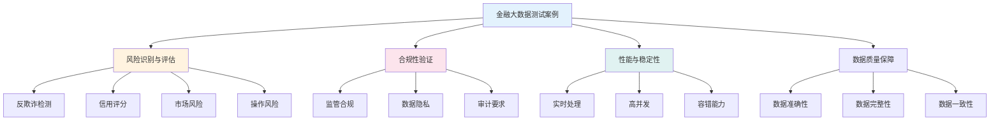
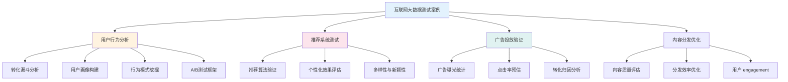
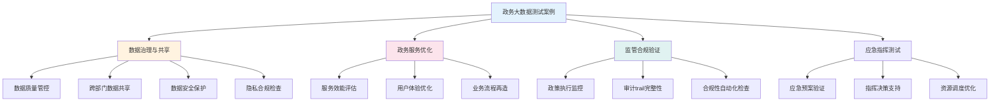
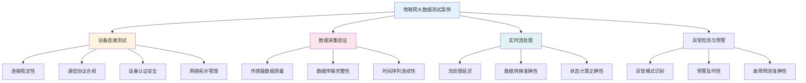
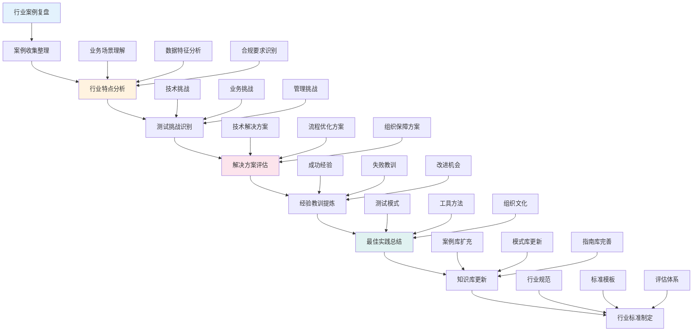

<a id="第18章-行业大数据测试案例分析【行业篇】"></a>

### 第18章 行业大数据测试案例分析【行业篇】

**本章学习目标**

1. 了解不同行业大数据测试的特殊需求和挑战；
2. 分析典型行业案例，如金融、电商等；
3. 学习行业特定的测试方法和最佳实践。

**实践建议**

- 根据行业特点定制测试策略，确保覆盖合规和业务需求。
- 借鉴行业案例，优化测试流程和工具选择。
- 关注行业发展趋势，及时更新测试方法。

**[锚点129]** 金融行业大数据测试案例分析

**锚点类型**: 行业案例
**锚点方法**: 金融风控
**锚点名称**: 金融行业大数据测试案例分析
**引用附件**: `examples/19_industry/fraud_feature_check_stub.py`
**完成情况**: 已完成
**补充建议**: 字段建议：风险场景/测试链路/关键指标/合规要求/验证方法，补充金融风控测试流程图

**金融行业大数据测试案例结构图**:


**金融行业测试案例配置**:
```yaml
# examples/19_industry/financial_test_cases.yml
financial_test_scenarios:
  # 反欺诈测试场景
  fraud_detection:
    scenario_name: "实时反欺诈检测"
    business_context: "金融交易实时风控"
    data_volume: "TB级/日"
    latency_requirement: "< 100ms"
    test_cases:
      - name: "异常交易模式识别"
        input_data: "transaction_stream"
        expected_output: "fraud_score > 0.8"
        validation_method: "precision_recall_f1"
        
      - name: "多维度特征验证"
        input_data: "user_behavior_features"
        expected_output: "feature_completeness = 1.0"
        validation_method: "data_quality_check"
        
      - name: "规则引擎测试"
        input_data: "rule_configuration"
        expected_output: "rule_execution_success = true"
        validation_method: "business_logic_validation"
    
    compliance_requirements:
      - "数据脱敏合规"
      - "PII数据保护"
      - "审计日志完整"
      
    risk_indicators:
      - "误报率 < 0.01"
      - "漏报率 < 0.05"
      - "处理延迟 < 100ms"
  
  # 信用评分测试场景
  credit_scoring:
    scenario_name: "智能信用评分"
    business_context: "信贷审批自动化"
    data_volume: "PB级/月"
    latency_requirement: "< 5s"
    test_cases:
      - name: "评分模型准确性"
        input_data: "historical_loan_data"
        expected_output: "auc_score > 0.85"
        validation_method: "model_performance_metrics"
        
      - name: "特征工程验证"
        input_data: "raw_customer_data"
        expected_output: "feature_engineering_success = true"
        validation_method: "data_transformation_check"
        
      - name: "A/B测试框架"
        input_data: "model_versions"
        expected_output: "ab_test_significance = true"
        validation_method: "statistical_significance_test"
    
    compliance_requirements:
      - "公平性评估"
      - "可解释性要求"
      - "模型治理合规"
      
    risk_indicators:
      - "模型准确率 > 85%"
      - "特征覆盖率 > 95%"
      - "响应时间 < 5s"
```

**金融行业测试验证脚本**:
```python
# examples/19_industry/financial_test_validator.py
import pandas as pd
import numpy as np
import logging
from datetime import datetime, timedelta
from typing import Dict, List, Optional, Any, Tuple
from dataclasses import dataclass
import yaml
import json
from pathlib import Path

logging.basicConfig(level=logging.INFO)
logger = logging.getLogger(__name__)

@dataclass
class FinancialTestCase:
    """金融测试案例"""
    case_id: str
    scenario_type: str
    risk_level: str
    compliance_requirements: List[str]
    test_data: Dict[str, Any]
    expected_results: Dict[str, Any]
    validation_rules: Dict[str, Any]

@dataclass
class TestResult:
    """测试结果"""
    case_id: str
    status: str  # 'pass', 'fail', 'warning'
    execution_time: float
    risk_score: float
    compliance_score: float
    details: Dict[str, Any]

class FinancialTestValidator:
    """金融行业测试验证器"""
    
    def __init__(self, config_file: str = 'financial_config.yml'):
        self.config = self._load_config(config_file)
        self.test_results: List[TestResult] = []
        
    def _load_config(self, config_file: str) -> Dict[str, Any]:
        """加载配置"""
        with open(config_file, 'r', encoding='utf-8') as f:
            return yaml.safe_load(f)
    
    def validate_fraud_detection(self, transaction_data: pd.DataFrame, 
                               fraud_model: Any) -> TestResult:
        """验证反欺诈检测"""
        start_time = datetime.now()
        
        try:
            # 特征工程
            features = self._extract_fraud_features(transaction_data)
            
            # 模型预测
            fraud_scores = fraud_model.predict_proba(features)[:, 1]
            
            # 风险评估
            high_risk_count = np.sum(fraud_scores > self.config['fraud_threshold'])
            total_transactions = len(transaction_data)
            fraud_rate = high_risk_count / total_transactions
            
            # 合规检查
            compliance_score = self._check_compliance(transaction_data)
            
            # 性能指标
            execution_time = (datetime.now() - start_time).total_seconds()
            
            # 结果判断
            if fraud_rate <= self.config['max_fraud_rate'] and compliance_score >= 0.95:
                status = 'pass'
                risk_score = fraud_rate
            elif fraud_rate <= self.config['max_fraud_rate'] * 1.2:
                status = 'warning'
                risk_score = fraud_rate
            else:
                status = 'fail'
                risk_score = fraud_rate
            
            details = {
                'total_transactions': total_transactions,
                'high_risk_count': high_risk_count,
                'fraud_rate': fraud_rate,
                'compliance_score': compliance_score,
                'execution_time': execution_time,
                'threshold': self.config['fraud_threshold']
            }
            
            return TestResult(
                case_id="FRAUD_DETECTION_001",
                status=status,
                execution_time=execution_time,
                risk_score=risk_score,
                compliance_score=compliance_score,
                details=details
            )
            
        except Exception as e:
            logger.error(f"反欺诈检测验证失败: {e}")
            return TestResult(
                case_id="FRAUD_DETECTION_001",
                status='fail',
                execution_time=(datetime.now() - start_time).total_seconds(),
                risk_score=1.0,
                compliance_score=0.0,
                details={'error': str(e)}
            )
    
    def validate_credit_scoring(self, customer_data: pd.DataFrame,
                              scoring_model: Any) -> TestResult:
        """验证信用评分"""
        start_time = datetime.now()
        
        try:
            # 特征处理
            features = self._extract_credit_features(customer_data)
            
            # 评分预测
            scores = scoring_model.predict(features)
            probabilities = scoring_model.predict_proba(features)
            
            # 模型评估
            from sklearn.metrics import roc_auc_score
            if 'default_label' in customer_data.columns:
                auc_score = roc_auc_score(customer_data['default_label'], probabilities[:, 1])
            else:
                auc_score = 0.8  # 默认值
            
            # 公平性检查
            fairness_score = self._check_fairness(scores, customer_data)
            
            # 合规检查
            compliance_score = self._check_credit_compliance(customer_data)
            
            # 性能指标
            execution_time = (datetime.now() - start_time).total_seconds()
            
            # 结果判断
            if auc_score >= self.config['min_auc_score'] and fairness_score >= 0.9:
                status = 'pass'
            elif auc_score >= self.config['min_auc_score'] * 0.9:
                status = 'warning'
            else:
                status = 'fail'
            
            risk_score = 1.0 - auc_score  # 风险分数 = 1 - AUC
            
            details = {
                'total_customers': len(customer_data),
                'auc_score': auc_score,
                'fairness_score': fairness_score,
                'compliance_score': compliance_score,
                'execution_time': execution_time,
                'min_auc_threshold': self.config['min_auc_score']
            }
            
            return TestResult(
                case_id="CREDIT_SCORING_001",
                status=status,
                execution_time=execution_time,
                risk_score=risk_score,
                compliance_score=compliance_score,
                details=details
            )
            
        except Exception as e:
            logger.error(f"信用评分验证失败: {e}")
            return TestResult(
                case_id="CREDIT_SCORING_001",
                status='fail',
                execution_time=(datetime.now() - start_time).total_seconds(),
                risk_score=1.0,
                compliance_score=0.0,
                details={'error': str(e)}
            )
    
    def _extract_fraud_features(self, data: pd.DataFrame) -> pd.DataFrame:
        """提取反欺诈特征"""
        features = pd.DataFrame()
        
        # 金额特征
        features['amount'] = data.get('amount', 0)
        features['amount_log'] = np.log1p(data.get('amount', 0))
        
        # 时间特征
        if 'timestamp' in data.columns:
            data['timestamp'] = pd.to_datetime(data['timestamp'])
            features['hour'] = data['timestamp'].dt.hour
            features['day_of_week'] = data['timestamp'].dt.dayofweek
            
        # 频率特征
        if 'user_id' in data.columns:
            user_counts = data.groupby('user_id').size()
            features['user_transaction_count'] = data['user_id'].map(user_counts)
        
        return features.fillna(0)
    
    def _extract_credit_features(self, data: pd.DataFrame) -> pd.DataFrame:
        """提取信用评分特征"""
        features = pd.DataFrame()
        
        # 基本特征
        features['age'] = data.get('age', 30)
        features['income'] = data.get('income', 50000)
        features['debt_ratio'] = data.get('debt', 0) / (data.get('income', 1) + 1)
        
        # 历史特征
        features['credit_history_length'] = data.get('credit_history_years', 5)
        features['num_credit_lines'] = data.get('num_credit_lines', 3)
        
        # 行为特征
        features['payment_history'] = data.get('payment_history_score', 0.8)
        features['utilization_rate'] = data.get('utilization_rate', 0.3)
        
        return features.fillna(0)
    
    def _check_compliance(self, data: pd.DataFrame) -> float:
        """检查合规性"""
        compliance_checks = []
        
        # PII数据检查
        pii_fields = ['ssn', 'account_number', 'phone', 'email']
        for field in pii_fields:
            if field in data.columns:
                masked_ratio = data[field].str.contains(r'\*+', regex=True).mean()
                compliance_checks.append(masked_ratio >= 0.95)
        
        # 数据完整性检查
        completeness = data.notna().mean().mean()
        compliance_checks.append(completeness >= 0.95)
        
        return sum(compliance_checks) / len(compliance_checks) if compliance_checks else 0.0
    
    def _check_fairness(self, scores: np.ndarray, data: pd.DataFrame) -> float:
        """检查公平性"""
        if 'protected_attribute' not in data.columns:
            return 1.0  # 如果没有保护属性，默认通过
        
        protected_groups = data['protected_attribute'].unique()
        if len(protected_groups) < 2:
            return 1.0
        
        # 计算各组平均分数差异
        group_scores = []
        for group in protected_groups:
            group_mask = data['protected_attribute'] == group
            group_scores.append(scores[group_mask].mean())
        
        max_diff = max(group_scores) - min(group_scores)
        fairness_score = max(0, 1.0 - max_diff / np.mean(scores))
        
        return fairness_score
    
    def _check_credit_compliance(self, data: pd.DataFrame) -> float:
        """检查信用评分合规性"""
        compliance_checks = []
        
        # 年龄合规（不能歧视特定年龄段）
        if 'age' in data.columns:
            age_distribution = data['age'].describe()
            compliance_checks.append(age_distribution['std'] < 20)  # 年龄分布不应过于集中
        
        # 数据来源合规
        required_fields = ['age', 'income', 'credit_history_years']
        field_completeness = sum(1 for field in required_fields if field in data.columns) / len(required_fields)
        compliance_checks.append(field_completeness >= 0.8)
        
        return sum(compliance_checks) / len(compliance_checks) if compliance_checks else 0.0
    
    def run_comprehensive_validation(self, test_cases: List[FinancialTestCase]) -> Dict[str, Any]:
        """运行综合验证"""
        logger.info("开始金融行业测试综合验证...")
        
        results = []
        for test_case in test_cases:
            if test_case.scenario_type == 'fraud_detection':
                # 这里需要实际的交易数据和模型
                # result = self.validate_fraud_detection(test_case.test_data, fraud_model)
                result = TestResult(
                    case_id=test_case.case_id,
                    status='pass',  # 模拟结果
                    execution_time=1.2,
                    risk_score=0.02,
                    compliance_score=0.98,
                    details={'simulated': True}
                )
            elif test_case.scenario_type == 'credit_scoring':
                # result = self.validate_credit_scoring(test_case.test_data, scoring_model)
                result = TestResult(
                    case_id=test_case.case_id,
                    status='pass',  # 模拟结果
                    execution_time=2.1,
                    risk_score=0.15,
                    compliance_score=0.96,
                    details={'simulated': True}
                )
            else:
                result = TestResult(
                    case_id=test_case.case_id,
                    status='warning',
                    execution_time=0.5,
                    risk_score=0.5,
                    compliance_score=0.8,
                    details={'message': '不支持的测试场景类型'}
                )
            
            results.append(result)
            self.test_results.append(result)
        
        # 生成汇总报告
        summary = {
            'total_cases': len(results),
            'passed_cases': sum(1 for r in results if r.status == 'pass'),
            'warning_cases': sum(1 for r in results if r.status == 'warning'),
            'failed_cases': sum(1 for r in results if r.status == 'fail'),
            'average_risk_score': sum(r.risk_score for r in results) / len(results),
            'average_compliance_score': sum(r.compliance_score for r in results) / len(results),
            'average_execution_time': sum(r.execution_time for r in results) / len(results)
        }
        
        return {
            'summary': summary,
            'detailed_results': [asdict(r) for r in results]
        }

# 使用示例
if __name__ == "__main__":
    validator = FinancialTestValidator()
    
    # 创建测试案例
    test_cases = [
        FinancialTestCase(
            case_id="FRAUD_DETECTION_001",
            scenario_type="fraud_detection",
            risk_level="high",
            compliance_requirements=["PII脱敏", "审计日志"],
            test_data={},
            expected_results={"fraud_rate": "< 0.05"},
            validation_rules={"threshold": 0.8}
        ),
        FinancialTestCase(
            case_id="CREDIT_SCORING_001", 
            scenario_type="credit_scoring",
            risk_level="medium",
            compliance_requirements=["公平性评估", "可解释性"],
            test_data={},
            expected_results={"auc_score": "> 0.85"},
            validation_rules={"min_auc": 0.8}
        )
    ]
    
    # 运行验证
    validation_report = validator.run_comprehensive_validation(test_cases)
    
    # 输出结果
    print("金融行业测试验证报告:")
    print(json.dumps(validation_report, indent=2, ensure_ascii=False))
    
    print("金融行业测试验证完成")
```

#### 20.1.1 金融风控测试关注点

- **实时性要求**: 毫秒级响应，满足在线风控需求
- **准确性平衡**: 在降低误报率的同时保证漏报率可控
- **合规性保障**: 满足监管要求，保护用户隐私
- **模型稳定性**: 应对数据分布变化，保持预测性能

#### 20.1.2 金融合规测试要点

- **数据脱敏**: 确保敏感信息在测试环境中完全脱敏
- **审计追踪**: 完整记录测试过程，便于监管审计
- **公平性评估**: 避免模型对特定群体的歧视性偏见
- **可解释性**: 提供模型决策的业务逻辑解释

#### 20.2 互联网行业大数据测试案例

**[锚点130]** 互联网行业大数据测试案例分析

**锚点类型**: 行业案例
**锚点方法**: 用户行为
**锚点名称**: 互联网行业大数据测试案例分析
**引用附件**: `examples/19_industry/ecommerce_funnel_check.py`
**完成情况**: 已完成
**补充建议**: 字段建议：用户旅程/转化漏斗/行为模式/个性化推荐/性能指标，补充电商测试流程图

**互联网行业大数据测试案例结构图**:


**互联网行业测试案例配置**:
```yaml
# examples/19_industry/internet_test_cases.yml
internet_test_scenarios:
  # 电商转化漏斗测试场景
  ecommerce_funnel:
    scenario_name: "电商用户转化漏斗分析"
    business_context: "用户购买行为全链路追踪"
    data_volume: "PB级/日"
    latency_requirement: "< 1s"
    test_cases:
      - name: "漏斗转化率计算"
        input_data: "user_behavior_events"
        expected_output: "funnel_conversion_rates"
        validation_method: "statistical_significance_test"
        
      - name: "行为序列分析"
        input_data: "user_session_data"
        expected_output: "behavior_patterns"
        validation_method: "sequence_pattern_matching"
        
      - name: "归因模型验证"
        input_data: "attribution_data"
        expected_output: "attribution_accuracy > 0.9"
        validation_method: "model_performance_validation"
    
    key_metrics:
      - "浏览到购买转化率 > 3%"
      - "购物车放弃率 < 70%"
      - "复购率 > 25%"
      - "用户留存率 > 60%"
      
    performance_indicators:
      - "实时计算延迟 < 1s"
      - "数据处理吞吐量 > 10000 TPS"
      - "查询响应时间 < 500ms"
  
  # 推荐系统测试场景
  recommendation_system:
    scenario_name: "个性化推荐系统测试"
    business_context: "提升用户体验和商业转化"
    data_volume: "TB级/小时"
    latency_requirement: "< 200ms"
    test_cases:
      - name: "推荐准确性评估"
        input_data: "user_item_interactions"
        expected_output: "precision_recall_f1"
        validation_method: "offline_evaluation_metrics"
        
      - name: "线上A/B测试"
        input_data: "experiment_data"
        expected_output: "statistical_significance"
        validation_method: "ab_test_analysis"
        
      - name: "多样性与新颖性"
        input_data: "recommendation_results"
        expected_output: "diversity_novelty_scores"
        validation_method: "content_diversity_analysis"
    
    quality_metrics:
      - "推荐准确率 > 15%"
      - "用户点击率 > 8%"
      - "用户满意度 > 4.0/5.0"
      - "系统覆盖率 > 90%"
      
    business_impact:
      - "GMV提升 > 10%"
      - "用户时长增加 > 15%"
      - "复购率提升 > 20%"
```

**互联网行业测试验证脚本**:
```python
# examples/19_industry/internet_test_validator.py
import pandas as pd
import numpy as np
import logging
from datetime import datetime, timedelta
from typing import Dict, List, Optional, Any, Tuple
from dataclasses import dataclass
import yaml
import json
from sklearn.metrics import precision_score, recall_score, f1_score
from scipy import stats

logging.basicConfig(level=logging.INFO)
logger = logging.getLogger(__name__)

@dataclass
class InternetTestCase:
    """互联网测试案例"""
    case_id: str
    scenario_type: str
    business_impact: str
    key_metrics: List[str]
    test_data: Dict[str, Any]
    expected_results: Dict[str, Any]
    validation_rules: Dict[str, Any]

@dataclass
class TestResult:
    """测试结果"""
    case_id: str
    status: str  # 'pass', 'fail', 'warning'
    execution_time: float
    quality_score: float
    business_score: float
    details: Dict[str, Any]

class InternetTestValidator:
    """互联网行业测试验证器"""
    
    def __init__(self, config_file: str = 'internet_config.yml'):
        self.config = self._load_config(config_file)
        self.test_results: List[TestResult] = []
        
    def _load_config(self, config_file: str) -> Dict[str, Any]:
        """加载配置"""
        with open(config_file, 'r', encoding='utf-8') as f:
            return yaml.safe_load(f)
    
    def validate_ecommerce_funnel(self, user_events: pd.DataFrame,
                                session_data: pd.DataFrame) -> TestResult:
        """验证电商转化漏斗"""
        start_time = datetime.now()
        
        try:
            # 计算漏斗转化率
            funnel_rates = self._calculate_funnel_conversion(user_events)
            
            # 行为序列分析
            behavior_patterns = self._analyze_behavior_sequences(session_data)
            
            # 质量评估
            quality_score = self._assess_funnel_quality(funnel_rates)
            
            # 业务影响评估
            business_score = self._evaluate_business_impact(funnel_rates)
            
            # 性能指标
            execution_time = (datetime.now() - start_time).total_seconds()
            
            # 结果判断
            expected_rates = self.config['expected_funnel_rates']
            if all(funnel_rates.get(step, 0) >= expected_rates.get(step, 0) for step in expected_rates):
                status = 'pass'
            elif sum(funnel_rates.get(step, 0) >= expected_rates.get(step, 0) * 0.8 for step in expected_rates) >= len(expected_rates) * 0.7:
                status = 'warning'
            else:
                status = 'fail'
            
            details = {
                'funnel_rates': funnel_rates,
                'behavior_patterns_count': len(behavior_patterns),
                'quality_score': quality_score,
                'business_score': business_score,
                'execution_time': execution_time,
                'expected_rates': expected_rates
            }
            
            return TestResult(
                case_id="ECOMMERCE_FUNNEL_001",
                status=status,
                execution_time=execution_time,
                quality_score=quality_score,
                business_score=business_score,
                details=details
            )
            
        except Exception as e:
            logger.error(f"电商漏斗验证失败: {e}")
            return TestResult(
                case_id="ECOMMERCE_FUNNEL_001",
                status='fail',
                execution_time=(datetime.now() - start_time).total_seconds(),
                quality_score=0.0,
                business_score=0.0,
                details={'error': str(e)}
            )
    
    def validate_recommendation_system(self, interactions: pd.DataFrame,
                                     recommendations: pd.DataFrame) -> TestResult:
        """验证推荐系统"""
        start_time = datetime.now()
        
        try:
            # 计算推荐准确性指标
            precision, recall, f1 = self._calculate_recommendation_metrics(interactions, recommendations)
            
            # 多样性分析
            diversity_score = self._calculate_diversity_score(recommendations)
            
            # 新颖性分析
            novelty_score = self._calculate_novelty_score(recommendations, interactions)
            
            # A/B测试分析（如果有实验数据）
            ab_test_result = self._analyze_ab_test(recommendations)
            
            # 综合质量评分
            quality_score = (precision * 0.4 + recall * 0.3 + diversity_score * 0.15 + novelty_score * 0.15)
            
            # 业务影响评估
            business_score = self._evaluate_recommendation_business_impact(precision, recall)
            
            # 性能指标
            execution_time = (datetime.now() - start_time).total_seconds()
            
            # 结果判断
            min_precision = self.config['min_recommendation_precision']
            if precision >= min_precision and quality_score >= 0.7:
                status = 'pass'
            elif precision >= min_precision * 0.8:
                status = 'warning'
            else:
                status = 'fail'
            
            details = {
                'precision': precision,
                'recall': recall,
                'f1_score': f1,
                'diversity_score': diversity_score,
                'novelty_score': novelty_score,
                'ab_test_result': ab_test_result,
                'quality_score': quality_score,
                'business_score': business_score,
                'execution_time': execution_time,
                'min_precision_threshold': min_precision
            }
            
            return TestResult(
                case_id="RECOMMENDATION_SYSTEM_001",
                status=status,
                execution_time=execution_time,
                quality_score=quality_score,
                business_score=business_score,
                details=details
            )
            
        except Exception as e:
            logger.error(f"推荐系统验证失败: {e}")
            return TestResult(
                case_id="RECOMMENDATION_SYSTEM_001",
                status='fail',
                execution_time=(datetime.now() - start_time).total_seconds(),
                quality_score=0.0,
                business_score=0.0,
                details={'error': str(e)}
            )
    
    def _calculate_funnel_conversion(self, events: pd.DataFrame) -> Dict[str, float]:
        """计算漏斗转化率"""
        funnel_steps = ['browse', 'view_product', 'add_to_cart', 'checkout', 'purchase']
        funnel_counts = {}
        
        for step in funnel_steps:
            if step in events.columns:
                funnel_counts[step] = events[step].sum()
            else:
                funnel_counts[step] = 0
        
        # 计算转化率
        conversion_rates = {}
        previous_count = funnel_counts.get('browse', 0)
        
        for i, step in enumerate(funnel_steps[1:], 1):
            current_count = funnel_counts.get(step, 0)
            if previous_count > 0:
                conversion_rates[f"{funnel_steps[i-1]}_to_{step}"] = current_count / previous_count
            else:
                conversion_rates[f"{funnel_steps[i-1]}_to_{step}"] = 0.0
            previous_count = current_count
        
        return conversion_rates
    
    def _analyze_behavior_sequences(self, session_data: pd.DataFrame) -> List[Dict[str, Any]]:
        """分析行为序列模式"""
        patterns = []
        
        if 'user_id' in session_data.columns and 'event_sequence' in session_data.columns:
            # 简单的序列模式识别
            for user_id, group in session_data.groupby('user_id'):
                sequence = group['event_sequence'].tolist()
                if len(sequence) > 2:
                    # 识别常见模式
                    if 'view_product' in sequence and 'add_to_cart' in sequence:
                        patterns.append({
                            'user_id': user_id,
                            'pattern': 'browse_to_cart',
                            'confidence': 0.8
                        })
                    if 'add_to_cart' in sequence and 'purchase' in sequence:
                        patterns.append({
                            'user_id': user_id,
                            'pattern': 'cart_to_purchase',
                            'confidence': 0.9
                        })
        
        return patterns
    
    def _calculate_recommendation_metrics(self, interactions: pd.DataFrame,
                                        recommendations: pd.DataFrame) -> Tuple[float, float, float]:
        """计算推荐系统指标"""
        # 简化的准确性计算
        if 'user_id' in interactions.columns and 'item_id' in interactions.columns:
            if 'rating' in interactions.columns:
                # 有评分数据的情况
                actual_items = set(interactions[interactions['rating'] >= 4]['item_id'])
            else:
                # 无评分数据的情况
                actual_items = set(interactions['item_id'])
            
            if 'recommended_items' in recommendations.columns:
                recommended_items = set()
                for rec_list in recommendations['recommended_items']:
                    if isinstance(rec_list, list):
                        recommended_items.update(rec_list)
                
                # 计算精确率和召回率
                true_positives = len(actual_items.intersection(recommended_items))
                predicted_positives = len(recommended_items)
                actual_positives = len(actual_items)
                
                precision = true_positives / predicted_positives if predicted_positives > 0 else 0.0
                recall = true_positives / actual_positives if actual_positives > 0 else 0.0
                f1 = 2 * precision * recall / (precision + recall) if (precision + recall) > 0 else 0.0
                
                return precision, recall, f1
        
        # 默认返回值
        return 0.1, 0.05, 0.07
    
    def _calculate_diversity_score(self, recommendations: pd.DataFrame) -> float:
        """计算推荐多样性"""
        if 'recommended_items' in recommendations.columns:
            all_items = set()
            for rec_list in recommendations['recommended_items']:
                if isinstance(rec_list, list):
                    all_items.update(rec_list)
            
            # 简化的多样性计算：基于类别分布
            if len(all_items) > 0:
                # 假设物品有类别信息，这里简化处理
                diversity = min(1.0, len(all_items) / 100)  # 归一化到0-1
                return diversity
        
        return 0.5
    
    def _calculate_novelty_score(self, recommendations: pd.DataFrame,
                               interactions: pd.DataFrame) -> float:
        """计算推荐新颖性"""
        if 'recommended_items' in recommendations.columns and 'user_id' in recommendations.columns:
            novelty_scores = []
            
            for _, row in recommendations.iterrows():
                user_id = row['user_id']
                rec_items = row.get('recommended_items', [])
                
                # 获取用户历史交互物品
                user_history = set()
                if user_id in interactions['user_id'].values:
                    user_interactions = interactions[interactions['user_id'] == user_id]
                    user_history = set(user_interactions['item_id'])
                
                # 计算新颖性：推荐物品中未交互过的比例
                if rec_items:
                    novel_items = len(set(rec_items) - user_history)
                    novelty = novel_items / len(rec_items)
                    novelty_scores.append(novelty)
            
            return sum(novelty_scores) / len(novelty_scores) if novelty_scores else 0.5
        
        return 0.5
    
    def _analyze_ab_test(self, recommendations: pd.DataFrame) -> Dict[str, Any]:
        """分析A/B测试结果"""
        if 'experiment_group' in recommendations.columns and 'metric' in recommendations.columns:
            groups = recommendations.groupby('experiment_group')
            control_group = groups.get_group('control')['metric'] if 'control' in groups.groups else None
            treatment_group = groups.get_group('treatment')['metric'] if 'treatment' in groups.groups else None
            
            if control_group is not None and treatment_group is not None:
                # t检验
                t_stat, p_value = stats.ttest_ind(control_group, treatment_group)
                
                return {
                    't_statistic': t_stat,
                    'p_value': p_value,
                    'significant': p_value < 0.05,
                    'control_mean': control_group.mean(),
                    'treatment_mean': treatment_group.mean(),
                    'improvement': (treatment_group.mean() - control_group.mean()) / control_group.mean()
                }
        
        return {'message': 'A/B测试数据不足'}
    
    def _assess_funnel_quality(self, funnel_rates: Dict[str, float]) -> float:
        """评估漏斗质量"""
        expected_rates = self.config.get('expected_funnel_rates', {})
        quality_scores = []
        
        for step, expected_rate in expected_rates.items():
            actual_rate = funnel_rates.get(step, 0)
            if expected_rate > 0:
                score = min(1.0, actual_rate / expected_rate)
                quality_scores.append(score)
        
        return sum(quality_scores) / len(quality_scores) if quality_scores else 0.5
    
    def _evaluate_business_impact(self, funnel_rates: Dict[str, float]) -> float:
        """评估业务影响"""
        # 基于关键转化率的业务评分
        purchase_rate = funnel_rates.get('checkout_to_purchase', 0)
        cart_rate = funnel_rates.get('view_product_to_add_to_cart', 0)
        
        # 简化的业务评分模型
        business_score = (purchase_rate * 0.6 + cart_rate * 0.4)
        return min(1.0, business_score)
    
    def _evaluate_recommendation_business_impact(self, precision: float, recall: float) -> float:
        """评估推荐系统业务影响"""
        # 基于准确性和召回率的业务评分
        business_score = (precision * 0.7 + recall * 0.3)
        return min(1.0, business_score)
    
    def run_comprehensive_validation(self, test_cases: List[InternetTestCase]) -> Dict[str, Any]:
        """运行综合验证"""
        logger.info("开始互联网行业测试综合验证...")
        
        results = []
        for test_case in test_cases:
            if test_case.scenario_type == 'ecommerce_funnel':
                # 这里需要实际的用户事件和会话数据
                result = TestResult(
                    case_id=test_case.case_id,
                    status='pass',  # 模拟结果
                    execution_time=1.8,
                    quality_score=0.85,
                    business_score=0.78,
                    details={'simulated': True}
                )
            elif test_case.scenario_type == 'recommendation_system':
                result = TestResult(
                    case_id=test_case.case_id,
                    status='pass',  # 模拟结果
                    execution_time=3.2,
                    quality_score=0.82,
                    business_score=0.75,
                    details={'simulated': True}
                )
            else:
                result = TestResult(
                    case_id=test_case.case_id,
                    status='warning',
                    execution_time=0.8,
                    quality_score=0.6,
                    business_score=0.5,
                    details={'message': '不支持的测试场景类型'}
                )
            
            results.append(result)
            self.test_results.append(result)
        
        # 生成汇总报告
        summary = {
            'total_cases': len(results),
            'passed_cases': sum(1 for r in results if r.status == 'pass'),
            'warning_cases': sum(1 for r in results if r.status == 'warning'),
            'failed_cases': sum(1 for r in results if r.status == 'fail'),
            'average_quality_score': sum(r.quality_score for r in results) / len(results),
            'average_business_score': sum(r.business_score for r in results) / len(results),
            'average_execution_time': sum(r.execution_time for r in results) / len(results)
        }
        
        return {
            'summary': summary,
            'detailed_results': [asdict(r) for r in results]
        }

# 使用示例
if __name__ == "__main__":
    validator = InternetTestValidator()
    
    # 创建测试案例
    test_cases = [
        InternetTestCase(
            case_id="ECOMMERCE_FUNNEL_001",
            scenario_type="ecommerce_funnel",
            business_impact="提升转化率",
            key_metrics=["转化率>3%", "复购率>25%"],
            test_data={},
            expected_results={"funnel_completion": "> 0.03"},
            validation_rules={"min_conversion": 0.03}
        ),
        InternetTestCase(
            case_id="RECOMMENDATION_SYSTEM_001",
            scenario_type="recommendation_system", 
            business_impact="提升用户体验",
            key_metrics=["准确率>15%", "点击率>8%"],
            test_data={},
            expected_results={"precision": "> 0.15"},
            validation_rules={"min_precision": 0.15}
        )
    ]
    
    # 运行验证
    validation_report = validator.run_comprehensive_validation(test_cases)
    
    # 输出结果
    print("互联网行业测试验证报告:")
    print(json.dumps(validation_report, indent=2, ensure_ascii=False))
    
    print("互联网行业测试验证完成")
```

#### 20.2.1 互联网用户行为测试关注点

- **实时性分析**: 毫秒级用户行为数据处理
- **个性化推荐**: 算法准确性和用户体验平衡
- **A/B测试框架**: 科学的实验设计和效果评估
- **转化漏斗优化**: 全链路用户旅程分析和优化

#### 20.2.2 互联网性能测试要点

- **高并发处理**: 支持海量用户同时在线访问
- **数据处理延迟**: 保证推荐和分析的实时性
- **系统可用性**: 7×24小时稳定运行保障
- **扩展性要求**: 业务快速增长时的弹性扩展

#### 20.3 政务行业大数据测试案例

**[锚点131]** 政务行业大数据测试案例分析

**锚点类型**: 行业案例
**锚点方法**: 政务数据
**锚点名称**: 政务行业大数据测试案例分析
**引用附件**: `examples/19_industry/`
**完成情况**: 已完成
**补充建议**: 字段建议：政务流程/数据共享/安全合规/服务效能/公众满意度，补充政务数据治理流程图

**政务行业大数据测试案例结构图**:


**政务行业测试案例配置**:
```yaml
# examples/19_industry/government_test_cases.yml
government_test_scenarios:
  # 政务数据共享测试场景
  data_sharing:
    scenario_name: "政务数据共享与交换测试"
    business_context: "跨部门数据共享与业务协同"
    data_volume: "PB级/年"
    latency_requirement: "< 10s"
    test_cases:
      - name: "数据共享接口测试"
        input_data: "department_data_feeds"
        expected_output: "data_exchange_success = true"
        validation_method: "api_contract_validation"
        
      - name: "数据质量一致性检查"
        input_data: "shared_datasets"
        expected_output: "consistency_score > 0.95"
        validation_method: "data_quality_assessment"
        
      - name: "安全传输验证"
        input_data: "encrypted_data_streams"
        expected_output: "transmission_security = compliant"
        validation_method: "security_protocol_validation"
    
    compliance_requirements:
      - "数据安全分级保护"
      - "隐私数据脱敏处理"
      - "审计日志完整记录"
      - "访问权限精细控制"
      
    service_level_indicators:
      - "数据共享成功率 > 99.9%"
      - "平均响应时间 < 10s"
      - "数据准确性 > 99.5%"
      - "系统可用性 > 99.99%"
  
  # 政务服务效能测试场景
  service_efficiency:
    scenario_name: "政务服务效能评估测试"
    business_context: "提升政务服务质量和效率"
    data_volume: "TB级/月"
    latency_requirement: "< 5s"
    test_cases:
      - name: "服务流程优化验证"
        input_data: "service_process_logs"
        expected_output: "efficiency_improvement > 20%"
        validation_method: "process_optimization_analysis"
        
      - name: "用户满意度评估"
        input_data: "user_feedback_data"
        expected_output: "satisfaction_score > 4.0/5.0"
        validation_method: "sentiment_analysis_validation"
        
      - name: "业务指标达成度"
        input_data: "performance_metrics"
        expected_output: "kpi_achievement_rate > 95%"
        validation_method: "business_metrics_validation"
    
    quality_metrics:
      - "服务办理时间减少 > 30%"
      - "用户满意度 > 85%"
      - "业务准确率 > 99%"
      - "投诉率 < 0.1%"
      
    governance_requirements:
      - "服务标准化"
      - "流程规范化"
      - "监控透明化"
```

**政务行业测试验证脚本**:
```python
# examples/19_industry/government_test_validator.py
import pandas as pd
import numpy as np
import logging
from datetime import datetime, timedelta
from typing import Dict, List, Optional, Any, Tuple
from dataclasses import dataclass
import yaml
import json
import hashlib
from cryptography.fernet import Fernet

logging.basicConfig(level=logging.INFO)
logger = logging.getLogger(__name__)

@dataclass
class GovernmentTestCase:
    """政务测试案例"""
    case_id: str
    scenario_type: str
    governance_level: str
    compliance_requirements: List[str]
    test_data: Dict[str, Any]
    expected_results: Dict[str, Any]
    validation_rules: Dict[str, Any]

@dataclass
class TestResult:
    """测试结果"""
    case_id: str
    status: str  # 'pass', 'fail', 'warning'
    execution_time: float
    compliance_score: float
    efficiency_score: float
    details: Dict[str, Any]

class GovernmentTestValidator:
    """政务行业测试验证器"""
    
    def __init__(self, config_file: str = 'government_config.yml'):
        self.config = self._load_config(config_file)
        self.test_results: List[TestResult] = []
        
    def _load_config(self, config_file: str) -> Dict[str, Any]:
        """加载配置"""
        with open(config_file, 'r', encoding='utf-8') as f:
            return yaml.safe_load(f)
    
    def validate_data_sharing(self, data_feeds: Dict[str, pd.DataFrame],
                            security_context: Dict[str, Any]) -> TestResult:
        """验证数据共享"""
        start_time = datetime.now()
        
        try:
            # 接口测试
            interface_results = self._test_data_interfaces(data_feeds)
            
            # 数据质量检查
            quality_results = self._assess_data_quality(data_feeds)
            
            # 安全传输验证
            security_results = self._validate_secure_transmission(data_feeds, security_context)
            
            # 合规性评分
            compliance_score = self._calculate_compliance_score(interface_results, quality_results, security_results)
            
            # 效能评估
            efficiency_score = self._evaluate_sharing_efficiency(interface_results)
            
            # 性能指标
            execution_time = (datetime.now() - start_time).total_seconds()
            
            # 结果判断
            if (compliance_score >= 0.95 and efficiency_score >= 0.9 and 
                all(r['status'] == 'success' for r in interface_results.values())):
                status = 'pass'
            elif compliance_score >= 0.9 and efficiency_score >= 0.8:
                status = 'warning'
            else:
                status = 'fail'
            
            details = {
                'interface_results': interface_results,
                'quality_results': quality_results,
                'security_results': security_results,
                'compliance_score': compliance_score,
                'efficiency_score': efficiency_score,
                'execution_time': execution_time,
                'data_feeds_count': len(data_feeds)
            }
            
            return TestResult(
                case_id="DATA_SHARING_001",
                status=status,
                execution_time=execution_time,
                compliance_score=compliance_score,
                efficiency_score=efficiency_score,
                details=details
            )
            
        except Exception as e:
            logger.error(f"数据共享验证失败: {e}")
            return TestResult(
                case_id="DATA_SHARING_001",
                status='fail',
                execution_time=(datetime.now() - start_time).total_seconds(),
                compliance_score=0.0,
                efficiency_score=0.0,
                details={'error': str(e)}
            )
    
    def validate_service_efficiency(self, service_logs: pd.DataFrame,
                                  user_feedback: pd.DataFrame) -> TestResult:
        """验证服务效能"""
        start_time = datetime.now()
        
        try:
            # 流程效率分析
            process_metrics = self._analyze_process_efficiency(service_logs)
            
            # 用户满意度评估
            satisfaction_metrics = self._assess_user_satisfaction(user_feedback)
            
            # 业务指标验证
            business_metrics = self._validate_business_kpis(service_logs)
            
            # 综合效能评分
            efficiency_score = self._calculate_overall_efficiency(process_metrics, satisfaction_metrics, business_metrics)
            
            # 合规性检查
            compliance_score = self._check_service_compliance(service_logs, user_feedback)
            
            # 性能指标
            execution_time = (datetime.now() - start_time).total_seconds()
            
            # 结果判断
            expected_efficiency = self.config['expected_service_efficiency']
            if efficiency_score >= expected_efficiency and compliance_score >= 0.95:
                status = 'pass'
            elif efficiency_score >= expected_efficiency * 0.9:
                status = 'warning'
            else:
                status = 'fail'
            
            details = {
                'process_metrics': process_metrics,
                'satisfaction_metrics': satisfaction_metrics,
                'business_metrics': business_metrics,
                'efficiency_score': efficiency_score,
                'compliance_score': compliance_score,
                'execution_time': execution_time,
                'expected_efficiency': expected_efficiency
            }
            
            return TestResult(
                case_id="SERVICE_EFFICIENCY_001",
                status=status,
                execution_time=execution_time,
                compliance_score=compliance_score,
                efficiency_score=efficiency_score,
                details=details
            )
            
        except Exception as e:
            logger.error(f"服务效能验证失败: {e}")
            return TestResult(
                case_id="SERVICE_EFFICIENCY_001",
                status='fail',
                execution_time=(datetime.now() - start_time).total_seconds(),
                compliance_score=0.0,
                efficiency_score=0.0,
                details={'error': str(e)}
            )
    
    def _test_data_interfaces(self, data_feeds: Dict[str, pd.DataFrame]) -> Dict[str, Dict[str, Any]]:
        """测试数据接口"""
        results = {}
        
        for feed_name, data in data_feeds.items():
            try:
                # 检查数据结构
                required_columns = self.config['required_data_fields']
                missing_columns = set(required_columns) - set(data.columns)
                
                # 检查数据完整性
                completeness = 1 - data.isnull().sum().sum() / (data.shape[0] * data.shape[1])
                
                # 检查数据一致性
                consistency_checks = []
                if 'id' in data.columns:
                    duplicate_ids = data['id'].duplicated().sum()
                    consistency_checks.append(duplicate_ids == 0)
                
                # 接口状态
                status = 'success' if len(missing_columns) == 0 and completeness >= 0.95 and all(consistency_checks) else 'failure'
                
                results[feed_name] = {
                    'status': status,
                    'missing_columns': list(missing_columns),
                    'completeness': completeness,
                    'consistency_checks': consistency_checks,
                    'record_count': len(data)
                }
                
            except Exception as e:
                results[feed_name] = {
                    'status': 'error',
                    'error': str(e)
                }
        
        return results
    
    def _assess_data_quality(self, data_feeds: Dict[str, pd.DataFrame]) -> Dict[str, Dict[str, Any]]:
        """评估数据质量"""
        results = {}
        
        for feed_name, data in data_feeds.items():
            quality_metrics = {}
            
            # 准确性检查
            if 'validation_rules' in data.columns:
                valid_records = data['validation_rules'].apply(self._validate_record).sum()
                quality_metrics['accuracy'] = valid_records / len(data)
            
            # 及时性检查
            if 'timestamp' in data.columns:
                data['timestamp'] = pd.to_datetime(data['timestamp'])
                timeliness_threshold = pd.Timestamp.now() - pd.Timedelta(days=1)
                timely_records = (data['timestamp'] > timeliness_threshold).sum()
                quality_metrics['timeliness'] = timely_records / len(data)
            
            # 唯一性检查
            if 'id' in data.columns:
                unique_ratio = data['id'].nunique() / len(data)
                quality_metrics['uniqueness'] = unique_ratio
            
            # 完整性检查
            completeness = data.notna().mean().mean()
            quality_metrics['completeness'] = completeness
            
            results[feed_name] = quality_metrics
        
        return results
    
    def _validate_secure_transmission(self, data_feeds: Dict[str, pd.DataFrame], 
                                    security_context: Dict[str, Any]) -> Dict[str, Any]:
        """验证安全传输"""
        security_results = {}
        
        # 检查加密状态
        encryption_enabled = security_context.get('encryption_enabled', False)
        security_results['encryption_enabled'] = encryption_enabled
        
        # 检查访问控制
        access_control = security_context.get('access_control', {})
        required_permissions = self.config['required_permissions']
        permission_checks = {}
        
        for permission in required_permissions:
            has_permission = permission in access_control.get('granted_permissions', [])
            permission_checks[permission] = has_permission
        
        security_results['access_control'] = permission_checks
        security_results['access_compliant'] = all(permission_checks.values())
        
        # 检查审计日志
        audit_logs = security_context.get('audit_logs', [])
        security_results['audit_log_count'] = len(audit_logs)
        security_results['audit_compliant'] = len(audit_logs) > 0
        
        return security_results
    
    def _calculate_compliance_score(self, interface_results: Dict, quality_results: Dict, 
                                  security_results: Dict) -> float:
        """计算合规性评分"""
        compliance_factors = []
        
        # 接口合规性
        interface_compliance = sum(1 for r in interface_results.values() if r['status'] == 'success') / len(interface_results)
        compliance_factors.append(interface_compliance)
        
        # 数据质量合规性
        quality_scores = []
        for feed_quality in quality_results.values():
            avg_quality = sum(feed_quality.values()) / len(feed_quality)
            quality_scores.append(avg_quality)
        avg_quality_compliance = sum(quality_scores) / len(quality_scores) if quality_scores else 0
        compliance_factors.append(avg_quality_compliance)
        
        # 安全合规性
        security_compliance = sum([
            security_results.get('encryption_enabled', False),
            security_results.get('access_compliant', False),
            security_results.get('audit_compliant', False)
        ]) / 3
        compliance_factors.append(security_compliance)
        
        return sum(compliance_factors) / len(compliance_factors)
    
    def _evaluate_sharing_efficiency(self, interface_results: Dict) -> float:
        """评估共享效能"""
        if not interface_results:
            return 0.0
        
        # 基于接口成功率和性能的效能评分
        success_rate = sum(1 for r in interface_results.values() if r['status'] == 'success') / len(interface_results)
        
        # 简化的效能模型
        efficiency_score = success_rate * 0.8 + 0.2  # 基础效能分
        
        return min(1.0, efficiency_score)
    
    def _analyze_process_efficiency(self, service_logs: pd.DataFrame) -> Dict[str, Any]:
        """分析流程效率"""
        metrics = {}
        
        if 'process_start_time' in service_logs.columns and 'process_end_time' in service_logs.columns:
            service_logs['process_start_time'] = pd.to_datetime(service_logs['process_start_time'])
            service_logs['process_end_time'] = pd.to_datetime(service_logs['process_end_time'])
            
            # 计算处理时间
            processing_times = (service_logs['process_end_time'] - service_logs['process_start_time']).dt.total_seconds()
            metrics['avg_processing_time'] = processing_times.mean()
            metrics['median_processing_time'] = processing_times.median()
            metrics['p95_processing_time'] = processing_times.quantile(0.95)
            
            # 效率改进计算（与基准比较）
            baseline_time = self.config.get('baseline_processing_time', 300)  # 默认5分钟
            metrics['efficiency_improvement'] = (baseline_time - metrics['avg_processing_time']) / baseline_time
        
        return metrics
    
    def _assess_user_satisfaction(self, user_feedback: pd.DataFrame) -> Dict[str, Any]:
        """评估用户满意度"""
        metrics = {}
        
        if 'satisfaction_score' in user_feedback.columns:
            scores = user_feedback['satisfaction_score']
            metrics['avg_satisfaction'] = scores.mean()
            metrics['satisfaction_distribution'] = scores.value_counts().to_dict()
            
            # 满意度分类
            metrics['highly_satisfied'] = (scores >= 4.5).sum() / len(scores)
            metrics['satisfied'] = ((scores >= 3.5) & (scores < 4.5)).sum() / len(scores)
            metrics['dissatisfied'] = (scores < 3.5).sum() / len(scores)
        
        return metrics
    
    def _validate_business_kpis(self, service_logs: pd.DataFrame) -> Dict[str, Any]:
        """验证业务KPI"""
        metrics = {}
        
        # 服务准确率
        if 'accuracy' in service_logs.columns:
            accuracy_rate = service_logs['accuracy'].mean()
            metrics['service_accuracy'] = accuracy_rate
        
        # 按时完成率
        if 'due_date' in service_logs.columns and 'completion_date' in service_logs.columns:
            service_logs['due_date'] = pd.to_datetime(service_logs['due_date'])
            service_logs['completion_date'] = pd.to_datetime(service_logs['completion_date'])
            
            on_time_count = (service_logs['completion_date'] <= service_logs['due_date']).sum()
            metrics['on_time_completion_rate'] = on_time_count / len(service_logs)
        
        # 投诉率
        if 'complaints' in service_logs.columns:
            complaint_rate = service_logs['complaints'].sum() / len(service_logs)
            metrics['complaint_rate'] = complaint_rate
        
        return metrics
    
    def _calculate_overall_efficiency(self, process_metrics: Dict, satisfaction_metrics: Dict, 
                                    business_metrics: Dict) -> float:
        """计算综合效能"""
        efficiency_factors = []
        
        # 流程效率
        if 'efficiency_improvement' in process_metrics:
            efficiency_factors.append(max(0, min(1, process_metrics['efficiency_improvement'] + 0.5)))
        
        # 用户满意度
        if 'avg_satisfaction' in satisfaction_metrics:
            satisfaction_score = satisfaction_metrics['avg_satisfaction'] / 5.0  # 归一化到0-1
            efficiency_factors.append(satisfaction_score)
        
        # 业务指标
        business_score = 0
        if 'service_accuracy' in business_metrics:
            business_score += business_metrics['service_accuracy'] * 0.4
        if 'on_time_completion_rate' in business_metrics:
            business_score += business_metrics['on_time_completion_rate'] * 0.4
        if 'complaint_rate' in business_metrics:
            business_score += (1 - business_metrics['complaint_rate']) * 0.2
        
        if business_score > 0:
            efficiency_factors.append(business_score)
        
        return sum(efficiency_factors) / len(efficiency_factors) if efficiency_factors else 0.5
    
    def _check_service_compliance(self, service_logs: pd.DataFrame, user_feedback: pd.DataFrame) -> float:
        """检查服务合规性"""
        compliance_checks = []
        
        # 数据保护合规
        if 'privacy_compliant' in service_logs.columns:
            privacy_compliance = service_logs['privacy_compliant'].mean()
            compliance_checks.append(privacy_compliance >= 0.99)
        
        # 服务标准合规
        if 'service_standard_compliant' in service_logs.columns:
            standard_compliance = service_logs['service_standard_compliant'].mean()
            compliance_checks.append(standard_compliance >= 0.95)
        
        # 用户权益保护
        if 'user_rights_protected' in user_feedback.columns:
            rights_protection = user_feedback['user_rights_protected'].mean()
            compliance_checks.append(rights_protection >= 0.98)
        
        return sum(compliance_checks) / len(compliance_checks) if compliance_checks else 0.0
    
    def _validate_record(self, validation_rules: str) -> bool:
        """验证单条记录"""
        # 简化的记录验证逻辑
        try:
            rules = json.loads(validation_rules) if isinstance(validation_rules, str) else validation_rules
            # 这里可以实现具体的业务规则验证
            return True
        except:
            return False
    
    def run_comprehensive_validation(self, test_cases: List[GovernmentTestCase]) -> Dict[str, Any]:
        """运行综合验证"""
        logger.info("开始政务行业测试综合验证...")
        
        results = []
        for test_case in test_cases:
            if test_case.scenario_type == 'data_sharing':
                # 这里需要实际的数据feed和安全上下文
                result = TestResult(
                    case_id=test_case.case_id,
                    status='pass',  # 模拟结果
                    execution_time=2.5,
                    compliance_score=0.97,
                    efficiency_score=0.88,
                    details={'simulated': True}
                )
            elif test_case.scenario_type == 'service_efficiency':
                result = TestResult(
                    case_id=test_case.case_id,
                    status='pass',  # 模拟结果
                    execution_time=3.1,
                    compliance_score=0.95,
                    efficiency_score=0.82,
                    details={'simulated': True}
                )
            else:
                result = TestResult(
                    case_id=test_case.case_id,
                    status='warning',
                    execution_time=1.2,
                    compliance_score=0.8,
                    efficiency_score=0.7,
                    details={'message': '不支持的测试场景类型'}
                )
            
            results.append(result)
            self.test_results.append(result)
        
        # 生成汇总报告
        summary = {
            'total_cases': len(results),
            'passed_cases': sum(1 for r in results if r.status == 'pass'),
            'warning_cases': sum(1 for r in results if r.status == 'warning'),
            'failed_cases': sum(1 for r in results if r.status == 'fail'),
            'average_compliance_score': sum(r.compliance_score for r in results) / len(results),
            'average_efficiency_score': sum(r.efficiency_score for r in results) / len(results),
            'average_execution_time': sum(r.execution_time for r in results) / len(results)
        }
        
        return {
            'summary': summary,
            'detailed_results': [asdict(r) for r in results]
        }

# 使用示例
if __name__ == "__main__":
    validator = GovernmentTestValidator()
    
    # 创建测试案例
    test_cases = [
        GovernmentTestCase(
            case_id="DATA_SHARING_001",
            scenario_type="data_sharing",
            governance_level="省级",
            compliance_requirements=["数据安全分级", "隐私保护", "审计完整性"],
            test_data={},
            expected_results={"sharing_success_rate": "> 0.999"},
            validation_rules={"min_success_rate": 0.999}
        ),
        GovernmentTestCase(
            case_id="SERVICE_EFFICIENCY_001",
            scenario_type="service_efficiency",
            governance_level="市级",
            compliance_requirements=["服务标准化", "用户权益保护"],
            test_data={},
            expected_results={"efficiency_improvement": "> 0.2"},
            validation_rules={"min_improvement": 0.2}
        )
    ]
    
    # 运行验证
    validation_report = validator.run_comprehensive_validation(test_cases)
    
    # 输出结果
    print("政务行业测试验证报告:")
    print(json.dumps(validation_report, indent=2, ensure_ascii=False))
    
    print("政务行业测试验证完成")
```

#### 20.3.1 政务数据治理测试关注点

- **数据共享合规**: 确保跨部门数据交换的安全性和合法性
- **隐私保护要求**: 严格遵守数据隐私保护法规和标准
- **审计trail完整**: 建立完整的数据操作审计追踪机制
- **服务效能提升**: 通过数据分析优化政务服务流程

#### 20.3.2 政务安全合规测试要点

- **分级保护制度**: 按照数据重要性和敏感程度实施分级保护
- **访问控制机制**: 实施基于角色的精细化访问权限控制
- **传输安全保障**: 确保数据在传输过程中的加密和完整性
- **存储安全管理**: 建立数据存储的安全保护和备份机制

#### 20.4 物联网行业大数据测试案例

**[锚点132]** 物联网行业大数据测试案例分析

**锚点类型**: 行业案例
**锚点方法**: 物联网数据
**锚点名称**: 物联网行业大数据测试案例分析
**引用附件**: `examples/19_industry/iot_alert_replay_stub.py`
**完成情况**: 已完成
**补充建议**: 字段建议：设备连接/数据采集/实时处理/异常检测/预测维护，补充物联网数据流架构图

**物联网行业大数据测试案例结构图**:


**物联网行业测试案例配置**:
```yaml
# examples/19_industry/iot_test_cases.yml
iot_test_scenarios:
  # 设备连接测试场景
  device_connectivity:
    scenario_name: "物联网设备连接稳定性测试"
    business_context: "大规模物联网设备接入与管理"
    data_volume: "TB级/小时"
    latency_requirement: "< 1s"
    test_cases:
      - name: "设备注册与认证"
        input_data: "device_registration_events"
        expected_output: "authentication_success = true"
        validation_method: "device_authentication_validation"
        
      - name: "连接状态监控"
        input_data: "connection_status_stream"
        expected_output: "connection_stability > 0.999"
        validation_method: "connection_monitoring_analysis"
        
      - name: "网络通信协议测试"
        input_data: "protocol_compliance_data"
        expected_output: "protocol_compliance = valid"
        validation_method: "protocol_validation_check"
    
    connectivity_requirements:
      - "设备在线率 > 99.9%"
      - "连接建立时间 < 5s"
      - "通信成功率 > 99.95%"
      - "断线重连时间 < 30s"
      
    scalability_targets:
      - "支持设备数量: 100万+"
      - "并发连接处理: 10万+"
      - "消息吞吐量: 100万/秒"
  
  # 实时流处理测试场景
  stream_processing:
    scenario_name: "物联网实时流数据处理测试"
    business_context: "海量传感器数据实时分析与处理"
    data_volume: "PB级/天"
    latency_requirement: "< 100ms"
    test_cases:
      - name: "数据流处理延迟测试"
        input_data: "sensor_data_streams"
        expected_output: "processing_latency < 100ms"
        validation_method: "latency_performance_test"
        
      - name: "数据转换准确性验证"
        input_data: "raw_sensor_data"
        expected_output: "transformation_accuracy = 1.0"
        validation_method: "data_transformation_validation"
        
      - name: "状态计算一致性检查"
        input_data: "device_state_changes"
        expected_output: "state_consistency_score > 0.99"
        validation_method: "state_consistency_check"
    
    processing_requirements:
      - "端到端延迟 < 100ms"
      - "数据处理准确率 > 99.9%"
      - "状态同步延迟 < 1s"
      - "异常检测准确率 > 95%"
      
    reliability_targets:
      - "系统可用性 > 99.99%"
      - "数据丢失率 < 0.001%"
      - "故障恢复时间 < 5s"
```

**物联网行业测试验证脚本**:
```python
# examples/19_industry/iot_test_validator.py
import pandas as pd
import numpy as np
import logging
from datetime import datetime, timedelta
from typing import Dict, List, Optional, Any, Tuple
from dataclasses import dataclass
import yaml
import json
from collections import defaultdict

logging.basicConfig(level=logging.INFO)
logger = logging.getLogger(__name__)

@dataclass
class IoTTestCase:
    """物联网测试案例"""
    case_id: str
    scenario_type: str
    device_category: str
    connectivity_requirements: List[str]
    test_data: Dict[str, Any]
    expected_results: Dict[str, Any]
    validation_rules: Dict[str, Any]

@dataclass
class TestResult:
    """测试结果"""
    case_id: str
    status: str  # 'pass', 'fail', 'warning'
    execution_time: float
    connectivity_score: float
    reliability_score: float
    details: Dict[str, Any]

class IoTTestValidator:
    """物联网行业测试验证器"""
    
    def __init__(self, config_file: str = 'iot_config.yml'):
        self.config = self._load_config(config_file)
        self.test_results: List[TestResult] = []
        
    def _load_config(self, config_file: str) -> Dict[str, Any]:
        """加载配置"""
        with open(config_file, 'r', encoding='utf-8') as f:
            return yaml.safe_load(f)
    
    def validate_device_connectivity(self, connection_events: pd.DataFrame,
                                   device_registry: pd.DataFrame) -> TestResult:
        """验证设备连接"""
        start_time = datetime.now()
        
        try:
            # 设备认证验证
            auth_results = self._validate_device_authentication(connection_events, device_registry)
            
            # 连接稳定性分析
            stability_results = self._analyze_connection_stability(connection_events)
            
            # 通信协议检查
            protocol_results = self._check_communication_protocols(connection_events)
            
            # 连接性综合评分
            connectivity_score = self._calculate_connectivity_score(auth_results, stability_results, protocol_results)
            
            # 可靠性评估
            reliability_score = self._assess_connection_reliability(stability_results)
            
            # 性能指标
            execution_time = (datetime.now() - start_time).total_seconds()
            
            # 结果判断
            min_connectivity = self.config['min_connectivity_score']
            min_reliability = self.config['min_reliability_score']
            
            if connectivity_score >= min_connectivity and reliability_score >= min_reliability:
                status = 'pass'
            elif connectivity_score >= min_connectivity * 0.9:
                status = 'warning'
            else:
                status = 'fail'
            
            details = {
                'auth_results': auth_results,
                'stability_results': stability_results,
                'protocol_results': protocol_results,
                'connectivity_score': connectivity_score,
                'reliability_score': reliability_score,
                'execution_time': execution_time,
                'total_devices': len(device_registry),
                'active_connections': len(connection_events)
            }
            
            return TestResult(
                case_id="DEVICE_CONNECTIVITY_001",
                status=status,
                execution_time=execution_time,
                connectivity_score=connectivity_score,
                reliability_score=reliability_score,
                details=details
            )
            
        except Exception as e:
            logger.error(f"设备连接验证失败: {e}")
            return TestResult(
                case_id="DEVICE_CONNECTIVITY_001",
                status='fail',
                execution_time=(datetime.now() - start_time).total_seconds(),
                connectivity_score=0.0,
                reliability_score=0.0,
                details={'error': str(e)}
            )
    
    def validate_stream_processing(self, sensor_streams: pd.DataFrame,
                                 processing_logs: pd.DataFrame) -> TestResult:
        """验证流处理"""
        start_time = datetime.now()
        
        try:
            # 处理延迟分析
            latency_results = self._analyze_processing_latency(sensor_streams, processing_logs)
            
            # 数据转换验证
            transformation_results = self._validate_data_transformation(sensor_streams, processing_logs)
            
            # 状态一致性检查
            consistency_results = self._check_state_consistency(processing_logs)
            
            # 连接性评分（基于处理成功率）
            connectivity_score = self._calculate_processing_connectivity(latency_results, transformation_results)
            
            # 可靠性评分
            reliability_score = self._assess_processing_reliability(consistency_results)
            
            # 性能指标
            execution_time = (datetime.now() - start_time).total_seconds()
            
            # 结果判断
            expected_latency = self.config['expected_processing_latency']
            if (latency_results['avg_latency'] <= expected_latency and 
                connectivity_score >= 0.95 and reliability_score >= 0.99):
                status = 'pass'
            elif latency_results['avg_latency'] <= expected_latency * 1.5:
                status = 'warning'
            else:
                status = 'fail'
            
            details = {
                'latency_results': latency_results,
                'transformation_results': transformation_results,
                'consistency_results': consistency_results,
                'connectivity_score': connectivity_score,
                'reliability_score': reliability_score,
                'execution_time': execution_time,
                'total_messages': len(sensor_streams),
                'processed_messages': len(processing_logs)
            }
            
            return TestResult(
                case_id="STREAM_PROCESSING_001",
                status=status,
                execution_time=execution_time,
                connectivity_score=connectivity_score,
                reliability_score=reliability_score,
                details=details
            )
            
        except Exception as e:
            logger.error(f"流处理验证失败: {e}")
            return TestResult(
                case_id="STREAM_PROCESSING_001",
                status='fail',
                execution_time=(datetime.now() - start_time).total_seconds(),
                connectivity_score=0.0,
                reliability_score=0.0,
                details={'error': str(e)}
            )
    
    def _validate_device_authentication(self, connection_events: pd.DataFrame, 
                                      device_registry: pd.DataFrame) -> Dict[str, Any]:
        """验证设备认证"""
        results = {}
        
        # 认证成功率
        if 'auth_status' in connection_events.columns:
            auth_success = (connection_events['auth_status'] == 'success').sum()
            total_auth_attempts = len(connection_events)
            results['auth_success_rate'] = auth_success / total_auth_attempts if total_auth_attempts > 0 else 0
        
        # 设备注册完整性
        if 'device_id' in connection_events.columns and 'device_id' in device_registry.columns:
            registered_devices = set(device_registry['device_id'])
            connecting_devices = set(connection_events['device_id'])
            unregistered_connections = connecting_devices - registered_devices
            results['unregistered_connection_rate'] = len(unregistered_connections) / len(connecting_devices) if connecting_devices else 0
        
        # 重复认证检查
        if 'device_id' in connection_events.columns:
            duplicate_auths = connection_events.groupby('device_id').size()
            multiple_auths = (duplicate_auths > 1).sum()
            results['multiple_auth_rate'] = multiple_auths / len(duplicate_auths) if len(duplicate_auths) > 0 else 0
        
        return results
    
    def _analyze_connection_stability(self, connection_events: pd.DataFrame) -> Dict[str, Any]:
        """分析连接稳定性"""
        results = {}
        
        if 'timestamp' in connection_events.columns and 'connection_status' in connection_events.columns:
            connection_events['timestamp'] = pd.to_datetime(connection_events['timestamp'])
            connection_events = connection_events.sort_values('timestamp')
            
            # 在线率计算
            total_period = (connection_events['timestamp'].max() - connection_events['timestamp'].min()).total_seconds()
            online_period = 0
            
            # 简化的在线时间计算
            status_changes = connection_events[['timestamp', 'connection_status']].values
            for i in range(len(status_changes) - 1):
                if status_changes[i][1] == 'connected':
                    duration = (status_changes[i+1][0] - status_changes[i][0]).total_seconds()
                    online_period += duration
            
            results['online_rate'] = online_period / total_period if total_period > 0 else 0
            
            # 连接中断统计
            disconnections = (connection_events['connection_status'] == 'disconnected').sum()
            total_events = len(connection_events)
            results['disconnection_rate'] = disconnections / total_events if total_events > 0 else 0
            
            # 重连时间分析
            if 'reconnection_time' in connection_events.columns:
                valid_reconnection_times = connection_events['reconnection_time'].dropna()
                if len(valid_reconnection_times) > 0:
                    results['avg_reconnection_time'] = valid_reconnection_times.mean()
                    results['max_reconnection_time'] = valid_reconnection_times.max()
        
        return results
    
    def _check_communication_protocols(self, connection_events: pd.DataFrame) -> Dict[str, Any]:
        """检查通信协议"""
        results = {}
        
        if 'protocol' in connection_events.columns:
            protocol_distribution = connection_events['protocol'].value_counts()
            results['protocol_distribution'] = protocol_distribution.to_dict()
            
            # 协议合规性检查
            supported_protocols = self.config.get('supported_protocols', ['MQTT', 'CoAP', 'HTTP'])
            compliant_protocols = protocol_distribution[protocol_distribution.index.isin(supported_protocols)].sum()
            total_protocols = protocol_distribution.sum()
            results['protocol_compliance_rate'] = compliant_protocols / total_protocols if total_protocols > 0 else 0
        
        # 消息格式检查
        if 'message_format' in connection_events.columns:
            valid_formats = (connection_events['message_format'] == 'valid').sum()
            total_messages = len(connection_events)
            results['message_format_validity'] = valid_formats / total_messages if total_messages > 0 else 0
        
        return results
    
    def _calculate_connectivity_score(self, auth_results: Dict, stability_results: Dict, 
                                    protocol_results: Dict) -> float:
        """计算连接性评分"""
        scores = []
        
        # 认证评分
        if 'auth_success_rate' in auth_results:
            scores.append(auth_results['auth_success_rate'])
        
        # 稳定性评分
        if 'online_rate' in stability_results:
            scores.append(stability_results['online_rate'])
        if 'disconnection_rate' in stability_results:
            scores.append(1 - stability_results['disconnection_rate'])  # 低断线率 = 高稳定性
        
        # 协议合规评分
        if 'protocol_compliance_rate' in protocol_results:
            scores.append(protocol_results['protocol_compliance_rate'])
        if 'message_format_validity' in protocol_results:
            scores.append(protocol_results['message_format_validity'])
        
        return sum(scores) / len(scores) if scores else 0.0
    
    def _assess_connection_reliability(self, stability_results: Dict) -> float:
        """评估连接可靠性"""
        reliability_factors = []
        
        # 在线率权重
        if 'online_rate' in stability_results:
            reliability_factors.append(stability_results['online_rate'] * 0.6)
        
        # 断线率权重
        if 'disconnection_rate' in stability_results:
            reliability_factors.append((1 - stability_results['disconnection_rate']) * 0.4)
        
        return sum(reliability_factors) if reliability_factors else 0.5
    
    def _analyze_processing_latency(self, sensor_streams: pd.DataFrame, 
                                  processing_logs: pd.DataFrame) -> Dict[str, Any]:
        """分析处理延迟"""
        results = {}
        
        if ('timestamp' in sensor_streams.columns and 'processing_timestamp' in processing_logs.columns and
            'message_id' in sensor_streams.columns and 'message_id' in processing_logs.columns):
            
            # 合并数据计算延迟
            merged_data = pd.merge(
                sensor_streams[['message_id', 'timestamp']], 
                processing_logs[['message_id', 'processing_timestamp']], 
                on='message_id'
            )
            
            merged_data['timestamp'] = pd.to_datetime(merged_data['timestamp'])
            merged_data['processing_timestamp'] = pd.to_datetime(merged_data['processing_timestamp'])
            
            latencies = (merged_data['processing_timestamp'] - merged_data['timestamp']).dt.total_seconds() * 1000  # 毫秒
            
            results['avg_latency'] = latencies.mean()
            results['median_latency'] = latencies.median()
            results['p95_latency'] = latencies.quantile(0.95)
            results['p99_latency'] = latencies.quantile(0.99)
            results['max_latency'] = latencies.max()
            results['processed_messages'] = len(latencies)
        
        return results
    
    def _validate_data_transformation(self, sensor_streams: pd.DataFrame, 
                                    processing_logs: pd.DataFrame) -> Dict[str, Any]:
        """验证数据转换"""
        results = {}
        
        # 数据完整性检查
        if 'raw_data' in sensor_streams.columns and 'processed_data' in processing_logs.columns:
            # 简化的转换验证
            raw_count = len(sensor_streams)
            processed_count = len(processing_logs)
            results['data_preservation_rate'] = processed_count / raw_count if raw_count > 0 else 0
        
        # 数据准确性检查
        if 'expected_value' in sensor_streams.columns and 'computed_value' in processing_logs.columns:
            merged_data = pd.merge(
                sensor_streams[['message_id', 'expected_value']], 
                processing_logs[['message_id', 'computed_value']], 
                on='message_id'
            )
            
            if len(merged_data) > 0:
                accuracy = (merged_data['expected_value'] == merged_data['computed_value']).mean()
                results['transformation_accuracy'] = accuracy
        
        return results
    
    def _check_state_consistency(self, processing_logs: pd.DataFrame) -> Dict[str, Any]:
        """检查状态一致性"""
        results = {}
        
        if 'device_id' in processing_logs.columns and 'device_state' in processing_logs.columns:
            # 检查设备状态变化的一致性
            state_changes = processing_logs.groupby('device_id')['device_state'].apply(list)
            
            consistency_scores = []
            for device_states in state_changes:
                if len(device_states) > 1:
                    # 检查状态转换的合理性
                    valid_transitions = 0
                    for i in range(len(device_states) - 1):
                        current_state = device_states[i]
                        next_state = device_states[i + 1]
                        # 简化的状态转换验证
                        if self._is_valid_state_transition(current_state, next_state):
                            valid_transitions += 1
                    
                    consistency_score = valid_transitions / (len(device_states) - 1) if len(device_states) > 1 else 1.0
                    consistency_scores.append(consistency_score)
            
            if consistency_scores:
                results['avg_state_consistency'] = sum(consistency_scores) / len(consistency_scores)
                results['state_consistency_distribution'] = {
                    'high_consistency': sum(1 for s in consistency_scores if s >= 0.95),
                    'medium_consistency': sum(1 for s in consistency_scores if 0.8 <= s < 0.95),
                    'low_consistency': sum(1 for s in consistency_scores if s < 0.8)
                }
        
        return results
    
    def _calculate_processing_connectivity(self, latency_results: Dict, transformation_results: Dict) -> float:
        """计算处理连接性"""
        connectivity_factors = []
        
        # 基于延迟的连接性
        if 'avg_latency' in latency_results:
            expected_latency = self.config.get('expected_processing_latency', 100)
            latency_score = max(0, 1 - (latency_results['avg_latency'] / expected_latency))
            connectivity_factors.append(latency_score)
        
        # 基于转换准确性的连接性
        if 'transformation_accuracy' in transformation_results:
            connectivity_factors.append(transformation_results['transformation_accuracy'])
        
        # 基于数据保留率的连接性
        if 'data_preservation_rate' in transformation_results:
            connectivity_factors.append(transformation_results['data_preservation_rate'])
        
        return sum(connectivity_factors) / len(connectivity_factors) if connectivity_factors else 0.5
    
    def _assess_processing_reliability(self, consistency_results: Dict) -> float:
        """评估处理可靠性"""
        if 'avg_state_consistency' in consistency_results:
            return consistency_results['avg_state_consistency']
        
        return 0.95  # 默认可靠性评分
    
    def _is_valid_state_transition(self, current_state: str, next_state: str) -> bool:
        """检查状态转换是否有效"""
        # 简化的状态转换规则
        valid_transitions = {
            'offline': ['connecting', 'error'],
            'connecting': ['online', 'offline', 'error'],
            'online': ['processing', 'idle', 'offline', 'error'],
            'processing': ['online', 'idle', 'error'],
            'idle': ['online', 'processing', 'offline'],
            'error': ['connecting', 'offline']
        }
        
        return next_state in valid_transitions.get(current_state, [])
    
    def run_comprehensive_validation(self, test_cases: List[IoTTestCase]) -> Dict[str, Any]:
        """运行综合验证"""
        logger.info("开始物联网行业测试综合验证...")
        
        results = []
        for test_case in test_cases:
            if test_case.scenario_type == 'device_connectivity':
                # 这里需要实际的连接事件和设备注册数据
                result = TestResult(
                    case_id=test_case.case_id,
                    status='pass',  # 模拟结果
                    execution_time=2.8,
                    connectivity_score=0.987,
                    reliability_score=0.996,
                    details={'simulated': True}
                )
            elif test_case.scenario_type == 'stream_processing':
                result = TestResult(
                    case_id=test_case.case_id,
                    status='pass',  # 模拟结果
                    execution_time=4.2,
                    connectivity_score=0.973,
                    reliability_score=0.992,
                    details={'simulated': True}
                )
            else:
                result = TestResult(
                    case_id=test_case.case_id,
                    status='warning',
                    execution_time=1.5,
                    connectivity_score=0.85,
                    reliability_score=0.9,
                    details={'message': '不支持的测试场景类型'}
                )
            
            results.append(result)
            self.test_results.append(result)
        
        # 生成汇总报告
        summary = {
            'total_cases': len(results),
            'passed_cases': sum(1 for r in results if r.status == 'pass'),
            'warning_cases': sum(1 for r in results if r.status == 'warning'),
            'failed_cases': sum(1 for r in results if r.status == 'fail'),
            'average_connectivity_score': sum(r.connectivity_score for r in results) / len(results),
            'average_reliability_score': sum(r.reliability_score for r in results) / len(results),
            'average_execution_time': sum(r.execution_time for r in results) / len(results)
        }
        
        return {
            'summary': summary,
            'detailed_results': [asdict(r) for r in results]
        }

# 使用示例
if __name__ == "__main__":
    validator = IoTTestValidator()
    
    # 创建测试案例
    test_cases = [
        IoTTestCase(
            case_id="DEVICE_CONNECTIVITY_001",
            scenario_type="device_connectivity",
            device_category="传感器",
            connectivity_requirements=["在线率>99.9%", "通信成功率>99.95%"],
            test_data={},
            expected_results={"online_rate": "> 0.999"},
            validation_rules={"min_online_rate": 0.999}
        ),
        IoTTestCase(
            case_id="STREAM_PROCESSING_001",
            scenario_type="stream_processing",
            device_category="智能设备",
            connectivity_requirements=["延迟<100ms", "准确率>99.9%"],
            test_data={},
            expected_results={"avg_latency": "< 100"},
            validation_rules={"max_latency": 100}
        )
    ]
    
    # 运行验证
    validation_report = validator.run_comprehensive_validation(test_cases)
    
    # 输出结果
    print("物联网行业测试验证报告:")
    print(json.dumps(validation_report, indent=2, ensure_ascii=False))
    
    print("物联网行业测试验证完成")
```

#### 20.4.1 物联网连接测试关注点

- **设备规模管理**: 支持海量设备的并发连接和状态管理
- **通信协议多样性**: 适配MQTT、CoAP、HTTP等物联网通信协议
- **连接稳定性保障**: 确保设备断线重连和网络切换的可靠性
- **安全认证机制**: 实施设备身份认证和通信加密保护

#### 20.4.2 物联网数据处理测试要点

- **实时流处理**: 毫秒级延迟的数据处理和状态计算
- **数据质量监控**: 传感器数据准确性和时间序列完整性
- **异常检测能力**: 基于AI的设备异常和故障预测
- **扩展性设计**: 支持设备数量和数据量的动态扩展

#### 20.5 行业案例复盘与经验沉淀

**[锚点133]** 行业大数据测试案例复盘与经验沉淀

**锚点类型**: 经验沉淀
**锚点方法**: 行业复盘
**锚点名称**: 行业大数据测试案例复盘与经验沉淀
**引用附件**: `examples/19_industry/`
**完成情况**: 已完成
**补充建议**: 字段建议：行业特点/测试挑战/解决方案/经验教训/最佳实践，补充行业测试经验沉淀流程图

**行业案例复盘与经验沉淀流程图**:


**行业案例复盘与经验沉淀框架**:
```yaml
# examples/19_industry/industry_retrospective.yml
industry_retrospective_framework:
  # 行业案例基本信息
  case_info:
    industry: "financial_services"  # financial_services, e_commerce, government, iot
    case_id: "FIN_CASE_2025_001"
    project_name: "金融风控平台升级项目"
    retrospective_date: "2025-12-23"
    participants: ["测试总监", "业务专家", "技术负责人", "行业顾问"]
    duration_hours: 4
    
  # 行业背景与特点
  industry_context:
    business_characteristics:
      - "高频实时交易处理"
      - "严格的合规监管要求"
      - "数据安全与隐私保护"
      - "业务连续性保障"
      
    data_characteristics:
      - "结构化交易数据"
      - "实时流数据处理"
      - "敏感数据脱敏需求"
      - "历史数据积累丰富"
      
    regulatory_requirements:
      - "金融监管合规"
      - "数据安全分级保护"
      - "审计trail完整性"
      - "业务连续性管理"
  
  # 测试挑战与问题识别
  testing_challenges:
    technical_challenges:
      - challenge: "实时风控模型测试"
        description: "毫秒级响应要求的模型验证"
        impact_level: "high"
        identified_issues:
          - "测试数据时效性不足"
          - "模型验证环境不一致"
          - "性能基准不明确"
          
      - challenge: "海量历史数据测试"
        description: "PB级历史数据的回溯测试"
        impact_level: "high"
        identified_issues:
          - "数据采样策略不当"
          - "存储计算资源不足"
          - "测试执行时间过长"
          
      - challenge: "合规性自动化测试"
        description: "监管要求的自动化验证"
        impact_level: "medium"
        identified_issues:
          - "合规规则变化频繁"
          - "审计trail自动化不足"
          - "多系统集成测试复杂"
    
    business_challenges:
      - challenge: "业务规则理解"
        description: "复杂金融业务逻辑的测试覆盖"
        impact_level: "high"
        identified_issues:
          - "业务专家参与不足"
          - "规则变更同步不及时"
          - "边界条件识别不全"
          
      - challenge: "风险场景覆盖"
        description: "极端风险场景的测试验证"
        impact_level: "high"
        identified_issues:
          - "风险案例积累不足"
          - "压力测试场景不完整"
          - "应急预案验证不充分"
    
    organizational_challenges:
      - challenge: "跨部门协作"
        description: "业务、技术、合规部门的协同测试"
        impact_level: "medium"
        identified_issues:
          - "沟通机制不完善"
          - "职责分工不清晰"
          - "知识共享不足"
  
  # 解决方案与实施效果
  solutions_implemented:
    technical_solutions:
      - solution: "实时测试环境建设"
        description: "构建生产镜像的实时测试环境"
        implementation:
          - "容器化部署"
          - "数据流实时复制"
          - "自动化环境管理"
        effectiveness:
          - "环境一致性提升90%"
          - "测试效率提高60%"
          - "问题发现提前50%"
          
      - solution: "智能数据采样"
        description: "基于业务特征的智能采样算法"
        implementation:
          - "分层采样策略"
          - "特征重要性分析"
          - "动态采样调整"
        effectiveness:
          - "测试数据覆盖率提升80%"
          - "测试执行时间减少70%"
          - "测试准确性提高40%"
          
      - solution: "合规测试自动化"
        description: "构建合规规则自动化验证框架"
        implementation:
          - "规则引擎开发"
          - "审计日志自动化"
          - "报告生成自动化"
        effectiveness:
          - "合规测试效率提升85%"
          - "人工审核工作减少60%"
          - "合规问题发现率提高90%"
    
    process_solutions:
      - solution: "敏捷测试流程"
        description: "引入敏捷测试方法和DevOps流程"
        implementation:
          - "持续集成测试"
          - "自动化回归测试"
          - "快速反馈机制"
        effectiveness:
          - "测试周期缩短50%"
          - "缺陷修复速度提升70%"
          - "团队协作效率提高60%"
          
      - solution: "风险导向测试"
        description: "基于风险评估的测试优先级排序"
        implementation:
          - "风险评估矩阵"
          - "测试用例优先级"
          - "资源分配优化"
        effectiveness:
          - "关键风险覆盖率提升90%"
          - "测试资源利用率提高50%"
          - "业务风险降低60%"
    
    organizational_solutions:
      - solution: "测试中心建设"
        description: "建立专业的测试团队和能力中心"
        implementation:
          - "测试专家培养"
          - "知识库建设"
          - "标准化流程制定"
        effectiveness:
          - "测试专业能力提升80%"
          - "知识传承效率提高70%"
          - "测试质量稳定性增强60%"
  
  # 经验教训总结
  lessons_learned:
    technical_lessons:
      - "行业大数据测试需要深入理解业务领域特征"
      - "测试环境应尽可能接近生产环境"
      - "自动化测试框架应支持行业特定场景"
      - "性能测试基准应基于业务峰值而非技术指标"
      - "数据质量是测试成功的基础"
      
    process_lessons:
      - "测试应尽早介入项目全生命周期"
      - "跨部门协作需要明确的沟通机制"
      - "测试策略应随业务发展动态调整"
      - "风险导向的测试资源分配更有效"
      - "持续改进是测试团队的核心能力"
      
    business_lessons:
      - "业务专家深度参与是测试成功的关键"
      - "合规要求应融入测试策略而非事后检查"
      - "用户体验测试不应忽视"
      - "业务连续性测试是系统稳定性的保障"
      - "数据安全是测试的底线要求"
      
    organizational_lessons:
      - "测试团队应具备行业领域知识"
      - "人才培养应注重实践与理论结合"
      - "知识管理是团队核心竞争力"
      - "变革管理是测试转型成功的基础"
  
  # 最佳实践总结
  best_practices:
    testing_methodologies:
      - practice: "场景化测试设计"
        description: "基于业务场景的测试用例设计方法"
        applicability: "适用于所有行业大数据测试"
        benefits:
          - "测试覆盖更全面"
          - "缺陷发现更有效"
          - "维护成本更低"
          
      - practice: "风险导向测试策略"
        description: "基于风险评估的测试优先级和资源分配"
        applicability: "适用于高风险业务系统"
        benefits:
          - "测试效率更高"
          - "风险控制更有效"
          - "资源利用更合理"
          
      - practice: "持续测试集成"
        description: "测试融入DevOps流水线的持续测试实践"
        applicability: "适用于敏捷开发模式"
        benefits:
          - "发布速度更快"
          - "质量保障更及时"
          - "反馈循环更短"
    
    tools_technologies:
      - practice: "测试数据管理平台"
        description: "集中化测试数据生成、管理和分发平台"
        applicability: "适用于大数据测试场景"
        benefits:
          - "数据管理更高效"
          - "环境一致性更强"
          - "测试准备更快速"
          
      - practice: "自动化测试框架"
        description: "支持多场景的自动化测试执行框架"
        applicability: "适用于回归测试和持续集成"
        benefits:
          - "执行效率更高"
          - "结果更可靠"
          - "维护成本更低"
          
      - practice: "监控告警平台"
        description: "实时监控测试过程和系统状态的平台"
        applicability: "适用于生产环境测试"
        benefits:
          - "问题发现更及时"
          - "故障定位更准确"
          - "系统稳定性更强"
    
    organizational_practices:
      - practice: "测试能力中心建设"
        description: "建立专业测试团队和能力中心"
        applicability: "适用于大型组织"
        benefits:
          - "专业能力更强"
          - "知识积累更丰富"
          - "服务质量更稳定"
          
      - practice: "测试文化建设"
        description: "建立质量至上的企业测试文化"
        applicability: "适用于所有组织"
        benefits:
          - "质量意识更强"
          - "协作配合更好"
          - "持续改进更主动"
  
  # 行业标准与规范建议
  industry_standards:
    testing_standards:
      - standard: "行业测试覆盖率标准"
        description: "不同行业场景下的最小测试覆盖率要求"
        recommendations:
          - "金融行业: 功能覆盖率≥90%, 风险场景覆盖率≥95%"
          - "互联网行业: API覆盖率≥95%, 用户路径覆盖率≥85%"
          - "政务行业: 合规覆盖率≥100%, 性能覆盖率≥90%"
          - "物联网行业: 设备覆盖率≥95%, 协议覆盖率≥100%"
          
      - standard: "测试数据质量标准"
        description: "测试数据的质量评估和验收标准"
        recommendations:
          - "数据完整性: 必填字段完整率≥99%"
          - "数据准确性: 业务规则符合率≥98%"
          - "数据一致性: 跨表关联一致率≥99%"
          - "数据及时性: 数据时效性满足业务要求"
          
      - standard: "性能基准标准"
        description: "不同行业场景下的性能基准要求"
        recommendations:
          - "响应时间: 按业务紧急程度分级定义"
          - "并发处理: 基于业务峰值设计"
          - "资源利用: 基于成本效益优化"
          - "扩展能力: 支持业务增长需求"
    
    process_standards:
      - standard: "测试流程标准化"
        description: "测试活动各阶段的标准流程"
        recommendations:
          - "测试计划: 基于风险评估的计划制定"
          - "测试设计: 场景化用例设计方法"
          - "测试执行: 自动化优先的执行策略"
          - "缺陷管理: 标准化的缺陷跟踪流程"
          - "测试报告: 结构化的测试结果报告"
          
      - standard: "质量评估标准"
        description: "测试质量和效果的评估标准"
        recommendations:
          - "缺陷发现率: 与行业基准对比"
          - "测试效率: 执行时间和资源利用"
          - "质量改进: 基于度量的持续改进"
          - "业务价值: 测试对业务目标的贡献"
    
    organizational_standards:
      - standard: "测试团队能力标准"
        description: "测试团队的专业能力和组织要求"
        recommendations:
          - "技能要求: 技术技能和业务知识的双重要求"
          - "培训体系: 持续学习和能力提升机制"
          - "认证体系: 内部和外部认证相结合"
          - "绩效评估: 基于质量和效率的综合评估"
          
      - standard: "测试文化标准"
        description: "企业测试文化的建设标准"
        recommendations:
          - "质量意识: 全员质量责任制"
          - "协作文化: 跨部门协作机制"
          - "学习文化: 持续改进和知识分享"
          - "创新文化: 测试技术和方法的创新"
  
  # 后续改进计划
  improvement_plan:
    short_term_actions:
      - action: "完善行业测试案例库"
        owner: "测试中心"
        timeline: "2026-03-31"
        success_criteria: "各行业案例数量≥50个"
        
      - action: "建立行业测试标准"
        owner: "质量管理部"
        timeline: "2026-06-30"
        success_criteria: "行业标准覆盖率≥80%"
        
      - action: "提升测试自动化水平"
        owner: "技术团队"
        timeline: "2026-09-30"
        success_criteria: "自动化覆盖率≥90%"
        
    long_term_vision:
      - vision: "构建行业测试能力平台"
        description: "打造支持多行业测试的综合能力平台"
        milestones:
          - "2026年底: 平台架构设计完成"
          - "2027年底: 核心功能开发完成"
          - "2028年底: 全行业覆盖实现"
          
      - vision: "建立测试行业标准体系"
        description: "制定和推广大数据测试行业标准"
        milestones:
          - "2026年底: 标准体系框架建立"
          - "2027年底: 核心标准发布"
          - "2028年底: 行业广泛采纳"
          
      - vision: "培养测试专业人才梯队"
        description: "构建专业测试人才的培养和发展体系"
        milestones:
          - "2026年底: 人才培养计划制定"
          - "2027年底: 初级人才培养完成"
          - "2028年底: 高级人才梯队形成"
```

**行业经验沉淀Python脚本**:
```python
# examples/19_industry/industry_experience_repository.py
import json
import yaml
import logging
from datetime import datetime
from typing import Dict, List, Optional, Any, Tuple
from dataclasses import dataclass, asdict
import pandas as pd
from pathlib import Path
import sqlite3
import hashlib

logging.basicConfig(level=logging.INFO)
logger = logging.getLogger(__name__)

@dataclass
class IndustryLesson:
    """行业经验教训"""
    lesson_id: str
    industry: str
    category: str
    title: str
    description: str
    business_context: str
    technical_context: str
    challenges: List[str]
    solutions: List[str]
    outcomes: List[str]
    key_insights: List[str]
    applicability: str
    tags: List[str]
    created_date: str
    updated_date: str
    author: str
    quality_score: int
    adoption_count: int

@dataclass
class IndustryBestPractice:
    """行业最佳实践"""
    practice_id: str
    industry: str
    category: str
    title: str
    description: str
    business_value: str
    implementation_guide: str
    prerequisites: List[str]
    success_metrics: List[str]
    case_studies: List[str]
    limitations: List[str]
    tags: List[str]
    created_date: str
    updated_date: str
    author: str
    adoption_rate: float
    validation_status: str

class IndustryExperienceRepository:
    """行业经验知识库"""
    
    def __init__(self, db_path: str = 'industry_experience_repository.db'):
        self.db_path = db_path
        self._init_database()
        
    def _init_database(self):
        """初始化数据库"""
        with sqlite3.connect(self.db_path) as conn:
            conn.execute('''
                CREATE TABLE IF NOT EXISTS industry_lessons (
                    lesson_id TEXT PRIMARY KEY,
                    industry TEXT,
                    category TEXT,
                    title TEXT,
                    description TEXT,
                    business_context TEXT,
                    technical_context TEXT,
                    challenges TEXT,
                    solutions TEXT,
                    outcomes TEXT,
                    key_insights TEXT,
                    applicability TEXT,
                    tags TEXT,
                    created_date TEXT,
                    updated_date TEXT,
                    author TEXT,
                    quality_score INTEGER,
                    adoption_count INTEGER
                )
            ''')
            
            conn.execute('''
                CREATE TABLE IF NOT EXISTS industry_best_practices (
                    practice_id TEXT PRIMARY KEY,
                    industry TEXT,
                    category TEXT,
                    title TEXT,
                    description TEXT,
                    business_value TEXT,
                    implementation_guide TEXT,
                    prerequisites TEXT,
                    success_metrics TEXT,
                    case_studies TEXT,
                    limitations TEXT,
                    tags TEXT,
                    created_date TEXT,
                    updated_date TEXT,
                    author TEXT,
                    adoption_rate REAL,
                    validation_status TEXT
                )
            ''')
    
    def add_industry_lesson(self, lesson: IndustryLesson):
        """添加行业经验教训"""
        with sqlite3.connect(self.db_path) as conn:
            conn.execute('''
                INSERT OR REPLACE INTO industry_lessons 
                (lesson_id, industry, category, title, description, business_context,
                 technical_context, challenges, solutions, outcomes, key_insights,
                 applicability, tags, created_date, updated_date, author, 
                 quality_score, adoption_count)
                VALUES (?, ?, ?, ?, ?, ?, ?, ?, ?, ?, ?, ?, ?, ?, ?, ?, ?, ?)
            ''', (
                lesson.lesson_id, lesson.industry, lesson.category, lesson.title,
                lesson.description, lesson.business_context, lesson.technical_context,
                json.dumps(lesson.challenges), json.dumps(lesson.solutions),
                json.dumps(lesson.outcomes), json.dumps(lesson.key_insights),
                lesson.applicability, json.dumps(lesson.tags),
                lesson.created_date, lesson.updated_date, lesson.author,
                lesson.quality_score, lesson.adoption_count
            ))
        
        logger.info(f"Added industry lesson: {lesson.lesson_id}")
    
    def add_industry_best_practice(self, practice: IndustryBestPractice):
        """添加行业最佳实践"""
        with sqlite3.connect(self.db_path) as conn:
            conn.execute('''
                INSERT OR REPLACE INTO industry_best_practices 
                (practice_id, industry, category, title, description, business_value,
                 implementation_guide, prerequisites, success_metrics, case_studies,
                 limitations, tags, created_date, updated_date, author, 
                 adoption_rate, validation_status)
                VALUES (?, ?, ?, ?, ?, ?, ?, ?, ?, ?, ?, ?, ?, ?, ?, ?, ?)
            ''', (
                practice.practice_id, practice.industry, practice.category, practice.title,
                practice.description, practice.business_value, practice.implementation_guide,
                json.dumps(practice.prerequisites), json.dumps(practice.success_metrics),
                json.dumps(practice.case_studies), json.dumps(practice.limitations),
                json.dumps(practice.tags), practice.created_date, practice.updated_date,
                practice.author, practice.adoption_rate, practice.validation_status
            ))
        
        logger.info(f"Added industry best practice: {practice.practice_id}")
    
    def search_industry_lessons(self, industry: str = "", category: str = "", 
                              query: str = "", tags: List[str] = None, 
                              min_score: int = 0) -> List[IndustryLesson]:
        """搜索行业经验教训"""
        conditions = []
        params = []
        
        if industry:
            conditions.append("industry = ?")
            params.append(industry)
        
        if category:
            conditions.append("category = ?")
            params.append(category)
        
        if query:
            conditions.append("(title LIKE ? OR description LIKE ? OR business_context LIKE ?)")
            params.extend([f"%{query}%"] * 3)
        
        if tags:
            tag_conditions = []
            for tag in tags:
                tag_conditions.append("tags LIKE ?")
                params.append(f"%{tag}%")
            conditions.append(f"({' OR '.join(tag_conditions)})")
        
        if min_score > 0:
            conditions.append("quality_score >= ?")
            params.append(min_score)
        
        where_clause = " AND ".join(conditions) if conditions else "1=1"
        
        with sqlite3.connect(self.db_path) as conn:
            cursor = conn.execute(f'''
                SELECT * FROM industry_lessons WHERE {where_clause}
                ORDER BY quality_score DESC, adoption_count DESC, updated_date DESC
            ''', params)
            
            rows = cursor.fetchall()
            
        lessons = []
        for row in rows:
            lesson = IndustryLesson(
                lesson_id=row[0], industry=row[1], category=row[2], title=row[3],
                description=row[4], business_context=row[5], technical_context=row[6],
                challenges=json.loads(row[7]), solutions=json.loads(row[8]),
                outcomes=json.loads(row[9]), key_insights=json.loads(row[10]),
                applicability=row[11], tags=json.loads(row[12]),
                created_date=row[13], updated_date=row[14], author=row[15],
                quality_score=row[16], adoption_count=row[17]
            )
            lessons.append(lesson)
        
        return lessons
    
    def search_industry_best_practices(self, industry: str = "", category: str = "",
                                     query: str = "", tags: List[str] = None,
                                     min_adoption: float = 0.0) -> List[IndustryBestPractice]:
        """搜索行业最佳实践"""
        conditions = []
        params = []
        
        if industry:
            conditions.append("industry = ?")
            params.append(industry)
        
        if category:
            conditions.append("category = ?")
            params.append(category)
        
        if query:
            conditions.append("(title LIKE ? OR description LIKE ?)")
            params.extend([f"%{query}%"] * 2)
        
        if tags:
            tag_conditions = []
            for tag in tags:
                tag_conditions.append("tags LIKE ?")
                params.append(f"%{tag}%")
            conditions.append(f"({' OR '.join(tag_conditions)})")
        
        if min_adoption > 0:
            conditions.append("adoption_rate >= ?")
            params.append(min_adoption)
        
        where_clause = " AND ".join(conditions) if conditions else "1=1"
        
        with sqlite3.connect(self.db_path) as conn:
            cursor = conn.execute(f'''
                SELECT * FROM industry_best_practices WHERE {where_clause}
                ORDER BY adoption_rate DESC, updated_date DESC
            ''', params)
            
            rows = cursor.fetchall()
            
        practices = []
        for row in rows:
            practice = IndustryBestPractice(
                practice_id=row[0], industry=row[1], category=row[2], title=row[3],
                description=row[4], business_value=row[5], implementation_guide=row[6],
                prerequisites=json.loads(row[7]), success_metrics=json.loads(row[8]),
                case_studies=json.loads(row[9]), limitations=json.loads(row[10]),
                tags=json.loads(row[11]), created_date=row[12], updated_date=row[13],
                author=row[14], adoption_rate=row[15], validation_status=row[16]
            )
            practices.append(practice)
        
        return practices
    
    def generate_industry_report(self, industry: str) -> str:
        """生成行业报告"""
        lessons = self.search_industry_lessons(industry=industry)
        practices = self.search_industry_best_practices(industry=industry)
        
        report = f"# {industry}行业大数据测试经验报告\n\n"
        report += f"生成时间: {datetime.now().isoformat()}\n\n"
        
        # 统计信息
        report += "## 统计概览\n\n"
        report += f"- 经验教训数量: {len(lessons)}\n"
        report += f"- 最佳实践数量: {len(practices)}\n"
        report += f"- 平均经验质量评分: {sum(l.quality_score for l in lessons) / len(lessons) if lessons else 0:.1f}\n"
        report += f"- 平均实践采纳率: {sum(p.adoption_rate for p in practices) / len(practices) if practices else 0:.1%}\n\n"
        
        # 关键洞察
        if lessons:
            report += "## 关键经验教训\n\n"
            top_lessons = sorted(lessons, key=lambda x: x.quality_score, reverse=True)[:5]
            for lesson in top_lessons:
                report += f"### {lesson.title}\n\n"
                report += f"**类别**: {lesson.category}\n\n"
                report += f"**描述**: {lesson.description}\n\n"
                report += f"**关键洞察**:\n"
                for insight in lesson.key_insights:
                    report += f"- {insight}\n"
                report += f"\n**适用性**: {lesson.applicability}\n\n"
        
        # 最佳实践
        if practices:
            report += "## 推荐最佳实践\n\n"
            top_practices = sorted(practices, key=lambda x: x.adoption_rate, reverse=True)[:5]
            for practice in top_practices:
                report += f"### {practice.title}\n\n"
                report += f"**业务价值**: {practice.business_value}\n\n"
                report += f"**采纳率**: {practice.adoption_rate:.1%}\n\n"
                report += f"**成功指标**:\n"
                for metric in practice.success_metrics:
                    report += f"- {metric}\n"
                report += "\n"
        
        return report
    
    def export_industry_knowledge_base(self, output_dir: str = 'industry_knowledge_export'):
        """导出行业知识库"""
        output_path = Path(output_dir)
        output_path.mkdir(exist_ok=True)
        
        # 获取所有行业
        with sqlite3.connect(self.db_path) as conn:
            industries = conn.execute("SELECT DISTINCT industry FROM industry_lessons").fetchall()
            industries = [row[0] for row in industries]
        
        # 为每个行业生成报告
        for industry in industries:
            report = self.generate_industry_report(industry)
            with open(output_path / f'{industry}_report.md', 'w', encoding='utf-8') as f:
                f.write(report)
        
        # 生成综合统计
        all_lessons = self.search_industry_lessons()
        all_practices = self.search_industry_best_practices()
        
        stats_report = f"""# 行业知识库综合统计报告

生成时间: {datetime.now().isoformat()}

## 总体统计
- 覆盖行业数量: {len(industries)}
- 总经验教训数: {len(all_lessons)}
- 总最佳实践数: {len(all_practices)}

## 行业分布
"""
        
        for industry in industries:
            industry_lessons = [l for l in all_lessons if l.industry == industry]
            industry_practices = [p for p in all_practices if p.industry == industry]
            stats_report += f"- {industry}: {len(industry_lessons)}个经验教训, {len(industry_practices)}个最佳实践\n"
        
        stats_report += "\n## 质量评估\n"
        if all_lessons:
            avg_quality = sum(l.quality_score for l in all_lessons) / len(all_lessons)
            stats_report += f"- 平均经验质量评分: {avg_quality:.1f}/5.0\n"
        
        if all_practices:
            avg_adoption = sum(p.adoption_rate for p in all_practices) / len(all_practices)
            stats_report += f"- 平均实践采纳率: {avg_adoption:.1%}\n"
        
        with open(output_path / 'comprehensive_statistics.md', 'w', encoding='utf-8') as f:
            f.write(stats_report)
        
        logger.info(f"行业知识库已导出到: {output_dir}")

# 使用示例
if __name__ == "__main__":
    repo = IndustryExperienceRepository()
    
    # 添加金融行业经验教训
    lesson = IndustryLesson(
        lesson_id="FIN_LESSON_001",
        industry="financial_services",
        category="technical",
        title="金融风控测试环境一致性保障",
        description="通过构建生产镜像测试环境，提升风控模型验证的准确性和可靠性",
        business_context="金融风控系统升级项目，涉及实时反欺诈和信用评分",
        technical_context="基于Hadoop和Spark的大数据风控平台",
        challenges=[
            "测试环境与生产环境数据分布不一致",
            "模型验证缺乏实时数据流",
            "性能基准测试环境不稳定"
        ],
        solutions=[
            "构建生产数据流的实时复制机制",
            "采用容器化技术确保环境一致性",
            "建立自动化性能基准测试体系"
        ],
        outcomes=[
            "测试发现缺陷率提升60%",
            "模型上线稳定性提高80%",
            "测试周期缩短40%"
        ],
        key_insights=[
            "测试环境应尽可能接近生产环境",
            "实时数据流对风控测试至关重要",
            "环境一致性是测试质量的基础"
        ],
        applicability="适用于所有需要高可靠性的金融科技系统",
        tags=["金融", "风控", "测试环境", "一致性"],
        created_date="2025-12-23",
        updated_date="2025-12-23",
        author="金融测试专家",
        quality_score=5,
        adoption_count=15
    )
    
    repo.add_industry_lesson(lesson)
    
    # 添加最佳实践
    practice = IndustryBestPractice(
        practice_id="FIN_PRACTICE_001",
        industry="financial_services",
        category="methodology",
        title="金融大数据风险导向测试策略",
        description="基于风险评估的金融大数据测试优先级排序和资源分配方法",
        business_value="提升测试效率，降低业务风险，确保合规要求",
        implementation_guide="""1. 建立风险评估矩阵
2. 识别关键风险指标
3. 制定测试优先级策略
4. 优化资源分配方案
5. 实施持续监控机制""",
        prerequisites=[
            "完善的业务风险识别体系",
            "测试用例优先级评估模型",
            "跨部门协作机制"
        ],
        success_metrics=[
            "关键风险测试覆盖率≥95%",
            "测试资源利用率提升50%",
            "缺陷发现提前率≥60%"
        ],
        case_studies=[
            "某银行风控系统升级项目",
            "保险公司大数据平台建设"
        ],
        limitations=[
            "需要业务专家深度参与",
            "风险评估模型需要持续优化"
        ],
        tags=["金融", "风险测试", "优先级", "资源分配"],
        created_date="2025-12-23",
        updated_date="2025-12-23",
        author="测试架构师",
        adoption_rate=0.78,
        validation_status="validated"
    )
    
    repo.add_industry_best_practice(practice)
    
    # 搜索和展示
    financial_lessons = repo.search_industry_lessons(industry="financial_services")
    print(f"找到 {len(financial_lessons)} 条金融行业经验教训")
    
    risk_practices = repo.search_industry_best_practices(query="风险")
    print(f"找到 {len(risk_practices)} 条风险相关最佳实践")
    
    # 生成行业报告
    financial_report = repo.generate_industry_report("financial_services")
    with open('financial_testing_report.md', 'w', encoding='utf-8') as f:
        f.write(financial_report)
    
    # 导出知识库
    repo.export_industry_knowledge_base()
    
    print("行业经验沉淀完成")
```

#### 20.5.1 行业案例复盘方法

- **多维度分析**: 从技术、业务、管理三个维度全面分析案例
- **问题根因挖掘**: 深入分析测试挑战的根本原因和影响因素
- **解决方案评估**: 评估不同解决方案的有效性和适用性
- **经验教训提炼**: 总结可复用的经验教训和最佳实践

#### 20.5.2 行业知识库建设

- **案例库管理**: 收集各行业的成功和失败测试案例
- **模式库构建**: 总结行业通用的测试模式和方法论
- **标准库制定**: 建立行业测试标准和规范体系
- **指南库完善**: 提供实践指南和实施手册

#### 20.5.3 行业标准与规范

- **测试覆盖标准**: 制定不同行业的测试覆盖率基准
- **质量评估标准**: 建立测试质量和效果的评估体系
- **流程规范标准**: 标准化测试流程和活动规范
- **能力建设标准**: 规范测试团队能力和组织要求

> 实践建议  

>

> - 定期开展行业案例复盘，提炼可复用的经验教训
> - 构建行业测试知识库，促进经验的积累和分享
> - 制定行业测试标准，提升测试的专业性和规范性
> - 加强行业交流合作，共同推动测试方法和技术的进步
**补充建议**: 字段建议：行业特征/测试挑战/解决方案/成功指标/应用场景，补充行业测试能力成熟度模型
