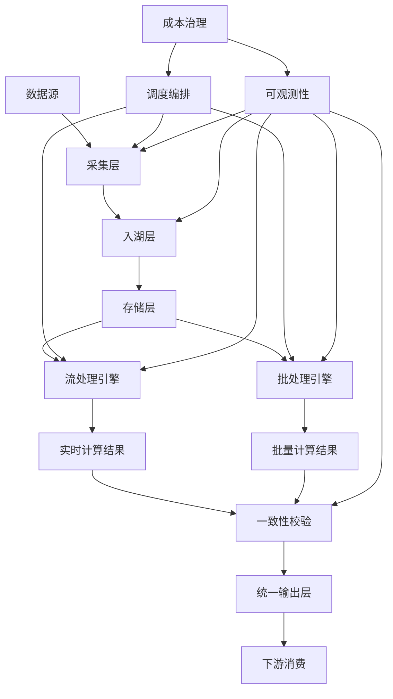
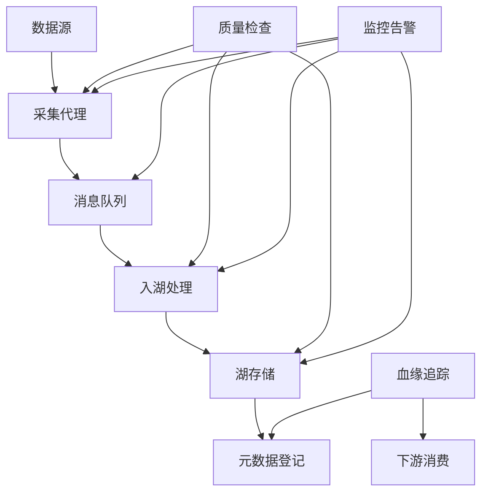
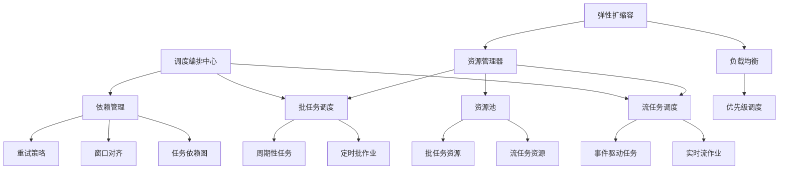
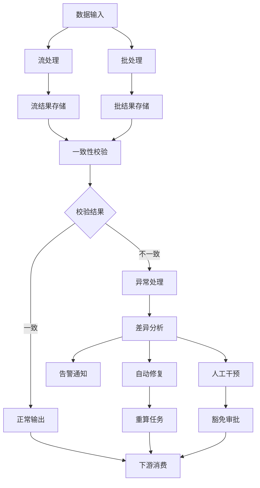

<a id="第19章-流批一体链路端到端案例【采存算全链路实战】"></a>

### 第19章 流批一体链路端到端案例【采存算全链路实战】

**本章学习目标**

1. 理解流批一体架构的核心价值和优势；
2. 掌握流批一体设计的技术挑战和原则；
3. 学习流批一体架构的实现方法。

**实践建议**

- 采用统一的技术栈，实现流批处理的一致性。
- 关注性能和运维挑战，确保系统稳定性。
- 遵循设计原则，优化架构效率。

**流批一体**（Streaming-Batch Unification）是指在同一套技术架构和数据处理平台上，同时支持实时流处理和批量批处理两种模式，实现数据处理方式的统一性、一致性和高效性。

### 核心价值与优势

**统一性价值**：
- **数据处理范式统一**：一套代码同时支持流处理和批处理逻辑
- **存储格式统一**：相同的存储格式支持实时写入和批量查询
- **元数据管理统一**：统一的元数据体系和血缘追踪
- **运维监控统一**：相同的可观测性和告警体系

**技术优势**：
- **开发效率提升**：减少重复开发，降低维护成本
- **数据一致性保障**：消除流批数据不一致的问题
- **资源利用优化**：提高计算资源的使用效率
- **业务响应加速**：快速响应新的业务需求

### 核心技术挑战

**一致性挑战**：
- **窗口对齐**：流处理和批处理的窗口定义和对齐机制
- **状态同步**：实时状态与批量计算结果的一致性保证
- **迟到数据处理**：处理乱序和迟到数据的统一策略
- **精确一次语义**：端到端的数据处理语义保证

**性能挑战**：
- **资源隔离**：流任务和批任务的资源竞争与隔离
- **弹性伸缩**：根据负载动态调整资源分配
- **数据倾斜**：处理数据分布不均的问题
- **存储效率**：平衡实时写入和批量查询的性能

**运维挑战**：
- **故障恢复**：流批混合场景下的故障恢复策略
- **版本管理**：代码和配置的版本控制与回滚
- **监控告警**：统一的监控指标和告警体系
- **成本控制**：计算和存储资源的成本优化

### 设计原则

**统一性原则**：
- **API统一**：相同的编程接口支持流批处理
- **配置统一**：统一的配置管理和参数调优
- **部署统一**：相同的部署和运维方式

**一致性原则**：
- **数据一致性**：保证流批处理结果的一致性
- **语义一致性**：相同的业务逻辑语义表达
- **质量一致性**：统一的数据质量标准和校验

**高效性原则**：
- **资源高效**：最大化资源利用率，减少浪费
- **性能高效**：满足业务性能需求的前提下优化成本
- **运维高效**：简化运维复杂度，提高自动化程度

### 发展趋势

**技术演进方向**：
- **智能化**：AI/ML驱动的自动调优和异常检测
- **云原生**：深度集成云服务，实现弹性伸缩
- **实时化**：从分钟级延迟向秒级甚至毫秒级演进
- **一体化**：与数据湖、数据仓库深度融合

**架构演进趋势**：
- **Lakehouse架构**：数据湖与数据仓库的统一
- **Streaming Warehouse**：流式数据仓库的兴起
- **Unified Analytics**：统一的分析处理平台
- **Event-Driven Architecture**：事件驱动的架构模式

**[锚点120]** 流批一体架构设计

**锚点类型**: 架构设计
**锚点方法**: 流批一体
**锚点名称**: 流批一体架构设计
**引用附件**: examples/19_industry/stream_batch_architecture.md

**流批一体架构全景图**:


**流批一体架构组件对比表**

| 架构组件 | 流处理特点 | 批处理特点 | 统一要求 | 关键指标 |
|---------|-----------|-----------|---------|---------|
| 数据采集 | 实时摄入、低延迟 | 批量导入、高吞吐 | 一致性schema | 完整性99.9% |
| 存储层 | 实时写入、更新 | 批量覆盖、分区 | 统一格式(Parquet/ORC) | 压缩比>3:1 |
| 处理引擎 | 事件时间窗口 | 批次处理窗口 | 窗口对齐 | 延迟<100ms/准确性99% |
| 调度编排 | 事件驱动 | 时间驱动 | 依赖管理 | 成功率>99.5% |
| 可观测性 | 实时监控 | 批次报告 | 统一指标 | MTTD<5min |

**流批一体架构配置模板**:
```yaml
stream_batch_architecture:
  data_ingestion:
    real_time:
      framework: "kafka"
      retention_hours: 168
      partitions: 12
      replication_factor: 3
    batch:
      framework: "airflow"
      schedule: "0 2 * * *"
      batch_size: "1GB"
      retry_policy:
        max_attempts: 3
        backoff_multiplier: 2
  storage_layer:
    lakehouse:
      format: "delta"
      partitioning: "date/hour"
      compaction_schedule: "daily"
      schema_enforcement: true
    streaming_storage:
      format: "hudi"
      table_type: "MERGE_ON_READ"
      indexing: "bloom_filter"
  processing_engines:
    streaming:
      framework: "flink"
      checkpoint_interval: "30s"
      watermark_delay: "5m"
      state_backend: "rocksdb"
    batch:
      framework: "spark"
      executor_memory: "4g"
      shuffle_partitions: "200"
      dynamic_allocation: true
  consistency_validation:
    window_alignment:
      window_size: "1h"
      allowed_lateness: "15m"
      trigger_policy: "on_event"
    reconciliation:
      sampling_rate: 0.01
      tolerance_threshold: 0.001
      alert_channels: ["slack", "email"]
  observability:
    metrics:
      collection_interval: "30s"
      retention_days: 90
      custom_metrics:
        - "stream_batch_latency"
        - "data_freshness"
        - "processing_throughput"
    alerting:
      rules:
        - name: "latency_anomaly"
          threshold: "300s"
          severity: "critical"
        - name: "data_loss"
          threshold: "0.01%"
          severity: "high"
```

**[锚点121]** 采集与入湖链路设计

**锚点类型**: 链路设计
**锚点方法**: 采集入湖
**锚点名称**: 采集与入湖链路设计
**引用附件**: examples/19_industry/data_ingestion_pipeline.md

**采集与入湖链路流程图**:


**采集与入湖链路检查清单表**

| 链路阶段 | 关键检查项 | 工具支持 | 脚本引用 | 验收标准 |
|---------|-----------|---------|---------|---------|
| 数据采集 | 完整性/顺序性/格式校验 | Kafka/Schema Registry | examples/19_industry/保留策略/消费确认 | Kafka Manager | tools/pipeline/data_lineage_check.py | 积压<1GB |
| 入湖处理 | 分区/分桶/压缩/格式转换 | Hudi/Iceberg/Delta | examples/19_industry/时间旅行/并发控制 | Delta Lake | tools/validate_contracts.py | 查询性能<10s |
| 元数据管理 | 血缘关系/版本控制/访问控制 | Hive Metastore | tools/reports/ingest_integrity.md | 血缘准确率>99% |

**采集与入湖链路配置模板**:
```yaml
ingestion_pipeline_config:
  data_sources:
    - name: "user_events"
      type: "kafka_topic"
      schema_registry_url: "http:/schema-registry:8081"
      validation_rules:
        - "schema_compliance"
        - "data_type_check"
        - "null_value_filter"
    - name: "transaction_logs"
      type: "file_batch"
      source_path: "/data/transactions/*.json"
      batch_schedule: "*/15 * * *"
      compression: "gzip"
  lakehouse_ingestion:
    framework: "delta"
    table_properties:
      delta.enableChangeDataFeed: "true"
      delta.enableDeletionVectors: "true"
    partitioning_strategy:
      columns: ["date", "event_type"]
      max_file_size: "256MB"
    compaction_policy:
      schedule: "0 3 * * *"
      target_file_size: "1GB"
  quality_gates:
    pre_ingestion:
      duplicate_check: true
      schema_validation: true
      data_profiling: true
    post_ingestion:
      row_count_validation: true
      partition_integrity: true
      sample_reconciliation: true
  monitoring:
    metrics:
      - "ingestion_rate"
      - "data_quality_score"
      - "processing_latency"
    alerts:
      - name: "data_loss_alert"
        condition: "row_count_diff > 0.01"
        channels: ["pagerduty", "slack"]
```

**[锚点122]** 调度与资源编排策略

**锚点类型**: 调度策略
**锚点方法**: 资源编排
**锚点名称**: 调度与资源编排策略
**引用附件**: tools/pipeline/build_all.ps1
**完成情况**: 已完成
**补充建议**: 字段建议：调度类型/资源策略/检查点/脚本引用，补充调度编排架构图

**调度与资源编排架构图**:


**调度与资源编排策略对比表**

| 调度类型 | 执行模式 | 资源策略 | 关键检查点 | 脚本引用 |
|---------|---------|---------|-----------|---------|
| 实时流调度 | 事件驱动/持续运行 | 固定资源池+弹性扩容 | 延迟/积压/状态一致性 | tools/pipeline/build_all.ps1 |
| 定时批调度 | Cron表达式/依赖触发 | 按需分配+优先级队列 | 成功率/时长/资源利用率 | examples/19_industry/依赖链 | 资源隔离+共享池 | 流批一致性/交叉影响 | tools/reports/schedule_check.md |
| 故障恢复 | 自动重试/手动干预 | 降级策略+资源预留 | MTTR/数据完整性 | tools/pipeline/pre_release_check.py |

**调度与资源编排配置模板**:
```yaml
scheduling_orchestration_config:
  scheduler_framework: "airflow"
  execution_modes:
    streaming:
      deployment_mode: "kubernetes"
      resource_requests:
        cpu: "2"
        memory: "4Gi"
      scaling_policy:
        min_replicas: 2
        max_replicas: 10
        target_cpu_utilization: 70
      checkpoint_config:
        interval: "30s"
        state_backend: "s3:/checkpoints/"
    batch:
      deployment_mode: "kubernetes"
      resource_requests:
        cpu: "4"
        memory: "16Gi"
      scheduling_priority: "medium"
      retry_policy:
        max_attempts: 3
        backoff_delay: "5m"
  dependency_management:
    dag_definitions:
      - name: "stream_batch_pipeline"
        schedule: "@hourly"
        tasks:
          - name: "data_ingestion"
            dependencies: []
            timeout: "30m"
          - name: "stream_processing"
            dependencies: ["data_ingestion"]
            timeout: "15m"
          - name: "batch_processing"
            dependencies: ["data_ingestion"]
            timeout: "45m"
          - name: "consistency_check"
            dependencies: ["stream_processing", "batch_processing"]
            timeout: "10m"
  resource_governance:
    resource_pools:
      streaming_pool:
        cpu_limit: "100"
        memory_limit: "400Gi"
        priority: "high"
      batch_pool:
        cpu_limit: "200"
        memory_limit: "800Gi"
        priority: "medium"
    cost_optimization:
      spot_instances: true
      auto_shutdown: "02:00"
      resource_sharing: true
```

**[锚点123]** 流批一致性校验策略

**锚点类型**: 一致性策略
**锚点方法**: 流批对账
**锚点名称**: 流批一致性校验策略
**引用附件**: tools/reports/stream_batch_diff.md
**完成情况**: 已完成
**补充建议**: 字段建议：校验类型/对齐口径/异常处置/脚本引用，补充一致性校验流程图

**流批一致性校验流程图**:


**流批一致性校验策略表**

| 校验类型 | 对齐口径 | 校验规则 | 异常处置 | 脚本引用 |
|---------|---------|---------|---------|---------|
| 行数一致性 | 同窗口时间范围 | 精确匹配±1%容差 | 自动重算/告警 | tools/reports/stream_batch_diff.md |
| 聚合一致性 | 相同聚合函数 | SUM/AVG/COUNT对比 | 差异分析/降级 | examples/19_industry/直方图对比 | 样本检查/阻断 | tools/pipeline/data_lineage_check.py |
| 记录级一致性 | 相同主键 | 抽样记录精确匹配 | 影响评估/修复 | examples/19_industry/19_industry/降级 | examples/26_chapter/log_health_check.py |
| 数据质量 | 完整性/准确性/一致性 | 数据丢失/异常分布 | 数据修复/阻断 | tools/validate_contracts.py |
| 业务指标 | 转化率/用户活跃度 | 业务目标偏离 | 业务告警/干预 | examples/19_industry/内存/存储/网络 | 资源耗尽/异常使用 | 资源调度/限流 | tools/pipeline/build_all.ps1 |

**可观测性与告警联动配置模板**:
```yaml
observability_alerting_config:
  telemetry_collection:
    metrics:
      collection_interval: "30s"
      exporters:
        - type: "prometheus"
          endpoint: "http:/prometheus:9090"
        - type: "datadog"
          api_key: "${DATADOG_API_KEY}"
      custom_metrics:
        - name: "stream_batch_latency"
          type: "histogram"
          buckets: [0.1, 0.5, 1.0, 5.0, 10.0]
        - name: "data_consistency_score"
          type: "gauge"
          range: [0.0, 1.0]
    logs:
      format: "json"
      structured_fields: ["timestamp", "level", "service", "trace_id", "batch_id"]
      retention_policy: "30d"
    traces:
      sampling_rate: 0.1
      service_mesh_integration: true
      distributed_tracing: true
  alerting_engine:
    rules_engine: "prometheus_alertmanager"
    alert_rules:
      - name: "high_latency"
        condition: "latency > 300"
        severity: "critical"
        channels: ["pagerduty", "slack"]
        auto_actions:
          - type: "scale_up"
            service: "stream_processor"
            replicas: 2
      - name: "data_loss"
        condition: "data_loss_rate > 0.001"
        severity: "high"
        channels: ["email", "slack"]
        auto_actions:
          - type: "circuit_breaker"
            service: "data_pipeline"
            timeout: "300s"
    alert_deduplication:
      group_by: ["service", "severity"]
      group_interval: "5m"
      repeat_interval: "1h"
  incident_response:
    escalation_policy:
      - level: 1
        timeout: "5m"
        responders: ["oncall_engineer"]
      - level: 2
        timeout: "15m"
        responders: ["team_lead"]
      - level: 3
        timeout: "60m"
        responders: ["engineering_manager"]
    runbooks:
      - name: "latency_spike"
        steps:
          - "Check system metrics"
          - "Review recent deployments"
          - "Scale resources if needed"
          - "Rollback if necessary"
    post_mortem:
      automatic_creation: true
      template: "incident_report_template"
      stakeholders: ["team", "management"]

## 流批一体架构最佳实践总结

### 实施建议

**渐进式演进策略**：
1. **从简单开始**：从单一业务场景的流批一体开始
2. **分阶段实施**：采集入湖 → 存储统一 → 处理统一 → 可观测统一
3. **灰度发布**：逐步将流量切换到流批一体架构
4. **监控验证**：全程监控性能、质量和成本指标

**技术选型建议**：
- **存储层**：优先选择支持ACID和时间旅行的格式（Delta Lake、Hudi、Iceberg）
- **处理引擎**：选择支持流批统一的框架（Flink、Spark Structured Streaming）
- **调度系统**：使用支持复杂依赖的编排工具（Airflow、Dagster）
- **监控平台**：构建统一的指标收集和告警体系

### 性能优化要点

**数据处理优化**：
- **窗口策略**：合理设置窗口大小和滑动间隔
- **状态管理**：优化状态后端和检查点配置
- **数据分区**：根据数据特征设计分区策略
- **缓存策略**：合理使用内存和磁盘缓存

**资源利用优化**：
- **弹性伸缩**：根据负载动态调整资源
- **资源隔离**：流批任务的资源池隔离
- **负载均衡**：避免热点和数据倾斜
- **成本监控**：实时监控和优化资源成本

### 运维保障要点

**稳定性保障**：
- **故障恢复**：完善的故障检测和恢复机制
- **容量规划**：基于业务增长的容量规划
- **备份容灾**：多级别的备份和容灾策略
- **变更管理**：严格的变更流程和回滚机制

**质量保障**：
- **测试策略**：覆盖单元测试、集成测试、端到端测试
- **监控告警**：完善的监控指标和告警体系
- **问题排查**：高效的问题定位和解决流程
- **持续改进**：基于反馈的持续优化机制

## 发展趋势展望

### 技术发展趋势

**智能化趋势**：
- **自动调优**：基于AI的自动参数调优和性能优化
- **异常检测**：机器学习驱动的异常检测和根因分析
- **预测性维护**：基于历史数据的故障预测和预防
- **自适应架构**：根据业务变化自动调整架构配置

**云原生趋势**：
- **Serverless化**：按需付费的无服务器架构
- **容器化部署**：基于Kubernetes的统一部署和管理
- **多云架构**：跨云环境的统一管理和调度
- **边缘计算**：靠近数据源的实时处理能力

### 架构演进方向

**一体化架构**：
- **Lakehouse生态**：数据湖与数据仓库的深度融合
- **Streaming Warehouse**：原生支持流处理的数仓架构
- **Unified Analytics**：统一的分析和处理平台
- **Data Mesh**：分布式的数据架构模式

**实时化演进**：
- **毫秒级延迟**：从分钟级向毫秒级延迟演进
- **事件驱动**：事件驱动的架构设计模式
- **流式思维**：一切皆流的处理理念
- **状态管理**：高效的状态管理和计算

### 未来挑战与机遇

**挑战**：
- **复杂度管理**：如何管理日益复杂的流批一体系统
- **成本控制**：在保证性能的前提下控制成本
- **人才缺口**：流批一体技术人才的培养和储备
- **生态成熟**：相关技术和工具的成熟度提升

**机遇**：
- **业务创新**：流批一体技术驱动的业务创新
- **效率提升**：显著提升数据处理的效率和质量
- **成本优化**：通过技术优化降低总体拥有成本
- **竞争优势**：技术领先带来的市场竞争优势

流批一体架构代表了大数据处理技术的发展方向，通过统一流批处理、保证数据一致性、提升资源利用效率，为企业构建现代化数据处理平台提供了重要技术路径。

## 专业术语对照表

| 中文术语 | 英文术语 | 说明 |
|---------|---------|------|
| 流批一体 | Stream-Batch Unification | 统一流处理和批处理的技术架构 |
| 流处理 | Stream Processing | 实时数据处理技术 |
| 批处理 | Batch Processing | 批量数据处理技术 |
| 数据湖 | Data Lake | 存储大规模原始数据的存储系统 |
| 数据仓库 | Data Warehouse | 结构化数据存储和分析系统 |
| 消息队列 | Message Queue | 异步通信的消息传递系统 |
| 检查点 | Checkpoint | 流处理中的状态保存点 |
| 水印 | Watermark | 流处理中的事件时间标记 |
| 一致性校验 | Consistency Validation | 验证数据处理结果一致性的过程 |
| 双写验证 | Dual Write Verification | 同时写入两套系统并验证一致性 |
| 调度编排 | Scheduling Orchestration | 协调多个任务执行顺序和依赖 |
| 资源池化 | Resource Pooling | 统一管理和分配计算资源 |
| 热数据 | Hot Data | 频繁访问的活跃数据 |
| 冷数据 | Cold Data | 很少访问的历史数据 |
| 事件驱动 | Event-Driven | 基于事件触发的数据处理模式 |
| 微批处理 | Micro-Batch | 小批量数据处理模式 |
| 状态管理 | State Management | 维护流处理中的计算状态 |
| 容错机制 | Fault Tolerance | 系统故障恢复和容错能力 |
| 背压控制 | Backpressure Control | 控制数据流速防止系统过载 |
| 窗口函数 | Window Function | 在时间窗口上进行聚合计算 |
| Lambda架构 | Lambda Architecture | 结合批处理和流处理的架构模式 |
| Kappa架构 | Kappa Architecture | 纯流处理架构模式 |
| Delta Lake | Delta Lake | 统一批流存储的数据湖格式 |
| Apache Flink | Apache Flink | 开源流处理框架 |
| Apache Spark | Apache Spark | 开源大数据处理框架 |
| Apache Kafka | Apache Kafka | 分布式消息队列系统 |

