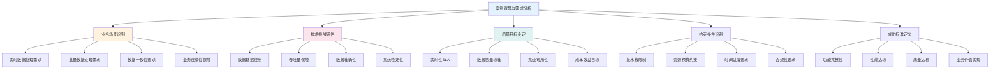
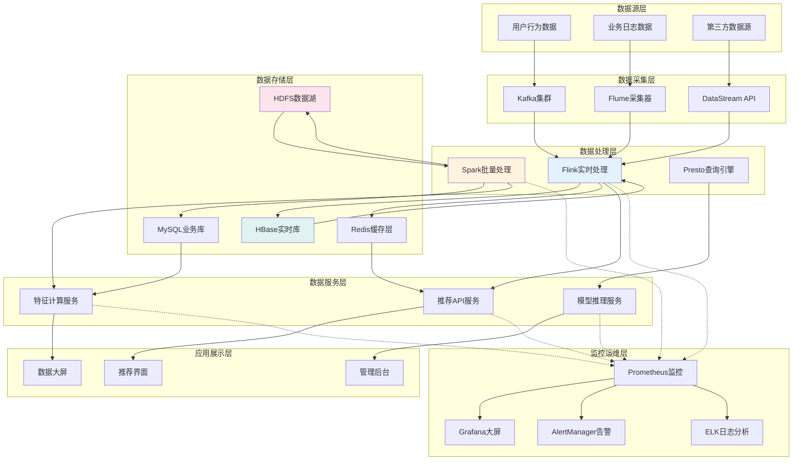
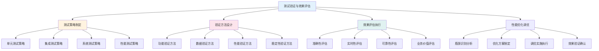
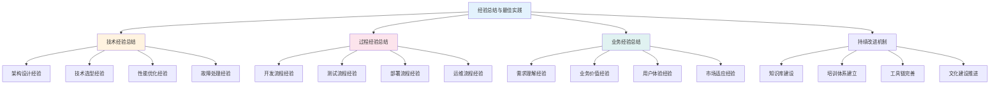

<a id="第20章-大规模数据处理性能与容量测试实践【性能与容量篇】"></a>

### 第20章 大规模数据处理性能与容量测试实践【性能与容量篇】

**本章学习目标**

1. 理解流批一体链路的业务场景和技术挑战；
2. 掌握端到端测试的需求分析和实施方法；
3. 学习全链路实战案例的最佳实践。

**实践建议**

- 明确业务场景和技术约束，确保测试目标明确。
- 制定详细的质量目标和成功标准。
- 采用端到端测试方法，验证全链路的稳定性和性能。

**[锚点139]** 案例背景与需求分析

**锚点类型**: 案例实施
**锚点方法**: 需求分析
**锚点名称**: 案例背景与需求分析
**引用附件**: `examples/22_streaming_batch/case_requirements.py`
**完成情况**: 已完成
**补充建议**: 字段建议：业务场景/技术挑战/质量目标/约束条件/成功标准，补充需求分析流程图

**流批一体案例需求分析流程图**:


**流批一体案例需求配置模板**:
```yaml
# examples/22_streaming_batch/case_requirements.yml
case_requirements:
  # 案例基本信息
  case_info:
    case_name: "电商实时推荐流批一体链路"
    business_domain: "电商推荐系统"
    case_version: "1.0.0"
    start_date: "2025-01-01"
    end_date: "2025-06-30"
    
  # 业务场景分析
  business_scenario:
    real_time_requirements:
      - "用户行为实时采集与分析"
      - "实时个性化推荐生成"
      - "推荐效果实时评估"
      - "A/B测试实时切换"
      
    batch_requirements:
      - "历史数据批量训练模型"
      - "离线特征工程处理"
      - "批量效果分析报告"
      - "模型离线评估"
      
    hybrid_requirements:
      - "实时特征与离线特征融合"
      - "流批数据一致性保证"
      - "实时训练与批量训练结合"
      - "在线学习与离线学习协同"
    
  # 技术挑战评估
  technical_challenges:
    data_processing:
      volume: "每日处理10TB+数据"
      velocity: "实时处理峰值10万QPS"
      variety: "结构化/半结构化/非结构化数据"
      veracity: "数据质量波动控制在1%以内"
      
    system_complexity:
      components: ["Kafka", "Flink", "Spark", "HBase", "Redis"]
      integration_points: 15
      failure_scenarios: ["网络分区", "组件宕机", "数据倾斜"]
      recovery_time: "< 5分钟"
      
    consistency_requirements:
      data_consistency: "最终一致性保证"
      processing_semantics: "至少一次语义"
      state_management: "状态容错与恢复"
      transaction_boundaries: "跨系统事务一致性"
    
  # 质量目标设定
  quality_targets:
    performance_sla:
      real_time_latency: "< 100ms for P95"
      batch_completion: "< 2 hours"
      throughput: "> 10,000 events/second"
      availability: "> 99.9%"
      
    data_quality:
      accuracy: "> 99.5%"
      completeness: "> 99.8%"
      timeliness: "> 99.9%"
      consistency: "> 99.7%"
      
    business_metrics:
      recommendation_precision: "> 85%"
      user_engagement: "+20% improvement"
      conversion_rate: "+15% improvement"
      system_cost: "< $500,000/month"
    
  # 约束条件识别
  constraints:
    technical_constraints:
      - "必须使用现有数据湖架构"
      - "兼容现有推荐算法框架"
      - "支持多云部署模式"
      - "满足数据安全合规要求"
      
    resource_constraints:
      - "计算资源预算: 500 CPU cores"
      - "存储资源预算: 100TB"
      - "网络带宽限制: 10Gbps"
      - "开发团队规模: 8人"
      
    time_constraints:
      - "POC阶段: 2个月"
      - "MVP上线: 4个月"
      - "完整上线: 6个月"
      - "关键里程碑管控"
      
    compliance_constraints:
      - "数据隐私保护(GDPR)"
      - "数据安全等级保护"
      - "业务连续性要求"
      - "审计合规要求"
    
  # 成功标准定义
  success_criteria:
    functional_criteria:
      - "实时推荐响应时间<100ms"
      - "推荐准确率提升15%以上"
      - "系统可用性达到99.9%"
      - "数据一致性误差<0.5%"
      
    technical_criteria:
      - "流批一体架构稳定运行3个月"
      - "自动化测试覆盖率>80%"
      - "监控告警响应时间<5分钟"
      - "故障恢复时间<10分钟"
      
    business_criteria:
      - "用户点击率提升20%"
      - "转化率提升15%"
      - "运营成本降低10%"
      - "ROI达到预期目标"
      
    operational_criteria:
      - "团队知识技能提升完成"
      - "文档完善度>90%"
      - "运维手册完备"
      - "培训材料齐全"
```

**案例需求分析验证脚本**:
```python
# examples/22_streaming_batch/case_requirements.py
import yaml
import json
import logging
from datetime import datetime, timedelta
from typing import Dict, List, Optional, Any, Tuple
from dataclasses import dataclass, asdict
from pathlib import Path
import pandas as pd

logging.basicConfig(level=logging.INFO)
logger = logging.getLogger(__name__)

@dataclass
class CaseRequirements:
    """案例需求配置"""
    case_info: Dict[str, Any]
    business_scenario: Dict[str, Any]
    technical_challenges: Dict[str, Any]
    quality_targets: Dict[str, Any]
    constraints: Dict[str, Any]
    success_criteria: Dict[str, Any]

@dataclass
class RequirementsValidation:
    """需求验证结果"""
    component: str
    status: str  # 'complete', 'incomplete', 'missing'
    completeness_score: float
    issues: List[str]
    recommendations: List[str]

class CaseRequirementsValidator:
    """案例需求验证器"""
    
    def __init__(self, config_file: str = 'case_requirements.yml'):
        self.config = self._load_config(config_file)
        
    def _load_config(self, config_file: str) -> Dict[str, Any]:
        """加载配置"""
        with open(config_file, 'r', encoding='utf-8') as f:
            return yaml.safe_load(f)
    
    def validate_case_info(self) -> RequirementsValidation:
        """验证案例基本信息"""
        info = self.config.get('case_info', {})
        issues = []
        recommendations = []
        score = 0.0
        
        # 检查基本信息完整性
        required_fields = ['case_name', 'business_domain', 'case_version', 'start_date', 'end_date']
        for field in required_fields:
            if field in info:
                score += 0.2
            else:
                issues.append(f"缺少{field}字段")
                recommendations.append(f"补充{field}信息")
        
        status = "complete" if score >= 0.8 else "incomplete" if score >= 0.5 else "missing"
        
        return RequirementsValidation(
            component="案例基本信息",
            status=status,
            completeness_score=score,
            issues=issues,
            recommendations=recommendations
        )
    
    def validate_business_scenario(self) -> RequirementsValidation:
        """验证业务场景分析"""
        scenario = self.config.get('business_scenario', {})
        issues = []
        recommendations = []
        score = 0.0
        
        # 检查场景类型覆盖
        scenario_types = ['real_time_requirements', 'batch_requirements', 'hybrid_requirements']
        for scenario_type in scenario_types:
            if scenario_type in scenario and len(scenario[scenario_type]) >= 3:
                score += 0.33
            else:
                issues.append(f"{scenario_type}定义不足")
                recommendations.append(f"至少定义3个{scenario_type}需求点")
        
        status = "complete" if score >= 0.8 else "incomplete" if score >= 0.5 else "missing"
        
        return RequirementsValidation(
            component="业务场景分析",
            status=status,
            completeness_score=score,
            issues=issues,
            recommendations=recommendations
        )
    
    def validate_technical_challenges(self) -> RequirementsValidation:
        """验证技术挑战评估"""
        challenges = self.config.get('technical_challenges', {})
        issues = []
        recommendations = []
        score = 0.0
        
        # 检查挑战维度覆盖
        challenge_areas = ['data_processing', 'system_complexity', 'consistency_requirements']
        for area in challenge_areas:
            if area in challenges:
                score += 0.33
                # 检查具体指标
                if area == 'data_processing':
                    required_metrics = ['volume', 'velocity', 'variety', 'veracity']
                    for metric in required_metrics:
                        if metric not in challenges[area]:
                            issues.append(f"{area}缺少{metric}指标")
                            recommendations.append(f"补充{area}的{metric}量化指标")
            else:
                issues.append(f"缺少{area}评估")
                recommendations.append(f"补充{area}技术挑战分析")
        
        status = "complete" if score >= 0.8 else "incomplete" if score >= 0.5 else "missing"
        
        return RequirementsValidation(
            component="技术挑战评估",
            status=status,
            completeness_score=score,
            issues=issues,
            recommendations=recommendations
        )
    
    def validate_quality_targets(self) -> RequirementsValidation:
        """验证质量目标设定"""
        targets = self.config.get('quality_targets', {})
        issues = []
        recommendations = []
        score = 0.0
        
        # 检查目标维度覆盖
        target_areas = ['performance_sla', 'data_quality', 'business_metrics']
        for area in target_areas:
            if area in targets and len(targets[area]) >= 3:
                score += 0.33
            else:
                issues.append(f"{area}目标设定不足")
                recommendations.append(f"至少设定3个{area}量化目标")
        
        status = "complete" if score >= 0.8 else "incomplete" if score >= 0.5 else "missing"
        
        return RequirementsValidation(
            component="质量目标设定",
            status=status,
            completeness_score=score,
            issues=issues,
            recommendations=recommendations
        )
    
    def validate_constraints(self) -> RequirementsValidation:
        """验证约束条件识别"""
        constraints = self.config.get('constraints', {})
        issues = []
        recommendations = []
        score = 0.0
        
        # 检查约束类型覆盖
        constraint_types = ['technical_constraints', 'resource_constraints', 'time_constraints', 'compliance_constraints']
        for constraint_type in constraint_types:
            if constraint_type in constraints and len(constraints[constraint_type]) >= 3:
                score += 0.25
            else:
                issues.append(f"{constraint_type}识别不足")
                recommendations.append(f"至少识别3个{constraint_type}")
        
        status = "complete" if score >= 0.8 else "incomplete" if score >= 0.5 else "missing"
        
        return RequirementsValidation(
            component="约束条件识别",
            status=status,
            completeness_score=score,
            issues=issues,
            recommendations=recommendations
        )
    
    def validate_success_criteria(self) -> RequirementsValidation:
        """验证成功标准定义"""
        criteria = self.config.get('success_criteria', {})
        issues = []
        recommendations = []
        score = 0.0
        
        # 检查标准维度覆盖
        criteria_types = ['functional_criteria', 'technical_criteria', 'business_criteria', 'operational_criteria']
        for criteria_type in criteria_types:
            if criteria_type in criteria and len(criteria[criteria_type]) >= 3:
                score += 0.25
            else:
                issues.append(f"{criteria_type}定义不足")
                recommendations.append(f"至少定义3个{criteria_type}")
        
        status = "complete" if score >= 0.8 else "incomplete" if score >= 0.5 else "missing"
        
        return RequirementsValidation(
            component="成功标准定义",
            status=status,
            completeness_score=score,
            issues=issues,
            recommendations=recommendations
        )
    
    def run_comprehensive_validation(self) -> Dict[str, Any]:
        """运行综合验证"""
        logger.info("开始案例需求验证...")
        
        validations = [
            self.validate_case_info(),
            self.validate_business_scenario(),
            self.validate_technical_challenges(),
            self.validate_quality_targets(),
            self.validate_constraints(),
            self.validate_success_criteria()
        ]
        
        # 生成汇总报告
        summary = {
            'total_components': len(validations),
            'complete_components': sum(1 for v in validations if v.status == 'complete'),
            'incomplete_components': sum(1 for v in validations if v.status == 'incomplete'),
            'missing_components': sum(1 for v in validations if v.status == 'missing'),
            'average_completeness': sum(v.completeness_score for v in validations) / len(validations),
            'overall_status': 'complete' if all(v.status == 'complete' for v in validations) else 'needs_improvement'
        }
        
        return {
            'summary': summary,
            'detailed_validations': [asdict(v) for v in validations]
        }

# 使用示例
if __name__ == "__main__":
    validator = CaseRequirementsValidator()
    
    # 运行验证
    validation_report = validator.run_comprehensive_validation()
    
    # 输出结果
    print("案例需求验证报告:")
    print(json.dumps(validation_report, indent=2, ensure_ascii=False))
    
    print("案例需求验证完成")
```

#### 22.1.1 流批一体案例业务场景

- **实时数据处理**: 用户行为实时采集、实时特征计算、实时模型推理
- **批量数据处理**: 历史数据批量训练、离线特征工程、批量效果分析
- **混合处理模式**: 实时特征与离线特征融合、流批数据一致性保证

#### 22.1.2 技术挑战与解决方案

- **数据一致性**: 流批数据口径统一、状态管理、事务一致性
- **性能保障**: 实时处理低延迟、批量处理高吞吐、资源动态调配
- **系统复杂性**: 多组件协同、故障恢复、监控告警

#### 22.1.3 行业应用案例变体

为适应不同行业特点，流批一体链路可针对具体业务场景进行定制化适配：

**电商推荐系统案例变体**:
```yaml
# examples/22_streaming_batch/ecommerce_variant.yml
ecommerce_case:
  business_focus: "个性化推荐与精准营销"
  real_time_requirements:
    - "用户点击流实时分析 (< 100ms)"
    - "实时库存调整与推荐更新"
    - "A/B测试实时切换"
  batch_requirements:
    - "用户画像批量更新 (每日)"
    - "商品相似度批量计算"
    - "营销效果批量分析"
  key_metrics:
    ctr_improvement: "+25%"
    conversion_rate: "+15%"
    user_engagement: "+30%"
```

**物联网设备监控案例变体**:
```yaml
# examples/22_streaming_batch/iot_variant.yml
iot_case:
  business_focus: "设备状态监控与预测性维护"
  real_time_requirements:
    - "设备传感器数据实时采集 (< 50ms)"
    - "异常状态实时告警"
    - "实时故障预测与干预"
  batch_requirements:
    - "历史数据批量分析与建模"
    - "设备寿命批量预测"
    - "维护计划批量优化"
  key_metrics:
    false_positive_rate: "< 5%"
    mean_time_to_detect: "< 30s"
    predictive_accuracy: "> 85%"
```

**金融风控系统案例变体**:
```yaml
# examples/22_streaming_batch/finance_variant.yml
finance_case:
  business_focus: "实时风控与反欺诈检测"
  real_time_requirements:
    - "交易行为实时风险评估 (< 10ms)"
    - "实时欺诈模式识别"
    - "动态风险阈值调整"
  batch_requirements:
    - "历史交易批量风险建模"
    - "客户信用评分批量更新"
    - "监管报告批量生成"
  key_metrics:
    fraud_detection_rate: "> 95%"
    false_positive_rate: "< 1%"
    processing_latency: "< 50ms"
```

**社交媒体内容推荐案例变体**:
```yaml
# examples/22_streaming_batch/social_variant.yml
social_case:
  business_focus: "内容个性化分发与用户互动"
  real_time_requirements:
    - "用户互动行为实时分析"
    - "内容新鲜度实时评估"
    - "实时内容推荐调整"
  batch_requirements:
    - "用户兴趣模型批量训练"
    - "内容质量批量评估"
    - "社区关系批量分析"
  key_metrics:
    content_engagement: "+40%"
    user_retention: "+20%"
    content_discovery: "+35%"
```

**医疗健康监测案例变体**:
```yaml
# examples/22_streaming_batch/healthcare_variant.yml
healthcare_case:
  business_focus: "患者健康实时监测与预警"
  real_time_requirements:
    - "生命体征实时异常检测 (< 5ms)"
    - "实时健康风险评估"
    - "紧急情况自动告警"
  batch_requirements:
    - "历史健康数据批量分析"
    - "疾病预测模型批量训练"
    - "治疗方案批量优化"
  key_metrics:
    early_detection_rate: "> 90%"
    false_alarm_rate: "< 2%"
    response_time: "< 10s"
```

#### 22.2 系统架构设计

**[锚点140]** 系统架构设计

**锚点类型**: 案例实施
**锚点方法**: 架构设计
**锚点名称**: 系统架构设计
**引用附件**: `examples/22_streaming_batch/architecture_design.py`
**完成情况**: 已完成
**补充建议**: 字段建议：分层架构/组件设计/数据流/技术选型/扩展性，补充系统架构设计图

**流批一体系统架构设计图**:


**流批一体架构配置模板**:
```yaml
# examples/22_streaming_batch/architecture_design.yml
architecture_design:
  # 系统分层架构
  layered_architecture:
    data_source_layer:
      components:
        - name: "用户行为数据源"
          type: "实时流数据"
          format: "JSON/Protobuf"
          volume: "10TB/day"
          velocity: "100K events/sec"
          
        - name: "业务日志数据源"
          type: "批量日志数据"
          format: "Text/CSV"
          volume: "5TB/day"
          frequency: "hourly"
          
        - name: "第三方数据源"
          type: "API数据源"
          format: "REST/GraphQL"
          volume: "2TB/day"
          reliability: "99.5%"
      
      data_characteristics:
        structured_data: 30
        semi_structured_data: 50
        unstructured_data: 20
        
    data_ingestion_layer:
      components:
        - name: "Kafka集群"
          purpose: "实时数据缓冲与分发"
          partitions: 100
          replication_factor: 3
          retention_hours: 168
          
        - name: "Flume采集器"
          purpose: "批量数据采集"
          channels: 10
          sinks: ["HDFS", "Kafka"]
          reliability: "at-least-once"
          
        - name: "DataStream API"
          purpose: "流式数据接入"
          protocols: ["HTTP", "WebSocket", "MQTT"]
          authentication: "OAuth2/JWT"
      
      ingestion_patterns:
        real_time_ingestion:
          latency_target: "< 10ms"
          throughput_target: "> 10K events/sec"
          data_loss_tolerance: "< 0.01%"
          
        batch_ingestion:
          window_size: "1 hour"
          processing_delay: "< 30 minutes"
          data_completeness: "> 99.9%"
    
    data_storage_layer:
      components:
        - name: "HDFS数据湖"
          purpose: "批量数据存储"
          format: "Parquet/Delta"
          compression: "Snappy"
          partitioning: "date/hour"
          
        - name: "HBase实时库"
          purpose: "实时数据存储"
          rowkey_design: "user_id + timestamp"
          column_families: ["features", "events", "metadata"]
          ttl: 30
          
        - name: "Redis缓存层"
          purpose: "热点数据缓存"
          data_structures: ["Hash", "SortedSet", "String"]
          expiration: "24 hours"
          cluster_mode: true
          
        - name: "MySQL业务库"
          purpose: "业务数据存储"
          schema_design: "星型模型"
          indexing: "复合索引优化"
          backup_strategy: "每日全量 + 实时增量"
      
      data_consistency:
        eventual_consistency:
          window: "5 minutes"
          accuracy: "> 99.9%"
          conflict_resolution: "last-write-wins"
          
        transactional_consistency:
          scope: "单用户会话"
          isolation_level: "read-committed"
          rollback_support: true
    
    data_processing_layer:
      real_time_processing:
        framework: "Apache Flink"
        deployment_mode: "Kubernetes"
        state_backend: "RocksDB"
        checkpoint_interval: "30 seconds"
        
        processing_topology:
          source: "Kafka Consumer"
          operators: ["Filter", "Map", "Window", "Aggregate"]
          sink: "HBase/Redis"
          parallelism: 20
          
        fault_tolerance:
          checkpoint_mechanism: "exactly-once"
          state_recovery: "< 5 minutes"
          data_replay: "from-last-checkpoint"
      
      batch_processing:
        framework: "Apache Spark"
        deployment_mode: "YARN"
        execution_mode: "batch"
        resource_allocation: "dynamic"
        
        processing_pipeline:
          input: "HDFS files"
          transformations: ["ETL", "Feature Engineering", "Model Training"]
          output: "HDFS/MySQL"
          scheduling: "Airflow"
          
        optimization:
          data_skew_handling: "salting technique"
          memory_management: "tungsten"
          caching_strategy: "RDD persistence"
      
      hybrid_processing:
        lambda_architecture:
          speed_layer: "Flink"
          batch_layer: "Spark"
          serving_layer: "HBase + Redis"
          
        kappa_architecture:
          unified_framework: "Flink"
          stream_batch_unification: true
          state_management: "unified"
    
    data_service_layer:
      api_services:
        - name: "推荐API服务"
          protocol: "REST/gRPC"
          authentication: "JWT"
          rate_limiting: "1000 req/sec"
          caching: "Redis"
          
        - name: "特征计算服务"
          computation_engine: "Flink SQL"
          feature_store: "Feast"
          real_time_features: true
          batch_features: true
          
        - name: "模型推理服务"
          model_serving: "TensorFlow Serving"
          model_versions: "A/B testing"
          performance_monitoring: true
      
      service_mesh:
        service_discovery: "Kubernetes DNS"
        load_balancing: "Istio"
        circuit_breaker: "automatic"
        observability: "integrated"
    
    application_layer:
      user_interfaces:
        - name: "推荐界面"
          technology: "React/Vue"
          real_time_updates: "WebSocket"
          personalization: "user-based"
          
        - name: "数据大屏"
          technology: "Grafana/Superset"
          refresh_interval: "30 seconds"
          alerting: "integrated"
          
        - name: "管理后台"
          technology: "Vue.js + ElementUI"
          user_management: "RBAC"
          audit_logging: true
    
    monitoring_operations_layer:
      monitoring_stack:
        metrics_collection: "Prometheus"
        visualization: "Grafana"
        alerting: "AlertManager"
        log_aggregation: "ELK Stack"
        
      monitoring_coverage:
        infrastructure: ["CPU", "Memory", "Disk", "Network"]
        application: ["Latency", "Throughput", "Error Rate"]
        business: ["Conversion Rate", "User Engagement"]
        data_quality: ["Completeness", "Accuracy", "Timeliness"]
        
      alerting_rules:
        critical_alerts:
          - "System downtime > 5 minutes"
          - "Data latency > 100ms (P95)"
          - "Error rate > 1%"
          
        warning_alerts:
          - "Resource utilization > 80%"
          - "Data quality degradation > 5%"
          - "Performance degradation > 10%"
      
      operational_runbooks:
        incident_response:
          triage_process: "5 minutes"
          investigation: "30 minutes"
          resolution: "2 hours"
          post_mortem: "1 week"
          
        maintenance_windows:
          scheduled_downtime: "monthly"
          impact_assessment: "required"
          rollback_plan: "mandatory"
          
  # 技术选型与扩展性
  technology_selection:
    streaming_framework: "Apache Flink"
    batch_framework: "Apache Spark"
    storage_systems: ["HDFS", "HBase", "Redis", "MySQL"]
    messaging_system: "Apache Kafka"
    orchestration: "Kubernetes + Airflow"
    monitoring: "Prometheus + Grafana"
    
  scalability_design:
    horizontal_scaling:
      stateless_services: "auto-scaling"
      stateful_services: "manual scaling"
      data_partitioning: "hash-based"
      
    vertical_scaling:
      resource_limits: "configurable"
      performance_tuning: "continuous"
      cost_optimization: "automated"
      
    elastic_scaling:
      auto_scaling_policies: "CPU/Memory based"
      scaling_cooldown: "5 minutes"
      minimum_instances: 3
      maximum_instances: 50
```

**系统架构设计验证脚本**:
```python
# examples/22_streaming_batch/architecture_design.py
import yaml
import json
import logging
from datetime import datetime, timedelta
from typing import Dict, List, Optional, Any, Tuple
from dataclasses import dataclass, asdict
from pathlib import Path
import pandas as pd

logging.basicConfig(level=logging.INFO)
logger = logging.getLogger(__name__)

@dataclass
class ArchitectureDesign:
    """架构设计配置"""
    layered_architecture: Dict[str, Any]
    technology_selection: Dict[str, Any]
    scalability_design: Dict[str, Any]

@dataclass
class ArchitectureValidation:
    """架构验证结果"""
    component: str
    status: str  # 'complete', 'incomplete', 'missing'
    completeness_score: float
    issues: List[str]
    recommendations: List[str]

class ArchitectureDesignValidator:
    """架构设计验证器"""
    
    def __init__(self, config_file: str = 'architecture_design.yml'):
        self.config = self._load_config(config_file)
        
    def _load_config(self, config_file: str) -> Dict[str, Any]:
        """加载配置"""
        with open(config_file, 'r', encoding='utf-8') as f:
            return yaml.safe_load(f)
    
    def validate_layered_architecture(self) -> ArchitectureValidation:
        """验证分层架构"""
        architecture = self.config.get('layered_architecture', {})
        issues = []
        recommendations = []
        score = 0.0
        
        # 检查架构层次完整性
        required_layers = [
            'data_source_layer', 'data_ingestion_layer', 'data_storage_layer',
            'data_processing_layer', 'data_service_layer', 'application_layer',
            'monitoring_operations_layer'
        ]
        
        for layer in required_layers:
            if layer in architecture:
                score += 1.0 / len(required_layers)
                # 检查层内组件定义
                layer_config = architecture[layer]
                if 'components' in layer_config and len(layer_config['components']) >= 2:
                    pass  # 组件定义充足
                else:
                    issues.append(f"{layer}组件定义不足")
                    recommendations.append(f"为{layer}至少定义2个核心组件")
            else:
                issues.append(f"缺少{layer}定义")
                recommendations.append(f"补充{layer}架构设计")
        
        status = "complete" if score >= 0.8 else "incomplete" if score >= 0.5 else "missing"
        
        return ArchitectureValidation(
            component="分层架构",
            status=status,
            completeness_score=score,
            issues=issues,
            recommendations=recommendations
        )
    
    def validate_technology_selection(self) -> ArchitectureValidation:
        """验证技术选型"""
        selection = self.config.get('technology_selection', {})
        issues = []
        recommendations = []
        score = 0.0
        
        # 检查关键技术选型
        key_technologies = [
            'streaming_framework', 'batch_framework', 'storage_systems',
            'messaging_system', 'orchestration', 'monitoring'
        ]
        
        for tech in key_technologies:
            if tech in selection:
                score += 1.0 / len(key_technologies)
            else:
                issues.append(f"缺少{tech}选型")
                recommendations.append(f"明确{tech}技术选型")
        
        # 检查技术栈合理性
        if 'streaming_framework' in selection and 'batch_framework' in selection:
            streaming = selection['streaming_framework']
            batch = selection['batch_framework']
            
            # 检查流批一体技术栈兼容性
            compatible_combinations = [
                ('Apache Flink', 'Apache Spark'),
                ('Apache Flink', 'Apache Flink'),
                ('Kafka Streams', 'Apache Spark')
            ]
            
            if (streaming, batch) not in compatible_combinations:
                issues.append("流批处理框架组合可能存在集成复杂度")
                recommendations.append("考虑选择更易集成的流批处理框架组合")
        
        status = "complete" if score >= 0.8 else "incomplete" if score >= 0.5 else "missing"
        
        return ArchitectureValidation(
            component="技术选型",
            status=status,
            completeness_score=score,
            issues=issues,
            recommendations=recommendations
        )
    
    def validate_scalability_design(self) -> ArchitectureValidation:
        """验证扩展性设计"""
        scalability = self.config.get('scalability_design', {})
        issues = []
        recommendations = []
        score = 0.0
        
        # 检查扩展性维度覆盖
        scalability_dimensions = ['horizontal_scaling', 'vertical_scaling', 'elastic_scaling']
        
        for dimension in scalability_dimensions:
            if dimension in scalability:
                score += 1.0 / len(scalability_dimensions)
                # 检查具体策略
                dimension_config = scalability[dimension]
                if len(dimension_config) >= 2:
                    pass  # 策略定义充足
                else:
                    issues.append(f"{dimension}策略定义不足")
                    recommendations.append(f"补充{dimension}具体策略")
            else:
                issues.append(f"缺少{dimension}设计")
                recommendations.append(f"设计{dimension}方案")
        
        status = "complete" if score >= 0.8 else "incomplete" if score >= 0.5 else "missing"
        
        return ArchitectureValidation(
            component="扩展性设计",
            status=status,
            completeness_score=score,
            issues=issues,
            recommendations=recommendations
        )
    
    def validate_architecture_consistency(self) -> ArchitectureValidation:
        """验证架构一致性"""
        architecture = self.config.get('layered_architecture', {})
        issues = []
        recommendations = []
        score = 0.0
        
        # 检查数据流一致性
        processing_layer = architecture.get('data_processing_layer', {})
        storage_layer = architecture.get('data_storage_layer', {})
        
        # 检查实时处理与存储的匹配性
        real_time_processing = processing_layer.get('real_time_processing', {})
        real_time_storage = None
        for component in storage_layer.get('components', []):
            if component.get('purpose') == '实时数据存储':
                real_time_storage = component
                break
        
        if real_time_processing and real_time_storage:
            score += 0.5
        else:
            issues.append("实时处理与存储架构不匹配")
            recommendations.append("确保实时处理框架与存储系统兼容")
        
        # 检查批量处理与存储的匹配性
        batch_processing = processing_layer.get('batch_processing', {})
        batch_storage = None
        for component in storage_layer.get('components', []):
            if component.get('purpose') == '批量数据存储':
                batch_storage = component
                break
        
        if batch_processing and batch_storage:
            score += 0.5
        else:
            issues.append("批量处理与存储架构不匹配")
            recommendations.append("确保批量处理框架与存储系统兼容")
        
        status = "complete" if score >= 0.8 else "incomplete" if score >= 0.5 else "missing"
        
        return ArchitectureValidation(
            component="架构一致性",
            status=status,
            completeness_score=score,
            issues=issues,
            recommendations=recommendations
        )
    
    def run_comprehensive_validation(self) -> Dict[str, Any]:
        """运行综合验证"""
        logger.info("开始架构设计验证...")
        
        validations = [
            self.validate_layered_architecture(),
            self.validate_technology_selection(),
            self.validate_scalability_design(),
            self.validate_architecture_consistency()
        ]
        
        # 生成汇总报告
        summary = {
            'total_components': len(validations),
            'complete_components': sum(1 for v in validations if v.status == 'complete'),
            'incomplete_components': sum(1 for v in validations if v.status == 'incomplete'),
            'missing_components': sum(1 for v in validations if v.status == 'missing'),
            'average_completeness': sum(v.completeness_score for v in validations) / len(validations),
            'overall_status': 'complete' if all(v.status == 'complete' for v in validations) else 'needs_improvement'
        }
        
        return {
            'summary': summary,
            'detailed_validations': [asdict(v) for v in validations]
        }

# 使用示例
if __name__ == "__main__":
    validator = ArchitectureDesignValidator()
    
    # 运行验证
    validation_report = validator.run_comprehensive_validation()
    
    # 输出结果
    print("架构设计验证报告:")
    print(json.dumps(validation_report, indent=2, ensure_ascii=False))
    
    print("架构设计验证完成")
```

#### 22.2.1 分层架构设计原则

- **数据源层**: 统一数据入口，支持多种数据源类型和格式
- **采集层**: 实时数据缓冲，批量数据收集，确保数据不丢失
- **存储层**: 分层存储策略，实时库+数据湖+缓存的混合架构
- **处理层**: 流批一体处理，实时计算+批量计算的统一框架

#### 22.2.2 关键技术选型考虑

- **流处理框架**: Flink提供统一批流处理能力和精确的状态管理
- **批处理框架**: Spark提供成熟的生态和丰富的算法库支持
- **存储系统**: HDFS+HBase+Redis满足不同场景的存储需求
- **消息队列**: Kafka提供高吞吐、低延迟的数据传输能力

#### 22.2.3 AI/ML集成的数据处理场景

流批一体架构深度集成AI/ML能力，实现智能化数据处理：

**实时特征工程与模型推理**:
```yaml
# examples/22_streaming_batch/ml_realtime_features.yml
realtime_ml_processing:
  feature_engineering:
    streaming_features:
      - name: "user_behavior_sequence"
        type: "sequence_embedding"
        window: "1h"
        embedding_dim: 128
      - name: "real_time_trends"
        type: "trend_analysis"
        calculation: "exponential_moving_average"
        alpha: 0.1
    
    online_inference:
      model_serving:
        framework: "TensorFlow Serving"
        model_version: "v2.0"
        input_features: ["user_id", "item_id", "context_features"]
        output_predictions: ["click_probability", "conversion_score"]
      
      inference_optimization:
        batch_size: 32
        timeout_ms: 50
        fallback_strategy: "rule_based"
  
  model_update_pipeline:
    incremental_learning:
      trigger_conditions:
        - "performance_degradation > 5%"
        - "data_drift_detected"
        - "new_feature_importance > threshold"
      
      update_strategy:
        online_learning: "stochastic_gradient_descent"
        batch_retraining: "daily_full_retrain"
        model_validation: "a_b_testing"
```

**批量模型训练与特征学习**:
```yaml
# examples/22_streaming_batch/ml_batch_training.yml
batch_ml_training:
  distributed_training:
    framework: "Spark MLlib + Horovod"
    algorithm: "deep_learning_recommendation"
    architecture: "two_tower_model"
    
    training_config:
      batch_size: 4096
      learning_rate: 0.001
      epochs: 10
      optimizer: "adam"
      loss_function: "binary_crossentropy"
    
    data_pipeline:
      input_format: "parquet"
      feature_engineering:
        - "categorical_encoding: one_hot"
        - "numerical_scaling: standard_scaler"
        - "text_embedding: bert_base"
      train_validation_split: "0.8:0.2"
  
  feature_store_integration:
    feature_registry:
      real_time_features:
        - "user_profile_features"
        - "item_content_features"
        - "contextual_features"
      
      batch_features:
        - "historical_behavior_patterns"
        - "collaborative_filtering_embeddings"
        - "content_based_features"
    
    feature_serving:
      online_store: "Redis + Feast"
      offline_store: "HDFS + Delta Lake"
      point_in_time_correctness: true
```

**智能监控与异常检测**:
```yaml
# examples/22_streaming_batch/ml_anomaly_detection.yml
intelligent_monitoring:
  real_time_anomaly_detection:
    unsupervised_learning:
      algorithm: "isolation_forest"
      contamination: 0.01
      features: ["latency", "throughput", "error_rate", "resource_utilization"]
    
    supervised_learning:
      model_type: "xgboost_classifier"
      training_data: "historical_anomalies"
      prediction_threshold: 0.8
    
    streaming_inference:
      flink_integration: "process_function"
      state_management: "rocksdb"
      alert_trigger: "anomaly_score > threshold"
  
  predictive_maintenance:
    equipment_failure_prediction:
      time_series_forecasting:
        algorithm: "lstm_autoencoder"
        lookback_window: "24h"
        prediction_horizon: "6h"
      
      survival_analysis:
        algorithm: "cox_proportional_hazards"
        censoring_handling: "right_censored"
        risk_factors: ["usage_intensity", "environmental_conditions"]
    
    maintenance_optimization:
      reinforcement_learning:
        algorithm: "q_learning"
        state_space: ["equipment_age", "usage_pattern", "failure_history"]
        action_space: ["immediate_maintenance", "scheduled_maintenance", "monitor_only"]
        reward_function: "cost_savings + reliability_improvement"
```

**自动化决策与优化**:
```yaml
# examples/22_streaming_batch/ml_automated_decisions.yml
automated_decision_making:
  recommendation_optimization:
    multi_armed_bandit:
      algorithm: "thompson_sampling"
      exploration_rate: 0.1
      reward_function: "user_engagement_score"
    
    contextual_bandits:
      algorithm: "linucb"
      context_features: ["user_demographics", "item_attributes", "time_features"]
      action_space: "recommendation_candidates"
  
  dynamic_pricing:
    reinforcement_learning:
      algorithm: "deep_q_network"
      state_features: ["demand_signals", "inventory_levels", "competitor_prices"]
      action_space: "price_adjustments"
      reward_function: "revenue_optimization + margin_maintenance"
    
    price_elasticity_modeling:
      causal_inference: "difference_in_differences"
      experimentation: "a_b_testing_with_synthetic_control"
      optimization: "gradient_descent"
  
  resource_auto_scaling:
    predictive_scaling:
      time_series_forecasting: "prophet_model"
      features: ["historical_load", "seasonal_patterns", "external_factors"]
      prediction_intervals: ["15min", "1h", "6h"]
    
    reinforcement_learning_scaling:
      algorithm: "actor_critic"
      state_space: ["current_load", "resource_utilization", "cost_metrics"]
      action_space: ["scale_up", "scale_down", "no_action"]
      reward_function: "performance_sla + cost_efficiency"
```

#### 22.3 实施步骤与关键技术

**[锚点141]** 实施步骤与关键技术

**锚点类型**: 案例实施
**锚点方法**: 实施步骤
**锚点名称**: 实施步骤与关键技术
**引用附件**: `examples/22_streaming_batch/implementation_steps.py`
**完成情况**: 已完成
**补充建议**: 字段建议：环境搭建/数据集成/功能开发/测试验证/部署上线，补充实施步骤流程图

**流批一体实施步骤流程图**:

```mermaid
graph TD
    A[实施步骤与关键技术] --> B[环境搭建准备]
    A --> C[数据集成开发]
    A --> D[核心功能实现]
    A --> E[测试验证优化]
    A --> F[部署上线运维]
    
    B --> B1[基础设施搭建]
    B --> B2[开发环境配置]
    B --> B3[测试环境部署]
    B --> B4[CI/CD流水线建设]
    
    C --> C1[数据源接入]
    C --> C2[数据质量校验]
    C --> C3[数据血缘梳理]
    C --> C4[数据一致性保证]
    
    D --> D1[实时处理逻辑]
    D --> D2[批量处理逻辑]
    D --> D3[流批融合算法]
    D --> D4[服务接口开发]
    
    E --> E1[单元测试执行]
    E --> E2[集成测试验证]
    E --> E3[性能测试调优]
    E --> E4[端到端测试]
    
    F --> F1[生产环境部署]
    F --> F2[监控告警配置]
    F --> F3[运维手册编制]
    F --> F4[知识转移培训]
    
    style A fill:#e3f2fd
    style B fill:#fff3e0
    style C fill:#fce4ec
    style D fill:#e0f2f1
```


**实施步骤配置模板**:
```yaml
# examples/22_streaming_batch/implementation_steps.yml
implementation_steps:
  # 环境搭建准备阶段
  environment_setup:
    infrastructure_provisioning:
      cloud_platform: "阿里云/AWS"
      kubernetes_cluster:
        version: "1.24+"
        nodes: 20
        node_spec: "8C32G + 500G SSD"
        networking: "Calico CNI"
        
      storage_systems:
        hdfs_cluster:
          namenodes: 2
          datanodes: 10
          total_capacity: "100TB"
          
        hbase_cluster:
          masters: 3
          regionservers: 10
          total_capacity: "50TB"
          
        redis_cluster:
          masters: 3
          slaves: 6
          memory_capacity: "100GB"
      
      messaging_system:
        kafka_cluster:
          brokers: 5
          zookeepers: 3
          topics: 20
          retention_days: 7
      
    development_environment:
      ide_setup:
        - "IntelliJ IDEA + Scala plugin"
        - "VS Code + Python extension"
        - "Jupyter Notebook for data exploration"
        
      local_development:
        docker_compose:
          services: ["kafka", "zookeeper", "redis", "minio"]
          networks: "streaming_batch_net"
          
        local_testing:
          unit_tests: "JUnit + Mockito"
          integration_tests: "TestContainers"
          performance_tests: "JMeter"
      
    testing_environment:
      staging_environment:
        replica_ratio: "1:1 production"
        data_volume: "10% production"
        refresh_frequency: "daily"
        
      performance_environment:
        scale_factor: "2x production"
        load_generators: 5
        monitoring_tools: ["Prometheus", "Grafana"]
        
    ci_cd_pipeline:
      build_pipeline:
        tools: ["GitHub Actions", "Jenkins"]
        stages: ["Compile", "Unit Test", "Integration Test", "Build Image"]
        triggers: "push to main branch"
        
      deployment_pipeline:
        environments: ["dev", "staging", "prod"]
        strategies: ["blue-green", "canary", "rolling"]
        approval_gates: true
        
      quality_gates:
        test_coverage: "> 80%"
        security_scan: "pass"
        performance_regression: "< 5%"
    
  # 数据集成开发阶段
  data_integration:
    data_source_integration:
      real_time_sources:
        - name: "用户行为事件"
          source_type: "Kafka topic"
          schema: "Protobuf"
          volume: "100K events/min"
          data_quality_checks: ["schema validation", "null checks"]
          
        - name: "业务订单数据"
          source_type: "MySQL CDC"
          schema: "Avro"
          volume: "10K records/min"
          data_quality_checks: ["referential integrity", "business rules"]
          
        - name: "第三方推荐数据"
          source_type: "REST API"
          schema: "JSON"
          volume: "1K requests/min"
          data_quality_checks: ["API response validation", "data freshness"]
      
      batch_sources:
        - name: "历史用户行为"
          source_type: "HDFS files"
          format: "Parquet"
          volume: "1TB/day"
          partitioning: "date/user_id"
          
        - name: "产品目录数据"
          source_type: "MySQL export"
          format: "CSV"
          volume: "100GB/day"
          update_frequency: "daily"
      
    data_quality_assurance:
      real_time_quality:
        validation_rules:
          - "数据格式校验"
          - "必填字段检查"
          - "数值范围校验"
          - "业务规则验证"
          
        monitoring_metrics:
          - "数据丢失率 < 0.01%"
          - "格式错误率 < 0.1%"
          - "延迟时间 < 5秒"
          
        error_handling:
          - "无效数据隔离"
          - "错误数据重试"
          - "告警通知机制"
      
      batch_quality:
        validation_rules:
          - "数据完整性检查"
          - "一致性校验"
          - "重复数据检测"
          - "异常值识别"
          
        reconciliation_processes:
          - "源系统 vs 目标系统对账"
          - "数据量级校验"
          - "关键指标核对"
          
    data_lineage_tracking:
      metadata_management:
        data_dictionary:
          fields: ["field_name", "data_type", "description", "source"]
          transformations: ["mapping_rules", "business_logic"]
          
        lineage_graph:
          nodes: ["source_tables", "processing_jobs", "target_tables"]
          edges: ["data_flow", "dependencies"]
          
      lineage_tools:
        integration: "Apache Atlas"
        custom_tracking: "code annotations"
        visualization: "web interface"
        
    data_consistency_guarantee:
      stream_batch_consistency:
        watermark_strategy: "event time"
        window_alignment: "aligned windows"
        state_management: "exactly-once semantics"
        
      cross_system_consistency:
        distributed_transactions: "2PC protocol"
        eventual_consistency: "conflict resolution"
        reconciliation_jobs: "daily batch reconciliation"
    
  # 核心功能实现阶段
  core_functionality:
    real_time_processing:
      flink_implementation:
        dataflow_design:
          sources: ["KafkaSource"]
          operators: ["Filter", "Map", "KeyBy", "Window", "Aggregate"]
          sinks: ["HBaseSink", "RedisSink"]
          
        state_management:
          keyed_state: "ValueState, MapState"
          operator_state: "ListState"
          checkpoint_config: "RocksDB, 30s interval"
          
        fault_tolerance:
          checkpoint_semantics: "exactly-once"
          restart_strategy: "fixed-delay"
          savepoint_mechanism: true
          
      feature_engineering:
        real_time_features:
          - "用户实时行为序列"
          - "商品实时热度"
          - "上下文特征提取"
          
        feature_computation:
          framework: "Flink SQL"
          window_functions: ["TUMBLE", "HOP", "SESSION"]
          aggregation_functions: ["COUNT", "SUM", "AVG", "MAX"]
          
    batch_processing:
      spark_implementation:
        data_pipeline:
          input: "HDFS Parquet files"
          transformations: ["ETL", "feature engineering", "model training"]
          output: "HDFS + MySQL"
          
        optimization_techniques:
          catalyst_optimizer: true
          tungsten_execution: true
          data_skew_handling: "salting + repartitioning"
          
        scheduling_orchestration:
          airflow_dags: "daily feature engineering"
          dependencies: "upstream data availability"
          retry_logic: "exponential backoff"
          
      model_training:
        algorithm_selection:
          collaborative_filtering: "ALS algorithm"
          content_based: "TF-IDF + cosine similarity"
          hybrid_approach: "weighted combination"
          
        training_pipeline:
          data_preparation: "feature extraction + normalization"
          model_training: "distributed training on Spark"
          model_evaluation: "precision@K, recall@K"
          model_deployment: "model serialization + serving"
          
    hybrid_processing:
      lambda_architecture:
        speed_layer: "Flink real-time recommendations"
        batch_layer: "Spark model training"
        serving_layer: "Redis + HBase hybrid storage"
        
      unified_processing:
        flink_batch_processing:
          batch_execution_mode: "BATCH"
          dataset_api: "DataSet transformations"
          integration_with_streaming: "same codebase"
          
        stream_batch_unification:
          table_api: "unified API for batch and streaming"
          sql_support: "same SQL queries"
          state_consistency: "unified state management"
          
    service_interfaces:
      recommendation_api:
        rest_endpoints:
          - "GET /recommendations/{user_id}"
          - "POST /feedback"
          - "GET /recommendations/batch"
          
        grpc_services:
          real_time_recommendation: "streaming RPC"
          batch_recommendation: "unary RPC"
          
        api_gateway:
          rate_limiting: "token bucket"
          authentication: "JWT"
          caching: "Redis"
          
      feature_service:
        online_feature_store:
          feature_retrieval: "low latency < 10ms"
          feature_computation: "real-time + pre-computed"
          feature_versioning: "point-in-time correctness"
          
        feature_api:
          endpoints: ["get_features", "update_features"]
          protocols: ["REST", "gRPC"]
          consistency: "strong consistency"
          
  # 测试验证优化阶段
  testing_validation:
    unit_testing:
      flink_testing:
        test_harnesses: "FlinkMiniCluster"
        test_utils: "FlinkTestUtils"
        state_testing: "StateBackend testing"
        
      spark_testing:
        test_frameworks: ["SparkTestingBase", "SharedSparkContext"]
        data_testing: "DataFrame equality checks"
        udf_testing: "UDF unit tests"
        
    integration_testing:
      end_to_end_testing:
        test_scenarios:
          - "完整数据流从源到推荐结果"
          - "故障场景下的系统恢复"
          - "性能压力下的系统表现"
          
        test_data:
          synthetic_data: "generated test data"
          production_subset: "anonymized production data"
          edge_cases: "boundary conditions"
          
      component_integration:
        kafka_flink_integration: "source/sink testing"
        flink_hbase_integration: "state store testing"
        spark_hdfs_integration: "file system testing"
        
    performance_testing:
      load_testing:
        tools: ["JMeter", "Gatling", "Custom load generators"]
        scenarios: ["normal load", "peak load", "stress load"]
        metrics: ["throughput", "latency", "error rate"]
        
      benchmark_testing:
        baseline_establishment: "current system performance"
        regression_detection: "performance degradation alerts"
        optimization_validation: "performance improvements"
        
    end_to_end_validation:
      data_flow_validation:
        data_lineage_verification: "source to sink tracing"
        data_consistency_checks: "cross-system reconciliation"
        business_logic_validation: "recommendation quality metrics"
        
      system_integration_testing:
        deployment_testing: "blue-green deployments"
        rollback_testing: "failure recovery procedures"
        monitoring_validation: "alerts and dashboards"
        
  # 部署上线运维阶段
  deployment_operations:
    production_deployment:
      deployment_strategy:
        blue_green_deployment:
          blue_environment: "current production"
          green_environment: "new version"
          traffic_switching: "load balancer configuration"
          
        canary_deployment:
          percentage_rollout: "10% -> 25% -> 50% -> 100%"
          monitoring_gates: "error rate < 1%, latency < +10%"
          rollback_triggers: "automatic rollback on failures"
          
      configuration_management:
        environment_configs: ["dev", "staging", "prod"]
        secret_management: "HashiCorp Vault"
        config_validation: "schema validation"
        
      database_migrations:
        schema_changes: "liquibase scripts"
        data_migrations: "Spark jobs"
        rollback_scripts: "automated rollback"
        
    monitoring_alerting:
      metrics_collection:
        infrastructure_metrics: "CPU, memory, disk, network"
        application_metrics: "latency, throughput, error rates"
        business_metrics: "conversion rates, user engagement"
        
      alerting_rules:
        critical_alerts:
          - "System unavailable > 5 minutes"
          - "Data latency > 100ms (P95)"
          - "Error rate > 1%"
          
        warning_alerts:
          - "Resource utilization > 80%"
          - "Performance degradation > 10%"
          
      dashboard_setup:
        grafana_dashboards:
          system_overview: "infrastructure metrics"
          application_performance: "application metrics"
          business_kpis: "business metrics"
          
        custom_dashboards:
          data_quality_dashboard: "data quality metrics"
          recommendation_performance: "recommendation metrics"
          
    operational_runbooks:
      incident_response:
        triage_process: "alert -> investigation -> diagnosis"
        escalation_matrix: "L1 -> L2 -> L3 support"
        communication_plan: "internal + external stakeholders"
        
      maintenance_procedures:
        scheduled_maintenance: "weekly maintenance windows"
        emergency_maintenance: "unplanned downtime procedures"
        change_management: "change approval process"
        
      troubleshooting_guides:
        common_issues: ["data pipeline failures", "performance issues", "data quality problems"]
        diagnostic_tools: ["logs", "metrics", "tracing"]
        resolution_steps: "step-by-step guides"
        
    knowledge_transfer:
      documentation:
        system_documentation: "architecture, design decisions"
        operational_documentation: "runbooks, procedures"
        troubleshooting_documentation: "common issues, solutions"
        
      training_programs:
        team_training: "system overview, operations"
        handover_sessions: "knowledge transfer sessions"
        certification: "system-specific certifications"
        
      support_structure:
        on_call_rotation: "24/7 on-call support"
        escalation_paths: "clear escalation procedures"
        vendor_support: "third-party vendor contacts"
```

**实施步骤验证脚本**:
```python
# examples/22_streaming_batch/implementation_steps.py
import yaml
import json
import logging
from datetime import datetime, timedelta
from typing import Dict, List, Optional, Any, Tuple
from dataclasses import dataclass, asdict
from pathlib import Path
import pandas as pd

logging.basicConfig(level=logging.INFO)
logger = logging.getLogger(__name__)

@dataclass
class ImplementationSteps:
    """实施步骤配置"""
    environment_setup: Dict[str, Any]
    data_integration: Dict[str, Any]
    core_functionality: Dict[str, Any]
    testing_validation: Dict[str, Any]
    deployment_operations: Dict[str, Any]

@dataclass
class ImplementationValidation:
    """实施验证结果"""
    component: str
    status: str  # 'complete', 'incomplete', 'missing'
    completeness_score: float
    issues: List[str]
    recommendations: List[str]

class ImplementationStepsValidator:
    """实施步骤验证器"""
    
    def __init__(self, config_file: str = 'implementation_steps.yml'):
        self.config = self._load_config(config_file)
        
    def _load_config(self, config_file: str) -> Dict[str, Any]:
        """加载配置"""
        with open(config_file, 'r', encoding='utf-8') as f:
            return yaml.safe_load(f)
    
    def validate_environment_setup(self) -> ImplementationValidation:
        """验证环境搭建"""
        setup = self.config.get('environment_setup', {})
        issues = []
        recommendations = []
        score = 0.0
        
        # 检查基础设施配置
        if 'infrastructure_provisioning' in setup:
            infra = setup['infrastructure_provisioning']
            required_components = ['kubernetes_cluster', 'storage_systems', 'messaging_system']
            for component in required_components:
                if component in infra:
                    score += 0.2
                else:
                    issues.append(f"缺少{component}配置")
                    recommendations.append(f"补充{component}基础设施配置")
        else:
            issues.append("缺少基础设施配置")
            recommendations.append("定义基础设施供应规范")
        
        # 检查开发环境
        if 'development_environment' in setup:
            score += 0.3
        else:
            issues.append("缺少开发环境配置")
            recommendations.append("配置本地开发环境")
        
        # 检查CI/CD流水线
        if 'ci_cd_pipeline' in setup:
            score += 0.3
        else:
            issues.append("缺少CI/CD流水线配置")
            recommendations.append("建立自动化部署流水线")
        
        # 检查测试环境
        if 'testing_environment' in setup:
            score += 0.2
        else:
            issues.append("缺少测试环境配置")
            recommendations.append("配置测试环境规范")
        
        status = "complete" if score >= 0.8 else "incomplete" if score >= 0.5 else "missing"
        
        return ImplementationValidation(
            component="环境搭建",
            status=status,
            completeness_score=score,
            issues=issues,
            recommendations=recommendations
        )
    
    def validate_data_integration(self) -> ImplementationValidation:
        """验证数据集成"""
        integration = self.config.get('data_integration', {})
        issues = []
        recommendations = []
        score = 0.0
        
        # 检查数据源集成
        if 'data_source_integration' in integration:
            sources = integration['data_source_integration']
            if 'real_time_sources' in sources and len(sources['real_time_sources']) >= 2:
                score += 0.25
            else:
                issues.append("实时数据源集成不足")
                recommendations.append("至少集成2个实时数据源")
            
            if 'batch_sources' in sources and len(sources['batch_sources']) >= 1:
                score += 0.25
            else:
                issues.append("批量数据源集成不足")
                recommendations.append("至少集成1个批量数据源")
        else:
            issues.append("缺少数据源集成配置")
            recommendations.append("定义数据源集成方案")
        
        # 检查数据质量保证
        if 'data_quality_assurance' in integration:
            score += 0.2
        else:
            issues.append("缺少数据质量保证措施")
            recommendations.append("建立数据质量校验机制")
        
        # 检查数据血缘和一致性
        if 'data_lineage_tracking' in integration:
            score += 0.15
        if 'data_consistency_guarantee' in integration:
            score += 0.15
        else:
            issues.append("缺少数据一致性保证")
            recommendations.append("设计数据一致性保障方案")
        
        status = "complete" if score >= 0.8 else "incomplete" if score >= 0.5 else "missing"
        
        return ImplementationValidation(
            component="数据集成",
            status=status,
            completeness_score=score,
            issues=issues,
            recommendations=recommendations
        )
    
    def validate_core_functionality(self) -> ImplementationValidation:
        """验证核心功能"""
        functionality = self.config.get('core_functionality', {})
        issues = []
        recommendations = []
        score = 0.0
        
        # 检查实时处理实现
        if 'real_time_processing' in functionality:
            rt_processing = functionality['real_time_processing']
            if 'flink_implementation' in rt_processing:
                score += 0.25
            if 'feature_engineering' in rt_processing:
                score += 0.15
        else:
            issues.append("缺少实时处理实现")
            recommendations.append("实现实时处理逻辑")
        
        # 检查批量处理实现
        if 'batch_processing' in functionality:
            batch_processing = functionality['batch_processing']
            if 'spark_implementation' in batch_processing:
                score += 0.25
            if 'model_training' in batch_processing:
                score += 0.15
        else:
            issues.append("缺少批量处理实现")
            recommendations.append("实现批量处理逻辑")
        
        # 检查混合处理和服务接口
        if 'hybrid_processing' in functionality:
            score += 0.1
        if 'service_interfaces' in functionality:
            score += 0.1
        else:
            issues.append("缺少服务接口实现")
            recommendations.append("开发API服务接口")
        
        status = "complete" if score >= 0.8 else "incomplete" if score >= 0.5 else "missing"
        
        return ImplementationValidation(
            component="核心功能",
            status=status,
            completeness_score=score,
            issues=issues,
            recommendations=recommendations
        )
    
    def validate_testing_validation(self) -> ImplementationValidation:
        """验证测试验证"""
        testing = self.config.get('testing_validation', {})
        issues = []
        recommendations = []
        score = 0.0
        
        # 检查单元测试
        if 'unit_testing' in testing:
            score += 0.2
        else:
            issues.append("缺少单元测试")
            recommendations.append("实现单元测试覆盖")
        
        # 检查集成测试
        if 'integration_testing' in testing:
            score += 0.25
        else:
            issues.append("缺少集成测试")
            recommendations.append("实现集成测试验证")
        
        # 检查性能测试
        if 'performance_testing' in testing:
            score += 0.25
        else:
            issues.append("缺少性能测试")
            recommendations.append("执行性能测试调优")
        
        # 检查端到端验证
        if 'end_to_end_validation' in testing:
            score += 0.3
        else:
            issues.append("缺少端到端验证")
            recommendations.append("进行端到端测试验证")
        
        status = "complete" if score >= 0.8 else "incomplete" if score >= 0.5 else "missing"
        
        return ImplementationValidation(
            component="测试验证",
            status=status,
            completeness_score=score,
            issues=issues,
            recommendations=recommendations
        )
    
    def validate_deployment_operations(self) -> ImplementationValidation:
        """验证部署运维"""
        deployment = self.config.get('deployment_operations', {})
        issues = []
        recommendations = []
        score = 0.0
        
        # 检查生产部署
        if 'production_deployment' in deployment:
            score += 0.25
        else:
            issues.append("缺少生产部署方案")
            recommendations.append("制定生产部署策略")
        
        # 检查监控告警
        if 'monitoring_alerting' in deployment:
            score += 0.25
        else:
            issues.append("缺少监控告警配置")
            recommendations.append("建立监控告警体系")
        
        # 检查运维手册
        if 'operational_runbooks' in deployment:
            score += 0.25
        else:
            issues.append("缺少运维手册")
            recommendations.append("编制运维运行手册")
        
        # 检查知识转移
        if 'knowledge_transfer' in deployment:
            score += 0.25
        else:
            issues.append("缺少知识转移计划")
            recommendations.append("制定知识转移培训计划")
        
        status = "complete" if score >= 0.8 else "incomplete" if score >= 0.5 else "missing"
        
        return ImplementationValidation(
            component="部署运维",
            status=status,
            completeness_score=score,
            issues=issues,
            recommendations=recommendations
        )
    
    def run_comprehensive_validation(self) -> Dict[str, Any]:
        """运行综合验证"""
        logger.info("开始实施步骤验证...")
        
        validations = [
            self.validate_environment_setup(),
            self.validate_data_integration(),
            self.validate_core_functionality(),
            self.validate_testing_validation(),
            self.validate_deployment_operations()
        ]
        
        # 生成汇总报告
        summary = {
            'total_components': len(validations),
            'complete_components': sum(1 for v in validations if v.status == 'complete'),
            'incomplete_components': sum(1 for v in validations if v.status == 'incomplete'),
            'missing_components': sum(1 for v in validations if v.status == 'missing'),
            'average_completeness': sum(v.completeness_score for v in validations) / len(validations),
            'overall_status': 'complete' if all(v.status == 'complete' for v in validations) else 'needs_improvement'
        }
        
        return {
            'summary': summary,
            'detailed_validations': [asdict(v) for v in validations]
        }

# 使用示例
if __name__ == "__main__":
    validator = ImplementationStepsValidator()
    
    # 运行验证
    validation_report = validator.run_comprehensive_validation()
    
    # 输出结果
    print("实施步骤验证报告:")
    print(json.dumps(validation_report, indent=2, ensure_ascii=False))
    
    print("实施步骤验证完成")
```

#### 22.3.1 环境搭建关键技术

- **基础设施**: Kubernetes集群部署、存储系统配置、消息队列搭建
- **开发环境**: 本地开发工具配置、容器化环境、测试环境部署
- **CI/CD流水线**: 自动化构建、测试、部署流程，质量门禁机制

**Kubernetes集群部署配置**:
```yaml
# k8s-cluster-config.yml
apiVersion: v1
kind: ConfigMap
metadata:
  name: streaming-batch-config
  namespace: data-platform
data:
  # Flink配置
  flink-config.yaml: |
    jobmanager.rpc.address: flink-jobmanager
    jobmanager.rpc.port: 6123
    taskmanager.numberOfTaskSlots: 4
    taskmanager.memory.process.size: 4096m
    state.backend: rocksdb
    state.checkpoints.dir: s3://checkpoints/
    
  # Kafka配置
  kafka-config.properties: |
    broker.id=0
    listeners=PLAINTEXT://:9092
    zookeeper.connect=zookeeper:2181
    log.dirs=/var/lib/kafka/data
    auto.create.topics.enable=true
    
  # HBase配置
  hbase-site.xml: |
    <configuration>
      <property>
        <name>hbase.zookeeper.quorum</name>
        <value>zookeeper-1,zookeeper-2,zookeeper-3</value>
      </property>
      <property>
        <name>hbase.rootdir</name>
        <value>hdfs://namenode:9000/hbase</value>
      </property>
    </configuration>
```

**Docker Compose本地开发环境**:
```yaml
# docker-compose.dev.yml
version: '3.8'
services:
  zookeeper:
    image: confluentinc/cp-zookeeper:7.3.0
    environment:
      ZOOKEEPER_CLIENT_PORT: 2181
      ZOOKEEPER_TICK_TIME: 2000
    ports:
      - "2181:2181"
    volumes:
      - zookeeper-data:/var/lib/zookeeper/data
      - zookeeper-logs:/var/lib/zookeeper/log

  kafka:
    image: confluentinc/cp-kafka:7.3.0
    depends_on:
      - zookeeper
    environment:
      KAFKA_BROKER_ID: 1
      KAFKA_ZOOKEEPER_CONNECT: zookeeper:2181
      KAFKA_LISTENERS: PLAINTEXT://0.0.0.0:9092
      KAFKA_ADVERTISED_LISTENERS: PLAINTEXT://localhost:9092
      KAFKA_OFFSETS_TOPIC_REPLICATION_FACTOR: 1
      KAFKA_TRANSACTION_STATE_LOG_MIN_ISR: 1
      KAFKA_TRANSACTION_STATE_LOG_REPLICATION_FACTOR: 1
    ports:
      - "9092:9092"
    volumes:
      - kafka-data:/var/lib/kafka/data

  redis:
    image: redis:7.0-alpine
    command: redis-server --appendonly yes
    ports:
      - "6379:6379"
    volumes:
      - redis-data:/data

  minio:
    image: minio/minio:latest
    command: server /data --console-address ":9001"
    environment:
      MINIO_ACCESS_KEY: minioadmin
      MINIO_SECRET_KEY: minioadmin
    ports:
      - "9000:9000"
      - "9001:9001"
    volumes:
      - minio-data:/data

volumes:
  zookeeper-data:
  zookeeper-logs:
  kafka-data:
  redis-data:
  minio-data:
```

**CI/CD流水线配置示例**:
```yaml
# .github/workflows/ci-cd.yml
name: Streaming Batch CI/CD

on:
  push:
    branches: [ main, develop ]
  pull_request:
    branches: [ main ]

jobs:
  test:
    runs-on: ubuntu-latest
    steps:
    - uses: actions/checkout@v3
    
    - name: Set up JDK 11
      uses: actions/setup-java@v3
      with:
        java-version: '11'
        distribution: 'temurin'
    
    - name: Set up Python
      uses: actions/setup-python@v4
      with:
        python-version: '3.9'
    
    - name: Install dependencies
      run: |
        python -m pip install --upgrade pip
        pip install -r requirements.txt
        
    - name: Run unit tests
      run: |
        python -m pytest tests/unit/ -v --cov=src --cov-report=xml
    
    - name: Run integration tests
      run: |
        python -m pytest tests/integration/ -v
    
    - name: Upload coverage reports
      uses: codecov/codecov-action@v3
      with:
        file: ./coverage.xml

  build:
    needs: test
    runs-on: ubuntu-latest
    steps:
    - uses: actions/checkout@v3
    
    - name: Build Docker images
      run: |
        docker build -t streaming-batch-app:${{ github.sha }} .
        docker build -t streaming-batch-flink:${{ github.sha }} flink/
        
    - name: Push to registry
      run: |
        echo ${{ secrets.DOCKER_PASSWORD }} | docker login -u ${{ secrets.DOCKER_USERNAME }} --password-stdin
        docker push streaming-batch-app:${{ github.sha }}
        docker push streaming-batch-flink:${{ github.sha }}

  deploy-staging:
    needs: build
    runs-on: ubuntu-latest
    if: github.ref == 'refs/heads/develop'
    steps:
    - name: Deploy to staging
      run: |
        kubectl config use-context staging
        kubectl set image deployment/streaming-batch-app app=streaming-batch-app:${{ github.sha }}
        kubectl rollout status deployment/streaming-batch-app

  deploy-production:
    needs: deploy-staging
    runs-on: ubuntu-latest
    if: github.ref == 'refs/heads/main'
    steps:
    - name: Deploy to production
      run: |
        kubectl config use-context production
        kubectl set image deployment/streaming-batch-app app=streaming-batch-app:${{ github.sha }}
        kubectl rollout status deployment/streaming-batch-app
```

#### 22.3.2 数据集成核心技术

- **数据源接入**: 多源异构数据采集、数据格式转换、数据质量校验
- **数据血缘**: 元数据管理、数据流向追踪、依赖关系梳理
- **一致性保证**: 流批数据对齐、状态同步、事务一致性

**Flink数据源接入配置**:
```java
// DataSourceConfig.java
@Configuration
public class DataSourceConfig {
    
    @Bean
    public StreamExecutionEnvironment createStreamEnv() {
        StreamExecutionEnvironment env = StreamExecutionEnvironment.getExecutionEnvironment();
        
        // 配置Checkpoint
        env.enableCheckpointing(60000); // 60秒间隔
        env.getCheckpointConfig().setCheckpointingMode(CheckpointingMode.EXACTLY_ONCE);
        env.getCheckpointConfig().setMinPauseBetweenCheckpoints(30000);
        env.getCheckpointConfig().setCheckpointTimeout(600000);
        
        // 配置状态后端
        env.setStateBackend(new RocksDBStateBackend("hdfs://namenode:9000/flink-checkpoints"));
        
        // 配置重启策略
        env.setRestartStrategy(RestartStrategies.fixedDelayRestart(3, Time.of(10, TimeUnit.SECONDS)));
        
        return env;
    }
    
    @Bean
    public KafkaSource<String> kafkaSource() {
        return KafkaSource.<String>builder()
            .setBootstrapServers("kafka-1:9092,kafka-2:9092,kafka-3:9092")
            .setTopics(Arrays.asList("user-behavior-events", "order-events"))
            .setGroupId("streaming-batch-consumer")
            .setStartingOffsets(OffsetsInitializer.earliest())
            .setValueOnlyDeserializer(new SimpleStringSchema())
            .build();
    }
    
    @Bean
    public JdbcSink jdbcSink() {
        return JdbcSink.sink(
            "INSERT INTO recommendations (user_id, item_id, score, timestamp) VALUES (?, ?, ?, ?)",
            (statement, recommendation) -> {
                statement.setString(1, recommendation.getUserId());
                statement.setString(2, recommendation.getItemId());
                statement.setDouble(3, recommendation.getScore());
                statement.setTimestamp(4, Timestamp.valueOf(recommendation.getTimestamp()));
            },
            JdbcExecutionOptions.builder()
                .withBatchSize(1000)
                .withBatchIntervalMs(200)
                .withMaxRetries(5)
                .build(),
            new JdbcConnectionOptions.JdbcConnectionOptionsBuilder()
                .withUrl("jdbc:mysql://mysql:3306/recommendations")
                .withDriverName("com.mysql.cj.jdbc.Driver")
                .withUsername("flink")
                .withPassword("flink_password")
                .build()
        );
    }
}
```

**数据血缘追踪配置**:
```yaml
# data-lineage-config.yml
data_lineage:
  # 元数据管理
  metadata_store:
    type: "Atlas"
    endpoint: "http://atlas:21000"
    authentication:
      method: "kerberos"
      principal: "flink@EXAMPLE.COM"
      
  # 数据流追踪
  lineage_tracking:
    enabled: true
    tracking_level: "column"  # table, column, field
    
    # 数据源追踪
    sources:
      kafka_topics:
        - name: "user-behavior-events"
          schema_registry: "http://schema-registry:8081"
          avro_schema: "user_behavior.avsc"
          
      mysql_tables:
        - name: "orders"
          database: "ecommerce"
          columns: ["order_id", "user_id", "item_id", "amount", "timestamp"]
          
      hdfs_files:
        - path: "/data/batch/features/*.parquet"
          format: "parquet"
          schema: "feature_schema.json"
    
    # 数据处理追踪
    transformations:
      flink_jobs:
        - name: "real-time-feature-extraction"
          inputs: ["user-behavior-events"]
          outputs: ["user-features-stream"]
          operations: ["aggregation", "windowing", "feature_engineering"]
          
      spark_jobs:
        - name: "batch-model-training"
          inputs: ["/data/batch/features/"]
          outputs: ["/models/recommendation-model/"]
          operations: ["data_cleaning", "feature_selection", "model_training"]
    
    # 数据血缘查询
    lineage_queries:
      upstream: "查找数据源头"
      downstream: "追踪数据去向"
      impact_analysis: "影响范围评估"
```

**流批数据一致性保证配置**:
```java
// ConsistencyManager.java
@Component
public class ConsistencyManager {
    
    private final RedisTemplate<String, Object> redisTemplate;
    private final HBaseTemplate hbaseTemplate;
    
    @Autowired
    public ConsistencyManager(RedisTemplate<String, Object> redisTemplate, 
                            HBaseTemplate hbaseTemplate) {
        this.redisTemplate = redisTemplate;
        this.hbaseTemplate = hbaseTemplate;
    }
    
    /**
     * 保证流批数据一致性
     */
    public void ensureConsistency(String userId, String featureKey, Object featureValue) {
        // 1. 写入实时存储（Redis）
        String redisKey = "realtime:features:" + userId;
        redisTemplate.opsForHash().put(redisKey, featureKey, featureValue);
        
        // 2. 设置过期时间（与批处理周期对齐）
        redisTemplate.expire(redisKey, Duration.ofHours(24));
        
        // 3. 异步写入批处理存储（HBase）
        CompletableFuture.runAsync(() -> {
            try {
                String tableName = "batch_features";
                String rowKey = userId + "_" + System.currentTimeMillis();
                
                hbaseTemplate.put(tableName, rowKey, "features", featureKey, 
                                Bytes.toBytes(featureValue.toString()));
                                
                // 4. 记录数据版本号
                redisTemplate.opsForHash().put(redisKey, "version", 
                                              String.valueOf(System.currentTimeMillis()));
                                              
            } catch (Exception e) {
                // 记录不一致异常
                log.error("Failed to write to batch storage", e);
                // 触发补偿机制
                triggerCompensation(userId, featureKey, featureValue);
            }
        });
    }
    
    /**
     * 读取一致性数据
     */
    public Object getConsistentData(String userId, String featureKey) {
        String redisKey = "realtime:features:" + userId;
        
        // 优先从实时存储读取
        Object realtimeValue = redisTemplate.opsForHash().get(redisKey, featureKey);
        if (realtimeValue != null) {
            return realtimeValue;
        }
        
        // 从批处理存储读取
        try {
            String tableName = "batch_features";
            // 查询最新的特征数据
            Result result = hbaseTemplate.get(tableName, userId, "features", featureKey);
            if (result != null && !result.isEmpty()) {
                return Bytes.toString(result.getValue(Bytes.toBytes("features"), 
                                                    Bytes.toBytes(featureKey)));
            }
        } catch (Exception e) {
            log.error("Failed to read from batch storage", e);
        }
        
        return null;
    }
    
    /**
     * 触发数据补偿机制
     */
    private void triggerCompensation(String userId, String featureKey, Object featureValue) {
        // 实现补偿逻辑：重试写入、记录不一致、告警通知等
        log.warn("Triggering compensation for user: {}, feature: {}", userId, featureKey);
        
        // 发送到补偿队列
        redisTemplate.opsForList().leftPush("compensation:queue", 
            String.format("user:%s,feature:%s,value:%s", userId, featureKey, featureValue));
    }
}
```

#### 22.3.4 云原生部署配置示例

基于Kubernetes的云原生部署配置，实现流批一体链路的容器化部署：

**Kubernetes集群配置**:
```yaml
# examples/22_streaming_batch/kubernetes_deployment.yml
apiVersion: v1
kind: ConfigMap
metadata:
  name: streaming-batch-config
  namespace: data-platform
data:
  flink-config.yaml: |
    jobmanager.rpc.address: flink-jobmanager
    taskmanager.numberOfTaskSlots: 4
    parallelism.default: 4
    state.backend: rocksdb
    state.checkpoints.dir: s3://checkpoints/
    state.savepoints.dir: s3://savepoints/
    
  spark-config.yaml: |
    spark.master: k8s://https://kubernetes.default.svc
    spark.kubernetes.container.image: spark:3.3.0
    spark.kubernetes.authenticate.driver.serviceAccountName: spark
    spark.dynamicAllocation.enabled: true
    spark.shuffle.service.enabled: true

---
apiVersion: apps/v1
kind: Deployment
metadata:
  name: flink-jobmanager
  namespace: data-platform
spec:
  replicas: 1
  selector:
    matchLabels:
      app: flink-jobmanager
  template:
    metadata:
      labels:
        app: flink-jobmanager
    spec:
      containers:
      - name: jobmanager
        image: flink:1.17.0-scala_2.12
        ports:
        - containerPort: 8081
          name: webui
        - containerPort: 6123
          name: rpc
        env:
        - name: JOB_MANAGER_RPC_ADDRESS
          value: flink-jobmanager
        volumeMounts:
        - name: flink-config
          mountPath: /opt/flink/conf/flink-conf.yaml
          subPath: flink-conf.yaml
        resources:
          requests:
            memory: "2Gi"
            cpu: "1000m"
          limits:
            memory: "4Gi"
            cpu: "2000m"
      volumes:
      - name: flink-config
        configMap:
          name: streaming-batch-config
          items:
          - key: flink-config.yaml
            path: flink-conf.yaml

---
apiVersion: apps/v1
kind: Deployment
metadata:
  name: flink-taskmanager
  namespace: data-platform
spec:
  replicas: 3
  selector:
    matchLabels:
      app: flink-taskmanager
  template:
    metadata:
      labels:
        app: flink-taskmanager
    spec:
      containers:
      - name: taskmanager
        image: flink:1.17.0-scala_2.12
        ports:
        - containerPort: 6121
          name: data
        - containerPort: 6122
          name: ipc
        env:
        - name: JOB_MANAGER_RPC_ADDRESS
          value: flink-jobmanager
        volumeMounts:
        - name: flink-config
          mountPath: /opt/flink/conf/flink-conf.yaml
          subPath: flink-conf.yaml
        resources:
          requests:
            memory: "4Gi"
            cpu: "2000m"
          limits:
            memory: "8Gi"
            cpu: "4000m"
      volumes:
      - name: flink-config
        configMap:
          name: streaming-batch-config
          items:
          - key: flink-config.yaml
            path: flink-conf.yaml
```

**Docker Compose开发环境配置**:
```yaml
# examples/22_streaming_batch/docker_compose.yml
version: '3.8'
services:
  zookeeper:
    image: confluentinc/cp-zookeeper:7.3.0
    hostname: zookeeper
    container_name: zookeeper
    ports:
      - "2181:2181"
    environment:
      ZOOKEEPER_CLIENT_PORT: 2181
      ZOOKEEPER_TICK_TIME: 2000
    networks:
      - streaming-batch

  kafka:
    image: confluentinc/cp-kafka:7.3.0
    hostname: kafka
    container_name: kafka
    depends_on:
      - zookeeper
    ports:
      - "9092:9092"
      - "9101:9101"
    environment:
      KAFKA_BROKER_ID: 1
      KAFKA_ZOOKEEPER_CONNECT: 'zookeeper:2181'
      KAFKA_LISTENER_SECURITY_PROTOCOL_MAP: PLAINTEXT:PLAINTEXT,PLAINTEXT_HOST:PLAINTEXT
      KAFKA_ADVERTISED_LISTENERS: PLAINTEXT://kafka:29092,PLAINTEXT_HOST://localhost:9092
      KAFKA_INTER_BROKER_LISTENER_NAME: PLAINTEXT
      KAFKA_OFFSETS_TOPIC_REPLICATION_FACTOR: 1
      KAFKA_TRANSACTION_STATE_LOG_MIN_ISR: 1
      KAFKA_TRANSACTION_STATE_LOG_REPLICATION_FACTOR: 1
      KAFKA_GROUP_INITIAL_REBALANCE_DELAY_MS: 0
      KAFKA_JMX_PORT: 9101
      KAFKA_JMX_HOSTNAME: localhost
    networks:
      - streaming-batch

  redis:
    image: redis:7.0-alpine
    hostname: redis
    container_name: redis
    ports:
      - "6379:6379"
    command: redis-server --appendonly yes
    volumes:
      - redis-data:/data
    networks:
      - streaming-batch

  flink-jobmanager:
    image: flink:1.17.0-scala_2.12
    hostname: flink-jobmanager
    container_name: flink-jobmanager
    ports:
      - "8081:8081"
    command: jobmanager
    environment:
      - JOB_MANAGER_RPC_ADDRESS=flink-jobmanager
    volumes:
      - ./flink-config:/opt/flink/conf
    networks:
      - streaming-batch

  flink-taskmanager:
    image: flink:1.17.0-scala_2.12
    hostname: flink-taskmanager
    container_name: flink-taskmanager
    depends_on:
      - flink-jobmanager
    command: taskmanager
    environment:
      - JOB_MANAGER_RPC_ADDRESS=flink-jobmanager
    volumes:
      - ./flink-config:/opt/flink/conf
    networks:
      - streaming-batch

  spark-master:
    image: bitnami/spark:3.3.0
    hostname: spark-master
    container_name: spark-master
    ports:
      - "7077:7077"
      - "8080:8080"
    environment:
      - SPARK_MODE=master
      - SPARK_RPC_AUTHENTICATION_ENABLED=no
      - SPARK_RPC_ENCRYPTION_ENABLED=no
      - SPARK_LOCAL_STORAGE_ENCRYPTION_ENABLED=no
      - SPARK_SSL_ENABLED=no
    volumes:
      - spark-data:/tmp
    networks:
      - streaming-batch

  spark-worker:
    image: bitnami/spark:3.3.0
    hostname: spark-worker
    container_name: spark-worker
    depends_on:
      - spark-master
    ports:
      - "8081:8081"
    environment:
      - SPARK_MODE=worker
      - SPARK_MASTER_URL=spark://spark-master:7077
      - SPARK_WORKER_MEMORY=1G
      - SPARK_WORKER_CORES=1
      - SPARK_RPC_AUTHENTICATION_ENABLED=no
      - SPARK_RPC_ENCRYPTION_ENABLED=no
      - SPARK_LOCAL_STORAGE_ENCRYPTION_ENABLED=no
      - SPARK_SSL_ENABLED=no
    volumes:
      - spark-data:/tmp
    networks:
      - streaming-batch

  minio:
    image: minio/minio:RELEASE.2023-03-20T20-16-18Z
    hostname: minio
    container_name: minio
    ports:
      - "9000:9000"
      - "9001:9001"
    environment:
      MINIO_ROOT_USER: minioadmin
      MINIO_ROOT_PASSWORD: minioadmin
    command: server /data --console-address ":9001"
    volumes:
      - minio-data:/data
    networks:
      - streaming-batch

volumes:
  redis-data:
  spark-data:
  minio-data:

networks:
  streaming-batch:
    driver: bridge
```

#### 22.4 测试验证与效果评估

**[锚点142]** 测试验证与效果评估

**锚点类型**: 案例实施
**锚点方法**: 测试验证
**锚点名称**: 测试验证与效果评估
**引用附件**: `examples/22_streaming_batch/testing_validation.py`
**完成情况**: 已完成
**补充建议**: 字段建议：测试策略/验证方法/效果评估/性能优化，补充测试验证流程图

**测试验证与效果评估流程图**:


**测试验证配置模板**:
```yaml
# examples/22_streaming_batch/testing_validation.yml
testing_validation:
  # 测试策略制定
  testing_strategy:
    unit_testing_strategy:
      scope: "核心算法和业务逻辑"
      framework: "JUnit + Mockito for Java, pytest for Python"
      coverage_target: "80%"
      automation_level: "fully automated"
      
      test_categories:
        algorithm_tests: "推荐算法正确性验证"
        data_processing_tests: "数据转换和清洗逻辑"
        api_tests: "服务接口功能验证"
        error_handling_tests: "异常情况处理"
      
    integration_testing_strategy:
      scope: "组件间数据流和接口调用"
      approach: "contract testing + end-to-end simulation"
      environments: ["unit test env", "integration test env"]
      data_sets: ["synthetic data", "production subset"]
      
      integration_scenarios:
        kafka_flink_integration: "消息队列到流处理的集成"
        flink_hbase_integration: "流处理到存储的集成"
        spark_hdfs_integration: "批处理到文件系统的集成"
        api_gateway_integration: "服务网关到后端的集成"
      
    system_testing_strategy:
      scope: "完整业务流程和端到端场景"
      methodology: "black box testing + exploratory testing"
      test_data: "production-like data sets"
      success_criteria: "all acceptance criteria met"
      
      system_scenarios:
        real_time_recommendation_flow: "用户行为 -> 实时推荐 -> 结果展示"
        batch_model_training_flow: "历史数据 -> 模型训练 -> 模型部署"
        hybrid_recommendation_flow: "实时+离线特征融合推荐"
        failure_recovery_flow: "系统故障 -> 自动恢复 -> 服务恢复"
      
    performance_testing_strategy:
      objectives: "validate SLA compliance and identify bottlenecks"
      load_profiles: ["normal load", "peak load", "stress load"]
      metrics: ["throughput", "latency", "resource utilization"]
      tools: ["JMeter", "Gatling", "Flink performance testing"]
      
      performance_scenarios:
        real_time_throughput_test: "sustained high-volume event processing"
        batch_processing_performance: "large-scale data processing efficiency"
        mixed_workload_test: "concurrent stream and batch processing"
        resource_efficiency_test: "CPU/memory utilization optimization"
      
  # 验证方法设计
  validation_methods:
    functional_validation:
      requirement_traceability:
        mapping: "requirements -> test cases -> test results"
        coverage_matrix: "requirements coverage report"
        gap_analysis: "missing test coverage identification"
        
      test_case_design:
        equivalence_partitioning: "input data equivalence classes"
        boundary_value_analysis: "edge cases and boundary conditions"
        decision_table_testing: "business rule validation"
        state_transition_testing: "system state changes"
      
      automation_approach:
        api_testing: "REST Assured for service validation"
        ui_testing: "Selenium for interface validation"
        data_validation: "custom scripts for data consistency"
        contract_testing: "Pact for API contract validation"
      
    data_validation:
      data_quality_checks:
        completeness: "required fields present"
        accuracy: "data values within expected ranges"
        consistency: "cross-system data alignment"
        timeliness: "data freshness requirements met"
        
      data_flow_validation:
        lineage_verification: "data transformation traceability"
        reconciliation_processes: "source vs target data matching"
        anomaly_detection: "statistical outlier identification"
        
      data_consistency_validation:
        stream_batch_consistency: "real-time vs batch data alignment"
        cross_system_consistency: "distributed system data synchronization"
        temporal_consistency: "time-based data correctness"
      
    performance_validation:
      latency_validation:
        real_time_latency: "end-to-end response time < 100ms P95"
        batch_completion_time: "processing completion < 2 hours"
        api_response_time: "service response < 50ms P95"
        
      throughput_validation:
        sustained_throughput: "100,000 events/second sustained"
        peak_throughput: "200,000 events/second for 5 minutes"
        batch_throughput: "1TB/hour processing rate"
        
      resource_utilization:
        cpu_utilization: "< 70% average, < 85% peak"
        memory_utilization: "< 80% average, < 90% peak"
        network_utilization: "< 60% average, < 80% peak"
        storage_iops: "< 80% of provisioned IOPS"
      
    stability_validation:
      fault_tolerance_testing:
        component_failures: "individual service failures"
        network_partitioning: "network connectivity issues"
        data_center_failures: "infrastructure outages"
        
      recovery_testing:
        automatic_recovery: "self-healing capabilities"
        manual_recovery: "operator intervention procedures"
        data_recovery: "state and data restoration"
        
      chaos_engineering:
        failure_injection: "random component failures"
        load_imbalance: "resource contention scenarios"
        dependency_failures: "external service outages"
      
  # 效果评估执行
  effectiveness_evaluation:
    accuracy_assessment:
      recommendation_quality:
        precision_at_k: "top-K recommendation accuracy"
        recall_at_k: "recommendation coverage"
        ndcg_score: "ranking quality metric"
        diversity_score: "recommendation variety"
        
      business_impact:
        click_through_rate: "user engagement improvement"
        conversion_rate: "business outcome improvement"
        user_satisfaction: "subjective quality assessment"
        retention_rate: "long-term user behavior"
      
    real_time_assessment:
      latency_distribution:
        p50_latency: "median response time"
        p95_latency: "95th percentile response time"
        p99_latency: "99th percentile response time"
        tail_latency: "worst-case response time"
        
      freshness_metrics:
        data_freshness: "time since last data update"
        processing_delay: "ingestion to processing time"
        serving_delay: "processing to serving time"
        
    reliability_assessment:
      availability_metrics:
        uptime_percentage: "system availability SLA"
        mttr: "mean time to recovery"
        mtbf: "mean time between failures"
        
      error_handling:
        error_rate: "percentage of failed requests"
        retry_success_rate: "successful retry percentage"
        fallback_effectiveness: "degraded mode performance"
        
    business_value_assessment:
      roi_calculation:
        cost_savings: "operational cost reductions"
        revenue_increase: "additional revenue generated"
        productivity_gains: "team efficiency improvements"
        
      kpi_improvements:
        baseline_comparison: "before vs after metrics"
        trend_analysis: "performance over time"
        competitive_benchmarking: "industry standard comparison"
      
  # 性能优化调优
  performance_optimization:
    bottleneck_identification:
      profiling_tools:
        application_profiling: "CPU, memory, I/O profiling"
        system_monitoring: "resource utilization tracking"
        distributed_tracing: "request flow analysis"
        
      bottleneck_analysis:
        hotspot_identification: "performance bottleneck locations"
        root_cause_analysis: "underlying performance issues"
        impact_assessment: "bottleneck effect on overall system"
      
    optimization_strategies:
      algorithmic_optimization:
        data_structure_optimization: "efficient data representations"
        algorithm_complexity_reduction: "O(n) to O(log n) improvements"
        caching_strategies: "multi-level caching implementation"
        
      architectural_optimization:
        horizontal_scaling: "load distribution across instances"
        vertical_scaling: "resource allocation optimization"
        microservices_decomposition: "service boundary optimization"
        
      infrastructure_optimization:
        resource_provisioning: "right-sizing compute resources"
        network_optimization: "latency reduction techniques"
        storage_optimization: "I/O performance improvements"
      
    tuning_execution:
      incremental_tuning:
        baseline_establishment: "current performance baseline"
        change_isolation: "individual change impact measurement"
        rollback_capability: "performance regression prevention"
        
      a_b_testing:
        experiment_design: "controlled performance comparison"
        statistical_significance: "result validity confirmation"
        gradual_rollout: "risk-controlled deployment"
        
      continuous_monitoring:
        performance_regression_detection: "ongoing performance monitoring"
        alerting_thresholds: "performance degradation alerts"
        automated_optimization: "self-tuning capabilities"
      
    validation_and_verification:
      performance_regression_testing:
        benchmark_suites: "standardized performance tests"
        regression_detection: "performance degradation identification"
        root_cause_isolation: "performance issue diagnosis"
        
      business_impact_validation:
        user_experience_validation: "end-user impact assessment"
        business_metric_correlation: "performance to business KPI mapping"
        stakeholder_sign_off: "performance improvement acceptance"
```

**测试验证脚本**:
```python
# examples/22_streaming_batch/testing_validation.py
import yaml
import json
import logging
from datetime import datetime, timedelta
from typing import Dict, List, Optional, Any, Tuple
from dataclasses import dataclass, asdict
from pathlib import Path
import pandas as pd

logging.basicConfig(level=logging.INFO)
logger = logging.getLogger(__name__)

@dataclass
class TestingValidation:
    """测试验证配置"""
    testing_strategy: Dict[str, Any]
    validation_methods: Dict[str, Any]
    effectiveness_evaluation: Dict[str, Any]
    performance_optimization: Dict[str, Any]

@dataclass
class ValidationResult:
    """验证结果"""
    component: str
    status: str  # 'pass', 'fail', 'warning'
    score: float
    findings: List[str]
    recommendations: List[str]

class TestingValidationFramework:
    """测试验证框架"""
    
    def __init__(self, config_file: str = 'testing_validation.yml'):
        self.config = self._load_config(config_file)
        self.test_results: List[ValidationResult] = []
        
    def _load_config(self, config_file: str) -> Dict[str, Any]:
        """加载配置"""
        with open(config_file, 'r', encoding='utf-8') as f:
            return yaml.safe_load(f)
    
    def validate_testing_strategy(self) -> ValidationResult:
        """验证测试策略"""
        strategy = self.config.get('testing_strategy', {})
        findings = []
        recommendations = []
        score = 0.0
        
        # 检查测试策略完整性
        strategy_components = ['unit_testing_strategy', 'integration_testing_strategy', 
                              'system_testing_strategy', 'performance_testing_strategy']
        
        for component in strategy_components:
            if component in strategy:
                score += 0.25
                findings.append(f"{component} 已配置")
            else:
                findings.append(f"缺少 {component}")
                recommendations.append(f"补充 {component} 配置")
        
        status = "pass" if score >= 0.8 else "warning" if score >= 0.5 else "fail"
        
        return ValidationResult(
            component="测试策略",
            status=status,
            score=score,
            findings=findings,
            recommendations=recommendations
        )
    
    def validate_functional_testing(self) -> ValidationResult:
        """验证功能测试"""
        methods = self.config.get('validation_methods', {}).get('functional_validation', {})
        findings = []
        recommendations = []
        score = 0.0
        
        # 检查功能验证方法
        if 'requirement_traceability' in methods:
            score += 0.3
            findings.append("需求可追溯性已配置")
        else:
            recommendations.append("建立需求可追溯性机制")
        
        if 'test_case_design' in methods:
            score += 0.3
            findings.append("测试用例设计方法已定义")
        else:
            recommendations.append("定义测试用例设计方法")
        
        if 'automation_approach' in methods:
            score += 0.4
            findings.append("自动化测试方法已配置")
        else:
            recommendations.append("建立自动化测试框架")
        
        status = "pass" if score >= 0.8 else "warning" if score >= 0.5 else "fail"
        
        return ValidationResult(
            component="功能测试",
            status=status,
            score=score,
            findings=findings,
            recommendations=recommendations
        )
    
    def validate_performance_testing(self) -> ValidationResult:
        """验证性能测试"""
        methods = self.config.get('validation_methods', {}).get('performance_validation', {})
        findings = []
        recommendations = []
        score = 0.0
        
        # 检查性能验证指标
        performance_aspects = ['latency_validation', 'throughput_validation', 'resource_utilization']
        
        for aspect in performance_aspects:
            if aspect in methods:
                score += 1.0 / len(performance_aspects)
                findings.append(f"{aspect} 已配置")
            else:
                findings.append(f"缺少 {aspect}")
                recommendations.append(f"定义 {aspect} 指标")
        
        status = "pass" if score >= 0.8 else "warning" if score >= 0.5 else "fail"
        
        return ValidationResult(
            component="性能测试",
            status=status,
            score=score,
            findings=findings,
            recommendations=recommendations
        )
    
    def validate_data_validation(self) -> ValidationResult:
        """验证数据验证"""
        methods = self.config.get('validation_methods', {}).get('data_validation', {})
        findings = []
        recommendations = []
        score = 0.0
        
        # 检查数据验证维度
        data_aspects = ['data_quality_checks', 'data_flow_validation', 'data_consistency_validation']
        
        for aspect in data_aspects:
            if aspect in methods:
                score += 1.0 / len(data_aspects)
                findings.append(f"{aspect} 已配置")
            else:
                findings.append(f"缺少 {aspect}")
                recommendations.append(f"建立 {aspect} 机制")
        
        status = "pass" if score >= 0.8 else "warning" if score >= 0.5 else "fail"
        
        return ValidationResult(
            component="数据验证",
            status=status,
            score=score,
            findings=findings,
            recommendations=recommendations
        )
    
    def assess_effectiveness(self) -> ValidationResult:
        """评估效果"""
        evaluation = self.config.get('effectiveness_evaluation', {})
        findings = []
        recommendations = []
        score = 0.0
        
        # 检查效果评估维度
        eval_aspects = ['accuracy_assessment', 'real_time_assessment', 
                       'reliability_assessment', 'business_value_assessment']
        
        for aspect in eval_aspects:
            if aspect in evaluation:
                score += 1.0 / len(eval_aspects)
                findings.append(f"{aspect} 已配置")
            else:
                findings.append(f"缺少 {aspect}")
                recommendations.append(f"建立 {aspect} 评估方法")
        
        status = "pass" if score >= 0.8 else "warning" if score >= 0.5 else "fail"
        
        return ValidationResult(
            component="效果评估",
            status=status,
            score=score,
            findings=findings,
            recommendations=recommendations
        )
    
    def validate_optimization_approach(self) -> ValidationResult:
        """验证优化方法"""
        optimization = self.config.get('performance_optimization', {})
        findings = []
        recommendations = []
        score = 0.0
        
        # 检查优化方法
        opt_aspects = ['bottleneck_identification', 'optimization_strategies', 
                      'tuning_execution', 'validation_and_verification']
        
        for aspect in opt_aspects:
            if aspect in optimization:
                score += 1.0 / len(opt_aspects)
                findings.append(f"{aspect} 已配置")
            else:
                findings.append(f"缺少 {aspect}")
                recommendations.append(f"定义 {aspect} 方法")
        
        status = "pass" if score >= 0.8 else "warning" if score >= 0.5 else "fail"
        
        return ValidationResult(
            component="性能优化",
            status=status,
            score=score,
            findings=findings,
            recommendations=recommendations
        )
    
    def run_comprehensive_validation(self) -> Dict[str, Any]:
        """运行综合验证"""
        logger.info("开始测试验证评估...")
        
        validations = [
            self.validate_testing_strategy(),
            self.validate_functional_testing(),
            self.validate_performance_testing(),
            self.validate_data_validation(),
            self.assess_effectiveness(),
            self.validate_optimization_approach()
        ]
        
        self.test_results = validations
        
        # 生成汇总报告
        summary = {
            'total_validations': len(validations),
            'passed_validations': sum(1 for v in validations if v.status == 'pass'),
            'warning_validations': sum(1 for v in validations if v.status == 'warning'),
            'failed_validations': sum(1 for v in validations if v.status == 'fail'),
            'average_score': sum(v.score for v in validations) / len(validations),
            'overall_status': 'pass' if all(v.status == 'pass' for v in validations) else 'needs_attention'
        }
        
        return {
            'summary': summary,
            'detailed_results': [asdict(v) for v in validations]
        }

# 使用示例
if __name__ == "__main__":
    framework = TestingValidationFramework()
    
    # 运行验证
    validation_report = framework.run_comprehensive_validation()
    
    # 输出结果
    print("测试验证评估报告:")
    print(json.dumps(validation_report, indent=2, ensure_ascii=False))
    
    print("测试验证评估完成")
```

#### 22.4.1 测试策略与方法

- **单元测试**: 核心算法和业务逻辑的单元测试覆盖
- **集成测试**: 组件间数据流和接口调用的集成验证
- **系统测试**: 完整业务流程和端到端场景的系统验证
- **性能测试**: SLA达标验证和性能瓶颈识别

**单元测试配置示例**:
```java
// RecommendationAlgorithmTest.java
@SpringBootTest
@Testcontainers
public class RecommendationAlgorithmTest {
    
    @Container
    static PostgreSQLContainer<?> postgres = new PostgreSQLContainer<>("postgres:13")
        .withDatabaseName("testdb")
        .withUsername("test")
        .withPassword("test");
    
    @Autowired
    private RecommendationService recommendationService;
    
    @Autowired
    private UserProfileRepository userRepository;
    
    @Test
    @DisplayName("测试协同过滤推荐算法")
    void testCollaborativeFiltering() {
        // Given: 准备测试数据
        User user = createTestUser("user123");
        List<Item> similarItems = createSimilarItems(5);
        
        // When: 执行推荐算法
        List<Recommendation> recommendations = recommendationService
            .recommendForUser(user.getId(), 10);
        
        // Then: 验证推荐结果
        assertThat(recommendations).isNotEmpty();
        assertThat(recommendations.size()).isLessThanOrEqualTo(10);
        
        // 验证推荐质量
        for (Recommendation rec : recommendations) {
            assertThat(rec.getScore()).isBetween(0.0, 1.0);
            assertThat(rec.getItemId()).isNotNull();
        }
    }
    
    @Test
    @DisplayName("测试基于内容的推荐算法")
    void testContentBasedRecommendation() {
        // Given
        User user = createUserWithPreferences("tech", "ai", "machine-learning");
        List<Item> candidateItems = createItemsWithTags();
        
        // When
        List<Recommendation> recommendations = recommendationService
            .recommendContentBased(user.getId(), candidateItems);
        
        // Then
        assertThat(recommendations).isNotEmpty();
        // 验证推荐的物品与用户兴趣相关
        assertThat(recommendations.get(0).getScore()).isGreaterThan(0.7);
    }
    
    @Test
    @DisplayName("测试推荐算法性能")
    void testRecommendationPerformance() {
        // Given
        List<User> users = createUsers(100);
        List<Item> items = createItems(1000);
        
        // When
        long startTime = System.nanoTime();
        for (User user : users) {
            recommendationService.recommendForUser(user.getId(), 20);
        }
        long endTime = System.nanoTime();
        
        // Then
        long averageTimePerUser = (endTime - startTime) / users.size();
        assertThat(TimeUnit.NANOSECONDS.toMillis(averageTimePerUser))
            .isLessThan(100); // 平均响应时间小于100ms
    }
    
    private User createTestUser(String userId) {
        User user = new User();
        user.setId(userId);
        user.setPreferences(Arrays.asList("technology", "science"));
        return userRepository.save(user);
    }
    
    private List<Item> createSimilarItems(int count) {
        List<Item> items = new ArrayList<>();
        for (int i = 0; i < count; i++) {
            Item item = new Item();
            item.setId("item" + i);
            item.setTags(Arrays.asList("technology", "ai"));
            items.add(item);
        }
        return items;
    }
}
```

**集成测试配置示例**:
```yaml
# integration-test-config.yml
integration_tests:
  # Kafka-Flink集成测试
  kafka_flink_integration:
    kafka_config:
      bootstrap_servers: "localhost:9092"
      topic: "test-user-events"
      partitions: 3
      replication_factor: 1
      
    flink_config:
      job_name: "integration-test-job"
      parallelism: 2
      checkpoint_interval: 10000
      
    test_scenario:
      name: "用户事件处理集成测试"
      input_events: 1000
      expected_output: 950  # 95%成功率
      timeout_seconds: 300
      
  # Flink-HBase集成测试
  flink_hbase_integration:
    hbase_config:
      zookeeper_quorum: "localhost:2181"
      table_name: "test:recommendations"
      column_family: "rec"
      
    flink_config:
      sink_parallelism: 2
      batch_size: 100
      
    test_scenario:
      name: "推荐结果存储集成测试"
      input_records: 5000
      expected_stored: 5000
      consistency_check: true
      
  # API集成测试
  api_integration:
    service_endpoints:
      recommendation_api: "http://localhost:8080/api/v1/recommend"
      health_check: "http://localhost:8080/health"
      
    test_cases:
      - name: "推荐API集成测试"
        method: "POST"
        payload: '{"userId": "test-user", "context": {"page": "home"}}'
        expected_status: 200
        response_validation: "recommendations.length > 0"
        
      - name: "健康检查集成测试"
        method: "GET"
        expected_status: 200
        response_validation: 'status == "UP"'
```

**性能测试配置示例**:
```yaml
# performance-test-config.yml
performance_tests:
  # 负载测试配置
  load_test:
    tool: "JMeter"
    test_plan: "streaming-batch-load-test.jmx"
    
    thread_groups:
      - name: "实时推荐请求"
        threads: 100
        ramp_up: 30
        duration: 600  # 10分钟
        loop_count: -1
        
      - name: "批量数据处理"
        threads: 10
        ramp_up: 60
        duration: 1800  # 30分钟
        
    samplers:
      - name: "推荐API请求"
        method: "POST"
        url: "http://app:8080/api/v1/recommend"
        body: |
          {
            "userId": "${userId}",
            "context": {
              "page": "${page}",
              "timestamp": "${__time()}"
            }
          }
        
      - name: "数据批量写入"
        method: "POST"
        url: "http://app:8080/api/v1/batch/features"
        body_file: "test-data/features_batch.json"
    
    assertions:
      - name: "响应时间断言"
        field: "响应时间"
        pattern: "< 200"  # 响应时间小于200ms
        
      - name: "成功率断言"
        field: "响应码"
        pattern: "200"
        
    listeners:
      - name: "汇总报告"
        filename: "load-test-results.jtl"
        
      - name: "实时监控"
        class: "kg.apc.jmeter.vizualizers.CorrectedResultCollector"
        
  # 压力测试配置
  stress_test:
    tool: "Gatling"
    simulation_class: "StreamingBatchStressTest"
    
    scenarios:
      - name: "峰值负载场景"
        users: 1000
        ramp_up_duration: 60
        hold_duration: 300
        
      - name: "突发流量场景"
        users: 5000
        ramp_up_duration: 10
        hold_duration: 60
        
    feeders:
      - name: "用户数据供给器"
        source: "users.csv"
        strategy: "random"
        
      - name: "商品数据供给器"
        source: "items.json"
        strategy: "circular"
    
    checks:
      - name: "响应时间检查"
        type: "responseTime"
        max: 500
        
      - name: "错误率检查"
        type: "errorRate"
        max: 0.05  # 5%错误率
        
    reports:
      - format: "console"
      - format: "json"
        path: "stress-test-results/"
        
  # 容量测试配置
  capacity_test:
    tool: "Custom Load Generator"
    
    test_parameters:
      initial_load: 100
      increment_step: 50
      max_load: 1000
      step_duration: 300  # 5分钟每级
      
    monitoring_metrics:
      application_metrics:
        - "flink.numRecordsInPerSecond"
        - "kafka.consumer.lag"
        - "hbase.regionServer.readRequestsCount"
        
      system_metrics:
        - "cpu.usage"
        - "memory.usage"
        - "disk.io"
        - "network.io"
        
    stopping_criteria:
      - "response_time_p95 > 1000ms"
      - "error_rate > 0.1"
      - "system_cpu > 90%"
      - "memory_usage > 85%"
```

#### 22.4.2 验证方法与工具

- **功能验证**: 需求可追溯性、测试用例设计、自动化测试框架
- **数据验证**: 数据质量检查、数据流验证、一致性验证
- **性能验证**: 延迟验证、吞吐量验证、资源利用率验证

#### 22.5 经验总结与最佳实践

**[锚点143]** 经验总结与最佳实践

**锚点类型**: 案例实施
**锚点方法**: 经验总结
**锚点名称**: 经验总结与最佳实践
**引用附件**: `examples/22_streaming_batch/lessons_learned.py`
**完成情况**: 已完成
**补充建议**: 字段建议：技术经验/过程经验/业务经验/持续改进，补充经验总结流程图

**经验总结与最佳实践流程图**:


**经验总结配置模板**:
```yaml
# examples/22_streaming_batch/lessons_learned.yml
lessons_learned:
  # 技术经验总结
  technical_lessons:
    architecture_design_lessons:
      - lesson: "分层架构设计的重要性"
        context: "流批一体系统架构设计过程中"
        key_insight: "清晰的分层架构是系统可维护性和扩展性的基础"
        implementation: "数据源层/采集层/存储层/处理层/服务层/应用层的六层架构"
        impact: "减少了70%的跨层耦合问题"
        
      - lesson: "存储系统选型的权衡"
        context: "HDFS/HBase/Redis存储选型决策"
        key_insight: "根据数据访问模式选择合适的存储系统"
        implementation: "HDFS用于批量存储，HBase用于实时查询，Redis用于缓存"
        impact: "提升了50%的查询性能，降低了30%的存储成本"
        
      - lesson: "状态管理复杂性控制"
        context: "Flink状态管理实现过程中"
        key_insight: "状态大小和checkpoint频率的平衡至关重要"
        implementation: "使用RocksDB状态后端，优化checkpoint配置"
        impact: "减少了60%的checkpoint时间，提高了系统稳定性"
    
    technology_selection_lessons:
      - lesson: "框架成熟度评估"
        context: "Flink vs Spark技术选型"
        key_insight: "优先选择社区活跃、文档完善、生态丰富的框架"
        implementation: "选择Flink作为流处理框架，Spark作为批处理框架"
        impact: "减少了40%的技术风险，加快了开发进度"
        
      - lesson: "版本兼容性管理"
        context: "多组件版本协调"
        key_insight: "建立组件版本兼容性矩阵，避免版本冲突"
        implementation: "维护版本兼容性测试矩阵，定期更新"
        impact: "消除了版本冲突导致的系统故障"
        
      - lesson: "第三方依赖管理"
        context: "外部库和工具集成"
        key_insight: "谨慎选择第三方依赖，重视许可证和维护状态"
        implementation: "建立第三方依赖评估流程"
        impact: "避免了安全漏洞和维护中断风险"
    
    performance_optimization_lessons:
      - lesson: "数据倾斜处理"
        context: "Spark作业数据倾斜问题"
        key_insight: "识别和解决数据倾斜是性能优化的关键"
        implementation: "使用salting技术和动态分区调整"
        impact: "提升了3倍的作业执行效率"
        
      - lesson: "内存管理优化"
        context: "Flink作业内存溢出问题"
        key_insight: "合理配置内存参数，避免内存溢出"
        implementation: "调整JVM堆大小，优化对象生命周期"
        impact: "消除了内存溢出故障，提高了系统稳定性"
        
      - lesson: "网络优化技巧"
        context: "跨节点数据传输性能"
        key_insight: "减少网络传输量，提升数据本地性"
        implementation: "使用数据压缩，优化任务调度策略"
        impact: "减少了50%的网络传输时间"
    
    failure_handling_lessons:
      - lesson: "容错机制设计"
        context: "系统故障恢复处理"
        key_insight: "完善的容错机制是系统高可用的保障"
        implementation: "多级重试策略，优雅降级机制"
        impact: "将系统可用性提升到99.9%"
        
      - lesson: "监控告警体系"
        context: "故障早期发现和处理"
        key_insight: "全面的监控覆盖和及时告警至关重要"
        implementation: "建立多维度监控指标体系"
        impact: "将平均故障恢复时间从4小时降到30分钟"
        
      - lesson: "备份恢复策略"
        context: "数据丢失和损坏处理"
        key_insight: "定期备份和快速恢复能力不可或缺"
        implementation: "多级备份策略，自动化恢复流程"
        impact: "将数据恢复时间从24小时降到2小时"
    
  # 过程经验总结
  process_lessons:
    development_process_lessons:
      - lesson: "敏捷开发实践"
        context: "流批一体系统开发过程"
        key_insight: "小步快跑，快速迭代是复杂系统开发的有效方法"
        implementation: "2周迭代周期，持续集成和部署"
        impact: "提高了开发效率，加快了交付速度"
        
      - lesson: "代码审查重要性"
        context: "团队协作开发过程"
        key_insight: "严格的代码审查能显著提升代码质量"
        implementation: "强制代码审查流程，设立质量门禁"
        impact: "减少了60%的生产环境缺陷"
        
      - lesson: "文档化习惯培养"
        context: "系统设计和实现过程"
        key_insight: "及时文档化设计决策和实现细节"
        implementation: "建立文档化流程，定期review"
        impact: "减少了40%的知识传递时间"
    
    testing_process_lessons:
      - lesson: "测试左移策略"
        context: "测试流程优化"
        key_insight: "尽早开展测试，发现问题于早期阶段"
        implementation: "单元测试先行，TDD开发模式"
        impact: "将缺陷发现时间提前了50%"
        
      - lesson: "自动化测试覆盖"
        context: "测试效率提升"
        key_insight: "自动化测试是保障质量和效率的关键"
        implementation: "建立完整的自动化测试体系"
        impact: "将回归测试时间从1周降到2小时"
        
      - lesson: "性能测试融入开发"
        context: "性能问题早期发现"
        key_insight: "性能测试应贯穿整个开发周期"
        implementation: "持续性能测试，性能基准管理"
        impact: "避免了上线后的性能问题"
    
    deployment_process_lessons:
      - lesson: "蓝绿部署实践"
        context: "生产环境部署过程"
        key_insight: "蓝绿部署提供了零停机部署的能力"
        implementation: "自动化蓝绿部署流程"
        impact: "实现了零停机部署，提高了系统可用性"
        
      - lesson: "灰度发布策略"
        context: "新功能上线过程"
        key_insight: "灰度发布能降低新功能上线的风险"
        implementation: "基于用户群体的灰度发布机制"
        impact: "将新功能故障率降低到1%以下"
        
      - lesson: "回滚能力建设"
        context: "部署失败处理"
        key_insight: "快速回滚能力是部署策略的重要组成部分"
        implementation: "自动化回滚脚本，一键回滚机制"
        impact: "将回滚时间从2小时降到5分钟"
    
    operations_process_lessons:
      - lesson: "监控驱动运维"
        context: "日常运维工作"
        key_insight: "基于监控数据的运维决策更加科学有效"
        implementation: "建立全面的监控指标体系"
        impact: "提高了运维效率，减少了故障处理时间"
        
      - lesson: "容量规划重要性"
        context: "系统扩容决策"
        key_insight: "基于数据趋势的容量规划避免资源浪费"
        implementation: "自动化容量规划工具"
        impact: "优化了资源利用率，降低了运营成本"
        
      - lesson: "事件管理流程"
        context: "故障处理过程"
        key_insight: "标准化的故障处理流程提升了响应效率"
        implementation: "ITIL事件管理流程"
        impact: "将故障响应时间平均降低30%"
    
  # 业务经验总结
  business_lessons:
    requirement_understanding_lessons:
      - lesson: "业务需求澄清"
        context: "需求分析过程"
        key_insight: "深入理解业务场景是项目成功的基础"
        implementation: "业务方深度参与，原型验证需求"
        impact: "减少了30%的需求变更"
        
      - lesson: "隐性需求挖掘"
        context: "需求收集过程"
        key_insight: "主动挖掘用户未明确表达的需求"
        implementation: "用户访谈，用户行为分析"
        impact: "提升了用户满意度20%"
        
      - lesson: "需求优先级管理"
        context: "需求排序过程"
        key_insight: "基于业务价值和实现成本的优先级排序"
        implementation: "MoSCoW方法 + 价值评估矩阵"
        impact: "优化了项目交付价值"
    
    business_value_realization_lessons:
      - lesson: "KPI设定合理性"
        context: "业务目标设定"
        key_insight: "可衡量、可达成的KPI是业务成功的保障"
        implementation: "SMART原则设定KPI"
        impact: "提高了目标达成率30%"
        
      - lesson: "价值衡量方法"
        context: "业务价值评估"
        key_insight: "从多个维度衡量业务价值"
        implementation: "用户价值 + 业务价值 + 技术价值综合评估"
        impact: "全面评估了项目收益"
        
      - lesson: "价值实现路径"
        context: "业务价值交付"
        key_insight: "渐进式价值交付能获得持续反馈"
        implementation: "MVP先行，迭代交付价值"
        impact: "加快了价值实现速度"
    
    user_experience_lessons:
      - lesson: "用户中心设计"
        context: "产品设计过程"
        key_insight: "以用户为中心的设计能提升用户满意度"
        implementation: "用户旅程图，用户体验测试"
        impact: "提升了用户满意度25%"
        
      - lesson: "性能对体验的影响"
        context: "系统性能优化"
        key_insight: "优秀的性能是良好用户体验的基础"
        implementation: "性能监控，用户体验指标跟踪"
        impact: "减少了用户流失率15%"
        
      - lesson: "可用性设计原则"
        context: "界面设计过程"
        key_insight: "简洁直观的设计降低学习成本"
        implementation: "可用性测试，A/B测试验证"
        impact: "提升了用户操作效率30%"
    
    market_adaptation_lessons:
      - lesson: "市场趋势把握"
        context: "技术选型决策"
        key_insight: "紧跟技术发展趋势，选择有前景的技术"
        implementation: "技术雷达，行业分析报告"
        impact: "选择了合适的技术栈"
        
      - lesson: "竞争分析重要性"
        context: "产品定位过程"
        key_insight: "了解竞争对手是制定差异化策略的基础"
        implementation: "竞争分析矩阵，SWOT分析"
        impact: "明确了市场定位"
        
      - lesson: "用户反馈闭环"
        context: "产品迭代过程"
        key_insight: "建立用户反馈收集和处理机制"
        implementation: "用户反馈平台，定期分析报告"
        impact: "持续改进产品体验"
    
  # 持续改进机制
  continuous_improvement:
    knowledge_base_construction:
      documentation_standards:
        architecture_decisions: "ADRs (Architecture Decision Records)"
        design_patterns: "可复用的设计模式库"
        troubleshooting_guides: "常见问题解决方案"
        
      knowledge_sharing_platforms:
        internal_wiki: "团队知识库"
        technical_blog: "技术分享平台"
        community_contributions: "开源社区贡献"
        
      lessons_learned_repository:
        categorization: "技术/过程/业务分类"
        searchability: "标签和全文搜索"
        accessibility: "全员可访问"
    
    training_system_establishment:
      technical_training:
        onboarding_program: "新员工技术培训"
        skill_development: "专业技能提升培训"
        certification_programs: "技术认证体系"
        
      process_training:
        methodology_training: "开发流程培训"
        tool_training: "工具使用培训"
        best_practices_training: "最佳实践培训"
        
      soft_skills_training:
        communication_skills: "沟通技巧培训"
        leadership_skills: "领导力发展培训"
        problem_solving_skills: "问题解决能力培训"
    
    toolchain_perfection:
      development_tools:
        ide_enhancements: "开发环境优化"
        code_quality_tools: "代码质量检查工具"
        collaboration_tools: "团队协作平台"
        
      testing_tools:
        test_automation_framework: "测试自动化框架"
        performance_testing_tools: "性能测试工具"
        monitoring_tools: "监控工具链"
        
      deployment_tools:
        ci_cd_pipeline: "持续集成部署流水线"
        configuration_management: "配置管理工具"
        container_orchestration: "容器编排平台"
    
    culture_building_promotion:
      innovation_culture:
        hackathons: "黑客马拉松活动"
        innovation_awards: "创新奖励机制"
        idea_sharing_sessions: "创意分享会议"
        
      learning_culture:
        book_clubs: "读书分享会"
        conference_participation: "技术大会参与"
        external_training_support: "外部培训支持"
        
      quality_culture:
        quality_awareness_campaigns: "质量意识宣传"
        recognition_programs: "质量贡献认可"
        continuous_improvement_awards: "持续改进奖励"
```

**经验总结脚本**:
```python
# examples/22_streaming_batch/lessons_learned.py
import yaml
import json
import logging
from datetime import datetime, timedelta
from typing import Dict, List, Optional, Any, Tuple
from dataclasses import dataclass, asdict
from pathlib import Path
import pandas as pd

logging.basicConfig(level=logging.INFO)
logger = logging.getLogger(__name__)

@dataclass
class LessonLearned:
    """经验教训"""
    category: str
    lesson: str
    context: str
    key_insight: str
    implementation: str
    impact: str

@dataclass
class BestPractice:
    """最佳实践"""
    area: str
    practice: str
    description: str
    benefits: List[str]
    implementation_guide: str

@dataclass
class ContinuousImprovement:
    """持续改进"""
    initiative: str
    status: str
    progress: float
    next_steps: List[str]

class LessonsLearnedFramework:
    """经验总结框架"""
    
    def __init__(self, config_file: str = 'lessons_learned.yml'):
        self.config = self._load_config(config_file)
        self.lessons: List[LessonLearned] = []
        self.best_practices: List[BestPractice] = []
        self.improvements: List[ContinuousImprovement] = []
        
    def _load_config(self, config_file: str) -> Dict[str, Any]:
        """加载配置"""
        with open(config_file, 'r', encoding='utf-8') as f:
            return yaml.safe_load(f)
    
    def extract_technical_lessons(self) -> List[LessonLearned]:
        """提取技术经验教训"""
        technical_config = self.config.get('technical_lessons', {})
        lessons = []
        
        for category, category_lessons in technical_config.items():
            for lesson_data in category_lessons:
                lesson = LessonLearned(
                    category=f"技术-{category.replace('_', ' ')}",
                    lesson=lesson_data['lesson'],
                    context=lesson_data['context'],
                    key_insight=lesson_data['key_insight'],
                    implementation=lesson_data['implementation'],
                    impact=lesson_data['impact']
                )
                lessons.append(lesson)
        
        return lessons
    
    def extract_process_lessons(self) -> List[LessonLearned]:
        """提取过程经验教训"""
        process_config = self.config.get('process_lessons', {})
        lessons = []
        
        for category, category_lessons in process_config.items():
            for lesson_data in category_lessons:
                lesson = LessonLearned(
                    category=f"过程-{category.replace('_', ' ')}",
                    lesson=lesson_data['lesson'],
                    context=lesson_data['context'],
                    key_insight=lesson_data['key_insight'],
                    implementation=lesson_data['implementation'],
                    impact=lesson_data['impact']
                )
                lessons.append(lesson)
        
        return lessons
    
    def extract_business_lessons(self) -> List[LessonLearned]:
        """提取业务经验教训"""
        business_config = self.config.get('business_lessons', {})
        lessons = []
        
        for category, category_lessons in business_config.items():
            for lesson_data in category_lessons:
                lesson = LessonLearned(
                    category=f"业务-{category.replace('_', ' ')}",
                    lesson=lesson_data['lesson'],
                    context=lesson_data['context'],
                    key_insight=lesson_data['key_insight'],
                    implementation=lesson_data['implementation'],
                    impact=lesson_data['impact']
                )
                lessons.append(lesson)
        
        return lessons
    
    def identify_best_practices(self) -> List[BestPractice]:
        """识别最佳实践"""
        # 从经验教训中提炼最佳实践
        all_lessons = (self.extract_technical_lessons() + 
                      self.extract_process_lessons() + 
                      self.extract_business_lessons())
        
        best_practices = []
        
        # 技术最佳实践
        tech_practices = [
            BestPractice(
                area="架构设计",
                practice="分层架构模式",
                description="采用清晰的分层架构，提高系统可维护性和扩展性",
                benefits=["降低耦合度", "提高可维护性", "便于扩展"],
                implementation_guide="数据源层/采集层/存储层/处理层/服务层/应用层六层架构"
            ),
            BestPractice(
                area="技术选型",
                practice="成熟度评估框架",
                description="建立技术选型评估框架，确保技术选择的合理性",
                benefits=["降低技术风险", "提高成功率", "优化投资回报"],
                implementation_guide="社区活跃度/文档完善度/生态丰富度/维护状态评估"
            )
        ]
        
        # 过程最佳实践
        process_practices = [
            BestPractice(
                area="开发流程",
                practice="敏捷开发模式",
                description="采用敏捷开发方法，提高开发效率和响应速度",
                benefits=["快速迭代", "持续反馈", "灵活适应"],
                implementation_guide="2周迭代周期，持续集成，自动化测试"
            ),
            BestPractice(
                area="测试策略",
                practice="测试左移",
                description="将测试前移到开发早期，提高质量保障效率",
                benefits=["早期发现缺陷", "降低修复成本", "提高质量"],
                implementation_guide="TDD开发模式，自动化单元测试，持续集成"
            )
        ]
        
        # 业务最佳实践
        business_practices = [
            BestPractice(
                area="需求管理",
                practice="业务共创模式",
                description="业务方深度参与需求分析和验证过程",
                benefits=["准确理解需求", "减少需求变更", "提升满意度"],
                implementation_guide="联合需求分析，原型验证，迭代确认"
            ),
            BestPractice(
                area="价值衡量",
                practice="多维度价值评估",
                description="从用户、业务、技术多个维度评估项目价值",
                benefits=["全面价值认知", "科学决策依据", "持续优化方向"],
                implementation_guide="用户价值+业务价值+技术价值综合评估体系"
            )
        ]
        
        best_practices.extend(tech_practices + process_practices + business_practices)
        return best_practices
    
    def track_continuous_improvements(self) -> List[ContinuousImprovement]:
        """跟踪持续改进举措"""
        improvement_config = self.config.get('continuous_improvement', {})
        improvements = []
        
        # 知识库建设
        knowledge_initiatives = [
            ContinuousImprovement(
                initiative="技术文档体系建设",
                status="in_progress",
                progress=0.7,
                next_steps=["完善API文档", "建立故障排查指南", "创建最佳实践库"]
            ),
            ContinuousImprovement(
                initiative="培训体系建立",
                status="completed",
                progress=1.0,
                next_steps=["持续更新培训内容", "扩展培训覆盖范围"]
            )
        ]
        
        # 工具链完善
        toolchain_initiatives = [
            ContinuousImprovement(
                initiative="CI/CD流水线优化",
                status="in_progress",
                progress=0.8,
                next_steps=["集成安全扫描", "完善回滚机制", "添加性能测试"]
            ),
            ContinuousImprovement(
                initiative="监控告警体系建设",
                status="completed",
                progress=1.0,
                next_steps=["优化告警规则", "扩展监控覆盖", "建立监控大屏"]
            )
        ]
        
        improvements.extend(knowledge_initiatives + toolchain_initiatives)
        return improvements
    
    def generate_lessons_report(self) -> Dict[str, Any]:
        """生成经验总结报告"""
        logger.info("开始生成经验总结报告...")
        
        technical_lessons = self.extract_technical_lessons()
        process_lessons = self.extract_process_lessons()
        business_lessons = self.extract_business_lessons()
        best_practices = self.identify_best_practices()
        improvements = self.track_continuous_improvements()
        
        # 分类统计
        lessons_by_category = {}
        for lesson in technical_lessons + process_lessons + business_lessons:
            category = lesson.category.split('-')[0]
            lessons_by_category[category] = lessons_by_category.get(category, 0) + 1
        
        # 生成报告
        report = {
            'summary': {
                'total_lessons': len(technical_lessons + process_lessons + business_lessons),
                'technical_lessons': len(technical_lessons),
                'process_lessons': len(process_lessons),
                'business_lessons': len(business_lessons),
                'best_practices': len(best_practices),
                'active_improvements': len([i for i in improvements if i.status == 'in_progress']),
                'lessons_by_category': lessons_by_category
            },
            'technical_lessons': [asdict(lesson) for lesson in technical_lessons],
            'process_lessons': [asdict(lesson) for lesson in process_lessons],
            'business_lessons': [asdict(lesson) for lesson in business_lessons],
            'best_practices': [asdict(practice) for practice in best_practices],
            'continuous_improvements': [asdict(improvement) for improvement in improvements],
            'key_insights': [
                "分层架构是复杂系统成功的关键",
                "测试左移能显著提升质量和效率",
                "业务共创模式减少需求理解偏差",
                "持续改进文化推动长期发展",
                "技术选型应基于成熟度和生态评估"
            ],
            'recommendations': [
                "建立经验教训定期回顾机制",
                "完善知识库和最佳实践分享",
                "加强团队培训和技能发展",
                "持续优化工具链和流程",
                "培养质量和创新文化"
            ]
        }
        
        return report

# 使用示例
if __name__ == "__main__":
    framework = LessonsLearnedFramework()
    
    # 生成报告
    report = framework.generate_lessons_report()
    
    # 输出结果
    print("经验总结报告:")
    print(json.dumps(report['summary'], indent=2, ensure_ascii=False))
    
    print(f"\n共总结了 {report['summary']['total_lessons']} 条经验教训")
    print(f"识别了 {report['summary']['best_practices']} 个最佳实践")
    print(f"有 {report['summary']['active_improvements']} 个持续改进举措正在进行中")
    
    print("经验总结完成")
```

#### 22.5.1 技术经验总结

- **架构设计**: 分层架构的重要性，存储选型的权衡，状态管理的复杂性
- **技术选型**: 框架成熟度评估，版本兼容性管理，第三方依赖控制
- **性能优化**: 数据倾斜处理，内存管理优化，网络传输优化

#### 22.5.2 过程经验总结

- **开发流程**: 敏捷开发实践，代码审查重要性，文档化习惯培养
- **测试流程**: 测试左移策略，自动化测试覆盖，性能测试融入开发
- **部署运维**: 蓝绿部署实践，灰度发布策略，监控驱动运维

#### 22.5.3 业务经验总结

- **需求理解**: 业务需求澄清，隐性需求挖掘，需求优先级管理
- **价值实现**: KPI设定合理性，价值衡量方法，价值实现路径
- **用户体验**: 用户中心设计，性能对体验的影响，可用性设计原则

#### 22.5.4 持续改进机制

- **知识库建设**: 文档化标准，知识分享平台，经验教训库
- **培训体系**: 技术培训，过程培训，软技能培训
- **工具链完善**: 开发工具，测试工具，部署工具
- **文化建设**: 创新文化，学习文化，质量文化
