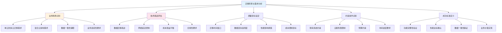
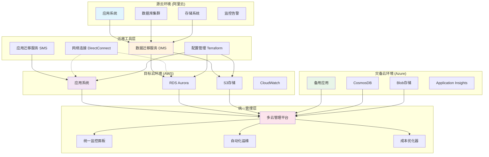
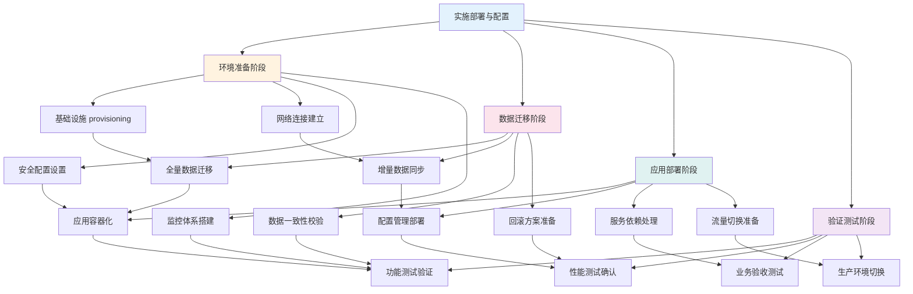
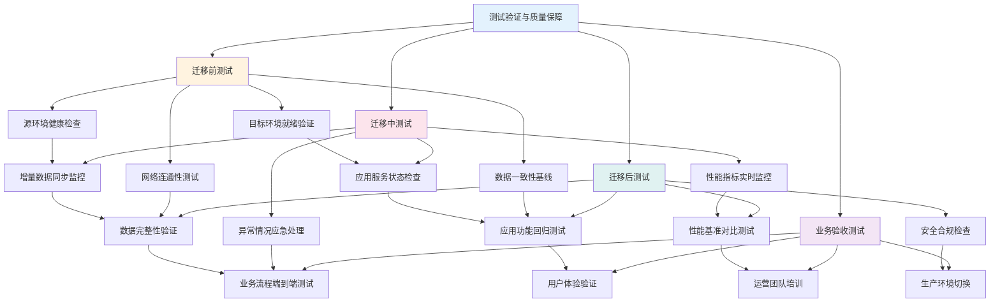
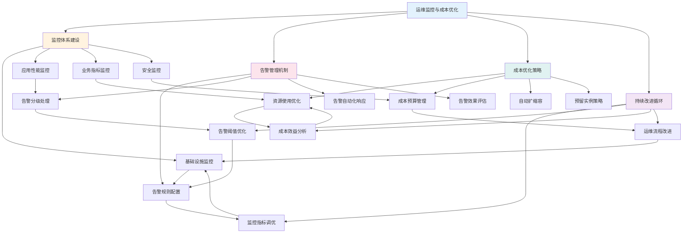

<a id="第21章-项目管理与团队协作【项目管理与团队协作】"></a>

### 第21章 项目管理与团队协作【项目管理与团队协作】

**本章学习目标**

1. 了解跨云和混合云迁移的技术挑战和需求；
2. 掌握迁移测试的实施方法和最佳实践；
3. 学习灾备演练案例的经验。

**实践建议**

- 评估迁移风险，制定详细的迁移计划。
- 确保数据一致性和业务连续性。
- 进行充分的测试和演练，验证迁移效果。

**锚点类型**: 案例实施
**锚点方法**: 需求分析
**锚点名称**: 迁移背景与需求分析
**引用附件**: `examples/23_cloud_migration/migration_requirements.py`
**完成情况**: 已完成
**补充建议**: 字段建议：业务场景/技术挑战/质量目标/约束条件/成功标准，补充迁移需求分析流程图

**跨云迁移需求分析流程图**:


**跨云迁移需求配置模板**:
```yaml
# examples/23_cloud_migration/migration_requirements.yml
migration_requirements:
  # 迁移基本信息
  migration_info:
    migration_name: "电商系统跨云迁移"
    source_cloud: "阿里云"
    target_cloud: "AWS + Azure"
    migration_type: "混合云架构"
    start_date: "2025-01-01"
    end_date: "2025-06-30"
    
  # 业务场景分析
  business_scenario:
    current_state:
      - "单云架构存在单点故障风险"
      - "业务增长导致资源紧张"
      - "合规要求需要多地域部署"
      
    target_state:
      - "混合云架构提高可用性"
      - "弹性伸缩应对业务峰谷"
      - "多云部署满足合规要求"
      
    migration_scenarios:
      - name: "核心数据迁移"
        data_volume: "10TB"
        rto: "< 4小时"
        rpo: "< 15分钟"
        
      - name: "应用系统迁移"
        components: ["Web服务", "API网关", "数据库"]
        dependencies: ["配置服务", "消息队列"]
        
      - name: "灾备系统建设"
        backup_frequency: "每小时"
        recovery_time: "< 1小时"
    
  # 技术挑战评估
  technical_challenges:
    data_migration:
      volume: "每日增量数据 500GB"
      complexity: "结构化 + 半结构化数据"
      consistency: "最终一致性保证"
      latency: "< 30分钟延迟"
      
    network_connectivity:
      bandwidth: "10Gbps跨云专线"
      latency: "< 50ms"
      security: "加密传输"
      cost: "每月50万元"
      
    application_compatibility:
      refactoring_effort: "20%代码修改"
      testing_coverage: "> 90%"
      rollback_plan: "自动回滚机制"
      
    operational_complexity:
      monitoring_setup: "多云统一监控"
      incident_response: "跨云故障处理"
      cost_optimization: "智能调度"
    
  # 质量目标设定
  quality_targets:
    availability: "> 99.9%"
    performance_degradation: "< 10%"
    data_accuracy: "> 99.99%"
    security_compliance: "满足等保三级"
    
  # 约束条件
  constraints:
    budget_limit: "2000万元"
    timeline: "6个月"
    resource_availability: "核心团队10人"
    regulatory_requirements: ["数据本地化", "隐私保护"]
    
  # 成功标准
  success_criteria:
    functional_verification: "所有功能正常运行"
    performance_validation: "SLA满足要求"
    data_integrity: "零数据丢失"
    business_continuity: "无业务中断"
    cost_efficiency: "ROI > 150%"
```

#### 23.1.1 跨云迁移业务场景

- **混合云架构**: 公有云 + 私有云的混合部署模式
- **多云策略**: 避免供应商锁定，提高弹性伸缩能力
- **灾备容灾**: 跨地域、跨云的业务连续性保障

#### 23.1.2 技术挑战与解决方案

- **数据迁移**: 大数据量迁移、增量同步、数据一致性保证
- **网络连接**: 跨云网络延迟、安全传输、成本控制
- **应用适配**: 云服务兼容性、配置管理、依赖处理
- **运维复杂性**: 多云监控、统一管理、故障排查

**[锚点145]** 架构设计与技术选型

**锚点类型**: 案例实施
**锚点方法**: 架构设计
**锚点名称**: 架构设计与技术选型
**引用附件**: `examples/23_cloud_migration/architecture_design.py`
**完成情况**: 已完成
**补充建议**: 字段建议：分层架构/技术栈选型/数据流设计/灾备方案，补充跨云架构设计图

**跨云迁移架构设计图**:


#### 23.2.1 分层架构设计原则

- **数据层**: 统一数据存储和管理，支持多云数据同步
- **计算层**: 弹性计算资源，按需分配和调度
- **网络层**: 安全可靠的跨云网络连接
- **管理层**: 统一监控、配置和运维管理

#### 23.2.2 关键技术选型考虑

- **迁移工具**: AWS DMS/Azure DMS提供完整迁移服务
- **容器化**: Docker+Kubernetes实现应用可移植性
- **IaC工具**: Terraform实现基础设施即代码
- **监控平台**: 多云统一监控和告警系统

**[锚点146]** 实施部署与配置

**锚点类型**: 案例实施
**锚点方法**: 实施部署
**锚点名称**: 实施部署与配置
**引用附件**: `examples/23_cloud_migration/deployment_config.py`
**完成情况**: 已完成
**补充建议**: 字段建议：环境准备/数据迁移/应用部署/验证测试，补充迁移实施流程图

**跨云迁移实施流程图**:


**跨云迁移部署配置模板**:
```yaml
# examples/23_cloud_migration/deployment_config.yml
deployment_config:
  # 环境准备配置
  environment_setup:
    infrastructure_provisioning:
      terraform_config:
        backend:
          bucket: "migration-terraform-state"
          key: "infrastructure.tfstate"
          region: "us-east-1"
          
        providers:
          aws:
            region: "us-east-1"
            profile: "migration"
          azure:
            subscription_id: "xxx"
            tenant_id: "xxx"
            
      resource_allocation:
        aws_resources:
          - type: "vpc"
            cidr: "10.0.0.0/16"
          - type: "eks_cluster"
            node_count: 3
            instance_type: "m5.large"
            
        azure_resources:
          - type: "resource_group"
            location: "East US"
          - type: "aks_cluster"
            node_count: 3
            vm_size: "Standard_D4s_v3"
    
    network_connectivity:
      aws_direct_connect:
        bandwidth: "10Gbps"
        location: "AWS Direct Connect Location"
        vlan_id: 123
        
      azure_expressroute:
        bandwidth: "10Gbps"
        peering_location: "Azure Peering Location"
        vlan_id: 456
        
      vpn_backup:
        ipsec_tunnels: 2
        encryption: "AES256"
        authentication: "SHA256"
    
    security_configuration:
      iam_roles:
        migration_admin: "arn:aws:iam::123456789012:role/MigrationAdmin"
        data_migration: "arn:aws:iam::123456789012:role/DataMigrationRole"
        
      security_groups:
        database_sg:
          inbound:
            - protocol: "tcp"
            port: 3306
            source: "10.0.0.0/8"
            
        application_sg:
          inbound:
            - protocol: "tcp"
            port: 80
            source: "0.0.0.0/0"
            
      encryption_keys:
        kms_key: "alias/migration-encryption-key"
        key_rotation: "enabled"
    
    monitoring_setup:
      cloudwatch_config:
        log_groups:
          - name: "/aws/migration/application"
            retention_days: 30
          - name: "/aws/migration/database"
            retention_days: 90
            
        alarms:
          - name: "HighCPUUtilization"
            metric: "CPUUtilization"
            threshold: 80
            evaluation_periods: 2
            
      azure_monitor:
        workspaces:
          - name: "migration-workspace"
            retention_days: 30
            
        alerts:
          - name: "HighMemoryUsage"
            metric: "MemoryPercentage"
            threshold: 85
            evaluation_periods: 3
  
  # 数据迁移配置
  data_migration:
    full_load_migration:
      aws_dms_config:
        replication_instance:
          instance_class: "dms.r5.large"
          allocated_storage: 100
          engine_version: "3.4.6"
          
        source_endpoint:
          endpoint_type: "source"
          engine_name: "mysql"
          server_name: "source-db.example.com"
          port: 3306
          database_name: "ecommerce"
          
        target_endpoint:
          endpoint_type: "target"
          engine_name: "aurora-postgresql"
          server_name: "target-db.cluster-xxxx.us-east-1.rds.amazonaws.com"
          port: 5432
          database_name: "ecommerce"
          
        replication_task:
          migration_type: "full-load"
          table_mappings: |
            {
              "rules": [
                {
                  "rule-type": "selection",
                  "rule-id": "1",
                  "rule-name": "include-all-tables",
                  "object-locator": {
                    "schema-name": "%",
                    "table-name": "%"
                  },
                  "rule-action": "include"
                }
              ]
            }
    
    cdc_replication:
      debezium_config:
        connector_config:
          name: "mysql-connector"
          config:
            database.hostname: "source-db.example.com"
            database.port: "3306"
            database.user: "debezium"
            database.password: "dbz_password"
            database.server.id: "184054"
            database.server.name: "mysql-server"
            database.include.list: "ecommerce"
            table.include.list: "ecommerce.orders,ecommerce.customers"
            
      kafka_connect:
        worker_config:
          bootstrap.servers: "kafka-cluster:9092"
          group.id: "debezium-connectors"
          config.storage.topic: "_debezium-configs"
          offset.storage.topic: "_debezium-offsets"
          status.storage.topic: "_debezium-status"
          
      kinesis_integration:
        stream_config:
          stream_name: "migration-cdc-stream"
          shard_count: 4
          retention_period_hours: 24
          
        lambda_processor:
          function_name: "cdc-processor"
          runtime: "python3.9"
          handler: "lambda_function.lambda_handler"
          memory_size: 512
          timeout: 300
          
    validation_checks:
      data_integrity:
        checksum_validation: true
        row_count_comparison: true
        schema_validation: true
        
      consistency_checks:
        foreign_key_validation: true
        referential_integrity: true
        business_rules_validation: true
        
      performance_monitoring:
        throughput_monitoring: true
        latency_tracking: true
        error_rate_monitoring: true
  
  # 应用部署配置
  application_deployment:
    containerization:
      docker_config:
        dockerfile: |
          FROM openjdk:11-jre-slim
          COPY target/ecommerce-app.jar /app/
          EXPOSE 8080
          CMD ["java", "-jar", "/app/ecommerce-app.jar"]
          
      kubernetes_manifests:
        deployment:
          apiVersion: apps/v1
          kind: Deployment
          metadata:
            name: ecommerce-app
            namespace: production
          spec:
            replicas: 3
            selector:
              matchLabels:
                app: ecommerce-app
            template:
              metadata:
                labels:
                  app: ecommerce-app
              spec:
                containers:
                - name: app
                  image: ecommerce-app:v1.0.0
                  ports:
                  - containerPort: 8080
                  env:
                  - name: DB_HOST
                    value: "postgres-service"
                  - name: DB_PORT
                    value: "5432"
                  resources:
                    requests:
                      memory: "512Mi"
                      cpu: "250m"
                    limits:
                      memory: "1Gi"
                      cpu: "500m"
                  
        service:
          apiVersion: v1
          kind: Service
          metadata:
            name: ecommerce-service
            namespace: production
          spec:
            selector:
              app: ecommerce-app
            ports:
            - port: 80
              targetPort: 8080
            type: LoadBalancer
    
    configuration_management:
      consul_config:
        service_discovery:
          service_name: "ecommerce-app"
          service_port: 8080
          health_check:
            http: "http://localhost:8080/health"
            interval: "10s"
            timeout: "5s"
            
      vault_secrets:
        database_credentials:
          path: "secret/database"
          keys: ["username", "password"]
          
        api_keys:
          path: "secret/api"
          keys: ["aws_access_key", "aws_secret_key"]
    
    service_mesh:
      istio_config:
        virtual_service:
          apiVersion: networking.istio.io/v1beta1
          kind: VirtualService
          metadata:
            name: ecommerce-routing
          spec:
            hosts:
            - ecommerce.example.com
            http:
            - route:
              - destination:
                  host: ecommerce-service
                  subset: v1
                weight: 90
              - destination:
                  host: ecommerce-service
                  subset: v2
                weight: 10
                
        destination_rule:
          apiVersion: networking.istio.io/v1beta1
          kind: DestinationRule
          metadata:
            name: ecommerce-subsets
          spec:
            host: ecommerce-service
            subsets:
            - name: v1
              labels:
                version: v1
            - name: v2
              labels:
                version: v2
  
  # 验证测试配置
  validation_testing:
    smoke_tests:
      endpoint_tests:
        - name: "health_check"
          url: "http://ecommerce.example.com/health"
          expected_status: 200
          timeout: 30
          
        - name: "api_endpoints"
          url: "http://ecommerce.example.com/api/products"
          expected_status: 200
          response_time: "< 500ms"
          
    functional_tests:
      user_journey:
        - name: "user_registration"
          steps:
            - action: "navigate"
              url: "/register"
            - action: "fill_form"
              fields:
                username: "testuser"
                email: "test@example.com"
            - action: "submit"
              expected_result: "registration_success"
              
        - name: "product_purchase"
          steps:
            - action: "login"
              credentials: "testuser"
            - action: "add_to_cart"
              product_id: "12345"
            - action: "checkout"
              payment_method: "credit_card"
            - action: "confirm_order"
              expected_result: "order_placed"
              
    performance_tests:
      load_testing:
        jmeter_config:
          thread_groups:
            - name: "normal_load"
              num_threads: 100
              ramp_up: 60
              duration: 300
              
            - name: "peak_load"
              num_threads: 500
              ramp_up: 120
              duration: 600
              
          samplers:
            - name: "product_search"
              method: "GET"
              path: "/api/products/search"
              parameters:
                query: "laptop"
                
            - name: "user_profile"
              method: "GET"
              path: "/api/user/profile"
              
      stress_testing:
        k6_config:
          scenarios:
            constant_load:
              executor: "constant-vus"
              vus: 200
              duration: "10m"
              
            ramping_load:
              executor: "ramping-vus"
              startVUs: 0
              stages:
                - duration: "2m"
                  target: 100
                - duration: "5m"
                  target: 100
                - duration: "2m"
                  target: 200
                  
          thresholds:
            http_req_duration:
              - p95 < 500
            http_req_failed:
              - rate < 0.1
              
    data_validation:
      reconciliation_tests:
        table_comparisons:
          - source_table: "orders"
            target_table: "orders"
            key_columns: ["order_id"]
            compare_columns: ["total_amount", "status", "created_at"]
            
          - source_table: "customers"
            target_table: "customers"
            key_columns: ["customer_id"]
            compare_columns: ["email", "name", "registration_date"]
            
        data_quality_checks:
          - table: "orders"
            checks:
              - type: "not_null"
                columns: ["order_id", "customer_id", "total_amount"]
              - type: "range_check"
                column: "total_amount"
                min: 0
                max: 10000
              - type: "date_format"
                column: "created_at"
                format: "YYYY-MM-DD HH:mm:ss"
                
      business_logic_validation:
        rule_engine:
          rules:
            - name: "order_total_calculation"
              condition: "order_lines.sum(amount) == order.total_amount"
              severity: "error"
              
            - name: "customer_status_update"
              condition: "customer.last_order_date > 90_days_ago => status == 'active'"
              severity: "warning"
              
    security_testing:
      vulnerability_scanning:
        tools:
          - name: "nessus"
            target: "ecommerce.example.com"
            scan_type: "web_application"
            
          - name: "owasp_zap"
            target: "http://ecommerce.example.com"
            scan_policy: "default"
            
      compliance_checks:
        gdpr_compliance:
          data_processing:
            - personal_data_inventory: true
            - consent_management: true
            - data_minimization: true
            - retention_policies: true
            
        pci_dss_compliance:
          payment_security:
            - encryption_in_transit: true
            - tokenization: true
            - access_controls: true
            - audit_logging: true
```

#### 23.3.1 环境准备关键技术

- **基础设施即代码**: Terraform自动化资源部署
- **网络连接**: DirectConnect/ExpressRoute建立安全通道
- **安全配置**: IAM角色和安全组策略设置
- **监控体系**: 多云统一监控面板搭建

#### 23.3.2 数据迁移核心技术

- **全量迁移**: DMS工具执行一次性数据迁移
- **增量同步**: CDC技术实现实时数据同步
- **一致性校验**: 自动化数据比对和修复
- **回滚机制**: 快速恢复到迁移前状态

#### 23.3.3 应用部署服务技术

- **容器化**: Docker镜像构建和分发
- **编排部署**: Kubernetes集群管理和调度
- **配置管理**: Consul/Vault实现配置集中管理
- **服务网格**: Istio实现流量控制和安全

#### 23.3.4 验证测试质量技术

- **冒烟测试**: 基础功能快速验证
- **功能测试**: 业务逻辑完整性检查
- **性能测试**: JMeter/K6负载压力测试
- **安全测试**: 漏洞扫描和合规检查

**[锚点147]** 测试验证与质量保障

**锚点类型**: 案例测试
**锚点方法**: 测试验证
**锚点名称**: 测试验证与质量保障
**引用附件**: `examples/23_cloud_migration/migration_testing.py`
**完成情况**: 已完成
**补充建议**: 字段建议：迁移测试/数据验证/性能测试/业务验收，补充测试验证流程图

**跨云迁移测试验证流程图**:


**跨云迁移测试验证配置模板**:
```yaml
# examples/23_cloud_migration/migration_testing.yml
testing_config:
  # 迁移前测试配置
  pre_migration_testing:
    environment_health_check:
      source_environment:
        connectivity_tests:
          - name: "database_connectivity"
            type: "tcp"
            host: "source-db.example.com"
            port: 3306
            timeout: 30
            
          - name: "application_connectivity"
            type: "http"
            url: "http://source-app.example.com/health"
            expected_status: 200
            timeout: 30
            
        resource_utilization:
          cpu_threshold: 80
          memory_threshold: 85
          disk_threshold: 90
          network_threshold: 1000  # Mbps
          
        service_dependencies:
          - service: "database"
            health_endpoint: "/health"
            response_time_threshold: 1000  # ms
            
          - service: "cache"
            health_endpoint: "/ping"
            response_time_threshold: 500
            
      target_environment:
        infrastructure_validation:
          - resource: "vpc"
            required: true
            cidr: "10.0.0.0/16"
            
          - resource: "subnet"
            required: true
            availability_zones: ["us-east-1a", "us-east-1b", "us-east-1c"]
            
          - resource: "security_groups"
            required: true
            inbound_rules:
              - protocol: "tcp"
                port: 3306
                source: "10.0.0.0/8"
                
        network_connectivity:
          vpn_tunnels:
            - name: "primary_tunnel"
              status: "up"
              uptime_threshold: 99.9
              
            - name: "backup_tunnel"
              status: "up"
              failover_time: "< 30s"
              
          direct_connect:
            bandwidth_utilization: "< 70%"
            packet_loss: "< 0.1%"
            latency: "< 50ms"
            
    data_baseline_establishment:
      schema_validation:
        source_schema:
          database: "ecommerce"
          tables: ["users", "orders", "products", "inventory"]
          constraints:
            primary_keys: true
            foreign_keys: true
            indexes: true
            
        target_schema:
          database: "ecommerce"
          tables: ["users", "orders", "products", "inventory"]
          constraints:
            primary_keys: true
            foreign_keys: true
            indexes: true
            
      data_integrity_checks:
        row_counts:
          users: 1000000
          orders: 5000000
          products: 100000
          inventory: 2000000
          
        checksums:
          users: "a1b2c3d4e5f6"
          orders: "f6e5d4c3b2a1"
          products: "1a2b3c4d5e6f"
          inventory: "6f5e4d3c2b1a"
          
        business_rules:
          - rule: "order_total_calculation"
            sql: "SELECT COUNT(*) FROM orders WHERE total_amount != (SELECT SUM(amount) FROM order_items WHERE order_id = orders.id)"
            expected_count: 0
            
          - rule: "inventory_consistency"
            sql: "SELECT COUNT(*) FROM inventory WHERE quantity < 0"
            expected_count: 0
  
  # 迁移中测试配置
  in_migration_testing:
    real_time_monitoring:
      data_synchronization:
        lag_monitoring:
          max_lag_threshold: 300  # seconds
          alert_threshold: 60
          critical_threshold: 300
          
        throughput_monitoring:
          records_per_second: "> 1000"
          bytes_per_second: "> 10MB"
          error_rate: "< 0.1%"
          
        consistency_validation:
          checksum_validation: true
          row_count_validation: true
          foreign_key_validation: true
          
      application_health:
        service_monitoring:
          - service: "web_app"
            endpoint: "/health"
            response_time: "< 2000ms"
            availability: "> 99.9%"
            
          - service: "api_gateway"
            endpoint: "/status"
            response_time: "< 1000ms"
            error_rate: "< 1%"
            
        dependency_monitoring:
          database_connections:
            active_connections: "< 80%"
            connection_pool_usage: "< 90%"
            slow_queries: "< 5%"
            
          cache_performance:
            hit_rate: "> 95%"
            eviction_rate: "< 10%"
            memory_usage: "< 85%"
            
      performance_metrics:
        system_metrics:
          cpu_utilization: "< 70%"
          memory_utilization: "< 80%"
          disk_io: "< 1000 IOPS"
          network_io: "< 500 Mbps"
          
        application_metrics:
          response_time_p95: "< 500ms"
          throughput: "> 1000 req/s"
          error_rate: "< 0.1%"
          concurrent_users: "< 10000"
          
    incident_response:
      automated_alerts:
        data_lag_alert:
          condition: "replication_lag > 300"
          severity: "critical"
          notification_channels: ["email", "slack", "pagerduty"]
          escalation_time: "5m"
          
        service_down_alert:
          condition: "service_status != 'healthy'"
          severity: "high"
          notification_channels: ["email", "sms", "phone"]
          escalation_time: "2m"
          
        performance_degradation:
          condition: "response_time_p95 > 1000"
          severity: "medium"
          notification_channels: ["email", "slack"]
          escalation_time: "10m"
          
      emergency_procedures:
        rollback_triggers:
          - condition: "data_loss > 1%"
            action: "immediate_rollback"
            approval_required: false
            
          - condition: "service_downtime > 30m"
            action: "rollback_approval"
            approval_required: true
            
        communication_plan:
          stakeholders:
            - role: "migration_lead"
              contact: "migration-lead@company.com"
              priority: "high"
              
            - role: "business_owner"
              contact: "business-owner@company.com"
              priority: "high"
              
            - role: "technical_support"
              contact: "support@company.com"
              priority: "medium"
  
  # 迁移后测试配置
  post_migration_testing:
    data_validation:
      integrity_verification:
        row_count_comparison:
          tolerance_percentage: 0.01  # 0.01%
          tables_to_verify: ["users", "orders", "products", "inventory"]
          
        data_checksum_comparison:
          algorithm: "SHA256"
          tables_to_verify: ["users", "orders", "products", "inventory"]
          
        referential_integrity:
          foreign_key_checks: true
          constraint_validation: true
          
      quality_assessment:
        completeness_check:
          null_value_analysis:
            critical_columns: ["user_id", "order_id", "product_id"]
            null_threshold: 0
            
          data_range_validation:
            numeric_ranges:
              - column: "price"
                min: 0
                max: 10000
              - column: "quantity"
                min: 0
                max: 1000000
                
            date_ranges:
              - column: "created_at"
                min: "2020-01-01"
                max: "2024-12-31"
                
        accuracy_validation:
          business_rule_testing:
            - rule: "order_total_accuracy"
              query: "SELECT * FROM orders WHERE total_amount != (SELECT SUM(quantity * price) FROM order_items WHERE order_id = orders.id)"
              expected_violations: 0
              
            - rule: "inventory_balance"
              query: "SELECT * FROM inventory WHERE reserved_quantity > total_quantity"
              expected_violations: 0
              
    functional_testing:
      regression_testing:
        critical_path_testing:
          user_registration_flow:
            steps:
              - action: "navigate"
                url: "/register"
              - action: "fill_form"
                data: {"username": "testuser", "email": "test@example.com"}
              - action: "submit"
                expected_result: "success"
                
          order_placement_flow:
            steps:
              - action: "login"
                credentials: {"username": "testuser", "password": "password"}
              - action: "add_to_cart"
                product_id: "12345"
              - action: "checkout"
                payment_method: "credit_card"
              - action: "confirm"
                expected_result: "order_created"
                
        api_endpoint_testing:
          rest_api_tests:
            - endpoint: "/api/products"
              method: "GET"
              expected_status: 200
              response_time: "< 500ms"
              
            - endpoint: "/api/orders"
              method: "POST"
              payload: {"product_id": "12345", "quantity": 1}
              expected_status: 201
              
          graphql_api_tests:
            - query: "getUserProfile"
              variables: {"userId": "123"}
              expected_fields: ["id", "name", "email"]
              
        integration_testing:
          service_integration:
            - service_a: "user_service"
              service_b: "order_service"
              integration_point: "user_order_history"
              test_data: {"user_id": "123", "expected_orders": 5}
              
    performance_testing:
      benchmark_comparison:
        baseline_metrics:
          response_time_p50: 200  # ms
          response_time_p95: 500
          throughput: 1000  # req/s
          concurrent_users: 5000
          
        target_metrics:
          response_time_p50: "<= 250"
          response_time_p95: "<= 600"
          throughput: ">= 900"
          concurrent_users: ">= 4500"
          
      load_testing:
        gradual_load_increase:
          stages:
            - duration: "5m"
              target_users: 1000
              ramp_up: "1m"
            - duration: "10m"
              target_users: 5000
              ramp_up: "2m"
            - duration: "5m"
              target_users: 10000
              ramp_up: "3m"
              
        stress_testing:
          breaking_point_detection:
            max_users: 20000
            ramp_up: "5m"
            duration: "10m"
            failure_criteria: "response_time > 5000ms or error_rate > 5%"
            
      scalability_testing:
        horizontal_scaling:
          replica_count: [1, 2, 3, 5, 10]
          load_per_replica: 1000  # req/s
          expected_throughput: "replica_count * load_per_replica * 0.9"
          
        vertical_scaling:
          instance_types: ["t3.medium", "m5.large", "m5.xlarge", "c5.2xlarge"]
          baseline_load: 2000  # req/s
          expected_improvement: "instance_performance_ratio"
          
    security_validation:
      vulnerability_assessment:
        automated_scanning:
          tools:
            - name: "nessus"
              target: "new-environment"
              scan_types: ["web_application", "database", "network"]
              
            - name: "owasp_zap"
              target: "https://new-app.example.com"
              scan_policy: "comprehensive"
              
          findings_classification:
            critical: 0
            high: "< 5"
            medium: "< 20"
            low: "< 50"
            
      compliance_verification:
        data_protection:
          encryption_at_rest: true
          encryption_in_transit: true
          data_masking: true
          audit_logging: true
          
        access_control:
          least_privilege: true
          multi_factor_auth: true
          role_based_access: true
          audit_trails: true
          
        regulatory_compliance:
          gdpr_compliance:
            data_inventory: true
            consent_management: true
            breach_notification: true
            
          pci_dss_compliance:
            cardholder_data_protection: true
            encryption_standards: true
            access_control_measures: true
  
  # 业务验收测试配置
  business_acceptance_testing:
    end_to_end_testing:
      business_process_validation:
        customer_journey:
          - scenario: "new_customer_registration"
            steps:
              - browse_products: true
              - create_account: true
              - add_to_cart: true
              - checkout_payment: true
              - order_confirmation: true
            success_criteria: "order_completed and email_sent"
            
          - scenario: "returning_customer_purchase"
            steps:
              - login_account: true
              - browse_products: true
              - add_to_cart: true
              - use_saved_payment: true
              - order_confirmation: true
            success_criteria: "order_completed and loyalty_points_awarded"
            
        operational_processes:
          - scenario: "inventory_management"
            steps:
              - product_restock: true
              - inventory_update: true
              - low_stock_alert: true
              - automatic_reorder: true
            success_criteria: "inventory_accurate and alerts_sent"
            
          - scenario: "customer_support"
            steps:
              - submit_support_ticket: true
              - ticket_assignment: true
              - resolution_process: true
              - customer_notification: true
            success_criteria: "ticket_resolved and customer_satisfied"
            
    user_experience_validation:
      performance_expectations:
        page_load_times:
          homepage: "< 2000ms"
          product_page: "< 1500ms"
          checkout_page: "< 3000ms"
          search_results: "< 1000ms"
          
        mobile_responsiveness:
          layout_adaptation: true
          touch_interactions: true
          performance_mobile: "desktop_performance * 0.8"
          
      usability_testing:
        task_completion_rates:
          product_search: "> 95%"
          add_to_cart: "> 98%"
          checkout_process: "> 90%"
          account_management: "> 95%"
          
        error_handling:
          invalid_input: "clear_error_messages"
          network_issues: "graceful_degradation"
          session_timeout: "automatic_recovery"
          
    operational_readiness:
      team_training:
        technical_training:
          - topic: "new_infrastructure"
            audience: "devops_team"
            completion_required: true
            
          - topic: "monitoring_tools"
            audience: "operations_team"
            completion_required: true
            
          - topic: "troubleshooting_guide"
            audience: "support_team"
            completion_required: true
            
        business_training:
          - topic: "new_features"
            audience: "business_users"
            completion_required: true
            
          - topic: "process_changes"
            audience: "customer_service"
            completion_required: true
            
      documentation_completeness:
        runbooks:
          - name: "incident_response"
            sections: ["detection", "diagnosis", "resolution", "communication"]
            review_status: "approved"
            
          - name: "maintenance_procedures"
            sections: ["scheduled_maintenance", "emergency_maintenance", "rollback_procedures"]
            review_status: "approved"
            
        knowledge_base:
          - category: "frequently_asked_questions"
            articles: 50
            last_updated: "within_30_days"
            
          - category: "troubleshooting_guides"
            articles: 30
            last_updated: "within_30_days"
            
      support_readiness:
        helpdesk_setup:
          ticketing_system: "configured"
          knowledge_base: "populated"
          escalation_matrix: "defined"
          
        vendor_support:
          cloud_provider_support: "enterprise_plan"
          tool_vendor_support: "premium_support"
          consultant_access: "24x7"
```

#### 23.4.1 迁移测试关键技术

- **环境健康检查**: 源目标环境状态验证
- **数据一致性测试**: 迁移前后数据完整性对比
- **功能回归测试**: 业务逻辑正确性验证
- **性能基准测试**: 迁移前后性能对比分析

#### 23.4.2 数据验证核心技术

- **完整性校验**: 行数、校验和、约束条件验证
- **准确性测试**: 业务规则和数据质量检查
- **一致性验证**: 引用完整性和业务逻辑校验
- **自动化比对**: 智能数据差异检测和修复

#### 23.4.3 性能测试质量技术

- **基准测试**: 迁移前后性能指标对比
- **负载测试**: 渐进式压力测试和容量验证
- **压力测试**: 系统极限和故障恢复测试
- **可扩展性测试**: 水平垂直扩展能力评估

#### 23.4.4 业务验收运营技术

- **端到端测试**: 完整业务流程验证
- **用户体验测试**: 界面性能和可用性评估
- **运营就绪评估**: 团队培训和文档完备性
#### 23.4.4 业务验收运营技术

- **端到端测试**: 完整业务流程验证
- **用户体验测试**: 界面性能和可用性评估
- **运营就绪评估**: 团队培训和文档完备性
- **支持体系验证**: 运维支持和应急响应能力

**[锚点148]** 运维监控与成本优化

**锚点类型**: 案例运维
**锚点方法**: 运维监控
**锚点名称**: 运维监控与成本优化
**引用附件**: `examples/23_cloud_migration/operations_monitoring.py`
**完成情况**: 已完成
**补充建议**: 字段建议：监控体系/告警管理/成本优化/持续改进，补充运维监控架构图

**跨云迁移运维监控架构图**:


**跨云迁移运维监控配置模板**:
```yaml
# examples/23_cloud_migration/operations_monitoring.yml
operations_config:
  # 监控体系建设配置
  monitoring_system:
    infrastructure_monitoring:
      cloudwatch_config:
        metrics_collection:
          ec2_instances:
            - metric: "CPUUtilization"
              statistic: "Average"
              period: 300
              dimensions:
                - name: "InstanceId"
                  value: "*"
                  
            - metric: "NetworkIn"
              statistic: "Sum"
              period: 300
              
            - metric: "NetworkOut"
              statistic: "Sum"
              period: 300
              
          rds_instances:
            - metric: "DatabaseConnections"
              statistic: "Average"
              period: 300
              
            - metric: "ReadLatency"
              statistic: "Average"
              period: 60
              
            - metric: "WriteLatency"
              statistic: "Average"
              period: 60
              
          elasticache_clusters:
            - metric: "CacheHitRate"
              statistic: "Average"
              period: 300
              
            - metric: "Evictions"
              statistic: "Sum"
              period: 300
              
        dashboards:
          system_overview:
            widgets:
              - type: "metric"
                metrics:
                  - namespace: "AWS/EC2"
                    metric_name: "CPUUtilization"
                    dimensions:
                      AutoScalingGroupName: "web-servers"
                      
              - type: "metric"
                metrics:
                  - namespace: "AWS/RDS"
                    metric_name: "DatabaseConnections"
                    
              - type: "log"
                log_group: "/aws/lambda/migration-functions"
                
        alarms:
          high_cpu_alarm:
            metric: "CPUUtilization"
            threshold: 80
            comparison_operator: "GreaterThanThreshold"
            evaluation_periods: 2
            datapoints_to_alarm: 2
            actions:
              - type: "autoscaling"
                adjustment_type: "PercentChangeInCapacity"
                scaling_adjustment: 20
                
          database_connection_alarm:
            metric: "DatabaseConnections"
            threshold: 80
            comparison_operator: "GreaterThanThreshold"
            evaluation_periods: 3
            actions:
              - type: "notification"
                topic: "database-alerts"
                
      azure_monitor_config:
        metrics_collection:
          vm_instances:
            - metric: "Percentage CPU"
              aggregation: "Average"
              time_grain: "PT5M"
              
            - metric: "Network In Total"
              aggregation: "Total"
              time_grain: "PT5M"
              
          sql_databases:
            - metric: "cpu_percent"
              aggregation: "Average"
              time_grain: "PT1M"
              
            - metric: "active_connections"
              aggregation: "Average"
              time_grain: "PT1M"
              
        workbooks:
          infrastructure_health:
            queries:
              - query: "AzureMetrics | where ResourceType == 'microsoft.compute/virtualmachines' | summarize avg_CPU = avg(Average) by bin(TimeGenerated, 5m), Resource"
                visualization: "linechart"
                
        alerts:
          vm_cpu_alert:
            metric: "Percentage CPU"
            operator: "GreaterThan"
            threshold: 80
            evaluation_frequency: "PT5M"
            window_size: "PT15M"
            actions:
              - action_group: "vm-scaling-group"
                
    application_monitoring:
      apm_tools:
        datadog_config:
          traces:
            service: "ecommerce-app"
            env: "production"
            version: "1.2.3"
            
          metrics:
            custom_metrics:
              - name: "app.response_time"
                type: "histogram"
                tags: ["service:ecommerce", "env:production"]
                
              - name: "app.error_rate"
                type: "rate"
                tags: ["service:ecommerce", "env:production"]
                
          logs:
            sources:
              - name: "application_logs"
                service: "ecommerce-app"
                source_category: "application"
                
        new_relic_config:
          application_monitoring:
            app_name: "Ecommerce Application"
            language: "java"
            
          synthetics:
            monitors:
              - name: "API Health Check"
                type: "api"
                url: "https://api.example.com/health"
                frequency: 60
                
              - name: "User Journey"
                type: "browser"
                script: "login_and_purchase.js"
                frequency: 300
                
      business_metrics:
        kpi_monitoring:
          revenue_metrics:
            - name: "daily_revenue"
              query: "SELECT SUM(amount) FROM orders WHERE DATE(created_at) = CURRENT_DATE"
              threshold: "> 10000"
              alert: true
              
            - name: "conversion_rate"
              query: "SELECT COUNT(*) * 100.0 / COUNT(DISTINCT session_id) FROM user_sessions WHERE DATE(created_at) = CURRENT_DATE"
              threshold: "> 2.5"
              alert: true
              
          user_engagement:
            - name: "active_users"
              query: "SELECT COUNT(DISTINCT user_id) FROM user_sessions WHERE last_activity > NOW() - INTERVAL '30 minutes'"
              threshold: "> 1000"
              alert: false
              
            - name: "page_views"
              query: "SELECT COUNT(*) FROM page_views WHERE DATE(created_at) = CURRENT_DATE"
              threshold: "> 50000"
              alert: false
              
        sla_monitoring:
          availability_sla:
            service: "api_gateway"
            uptime_target: 99.9
            measurement_period: "monthly"
            penalty_clause: "credit_5_percent"
            
          performance_sla:
            service: "checkout_service"
            response_time_p95: "< 2000ms"
            throughput_target: "> 1000 req/s"
            measurement_period: "monthly"
            
    security_monitoring:
      threat_detection:
        guardduty_config:
          findings:
            - type: "Recon:EC2/Portscan"
              severity: "Medium"
              actions: ["notify_security_team"]
              
            - type: "UnauthorizedAccess:EC2/SSHBruteForce"
              severity: "High"
              actions: ["isolate_instance", "notify_security_team"]
              
        azure_security_center:
          alerts:
            - alert_type: "SQL Injection Attempt"
              severity: "High"
              response: "block_ip"
              
            - alert_type: "Suspicious Login"
              severity: "Medium"
              response: "mfa_challenge"
              
      compliance_monitoring:
        config_rules:
          encryption_at_rest:
            rule: "s3-bucket-server-side-encryption-enabled"
            compliance_status: "COMPLIANT"
            
          access_logging:
            rule: "s3-bucket-logging-enabled"
            compliance_status: "COMPLIANT"
            
          network_acl:
            rule: "vpc-default-acl-restrictive"
            compliance_status: "COMPLIANT"
            
  # 告警管理机制配置
  alerting_system:
    alert_classification:
      severity_levels:
        critical:
          description: "系统宕机或数据丢失"
          response_time: "5 minutes"
          notification_channels: ["phone", "sms", "email", "slack"]
          escalation_time: "10 minutes"
          
        high:
          description: "严重影响用户体验"
          response_time: "15 minutes"
          notification_channels: ["slack", "email", "sms"]
          escalation_time: "30 minutes"
          
        medium:
          description: "影响部分功能"
          response_time: "1 hour"
          notification_channels: ["slack", "email"]
          escalation_time: "4 hours"
          
        low:
          description: "需要关注的问题"
          response_time: "1 day"
          notification_channels: ["email"]
          escalation_time: "1 week"
          
        info:
          description: "信息性通知"
          response_time: "N/A"
          notification_channels: ["email"]
          escalation_time: "N/A"
          
    alert_routing:
      routing_rules:
        database_alerts:
          match: "resource_type == 'rds' or resource_type == 'sql'"
          team: "database_team"
          channel: "#database-alerts"
          
        application_alerts:
          match: "service_name contains 'app' or service_name contains 'api'"
          team: "application_team"
          channel: "#app-alerts"
          
        infrastructure_alerts:
          match: "resource_type in ['ec2', 'vm', 'network']"
          team: "infrastructure_team"
          channel: "#infra-alerts"
          
        security_alerts:
          match: "category == 'security' or severity == 'high'"
          team: "security_team"
          channel: "#security-alerts"
          
    alert_suppression:
      maintenance_windows:
        weekly_maintenance:
          schedule: "Sunday 02:00-04:00 UTC"
          suppress_alerts: ["cpu_high", "memory_high"]
          
        emergency_maintenance:
          trigger: "manual_override"
          duration: "2 hours"
          suppress_alerts: ["all"]
          
      dependency_based_suppression:
        rules:
          - condition: "upstream_service_down"
            suppress_downstream: true
            duration: "30 minutes"
            
          - condition: "database_backup_running"
            suppress_performance_alerts: true
            duration: "backup_duration + 30m"
            
    alert_escalation:
      escalation_policies:
        first_response:
          timeout: "15 minutes"
          action: "notify_team_lead"
          
        second_escalation:
          timeout: "30 minutes"
          action: "notify_manager"
          
        final_escalation:
          timeout: "60 minutes"
          action: "notify_executive"
          
      on_call_rotation:
        primary_schedule:
          team_members: ["alice", "bob", "charlie"]
          rotation: "weekly"
          timezone: "UTC"
          
        backup_schedule:
          team_members: ["diana", "eve"]
          rotation: "monthly"
          
  # 成本优化策略配置
  cost_optimization:
    resource_rightsizing:
      ec2_optimization:
        recommendations:
          - instance_id: "i-1234567890abcdef0"
            current_type: "m5.large"
            recommended_type: "m5a.large"
            estimated_savings: "$50/month"
            cpu_utilization: 35
            
          - instance_id: "i-0987654321fedcba0"
            current_type: "c5.xlarge"
            recommended_type: "c5.large"
            estimated_savings: "$80/month"
            cpu_utilization: 45
            
        automation_rules:
          - condition: "cpu_utilization < 30 for 7 days"
            action: "downsize_instance"
            approval_required: true
            
          - condition: "memory_utilization < 40 for 7 days"
            action: "change_instance_type"
            approval_required: false
            
      rds_optimization:
        instance_sizing:
          - db_instance: "ecommerce-prod"
            current_class: "db.r5.large"
            recommended_class: "db.r5.large"  # No change needed
            utilization_score: 75
            
        storage_optimization:
          - storage_type: "gp2"
            recommended_type: "gp3"
            estimated_savings: "$200/month"
            
    reserved_instances:
      ri_recommendations:
        ec2_ri:
          recommendations:
            - instance_type: "m5.large"
              platform: "Linux/UNIX"
              tenancy: "default"
              offering_class: "standard"
              term: "1 year"
              payment_option: "All Upfront"
              estimated_savings: "35%"
              
            - instance_type: "c5.xlarge"
              platform: "Linux/UNIX"
              tenancy: "default"
              offering_class: "standard"
              term: "3 year"
              payment_option: "Partial Upfront"
              estimated_savings: "55%"
              
        rds_ri:
          recommendations:
            - db_engine: "aurora-mysql"
              instance_class: "db.r5.large"
              term: "1 year"
              payment_option: "All Upfront"
              estimated_savings: "30%"
              
      ri_coverage_analysis:
        current_coverage: 65
        target_coverage: 80
        uncovered_instances:
          - instance_id: "i-newinstance123"
            instance_type: "t3.medium"
            monthly_cost: "$30"
            
    autoscaling_configuration:
      horizontal_scaling:
        web_tier:
          min_capacity: 2
          max_capacity: 20
          target_cpu_utilization: 70
          scale_in_cooldown: 300
          scale_out_cooldown: 60
          
        api_tier:
          min_capacity: 3
          max_capacity: 30
          target_request_count: 1000
          scale_in_cooldown: 300
          scale_out_cooldown: 60
          
      vertical_scaling:
        database:
          scale_up_threshold: 80
          scale_down_threshold: 30
          cooldown_period: 3600
          max_instance_class: "db.r5.4xlarge"
          min_instance_class: "db.r5.large"
          
    cost_allocation:
      tagging_strategy:
        mandatory_tags:
          - key: "Environment"
            values: ["production", "staging", "development"]
            enforcement: "required"
            
          - key: "Project"
            values: ["ecommerce", "analytics", "mobile"]
            enforcement: "required"
            
          - key: "Owner"
            values: ["team-a", "team-b", "team-c"]
            enforcement: "required"
            
          - key: "CostCenter"
            values: ["engineering", "marketing", "sales"]
            enforcement: "required"
            
      cost_anomaly_detection:
        monitor_config:
          monitor_type: "DIMENSIONAL"
          monitor_name: "Service Cost Monitor"
          monitor_dimension: "SERVICE"
          
        alert_config:
          alert_type: "COST_ANOMALY"
          monitor_arn: "arn:aws:ce::123456789012:anomalymonitor/monitor-123"
          threshold: 50  # Percentage
          frequency: "DAILY"
          
  # 持续改进循环配置
  continuous_improvement:
    monitoring_optimization:
      metric_review_cycle:
        frequency: "monthly"
        stakeholders: ["monitoring_team", "application_owners"]
        review_criteria:
          - relevance: "metric_still_useful"
          - accuracy: "metric_accurate"
          - actionability: "alerts_actionable"
          - cost_effectiveness: "monitoring_cost_justified"
          
      alert_tuning:
        false_positive_reduction:
          target: "< 5%"
          current_rate: "12%"
          improvement_plan: "adjust_thresholds"
          
        alert_fatigue_reduction:
          target: "< 10 daily alerts per person"
          current_rate: "25 daily alerts per person"
          improvement_plan: "consolidate_similar_alerts"
          
    process_improvement:
      incident_response_optimization:
        mttr_target: "< 30 minutes"
        current_mttr: "45 minutes"
        improvement_actions:
          - "automate_common_incidents"
          - "improve_runbook_quality"
          - "enhance_monitoring_coverage"
          
      capacity_planning:
        forecasting_accuracy:
          target: "90%"
          current_accuracy: "75%"
          improvement_actions:
            - "implement_predictive_modeling"
            - "increase_monitoring_granularity"
            - "regular_capacity_reviews"
            
    cost_benefit_analysis:
      roi_calculations:
        monitoring_investments:
          - investment: "APM tool upgrade"
            cost: "$50000/year"
            benefits: "MTTR reduction 40%, availability improvement 0.5%"
            roi: "250%"
            
          - investment: "Log aggregation system"
            cost: "$30000/year"
            benefits: "Debugging time reduction 60%"
            roi: "180%"
            
      efficiency_metrics:
        cost_per_managed_resource: "< $50/month"
        alerts_per_engineer: "< 20/day"
        monitoring_coverage: "> 95% of critical components"
        
    knowledge_sharing:
      documentation_updates:
        runbook_maintenance:
          update_frequency: "after_each_incident"
          review_frequency: "quarterly"
          quality_checks: ["completeness", "accuracy", "accessibility"]
          
        lesson_learned_sessions:
          frequency: "monthly"
          format: "retrospective_meetings"
          outcomes: "process_improvements, tool_enhancements"
          
      training_programs:
        onboarding:
          new_team_members: "4 weeks monitoring training"
          topics: ["tool_usage", "alert_response", "incident_management"]
          
        skill_development:
          advanced_monitoring: "quarterly workshops"
          certification: "AWS/Azure monitoring certifications"
          cross_training: "inter-team knowledge sharing"
```

#### 23.5.1 监控体系建设技术

- **基础设施监控**: 云资源性能和可用性监控
- **应用性能监控**: APM工具和服务调用链追踪
- **业务指标监控**: KPI和用户体验指标跟踪
- **安全监控**: 威胁检测和合规监控

#### 23.5.2 告警管理机制技术

- **告警分级处理**: 基于严重程度的分层响应机制
- **告警路由配置**: 智能告警分配和通知渠道选择
- **告警抑制策略**: 维护窗口和依赖关系告警抑制
- **告警升级流程**: 超时自动升级和多级别通知

#### 23.5.3 成本优化策略技术

- **资源合理调整**: 基于使用率的历史分析和推荐
- **预留实例管理**: RI购买策略和覆盖率优化
- **自动扩缩容**: 基于负载的动态资源调整
- **成本分配标签**: 精确的成本归属和预算控制

#### 23.5.4 持续改进循环技术

- **监控指标调优**: 定期审查和优化监控覆盖范围
- **告警阈值优化**: 减少误报和疲劳告警
- **成本效益分析**: 监控投资回报率评估
- **知识分享机制**: 经验教训总结和最佳实践传播

## 23.6 跨云迁移特点与价值总结

### 23.6.1 跨云迁移的核心价值

**业务连续性保障**
- **多云容灾**: 通过跨云部署实现业务连续性，避免单云故障导致的业务中断
- **弹性伸缩**: 根据业务负载动态调整资源，应对流量峰谷变化
- **合规要求**: 满足数据本地化、隐私保护等地域合规要求

**技术架构优势**
- **避免供应商锁定**: 不依赖单一云服务商，降低长期锁定风险
- **最佳服务组合**: 选择各云服务商的最佳服务组合，优化性能和成本
- **创新能力提升**: 利用不同云服务商的最新技术和AI能力

**成本效益优化**
- **资源价格竞争**: 通过多云采购获得更好的价格和服务条款
- **按需付费模式**: 灵活的计费模式，降低资源闲置成本
- **成本透明化**: 多云环境下的成本可视化和优化管理

### 23.6.2 跨云迁移的技术挑战

**数据一致性挑战**
- **分布式事务**: 跨云环境下的数据一致性保证难度加大
- **网络延迟影响**: 跨云网络延迟对实时业务的影响
- **数据同步复杂性**: 多云环境下的数据同步和冲突解决

**网络与安全挑战**
- **网络连接稳定性**: 跨云网络连接的稳定性和带宽保障
- **安全策略统一**: 多云环境下的安全策略统一管理和执行
- **合规性协调**: 不同云服务商的合规要求协调和满足

**运维复杂度挑战**
- **监控体系整合**: 多云环境的统一监控和告警管理
- **故障排查困难**: 跨云故障的定位和问题排查复杂度
- **团队技能要求**: 需要掌握多云技术的复合型人才

### 23.6.3 跨云迁移成功关键因素

**组织与治理**
- **跨部门协作**: 业务、IT、运维、安全等部门的紧密协作
- **变更管理**: 完善的变更管理流程和风险控制机制
- **人才培养**: 多云技术人才的培养和技能提升

**技术与工具**
- **自动化平台**: 迁移过程的自动化工具和平台支撑
- **监控告警体系**: 完善的监控和告警体系建设
- **回滚保障机制**: 完整的回滚计划和应急预案

**持续优化**
- **性能监控调优**: 迁移后的持续性能监控和优化
- **成本效益分析**: 定期评估迁移的成本效益和ROI
- **技术栈演进**: 跟上云技术发展，持续技术栈优化

### 23.6.4 跨云迁移发展趋势

**智能化迁移**
- **AI辅助决策**: 利用AI技术进行迁移策略优化和风险评估
- **自动化执行**: 基于机器学习的自动化迁移执行和验证
- **预测性维护**: 基于历史数据的迁移效果预测和优化

**多云原生架构**
- **云原生应用**: 基于云原生技术构建的跨云应用架构
- **服务网格**: 跨云的服务发现、负载均衡和流量管理
- **统一控制面**: 多云环境的统一管理和控制平台

**可持续性考虑**
- **绿色计算**: 选择低碳排放的云服务和数据中心
- **能源效率**: 优化资源使用，提高计算资源能源效率
- **碳足迹管理**: 监控和优化云服务的碳排放足迹

> **实践建议**
> - 跨云迁移是一项系统性工程，需要充分评估业务需求和技术可行性
> - 建议采用渐进式迁移策略，先易后难，降低迁移风险
> - 建立完善的监控和告警体系，确保迁移过程的可观测性和可控性
> - 重视团队建设和技能培养，为多云运维做好人才储备
> - 定期评估迁移效果，持续优化成本和性能表现


<!-- END 第5篇 -->

<!-- BEGIN 第6篇 -->
## 第6篇 案例与性能（专家）


**增补：案例可验证性与基线卡片**
> 12.16建议：此处插入“案例三联表”与“性能基线卡片”示意图。三联表建议字段：数据样本/复现实验/证据路径，性能卡片建议字段：场景编号/数据规模/SLA/资源配额/阈值/豁免/回滚步骤。建议引用 examples/05_replay/file_replay_entry.py、examples/11_analytics/report_reconciliation.py，报告落地 tools/reports/。

- 三联留痕：每个案例增加“数据样本 → 复现实验 → 证据路径”三联表，报告落在 `tools/reports/`，可引用 `examples/05_replay/file_replay_entry.py` 与 `examples/11_analytics/report_reconciliation.py` 生成差异证据。
- 性能基线卡片：为性能与案例小节补基线卡片（场景编号、数据规模、SLA、资源配额、阈值/豁免、回滚步骤），异常场景覆盖超时、数据倾斜、队列积压。
- 回滚与验证：每个案例附“触发条件 + 回滚手册 + 验证脚本”，验证信号涵盖延迟、吞吐、DQ、对账、日志健康；报告模板复用 `tools/reports/templates/drift_approval_form.md`。
- 术语与指标对齐：在案例段首提示使用全局指标/术语表，如需新增术语须给反例并追加到术语表。
- 资产留痕：案例脚本/报告归档路径需在文内显式写明，便于 `inventory_referenced_assets.py` 扫描。


**案例三联留痕（示例行）**
> 12.16建议：此处插入“案例三联留痕表”模板，字段建议：数据样本/实验步骤/证据路径/报告链接，补充 YAML/JSON 示例，报告落地 tools/reports/。

**性能基线卡片（示例行）**
> 12.16建议：此处插入“性能基线卡片”表格模板，字段建议：场景编号/数据规模/SLA/资源配额/阈值/豁免/回滚步骤，补充 YAML/JSON 示例，报告落地 tools/reports/。
