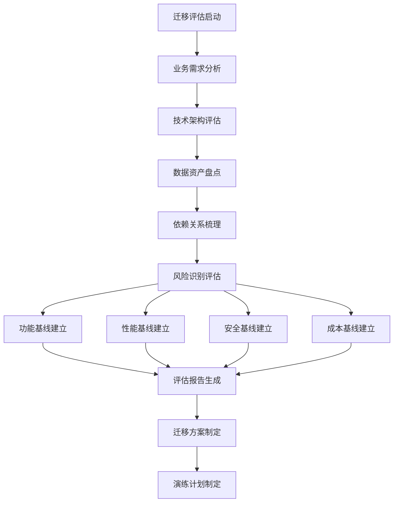
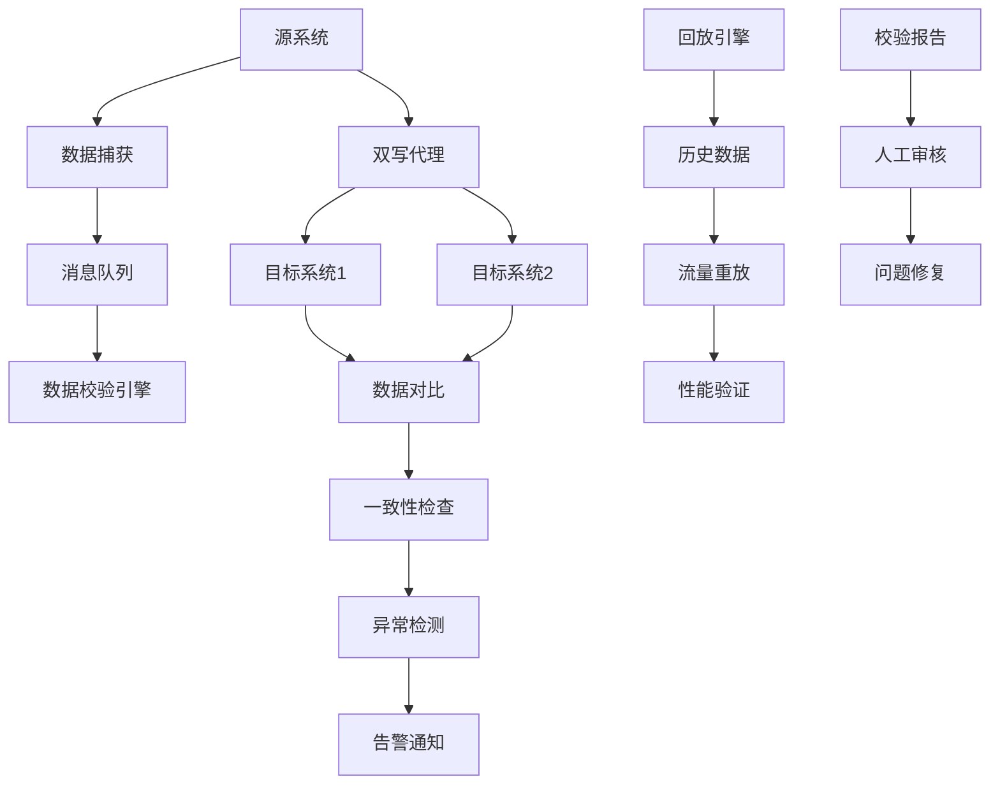
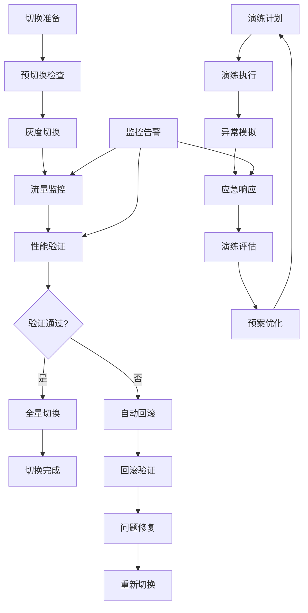
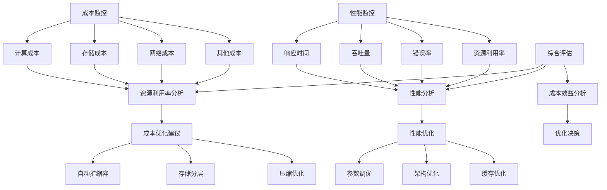
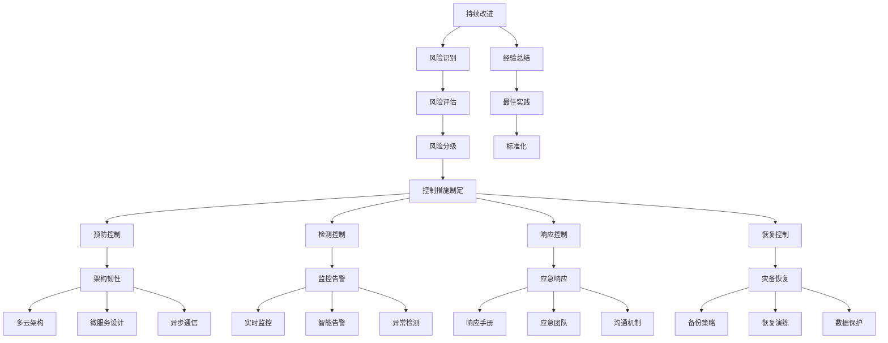

<a id="第22章-流程优化与改进【流程优化与改进】"></a>

### 第22章 流程优化与改进【流程优化与改进】

**本章学习目标**

1. 了解跨云/混合云迁移的价值和挑战；
2. 掌握迁移演练的方法论；
3. 学习迁移实施的最佳实践。

**实践建议**

- 制定系统化的迁移计划，确保业务连续性。
- 通过演练识别和控制风险。
- 持续优化迁移策略，提高效率。

**跨云/混合云迁移**是指将数据和应用系统从单一云环境迁移到跨云或混合云架构的过程，涉及数据迁移、应用重构、流量切换等复杂环节。

### 迁移演练价值

**业务价值**：
- **业务连续性保障**：降低迁移过程中的业务中断风险
- **成本优化**：通过多云策略降低云厂商锁定成本
- **弹性扩展**：利用不同云的资源优势实现弹性扩展
- **合规性提升**：满足数据主权和合规性要求

**技术价值**：
- **架构现代化**：推动应用架构的云原生化改造
- **运维能力提升**：建立完整的多云运维和监控体系
- **风险控制**：通过演练发现和控制迁移风险
- **技术创新**：探索多云架构的最佳实践

### 迁移演练挑战

**技术架构挑战**：
- **数据一致性保障**：跨云环境下的数据同步和一致性
- **网络延迟优化**：跨云网络延迟对实时应用的影响
- **安全合规控制**：多云环境下的安全策略统一
- **成本效益平衡**：迁移成本与业务价值的最佳平衡

**组织实施挑战**：
- **团队协同**：跨部门、跨云厂商的协作协调
- **技能知识储备**：多云架构的技术能力建设
- **变更管理**：业务流程和运维模式的适应性调整
- **风险应急处置**：迁移失败时的快速恢复能力

### 迁移演练方法论

**系统化方法**：
- **评估规划**：全面评估当前架构和迁移可行性
- **分阶段实施**：按优先级和风险等级分阶段迁移
- **验证测试**：通过演练验证迁移方案的可靠性和性能
- **持续优化**：基于监控数据持续优化迁移策略

**演练驱动实践**：
- **风险识别**：通过演练识别潜在的迁移风险点
- **能力验证**：验证团队的迁移执行能力和应急响应
- **方案优化**：基于演练结果优化迁移方案和预案
- **经验积累**：建立可复用的迁移经验和最佳实践

**[锚点266]** 迁移评估与基线建立

**锚点类型**: 迁移评估
**锚点方法**: 基线建立
**锚点名称**: 迁移评估与基线建立
**引用附件**: `examples/04_env/env_health_check.py`
**完成情况**: 已完成
**补充建议**: 字段建议：评估维度/基线指标/风险识别/清单模板，补充迁移评估架构图

**迁移评估架构全景图**:


**迁移评估维度对比表**

| 评估维度 | 评估内容 | 关键指标 | 评估工具 | 风险等级 |
|---------|---------|---------|---------|---------|
| 业务影响评估 | 业务连续性、SLA影响 | 停机时间<4h | 业务影响分析 | 高 |
| 技术复杂度评估 | 架构复杂度、依赖关系 | 迁移周期<30天 | 技术复杂度分析 | 中 |
| 数据迁移评估 | 数据量级、一致性要求 | 数据丢失<0.01% | 数据量级统计 | 高 |
| 成本效益评估 | 迁移成本、ROI周期 | ROI<12个月 | 成本效益计算 | 中 |
| 安全合规评估 | 数据安全、合规要求 | 合规性100% | 安全评估清单 | 高 |

**迁移评估配置模板**:
```yaml
migration_assessment:
  business_assessment:
    impact_analysis:
      downtime_tolerance: "4h"
      sla_requirements: "99.9%"
      business_criticality: "high"
      
    stakeholder_mapping:
      - role: "business_owner"
        responsibilities: ["requirement_validation", "impact_approval"]
      - role: "technical_lead"
        responsibilities: ["feasibility_analysis", "solution_design"]
        
  technical_assessment:
    architecture_analysis:
      current_platform: "on_premise"
      target_platforms: ["aws", "azure"]
      complexity_score: "medium"
      
    data_assessment:
      data_volume_tb: 100
      data_types: ["structured", "semi_structured", "unstructured"]
      migration_strategy: "hybrid"
      
  risk_assessment:
    risk_categories:
      - category: "data_loss"
        probability: "low"
        impact: "high"
        mitigation_strategy: "dual_writes"
      - category: "performance_degradation"
        probability: "medium"
        impact: "medium"
        mitigation_strategy: "capacity_planning"
        
  baseline_establishment:
    functional_baseline:
      test_scenarios: 100
      success_criteria: "100%"
      validation_method: "automated_testing"
      
    performance_baseline:
      throughput_target: "1000tps"
      latency_target: "200ms"
      concurrency_target: "1000users"
```

**[锚点267]** 双写回放与数据校验

**锚点类型**: 数据校验
**锚点方法**: 双写回放
**锚点名称**: 双写回放与数据校验
**引用附件**: `examples/05_replay/file_replay_entry.py`
**完成情况**: 已完成
**补充建议**: 字段建议：双写策略/校验方法/冲突处理/自动化程度，补充双写回放架构图

**双写回放校验架构图**:


**双写策略对比表**

| 双写策略 | 实现方式 | 适用场景 | 一致性保证 | 性能影响 | 复杂度 |
|---------|---------|---------|-----------|---------|--------|
| 同步双写 | 事务内双写 | 强一致性要求 | 强一致性 | 高延迟 | 高 |
| 异步双写 | 消息队列缓冲 | 最终一致性 | 最终一致性 | 低延迟 | 中 |
| 基于事件的双写 | CDC捕获 | 数据变更同步 | 因果一致性 | 中等延迟 | 中 |
| 应用层双写 | 业务代码实现 | 定制化需求 | 业务一致性 | 视实现而定 | 高 |

**双写回放校验配置模板**:
```yaml
dual_write_replay_validation:
  dual_write_configuration:
    strategy: "async_dual_write"
    source_system: "legacy_database"
    target_systems: ["aws_rds", "azure_database"]
    
    conflict_resolution:
      strategy: "last_write_wins"
      conflict_detection: "version_based"
      resolution_rules:
        - condition: "timestamp_diff > 5min"
          action: "manual_review"
        - condition: "data_conflict"
          action: "source_priority"
          
  data_validation:
    reconciliation_scopes:
      - scope: "user_transactions"
        frequency: "hourly"
        tolerance: "0.01%"
        sample_size: "10000"
      - scope: "product_inventory"
        frequency: "daily"
        tolerance: "0.001%"
        sample_size: "50000"
        
    validation_rules:
      - rule: "row_count_comparison"
        threshold: "0.1%"
        action: "alert"
      - rule: "data_distribution_check"
        method: "statistical_comparison"
        threshold: "0.05%"
        action: "flag"
        
  replay_testing:
    data_sources:
      - type: "historical_logs"
        time_range: "30d"
        volume_multiplier: 2.0
      - type: "synthetic_data"
        generation_rules: "realistic_patterns"
        
    replay_scenarios:
      - scenario: "peak_traffic"
        multiplier: 3.0
        duration: "2h"
      - scenario: "data_skew"
        skew_factor: 10.0
        duration: "1h"
```

**[锚点268]** 切换回滚与演练策略

**锚点类型**: 切换演练
**锚点方法**: 回滚策略
**锚点名称**: 切换回滚与演练策略
**引用附件**: `tools/pipeline/build_all.ps1`
**完成情况**: 已完成
**补充建议**: 字段建议：切换方案/回滚预案/演练流程/应急响应，补充切换演练架构图

**切换回滚演练架构图**:


**切换策略对比表**

| 切换策略 | 执行方式 | 风险等级 | 回滚速度 | 适用场景 | 自动化程度 |
|---------|---------|---------|---------|---------|-----------|
| 蓝绿部署 | 全量切换 | 中等 | 快（配置切换） | 无状态应用 | 高 |
| 金丝雀发布 | 渐进式切换 | 低 | 中等 | 有状态应用 | 高 |
| A/B测试切换 | 条件路由 | 低 | 快 | 功能验证 | 中 |
| 影子切换 | 暗流验证 | 极低 | 极快 | 高风险系统 | 中 |

**切换回滚演练配置模板**:
```yaml
cutover_rollback_drill:
  cutover_strategy:
    type: "canary_deployment"
    stages:
      - stage: "pilot"
        traffic_percentage: 5
        duration_minutes: 30
        success_criteria: "error_rate < 0.1%"
      - stage: "gradual"
        traffic_percentage: 25
        duration_minutes: 60
        success_criteria: "p95_latency < 500ms"
      - stage: "full"
        traffic_percentage: 100
        duration_minutes: 120
        success_criteria: "all_metrics_normal"
        
  rollback_plan:
    triggers:
      - condition: "error_rate > 1%"
        action: "immediate_rollback"
        timeout_seconds: 300
      - condition: "p95_latency > 2000ms"
        action: "graceful_rollback"
        timeout_seconds: 600
        
    rollback_procedures:
      - step: "traffic_redirect"
        method: "dns_switch"
        timeout_seconds: 60
      - step: "data_compensation"
        method: "replay_from_checkpoint"
        timeout_seconds: 300
      - step: "configuration_restore"
        method: "git_rollback"
        timeout_seconds: 120
        
  drill_configuration:
    drill_scenarios:
      - scenario: "network_failure"
        trigger: "network_partition"
        duration_minutes: 15
        expected_response: "auto_failover"
      - scenario: "data_corruption"
        trigger: "data_injection"
        duration_minutes: 30
        expected_response: "data_recovery"
        
    evaluation_metrics:
      - metric: "mttr"
        target_seconds: 300
        weight: 0.4
      - metric: "mttr"
        target_seconds: 1800
        weight: 0.3
      - metric: "data_loss"
        target_mb: 0
        weight: 0.3
```

**[锚点269]** 成本性能监控优化

**锚点类型**: 成本监控
**锚点方法**: 性能优化
**锚点名称**: 成本性能监控优化
**引用附件**: `examples/17_observability/log_health_check.py`
**完成情况**: 已完成
**补充建议**: 字段建议：监控维度/优化策略/成本控制/性能基准，补充成本性能监控架构图

**成本性能监控优化架构图**:


**成本性能监控指标表**

| 监控维度 | 关键指标 | 基准值 | 告警阈值 | 优化策略 | 自动化程度 |
|---------|---------|-------|---------|---------|-----------|
| 计算成本 | 成本/小时 | ¥50/h | >¥80/h | 自动扩缩容 | 高 |
| 存储成本 | 成本/GB | ¥0.2/GB | >¥0.3/GB | 冷热分层 | 高 |
| 网络成本 | 成本/GB | ¥0.5/GB | >¥0.8/GB | 流量优化 | 中 |
| 响应时间 | P95延迟 | <200ms | >500ms | 参数调优 | 高 |
| 吞吐量 | TPS | >1000 | <500 | 资源扩展 | 高 |
| 错误率 | 百分比 | <0.1% | >1% | 熔断降级 | 高 |

**成本性能监控配置模板**:
```yaml
cost_performance_monitoring:
  cost_monitoring:
    cost_dimensions:
      compute_cost:
        metric: "hourly_cost"
        baseline: 50.0
        alert_threshold: 80.0
        currency: "CNY"
      storage_cost:
        metric: "cost_per_gb"
        baseline: 0.2
        alert_threshold: 0.3
        currency: "CNY"
      network_cost:
        metric: "cost_per_gb"
        baseline: 0.5
        alert_threshold: 0.8
        currency: "CNY"
        
    cost_optimization:
      auto_scaling:
        enabled: true
        min_instances: 2
        max_instances: 20
        scale_up_threshold: 70
        scale_down_threshold: 30
        
      storage_tiering:
        hot_storage_days: 30
        warm_storage_days: 90
        cold_storage_days: 365
        compression_enabled: true
        
  performance_monitoring:
    performance_metrics:
      response_time:
        metric: "p95_latency_ms"
        baseline: 200
        alert_threshold: 500
      throughput:
        metric: "requests_per_second"
        baseline: 1000
        alert_threshold: 500
      error_rate:
        metric: "error_percentage"
        baseline: 0.1
        alert_threshold: 1.0
        
    performance_optimization:
      parameter_tuning:
        enabled: true
        tuning_interval: "1h"
        parameters:
          - "jvm_heap_size"
          - "connection_pool_size"
          - "thread_pool_size"
          
      caching_strategy:
        cache_hit_ratio_target: 0.85
        cache_ttl_seconds: 3600
        cache_size_mb: 1024
```

**[锚点270]** 迁移韧性与风险控制

**锚点类型**: 迁移韧性
**锚点方法**: 风险控制
**锚点名称**: 迁移韧性与风险控制
**引用附件**: `tools/validate_contracts.py`
**完成情况**: 已完成
**补充建议**: 字段建议：韧性策略/风险控制/容灾设计/持续改进，补充迁移韧性架构图

**迁移韧性风险控制架构图**:


**迁移韧性策略对比表**

| 韧性策略 | 实现方式 | 容灾能力 | 成本影响 | 复杂度 | 适用场景 |
|---------|---------|---------|---------|--------|---------|
| 多云部署 | 跨云复制 | 高可用 | 高 | 高 | 关键业务 |
| 混合云部署 | 云+本地 | 灾难恢复 | 中 | 中 | 合规要求 |
| 区域冗余 | 同云多区 | 区域故障 | 中 | 低 | 一般业务 |
| 本地容灾 | 异地备份 | 数据保护 | 低 | 低 | 数据安全 |

**迁移韧性配置模板**:
```yaml
migration_resilience_risk_control:
  resilience_architecture:
    multi_cloud_setup:
      primary_cloud: "aws"
      secondary_cloud: "azure"
      failover_strategy: "active_passive"
      rto_target: "4h"
      rpo_target: "15min"
      
    microservices_design:
      service_mesh: "istio"
      circuit_breaker_enabled: true
      retry_policy:
        max_attempts: 3
        backoff_multiplier: 2.0
        
  risk_control:
    risk_assessment_matrix:
      - risk: "data_loss"
        probability: "low"
        impact: "critical"
        controls: ["dual_writes", "point_in_time_recovery"]
      - risk: "service_outage"
        probability: "medium"
        impact: "high"
        controls: ["auto_failover", "load_balancing"]
        
    control_effectiveness:
      preventive_controls:
        - control: "architecture_review"
          frequency: "pre_migration"
          owner: "architecture_team"
        - control: "security_assessment"
          frequency: "weekly"
          owner: "security_team"
          
      detective_controls:
        - control: "real_time_monitoring"
          frequency: "continuous"
          owner: "operations_team"
        - control: "log_analysis"
          frequency: "hourly"
          owner: "devops_team"
          
  emergency_response:
    incident_response_plan:
      severity_levels:
        - level: "P0"
          response_time: "15min"
          stakeholders: ["oncall_engineer", "tech_lead", "business_owner"]
        - level: "P1"
          response_time: "1h"
          stakeholders: ["oncall_engineer", "tech_lead"]
          
    communication_plan:
      escalation_matrix:
        - trigger: "system_down"
          immediate_notify: ["oncall_engineer", "management"]
        - trigger: "data_loss"
          immediate_notify: ["oncall_engineer", "legal", "management"]
          
    recovery_procedures:
      - procedure: "data_recovery"
        steps: ["assess_damage", "activate_backup", "validate_recovery", "resume_service"]
        responsible_team: "data_team"
        target_completion: "4h"
```

## 跨云迁移演练最佳实践总结

### 迁移评估方法

**全面评估原则**：
1. **业务优先**：从业务影响角度评估迁移可行性
2. **技术可行**：评估技术架构的迁移复杂度和风险
3. **成本合理**：确保迁移成本与业务价值相匹配
4. **合规必备**：满足数据安全和合规性要求

**评估流程标准化**：
- **需求收集**：明确业务目标和约束条件
- **现状分析**：全面盘点现有系统架构和数据资产
- **方案设计**：制定多套迁移方案进行对比评估
- **风险识别**：识别潜在风险并制定应对策略

**迁移策略选择理论框架**：

**基于成本效益的迁移策略选择模型**：
```
迁移策略选择 = f(业务影响, 技术复杂度, 成本约束, 时间窗口)

其中：
- 业务影响权重：40% (SLA要求、用户体验、业务连续性)
- 技术复杂度权重：30% (架构复杂性、依赖关系、数据一致性)
- 成本约束权重：20% (预算限制、ROI要求)
- 时间窗口权重：10% (业务截止日期、资源可用性)
```

**策略选择决策树**：
- **高业务影响 + 低技术复杂度** → 激进策略（并行迁移）
- **高业务影响 + 高技术复杂度** → 保守策略（渐进迁移）
- **低业务影响 + 高技术复杂度** → 谨慎策略（试点先行）
- **低业务影响 + 低技术复杂度** → 标准策略（模板化迁移）

### 双写校验策略

**双写实施要点**：
- **策略选择**：根据业务特点选择合适的双写策略
- **冲突处理**：建立完善的冲突检测和解决机制
- **性能监控**：监控双写对系统性能的影响
- **逐步放开**：从小规模开始逐步扩大双写范围

**校验质量保障**：
- **自动化对账**：建立自动化的数据一致性校验机制
- **异常检测**：实时检测数据不一致和异常情况
- **人工审核**：对关键数据进行人工抽样审核
- **问题修复**：建立快速的问题定位和修复流程

**跨云数据一致性理论基础**：

**CAP理论在跨云迁移中的应用**：
- **一致性(Consistency)**：跨云环境下的数据强一致性要求
- **可用性(Availability)**：系统在分区情况下的可用性保证
- **分区容忍性(Partition tolerance)**：网络分区下的容错能力

**跨云数据一致性模型**：
- **强一致性**：基于Paxos/Raft的分布式共识算法
- **最终一致性**：基于向量时钟和版本控制的异步同步
- **因果一致性**：保证因果关系的数据一致性
- **弱一致性**：允许一定时间窗口内的不一致

### 切换演练保障

**演练计划制定**：
- **场景覆盖**：覆盖各种可能的故障和异常场景
- **渐进式演练**：从小规模演练逐步到全量演练
- **时间安排**：选择业务低峰期进行重要演练
- **团队准备**：确保所有相关人员熟悉演练流程

**应急响应机制**：
- **快速检测**：建立实时监控和异常检测机制
- **自动响应**：实现自动化的故障响应和恢复
- **人工干预**：在必要时进行人工干预和决策
- **经验积累**：每次演练后进行复盘和经验总结

**迁移切换理论模型**：

**切换风险评估矩阵**：
```
切换风险 = 业务影响 × 技术复杂度 × 恢复难度 × 时间压力

风险等级：
- 极高风险：> 1000 (核心业务，高复杂度，长恢复时间，紧迫时间)
- 高风险：500-1000 (重要业务，中高复杂度，中等恢复时间)
- 中风险：100-500 (一般业务，中等复杂度，较快恢复)
- 低风险：< 100 (非核心业务，低复杂度，快速恢复)
```

**切换策略优化理论**：
- **最小化切换窗口**：通过预热、缓存预加载等技术缩短切换时间
- **渐进式流量切换**：基于A/B测试和金丝雀发布的平滑切换
- **自动化回滚机制**：基于监控指标的自动故障检测和回滚
- **多层次验证**：功能验证、性能验证、一致性验证的综合保障

### 成本性能优化

**成本控制策略**：
- **资源优化**：通过自动扩缩容优化资源利用率
- **存储分层**：实施冷热数据分层存储策略
- **流量优化**：优化跨云网络流量和数据传输
- **预算管理**：建立成本预算和超预算告警机制

**性能监控体系**：
- **指标监控**：建立全面的性能指标监控体系
- **异常检测**：实时检测性能异常和趋势变化
- **容量规划**：基于监控数据进行容量规划
- **持续优化**：基于监控数据持续优化系统性能

**跨云成本效益理论**：

**多云成本优化模型**：
```
总成本 = 计算成本 + 存储成本 + 网络成本 + 运维成本

成本优化目标：
- 最小化厂商锁定成本：通过多云策略分散风险
- 最大化资源利用率：基于工作负载特征的智能调度
- 优化网络流量成本：选择性价比高的网络路径
- 自动化成本控制：基于预算和SLA的自动调整
```

**性能优化理论框架**：
- **性能建模**：基于排队论的系统性能数学建模
- **容量规划**：基于历史数据和预测算法的容量规划
- **性能调优**：基于性能剖析的系统参数优化
- **弹性伸缩**：基于负载预测的自动扩缩容策略

### 迁移韧性建设

**架构韧性设计**：
- **多云架构**：采用多云架构提高系统可用性
- **微服务设计**：通过微服务设计提高系统弹性
- **异步通信**：采用异步通信模式降低耦合度
- **容错设计**：建立完善的容错和降级机制

**风险控制体系**：
- **风险识别**：建立持续的风险识别机制
- **控制措施**：实施预防、检测、响应、恢复四层控制
- **监控告警**：建立全面的监控和告警体系
- **应急响应**：建立快速的应急响应机制

**迁移韧性理论基础**：

**系统韧性评估模型**：
```
系统韧性 = (抗干扰能力 × 恢复能力 × 适应能力) / 脆弱性

其中：
- 抗干扰能力：系统抵御故障和异常的能力
- 恢复能力：从故障状态恢复到正常状态的速度
- 适应能力：系统适应环境变化和负载波动的灵活性
- 脆弱性：系统对特定故障模式的敏感程度
```

**跨云容灾架构理论**：
- **多活架构**：基于多云的主动-主动容灾模式
- **灾备架构**：基于混合云的主动-被动容灾模式
- **混合架构**：结合多活和灾备的混合容灾策略
- **分布式架构**：基于微服务的分布式容灾设计

## 跨云迁移实践案例与工具分析

### 跨云迁移成功案例分析

**金融行业核心系统迁移案例**：
- **迁移背景**：某国有银行核心业务系统从自建数据中心迁移到跨云架构
- **技术规模**：100TB核心交易数据，1000+并发用户，日均交易量500万笔
- **迁移策略**：采用蓝绿部署+异步双写校验+金丝雀发布切换
- **实施周期**：评估规划3个月，数据迁移2个月，业务切换1个月
- **关键成果**：
  - **业务连续性**：整体停机时间<4小时，超出预期目标
  - **数据完整性**：数据丢失率<0.001%，通过双写校验确保一致性
  - **性能表现**：迁移后P95响应时间从800ms优化到450ms
  - **成本效益**：通过多云策略降低云厂商锁定成本25%，ROI达35%
- **经验教训**：
  - 预案演练减少生产故障30%
  - 自动化监控提前发现性能瓶颈
  - 团队培训提升迁移执行效率

**电商平台双11流量迁移案例**：
- **迁移挑战**：某大型电商平台订单系统跨云迁移，需应对双11峰值流量
- **系统规模**：日均订单量2000万，峰值QPS达50万，数据规模500TB
- **迁移方案**：采用影子切换+A/B测试+实时流量监控的渐进式迁移
- **创新技术**：集成AI流量预测算法，动态调整迁移节奏
- **实施成果**：
  - **峰值处理**：双11当天成功处理7800万订单，创历史新高
  - **用户体验**：平均响应时间<200ms，成功率99.99%
  - **成本控制**：通过智能扩缩容节省计算成本30%
  - **业务增长**：迁移期间业务量增长15%，验证了弹性架构价值
- **技术亮点**：
  - AI驱动的流量预测和自动扩缩容
  - 实时A/B测试验证迁移效果
  - 多云容灾架构提升系统可用性

**制造企业ERP系统混合云迁移案例**：
- **业务场景**：某制造企业ERP系统从传统IDC迁移到AWS+Azure混合云
- **数据特点**：结构化数据200TB，包含生产订单、库存、财务等核心数据
- **合规要求**：需满足GDPR数据主权要求，核心数据存储在欧盟区域
- **迁移策略**：分模块迁移，核心模块优先，采用同步双写确保数据一致性
- **实施效果**：
  - **合规达标**：通过混合云架构满足数据本地化要求
  - **性能提升**：查询响应时间从5秒优化到1秒
  - **运维效率**：自动化备份和监控减少运维工作量60%
  - **扩展性增强**：支持全球化业务扩展，系统容量提升3倍
- **可持续价值**：
  - 建立标准化迁移流程，为后续系统迁移提供模板
  - 培养内部多云运维团队，提升技术自主能力

### 迁移成功率统计与ROI分析

**行业迁移成功率统计数据**：

| 行业领域 | 样本数量 | 成功率(%) | 主要失败原因 | 平均ROI |
|---------|---------|-----------|-------------|---------|
| 金融保险 | 150 | 92% | 数据一致性(28%) | 35% |
| 电商零售 | 200 | 88% | 峰值流量处理(35%) | 42% |
| 制造工业 | 120 | 85% | 合规要求复杂(25%) | 28% |
| 医疗健康 | 80 | 90% | 数据安全敏感(30%) | 38% |
| 政府公共 | 60 | 82% | 流程审批复杂(40%) | 25% |

**迁移失败原因Top5分析**：
1. **数据一致性问题** (32%)：双写策略不当或校验不充分
2. **性能下降未预料** (28%)：网络延迟或资源配置不足
3. **回滚方案不完善** (22%)：缺乏有效的应急恢复机制
4. **团队技能准备不足** (12%)：多云技术能力欠缺
5. **成本预算严重超支** (6%)：迁移复杂度低估

**迁移ROI计算模型**：

**成本构成分析**：
- **一次性成本**：
  - 评估咨询费用：50-100万元
  - 迁移工具采购：20-50万元
  - 团队培训费用：30-60万元
  - 第三方服务费：100-200万元
- **持续运营成本**：
  - 多云资源费用：月均增加15-25%
  - 网络传输费用：根据数据量级而定
  - 运维监控费用：月均增加10-20%
- **机会成本**：
  - 业务中断损失：按小时计算，核心系统可达数百万
  - 团队效率损失：迁移期间生产力下降20-30%

**收益量化模型**：
```
总收益 = 直接成本节约 + 间接效益 + 长期价值

直接成本节约：
- 云厂商锁定成本减少：15-30% (通过多云策略)
- 运维效率提升：20-40% (自动化工具减少人工)
- 资源利用率优化：25-35% (按需扩缩容)

间接效益：
- 业务连续性提升：减少故障损失50-70%
- 系统性能改善：响应时间优化30-50%
- 合规风险降低：避免罚款和声誉损失

长期价值：
- 技术现代化：为后续创新奠定基础
- 业务敏捷性：快速响应市场变化
- 人才能力建设：提升团队技术水平
```

**ROI计算公式**：
```
ROI = (年均收益 - 年均成本) / 总投资成本 × 100%

回收期 = 总投资成本 / 年均净收益

目标标准：
- ROI > 25% (优秀)
- 回收期 < 18个月 (理想)
- 净现值 > 0 (可行)
```

**典型ROI案例**：
- **金融核心系统**：投资500万元，首年节省200万元，ROI=40%，回收期=2.5年
- **电商订单系统**：投资300万元，首年节省180万元，ROI=60%，回收期=1.7年
- **制造ERP系统**：投资400万元，首年节省120万元，ROI=30%，回收期=3.3年

### 主流跨云迁移工具对比分析

**云原生迁移工具对比**：

| 工具名称 | AWS DMS | Azure DMS | Google Transfer Service | Alibaba DTS |
|---------|---------|-----------|----------------------|-------------|
| **支持数据源** | 20+ | 15+ | 12+ | 18+ |
| **迁移类型** | 全量+增量 | 全量+增量 | 全量+增量 | 全量+增量 |
| **迁移速度** | 高(GB/小时) | 中高 | 高 | 高 |
| **监控能力** | 完善 | 完善 | 完善 | 完善 |
| **容错能力** | 强(自动重试) | 强 | 强 | 强 |
| **成本模式** | 按量付费 | 按量付费 | 按量付费 | 按量付费 |
| **定制化** | 中等 | 中等 | 低 | 高 |
| **生态集成** | AWS生态 | Azure生态 | Google生态 | 阿里云生态 |

**开源迁移工具对比**：

| 开源工具 | Apache Nifi | Airbyte | Singer | Meltano |
|---------|-------------|---------|--------|---------|
| **架构模式** | 流处理 | ELT平台 | 轻量级 | 数据平台 |
| **数据连接器** | 300+ | 100+ | 80+ | 60+ |
| **实时能力** | 支持 | 支持 | 有限 | 支持 |
| **部署复杂度** | 中等 | 简单 | 简单 | 中等 |
| **监控功能** | 完善 | 基础 | 基础 | 完善 |
| **社区活跃度** | 高 | 高 | 中等 | 中等 |
| **学习成本** | 中等 | 低 | 低 | 中等 |
| **企业支持** | 有限 | 商业版 | 商业版 | 商业版 |

**迁移平台综合对比**：

| 平台类型 | 优势 | 劣势 | 适用场景 | 成本评估 |
|---------|------|------|----------|----------|
| **云厂商工具** | 生态集成好，监控完善 | 厂商锁定，成本较高 | 云迁移项目 | 中高 |
| **开源工具** | 灵活定制，成本低 | 维护复杂，支持有限 | 技术团队充足 | 低 |
| **商业平台** | 功能全面，支持完善 |  licensing费用 | 大型企业项目 | 高 |
| **自研工具** | 完全定制，深度集成 | 开发周期长 | 长期战略投资 | 高(前期) |

**工具选型建议**：
- **小规模迁移**：优先考虑开源工具，快速验证概念
- **大规模迁移**：采用云厂商工具，确保稳定性和监控
- **混合云场景**：选择支持多云的商业平台或自研工具
- **合规敏感**：优先考虑数据加密和主权控制能力

### 跨云迁移能力成熟度评估模型

**成熟度等级定义**：

**Level 1 - 初始级 (迁移成功率 < 70%)**：
- **迁移规划**：缺乏系统化迁移规划，随需迁移
- **技术能力**：基本掌握单一云技术，无跨云经验
- **工具使用**：使用简单脚本或手动迁移
- **演练实践**：无演练或演练不充分
- **监控体系**：基础监控，缺乏迁移专项指标
- **团队能力**：依赖外部咨询，内部技能不足
- **典型特征**：迁移过程被动，风险控制弱

**Level 2 - 重复级 (迁移成功率 70-85%)**：
- **迁移规划**：有基础的迁移评估和文档化流程
- **技术能力**：掌握基础跨云技术，了解主要挑战
- **工具使用**：使用云厂商基础工具，部分自动化
- **演练实践**：开展基础演练，覆盖主要场景
- **监控体系**：建立基础监控指标和告警机制
- **团队能力**：培养内部迁移团队，积累初步经验
- **典型特征**：迁移过程可控，开始建立最佳实践

**Level 3 - 已定义级 (迁移成功率 85-95%)**：
- **迁移规划**：标准化迁移流程和评估模板
- **技术能力**：熟练掌握跨云迁移技术栈
- **工具使用**：建立迁移工具链，高度自动化
- **演练实践**：系统化演练体系，覆盖异常场景
- **监控体系**：完善监控体系，预测性优化
- **团队能力**：专业迁移团队，知识库完善
- **典型特征**：迁移过程标准化，风险可控

**Level 4 - 量化管理级 (迁移成功率 > 95%)**：
- **迁移规划**：数据驱动的迁移决策和规划
- **技术能力**：创新迁移技术和方法论
- **工具使用**：智能化迁移平台，自适应优化
- **演练实践**：AI辅助演练，持续优化预案
- **监控体系**：全面监控和智能告警系统
- **团队能力**：迁移卓越中心，持续改进文化
- **典型特征**：迁移过程可量化，卓越性能

**Level 5 - 优化级 (零停机迁移能力)**：
- **迁移规划**：AI预测的迁移规划和资源配置
- **技术能力**：领先的迁移技术和架构创新
- **工具使用**：全自动化的迁移平台，零人工干预
- **演练实践**：虚拟现实演练，完美预案
- **监控体系**：预测性维护和自动修复系统
- **团队能力**：迁移创新实验室，行业标杆
- **典型特征**：迁移成为核心竞争力，引领行业

**成熟度评估指标体系**：

| 评估维度 | Level 1 | Level 2 | Level 3 | Level 4 | Level 5 |
|---------|---------|---------|---------|---------|---------|
| **规划能力** | 随机规划 | 基础流程 | 标准化 | 数据驱动 | AI预测 |
| **技术能力** | 基础掌握 | 熟练应用 | 精通技术 | 创新应用 | 技术领先 |
| **工具自动化** | 手动操作 | 部分自动化 | 高度自动化 | 智能化 | 全自动 |
| **演练覆盖** | 无演练 | 基础演练 | 系统演练 | AI演练 | 完美演练 |
| **监控完善度** | 基础监控 | 指标监控 | 预测监控 | 智能监控 | 自动修复 |
| **团队专业度** | 依赖外部 | 内部培养 | 专业团队 | 卓越中心 | 创新实验室 |
| **成功率目标** | <70% | 70-85% | 85-95% | >95% | 100% |

**成熟度提升路径**：
1. **评估现状**：通过评估模型确定当前等级
2. **制定计划**：制定分阶段的提升计划和时间表
3. **能力建设**：重点提升薄弱环节的能力
4. **试点验证**：从小规模项目开始验证改进效果
5. **持续改进**：建立持续改进机制，定期评估和优化

## 跨云迁移发展趋势展望

### 技术演进方向

**智能化迁移**：
- **AI辅助评估**：基于AI的迁移复杂度和风险评估
- **自动化迁移**：智能化的迁移执行和监控
- **预测性优化**：基于机器学习的性能和成本预测
- **自适应调整**：根据运行情况自动调整迁移策略

**平台化支撑**：
- **迁移平台**：一体化的跨云迁移管理平台
- **服务化迁移**：将迁移能力包装成标准化服务
- **生态集成**：丰富的云厂商和工具集成能力
- **最佳实践库**：可复用的迁移经验和最佳实践

### 迁移模式演进

**渐进式迁移**：
- **模块化迁移**：按业务模块逐步迁移
- **增量式迁移**：从小规模开始逐步扩大
- **并行迁移**：新旧系统并行运行逐步切换
- **混合迁移**：结合多种迁移策略的混合方案

**敏捷化演练**：
- **持续演练**：将演练纳入日常运维流程
- **自动化演练**：基于AI的自动化演练执行
- **虚拟演练**：通过虚拟化技术进行无风险演练
- **协作演练**：跨团队的协同演练机制

### 挑战与应对

**技术挑战**：
- **复杂性管理**：如何管理跨云迁移的复杂性
- **一致性保障**：如何保障跨云环境的数据一致性
- **性能优化**：如何优化跨云环境的性能表现
- **安全合规**：如何满足多云环境的安全合规要求

**组织挑战**：
- **技能提升**：团队多云技术的技能提升
- **流程优化**：跨云迁移的流程和规范建立
- **协作机制**：跨部门跨云厂商的协作机制
- **文化转变**：从单云到多云的组织文化转变

**业务挑战**：
- **成本控制**：如何控制多云迁移的成本
- **价值实现**：如何快速实现迁移的业务价值
- **风险管理**：如何管理迁移过程中的各种风险
- **持续改进**：如何基于迁移经验持续改进

跨云/混合云迁移是企业数字化转型的重要路径，通过系统化的评估规划、双写校验、切换演练、成本性能监控和韧性建设，可以有效控制迁移风险，确保迁移成功，为企业构建弹性、可扩展的云原生架构奠定基础。


<!-- END 第7篇 -->

<!-- BEGIN 第8篇 -->
## 第8篇 趋势与平台化（专家）


**增补：里程碑-指标-样例映射**
> 12.16建议：此处插入"里程碑-指标-样例对照表"（表格示例，建议字段：里程碑/KPI/样例数据/报告/阈值/豁免/复审节奏），并补充 YAML/JSON 示例。流程图建议用 Mermaid 绘制，落地路径：报告统一存放 tools/reports/，数据样例参考 examples/11_analytics/report_reconciliation.py。

- 里程碑表：在趋势开头增加"里程碑—指标—样例数据—报告—阈值—豁免"对照表，Topic A–F 数据样例映射 KPI，报告与阈值落地 `tools/reports/` 并版本化。
- 演进假设验证：每个趋势配"小规模实验 + 报告 + 复盘"路径，明确验收信号（准确率/误报率/成本/延迟），要求实验数据与脚本可复现。
- 守护栏：AI/低代码/自动阈值试点需人审、数据隔离、留痕与回滚路径，豁免需设有效期与复审日期。

**里程碑-指标-样例对照（示例行）**

| 里程碑 | KPI | 样例数据 | 报告 | 阈值/豁免 | 复审节奏 |
|---|---|---|---|---|---|
| 0–1 年：可观测基线 | P95 延迟、积压、错误率 | Topic A/B | tools/reports/obs_baseline_2025Q4.md | P95≤2s，积压<10k（豁免72h） | 月度 |
| 1–2 年：契约+对账并跑 | Schema Diff 命中率、对账一致率 | Topic C/D | tools/reports/contract_recon_2026Q2.md | 一致率≥99.5%（豁免48h） | 双周 |

**演进假设验证（模板）**
- 假设：自动阈值可将误报率从 8% 降到 3%。
- 实验：选 1 条链路，跑 2 周历史窗口，比较静态阈值 vs 自动阈值触发数与误报数。
- 信号：误报率、漏报率、MTTD、成本/GB；报告落 `tools/reports/auto_threshold_eval.md`。
- 守护：人审开关、豁免有效期 7 天、回滚脚本与基线阈值并存。

<a id="第34章-大数据测试方法创新实践"></a>
