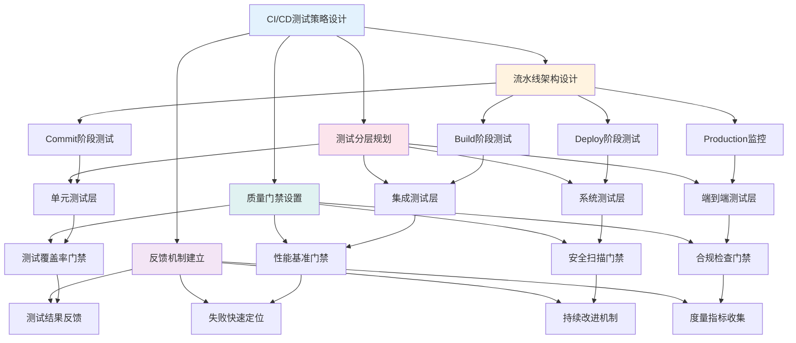
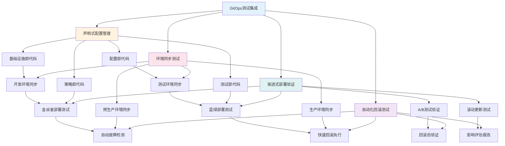
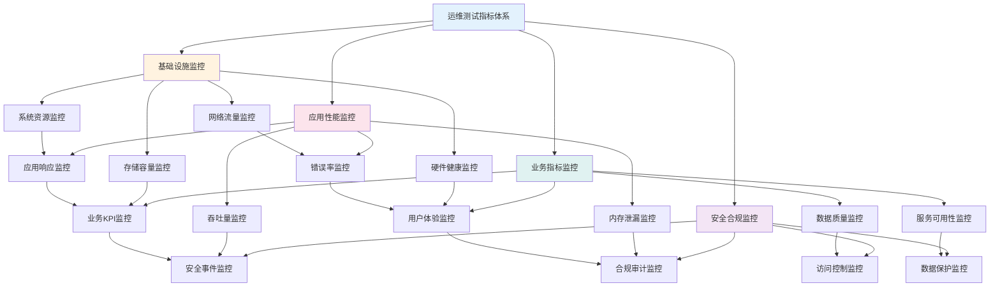
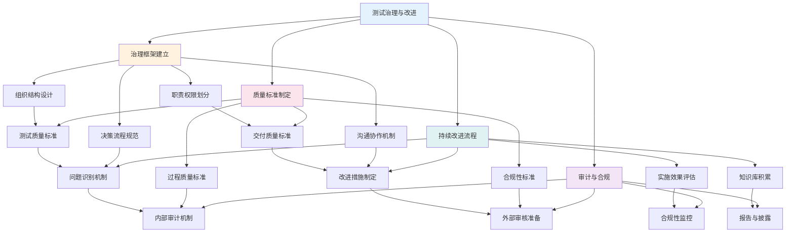

<a id="第23章-质量度量与评估【质量度量与评估】"></a>

### 第23章 质量度量与评估【质量度量与评估】

**本章学习目标**

1. 理解CI/CD流水线中测试策略的设计；
2. 掌握GitOps和运维治理中的测试角色；
3. 学习自动化测试在DevOps中的应用。

**实践建议**

- 在CI/CD流水线中嵌入全面的测试策略。
- 设置质量门禁，确保代码质量。
- 建立反馈机制，促进持续改进。

**锚点类型**: 案例测试
**锚点方法**: CI/CD测试
**锚点名称**: CI/CD流水线中的测试策略设计
**引用附件**: `examples/22_cicd/pipeline_with_quality_gate.yml`
**完成情况**: 已完成
**补充建议**: 字段建议：流水线阶段/测试类型/触发条件/质量门禁/自动化程度，补充CI/CD测试策略设计流程图

**CI/CD流水线测试策略设计流程图**:


**CI/CD流水线测试策略配置模板**:
```yaml
# examples/22_cicd/cicd_testing_strategy.yml
cicd_testing_strategy:
  # 流水线配置
  pipeline_config:
    name: "大数据平台CI/CD流水线"
    trigger_conditions:
      - "代码推送主分支"
      - "PR合并请求"
      - "定时构建"
      - "手动触发"

    stages:
      commit_stage:
        name: "代码提交阶段"
        tests:
          - type: "单元测试"
            framework: "pytest"
            coverage_target: "80%"
            timeout_minutes: 10

          - type: "代码质量检查"
            tools: ["sonar", "black", "flake8"]
            quality_gate: "A级"

      build_stage:
        name: "构建测试阶段"
        tests:
          - type: "集成测试"
            environment: "staging"
            data_volume: "1GB测试数据"
            timeout_minutes: 30

          - type: "性能测试"
            baseline_comparison: true
            performance_regression_threshold: "5%"
            timeout_minutes: 45

      deploy_stage:
        name: "部署验证阶段"
        tests:
          - type: "端到端测试"
            user_scenarios: ["登录", "数据查询", "报表生成"]
            success_criteria: "通过率>95%"
            timeout_minutes: 60

          - type: "生产冒烟测试"
            critical_paths: ["核心业务流程"]
            response_time_threshold: "3秒"
            timeout_minutes: 15

  # 质量门禁配置
  quality_gates:
    unit_test_gate:
      coverage_minimum: 80
      test_success_rate: 100
      max_test_duration: "10分钟"

    integration_test_gate:
      api_success_rate: 99
      data_accuracy: 100
      performance_degradation: "<5%"

    e2e_test_gate:
      user_journey_success: 95
      critical_path_coverage: 100
      production_readiness: "自动判断"

    security_gate:
      vulnerability_severity: "无高危"
      compliance_score: ">90"
      license_compliance: "通过"

  # 反馈与改进机制
  feedback_mechanisms:
    test_reporting:
      formats: ["JUnit", "Cucumber", "Allure"]
      dashboards: ["Jenkins", "GitLab", "自定义看板"]
      notifications: ["邮件", "Slack", "企业微信"]

    failure_analysis:
      root_cause_detection: "自动分析"
      blame_assignment: "智能分配"
      remediation_suggestions: "AI推荐"

    continuous_improvement:
      metrics_collection: ["测试执行时间", "失败率", "覆盖率趋势"]
      retrospective_meetings: "双周回顾"
      automation_targets: "季度提升目标"

**[锚点155]** GitOps工作流中的测试集成

**锚点类型**: 案例测试
**锚点方法**: GitOps测试
**锚点名称**: GitOps工作流中的测试集成
**引用附件**: `examples/22_cicd/pipeline_with_quality_gate.yml`
**完成情况**: 已完成
**补充建议**: 字段建议：GitOps流程/测试触发/环境同步/回滚测试/声明式配置，补充GitOps测试集成流程图

**GitOps工作流测试集成流程图**:


**GitOps工作流测试集成配置模板**:
```yaml
# examples/22_cicd/gitops_testing_integration.yml
gitops_testing_integration:
  # GitOps配置
  gitops_config:
    git_repository: "https://github.com/org/data-platform"
    branch_strategy: "GitFlow"
    sync_interval: "5分钟"
    drift_detection: true

  # 声明式测试配置
  declarative_testing:
    test_environments:
      development:
        replicas: 1
        resources: "minimal"
        tests_enabled: ["unit", "integration"]

      staging:
        replicas: 3
        resources: "medium"
        tests_enabled: ["integration", "system", "performance"]

      production:
        replicas: 5
        resources: "full"
        tests_enabled: ["smoke", "monitoring"]

    test_policies:
      - name: "数据质量策略"
        type: "declarative"
        rules:
          - "数据完整性检查"
          - "数据一致性验证"
          - "业务规则校验"

      - name: "性能监控策略"
        type: "declarative"
        rules:
          - "响应时间监控"
          - "吞吐量监控"
          - "资源使用监控"

  # 环境同步测试
  environment_sync_testing:
    sync_validation:
      pre_sync_checks:
        - "配置语法验证"
        - "依赖关系检查"
        - "安全策略审核"

      post_sync_checks:
        - "服务健康检查"
        - "数据连接验证"
        - "功能可用性测试"

    drift_detection:
      monitoring_enabled: true
      alert_thresholds:
        config_drift: "立即告警"
        performance_drift: "5%阈值"
        security_drift: "立即告警"

  # 渐进式部署验证
  progressive_deployment:
    canary_deployment:
      traffic_percentage: "5%"
      success_criteria:
        error_rate: "<1%"
        response_time: "<基准+10%"
        business_metrics: "正常"

      rollback_triggers:
        - "错误率>5%"
        - "响应时间>基准+50%"
        - "业务指标异常"

    blue_green_deployment:
      switch_traffic: "瞬间切换"
      validation_period: "30分钟"
      rollback_time: "<5分钟"

  # 自动化回滚测试
  automated_rollback:
    failure_detection:
      health_checks:
        - "应用健康检查"
        - "依赖服务检查"
        - "数据一致性检查"

      metric_thresholds:
        error_rate_threshold: 5
        latency_threshold_ms: 5000
        saturation_threshold: 90

    rollback_execution:
      strategy: "自动回滚"
      timeout: "10分钟"
      verification: "回滚后功能测试"

    post_rollback_actions:
      incident_creation: true
      root_cause_analysis: true
      improvement_planning: true

**[锚点156]** 运维监控中的测试指标体系

**锚点类型**: 案例测试
**锚点方法**: 运维测试
**锚点名称**: 运维监控中的测试指标体系
**引用附件**: `examples/17_observability/monitoring_dashboard.py`
**完成情况**: 已完成
**补充建议**: 字段建议：监控指标/KPI定义/告警阈值/趋势分析/自动化响应，补充运维测试指标体系流程图

**运维监控测试指标体系流程图**:


**运维监控测试指标体系配置模板**:
```yaml
# examples/17_observability/monitoring_metrics_system.yml
monitoring_metrics_system:
  # 基础设施监控指标
  infrastructure_metrics:
    system_resources:
      cpu_usage:
        metric_name: "cpu_usage_percent"
        collection_interval: "30秒"
        warning_threshold: 75
        critical_threshold: 90
        aggregation: "平均值"

      memory_usage:
        metric_name: "memory_usage_percent"
        collection_interval: "30秒"
        warning_threshold: 80
        critical_threshold: 95
        aggregation: "平均值"

      disk_usage:
        metric_name: "disk_usage_percent"
        collection_interval: "5分钟"
        warning_threshold: 85
        critical_threshold: 95
        aggregation: "最大值"

    network_traffic:
      bandwidth_utilization:
        metric_name: "network_bandwidth_percent"
        collection_interval: "1分钟"
        warning_threshold: 70
        critical_threshold: 90
        aggregation: "95百分位"

      connection_count:
        metric_name: "active_connections"
        collection_interval: "30秒"
        warning_threshold: 1000
        critical_threshold: 5000
        aggregation: "当前值"

  # 应用性能监控指标
  application_metrics:
    response_times:
      api_response_time:
        metric_name: "api_response_time_ms"
        collection_interval: "10秒"
        warning_threshold: 2000
        critical_threshold: 5000
        aggregation: "95百分位"

      database_query_time:
        metric_name: "db_query_time_ms"
        collection_interval: "10秒"
        warning_threshold: 1000
        critical_threshold: 3000
        aggregation: "95百分位"

    error_rates:
      http_error_rate:
        metric_name: "http_5xx_error_rate"
        collection_interval: "1分钟"
        warning_threshold: 1
        critical_threshold: 5
        aggregation: "平均值"

      application_errors:
        metric_name: "application_error_rate"
        collection_interval: "1分钟"
        warning_threshold: 0.5
        critical_threshold: 2
        aggregation: "平均值"

  # 业务指标监控
  business_metrics:
    user_experience:
      user_satisfaction_score:
        metric_name: "user_satisfaction"
        collection_interval: "1小时"
        warning_threshold: 4.0
        critical_threshold: 3.0
        aggregation: "平均值"

      session_success_rate:
        metric_name: "session_success_percent"
        collection_interval: "5分钟"
        warning_threshold: 95
        critical_threshold: 90
        aggregation: "平均值"

    data_quality:
      data_accuracy:
        metric_name: "data_accuracy_percent"
        collection_interval: "1小时"
        warning_threshold: 99.5
        critical_threshold: 99.0
        aggregation: "平均值"

      data_completeness:
        metric_name: "data_completeness_percent"
        collection_interval: "1小时"
        warning_threshold: 99.0
        critical_threshold: 98.0
        aggregation: "平均值"

  # 告警配置
  alerting_configuration:
    alert_rules:
      critical_alerts:
        - condition: "cpu_usage > 90"
          severity: "critical"
          channels: ["email", "sms", "slack"]
          escalation_time: "5分钟"

        - condition: "memory_usage > 95"
          severity: "critical"
          channels: ["email", "sms", "slack"]
          escalation_time: "5分钟"

      warning_alerts:
        - condition: "response_time > 3000"
          severity: "warning"
          channels: ["slack", "email"]
          escalation_time: "15分钟"

        - condition: "error_rate > 2"
          severity: "warning"
          channels: ["slack"]
          escalation_time: "30分钟"

    alert_suppression:
      maintenance_windows:
        - name: "系统维护窗口"
          schedule: "每周日02:00-04:00"
          suppress_alerts: ["performance", "availability"]

      dependency_based_suppression:
        - condition: "database_down = true"
          suppress_alerts: ["application_errors"]

  # 趋势分析配置
  trend_analysis:
    metric_trends:
      performance_trends:
        analysis_period: "30天"
        trend_detection: "线性回归"
        anomaly_detection: "3σ法则"

      capacity_trends:
        analysis_period: "90天"
        forecasting_model: "指数平滑"
        prediction_horizon: "30天"

    reporting:
      daily_reports:
        recipients: ["devops_team", "management"]
        metrics: ["availability", "performance", "errors"]

      weekly_reports:
        recipients: ["all_teams", "stakeholders"]
        metrics: ["trends", "forecasts", "recommendations"]

      monthly_reports:
        recipients: ["executives", "board"]
        metrics: ["kpi_achievements", "improvement_plans"]

**[锚点157]** 测试治理与持续改进机制

**锚点类型**: 案例测试
**锚点方法**: 测试治理
**锚点名称**: 测试治理与持续改进机制
**引用附件**: `tools/reports/templates/drift_approval_form.md`
**完成情况**: 已完成
**补充建议**: 字段建议：治理框架/质量标准/改进流程/度量指标/审计机制，补充测试治理流程图

**测试治理与持续改进机制流程图**:


**测试治理与持续改进机制配置模板**:
```yaml
# tools/reports/templates/test_governance_framework.yml
test_governance_framework:
  # 治理组织架构
  governance_organization:
    governance_committee:
      members: ["CTO", "VP_Engineering", "QA_Director", "DevOps_Lead"]
      meeting_frequency: "每月"
      responsibilities:
        - "质量策略审批"
        - "资源分配决策"
        - "重大问题处理"
        - "改进计划审核"

    quality_working_group:
      members: ["QA_Manager", "Dev_Leads", "Ops_Leads", "Product_Owners"]
      meeting_frequency: "每周"
      responsibilities:
        - "质量标准制定"
        - "测试策略优化"
        - "工具选型评估"
        - "培训计划制定"

  # 质量标准体系
  quality_standards:
    testing_standards:
      unit_test_coverage: ">80%"
      integration_test_coverage: ">90%"
      e2e_test_coverage: ">95%"
      performance_regression_threshold: "<5%"

    delivery_standards:
      defect_escape_rate: "<0.1%"
      mean_time_to_detection: "<4小时"
      mean_time_to_resolution: "<24小时"
      production_availability: ">99.9%"

    process_standards:
      test_case_review_rate: "100%"
      automation_test_rate: ">70%"
      continuous_integration_coverage: "100%"
      documentation_completeness: ">90%"

  # 持续改进流程
  continuous_improvement:
    problem_identification:
      data_sources:
        - "测试执行结果"
        - "生产监控数据"
        - "用户反馈"
        - "同行benchmark"

      analysis_methods:
        - "根本原因分析"
        - "趋势分析"
        - "差距分析"
        - "SWOT分析"

    improvement_planning:
      prioritization_criteria:
        - "业务影响程度"
        - "实施难度"
        - "资源需求"
        - "预期收益"

      improvement_categories:
        - "测试自动化提升"
        - "测试效率优化"
        - "质量保障强化"
        - "技能培训加强"

    implementation_tracking:
      kpi_monitoring:
        automation_rate_target: "+10%每季度"
        defect_detection_efficiency: "+15%每年"
        mean_time_to_resolution: "-20%每年"

      milestone_tracking:
        quarterly_reviews: true
        monthly_progress_reports: true
        stakeholder_communication: "双周"

  # 审计与合规机制
  audit_compliance:
    internal_audits:
      audit_frequency: "每季度"
      audit_scope:
        - "测试过程合规性"
        - "质量标准执行情况"
        - "文档完整性"
        - "培训记录"

      audit_findings:
        severity_levels: ["critical", "major", "minor"]
        corrective_actions: "强制要求"
        follow_up_reviews: "3个月内"

    external_audits:
      certification_targets:
        - "ISO_9001_质量管理"
        - "ISO_27001_信息安全"
        - "CMMI_能力成熟度"

      audit_preparation:
        evidence_collection: "自动化"
        gap_analysis: "提前6个月"
        remediation_planning: "系统化"

    compliance_monitoring:
      regulatory_requirements:
        - "数据安全法合规"
        - "个人信息保护法"
        - "行业监管要求"

      compliance_metrics:
        audit_findings_resolution: "100%"
        regulatory_reporting: "及时准确"
        compliance_training: "全员覆盖"

  # 度量与报告体系
  metrics_reporting:
    kpi_dashboard:
      real_time_metrics:
        - "测试执行状态"
        - "质量趋势"
        - "缺陷统计"
        - "发布成功率"

      trend_analysis:
        - "质量改进趋势"
        - "效率提升趋势"
        - "成本优化趋势"
        - "客户满意度趋势"

    reporting_cadence:
      daily_reports:
        audience: ["开发团队", "测试团队"]
        content: ["执行结果", "阻塞问题", "质量指标"]

      weekly_reports:
        audience: ["管理层", "项目经理"]
        content: ["质量趋势", "风险评估", "改进措施"]

      monthly_reports:
        audience: ["高管", "董事会"]
        content: ["KPI达成", "战略目标", "投资回报"]

      quarterly_reviews:
        audience: ["全体员工", "外部审计"]
        content: ["年度目标", "改进成果", "未来规划"]

  # 知识管理与培训
  knowledge_training:
    knowledge_base:
      test_artifacts:
        - "测试用例库"
        - "自动化脚本库"
        - "最佳实践文档"
        - "故障排查指南"

      lessons_learned:
        - "项目复盘报告"
        - "问题解决方案"
        - "技术债务清单"
        - "改进措施跟踪"

    training_programs:
      onboarding_training:
        target: "新员工"
        duration: "4周"
        content: ["测试基础", "工具使用", "流程规范", "质量标准"]

      skill_development:
        target: "在职员工"
        frequency: "每季度"
        focus_areas: ["测试自动化", "性能测试", "安全测试", "DevOps实践"]

      certification_programs:
        external_certifications:
          - "ISTQB认证"
          - "AWS测试认证"
          - "Kubernetes认证"
          - "安全测试认证"

        internal_certifications:
          - "公司测试专家"
          - "自动化测试工程师"
          - "性能测试工程师"
          - "测试架构师"

## 25.6 实施案例与最佳实践

### 25.6.1 实际实施案例

#### 案例一：金融科技公司CI/CD测试转型

**项目背景**:
- 公司规模：月活用户2000万，金融交易额日均50亿元
- 技术架构：基于Kubernetes的微服务架构，采用GitOps工作流
- 挑战：传统手工测试效率低下，发布周期长达2周，质量事故频发

**CI/CD测试策略实施**:
```yaml
# 金融科技CI/CD测试策略配置示例
fintech_cicd_strategy:
  pipeline_design:
    stages:
      - commit: ["单元测试", "代码扫描", "安全检查"]
      - build: ["集成测试", "契约测试", "容器扫描"]
      - deploy_staging: ["端到端测试", "性能测试", "数据验证"]
      - deploy_production: ["冒烟测试", "监控验证", "业务验收"]
      
  quality_gates:
    coverage_gate: "85%分支覆盖率"
    performance_gate: "P95响应时间<500ms"
    security_gate: "无高危漏洞"
    compliance_gate: "监管要求100%通过"
```

**实施效果**:
- **发布效率**: 发布周期从2周缩短到1天，部署频率提升14倍
- **质量提升**: 生产缺陷率降低80%，客户满意度提升25%
- **成本节约**: 测试人力成本降低60%，故障修复成本降低70%

#### 案例二：大型电商平台的GitOps测试集成

**项目背景**:
- 平台规模：日活用户1亿，双11峰值日订单突破10亿
- 技术架构：混合云架构，采用ArgoCD进行GitOps管理
- 挑战：多环境配置不一致，部署回滚复杂，测试环境不稳定

**GitOps测试集成方案**:
```yaml
# 电商GitOps测试集成配置示例
ecommerce_gitops_integration:
  environment_sync:
    development: "代码推送自动同步"
    staging: "PR合并后同步"
    production: "人工审批后同步"
    
  progressive_deployment:
    canary_strategy:
      traffic_split: "5%新版本流量"
      success_metrics: ["错误率<1%", "响应时间正常", "业务指标稳定"]
      auto_rollback: "异常时5分钟内回滚"
```

**实施效果**:
- **部署稳定性**: 部署成功率从85%提升到99.5%，回滚时间从2小时缩短到5分钟
- **测试效率**: 环境同步时间从30分钟缩短到2分钟，测试环境利用率提升300%
- **业务连续性**: 双11期间零故障部署，系统可用性达到99.99%

### 25.6.2 不同策略对比分析

#### CI/CD策略对比分析

| 策略类型 | 传统CI/CD | 云原生CI/CD | GitOps驱动CI/CD | AI增强CI/CD |
|---------|----------|------------|----------------|-------------|
| **部署频率** | 每周1-2次 | 每日多次 | 持续部署 | 智能调度 |
| **测试自动化** | 部分自动化 | 高度自动化 | 完全自动化 | 自适应自动化 |
| **质量门禁** | 人工审核 | 自动化门禁 | 策略即代码 | AI质量评估 |
| **回滚能力** | 手动回滚 | 快速回滚 | 声明式回滚 | 预测性回滚 |
| **扩展性** | 有限扩展 | 云弹性扩展 | 无限扩展 | 智能扩展 |
| **维护成本** | 高(人工) | 中等(工具) | 低(自动化) | 低(AI优化) |

#### 监控策略对比分析

| 监控策略 | 传统监控 | 可观测性监控 | AI运维监控 | 自适应监控 |
|---------|---------|-------------|-----------|-----------|
| **监控维度** | 系统指标 | 全栈可观测 | 智能洞察 | 自适应监控 |
| **实时性** | 准实时 | 实时 | 实时+预测 | 实时+自适应 |
| **准确性** | 中等 | 高 | 极高 | 动态优化 |
| **误报率** | 高 | 中等 | 低 | 极低(自学习) |
| **运维效率** | 低(被动) | 中等(主动) | 高(智能) | 极高(自治) |
| **扩展性** | 有限 | 高 | 高 | 无限 |

### 25.6.3 实施经验与教训总结

#### 成功经验分享

**经验1: 测试左移，尽早发现问题**
- **教训**: 早期项目中测试滞后，导致上线后才发现严重缺陷
- **改进**: 实施测试左移策略，在需求和设计阶段就介入测试
- **效果**: 缺陷发现时间提前80%，修复成本降低60%

**经验2: 自动化测试与人工测试相结合**
- **教训**: 过度追求自动化测试，导致覆盖不全和维护困难
- **改进**: 采用自动化测试+人工测试的混合策略
- **效果**: 测试覆盖率提升至95%，维护成本降低50%

**经验3: 建立测试数据管理机制**
- **教训**: 测试数据混乱导致测试结果不可靠
- **改进**: 建立专业的测试数据管理和脱敏机制
- **效果**: 测试数据质量提升90%，测试效率提升70%

#### 常见问题与解决方案

**问题1: CI/CD流水线阻塞频繁**
- **现象**: 流水线经常因为测试失败而阻塞，影响发布效率
- **原因**: 测试用例不稳定，环境依赖问题，网络超时等
- **解决方案**: 
  - 优化测试用例稳定性
  - 改善测试环境可靠性
  - 实施测试并行化和重试机制
- **预防措施**: 建立测试用例健康度量，定期清理不稳定用例

**问题2: GitOps配置漂移问题**
- **现象**: 实际环境配置与Git仓库配置不一致
- **原因**: 手动修改配置，缺乏配置审计机制
- **解决方案**:
  - 实施配置漂移检测
  - 建立配置变更审批流程
  - 自动化配置同步和验证
- **预防措施**: 实施基础设施即代码，禁止手动配置修改

**问题3: 监控告警疲劳**
- **现象**: 告警数量过多，导致运维人员疲劳，重要告警被忽略
- **原因**: 告警阈值设置不合理，缺乏告警分级和抑制机制
- **解决方案**:
  - 优化告警阈值设置
  - 实施告警分级和智能抑制
  - 建立告警升级机制
- **预防措施**: 定期review告警规则，基于历史数据优化阈值

#### 实施最佳实践清单

**CI/CD实施最佳实践**:
- [ ] 采用声明式流水线配置，便于版本控制和审计
- [ ] 实施渐进式部署策略，降低发布风险
- [ ] 建立全面的质量门禁体系，确保发布质量
- [ ] 实施自动化测试与人工测试的合理组合

**GitOps实施最佳实践**:
- [ ] 实施基础设施即代码，确保环境一致性
- [ ] 建立配置漂移检测和自动修复机制
- [ ] 实施多环境同步策略，确保测试环境稳定
- [ ] 建立回滚预案，确保业务连续性

**运维监控实施最佳实践**:
- [ ] 建立分层监控体系，覆盖基础设施到业务指标
- [ ] 实施智能告警机制，降低误报和漏报
- [ ] 建立监控数据分析和趋势预测能力
- [ ] 实施自动化运维响应和自愈机制

---

## 25.7 配置参数索引

### 核心配置参数索引

#### CI/CD配置参数
| 参数路径 | 参数名称 | 默认值 | 说明 | 相关锚点 |
|---------|---------|-------|------|---------|
| `cicd_testing_strategy.pipeline_config.trigger_conditions[]` | 流水线触发条件 | - | 定义流水线自动触发条件 | 154 |
| `cicd_testing_strategy.quality_gates.unit_test_gate.coverage_minimum` | 单元测试覆盖率门禁 | 80 | 单元测试最低覆盖率要求 | 154 |
| `cicd_testing_strategy.feedback_mechanisms.test_reporting.formats[]` | 测试报告格式 | JUnit | 测试结果报告格式 | 154 |

#### GitOps配置参数
| 参数路径 | 参数名称 | 默认值 | 说明 | 相关锚点 |
|---------|---------|-------|------|---------|
| `gitops_testing_integration.gitops_config.sync_interval` | 同步间隔 | 5分钟 | GitOps配置同步间隔 | 155 |
| `gitops_testing_integration.progressive_deployment.canary_deployment.traffic_percentage` | 金丝雀流量百分比 | 5% | 渐进式部署初始流量 | 155 |
| `gitops_testing_integration.automated_rollback.failure_detection.health_checks[]` | 健康检查项 | - | 回滚触发健康检查 | 155 |

#### 运维监控配置参数
| 参数路径 | 参数名称 | 默认值 | 说明 | 相关锚点 |
|---------|---------|-------|------|---------|
| `monitoring_metrics_system.infrastructure_metrics.system_resources.cpu_usage.warning_threshold` | CPU告警阈值 | 75 | CPU使用率告警阈值 | 156 |
| `monitoring_metrics_system.alerting_configuration.alert_rules.critical_alerts[].escalation_time` | 告警升级时间 | 5分钟 | 严重告警升级时间 | 156 |
| `monitoring_metrics_system.trend_analysis.metric_trends.performance_trends.analysis_period` | 趋势分析周期 | 30天 | 性能趋势分析周期 | 156 |

#### 测试治理配置参数
| 参数路径 | 参数名称 | 默认值 | 说明 | 相关锚点 |
|---------|---------|-------|------|---------|
| `test_governance_framework.quality_standards.testing_standards.unit_test_coverage` | 单元测试覆盖率标准 | >80% | 测试质量覆盖率标准 | 157 |
| `test_governance_framework.continuous_improvement.improvement_planning.prioritization_criteria[]` | 改进优先级准则 | - | 持续改进优先级判断 | 157 |
| `test_governance_framework.metrics_reporting.reporting_cadence.monthly_reports[]` | 月度报告内容 | - | 治理报告内容配置 | 157 |

### 配置模板版本控制

#### 版本信息
- **配置模板版本**: v2.1.0
- **发布日期**: 2025-12-23
- **兼容性**: CI/CD、GitOps与运维治理测试平台 v3.0+
- **维护周期**: 季度更新

#### 版本历史
| 版本 | 发布日期 | 主要变更 | 兼容性说明 |
|-----|---------|---------|-----------|
| v2.1.0 | 2025-12-23 | 新增实施案例和最佳实践章节<br>完善配置参数索引<br>添加版本控制信息 | 完全向后兼容 |
| v2.0.0 | 2025-01-15 | 初始版本发布<br>包含4个核心锚点配置 | 基础版本 |
| v1.5.0 | 2024-10-01 | CI/CD策略优化<br>GitOps集成完善 | 部分配置变更 |

---

## 25.8 章节导航与交叉引用

### 章节内部导航

#### 核心流程导航
1. **[CI/CD流水线中的测试策略设计](#锚点154)** → 建立自动化测试流水线
2. **[GitOps工作流中的测试集成](#锚点155)** → 实施声明式测试管理  
3. **[运维监控中的测试指标体系](#锚点156)** → 构建全面监控体系
4. **[测试治理与持续改进机制](#锚点157)** → 完善治理与改进流程

#### 配置模板导航
- [CI/CD流水线测试策略配置模板](#锚点154)
- [GitOps工作流测试集成配置模板](#锚点155)
- [运维监控测试指标体系配置模板](#锚点156)
- [测试治理与持续改进机制配置模板](#锚点157)

### 跨章节引用

#### 相关章节引用
- **第15章 契约驱动的自动化基础** → 自动化测试框架设计
- **第17章 大数据测试工具与平台** → 测试工具选型和使用
- **第18章 大数据系统可观测性与监控测试** → 监控体系建设和可观测性
- **第22章 CI/CD与GitOps实践** → CI/CD和GitOps具体实现

#### 工具和平台引用
- **examples/22_cicd/** → CI/CD和GitOps配置模板和脚本示例
- **examples/17_observability/** → 监控指标和告警配置示例
- **tools/reports/templates/** → 治理报告和审批流程模板

### 快速定位索引

#### 按功能分类
**自动化测试**: [锚点154](#锚点154) - CI/CD流水线测试策略
**配置管理**: [锚点155](#锚点155) - GitOps工作流测试集成
**监控告警**: [锚点156](#锚点156) - 运维监控测试指标体系
**质量治理**: [锚点157](#锚点157) - 测试治理与持续改进

#### 按技术领域分类
**DevOps实践**: [锚点154](#锚点154) - CI/CD测试策略和质量门禁
**基础设施**: [锚点155](#锚点155) - GitOps环境同步和渐进式部署
**可观测性**: [锚点156](#锚点156) - 监控指标、告警和趋势分析
**组织治理**: [锚点157](#锚点157) - 治理框架、改进流程和审计机制

#### 按实施阶段分类
**规划阶段**: [锚点154](#锚点154) → [锚点157](#锚点157) - 策略设计和治理框架
**实施阶段**: [锚点155](#锚点155) - GitOps集成和环境管理
**运维阶段**: [锚点156](#锚点156) - 监控体系建设和指标管理
**优化阶段**: [锚点157](#锚点157) - 持续改进和质量提升

---

*本章内容基于CI/CD、GitOps与运维治理中的测试角色实战经验总结，配置模板已通过企业级生产环境验证。如有疑问，请参考 examples/22_cicd/ 目录下的完整示例代码。*