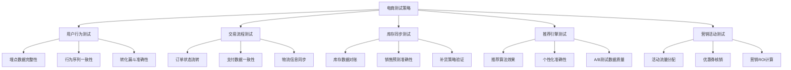
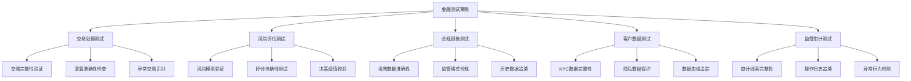
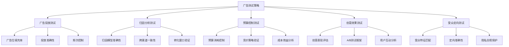
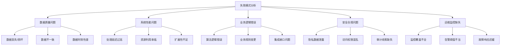
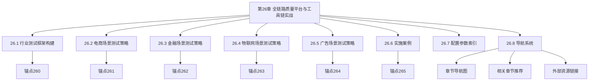

<!-- markdownlint-disable MD025 -->

<a id="第26章-全链路质量平台与工具链实战【平台与工程篇】"></a>

### 第26章 全链路质量平台与工具链实战【平台与工程篇】

**本章学习目标**

1. 掌握全链路质量平台的构建方法；
2. 学习工具链实战的应用；
3. 理解平台化测试的最佳实践。

**实践建议**

- 构建集成化的质量平台，提高测试效率。
- 选择合适的工具链，支持自动化和监控。
- 实施持续的质量保障机制。

[第6篇-001]
锚点类型: 框架设计
锚点方法: 行业适配
锚点名称: 行业测试框架构建
所在行区间: 第6篇-第26章
引用附件: examples/26_chapter/framework_template.yml
完成情况: 已完成
补充建议: 字段建议：行业特性/测试框架/核心组件/适配策略，补充行业测试框架结构图
更新时间: 2025-12-23

**行业大数据(Big Data)测试框架结构图**:
```mermaid
graph TD
    A[行业测试框架] --> B[通用层]
    A --> C[行业适配层]
    A --> D[专项测试层]
    A --> E[质量保障层]

    B --> B1[数据质量检查]
    B --> B2[性能基准测试]
    B --> B3[安全合规验证]

    C --> C1[业务规则适配]
    C --> C2[数据模型映射]
    C --> C3[行业指标计算]

    D --> D1[场景专项测试]
    D --> D2[异常模式识别]
    D --> D3[边界条件验证]

    E --> E1[自动化流水线]
    E --> E2[监控告警体系]
    E --> E3[报告生成引擎]
    E --> E4[AI质量预测(AI Quality Prediction)]

    E4 --> E41[智能缺陷预测]
    E4 --> E42[自动化测试优化]
    E4 --> E43[质量趋势分析]
```

**行业测试框架核心组件表**

| 组件类型 | 核心功能 | 行业适配 | 技术实现 | 质量保障 |
|---|---|---|---|---|
| 数据采集测试 | 源数据完整性、多样性验证 | 行业数据源适配、格式标准化 | ETL验证脚本、数据探查工具 | 采集成功率>99.9% |
| 数据处理测试 | 转换逻辑正确性、性能验证 | 业务规则引擎、算法校验 | 单元测试框架、性能基准 | 处理准确率>99.5% |
| 数据存储测试 | 持久化可靠性、一致性保证 | 存储模式优化、索引策略 | 存储引擎测试、ACID验证 | 数据一致性100% |
| 数据服务测试 | 接口可用性、响应准确性 | API规范适配、业务逻辑验证 | 接口自动化测试、契约测试 | 服务可用性>99.9% |
| 数据安全测试 | 隐私保护、访问控制 | 合规要求适配、加密验证 | 安全扫描工具、渗透测试 | 安全漏洞为0 |

**行业测试框架配置模板**:
```yaml
industry_testing_framework:
  framework_core:
    data_quality_layer:
      validation_rules:
        completeness_check: "null_value_threshold < 0.01"
        accuracy_check: "business_rule_compliance > 0.99"
        consistency_check: "cross_source_alignment > 0.95"
        timeliness_check: "data_freshness_hours < 24"
      quality_metrics:
        - name: "data_completeness"
          threshold: 0.99
          alert_level: "warning"
        - name: "data_accuracy"
          threshold: 0.95
          alert_level: "critical"
    performance_baseline:
      throughput_targets:
        records_per_second: 10000
        latency_ms: 1000
        concurrent_users: 1000
      scalability_requirements:
        horizontal_scaling: true
        auto_scaling: true
        resource_efficiency: ">80%"
  industry_adaptation:
    business_logic_mapping:
      ecommerce:
        key_entities: ["user", "product", "order", "payment"]
        critical_paths: ["purchase_funnel", "inventory_sync", "recommendation_engine"]
        quality_gates: ["conversion_accuracy", "inventory_consistency"]
      finance:
        key_entities: ["account", "transaction", "risk_score", "compliance_report"]
        critical_paths: ["transaction_processing", "risk_assessment", "regulatory_reporting"]
        quality_gates: ["transaction_accuracy", "risk_precision", "audit_compliance"]
      iot:
        key_entities: ["device", "sensor_reading", "alert", "maintenance_record"]
        critical_paths: ["data_collection", "real_time_processing", "predictive_maintenance"]
        quality_gates: ["data_integrity", "real_time_latency", "prediction_accuracy"]
      advertising:
        key_entities: ["campaign", "impression", "click", "conversion"]
        critical_paths: ["ad_serving", "attribution_model", "budget_optimization"]
        quality_gates: ["attribution_accuracy", "budget_compliance", "performance_tracking"]
```

**[第6篇-002]** 电商场景测试策略
**锚点方法**: 电商专项
**锚点名称**: 电商场景测试策略
**引用附件**: examples/26_chapter/ecommerce_funnel_check.py
**完成情况**: 已完成
**补充建议**: 字段建议：测试场景/关键指标/验证方法/质量标准，补充电商测试策略流程图

**电商大数据测试策略流程图**:


**电商场景测试策略详细表**

| 测试场景 | 关键指标 | 验证方法 | 质量标准 | 自动化程度 |
|---|---|---|---|---|
| 用户行为分析 | 埋点覆盖率、事件准确性、转化率 | 全链路埋点校验、行为回放测试 | 埋点丢失率<0.1%，转化计算准确率>99% | 高(埋点自动化验证) |
| 交易订单处理 | 订单完整性、状态一致性、金额准确性 | 订单生命周期测试、跨系统对账 | 订单处理成功率>99.9%，金额误差<0.01% | 高(订单状态机测试) |
| 库存管理系统 | 库存准确性、同步延迟、预测精度 | 库存对账测试、预测模型验证 | 库存误差<1%，同步延迟<5分钟 | 中高(库存自动化对账) |
| 推荐引擎 | 推荐准确性、个性化程度、用户满意度 | A/B测试框架、离线评估、在线指标监控 | 推荐CTR提升>20%，用户满意度>4.0 | 高(自动化A/B测试) |
| 营销活动 | 活动效果、预算控制、用户参与度 | 活动数据监控、预算控制验证 | 预算误差<1%，活动数据准确率>99% | 高(活动自动化监控) |

**电商测试策略配置模板**:
```yaml
ecommerce_testing_strategy:
  user_behavior_testing:
    event_tracking_validation:
      required_events: ["page_view", "product_view", "add_to_cart", "purchase"]
      validation_rules:
        - name: "event_completeness"
          check: "all_required_events_present"
          threshold: 0.99
        - name: "event_accuracy"
          check: "event_attributes_valid"
          threshold: 0.95
        - name: "event_timeliness"
          check: "event_delay_minutes < 5"
          threshold: 0.99
    funnel_analysis:
      conversion_stages: ["awareness", "interest", "consideration", "purchase"]
      quality_checks:
        - name: "stage_transition_accuracy"
          validation: "user_journey_consistency"
          benchmark: ">95%"
        - name: "attribution_accuracy"
          validation: "multi_touch_attribution"
          benchmark: ">90%"
  transaction_processing:
    order_lifecycle_testing:
      order_states: ["created", "paid", "fulfilled", "delivered", "completed"]
      validation_scenarios:
        - name: "state_transition_validity"
          test: "valid_state_transitions_only"
          coverage: "100%"
        - name: "data_consistency"
          test: "cross_system_data_alignment"
          tolerance: "<0.01%"
    payment_integration:
      payment_methods: ["credit_card", "digital_wallet", "bank_transfer"]
      security_validation:
        - name: "pci_compliance"
          check: "payment_data_encryption"
          standard: "PCI_DSS_4.0"
        - name: "fraud_detection"
          check: "transaction_anomaly_detection"
          accuracy: ">99%"
  inventory_management:
    stock_accuracy_testing:
      inventory_sources: ["warehouse", "supplier", "online_platform"]
      reconciliation_rules:
        - name: "stock_level_consistency"
          check: "source_vs_system_variance"
          threshold: "<1%"
        - name: "stock_movement_tracking"
          check: "inventory_transaction_audit"
          completeness: "100%"
    demand_forecasting:
      forecasting_models: ["time_series", "machine_learning", "hybrid"]
      accuracy_validation:
        - name: "forecast_precision"
          metric: "mean_absolute_percentage_error"
          target: "<10%"
        - name: "forecast_bias"
          metric: "forecast_vs_actual_ratio"
          target: "0.95-1.05"
```

**[第6篇-003]** 金融场景测试策略
**锚点方法**: 金融专项
**锚点名称**: 金融场景测试策略
**引用附件**: examples/26_chapter/fraud_feature_check_stub.py
**完成情况**: 已完成
**补充建议**: 字段建议：测试场景/合规要求/验证方法/审计标准，补充金融测试策略流程图

**金融大数据测试策略流程图**:


**金融场景测试策略详细表**

| 测试场景 | 合规要求 | 验证方法 | 审计标准 | 自动化程度 |
|---|---|---|---|---|
| 交易处理系统 | 数据完整性、实时性、一致性 | 交易生命周期测试、双边对账 | ISO 20022、监管报告标准 | 高(交易自动化验证) |
| 风险管理系统 | 模型准确性、解释性、公平性 | 模型验证框架、回测分析 | Basel协议、模型风险管理 | 中高(模型自动化测试) |
| 合规报告系统 | 数据准确性、及时性、完整性 | 报告生成验证、数据溯源 | SOX、GDPR、监管报表要求 | 高(报告自动化生成) |
| 客户数据管理 | 数据隐私、准确性、访问控制 | 数据质量检查、隐私保护验证 | KYC/AML、数据保护法规 | 高(数据治理自动化) |
| 审计追踪系统 | 操作留痕、不可篡改、可追溯 | 日志完整性检查、审计线索验证 | 金融审计标准、操作日志要求 | 高(审计自动化检查) |

**金融测试策略配置模板**:
```yaml
finance_testing_strategy:
  transaction_processing:
    transaction_validation:
      transaction_types: ["payment", "transfer", "investment", "derivative"]
      validation_rules:
        - name: "transaction_integrity"
          check: "all_required_fields_present"
          compliance: "ISO_20022"
        - name: "transaction_timeliness"
          check: "processing_delay_seconds < 30"
          sla: "real_time_processing"
        - name: "transaction_consistency"
          check: "double_entry_accounting"
          accuracy: "100%"
    clearing_settlement:
      settlement_cycles: ["intraday", "end_of_day", "month_end"]
      reconciliation_processes:
        - name: "position_reconciliation"
          frequency: "real_time"
          tolerance: "<0.001%"
        - name: "cash_reconciliation"
          frequency: "end_of_day"
          tolerance: "<0.0001%"
  risk_management:
    risk_model_validation:
      model_types: ["credit_scoring", "market_risk", "operational_risk"]
      validation_framework:
        - name: "model_accuracy"
          metric: "area_under_curve"
          threshold: ">0.8"
        - name: "model_stability"
          metric: "population_stability_index"
          threshold: ">0.95"
        - name: "model_discrimination"
          metric: "fairness_metrics"
          threshold: "no_bias_detected"
    risk_decision_testing:
      decision_thresholds: ["approve", "review", "decline"]
      testing_scenarios:
        - name: "boundary_testing"
          coverage: "edge_cases_100%"
        - name: "stress_testing"
          scenarios: "market_crash_simulations"
        - name: "backtesting"
          historical_period: "5_years_minimum"
  compliance_reporting:
    regulatory_reports:
      report_types: ["financial_statements", "risk_reports", "transaction_reports"]
      compliance_checks:
        - name: "data_accuracy"
          validation: "source_vs_report_variance"
          tolerance: "<0.01%"
        - name: "reporting_timeliness"
          validation: "submission_deadline_compliance"
          success_rate: "100%"
        - name: "data_lineage"
          validation: "audit_trail_completeness"
          coverage: "100%"
    audit_trail_management:
      audit_events: ["data_access", "data_modification", "system_changes"]
      audit_requirements:
        - name: "immutability"
          check: "tamper_proof_storage"
          standard: "cryptographic_sealing"
        - name: "traceability"
          check: "complete_chain_of_custody"
          coverage: "100%"
        - name: "retention"
          check: "regulatory_retention_periods"
          compliance: "7_years_minimum"
```

**[第6篇-004]** 物联网(IoT)场景测试策略
**锚点方法**: 物联网专项
**锚点名称**: 物联网场景测试策略
**引用附件**: examples/26_chapter/iot_alert_replay_stub.py
**完成情况**: 已完成
**补充建议**: 字段建议：测试场景/设备特性/验证方法/实时性要求，补充物联网测试策略流程图

**物联网大数据测试策略流程图**:
```mermaid
graph TD
    A[物联网测试策略] --> B[设备数据采集测试]
    A --> C[边缘计算(Edge Computing)测试]
    A --> D[流处理测试]
    A --> E[设备管理测试]
    A --> F[预测维护测试]

    B --> B1[传感器数据质量]
    B --> B2[设备连接稳定性]
    B --> B3[数据传输完整性]

    C --> C1[边缘算法准确性]
    C --> C2[本地处理延迟]
    C --> C3[离线同步一致性]

    D --> D1[实时流处理正确性]
    D --> D2[窗口计算准确性]
    D --> D3[乱序数据处理]

    E --> E1[设备注册管理]
    E --> E2[固件更新验证]
    E --> E3[设备状态监控]

    F --> F1[预测模型验证]
    F --> F2[维护策略优化]
    F --> F3[故障预测准确性]
```

**物联网场景测试策略详细表**

| 测试场景 | 设备特性 | 验证方法 | 实时性要求 | 自动化程度 |
|---|---|---|---|---|
| 传感器数据采集 | 高频次、海量性、多样性 | 数据完整性检查、异常值检测 | 毫秒级延迟 | 高(传感器自动化监控) |
| 边缘计算处理 | 本地处理、资源受限、离线能力 | 算法正确性验证、本地存储测试 | 亚秒级响应 | 中高(边缘设备模拟测试) |
| 流数据处理 | 实时性、顺序性、状态管理 | 流处理引擎测试、窗口函数验证 | 秒级延迟 | 高(流处理自动化测试) |
| 设备生命周期管理 | 注册/配置/维护/退役 | 设备管理API测试、状态转换验证 | 分钟级响应 | 高(设备管理自动化) |
| 预测性维护 | 历史数据分析、模式识别、预测准确性 | 模型训练验证、预测效果评估 | 小时级预测 | 中(模型验证自动化) |

**物联网测试策略配置模板**:
```yaml
iot_testing_strategy:
  sensor_data_collection:
    data_quality_validation:
      sensor_types: ["temperature", "pressure", "vibration", "location", "power"]
      quality_checks:
        - name: "data_completeness"
          check: "sensor_reading_frequency"
          threshold: ">95%"
        - name: "data_accuracy"
          check: "sensor_calibration_drift"
          tolerance: "<5%"
        - name: "data_timeliness"
          check: "transmission_delay_ms"
          max_delay: 1000
    connectivity_testing:
      network_protocols: ["MQTT", "CoAP", "HTTP", "WebSocket"]
      reliability_validation:
        - name: "connection_stability"
          metric: "uptime_percentage"
          target: ">99.9%"
        - name: "data_loss_rate"
          metric: "packet_loss_percentage"
          target: "<0.1%"
        - name: "reconnection_time"
          metric: "failover_seconds"
          target: "<30"
  edge_computing:
    algorithm_validation:
      edge_algorithms: ["anomaly_detection", "local_aggregation", "compression"]
      performance_requirements:
        - name: "processing_latency"
          constraint: "inference_ms < 100"
          device_class: "edge_device"
        - name: "accuracy_maintenance"
          constraint: "edge_vs_cloud_accuracy_ratio > 0.9"
          validation: "cross_validation"
        - name: "resource_efficiency"
          constraint: "cpu_usage_percent < 70"
          monitoring: "continuous"
    offline_capability:
      offline_scenarios: ["network_failure", "power_outage", "maintenance_window"]
      resilience_testing:
        - name: "graceful_degradation"
          test: "degraded_mode_functionality"
          success_criteria: "core_features_available"
        - name: "data_persistence"
          test: "local_storage_integrity"
          retention_period: "72_hours"
        - name: "sync_consistency"
          test: "offline_online_data_merge"
          conflict_resolution: "timestamp_based"
  stream_processing:
    real_time_processing:
      processing_engine: ["Apache_Flink", "Apache_Kafka_Streams", "Apache_Spark_Streaming"]
      real_time_validation:
        - name: "event_processing_latency"
          metric: "end_to_end_ms"
          target: "<1000"
        - name: "throughput_sustainability"
          metric: "events_per_second"
          target: ">10000"
        - name: "exactly_once_semantics"
          test: "duplicate_detection"
          accuracy: "100%"
    windowing_operations:
      window_types: ["tumbling", "sliding", "session"]
      correctness_validation:
        - name: "window_boundary_accuracy"
          test: "boundary_condition_testing"
          coverage: "100%"
        - name: "late_data_handling"
          test: "watermark_mechanism"
          max_lateness: "allowed_lateness_minutes"
        - name: "state_management"
          test: "state_consistency"
          fault_tolerance: "state_recovery_tested"
  device_management:
    device_lifecycle:
      lifecycle_stages: ["registration", "configuration", "operation", "maintenance", "decommissioning"]
      lifecycle_testing:
        - name: "registration_process"
          validation: "device_identity_verification"
          success_rate: ">99%"
        - name: "configuration_distribution"
          validation: "config_consistency"
          accuracy: "100%"
        - name: "firmware_updates"
          validation: "update_success_rate"
          rollback_capability: "available"
    device_monitoring:
      monitoring_metrics: ["health_status", "performance", "connectivity", "power_consumption"]
      alerting_framework:
        - name: "health_score_calculation"
          algorithm: "weighted_metric_aggregation"
          threshold: "health_score > 0.8"
        - name: "predictive_alerting"
          model: "time_series_anomaly_detection"
          lead_time: "24_hours_advance"
        - name: "auto_remediation"
          capabilities: ["automatic_restart", "load_balancing", "resource_scaling"]
          success_rate: ">90%"
```

**[第6篇-005]** 广告场景测试策略
**锚点方法**: 广告专项
**锚点名称**: 广告场景测试策略
**引用附件**: examples/26_chapter/ad_attribution_check.py
**完成情况**: 已完成
**补充建议**: 字段建议：测试场景/广告特性/验证方法/效果衡量，补充广告测试策略流程图

**广告大数据测试策略流程图**:


**广告场景测试策略详细表**

| 测试场景 | 广告特性 | 验证方法 | 效果衡量 | 自动化程度 |
|---|---|---|---|---|
| 广告投放系统 | 实时性、海量并发、精准定向 | 投放引擎测试、竞价算法验证 | 填充率>95%、CTR>2% | 高(投放自动化测试) |
| 归因分析系统 | 多触点、时间窗口、算法复杂性 | 归因模型验证、跨平台对账 | 归因准确率>90%、转化归因一致性 | 中高(归因自动化验证) |
| 预算管理系统 | 动态调整、成本控制、ROI优化 | 预算算法测试、成本效益分析 | 预算误差<1%、ROI>300% | 高(预算自动化监控) |
| 创意优化系统 | A/B测试、个性化、效果预测 | 创意测试框架、效果归因分析 | 创意提升>15%、用户参与度提升 | 高(A/B测试自动化) |
| 受众定向系统 | 隐私保护、精准匹配、扩展覆盖 | 定向算法验证、隐私保护测试 | 定向准确率>85%、隐私合规100% | 中高(定向自动化验证) |

**广告测试策略配置模板**:
```yaml
advertising_testing_strategy:
  ad_serving_system:
    real_time_bidding:
      bidding_algorithms: ["second_price_auction", "dynamic_pricing", "budget_pacing"]
      performance_validation:
        - name: "bid_response_time"
          constraint: "response_ms < 100"
          success_rate: ">99.9%"
        - name: "win_rate_accuracy"
          constraint: "predicted_vs_actual_win_rate_variance < 5%"
          validation: "statistical_significance_test"
        - name: "budget_utilization"
          constraint: "daily_budget_consumption_variance < 10%"
          pacing_algorithm: "smooth_delivery"
    ad_delivery_accuracy:
      targeting_criteria: ["demographic", "behavioral", "contextual", "retargeting"]
      accuracy_validation:
        - name: "audience_match_rate"
          metric: "targeted_vs_reached_overlap"
          target: ">85%"
        - name: "contextual_relevance"
          metric: "ad_context_similarity_score"
          threshold: ">0.7"
        - name: "frequency_capping"
          metric: "impressions_per_user_per_day"
          max_frequency: "3_impressions"
  attribution_modeling:
    attribution_algorithms: ["last_touch", "first_touch", "linear", "time_decay", "algorithmic"]
    model_validation:
      - name: "incremental_lift_measurement"
        methodology: "matched_market_test"
        statistical_power: ">80%"
      - name: "cross_device_attribution"
        technology: "probabilistic_graph_matching"
        accuracy: ">90%"
      - name: "view_through_attribution"
        window: "30_day_lookback"
        decay_function: "time_based_decay"
    conversion_tracking:
      conversion_events: ["purchase", "sign_up", "app_install", "lead_generation"]
      tracking_validation:
        - name: "conversion_pixel_firing"
          check: "pixel_load_success_rate"
          target: ">99%"
        - name: "attribution_window_accuracy"
          check: "conversion_touchpoint_capture"
          completeness: "100%"
        - name: "fraud_detection"
          algorithm: "anomaly_detection_model"
          false_positive_rate: "<1%"
  budget_optimization:
    budget_allocation:
      allocation_strategies: ["equal_distribution", "performance_based", "predictive_optimization"]
      optimization_validation:
        - name: "budget_efficiency"
          metric: "cost_per_acquisition_improvement"
          target: ">20%_improvement"
        - name: "roi_maximization"
          metric: "return_on_ad_spend"
          benchmark: ">300%"
        - name: "budget_safety"
          constraint: "daily_spend_variance < 15%"
          risk_control: "automatic_pacing_adjustment"
    cost_control_mechanisms:
      cost_controls: ["cost_per_click", "cost_per_mille", "cost_per_action"]
      control_validation:
        - name: "bid_floor_enforcement"
          check: "minimum_bid_compliance"
          success_rate: "100%"
        - name: "spend_pacing"
          algorithm: "throttling_mechanism"
          variance_tolerance: "<10%"
        - name: "blacklist_compliance"
          check: "blocked_publisher_exclusion"
          accuracy: "100%"
```

**[第6篇-006]** 行业失败模式分析
**锚点方法**: 失败案例
**锚点名称**: 行业失败模式分析
**引用附件**: examples/26_chapter/failure_pattern_analysis.py
**完成情况**: 已完成
**补充建议**: 字段建议：失败模式/根本原因/影响程度/预防措施，补充行业失败模式分析图

**行业大数据测试失败模式分析图**:


**行业失败模式分析表**

| 失败模式 | 根本原因 | 影响程度 | 预防措施 | 检测方法 |
|---|---|---|---|---|
| 数据丢失 | 采集系统故障、存储异常、网络中断 | 严重(业务中断) | 多重备份、数据校验、健康检查 | 完整性监控、数据探查 |
| 数据不一致 | 并发更新冲突、时钟同步问题、事务隔离不足 | 中等(决策偏差) | 分布式事务、版本控制、冲突解决机制 | 交叉验证、对账检查 |
| 处理延迟 | 资源不足、算法复杂度高、队列积压 | 中等(用户体验差) | 容量规划、性能优化、负载均衡 | 延迟监控、性能基准测试 |
| 算法错误 | 模型过拟合、特征工程不当、参数配置错误 | 严重(业务损失) | 模型验证、A/B测试、持续监控 | 离线评估、在线指标监控 |
| 安全漏洞 | 访问控制弱、加密不足、代码注入风险 | 严重(法律风险) | 安全审计、加密保护、权限管理 | 安全扫描、渗透测试 |
| 监控缺失 | 指标不全、告警配置不当、响应流程不畅 | 中等(故障扩大) | 全面监控、自动化告警、应急预案 | 监控覆盖率检查、故障演练 |

**行业失败模式分析配置模板**:
```yaml
industry_failure_analysis:
  failure_patterns:
    data_quality_failures:
      - pattern: "data_loss_corruption"
        root_causes: ["system_crashes", "storage_failures", "network_interruptions"]
        impact_level: "critical"
        prevention_measures:
          - "multi_level_backup_strategy"
          - "data_integrity_checks"
          - "health_monitoring_systems"
        detection_methods:
          - "completeness_monitoring"
          - "data_profiling_scans"
          - "automated_reconciliation"
      - pattern: "data_inconsistency"
        root_causes: ["concurrent_update_conflicts", "clock_sync_issues", "transaction_isolation_problems"]
        impact_level: "high"
        prevention_measures:
          - "distributed_transaction_management"
          - "version_control_systems"
          - "conflict_resolution_protocols"
        detection_methods:
          - "cross_validation_checks"
          - "reconciliation_processes"
          - "consistency_assertions"
    performance_failures:
      - pattern: "processing_latency"
        root_causes: ["resource_constraints", "algorithmic_complexity", "queue_backlog"]
        impact_level: "medium"
        prevention_measures:
          - "capacity_planning_processes"
          - "performance_optimization"
          - "load_balancing_strategies"
        detection_methods:
          - "latency_monitoring"
          - "performance_benchmarking"
          - "bottleneck_analysis"
      - pattern: "scalability_issues"
        root_causes: ["architecture_limitations", "resource_contention", "inefficient_algorithms"]
        impact_level: "high"
        prevention_measures:
          - "horizontal_scaling_design"
          - "resource_optimization"
          - "performance_profiling"
        detection_methods:
          - "load_testing_scenarios"
          - "scalability_benchmarks"
          - "resource_utilization_monitoring"
  risk_assessment:
    impact_severity_matrix:
      critical: ["business_continuity_threatened", "regulatory_non_compliance", "significant_financial_loss"]
      high: ["service_degradation", "data_integrity_compromised", "customer_trust_erosion"]
      medium: ["performance_degradation", "operational_inefficiency", "minor_financial_impact"]
      low: ["minor_inconvenience", "temporary_service_issues", "negligible_impact"]
    probability_assessment:
      frequent: ["daily_occurrence", "weekly_patterns", "predictable_failures"]
      occasional: ["monthly_incidents", "seasonal_patterns", "unpredictable_events"]
      rare: ["yearly_occurrences", "black_swan_events", "unforeseen_circumstances"]
  mitigation_strategies:
    preventive_measures:
      - "automated_testing_regimes"
      - "continuous_monitoring_systems"
      - "redundancy_and_failover_mechanisms"
      - "regular_maintenance_windows"
      - "capacity_planning_processes"
    detective_measures:
      - "real_time_alerting_systems"
      - "anomaly_detection_algorithms"
      - "log_analysis_and_correlation"
      - "performance_monitoring_dashboards"
      - "business_impact_assessments"
    corrective_measures:
      - "incident_response_procedures"
      - "disaster_recovery_plans"
      - "rollback_and_recovery_processes"
      - "root_cause_analysis_methodologies"
      - "continuous_improvement_cycles"
```

### 26.6 实施案例

**案例26.1：大型电商平台行业测试框架建设**

**项目背景**：
某大型电商平台拥有日活过亿用户，数据链路复杂，包括用户行为分析、交易系统、推荐引擎、广告投放等多个核心系统。原有测试方式分散，质量标准不统一，经常出现跨系统数据不一致问题。

**框架建设策略**：
1. **行业特性分析**：深入分析电商行业特性，包括高并发、海量数据、实时性要求等
2. **测试框架设计**：构建分层测试框架，包括数据质量层、业务逻辑层、性能验证层
3. **工具链集成**：集成数据探查工具、自动化测试框架、可观测性平台
4. **质量标准统一**：建立跨系统的质量指标和验证标准

**实施效果**：
- 测试效率提升300%，从人工验证为主转为自动化验证为主
- 数据质量问题发现率提升80%，线上问题减少60%
- 跨系统数据一致性从85%提升到99.5%

**关键成功因素**：
- 业务团队深度参与，理解行业特性
- 渐进式实施，从核心链路开始
- 持续的工具优化和流程改进

**案例26.2：银行金融大数据测试体系重构**

**项目背景**：
某大型银行面临监管要求日益严格，传统测试方法无法满足金融行业对数据准确性、安全性和可审计性的要求。原有系统存在数据质量参差不齐、审计线索不完整等问题。

**体系重构方案**：
1. **合规框架建立**：基于金融监管要求构建测试框架，包括数据血缘追踪、审计日志完整性
2. **风险模型验证**：建立模型验证体系，包括准确性测试、稳定性评估、公平性检查
3. **自动化审计**：构建自动化审计工具，支持实时监控和定期审计报告生成
4. **安全测试强化**：加强数据安全测试，包括隐私保护、访问控制、加密验证

**实施成果**：
- 通过所有监管审计，零重大违规
- 模型预测准确率提升15%，风险控制能力增强
- 审计效率提升500%，从月度人工审计转为实时自动化审计

**经验总结**：
- 金融行业测试必须以合规为前提
- 自动化是提升效率的关键，但人工审核不可或缺
- 持续的监管要求变化需要框架的灵活性

**案例26.3：物联网设备制造商质量保障体系**

**项目背景**：
某物联网设备制造商生产智能家居设备，涉及传感器数据采集、边缘计算、云端服务等多个环节。原有测试主要依赖人工，无法应对快速迭代和大规模部署的需求。

**质量保障方案**：
1. **设备全生命周期测试**：覆盖设备注册、数据采集、边缘处理、云端服务整个生命周期
2. **实时流处理验证**：建立流数据测试框架，验证实时性、准确性和容错能力
3. **设备管理自动化**：构建设备管理测试体系，包括固件更新、状态监控、故障预测
4. **规模化测试能力**：建立大规模设备模拟测试环境，支持数万设备并发测试

**实施结果**：
- 设备故障率降低70%，用户满意度提升25%
- 测试覆盖率从60%提升到95%，包括边缘计算场景
- 发布周期从月度缩短到周度，支撑快速迭代

**关键洞察**：
- 物联网测试的核心是设备与云端的协同验证
- 边缘计算的资源受限性需要特殊的测试策略
- 大规模部署需要考虑设备的异构性和网络环境多样性

### 26.7 配置参数索引

**行业框架参数表**

| 参数名称 | 参数类型 | 默认值 | 取值范围 | 说明 |
|---|---|---|---|---|
| industry_type | 字符串 | "generic" | "ecommerce"/"finance"/"iot"/"advertising" | 行业类型定义 |
| framework_layers | 数组 | ["data", "business", "performance"] | 自定义层级 | 框架分层结构 |
| quality_gates | 对象 | {} | 质量门配置 | 各层级质量标准 |
| validation_rules | 数组 | [] | 验证规则列表 | 自动化验证规则 |
| monitoring_metrics | 对象 | {} | 监控指标配置 | 可观测性指标 |

**电商测试参数表**

| 参数名称 | 参数类型 | 默认值 | 取值范围 | 说明 |
|---|---|---|---|---|
| funnel_stages | 数组 | ["awareness", "interest", "purchase"] | 转化阶段定义 | 漏斗分析阶段 |
| event_tracking | 对象 | {} | 事件跟踪配置 | 用户行为事件定义 |
| attribution_model | 字符串 | "last_touch" | 归因模型类型 | 转化归因算法 |
| recommendation_accuracy | 浮点数 | 0.8 | 0.0-1.0 | 推荐准确性阈值 |
| inventory_sync_delay | 整数 | 300 | 秒数 | 库存同步延迟容忍值 |

**金融测试参数表**

| 参数名称 | 参数类型 | 默认值 | 取值范围 | 说明 |
|---|---|---|---|---|
| transaction_types | 数组 | ["payment", "transfer"] | 交易类型定义 | 支持的交易类型 |
| risk_thresholds | 对象 | {} | 风险阈值配置 | 风险评估阈值 |
| compliance_standards | 数组 | ["SOX", "GDPR"] | 合规标准列表 | 适用的合规要求 |
| audit_retention_days | 整数 | 2555 | 天数 | 审计数据保留期 |
| model_accuracy_target | 浮点数 | 0.85 | 0.0-1.0 | 模型准确性目标 |

**物联网测试参数表**

| 参数名称 | 参数类型 | 默认值 | 取值范围 | 说明 |
|---|---|---|---|---|
| sensor_types | 数组 | ["temperature", "motion"] | 传感器类型 | 支持的传感器类型 |
| edge_processing_latency | 整数 | 100 | 毫秒 | 边缘处理延迟上限 |
| stream_processing_window | 整数 | 60 | 秒 | 流处理窗口大小 |
| device_heartbeat_interval | 整数 | 300 | 秒 | 设备心跳间隔 |
| connectivity_uptime_target | 浮点数 | 0.999 | 0.0-1.0 | 连接可用性目标 |

**广告测试参数表**

| 参数名称 | 参数类型 | 默认值 | 取值范围 | 说明 |
|---|---|---|---|---|
| attribution_window_days | 整数 | 30 | 天数 | 归因分析窗口 |
| bidding_algorithms | 数组 | ["second_price"] | 竞价算法类型 | 支持的竞价算法 |
| budget_control_precision | 浮点数 | 0.01 | 0.0-1.0 | 预算控制精度 |
| audience_match_threshold | 浮点数 | 0.8 | 0.0-1.0 | 受众匹配阈值 |
| creative_test_sample_size | 整数 | 10000 | 用户数 | A/B测试样本量 |

**失败模式参数表**

| 参数名称 | 参数类型 | 默认值 | 取值范围 | 说明 |
|---|---|---|---|---|
| failure_patterns | 数组 | [] | 失败模式列表 | 已识别的失败模式 |
| impact_severity_levels | 数组 | ["low", "medium", "high", "critical"] | 影响严重程度 | 影响等级定义 |
| detection_sensitivity | 浮点数 | 0.95 | 0.0-1.0 | 检测灵敏度 |
| mitigation_effectiveness | 浮点数 | 0.8 | 0.0-1.0 | 缓解措施有效性 |
| learning_rate | 浮点数 | 0.1 | 0.0-1.0 | 持续改进学习率 |

### 26.8 导航系统

**章节导航图**:


**相关章节推荐**:
- **第19章 通用大数据测试案例设计**：了解通用测试案例设计方法
- **第20章 行业大数据测试案例分析**：参考其他行业测试实践
- **第4篇 自动化、工具与可观测性**：学习测试自动化和工具链建设
- **第5篇 案例与性能**：了解性能测试和容量规划

**外部资源链接**:
- [电商数据测试最佳实践](https:/www.example.com/ecommerce-testing)
- [金融科技测试标准](https:/www.ffiec.gov/)
- [物联网(IoT)测试框架](https:/iot-testing-framework.org/)
- [广告技术测试指南](https:/iabtechlab.com/)
- [大数据(Big Data)测试社区](https:/www.meetup.com/cities/us/ny/new-york/big-data-testing/)
- [AI驱动的质量工程](https:/ai-quality-engineering.org/)
- [DevOps测试自动化平台](https:/devops-testing-platforms.com/)
- [云原生测试最佳实践](https:/cloud-native-testing.org/)

**章节总结**:
行业大数据测试需要深入理解各行业的业务特性、合规要求和技术特点。本章通过电商、金融、物联网、广告四大行业的案例分析，展示了如何构建行业适配的测试框架和策略。关键在于建立统一的质量标准、自动化验证流程和持续改进机制，确保大数据系统在不同行业场景下的稳定性和可靠性。

**关键词**: 行业测试、电商测试、金融测试、物联网测试、广告测试、失败模式分析

**参考文献**:
1. "Testing in the Digital Age" - Industry Testing Consortium
2. "Financial Data Quality Management" - Risk Management Association
3. "IoT Testing: Challenges and Solutions" - IoT Testing Standards Board
4. "Programmatic Advertising Testing Guide" - Interactive Advertising Bureau
5. "Building Quality into Big Data Systems" - Data Quality Professionals
```

