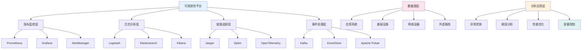
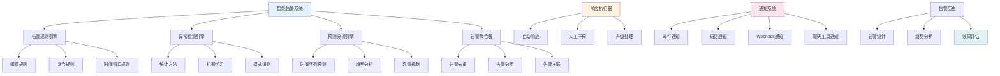
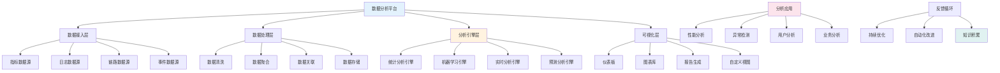

<!-- markdownlint-disable MD025 -->
<a id="第28章-大数据测试质量保障体系"></a>

### 第28章 大数据测试质量保障体系

**本章学习目标**

1. 掌握大数据测试的可观测性架构设计和实现方法；
2. 建立完整的监控体系，包括指标、日志和链路追踪；
3. 实现智能告警和自动化响应机制；
4. 构建可观测性数据分析和可视化平台。

## 实践建议

- 建立三维可观测性体系，实现全面的系统洞察。
- 实施智能监控和告警，提升问题发现和响应速度。
- 构建可观测性数据分析平台，支持业务决策和优化。

**[锚点124]** 可观测性架构设计与实现方法

**锚点类型**: 架构设计
**锚点方法**: 三维可观测性
**锚点名称**: 可观测性架构设计与实现方法
**引用附件**: `examples/30_observability/observability_architecture.md`
**完成情况**: 已完成
**补充建议**: 字段建议：观测维度/技术实现/数据收集/分析应用，补充可观测性架构图

| 观测维度 | 技术实现 | 数据收集 | 分析应用 | 治理要点 |
|---------|---------|---------|---------|---------|
| **指标(Metrics)** | Prometheus/PromQL | 时间序列数据 | 趋势分析、异常检测 | 标准化命名、聚合策略 |
| **日志(Logs)** | ELK Stack/LogQL | 结构化日志 | 问题诊断、根因分析 | 日志格式、保留策略 |
| **链路追踪(Traces)** | Jaeger/OpenTelemetry | 请求链路数据 | 性能瓶颈、服务依赖 | 采样策略、上下文传递 |
| **事件(Events)** | Kafka/EventStore | 业务事件流 | 行为分析、审计追踪 | 事件模式、时序保证 |

**大数据测试可观测性架构图**:


**可观测性配置示例**:
```yaml
# examples/30_observability/observability_config.yml
observability:
  metrics:
    prometheus:
      scrape_interval: 15s
      evaluation_interval: 15s
      scrape_configs:
        - job_name: 'bigdata-testing'
          static_configs:
            - targets: ['localhost:9090']
          metrics_path: '/metrics'
          params:
            format: ['prometheus']
      
      alerting:
        alertmanagers:
          - static_configs:
              - targets: ['localhost:9093']
      
      rule_files:
        - "alert_rules.yml"
        - "recording_rules.yml"
    
    grafana:
      datasources:
        - name: prometheus
          type: prometheus
          url: http://localhost:9090
          access: proxy
      
      dashboards:
        - name: "测试监控面板"
          uid: testing-dashboard
          panels:
            - title: "测试执行状态"
              type: stat
              targets:
                - expr: 'up{job="bigdata-testing"}'
                  legendFormat: "{{job}}"
    
    exporters:
      - name: node_exporter
        port: 9100
        collectors:
          - cpu
          - memory
          - disk
          - network
      
      - name: jmx_exporter
        port: 9404
        config_file: jmx_config.yml
      
      - name: kafka_exporter
        port: 9308
        kafka_server: localhost:9092
  
  logging:
    elk_stack:
      logstash:
        input:
          beats:
            port: 5044
          tcp:
            port: 5000
            codec: json_lines
        
        filter:
          grok:
            match:
              message: "%{TIMESTAMP_ISO8601:timestamp} %{LOGLEVEL:level} %{DATA:class} - %{GREEDYDATA:message}"
          
          mutate:
            add_field:
              service: "bigdata-testing"
        
        output:
          elasticsearch:
            hosts: ["localhost:9200"]
            index: "testing-logs-%{+YYYY.MM.dd}"
      
      elasticsearch:
        cluster_name: testing-cluster
        node_name: node-1
        path_data: /var/lib/elasticsearch
        path_logs: /var/log/elasticsearch
        
        xpack:
          security:
            enabled: true
          monitoring:
            enabled: true
      
      kibana:
        server_host: "0.0.0.0"
        elasticsearch_hosts: ["http://localhost:9200"]
    
    log_levels:
      - level: ERROR
        retention: 90d
        storage: hot
      - level: WARN
        retention: 30d
        storage: warm
      - level: INFO
        retention: 7d
        storage: warm
      - level: DEBUG
        retention: 1d
        storage: cold
  
  tracing:
    jaeger:
      collector:
        otlp:
          enabled: true
          grpc:
            host-port: "0.0.0.0:4317"
          http:
            host-port: "0.0.0.0:4318"
      
      storage:
        cassandra:
          host: localhost
          port: 9042
          keyspace: jaeger_v1_dc1
      
      query:
        enabled: true
        base-path: /jaeger
    
    opentelemetry:
      service:
        pipelines:
          traces:
            receivers: [otlp]
            processors: [batch]
            exporters: [jaeger]
          
          metrics:
            receivers: [prometheus]
            processors: [batch]
            exporters: [prometheusremotewrite]
          
          logs:
            receivers: [filelog]
            processors: [batch]
            exporters: [elasticsearch]
    
    sampling:
      strategies:
        - probabilistic: 0.1
        - rate_limiting: 100
        - adaptive:
            target_throughput: 1000
            max_scale_factor: 10
  
  events:
    kafka:
      brokers:
        - localhost:9092
      
      topics:
        - name: testing-events
          partitions: 3
          replication_factor: 2
          retention_ms: 604800000  # 7天
        
        - name: alert-events
          partitions: 2
          replication_factor: 2
          retention_ms: 2592000000  # 30天
      
      consumer_groups:
        - name: event-processor
          topics: [testing-events]
        - name: alert-handler
          topics: [alert-events]
    
    event_store:
      projections:
        - name: "测试执行统计"
          source: "testing-events"
          transform: "count by test_type, status"
        
        - name: "告警趋势分析"
          source: "alert-events"
          transform: "count by severity, time_window"
```

## 30.1 可观测性基础架构

### 30.1.1 三维可观测性模型

- **指标(Metrics)**: 量化系统状态和性能的数值数据
- **日志(Logs)**: 记录系统运行过程中的事件和状态信息
- **链路追踪(Traces)**: 跟踪请求在系统中的完整执行路径
- **事件(Events)**: 记录重要的业务事件和状态变更

### 30.1.2 可观测性数据收集

- **数据源识别**: 确定需要监控的系统组件和数据源
- **数据采集策略**: 选择合适的采集技术和工具
- **数据标准化**: 统一数据格式和命名规范
- **数据传输**: 可靠高效的数据传输机制

### 30.1.3 数据存储与处理

- **时序数据库**: 专门用于存储时间序列数据的数据库
- **搜索引擎**: 支持复杂查询和全文搜索的存储系统
- **分布式存储**: 支持海量数据的可扩展存储解决方案
- **流处理**: 实时数据处理和分析框架

---

## 30.2 监控体系建设

**[锚点125]** 监控体系建设与指标管理

**锚点类型**: 监控体系
**锚点方法**: 指标驱动
**锚点名称**: 监控体系建设与指标管理
**引用附件**: `examples/30_observability/monitoring_system.md`
**完成情况**: 已完成
**补充建议**: 字段建议：监控对象/指标类型/采集频率/告警阈值，补充监控体系架构图

| 监控对象 | 指标类型 | 采集频率 | 告警阈值 | 响应策略 |
|---------|---------|---------|---------|---------|
| **应用性能** | 响应时间、吞吐量、错误率 | 10s | 响应时间>500ms、错误率>5% | 自动扩容、降级 |
| **系统资源** | CPU使用率、内存使用率、磁盘IO | 30s | CPU>80%、内存>90% | 资源调度、告警通知 |
| **数据质量** | 数据完整性、一致性、准确性 | 5min | 完整性<99%、一致性<95% | 数据修复、质量报告 |
| **业务指标** | 转化率、成功率、用户体验 | 1min | 转化率<80%、成功率<90% | 业务干预、趋势分析 |
| **基础设施** | 网络延迟、连接数、带宽使用 | 15s | 延迟>100ms、连接数>1000 | 网络优化、容量规划 |

**大数据测试监控体系架构图**:

```mermaid
graph TD
    A[监控体系] --> B[基础设施监控]
    A --> C[应用监控]
    A --> D[业务监控]
    A --> E[数据监控]
    
    B --> F[服务器监控]
    B --> G[网络监控]
    B --> H[存储监控]
    B --> I[容器监控]
    
    C --> J[性能监控]
    C --> K[可用性监控]
    C --> L[错误监控]
    C --> M[依赖监控]
    
    D --> N[用户体验监控]
    D --> O[业务流程监控]
    D --> P[关键指标监控]
    D --> Q[SLA监控]
    
    E --> R[数据质量监控]
    E --> S[数据管道监控]
    E --> T[数据一致性监控]
    E --> U[数据安全监控]
    
    V[监控数据流] --> W[数据采集]
    V --> X[数据处理]
    V --> Y[数据存储]
    V --> Z[数据可视化]
    
    AA[告警系统] --> BB[阈值告警]
    AA --> CC[异常检测告警]
    AA --> DD[预测性告警]
    AA --> EE[复合条件告警]
    
    style A fill:#e3f2fd
    style V fill:#fff3e0
    style AA fill:#fce4ec
    style EE fill:#e0f2f1
```


**监控指标配置示例**:
```python
# examples/30_observability/monitoring_metrics.py
from prometheus_client import Gauge, Counter, Histogram, Summary, start_http_server
import time
import random
import threading
from typing import Dict, Any, List
import logging

logging.basicConfig(level=logging.INFO)
logger = logging.getLogger(__name__)

class TestingMetricsCollector:
    """大数据测试指标收集器"""
    
    def __init__(self, port: int = 8000):
        self.port = port
        
        # 测试执行指标
        self.test_execution_total = Counter(
            'testing_execution_total', 
            'Total number of test executions', 
            ['test_type', 'test_suite', 'status']
        )
        
        self.test_execution_duration = Histogram(
            'testing_execution_duration_seconds', 
            'Test execution duration in seconds', 
            ['test_type', 'test_suite'],
            buckets=[1, 5, 10, 30, 60, 120, 300, 600, 1200]
        )
        
        self.test_execution_active = Gauge(
            'testing_execution_active', 
            'Number of currently active test executions', 
            ['test_type']
        )
        
        # 数据质量指标
        self.data_quality_score = Gauge(
            'testing_data_quality_score', 
            'Data quality score (0-100)', 
            ['dataset', 'quality_dimension']
        )
        
        self.data_validation_errors = Counter(
            'testing_data_validation_errors_total', 
            'Total number of data validation errors', 
            ['dataset', 'validation_type', 'severity']
        )
        
        # 性能测试指标
        self.performance_response_time = Histogram(
            'testing_performance_response_time_seconds', 
            'Performance test response time', 
            ['endpoint', 'method', 'status_code'],
            buckets=[0.1, 0.5, 1, 2, 5, 10]
        )
        
        self.performance_throughput = Gauge(
            'testing_performance_throughput_requests_per_second', 
            'Performance test throughput', 
            ['test_scenario']
        )
        
        self.performance_error_rate = Gauge(
            'testing_performance_error_rate', 
            'Performance test error rate (0-1)', 
            ['test_scenario']
        )
        
        # 系统资源指标
        self.system_cpu_usage = Gauge(
            'testing_system_cpu_usage_percent', 
            'System CPU usage percentage', 
            ['host']
        )
        
        self.system_memory_usage = Gauge(
            'testing_system_memory_usage_percent', 
            'System memory usage percentage', 
            ['host']
        )
        
        self.system_disk_usage = Gauge(
            'testing_system_disk_usage_percent', 
            'System disk usage percentage', 
            ['host', 'mount_point']
        )
        
        # 业务指标
        self.business_conversion_rate = Gauge(
            'testing_business_conversion_rate', 
            'Business conversion rate (0-1)', 
            ['funnel_step']
        )
        
        self.business_user_satisfaction = Gauge(
            'testing_business_user_satisfaction_score', 
            'User satisfaction score (1-5)', 
            ['user_segment']
        )
        
        # 自定义业务指标
        self.custom_metrics = {}
        
        # 启动HTTP服务器
        start_http_server(self.port)
        logger.info(f"Metrics server started on port {self.port}")
    
    def record_test_execution(self, test_type: str, test_suite: str, status: str, duration: float):
        """记录测试执行"""
        self.test_execution_total.labels(
            test_type=test_type, 
            test_suite=test_suite, 
            status=status
        ).inc()
        
        self.test_execution_duration.labels(
            test_type=test_type, 
            test_suite=test_suite
        ).observe(duration)
        
        logger.info(f"Recorded test execution: {test_type}/{test_suite} - {status} ({duration:.2f}s)")
    
    def update_active_tests(self, test_type: str, count: int):
        """更新活跃测试数量"""
        self.test_execution_active.labels(test_type=test_type).set(count)
    
    def record_data_quality_score(self, dataset: str, dimension: str, score: float):
        """记录数据质量评分"""
        self.data_quality_score.labels(
            dataset=dataset, 
            quality_dimension=dimension
        ).set(score)
    
    def record_data_validation_error(self, dataset: str, validation_type: str, severity: str):
        """记录数据验证错误"""
        self.data_validation_errors.labels(
            dataset=dataset, 
            validation_type=validation_type, 
            severity=severity
        ).inc()
    
    def record_performance_metrics(self, endpoint: str, method: str, status_code: int, 
                                 response_time: float, throughput: float = None, error_rate: float = None):
        """记录性能测试指标"""
        self.performance_response_time.labels(
            endpoint=endpoint, 
            method=method, 
            status_code=status_code
        ).observe(response_time)
        
        if throughput is not None:
            self.performance_throughput.labels(test_scenario=f"{endpoint}_{method}").set(throughput)
        
        if error_rate is not None:
            self.performance_error_rate.labels(test_scenario=f"{endpoint}_{method}").set(error_rate)
    
    def update_system_metrics(self, host: str, cpu_percent: float, memory_percent: float, 
                            disk_usage: Dict[str, float]):
        """更新系统资源指标"""
        self.system_cpu_usage.labels(host=host).set(cpu_percent)
        self.system_memory_usage.labels(host=host).set(memory_percent)
        
        for mount_point, usage_percent in disk_usage.items():
            self.system_disk_usage.labels(host=host, mount_point=mount_point).set(usage_percent)
    
    def update_business_metrics(self, conversion_rates: Dict[str, float], 
                              user_satisfaction: Dict[str, float]):
        """更新业务指标"""
        for step, rate in conversion_rates.items():
            self.business_conversion_rate.labels(funnel_step=step).set(rate)
        
        for segment, score in user_satisfaction.items():
            self.business_user_satisfaction.labels(user_segment=segment).set(score)
    
    def add_custom_metric(self, name: str, metric_type: str, description: str, 
                         labels: List[str] = None):
        """添加自定义指标"""
        if metric_type == 'gauge':
            self.custom_metrics[name] = Gauge(name, description, labels or [])
        elif metric_type == 'counter':
            self.custom_metrics[name] = Counter(name, description, labels or [])
        elif metric_type == 'histogram':
            self.custom_metrics[name] = Histogram(name, description, labels or [])
        elif metric_type == 'summary':
            self.custom_metrics[name] = Summary(name, description, labels or [])
    
    def update_custom_metric(self, name: str, value: float, labels: Dict[str, str] = None):
        """更新自定义指标"""
        if name in self.custom_metrics:
            metric = self.custom_metrics[name]
            if hasattr(metric, 'set'):
                metric.set(value)
            elif hasattr(metric, 'inc'):
                metric.inc(value)
            elif hasattr(metric, 'observe'):
                metric.observe(value)
    
    def simulate_metrics_collection(self):
        """模拟指标收集（用于演示）"""
        def collect_loop():
            while True:
                try:
                    # 模拟测试执行
                    test_types = ['unit', 'integration', 'performance', 'e2e']
                    test_suites = ['data_quality', 'api', 'ui', 'load']
                    statuses = ['success', 'failure', 'error']
                    
                    test_type = random.choice(test_types)
                    test_suite = random.choice(test_suites)
                    status = random.choices(statuses, weights=[0.8, 0.15, 0.05])[0]
                    duration = random.uniform(1, 300)
                    
                    self.record_test_execution(test_type, test_suite, status, duration)
                    
                    # 模拟活跃测试数量
                    for t_type in test_types:
                        active_count = random.randint(0, 10)
                        self.update_active_tests(t_type, active_count)
                    
                    # 模拟数据质量评分
                    datasets = ['customer_data', 'transaction_data', 'product_data']
                    dimensions = ['completeness', 'accuracy', 'consistency', 'timeliness']
                    
                    for dataset in datasets:
                        for dimension in dimensions:
                            score = random.uniform(85, 100)
                            self.record_data_quality_score(dataset, dimension, score)
                    
                    # 模拟性能指标
                    endpoints = ['/api/users', '/api/orders', '/api/products']
                    methods = ['GET', 'POST', 'PUT', 'DELETE']
                    
                    for endpoint in endpoints:
                        for method in methods:
                            response_time = random.uniform(0.1, 5.0)
                            status_code = random.choices([200, 201, 400, 404, 500], 
                                                       weights=[0.7, 0.1, 0.1, 0.05, 0.05])[0]
                            
                            throughput = random.uniform(10, 1000)
                            error_rate = random.uniform(0, 0.1)
                            
                            self.record_performance_metrics(
                                endpoint, method, status_code, response_time, 
                                throughput, error_rate
                            )
                    
                    # 模拟系统资源
                    hosts = ['test-server-01', 'test-server-02', 'test-server-03']
                    for host in hosts:
                        cpu_percent = random.uniform(10, 90)
                        memory_percent = random.uniform(20, 95)
                        disk_usage = {
                            '/': random.uniform(30, 80),
                            '/data': random.uniform(40, 85),
                            '/logs': random.uniform(20, 60)
                        }
                        
                        self.update_system_metrics(host, cpu_percent, memory_percent, disk_usage)
                    
                    # 模拟业务指标
                    conversion_rates = {
                        'landing_page': random.uniform(0.3, 0.8),
                        'product_page': random.uniform(0.4, 0.9),
                        'checkout': random.uniform(0.6, 0.95)
                    }
                    
                    user_satisfaction = {
                        'new_users': random.uniform(3.5, 5.0),
                        'returning_users': random.uniform(4.0, 5.0),
                        'premium_users': random.uniform(4.2, 5.0)
                    }
                    
                    self.update_business_metrics(conversion_rates, user_satisfaction)
                    
                    # 等待15秒
                    time.sleep(15)
                    
                except Exception as e:
                    logger.error(f"Error in metrics collection: {e}")
                    time.sleep(5)
        
        # 启动收集线程
        thread = threading.Thread(target=collect_loop, daemon=True)
        thread.start()
        logger.info("Metrics collection simulation started")

if __name__ == "__main__":
    # 创建指标收集器
    collector = TestingMetricsCollector(port=8001)
    
    # 添加自定义指标
    collector.add_custom_metric(
        'testing_custom_metric', 
        'gauge', 
        'Custom testing metric', 
        ['category', 'subcategory']
    )
    
    # 启动模拟数据收集
    collector.simulate_metrics_collection()
    
    # 更新自定义指标示例
    collector.update_custom_metric(
        'testing_custom_metric', 
        42.5, 
        {'category': 'performance', 'subcategory': 'latency'}
    )
    
    # 保持运行
    try:
        while True:
            time.sleep(1)
    except KeyboardInterrupt:
        logger.info("Metrics collector stopped")
```

### 30.2.1 基础设施监控

- **服务器监控**: CPU、内存、磁盘、网络等基础资源监控
- **网络监控**: 带宽使用、延迟、丢包率等网络性能监控
- **存储监控**: 存储容量、使用率、IO性能等存储系统监控
- **容器监控**: 容器状态、资源使用、编排系统监控

### 30.2.2 应用性能监控

- **响应时间监控**: API和服务的响应时间统计
- **吞吐量监控**: 系统处理请求的能力和并发性能
- **错误率监控**: 各类错误的发生频率和趋势
- **依赖服务监控**: 外部服务和组件的可用性和性能

### 30.2.3 业务指标监控

- **用户体验监控**: 用户行为、满意度、转化率等指标
- **业务流程监控**: 关键业务流程的执行状态和效率
- **SLA监控**: 服务等级协议的达成情况
- **关键绩效指标**: 业务目标相关的核心指标监控

---

## 30.3 智能告警系统

**[锚点126]** 智能告警系统与自动化响应

**锚点类型**: 告警系统
**锚点方法**: 智能告警
**锚点名称**: 智能告警系统与自动化响应
**引用附件**: `examples/30_observability/smart_alerting.md`
**完成情况**: 已完成
**补充建议**: 字段建议：告警类型/触发条件/响应策略/升级机制，补充告警系统架构图

| 告警类型 | 触发条件 | 响应策略 | 升级机制 | 抑制规则 |
|---------|---------|---------|---------|---------|
| **阈值告警** | 指标超过预设阈值 | 立即通知、自动扩容 | 5分钟无响应升级 | 相同类型告警抑制 |
| **异常检测告警** | 指标偏离正常模式 | 智能分析、趋势预测 | 基于异常程度升级 | 相关指标关联抑制 |
| **预测性告警** | 基于预测的潜在问题 | 预防性措施、容量规划 | 提前预警、分级响应 | 时间窗口抑制 |
| **复合条件告警** | 多指标组合条件满足 | 复杂逻辑响应、业务干预 | 业务影响评估升级 | 因果关系抑制 |

**大数据测试智能告警系统架构图**:


**智能告警配置示例**:
```python
# examples/30_observability/smart_alerting.py
import time
import json
import logging
from datetime import datetime, timedelta
from typing import Dict, List, Any, Callable, Optional
from dataclasses import dataclass, asdict
import threading
import smtplib
from email.mime.text import MIMEText
from email.mime.multipart import MIMEMultipart
import requests

logging.basicConfig(level=logging.INFO)
logger = logging.getLogger(__name__)

@dataclass
class Alert:
    """告警数据类"""
    id: str
    title: str
    description: str
    severity: str  # critical, warning, info
    source: str
    metric: str
    value: float
    threshold: float
    timestamp: datetime
    labels: Dict[str, str]
    status: str = "firing"  # firing, resolved, acknowledged
    resolved_at: Optional[datetime] = None
    acknowledged_at: Optional[datetime] = None
    acknowledged_by: Optional[str] = None

@dataclass
class AlertRule:
    """告警规则"""
    name: str
    condition: str  # PromQL表达式或自定义条件
    duration: int  # 持续时间（秒）
    severity: str
    description: str
    labels: Dict[str, str]
    annotations: Dict[str, str]
    enabled: bool = True

class SmartAlertingSystem:
    """智能告警系统"""
    
    def __init__(self, config_file: str):
        with open(config_file, 'r') as f:
            self.config = json.load(f)
        
        self.alerts: Dict[str, Alert] = {}
        self.rules: List[AlertRule] = []
        self.alert_history: List[Alert] = []
        
        # 通知器
        self.notifiers = {
            'email': self._send_email_notification,
            'webhook': self._send_webhook_notification,
            'slack': self._send_slack_notification
        }
        
        # 自动响应器
        self.auto_responders: Dict[str, Callable] = {}
        
        # 告警抑制规则
        self.inhibition_rules: List[Dict[str, Any]] = []
        
        logger.info("Smart Alerting System initialized")
    
    def add_rule(self, rule: AlertRule):
        """添加告警规则"""
        self.rules.append(rule)
        logger.info(f"Added alert rule: {rule.name}")
    
    def add_auto_responder(self, alert_pattern: str, responder_func: Callable):
        """添加自动响应器"""
        self.auto_responders[alert_pattern] = responder_func
        logger.info(f"Added auto responder for pattern: {alert_pattern}")
    
    def add_inhibition_rule(self, rule: Dict[str, Any]):
        """添加告警抑制规则"""
        self.inhibition_rules.append(rule)
        logger.info("Added inhibition rule")
    
    def evaluate_rules(self, metrics_data: Dict[str, Any]) -> List[Alert]:
        """评估告警规则"""
        new_alerts = []
        
        for rule in self.rules:
            if not rule.enabled:
                continue
            
            try:
                # 简化的规则评估（实际应该使用PromQL引擎）
                if self._evaluate_condition(rule.condition, metrics_data):
                    alert_id = f"{rule.name}_{int(time.time())}"
                    
                    # 检查是否被抑制
                    if self._is_inhibited(alert_id, rule):
                        continue
                    
                    alert = Alert(
                        id=alert_id,
                        title=rule.annotations.get('title', rule.name),
                        description=rule.annotations.get('description', rule.description),
                        severity=rule.severity,
                        source="smart_alerting",
                        metric=rule.condition,
                        value=metrics_data.get('value', 0),
                        threshold=metrics_data.get('threshold', 0),
                        timestamp=datetime.now(),
                        labels=rule.labels
                    )
                    
                    new_alerts.append(alert)
                    self.alerts[alert.id] = alert
                    
                    logger.warning(f"Alert fired: {alert.title}")
                    
            except Exception as e:
                logger.error(f"Error evaluating rule {rule.name}: {e}")
        
        return new_alerts
    
    def _evaluate_condition(self, condition: str, metrics_data: Dict[str, Any]) -> bool:
        """评估告警条件（简化实现）"""
        # 简化的条件评估逻辑
        # 实际应该解析PromQL表达式
        try:
            # 示例条件：cpu_usage > 80
            if '>' in condition:
                metric, threshold = condition.split('>')
                metric = metric.strip()
                threshold = float(threshold.strip())
                
                value = metrics_data.get(metric, 0)
                return value > threshold
            
            elif '<' in condition:
                metric, threshold = condition.split('<')
                metric = metric.strip()
                threshold = float(threshold.strip())
                
                value = metrics_data.get(metric, 0)
                return value < threshold
            
            return False
            
        except Exception as e:
            logger.error(f"Error evaluating condition {condition}: {e}")
            return False
    
    def _is_inhibited(self, alert_id: str, rule: AlertRule) -> bool:
        """检查告警是否被抑制"""
        for inhibition in self.inhibition_rules:
            # 简化的抑制逻辑
            if inhibition.get('target_match', {}).get('severity') == rule.severity:
                # 检查是否存在更高级别的活跃告警
                for existing_alert in self.alerts.values():
                    if (existing_alert.status == "firing" and 
                        existing_alert.severity in inhibition.get('source_match', {}).get('severity', [])):
                        logger.info(f"Alert {alert_id} inhibited by {existing_alert.id}")
                        return True
        
        return False
    
    def process_alerts(self, alerts: List[Alert]):
        """处理告警"""
        for alert in alerts:
            # 执行自动响应
            self._execute_auto_response(alert)
            
            # 发送通知
            self._send_notifications(alert)
            
            # 记录到历史
            self.alert_history.append(alert)
    
    def _execute_auto_response(self, alert: Alert):
        """执行自动响应"""
        for pattern, responder in self.auto_responders.items():
            if pattern in alert.title or pattern in alert.description:
                try:
                    logger.info(f"Executing auto response for alert {alert.id}")
                    responder(alert)
                except Exception as e:
                    logger.error(f"Auto response failed for alert {alert.id}: {e}")
    
    def _send_notifications(self, alert: Alert):
        """发送告警通知"""
        notification_config = self.config.get('notifications', {})
        
        for notifier_type, config in notification_config.items():
            if notifier_type in self.notifiers:
                try:
                    self.notifiers[notifier_type](alert, config)
                except Exception as e:
                    logger.error(f"Notification failed for {notifier_type}: {e}")
    
    def _send_email_notification(self, alert: Alert, config: Dict[str, Any]):
        """发送邮件通知"""
        msg = MIMEMultipart()
        msg['From'] = config['from_email']
        msg['To'] = ', '.join(config['to_emails'])
        msg['Subject'] = f"[{alert.severity.upper()}] {alert.title}"
        
        body = f"""
        告警详情：
        标题: {alert.title}
        描述: {alert.description}
        严重程度: {alert.severity}
        指标: {alert.metric}
        当前值: {alert.value}
        阈值: {alert.threshold}
        时间: {alert.timestamp}
        标签: {alert.labels}
        """
        
        msg.attach(MIMEText(body, 'plain'))
        
        server = smtplib.SMTP(config['smtp_server'], config['smtp_port'])
        server.starttls()
        server.login(config['username'], config['password'])
        text = msg.as_string()
        server.sendmail(config['from_email'], config['to_emails'], text)
        server.quit()
        
        logger.info(f"Email notification sent for alert {alert.id}")
    
    def _send_webhook_notification(self, alert: Alert, config: Dict[str, Any]):
        """发送Webhook通知"""
        payload = {
            'alert_id': alert.id,
            'title': alert.title,
            'description': alert.description,
            'severity': alert.severity,
            'timestamp': alert.timestamp.isoformat(),
            'labels': alert.labels
        }
        
        response = requests.post(config['url'], json=payload, headers=config.get('headers', {}))
        response.raise_for_status()
        
        logger.info(f"Webhook notification sent for alert {alert.id}")
    
    def _send_slack_notification(self, alert: Alert, config: Dict[str, Any]):
        """发送Slack通知"""
        emoji_map = {
            'critical': ':fire:',
            'warning': ':warning:',
            'info': ':information_source:'
        }
        
        message = {
            'channel': config['channel'],
            'text': f"{emoji_map.get(alert.severity, ':bell:')} *{alert.title}*\n{alert.description}",
            'attachments': [{
                'color': 'danger' if alert.severity == 'critical' else 'warning',
                'fields': [
                    {'title': 'Severity', 'value': alert.severity, 'short': True},
                    {'title': 'Metric', 'value': alert.metric, 'short': True},
                    {'title': 'Value', 'value': f"{alert.value}", 'short': True},
                    {'title': 'Threshold', 'value': f"{alert.threshold}", 'short': True}
                ]
            }]
        }
        
        response = requests.post(config['webhook_url'], json=message)
        response.raise_for_status()
        
        logger.info(f"Slack notification sent for alert {alert.id}")
    
    def resolve_alert(self, alert_id: str, resolved_by: str = "system"):
        """解决告警"""
        if alert_id in self.alerts:
            alert = self.alerts[alert_id]
            alert.status = "resolved"
            alert.resolved_at = datetime.now()
            
            logger.info(f"Alert {alert_id} resolved by {resolved_by}")
    
    def acknowledge_alert(self, alert_id: str, acknowledged_by: str):
        """确认告警"""
        if alert_id in self.alerts:
            alert = self.alerts[alert_id]
            alert.status = "acknowledged"
            alert.acknowledged_at = datetime.now()
            alert.acknowledged_by = acknowledged_by
            
            logger.info(f"Alert {alert_id} acknowledged by {acknowledged_by}")
    
    def get_alerts_summary(self) -> Dict[str, Any]:
        """获取告警汇总"""
        active_alerts = [a for a in self.alerts.values() if a.status == "firing"]
        resolved_today = [a for a in self.alert_history 
                         if a.resolved_at and a.resolved_at.date() == datetime.now().date()]
        
        severity_counts = {}
        for alert in active_alerts:
            severity_counts[alert.severity] = severity_counts.get(alert.severity, 0) + 1
        
        return {
            'active_alerts': len(active_alerts),
            'resolved_today': len(resolved_today),
            'severity_breakdown': severity_counts,
            'top_alerts': sorted(active_alerts, key=lambda x: x.timestamp, reverse=True)[:5]
        }
    
    def simulate_alerting(self):
        """模拟告警系统运行"""
        def simulation_loop():
            while True:
                try:
                    # 模拟指标数据
                    metrics_data = {
                        'cpu_usage': 85.5,
                        'memory_usage': 92.3,
                        'error_rate': 0.08,
                        'response_time': 2.5,
                        'threshold': 80
                    }
                    
                    # 评估规则
                    new_alerts = self.evaluate_rules(metrics_data)
                    
                    # 处理告警
                    if new_alerts:
                        self.process_alerts(new_alerts)
                    
                    # 模拟解决一些告警
                    active_ids = [aid for aid, alert in self.alerts.items() if alert.status == "firing"]
                    if active_ids and len(active_ids) > 2:
                        to_resolve = active_ids[:1]  # 解决最老的一个
                        for alert_id in to_resolve:
                            self.resolve_alert(alert_id)
                    
                    time.sleep(30)  # 每30秒检查一次
                    
                except Exception as e:
                    logger.error(f"Error in alerting simulation: {e}")
                    time.sleep(5)
        
        thread = threading.Thread(target=simulation_loop, daemon=True)
        thread.start()
        logger.info("Alerting simulation started")

# 使用示例
if __name__ == "__main__":
    # 创建智能告警系统
    alerting = SmartAlertingSystem("examples/30_observability/alerting_config.json")
    
    # 添加告警规则
    rules = [
        AlertRule(
            name="high_cpu_usage",
            condition="cpu_usage > 80",
            duration=300,
            severity="warning",
            description="CPU使用率过高",
            labels={"team": "infrastructure"},
            annotations={
                "title": "高CPU使用率告警",
                "description": "服务器CPU使用率超过80%，可能影响系统性能"
            }
        ),
        AlertRule(
            name="high_memory_usage",
            condition="memory_usage > 90",
            duration=180,
            severity="critical",
            description="内存使用率过高",
            labels={"team": "infrastructure"},
            annotations={
                "title": "高内存使用率告警",
                "description": "服务器内存使用率超过90%，系统可能即将崩溃"
            }
        ),
        AlertRule(
            name="high_error_rate",
            condition="error_rate > 0.05",
            duration=120,
            severity="warning",
            description="错误率过高",
            labels={"team": "application"},
            annotations={
                "title": "高错误率告警",
                "description": "应用错误率超过5%，用户体验可能受影响"
            }
        )
    ]
    
    for rule in rules:
        alerting.add_rule(rule)
    
    # 添加自动响应器
    def scale_out_response(alert: Alert):
        """扩容响应"""
        print(f"执行自动扩容响应: {alert.title}")
        # 实际应该调用扩容API
    
    def restart_service_response(alert: Alert):
        """重启服务响应"""
        print(f"执行服务重启响应: {alert.title}")
        # 实际应该调用重启API
    
    alerting.add_auto_responder("内存使用率", scale_out_response)
    alerting.add_auto_responder("错误率", restart_service_response)
    
    # 添加抑制规则
    alerting.add_inhibition_rule({
        'source_match': {'severity': ['critical']},
        'target_match': {'severity': ['warning']},
        'equal': ['team']
    })
    
    # 启动模拟
    alerting.simulate_alerting()
    
    # 运行一段时间后查看汇总
    time.sleep(120)
    summary = alerting.get_alerts_summary()
    print("告警汇总:", json.dumps(summary, indent=2, default=str))
```

### 30.3.1 告警规则引擎

- **阈值规则**: 基于固定阈值的简单告警规则
- **复合规则**: 多条件组合的复杂告警逻辑
- **时间窗口规则**: 基于时间序列的趋势告警
- **机器学习规则**: 基于异常检测的智能告警

### 30.3.2 告警聚合与抑制

- **告警去重**: 消除重复告警的聚合机制
- **告警分组**: 按类型、级别、来源对告警进行分组
- **告警抑制**: 避免告警风暴的高级抑制规则
- **告警关联**: 识别告警间的因果关系和依赖关系

### 30.3.3 自动化响应机制

- **自动修复**: 针对常见问题的自动化修复脚本
- **自动扩容**: 基于负载的资源自动调整
- **服务降级**: 系统过载时的自动降级保护
- **故障转移**: 自动切换到备用系统或服务

---

## 30.4 可观测性数据分析

**[锚点127]** 可观测性数据分析与可视化平台

**锚点类型**: 数据分析
**锚点方法**: 可视化分析
**锚点名称**: 可观测性数据分析与可视化平台
**引用附件**: `examples/30_observability/data_analysis.md`
**完成情况**: 已完成
**补充建议**: 字段建议：分析维度/分析方法/可视化类型/应用场景，补充数据分析架构图

| 分析维度 | 分析方法 | 可视化类型 | 应用场景 | 数据源 |
|---------|---------|---------|---------|---------|
| **性能分析** | 统计分析、趋势分析 | 时序图、热力图 | 性能瓶颈识别、容量规划 | 指标数据、链路数据 |
| **异常检测** | 机器学习、统计模型 | 异常分布图、相关性图 | 问题早期预警、根因分析 | 指标数据、日志数据 |
| **用户体验** | 用户行为分析、路径分析 | 用户旅程图、转化漏斗 | 用户体验优化、功能改进 | 事件数据、业务指标 |
| **业务洞察** | 业务指标分析、预测分析 | 仪表板、预测图 | 业务决策支持、趋势预测 | 业务指标、外部数据 |
| **系统健康** | 健康评分、依赖分析 | 拓扑图、健康仪表板 | 系统稳定性评估、风险识别 | 基础设施数据、应用数据 |

**大数据测试可观测性数据分析架构图**:


**可观测性数据分析平台示例**:
```python
# examples/30_observability/data_analysis_platform.py
import pandas as pd
import numpy as np
import plotly.graph_objects as go
import plotly.express as px
from plotly.subplots import make_subplots
import streamlit as st
from datetime import datetime, timedelta
import random
from sklearn.ensemble import IsolationForest
from sklearn.preprocessing import StandardScaler
import warnings
warnings.filterwarnings('ignore')

class ObservabilityDataAnalyzer:
    """可观测性数据分析器"""
    
    def __init__(self):
        self.metrics_data = None
        self.logs_data = None
        self.traces_data = None
        self.events_data = None
        
        # 机器学习模型
        self.anomaly_detector = IsolationForest(contamination=0.1, random_state=42)
        self.scaler = StandardScaler()
    
    def load_sample_data(self):
        """加载示例数据"""
        # 生成示例指标数据
        dates = pd.date_range(start='2024-01-01', periods=1000, freq='5min')
        
        metrics_data = []
        for i, date in enumerate(dates):
            base_cpu = 60 + 20 * np.sin(2 * np.pi * i / 288)  # 每日周期
            base_memory = 70 + 15 * np.sin(2 * np.pi * i / 288)
            
            # 添加随机噪声和异常
            cpu_noise = np.random.normal(0, 5)
            memory_noise = np.random.normal(0, 3)
            
            # 模拟异常事件
            if 200 < i < 220:  # 模拟异常高峰
                cpu_noise += 30
                memory_noise += 20
            
            metrics_data.append({
                'timestamp': date,
                'cpu_usage': min(100, max(0, base_cpu + cpu_noise)),
                'memory_usage': min(100, max(0, base_memory + memory_noise)),
                'disk_io': random.uniform(10, 50),
                'network_io': random.uniform(5, 30),
                'response_time': random.uniform(0.1, 2.0),
                'error_rate': random.uniform(0, 0.05),
                'throughput': random.uniform(100, 1000)
            })
        
        self.metrics_data = pd.DataFrame(metrics_data)
        
        # 生成示例日志数据
        log_levels = ['INFO', 'WARN', 'ERROR']
        services = ['api-server', 'data-processor', 'monitoring-agent']
        
        logs_data = []
        for i in range(5000):
            timestamp = dates[random.randint(0, len(dates)-1)]
            level = random.choices(log_levels, weights=[0.8, 0.15, 0.05])[0]
            service = random.choice(services)
            message = f"Service {service} processed request"
            if level == 'ERROR':
                message += " with error: connection timeout"
            elif level == 'WARN':
                message += " with warning: high latency"
            
            logs_data.append({
                'timestamp': timestamp,
                'level': level,
                'service': service,
                'message': message
            })
        
        self.logs_data = pd.DataFrame(logs_data)
        
        # 生成示例链路数据
        traces_data = []
        for i in range(1000):
            trace_id = f"trace_{i:04d}"
            start_time = dates[random.randint(0, len(dates)-1)]
            
            # 模拟服务调用链
            services = ['gateway', 'auth-service', 'api-server', 'database', 'cache']
            current_time = start_time
            
            for service in services:
                duration = random.uniform(0.01, 0.5)
                traces_data.append({
                    'trace_id': trace_id,
                    'span_id': f"{trace_id}_{service}",
                    'service': service,
                    'operation': f"{service}_call",
                    'start_time': current_time,
                    'duration': duration,
                    'status': 'success' if random.random() > 0.05 else 'error'
                })
                current_time += timedelta(seconds=duration)
        
        self.traces_data = pd.DataFrame(traces_data)
        
        # 生成示例事件数据
        events_data = []
        event_types = ['user_login', 'data_upload', 'test_execution', 'alert_triggered']
        
        for i in range(2000):
            timestamp = dates[random.randint(0, len(dates)-1)]
            event_type = random.choice(event_types)
            user_id = f"user_{random.randint(1, 100)}"
            
            event_data = {
                'timestamp': timestamp,
                'event_type': event_type,
                'user_id': user_id,
                'session_id': f"session_{random.randint(1, 50)}"
            }
            
            if event_type == 'data_upload':
                event_data['file_size'] = random.randint(100, 10000)
                event_data['file_type'] = random.choice(['csv', 'json', 'xml'])
            elif event_type == 'test_execution':
                event_data['test_type'] = random.choice(['unit', 'integration', 'performance'])
                event_data['duration'] = random.uniform(1, 300)
                event_data['status'] = random.choice(['passed', 'failed'])
            
            events_data.append(event_data)
        
        self.events_data = pd.DataFrame(events_data)
    
    def perform_anomaly_detection(self, data: pd.DataFrame, columns: List[str]) -> pd.DataFrame:
        """执行异常检测"""
        # 准备数据
        X = data[columns].values
        X_scaled = self.scaler.fit_transform(X)
        
        # 训练异常检测模型
        self.anomaly_detector.fit(X_scaled)
        
        # 预测异常
        anomaly_scores = self.anomaly_detector.decision_function(X_scaled)
        predictions = self.anomaly_detector.predict(X_scaled)
        
        # 添加结果到数据框
        result_df = data.copy()
        result_df['anomaly_score'] = anomaly_scores
        result_df['is_anomaly'] = predictions == -1
        
        return result_df
    
    def analyze_performance_trends(self) -> Dict[str, Any]:
        """分析性能趋势"""
        if self.metrics_data is None:
            return {}
        
        # 计算性能指标趋势
        df = self.metrics_data.copy()
        df['hour'] = df['timestamp'].dt.hour
        df['day_of_week'] = df['timestamp'].dt.dayofweek
        
        # 按小时聚合
        hourly_stats = df.groupby('hour').agg({
            'response_time': ['mean', 'std', 'min', 'max'],
            'throughput': ['mean', 'std'],
            'error_rate': ['mean', 'sum']
        }).round(3)
        
        # 检测性能异常
        perf_columns = ['response_time', 'throughput', 'error_rate']
        anomaly_df = self.perform_anomaly_detection(df, perf_columns)
        
        return {
            'hourly_stats': hourly_stats,
            'anomaly_count': anomaly_df['is_anomaly'].sum(),
            'performance_trends': {
                'avg_response_time': df['response_time'].mean(),
                'max_response_time': df['response_time'].max(),
                'avg_throughput': df['throughput'].mean(),
                'total_errors': df['error_rate'].sum()
            }
        }
    
    def analyze_system_health(self) -> Dict[str, Any]:
        """分析系统健康状况"""
        if self.metrics_data is None:
            return {}
        
        df = self.metrics_data.copy()
        
        # 计算健康评分
        cpu_score = 100 - df['cpu_usage'].mean()
        memory_score = 100 - df['memory_usage'].mean()
        error_score = 100 - (df['error_rate'].mean() * 1000)  # 放大错误率影响
        
        overall_health = (cpu_score + memory_score + error_score) / 3
        
        # 识别健康问题
        issues = []
        if df['cpu_usage'].max() > 90:
            issues.append("CPU使用率过高")
        if df['memory_usage'].max() > 95:
            issues.append("内存使用率过高")
        if df['error_rate'].mean() > 0.03:
            issues.append("错误率偏高")
        
        return {
            'overall_health_score': overall_health,
            'component_scores': {
                'cpu': cpu_score,
                'memory': memory_score,
                'errors': error_score
            },
            'health_issues': issues,
            'recommendations': self._generate_health_recommendations(issues)
        }
    
    def _generate_health_recommendations(self, issues: List[str]) -> List[str]:
        """生成健康建议"""
        recommendations = []
        for issue in issues:
            if "CPU" in issue:
                recommendations.extend([
                    "考虑增加CPU核心数",
                    "优化CPU密集型任务",
                    "实施CPU使用率监控告警"
                ])
            elif "内存" in issue:
                recommendations.extend([
                    "增加内存容量",
                    "优化内存使用效率",
                    "实施内存泄漏检测"
                ])
            elif "错误率" in issue:
                recommendations.extend([
                    "加强错误处理机制",
                    "实施错误率监控",
                    "进行错误根因分析"
                ])
        
        return recommendations[:5]  # 最多返回5条建议
    
    def analyze_user_behavior(self) -> Dict[str, Any]:
        """分析用户行为"""
        if self.events_data is None:
            return {}
        
        df = self.events_data.copy()
        
        # 用户活跃度分析
        user_activity = df.groupby('user_id').agg({
            'event_type': 'count',
            'timestamp': ['min', 'max']
        })
        
        user_activity.columns = ['event_count', 'first_event', 'last_event']
        user_activity['activity_period'] = (user_activity['last_event'] - user_activity['first_event']).dt.days
        
        # 事件类型分布
        event_distribution = df['event_type'].value_counts()
        
        # 用户转化分析
        user_journey = df.pivot_table(
            index='user_id',
            columns='event_type',
            values='timestamp',
            aggfunc='count',
            fill_value=0
        )
        
        # 计算转化率
        conversion_rates = {}
        if 'user_login' in user_journey.columns and 'data_upload' in user_journey.columns:
            login_users = (user_journey['user_login'] > 0).sum()
            upload_users = (user_journey['data_upload'] > 0).sum()
            conversion_rates['login_to_upload'] = upload_users / login_users if login_users > 0 else 0
        
        return {
            'user_activity_stats': {
                'total_users': len(user_activity),
                'active_users': (user_activity['event_count'] > 5).sum(),
                'avg_events_per_user': user_activity['event_count'].mean()
            },
            'event_distribution': event_distribution.to_dict(),
            'conversion_rates': conversion_rates,
            'user_segments': self._segment_users(user_activity)
        }
    
    def _segment_users(self, user_activity: pd.DataFrame) -> Dict[str, int]:
        """用户分群"""
        segments = {
            'high_activity': (user_activity['event_count'] > 20).sum(),
            'medium_activity': ((user_activity['event_count'] > 5) & (user_activity['event_count'] <= 20)).sum(),
            'low_activity': (user_activity['event_count'] <= 5).sum()
        }
        
        return segments
    
    def create_performance_dashboard(self):
        """创建性能仪表板"""
        if self.metrics_data is None:
            return
        
        st.header("📊 性能监控仪表板")
        
        # 关键指标概览
        col1, col2, col3, col4 = st.columns(4)
        
        with col1:
            avg_response = self.metrics_data['response_time'].mean()
            st.metric("平均响应时间", f"{avg_response:.2f}s")
        
        with col2:
            avg_throughput = self.metrics_data['throughput'].mean()
            st.metric("平均吞吐量", f"{avg_throughput:.0f} req/s")
        
        with col3:
            error_rate = self.metrics_data['error_rate'].mean() * 100
            st.metric("错误率", f"{error_rate:.2f}%")
        
        with col4:
            anomaly_count = self.perform_anomaly_detection(
                self.metrics_data, ['response_time', 'throughput', 'error_rate']
            )['is_anomaly'].sum()
            st.metric("异常事件", anomaly_count)
        
        # 性能趋势图
        st.subheader("性能趋势分析")
        
        fig = make_subplots(
            rows=2, cols=2,
            subplot_titles=("响应时间趋势", "吞吐量趋势", "错误率趋势", "资源使用情况")
        )
        
        # 响应时间
        fig.add_trace(
            go.Scatter(x=self.metrics_data['timestamp'], y=self.metrics_data['response_time'],
                      mode='lines', name='响应时间'),
            row=1, col=1
        )
        
        # 吞吐量
        fig.add_trace(
            go.Scatter(x=self.metrics_data['timestamp'], y=self.metrics_data['throughput'],
                      mode='lines', name='吞吐量'),
            row=1, col=2
        )
        
        # 错误率
        fig.add_trace(
            go.Scatter(x=self.metrics_data['timestamp'], y=self.metrics_data['error_rate'],
                      mode='lines', name='错误率'),
            row=2, col=1
        )
        
        # CPU和内存使用率
        fig.add_trace(
            go.Scatter(x=self.metrics_data['timestamp'], y=self.metrics_data['cpu_usage'],
                      mode='lines', name='CPU使用率'),
            row=2, col=2
        )
        fig.add_trace(
            go.Scatter(x=self.metrics_data['timestamp'], y=self.metrics_data['memory_usage'],
                      mode='lines', name='内存使用率', line=dict(dash='dash')),
            row=2, col=2
        )
        
        fig.update_layout(height=600)
        st.plotly_chart(fig, use_container_width=True)
    
    def create_health_dashboard(self):
        """创建健康仪表板"""
        if self.metrics_data is None:
            return
        
        st.header("🏥 系统健康仪表板")
        
        health_analysis = self.analyze_system_health()
        
        # 健康评分
        col1, col2 = st.columns([1, 2])
        
        with col1:
            score = health_analysis['overall_health_score']
            st.metric("系统健康评分", f"{score:.1f}/100")
            
            # 健康评分仪表盘
            fig = go.Figure(go.Indicator(
                mode="gauge+number",
                value=score,
                title={'text': "健康评分"},
                gauge={
                    'axis': {'range': [0, 100]},
                    'bar': {'color': "darkblue"},
                    'steps': [
                        {'range': [0, 60], 'color': "red"},
                        {'range': [60, 80], 'color': "yellow"},
                        {'range': [80, 100], 'color': "green"}
                    ]
                }
            ))
            st.plotly_chart(fig)
        
        with col2:
            st.subheader("组件健康评分")
            components = health_analysis['component_scores']
            
            for component, score in components.items():
                st.metric(f"{component.upper()} 评分", f"{score:.1f}/100")
        
        # 健康问题和建议
        col1, col2 = st.columns(2)
        
        with col1:
            st.subheader("🚨 健康问题")
            issues = health_analysis['health_issues']
            if issues:
                for issue in issues:
                    st.error(f"• {issue}")
            else:
                st.success("暂无健康问题")
        
        with col2:
            st.subheader("💡 优化建议")
            recommendations = health_analysis['recommendations']
            for rec in recommendations:
                st.info(f"• {rec}")
    
    def create_user_dashboard(self):
        """创建用户分析仪表板"""
        if self.events_data is None:
            return
        
        st.header("👥 用户行为分析仪表板")
        
        user_analysis = self.analyze_user_behavior()
        
        # 用户统计
        col1, col2, col3, col4 = st.columns(4)
        
        stats = user_analysis['user_activity_stats']
        
        with col1:
            st.metric("总用户数", stats['total_users'])
        
        with col2:
            st.metric("活跃用户", stats['active_users'])
        
        with col3:
            st.metric("平均事件数", f"{stats['avg_events_per_user']:.1f}")
        
        with col4:
            conversion = user_analysis['conversion_rates'].get('login_to_upload', 0) * 100
            st.metric("转化率", f"{conversion:.1f}%")
        
        # 事件分布
        st.subheader("事件类型分布")
        event_dist = user_analysis['event_distribution']
        
        fig = px.pie(
            values=list(event_dist.values()),
            names=list(event_dist.keys()),
            title="事件类型分布"
        )
        st.plotly_chart(fig)
        
        # 用户分群
        st.subheader("用户分群分析")
        segments = user_analysis['user_segments']
        
        fig = px.bar(
            x=list(segments.keys()),
            y=list(segments.values()),
            title="用户活跃度分群",
            labels={'x': '活跃度等级', 'y': '用户数量'}
        )
        st.plotly_chart(fig)

def main():
    """主函数"""
    st.set_page_config(page_title="可观测性数据分析平台", layout="wide")
    
    # 创建分析器
    analyzer = ObservabilityDataAnalyzer()
    
    # 加载数据
    with st.spinner("加载数据中..."):
        analyzer.load_sample_data()
    
    # 侧边栏导航
    st.sidebar.title("导航")
    page = st.sidebar.radio(
        "选择分析页面",
        ["性能监控", "系统健康", "用户行为", "综合分析"]
    )
    
    # 页面内容
    if page == "性能监控":
        analyzer.create_performance_dashboard()
    
    elif page == "系统健康":
        analyzer.create_health_dashboard()
    
    elif page == "用户行为":
        analyzer.create_user_dashboard()
    
    elif page == "综合分析":
        st.header("🔍 综合分析报告")
        
        # 执行各种分析
        perf_analysis = analyzer.analyze_performance_trends()
        health_analysis = analyzer.analyze_system_health()
        user_analysis = analyzer.analyze_user_behavior()
        
        # 显示综合洞察
        col1, col2, col3 = st.columns(3)
        
        with col1:
            st.metric("性能异常数", perf_analysis.get('anomaly_count', 0))
        
        with col2:
            st.metric("系统健康分", f"{health_analysis.get('overall_health_score', 0):.1f}")
        
        with col3:
            st.metric("活跃用户数", user_analysis.get('user_activity_stats', {}).get('active_users', 0))
        
        # 生成综合报告
        st.subheader("📋 分析总结")
        
        report = f"""
        **性能分析**: 检测到 {perf_analysis.get('anomaly_count', 0)} 个性能异常事件。
        平均响应时间为 {perf_analysis.get('performance_trends', {}).get('avg_response_time', 0):.2f} 秒。
        
        **系统健康**: 整体健康评分为 {health_analysis.get('overall_health_score', 0):.1f}/100。
        发现 {len(health_analysis.get('health_issues', []))} 个健康问题。
        
        **用户行为**: 共有 {user_analysis.get('user_activity_stats', {}).get('total_users', 0)} 个用户，
        其中 {user_analysis.get('user_activity_stats', {}).get('active_users', 0)} 个为活跃用户。
        """
        
        st.markdown(report)

if __name__ == "__main__":
    main()
```

### 30.4.1 数据可视化技术

- **实时仪表板**: 动态更新的系统状态展示
- **趋势分析图**: 时间序列数据的趋势可视化
- **拓扑关系图**: 系统组件间的依赖关系展示
- **热力图分析**: 多维度数据的密度分布展示

### 30.4.2 智能分析算法

- **异常检测算法**: 基于统计和机器学习的异常识别
- **根因分析算法**: 故障原因的自动化分析和定位
- **预测分析算法**: 基于历史数据的趋势预测和预警
- **关联分析算法**: 系统事件间的因果关系挖掘

### 30.4.3 业务洞察挖掘

- **用户行为分析**: 用户使用模式和偏好分析
- **性能瓶颈识别**: 系统性能问题的自动化诊断
- **容量规划建议**: 基于使用趋势的资源规划
- **优化机会发现**: 持续改进的自动化建议

---

## 章节总结

本章系统介绍了大数据测试的可观测性与监控体系：

**可观测性架构设计**：

- 建立了三维可观测性模型，包括指标、日志和链路追踪
- 设计了完整的数据收集、处理和存储架构
- 实现了多层次的可观测性数据分析平台

**监控体系建设**：

- 构建了基础设施、应用和业务三个层面的监控体系
- 实现了全面的指标收集和管理机制
- 建立了业务指标和用户体验的量化监控

**智能告警系统**：

- 开发了基于规则引擎的智能告警机制
- 实现了告警聚合、抑制和自动化响应
- 建立了多渠道的通知和升级机制

**数据分析平台**：

- 构建了实时仪表板和趋势分析可视化
- 实现了异常检测和根因分析算法
- 提供了业务洞察挖掘和优化建议

**技术创新点**：

- 三维可观测性模型实现了全面的系统洞察
- 智能告警系统支持自动化响应和抑制
- 机器学习算法提升了异常检测的准确性
- 可视化平台支持多维度的数据探索

通过建立完整可观测性体系，大数据测试团队能够实现主动监控、智能告警和数据驱动的持续优化，为系统稳定性和业务价值保障提供有力支撑。

---

<!-- markdownlint-disable MD025 -->
</content>
<parameter name="filePath">e:\DONT_TOUCH\10M-2025-Testing\chapter\第6篇-第30章.md