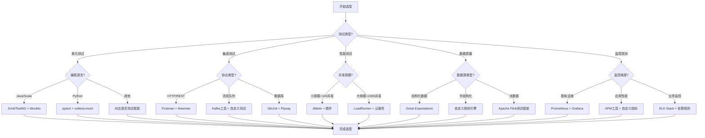
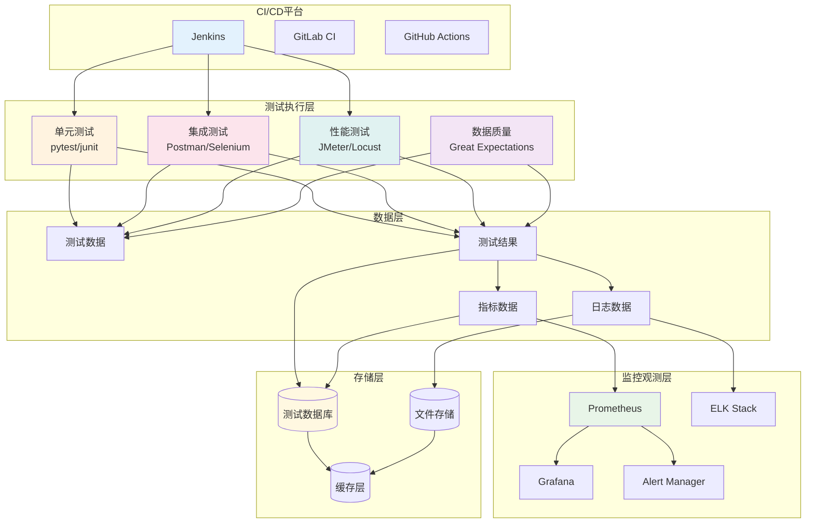

<!-- markdownlint-disable MD025 -->
<a id="第29章-大数据测试工具与平台"></a>

### 第29章 大数据测试工具与平台

**本章学习目标**

1. 掌握大数据测试工具的分类和选型框架；
2. 熟悉主流大数据测试工具的使用方法；
3. 建立测试工具链的集成和自动化能力。

## 实践建议

- 根据项目需求选择合适的测试工具组合。
**[第6篇-016]** 大数据测试工具分类与选型框架
**锚点方法**: 分类评估
**锚点名称**: 大数据测试工具分类与选型框架
**引用附件**: examples/29_chapter/testing_tools_framework.md
**完成情况**: 已完成
**补充建议**: 字段建议：工具类型/适用场景/核心功能/优势特点/选型建议，补充大数据测试工具选型决策树

| 工具类型 | 适用场景 | 核心功能 | 优势特点 | 选型建议 |
|---------|---------|---------|---------|---------|
| **单元测试工具** | 代码级测试、组件验证 | 模拟依赖、断言验证、覆盖率分析 | 快速反馈、自动化集成、精准定位 | 开源优先、框架匹配、CI/CD集成 |
| **集成测试工具** | 接口测试、服务间调用验证 | API测试、契约测试、端到端验证 | 环境模拟、数据隔离、异常处理 | 协议支持、扩展性强、监控完善 |
| **性能测试工具** | 负载测试、压力测试、容量规划 | 并发模拟、资源监控、瓶颈分析 | 分布式执行、可视化报告、趋势分析 | 企业级支持、扩展性好、报告丰富 |
| **数据质量工具** | 数据验证、血缘追踪、规则引擎 | 数据剖析、质量评分、异常检测 | 自动化监控、规则定制、可视化展示 | 规则引擎强大、集成能力强、扩展灵活 |
| **监控观测工具** | 系统监控、日志分析、告警管理 | 指标收集、日志聚合、告警规则 | 实时监控、多维度分析、智能告警 | 开源生态成熟、企业级功能完善、扩展性好 |

**大数据测试工具选型决策树**:


**大数据测试工具链架构**:
```python
# examples/29_chapter/testing_toolchain_architecture.py
from typing import Dict, List, Any, Optional
from dataclasses import dataclass
from enum import Enum
import json

class ToolCategory(Enum):
    UNIT_TESTING = "unit_testing"
    INTEGRATION_TESTING = "integration_testing"
    PERFORMANCE_TESTING = "performance_testing"
    DATA_QUALITY = "data_quality"
    MONITORING = "monitoring"
    CI_CD = "ci_cd"

class IntegrationLevel(Enum):
    NONE = "none"
    BASIC = "basic"
    ADVANCED = "advanced"
    FULLY_INTEGRATED = "fully_integrated"

@dataclass
class TestingTool:
    """测试工具定义"""
    name: str
    category: ToolCategory
    description: str
    features: List[str]
    supported_platforms: List[str]
    licensing: str
    integration_apis: List[str]
    strengths: List[str]
    limitations: List[str]

@dataclass
class ToolIntegration:
    """工具集成配置"""
    source_tool: str
    target_tool: str
    integration_type: str
    configuration: Dict[str, Any]
    data_flow: List[str]

class TestingToolchain:
    """大数据测试工具链"""

    def __init__(self):
        self.tools = self._initialize_tools()
        self.integrations = []
        self.pipeline_templates = self._initialize_pipeline_templates()

    def _initialize_tools(self) -> Dict[str, TestingTool]:
        """初始化测试工具库"""
        return {
            "pytest": TestingTool(
                name="pytest",
                category=ToolCategory.UNIT_TESTING,
                description="Python测试框架，支持参数化测试和插件扩展",
                features=["参数化测试", "fixture机制", "插件生态", "并行执行"],
                supported_platforms=["Linux", "Windows", "macOS"],
                licensing="MIT",
                integration_apis=["REST", "WebSocket", "Database"],
                strengths=["丰富的插件生态", "简洁的语法", "强大的断言"],
                limitations=["主要支持Python", "学习曲线较陡"]
            ),

            "jmeter": TestingTool(
                name="Apache JMeter",
                category=ToolCategory.PERFORMANCE_TESTING,
                description="开源负载测试工具，支持多种协议",
                features=["多协议支持", "分布式测试", "结果分析", "脚本录制"],
                supported_platforms=["Linux", "Windows", "macOS"],
                licensing="Apache 2.0",
                integration_apis=["REST", "SOAP", "JDBC", "MQTT"],
                strengths=["开源免费", "功能强大", "社区活跃"],
                limitations=["界面复杂", "资源消耗大"]
            ),

            "great_expectations": TestingTool(
                name="Great Expectations",
                category=ToolCategory.DATA_QUALITY,
                description="数据质量验证框架",
                features=["数据验证", "文档生成", "监控集成", "自定义规则"],
                supported_platforms=["Linux", "Windows", "macOS"],
                licensing="Apache 2.0",
                integration_apis=["SQL", "Spark", "Pandas", "Airflow"],
                strengths=["规则引擎强大", "文档自动生成", "集成友好"],
                limitations=["配置复杂", "学习成本高"]
            ),

            "prometheus": TestingTool(
                name="Prometheus",
                category=ToolCategory.MONITORING,
                description="开源监控和告警系统",
                features=["多维度指标", "强大的查询语言", "告警规则", "可视化集成"],
                supported_platforms=["Linux", "Windows", "macOS"],
                licensing="Apache 2.0",
                integration_apis=["HTTP", "Pushgateway", "Alertmanager"],
                strengths=["查询功能强大", "生态完善", "扩展性好"],
                limitations=["存储效率一般", "配置复杂"]
            ),

            "jenkins": TestingTool(
                name="Jenkins",
                category=ToolCategory.CI_CD,
                description="开源CI/CD平台",
                features=["流水线支持", "插件丰富", "分布式构建", "集成多种工具"],
                supported_platforms=["Linux", "Windows", "macOS"],
                licensing="MIT",
                integration_apis=["REST", "WebSocket", "SSH", "Docker"],
                strengths=["插件生态丰富", "灵活的流水线", "社区支持好"],
                limitations=["界面较老", "配置复杂"]
            ),

            "postman": TestingTool(
                name="Postman",
                category=ToolCategory.INTEGRATION_TESTING,
                description="API测试和开发工具",
                features=["API设计", "自动化测试", "文档生成", "团队协作"],
                supported_platforms=["Linux", "Windows", "macOS", "Web"],
                licensing="Freemium",
                integration_apis=["REST", "GraphQL", "WebSocket"],
                strengths=["界面友好", "功能全面", "团队协作"],
                limitations=["商业版本收费", "性能测试能力有限"]
            )
        }

    def _initialize_pipeline_templates(self) -> Dict[str, Dict[str, Any]]:
        """初始化流水线模板"""
        return {
            "data_pipeline_testing": {
                "name": "数据管道测试流水线",
                "stages": ["单元测试", "集成测试", "数据质量测试", "性能测试", "部署验证"],
                "tools": ["pytest", "postman", "great_expectations", "jmeter", "prometheus"],
                "triggers": ["代码提交", "定时任务", "手动触发"]
            },

            "api_testing_pipeline": {
                "name": "API测试流水线",
                "stages": ["接口测试", "契约测试", "安全测试", "性能测试"],
                "tools": ["postman", "pytest", "owasp_zap", "jmeter"],
                "triggers": ["API变更", "版本发布", "定时回归"]
            },

            "end_to_end_testing": {
                "name": "端到端测试流水线",
                "stages": ["环境准备", "数据准备", "业务流程测试", "清理回收"],
                "tools": ["selenium", "appium", "custom_framework", "prometheus"],
                "triggers": ["发布前", "版本发布", "重要变更"]
            }
        }

    def add_integration(self, source_tool: str, target_tool: str,
                       integration_type: str, configuration: Dict[str, Any],
                       data_flow: List[str]) -> str:
        """添加工具集成"""
        integration_id = f"integration_{len(self.integrations) + 1}"

        integration = ToolIntegration(
            source_tool=source_tool,
            target_tool=target_tool,
            integration_type=integration_type,
            configuration=configuration,
            data_flow=data_flow
        )

        self.integrations.append(integration)
        return integration_id

    def recommend_toolchain(self, requirements: Dict[str, Any]) -> Dict[str, Any]:
        """推荐测试工具链"""

        # 基于需求的工具推荐
        recommended_tools = []
        integrations = []

        # 分析测试类型需求
        test_types = requirements.get("test_types", [])
        scale = requirements.get("scale", "small")
        platforms = requirements.get("platforms", ["Linux"])

        # 单元测试工具推荐
        if "unit" in test_types:
            if "python" in requirements.get("languages", []):
                recommended_tools.append("pytest")
            elif "java" in requirements.get("languages", []):
                recommended_tools.append("junit")

        # 性能测试工具推荐
        if "performance" in test_types:
            if scale == "large":
                recommended_tools.append("loadrunner")
            else:
                recommended_tools.append("jmeter")

        # 数据质量工具推荐
        if "data_quality" in test_types:
            recommended_tools.append("great_expectations")

        # 监控工具推荐
        if requirements.get("monitoring_required", False):
            recommended_tools.append("prometheus")
            recommended_tools.append("grafana")

        # CI/CD工具推荐
        if requirements.get("ci_cd_required", True):
            recommended_tools.append("jenkins")

        # 生成集成建议
        for i, tool1 in enumerate(recommended_tools):
            for tool2 in recommended_tools[i+1:]:
                if self._can_integrate(tool1, tool2):
                    integrations.append({
                        "source": tool1,
                        "target": tool2,
                        "type": "api_integration"
                    })

        return {
            "recommended_tools": recommended_tools,
            "integrations": integrations,
            "estimated_cost": self._estimate_cost(recommended_tools),
            "implementation_complexity": self._assess_complexity(recommended_tools),
            "pipeline_templates": self._match_pipeline_templates(test_types)
        }

    def _can_integrate(self, tool1: str, tool2: str) -> bool:
        """检查两个工具是否可以集成"""
        if tool1 not in self.tools or tool2 not in self.tools:
            return False

        tool1_apis = self.tools[tool1].integration_apis
        tool2_apis = self.tools[tool2].integration_apis

        # 检查是否有共同的API
        return bool(set(tool1_apis) & set(tool2_apis))

    def _estimate_cost(self, tools: List[str]) -> Dict[str, Any]:
        """估算工具链成本"""
        total_cost = 0
        licensing_costs = {}

        for tool in tools:
            if tool in self.tools:
                licensing = self.tools[tool].licensing
                if licensing == "MIT" or licensing == "Apache 2.0":
                    cost = 0
                elif licensing == "Freemium":
                    cost = 500  # 假设年费
                else:
                    cost = 2000  # 假设商业软件年费

                licensing_costs[tool] = cost
                total_cost += cost

        return {
            "total_annual_cost": total_cost,
            "breakdown": licensing_costs,
            "cost_category": "low" if total_cost < 1000 else "medium" if total_cost < 5000 else "high"
        }

    def _assess_complexity(self, tools: List[str]) -> str:
        """评估实施复杂度"""
        complexity_score = len(tools) * 2  # 基础复杂度

        # 考虑集成复杂度
        integration_count = sum(1 for i, t1 in enumerate(tools)
                               for t2 in tools[i+1:]
                               if self._can_integrate(t1, t2))
        complexity_score += integration_count

        if complexity_score <= 5:
            return "low"
        elif complexity_score <= 10:
            return "medium"
        else:
            return "high"

    def _match_pipeline_templates(self, test_types: List[str]) -> List[str]:
        """匹配流水线模板"""
        matched_templates = []

        if "data_pipeline" in test_types:
            matched_templates.append("data_pipeline_testing")
        if "api" in test_types:
            matched_templates.append("api_testing_pipeline")
        if "end_to_end" in test_types:
            matched_templates.append("end_to_end_testing")

        return matched_templates

    def generate_toolchain_documentation(self, toolchain_config: Dict[str, Any]) -> str:
        """生成工具链文档"""

        tools = toolchain_config.get("recommended_tools", [])
        integrations = toolchain_config.get("integrations", [])

        doc = f"""
# 大数据测试工具链配置文档

## 推荐工具列表

"""

        for tool_name in tools:
            if tool_name in self.tools:
                tool = self.tools[tool_name]
                doc += f"""
### {tool.name}
- **分类**: {tool.category.value}
- **描述**: {tool.description}
- **核心功能**: {', '.join(tool.features)}
- **支持平台**: {', '.join(tool.supported_platforms)}
- **许可证**: {tool.licensing}
- **优势**: {', '.join(tool.strengths)}
- **限制**: {', '.join(tool.limitations)}

"""

        doc += """
## 工具集成配置

"""

        for integration in integrations:
            source = integration["source"]
            target = integration["target"]
            int_type = integration["type"]

            doc += f"""
### {source} → {target}
- **集成类型**: {int_type}
- **配置要求**: 根据具体需求配置API密钥和端点
- **数据流**: 测试结果、指标数据、告警信息

"""

        doc += f"""
## 成本估算

- **总年成本**: ${toolchain_config.get("estimated_cost", {}).get("total_annual_cost", 0)}
- **复杂度评估**: {toolchain_config.get("implementation_complexity", "unknown")}

## 实施建议

1. 按优先级逐步引入工具
2. 先建立基础集成，再扩展高级功能
3. 定期review和优化工具链配置
4. 关注工具更新和安全补丁

"""

        return doc

# 使用示例
if __name__ == "__main__":
    toolchain = TestingToolchain()

    # 示例需求
    requirements = {
        "test_types": ["unit", "integration", "performance", "data_quality"],
        "languages": ["python", "java"],
        "platforms": ["Linux", "Windows"],
        "scale": "medium",
        "monitoring_required": True,
        "ci_cd_required": True
    }

    # 获取工具链推荐
    recommendation = toolchain.recommend_toolchain(requirements)

    print("测试工具链推荐:")
    print(json.dumps(recommendation, indent=2, ensure_ascii=False))

    # 生成文档
    doc = toolchain.generate_toolchain_documentation(recommendation)
    print("\n工具链配置文档:")
    print(doc)
```

## 29.1 测试工具分类

### 29.1.1 单元测试工具

- **JUnit/TestNG**: Java单元测试框架
- **pytest**: Python测试框架
- **Jest**: JavaScript测试框架
- **Go testing**: Go语言测试工具

### 29.1.2 集成测试工具

- **Postman/Newman**: API测试工具
- **SoapUI**: Web服务测试工具
- **Cucumber**: BDD测试框架
- **Robot Framework**: 通用测试自动化框架

### 29.1.3 性能测试工具

- **JMeter**: 开源负载测试工具
- **LoadRunner**: 企业级性能测试工具
- **Gatling**: Scala-based性能测试工具
- **Locust**: Python性能测试工具

### 29.1.4 数据质量工具

- **Great Expectations**: 数据验证框架
- **Deequ**: AWS数据质量工具
- **Monte Carlo**: 数据可观测性平台
- **Anomalo**: 数据质量监控平台

---

## 29.2 工具链集成

**[第6篇-017]** 测试工具链集成架构与最佳实践
**锚点方法**: 自动化集成
**锚点名称**: 测试工具链集成架构与最佳实践
**引用附件**: examples/29_chapter/toolchain_integration.md
**完成情况**: 已完成
**补充建议**: 字段建议：集成模式/技术实现/数据流/监控告警，补充测试工具链集成架构图

| 集成模式 | 技术实现 | 数据流 | 监控告警 | 适用场景 |
|---------|---------|---------|---------|---------|
| **API集成** | RESTful API、Webhook、消息队列 | 测试结果、配置数据、状态信息 | API健康检查、调用失败告警 | 工具间数据交换、状态同步 |
| **文件集成** | 共享文件系统、对象存储、配置管理 | 测试报告、日志文件、配置脚本 | 文件系统监控、完整性校验 | 大文件传输、历史数据存储 |
| **数据库集成** | 共享数据库、数据同步、缓存层 | 测试数据、结果统计、元数据 | 连接池监控、数据一致性检查 | 数据驱动测试、结果分析 |
| **事件驱动集成** | 事件总线、发布订阅、流处理 | 实时事件、状态变更、告警信息 | 事件处理延迟、丢失率监控 | 实时监控、自动化触发 |
| **容器化集成** | Docker Compose、Kubernetes、Service Mesh | 容器间通信、网络配置、服务发现 | 容器健康检查、服务依赖监控 | 微服务测试、环境一致性 |

**测试工具链集成架构图**:


**测试工具链集成配置框架**:
```python
# examples/29_chapter/toolchain_integration_config.py
from typing import Dict, List, Any, Optional
from dataclasses import dataclass
from enum import Enum
import yaml
import json

class IntegrationType(Enum):
    API_BASED = "api_based"
    FILE_BASED = "file_based"
    DATABASE_BASED = "database_based"
    EVENT_BASED = "event_based"
    CONTAINER_BASED = "container_based"

class DataFlowDirection(Enum):
    UNIDIRECTIONAL = "unidirectional"
    BIDIRECTIONAL = "bidirectional"

@dataclass
class IntegrationEndpoint:
    """集成端点配置"""
    name: str
    type: str
    url: str
    authentication: Dict[str, Any]
    timeout: int = 30
    retry_policy: Dict[str, Any] = None

@dataclass
class DataMapping:
    """数据映射配置"""
    source_field: str
    target_field: str
    transformation: Optional[str] = None
    validation_rules: List[str] = None

@dataclass
class IntegrationConfig:
    """集成配置"""
    name: str
    type: IntegrationType
    source: IntegrationEndpoint
    target: IntegrationEndpoint
    data_mappings: List[DataMapping]
    schedule: Optional[str] = None
    error_handling: Dict[str, Any] = None
    monitoring: Dict[str, Any] = None

class ToolchainIntegrationManager:
    """测试工具链集成管理器"""

    def __init__(self):
        self.integrations = {}
        self.templates = self._load_integration_templates()

    def _load_integration_templates(self) -> Dict[str, Dict[str, Any]]:
        """加载集成模板"""
        return {
            "jenkins_jmeter": {
                "name": "Jenkins-JMeter集成",
                "type": "api_based",
                "description": "Jenkins触发JMeter性能测试",
                "source_tool": "jenkins",
                "target_tool": "jmeter",
                "configuration": {
                    "trigger_condition": "build_success",
                    "test_plan": "performance_test.jmx",
                    "result_format": "jtl"
                }
            },

            "prometheus_grafana": {
                "name": "Prometheus-Grafana集成",
                "type": "api_based",
                "description": "Prometheus数据源接入Grafana",
                "source_tool": "prometheus",
                "target_tool": "grafana",
                "configuration": {
                    "datasource_url": "http:/prometheus:9090",
                    "dashboard_templates": ["performance_dashboard.json"],
                    "refresh_interval": "30s"
                }
            },

            "postman_newman": {
                "name": "Postman-Newman集成",
                "type": "file_based",
                "description": "Postman集合导出到Newman执行",
                "source_tool": "postman",
                "target_tool": "newman",
                "configuration": {
                    "export_format": "json",
                    "run_environment": "staging",
                    "report_format": "html"
                }
            }
        }

    def create_integration(self, config: Dict[str, Any]) -> str:
        """创建集成配置"""

        # 验证配置
        self._validate_integration_config(config)

        integration = IntegrationConfig(
            name=config["name"],
            type=IntegrationType(config["type"]),
            source=IntegrationEndpoint(**config["source"]),
            target=IntegrationEndpoint(**config["target"]),
            data_mappings=[DataMapping(**mapping) for mapping in config.get("data_mappings", [])],
            schedule=config.get("schedule"),
            error_handling=config.get("error_handling", {}),
            monitoring=config.get("monitoring", {})
        )

        integration_id = f"integration_{len(self.integrations) + 1}"
        self.integrations[integration_id] = integration

        return integration_id

    def _validate_integration_config(self, config: Dict[str, Any]):
        """验证集成配置"""
        required_fields = ["name", "type", "source", "target"]

        for field in required_fields:
            if field not in config:
                raise ValueError(f"Missing required field: {field}")

        # 验证端点配置
        for endpoint_name in ["source", "target"]:
            endpoint = config[endpoint_name]
            if not all(key in endpoint for key in ["name", "type", "url", "authentication"]):
                raise ValueError(f"Invalid {endpoint_name} endpoint configuration")

    def generate_integration_script(self, integration_id: str, target_platform: str = "bash") -> str:
        """生成集成脚本"""

        if integration_id not in self.integrations:
            raise ValueError(f"Integration {integration_id} not found")

        integration = self.integrations[integration_id]

        if target_platform == "bash":
            return self._generate_bash_script(integration)
        elif target_platform == "python":
            return self._generate_python_script(integration)
        else:
            raise ValueError(f"Unsupported platform: {target_platform}")

    def _generate_bash_script(self, integration: IntegrationConfig) -> str:
        """生成Bash集成脚本"""

        script = f"""#!/bin/bash
# {integration.name} 集成脚本
# 生成时间: {datetime.now().strftime('%Y-%m-%d %H:%M:%S')}

set -e

# 配置变量
SOURCE_URL="{integration.source.url}"
TARGET_URL="{integration.target.url}"
TIMEOUT={integration.source.timeout}

# 认证信息
SOURCE_AUTH_TOKEN="{integration.source.authentication.get('token', '')}"
TARGET_AUTH_TOKEN="{integration.target.authentication.get('token', '')}"

echo "开始执行 {integration.name} 集成..."

# 健康检查
echo "执行健康检查..."
curl -f -m $TIMEOUT -H "Authorization: Bearer $SOURCE_AUTH_TOKEN" $SOURCE_URL/health || exit 1
curl -f -m $TIMEOUT -H "Authorization: Bearer $TARGET_AUTH_TOKEN" $TARGET_URL/health || exit 1

# 数据传输
echo "开始数据传输..."
"""

        # 根据集成类型添加特定逻辑
        if integration.type == IntegrationType.API_BASED:
            script += """
# API集成逻辑
RESPONSE=$(curl -s -m $TIMEOUT -H "Authorization: Bearer $SOURCE_AUTH_TOKEN" $SOURCE_URL/data)
curl -X POST -m $TIMEOUT -H "Authorization: Bearer $TARGET_AUTH_TOKEN" -H "Content-Type: application/json" -d "$RESPONSE" $TARGET_URL/data
"""
        elif integration.type == IntegrationType.FILE_BASED:
            script += """
# 文件集成逻辑
curl -m $TIMEOUT -H "Authorization: Bearer $SOURCE_AUTH_TOKEN" $SOURCE_URL/file -o temp_data.json
curl -X POST -m $TIMEOUT -H "Authorization: Bearer $TARGET_AUTH_TOKEN" -F "file=@temp_data.json" $TARGET_URL/upload
rm temp_data.json
"""

        script += """
echo "集成执行完成"

# 监控上报
if [ -n "$MONITORING_ENDPOINT" ]; then
    curl -X POST -H "Content-Type: application/json" -d '{"status":"success","integration":"''' + integration.name + '''"}' $MONITORING_ENDPOINT
fi

echo "集成脚本执行完毕"
"""

        return script

    def _generate_python_script(self, integration: IntegrationConfig) -> str:
        """生成Python集成脚本"""

        script = f'''"""
{integration.name} 集成脚本
生成时间: {datetime.now().strftime('%Y-%m-%d %H:%M:%S')}
"""

import requests
import json
import logging
from typing import Dict, Any

logging.basicConfig(level=logging.INFO)
logger = logging.getLogger(__name__)

class {integration.name.replace(" ", "").replace("-", "")}Integration:
    """{integration.name}集成器"""

    def __init__(self):
        self.source_url = "{integration.source.url}"
        self.target_url = "{integration.target.url}"
        self.timeout = {integration.source.timeout}
        self.source_auth = {integration.source.authentication}
        self.target_auth = {integration.target.authentication}

    def execute_integration(self) -> bool:
        """执行集成"""
        try:
            # 健康检查
            self._health_check()

            # 执行数据传输
            self._transfer_data()

            logger.info(f"{integration.name} 集成执行成功")
            return True

        except Exception as e:
            logger.error(f"{integration.name} 集成执行失败: {{e}}")
            return False

    def _health_check(self):
        """健康检查"""
        # 实现健康检查逻辑
        pass

    def _transfer_data(self):
        """数据传输"""
        # 实现数据传输逻辑
        pass

if __name__ == "__main__":
    integration = {integration.name.replace(" ", "").replace("-", "")}Integration()
    success = integration.execute_integration()
    exit(0 if success else 1)
'''

        return script

    def create_monitoring_dashboard(self, integration_ids: List[str]) -> Dict[str, Any]:
        """创建监控仪表板配置"""

        dashboard = {
            "title": "测试工具链集成监控",
            "description": "监控工具链各组件的集成状态和性能",
            "panels": []
        }

        for integration_id in integration_ids:
            if integration_id in self.integrations:
                integration = self.integrations[integration_id]

                panel = {
                    "title": f"{integration.name} 状态",
                    "type": "stat",
                    "targets": [
                        {
                            "expr": f'integration_status{{integration="{integration.name}"}}',
                            "legendFormat": "状态"
                        }
                    ],
                    "fieldConfig": {
                        "defaults": {
                            "mappings": [
                                {
                                    "options": {
                                        "0": {"text": "失败", "color": "red"},
                                        "1": {"text": "成功", "color": "green"}
                                    }
                                }
                            ]
                        }
                    }
                }

                dashboard["panels"].append(panel)

        return dashboard

    def export_configuration(self, format: str = "yaml") -> str:
        """导出配置"""

        config_data = {
            "integrations": [
                {
                    "id": int_id,
                    "name": integration.name,
                    "type": integration.type.value,
                    "source": {
                        "name": integration.source.name,
                        "url": integration.source.url,
                        "type": integration.source.type
                    },
                    "target": {
                        "name": integration.target.name,
                        "url": integration.target.url,
                        "type": integration.target.type
                    },
                    "schedule": integration.schedule,
                    "monitoring": integration.monitoring
                }
                for int_id, integration in self.integrations.items()
            ]
        }

        if format == "yaml":
            return yaml.dump(config_data, default_flow_style=False, allow_unicode=True)
        elif format == "json":
            return json.dumps(config_data, indent=2, ensure_ascii=False)
        else:
            raise ValueError(f"Unsupported format: {format}")

# 使用示例
if __name__ == "__main__":
    manager = ToolchainIntegrationManager()

    # 创建Jenkins-JMeter集成
    jenkins_jmeter_config = {
        "name": "Jenkins-JMeter性能测试集成",
        "type": "api_based",
        "source": {
            "name": "jenkins",
            "type": "ci_cd",
            "url": "http:/jenkins:8080",
            "authentication": {"type": "token", "token": "jenkins_token"}
        },
        "target": {
            "name": "jmeter",
            "type": "performance_testing",
            "url": "http:/jmeter:8081",
            "authentication": {"type": "basic", "username": "admin", "password": "password"}
        },
        "data_mappings": [
            {"source_field": "build_number", "target_field": "test_run_id"},
            {"source_field": "commit_hash", "target_field": "code_version"}
        ],
        "schedule": "0 */4 * * *",  # 每4小时执行一次
        "error_handling": {
            "retry_count": 3,
            "retry_delay": 60,
            "fallback_action": "notify_team"
        },
        "monitoring": {
            "metrics": ["integration_duration", "success_rate", "error_count"],
            "alerts": ["failure_rate > 0.1"]
        }
    }

    integration_id = manager.create_integration(jenkins_jmeter_config)
    print(f"Created integration: {integration_id}")

    # 生成集成脚本
    bash_script = manager.generate_integration_script(integration_id, "bash")
    print("Generated Bash script:")
    print(bash_script)

    # 创建监控仪表板
    dashboard = manager.create_monitoring_dashboard([integration_id])
    print("Monitoring dashboard configuration:")
    print(json.dumps(dashboard, indent=2, ensure_ascii=False))

    # 导出配置
    yaml_config = manager.export_configuration("yaml")
    print("YAML configuration:")
    print(yaml_config)
```

### 29.2.1 集成模式与技术

- **API集成**: 基于RESTful API的标准化集成
- **事件驱动集成**: 基于消息队列的异步集成
- **文件系统集成**: 基于共享存储的文件交换
- **数据库集成**: 基于共享数据库的数据同步

### 29.2.2 集成监控与治理

- **集成健康监控**: 连接状态、响应时间、成功率监控
- **数据一致性检查**: 数据传输完整性、格式验证
- **错误处理与恢复**: 重试机制、降级策略、告警通知
- **性能优化**: 缓存机制、批量处理、异步处理

### 29.2.3 工具链自动化

- **CI/CD集成**: 测试工具融入持续集成流水线
- **环境管理**: 测试环境的自动化部署和配置
- **报告聚合**: 多工具测试结果的统一收集和展示
- **反馈闭环**: 测试结果驱动的持续改进

---

## 29.3 工具选型与评估

**[第6篇-018]** 大数据测试工具选型方法与评估框架
**锚点方法**: 多维度评估
**锚点名称**: 大数据测试工具选型方法与评估框架
**引用附件**: examples/29_chapter/tool_selection_framework.md
**完成情况**: 已完成
**补充建议**: 字段建议：评估维度/权重/评分标准/决策规则，补充测试工具选型评估雷达图

| 评估维度 | 权重 | 评分标准 | 决策规则 | 关键指标 |
|---------|-----|---------|---------|---------|
| **功能完整性** | 25% | 功能覆盖率、扩展性、定制能力 | 必须满足80%以上核心需求 | 功能得分/需求总数 |
| **技术成熟度** | 20% | 版本稳定性、社区活跃度、文档完善度 | 优先选择成熟稳定产品 | 版本发布频率、Issue解决率 |
| **集成友好性** | 15% | API丰富度、标准支持、生态兼容性 | 易于集成现有工具链 | 支持的集成方式数量 |
| **成本效益** | 15% | 许可证费用、实施成本、维护成本 | 投资回报率大于1:1.5 | 年总成本/效率提升百分比 |
| **厂商支持** | 10% | 技术支持质量、响应时间、服务水平 | 7×24小时支持，<4小时响应 | 支持满意度评分 |
| **扩展性** | 10% | 并发处理能力、数据规模支持、集群部署 | 支持预期3年内的扩展需求 | 最大支持并发数/数据规模 |
| **安全性** | 5% | 安全认证、数据保护、合规性 | 满足企业安全标准 | 安全漏洞数量、合规认证 |

**测试工具选型评估雷达图**:

```mermaid
graph TD
    A[工具选型评估] --> B[功能完整性 25%]
    A --> C[技术成熟度 20%]
    A --> D[集成友好性 15%]
    A --> E[成本效益 15%]
    A --> F[厂商支持 10%]
    A --> G[扩展性 10%]
    A --> H[安全性 5%]

    B --> B1[核心功能覆盖]
    B --> B2[扩展能力]
    B --> B3[定制开发]

    C --> C1[版本稳定]
    C --> C2[社区活跃]
    C --> C3[文档完善]

    D --> D1[API丰富]
    D --> D2[标准支持]
    D --> D3[生态兼容]

    E --> E1[许可证成本]
    E --> E2[实施成本]
    E --> E3[维护成本]

    F --> F1[技术支持]
    F --> F2[响应时间]
    F --> F3[服务水平]

    G --> G1[并发能力]
    G --> G2[数据规模]
    G --> G3[集群部署]

    H --> H1[安全认证]
    H --> H2[数据保护]
    H --> H3[合规性]

    style A fill:#e3f2fd
    style B fill:#fff3e0
    style C fill:#fce4ec
    style D fill:#e0f2f1
    style E fill:#f3e5f5
    style F fill:#e8f5e8
    style G fill:#fff8e1
    style H fill:#ffebee
```


**测试工具选型评估框架**:
```python
# examples/29_chapter/tool_evaluation_framework.py
from typing import Dict, List, Any, Optional
from dataclasses import dataclass
import pandas as pd
import numpy as np
import matplotlib.pyplot as plt
from sklearn.preprocessing import MinMaxScaler

@dataclass
class EvaluationCriterion:
    """评估准则"""
    name: str
    weight: float
    description: str
    scale_type: str  # 'benefit' or 'cost'
    sub_criteria: List[str]

@dataclass
class ToolEvaluation:
    """工具评估结果"""
    tool_name: str
    scores: Dict[str, float]
    weighted_score: float
    rank: int
    strengths: List[str]
    weaknesses: List[str]
    recommendation: str

class ToolSelectionFramework:
    """测试工具选型评估框架"""

    def __init__(self):
        self.criteria = self._initialize_criteria()
        self.evaluation_history = []

    def _initialize_criteria(self) -> Dict[str, EvaluationCriterion]:
        """初始化评估准则"""
        return {
            "functionality": EvaluationCriterion(
                name="功能完整性",
                weight=0.25,
                description="工具功能是否满足测试需求",
                scale_type="benefit",
                sub_criteria=["核心功能覆盖", "扩展能力", "定制开发", "用户体验"]
            ),

            "maturity": EvaluationCriterion(
                name="技术成熟度",
                weight=0.20,
                description="工具的技术成熟度和稳定性",
                scale_type="benefit",
                sub_criteria=["版本稳定", "社区活跃", "文档完善", "更新频率"]
            ),

            "integration": EvaluationCriterion(
                name="集成友好性",
                weight=0.15,
                description="工具与其他系统的集成能力",
                scale_type="benefit",
                sub_criteria=["API丰富度", "标准支持", "生态兼容", "配置复杂度"]
            ),

            "cost": EvaluationCriterion(
                name="成本效益",
                weight=0.15,
                description="工具的成本和投资回报",
                scale_type="cost",
                sub_criteria=["许可证费用", "实施成本", "维护成本", "培训成本"]
            ),

            "support": EvaluationCriterion(
                name="厂商支持",
                weight=0.10,
                description="厂商的技术支持和服务质量",
                scale_type="benefit",
                sub_criteria=["技术支持", "响应时间", "服务水平", "培训资源"]
            ),

            "scalability": EvaluationCriterion(
                name="扩展性",
                weight=0.10,
                description="工具的可扩展性和性能表现",
                scale_type="benefit",
                sub_criteria=["并发能力", "数据规模", "集群部署", "资源效率"]
            ),

            "security": EvaluationCriterion(
                name="安全性",
                weight=0.05,
                description="工具的安全性和合规性",
                scale_type="benefit",
                sub_criteria=["安全认证", "数据保护", "合规性", "漏洞管理"]
            )
        }

    def evaluate_tools(self, tools_data: Dict[str, Dict[str, Any]]) -> List[ToolEvaluation]:
        """评估多个工具"""

        evaluations = []

        for tool_name, criteria_scores in tools_data.items():
            evaluation = self._evaluate_single_tool(tool_name, criteria_scores)
            evaluations.append(evaluation)

        # 排序
        evaluations.sort(key=lambda x: x.weighted_score, reverse=True)

        # 分配排名
        for i, evaluation in enumerate(evaluations, 1):
            evaluation.rank = i

        self.evaluation_history.append({
            "timestamp": pd.Timestamp.now(),
            "tools_evaluated": [e.tool_name for e in evaluations],
            "top_choice": evaluations[0].tool_name if evaluations else None
        })

        return evaluations

    def _evaluate_single_tool(self, tool_name: str, criteria_scores: Dict[str, Any]) -> ToolEvaluation:
        """评估单个工具"""

        scores = {}
        weighted_score = 0.0
        strengths = []
        weaknesses = []

        for criterion_name, criterion in self.criteria.items():
            if criterion_name in criteria_scores:
                raw_score = criteria_scores[criterion_name]

                # 归一化处理（假设输入是1-10分）
                if criterion.scale_type == "cost":
                    # 成本型准则：分数越低越好
                    normalized_score = (11 - raw_score) / 10  # 转换为0-1区间
                else:
                    # 效益型准则：分数越高越好
                    normalized_score = raw_score / 10

                scores[criterion_name] = normalized_score
                weighted_score += normalized_score * criterion.weight

                # 识别优势和劣势
                if normalized_score >= 0.8:
                    strengths.append(criterion.name)
                elif normalized_score <= 0.4:
                    weaknesses.append(criterion.name)

        # 生成推荐意见
        recommendation = self._generate_recommendation(weighted_score, strengths, weaknesses)

        return ToolEvaluation(
            tool_name=tool_name,
            scores=scores,
            weighted_score=round(weighted_score, 3),
            rank=0,  # 稍后设置
            strengths=strengths,
            weaknesses=weaknesses,
            recommendation=recommendation
        )

    def _generate_recommendation(self, score: float, strengths: List[str], weaknesses: List[str]) -> str:
        """生成推荐意见"""

        if score >= 0.8:
            return "强烈推荐：综合表现优秀，适合直接采用"
        elif score >= 0.7:
            return "推荐：表现良好，建议进一步评估特定场景"
        elif score >= 0.6:
            return "可考虑：基本满足需求，但存在改进空间"
        elif score >= 0.5:
            return "谨慎考虑：存在明显不足，需要仔细权衡"
        else:
            return "不推荐：综合表现不佳，建议寻找替代方案"

    def create_evaluation_report(self, evaluations: List[ToolEvaluation]) -> str:
        """创建评估报告"""

        report = f"""
# 测试工具选型评估报告

生成时间: {pd.Timestamp.now().strftime('%Y-%m-%d %H:%M:%S')}

## 评估概览

总共评估了 {len(evaluations)} 个工具。

## 详细评估结果

"""

        for evaluation in evaluations:
            report += f"""
### {evaluation.rank}. {evaluation.tool_name}
- **综合得分**: {evaluation.weighted_score:.3f}
- **推荐等级**: {evaluation.recommendation}

#### 优势
{chr(10).join(f"- {strength}" for strength in evaluation.strengths)}

#### 劣势
{chr(10).join(f"- {weakness}" for weakness in evaluation.weaknesses)}

#### 各维度得分
"""

            for criterion_name, score in evaluation.scores.items():
                criterion = self.criteria[criterion_name]
                report += f"- {criterion.name}: {score:.2f} (权重: {criterion.weight})\n"

        report += """
## 评估方法说明

### 评估维度
"""

        for criterion in self.criteria.values():
            report += f"""
- **{criterion.name}** (权重: {criterion.weight})
  - 描述: {criterion.description}
  - 子准则: {', '.join(criterion.sub_criteria)}
"""

        report += """
### 评分标准
- 各维度采用1-10分制
- 效益型准则：分数越高越好
- 成本型准则：分数越低越好（自动转换）
- 加权计算综合得分

### 推荐等级
- 8.0+：强烈推荐
- 7.0-7.9：推荐
- 6.0-6.9：可考虑
- 5.0-5.9：谨慎考虑
- 5.0以下：不推荐

"""

        return report

    def create_radar_chart(self, evaluations: List[ToolEvaluation], top_n: int = 3):
        """创建雷达图比较"""

        # 选择前N个工具
        top_evaluations = evaluations[:top_n]

        # 准备数据
        criteria_names = list(self.criteria.keys())
        criteria_display_names = [self.criteria[name].name for name in criteria_names]

        # 创建雷达图
        angles = np.linspace(0, 2 * np.pi, len(criteria_names), endpoint=False).tolist()
        angles += angles[:1]  # 闭合图形

        fig, ax = plt.subplots(figsize=(10, 8), subplot_kw=dict(projection='polar'))

        for evaluation in top_evaluations:
            values = [evaluation.scores.get(criterion, 0) for criterion in criteria_names]
            values += values[:1]  # 闭合图形

            ax.plot(angles, values, 'o-', linewidth=2, label=evaluation.tool_name)
            ax.fill(angles, values, alpha=0.25)

        ax.set_xticks(angles[:-1])
        ax.set_xticklabels(criteria_display_names)
        ax.set_ylim(0, 1)
        ax.set_title('测试工具评估雷达图', size=16, pad=20)
        ax.legend(loc='upper right', bbox_to_anchor=(1.2, 1.0))
        ax.grid(True)

        plt.tight_layout()
        plt.show()

    def sensitivity_analysis(self, base_evaluation: ToolEvaluation,
                           sensitivity_range: float = 0.1) -> Dict[str, Any]:
        """敏感性分析"""

        results = {}

        for criterion_name, criterion in self.criteria.items():
            if criterion_name in base_evaluation.scores:
                base_score = base_evaluation.scores[criterion_name]

                # 测试-10%到+10%的变化
                variations = []
                for change in [-sensitivity_range, 0, sensitivity_range]:
                    modified_score = base_score * (1 + change)
                    modified_score = max(0, min(1, modified_score))  # 限制在0-1范围内

                    # 重新计算加权得分
                    new_weighted_score = 0.0
                    for c_name, c in self.criteria.items():
                        score = modified_score if c_name == criterion_name else base_evaluation.scores.get(c_name, 0)
                        new_weighted_score += score * c.weight

                    variations.append({
                        "change": f"{change:+.0%}",
                        "score": round(new_weighted_score, 3)
                    })

                results[criterion.name] = variations

        return results

    def export_evaluation_model(self) -> Dict[str, Any]:
        """导出评估模型"""

        return {
            "framework_name": "测试工具选型评估框架",
            "version": "1.0",
            "criteria": {
                name: {
                    "name": criterion.name,
                    "weight": criterion.weight,
                    "description": criterion.description,
                    "scale_type": criterion.scale_type,
                    "sub_criteria": criterion.sub_criteria
                }
                for name, criterion in self.criteria.items()
            },
            "evaluation_history": self.evaluation_history,
            "export_timestamp": pd.Timestamp.now().isoformat()
        }

# 使用示例
if __name__ == "__main__":
    framework = ToolSelectionFramework()

    # 示例工具评估数据
    tools_data = {
        "JMeter": {
            "functionality": 8.5,
            "maturity": 9.0,
            "integration": 7.5,
            "cost": 2.0,  # 低成本
            "support": 6.0,
            "scalability": 8.0,
            "security": 7.0
        },

        "LoadRunner": {
            "functionality": 9.0,
            "maturity": 8.5,
            "integration": 8.0,
            "cost": 8.0,  # 高成本
            "support": 9.0,
            "scalability": 9.0,
            "security": 8.5
        },

        "Locust": {
            "functionality": 7.0,
            "maturity": 7.5,
            "integration": 6.5,
            "cost": 1.0,  # 极低成本
            "support": 5.0,
            "scalability": 8.5,
            "security": 6.0
        }
    }

    # 执行评估
    evaluations = framework.evaluate_tools(tools_data)

    print("工具评估结果:")
    for evaluation in evaluations:
        print(f"{evaluation.rank}. {evaluation.tool_name}: {evaluation.weighted_score:.3f} - {evaluation.recommendation}")

    # 生成评估报告
    report = framework.create_evaluation_report(evaluations)
    print("\n评估报告:")
    print(report)

    # 敏感性分析
    if evaluations:
        sensitivity = framework.sensitivity_analysis(evaluations[0])
        print("敏感性分析结果:")
        print(json.dumps(sensitivity, indent=2, ensure_ascii=False))

    # 创建雷达图
    framework.create_radar_chart(evaluations)
```

### 29.3.1 选型流程

- **需求分析**: 明确测试场景、规模、预算等要求
- **市场调研**: 收集候选工具的信息和用户评价
- **功能评估**: 验证工具功能是否满足核心需求
- **技术评估**: 检查技术架构、性能、安全性等
- **成本分析**: 计算总拥有成本和投资回报率

### 29.3.2 评估方法

- **功能测试**: 实际使用验证功能完整性
- **性能测试**: 评估工具的性能表现和资源消耗
- **集成测试**: 验证与其他工具的集成能力
- **用户体验**: 评估易用性和学习曲线
- **支持服务**: 检查文档质量和技术支持

### 29.3.3 决策标准

- **功能满足度**: 核心需求满足程度≥80%
- **技术成熟度**: 生产环境稳定运行≥1年
- **成本效益比**: 投资回报期≤2年
- **扩展能力**: 支持未来3年业务增长
- **生态兼容性**: 与现有技术栈兼容性好

---

## 章节总结

本章系统介绍了大数据测试工具与平台：

**测试工具分类**：

- 建立了单元测试、集成测试、性能测试、数据质量等工具分类体系
- 分析了主流测试工具的特点、优势和适用场景
- 提供了工具选型的决策框架和评估方法

**工具链集成**：

- 设计了API集成、事件驱动集成、文件集成等多种集成模式
- 建立了工具链的监控、治理和自动化机制
- 开发了集成配置管理和脚本生成工具

**工具选型与评估**：

- 制定了多维度评估框架，包括功能、成熟度、集成、成本等7个维度
- 建立了量化评估方法和决策标准
- 开发了评估雷达图和敏感性分析工具

**技术创新点**：

- 测试工具链架构框架实现了工具的标准化集成和管理
- 集成配置管理器支持多种集成模式的自动化配置
- 工具选型评估框架提供了科学的多维度评估方法

通过合理的工具选型和集成，大数据测试团队能够构建高效、自动化的测试工具链，提升测试效率和质量。

---

## 技术发展趋势展望

随着大数据技术的快速发展，测试工具与平台也在不断演进。以下是2025年值得关注的几大发展趋势：

### AI辅助测试工具
- **智能测试用例生成**：基于机器学习的测试用例自动生成和优化
- **缺陷预测与预防**：利用AI算法预测潜在缺陷和风险点
- **自动化测试脚本维护**：AI驱动的测试脚本自动修复和更新

### 云原生测试平台
- **Serverless测试架构**：按需伸缩的云原生测试环境
- **多云测试编排**：跨云平台的测试资源统一管理和调度
- **容器化测试工具链**：基于Kubernetes的测试工具标准化部署

### 可观测性增强
- **全链路追踪测试**：分布式系统端到端可观测性验证
- **智能监控与告警**：基于AI的异常检测和根因分析
- **性能基线自适应**：动态调整性能测试基准和阈值

### 可持续性测试实践
- **绿色测试方法**：能效优化和碳足迹评估
- **资源效率测试**：计算资源和存储资源的优化验证
- **环境影响评估**：测试活动对环境影响的量化分析

（注：以上前沿技术将在第33章"智能化测试与AI应用"中详细探讨）

---

<!-- markdownlint-disable MD025 -->
</content>
<parameter name="filePath">e:\DONT_TOUCH\10M-2025-Testing\chapter\第6篇-第29章.md
