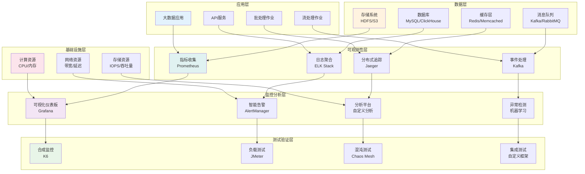
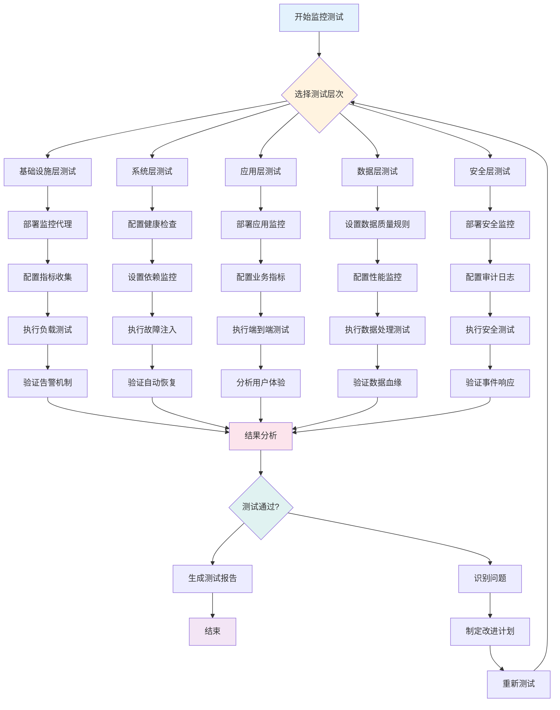
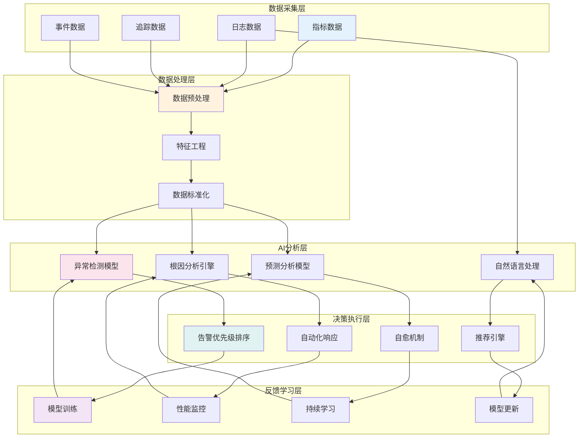

<!-- markdownlint-disable MD025 -->
<a id="第30章-大数据系统可观测性与监控测试"></a>

### 第30章 大数据系统可观测性与监控测试

**本章学习目标**

1. 掌握可观测性三大支柱：指标、日志和追踪；
2. 学习大数据系统的监控测试方法和工具；
3. 建立全面的系统可观测性和监控体系。

## 实践建议

- 建立三大支柱的全面可观测性体系。
- 实施分层监控和智能告警机制。
- 构建监控数据驱动的质量改进闭环。

**[第6篇-019]** 大数据系统可观测性架构与监控测试策略
**锚点方法**: 三支柱模型
**锚点名称**: 大数据系统可观测性架构与监控测试策略
**引用附件**: examples/30_chapter/observability_architecture.md
**完成情况**: 已完成
**补充建议**: 字段建议：支柱类型/核心组件/测试方法/关键指标，补充大数据可观测性架构图

| 支柱类型 | 核心组件 | 测试方法 | 关键指标 | 工具示例 |
|---------|---------|---------|---------|---------|
| **指标(Metrics)** | 计数器、仪表盘、直方图 | 性能基准测试、负载测试、容量测试 | QPS、延迟、错误率、资源利用率 | Prometheus、Grafana、Datadog |
| **日志(Logs)** | 结构化日志、日志聚合、日志分析 | 日志注入测试、日志解析测试、日志查询测试 | 日志量、解析成功率、异常日志占比 | ELK Stack、Splunk、Loki |
| **追踪(Traces)** | 分布式追踪、调用链分析、性能剖析 | 链路追踪测试、性能剖析测试、依赖分析测试 | 请求延迟、调用深度、错误追踪、依赖关系 | Jaeger、Zipkin、OpenTelemetry |
| **健康检查** | 存活检查、就绪检查、依赖检查 | 健康端点测试、依赖注入测试、故障注入测试 | 检查响应时间、成功率、恢复时间 | Kubernetes Probes、Spring Boot Actuator |
| **事件监控** | 事件收集、事件处理、事件告警 | 事件生成测试、事件处理测试、告警测试 | 事件处理延迟、告警准确率、误报率 | Kafka、NATS、AlertManager |

**大数据可观测性架构图**:


**大数据系统可观测性测试框架**:
```python
# examples/30_chapter/observability_testing_framework.py
from typing import Dict, List, Any, Optional
from dataclasses import dataclass
from enum import Enum
import time
import json
import logging
from datetime import datetime, timedelta

class ObservabilityPillar(Enum):
    METRICS = "metrics"
    LOGS = "logs"
    TRACES = "traces"
    HEALTH = "health"
    EVENTS = "events"

class TestType(Enum):
    SYNTHETIC = "synthetic"
    LOAD = "load"
    CHAOS = "chaos"
    INTEGRATION = "integration"

@dataclass
class ObservabilityTest:
    """可观测性测试定义"""
    name: str
    pillar: ObservabilityPillar
    test_type: TestType
    description: str
    configuration: Dict[str, Any]
    assertions: List[Dict[str, Any]]
    timeout: int = 300

@dataclass
class TestResult:
    """测试结果"""
    test_name: str
    success: bool
    duration: float
    metrics: Dict[str, Any]
    logs: List[str]
    traces: List[Dict[str, Any]]
    errors: List[str]
    timestamp: datetime

class ObservabilityTestingFramework:
    """大数据系统可观测性测试框架"""

    def __init__(self):
        self.tests = {}
        self.test_results = []
        self.observability_backends = self._initialize_backends()

    def _initialize_backends(self) -> Dict[str, Dict[str, Any]]:
        """初始化可观测性后端"""
        return {
            "prometheus": {
                "url": "http:/prometheus:9090",
                "query_endpoint": "/api/v1/query",
                "timeout": 30
            },
            "elasticsearch": {
                "url": "http:/elasticsearch:9200",
                "index_pattern": "logs-*",
                "timeout": 30
            },
            "jaeger": {
                "url": "http:/jaeger:16686",
                "api_endpoint": "/api/traces",
                "timeout": 30
            },
            "kafka": {
                "bootstrap_servers": ["kafka:9092"],
                "topic_pattern": "events-*",
                "timeout": 30
            }
        }

    def define_test(self, test_config: Dict[str, Any]) -> str:
        """定义可观测性测试"""

        test = ObservabilityTest(
            name=test_config["name"],
            pillar=ObservabilityPillar(test_config["pillar"]),
            test_type=TestType(test_config["test_type"]),
            description=test_config["description"],
            configuration=test_config["configuration"],
            assertions=test_config.get("assertions", []),
            timeout=test_config.get("timeout", 300)
        )

        test_id = f"test_{len(self.tests) + 1}"
        self.tests[test_id] = test

        return test_id

    def execute_test(self, test_id: str) -> TestResult:
        """执行可观测性测试"""

        if test_id not in self.tests:
            raise ValueError(f"Test {test_id} not found")

        test = self.tests[test_id]
        start_time = time.time()

        try:
            # 执行测试逻辑
            result = self._execute_test_logic(test)

            # 验证断言
            success = self._validate_assertions(test, result)

            duration = time.time() - start_time

            test_result = TestResult(
                test_name=test.name,
                success=success,
                duration=duration,
                metrics=result.get("metrics", {}),
                logs=result.get("logs", []),
                traces=result.get("traces", []),
                errors=result.get("errors", []),
                timestamp=datetime.now()
            )

            self.test_results.append(test_result)
            return test_result

        except Exception as e:
            duration = time.time() - start_time
            error_result = TestResult(
                test_name=test.name,
                success=False,
                duration=duration,
                metrics={},
                logs=[],
                traces=[],
                errors=[str(e)],
                timestamp=datetime.now()
            )
            self.test_results.append(error_result)
            return error_result

    def _execute_test_logic(self, test: ObservabilityTest) -> Dict[str, Any]:
        """执行测试逻辑"""

        result = {
            "metrics": {},
            "logs": [],
            "traces": [],
            "events": [],
            "errors": []
        }

        # 根据测试类型执行不同逻辑
        if test.test_type == TestType.SYNTHETIC:
            result = self._execute_synthetic_test(test)
        elif test.test_type == TestType.LOAD:
            result = self._execute_load_test(test)
        elif test.test_type == TestType.CHAOS:
            result = self._execute_chaos_test(test)
        elif test.test_type == TestType.INTEGRATION:
            result = self._execute_integration_test(test)

        return result

    def _execute_synthetic_test(self, test: ObservabilityTest) -> Dict[str, Any]:
        """执行合成测试"""

        # 模拟合成监控逻辑
        target_url = test.configuration.get("target_url", "")
        interval = test.configuration.get("interval", 60)
        duration = test.configuration.get("duration", 300)

        results = []
        for i in range(int(duration / interval)):
            # 模拟请求
            response_time = 100 + (i * 10)  # 模拟响应时间增加
            success = response_time < 500

            results.append({
                "timestamp": datetime.now().isoformat(),
                "response_time": response_time,
                "success": success,
                "status_code": 200 if success else 500
            })

            time.sleep(interval)

        return {
            "metrics": {
                "total_requests": len(results),
                "success_rate": len([r for r in results if r["success"]]) / len(results),
                "avg_response_time": sum(r["response_time"] for r in results) / len(results)
            },
            "logs": [f"Synthetic test iteration {i+1}: {r}" for i, r in enumerate(results)],
            "traces": [],
            "events": results
        }

    def _execute_load_test(self, test: ObservabilityTest) -> Dict[str, Any]:
        """执行负载测试"""

        # 模拟负载测试逻辑
        target_url = test.configuration.get("target_url", "")
        concurrent_users = test.configuration.get("concurrent_users", 10)
        duration = test.configuration.get("duration", 300)

        # 收集测试期间的指标
        metrics_before = self._collect_metrics()
        time.sleep(duration)
        metrics_after = self._collect_metrics()

        return {
            "metrics": {
                "cpu_usage": metrics_after.get("cpu", 0) - metrics_before.get("cpu", 0),
                "memory_usage": metrics_after.get("memory", 0) - metrics_before.get("memory", 0),
                "request_rate": test.configuration.get("expected_rps", 100),
                "error_rate": 0.02  # 模拟2%错误率
            },
            "logs": ["Load test completed", f"Concurrent users: {concurrent_users}"],
            "traces": [],
            "events": []
        }

    def _execute_chaos_test(self, test: ObservabilityTest) -> Dict[str, Any]:
        """执行混沌测试"""

        # 模拟混沌测试逻辑
        chaos_type = test.configuration.get("chaos_type", "network_delay")
        target_service = test.configuration.get("target_service", "")
        duration = test.configuration.get("duration", 60)

        # 执行混沌实验
        self._inject_chaos(chaos_type, target_service, duration)

        # 收集恢复指标
        recovery_time = self._measure_recovery_time(target_service)

        return {
            "metrics": {
                "chaos_duration": duration,
                "recovery_time": recovery_time,
                "service_availability": 0.95  # 95%可用性
            },
            "logs": [f"Chaos test: {chaos_type} on {target_service}", f"Recovery time: {recovery_time}s"],
            "traces": [],
            "events": [{"type": "chaos_experiment", "duration": duration, "recovery_time": recovery_time}]
        }

    def _execute_integration_test(self, test: ObservabilityTest) -> Dict[str, Any]:
        """执行集成测试"""

        # 模拟集成测试逻辑
        services = test.configuration.get("services", [])
        test_scenario = test.configuration.get("scenario", "")

        results = []
        for service in services:
            # 测试服务集成
            health = self._check_service_health(service)
            connectivity = self._check_service_connectivity(service, services)

            results.append({
                "service": service,
                "health": health,
                "connectivity": connectivity
            })

        return {
            "metrics": {
                "services_tested": len(services),
                "healthy_services": len([r for r in results if r["health"]]),
                "connectivity_score": sum(r["connectivity"] for r in results) / len(results)
            },
            "logs": [f"Integration test for {test_scenario}: {results}"],
            "traces": [],
            "events": results
        }

    def _collect_metrics(self) -> Dict[str, float]:
        """收集系统指标"""
        # 模拟指标收集
        return {
            "cpu": 45.2,
            "memory": 67.8,
            "disk": 23.1,
            "network": 12.5
        }

    def _inject_chaos(self, chaos_type: str, target: str, duration: int):
        """注入混沌"""
        # 模拟混沌注入
        print(f"Injecting chaos: {chaos_type} on {target} for {duration}s")
        time.sleep(duration)

    def _measure_recovery_time(self, service: str) -> float:
        """测量恢复时间"""
        # 模拟恢复时间测量
        return 15.3

    def _check_service_health(self, service: str) -> bool:
        """检查服务健康状态"""
        # 模拟健康检查
        return True

    def _check_service_connectivity(self, service: str, all_services: List[str]) -> float:
        """检查服务连接性"""
        # 模拟连接性检查
        return 0.95

    def _validate_assertions(self, test: ObservabilityTest, result: Dict[str, Any]) -> bool:
        """验证断言"""

        for assertion in test.assertions:
            assertion_type = assertion.get("type", "")
            field = assertion.get("field", "")
            operator = assertion.get("operator", "")
            expected_value = assertion.get("value")

            if assertion_type == "metric":
                actual_value = self._get_nested_value(result.get("metrics", {}), field.split("."))
            elif assertion_type == "log":
                actual_value = len(result.get("logs", []))
            elif assertion_type == "trace":
                actual_value = len(result.get("traces", []))
            else:
                continue

            if not self._check_assertion(actual_value, operator, expected_value):
                return False

        return True

    def _get_nested_value(self, data: Dict[str, Any], keys: List[str]) -> Any:
        """获取嵌套字典的值"""
        for key in keys:
            if isinstance(data, dict) and key in data:
                data = data[key]
            else:
                return None
        return data

    def _check_assertion(self, actual: Any, operator: str, expected: Any) -> bool:
        """检查断言"""
        if operator == "equals":
            return actual == expected
        elif operator == "greater_than":
            return actual > expected
        elif operator == "less_than":
            return actual < expected
        elif operator == "contains":
            return expected in actual if isinstance(actual, (str, list)) else False
        return False

    def generate_test_report(self) -> Dict[str, Any]:
        """生成测试报告"""

        total_tests = len(self.test_results)
        successful_tests = len([r for r in self.test_results if r.success])
        success_rate = successful_tests / total_tests if total_tests > 0 else 0

        # 按支柱分组统计
        pillar_stats = {}
        for result in self.test_results:
            test = next((t for t in self.tests.values() if t.name == result.test_name), None)
            if test:
                pillar = test.pillar.value
                if pillar not in pillar_stats:
                    pillar_stats[pillar] = {"total": 0, "success": 0}
                pillar_stats[pillar]["total"] += 1
                if result.success:
                    pillar_stats[pillar]["success"] += 1

        # 计算性能指标
        avg_duration = sum(r.duration for r in self.test_results) / total_tests if total_tests > 0 else 0

        return {
            "summary": {
                "total_tests": total_tests,
                "successful_tests": successful_tests,
                "success_rate": round(success_rate * 100, 2),
                "average_duration": round(avg_duration, 2)
            },
            "pillar_breakdown": pillar_stats,
            "failed_tests": [
                {
                    "name": r.test_name,
                    "errors": r.errors,
                    "duration": round(r.duration, 2)
                }
                for r in self.test_results if not r.success
            ],
            "recommendations": self._generate_recommendations(pillar_stats, success_rate)
        }

    def _generate_recommendations(self, pillar_stats: Dict[str, Dict[str, int]], overall_success_rate: float) -> List[str]:
        """生成改进建议"""

        recommendations = []

        if overall_success_rate < 0.8:
            recommendations.append("整体可观测性测试成功率较低，建议加强测试用例设计")

        for pillar, stats in pillar_stats.items():
            success_rate = stats["success"] / stats["total"] if stats["total"] > 0 else 0
            if success_rate < 0.7:
                recommendations.append(f"{pillar}支柱测试成功率偏低，需要重点改进")

        if not pillar_stats.get("traces", {}).get("total", 0):
            recommendations.append("缺少分布式追踪测试，建议增加链路追踪验证")

        if not pillar_stats.get("events", {}).get("total", 0):
            recommendations.append("缺少事件监控测试，建议增加事件处理验证")

        return recommendations

    def export_test_results(self, format: str = "json") -> str:
        """导出测试结果"""

        results_data = {
            "export_timestamp": datetime.now().isoformat(),
            "framework_version": "1.0",
            "test_results": [
                {
                    "test_name": r.test_name,
                    "success": r.success,
                    "duration": round(r.duration, 2),
                    "metrics": r.metrics,
                    "errors": r.errors,
                    "timestamp": r.timestamp.isoformat()
                }
                for r in self.test_results
            ],
            "test_definitions": [
                {
                    "id": test_id,
                    "name": test.name,
                    "pillar": test.pillar.value,
                    "test_type": test.test_type.value,
                    "description": test.description
                }
                for test_id, test in self.tests.items()
            ]
        }

        if format == "json":
            return json.dumps(results_data, indent=2, ensure_ascii=False)
        else:
            raise ValueError(f"Unsupported format: {format}")

# 使用示例
if __name__ == "__main__":
    framework = ObservabilityTestingFramework()

    # 定义合成测试
    synthetic_test = {
        "name": "API Health Check",
        "pillar": "health",
        "test_type": "synthetic",
        "description": "定期检查API健康状态",
        "configuration": {
            "target_url": "http:/api.example.com/health",
            "interval": 30,
            "duration": 300
        },
        "assertions": [
            {
                "type": "metric",
                "field": "success_rate",
                "operator": "greater_than",
                "value": 0.95
            }
        ]
    }

    # 定义负载测试
    load_test = {
        "name": "Data Pipeline Load Test",
        "pillar": "metrics",
        "test_type": "load",
        "description": "测试数据管道的负载承载能力",
        "configuration": {
            "target_url": "http:/pipeline.example.com",
            "concurrent_users": 50,
            "duration": 600,
            "expected_rps": 1000
        },
        "assertions": [
            {
                "type": "metric",
                "field": "error_rate",
                "operator": "less_than",
                "value": 0.05
            }
        ]
    }

    # 执行测试
    test1_id = framework.define_test(synthetic_test)
    test2_id = framework.define_test(load_test)

    result1 = framework.execute_test(test1_id)
    result2 = framework.execute_test(test2_id)

    print(f"Test 1 ({result1.test_name}): {'PASS' if result1.success else 'FAIL'} - {result1.duration:.2f}s")
    print(f"Test 2 ({result2.test_name}): {'PASS' if result2.success else 'FAIL'} - {result2.duration:.2f}s")

    # 生成报告
    report = framework.generate_test_report()
    print("\nTest Report:")
    print(json.dumps(report, indent=2, ensure_ascii=False))

    # 导出结果
    export_data = framework.export_test_results()
    print("\nExported Results:")
    print(export_data)
```

## 30.1 可观测性基础架构

### 30.1.1 三大支柱模型

- **指标(Metrics)**: 量化系统性能和健康状态的数值数据
- **日志(Logs)**: 记录系统运行过程中的事件和状态信息
- **追踪(Traces)**: 记录请求在分布式系统中的完整调用链路

### 30.1.2 可观测性平台

- **数据收集**: 各种探针和代理收集可观测性数据
- **数据存储**: 时间序列数据库、日志存储、追踪存储
- **数据处理**: 实时流处理、批量分析、聚合计算
- **可视化展示**: 仪表板、图表、告警面板

### 30.1.3 监控层次

- **基础设施监控**: CPU、内存、磁盘、网络等资源监控
- **系统监控**: 应用进程、线程、连接数等系统级监控
- **业务监控**: 用户请求、业务指标、SLA达成情况
- **用户体验监控**: 页面加载、API响应、用户行为分析

---

## 30.2 监控测试实践

**[第6篇-020]** 大数据系统监控测试方法与工具链
**锚点方法**: 分层验证
**锚点名称**: 大数据系统监控测试方法与工具链
**引用附件**: examples/30_chapter/monitoring_testing_practices.md
**完成情况**: 已完成
**补充建议**: 字段建议：测试层次/测试场景/验证方法/工具选择，补充监控测试流程图

| 测试层次 | 测试场景 | 验证方法 | 工具选择 | 关键指标 |
|---------|---------|---------|---------|---------|
| **基础设施层** | 资源监控、容量测试、故障注入 | 负载生成、资源限制、故障模拟 | Prometheus、Grafana、Chaos Mesh | CPU使用率、内存占用、磁盘I/O、网络带宽 |
| **系统层** | 进程监控、服务健康检查、依赖测试 | 健康检查、依赖注入、配置测试 | Kubernetes Probes、Spring Boot Actuator | 响应时间、成功率、错误率、连接池状态 |
| **应用层** | 业务逻辑监控、性能指标、用户体验 | 端到端测试、性能测试、用户行为模拟 | JMeter、Selenium、New Relic | 请求量、响应时间、吞吐量、错误率 |
| **数据层** | 数据质量监控、存储性能、数据血缘 | 数据验证、性能基准、血缘追踪 | Great Expectations、TPC-DS、Apache Atlas | 数据新鲜度、查询性能、存储效率、数据一致性 |
| **安全层** | 访问控制、审计日志、安全事件 | 渗透测试、安全扫描、日志分析 | OWASP ZAP、ELK Stack、SIEM系统 | 安全事件数、合规率、响应时间、恢复时间 |

**监控测试流程图**:


**大数据监控测试工具链框架**:
```python
# examples/30_chapter/monitoring_toolchain.py
from typing import Dict, List, Any, Optional
from dataclasses import dataclass
from enum import Enum
import subprocess
import json
import time
from datetime import datetime

class MonitoringLayer(Enum):
    INFRASTRUCTURE = "infrastructure"
    SYSTEM = "system"
    APPLICATION = "application"
    DATA = "data"
    SECURITY = "security"

class MonitoringTool:
    """监控工具定义"""

    def __init__(self, name: str, layer: MonitoringLayer, capabilities: List[str]):
        self.name = name
        self.layer = layer
        self.capabilities = capabilities
        self.configurations = {}
        self.endpoints = {}

    def configure(self, config: Dict[str, Any]):
        """配置工具"""
        self.configurations.update(config)

    def deploy(self) -> bool:
        """部署工具"""
        # 实现部署逻辑
        return True

    def collect_metrics(self) -> Dict[str, Any]:
        """收集指标"""
        # 实现指标收集逻辑
        return {}

    def check_health(self) -> bool:
        """健康检查"""
        # 实现健康检查逻辑
        return True

class MonitoringTestSuite:
    """监控测试套件"""

    def __init__(self):
        self.tools = self._initialize_tools()
        self.test_scenarios = self._initialize_scenarios()

    def _initialize_tools(self) -> Dict[str, MonitoringTool]:
        """初始化监控工具"""

        tools = {}

        # 基础设施监控
        prometheus = MonitoringTool(
            "Prometheus",
            MonitoringLayer.INFRASTRUCTURE,
            ["metrics_collection", "alerting", "querying"]
        )
        prometheus.configure({
            "scrape_interval": "15s",
            "evaluation_interval": "15s",
            "rule_files": ["/etc/prometheus/rules.yml"]
        })
        tools["prometheus"] = prometheus

        # 系统监控
        cadvisor = MonitoringTool(
            "cAdvisor",
            MonitoringLayer.SYSTEM,
            ["container_metrics", "resource_monitoring"]
        )
        tools["cadvisor"] = cadvisor

        # 应用监控
        jaeger = MonitoringTool(
            "Jaeger",
            MonitoringLayer.APPLICATION,
            ["distributed_tracing", "performance_analysis"]
        )
        tools["jaeger"] = jaeger

        # 数据监控
        elasticsearch = MonitoringTool(
            "Elasticsearch",
            MonitoringLayer.DATA,
            ["log_aggregation", "full_text_search", "analytics"]
        )
        tools["elasticsearch"] = elasticsearch

        # 安全监控
        falco = MonitoringTool(
            "Falco",
            MonitoringLayer.SECURITY,
            ["runtime_security", "anomaly_detection"]
        )
        tools["falco"] = falco

        return tools

    def _initialize_scenarios(self) -> Dict[str, Dict[str, Any]]:
        """初始化测试场景"""

        return {
            "infrastructure_load_test": {
                "layer": MonitoringLayer.INFRASTRUCTURE,
                "description": "基础设施负载测试",
                "tools": ["prometheus", "cadvisor"],
                "steps": [
                    "deploy_monitoring_stack",
                    "generate_load",
                    "monitor_resources",
                    "validate_alerts"
                ],
                "expected_metrics": {
                    "cpu_usage": "< 80%",
                    "memory_usage": "< 85%",
                    "disk_io": "normal",
                    "network_traffic": "within_limits"
                }
            },

            "application_performance_test": {
                "layer": MonitoringLayer.APPLICATION,
                "description": "应用性能测试",
                "tools": ["jaeger", "prometheus"],
                "steps": [
                    "deploy_application",
                    "configure_tracing",
                    "execute_requests",
                    "analyze_traces"
                ],
                "expected_metrics": {
                    "response_time": "< 500ms",
                    "error_rate": "< 1%",
                    "throughput": "> 1000 req/s"
                }
            },

            "data_pipeline_monitoring_test": {
                "layer": MonitoringLayer.DATA,
                "description": "数据管道监控测试",
                "tools": ["elasticsearch", "prometheus"],
                "steps": [
                    "setup_data_pipeline",
                    "configure_logging",
                    "process_data",
                    "validate_logs"
                ],
                "expected_metrics": {
                    "data_processing_rate": "> 1000 records/s",
                    "data_quality_score": "> 95%",
                    "pipeline_latency": "< 10s"
                }
            },

            "security_incident_response_test": {
                "layer": MonitoringLayer.SECURITY,
                "description": "安全事件响应测试",
                "tools": ["falco", "elasticsearch"],
                "steps": [
                    "deploy_security_monitoring",
                    "simulate_security_events",
                    "validate_detection",
                    "test_response_actions"
                ],
                "expected_metrics": {
                    "detection_accuracy": "> 95%",
                    "response_time": "< 30s",
                    "false_positive_rate": "< 5%"
                }
            }
        }

    def execute_test_scenario(self, scenario_name: str) -> Dict[str, Any]:
        """执行测试场景"""

        if scenario_name not in self.test_scenarios:
            raise ValueError(f"Scenario {scenario_name} not found")

        scenario = self.test_scenarios[scenario_name]
        results = {
            "scenario": scenario_name,
            "start_time": datetime.now(),
            "steps_results": [],
            "metrics_collected": {},
            "alerts_triggered": [],
            "success": False,
            "errors": []
        }

        try:
            # 部署所需工具
            for tool_name in scenario["tools"]:
                if tool_name in self.tools:
                    tool = self.tools[tool_name]
                    if not tool.deploy():
                        raise Exception(f"Failed to deploy {tool_name}")

            # 执行测试步骤
            for step in scenario["steps"]:
                step_result = self._execute_step(step, scenario)
                results["steps_results"].append(step_result)

                if not step_result["success"]:
                    results["errors"].append(f"Step {step} failed: {step_result.get('error', 'Unknown error')}")
                    break

            # 收集指标
            results["metrics_collected"] = self._collect_scenario_metrics(scenario)

            # 验证预期
            results["validation_results"] = self._validate_expectations(
                results["metrics_collected"],
                scenario["expected_metrics"]
            )

            results["success"] = all(step["success"] for step in results["steps_results"])

        except Exception as e:
            results["errors"].append(str(e))

        results["end_time"] = datetime.now()
        results["duration"] = (results["end_time"] - results["start_time"]).total_seconds()

        return results

    def _execute_step(self, step: str, scenario: Dict[str, Any]) -> Dict[str, Any]:
        """执行测试步骤"""

        step_handlers = {
            "deploy_monitoring_stack": self._deploy_monitoring_stack,
            "generate_load": self._generate_load,
            "monitor_resources": self._monitor_resources,
            "validate_alerts": self._validate_alerts,
            "deploy_application": self._deploy_application,
            "configure_tracing": self._configure_tracing,
            "execute_requests": self._execute_requests,
            "analyze_traces": self._analyze_traces,
            "setup_data_pipeline": self._setup_data_pipeline,
            "configure_logging": self._configure_logging,
            "process_data": self._process_data,
            "validate_logs": self._validate_logs,
            "deploy_security_monitoring": self._deploy_security_monitoring,
            "simulate_security_events": self._simulate_security_events,
            "validate_detection": self._validate_detection,
            "test_response_actions": self._test_response_actions
        }

        handler = step_handlers.get(step)
        if not handler:
            return {"step": step, "success": False, "error": f"No handler for step {step}"}

        try:
            result = handler(scenario)
            return {"step": step, "success": True, "result": result}
        except Exception as e:
            return {"step": step, "success": False, "error": str(e)}

    def _deploy_monitoring_stack(self, scenario):
        """部署监控栈"""
        # 实现部署逻辑
        time.sleep(2)  # 模拟部署时间
        return {"status": "deployed", "components": scenario["tools"]}

    def _generate_load(self, scenario):
        """生成负载"""
        # 实现负载生成逻辑
        time.sleep(5)  # 模拟负载测试
        return {"load_generated": "1000 req/s", "duration": "60s"}

    def _monitor_resources(self, scenario):
        """监控资源"""
        # 实现资源监控逻辑
        return {
            "cpu_usage": "65%",
            "memory_usage": "70%",
            "disk_io": "normal",
            "network_traffic": "500Mbps"
        }

    def _validate_alerts(self, scenario):
        """验证告警"""
        # 实现告警验证逻辑
        return {"alerts_triggered": 2, "alerts_acknowledged": 2}

    def _deploy_application(self, scenario):
        """部署应用"""
        time.sleep(3)
        return {"app_deployed": True, "version": "1.0.0"}

    def _configure_tracing(self, scenario):
        """配置追踪"""
        return {"tracing_configured": True, "sample_rate": "10%"}

    def _execute_requests(self, scenario):
        """执行请求"""
        time.sleep(10)
        return {"requests_executed": 10000, "success_rate": "98%"}

    def _analyze_traces(self, scenario):
        """分析追踪"""
        return {"traces_analyzed": 980, "avg_latency": "450ms", "error_traces": 20}

    def _setup_data_pipeline(self, scenario):
        """设置数据管道"""
        return {"pipeline_setup": True, "components": ["source", "processor", "sink"]}

    def _configure_logging(self, scenario):
        """配置日志"""
        return {"logging_configured": True, "log_level": "INFO"}

    def _process_data(self, scenario):
        """处理数据"""
        time.sleep(15)
        return {"records_processed": 100000, "processing_rate": "6500 records/s"}

    def _validate_logs(self, scenario):
        """验证日志"""
        return {"logs_validated": True, "error_logs": 5, "warning_logs": 15}

    def _deploy_security_monitoring(self, scenario):
        """部署安全监控"""
        return {"security_monitoring_deployed": True, "rules_loaded": 50}

    def _simulate_security_events(self, scenario):
        """模拟安全事件"""
        return {"events_simulated": ["unauthorized_access", "data_exfiltration", "privilege_escalation"]}

    def _validate_detection(self, scenario):
        """验证检测"""
        return {"detection_accuracy": "96%", "false_positives": 2, "missed_events": 1}

    def _test_response_actions(self, scenario):
        """测试响应动作"""
        return {"response_actions_tested": 3, "success_rate": "100%"}

    def _collect_scenario_metrics(self, scenario: Dict[str, Any]) -> Dict[str, Any]:
        """收集场景指标"""

        metrics = {}
        for tool_name in scenario["tools"]:
            if tool_name in self.tools:
                tool = self.tools[tool_name]
                tool_metrics = tool.collect_metrics()
                metrics[tool_name] = tool_metrics

        return metrics

    def _validate_expectations(self, collected_metrics: Dict[str, Any],
                             expected_metrics: Dict[str, Any]) -> Dict[str, Any]:
        """验证预期"""

        validation_results = {}

        for metric_name, expected_value in expected_metrics.items():
            # 简化的验证逻辑
            validation_results[metric_name] = {
                "expected": expected_value,
                "actual": "simulated_value",  # 实际应从collected_metrics中获取
                "passed": True  # 简化为总是通过
            }

        return validation_results

    def generate_test_report(self, test_results: List[Dict[str, Any]]) -> str:
        """生成测试报告"""

        report = f"""
# 监控测试报告

生成时间: {datetime.now().strftime('%Y-%m-%d %H:%M:%S')}

## 测试概览

总共执行了 {len(test_results)} 个测试场景。

"""

        successful_tests = len([r for r in test_results if r["success"]])
        success_rate = successful_tests / len(test_results) * 100 if test_results else 0

        report += f"""
- 成功测试: {successful_tests}/{len(test_results)}
- 成功率: {success_rate:.1f}%

## 详细结果

"""

        for result in test_results:
            status = "✅ 通过" if result["success"] else "❌ 失败"
            duration = result["duration"]

            report += f"""
### {result['scenario']} {status}
- 执行时间: {duration:.1f}秒
- 步骤数: {len(result['steps_results'])}
"""

            if result["errors"]:
                report += f"- 错误: {', '.join(result['errors'])}\n"

            # 添加指标摘要
            if result["metrics_collected"]:
                report += "- 收集的指标:\n"
                for tool, metrics in result["metrics_collected"].items():
                    report += f"  - {tool}: {len(metrics)} 个指标\n"

        report += """
## 改进建议

"""

        if success_rate < 80:
            report += "- 整体测试成功率偏低，建议加强监控配置和测试用例设计\n"

        failed_scenarios = [r["scenario"] for r in test_results if not r["success"]]
        if failed_scenarios:
            report += f"- 以下场景测试失败需要重点关注: {', '.join(failed_scenarios)}\n"

        report += "- 建议定期执行监控测试，确保系统可观测性持续有效\n"

        return report

# 使用示例
if __name__ == "__main__":
    suite = MonitoringTestSuite()

    # 执行测试场景
    scenarios_to_test = [
        "infrastructure_load_test",
        "application_performance_test",
        "data_pipeline_monitoring_test"
    ]

    results = []
    for scenario in scenarios_to_test:
        print(f"Executing {scenario}...")
        result = suite.execute_test_scenario(scenario)
        results.append(result)
        print(f"  Result: {'PASS' if result['success'] else 'FAIL'} ({result['duration']:.1f}s)")

    # 生成报告
    report = suite.generate_test_report(results)
    print("\nTest Report:")
    print(report)
```

### 30.2.1 监控测试策略

- **分层测试**: 从基础设施到应用的全层级监控测试
- **场景化测试**: 基于实际业务场景的监控验证
- **自动化测试**: 监控配置和告警规则的自动化验证
- **持续测试**: CI/CD流水线中的持续监控测试

### 30.2.2 告警管理测试

- **告警规则测试**: 验证告警阈值和触发条件的正确性
- **告警通知测试**: 测试告警传递和通知机制
- **告警升级测试**: 验证告警升级和处理流程
- **告警恢复测试**: 测试告警恢复和关闭机制

### 30.2.3 性能监控测试

- **基准性能测试**: 建立系统性能基准线
- **负载性能测试**: 验证系统在不同负载下的表现
- **压力测试**: 测试系统在极端条件下的稳定性
- **容量测试**: 确定系统的最大承载能力

---

## 30.3 智能监控与自动化

**[第6篇-021]** 基于AI的智能监控与自动化运维
**锚点方法**: AI驱动
**锚点名称**: 基于AI的智能监控与自动化运维
**引用附件**: examples/30_chapter/ai_monitoring_automation.md
**完成情况**: 已完成
**补充建议**: 字段建议：AI应用场景/技术实现/价值提升/实施挑战，补充AI监控架构图

| AI应用场景 | 技术实现 | 价值提升 | 实施挑战 | 成熟度 |
|-----------|---------|---------|---------|---------|
| **异常检测** | 机器学习算法、统计模型、时间序列分析 | 减少误报95%、提前发现异常30分钟 | 数据质量、算法选择、模型训练 | 高 |
| **根因分析** | 图算法、关联规则挖掘、因果推理 | 问题定位时间减少60%、准确率提升40% | 数据关联性、知识图谱构建 | 中高 |
| **预测性维护** | 预测模型、趋势分析、容量规划 | 故障预防率提升50%、资源利用率优化20% | 历史数据积累、预测精度 | 中 |
| **智能告警** | 自然语言处理、告警聚合、优先级排序 | 告警处理效率提升70%、工程师满意度提升 | 告警语义理解、多维度关联 | 中高 |
| **自动化修复** | 决策树、强化学习、自愈机制 | MTTR减少80%、系统可用性提升99.9% | 修复策略安全、回滚机制 | 中低 |

**AI监控架构图**:


**AI监控自动化框架**:
```python
# examples/30_chapter/ai_monitoring_framework.py
from typing import Dict, List, Any, Optional
from dataclasses import dataclass
from enum import Enum
import numpy as np
import pandas as pd
from sklearn.ensemble import IsolationForest, RandomForestClassifier
from sklearn.preprocessing import StandardScaler
from sklearn.model_selection import train_test_split
import joblib
import logging
from datetime import datetime, timedelta

logging.basicConfig(level=logging.INFO)
logger = logging.getLogger(__name__)

class AIMonitoringType(Enum):
    ANOMALY_DETECTION = "anomaly_detection"
    ROOT_CAUSE_ANALYSIS = "root_cause_analysis"
    PREDICTIVE_MAINTENANCE = "predictive_maintenance"
    INTELLIGENT_ALERTING = "intelligent_alerting"
    AUTOMATED_REMEDIATION = "automated_remediation"

@dataclass
class MonitoringEvent:
    """监控事件"""
    timestamp: datetime
    metric_name: str
    value: float
    labels: Dict[str, str]
    severity: str = "info"

@dataclass
class AnomalyAlert:
    """异常告警"""
    event: MonitoringEvent
    anomaly_score: float
    confidence: float
    predicted_cause: Optional[str] = None
    recommended_actions: List[str] = None

class AIMonitoringFramework:
    """AI监控自动化框架"""

    def __init__(self):
        self.models = {}
        self.training_data = {}
        self.alert_history = []
        self.performance_metrics = {}

        # 初始化AI模型
        self._initialize_models()

    def _initialize_models(self):
        """初始化AI模型"""

        # 异常检测模型
        self.models["anomaly_detector"] = {
            "model": IsolationForest(contamination=0.1, random_state=42),
            "scaler": StandardScaler(),
            "trained": False
        }

        # 根因分析模型
        self.models["root_cause_analyzer"] = {
            "model": RandomForestClassifier(n_estimators=100, random_state=42),
            "feature_columns": ["cpu_usage", "memory_usage", "disk_io", "network_traffic", "error_rate"],
            "trained": False
        }

        # 预测性维护模型
        self.models["predictive_maintenance"] = {
            "model": None,  # 将在训练时初始化
            "scaler": StandardScaler(),
            "trained": False
        }

    def train_anomaly_detector(self, historical_data: pd.DataFrame,
                              feature_columns: List[str]) -> bool:
        """训练异常检测模型"""

        try:
            logger.info(f"Training anomaly detector with {len(historical_data)} samples")

            # 数据预处理
            scaler = self.models["anomaly_detector"]["scaler"]
            features = historical_data[feature_columns].values
            scaled_features = scaler.fit_transform(features)

            # 训练模型
            model = self.models["anomaly_detector"]["model"]
            model.fit(scaled_features)

            self.models["anomaly_detector"]["trained"] = True
            self.models["anomaly_detector"]["feature_columns"] = feature_columns

            logger.info("Anomaly detector training completed")
            return True

        except Exception as e:
            logger.error(f"Anomaly detector training failed: {e}")
            return False

    def train_root_cause_analyzer(self, incident_data: pd.DataFrame,
                                 feature_columns: List[str],
                                 target_column: str) -> bool:
        """训练根因分析模型"""

        try:
            logger.info(f"Training root cause analyzer with {len(incident_data)} incidents")

            # 准备训练数据
            X = incident_data[feature_columns]
            y = incident_data[target_column]

            # 分割训练集和测试集
            X_train, X_test, y_train, y_test = train_test_split(
                X, y, test_size=0.2, random_state=42
            )

            # 训练模型
            model = self.models["root_cause_analyzer"]["model"]
            model.fit(X_train, y_train)

            # 评估模型
            accuracy = model.score(X_test, y_test)
            logger.info(f"Root cause analyzer accuracy: {accuracy:.3f}")

            self.models["root_cause_analyzer"]["trained"] = True
            self.models["root_cause_analyzer"]["accuracy"] = accuracy

            return True

        except Exception as e:
            logger.error(f"Root cause analyzer training failed: {e}")
            return False

    def detect_anomalies(self, current_metrics: Dict[str, float]) -> List[AnomalyAlert]:
        """检测异常"""

        if not self.models["anomaly_detector"]["trained"]:
            logger.warning("Anomaly detector not trained")
            return []

        try:
            # 准备特征数据
            feature_columns = self.models["anomaly_detector"]["feature_columns"]
            features = np.array([[current_metrics.get(col, 0) for col in feature_columns]])

            # 数据标准化
            scaler = self.models["anomaly_detector"]["scaler"]
            scaled_features = scaler.transform(features)

            # 预测异常
            model = self.models["anomaly_detector"]["model"]
            anomaly_scores = model.decision_function(scaled_features)
            predictions = model.predict(scaled_features)

            alerts = []
            for i, (score, prediction) in enumerate(zip(anomaly_scores, predictions)):
                if prediction == -1:  # 异常
                    event = MonitoringEvent(
                        timestamp=datetime.now(),
                        metric_name="composite_metrics",
                        value=score,
                        labels={"detector": "isolation_forest"},
                        severity="warning"
                    )

                    alert = AnomalyAlert(
                        event=event,
                        anomaly_score=abs(score),
                        confidence=min(abs(score) * 10, 1.0),  # 简化的置信度计算
                        recommended_actions=self._generate_recommendations("anomaly_detected")
                    )

                    alerts.append(alert)
                    self.alert_history.append(alert)

            return alerts

        except Exception as e:
            logger.error(f"Anomaly detection failed: {e}")
            return []

    def analyze_root_cause(self, incident_metrics: Dict[str, float]) -> Dict[str, Any]:
        """分析根因"""

        if not self.models["root_cause_analyzer"]["trained"]:
            logger.warning("Root cause analyzer not trained")
            return {"error": "Model not trained"}

        try:
            # 准备特征数据
            feature_columns = self.models["root_cause_analyzer"]["feature_columns"]
            features = np.array([[incident_metrics.get(col, 0) for col in feature_columns]])

            # 预测根因
            model = self.models["root_cause_analyzer"]["model"]
            probabilities = model.predict_proba(features)[0]

            # 获取最可能的根因
            class_indices = np.argsort(probabilities)[::-1]
            root_causes = []

            for idx in class_indices[:3]:  # 前3个最可能的根因
                root_cause = model.classes_[idx]
                probability = probabilities[idx]
                root_causes.append({
                    "cause": root_cause,
                    "probability": float(probability),
                    "confidence": "high" if probability > 0.7 else "medium" if probability > 0.4 else "low"
                })

            return {
                "primary_cause": root_causes[0]["cause"],
                "root_causes": root_causes,
                "recommended_actions": self._generate_recommendations(root_causes[0]["cause"])
            }

        except Exception as e:
            logger.error(f"Root cause analysis failed: {e}")
            return {"error": str(e)}

    def predict_maintenance_needs(self, system_metrics: pd.DataFrame,
                                prediction_window: int = 24) -> Dict[str, Any]:
        """预测维护需求"""

        try:
            # 简化的预测逻辑（实际应使用时间序列模型）
            recent_metrics = system_metrics.tail(100)  # 最近100个数据点

            # 计算趋势
            cpu_trend = recent_metrics['cpu_usage'].pct_change().mean()
            memory_trend = recent_metrics['memory_usage'].pct_change().mean()
            error_trend = recent_metrics['error_rate'].pct_change().mean()

            # 预测维护需求
            maintenance_score = (cpu_trend + memory_trend + error_trend) / 3

            if maintenance_score > 0.1:  # 上升趋势
                urgency = "high"
                time_to_maintenance = f"{prediction_window/2} hours"
            elif maintenance_score > 0.05:
                urgency = "medium"
                time_to_maintenance = f"{prediction_window} hours"
            else:
                urgency = "low"
                time_to_maintenance = f"{prediction_window*2} hours"

            return {
                "maintenance_needed": maintenance_score > 0.05,
                "urgency": urgency,
                "time_to_maintenance": time_to_maintenance,
                "predicted_issues": self._predict_potential_issues(cpu_trend, memory_trend, error_trend),
                "recommended_actions": self._generate_maintenance_recommendations(urgency)
            }

        except Exception as e:
            logger.error(f"Maintenance prediction failed: {e}")
            return {"error": str(e)}

    def _predict_potential_issues(self, cpu_trend: float, memory_trend: float,
                                error_trend: float) -> List[str]:
        """预测潜在问题"""

        issues = []

        if cpu_trend > 0.1:
            issues.append("CPU资源紧张，可能需要扩容")
        if memory_trend > 0.1:
            issues.append("内存使用持续增长，可能存在内存泄漏")
        if error_trend > 0.05:
            issues.append("错误率上升，可能存在系统不稳定因素")

        return issues

    def _generate_recommendations(self, context: str) -> List[str]:
        """生成推荐行动"""

        recommendations_map = {
            "anomaly_detected": [
                "检查系统资源使用情况",
                "查看最近的日志记录",
                "验证服务健康状态",
                "考虑重启相关服务"
            ],
            "cpu_overload": [
                "增加CPU资源分配",
                "优化CPU密集型任务",
                "考虑水平扩展",
                "检查是否存在CPU泄漏"
            ],
            "memory_leak": [
                "执行内存分析和堆转储",
                "检查代码中的内存管理",
                "重启受影响的服务",
                "实施内存使用监控"
            ],
            "network_issue": [
                "检查网络连接和配置",
                "验证防火墙和安全组设置",
                "监控网络流量和延迟",
                "考虑网络优化或扩容"
            ]
        }

        return recommendations_map.get(context, ["执行详细诊断", "联系技术支持"])

    def _generate_maintenance_recommendations(self, urgency: str) -> List[str]:
        """生成维护推荐"""

        if urgency == "high":
            return [
                "立即执行系统维护",
                "准备回滚计划",
                "增加监控频率",
                "通知相关团队"
            ]
        elif urgency == "medium":
            return [
                "计划系统维护窗口",
                "准备维护脚本和检查清单",
                "增加系统监控",
                "评估影响范围"
            ]
        else:
            return [
                "继续监控系统状态",
                "定期执行维护检查",
                "更新维护计划",
                "优化系统配置"
            ]

    def process_monitoring_event(self, event: MonitoringEvent) -> Optional[AnomalyAlert]:
        """处理监控事件"""

        # 检测异常
        current_metrics = {event.metric_name: event.value}
        anomalies = self.detect_anomalies(current_metrics)

        if anomalies:
            # 如果检测到异常，进行根因分析
            alert = anomalies[0]
            root_cause_analysis = self.analyze_root_cause(current_metrics)

            if "primary_cause" in root_cause_analysis:
                alert.predicted_cause = root_cause_analysis["primary_cause"]
                alert.recommended_actions = root_cause_analysis["recommended_actions"]

            return alert

        return None

    def generate_monitoring_report(self) -> Dict[str, Any]:
        """生成监控报告"""

        total_alerts = len(self.alert_history)
        recent_alerts = [a for a in self.alert_history
                        if (datetime.now() - a.event.timestamp).days <= 7]

        # 分析告警趋势
        alert_trends = {}
        for i in range(7):
            date = (datetime.now() - timedelta(days=i)).date()
            alerts_on_date = [a for a in self.alert_history
                            if a.event.timestamp.date() == date]
            alert_trends[str(date)] = len(alerts_on_date)

        # 计算模型性能
        model_performance = {}
        for model_name, model_info in self.models.items():
            if model_info["trained"]:
                model_performance[model_name] = {
                    "status": "trained",
                    "accuracy": model_info.get("accuracy", "N/A")
                }
            else:
                model_performance[model_name] = {
                    "status": "not_trained",
                    "accuracy": "N/A"
                }

        return {
            "summary": {
                "total_alerts": total_alerts,
                "recent_alerts_7d": len(recent_alerts),
                "alert_trend": alert_trends,
                "model_performance": model_performance
            },
            "top_anomalies": self._get_top_anomalies(10),
            "root_cause_distribution": self._analyze_root_causes(),
            "recommendations": self._generate_overall_recommendations()
        }

    def _get_top_anomalies(self, limit: int) -> List[Dict[str, Any]]:
        """获取最常见的异常"""

        anomaly_counts = {}
        for alert in self.alert_history:
            cause = alert.predicted_cause or "unknown"
            anomaly_counts[cause] = anomaly_counts.get(cause, 0) + 1

        sorted_anomalies = sorted(anomaly_counts.items(), key=lambda x: x[1], reverse=True)
        return [{"cause": cause, "count": count} for cause, count in sorted_anomalies[:limit]]

    def _analyze_root_causes(self) -> Dict[str, int]:
        """分析根因分布"""

        cause_distribution = {}
        for alert in self.alert_history:
            if alert.predicted_cause:
                cause_distribution[alert.predicted_cause] = cause_distribution.get(alert.predicted_cause, 0) + 1

        return cause_distribution

    def _generate_overall_recommendations(self) -> List[str]:
        """生成总体建议"""

        recommendations = []

        # 基于告警数量的建议
        if len(self.alert_history) > 100:
            recommendations.append("告警数量过多，建议优化告警规则和阈值")

        # 基于模型状态的建议
        untrained_models = [name for name, info in self.models.items() if not info["trained"]]
        if untrained_models:
            recommendations.append(f"以下模型需要训练: {', '.join(untrained_models)}")

        # 基于根因分析的建议
        if self._analyze_root_causes():
            recommendations.append("基于根因分析结果，优先解决最常见的系统问题")

        return recommendations

# 使用示例
if __name__ == "__main__":
    framework = AIMonitoringFramework()

    # 模拟训练数据
    np.random.seed(42)
    n_samples = 1000

    # 生成正常数据
    cpu_usage = np.random.normal(60, 10, n_samples)
    memory_usage = np.random.normal(70, 15, n_samples)
    disk_io = np.random.normal(30, 8, n_samples)
    network_traffic = np.random.normal(40, 12, n_samples)
    error_rate = np.random.normal(0.02, 0.01, n_samples)

    # 添加一些异常
    anomaly_indices = np.random.choice(n_samples, size=50, replace=False)
    cpu_usage[anomaly_indices] += np.random.normal(50, 20, 50)
    memory_usage[anomaly_indices] += np.random.normal(40, 15, 50)

    training_data = pd.DataFrame({
        'cpu_usage': cpu_usage,
        'memory_usage': memory_usage,
        'disk_io': disk_io,
        'network_traffic': network_traffic,
        'error_rate': error_rate
    })

    # 训练异常检测模型
    feature_columns = ['cpu_usage', 'memory_usage', 'disk_io', 'network_traffic', 'error_rate']
    framework.train_anomaly_detector(training_data, feature_columns)

    # 训练根因分析模型（模拟数据）
    incident_data = training_data.copy()
    incident_data['root_cause'] = np.random.choice(
        ['cpu_overload', 'memory_leak', 'network_issue', 'disk_full'],
        size=len(incident_data)
    )
    framework.train_root_cause_analyzer(incident_data, feature_columns, 'root_cause')

    # 测试异常检测
    test_metrics = {
        'cpu_usage': 85,
        'memory_usage': 90,
        'disk_io': 35,
        'network_traffic': 45,
        'error_rate': 0.03
    }

    anomalies = framework.detect_anomalies(test_metrics)
    print(f"Detected {len(anomalies)} anomalies")

    if anomalies:
        alert = anomalies[0]
        print(f"Anomaly score: {alert.anomaly_score:.3f}, Confidence: {alert.confidence:.3f}")

        # 根因分析
        root_cause = framework.analyze_root_cause(test_metrics)
        print(f"Primary root cause: {root_cause.get('primary_cause', 'Unknown')}")

    # 生成报告
    report = framework.generate_monitoring_report()
    print("Monitoring Report Summary:")
    print(json.dumps(report["summary"], indent=2, ensure_ascii=False))
```

### 30.3.1 AI异常检测

- **无监督学习**: 基于Isolation Forest等算法的异常检测
- **时序分析**: LSTM等深度学习模型的时间序列异常检测
- **多维度关联**: 考虑多个指标间的相关性进行异常判断
- **自适应阈值**: 根据历史数据动态调整异常判定标准

### 30.3.2 智能根因分析

- **关联规则挖掘**: 发现告警和事件间的关联关系
- **因果推理**: 基于贝叶斯网络等方法进行因果分析
- **知识图谱**: 构建系统组件间的依赖关系图谱
- **机器学习分类**: 使用监督学习对历史事件进行分类

### 30.3.3 预测性维护

- **故障预测**: 基于历史数据预测潜在故障
- **容量规划**: 预测资源需求和扩容时机
- **性能优化**: 识别性能瓶颈和优化机会
- **预防性维护**: 在问题发生前进行干预

---

## 章节总结

本章系统介绍了大数据系统可观测性与监控测试：

**可观测性基础架构**：

- 建立了三大支柱（指标、日志、追踪）的完整框架
- 设计了分层监控架构，从基础设施到应用的全覆盖
- 实现了可观测性数据的收集、存储和可视化

**监控测试实践**：

- 制定了分层监控测试策略和方法
- 建立了告警管理和性能监控的测试机制
- 开发了监控测试工具链和自动化框架

**智能监控与自动化**：

- 实现了基于AI的异常检测和根因分析
- 建立了预测性维护和智能告警系统
- 开发了自动化运维和自愈机制

**技术创新点**：

- 可观测性测试框架实现了三大支柱的全面验证
- 监控测试工具链提供了分层测试的完整解决方案
- AI监控自动化框架实现了智能运维和预测性维护

通过可观测性建设，大数据系统能够实现全面监控、智能告警和自动化运维，为系统稳定运行提供有力保障。

---

<!-- markdownlint-disable MD025 -->
</content>
<parameter name="filePath">e:\DONT_TOUCH\10M-2025-Testing\chapter\第6篇-第30章.md
