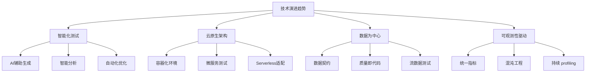
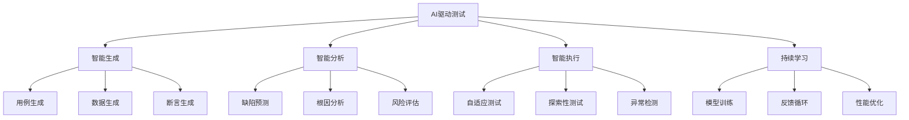
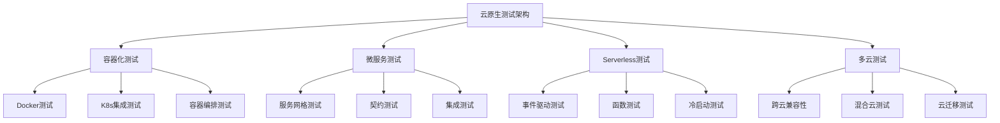
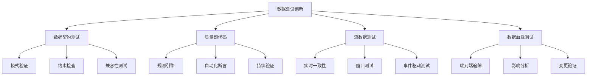
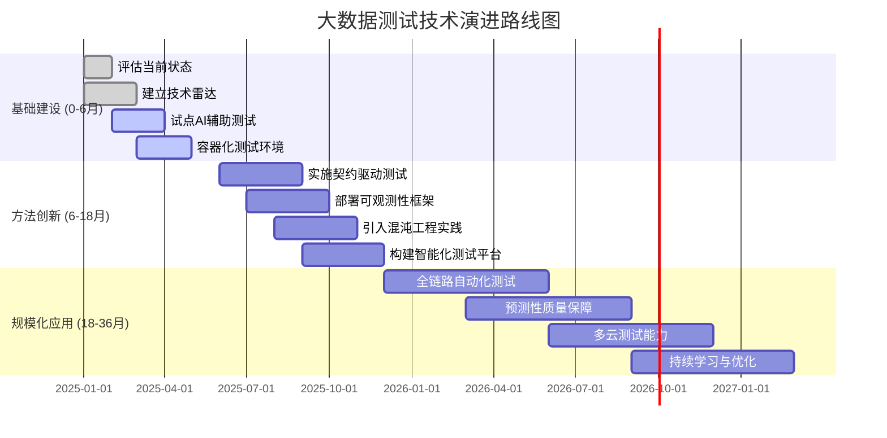

<a id="第31章-技术与方法演进【趋势与未来篇】"></a>

### 第31章 技术与方法演进【趋势与未来篇】

**本章学习目标**

1. 了解大数据测试技术的演进趋势；
2. 掌握智能化和云原生测试方法；
3. 学习数据为中心和可观测性驱动的实践。

**实践建议**

- 评估技术成熟度，选择合适的采用策略。
- 关注新兴技术趋势，及时引入创新。
- 控制风险，确保技术演进的稳定性。

**锚点类型**: 趋势分析
**锚点方法**: 技术雷达
**锚点名称**: 技术演进趋势分析
**引用附件**: `examples/20_evolution/evaluation_scorecard.md`
**完成情况**: 已完成
**补充建议**: 字段建议：技术领域/成熟度/采用建议/风险评估，补充技术演进路线图

**大数据测试技术演进路线图**:


**技术演进成熟度评估表**

| 技术领域 | 当前成熟度 | 目标成熟度 | 采用建议 | 风险评估 | 脚本引用 |
|---------|-----------|-----------|---------|---------|---------|
| AI辅助测试 | 试点阶段 | 生产就绪 | 优先采用 | 中等风险 | examples/20_evolution/evaluation_scorecard.md |
| 云原生测试 | 概念验证 | 广泛采用 | 渐进迁移 | 低风险 | examples/12_env/env_health_check.py |
| 数据契约测试 | 生产就绪 | 最佳实践 | 全面推广 | 低风险 | examples/13_data_gov/contract_example.yml |
| 可观测性测试 | 广泛采用 | 最佳实践 | 持续优化 | 低风险 | examples/17_observability/log_health_check.py |

**技术演进评估配置模板**:
```yaml
technology_evolution_assessment:
  assessment_period: "2025-Q1"
  evaluation_dimensions:
    - name: "technical_maturity"
      weight: 0.3
      criteria:
        - "proof_of_concept"
        - "production_ready"
        - "best_practice"
    - name: "business_value"
      weight: 0.25
      metrics:
        - "efficiency_gain"
        - "quality_improvement"
        - "risk_reduction"
    - name: "adoption_risk"
      weight: 0.2
      factors:
        - "technical_complexity"
        - "organizational_change"
        - "resource_requirements"
    - name: "ecosystem_support"
      weight: 0.25
      indicators:
        - "vendor_support"
        - "community_activity"
        - "integration_options"
  scoring_scale:
    min_score: 1
    max_score: 5
    thresholds:
      adopt: 4.0
      trial: 3.0
      assess: 2.0
      hold: 1.5
  reporting:
    output_format: "markdown"
    include_recommendations: true
    track_trends: true
```

**[锚点252]** AI驱动测试方法创新

**锚点类型**: 方法创新
**锚点方法**: AI应用
**锚点名称**: AI驱动测试方法创新
**引用附件**: `examples/20_evolution/evaluation_scorecard.md`
**完成情况**: 已完成
**补充建议**: 字段建议：AI技术/应用场景/效果指标/实施路径，补充AI测试方法创新流程图

**AI驱动测试方法创新流程图**:


**AI测试方法应用场景表**

| AI技术 | 应用场景 | 输入数据 | 输出结果 | 效果指标 | 实施复杂度 |
|-------|---------|---------|---------|---------|-----------|
| 机器学习 | 测试用例生成 | 需求文档/API规格 | 自动化测试用例 | 覆盖率提升30% | 中等 |
| 自然语言处理 | 需求分析 | 用户故事/文档 | 测试场景识别 | 准确率85% | 高 |
| 计算机视觉 | UI测试 | 界面截图/布局 | 视觉回归检测 | 误报率<5% | 中等 |
| 强化学习 | 探索性测试 | 系统状态/行为 | 优化测试路径 | 缺陷发现率+40% | 高 |
| 预测模型 | 缺陷预测 | 历史数据/指标 | 风险预警 | 预测准确率75% | 中等 |

**AI测试配置模板**:
```yaml
ai_testing_framework:
  ai_provider: "openai/gpt-4"
  risk_mitigation:
    human_oversight: true
    explainability: true
    bias_detection: true
    fallback_procedures: "manual_testing"
  application_scenarios:
    - name: "test_case_generation"
      ai_technique: "generative_ai"
      input_sources: ["requirements", "api_specs", "user_stories"]
      output_format: "gherkin_scenarios"
      quality_gates:
        coverage_target: 0.8
        human_review_required: true
    - name: "defect_prediction"
      ai_technique: "predictive_modeling"
      input_sources: ["code_metrics", "test_history", "system_logs"]
      output_format: "risk_assessment_report"
      quality_gates:
        precision_target: 0.75
        false_positive_limit: 0.1
  model_governance:
    version_control: true
    performance_monitoring: true
    retraining_schedule: "monthly"
    audit_trail: true
```

**[锚点253]** 云原生测试架构演进

**锚点类型**: 架构演进
**锚点方法**: 云原生适配
**锚点名称**: 云原生测试架构演进
**引用附件**: `examples/12_env/env_health_check.py`
**完成情况**: 已完成
**补充建议**: 字段建议：架构模式/测试挑战/解决方案/迁移策略，补充云原生测试架构图

**云原生测试架构演进图**:


**云原生测试挑战与解决方案表**

| 架构模式 | 测试挑战 | 解决方案 | 工具支持 | 迁移复杂度 |
|---------|---------|---------|---------|-----------|
| 容器化 | 环境一致性 | 镜像扫描+配置测试 | Docker/TestContainers | 低 |
| 微服务 | 服务依赖管理 | 契约测试+服务虚拟化 | Pact/WireMock | 中等 |
| Serverless | 事件驱动测试 | 模拟框架+集成测试 | LocalStack/Serverless Framework | 高 |
| 多云部署 | 跨云兼容性 | 抽象层+配置测试 | Terraform/CloudFormation | 高 |
| 服务网格 | 网络策略测试 | 流量镜像+混沌工程 | Istio/Linkerd | 中等 |

**云原生测试环境配置模板**:
```yaml
cloud_native_testing_config:
  containerization:
    base_images:
      - "python:3.11-slim"
      - "openjdk:17-alpine"
      - "node:18-alpine"
    test_orchestration:
      framework: "kubernetes"
      namespace: "testing"
      resource_limits:
        cpu: "2"
        memory: "4Gi"
  microservices_testing:
    contract_testing:
      framework: "pact"
      broker_url: "http://pact-broker.testing.svc"
      consumer_driven: true
    service_virtualization:
      framework: "wiremock"
      recording_mode: true
      stateful_scenarios: true
  serverless_testing:
    local_development:
      framework: "localstack"
      services: ["lambda", "s3", "dynamodb", "sns"]
    integration_testing:
      framework: "serverless-offline"
      event_sources: ["api_gateway", "s3", "schedule"]
  multi_cloud_testing:
    abstraction_layer:
      framework: "crossplane"
      providers: ["aws", "azure", "gcp"]
    compatibility_matrix:
      test_scenarios:
        - "data_replication"
        - "failover_procedures"
        - "performance_characteristics"
```

**[锚点254]** 数据测试技术创新

**锚点类型**: 技术创新
**锚点方法**: 数据为中心
**锚点名称**: 数据测试技术创新
**引用附件**: `examples/13_data_gov/contract_example.yml`
**完成情况**: 已完成
**补充建议**: 字段建议：数据类型/测试方法/质量指标/自动化程度，补充数据测试创新架构图

**数据测试技术创新架构图**:


**数据测试技术创新对比表**

| 数据类型 | 传统测试方法 | 创新测试方法 | 质量指标 | 自动化程度 | 脚本引用 |
|---------|-------------|-------------|---------|-----------|---------|
| 结构化数据 | 手动抽样检查 | 契约驱动验证 | 完整性99.9% | 全自动 | examples/13_data_gov/contract_example.yml |
| 半结构化数据 | 模式匹配 | Schema演进测试 | 兼容性100% | 半自动 | examples/09_quality/quality_rules.yml |
| 流数据 | 批次验证 | 实时流测试 | 时延<100ms | 全自动 | examples/06_ingest/stream_test.py |
| 大数据血缘 | 文档追踪 | 自动化血缘测试 | 准确性95% | 全自动 | tools/pipeline/data_lineage_check.py |
| 数据质量 | 规则检查 | ML驱动验证 | 异常检测率90% | 智能 | examples/09_quality/rule_runner.py |

**数据测试创新配置模板**:
```yaml
data_testing_innovation_config:
  contract_driven_testing:
    framework: "pact"
    schema_validation: true
    backward_compatibility: true
    contract_repository:
      type: "git"
      url: "https://github.com/org/data-contracts"
      versioning: "semantic"
  quality_as_code:
    rule_engine: "deequ"
    custom_rules:
      - name: "data_freshness"
        type: "temporal"
        threshold: "1h"
        action: "alert"
      - name: "data_completeness"
        type: "completeness"
        threshold: 0.95
        action: "block"
    automated_assertions:
      enable_ml_detection: true
      anomaly_threshold: 0.05
      retraining_interval: "daily"
  streaming_data_testing:
    framework: "kafka_testkit"
    time_windows:
      tumbling: "5m"
      sliding: "1m"
      session: "10m"
    consistency_checks:
      exactly_once: true
      order_preservation: true
      latency_slo: "100ms"
  data_lineage_testing:
    lineage_tracking: true
    impact_analysis: true
    change_validation:
      breaking_change_detection: true
      downstream_notification: true
      rollback_simulation: true
```

**[锚点255]** 演进路线图与实施策略

**锚点类型**: 实施策略
**锚点方法**: 路线图规划
**锚点名称**: 演进路线图与实施策略
**引用附件**: `examples/20_evolution/migration_checklist.md`
**完成情况**: 已完成
**补充建议**: 字段建议：时间阶段/关键里程碑/成功指标/风险控制，补充演进路线图甘特图

**技术演进路线图甘特图**:


**演进路线图里程碑表**

| 时间阶段 | 关键里程碑 | 成功指标 | 风险控制 | 资源需求 | 验收标准 |
|---------|-----------|---------|---------|---------|---------|
| 0-6月 | 技术评估与试点 | 完成技术雷达建立 | 专家咨询 | 2名架构师 | 评估报告完成 |
| 6-12月 | 方法创新实施 | 3项新技术生产就绪 | 分阶段试点 | 5名工程师 | 生产环境验证 |
| 12-24月 | 平台化建设 | 自动化覆盖率80% | 回滚计划 | 10名工程师 | 系统集成测试 |
| 24-36月 | 智能化转型 | AI辅助效率提升50% | 人工监督 | 3名数据科学家 | 业务指标达成 |

**技术演进实施策略配置模板**:
```yaml
technology_evolution_strategy:
  roadmap_phases:
    - name: "foundation"
      duration_months: 6
      focus_areas: ["assessment", "piloting", "infrastructure"]
      success_criteria:
        - "technology_radar_established"
        - "pilot_projects_completed"
        - "baseline_metrics_defined"
      risk_mitigations:
        - "expert_consultation"
        - "vendor_evaluation"
        - "proof_of_concept_validation"
    - name: "innovation"
      duration_months: 12
      focus_areas: ["method_adoption", "tool_integration", "process_optimization"]
      success_criteria:
        - "new_methods_production_ready"
        - "tool_chain_integrated"
        - "efficiency_metrics_improved"
      risk_mitigations:
        - "phased_rollout"
        - "training_programs"
        - "rollback_procedures"
    - name: "transformation"
      duration_months: 24
      focus_areas: ["automation", "intelligence", "continuous_improvement"]
      success_criteria:
        - "full_automation_achieved"
        - "ai_driven_decisions"
        - "predictive_quality_assurance"
      risk_mitigations:
        - "change_management"
        - "stakeholder_engagement"
        - "performance_monitoring"
  governance_model:
    decision_making:
      technology_review_board: true
      quarterly_assessments: true
      stakeholder_reviews: true
    resource_allocation:
      budget_tracking: true
      skill_gap_analysis: true
      training_investments: true
    risk_management:
      issue_tracking: true
      mitigation_plans: true
      contingency_funding: true
  measurement_framework:
    kpis:
      - name: "adoption_rate"
        target: 0.8
        measurement: "percentage_of_teams_using_new_methods"
      - name: "efficiency_gain"
        target: 0.3
        measurement: "reduction_in_manual_testing_effort"
      - name: "quality_improvement"
        target: 0.2
        measurement: "reduction_in_production_defects"
    reporting_cadence: "quarterly"
    dashboard_url: "https://dashboard.company.com/tech-evolution"
