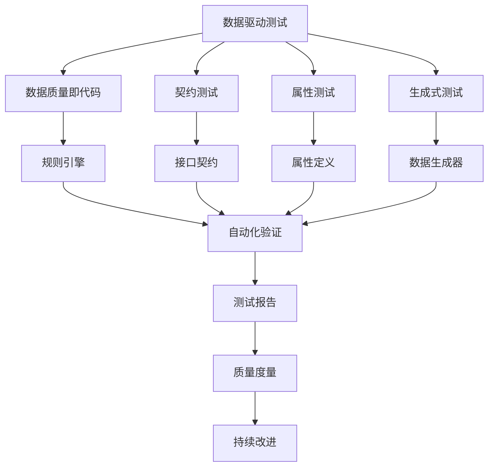
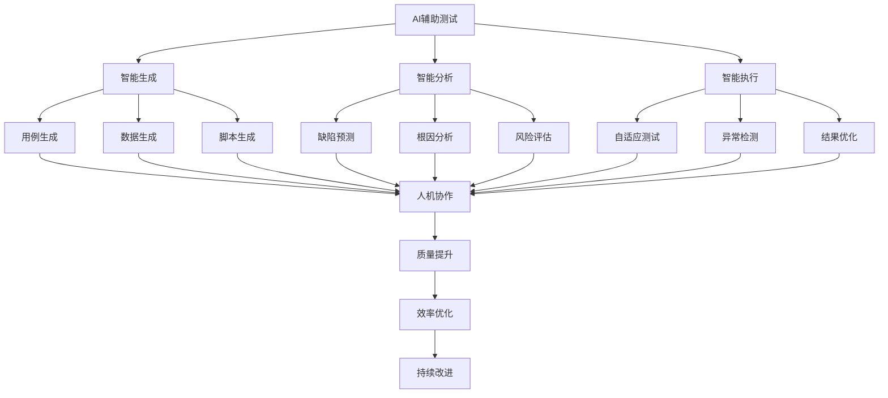
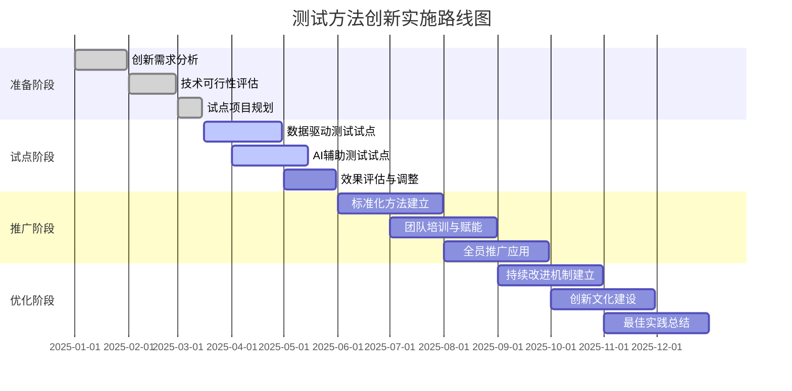
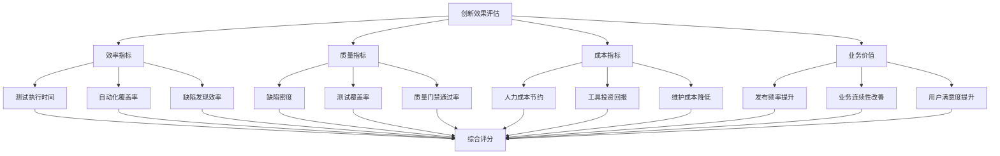

<a id="第32章-大数据测试人才与职业发展【成长与进阶篇】"></a>

### 第32章 大数据测试人才与职业发展【成长与进阶篇】

**本章学习目标**

1. 理解大数据测试方法的创新趋势和方向；
2. 掌握新兴测试方法的最佳实践；
3. 为团队制定方法创新和改进策略。

**实践建议**

- 关注技术演进和业务需求，驱动方法创新。
- 提升团队技能，适应新技术栈。
- 建立数据驱动的测试文化。

## 测试方法创新的驱动力分析

### 技术演进驱动因素

**大数据技术栈的快速演进**：
- **实时流处理技术成熟**：Flink、Spark Streaming等技术的发展，要求测试方法从批量向实时转变
- **云原生架构普及**：容器化、微服务化要求测试方法适应分布式、动态环境
- **AI/ML集成深化**：机器学习在数据处理中的应用，要求测试方法覆盖模型验证和数据漂移检测

**数据生态的复杂化**：
- **数据类型多样化**：结构化、半结构化、非结构化数据的混合处理
- **数据规模指数增长**：从GB级到PB级的数据量级变化
- **数据时效性要求提升**：从T+1到实时的数据处理要求

### 业务需求驱动因素

**质量保障要求的提升**：
- **用户体验敏感度增加**：毫秒级延迟和99.99%可用性的严格要求
- **合规监管日趋严格**：GDPR、CCPA等隐私保护法规的强制要求
- **业务连续性依赖增强**：系统宕机可能导致重大经济损失

**成本效益优化压力**：
- **测试效率提升需求**：传统手动测试已无法满足快速迭代需求
- **资源利用率优化**：云计算环境下成本意识的觉醒
- **人力成本控制**：测试工程师短缺与高成本的矛盾

### 组织能力驱动因素

**团队技能转型需求**：
- **技术栈更新换代**：从传统测试技术向智能化测试转型
- **跨域能力要求**：测试工程师需要掌握数据、AI、云原生等多领域知识
- **学习文化建设**：持续学习与知识更新的组织文化需求

**[锚点271]** 数据驱动测试方法创新

**锚点类型**: 方法创新
**锚点方法**: 数据为中心
**锚点名称**: 数据驱动测试方法创新
**引用附件**: `examples/13_data_gov/contract_example.yml`
**完成情况**: 已完成
**补充建议**: 字段建议：数据类型/测试方法/质量指标/自动化程度，补充数据驱动测试创新架构图

**数据驱动测试创新架构图**:


**数据驱动测试方法对比表**

| 测试方法 | 核心思想 | 适用场景 | 自动化程度 | 维护成本 | 覆盖率提升 |
|---------|---------|---------|-----------|---------|-----------|
| 数据质量即代码 | 将质量规则代码化 | 数据管道测试 | 高 | 中 | 80% |
| 契约测试 | 基于接口契约验证 | API/微服务测试 | 高 | 低 | 70% |
| 属性测试 | 基于属性生成测试 | 算法/函数测试 | 中高 | 中 | 90% |
| 生成式测试 | AI生成测试用例 | 复杂业务逻辑 | 高 | 高 | 85% |

**数据驱动测试配置模板**:
```yaml
data_driven_testing:
  quality_as_code:
    rules_engine:
      rule_language: "python"
      validation_framework: "great_expectations"
      rule_repository: "git"
      ci_integration: true

  contract_testing:
    contract_format: "pact"
    broker_url: "pact-broker.company.com"
    consumer_driven: true
    provider_verification: "automated"

  property_testing:
    framework: "hypothesis"
    generators:
      - type: "integers"
        strategy: "random"
        constraints: {"min": 0, "max": 1000}
      - type: "strings"
        strategy: "text"
        constraints: {"alphabet": "alphanumeric", "max_length": 100}

  generative_testing:
    ai_model: "gpt-4"
    training_data: "historical_test_cases"
    generation_rules:
      coverage_targets: ["edge_cases", "boundary_values", "error_scenarios"]
      quality_thresholds: {"validity": 0.9, "diversity": 0.8}
```

**[锚点272]** AI辅助测试技术应用

**锚点类型**: 技术创新
**锚点方法**: AI应用
**锚点名称**: AI辅助测试技术应用
**引用附件**: `examples/20_evolution/evaluation_scorecard.md`
**完成情况**: 已完成
**补充建议**: 字段建议：AI技术/应用场景/效果指标/实施路径，补充AI测试技术应用流程图

**AI辅助测试技术应用流程图**:


**AI测试技术应用场景表**

| AI技术 | 应用场景 | 效果指标 | 实施复杂度 | 成熟度 |
|-------|---------|---------|-----------|-------|
| 机器学习测试用例生成 | 回归测试用例扩充 | 覆盖率提升30% | 中等 | 高 |
| 缺陷预测模型 | 代码提交风险评估 | 缺陷发现率提升25% | 高 | 中 |
| 根因分析AI | 测试失败原因定位 | 调试时间减少40% | 中等 | 高 |
| 智能测试执行 | 动态测试路径优化 | 执行效率提升35% | 高 | 中 |
| 自然语言处理 | 需求文档测试用例提取 | 需求覆盖率提升20% | 中等 | 中 |

**AI测试配置模板**:
```yaml
ai_assisted_testing:
  test_case_generation:
    ml_model: "random_forest"
    training_data: "historical_test_cases"
    features: ["code_complexity", "change_frequency", "historical_defects"]
    generation_rules:
      coverage_target: 0.85
      diversity_threshold: 0.7
      quality_gate: "human_review_required"

  defect_prediction:
    model_type: "neural_network"
    input_features: ["code_metrics", "test_results", "commit_patterns"]
    prediction_window: "24h"
    confidence_threshold: 0.8
    alert_channels: ["email", "slack", "jira"]

  root_cause_analysis:
    nlp_model: "bert"
    log_parsing: "structured"
    correlation_analysis: "statistical"
    explanation_format: "natural_language"
    integration_tools: ["elasticsearch", "grafana"]

  intelligent_execution:
    reinforcement_learning:
      reward_function: "test_efficiency + defect_detection"
      exploration_rate: 0.1
      learning_rate: 0.01
    adaptive_scheduling:
      resource_awareness: true
      priority_optimization: true
      failure_recovery: "automatic"
```

**[锚点273]** 测试方法创新实施策略

**锚点类型**: 实施策略
**锚点方法**: 路线图规划
**锚点名称**: 测试方法创新实施策略
**引用附件**: `examples/20_evolution/migration_checklist.md`
**完成情况**: 已完成
**补充建议**: 字段建议：时间阶段/关键里程碑/成功指标/风险控制，补充创新实施路线图甘特图

**测试方法创新实施路线图甘特图**:


**创新实施策略对比表**

| 实施策略 | 执行方式 | 风险等级 | 资源需求 | 时间周期 | 成功率 |
|---------|---------|---------|---------|---------|-------|
| 渐进式创新 | 小步快跑，逐步推广 | 低 | 中等 | 6-12个月 | 高 |
| 试点先行 | 选择关键项目试点 | 中 | 中等 | 3-6个月 | 中高 |
| 全员变革 | 全面引入新方法 | 高 | 高 | 12-18个月 | 中 |
| 混合策略 | 结合多种实施方式 | 中 | 高 | 9-15个月 | 高 |

**创新实施配置模板**:
```yaml
innovation_implementation:
  phased_approach:
    preparation_phase:
      duration_months: 3
      deliverables: ["innovation_roadmap", "feasibility_study", "pilot_plan"]
      success_criteria: ["stakeholder_alignment", "resource_commitment"]

    pilot_phase:
      duration_months: 3
      scope: "critical_business_area"
      metrics: ["efficiency_gain", "quality_improvement", "adoption_rate"]
      risk_mitigation: ["rollback_plan", "expert_support"]

    rollout_phase:
      duration_months: 6
      training_program: "comprehensive"
      change_management: "structured"
      support_model: "center_of_excellence"

  organizational_readiness:
    culture_assessment:
      innovation_maturity: "assess_current_state"
      change_readiness: "survey_and_interviews"
      leadership_support: "executive_sponsorship"

    capability_building:
      skill_gap_analysis: "identify_training_needs"
      learning_pathways: "certification_programs"
      knowledge_sharing: "communities_of_practice"

    incentive_alignment:
      performance_metrics: "innovation_contribution"
      recognition_programs: "innovation_awards"
      career_progression: "technical_ladder"
```

**[锚点274]** 创新效果量化评估

**锚点类型**: 效果评估
**锚点方法**: 指标量化
**锚点名称**: 创新效果量化评估
**引用附件**: `tools/reports/strategy_hit_summary.py`
**完成情况**: 已完成
**补充建议**: 字段建议：评估维度/量化指标/基准值/改进目标，补充创新效果评估仪表板

**创新效果评估仪表板**:


**创新效果量化指标表**

| 评估维度 | 关键指标 | 基准值 | 改进目标 | 衡量周期 | 数据来源 |
|---------|---------|-------|---------|---------|---------|
| 测试效率 | 执行时间缩短率 | 0% | 40% | 月度 | CI/CD流水线 |
| 自动化程度 | 自动化测试覆盖率 | 30% | 80% | 季度 | 测试管理平台 |
| 缺陷管理 | 缺陷发现提前率 | 20% | 60% | 月度 | 缺陷跟踪系统 |
| 质量提升 | 生产缺陷密度 | 5/KSLOC | 2/KSLOC | 季度 | 生产监控系统 |
| 成本效益 | 测试ROI | 1:1 | 1:3 | 年度 | 财务系统 |
| 业务价值 | 发布频率 | 每月2次 | 每周2次 | 月度 | 发布管理系统 |

**创新效果评估配置模板**:
```yaml
innovation_evaluation:
  metrics_framework:
    efficiency_metrics:
      test_execution_time:
        baseline: "8h"
        target: "4.8h"
        measurement: "automated"
        frequency: "daily"
      automation_coverage:
        baseline: 0.3
        target: 0.8
        measurement: "code_analysis"
        frequency: "weekly"

    quality_metrics:
      defect_density:
        baseline: 5.0
        target: 2.0
        unit: "defects_per_ksloc"
        measurement: "static_analysis"
      test_coverage:
        baseline: 0.6
        target: 0.9
        measurement: "coverage_tools"
        frequency: "per_release"

    business_value_metrics:
      deployment_frequency:
        baseline: 2
        target: 14
        unit: "per_month"
        measurement: "deployment_pipeline"
      lead_time:
        baseline: "14d"
        target: "3d"
        measurement: "from_commit_to_deploy"

  evaluation_methodology:
    baseline_establishment:
      period: "3_months"
      statistical_method: "rolling_average"
      confidence_interval: 0.95

    progress_tracking:
      dashboard: "real_time"
      alerting: "threshold_based"
      reporting: "monthly_executive_summary"

    roi_calculation:
      cost_components: ["tool_investment", "training_cost", "maintenance"]
      benefit_components: ["efficiency_gain", "quality_improvement", "business_value"]
      payback_period_target: "12_months"
```

## 测试方法创新实践案例分析

### 数据驱动测试转型案例

**互联网金融公司测试创新实践**：
- **转型背景**：传统手动测试无法应对日均数十次代码部署
- **创新方案**：实施数据驱动测试框架，重构测试流程
- **技术实现**：
  - 建立数据质量即代码体系，覆盖90%数据管道
  - 实施契约测试，确保API接口稳定性
  - 引入属性测试，提升算法测试覆盖率
- **实施成果**：
  - **测试效率提升**：测试执行时间从8小时缩短到2小时
  - **缺陷发现率**：生产缺陷减少65%，回归测试覆盖率达95%
  - **团队效率**：测试工程师从编写测试代码转向质量保障策略设计
- **经验总结**：
  - 数据驱动测试需要前期数据治理基础
  - 渐进式实施，避免激进变革带来的风险
  - 持续的数据质量监控是成功关键

**测试方法创新的理论基础**：

**测试方法演进理论模型**：
```
传统测试 → 自动化测试 → 数据驱动测试 → 智能化测试 → 自适应测试

演进动力：
- 技术进步：编程语言、框架、工具的发展
- 需求变化：业务复杂度、交付速度、质量要求的提升
- 认知升级：从被动验证到主动保障的理念转变
- 生态完善：开源社区、商业工具、行业标准的成熟
```

**创新扩散理论在测试方法中的应用**：
- **创新者**：技术领先企业，承担风险进行方法创新
- **早期采用者**：技术敏感企业，快速跟进新兴方法
- **早期多数**：谨慎观望企业，待方法成熟后采用
- **晚期多数**：保守型企业，待成为行业标准后采用
- **落后者**：传统企业，被迫采用以保持竞争力

### AI辅助测试规模化应用案例

**大型电商平台智能化测试实践**：
- **应用场景**：双11大促期间系统稳定性保障
- **AI技术应用**：
  - 基于历史数据的智能测试用例生成
  - 实时缺陷预测和根因分析
  - 自适应测试执行优化资源分配
- **技术架构**：
  - 机器学习模型训练历史测试数据
  - 自然语言处理解析需求文档
  - 强化学习优化测试执行路径
- **业务价值**：
  - **峰值处理能力**：双11当天处理订单量提升20%
  - **故障响应速度**：平均故障定位时间从2小时缩短到15分钟
  - **测试资源利用**：计算资源使用效率提升40%
- **挑战与解决方案**：
  - AI模型准确性：建立人机协作机制，确保质量
  - 数据隐私保护：实施数据脱敏和访问控制
  - 技术团队能力：开展专项培训和知识转移

**AI测试的理论基础**：

**机器学习在测试中的理论模型**：
```
监督学习：缺陷预测、分类
- 输入：代码度量、历史数据、测试结果
- 算法：随机森林、神经网络、SVM
- 输出：缺陷概率、分类标签、风险评分

无监督学习：异常检测、聚类分析
- 输入：系统指标、日志数据、性能数据
- 算法：孤立森林、聚类算法、PCA降维
- 输出：异常模式、数据分布、趋势分析

强化学习：测试策略优化
- 状态：测试环境、资源状态、进度信息
- 动作：测试用例选择、执行顺序、资源分配
- 奖励：覆盖率提升、缺陷发现、时间效率
- 目标：最大化测试效果，优化资源利用
```

**AI测试的信任与可解释性理论**：
- **模型可解释性**：特征重要性分析、决策路径可视化
- **结果可信度**：置信区间计算、预测不确定性量化
- **人机协作机制**：AI建议 + 人工审核的双重保障
- **持续学习框架**：在线学习、反馈循环、模型更新机制

### 创新方法综合效益评估案例

**制造业数字化转型测试创新**：
- **转型目标**：支持智能制造系统的质量保障
- **创新组合**：
  - 数据驱动测试 + AI辅助测试 + 持续集成
  - 建立测试方法创新中心
  - 实施敏捷测试流程
- **量化收益**：
  - **开发效率**：产品发布周期从6个月缩短到2个月
  - **质量水平**：生产系统可用性从99.5%提升到99.9%
  - **成本效益**：测试相关成本降低30%，ROI达250%
- **可持续价值**：
  - 建立测试方法创新生态系统
  - 培养复合型测试人才梯队
  - 形成行业领先的质量保障能力

**创新管理理论框架**：

**组织变革管理理论**：
```
Lewin变革模型在测试创新中的应用：
- 解冻阶段：打破传统测试观念，创造变革需求
- 变革阶段：引入新方法，培训团队，调整流程
- 再冻结阶段：固化新方法，建立支持性文化和制度

关键成功因素：
- 领导力支持：高层领导的积极推动和资源投入
- 沟通策略：清晰的变革愿景和利益沟通
- 培训赋能：系统的技能提升和知识转移
- 激励机制：认可创新贡献，激励持续改进
```

**测试创新的生命周期管理**：
- **萌芽期**：识别创新机会，概念验证
- **成长期**：技术完善，试点应用，效果验证
- **成熟期**：标准化，规模化推广，最佳实践总结
- **衰退期**：技术更新，逐步替换或升级

**效果评估的统计学基础**：

**假设检验在创新效果评估中的应用**：
```
零假设(H0)：创新方法无显著效果
备择假设(H1)：创新方法有显著效果

检验类型：
- t检验：比较前后均值差异（如缺陷密度）
- 卡方检验：比较分类变量分布（如缺陷类型）
- 回归分析：分析影响因素与效果的关系

统计功效分析：
- 效应量：实际效果的标准化度量
- 样本量：确保检验有足够统计效力
- 置信区间：效果估计的不确定性范围
```

**ROI计算的经济学模型**：
```
创新投资回报率 = (收益现值 - 成本现值) / 成本现值 × 100%

成本构成：
- 一次性成本：工具采购、培训投入、咨询费用
- 持续成本：维护费用、升级成本、运营开销

收益构成：
- 直接收益：效率提升、成本节约、质量改善
- 间接收益：业务增长、风险降低、声誉提升
- 无形收益：技术领先、人才吸引、文化建设

净现值(NPV) = Σ(年度收益 / (1+r)^t) - 初始投资
内部收益率(IRR)：使NPV=0的折现率
投资回收期：累计收益等于初始投资的时间
```

## 测试方法创新发展趋势展望

### 技术融合趋势

**AI与大数据深度集成**：
- **智能测试决策**：基于大数据的AI测试策略优化
- **预测性质量管理**：利用机器学习预测质量风险
- **自动化测试生成**：AI驱动的端到端测试用例生成
- **认知测试执行**：理解业务逻辑的智能测试执行

**云原生测试范式演进**：
- **Serverless测试**：事件驱动的无服务器测试架构
- **容器化测试环境**：标准化、可移植的测试环境
- **混沌工程集成**：系统性故障注入和恢复测试
- **GitOps测试流程**：声明式的测试基础设施管理

### 组织能力建设

**测试文化转型**：
- **质量即代码文化**：开发与测试深度融合
- **持续学习机制**：技术快速迭代的学习体系
- **创新激励机制**：认可和奖励测试创新贡献
- **跨域协作模式**：开发、测试、运维一体化协作

**人才能力升级**：
- **复合型人才培养**：测试+数据+AI+云原生技能组合
- **自动化技能提升**：从脚本编写到平台构建的能力转型
- **业务理解深化**：测试人员对业务领域的深入理解
- **领导力发展**：测试团队的技术领导力和创新驱动能力

### 行业最佳实践

**测试方法创新成熟度模型**：

**Level 1 - 传统阶段**：依赖手动测试，自动化覆盖率<30%
**Level 2 - 自动化阶段**：建立自动化测试框架，覆盖率30-70%
**Level 3 - 数据驱动阶段**：实施数据驱动测试，质量即代码实践
**Level 4 - 智能化阶段**：引入AI辅助测试，预测性质量管理
**Level 5 - 创新领先阶段**：建立测试创新生态，引领行业发展

**实施路线图建议**：
1. **基础建设**（0-6个月）：建立自动化测试基础
2. **方法创新**（6-12个月）：引入数据驱动和AI技术
3. **规模化应用**（12-18个月）：全员推广和标准化
4. **持续优化**（18个月+）：基于数据驱动的持续改进

大数据测试方法创新是质量保障能力现代化的必由之路，通过数据驱动、AI辅助、组织创新的综合应用，可以有效提升测试效率、质量水平和业务价值，为企业数字化转型提供坚实的技术支撑。
