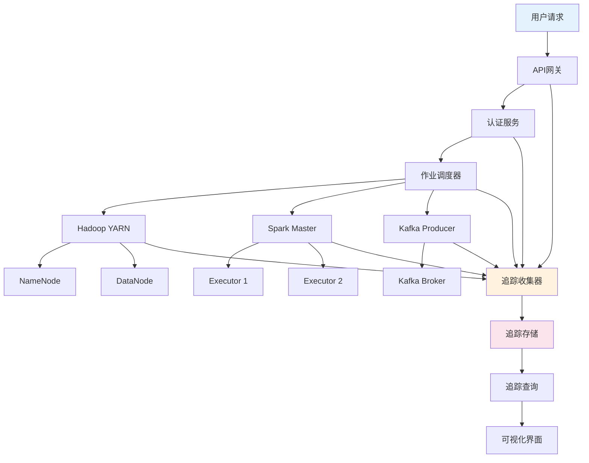
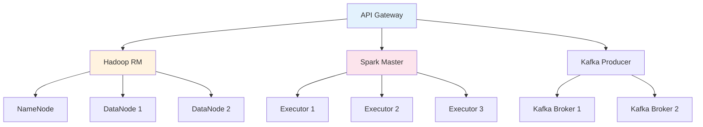

# examples/15_framework/distributed_tracing.md
# 分布式追踪实现

## 追踪架构设计

### 分布式追踪概念

#### 核心概念
- **Trace**: 完整请求链路的唯一标识
- **Span**: 请求链路中的单个操作单元
- **Context**: 跨服务传播的上下文信息
- **采样**: 为控制性能开销而选择性记录请求

#### 追踪数据模型
```json
{
  "trace_id": "abc123-def456-ghi789",
  "span_id": "span-001",
  "parent_span_id": "span-000",
  "name": "hadoop_job_submit",
  "start_time": "2025-12-24T10:30:00.000Z",
  "end_time": "2025-12-24T10:30:15.123Z",
  "duration_ms": 15123,
  "service": "hadoop-resourcemanager",
  "operation": "submit_application",
  "tags": {
    "user": "data_analyst",
    "queue": "default",
    "priority": "normal",
    "application_type": "spark"
  },
  "logs": [
    {
      "timestamp": "2025-12-24T10:30:05.000Z",
      "event": "queue_assigned",
      "fields": {"queue_name": "default"}
    },
    {
      "timestamp": "2025-12-24T10:30:10.000Z",
      "event": "resources_allocated",
      "fields": {"memory_mb": 2048, "vcores": 4}
    }
  ]
}
```

### 大数据追踪架构



## 追踪实现配置

### OpenTelemetry配置

#### Java应用追踪配置
```java
// Hadoop组件追踪配置
import io.opentelemetry.api.OpenTelemetry;
import io.opentelemetry.api.trace.Tracer;
import io.opentelemetry.sdk.trace.SdkTracerProvider;
import io.opentelemetry.exporter.jaeger.JaegerGrpcSpanExporter;
import io.opentelemetry.sdk.trace.export.BatchSpanProcessor;

public class HadoopTracingConfig {

    public static OpenTelemetry initTracing() {
        // Jaeger导出器配置
        JaegerGrpcSpanExporter jaegerExporter = JaegerGrpcSpanExporter.builder()
            .setEndpoint("http://jaeger-collector:14250")
            .setServiceName("hadoop-namenode")
            .build();

        // 批量Span处理器
        BatchSpanProcessor spanProcessor = BatchSpanProcessor.builder(jaegerExporter)
            .setScheduleDelayMillis(5000)
            .setMaxExportBatchSize(512)
            .setMaxQueueSize(2048)
            .build();

        // TracerProvider配置
        SdkTracerProvider tracerProvider = SdkTracerProvider.builder()
            .addSpanProcessor(spanProcessor)
            .setSampler(Sampler.traceIdRatioBased(0.1)) // 10%采样率
            .build();

        return OpenTelemetry.builder()
            .setTracerProvider(tracerProvider)
            .build();
    }
}
```

#### Spark应用追踪配置
```scala
// SparkTracingConfig.scala
import io.opentelemetry.api.OpenTelemetry
import io.opentelemetry.sdk.trace.SdkTracerProvider
import io.opentelemetry.exporter.jaeger.JaegerGrpcSpanExporter
import io.opentelemetry.sdk.trace.export.BatchSpanProcessor
import org.apache.spark.SparkConf

object SparkTracingConfig {

  def initTracing(sparkConf: SparkConf): OpenTelemetry = {
    // 从Spark配置获取Jaeger地址
    val jaegerHost = sparkConf.get("spark.tracing.jaeger.host", "jaeger-collector")
    val jaegerPort = sparkConf.getInt("spark.tracing.jaeger.port", 14250)
    val serviceName = sparkConf.get("spark.tracing.service.name", "spark-application")

    // Jaeger导出器
    val jaegerExporter = JaegerGrpcSpanExporter.builder()
      .setEndpoint(s"http://$jaegerHost:$jaegerPort")
      .setServiceName(serviceName)
      .build()

    // Span处理器
    val spanProcessor = BatchSpanProcessor.builder(jaegerExporter)
      .setScheduleDelayMillis(5000)
      .setMaxExportBatchSize(512)
      .build()

    // TracerProvider
    val tracerProvider = SdkTracerProvider.builder()
      .addSpanProcessor(spanProcessor)
      .setSampler(Sampler.traceIdRatioBased(0.05)) // 5%采样率
      .build()

    OpenTelemetry.builder()
      .setTracerProvider(tracerProvider)
      .build()
  }
}
```

### Kafka客户端追踪配置
```java
// KafkaTracingConfig.java
import io.opentelemetry.api.OpenTelemetry;
import io.opentelemetry.api.trace.Tracer;
import io.opentelemetry.context.Context;
import org.apache.kafka.clients.producer.ProducerInterceptor;
import org.apache.kafka.clients.consumer.ConsumerInterceptor;

public class KafkaTracingInterceptor implements ProducerInterceptor<String, String> {

    private Tracer tracer;

    @Override
    public void configure(Map<String, ?> configs) {
        OpenTelemetry openTelemetry = (OpenTelemetry) configs.get("opentelemetry.instance");
        this.tracer = openTelemetry.getTracer("kafka-producer");
    }

    @Override
    public ProducerRecord<String, String> onSend(ProducerRecord<String, String> record) {
        // 创建生产者Span
        Span span = tracer.spanBuilder("kafka_produce")
            .setAttribute("kafka.topic", record.topic())
            .setAttribute("kafka.partition", record.partition())
            .startSpan();

        // 将追踪上下文注入消息头
        if (record.headers() != null) {
            TextMapPropagator propagator = W3CTraceContextPropagator.getInstance();
            propagator.inject(Context.current(), record.headers(), (carrier, key, value) -> {
                carrier.add(key, value.getBytes(StandardCharsets.UTF_8));
            });
        }

        span.end();
        return record;
    }

    // ... 其他方法实现
}
```

## 追踪数据管道

### 追踪收集器配置
```yaml
# jaeger-collector.yml
service:
  extensions: [jaeger_storage, jaeger_query]
  pipelines:
    traces:
      receivers: [otlp, jaeger]
      processors: [batch, tail_sampling]
      exporters: [jaeger_storage]

extensions:
  jaeger_storage:
    backends:
      badger:
        span_store_write_cache_size: 100000
      elasticsearch:
        server_urls: ["http://elasticsearch:9200"]
        index_prefix: "jaeger"

  jaeger_query:
    storage:
      traces: badger
      services: badger

receivers:
  otlp:
    protocols:
      grpc:
        endpoint: 0.0.0.0:4317
      http:
        endpoint: 0.0.0.0:4318

  jaeger:
    protocols:
      grpc:
        endpoint: 0.0.0.0:14250
      thrift_http:
        endpoint: 0.0.0.0:14268

processors:
  batch:
    timeout: 1s
    send_batch_size: 1024

  tail_sampling:
    policies:
      - name: latency_policy
        type: latency
        latency:
          threshold_ms: 5000

exporters:
  jaeger_storage:
    trace_storage: badger
```

### 采样策略配置
```yaml
# 采样策略配置
sampling_strategies:
  default_strategy:
    type: probabilistic
    probabilistic:
      sampling_rate: 0.1  # 10%基础采样率

  service_strategies:
    - service: "hadoop-namenode"
      type: rate_limiting
      rate_limiting:
        spans_per_second: 100

    - service: "spark-driver"
      type: probabilistic
      probabilistic:
        sampling_rate: 0.05  # 5%采样率

    - service: "kafka-producer"
      type: adaptive
      adaptive:
        initial_sampling_rate: 0.1
        target_throughput: 1000
        adjustment_interval: 60s

  operation_strategies:
    - operation: "hadoop_job_submit"
      type: always_sample

    - operation: "spark_task_execute"
      type: probabilistic
      probabilistic:
        sampling_rate: 0.01  # 1%采样率
```

## 追踪分析与可视化

### 追踪查询和分析
```sql
-- Jaeger查询示例

-- 1. 查询慢请求
SELECT *
FROM traces
WHERE duration > 5000  # 超过5秒的请求
  AND service = 'hadoop-namenode'
  AND operation = 'file_read'
  AND timestamp >= '2025-12-24 00:00:00'
ORDER BY duration DESC
LIMIT 100

-- 2. 分析错误链路
SELECT trace_id, span_id, operation, error
FROM spans
WHERE error IS NOT NULL
  AND service IN ('spark-driver', 'spark-executor')
  AND timestamp >= '2025-12-24 10:00:00'

-- 3. 性能瓶颈分析
SELECT
  service,
  operation,
  AVG(duration) as avg_duration,
  P95(duration) as p95_duration,
  COUNT(*) as request_count
FROM spans
WHERE timestamp >= '2025-12-24 00:00:00'
GROUP BY service, operation
HAVING request_count > 100
ORDER BY p95_duration DESC
LIMIT 20
```

### Jaeger UI可视化

#### 追踪详情视图
```
Trace ID: abc123-def456-ghi789
Duration: 15.123s
Services: 4
Spans: 23

├── API Gateway (120ms)
│   ├── Authentication (45ms)
│   └── Request Routing (75ms)
│
├── Hadoop ResourceManager (8.5s)
│   ├── Queue Assignment (2.1s)
│   ├── Resource Allocation (3.2s)
│   │   ├── Memory Allocation (1.8s)
│   │   └── CPU Allocation (1.4s)
│   └── Job Submission (3.2s)
│
├── Spark Master (4.2s)
│   ├── Application Registration (1.1s)
│   ├── Executor Launch (2.8s)
│   └── Task Scheduling (0.3s)
│
└── Kafka Producer (2.4s)
    ├── Topic Resolution (0.2s)
    ├── Partition Assignment (0.8s)
    ├── Message Serialization (0.9s)
    └── Network Send (0.5s)
```

#### 依赖关系图


## 性能优化与故障排查

### 追踪性能优化

#### 1. 采样率调优
```yaml
# 动态采样配置
adaptive_sampling:
  target_latency_ms: 100      # 目标延迟
  target_throughput: 1000     # 目标吞吐量
  adjustment_interval: 60s    # 调整间隔
  min_sampling_rate: 0.001    # 最小采样率 0.1%
  max_sampling_rate: 1.0      # 最大采样率 100%

  policies:
    - name: "high_latency"
      condition: "duration > 5000"
      sampling_rate: 1.0

    - name: "error_spans"
      condition: "error != null"
      sampling_rate: 1.0

    - name: "critical_operations"
      condition: "operation in ['job_submit', 'task_execute']"
      sampling_rate: 0.5
```

#### 2. 存储优化
```yaml
# 追踪存储优化
storage_optimization:
  # 数据压缩
  compression:
    algorithm: "lz4"
    level: 3

  # 索引策略
  indexing:
    primary_index: "trace_id"
    secondary_indexes:
      - "service"
      - "operation"
      - "timestamp"

  # 数据保留
  retention:
    hot_data: "7d"      # 热数据7天
    warm_data: "30d"    # 温数据30天
    cold_data: "90d"    # 冷数据90天

  # 分区策略
  partitioning:
    by_time: "1d"       # 按天分区
    by_service: true    # 按服务分区
```

### 故障排查指南

#### 常见性能问题诊断

##### 1. 高延迟请求追踪
```
诊断步骤:
1. 识别慢请求: duration > 阈值
2. 分析调用链: 查看span依赖关系
3. 定位瓶颈: 找出最耗时的span
4. 关联日志: 查看相关错误日志
5. 系统指标: 检查资源使用情况
```

##### 2. 错误传播分析
```
错误追踪流程:
1. 查找错误span: error != null
2. 追溯根因: 分析调用栈
3. 影响评估: 计算受影响的请求数
4. 修复验证: 确认修复效果
```

##### 3. 资源泄漏检测
```
资源监控:
1. 内存泄漏: 持续增长的内存使用
2. 连接泄漏: 未释放的数据库连接
3. 线程泄漏: 不断增加的线程数
4. 文件句柄泄漏: 未关闭的文件描述符
```

### 监控告警配置

#### 追踪相关告警规则
```yaml
# Prometheus告警规则
groups:
  - name: tracing_alerts
    rules:
      - alert: HighLatencyTraces
        expr: |
          rate(traces_duration_sum[5m]) / rate(traces_count[5m]) > 5000
        for: 5m
        labels:
          severity: warning
        annotations:
          summary: "高延迟追踪告警"
          description: "平均请求延迟超过5秒"

      - alert: HighErrorRate
        expr: |
          rate(traces_with_errors_total[5m]) / rate(traces_total[5m]) > 0.05
        for: 5m
        labels:
          severity: warning
        annotations:
          summary: "高错误率追踪告警"
          description: "请求错误率超过5%"

      - alert: TracingDataLoss
        expr: |
          rate(tracing_spans_dropped_total[5m]) > 0
        for: 1m
        labels:
          severity: critical
        annotations:
          summary: "追踪数据丢失"
          description: "检测到追踪数据丢失"
```

## 最佳实践

### 实施建议

1. **渐进式部署**
   - 从关键服务开始实施追踪
   - 逐步增加采样率和覆盖范围
   - 建立追踪数据质量监控

2. **标准化规范**
   - 统一span命名规范
   - 标准化标签和注解
   - 建立追踪数据治理标准

3. **性能监控**
   - 监控追踪系统的性能指标
   - 设置合理的采样率
   - 定期优化存储和查询性能

4. **安全考虑**
   - 避免追踪敏感数据
   - 实施访问控制
   - 符合数据保护法规

### 成熟度评估

| 等级 | 追踪覆盖率 | 采样策略 | 分析能力 | 自动化程度 |
|------|----------|----------|----------|------------|
| 基础级 | < 30% | 固定采样 | 基本查询 | < 20% |
| 发展级 | 30-60% | 动态采样 | 趋势分析 | 20-50% |
| 成熟级 | 60-90% | 自适应采样 | 根因分析 | 50-80% |
| 优化级 | > 90% | 智能采样 | 预测分析 | > 80% |