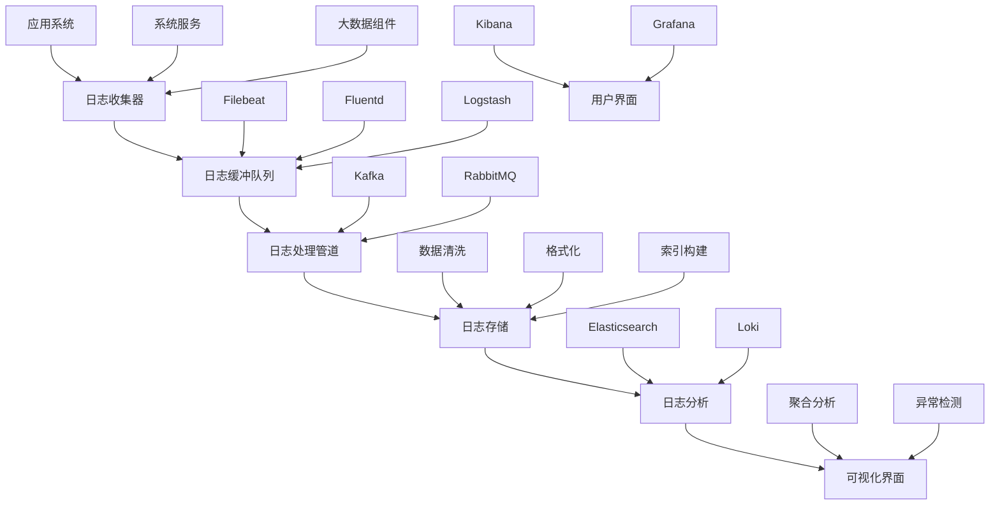

# examples/15_framework/logs_aggregation.md
# 日志聚合与分析系统

## 日志架构设计

### 日志收集架构



### 日志类型与格式

#### 1. 应用日志 (Application Logs)
**特点**: 业务逻辑相关，结构化程度较高
**格式标准**:
```json
{
  "timestamp": "2025-12-24T10:30:15.123Z",
  "level": "INFO",
  "service": "spark-application",
  "component": "executor",
  "thread": "executor-001",
  "message": "Task completed successfully",
  "context": {
    "task_id": "task_12345",
    "stage_id": "stage_001",
    "execution_time_ms": 1250,
    "input_records": 10000,
    "output_records": 9500
  },
  "correlation_id": "abc-123-def-456",
  "user_id": "user_789"
}
```

#### 2. 系统日志 (System Logs)
**特点**: 操作系统和基础设施相关
**关键日志**:
```
/var/log/messages - 系统消息日志
/var/log/secure - 安全认证日志
/var/log/cron - 定时任务日志
/var/log/maillog - 邮件系统日志
```

#### 3. 大数据组件日志 (Big Data Logs)

##### Hadoop日志结构
```
日志级别: INFO|WARN|ERROR
时间戳: yyyy-MM-dd HH:mm:ss,SSS
进程ID: 进程标识符
线程名: 线程名称
类名: 完整类名
消息: 日志内容
```

##### Spark日志示例
```
25/12/24 10:30:15 INFO SparkContext: Running Spark version 3.3.0
25/12/24 10:30:16 INFO SparkContext: Submitted application: WordCount
25/12/24 10:30:17 INFO DAGScheduler: Got job 0 (count at WordCount.scala:12) with 2 output partitions
25/12/24 10:30:18 INFO TaskSchedulerImpl: Adding task set 0.0 with 2 tasks
25/12/24 10:30:19 INFO Executor: Running task 0.0 in stage 0.0 (TID 0)
```

##### Kafka日志示例
```
[2025-12-24 10:30:15,123] INFO [KafkaServer id=1] started (kafka.server.KafkaServer)
[2025-12-24 10:30:16,234] INFO [Controller id=1] New leader elected: LeaderAndIsr(leader=1, leaderEpoch=1, isr=List(1), zkVersion=1) (kafka.controller.KafkaController)
[2025-12-24 10:30:17,345] INFO [ReplicaFetcherThread-0-1] Truncating log segment_00000000000000000000.log to offset 1000 (kafka.server.ReplicaFetcherThread)
```

## 日志收集配置

### Filebeat配置
```yaml
# filebeat.yml - 轻量级日志收集器
filebeat.inputs:
- type: log
  enabled: true
  paths:
    - /var/log/hadoop/*.log
    - /var/log/spark/**/*.log
  fields:
    service: bigdata
    component: hadoop
  fields_under_root: true

- type: log
  enabled: true
  paths:
    - /var/log/kafka/*.log
  fields:
    service: bigdata
    component: kafka
  fields_under_root: true

# 输出到Kafka队列
output.kafka:
  hosts: ["kafka-1:9092", "kafka-2:9092", "kafka-3:9092"]
  topic: 'logs-bigdata'
  partition.round_robin:
    reachable_only: false
  required_acks: 1
  compression: gzip
  max_message_bytes: 1000000

# 日志轮转
logging:
  level: info
  to_files: true
  files:
    path: /var/log/filebeat
    name: filebeat
    keepfiles: 7
    permissions: 0644
```

### Fluentd配置
```xml
<!-- fluent.conf - 功能丰富的日志收集器 -->
<source>
  @type tail
  path /var/log/hadoop/*.log
  pos_file /var/log/fluentd/hadoop.pos
  tag hadoop.*
  <parse>
    @type multiline
    format_firstline /^\d{4}-\d{2}-\d{2}/
    format1 /^(?<timestamp>\d{4}-\d{2}-\d{2} \d{2}:\d{2}:\d{2},\d{3}) (?<level>\w+) (?<message>.*)$/
  </parse>
</source>

<source>
  @type tail
  path /var/log/spark/**/*.log
  pos_file /var/log/fluentd/spark.pos
  tag spark.*
  <parse>
    @type regexp
    expression /^(?<timestamp>\d{2}\/\d{2}\/\d{2} \d{2}:\d{2}:\d{2}) (?<level>\w+) (?<logger>.*): (?<message>.*)$/
  </parse>
</source>

<match hadoop.*>
  @type kafka2
  brokers kafka-1:9092,kafka-2:9092,kafka-3:9092
  topic_key topic
  default_topic logs-hadoop
  <format>
    @type json
  </format>
  <buffer>
    @type file
    path /var/log/fluentd/buffer/hadoop
    flush_interval 10s
  </buffer>
</match>

<match spark.*>
  @type kafka2
  brokers kafka-1:9092,kafka-2:9092,kafka-3:9092
  topic_key topic
  default_topic logs-spark
  <format>
    @type json
  </format>
  <buffer>
    @type file
    path /var/log/fluentd/buffer/spark
    flush_interval 10s
  </buffer>
</match>
```

## 日志处理管道

### 数据清洗和标准化
```python
# log_processor.py - 日志处理管道
import re
import json
import time
from typing import Dict, Any, Optional
from datetime import datetime

class LogProcessor:
    """日志处理和标准化"""

    def __init__(self):
        self.log_patterns = {
            'hadoop': self._compile_hadoop_pattern(),
            'spark': self._compile_spark_pattern(),
            'kafka': self._compile_kafka_pattern()
        }

    def _compile_hadoop_pattern(self):
        """Hadoop日志正则模式"""
        pattern = r'^(?P<timestamp>\d{4}-\d{2}-\d{2} \d{2}:\d{2}:\d{2},\d{3})\s+(?P<level>\w+)\s+(?P<logger>[\w\.]+):\s+(?P<message>.*)$'
        return re.compile(pattern, re.MULTILINE)

    def _compile_spark_pattern(self):
        """Spark日志正则模式"""
        pattern = r'^(?P<timestamp>\d{2}/\d{2}/\d{2} \d{2}:\d{2}:\d{2})\s+(?P<level>\w+)\s+(?P<logger>[\w\.]+):\s+(?P<message>.*)$'
        return re.compile(pattern, re.MULTILINE)

    def _compile_kafka_pattern(self):
        """Kafka日志正则模式"""
        pattern = r'^\[(?P<timestamp>\d{4}-\d{2}-\d{2} \d{2}:\d{2}:\d{2},\d{3})\]\s+(?P<level>\w+)\s+\[(?P<logger>[^\]]+)\]\s+(?P<message>.*)$'
        return re.compile(pattern, re.MULTILINE)

    def parse_log_line(self, line: str, source: str) -> Optional[Dict[str, Any]]:
        """解析单行日志"""
        pattern = self.log_patterns.get(source)
        if not pattern:
            return None

        match = pattern.match(line.strip())
        if not match:
            return None

        parsed = match.groupdict()

        # 标准化时间戳
        parsed['timestamp'] = self._normalize_timestamp(parsed['timestamp'], source)

        # 添加元数据
        parsed['source'] = source
        parsed['parsed_at'] = datetime.utcnow().isoformat()
        parsed['raw_line'] = line

        # 提取结构化字段
        parsed.update(self._extract_structured_fields(parsed['message'], source))

        return parsed

    def _normalize_timestamp(self, timestamp: str, source: str) -> str:
        """标准化时间戳格式"""
        try:
            if source == 'hadoop':
                # 2025-12-24 10:30:15,123 -> ISO format
                dt = datetime.strptime(timestamp, '%Y-%m-%d %H:%M:%S,%f')
                return dt.isoformat()
            elif source == 'spark':
                # 25/12/24 10:30:15 -> ISO format (假设2025年)
                dt = datetime.strptime(f"20{timestamp}", '%Y%d/%m/%y %H:%M:%S')
                return dt.isoformat()
            elif source == 'kafka':
                # 2025-12-24 10:30:15,123 -> ISO format
                dt = datetime.strptime(timestamp, '%Y-%m-%d %H:%M:%S,%f')
                return dt.isoformat()
        except ValueError:
            # 如果解析失败，返回原始时间戳
            return timestamp

        return timestamp

    def _extract_structured_fields(self, message: str, source: str) -> Dict[str, Any]:
        """从日志消息中提取结构化字段"""
        fields = {}

        if source == 'hadoop':
            # 提取Hadoop特定字段
            if 'Block' in message and 'allocated' in message:
                # Block blk_123456789 allocated
                block_match = re.search(r'Block (blk_\d+) allocated', message)
                if block_match:
                    fields['block_id'] = block_match.group(1)

        elif source == 'spark':
            # 提取Spark特定字段
            if 'Task completed' in message:
                # 提取任务ID和执行时间
                task_match = re.search(r'Task (\w+) completed', message)
                if task_match:
                    fields['task_id'] = task_match.group(1)

            if 'Running task' in message:
                # Running task 0.0 in stage 0.0 (TID 0)
                task_info = re.search(r'Running task (\d+\.\d+) in stage (\d+\.\d+) \(TID (\d+)\)', message)
                if task_info:
                    fields['task_id'] = task_info.group(1)
                    fields['stage_id'] = task_info.group(2)
                    fields['thread_id'] = task_info.group(3)

        elif source == 'kafka':
            # 提取Kafka特定字段
            if 'New leader elected' in message:
                # 提取leader信息
                leader_match = re.search(r'leader=(\d+)', message)
                if leader_match:
                    fields['leader_id'] = leader_match.group(1)

        return fields

    def enrich_log_entry(self, parsed_log: Dict[str, Any]) -> Dict[str, Any]:
        """丰富日志条目"""
        # 添加日志级别数值
        level_mapping = {
            'TRACE': 10, 'DEBUG': 20, 'INFO': 30,
            'WARN': 40, 'WARNING': 40, 'ERROR': 50, 'FATAL': 60
        }
        parsed_log['level_numeric'] = level_mapping.get(parsed_log.get('level', '').upper(), 0)

        # 添加服务标识
        if 'logger' in parsed_log:
            if 'hadoop' in parsed_log['logger'].lower():
                parsed_log['service'] = 'hadoop'
            elif 'spark' in parsed_log['logger'].lower():
                parsed_log['service'] = 'spark'
            elif 'kafka' in parsed_log['logger'].lower():
                parsed_log['service'] = 'kafka'

        # 添加异常检测
        parsed_log['is_error'] = parsed_log.get('level', '').upper() in ['ERROR', 'FATAL']
        parsed_log['is_warning'] = parsed_log.get('level', '').upper() in ['WARN', 'WARNING']

        return parsed_log

    def process_log_batch(self, log_lines: list, source: str) -> list:
        """批量处理日志"""
        processed_logs = []

        for line in log_lines:
            parsed = self.parse_log_line(line, source)
            if parsed:
                enriched = self.enrich_log_entry(parsed)
                processed_logs.append(enriched)

        return processed_logs
```

### 日志存储和索引

#### Elasticsearch配置
```yaml
# elasticsearch.yml - 日志存储配置
cluster.name: bigdata-logs
node.name: log-node-1
path.data: /var/lib/elasticsearch
path.logs: /var/log/elasticsearch

network.host: 0.0.0.0
http.port: 9200

discovery.seed_hosts: ["es-node-1:9300", "es-node-2:9300"]
cluster.initial_master_nodes: ["es-node-1", "es-node-2"]

# 大数据优化配置
index.refresh_interval: 30s
indices.memory.index_buffer_size: 10%
indices.memory.min_index_buffer_size: 96mb

# 索引生命周期管理
xpack.ilm.enabled: true
xpack.ilm.rollover_alias: "logs-bigdata"
```

#### 索引模板配置
```json
{
  "index_patterns": ["logs-bigdata-*"],
  "settings": {
    "number_of_shards": 3,
    "number_of_replicas": 1,
    "refresh_interval": "30s",
    "index.lifecycle.name": "logs-retention-policy"
  },
  "mappings": {
    "properties": {
      "@timestamp": {
        "type": "date"
      },
      "level": {
        "type": "keyword"
      },
      "service": {
        "type": "keyword"
      },
      "component": {
        "type": "keyword"
      },
      "message": {
        "type": "text",
        "analyzer": "standard"
      },
      "context": {
        "type": "object",
        "dynamic": true
      },
      "correlation_id": {
        "type": "keyword"
      },
      "is_error": {
        "type": "boolean"
      },
      "is_warning": {
        "type": "boolean"
      }
    }
  }
}
```

## 日志分析与可视化

### 日志聚合分析
```sql
-- Elasticsearch聚合查询示例

-- 1. 按服务和级别统计日志数量
GET /logs-bigdata-*/_search
{
  "size": 0,
  "aggs": {
    "by_service": {
      "terms": {
        "field": "service",
        "size": 10
      },
      "aggs": {
        "by_level": {
          "terms": {
            "field": "level",
            "size": 10
          }
        }
      }
    }
  }
}

-- 2. 错误日志趋势分析
GET /logs-bigdata-*/_search
{
  "size": 0,
  "query": {
    "bool": {
      "must": [
        {"term": {"is_error": true}},
        {"range": {"@timestamp": {"gte": "now-1h"}}}
      ]
    }
  },
  "aggs": {
    "error_trend": {
      "date_histogram": {
        "field": "@timestamp",
        "fixed_interval": "5m"
      }
    }
  }
}

-- 3. 异常检测 - 突发错误模式
GET /logs-bigdata-*/_search
{
  "size": 0,
  "query": {
    "bool": {
      "must": [
        {"term": {"level": "ERROR"}},
        {"range": {"@timestamp": {"gte": "now-1h"}}}
      ]
    }
  },
  "aggs": {
    "errors_by_minute": {
      "date_histogram": {
        "field": "@timestamp",
        "fixed_interval": "1m"
      }
    }
  }
}
```

### Kibana可视化配置

#### 错误日志仪表板
```json
{
  "title": "大数据错误日志监控",
  "panels": [
    {
      "title": "错误日志趋势",
      "type": "line",
      "index": "logs-bigdata-*",
      "query": {
        "bool": {
          "must": [{"term": {"is_error": true}}]
        }
      },
      "xAxis": "@timestamp",
      "yAxis": "count",
      "interval": "1m"
    },
    {
      "title": "错误分布",
      "type": "pie",
      "index": "logs-bigdata-*",
      "query": {
        "bool": {
          "must": [{"term": {"is_error": true}}]
        }
      },
      "groupBy": "service"
    },
    {
      "title": "最新错误",
      "type": "table",
      "index": "logs-bigdata-*",
      "query": {
        "bool": {
          "must": [{"term": {"is_error": true}}]
        }
      },
      "sort": "@timestamp desc",
      "fields": ["@timestamp", "service", "component", "message"]
    }
  ]
}
```

## 日志治理与合规

### 数据保留策略
```yaml
# 日志保留策略配置
retention_policies:
  - name: "application-logs"
    pattern: "logs-app-*"
    phases:
      - phase: "hot"
        min_age: "0ms"
        actions:
          - rollover:
              max_age: "1d"
              max_size: "50gb"
      - phase: "warm"
        min_age: "1d"
        actions:
          - allocate:
              number_of_replicas: 1
          - shrink:
              number_of_shards: 1
      - phase: "cold"
        min_age: "30d"
        actions:
          - allocate:
              number_of_replicas: 0
      - phase: "delete"
        min_age: "90d"
        actions:
          - delete: {}

  - name: "system-logs"
    pattern: "logs-system-*"
    delete_after: "365d"

  - name: "audit-logs"
    pattern: "logs-audit-*"
    delete_after: "2555d"  # 7年保留
```

### 安全与合规
- **数据脱敏**: 敏感信息自动替换
- **访问控制**: 基于角色的日志访问权限
- **审计日志**: 记录所有日志访问操作
- **合规保留**: 满足GDPR、SOX等合规要求

### 性能优化
- **索引优化**: 合理设置分片和副本数
- **查询优化**: 使用过滤器缓存和索引
- **存储优化**: 压缩和归档历史数据
- **监控告警**: 索引性能和存储使用率监控