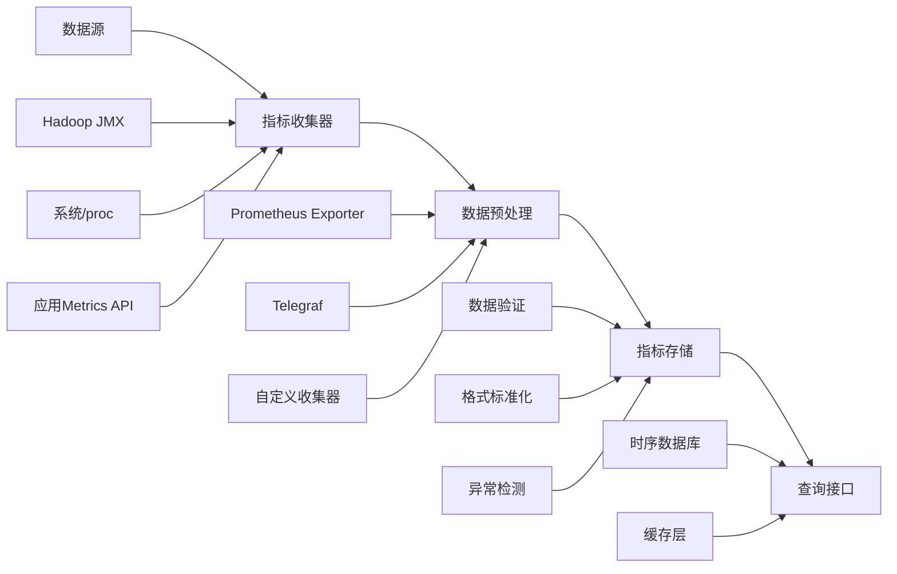

# examples/15_framework/metrics_pipeline.md
# 指标体系设计与数据管道

## 指标分类与设计原则

### 指标类型体系

#### 1. 系统资源指标 (System Metrics)
**采集频率**: 15-30秒
**保留周期**: 90天
**关键指标**:
```yaml
# CPU指标
cpu_usage_percent: "CPU使用率百分比"
cpu_load_average: "CPU负载平均值"
cpu_context_switches: "CPU上下文切换次数"

# 内存指标
memory_total_bytes: "总内存字节数"
memory_used_bytes: "已用内存字节数"
memory_available_bytes: "可用内存字节数"

# 磁盘指标
disk_total_bytes: "磁盘总容量"
disk_used_bytes: "磁盘已用容量"
disk_io_read_bytes: "磁盘读取字节数"
disk_io_write_bytes: "磁盘写入字节数"

# 网络指标
network_receive_bytes_total: "网络接收总字节数"
network_transmit_bytes_total: "网络发送总字节数"
network_connections_total: "网络连接总数"
```

#### 2. 大数据组件指标 (Big Data Metrics)

##### Hadoop指标
```yaml
# NameNode指标
namenode_capacity_total_bytes: "HDFS总容量"
namenode_capacity_used_bytes: "HDFS已用容量"
namenode_blocks_total: "数据块总数"
namenode_files_total: "文件总数"

# DataNode指标
datanode_capacity_total_bytes: "DataNode总容量"
datanode_capacity_used_bytes: "DataNode已用容量"
datanode_blocks_total: "DataNode数据块数"
datanode_failed_volumes: "失败卷数量"

# YARN指标
yarn_allocated_vcores: "已分配虚拟核心数"
yarn_allocated_memory_mb: "已分配内存MB"
yarn_pending_applications: "等待应用数量"
yarn_running_applications: "运行应用数量"
```

##### Spark指标
```yaml
# 应用级指标
spark_app_runtime_ms: "应用运行时间"
spark_app_executors: "执行器数量"
spark_app_tasks_total: "总任务数"
spark_app_tasks_completed: "完成任务数"

# 作业级指标
spark_job_duration_ms: "作业持续时间"
spark_job_stages_total: "作业阶段总数"
spark_job_stages_completed: "完成阶段数"

# 阶段级指标
spark_stage_duration_ms: "阶段持续时间"
spark_stage_tasks_total: "阶段任务总数"
spark_stage_tasks_completed: "完成任务数"
```

##### Kafka指标
```yaml
# Broker指标
kafka_broker_bytes_in_total: "Broker入队字节总数"
kafka_broker_bytes_out_total: "Broker出队字节总数"
kafka_broker_messages_in_total: "Broker入队消息总数"

# Topic指标
kafka_topic_partitions: "Topic分区数量"
kafka_topic_partition_current_offset: "分区当前偏移量"
kafka_topic_partition_earliest_offset: "分区最早偏移量"

# Consumer Group指标
kafka_consumer_group_lag: "消费者组延迟"
kafka_consumer_group_members: "消费者组成员数"
```

#### 3. 业务指标 (Business Metrics)
**采集频率**: 30秒-5分钟
**保留周期**: 1年
**关键指标**:
```yaml
# 数据处理指标
data_ingestion_rate: "数据摄入速率"
data_processing_latency_ms: "数据处理延迟"
data_processing_success_rate: "数据处理成功率"

# 查询性能指标
query_execution_time_ms: "查询执行时间"
query_concurrency: "查询并发数"
query_success_rate: "查询成功率"

# 业务KPI指标
business_transactions_total: "业务交易总数"
business_transactions_success_rate: "业务交易成功率"
business_user_active: "活跃用户数"
```

## 数据管道架构

### 指标收集管道



### 数据管道实现

#### 1. 收集器配置
```yaml
# telegraf.conf - 通用指标收集器配置
[agent]
  interval = "30s"
  round_interval = true
  metric_batch_size = 1000
  metric_buffer_limit = 10000

[[inputs.cpu]]
  percpu = true
  totalcpu = true
  collect_cpu_time = false
  report_active = false

[[inputs.mem]]
  # 内存指标收集

[[inputs.disk]]
  # 磁盘指标收集
  ignore_fs = ["tmpfs", "devtmpfs", "devfs"]

[[inputs.net]]
  # 网络指标收集
  interfaces = ["eth*", "en*"]

[[inputs.system]]
  # 系统指标收集

# Hadoop指标收集
[[inputs.jolokia2_agent]]
  urls = ["http://namenode:9870/jolokia"]
  name_prefix = "hadoop_"

  [[inputs.jolokia2_agent.metric]]
    name = "namenode"
    mbean = "Hadoop:service=NameNode,name=NameNodeInfo"
    paths = ["CapacityTotal", "CapacityUsed", "BlocksTotal", "FilesTotal"]
```

#### 2. 数据处理管道
```python
# metrics_pipeline.py - 指标数据处理管道
import time
import logging
from typing import Dict, List, Any
from dataclasses import dataclass
from prometheus_client import CollectorRegistry, Gauge, Counter, Histogram
import psutil
import requests

@dataclass
class MetricData:
    """指标数据结构"""
    name: str
    value: float
    timestamp: float
    labels: Dict[str, str]
    metric_type: str

class MetricsPipeline:
    """指标数据处理管道"""

    def __init__(self, config: Dict[str, Any]):
        self.config = config
        self.registry = CollectorRegistry()
        self._init_metrics()

    def _init_metrics(self):
        """初始化指标定义"""
        # 系统指标
        self.cpu_usage = Gauge('system_cpu_usage_percent',
                              'System CPU usage percentage',
                              ['host'], registry=self.registry)

        self.memory_usage = Gauge('system_memory_usage_percent',
                                 'System memory usage percentage',
                                 ['host'], registry=self.registry)

        # 大数据指标
        self.hadoop_capacity_total = Gauge('hadoop_capacity_total_bytes',
                                          'Hadoop total capacity',
                                          ['cluster'], registry=self.registry)

        self.spark_jobs_active = Gauge('spark_jobs_active',
                                      'Number of active Spark jobs',
                                      ['application'], registry=self.registry)

    def collect_system_metrics(self) -> List[MetricData]:
        """收集系统指标"""
        metrics = []

        # CPU指标
        cpu_percent = psutil.cpu_percent(interval=1)
        metrics.append(MetricData(
            name='system_cpu_usage_percent',
            value=cpu_percent,
            timestamp=time.time(),
            labels={'host': self.config['host']},
            metric_type='gauge'
        ))

        # 内存指标
        memory = psutil.virtual_memory()
        metrics.append(MetricData(
            name='system_memory_usage_percent',
            value=memory.percent,
            timestamp=time.time(),
            labels={'host': self.config['host']},
            metric_type='gauge'
        ))

        return metrics

    def collect_hadoop_metrics(self) -> List[MetricData]:
        """收集Hadoop指标"""
        metrics = []

        try:
            # 从JMX接口获取指标
            jmx_url = f"http://{self.config['namenode_host']}:{self.config['namenode_port']}/jmx"
            response = requests.get(jmx_url, timeout=10)
            jmx_data = response.json()

            # 解析NameNode指标
            for bean in jmx_data.get('beans', []):
                if bean.get('name') == 'Hadoop:service=NameNode,name=NameNodeInfo':
                    capacity_total = bean.get('CapacityTotal', 0)
                    capacity_used = bean.get('CapacityUsed', 0)

                    metrics.extend([
                        MetricData(
                            name='hadoop_capacity_total_bytes',
                            value=float(capacity_total),
                            timestamp=time.time(),
                            labels={'cluster': self.config['cluster']},
                            metric_type='gauge'
                        ),
                        MetricData(
                            name='hadoop_capacity_used_bytes',
                            value=float(capacity_used),
                            timestamp=time.time(),
                            labels={'cluster': self.config['cluster']},
                            metric_type='gauge'
                        )
                    ])

        except Exception as e:
            logging.error(f"Failed to collect Hadoop metrics: {e}")

        return metrics

    def process_metrics(self, raw_metrics: List[MetricData]) -> List[MetricData]:
        """处理和清洗指标数据"""
        processed = []

        for metric in raw_metrics:
            # 数据验证
            if not self._validate_metric(metric):
                continue

            # 数据标准化
            normalized = self._normalize_metric(metric)

            # 异常检测
            if self._detect_anomaly(normalized):
                # 添加异常标签
                normalized.labels['anomaly'] = 'true'

            processed.append(normalized)

        return processed

    def _validate_metric(self, metric: MetricData) -> bool:
        """验证指标数据"""
        if metric.value is None or not isinstance(metric.value, (int, float)):
            return False
        if not metric.name or not metric.metric_type:
            return False
        return True

    def _normalize_metric(self, metric: MetricData) -> MetricData:
        """标准化指标数据"""
        # 确保标签格式统一
        normalized_labels = {}
        for k, v in metric.labels.items():
            normalized_labels[k.lower().replace(' ', '_')] = str(v)

        return MetricData(
            name=metric.name.lower().replace(' ', '_'),
            value=round(metric.value, 6),
            timestamp=metric.timestamp,
            labels=normalized_labels,
            metric_type=metric.metric_type.lower()
        )

    def _detect_anomaly(self, metric: MetricData) -> bool:
        """简单异常检测"""
        # 基于阈值的异常检测
        thresholds = self.config.get('thresholds', {}).get(metric.name, {})
        if 'max' in thresholds and metric.value > thresholds['max']:
            return True
        if 'min' in thresholds and metric.value < thresholds['min']:
            return True
        return False

    def store_metrics(self, metrics: List[MetricData]):
        """存储指标数据"""
        # 这里实现具体的存储逻辑
        # 可以存储到时序数据库、文件等
        pass

    def run_pipeline(self):
        """运行完整的数据管道"""
        while True:
            try:
                # 收集指标
                system_metrics = self.collect_system_metrics()
                hadoop_metrics = self.collect_hadoop_metrics()
                all_metrics = system_metrics + hadoop_metrics

                # 处理指标
                processed_metrics = self.process_metrics(all_metrics)

                # 存储指标
                self.store_metrics(processed_metrics)

                # 等待下一个收集周期
                time.sleep(self.config.get('interval', 30))

            except Exception as e:
                logging.error(f"Pipeline error: {e}")
                time.sleep(30)
```

#### 3. 存储和查询优化

##### 时序数据库配置
```yaml
# VictoriaMetrics配置
global:
  scrape_interval: 15s
  evaluation_interval: 15s

storage:
  dataPath: /opt/victoriametrics/data
  retentionPeriod: 90  # 90天数据保留

# 高可用配置
cluster:
  replicationFactor: 2
  tenant: "bigdata"

# 性能优化
cache:
  type: "memory"
  size: "1GB"
```

##### 查询优化策略
```sql
-- 高效查询模式
-- 1. 使用时间范围限制
SELECT value FROM metrics
WHERE name = 'cpu_usage' AND timestamp >= now() - INTERVAL '1 hour'

-- 2. 使用标签过滤
SELECT value FROM metrics
WHERE name = 'cpu_usage' AND labels['host'] = 'hadoop-namenode-01'

-- 3. 聚合查询优化
SELECT
  time_bucket('5 minutes', timestamp) AS bucket,
  avg(value) AS avg_cpu,
  max(value) AS max_cpu
FROM metrics
WHERE name = 'cpu_usage' AND timestamp >= now() - INTERVAL '1 day'
GROUP BY bucket
ORDER BY bucket

-- 4. 预聚合查询
SELECT * FROM metrics_5m_agg
WHERE name = 'cpu_usage' AND timestamp >= now() - INTERVAL '1 week'
```

## 管道监控与优化

### 管道健康指标
```yaml
# 管道自身监控指标
pipeline_metrics_collected_total: "收集的指标总数"
pipeline_metrics_processed_total: "处理的指标总数"
pipeline_processing_latency_ms: "处理延迟"
pipeline_errors_total: "管道错误总数"
pipeline_uptime_seconds: "管道运行时间"
```

### 性能优化策略

#### 1. 数据压缩
- 使用高效压缩算法 (LZ4, ZSTD)
- 时间序列数据压缩率可达80-90%

#### 2. 索引优化
- 时间索引: 基于时间戳的分层索引
- 标签索引: 倒排索引支持快速标签查询
- 预聚合索引: 多粒度预聚合数据

#### 3. 缓存策略
- 热数据缓存: 最近1小时数据常驻内存
- 查询结果缓存: 相同查询结果缓存5分钟
- 元数据缓存: 指标定义和标签信息缓存

#### 4. 水平扩展
- 数据分片: 基于时间和指标名称分片
- 读写分离: 写入节点和查询节点分离
- 负载均衡: 智能路由到最优节点

## 故障排查指南

### 常见问题诊断

#### 指标收集失败
```
检查步骤:
1. 验证收集器配置
2. 检查网络连通性
3. 查看收集器日志
4. 验证指标格式
```

#### 数据管道阻塞
```
检查指标:
- pipeline_processing_latency_ms > 1000ms
- pipeline_errors_total 快速增长
- 队列长度异常

解决方法:
1. 增加处理节点
2. 优化处理逻辑
3. 调整队列大小
```

#### 查询性能慢
```
检查指标:
- 查询响应时间 > 5秒
- 缓存命中率 < 50%

优化方法:
1. 添加更多索引
2. 增加缓存容量
3. 优化查询语句
4. 水平扩展查询节点
```