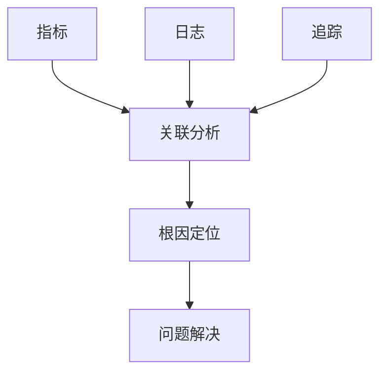

# examples/15_framework/observability_basics.md
# 大数据系统可观测性基础概念与架构

## 可观测性三大支柱详解

### 指标(Metrics) - 量化监控
指标是可观测性的基础，通过数值型数据反映系统状态和性能。

**指标类型**:
- **计数器(Counter)**: 单调递增的数值，如请求总数、错误次数
- **仪表(Gauge)**: 可增可减的数值，如当前内存使用率、活跃连接数
- **直方图(Histogram)**: 对观测值进行统计分布，如响应时间分布
- **摘要(Summary)**: 类似直方图，但计算百分位数

**大数据场景指标**:
```yaml
# Hadoop集群指标
hadoop_namenode_capacity_total: 计数器 - 总容量
hadoop_datanode_blocks_total: 仪表 - 数据块数量
hadoop_job_duration: 直方图 - 作业执行时间

# Spark应用指标
spark_executor_count: 仪表 - 执行器数量
spark_task_completed_total: 计数器 - 完成任务数
spark_stage_duration: 直方图 - 阶段执行时间

# Kafka队列指标
kafka_messages_in_total: 计数器 - 入队消息数
kafka_consumer_lag: 仪表 - 消费者延迟
kafka_broker_bytes_in_total: 计数器 - 入队字节数
```

### 日志(Logs) - 事件记录
日志记录系统运行过程中的关键事件和状态变化。

**日志级别**:
- **ERROR**: 错误事件，需要立即处理
- **WARN**: 警告事件，可能影响系统
- **INFO**: 正常操作信息
- **DEBUG**: 调试信息，开发时使用

**大数据日志结构**:
```json
{
  "timestamp": "2025-12-24T10:30:00Z",
  "level": "INFO",
  "service": "hadoop-namenode",
  "component": "BlockManager",
  "message": "Block blk_123456789 allocated",
  "context": {
    "block_id": "blk_123456789",
    "size": 134217728,
    "replicas": 3
  }
}
```

### 追踪(Traces) - 调用链路
追踪记录请求在分布式系统中的完整调用路径。

**追踪概念**:
- **Span**: 单个操作的时间和元数据
- **Trace**: 多个Span组成的完整调用链
- **Context**: 跨服务传播的上下文信息

**大数据追踪示例**:
```
Trace ID: abc123-def456-ghi789
├── Span: HTTP请求接收 (namenode:9870)
│   ├── Span: 权限验证
│   └── Span: 文件系统操作
│       ├── Span: 元数据查询
│       ├── Span: 数据块分配
│       └── Span: 副本创建
└── Span: 响应返回
```

## 可观测性架构模式

### 分层架构
```
用户层 → 应用层 → 基础设施层
    ↓        ↓        ↓
  RUM      APM     系统监控
```

### 三大支柱集成


### 大数据可观测性挑战

1. **规模挑战**: PB级数据，百万级指标
2. **复杂性挑战**: 分布式组件多，依赖关系复杂
3. **实时性挑战**: 流处理要求毫秒级延迟
4. **成本挑战**: 存储和处理海量观测数据

## 实施路径

### Phase 1: 基础设施监控
- 部署基础指标收集
- 建立监控面板
- 配置基础告警

### Phase 2: 应用性能监控
- 添加业务指标
- 实施日志聚合
- 建立性能基线

### Phase 3: 分布式追踪
- 部署追踪系统
- 关联调用链路
- 优化性能瓶颈

### Phase 4: 智能可观测性
- 实施异常检测
- 自动化根因分析
- 预测性维护

## 最佳实践

1. **标准化**: 统一指标命名和标签规范
2. **分层监控**: 基础设施 → 应用 → 业务层层递进
3. **关联分析**: 指标+日志+追踪联合分析
4. **成本控制**: 合理采样和数据保留策略
5. **自动化**: 监控部署和配置自动化