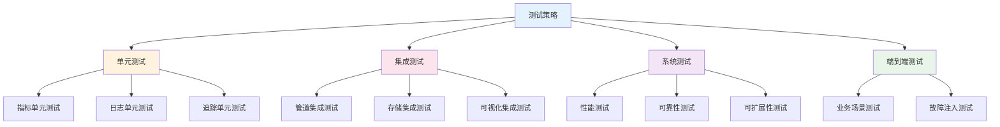

# examples/15_framework/testing_strategy.md
# 可观测性测试策略

## 测试框架概述

### 可观测性测试层次

#### 1. 单元测试层
- **指标测试**: 验证指标收集和计算逻辑
- **日志测试**: 验证日志格式化和输出
- **追踪测试**: 验证span创建和上下文传播

#### 2. 集成测试层
- **管道测试**: 端到端数据流测试
- **存储测试**: 数据持久化和查询测试
- **可视化测试**: 仪表板和告警测试

#### 3. 系统测试层
- **性能测试**: 高负载下的可观测性表现
- **可靠性测试**: 故障场景下的数据完整性
- **可扩展性测试**: 集群扩展的可观测性能力

### 测试策略架构



## 指标测试策略

### 指标收集测试

#### 单元测试示例
```python
# test_metrics_collector.py
import pytest
from unittest.mock import Mock, patch
from observability.metrics_collector import MetricsCollector
from observability.metrics import Counter, Gauge, Histogram

class TestMetricsCollector:

    @pytest.fixture
    def collector(self):
        return MetricsCollector()

    def test_counter_increment(self, collector):
        """测试计数器指标递增"""
        counter = collector.create_counter("test_requests_total", "Total requests")

        # 初始值为0
        assert collector.get_value("test_requests_total") == 0

        # 递增操作
        counter.increment()
        assert collector.get_value("test_requests_total") == 1

        counter.increment(5)
        assert collector.get_value("test_requests_total") == 6

    def test_gauge_operations(self, collector):
        """测试仪表盘指标操作"""
        gauge = collector.create_gauge("memory_usage_bytes", "Memory usage")

        # 设置值
        gauge.set(1024)
        assert collector.get_value("memory_usage_bytes") == 1024

        # 递增/递减
        gauge.increment(512)
        assert collector.get_value("memory_usage_bytes") == 1536

        gauge.decrement(256)
        assert collector.get_value("memory_usage_bytes") == 1280

    def test_histogram_observation(self, collector):
        """测试直方图指标观测"""
        histogram = collector.create_histogram(
            "request_duration_seconds",
            "Request duration",
            buckets=[0.1, 0.5, 1.0, 2.0, 5.0]
        )

        # 观测值
        histogram.observe(0.3)
        histogram.observe(1.2)
        histogram.observe(0.8)

        # 验证分桶
        buckets = collector.get_histogram_buckets("request_duration_seconds")
        assert buckets["0.1"] == 0  # 0.3 > 0.1
        assert buckets["0.5"] == 1  # 0.3 <= 0.5, 0.8 > 0.5
        assert buckets["1.0"] == 2  # 0.8 <= 1.0, 1.2 > 1.0
        assert buckets["2.0"] == 3  # 1.2 <= 2.0

    @patch('observability.exporters.prometheus.PrometheusExporter')
    def test_metrics_export(self, mock_exporter, collector):
        """测试指标导出"""
        counter = collector.create_counter("export_test_total", "Export test")
        counter.increment(10)

        # 导出指标
        collector.export()

        # 验证导出器被调用
        mock_exporter.export.assert_called_once()
        exported_data = mock_exporter.export.call_args[0][0]

        # 验证导出数据
        assert "export_test_total" in exported_data
        assert exported_data["export_test_total"] == 10
```

### 指标管道集成测试

#### 端到端管道测试
```python
# test_metrics_pipeline.py
import pytest
import time
from observability.pipeline.metrics_pipeline import MetricsPipeline
from observability.storage.prometheus import PrometheusStorage

class TestMetricsPipeline:

    @pytest.fixture
    def pipeline(self):
        storage = PrometheusStorage("http://localhost:9090")
        return MetricsPipeline(storage)

    def test_pipeline_data_flow(self, pipeline):
        """测试指标管道数据流"""
        # 启动管道
        pipeline.start()

        try:
            # 发送测试指标
            test_metrics = {
                "cpu_usage_percent": 85.5,
                "memory_usage_bytes": 2147483648,  # 2GB
                "disk_io_bytes_per_second": 104857600,  # 100MB/s
                "network_rx_bytes_per_second": 52428800,  # 50MB/s
                "network_tx_bytes_per_second": 26214400   # 25MB/s
            }

            # 注入指标数据
            for name, value in test_metrics.items():
                pipeline.ingest_metric(name, value, {"host": "test-server"})

            # 等待处理
            time.sleep(2)

            # 验证存储
            for name, expected_value in test_metrics.items():
                stored_value = pipeline.query_metric(name, {"host": "test-server"})
                assert abs(stored_value - expected_value) < 0.001

        finally:
            pipeline.stop()

    def test_pipeline_aggregation(self, pipeline):
        """测试指标聚合功能"""
        pipeline.start()

        try:
            # 发送多个数据点
            for i in range(10):
                pipeline.ingest_metric(
                    "response_time_ms",
                    100 + i * 10,  # 100, 110, 120, ..., 190
                    {"endpoint": "/api/users", "method": "GET"}
                )

            time.sleep(2)

            # 验证聚合结果
            aggregated = pipeline.query_aggregated_metric(
                "response_time_ms",
                {"endpoint": "/api/users", "method": "GET"},
                aggregation="avg",
                time_range="5m"
            )

            expected_avg = sum(range(100, 200, 10)) / 10  # 145
            assert abs(aggregated - expected_avg) < 1.0

        finally:
            pipeline.stop()

    def test_pipeline_alerting(self, pipeline):
        """测试指标告警功能"""
        alert_triggered = []

        def alert_handler(alert):
            alert_triggered.append(alert)

        pipeline.set_alert_handler(alert_handler)

        # 配置告警规则
        pipeline.add_alert_rule({
            "name": "high_cpu_usage",
            "query": "cpu_usage_percent > 90",
            "for": "5m",
            "labels": {"severity": "warning"}
        })

        pipeline.start()

        try:
            # 发送正常值
            pipeline.ingest_metric("cpu_usage_percent", 85, {"host": "test-server"})
            time.sleep(1)

            # 发送告警值
            pipeline.ingest_metric("cpu_usage_percent", 95, {"host": "test-server"})
            time.sleep(6)  # 等待告警触发

            # 验证告警触发
            assert len(alert_triggered) == 1
            assert alert_triggered[0]["name"] == "high_cpu_usage"
            assert alert_triggered[0]["labels"]["severity"] == "warning"

        finally:
            pipeline.stop()
```

## 日志测试策略

### 日志收集测试

#### 结构化日志测试
```python
# test_log_collector.py
import pytest
import json
import logging
from observability.log_collector import LogCollector
from observability.log_processor import LogProcessor

class TestLogCollector:

    @pytest.fixture
    def collector(self):
        processor = LogProcessor()
        return LogCollector(processor)

    def test_structured_log_parsing(self, collector):
        """测试结构化日志解析"""
        log_line = json.dumps({
            "timestamp": "2025-12-24T10:30:00.000Z",
            "level": "INFO",
            "service": "hadoop-namenode",
            "message": "Block allocation completed",
            "block_id": "blk_123456789",
            "size_bytes": 134217728,
            "duration_ms": 150
        })

        parsed_log = collector.parse_log(log_line, "json")

        assert parsed_log["timestamp"] == "2025-12-24T10:30:00.000Z"
        assert parsed_log["level"] == "INFO"
        assert parsed_log["service"] == "hadoop-namenode"
        assert parsed_log["block_id"] == "blk_123456789"
        assert parsed_log["size_bytes"] == 134217728

    def test_log_level_filtering(self, collector):
        """测试日志级别过滤"""
        logs = [
            {"level": "DEBUG", "message": "Debug message"},
            {"level": "INFO", "message": "Info message"},
            {"level": "WARN", "message": "Warning message"},
            {"level": "ERROR", "message": "Error message"}
        ]

        # 测试不同级别过滤
        debug_logs = collector.filter_logs(logs, min_level="DEBUG")
        assert len(debug_logs) == 4

        info_logs = collector.filter_logs(logs, min_level="INFO")
        assert len(info_logs) == 3

        warn_logs = collector.filter_logs(logs, min_level="WARN")
        assert len(warn_logs) == 2

        error_logs = collector.filter_logs(logs, min_level="ERROR")
        assert len(error_logs) == 1

    def test_log_aggregation(self, collector):
        """测试日志聚合"""
        logs = [
            {"service": "hadoop-namenode", "level": "INFO", "message": "..."},
            {"service": "hadoop-namenode", "level": "WARN", "message": "..."},
            {"service": "spark-driver", "level": "INFO", "message": "..."},
            {"service": "spark-driver", "level": "ERROR", "message": "..."},
            {"service": "spark-driver", "level": "ERROR", "message": "..."}
        ]

        aggregated = collector.aggregate_logs(logs, group_by=["service", "level"])

        assert aggregated["hadoop-namenode"]["INFO"] == 1
        assert aggregated["hadoop-namenode"]["WARN"] == 1
        assert aggregated["spark-driver"]["INFO"] == 1
        assert aggregated["spark-driver"]["ERROR"] == 2
```

### 日志管道集成测试

#### 端到端日志流测试
```python
# test_log_pipeline.py
import pytest
import time
from observability.pipeline.log_pipeline import LogPipeline
from observability.storage.elasticsearch import ElasticsearchStorage

class TestLogPipeline:

    @pytest.fixture
    def pipeline(self):
        storage = ElasticsearchStorage("http://localhost:9200")
        return LogPipeline(storage)

    def test_log_ingestion_and_query(self, pipeline):
        """测试日志摄入和查询"""
        pipeline.start()

        try:
            # 摄入测试日志
            test_logs = [
                {
                    "timestamp": "2025-12-24T10:00:00.000Z",
                    "service": "hadoop-namenode",
                    "level": "INFO",
                    "message": "DataNode registered",
                    "datanode_id": "dn001"
                },
                {
                    "timestamp": "2025-12-24T10:00:05.000Z",
                    "service": "spark-driver",
                    "level": "WARN",
                    "message": "Task failed",
                    "task_id": "task_123",
                    "error": "OutOfMemoryError"
                }
            ]

            for log in test_logs:
                pipeline.ingest_log(log)

            # 等待索引
            time.sleep(3)

            # 查询日志
            hadoop_logs = pipeline.query_logs({
                "service": "hadoop-namenode",
                "time_range": "1h"
            })
            assert len(hadoop_logs) == 1
            assert hadoop_logs[0]["datanode_id"] == "dn001"

            error_logs = pipeline.query_logs({
                "level": "WARN",
                "time_range": "1h"
            })
            assert len(error_logs) == 1
            assert "OutOfMemoryError" in error_logs[0]["error"]

        finally:
            pipeline.stop()

    def test_log_pattern_analysis(self, pipeline):
        """测试日志模式分析"""
        pipeline.start()

        try:
            # 摄入具有模式的日志
            error_patterns = [
                "Connection refused to DataNode dn001",
                "Connection refused to DataNode dn002",
                "Connection refused to DataNode dn003",
                "Block blk_123 corrupted on DataNode dn001",
                "Block blk_456 corrupted on DataNode dn002"
            ]

            for i, pattern in enumerate(error_patterns):
                log = {
                    "timestamp": f"2025-12-24T10:{i:02d}:00.000Z",
                    "service": "hadoop-namenode",
                    "level": "ERROR",
                    "message": pattern
                }
                pipeline.ingest_log(log)

            time.sleep(3)

            # 分析错误模式
            patterns = pipeline.analyze_error_patterns("1h")

            # 验证模式识别
            connection_errors = [p for p in patterns if "Connection refused" in p["pattern"]]
            assert len(connection_errors) == 1
            assert connection_errors[0]["count"] == 3

            corruption_errors = [p for p in patterns if "corrupted" in p["pattern"]]
            assert len(corruption_errors) == 1
            assert corruption_errors[0]["count"] == 2

        finally:
            pipeline.stop()
```

## 追踪测试策略

### 追踪单元测试

#### Span创建和上下文测试
```python
# test_tracing.py
import pytest
from unittest.mock import Mock
from observability.tracing.tracer import DistributedTracer
from observability.tracing.span import Span
from observability.tracing.context import TraceContext

class TestDistributedTracing:

    @pytest.fixture
    def tracer(self):
        exporter = Mock()
        return DistributedTracer(exporter)

    def test_span_creation(self, tracer):
        """测试Span创建"""
        span = tracer.start_span("test_operation", {"service": "test-service"})

        assert span.operation == "test_operation"
        assert span.tags["service"] == "test-service"
        assert span.trace_id is not None
        assert span.span_id is not None
        assert span.start_time is not None
        assert span.end_time is None

        # 结束span
        span.end()
        assert span.end_time is not None
        assert span.duration > 0

    def test_nested_spans(self, tracer):
        """测试嵌套Span"""
        # 父span
        parent_span = tracer.start_span("parent_operation")

        # 子span
        child_span = tracer.start_span("child_operation", parent=parent_span)

        assert child_span.parent_span_id == parent_span.span_id
        assert child_span.trace_id == parent_span.trace_id

        # 结束子span
        child_span.end()
        parent_span.end()

        # 验证层级关系
        assert parent_span.children == [child_span]

    def test_context_propagation(self, tracer):
        """测试上下文传播"""
        # 创建初始上下文
        initial_context = TraceContext.new_trace()

        # 传播到另一个服务
        propagated_context = tracer.propagate_context(initial_context, "http_headers")

        # 在新服务中恢复上下文
        restored_context = tracer.extract_context(propagated_context, "http_headers")

        assert restored_context.trace_id == initial_context.trace_id
        assert restored_context.span_id != initial_context.span_id  # 新的span

    def test_sampling_decision(self, tracer):
        """测试采样决策"""
        # 配置采样率10%
        tracer.set_sampling_rate(0.1)

        sampled_count = 0
        total_count = 1000

        for _ in range(total_count):
            span = tracer.start_span("test_operation")
            if span.sampled:
                sampled_count += 1
            span.end()

        # 验证采样率在合理范围内 (允许5%的误差)
        expected_sampled = total_count * 0.1
        assert abs(sampled_count - expected_sampled) < expected_sampled * 0.5
```

### 追踪集成测试

#### 端到端追踪测试
```python
# test_tracing_integration.py
import pytest
import time
import requests
from observability.tracing.collector import TraceCollector
from observability.tracing.storage import TraceStorage

class TestTracingIntegration:

    @pytest.fixture
    def trace_system(self):
        storage = TraceStorage()
        collector = TraceCollector(storage)
        return collector

    def test_distributed_trace_collection(self, trace_system):
        """测试分布式追踪收集"""
        trace_system.start()

        try:
            # 模拟分布式调用链
            trace_id = trace_system.start_trace("user_request")

            # 服务A调用
            span_a = trace_system.start_span("service_a", trace_id)
            time.sleep(0.1)  # 模拟处理时间

            # 服务A调用服务B
            span_b = trace_system.start_span("service_b", span_a.span_id, trace_id)
            time.sleep(0.05)

            # 服务B调用数据库
            span_db = trace_system.start_span("database_query", span_b.span_id, trace_id)
            time.sleep(0.02)
            span_db.end()

            span_b.end()
            span_a.end()

            # 等待收集完成
            time.sleep(1)

            # 验证追踪数据
            trace = trace_system.get_trace(trace_id)

            assert trace["trace_id"] == trace_id
            assert len(trace["spans"]) == 3

            # 验证span关系
            spans_by_id = {span["span_id"]: span for span in trace["spans"]}

            assert spans_by_id[span_a.span_id]["operation"] == "service_a"
            assert spans_by_id[span_b.span_id]["parent_span_id"] == span_a.span_id
            assert spans_by_id[span_db.span_id]["parent_span_id"] == span_b.span_id

            # 验证时间关系
            assert spans_by_id[span_a.span_id]["duration"] > spans_by_id[span_b.span_id]["duration"]
            assert spans_by_id[span_b.span_id]["duration"] > spans_by_id[span_db.span_id]["duration"]

        finally:
            trace_system.stop()

    def test_trace_analysis(self, trace_system):
        """测试追踪分析"""
        trace_system.start()

        try:
            # 创建多个追踪进行分析
            for i in range(10):
                trace_id = trace_system.start_trace(f"request_{i}")

                # 模拟不同响应时间
                duration = 0.1 + (i * 0.05)  # 100ms 到 550ms

                span = trace_system.start_span("api_call", trace_id)
                time.sleep(duration)
                span.end()

                trace_system.end_trace(trace_id)

            time.sleep(2)

            # 分析性能
            analysis = trace_system.analyze_performance("1h")

            assert analysis["total_traces"] == 10
            assert analysis["avg_duration"] > 0
            assert analysis["p95_duration"] > analysis["avg_duration"]

            # 验证P95计算
            durations = [0.1 + (i * 0.05) for i in range(10)]
            durations.sort()
            expected_p95 = durations[int(0.95 * len(durations))]
            assert abs(analysis["p95_duration"] - expected_p95) < 0.01

        finally:
            trace_system.stop()
```

## 性能和负载测试

### 可观测性系统性能测试

#### 高负载测试
```python
# test_performance.py
import pytest
import threading
import time
import concurrent.futures
from observability.performance_tester import PerformanceTester

class TestObservabilityPerformance:

    @pytest.fixture
    def tester(self):
        return PerformanceTester()

    def test_high_throughput_metrics(self, tester):
        """测试高吞吐量指标收集"""
        def metrics_producer():
            for i in range(1000):
                tester.collect_metric(f"metric_{i}", i, {"batch": "test"})

        # 启动多个生产者线程
        threads = []
        for _ in range(10):
            t = threading.Thread(target=metrics_producer)
            threads.append(t)
            t.start()

        # 等待完成
        for t in threads:
            t.join()

        # 验证收集的指标数量
        assert tester.get_collected_count() == 10000

        # 验证性能指标
        stats = tester.get_performance_stats()
        assert stats["avg_latency_ms"] < 10  # 平均延迟小于10ms
        assert stats["throughput_per_second"] > 1000  # 每秒处理量大于1000

    def test_concurrent_log_ingestion(self, tester):
        """测试并发日志摄入"""
        def log_producer(service_id):
            for i in range(100):
                log_entry = {
                    "timestamp": time.time(),
                    "service": f"service_{service_id}",
                    "level": "INFO",
                    "message": f"Log message {i} from service {service_id}"
                }
                tester.ingest_log(log_entry)

        # 使用线程池执行并发日志摄入
        with concurrent.futures.ThreadPoolExecutor(max_workers=20) as executor:
            futures = [executor.submit(log_producer, i) for i in range(20)]
            concurrent.futures.wait(futures)

        # 验证日志摄入
        assert tester.get_ingested_log_count() == 2000

        # 验证并发性能
        perf_stats = tester.get_performance_stats()
        assert perf_stats["concurrent_users_supported"] >= 20
        assert perf_stats["error_rate"] == 0

    def test_tracing_under_load(self, tester):
        """测试负载下的追踪性能"""
        def trace_generator():
            for i in range(100):
                trace_id = tester.start_trace(f"load_test_{i}")

                # 创建嵌套span
                parent_span = tester.start_span("parent_op", trace_id)
                child_span = tester.start_span("child_op", trace_id, parent_span.span_id)
                grandchild_span = tester.start_span("grandchild_op", trace_id, child_span.span_id)

                # 模拟处理时间
                time.sleep(0.001)

                grandchild_span.end()
                child_span.end()
                parent_span.end()

                tester.end_trace(trace_id)

        # 并发执行追踪
        with concurrent.futures.ThreadPoolExecutor(max_workers=10) as executor:
            futures = [executor.submit(trace_generator) for _ in range(10)]
            concurrent.futures.wait(futures)

        # 验证追踪完整性
        assert tester.get_completed_traces() == 1000
        assert tester.get_total_spans() == 3000  # 每个trace 3个span

        # 验证性能
        trace_stats = tester.get_trace_performance_stats()
        assert trace_stats["avg_trace_duration_ms"] < 50
        assert trace_stats["span_creation_rate_per_second"] > 1000
```

## 故障注入测试

### 故障场景测试

#### 网络故障测试
```python
# test_failure_injection.py
import pytest
from unittest.mock import Mock, patch
from observability.failure_tester import FailureTester
from observability.resilience_monitor import ResilienceMonitor

class TestFailureInjection:

    @pytest.fixture
    def failure_tester(self):
        monitor = ResilienceMonitor()
        return FailureTester(monitor)

    def test_network_partition(self, failure_tester):
        """测试网络分区故障"""
        # 注入网络分区
        failure_tester.inject_network_partition(
            source="service_a",
            target="service_b",
            duration_seconds=30
        )

        # 验证故障注入
        assert failure_tester.is_partition_active("service_a", "service_b")

        # 等待故障恢复
        import time
        time.sleep(35)

        # 验证故障恢复
        assert not failure_tester.is_partition_active("service_a", "service_b")

    @patch('observability.exporters.prometheus.PrometheusExporter')
    def test_exporter_failure_handling(self, mock_exporter, failure_tester):
        """测试导出器故障处理"""
        # 配置导出器抛出异常
        mock_exporter.export.side_effect = ConnectionError("Connection failed")

        # 尝试导出指标
        success = failure_tester.test_exporter_failure_handling()

        # 验证故障处理
        assert not success  # 导出应该失败

        # 验证重试逻辑
        assert mock_exporter.export.call_count > 1  # 应该有重试

        # 验证错误记录
        error_logs = failure_tester.get_error_logs()
        assert len(error_logs) > 0
        assert "Connection failed" in str(error_logs[0])

    def test_storage_failure_recovery(self, failure_tester):
        """测试存储故障恢复"""
        # 注入存储故障
        failure_tester.inject_storage_failure(
            storage_type="elasticsearch",
            failure_mode="unavailable",
            duration_seconds=60
        )

        # 验证故障状态
        assert failure_tester.is_storage_available("elasticsearch") == False

        # 测试数据缓冲
        test_data = {"metric": "test_value", "timestamp": time.time()}
        failure_tester.buffer_data_during_failure(test_data)

        # 等待故障恢复
        time.sleep(65)

        # 验证数据恢复
        assert failure_tester.is_storage_available("elasticsearch") == True
        recovered_data = failure_tester.get_buffered_data()
        assert len(recovered_data) == 1
        assert recovered_data[0]["metric"] == "test_value"
```

## 测试自动化和CI/CD集成

### 测试流水线配置

#### GitHub Actions测试流水线
```yaml
# .github/workflows/observability-tests.yml
name: Observability Tests

on:
  push:
    branches: [ main, develop ]
  pull_request:
    branches: [ main ]

jobs:
  unit-tests:
    runs-on: ubuntu-latest
    steps:
      - uses: actions/checkout@v3

      - name: Set up Python
        uses: actions/setup-python@v4
        with:
          python-version: '3.9'

      - name: Install dependencies
        run: |
          python -m pip install --upgrade pip
          pip install -r requirements.txt
          pip install -r requirements-test.txt

      - name: Run unit tests
        run: |
          pytest tests/unit/ -v --cov=observability --cov-report=xml

      - name: Upload coverage
        uses: codecov/codecov-action@v3
        with:
          file: ./coverage.xml

  integration-tests:
    runs-on: ubuntu-latest
    services:
      prometheus:
        image: prom/prometheus:latest
        ports:
          - 9090:9090
      elasticsearch:
        image: elasticsearch:7.17.0
        ports:
          - 9200:9200
        env:
          discovery.type: single-node
      jaeger:
        image: jaegertracing/all-in-one:latest
        ports:
          - 16686:16686
          - 14250:14250

    steps:
      - uses: actions/checkout@v3

      - name: Set up Python
        uses: actions/setup-python@v4
        with:
          python-version: '3.9'

      - name: Install dependencies
        run: |
          python -m pip install --upgrade pip
          pip install -r requirements.txt
          pip install -r requirements-test.txt

      - name: Run integration tests
        run: |
          pytest tests/integration/ -v --tb=short

  performance-tests:
    runs-on: ubuntu-latest
    services:
      prometheus:
        image: prom/prometheus:latest
        ports:
          - 9090:9090
      elasticsearch:
        image: elasticsearch:7.17.0
        ports:
          - 9200:9200
        env:
          discovery.type: single-node

    steps:
      - uses: actions/checkout@v3

      - name: Set up Python
        uses: actions/setup-python@v4
        with:
          python-version: '3.9'

      - name: Install dependencies
        run: |
          python -m pip install --upgrade pip
          pip install -r requirements.txt
          pip install -r requirements-test.txt

      - name: Run performance tests
        run: |
          pytest tests/performance/ -v --tb=short --durations=10

      - name: Generate performance report
        run: |
          python scripts/generate_perf_report.py

      - name: Upload performance report
        uses: actions/upload-artifact@v3
        with:
          name: performance-report
          path: performance-report.html

  e2e-tests:
    runs-on: ubuntu-latest
    services:
      prometheus:
        image: prom/prometheus:latest
        ports:
          - 9090:9090
      elasticsearch:
        image: elasticsearch:7.17.0
        ports:
          - 9200:9200
        env:
          discovery.type: single-node
      jaeger:
        image: jaegertracing/all-in-one:latest
        ports:
          - 16686:16686
          - 14250:14250

    steps:
      - uses: actions/checkout@v3

      - name: Set up Python
        uses: actions/setup-python@v4
        with:
          python-version: '3.9'

      - name: Install dependencies
        run: |
          python -m pip install --upgrade pip
          pip install -r requirements.txt
          pip install -r requirements-test.txt

      - name: Deploy test environment
        run: |
          docker-compose -f docker-compose.test.yml up -d
          sleep 30  # 等待服务启动

      - name: Run E2E tests
        run: |
          pytest tests/e2e/ -v --tb=short

      - name: Cleanup
        run: |
          docker-compose -f docker-compose.test.yml down
```

### 测试覆盖率报告

#### 覆盖率配置
```ini
# .coveragerc
[run]
source = observability
omit =
    */tests/*
    */test_*
    setup.py

[report]
exclude_lines =
    pragma: no cover
    def __repr__
    raise AssertionError
    raise NotImplementedError
    if __name__ == .__main__.:
    class .*\bProtocol\):
    @(abc\.)?abstractmethod

[html]
directory = htmlcov

[xml]
output = coverage.xml
```

### 质量门禁配置

#### SonarQube质量配置
```xml
<!-- sonar-project.properties -->
sonar.projectKey=bigdata-observability
sonar.projectName=Big Data Observability System
sonar.projectVersion=1.0.0

sonar.sources=observability
sonar.tests=tests
sonar.python.coverage.reportPaths=coverage.xml

sonar.test.inclusions=tests/**/*.py
sonar.exclusions=**/__pycache__/**,**/migrations/**

# 质量门禁
sonar.qualitygate.wait=true

# 代码覆盖率要求
sonar.coverage.exclusions=**/*_test.py,**/test_*.py
sonar.python.coverage.target=80%
sonar.python.coverage.minimum=70%

# 代码重复率
sonar.duplicated.code.minimum=3
sonar.coverage.overall=80%
sonar.coverage.branch=75%

# 技术债务
sonar.debt.target=10min
sonar.debt.tolerance=5min
```

## 测试策略评估

### 测试成熟度模型

| 维度 | 基础级 | 发展级 | 成熟级 | 优化级 |
|------|--------|--------|--------|--------|
| 测试覆盖率 | < 60% | 60-75% | 75-85% | > 85% |
| 自动化程度 | < 30% | 30-60% | 60-80% | > 80% |
| 测试类型 | 单元测试 | 集成测试 | 系统测试 | 全链路测试 |
| CI/CD集成 | 基础CI | 自动化测试 | 质量门禁 | 智能测试 |
| 性能基准 | 无 | 基础基准 | 性能预算 | 预测分析 |
| 故障注入 | 无 | 基础注入 | 混沌工程 | 自适应测试 |

### 持续改进建议

1. **测试覆盖率提升**
   - 识别覆盖率盲区
   - 编写缺失的测试用例
   - 实施测试覆盖率门禁

2. **测试效率优化**
   - 并行测试执行
   - 测试用例分层执行
   - 智能测试选择

3. **质量指标监控**
   - 缺陷逃逸率
   - 测试执行时间
   - 环境稳定性

4. **团队能力建设**
   - 测试技能培训
   - 最佳实践分享
   - 自动化工具开发