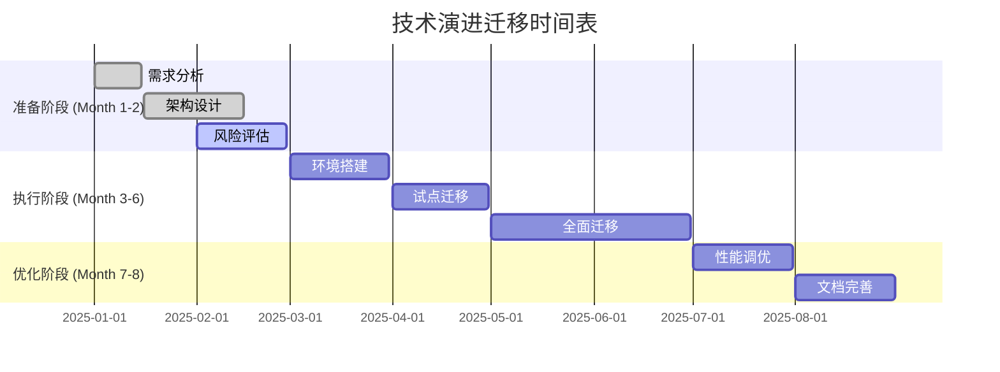

# 技术演进迁移清单

## 概述

本清单提供大数据测试技术演进的系统性迁移指南，确保平稳过渡和风险控制。

## 迁移准备阶段

### 1. 评估当前状态
- [ ] 盘点现有测试技术栈
- [ ] 评估技术债务和瓶颈
- [ ] 识别关键依赖和集成点
- [ ] 制定迁移优先级排序

### 2. 目标架构设计
- [ ] 定义目标技术架构
- [ ] 设计迁移路线图
- [ ] 评估资源需求
- [ ] 制定回滚计划

### 3. 风险评估
- [ ] 识别技术风险点
- [ ] 评估业务影响
- [ ] 制定风险缓解策略
- [ ] 建立监控指标

## 迁移执行阶段

### 4. 环境准备
- [ ] 搭建目标环境
- [ ] 配置CI/CD流水线
- [ ] 准备测试数据集
- [ ] 培训技术团队

### 5. 渐进式迁移
- [ ] 选择试点应用
- [ ] 并行运行新旧系统
- [ ] 分阶段迁移功能
- [ ] 实时监控迁移效果

### 6. 验证与优化
- [ ] 执行全面测试
- [ ] 性能基准测试
- [ ] 用户验收测试
- [ ] 持续优化改进

## 迁移后阶段

### 7. 稳定化运行
- [ ] 监控系统稳定性
- [ ] 处理遗留问题
- [ ] 优化配置参数
- [ ] 建立运维手册

### 8. 知识转移
- [ ] 文档化最佳实践
- [ ] 培训运维团队
- [ ] 建立支持体系
- [ ] 分享迁移经验

## 关键成功因素

### 技术层面
- **渐进式迁移**: 分阶段实施，降低风险
- **并行运行**: 新旧系统并行，确保业务连续性
- **自动化测试**: 完善的测试覆盖，确保质量
- **监控告警**: 实时监控迁移过程和效果

### 组织层面
- **高层支持**: 获得管理层理解和资源支持
- **团队协作**: 跨部门协作，共同推进迁移
- **培训赋能**: 提升团队技能和知识水平
- **变革管理**: 管理组织变革和文化适应

### 业务层面
- **价值导向**: 明确迁移带来的业务价值
- **风险控制**: 制定完善的应急预案
- **沟通透明**: 保持利益相关者信息同步
- **利益平衡**: 平衡短期成本和长期收益

## 常见挑战与解决方案

| 挑战类型 | 具体问题 | 解决方案 |
|---------|---------|---------|
| 技术挑战 | 兼容性问题 | 建立适配层，渐进迁移 |
| 组织挑战 | 抵触情绪 | 加强沟通，展示价值 |
| 业务挑战 | 业务中断 | 并行运行，灰度发布 |
| 资源挑战 | 资源不足 | 分阶段投入，优先级排序 |

## 迁移时间表模板

## 监控指标

### 技术指标
- 系统可用性 > 99.9%
- 响应时间 < 100ms
- 错误率 < 0.1%
- 资源利用率优化

### 业务指标
- 测试效率提升 > 50%
- 缺陷发现率提升 > 30%
- 发布频率加快 > 2倍
- 业务连续性 100%

### 质量指标
- 测试覆盖率 > 90%
- 自动化率 > 80%
- 文档完整性 > 95%
- 团队满意度 > 4.0/5.0</content>
<parameter name="filePath">e:\DONT_TOUCH\10M-2025-Testing\examples\20_evolution\migration_checklist.md