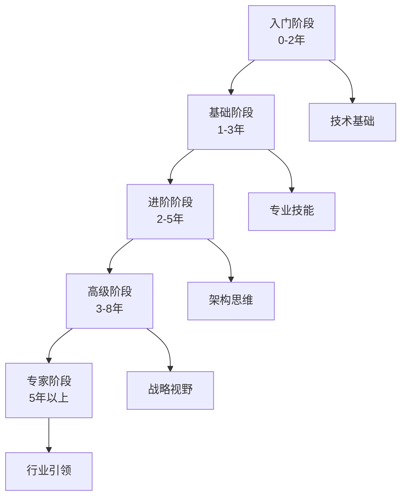

# 技能提升路线图

## 概述

本路线图为大数据测试工程师提供系统性的技能提升路径，从入门到专家的完整学习规划。

## 路线图总览

## 阶段一：入门阶段 (0-2年)

### 核心目标
建立测试基础知识体系，掌握基本测试技能，成为合格的测试工程师。

### 必备技能

#### 1. 软件测试基础 (3个月)
- [ ] 软件测试基本概念
- [ ] 测试流程与方法论
- [ ] 缺陷管理流程
- [ ] 测试文档编写

**学习资源**:
- 书籍：《软件测试基础》
- 课程：ISTQB基础认证课程
- 实践：参与项目测试执行

#### 2. 编程基础 (3个月)
- [ ] Python基础语法
- [ ] SQL数据库操作
- [ ] Linux基本命令
- [ ] Git版本控制

**学习资源**:
- 平台：Codecademy, freeCodeCamp
- 项目：LeetCode算法练习
- 实践：编写简单自动化脚本

#### 3. 测试工具使用 (3个月)
- [ ] JIRA缺陷管理
- [ ] Postman API测试
- [ ] JMeter性能测试
- [ ] Selenium Web自动化

**学习资源**:
- 官方文档
- 视频教程：Udemy, Coursera
- 实践：公司项目应用

### 能力评估标准
- [ ] 能独立编写测试用例
- [ ] 熟练使用2-3种测试工具
- [ ] 理解测试流程和质量概念

### 推荐项目实践
- 参与功能测试项目
- 编写自动化测试脚本
- 进行性能测试执行

## 阶段二：基础阶段 (1-3年)

### 核心目标
掌握专业测试技能，成为能独立负责模块测试的高级测试工程师。

### 必备技能

#### 1. 测试架构设计 (6个月)
- [ ] 测试策略制定
- [ ] 测试框架设计
- [ ] CI/CD集成测试
- [ ] 测试数据管理

**学习资源**:
- 书籍：《测试架构设计》
- 课程：测试架构高级课程
- 实践：设计项目测试方案

#### 2. 大数据测试基础 (6个月)
- [ ] Hadoop/Spark基础
- [ ] 数据仓库概念
- [ ] ETL测试方法
- [ ] 数据质量测试

**学习资源**:
- 平台：Coursera大数据课程
- 书籍：《大数据测试实战》
- 实践：参与大数据项目测试

#### 3. 自动化测试进阶 (6个月)
- [ ] 测试框架开发
- [ ] API自动化测试
- [ ] 移动端测试自动化
- [ ] 持续集成/持续部署

**学习资源**:
- 框架：Pytest, TestNG
- 工具：Jenkins, GitLab CI
- 实践：构建自动化测试框架

### 能力评估标准
- [ ] 能设计完整的测试方案
- [ ] 掌握3+测试框架
- [ ] 能领导小型测试项目

### 推荐认证
- [ ] ISTQB中级认证
- [ ] Python自动化测试认证

## 阶段三：进阶阶段 (2-5年)

### 核心目标
成为测试架构师，能负责系统级测试设计和团队技术指导。

### 必备技能

#### 1. 测试平台开发 (12个月)
- [ ] 测试平台架构设计
- [ ] 微服务测试方案
- [ ] 云原生测试环境
- [ ] DevOps测试集成

**学习资源**:
- 技术：Docker, Kubernetes
- 框架：Spring Cloud测试
- 实践：开发测试平台

#### 2. 专项测试技术 (12个月)
- [ ] 性能测试专家
- [ ] 安全测试专家
- [ ] AI测试技术
- [ ] 区块链测试

**学习资源**:
- 认证：性能测试专家认证
- 课程：安全测试专项课程
- 实践：专项测试项目

#### 3. 质量工程实践 (12个月)
- [ ] 测试度量与分析
- [ ] 质量门禁机制
- [ ] 敏捷测试实践
- [ ] 持续测试文化

**学习资源**:
- 方法论：敏捷测试, DevOps
- 工具：SonarQube, Prometheus
- 实践：质量改进项目

### 能力评估标准
- [ ] 能架构企业级测试平台
- [ ] 精通2+专项测试领域
- [ ] 能指导测试团队发展

### 推荐认证
- [ ] CSTP测试架构师认证
- [ ] AWS/Azure云测试认证

## 阶段四：高级阶段 (3-8年)

### 核心目标
成为质量总监，能制定企业质量战略和引领行业发展。

### 必备技能

#### 1. 质量战略规划 (18个月)
- [ ] 企业质量战略制定
- [ ] 质量管理体系建设
- [ ] 风险管理与合规
- [ ] 质量文化建设

**学习资源**:
- 标准：CMMI, ISO9001
- 课程：质量管理高级课程
- 实践：质量战略项目

#### 2. 技术创新引领 (18个月)
- [ ] 技术趋势研究
- [ ] 创新方法论应用
- [ ] 开源生态建设
- [ ] 专利与标准制定

**学习资源**:
- 研究：技术趋势报告
- 社区：开源项目贡献
- 实践：技术创新项目

#### 3. 组织变革管理 (18个月)
- [ ] 组织变革理论
- [ ] 变革管理实践
- [ ] 领导力发展
- [ ] 人才梯队建设

**学习资源**:
- 理论：组织变革管理
- 认证：领导力发展认证
- 实践：组织变革项目

### 能力评估标准
- [ ] 能制定企业质量战略
- [ ] 引领技术创新方向
- [ ] 成功推动组织变革

### 推荐认证
- [ ] PMP项目管理大师
- [ ] 质量管理总监认证

## 阶段五：专家阶段 (5年以上)

### 核心目标
成为行业意见领袖，贡献行业标准和生态建设。

### 必备技能

#### 1. 行业标准制定
- [ ] 参与行业标准制定
- [ ] 技术规范编写
- [ ] 最佳实践推广

#### 2. 生态系统建设
- [ ] 开源社区运营
- [ ] 行业联盟建设
- [ ] 人才培养体系

#### 3. 战略咨询服务
- [ ] 企业咨询服务
- [ ] 战略规划咨询
- [ ] 技术架构咨询

### 能力评估标准
- [ ] 行业影响力显著
- [ ] 生态建设成果突出
- [ ] 咨询服务价值巨大

## 学习方法与资源

### 学习方法论
1. **目标驱动学习**: 基于职业目标制定学习计划
2. **项目实践学习**: 通过实际项目锻炼技能
3. **社区参与学习**: 开源贡献，技术分享，行业交流
4. **导师指导学习**: 寻求资深导师的指导和反馈

### 资源获取渠道

#### 在线学习平台
- Coursera, edX, Udacity
- Udemy, LinkedIn Learning
- Pluralsight, A Cloud Guru

#### 专业书籍推荐
- 《敏捷软件测试》
- 《Google软件测试之道》
- 《持续交付》
- 《测试架构师修炼之道》

#### 社区与论坛
- Stack Overflow
- Reddit r/testing
- 测试窝社区
- 开源项目社区

#### 行业大会
- QCon全球软件开发大会
- 测试开发大会
- DevOpsDays
- 敏捷大会

## 进度跟踪与评估

### 学习进度跟踪
- [ ] 每月制定学习目标
- [ ] 每周记录学习时间
- [ ] 每月评估学习成果
- [ ] 每季度调整学习计划

### 能力评估体系
- [ ] 定期进行能力自评
- [ ] 寻求导师反馈指导
- [ ] 参与项目绩效评估
- [ ] 参加认证考试验证

### 成果展示方式
- [ ] 技术博客文章发表
- [ ] 开源项目贡献
- [ ] 技术分享演讲
- [ ] 专利论文发表

## 个性化定制建议

### 根据职业方向选择
- **技术专家**: 加强技术深度，架构设计能力
- **管理专家**: 培养领导力，项目管理技能
- **业务专家**: 深化业务理解，产品思维
- **创业创新**: 发展商业思维，市场洞察力

### 根据行业领域选择
- **金融科技**: 合规测试，安全测试重点
- **电商平台**: 性能测试，用户体验测试
- **制造业**: IoT测试，工业互联网测试
- **医疗健康**: 隐私保护，数据安全测试

### 根据公司规模选择
- **创业公司**: 全栈能力，快速学习适应
- **中型企业**: 专项突破，团队协作能力
- **大型企业**: 标准化流程，质量管理体系

## 常见问题解答

### Q: 如何平衡工作与学习？
A: 制定时间管理计划，优先级排序，利用碎片时间学习。

### Q: 没有项目实践机会怎么办？
A: 参与开源项目，个人项目练习，内部技术分享。

### Q: 学习动力不足怎么办？
A: 设定短期目标，寻找学习伙伴，记录学习成果。

### Q: 技术更新太快怎么办？
A: 把握核心技术趋势，培养学习方法，关注本质原理。

### Q: 如何找到好的导师？
A: 主动请教资深同事，参加行业交流，加入专业社区。

记住：技能提升是一个持续的过程，需要持之以恒的努力和正确的学习方法。保持学习热情，勇于实践探索，你将能够在大数据测试领域找到属于自己的发展之路。