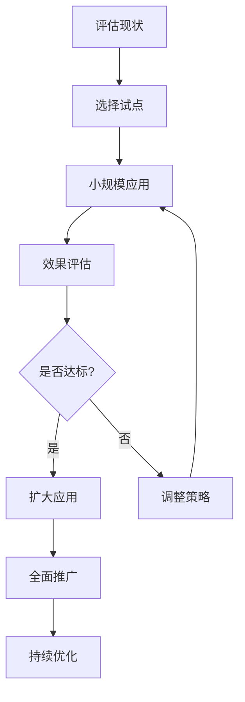

# AI测试最佳实践指南

## 实施策略与最佳实践

### 1. 渐进式应用策略

#### 原则
- **从小开始**: 从单个团队或项目开始试点，避免大规模风险
- **快速迭代**: 基于反馈快速调整策略，持续优化
- **价值驱动**: 优先实施能带来明显价值的AI应用场景
- **风险控制**: 建立回滚机制，确保系统稳定性

#### 实施步骤


#### 成功案例
**案例1: 电商平台测试优化**
- **背景**: 日订单量超百万，传统测试效率低下
- **AI应用**: 缺陷预测 + 智能用例生成
- **效果**: 测试效率提升60%，缺陷发现率提升40%
- **关键成功因素**: 管理层支持 + 技术团队配合 + 渐进式实施

### 2. 数据质量管理

#### 数据收集策略
- **全面覆盖**: 收集代码、测试、缺陷、环境等多维度数据
- **质量把关**: 建立数据质量检查和清洗机制
- **隐私保护**: 遵守数据保护法规，匿名化敏感信息
- **版本控制**: 建立数据版本管理和追溯机制

#### 数据质量评估框架
```python
# examples/33_chapter/data_quality_framework.py
import pandas as pd
import numpy as np
from typing import Dict, List, Any
import logging

logging.basicConfig(level=logging.INFO)
logger = logging.getLogger(__name__)

class DataQualityAssessor:
    """数据质量评估器"""

    def __init__(self):
        self.quality_checks = {
            'completeness': self._check_completeness,
            'accuracy': self._check_accuracy,
            'consistency': self._check_consistency,
            'timeliness': self._check_timeliness,
            'validity': self._check_validity
        }

    def assess_dataset_quality(self, dataset: pd.DataFrame,
                             metadata: Dict[str, Any]) -> Dict[str, Any]:
        """评估数据集质量"""

        quality_scores = {}
        issues = []

        for check_name, check_func in self.quality_checks.items():
            try:
                score, check_issues = check_func(dataset, metadata)
                quality_scores[check_name] = score
                issues.extend(check_issues)
            except Exception as e:
                logger.error(f"Error in {check_name} check: {e}")
                quality_scores[check_name] = 0
                issues.append(f"Check failed: {check_name}")

        overall_score = np.mean(list(quality_scores.values()))

        return {
            'overall_score': round(overall_score, 2),
            'dimension_scores': quality_scores,
            'issues': issues,
            'recommendations': self._generate_recommendations(quality_scores, issues)
        }

    def _check_completeness(self, dataset: pd.DataFrame,
                           metadata: Dict[str, Any]) -> tuple:
        """检查数据完整性"""
        issues = []

        # 检查缺失值
        missing_stats = dataset.isnull().sum()
        total_rows = len(dataset)

        completeness_scores = []
        for column in dataset.columns:
            missing_ratio = missing_stats[column] / total_rows
            completeness_score = 1 - missing_ratio

            if missing_ratio > 0.1:  # 超过10%缺失
                issues.append(f"High missing rate in {column}: {missing_ratio:.1%}")

            completeness_scores.append(completeness_score)

        avg_completeness = np.mean(completeness_scores)
        return avg_completeness, issues

    def _check_accuracy(self, dataset: pd.DataFrame,
                       metadata: Dict[str, Any]) -> tuple:
        """检查数据准确性"""
        issues = []

        # 基于业务规则检查
        accuracy_score = 1.0  # 默认高准确性

        # 检查数值范围
        numeric_columns = dataset.select_dtypes(include=[np.number]).columns
        for col in numeric_columns:
            if col in metadata.get('valid_ranges', {}):
                valid_range = metadata['valid_ranges'][col]
                outliers = dataset[~dataset[col].between(valid_range[0], valid_range[1])]
                if len(outliers) > 0:
                    outlier_ratio = len(outliers) / len(dataset)
                    accuracy_score -= outlier_ratio * 0.1  # 每个异常值扣分
                    issues.append(f"Out of range values in {col}: {len(outliers)} rows")

        # 检查格式一致性
        if 'email' in dataset.columns:
            email_pattern = r'^[a-zA-Z0-9._%+-]+@[a-zA-Z0-9.-]+\.[a-zA-Z]{2,}$'
            invalid_emails = dataset['email'].str.match(email_pattern, na=False)
            if invalid_emails.sum() < len(dataset) * 0.9:  # 少于90%有效
                issues.append("Low email format validity")

        return max(0, accuracy_score), issues

    def _check_consistency(self, dataset: pd.DataFrame,
                          metadata: Dict[str, Any]) -> tuple:
        """检查数据一致性"""
        issues = []

        consistency_score = 1.0

        # 检查逻辑一致性
        consistency_rules = metadata.get('consistency_rules', [])

        for rule in consistency_rules:
            try:
                condition = rule['condition']
                violation_count = len(dataset.query(condition))
                if violation_count > 0:
                    violation_ratio = violation_count / len(dataset)
                    consistency_score -= violation_ratio * 0.2
                    issues.append(f"Consistency violation: {rule['description']} ({violation_count} rows)")
            except Exception as e:
                issues.append(f"Error checking rule {rule.get('description', 'unknown')}: {e}")

        return max(0, consistency_score), issues

    def _check_timeliness(self, dataset: pd.DataFrame,
                         metadata: Dict[str, Any]) -> tuple:
        """检查数据时效性"""
        issues = []

        timeliness_score = 1.0

        # 检查数据新鲜度
        if 'timestamp' in dataset.columns:
            latest_timestamp = pd.to_datetime(dataset['timestamp']).max()
            current_time = pd.Timestamp.now()

            # 计算数据新鲜度（天数）
            freshness_days = (current_time - latest_timestamp).days

            if freshness_days > 30:  # 超过30天
                timeliness_score = max(0.1, 1 - (freshness_days - 30) / 365)  # 线性衰减
                issues.append(f"Data freshness issue: {freshness_days} days old")

        return timeliness_score, issues

    def _check_validity(self, dataset: pd.DataFrame,
                       metadata: Dict[str, Any]) -> tuple:
        """检查数据有效性"""
        issues = []

        validity_score = 1.0

        # 检查数据类型
        expected_types = metadata.get('data_types', {})
        for col, expected_type in expected_types.items():
            if col in dataset.columns:
                actual_type = str(dataset[col].dtype)
                if not self._types_compatible(actual_type, expected_type):
                    validity_score -= 0.1
                    issues.append(f"Type mismatch in {col}: expected {expected_type}, got {actual_type}")

        # 检查值域
        valid_values = metadata.get('valid_values', {})
        for col, allowed_values in valid_values.items():
            if col in dataset.columns:
                invalid_count = (~dataset[col].isin(allowed_values)).sum()
                if invalid_count > 0:
                    invalid_ratio = invalid_count / len(dataset)
                    validity_score -= invalid_ratio * 0.1
                    issues.append(f"Invalid values in {col}: {invalid_count} rows")

        return max(0, validity_score), issues

    def _types_compatible(self, actual: str, expected: str) -> bool:
        """检查数据类型兼容性"""
        type_mapping = {
            'int64': ['int', 'numeric'],
            'float64': ['float', 'numeric'],
            'object': ['string', 'text'],
            'bool': ['boolean'],
            'datetime64[ns]': ['datetime', 'date']
        }

        return expected in type_mapping.get(actual, [])

    def _generate_recommendations(self, scores: Dict[str, float],
                                issues: List[str]) -> List[str]:
        """生成改进建议"""
        recommendations = []

        # 基于质量分数的建议
        if scores.get('completeness', 1) < 0.8:
            recommendations.append("Improve data collection processes to reduce missing values")
        if scores.get('accuracy', 1) < 0.9:
            recommendations.append("Implement data validation rules and automated checks")
        if scores.get('consistency', 1) < 0.85:
            recommendations.append("Establish data consistency rules and monitoring")
        if scores.get('timeliness', 1) < 0.7:
            recommendations.append("Set up automated data refresh and monitoring alerts")
        if scores.get('validity', 1) < 0.9:
            recommendations.append("Define and enforce data type and value constraints")

        # 基于具体问题的建议
        for issue in issues[:5]:  # 限制建议数量
            if 'missing' in issue.lower():
                recommendations.append("Implement data imputation strategies for missing values")
            elif 'outlier' in issue.lower() or 'range' in issue.lower():
                recommendations.append("Add outlier detection and handling mechanisms")
            elif 'consistency' in issue.lower():
                recommendations.append("Review and update business rules for data consistency")

        return list(set(recommendations))  # 去重
```

### 3. 模型管理与监控

#### 模型生命周期管理
- **版本控制**: 跟踪模型版本、参数和性能指标
- **A/B测试**: 并行运行新旧模型，比较效果
- **回滚机制**: 快速回滚到稳定版本
- **审计日志**: 记录模型决策和变更历史

#### 性能监控框架
```python
# examples/33_chapter/model_monitoring.py
import time
import psutil
from typing import Dict, List, Any, Callable
import logging
from datetime import datetime, timedelta
import threading
import queue

logging.basicConfig(level=logging.INFO)
logger = logging.getLogger(__name__)

class ModelMonitor:
    """AI模型监控器"""

    def __init__(self, model_name: str, alert_thresholds: Dict[str, float] = None):
        self.model_name = model_name
        self.alert_thresholds = alert_thresholds or {
            'accuracy_drop': 0.05,
            'latency_increase': 0.2,
            'error_rate_rise': 0.1
        }
        self.metrics_history = []
        self.alerts = []
        self.monitoring_active = False
        self.monitor_thread = None
        self.metrics_queue = queue.Queue()

    def start_monitoring(self, interval_seconds: int = 60):
        """启动监控"""
        if self.monitoring_active:
            return

        self.monitoring_active = True
        self.monitor_thread = threading.Thread(
            target=self._monitoring_loop,
            args=(interval_seconds,)
        )
        self.monitor_thread.daemon = True
        self.monitor_thread.start()
        logger.info(f"Started monitoring for model: {self.model_name}")

    def stop_monitoring(self):
        """停止监控"""
        self.monitoring_active = False
        if self.monitor_thread:
            self.monitor_thread.join(timeout=5)
        logger.info(f"Stopped monitoring for model: {self.model_name}")

    def record_prediction(self, input_data: Any, prediction: Any,
                         actual: Any = None, latency: float = None):
        """记录预测结果"""
        record = {
            'timestamp': datetime.now(),
            'input_size': len(str(input_data)) if input_data else 0,
            'prediction': prediction,
            'actual': actual,
            'latency': latency or 0,
            'correct': actual is not None and prediction == actual
        }

        self.metrics_queue.put(record)

    def get_current_metrics(self) -> Dict[str, Any]:
        """获取当前指标"""
        if not self.metrics_history:
            return {}

        recent_metrics = self.metrics_history[-10:]  # 最近10个测量点

        # 计算聚合指标
        total_predictions = sum(m['prediction_count'] for m in recent_metrics)
        correct_predictions = sum(m['correct_predictions'] for m in recent_metrics)
        total_latency = sum(m['avg_latency'] * m['prediction_count'] for m in recent_metrics)

        accuracy = correct_predictions / total_predictions if total_predictions > 0 else 0
        avg_latency = total_latency / total_predictions if total_predictions > 0 else 0

        return {
            'accuracy': accuracy,
            'avg_latency': avg_latency,
            'total_predictions': total_predictions,
            'uptime_percentage': self._calculate_uptime(recent_metrics),
            'error_rate': 1 - accuracy,
            'throughput': total_predictions / len(recent_metrics)  # 每分钟预测数
        }

    def _monitoring_loop(self, interval_seconds: int):
        """监控循环"""
        while self.monitoring_active:
            try:
                # 收集指标
                metrics = self._collect_metrics()

                # 检查告警
                alerts = self._check_alerts(metrics)
                if alerts:
                    self.alerts.extend(alerts)
                    self._handle_alerts(alerts)

                # 存储历史
                self.metrics_history.append(metrics)

                # 清理旧历史（保留最近24小时）
                cutoff_time = datetime.now() - timedelta(hours=24)
                self.metrics_history = [
                    m for m in self.metrics_history
                    if m['timestamp'] > cutoff_time
                ]

                time.sleep(interval_seconds)

            except Exception as e:
                logger.error(f"Monitoring error: {e}")
                time.sleep(interval_seconds)

    def _collect_metrics(self) -> Dict[str, Any]:
        """收集指标"""
        records = []
        while not self.metrics_queue.empty():
            try:
                records.append(self.metrics_queue.get_nowait())
            except queue.Empty:
                break

        if not records:
            # 如果没有新记录，使用上次的指标
            if self.metrics_history:
                last_metrics = self.metrics_history[-1].copy()
                last_metrics['timestamp'] = datetime.now()
                return last_metrics
            else:
                return self._create_empty_metrics()

        # 计算指标
        prediction_count = len(records)
        correct_predictions = sum(1 for r in records if r['correct'])
        latencies = [r['latency'] for r in records if r['latency'] > 0]

        metrics = {
            'timestamp': datetime.now(),
            'prediction_count': prediction_count,
            'correct_predictions': correct_predictions,
            'accuracy': correct_predictions / prediction_count if prediction_count > 0 else 0,
            'avg_latency': sum(latencies) / len(latencies) if latencies else 0,
            'max_latency': max(latencies) if latencies else 0,
            'min_latency': min(latencies) if latencies else 0,
            'cpu_usage': psutil.cpu_percent(),
            'memory_usage': psutil.virtual_memory().percent,
            'error_count': sum(1 for r in records if not r['correct'])
        }

        return metrics

    def _create_empty_metrics(self) -> Dict[str, Any]:
        """创建空指标"""
        return {
            'timestamp': datetime.now(),
            'prediction_count': 0,
            'correct_predictions': 0,
            'accuracy': 0,
            'avg_latency': 0,
            'max_latency': 0,
            'min_latency': 0,
            'cpu_usage': 0,
            'memory_usage': 0,
            'error_count': 0
        }

    def _check_alerts(self, current_metrics: Dict[str, Any]) -> List[Dict[str, Any]]:
        """检查告警条件"""
        alerts = []

        if len(self.metrics_history) < 2:
            return alerts  # 需要至少2个数据点来比较

        previous_metrics = self.metrics_history[-2]  # 上一个测量点

        # 检查准确率下降
        accuracy_drop = previous_metrics['accuracy'] - current_metrics['accuracy']
        if accuracy_drop > self.alert_thresholds['accuracy_drop']:
            alerts.append({
                'type': 'accuracy_drop',
                'severity': 'high',
                'message': f"Accuracy dropped by {accuracy_drop:.3f}",
                'current_value': current_metrics['accuracy'],
                'previous_value': previous_metrics['accuracy']
            })

        # 检查延迟增加
        if previous_metrics['avg_latency'] > 0:
            latency_increase = (current_metrics['avg_latency'] - previous_metrics['avg_latency']) / previous_metrics['avg_latency']
            if latency_increase > self.alert_thresholds['latency_increase']:
                alerts.append({
                    'type': 'latency_increase',
                    'severity': 'medium',
                    'message': f"Latency increased by {latency_increase:.1%}",
                    'current_value': current_metrics['avg_latency'],
                    'previous_value': previous_metrics['avg_latency']
                })

        # 检查错误率上升
        error_rate_rise = current_metrics['error_rate'] - previous_metrics.get('error_rate', 0)
        if error_rate_rise > self.alert_thresholds['error_rate_rise']:
            alerts.append({
                'type': 'error_rate_rise',
                'severity': 'high',
                'message': f"Error rate increased by {error_rate_rise:.3f}",
                'current_value': current_metrics['error_rate'],
                'previous_value': previous_metrics.get('error_rate', 0)
            })

        return alerts

    def _handle_alerts(self, alerts: List[Dict[str, Any]]):
        """处理告警"""
        for alert in alerts:
            severity = alert['severity']
            message = alert['message']

            if severity == 'high':
                logger.error(f"HIGH ALERT - {self.model_name}: {message}")
                # 这里可以集成告警系统，如发送邮件、短信等
            elif severity == 'medium':
                logger.warning(f"MEDIUM ALERT - {self.model_name}: {message}")
            else:
                logger.info(f"LOW ALERT - {self.model_name}: {message}")

    def _calculate_uptime(self, metrics_list: List[Dict[str, Any]]) -> float:
        """计算正常运行时间百分比"""
        if not metrics_list:
            return 0

        total_periods = len(metrics_list)
        successful_periods = sum(1 for m in metrics_list if m['error_count'] == 0)

        return successful_periods / total_periods if total_periods > 0 else 0

    def get_alert_summary(self, hours: int = 24) -> Dict[str, Any]:
        """获取告警摘要"""
        cutoff_time = datetime.now() - timedelta(hours=hours)

        recent_alerts = [a for a in self.alerts if a.get('timestamp', datetime.min) > cutoff_time]

        alert_counts = {}
        for alert in recent_alerts:
            alert_type = alert['type']
            severity = alert['severity']
            key = f"{severity}_{alert_type}"
            alert_counts[key] = alert_counts.get(key, 0) + 1

        return {
            'total_alerts': len(recent_alerts),
            'alert_counts': alert_counts,
            'most_common': max(alert_counts.items(), key=lambda x: x[1]) if alert_counts else None,
            'time_period': f"{hours} hours"
        }
```

### 4. 人机协作模式

#### 协作原则
- **优势互补**: AI处理重复性工作，人负责创造性决策
- **透明解释**: AI决策过程可解释，人可以理解和干预
- **持续学习**: 人机交互数据用于改进AI模型
- **信任建立**: 通过实践证明AI价值，建立团队信任

#### 实施框架
```python
# examples/33_chapter/human_ai_collaboration.py
from typing import Dict, List, Any, Optional
import logging
from datetime import datetime
from enum import Enum

logging.basicConfig(level=logging.INFO)
logger = logging.getLogger(__name__)

class CollaborationMode(Enum):
    AI_LEAD = "ai_lead"
    HUMAN_LEAD = "human_lead"
    COLLABORATIVE = "collaborative"
    HUMAN_OVERRIDE = "human_override"

class HumanAICollaborator:
    """人机协作管理器"""

    def __init__(self):
        self.collaboration_history = []
        self.trust_metrics = {
            'ai_accuracy_perceived': 0.8,
            'human_satisfaction': 0.9,
            'collaboration_efficiency': 0.85
        }
        self.mode = CollaborationMode.COLLABORATIVE

    def decide_collaboration_mode(self, task_complexity: float,
                                time_pressure: float,
                                ai_confidence: float) -> CollaborationMode:
        """决定协作模式"""

        # 基于任务特征决定模式
        if task_complexity > 0.8 and ai_confidence < 0.6:
            # 复杂任务且AI信心不足，人主导
            return CollaborationMode.HUMAN_LEAD
        elif time_pressure > 0.8 and ai_confidence > 0.8:
            # 时间紧迫且AI信心高，AI主导
            return CollaborationMode.AI_LEAD
        elif task_complexity > 0.6 or time_pressure > 0.6:
            # 中等复杂度或压力，协作模式
            return CollaborationMode.COLLABORATIVE
        else:
            # 简单任务，人可随时干预
            return CollaborationMode.HUMAN_OVERRIDE

    def process_task(self, task: Dict[str, Any], human_input: Optional[Dict[str, Any]] = None) -> Dict[str, Any]:
        """处理任务"""

        task_id = task.get('id', f"task_{datetime.now().strftime('%Y%m%d_%H%M%S')}")
        task_complexity = self._assess_task_complexity(task)
        time_pressure = task.get('time_pressure', 0.5)
        ai_confidence = self._get_ai_confidence(task)

        # 决定协作模式
        mode = self.decide_collaboration_mode(task_complexity, time_pressure, ai_confidence)

        # 执行任务
        if mode == CollaborationMode.AI_LEAD:
            result = self._ai_lead_execution(task)
        elif mode == CollaborationMode.HUMAN_LEAD:
            result = self._human_lead_execution(task, human_input)
        elif mode == CollaborationMode.COLLABORATIVE:
            result = self._collaborative_execution(task, human_input)
        else:  # HUMAN_OVERRIDE
            result = self._human_override_execution(task, human_input)

        # 记录协作历史
        collaboration_record = {
            'task_id': task_id,
            'timestamp': datetime.now(),
            'mode': mode.value,
            'task_complexity': task_complexity,
            'time_pressure': time_pressure,
            'ai_confidence': ai_confidence,
            'result_quality': self._assess_result_quality(result),
            'human_involvement': 1 if human_input else 0
        }

        self.collaboration_history.append(collaboration_record)

        # 更新信任指标
        self._update_trust_metrics(collaboration_record)

        result['collaboration_info'] = collaboration_record
        return result

    def _ai_lead_execution(self, task: Dict[str, Any]) -> Dict[str, Any]:
        """AI主导执行"""
        # AI完全负责，人类可后期审查
        ai_result = self._simulate_ai_processing(task)

        return {
            'execution_mode': 'ai_lead',
            'result': ai_result,
            'confidence': 0.9,
            'requires_review': True,
            'review_deadline': '24h'
        }

    def _human_lead_execution(self, task: Dict[str, Any],
                            human_input: Optional[Dict[str, Any]]) -> Dict[str, Any]:
        """人类主导执行"""
        # 人类负责主要决策，AI提供建议
        ai_suggestion = self._simulate_ai_processing(task)

        if human_input:
            human_decision = human_input.get('decision', 'accept_suggestion')
            if human_decision == 'accept_suggestion':
                result = ai_suggestion
            else:
                result = human_input.get('custom_result', ai_suggestion)
        else:
            result = ai_suggestion  # 默认接受AI建议

        return {
            'execution_mode': 'human_lead',
            'result': result,
            'ai_suggestion': ai_suggestion,
            'human_override': human_input is not None
        }

    def _collaborative_execution(self, task: Dict[str, Any],
                               human_input: Optional[Dict[str, Any]]) -> Dict[str, Any]:
        """协作执行"""
        # AI和人类共同决策
        ai_result = self._simulate_ai_processing(task)

        if human_input:
            # 合并AI和人类输入
            combined_result = self._merge_results(ai_result, human_input)
        else:
            combined_result = ai_result

        return {
            'execution_mode': 'collaborative',
            'result': combined_result,
            'ai_contribution': ai_result,
            'human_contribution': human_input
        }

    def _human_override_execution(self, task: Dict[str, Any],
                                human_input: Optional[Dict[str, Any]]) -> Dict[str, Any]:
        """人类随时干预执行"""
        # AI执行但人类可随时干预
        ai_result = self._simulate_ai_processing(task)

        if human_input and human_input.get('override', False):
            result = human_input.get('custom_result', ai_result)
            override_reason = human_input.get('override_reason', 'unspecified')
        else:
            result = ai_result
            override_reason = None

        return {
            'execution_mode': 'human_override',
            'result': result,
            'ai_result': ai_result,
            'override_applied': override_reason is not None,
            'override_reason': override_reason
        }

    def _assess_task_complexity(self, task: Dict[str, Any]) -> float:
        """评估任务复杂度"""
        # 基于任务特征评估复杂度
        complexity_factors = {
            'stakeholders': task.get('stakeholder_count', 1) / 10,  # 利益相关者数量
            'dependencies': len(task.get('dependencies', [])) / 5,  # 依赖数量
            'uncertainty': task.get('uncertainty_level', 0.5),  # 不确定性水平
            'domain_complexity': task.get('domain_complexity', 0.5)  # 领域复杂度
        }

        complexity = sum(complexity_factors.values()) / len(complexity_factors)
        return min(1.0, complexity)

    def _get_ai_confidence(self, task: Dict[str, Any]) -> float:
        """获取AI信心水平"""
        # 基于历史表现和任务特征估算信心
        task_type = task.get('type', 'unknown')
        historical_performance = {
            'defect_prediction': 0.85,
            'test_generation': 0.75,
            'result_analysis': 0.90
        }

        base_confidence = historical_performance.get(task_type, 0.7)

        # 根据任务复杂度调整
        complexity_penalty = self._assess_task_complexity(task) * 0.2
        confidence = base_confidence - complexity_penalty

        return max(0.1, min(1.0, confidence))

    def _simulate_ai_processing(self, task: Dict[str, Any]) -> Dict[str, Any]:
        """模拟AI处理（实际实现中会调用真实的AI模型）"""
        # 这里是模拟实现，实际应该调用真实的AI服务
        return {
            'processed': True,
            'confidence': 0.8,
            'result': f"AI processed task: {task.get('description', 'unknown')}",
            'timestamp': datetime.now()
        }

    def _merge_results(self, ai_result: Dict[str, Any],
                     human_input: Dict[str, Any]) -> Dict[str, Any]:
        """合并AI和人类结果"""
        # 简单的合并策略：优先人类输入，但保留AI洞察
        merged = ai_result.copy()
        merged.update(human_input)
        merged['merged'] = True
        merged['merge_timestamp'] = datetime.now()

        return merged

    def _assess_result_quality(self, result: Dict[str, Any]) -> float:
        """评估结果质量"""
        # 基于多个维度评估质量
        quality_factors = {
            'completeness': 1.0 if result.get('complete', True) else 0.5,
            'accuracy': result.get('confidence', 0.5),
            'timeliness': 1.0 if result.get('on_time', True) else 0.7,
            'usefulness': result.get('useful', True) and 1.0 or 0.6
        }

        quality = sum(quality_factors.values()) / len(quality_factors)
        return min(1.0, quality)

    def _update_trust_metrics(self, record: Dict[str, Any]):
        """更新信任指标"""
        # 基于协作历史更新信任度
        recent_records = self.collaboration_history[-20:]  # 最近20次协作

        if len(recent_records) >= 5:
            avg_quality = sum(r['result_quality'] for r in recent_records) / len(recent_records)
            human_involvement_rate = sum(r['human_involvement'] for r in recent_records) / len(recent_records)

            # 更新信任指标
            self.trust_metrics['ai_accuracy_perceived'] = avg_quality
            self.trust_metrics['human_satisfaction'] = 1 - human_involvement_rate  # 人类参与越少满意度越高
            self.trust_metrics['collaboration_efficiency'] = (avg_quality + (1 - human_involvement_rate)) / 2

    def get_collaboration_analytics(self) -> Dict[str, Any]:
        """获取协作分析"""
        if not self.collaboration_history:
            return {}

        records = self.collaboration_history

        mode_distribution = {}
        for record in records:
            mode = record['mode']
            mode_distribution[mode] = mode_distribution.get(mode, 0) + 1

        quality_by_mode = {}
        for mode in set(r['mode'] for r in records):
            mode_records = [r for r in records if r['mode'] == mode]
            avg_quality = sum(r['result_quality'] for r in mode_records) / len(mode_records)
            quality_by_mode[mode] = avg_quality

        return {
            'total_collaborations': len(records),
            'mode_distribution': mode_distribution,
            'quality_by_mode': quality_by_mode,
            'trust_metrics': self.trust_metrics,
            'trend': self._analyze_collaboration_trend()
        }

    def _analyze_collaboration_trend(self) -> str:
        """分析协作趋势"""
        if len(self.collaboration_history) < 10:
            return "insufficient_data"

        recent = self.collaboration_history[-10:]
        earlier = self.collaboration_history[-20:-10] if len(self.collaboration_history) >= 20 else self.collaboration_history[:-10]

        recent_avg_quality = sum(r['result_quality'] for r in recent) / len(recent)
        earlier_avg_quality = sum(r['result_quality'] for r in earlier) / len(earlier)

        if recent_avg_quality > earlier_avg_quality + 0.1:
            return "improving"
        elif recent_avg_quality < earlier_avg_quality - 0.1:
            return "declining"
        else:
            return "stable"
```

### 5. 持续改进机制

#### 反馈循环建立
- **结果收集**: 系统化收集AI应用效果数据
- **效果分析**: 量化分析AI带来的价值提升
- **问题识别**: 识别AI应用中的瓶颈和问题
- **优化实施**: 基于分析结果持续优化AI应用

#### 改进框架
```python
# examples/33_chapter/continuous_improvement.py
from typing import Dict, List, Any, Optional
import pandas as pd
from datetime import datetime, timedelta
import logging

logging.basicConfig(level=logging.INFO)
logger = logging.getLogger(__name__)

class ContinuousImprovementManager:
    """持续改进管理器"""

    def __init__(self):
        self.improvement_history = []
        self.kpi_baselines = {}
        self.improvement_backlog = []

    def collect_feedback(self, feedback_type: str, data: Dict[str, Any],
                        source: str = "system") -> str:
        """收集反馈"""
        feedback_record = {
            'id': f"feedback_{datetime.now().strftime('%Y%m%d_%H%M%S')}",
            'timestamp': datetime.now(),
            'type': feedback_type,
            'data': data,
            'source': source,
            'processed': False
        }

        self.improvement_backlog.append(feedback_record)
        logger.info(f"Collected {feedback_type} feedback from {source}")

        return feedback_record['id']

    def analyze_improvements(self) -> List[Dict[str, Any]]:
        """分析改进机会"""
        improvements = []

        # 处理待处理的反馈
        unprocessed_feedback = [f for f in self.improvement_backlog if not f['processed']]

        for feedback in unprocessed_feedback:
            improvement = self._analyze_feedback(feedback)
            if improvement:
                improvements.append(improvement)
                feedback['processed'] = True

        # 基于KPI趋势分析
        kpi_improvements = self._analyze_kpi_trends()
        improvements.extend(kpi_improvements)

        # 基于用户痛点分析
        pain_point_improvements = self._analyze_pain_points()
        improvements.extend(pain_point_improvements)

        # 按优先级排序
        improvements.sort(key=lambda x: x.get('priority_score', 0), reverse=True)

        return improvements

    def _analyze_feedback(self, feedback: Dict[str, Any]) -> Optional[Dict[str, Any]]:
        """分析单个反馈"""
        feedback_type = feedback['type']
        data = feedback['data']

        if feedback_type == 'user_satisfaction':
            return self._analyze_user_satisfaction(data)
        elif feedback_type == 'performance_issue':
            return self._analyze_performance_issue(data)
        elif feedback_type == 'feature_request':
            return self._analyze_feature_request(data)
        elif feedback_type == 'error_report':
            return self._analyze_error_report(data)
        else:
            return None

    def _analyze_user_satisfaction(self, data: Dict[str, Any]) -> Dict[str, Any]:
        """分析用户满意度反馈"""
        satisfaction_score = data.get('score', 5)  # 1-10分
        comments = data.get('comments', '')

        priority_score = (11 - satisfaction_score) * 10  # 低分高优先级

        improvement = {
            'type': 'user_experience',
            'title': 'Improve user satisfaction',
            'description': f"User reported satisfaction score: {satisfaction_score}/10",
            'comments': comments,
            'priority_score': priority_score,
            'estimated_effort': 'medium',
            'potential_impact': 'high' if satisfaction_score <= 3 else 'medium'
        }

        return improvement

    def _analyze_performance_issue(self, data: Dict[str, Any]) -> Dict[str, Any]:
        """分析性能问题"""
        issue_type = data.get('issue_type', 'unknown')
        severity = data.get('severity', 'medium')
        frequency = data.get('frequency', 'occasional')

        priority_map = {'low': 1, 'medium': 2, 'high': 3, 'critical': 4}
        frequency_map = {'rare': 1, 'occasional': 2, 'frequent': 3, 'constant': 4}

        priority_score = priority_map.get(severity, 2) * frequency_map.get(frequency, 2) * 10

        improvement = {
            'type': 'performance',
            'title': f"Resolve {issue_type} performance issue",
            'description': f"Performance issue: {issue_type} (severity: {severity}, frequency: {frequency})",
            'priority_score': priority_score,
            'estimated_effort': 'high' if severity in ['high', 'critical'] else 'medium',
            'potential_impact': severity
        }

        return improvement

    def _analyze_feature_request(self, data: Dict[str, Any]) -> Dict[str, Any]:
        """分析功能需求"""
        feature_name = data.get('feature_name', 'unknown')
        user_count = data.get('requesting_users', 1)
        business_value = data.get('business_value', 'medium')

        value_map = {'low': 1, 'medium': 2, 'high': 3}
        priority_score = user_count * value_map.get(business_value, 2)

        improvement = {
            'type': 'feature',
            'title': f"Implement {feature_name} feature",
            'description': f"Feature request: {feature_name} (requested by {user_count} users)",
            'priority_score': priority_score,
            'estimated_effort': data.get('estimated_effort', 'medium'),
            'potential_impact': business_value
        }

        return improvement

    def _analyze_error_report(self, data: Dict[str, Any]) -> Dict[str, Any]:
        """分析错误报告"""
        error_type = data.get('error_type', 'unknown')
        occurrence_count = data.get('occurrence_count', 1)
        affected_users = data.get('affected_users', 1)

        priority_score = occurrence_count * affected_users

        improvement = {
            'type': 'bug_fix',
            'title': f"Fix {error_type} error",
            'description': f"Error: {error_type} (occurred {occurrence_count} times, affected {affected_users} users)",
            'priority_score': priority_score,
            'estimated_effort': 'medium',
            'potential_impact': 'high' if affected_users > 10 else 'medium'
        }

        return improvement

    def _analyze_kpi_trends(self) -> List[Dict[str, Any]]:
        """分析KPI趋势"""
        improvements = []

        # 这里应该从实际的KPI数据源获取数据
        # 为了演示，使用模拟数据
        kpi_trends = {
            'test_execution_time': {'trend': 'increasing', 'change_percent': 15},
            'defect_detection_rate': {'trend': 'stable', 'change_percent': 2},
            'false_positive_rate': {'trend': 'decreasing', 'change_percent': -8}
        }

        for kpi_name, trend_data in kpi_trends.items():
            if trend_data['trend'] == 'increasing' and trend_data['change_percent'] > 10:
                if 'time' in kpi_name:
                    improvements.append({
                        'type': 'performance_optimization',
                        'title': f"Optimize {kpi_name.replace('_', ' ')}",
                        'description': f"{kpi_name} increased by {trend_data['change_percent']}%, needs optimization",
                        'priority_score': 25,
                        'estimated_effort': 'high',
                        'potential_impact': 'medium'
                    })

        return improvements

    def _analyze_pain_points(self) -> List[Dict[str, Any]]:
        """分析用户痛点"""
        improvements = []

        # 基于常见痛点模式识别
        common_pain_points = [
            {
                'pattern': 'manual_test_creation',
                'title': 'Automate test case generation',
                'description': 'Users spend significant time manually creating test cases',
                'priority_score': 30,
                'estimated_effort': 'high',
                'potential_impact': 'high'
            },
            {
                'pattern': 'result_analysis',
                'title': 'Improve test result analysis',
                'description': 'Manual analysis of test results is time-consuming',
                'priority_score': 25,
                'estimated_effort': 'medium',
                'potential_impact': 'high'
            }
        ]

        # 这里应该基于实际用户行为数据识别痛点
        # 为了演示，返回常见痛点
        return common_pain_points

    def prioritize_improvements(self, improvements: List[Dict[str, Any]]) -> List[Dict[str, Any]]:
        """改进项目优先级排序"""
        # 基于多个维度计算综合优先级
        for improvement in improvements:
            base_score = improvement.get('priority_score', 0)

            # 考虑业务影响
            impact_multiplier = {'low': 1, 'medium': 1.5, 'high': 2}.get(
                improvement.get('potential_impact', 'medium'), 1.5)

            # 考虑实施难度
            effort_multiplier = {'low': 1.2, 'medium': 1, 'high': 0.8}.get(
                improvement.get('estimated_effort', 'medium'), 1)

            improvement['final_priority'] = base_score * impact_multiplier * effort_multiplier

        # 重新排序
        improvements.sort(key=lambda x: x.get('final_priority', 0), reverse=True)

        return improvements

    def create_improvement_plan(self, improvements: List[Dict[str, Any]],
                              available_resources: Dict[str, int]) -> Dict[str, Any]:
        """创建改进计划"""
        prioritized_improvements = self.prioritize_improvements(improvements)

        # 基于可用资源分配改进项目
        plan = {
            'immediate_actions': [],  # 立即执行
            'short_term': [],         # 短期（1-3个月）
            'medium_term': [],        # 中期（3-6个月）
            'long_term': []           # 长期（6个月以上）
        }

        resource_allocation = available_resources.copy()

        for improvement in prioritized_improvements:
            effort = improvement.get('estimated_effort', 'medium')
            required_resources = self._estimate_resources(effort)

            # 检查资源是否足够
            can_allocate = all(
                resource_allocation.get(res_type, 0) >= required
                for res_type, required in required_resources.items()
            )

            if can_allocate:
                # 分配资源
                for res_type, required in required_resources.items():
                    resource_allocation[res_type] -= required

                # 根据优先级和资源分配到时间段
                priority = improvement.get('final_priority', 0)
                if priority > 40:
                    plan['immediate_actions'].append(improvement)
                elif priority > 25:
                    plan['short_term'].append(improvement)
                elif priority > 15:
                    plan['medium_term'].append(improvement)
                else:
                    plan['long_term'].append(improvement)

        return plan

    def _estimate_resources(self, effort: str) -> Dict[str, int]:
        """估算所需资源"""
        resource_estimates = {
            'low': {'developers': 1, 'weeks': 2},
            'medium': {'developers': 2, 'weeks': 4},
            'high': {'developers': 3, 'weeks': 8}
        }

        return resource_estimates.get(effort, resource_estimates['medium'])

    def track_improvement_progress(self, improvement_id: str,
                                 progress_update: Dict[str, Any]):
        """跟踪改进进度"""
        # 查找改进项目
        improvement = None
        for item in self.improvement_history:
            if item.get('id') == improvement_id:
                improvement = item
                break

        if not improvement:
            # 新改进项目
            improvement = {
                'id': improvement_id,
                'start_date': datetime.now(),
                'progress_updates': []
            }
            self.improvement_history.append(improvement)

        # 添加进度更新
        progress_update['timestamp'] = datetime.now()
        improvement['progress_updates'].append(progress_update)

        # 更新状态
        improvement['current_status'] = progress_update.get('status', 'in_progress')
        improvement['completion_percentage'] = progress_update.get('completion_percentage', 0)

        logger.info(f"Updated progress for improvement {improvement_id}: {progress_update.get('status', 'unknown')}")

    def generate_improvement_report(self) -> Dict[str, Any]:
        """生成改进报告"""
        completed_improvements = [i for i in self.improvement_history if i.get('current_status') == 'completed']
        in_progress_improvements = [i for i in self.improvement_history if i.get('current_status') == 'in_progress']

        # 计算改进指标
        total_improvements = len(self.improvement_history)
        completion_rate = len(completed_improvements) / total_improvements if total_improvements > 0 else 0

        # 计算平均完成时间
        completion_times = []
        for improvement in completed_improvements:
            if 'start_date' in improvement and improvement.get('progress_updates'):
                last_update = improvement['progress_updates'][-1]
                if 'timestamp' in last_update:
                    duration = (last_update['timestamp'] - improvement['start_date']).days
                    completion_times.append(duration)

        avg_completion_time = sum(completion_times) / len(completion_times) if completion_times else 0

        return {
            'summary': {
                'total_improvements': total_improvements,
                'completed': len(completed_improvements),
                'in_progress': len(in_progress_improvements),
                'completion_rate': completion_rate,
                'avg_completion_time_days': avg_completion_time
            },
            'recent_improvements': completed_improvements[-5:],  # 最近5个完成的改进
            'active_improvements': in_progress_improvements,
            'backlog_size': len(self.improvement_backlog)
        }
```