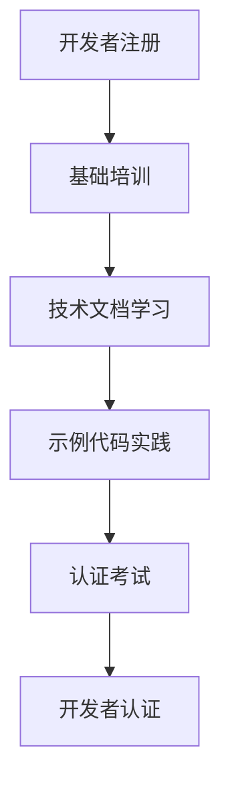
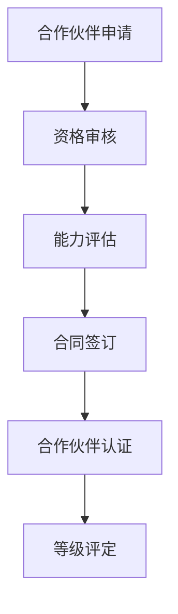
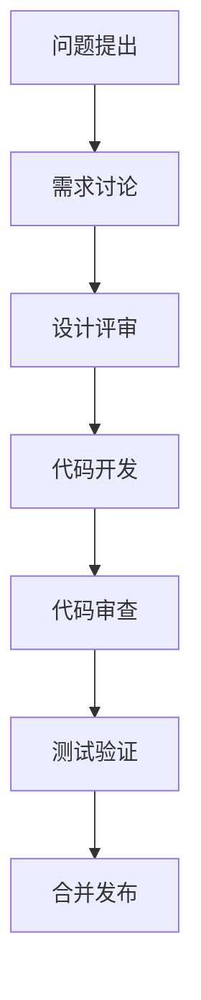
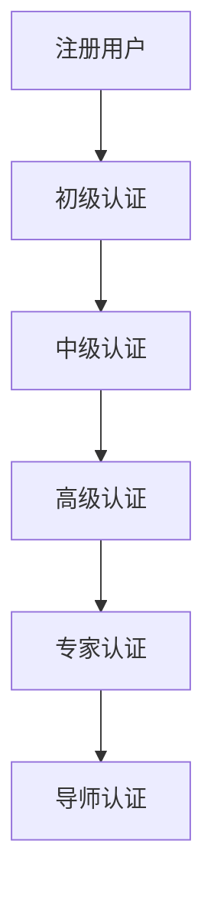
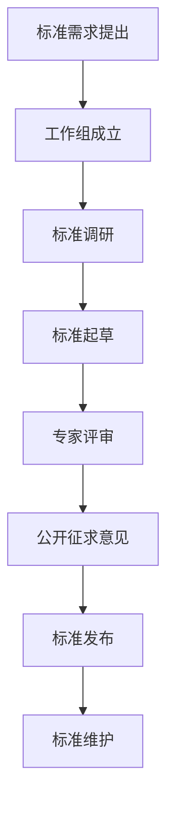

# 测试生态系统构建与运营模式详解

## 生态系统概述

### 生态建设目标
- **技术创新**: 汇聚全球测试技术资源，推动技术创新
- **知识共享**: 建立开放的知识分享平台，促进经验交流
- **协作共赢**: 构建多方协作的生态圈，实现价值共创
- **可持续发展**: 建立可持续发展的生态运营机制

### 生态系统层次结构

#### 1. 核心平台层
- **大数据测试平台**: 提供核心测试能力和服务
- **开发者工具**: SDK、API、开发环境
- **数据资产**: 测试数据集、模型、算法

#### 2. 生态参与者层
- **开发者社区**: 独立开发者、开发团队
- **合作伙伴**: 技术合作伙伴、解决方案提供商
- **企业用户**: 使用平台的各类企业客户
- **学术机构**: 高校、研究机构

#### 3. 生态服务层
- **技术支持**: 文档、培训、技术咨询
- **市场服务**: 插件市场、解决方案市场
- **运营服务**: 社区运营、活动组织、品牌推广

#### 4. 价值创造层
- **技术创新**: 新功能、新工具、新方法
- **商业价值**: 产品销售、服务收入、增值服务
- **社会价值**: 人才培养、行业标准、知识传播

## 开发者生态建设

### 开发者招募策略

#### 目标群体定位
- **技术爱好者**: 对测试技术感兴趣的开发者
- **创业团队**: 专注于测试工具开发的初创公司
- **企业开发者**: 大型企业的测试技术团队
- **学生群体**: 计算机相关专业的在校学生

#### 招募渠道
- **技术社区**: GitHub、Stack Overflow、CSDN
- **社交媒体**: Twitter、LinkedIn、微信公众号
- **技术大会**: 参加行业会议、技术沙龙
- **校园合作**: 与高校建立合作关系

### 开发者培养计划

#### 入门培训


#### 进阶培养
- **技术工作坊**: 定期举办专项技术培训
- **黑客马拉松**: 组织编程比赛，鼓励创新
- **导师计划**: 资深开发者指导新人成长
- **认证体系**: 分级认证，认可开发者能力

### 开发者激励机制

#### 经济激励
- **插件分成**: 插件销售收入的分成模式
- **奖金奖励**: 优秀贡献者的奖金激励
- **商业合作**: 商业化机会和投资机会

#### 非经济激励
- **荣誉认可**: 开发者排行榜、徽章系统
- **技术影响力**: 技术博客、演讲机会
- **职业发展**: 就业机会、技术晋升

## 合作伙伴体系

### 合作伙伴分类

#### 技术合作伙伴
- **云服务商**: AWS、阿里云、腾讯云等
- **工具提供商**: 测试工具、开发工具供应商
- **数据提供商**: 测试数据、行业数据供应商
- **集成商**: 系统集成、解决方案提供商

#### 渠道合作伙伴
- **系统集成商**: 提供端到端解决方案
- **咨询服务商**: 提供技术咨询和实施服务
- **培训机构**: 提供培训和认证服务
- **媒体合作伙伴**: 技术媒体、行业媒体

### 合作伙伴管理

#### 认证体系


#### 分级管理
- **战略合作伙伴**: 深度合作，共同研发
- **金牌合作伙伴**: 重点合作，优先支持
- **银牌合作伙伴**: 标准合作，基础支持
- **注册合作伙伴**: 初级合作，信息共享

### 合作模式

#### 技术合作
- **联合研发**: 共同开发新功能、新产品
- **技术共享**: 共享技术专利、解决方案
- **标准制定**: 参与行业标准制定

#### 商业合作
- **市场拓展**: 联合市场推广和销售
- **渠道分销**: 通过合作伙伴渠道销售产品
- **服务集成**: 将产品集成到合作伙伴解决方案中

## 开源社区运营

### 开源项目管理

#### 项目规划
- **核心项目**: 平台核心功能开源
- **周边项目**: 工具、插件、示例代码开源
- **实验项目**: 新技术探索和原型开发

#### 贡献流程


### 社区治理

#### 治理结构
- **技术委员会**: 技术决策和标准制定
- **社区委员会**: 社区运营和活动组织
- **贡献者委员会**: 贡献者管理和激励

#### 决策机制
- **民主决策**: 重要决策通过社区投票
- **技术驱动**: 技术委员会主导技术决策
- **开放透明**: 所有决策过程公开透明

### 社区活动

#### 线上活动
- **技术分享**: 定期技术分享和直播
- **问答社区**: Stack Overflow风格的问答平台
- **代码挑战**: 编程挑战和竞赛活动

#### 线下活动
- **开发者大会**: 年度开发者大会
- **技术沙龙**: 城市级技术交流活动
- **黑客马拉松**: 编程马拉松比赛

## 工具插件市场

### 市场架构

#### 插件分类
- **测试工具**: 测试执行、结果分析工具
- **数据工具**: 数据生成、数据处理工具
- **集成工具**: 与第三方系统的集成工具
- **分析工具**: 数据分析、可视化工具

#### 市场功能
- **插件发布**: 开发者发布和管理插件
- **插件发现**: 用户搜索和发现插件
- **插件安装**: 一键安装和配置插件
- **插件评价**: 用户评价和反馈系统

### 插件开发规范

#### 技术规范
```python
# 插件接口定义
from abc import ABC, abstractmethod
from typing import Dict, Any

class PluginBase(ABC):
    @abstractmethod
    def get_metadata(self) -> Dict[str, Any]:
        """获取插件元数据"""
        return {
            "name": "插件名称",
            "version": "1.0.0",
            "description": "插件描述",
            "author": "开发者",
            "category": "插件分类",
            "compatibility": "兼容版本"
        }

    @abstractmethod
    def initialize(self, config: Dict[str, Any]) -> bool:
        """插件初始化"""
        pass

    @abstractmethod
    def execute(self, input_data: Dict[str, Any]) -> Dict[str, Any]:
        """插件执行"""
        pass

    @abstractmethod
    def cleanup(self) -> None:
        """插件清理"""
        pass
```

#### 质量规范
- **代码质量**: 通过代码审查和自动化测试
- **文档完整**: 提供详细的使用文档和API文档
- **兼容性测试**: 测试与平台的兼容性
- **安全审核**: 通过安全漏洞扫描

### 商业模式

#### 收入模式
- **免费插件**: 基础功能免费
- **付费插件**: 高级功能收费
- **订阅模式**: 按月/按年订阅
- **企业版**: 企业级功能和支持

#### 收益分配
- **开发者分成**: 70%收益给开发者
- **平台抽成**: 20%平台运营费用
- **生态基金**: 10%用于生态建设

## 培训认证体系

### 培训体系

#### 培训层次
- **入门培训**: 平台基础使用培训
- **进阶培训**: 高级功能和最佳实践
- **专家培训**: 架构设计和系统优化
- **定制培训**: 企业定制化培训

#### 培训形式
- **在线课程**: MOOC风格的在线学习
- **直播培训**: 实时互动培训课程
- **线下workshop**: 实践导向的工作坊
- **自学资源**: 文档、视频、示例代码

### 认证体系

#### 认证等级


#### 认证内容
- **理论考试**: 测试基础知识和理论理解
- **实践考试**: 实际操作和问题解决能力
- **项目考核**: 实际项目开发和交付能力
- **同行评审**: 代码审查和设计评审能力

### 继续教育

#### 学习路径
- **技能提升**: 定期更新知识和技能
- **新技术学习**: 新技术趋势和应用
- **行业洞察**: 行业发展趋势和最佳实践
- **领导力发展**: 技术领导力和管理能力

## 行业标准制定

### 标准制定流程

#### 标准分类
- **技术标准**: API标准、数据格式标准
- **质量标准**: 测试质量评估标准
- **安全标准**: 数据安全和隐私保护标准
- **互操作标准**: 系统间互操作标准

#### 制定流程


### 标准推广

#### 推广策略
- **行业会议**: 在行业会议上推广标准
- **合作伙伴**: 通过合作伙伴推广应用
- **认证体系**: 将标准纳入认证体系
- **政府合作**: 与政府机构合作推广

#### 合规认证
- **自愿认证**: 企业自愿申请合规认证
- **强制认证**: 特定领域强制性认证
- **审计检查**: 定期审计和合规检查

## 生态运营策略

### 运营目标

#### 量化指标
- **参与度**: 活跃用户数、贡献者数量
- **质量指标**: 插件质量、内容质量
- **商业指标**: 收入增长、市场份额
- **影响力**: 行业认可度、品牌价值

### 运营策略

#### 增长策略
- **用户获取**: 多渠道用户招募和转化
- **留存策略**: 提升用户粘性和活跃度
- **扩展策略**: 拓展生态覆盖范围

#### 质量策略
- **内容建设**: 高质量内容生产和 curation
- **社区治理**: 建立有效的社区治理机制
- **激励机制**: 完善的激励和认可体系

#### 商业策略
- **变现模式**: 多层次的商业模式设计
- **合作伙伴**: 建立广泛的合作伙伴网络
- **品牌建设**: 提升品牌影响力和美誉度

## 生态健康评估

### 评估指标体系

#### 参与度指标
- **用户规模**: 注册用户数、活跃用户数
- **贡献度**: 代码贡献、内容贡献、问题解决
- **互动度**: 论坛发帖、评论回复、投票参与

#### 质量指标
- **内容质量**: 内容评分、用户反馈
- **技术质量**: 代码质量、安全性、性能
- **服务质量**: 响应时间、解决率、满意度

#### 可持续性指标
- **财务健康**: 收入结构、盈利能力
- **技术健康**: 技术栈更新、架构演进
- **组织健康**: 团队稳定、流程完善

### 健康度计算

#### 综合健康度模型
```python
def calculate_ecosystem_health(metrics: Dict[str, Any]) -> float:
    """
    计算生态系统健康度

    Args:
        metrics: 各项指标数据

    Returns:
        健康度评分 (0-100)
    """

    # 参与度权重 40%
    participation_score = (
        metrics.get('active_users_ratio', 0) * 0.3 +
        metrics.get('contribution_rate', 0) * 0.4 +
        metrics.get('engagement_level', 0) * 0.3
    ) * 40

    # 质量度权重 35%
    quality_score = (
        metrics.get('content_quality', 0) * 0.4 +
        metrics.get('technical_quality', 0) * 0.4 +
        metrics.get('service_quality', 0) * 0.2
    ) * 35

    # 可持续性权重 25%
    sustainability_score = (
        metrics.get('financial_health', 0) * 0.4 +
        metrics.get('technical_health', 0) * 0.3 +
        metrics.get('organizational_health', 0) * 0.3
    ) * 25

    total_score = participation_score + quality_score + sustainability_score

    return min(max(total_score, 0), 100)
```

### 持续改进

#### 定期评估
- **月度评估**: 基础指标监控和趋势分析
- **季度评估**: 深入分析和策略调整
- **年度评估**: 全面回顾和战略规划

#### 改进措施
- **问题识别**: 通过评估发现问题和瓶颈
- **解决方案**: 制定针对性的改进方案
- **效果验证**: 实施后验证改进效果

## 总结

测试生态系统的构建需要系统性的规划和运营，包括开发者生态、合作伙伴体系、开源社区、工具市场、培训认证等多个层面。通过建立完善的运营机制和管理体系，可以实现生态的可持续发展，为用户创造价值，为开发者提供机会，为行业带来创新。

关键成功因素：
1. **开放心态**: 坚持开放共享的理念
2. **价值共创**: 建立多方共赢的机制
3. **持续运营**: 长期投入和专业运营
4. **质量为本**: 坚持高质量的内容和服务
5. **技术驱动**: 依靠技术创新引领发展
6. **用户中心**: 始终以用户需求为导向