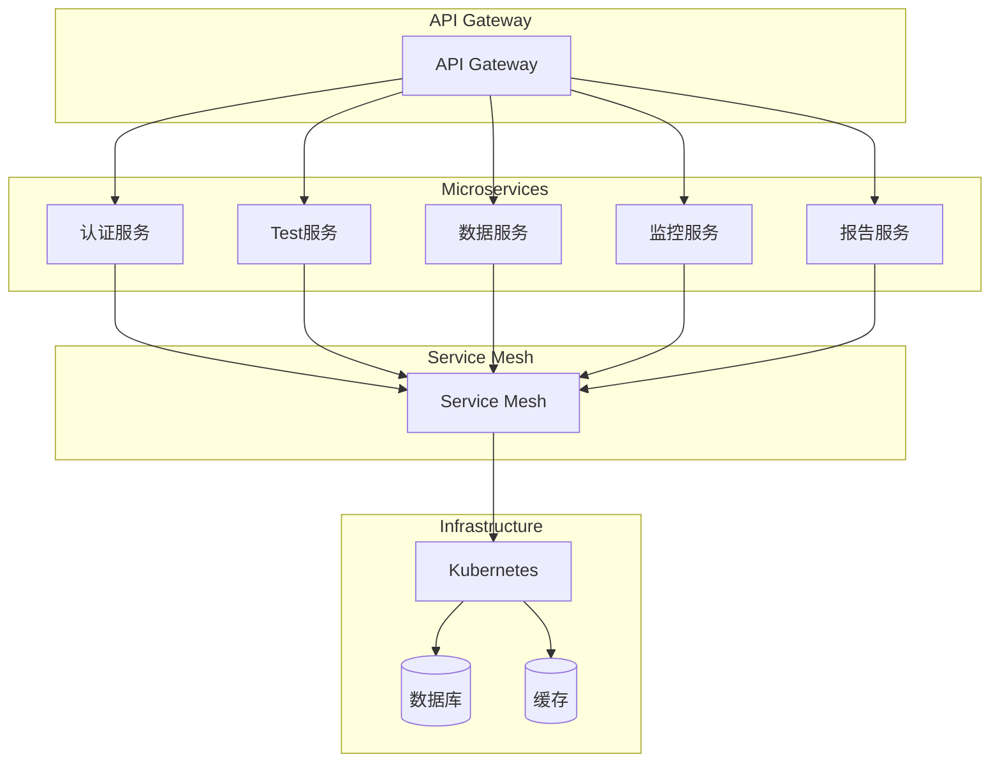
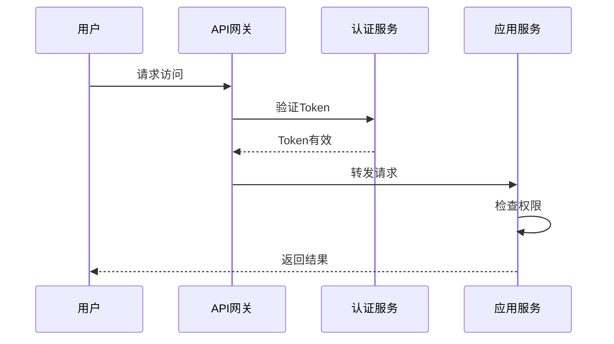

# 大数据测试平台架构设计详解

## 平台架构概述

### 架构设计原则
- **可扩展性**: 支持水平扩展和垂直扩展
- **高可用性**: 99.9%以上的服务可用性
- **安全性**: 多层次安全防护机制
- **可观测性**: 全面的监控、日志和追踪能力
- **敏捷性**: 支持快速迭代和持续交付

### 核心架构组件

#### 1. 用户界面层
- **Web门户**: 基于React/Vue的现代化Web界面
- **移动应用**: 响应式设计，支持移动设备访问
- **API网关**: 统一的API入口，支持认证、限流、路由
- **开发者门户**: 提供SDK、文档、示例代码

#### 2. 应用服务层
- **测试编排器**: 工作流引擎，支持复杂测试场景编排
- **测试引擎**: 分布式测试执行引擎，支持多种测试类型
- **监控服务**: 实时监控测试执行状态和系统资源
- **调度服务**: 智能调度算法，优化资源利用率

#### 3. 数据存储层
- **数据湖**: 存储原始测试数据和结果
- **数据仓库**: 结构化数据存储，支持复杂查询
- **缓存层**: Redis集群，提供高速数据访问
- **流处理**: Kafka/Apache Pulsar，支持实时数据处理

#### 4. 基础设施层
- **计算资源**: Kubernetes集群，提供弹性计算能力
- **存储系统**: 对象存储和块存储，支持海量数据
- **网络设施**: SDN网络，支持微服务间通信
- **安全组件**: 防火墙、入侵检测、加密服务

## 架构设计模式

### 微服务架构


### 云原生架构
- **容器化**: Docker容器化所有服务组件
- **编排管理**: Kubernetes进行容器编排和调度
- **服务网格**: Istio/Linkerd提供服务间通信
- **配置管理**: ConfigMap/Secret进行配置管理
- **弹性伸缩**: HPA/VPA实现自动扩缩容

## 技术栈选择

### 前端技术栈
- **框架**: React 18+ / Vue 3+
- **状态管理**: Redux / Vuex / Pinia
- **UI组件库**: Ant Design / Element Plus
- **构建工具**: Vite / Webpack 5
- **类型检查**: TypeScript

### 后端技术栈
- **语言**: Java 17+ / Python 3.9+ / Go 1.19+
- **框架**: Spring Boot / FastAPI / Gin
- **数据库**: PostgreSQL / MySQL / MongoDB
- **缓存**: Redis Cluster
- **消息队列**: Apache Kafka / RabbitMQ

### 大数据技术栈
- **存储**: HDFS / S3 / MinIO
- **处理**: Apache Spark / Flink
- **查询**: Presto / Trino / ClickHouse
- **实时流**: Apache Kafka / Pulsar
- **分析**: Apache Hive / Spark SQL

## 部署架构

### 单体部署架构
适用于小型团队和初期验证：
```
┌─────────────────┐
│   Web Server    │
│                 │
│ ┌─────────────┐ │
│ │ Application │ │
│ └─────────────┘ │
│                 │
│ ┌─────────────┐ │
│ │  Database   │ │
│ └─────────────┘ │
└─────────────────┘
```

### 分布式部署架构
适用于大规模生产环境：
```
┌─────────────────────────────────────┐
│           Load Balancer             │
└─────────────────────────────────────┘
                    │
          ┌─────────┼─────────┐
          │         │         │
    ┌─────▼────┐ ┌──▼──┐ ┌───▼────┐
    │  Web UI  │ │ API │ │  Test  │
    │  Server  │ │ GW  │ │ Engine │
    └──────────┘ └─────┘ └────────┘
          │         │         │
    ┌─────▼─────────▼─────────▼────┐
    │        Service Mesh          │
    └──────────────────────────────┘
                    │
          ┌─────────┼─────────┐
          │         │         │
    ┌─────▼────┐ ┌──▼──┐ ┌───▼────┐
    │ Database │ │Cache │ │  MQ    │
    └──────────┘ └─────┘ └────────┘
```

### 云原生部署架构
基于Kubernetes的现代化部署：
```yaml
apiVersion: apps/v1
kind: Deployment
metadata:
  name: test-platform
spec:
  replicas: 3
  selector:
    matchLabels:
      app: test-platform
  template:
    metadata:
      labels:
        app: test-platform
    spec:
      containers:
      - name: test-platform
        image: test-platform:v1.0.0
        ports:
        - containerPort: 8080
        env:
        - name: DATABASE_URL
          valueFrom:
            secretKeyRef:
              name: db-secret
              key: url
        resources:
          requests:
            memory: "512Mi"
            cpu: "250m"
          limits:
            memory: "1Gi"
            cpu: "500m"
        livenessProbe:
          httpGet:
            path: /health
            port: 8080
          initialDelaySeconds: 30
          periodSeconds: 10
        readinessProbe:
          httpGet:
            path: /ready
            port: 8080
          initialDelaySeconds: 5
          periodSeconds: 5
```

## 性能优化策略

### 应用层优化
- **缓存策略**: 多级缓存架构（浏览器缓存、CDN、应用缓存、数据库缓存）
- **异步处理**: 异步任务队列，减轻主线程压力
- **连接池**: 数据库连接池、HTTP连接池优化
- **压缩传输**: Gzip压缩，减少网络传输量

### 数据层优化
- **索引优化**: 合理设计数据库索引
- **分区策略**: 数据分区和分表策略
- **查询优化**: SQL优化和查询重写
- **缓存预热**: 热点数据预加载

### 基础设施优化
- **负载均衡**: 多层负载均衡策略
- **资源调度**: 智能资源调度算法
- **弹性伸缩**: 基于负载的自动扩缩容
- **容灾备份**: 多地域容灾和数据备份

## 安全架构

### 安全防护层次
1. **网络安全**: 防火墙、入侵检测、DDoS防护
2. **应用安全**: 输入验证、XSS防护、CSRF防护
3. **数据安全**: 加密存储、传输加密、数据脱敏
4. **访问控制**: 基于角色的访问控制(RBAC)
5. **审计监控**: 安全事件监控和审计日志

### 身份认证与授权


## 可观测性架构

### 监控指标体系
- **应用指标**: 响应时间、吞吐量、错误率
- **系统指标**: CPU使用率、内存使用率、磁盘I/O
- **业务指标**: 测试覆盖率、缺陷发现率、质量趋势
- **用户体验指标**: 页面加载时间、用户满意度

### 日志管理
- **结构化日志**: JSON格式日志，便于分析
- **日志聚合**: ELK Stack进行日志收集和分析
- **日志分级**: ERROR、WARN、INFO、DEBUG等级别
- **日志轮转**: 按大小和时间进行日志轮转

### 分布式追踪
- **追踪链路**: 全链路请求追踪
- **性能分析**: 识别性能瓶颈
- **故障定位**: 快速定位问题根因
- **依赖分析**: 分析服务间依赖关系

## 扩展性设计

### 插件架构
```python
from abc import ABC, abstractmethod
from typing import Dict, Any

class PluginInterface(ABC):
    @abstractmethod
    def initialize(self, config: Dict[str, Any]) -> None:
        """插件初始化"""
        pass

    @abstractmethod
    def execute(self, context: Dict[str, Any]) -> Dict[str, Any]:
        """插件执行"""
        pass

    @abstractmethod
    def cleanup(self) -> None:
        """插件清理"""
        pass

class TestPlugin(PluginInterface):
    def initialize(self, config: Dict[str, Any]) -> None:
        self.config = config

    def execute(self, context: Dict[str, Any]) -> Dict[str, Any]:
        # 插件具体实现
        return {"result": "success"}

    def cleanup(self) -> None:
        # 清理资源
        pass
```

### API扩展机制
- **RESTful API**: 标准REST API设计
- **GraphQL**: 灵活的数据查询接口
- **Webhook**: 事件驱动的扩展机制
- **SDK**: 多语言SDK支持

## 总结

大数据测试平台的架构设计需要考虑可扩展性、高可用性、安全性、可观测性和敏捷性等多方面因素。通过分层架构、微服务设计、云原生部署等技术手段，可以构建一个现代化、可靠、可扩展的大数据测试平台。

关键设计原则：
1. **分层解耦**: 清晰的层次划分，降低耦合度
2. **服务化**: 微服务架构，提高可维护性
3. **云原生**: 充分利用云平台能力
4. **安全优先**: 内置安全机制，保障数据安全
5. **可观测**: 全面监控，确保系统稳定运行
6. **扩展性**: 插件化架构，支持灵活扩展