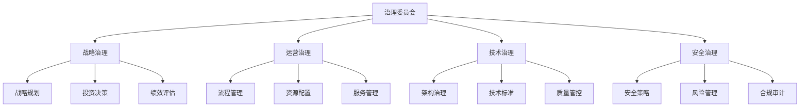
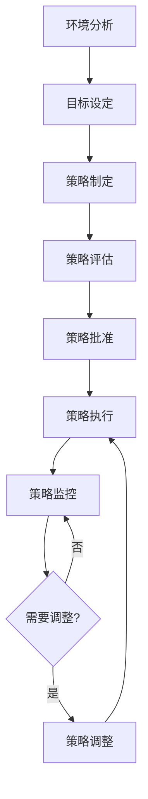
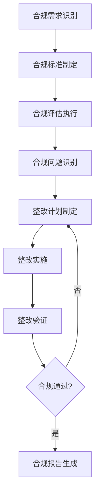
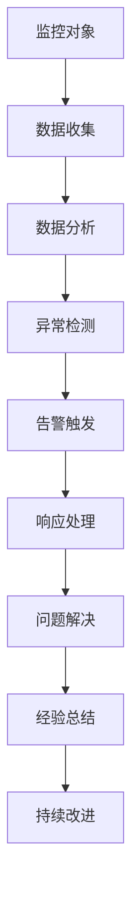
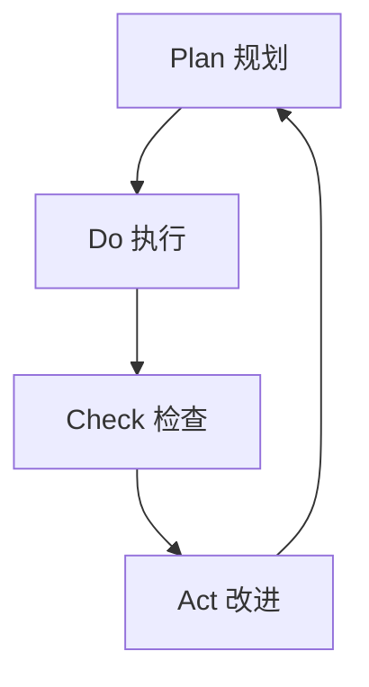

# 平台化测试实施路径与治理体系详解

## 实施路径规划

### 实施原则

#### 渐进式实施
- **从小开始**: 从试点项目开始，逐步扩展
- **快速见效**: 优先实施能快速见效的功能
- **风险可控**: 分阶段实施，降低风险
- **价值驱动**: 以业务价值为导向进行决策

#### 系统化思维
- **整体规划**: 制定全面的实施蓝图
- **分层建设**: 按照技术架构层次进行建设
- **协同配合**: 各部门协同配合，确保实施成功
- **持续优化**: 实施过程中持续优化和改进

### 实施阶段划分

#### 第一阶段：规划准备（1-2个月）

##### 目标
- 明确实施目标和范围
- 完成技术方案设计
- 组建实施团队
- 制定实施计划

##### 关键活动
- **需求调研**: 全面了解业务需求和痛点
- **现状评估**: 评估现有测试能力和基础设施
- **方案设计**: 制定平台化实施方案
- **团队组建**: 组建跨部门实施团队
- **计划制定**: 制定详细的实施计划和里程碑

##### 交付物
- 需求分析报告
- 技术方案设计文档
- 实施计划和时间表
- 团队组织架构

##### 成功标准
- 需求分析准确率 > 90%
- 技术方案获得关键 stakeholder 认可
- 实施团队组建完成
- 实施计划获得批准

#### 第二阶段：核心建设（3-6个月）

##### 目标
- 搭建平台基础架构
- 开发核心功能模块
- 实现基本测试能力
- 完成系统集成测试

##### 关键活动
- **基础设施建设**: 搭建云平台和容器环境
- **核心功能开发**: 开发测试执行、监控、报告等核心功能
- **数据平台建设**: 建设数据存储和处理平台
- **系统集成**: 实现各模块间的集成和联调
- **安全加固**: 实施安全防护措施

##### 交付物
- 平台基础架构
- 核心功能模块
- 数据处理平台
- 系统集成测试报告
- 安全评估报告

##### 成功标准
- 基础设施可用性 > 99%
- 核心功能测试通过率 > 95%
- 系统性能满足要求
- 安全评估通过

#### 第三阶段：能力扩展（4-8个月）

##### 目标
- 扩展高级测试能力
- 建设测试生态系统
- 实现智能化功能
- 完善运营体系

##### 关键活动
- **高级功能开发**: 开发AI测试、性能测试等高级功能
- **生态建设**: 建立开发者平台和合作伙伴体系
- **智能化升级**: 集成AI算法和机器学习能力
- **运营体系建设**: 建立监控、运维、支持体系
- **培训体系建设**: 建立用户培训和认证体系

##### 交付物
- 高级功能模块
- 开发者平台
- AI能力集成
- 运营监控系统
- 培训认证体系

##### 成功标准
- 高级功能可用性 > 95%
- 生态参与者 > 100
- AI功能准确率 > 80%
- 运营响应时间 < 4小时

#### 第四阶段：试运行（2-3个月）

##### 目标
- 开展试点应用
- 验证平台效果
- 收集用户反馈
- 优化系统功能

##### 关键活动
- **试点项目选择**: 选择有代表性的试点项目
- **系统部署**: 在试点环境部署平台
- **用户培训**: 对试点用户进行培训
- **效果评估**: 开展效果评估和对比分析
- **问题修复**: 修复发现的问题和缺陷

##### 交付物
- 试点应用报告
- 用户培训记录
- 效果评估报告
- 问题修复记录

##### 成功标准
- 试点项目成功率 > 90%
- 用户满意度 > 80%
- 效果提升明显
- 主要问题得到解决

#### 第五阶段：全面推广（3-6个月）

##### 目标
- 全面上线平台
- 开展大规模培训
- 推动广泛应用
- 实现价值变现

##### 关键活动
- **全面部署**: 在生产环境全面部署
- **大规模培训**: 开展全员培训和推广活动
- **应用推广**: 推动各业务线应用平台
- **价值评估**: 评估平台带来的业务价值
- **持续优化**: 基于反馈持续优化平台

##### 交付物
- 生产环境部署报告
- 培训推广记录
- 应用情况报告
- 价值评估报告

##### 成功标准
- 平台覆盖率 > 70%
- 用户培训完成率 > 90%
- 应用效果显著
- ROI 为正

#### 第六阶段：持续运营（持续进行）

##### 目标
- 保障系统稳定运行
- 持续功能迭代
- 生态运营发展
- 价值持续创造

##### 关键活动
- **运维监控**: 7×24小时系统监控和运维
- **功能迭代**: 基于用户需求持续功能开发
- **生态运营**: 运营开发者生态和合作伙伴体系
- **价值管理**: 持续评估和优化业务价值
- **技术演进**: 跟踪新技术并进行技术升级

##### 交付物
- 运维监控报告
- 功能迭代记录
- 生态运营报告
- 价值分析报告

##### 成功标准
- 系统可用性 > 99.9%
- 用户满意度 > 85%
- 生态健康度 > 80%
- 持续产生价值

## 治理体系建设

### 治理框架

#### 治理原则
- **合规优先**: 确保所有活动符合法律法规
- **风险控制**: 识别和控制各种风险
- **透明公开**: 治理过程透明，决策公开
- **责任明确**: 明确各方责任和义务
- **持续改进**: 建立持续改进机制

#### 治理结构


### 策略管理

#### 策略分类
- **战略策略**: 长期发展方向和目标
- **战术策略**: 中期实施计划和方法
- **运营策略**: 日常运营和管理策略

#### 策略制定流程


#### 策略执行
- **责任分配**: 明确策略执行的责任人
- **资源配置**: 提供必要的资源和支持
- **进度监控**: 定期检查策略执行进度
- **效果评估**: 评估策略执行的效果

### 合规管理

#### 合规领域
- **法律法规合规**: 遵守相关法律法规
- **行业标准合规**: 符合行业标准和规范
- **内部政策合规**: 遵守企业内部政策
- **合同义务合规**: 履行合同约定的义务

#### 合规评估流程


#### 合规监控
- **定期评估**: 定期进行合规评估
- **持续监控**: 建立持续的合规监控机制
- **问题报告**: 及时发现和报告合规问题
- **整改跟踪**: 跟踪整改措施的实施情况

### 风险管理

#### 风险识别
- **战略风险**: 战略决策可能带来的风险
- **运营风险**: 日常运营中可能出现的风险
- **技术风险**: 技术实现和应用中的风险
- **外部风险**: 外部环境变化带来的风险

#### 风险评估
```python
def assess_risk_impact(risk_factors: Dict[str, float]) -> Dict[str, Any]:
    """
    评估风险影响程度

    Args:
        risk_factors: 风险因素及其权重

    Returns:
        风险评估结果
    """

    # 风险影响计算
    impact_score = (
        risk_factors.get('financial_impact', 0) * 0.3 +
        risk_factors.get('operational_impact', 0) * 0.3 +
        risk_factors.get('reputational_impact', 0) * 0.2 +
        risk_factors.get('legal_impact', 0) * 0.2
    )

    # 风险概率计算
    probability_score = (
        risk_factors.get('likelihood', 0) * 0.6 +
        risk_factors.get('detectability', 0) * 0.4
    )

    # 综合风险评分
    risk_score = impact_score * probability_score

    # 风险等级判断
    if risk_score >= 0.7:
        risk_level = "高风险"
    elif risk_score >= 0.4:
        risk_level = "中风险"
    else:
        risk_level = "低风险"

    return {
        "impact_score": impact_score,
        "probability_score": probability_score,
        "risk_score": risk_score,
        "risk_level": risk_level,
        "recommendations": generate_risk_recommendations(risk_level)
    }

def generate_risk_recommendations(risk_level: str) -> List[str]:
    """生成风险应对建议"""
    recommendations = {
        "高风险": [
            "立即制定详细的风险应对计划",
            "增加监控频率和资源投入",
            "准备应急预案和备用方案",
            "向上级管理层报告风险情况"
        ],
        "中风险": [
            "制定风险监控和应对计划",
            "定期评估风险变化情况",
            "准备必要的应对资源",
            "关注风险发展趋势"
        ],
        "低风险": [
            "纳入常规风险监控范围",
            "定期检查风险状态",
            "准备基本的应对措施",
            "关注可能的变化因素"
        ]
    }

    return recommendations.get(risk_level, [])
```

#### 风险应对
- **风险规避**: 改变计划以避免风险
- **风险转移**: 将风险转移给第三方
- **风险缓解**: 采取措施减少风险影响
- **风险接受**: 接受风险并制定应急计划

### 审计监控

#### 审计类型
- **内部审计**: 企业内部进行的审计
- **外部审计**: 由第三方机构进行的审计
- **合规审计**: 专门针对合规性进行的审计
- **技术审计**: 针对技术实现进行的审计

#### 监控体系


#### 审计流程
- **审计计划**: 制定审计计划和范围
- **审计执行**: 进行现场审计和数据分析
- **审计报告**: 生成审计发现和建议
- **整改跟踪**: 跟踪整改措施的实施

## 价值实现与度量

### 价值指标体系

#### 业务价值指标
- **效率提升**: 测试执行时间缩短、成本降低
- **质量改善**: 缺陷发现率提升、产品质量改善
- **交付加速**: 发布频率提升、交付周期缩短
- **风险降低**: 生产事故减少、业务连续性提升

#### 技术价值指标
- **自动化率**: 测试自动化覆盖率
- **智能化水平**: AI应用程度和效果
- **平台成熟度**: 平台功能完整性和稳定性
- **生态规模**: 生态参与者和贡献度

#### 财务价值指标
- **成本节约**: 测试成本降低、资源利用优化
- **收入增长**: 新业务机会、服务收入增长
- **投资回报**: ROI分析和投资效益评估
- **资产价值**: 平台资产价值和无形资产价值

### 价值度量方法

#### ROI计算
```python
def calculate_platform_roi(initial_investment: float,
                          annual_benefits: float,
                          annual_costs: float,
                          time_horizon: int = 3) -> Dict[str, Any]:
    """
    计算平台投资回报率

    Args:
        initial_investment: 初始投资金额
        annual_benefits: 年收益
        annual_costs: 年运营成本
        time_horizon: 计算周期（年）

    Returns:
        ROI分析结果
    """

    # NPV计算
    npv = -initial_investment
    cumulative_benefits = 0

    for year in range(1, time_horizon + 1):
        annual_net_benefit = annual_benefits - annual_costs
        npv += annual_net_benefit / (1 + 0.1) ** year  # 假设折现率10%
        cumulative_benefits += annual_net_benefit

    # ROI计算
    total_returns = cumulative_benefits
    roi = (total_returns - initial_investment) / initial_investment * 100

    #  payback period
    payback_period = initial_investment / annual_benefits if annual_benefits > 0 else float('inf')

    return {
        "npv": round(npv, 2),
        "roi_percentage": round(roi, 2),
        "total_returns": round(total_returns, 2),
        "payback_period_years": round(payback_period, 1),
        "break_even_year": min(time_horizon, max(1, int(payback_period) + 1)),
        "recommendation": "值得投资" if roi > 15 else "需要进一步评估"
    }
```

#### 价值实现路径
- **短期价值**: 效率提升和成本节约
- **中期价值**: 质量改善和交付加速
- **长期价值**: 生态建设和技术创新

### 持续改进机制

#### PDCA循环


#### 改进方法
- **数据驱动**: 基于数据分析发现改进机会
- **用户反馈**: 收集和分析用户反馈
- **最佳实践**: 学习行业最佳实践
- **技术创新**: 跟踪新技术发展趋势

## 实施成功因素

### 组织因素
- **领导支持**: 获得高层领导的支持和重视
- **团队能力**: 具备实施所需的技术和管理能力
- **文化适应**: 企业文化支持变革和创新
- **资源保障**: 提供充足的人力、物力、财力资源

### 技术因素
- **技术选型**: 选择合适的技术栈和解决方案
- **架构设计**: 设计合理的系统架构
- **质量保障**: 建立完善的质量保障机制
- **安全防护**: 实施全面的安全防护措施

### 过程因素
- **方法论**: 采用科学的项目管理方法
- **沟通协调**: 建立有效的沟通协调机制
- **风险管理**: 识别和控制项目风险
- **变更管理**: 管理项目变更和需求调整

### 外部因素
- **市场环境**: 关注行业发展趋势
- **合作伙伴**: 建立良好的合作伙伴关系
- **法规要求**: 遵守相关法律法规要求
- **技术标准**: 遵循行业技术标准

## 总结

平台化测试的实施是一个系统性工程，需要全面的规划、分阶段的实施、严格的治理和持续的优化。通过建立完善的实施路径和治理体系，可以确保平台化项目的成功，实现测试能力的全面提升和业务价值的持续创造。

关键成功要素：
1. **战略对齐**: 与企业战略保持一致
2. **分步实施**: 采用渐进式实施策略
3. **能力建设**: 重视团队能力和文化建设
4. **价值导向**: 以业务价值为驱动
5. **持续改进**: 建立持续改进机制
6. **风险控制**: 全面识别和控制风险