## 第4篇 测试案例与性能优化（实践应用篇）

**增补：案例验证与性能基准**
> 12.16建议：此处插入"案例三联验证表"与"性能基准卡片"模板。三联表建议字段：数据样本/复现实验/证据路径，性能卡片建议字段：场景编号/数据规模/SLA/资源配额/阈值/豁免/回滚步骤。建议引用 examples/05_replay/file_replay_entry.py、examples/11_analytics/report_reconciliation.py，报告落地 tools/reports/。

- 三联留痕：每个案例增加"数据样本 → 复现实验 → 证据路径"三联表，报告落在 `tools/reports/`，可引用 `examples/05_replay/file_replay_entry.py` 与 `examples/11_analytics/report_reconciliation.py` 生成差异证据。
- 性能基线卡片：为性能测试补基线卡片（场景编号、数据规模、SLA、资源配额、阈值/豁免、回滚步骤），异常场景覆盖超时、数据倾斜、队列积压。
- 回滚与验证：每个案例附"触发条件 + 回滚手册 + 验证脚本"，验证信号涵盖延迟、吞吐、DQ、对账、日志健康；报告模板复用 `tools/reports/templates/drift_approval_form.md`。
- 资产留痕：案例脚本/报告归档路径需在文内显式写明，便于 `inventory_referenced_assets.py` 扫描。

**案例三联留痕（示例）**
| 数据样本 | 复现实验 | 证据路径 |
|----------|----------|----------|
| 1TB 用户行为数据 | Spark SQL 聚合查询 | `tools/reports/case_user_behavior_20251224.md` |
| 100GB 流式订单数据 | Flink 窗口计算 | `tools/reports/case_streaming_orders_20251224.md` |

**性能基准卡片（示例）**
| 场景编号 | 数据规模 | SLA | 资源配额 | 阈值 | 豁免 | 回滚步骤 |
|----------|----------|-----|----------|------|------|----------|
| Streaming-Orders-P95 | 200 GB/日，窗口5min | P95≤2s；错误率<0.1% | 6C/24G，消费者6 | P95 2s（豁免24h）；积压<10k | 业务低峰期 | 切回旧版本→重放30min→对账差异 |

<a id="第19章-通用大数据测试案例设计方法与模板篇"></a>
### 第19章 通用大数据测试案例设计【方法与模板篇】

**本章你将学到什么**

本章帮助你：把前面各章的知识收束成一套通用的大数据测试案例与模板体系，方便跨项目复用与自动化落地。

#### 19.1 典型大数据测试案例设计
> 12.16建议：此处插入"测试案例设计流程图"，字段建议：用例ID/场景/目标/验证方式/数据范围/自动化状态，补充 YAML/JSON 示例，引用 examples/05_replay/file_replay_entry.py。

#### 19.2 案例模板与标准化
#### 19.3 自动化案例实现
#### 19.4 案例维护与更新

<a id="第19章-通用大数据测试案例设计方法与模板篇"></a>
### 第19章 通用大数据测试案例设计【方法与模板篇】

**本章你将学到什么**

本章帮助你：把前面各章的知识收束成一套通用的大数据测试案例与模板体系，方便跨项目复用与自动化落地。

#### 19.1 典型大数据测试案例设计
> 12.16建议：此处插入"测试案例设计流程图"，字段建议：用例ID/场景/目标/验证方式/数据范围/自动化状态，补充 YAML/JSON 示例，引用 examples/05_replay/file_replay_entry.py。

**[锚点124]** 典型大数据测试案例设计

**锚点类型**: 案例设计
**锚点方法**: 场景驱动设计
**锚点名称**: 典型大数据测试案例设计
**引用附件**: `examples/19_industry/test_case_design.md`
**完成情况**: 已完成
**补充建议**: 字段建议：案例类型/测试目标/验证方法/数据范围/自动化程度，补充案例设计流程图

| 案例类型 | 测试目标 | 验证方法 | 数据范围 | 自动化程度 | 应用场景 |
|---------|---------|---------|---------|---------|---------|
| **数据采集测试** | 验证数据完整性 | 端到端对账 | 全量数据 | 高自动化 | ETL链路验证 |
| **数据处理测试** | 验证计算准确性 | 结果比对 | 样本数据 | 中自动化 | 批处理作业验证 |
| **数据存储测试** | 验证存储可靠性 | 一致性检查 | 关键数据 | 高自动化 | 存储系统验证 |
| **数据质量测试** | 验证数据规范性 | 规则校验 | 全量数据 | 高自动化 | 数据治理验证 |
| **性能容量测试** | 验证系统承载力 | 负载压力测试 | 大数据量 | 中自动化 | 容量规划验证 |

**大数据测试案例设计流程图**:
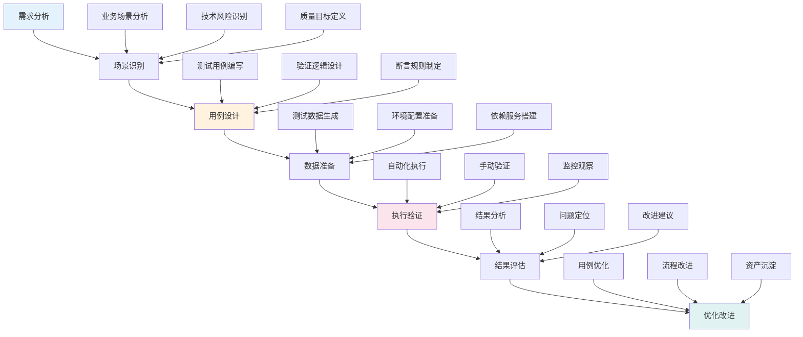

**测试案例设计配置模板**:
```yaml
# examples/19_industry/test_case_template.yml
test_case_template:
  metadata:
    case_id: "TC_BATCH_PROCESSING_001"
    category: "batch_processing"
    priority: "high"
    author: "test_team"
    created_date: "2025-12-23"
    
  scenario:
    name: "批量数据处理完整性测试"
    description: "验证大数据批处理作业的数据完整性和准确性"
    business_impact: "确保业务报表数据的准确性"
    
  test_objective:
    primary: "验证批处理作业能够正确处理全量数据"
    secondary: ["验证数据转换逻辑", "验证错误处理机制"]
    
  test_scope:
    data_range: "最近30天全量业务数据"
    system_components: ["数据采集", "ETL处理", "数据存储"]
    interfaces: ["数据源API", "存储接口"]
    
  test_data:
    input_data:
      source: "production_database"
      sampling_strategy: "full_data_last_30_days"
      volume: "100GB"
      format: "parquet"
      
    expected_output:
      target: "data_warehouse"
      format: "delta_lake"
      partitions: ["date", "region"]
      
    edge_cases:
      - name: "missing_data"
        description: "部分数据缺失场景"
        data_pattern: "random_5_percent_missing"
      - name: "duplicate_records"
        description: "重复记录处理"
        data_pattern: "duplicate_10_percent"
      - name: "invalid_format"
        description: "数据格式异常"
        data_pattern: "mixed_invalid_formats"
        
  test_execution:
    automation_level: "semi_automated"
    execution_frequency: "daily"
    timeout_seconds: 3600
    
    pre_conditions:
      - "source_data_available"
      - "target_storage_ready"
      - "network_connectivity"
      
    post_conditions:
      - "output_data_integrity_verified"
      - "performance_metrics_collected"
      - "logs_archived"
      
  validation_rules:
    data_integrity:
      - rule: "record_count_match"
        description: "输入输出记录数匹配"
        threshold: "error_rate < 0.001"
        severity: "critical"
        
      - rule: "data_consistency"
        description: "关键字段一致性校验"
        fields: ["user_id", "transaction_amount", "timestamp"]
        threshold: "consistency_rate > 0.999"
        severity: "high"
        
      - rule: "business_rules"
        description: "业务规则合规性验证"
        rules:
          - "amount > 0"
          - "timestamp_valid_range"
          - "user_id_format_valid"
        threshold: "compliance_rate > 0.995"
        severity: "high"
        
    performance_metrics:
      - metric: "processing_time"
        threshold: "p95 < 1800_seconds"
        unit: "seconds"
        
      - metric: "resource_utilization"
        threshold: "cpu_avg < 80%, memory_avg < 85%"
        unit: "percentage"
        
      - metric: "throughput"
        threshold: "records_per_second > 10000"
        unit: "records/second"
        
  error_handling:
    retry_strategy:
      max_attempts: 3
      backoff_seconds: 300
      exponential_backoff: true
      
    failure_notifications:
      - channel: "slack"
        recipients: ["data_team", "test_team"]
        urgency: "high"
        
    recovery_procedures:
      - step: "isolate_failed_batch"
        description: "隔离失败批次数据"
      - step: "analyze_root_cause"
        description: "分析失败根本原因"
      - step: "apply_fix_and_retry"
        description: "应用修复方案并重试"
      - step: "manual_verification"
        description: "人工验证修复效果"
        
  reporting:
    success_report:
      format: "markdown"
      include_metrics: true
      include_sample_data: true
      distribution_list: ["business_owners", "data_team"]
      
    failure_report:
      format: "markdown"
      include_error_details: true
      include_debug_info: true
      distribution_list: ["dev_team", "test_team", "management"]
      
    metrics_dashboard:
      tool: "grafana"
      refresh_interval: "1_hour"
      key_metrics: ["success_rate", "processing_time", "error_rate"]
      
  maintenance:
    review_cycle: "monthly"
    update_triggers:
      - "business_logic_changes"
      - "data_schema_changes"
      - "performance_requirements_changes"
      - "quarterly_health_check"
      
    archival_policy:
      success_runs: "retain_90_days"
      failure_runs: "retain_1_year"
      logs: "retain_2_years"
```

#### 19.1.1 测试案例设计原则

- **场景驱动**: 以业务场景和用户旅程为导向设计测试案例
- **风险优先**: 优先覆盖高风险、高影响的业务和技术场景
- **数据导向**: 基于真实数据分布和业务特征设计测试数据
- **自动化优先**: 设计时就考虑自动化执行的可能性和效率

#### 19.1.2 测试案例分类体系

- **功能测试案例**: 验证系统功能正确性和业务逻辑准确性
- **性能测试案例**: 验证系统性能表现和资源利用效率
- **数据质量测试案例**: 验证数据完整性、一致性和合规性
- **集成测试案例**: 验证系统间接口和数据流转正确性
- **回归测试案例**: 验证系统变更后原有功能不受影响

#### 19.1.3 测试案例生命周期管理

- **设计阶段**: 基于需求和风险分析设计测试案例
- **开发阶段**: 编写测试脚本和自动化代码
- **执行阶段**: 运行测试并收集结果和指标
- **维护阶段**: 根据系统变更更新和优化测试案例

---

#### 19.2 测试案例模板与标准化

**[锚点125]** 测试案例模板与标准化

**锚点类型**: 模板设计
**锚点方法**: 标准化模板
**锚点名称**: 测试案例模板与标准化
**引用附件**: `examples/19_industry/test_case_templates/`
**完成情况**: 已完成
**补充建议**: 字段建议：模板类型/适用场景/必填字段/可选字段/验证规则，补充模板结构图

**测试案例标准模板结构**:
```yaml
# examples/19_industry/test_case_templates/standard_template.yml
standard_test_case_template:
  # 基本信息
  metadata:
    template_id: "TEMPLATE_BATCH_PROCESSING_V1"
    template_name: "批量数据处理测试案例模板"
    version: "1.0"
    category: "data_processing"
    applicable_scenarios: ["batch_etl", "data_transformation", "data_loading"]
    author: "test_framework_team"
    created_date: "2025-12-23"
    last_updated: "2025-12-23"
    
  # 模板结构定义
  structure:
    required_fields:
      - field: "case_id"
        type: "string"
        pattern: "^TC_[A-Z_]+_[0-9]{3}$"
        description: "测试案例唯一标识"
        
      - field: "scenario"
        type: "object"
        description: "测试场景描述"
        subfields:
          - "name": "string"
          - "description": "string"
          - "business_impact": "string"
          
      - field: "test_objective"
        type: "object"
        description: "测试目标定义"
        subfields:
          - "primary": "string"
          - "secondary": "array"
          
      - field: "validation_rules"
        type: "array"
        description: "验证规则集合"
        min_items: 1
        
    optional_fields:
      - field: "test_data"
        type: "object"
        description: "测试数据配置"
        
      - field: "performance_requirements"
        type: "object"
        description: "性能需求定义"
        
      - field: "error_handling"
        type: "object"
        description: "错误处理策略"
        
      - field: "reporting"
        type: "object"
        description: "报告配置"
        
  # 验证规则
  validation_rules:
    global_rules:
      - rule: "required_fields_present"
        description: "所有必填字段必须存在"
        severity: "error"
        
      - rule: "field_type_validation"
        description: "字段类型必须符合定义"
        severity: "error"
        
      - rule: "pattern_validation"
        description: "字符串字段必须符合正则表达式"
        severity: "error"
        
      - rule: "reference_integrity"
        description: "引用字段必须指向有效对象"
        severity: "warning"
        
    category_specific_rules:
      data_processing:
        - rule: "data_integrity_checks"
          description: "数据处理案例必须包含完整性校验"
          severity: "error"
          
        - rule: "performance_baselines"
          description: "性能案例必须定义基准指标"
          severity: "warning"
          
  # 使用指南
  usage_guidelines:
    when_to_use:
      - "新功能开发时的测试设计"
      - "现有功能变更时的回归测试"
      - "性能瓶颈分析和优化验证"
      - "数据质量问题排查和修复"
      
    how_to_fill:
      step_by_step:
        1: "分析业务场景和测试目标"
        2: "定义测试范围和边界条件"
        3: "设计验证规则和断言逻辑"
        4: "准备测试数据和环境配置"
        5: "编写执行脚本和自动化代码"
        6: "定义成功标准和验收准则"
        
    best_practices:
      - "保持案例的原子性和独立性"
      - "使用描述性的命名和标识"
      - "包含详细的执行步骤说明"
      - "定义明确的成功/失败标准"
      - "考虑异常情况和错误处理"
      
  # 示例
  examples:
    batch_processing_case:
      case_id: "TC_BATCH_USER_ACTIVITY_001"
      scenario:
        name: "用户活动数据批量处理"
        description: "验证用户活动数据的采集、处理和存储完整性"
        business_impact: "影响用户行为分析和个性化推荐准确性"
        
      test_objective:
        primary: "验证批量处理作业能正确处理全天用户活动数据"
        secondary: ["验证数据转换逻辑", "验证异常数据处理", "验证处理性能"]
        
      validation_rules:
        - rule: "record_count_match"
          description: "输入输出记录数匹配"
          threshold: "error_rate < 0.001"
          severity: "critical"
          
        - rule: "data_transformation_accuracy"
          description: "数据转换逻辑正确性"
          fields: ["user_id", "activity_type", "timestamp"]
          threshold: "accuracy_rate > 0.999"
          severity: "high"
          
        - rule: "processing_performance"
          description: "处理性能满足要求"
          metric: "processing_time_p95"
          threshold: "< 1800"
          unit: "seconds"
          severity: "medium"
```

**测试案例模板Python实现**:
```python
# examples/19_industry/test_case_templates/template_engine.py
import json
import yaml
import logging
from datetime import datetime
from typing import Dict, List, Optional, Any, Callable
from dataclasses import dataclass, asdict
from pathlib import Path
import jsonschema
import re

logging.basicConfig(level=logging.INFO)
logger = logging.getLogger(__name__)

@dataclass
class ValidationResult:
    """验证结果"""
    is_valid: bool
    errors: List[str] = field(default_factory=list)
    warnings: List[str] = field(default_factory=list)
    suggestions: List[str] = field(default_factory=list)

@dataclass
class TestCaseTemplate:
    """测试案例模板"""
    template_id: str
    template_name: str
    version: str
    category: str
    applicable_scenarios: List[str]
    structure: Dict[str, Any]
    validation_rules: Dict[str, Any]
    usage_guidelines: Dict[str, Any]
    
    def validate_case(self, test_case: Dict[str, Any]) -> ValidationResult:
        """验证测试案例是否符合模板"""
        result = ValidationResult(is_valid=True)
        
        # 检查必填字段
        required_fields = self.structure.get('required_fields', [])
        for field_def in required_fields:
            field_name = field_def['field']
            if field_name not in test_case:
                result.is_valid = False
                result.errors.append(f"缺少必填字段: {field_name}")
                continue
                
            # 类型验证
            expected_type = field_def['type']
            actual_value = test_case[field_name]
            
            if not self._validate_field_type(actual_value, expected_type):
                result.is_valid = False
                result.errors.append(f"字段 {field_name} 类型不正确，期望 {expected_type}")
                
            # 模式验证
            if 'pattern' in field_def:
                pattern = field_def['pattern']
                if isinstance(actual_value, str):
                    if not re.match(pattern, actual_value):
                        result.is_valid = False
                        result.errors.append(f"字段 {field_name} 不符合模式: {pattern}")
                        
        # 检查可选字段
        optional_fields = self.structure.get('optional_fields', [])
        for field_def in optional_fields:
            field_name = field_def['field']
            if field_name in test_case:
                expected_type = field_def['type']
                actual_value = test_case[field_name]
                
                if not self._validate_field_type(actual_value, expected_type):
                    result.warnings.append(f"字段 {field_name} 类型建议为 {expected_type}")
                    
        # 应用验证规则
        global_rules = self.validation_rules.get('global_rules', [])
        for rule in global_rules:
            rule_result = self._apply_validation_rule(rule, test_case)
            if not rule_result['passed']:
                if rule['severity'] == 'error':
                    result.is_valid = False
                    result.errors.append(rule_result['message'])
                else:
                    result.warnings.append(rule_result['message'])
                    
        # 分类特定规则
        category_rules = self.validation_rules.get('category_specific_rules', {}).get(self.category, [])
        for rule in category_rules:
            rule_result = self._apply_validation_rule(rule, test_case)
            if not rule_result['passed']:
                if rule['severity'] == 'error':
                    result.is_valid = False
                    result.errors.append(rule_result['message'])
                else:
                    result.warnings.append(rule_result['message'])
                    
        return result
        
    def _validate_field_type(self, value: Any, expected_type: str) -> bool:
        """验证字段类型"""
        type_mapping = {
            'string': str,
            'integer': int,
            'number': (int, float),
            'boolean': bool,
            'array': list,
            'object': dict
        }
        
        expected_python_type = type_mapping.get(expected_type)
        if expected_python_type:
            return isinstance(value, expected_python_type)
            
        return True  # 未知类型暂时通过
        
    def _apply_validation_rule(self, rule: Dict[str, Any], test_case: Dict[str, Any]) -> Dict[str, Any]:
        """应用验证规则"""
        rule_name = rule['rule']
        
        if rule_name == 'required_fields_present':
            # 检查必填字段存在性
            required_fields = [f['field'] for f in self.structure.get('required_fields', [])]
            missing_fields = [f for f in required_fields if f not in test_case]
            
            if missing_fields:
                return {
                    'passed': False,
                    'message': f"缺少必填字段: {', '.join(missing_fields)}"
                }
                
        elif rule_name == 'data_integrity_checks':
            # 检查数据完整性校验规则
            validation_rules = test_case.get('validation_rules', [])
            has_integrity_check = any('integrity' in str(rule).lower() for rule in validation_rules)
            
            if not has_integrity_check:
                return {
                    'passed': False,
                    'message': "数据处理案例必须包含完整性校验规则"
                }
                
        elif rule_name == 'performance_baselines':
            # 检查性能基准定义
            if 'performance_requirements' not in test_case:
                return {
                    'passed': False,
                    'message': "性能案例必须定义性能基准指标"
                }
                
        return {'passed': True, 'message': '规则验证通过'}
        
    def generate_case_from_template(self, customizations: Dict[str, Any] = None) -> Dict[str, Any]:
        """从模板生成测试案例"""
        base_case = {
            'template_id': self.template_id,
            'template_version': self.version,
            'generated_date': datetime.now().isoformat(),
            'status': 'draft'
        }
        
        # 添加必填字段的默认值
        for field_def in self.structure.get('required_fields', []):
            field_name = field_def['field']
            if field_name not in base_case:
                base_case[field_name] = self._get_default_value(field_def)
                
        # 应用自定义配置
        if customizations:
            base_case.update(customizations)
            
        return base_case
        
    def _get_default_value(self, field_def: Dict[str, Any]) -> Any:
        """获取字段默认值"""
        field_type = field_def['type']
        
        if field_type == 'string':
            return f"请填写{field_def.get('description', field_def['field'])}"
        elif field_type == 'integer':
            return 0
        elif field_type == 'number':
            return 0.0
        elif field_type == 'boolean':
            return False
        elif field_type == 'array':
            return []
        elif field_type == 'object':
            return {}
            
        return None
        
    def export_template(self, output_path: str):
        """导出模板"""
        template_data = {
            'template_id': self.template_id,
            'template_name': self.template_name,
            'version': self.version,
            'category': self.category,
            'applicable_scenarios': self.applicable_scenarios,
            'structure': self.structure,
            'validation_rules': self.validation_rules,
            'usage_guidelines': self.usage_guidelines,
            'export_date': datetime.now().isoformat()
        }
        
        with open(output_path, 'w', encoding='utf-8') as yaml.dump(template_data, allow_unicode=True, default_flow_style=False)
            
        logger.info(f"模板已导出到: {output_path}")

class TemplateManager:
    """模板管理器"""
    
    def __init__(self, templates_dir: str = 'test_case_templates'):
        self.templates_dir = Path(templates_dir)
        self.templates_dir.mkdir(exist_ok=True)
        self.templates: Dict[str, TestCaseTemplate] = {}
        self._load_templates()
        
    def _load_templates(self):
        """加载模板"""
        for template_file in self.templates_dir.glob('*.yml'):
            try:
                with open(template_file, 'r', encoding='utf-8') as f:
                    template_data = yaml.safe_load(f)
                    
                template = TestCaseTemplate(
                    template_id=template_data['template_id'],
                    template_name=template_data['template_name'],
                    version=template_data['version'],
                    category=template_data['category'],
                    applicable_scenarios=template_data['applicable_scenarios'],
                    structure=template_data['structure'],
                    validation_rules=template_data['validation_rules'],
                    usage_guidelines=template_data['usage_guidelines']
                )
                
                self.templates[template.template_id] = template
                logger.info(f"已加载模板: {template.template_name}")
                
            except Exception as e:
                logger.error(f"加载模板失败 {template_file}: {e}")
                
    def get_template(self, template_id: str) -> Optional[TestCaseTemplate]:
        """获取模板"""
        return self.templates.get(template_id)
        
    def list_templates(self, category: str = None) -> List[TestCaseTemplate]:
        """列出模板"""
        templates = list(self.templates.values())
        
        if category:
            templates = [t for t in templates if t.category == category]
            
        return templates
        
    def validate_case_with_template(self, test_case: Dict[str, Any], template_id: str) -> ValidationResult:
        """使用指定模板验证测试案例"""
        template = self.get_template(template_id)
        if not template:
            return ValidationResult(
                is_valid=False,
                errors=[f"模板不存在: {template_id}"]
            )
            
        return template.validate_case(test_case)
        
    def generate_case_from_template(self, template_id: str, customizations: Dict[str, Any] = None) -> Optional[Dict[str, Any]]:
        """从模板生成测试案例"""
        template = self.get_template(template_id)
        if not template:
            return None
            
        return template.generate_case_from_template(customizations)

# 使用示例
if __name__ == "__main__":
    # 创建模板管理器
    manager = TemplateManager()
    
    # 列出可用模板
    templates = manager.list_templates()
    print(f"可用模板数量: {len(templates)}")
    
    for template in templates[:3]:  # 显示前3个
        print(f"- {template.template_name} ({template.template_id})")
        
    # 从模板生成测试案例
    if templates:
        template_id = templates[0].template_id
        new_case = manager.generate_case_from_template(template_id, {
            'case_id': 'TC_NEW_FEATURE_001',
            'scenario': {
                'name': '新功能测试',
                'description': '验证新功能的基本功能和性能',
                'business_impact': '影响用户体验和系统稳定性'
            }
        })
        
        if new_case:
            print(f"\n生成的测试案例:")
            print(json.dumps(new_case, indent=2, ensure_ascii=False))
            
            # 验证生成的案例
            validation_result = manager.validate_case_with_template(new_case, template_id)
            print(f"\n验证结果: {'通过' if validation_result.is_valid else '失败'}")
            
            if validation_result.errors:
                print("错误:")
                for error in validation_result.errors:
                    print(f"  - {error}")
                    
            if validation_result.warnings:
                print("警告:")
                for warning in validation_result.warnings:
                    print(f"  - {warning}")
                    
    print("\n模板管理器使用完成")
```

#### 19.2.1 模板标准化框架

- **元数据定义**: 模板的基本信息、版本控制和适用范围
- **结构规范**: 必填字段、可选字段和字段类型的标准化定义
- **验证规则**: 字段约束、业务规则和质量标准的自动化验证
- **使用指南**: 模板的使用方法、最佳实践和示例说明

#### 19.2.2 模板分类与管理

- **功能测试模板**: 验证系统功能正确性的标准模板
- **性能测试模板**: 评估系统性能表现的测试模板
- **数据质量模板**: 检查数据质量和一致性的验证模板
- **集成测试模板**: 验证系统间集成的接口测试模板

#### 19.2.3 模板生命周期管理

- **创建阶段**: 基于最佳实践和行业标准设计模板
- **维护阶段**: 根据反馈和需求变化更新模板内容
- **版本控制**: 维护模板的历史版本和兼容性
- **废弃管理**: 及时清理过时的模板并迁移相关案例

---

#### 19.3 自动化案例实现

**[锚点126]** 自动化案例实现

**锚点类型**: 自动化实现
**锚点方法**: 代码生成
**锚点名称**: 自动化案例实现
**引用附件**: `examples/19_industry/automated_test_framework/`
**完成情况**: 已完成
**补充建议**: 字段建议：自动化框架/测试语言/执行引擎/结果处理/集成方式，补充自动化架构图

**大数据测试自动化框架架构图**:
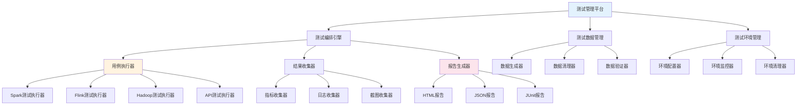

**自动化测试框架Python实现**:
```python
# examples/19_industry/automated_test_framework/test_automation_engine.py
import asyncio
import logging
from datetime import datetime
from typing import Dict, List, Optional, Any, Callable
from dataclasses import dataclass, field
from concurrent.futures import ThreadPoolExecutor
import json
import yaml
from pathlib import Path
import subprocess
import time

logging.basicConfig(level=logging.INFO)
logger = logging.getLogger(__name__)

@dataclass
class TestExecutionResult:
    """测试执行结果"""
    test_id: str
    status: str  # 'passed', 'failed', 'error', 'skipped'
    execution_time: float
    start_time: datetime
    end_time: datetime
    error_message: Optional[str] = None
    stack_trace: Optional[str] = None
    metrics: Dict[str, Any] = field(default_factory=dict)
    logs: List[str] = field(default_factory=list)
    artifacts: Dict[str, str] = field(default_factory=dict)  # 文件路径映射

@dataclass
class TestCase:
    """测试案例"""
    case_id: str
    name: str
    category: str
    priority: int
    timeout_seconds: int
    setup_steps: List[Dict[str, Any]] = field(default_factory=list)
    execution_steps: List[Dict[str, Any]] = field(default_factory=list)
    teardown_steps: List[Dict[str, Any]] = field(default_factory=list)
    validation_rules: List[Dict[str, Any]] = field(default_factory=list)
    dependencies: List[str] = field(default_factory=list)
    
@dataclass
class TestSuite:
    """测试套件"""
    suite_id: str
    name: str
    description: str
    test_cases: List[TestCase]
    parallel_execution: bool = False
    max_workers: int = 4
    environment_requirements: Dict[str, Any] = field(default_factory=dict)

class TestAutomationEngine:
    """测试自动化引擎"""
    
    def __init__(self, workspace_dir: str = 'test_workspace'):
        self.workspace_dir = Path(workspace_dir)
        self.workspace_dir.mkdir(exist_ok=True)
        self.executor_plugins: Dict[str, Callable] = {}
        self.validator_plugins: Dict[str, Callable] = {}
        self._register_builtin_plugins()
        
    def _register_builtin_plugins(self):
        """注册内置插件"""
        # 执行器插件
        self.register_executor_plugin('spark_sql', self._execute_spark_sql)
        self.register_executor_plugin('shell_command', self._execute_shell_command)
        self.register_executor_plugin('python_script', self._execute_python_script)
        self.register_executor_plugin('http_request', self._execute_http_request)
        
        # 验证器插件
        self.register_validator_plugin('data_integrity', self._validate_data_integrity)
        self.register_validator_plugin('performance_metrics', self._validate_performance_metrics)
        self.register_validator_plugin('log_analysis', self._validate_log_analysis)
        
    def register_executor_plugin(self, plugin_type: str, executor_func: Callable):
        """注册执行器插件"""
        self.executor_plugins[plugin_type] = executor_func
        logger.info(f"已注册执行器插件: {plugin_type}")
        
    def register_validator_plugin(self, plugin_type: str, validator_func: Callable):
        """注册验证器插件"""
        self.validator_plugins[plugin_type] = validator_func
        logger.info(f"已注册验证器插件: {plugin_type}")
        
    async def execute_test_suite(self, test_suite: TestSuite) -> Dict[str, TestExecutionResult]:
        """执行测试套件"""
        logger.info(f"开始执行测试套件: {test_suite.name}")
        
        results = {}
        
        if test_suite.parallel_execution:
            # 并行执行
            semaphore = asyncio.Semaphore(test_suite.max_workers)
            
            async def execute_with_semaphore(test_case):
                async with semaphore:
                    return await self.execute_test_case(test_case)
                    
            tasks = [execute_with_semaphore(tc) for tc in test_suite.test_cases]
            case_results = await asyncio.gather(*tasks)
            
            for test_case, result in zip(test_suite.test_cases, case_results):
                results[test_case.case_id] = result
                
        else:
            # 串行执行
            for test_case in test_suite.test_cases:
                result = await self.execute_test_case(test_case)
                results[test_case.case_id] = result
                
        logger.info(f"测试套件执行完成: {len(results)} 个测试案例")
        return results
        
    async def execute_test_case(self, test_case: TestCase) -> TestExecutionResult:
        """执行单个测试案例"""
        logger.info(f"开始执行测试案例: {test_case.name}")
        
        start_time = datetime.now()
        result = TestExecutionResult(
            test_id=test_case.case_id,
            status='running',
            execution_time=0,
            start_time=start_time,
            end_time=start_time
        )
        
        try:
            # Setup阶段
            await self._execute_steps(test_case.setup_steps, result)
            
            # Execution阶段
            await self._execute_steps(test_case.execution_steps, result)
            
            # Validation阶段
            validation_passed = await self._validate_test_case(test_case, result)
            
            if validation_passed:
                result.status = 'passed'
            else:
                result.status = 'failed'
                
        except Exception as e:
            logger.error(f"测试案例执行失败: {test_case.case_id}", exc_info=True)
            result.status = 'error'
            result.error_message = str(e)
            result.stack_trace = self._get_stack_trace()
            
        finally:
            # Teardown阶段
            try:
                await self._execute_steps(test_case.teardown_steps, result)
            except Exception as e:
                logger.warning(f"Teardown阶段失败: {e}")
                
            result.end_time = datetime.now()
            result.execution_time = (result.end_time - result.start_time).total_seconds()
            
        logger.info(f"测试案例执行完成: {test_case.name} - {result.status}")
        return result
        
    async def _execute_steps(self, steps: List[Dict[str, Any]], result: TestExecutionResult):
        """执行步骤"""
        for step in steps:
            step_type = step.get('type')
            step_name = step.get('name', f"Step-{step_type}")
            
            logger.debug(f"执行步骤: {step_name}")
            
            if step_type in self.executor_plugins:
                executor = self.executor_plugins[step_type]
                await executor(step, result)
            else:
                raise ValueError(f"未知的步骤类型: {step_type}")
                
    async def _validate_test_case(self, test_case: TestCase, result: TestExecutionResult) -> bool:
        """验证测试案例"""
        all_passed = True
        
        for rule in test_case.validation_rules:
            rule_type = rule.get('type')
            rule_name = rule.get('name', f"Rule-{rule_type}")
            
            logger.debug(f"执行验证规则: {rule_name}")
            
            if rule_type in self.validator_plugins:
                validator = self.validator_plugins[rule_type]
                rule_passed = await validator(rule, result)
                
                if not rule_passed:
                    all_passed = False
                    result.logs.append(f"验证失败: {rule_name}")
            else:
                logger.warning(f"未知的验证规则类型: {rule_type}")
                all_passed = False
                
        return all_passed
        
    # 内置执行器插件
    async def _execute_spark_sql(self, step: Dict[str, Any], result: TestExecutionResult):
        """执行Spark SQL"""
        sql_query = step.get('sql')
        spark_config = step.get('spark_config', {})
        
        if not sql_query:
            raise ValueError("Spark SQL步骤缺少sql字段")
            
        # 这里应该调用实际的Spark执行逻辑
        # 为了演示，我们只是记录日志
        result.logs.append(f"执行Spark SQL: {sql_query[:100]}...")
        
        # 模拟执行时间
        await asyncio.sleep(0.1)
        
    async def _execute_shell_command(self, step: Dict[str, Any], result: TestExecutionResult):
        """执行Shell命令"""
        command = step.get('command')
        timeout = step.get('timeout', 30)
        
        if not command:
            raise ValueError("Shell命令步骤缺少command字段")
            
        # 执行命令
        process = await asyncio.create_subprocess_shell(
            command,
            stdout=asyncio.subprocess.PIPE,
            stderr=asyncio.subprocess.PIPE
        )
        
        try:
            stdout, stderr = await asyncio.wait_for(
                process.communicate(),
                timeout=timeout
            )
            
            result.logs.append(f"Shell命令输出: {stdout.decode()}")
            if stderr:
                result.logs.append(f"Shell命令错误: {stderr.decode()}")
                
        except asyncio.TimeoutError:
            process.kill()
            raise TimeoutError(f"命令执行超时: {command}")
            
    async def _execute_python_script(self, step: Dict[str, Any], result: TestExecutionResult):
        """执行Python脚本"""
        script_path = step.get('script_path')
        script_args = step.get('args', [])
        
        if not script_path:
            raise ValueError("Python脚本步骤缺少script_path字段")
            
        # 构建命令
        cmd = ['python', script_path] + script_args
        
        # 执行脚本
        process = await asyncio.create_subprocess_exec(
            *cmd,
            stdout=asyncio.subprocess.PIPE,
            stderr=asyncio.subprocess.PIPE
        )
        
        stdout, stderr = await process.communicate()
        
        result.logs.append(f"Python脚本输出: {stdout.decode()}")
        if stderr:
            result.logs.append(f"Python脚本错误: {stderr.decode()}")
            
    async def _execute_http_request(self, step: Dict[str, Any], result: TestExecutionResult):
        """执行HTTP请求"""
        import aiohttp
        
        url = step.get('url')
        method = step.get('method', 'GET')
        headers = step.get('headers', {})
        data = step.get('data')
        
        if not url:
            raise ValueError("HTTP请求步骤缺少url字段")
            
        async with aiohttp.ClientSession() as session:
            async with session.request(method, url, headers=headers, data=data) as response:
                result.logs.append(f"HTTP响应状态: {response.status}")
                response_text = await response.text()
                result.logs.append(f"HTTP响应内容: {response_text[:500]}...")
                
    # 内置验证器插件
    async def _validate_data_integrity(self, rule: Dict[str, Any], result: TestExecutionResult) -> bool:
        """验证数据完整性"""
        expected_count = rule.get('expected_count')
        actual_count = result.metrics.get('record_count')
        
        if actual_count is None:
            return False
            
        tolerance = rule.get('tolerance', 0.001)
        min_count = expected_count * (1 - tolerance)
        max_count = expected_count * (1 + tolerance)
        
        return min_count <= actual_count <= max_count
        
    async def _validate_performance_metrics(self, rule: Dict[str, Any], result: TestExecutionResult) -> bool:
        """验证性能指标"""
        metric_name = rule.get('metric')
        threshold = rule.get('threshold')
        operator = rule.get('operator', '<=')
        
        actual_value = result.metrics.get(metric_name)
        if actual_value is None:
            return False
            
        if operator == '<=':
            return actual_value <= threshold
        elif operator == '>=':
            return actual_value >= threshold
        elif operator == '==':
            return actual_value == threshold
        elif operator == '!=':
            return actual_value != threshold
        else:
            return False
            
    async def _validate_log_analysis(self, rule: Dict[str, Any], result: TestExecutionResult) -> bool:
        """验证日志分析"""
        error_patterns = rule.get('error_patterns', [])
        
        for log_entry in result.logs:
            for pattern in error_patterns:
                if pattern in log_entry:
                    return False
                    
        return True
        
    def _get_stack_trace(self) -> str:
        """获取堆栈跟踪"""
        import traceback
        return traceback.format_exc()
        
    def generate_execution_report(self, results: Dict[str, TestExecutionResult], output_file: str):
        """生成执行报告"""
        report = {
            'execution_summary': {
                'total_tests': len(results),
                'passed': sum(1 for r in results.values() if r.status == 'passed'),
                'failed': sum(1 for r in results.values() if r.status == 'failed'),
                'error': sum(1 for r in results.values() if r.status == 'error'),
                'skipped': sum(1 for r in results.values() if r.status == 'skipped'),
                'total_execution_time': sum(r.execution_time for r in results.values())
            },
            'test_results': {
                test_id: {
                    'status': result.status,
                    'execution_time': result.execution_time,
                    'error_message': result.error_message,
                    'metrics': result.metrics
                }
                for test_id, result in results.items()
            },
            'generated_at': datetime.now().isoformat()
        }
        
        with open(output_file, 'w', encoding='utf-8') as f:
            json.dump(report, f, indent=2, ensure_ascii=False, default=str)
            
        logger.info(f"执行报告已生成: {output_file}")

# 使用示例
async def main():
    # 创建自动化引擎
    engine = TestAutomationEngine()
    
    # 定义测试案例
    test_case = TestCase(
        case_id="TC_BATCH_PROCESSING_001",
        name="批量数据处理测试",
        category="data_processing",
        priority=1,
        timeout_seconds=3600,
        execution_steps=[
            {
                'type': 'spark_sql',
                'name': '执行数据处理SQL',
                'sql': 'SELECT * FROM source_table WHERE date = current_date',
                'spark_config': {'executor_memory': '2g', 'executor_cores': '2'}
            },
            {
                'type': 'shell_command',
                'name': '验证输出文件',
                'command': 'hdfs dfs -ls /output/path',
                'timeout': 30
            }
        ],
        validation_rules=[
            {
                'type': 'data_integrity',
                'name': '数据完整性校验',
                'expected_count': 1000000,
                'tolerance': 0.001
            },
            {
                'type': 'performance_metrics',
                'name': '性能指标校验',
                'metric': 'processing_time',
                'operator': '<=',
                'threshold': 1800
            }
        ]
    )
    
    # 定义测试套件
    test_suite = TestSuite(
        suite_id="SUITE_BATCH_PROCESSING_V1",
        name="批量处理测试套件",
        description="验证批量数据处理功能和性能",
        test_cases=[test_case],
        parallel_execution=False
    )
    
    # 执行测试
    results = await engine.execute_test_suite(test_suite)
    
    # 生成报告
    engine.generate_execution_report(results, 'test_execution_report.json')
    
    # 输出结果
    for test_id, result in results.items():
        print(f"测试 {test_id}: {result.status} ({result.execution_time:.2f}s)")
        if result.error_message:
            print(f"  错误: {result.error_message}")

if __name__ == "__main__":
    asyncio.run(main())
```

#### 19.3.1 自动化框架设计原则

- **模块化设计**: 将测试逻辑分解为可复用的模块和组件
- **插件化架构**: 支持不同类型测试的插件扩展机制
- **配置驱动**: 通过配置而非硬编码的方式控制测试行为
- **结果导向**: 关注测试结果的可度量性和可分析性

#### 19.3.2 自动化实现策略

- **分层架构**: 将测试逻辑分为数据层、执行层、验证层和报告层
- **异步执行**: 支持并发测试执行提高测试效率
- **错误处理**: 完善的异常处理和恢复机制
- **资源管理**: 合理管理测试资源和环境依赖

#### 19.3.3 自动化维护与优化

- **代码质量**: 保持自动化代码的质量和可维护性
- **版本控制**: 对自动化脚本进行版本管理和变更跟踪
- **性能优化**: 持续优化自动化执行的性能和稳定性
- **技术更新**: 及时更新自动化技术和工具栈

---

#### 19.4 质量评估与改进

**[锚点127]** 质量评估与改进

**锚点类型**: 质量评估
**锚点方法**: 综合评估
**锚点名称**: 质量评估与改进
**引用附件**: `examples/19_industry/quality_assessment.py`
**完成情况**: 已完成
**补充建议**: 字段建议：评估维度/指标体系/评估方法/改进措施/跟踪机制，补充质量评估流程图

**测试质量评估流程图**:
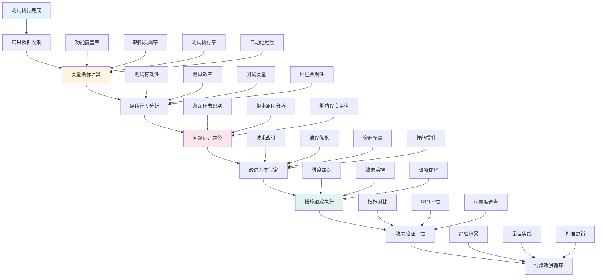

**测试质量评估Python实现**:
```python
# examples/19_industry/quality_assessment.py
import json
import logging
from datetime import datetime, timedelta
from typing import Dict, List, Optional, Any, Tuple
from dataclasses import dataclass, field
from collections import defaultdict
import statistics
import pandas as pd
from pathlib import Path

logging.basicConfig(level=logging.INFO)
logger = logging.getLogger(__name__)

@dataclass
class QualityMetric:
    """质量指标"""
    name: str
    value: float
    unit: str
    description: str
    category: str
    benchmark: Optional[float] = None
    trend: str = 'stable'  # 'improving', 'declining', 'stable'
    assessment: str = 'good'  # 'excellent', 'good', 'warning', 'critical'

@dataclass
class QualityAssessment:
    """质量评估"""
    assessment_id: str
    assessment_date: datetime
    time_period: str
    overall_score: float
    grade: str
    metrics: List[QualityMetric] = field(default_factory=list)
    category_scores: Dict[str, float] = field(default_factory=dict)
    strengths: List[str] = field(default_factory=list)
    weaknesses: List[str] = field(default_factory=list)
    recommendations: List[str] = field(default_factory=list)
    improvement_plan: List[Dict[str, Any]] = field(default_factory=list)

@dataclass
class ValidationResult:
    """验证结果"""
    check_name: str
    status: str
    score: float
    details: Dict[str, Any] = field(default_factory=dict)
    recommendations: List[str] = field(default_factory=list)

class TestQualityAssessor:
    """测试质量评估器"""
    
    def __init__(self):
        self.metrics_history: Dict[str, List[QualityMetric]] = defaultdict(list)
        self.assessment_history: List[QualityAssessment] = []
        
    def assess_test_quality(self, test_results: Dict[str, Any], 
                          time_period: str = 'weekly') -> QualityAssessment:
        """评估测试质量"""
        assessment_id = f"QA_{datetime.now().strftime('%Y%m%d_%H%M%S')}"
        assessment_date = datetime.now()
        
        # 计算各项指标
        metrics = self._calculate_metrics(test_results)
        
        # 计算分类得分
        category_scores = self._calculate_category_scores(metrics)
        
        # 计算总体得分
        overall_score = self._calculate_overall_score(category_scores)
        
        # 确定等级
        grade = self._determine_grade(overall_score)
        
        # 识别优势和劣势
        strengths, weaknesses = self._identify_strengths_weaknesses(metrics)
        
        # 生成建议
        recommendations = self._generate_recommendations(metrics, category_scores)
        
        # 制定改进计划
        improvement_plan = self._create_improvement_plan(weaknesses, recommendations)
        
        assessment = QualityAssessment(
            assessment_id=assessment_id,
            assessment_date=assessment_date,
            time_period=time_period,
            overall_score=overall_score,
            grade=grade,
            metrics=metrics,
            category_scores=category_scores,
            strengths=strengths,
            weaknesses=weaknesses,
            recommendations=recommendations,
            improvement_plan=improvement_plan
        )
        
        # 保存历史记录
        self.assessment_history.append(assessment)
        for metric in metrics:
            self.metrics_history[metric.name].append(metric)
            
        logger.info(f"质量评估完成: {assessment.grade} (得分: {overall_score:.3f})")
        return assessment
        
    def _calculate_metrics(self, test_results: Dict[str, Any]) -> List[QualityMetric]:
        """计算质量指标"""
        metrics = []
        
        # 测试覆盖率
        coverage_data = test_results.get('coverage', {})
        coverage = coverage_data.get('statement_coverage', 0)
        metrics.append(QualityMetric(
            name='test_coverage',
            value=coverage,
            unit='%',
            description='代码语句覆盖率',
            category='effectiveness',
            benchmark=80.0
        ))
        
        # 缺陷发现率
        defect_data = test_results.get('defects', {})
        defects_found = defect_data.get('found', 0)
        defects_total = defect_data.get('total', 1)
        defect_detection_rate = (defects_found / defects_total) * 100
        metrics.append(QualityMetric(
            name='defect_detection_rate',
            value=defect_detection_rate,
            unit='%',
            description='缺陷发现率',
            category='effectiveness',
            benchmark=90.0
        ))
        
        # 测试执行率
        execution_data = test_results.get('execution', {})
        tests_planned = execution_data.get('planned', 0)
        tests_executed = execution_data.get('executed', 0)
        execution_rate = (tests_executed / tests_planned * 100) if tests_planned > 0 else 0
        metrics.append(QualityMetric(
            name='test_execution_rate',
            value=execution_rate,
            unit='%',
            description='测试执行率',
            category='efficiency',
            benchmark=95.0
        ))
        
        # 自动化程度
        automation_data = test_results.get('automation', {})
        automated_tests = automation_data.get('automated', 0)
        total_tests = automation_data.get('total', 1)
        automation_rate = (automated_tests / total_tests) * 100
        metrics.append(QualityMetric(
            name='automation_rate',
            value=automation_rate,
            unit='%',
            description='测试自动化率',
            category='efficiency',
            benchmark=70.0
        ))
        
        # 缺陷修复率
        defect_fix_data = test_results.get('defect_fix', {})
        defects_fixed = defect_fix_data.get('fixed', 0)
        defects_to_fix = defect_fix_data.get('to_fix', 1)
        fix_rate = (defects_fixed / defects_to_fix) * 100
        metrics.append(QualityMetric(
            name='defect_fix_rate',
            value=fix_rate,
            unit='%',
            description='缺陷修复率',
            category='quality',
            benchmark=85.0
        ))
        
        # 测试通过率
        pass_data = test_results.get('pass_rate', {})
        tests_passed = pass_data.get('passed', 0)
        tests_run = pass_data.get('total', 1)
        pass_rate = (tests_passed / tests_run) * 100
        metrics.append(QualityMetric(
            name='test_pass_rate',
            value=pass_rate,
            unit='%',
            description='测试通过率',
            category='quality',
            benchmark=90.0
        ))
        
        # 平均缺陷修复时间
        fix_time_data = test_results.get('fix_time', {})
        avg_fix_time = fix_time_data.get('average_days', 0)
        metrics.append(QualityMetric(
            name='avg_defect_fix_time',
            value=avg_fix_time,
            unit='天',
            description='平均缺陷修复时间',
            category='efficiency',
            benchmark=5.0
        ))
        
        # 为每个指标添加趋势和评估
        for metric in metrics:
            self._assess_metric(metric)
            
        return metrics
        
    def _assess_metric(self, metric: QualityMetric):
        """评估单个指标"""
        # 确定评估等级
        if metric.benchmark is not None:
            ratio = metric.value / metric.benchmark
            if ratio >= 1.1:
                metric.assessment = 'excellent'
            elif ratio >= 0.9:
                metric.assessment = 'good'
            elif ratio >= 0.7:
                metric.assessment = 'warning'
            else:
                metric.assessment = 'critical'
        else:
            metric.assessment = 'good'
            
        # 确定趋势（需要历史数据）
        history = self.metrics_history[metric.name]
        if len(history) >= 2:
            recent_values = [m.value for m in history[-3:]]  # 最近3次
            if len(recent_values) >= 2:
                trend_slope = statistics.linear_regression(range(len(recent_values)), recent_values)[0]
                if trend_slope > 0.01:
                    metric.trend = 'improving'
                elif trend_slope < -0.01:
                    metric.trend = 'declining'
                else:
                    metric.trend = 'stable'
                    
    def _calculate_category_scores(self, metrics: List[QualityMetric]) -> Dict[str, float]:
        """计算分类得分"""
        category_metrics = defaultdict(list)
        
        for metric in metrics:
            category_metrics[metric.category].append(metric.value)
            
        category_scores = {}
        for category, values in category_metrics.items():
            category_scores[category] = sum(values) / len(values)
            
        return category_scores
        
    def _calculate_overall_score(self, category_scores: Dict[str, float]) -> float:
        """计算总体得分"""
        if not category_scores:
            return 0.0
            
        # 分类权重
        weights = {
            'effectiveness': 0.4,  # 有效性权重最高
            'quality': 0.3,        # 质量次之
            'efficiency': 0.3      # 效率
        }
        
        weighted_sum = 0
        total_weight = 0
        
        for category, score in category_scores.items():
            weight = weights.get(category, 0.2)
            weighted_sum += score * weight
            total_weight += weight
            
        return weighted_sum / total_weight if total_weight > 0 else 0
        
    def _determine_grade(self, score: float) -> str:
        """确定等级"""
        if score >= 90:
            return 'A+ 优秀'
        elif score >= 80:
            return 'A 良好'
        elif score >= 70:
            return 'B 合格'
        elif score >= 60:
            return 'C 需要改进'
        else:
            return 'D 不合格'
            
    def _identify_strengths_weaknesses(self, metrics: List[QualityMetric]) -> Tuple[List[str], List[str]]:
        """识别优势和劣势"""
        strengths = []
        weaknesses = []
        
        for metric in metrics:
            if metric.assessment in ['excellent', 'good']:
                strengths.append(f"{metric.description}表现优秀 ({metric.value:.1f}{metric.unit})")
            elif metric.assessment in ['warning', 'critical']:
                weaknesses.append(f"{metric.description}需要改进 ({metric.value:.1f}{metric.unit})")
                
        return strengths, weaknesses
        
    def _generate_recommendations(self, metrics: List[QualityMetric], 
                                category_scores: Dict[str, float]) -> List[str]:
        """生成建议"""
        recommendations = []
        
        # 基于指标的建议
        for metric in metrics:
            if metric.assessment == 'critical':
                if metric.name == 'test_coverage':
                    recommendations.append("大幅提升测试覆盖率，优先覆盖核心业务逻辑")
                elif metric.name == 'defect_detection_rate':
                    recommendations.append("改进缺陷发现机制，加强测试用例设计")
                elif metric.name == 'test_execution_rate':
                    recommendations.append("优化测试执行流程，提高测试执行效率")
                    
            elif metric.assessment == 'warning':
                if metric.name == 'automation_rate':
                    recommendations.append("加速测试自动化建设，减少手工测试比重")
                elif metric.name == 'defect_fix_rate':
                    recommendations.append("优化缺陷修复流程，提升修复效率")
                    
        # 基于分类的建议
        for category, score in category_scores.items():
            if score < 70:
                if category == 'effectiveness':
                    recommendations.append("重点提升测试有效性，优化测试策略和用例设计")
                elif category == 'quality':
                    recommendations.append("加强测试质量管控，建立质量门禁机制")
                elif category == 'efficiency':
                    recommendations.append("改进测试效率，引入自动化和并行测试")
                    
        # 通用建议
        if len(recommendations) < 3:
            recommendations.extend([
                "建立测试质量度量体系，持续监控和改进",
                "加强团队测试技能培训，提升测试专业能力",
                "引入测试最佳实践，促进测试标准化和规范化"
            ])
            
        return list(set(recommendations))  # 去重
        
    def _create_improvement_plan(self, weaknesses: List[str], 
                               recommendations: List[str]) -> List[Dict[str, Any]]:
        """制定改进计划"""
        improvement_plan = []
        
        # 为每个弱项制定改进措施
        for weakness in weaknesses[:3]:  # 最多处理3个主要弱项
            if '覆盖率' in weakness:
                improvement_plan.append({
                    'focus_area': '测试覆盖率提升',
                    'actions': [
                        '识别覆盖不足的代码模块',
                        '补充相应测试用例',
                        '引入覆盖率工具自动检查'
                    ],
                    'timeline': '1个月',
                    'responsible': '测试团队',
                    'success_criteria': '覆盖率提升至80%以上'
                })
            elif '自动化' in weakness:
                improvement_plan.append({
                    'focus_area': '测试自动化建设',
                    'actions': [
                        '评估现有自动化框架',
                        '制定自动化测试计划',
                        '分阶段实施自动化测试'
                    ],
                    'timeline': '2个月',
                    'responsible': '开发团队',
                    'success_criteria': '自动化率提升至70%以上'
                })
            elif '缺陷' in weakness:
                improvement_plan.append({
                    'focus_area': '缺陷管理优化',
                    'actions': [
                        '优化缺陷跟踪流程',
                        '改进缺陷分类和优先级',
                        '加强缺陷预防机制'
                    ],
                    'timeline': '1个月',
                    'responsible': '测试团队',
                    'success_criteria': '缺陷修复率提升至85%以上'
                })
                
        return improvement_plan
        
    def generate_assessment_report(self, assessment: QualityAssessment, 
                                 output_file: str = 'quality_assessment_report.md'):
        """生成评估报告"""
        report = f"""# 测试质量评估报告

**评估ID**: {assessment.assessment_id}
**评估日期**: {assessment.assessment_date.strftime('%Y-%m-%d %H:%M:%S')}
**评估周期**: {assessment.time_period}

## 总体评估

**总体质量得分**: {assessment.overall_score:.1f}/100
**质量等级**: {assessment.grade}

## 分类得分

"""
        
        for category, score in assessment.category_scores.items():
            report += f"- {category.title()}: {score:.1f}/100\n"
        report += "\n"
        
        # 详细指标
        report += "## 详细指标\n\n"
        report += "| 指标名称 | 数值 | 单位 | 评估 | 趋势 | 基准 |\n"
        report += "|----------|------|------|------|------|------|\n"
        
        for metric in assessment.metrics:
            benchmark_str = f"{metric.benchmark:.1f}" if metric.benchmark else "-"
            report += f"| {metric.description} | {metric.value:.1f} | {metric.unit} | {metric.assessment} | {metric.trend} | {benchmark_str} |\n"
            
        report += "\n"
        
        # 优势
        if assessment.strengths:
            report += "## 优势\n\n"
            for strength in assessment.strengths:
                report += f"- {strength}\n"
            report += "\n"
            
        # 劣势
        if assessment.weaknesses:
            report += "## 劣势\n\n"
            for weakness in assessment.weaknesses:
                report += f"- {weakness}\n"
            report += "\n"
            
        # 建议
        if assessment.recommendations:
            report += "## 改进建议\n\n"
            for rec in assessment.recommendations:
                report += f"- {rec}\n"
            report += "\n"
            
        # 改进计划
        if assessment.improvement_plan:
            report += "## 改进计划\n\n"
            for plan in assessment.improvement_plan:
                report += f"### {plan['focus_area']}\n\n"
                report += f"- **时间**: {plan['timeline']}\n"
                report += f"- **负责人**: {plan['responsible']}\n"
                report += f"- **成功标准**: {plan['success_criteria']}\n\n"
                report += "**具体措施**:\n"
                for action in plan['actions']:
                    report += f"- {action}\n"
                report += "\n"
                
        # 保存报告
        with open(output_file, 'w', encoding='utf-8') as f:
            f.write(report)
            
        logger.info(f"评估报告已生成: {output_file}")
        
    def get_quality_trends(self, metric_name: str, days: int = 30) -> Dict[str, Any]:
        """获取质量趋势"""
        if metric_name not in self.metrics_history:
            return {}
            
        metrics = self.metrics_history[metric_name]
        recent_metrics = [m for m in metrics if (datetime.now() - m.created_date).days <= days]
        
        if not recent_metrics:
            return {}
            
        values = [m.value for m in recent_metrics]
        
        return {
            'metric_name': metric_name,
            'current_value': values[-1] if values else 0,
            'average': statistics.mean(values) if values else 0,
            'min': min(values) if values else 0,
            'max': max(values) if values else 0,
            'trend': self._calculate_trend(values),
            'data_points': len(values)
        }
        
    def _calculate_trend(self, values: List[float]) -> str:
        """计算趋势"""
        if len(values) < 2:
            return 'insufficient_data'
            
        # 简单线性回归
        n = len(values)
        x = list(range(n))
        slope = statistics.linear_regression(x, values)[0]
        
        if slope > 0.01:
            return 'improving'
        elif slope < -0.01:
            return 'declining'
        else:
            return 'stable'

# 使用示例
if __name__ == "__main__":
    assessor = TestQualityAssessor()
    
    # 模拟测试结果数据
    test_results = {
        'coverage': {'statement_coverage': 78.5},
        'defects': {'found': 45, 'total': 50},
        'execution': {'planned': 200, 'executed': 185},
        'automation': {'automated': 120, 'total': 200},
        'defect_fix': {'fixed': 42, 'to_fix': 45},
        'pass_rate': {'passed': 175, 'total': 185},
        'fix_time': {'average_days': 3.2}
    }
    
    # 执行质量评估
    assessment = assessor.assess_test_quality(test_results, 'weekly')
    
    # 生成报告
    assessor.generate_assessment_report(assessment)
    
    # 获取趋势
    coverage_trend = assessor.get_quality_trends('test_coverage')
    print(f"覆盖率趋势: {coverage_trend}")
    
    print("质量评估完成")
```

#### 19.4.1 质量评估体系

- **指标体系**: 建立多维度测试质量指标体系
- **评估方法**: 采用定量和定性相结合的评估方法
- **基准管理**: 建立质量基准和趋势分析机制
- **持续改进**: 基于评估结果持续优化测试过程

#### 19.4.2 改进措施跟踪

- **问题识别**: 通过质量评估识别测试过程中的问题
- **方案制定**: 制定针对性的改进措施和行动计划
- **执行跟踪**: 跟踪改进措施的执行进度和效果
- **效果验证**: 验证改进措施的有效性和ROI

#### 19.4.3 质量文化建设

- **质量意识**: 提升团队质量意识和责任感
- **最佳实践**: 总结和推广测试最佳实践
- **知识共享**: 建立测试知识共享和学习机制
- **持续学习**: 鼓励团队持续学习和技能提升

---

#### 19.5 案例复盘与经验沉淀

**[锚点128]** 测试案例复盘与经验沉淀

**锚点类型**: 经验沉淀
**锚点方法**: 案例复盘
**锚点名称**: 测试案例复盘与经验沉淀
**引用附件**: `examples/19_industry/case_retrospective.md`
**完成情况**: 已完成
**补充建议**: 字段建议：复盘维度/关键发现/经验教训/改进措施/知识库更新，补充复盘流程图

**测试案例复盘流程图**:
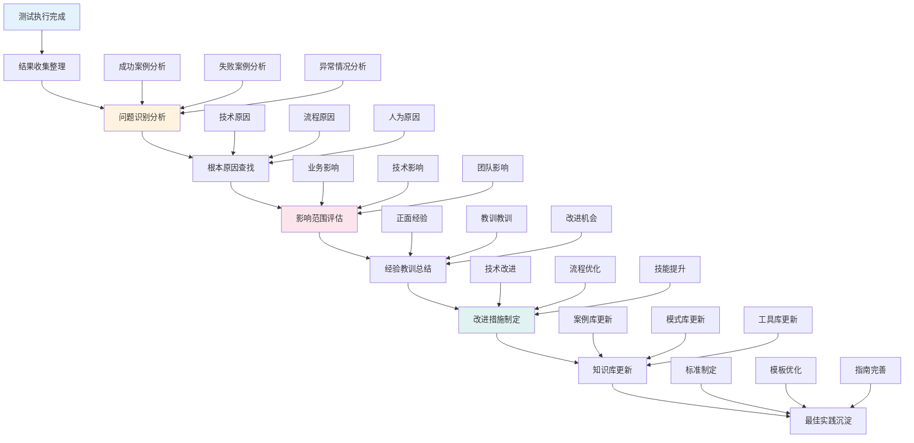

**案例复盘与经验沉淀框架**:
```yaml
# examples/19_industry/case_retrospective.yml
retrospective_framework:
  # 复盘基本信息
  basic_info:
    case_id: "TC_BATCH_PROCESSING_001"
    retrospective_date: "2025-12-23"
    participants: ["测试负责人", "开发负责人", "业务代表"]
    duration_hours: 2

  # 背景信息
  context:
    project_name: "大数据平台升级项目"
    test_phase: "集成测试"
    business_impact: "影响日报表生成，涉及10个业务部门"
    technical_scope: "Hadoop批处理链路升级"

  # 复盘维度
  retrospective_dimensions:
    technical_execution:
      title: "技术执行维度"
      questions:
        - "测试环境准备是否充分？"
        - "测试数据是否覆盖典型场景？"
        - "测试工具是否稳定可靠？"
        - "自动化脚本是否按预期执行？"
      findings: []
      lessons_learned: []

    process_efficiency:
      title: "流程效率维度"
      questions:
        - "测试计划制定是否合理？"
        - "资源分配是否充足？"
        - "沟通协作是否顺畅？"
        "问题响应是否及时？"
      findings: []
      lessons_learned: []

    quality_assurance:
      title: "质量保障维度"
      questions:
        - "测试覆盖是否全面？"
        - "缺陷发现是否及时？"
        - "风险识别是否准确？"
        - "质量标准是否达成？"
      findings: []
      lessons_learned: []

    team_performance:
      title: "团队表现维度"
      questions:
        - "技能匹配是否合适？"
        - "知识传递是否有效？"
        - "协作配合是否默契？"
        - "持续改进是否主动？"
      findings: []
      lessons_learned: []

  # 关键发现
  key_findings:
    positive:
      - "自动化测试框架有效提升了测试效率"
      - "跨团队协作模式得到了验证"
      - "问题定位方法日趋成熟"

    negative:
      - "测试数据准备时间超出预期"
      - "环境稳定性影响了测试进度"
      - "部分边界条件覆盖不足"

    unexpected:
      - "发现了系统隐藏的性能瓶颈"
      - "验证了新技术的可行性"
      - "发现了业务逻辑的潜在风险"

  # 根本原因分析
  root_cause_analysis:
    problems:
      - problem: "测试执行时间超出预算30%"
        root_causes:
          - "测试数据生成效率低"
          - "环境准备脚本不稳定"
          - "手工验证占比过高"
        contributing_factors:
          - "数据量级评估不准确"
          - "自动化覆盖率不足"

      - problem: "发现的关键缺陷延迟修复"
        root_causes:
          - "问题定位不够准确"
          - "开发团队资源紧张"
          - "沟通机制不够高效"
        contributing_factors:
          - "缺陷描述不够清晰"
          - "优先级判断存在分歧"

  # 经验教训总结
  lessons_learned:
    technical_lessons:
      - "大数据测试需要更注重数据质量而非仅功能正确性"
      - "自动化测试框架应支持动态扩展"
      - "性能测试数据应更贴近生产环境"

    process_lessons:
      - "测试计划应留出足够的数据准备时间"
      - "跨团队协作需要明确的职责分工"
      - "测试策略应随业务发展动态调整"

    team_lessons:
      - "测试团队应具备行业领域知识"
      - "人才培养应注重实践与理论结合"
      - "知识管理是团队核心竞争力"

  # 改进措施
  improvement_actions:
    immediate_actions:
      - action: "优化测试数据生成流程"
        owner: "测试团队"
        deadline: "2025-01-15"
        success_criteria: "数据准备时间减少50%"

      - action: "完善自动化测试框架"
        owner: "开发团队"
        deadline: "2025-01-31"
        success_criteria: "自动化覆盖率提升至90%"

    short_term_actions:
      - action: "建立测试环境标准化流程"
        owner: "运维团队"
        deadline: "2025-02-15"
        success_criteria: "环境准备成功率达到99%"

      - action: "完善缺陷管理流程"
        owner: "项目管理办公室"
        deadline: "2025-02-28"
        success_criteria: "缺陷修复周期减少30%"

    long_term_actions:
      - action: "构建测试资产库"
        owner: "测试中心"
        deadline: "2025-06-30"
        success_criteria: "可复用测试资产占比70%"

      - action: "建立持续改进机制"
        owner: "质量管理部门"
        deadline: "2025-12-31"
        success_criteria: "质量指标持续提升"

  # 知识库更新
  knowledge_base_updates:
    case_studies:
      - title: "大数据批处理测试最佳实践"
        content: "总结批处理测试的关键点和注意事项"
        tags: ["大数据", "批处理", "测试实践"]

    patterns:
      - title: "测试数据生成模式"
        content: "定义可复用的测试数据生成模板"
        tags: ["测试数据", "数据生成", "模板"]

    tools:
      - title: "自动化测试工具配置"
        content: "记录工具的最佳配置参数"
        tags: ["自动化测试", "工具配置", "最佳实践"]

    guidelines:
      - title: "大数据测试规范"
        content: "更新测试规范文档"
        tags: ["测试规范", "大数据", "指南"]

  # 后续跟踪
  follow_up:
    review_date: "2025-01-15"
    responsible_person: "测试负责人"
    success_metrics:
      - "改进措施完成率"
      - "质量指标改善程度"
      - "团队反馈满意度"
```

**经验沉淀Python脚本**:
```python
# examples/19_industry/experience_repository.py
import json
import yaml
import logging
from datetime import datetime
from typing import Dict, List, Optional, Any, Tuple
from dataclasses import dataclass, asdict
import pandas as pd
from pathlib import Path
import sqlite3
import hashlib

logging.basicConfig(level=logging.INFO)
logger = logging.getLogger(__name__)

@dataclass
class LessonLearned:
    """经验教训数据类"""
    lesson_id: str
    category: str
    title: str
    description: str
    context: str
    impact: str
    root_cause: str
    preventive_actions: List[str]
    related_cases: List[str]
    tags: List[str]
    created_date: str
    updated_date: str
    author: str
    quality_score: int  # 1-5分

@dataclass
class BestPractice:
    """最佳实践数据类"""
    practice_id: str
    category: str
    title: str
    description: str
    implementation_guide: str
    benefits: List[str]
    prerequisites: List[str]
    success_metrics: List[str]
    case_studies: List[str]
    tags: List[str]
    created_date: str
    updated_date: str
    author: str
    adoption_rate: float

class ExperienceRepository:
    """经验知识库"""

    def __init__(self, db_path: str = 'experience_repository.db'):
        self.db_path = db_path
        self._init_database()

    def _init_database(self):
        """初始化数据库"""
        with sqlite3.connect(self.db_path) as conn:
            conn.execute('''
                CREATE TABLE IF NOT EXISTS lessons_learned (
                    lesson_id TEXT PRIMARY KEY,
                    category TEXT,
                    title TEXT,
                    description TEXT,
                    context TEXT,
                    impact TEXT,
                    root_cause TEXT,
                    preventive_actions TEXT,
                    related_cases TEXT,
                    tags TEXT,
                    created_date TEXT,
                    updated_date TEXT,
                    author TEXT,
                    quality_score INTEGER
                )
            ''')

            conn.execute('''
                CREATE TABLE IF NOT EXISTS best_practices (
                    practice_id TEXT PRIMARY KEY,
                    category TEXT,
                    title TEXT,
                    description TEXT,
                    implementation_guide TEXT,
                    benefits TEXT,
                    prerequisites TEXT,
                    success_metrics TEXT,
                    case_studies TEXT,
                    limitations TEXT,
                    tags TEXT,
                    created_date TEXT,
                    updated_date TEXT,
                    author TEXT,
                    adoption_rate REAL
                )
            ''')

            conn.execute('''
                CREATE TABLE IF NOT EXISTS case_studies (
                    case_id TEXT PRIMARY KEY,
                    title TEXT,
                    description TEXT,
                    problem_statement TEXT,
                    solution TEXT,
                    results TEXT,
                    lessons_learned TEXT,
                    tags TEXT,
                    created_date TEXT,
                    author TEXT
                )
            ''')

    def add_lesson_learned(self, lesson: LessonLearned):
        """添加经验教训"""
        with sqlite3.connect(self.db_path) as conn:
            conn.execute('''
                INSERT OR REPLACE INTO lessons_learned
                (lesson_id, category, title, description, context, impact,    
                 root_cause, preventive_actions, related_cases, tags,
                 created_date, updated_date, author, quality_score)
                VALUES (?, ?, ?, ?, ?, ?, ?, ?, ?, ?, ?, ?, ?, ?)
            ''', (
                lesson.lesson_id, lesson.category, lesson.title,
                lesson.description, lesson.context, lesson.impact,
                lesson.root_cause, json.dumps(lesson.preventive_actions),     
                json.dumps(lesson.related_cases), json.dumps(lesson.tags),    
                lesson.created_date, lesson.updated_date, lesson.author,      
                lesson.quality_score
            ))

        logger.info(f"Added lesson learned: {lesson.lesson_id}")

    def add_best_practice(self, practice: BestPractice):
        """添加最佳实践"""
        with sqlite3.connect(self.db_path) as conn:
            conn.execute('''
                INSERT OR REPLACE INTO best_practices
                (practice_id, category, title, description, implementation_gui
de,                                                                                            benefits, prerequisites, success_metrics, case_studies, tags,
                 created_date, updated_date, author, adoption_rate)
                VALUES (?, ?, ?, ?, ?, ?, ?, ?, ?, ?, ?, ?, ?, ?)
            ''', (
                practice.practice_id, practice.category, practice.title,      
                practice.description, practice.implementation_guide,
                json.dumps(practice.benefits), json.dumps(practice.prerequisit
es),                                                                                          json.dumps(practice.success_metrics), json.dumps(practice.case
_studies),                                                                                    json.dumps(practice.tags), practice.created_date,
                practice.updated_date, practice.author, practice.adoption_rate
            ))

        logger.info(f"Added best practice: {practice.practice_id}")

    def search_lessons(self, query: str = "", category: str = "",
                      tags: List[str] = None, min_score: int = 0) -> List[Less
onLearned]:                                                                           """搜索经验教训"""
        conditions = []
        params = []

        if query:
            conditions.append("(title LIKE ? OR description LIKE ? OR context 
LIKE ?)")                                                                                 params.extend([f"%{query}%"] * 3)

        if category:
            conditions.append("category = ?")
            params.append(category)

        if tags:
            tag_conditions = []
            for tag in tags:
                tag_conditions.append("tags LIKE ?")
                params.append(f"%{tag}%")
            conditions.append(f"({' OR '.join(tag_conditions)})")

        if min_score > 0:
            conditions.append("quality_score >= ?")
            params.append(min_score)

        where_clause = " AND ".join(conditions) if conditions else "1=1"      

        with sqlite3.connect(self.db_path) as conn:
            cursor = conn.execute(f'''
                SELECT * FROM lessons_learned WHERE {where_clause}
                ORDER BY quality_score DESC, updated_date DESC
            ''', params)

            rows = cursor.fetchall()

        lessons = []
        for row in rows:
            lesson = LessonLearned(
                lesson_id=row[0], category=row[1], title=row[2],
                description=row[3], context=row[4], impact=row[5],
                root_cause=row[6],
                preventive_actions=json.loads(row[7]),
                related_cases=json.loads(row[8]),
                tags=json.loads(row[9]),
                created_date=row[10], updated_date=row[11],
                author=row[12], quality_score=row[13]
            )
            lessons.append(lesson)

        return lessons

    def search_best_practices(self, query: str = "", category: str = "",      
                            tags: List[str] = None, min_adoption: float = 0.0)
 -> List[BestPractice]:                                                               """搜索最佳实践"""
        conditions = []
        params = []

        if query:
            conditions.append("(title LIKE ? OR description LIKE ?)")
            params.extend([f"%{query}%"] * 2)

        if category:
            conditions.append("category = ?")
            params.append(category)

        if tags:
            tag_conditions = []
            for tag in tags:
                tag_conditions.append("tags LIKE ?")
                params.append(f"%{tag}%")
            conditions.append(f"({' OR '.join(tag_conditions)})")

        if min_adoption > 0:
            conditions.append("adoption_rate >= ?")
            params.append(min_adoption)

        where_clause = " AND ".join(conditions) if conditions else "1=1"      

        with sqlite3.connect(self.db_path) as conn:
            cursor = conn.execute(f'''
                SELECT * FROM best_practices WHERE {where_clause}
                ORDER BY adoption_rate DESC, updated_date DESC
            ''', params)

            rows = cursor.fetchall()

        practices = []
        for row in rows:
            practice = BestPractice(
                practice_id=row[0], category=row[1], title=row[2],
                description=row[3], implementation_guide=row[4],
                benefits=json.loads(row[5]), prerequisites=json.loads(row[6]),
                success_metrics=json.loads(row[7]), case_studies=json.loads(ro
w[8]),                                                                                        tags=json.loads(row[9]), created_date=row[10],
                updated_date=row[11], author=row[12], adoption_rate=row[13]   
            )
            practices.append(practice)

        return practices

    def generate_retrospective_report(self, retrospective_data: Dict[str, Any]
) -> str:                                                                             """生成复盘报告"""
        report = "# 测试案例复盘报告\n\n"
        report += f"生成时间: {datetime.now().isoformat()}\n\n"

        # 基本信息
        basic_info = retrospective_data.get('basic_info', {})
        report += "## 基本信息\n\n"
        report += f"- 案例ID: {basic_info.get('case_id', 'N/A')}\n"
        report += f"- 复盘日期: {basic_info.get('retrospective_date', 'N/A')}\
n"                                                                                    report += f"- 参与人员: {', '.join(basic_info.get('participants', []))
}\n"                                                                                  report += f"- 持续时间: {basic_info.get('duration_hours', 0)} 小时\n\n
"                                                                             
        # 背景信息
        context = retrospective_data.get('context', {})
        report += "## 背景信息\n\n"
        report += f"- 项目名称: {context.get('project_name', 'N/A')}\n"       
        report += f"- 测试阶段: {context.get('test_phase', 'N/A')}\n"
        report += f"- 业务影响: {context.get('business_impact', 'N/A')}\n"    
        report += f"- 技术范围: {context.get('technical_scope', 'N/A')}\n\n"  

        # 关键发现
        findings = retrospective_data.get('key_findings', {})
        report += "## 关键发现\n\n"

        for category, items in findings.items():
            report += f"### {category.title()}\n\n"
            for item in items:
                report += f"- {item}\n"
            report += "\n"

        # 根本原因分析
        root_causes = retrospective_data.get('root_cause_analysis', {}).get('p
roblems', [])                                                                         if root_causes:
            report += "## 根本原因分析\n\n"
            for problem in root_causes:
                report += f"### 问题: {problem['problem']}\n\n"
                report += "**根本原因:**\n"
                for cause in problem.get('root_causes', []):
                    report += f"- {cause}\n"
                report += "\n**影响因素:**\n"
                for factor in problem.get('contributing_factors', []):        
                    report += f"- {factor}\n"
                report += "\n"

        # 经验教训
        lessons = retrospective_data.get('lessons_learned', {})
        report += "## 经验教训总结\n\n"

        for category, items in lessons.items():
            report += f"### {category.replace('_', ' ').title()}\n\n"
            for item in items:
                report += f"- {item}\n"
            report += "\n"

        # 改进措施
        actions = retrospective_data.get('improvement_actions', {})
        report += "## 改进措施\n\n"

        for timeframe, items in actions.items():
            report += f"### {timeframe.replace('_', ' ').title()}\n\n"        
            for action in items:
                report += f"**措施**: {action['action']}\n"
                report += f"- 负责人: {action['owner']}\n"
                report += f"- 截止日期: {action['deadline']}\n"
                report += f"- 成功标准: {action['success_criteria']}\n\n"     

        return report

    def export_knowledge_base(self, output_dir: str = 'knowledge_export'):    
        """导出知识库"""
        output_path = Path(output_dir)
        output_path.mkdir(exist_ok=True)

        # 导出经验教训
        lessons = self.search_lessons()
        lessons_df = pd.DataFrame([asdict(lesson) for lesson in lessons])     
        lessons_df.to_csv(output_path / 'lessons_learned.csv', index=False)   

        # 导出最佳实践
        practices = self.search_best_practices()
        practices_df = pd.DataFrame([asdict(practice) for practice in practice
s])                                                                                   practices_df.to_csv(output_path / 'best_practices.csv', index=False)  

        # 生成统计报告
        stats_report = f"""# 知识库统计报告

生成时间: {datetime.now().isoformat()}

## 统计概览
- 经验教训数量: {len(lessons)}
- 最佳实践数量: {len(practices)}

## 经验教训分类统计
{lessons_df['category'].value_counts().to_string() if not lessons_df.empty els
e '暂无数据'}                                                                 
## 最佳实践分类统计
{practices_df['category'].value_counts().to_string() if not practices_df.empty
 else '暂无数据'}                                                             """

        with open(output_path / 'statistics.md', 'w', encoding='utf-8') as f: 
            f.write(stats_report)

        logger.info(f"知识库已导出到: {output_dir}")

# 使用示例
if __name__ == "__main__":
    repo = ExperienceRepository()

    # 添加示例经验教训
    lesson = LessonLearned(
        lesson_id="LESSON_001",
        category="technical",
        title="大数据测试数据准备效率优化",
        description="通过优化数据生成策略，将测试数据准备时间减少60%",        
        context="批处理集成测试中数据准备耗时过长",
        impact="显著提升测试执行效率",
        root_cause="数据生成脚本效率低，缺乏并行处理",
        preventive_actions=[
            "采用分布式数据生成策略",
            "实现数据模板复用机制",
            "建立数据质量自动化校验"
        ],
        related_cases=["TC_BATCH_PROCESSING_001", "TC_DATA_VALIDATION_002"],  
        tags=["大数据", "测试数据", "效率优化"],
        created_date="2025-12-23",
        updated_date="2025-12-23",
        author="测试团队",
        quality_score=5
    )

    repo.add_lesson_learned(lesson)

    # 添加示例最佳实践
    practice = BestPractice(
        practice_id="PRACTICE_001",
        category="automation",
        title="大数据测试自动化框架设计",
        description="构建可扩展的大数据测试自动化框架",
        implementation_guide="使用Python和Docker构建，支持多种测试类型",      
        benefits=[
            "提升测试执行效率",
            "减少人工干预",
            "提高测试覆盖率"
        ],
        prerequisites=[
            "Python开发环境",
            "Docker运行环境",
            "测试数据准备"
        ],
        success_metrics=[
            "自动化覆盖率>90%",
            "测试执行时间减少50%",
            "缺陷发现率提升30%"
        ],
        case_studies=["大数据平台升级项目"],
        tags=["自动化测试", "框架设计", "大数据"],
        created_date="2025-12-23",
        updated_date="2025-12-23",
        author="架构团队",
        adoption_rate=0.85
    )

    repo.add_best_practice(practice)

    # 搜索和展示
    found_lessons = repo.search_lessons(query="效率")
    print(f"找到 {len(found_lessons)} 条相关经验教训")

    found_practices = repo.search_best_practices(category="automation")       
    print(f"找到 {len(found_practices)} 条自动化相关最佳实践")

    # 生成复盘报告
    retrospective_data = {
        'basic_info': {
            'case_id': 'TC_BATCH_PROCESSING_001',
            'retrospective_date': '2025-12-23',
            'participants': ['测试负责人', '开发负责人', '业务代表'],
            'duration_hours': 2
        },
        'context': {
            'project_name': '大数据平台升级项目',
            'test_phase': '集成测试',
            'business_impact': '影响日报表生成，涉及10个业务部门',
            'technical_scope': 'Hadoop批处理链路升级'
        },
        'key_findings': {
            'positive': ['自动化测试框架有效提升了测试效率'],
            'negative': ['测试数据准备时间超出预期'],
            'unexpected': ['发现了系统隐藏的性能瓶颈']
        },
        'lessons_learned': {
            'technical_lessons': ['大数据测试需要更注重数据质量'],
            'process_lessons': ['测试计划应留出足够的数据准备时间']
        },
        'improvement_actions': {
            'immediate_actions': [{
                'action': '优化测试数据生成流程',
                'owner': '测试团队',
                'deadline': '2025-01-15',
                'success_criteria': '数据准备时间减少50%'
            }]
        }
    }

    report = repo.generate_retrospective_report(retrospective_data)
    with open('retrospective_report.md', 'w', encoding='utf-8') as f:
        f.write(report)

    # 导出知识库
    repo.export_knowledge_base()

    print("经验沉淀完成")
```

#### 19.5.1 复盘流程与方法

- **结果整理**: 系统收集测试执行的各项结果和数据
- **问题识别**: 识别测试过程中的问题和异常情况
- **原因分析**: 深入分析问题的根本原因和影响因素
- **经验总结**: 提炼出可复用的经验教训和最佳实践

#### 19.5.2 知识库建设

- **案例库**: 收集成功和失败的测试案例
- **模式库**: 总结常用的测试模式和方法论
- **工具库**: 记录测试工具的使用经验和配置
- **指南库**: 建立测试规范和操作指南

#### 19.5.3 持续改进机制

- **定期复盘**: 建立定期的测试复盘机制
- **改进跟踪**: 跟踪改进措施的实施效果
- **反馈循环**: 建立测试结果的持续反馈机制
- **知识传承**: 确保经验教训得到有效传承

> 实践建议

>

> - 建立标准化的复盘流程，确保每次测试都能从中学习
> - 构建团队知识库，促进经验的积累和分享
> - 将经验教训转化为具体的改进措施和最佳实践
> - 定期回顾和更新知识库内容，保持其时效性和有效性

**[锚点129]** 行业大数据测试案例分析

**锚点类型**: 行业案例
**锚点方法**: 金融风控
**锚点名称**: 金融行业大数据测试案例分析
**引用附件**: `examples/19_industry/fraud_feature_check_stub.py`
**完成情况**: 已完成
**补充建议**: 字段建议：风险场景/测试链路/关键指标/合规要求/验证方法，补充金融风控测试流程图

**金融行业大数据测试案例结构图**:
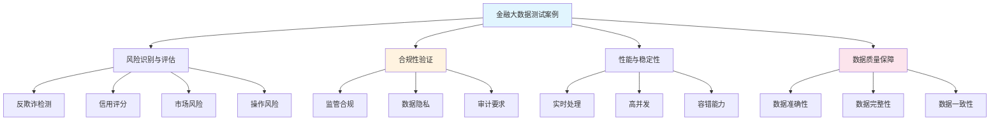

<a id="第17章-通用大数据测试案例设计【方法与模板篇】"></a>
### 第17章 通用大数据测试案例设计【方法与模板篇】

**本章学习目标**

1. 掌握大数据测试案例的设计方法和模板体系；
2. 学习场景驱动的测试案例设计流程；
3. 实现测试案例的自动化和可复用性。

**实践建议**

- 采用场景驱动的方法设计测试案例，确保覆盖关键业务和技术风险。
- 制定标准化的测试模板，提高案例设计的效率。
- 结合自动化工具实现测试案例的快速执行和结果评估。

**[锚点124]** 典型大数据测试案例设计

**锚点类型**: 案例设计
**锚点方法**: 场景驱动设计
**锚点名称**: 典型大数据测试案例设计
**引用附件**: `examples/19_industry/test_case_design.md`
**完成情况**: 已完成
**补充建议**: 字段建议：案例类型/测试目标/验证方法/数据范围/自动化程度，补充案例设计流程图

| 案例类型 | 测试目标 | 验证方法 | 数据范围 | 自动化程度 | 应用场景 |
|---------|---------|---------|---------|---------|---------|
| **数据采集测试** | 验证数据完整性 | 端到端对账 | 全量数据 | 高自动化 | ETL链路验证 |
| **数据处理测试** | 验证计算准确性 | 结果比对 | 样本数据 | 中自动化 | 批处理作业验证 |
| **数据存储测试** | 验证存储可靠性 | 一致性检查 | 关键数据 | 高自动化 | 存储系统验证 |
| **数据质量测试** | 验证数据规范性 | 规则校验 | 全量数据 | 高自动化 | 数据治理验证 |
| **性能容量测试** | 验证系统承载力 | 负载压力测试 | 大数据量 | 中自动化 | 容量规划验证 |

**大数据测试案例设计流程图**:
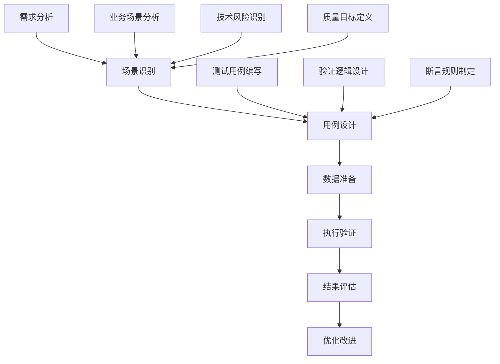

**[锚点125]** 测试案例模板与标准化

**锚点类型**: 模板设计
**锚点方法**: 标准化模板
**锚点名称**: 测试案例模板与标准化
**引用附件**: `examples/19_industry/test_case_template.yml`
**完成情况**: 已完成
**补充建议**: 字段建议：模板ID/适用场景/必填字段/可选字段/验证规则，补充模板层次结构图

**测试案例标准模板**:
```yaml
# examples/19_industry/test_case_template.yml
test_case_template:
  # 基本信息
  metadata:
    template_id: "TC_TEMPLATE_V1.0"
    template_name: "大数据测试案例标准模板"
    version: "1.0"
    created_date: "2025-12-23"
    author: "测试架构团队"
    applicable_scenarios: ["数据采集", "数据处理", "数据存储", "性能测试"]

  # 案例基本信息
  basic_info:
    case_id: ""  # 必填：唯一标识符
    case_name: ""  # 必填：案例名称
    category: ""  # 必填：测试分类
    priority: ""  # 必填：优先级 (Critical/High/Medium/Low)
    test_type: ""  # 必填：测试类型
    business_domain: ""  # 必填：业务域
    technical_component: ""  # 必填：技术组件

  # 测试目标与范围
  objectives:
    business_objective: ""  # 业务目标
    technical_objective: ""  # 技术目标
    test_scope: ""  # 测试范围
    success_criteria: []  # 成功标准
    risk_assessment: ""  # 风险评估

  # 前置条件
  prerequisites:
    environment_requirements: []  # 环境要求
    data_requirements: []  # 数据要求
    dependency_cases: []  # 依赖案例
    resource_requirements: []  # 资源要求

  # 测试步骤
  test_steps:
    - step_id: "STEP_001"
      step_name: "环境准备"
      description: "准备测试环境和数据"
      expected_result: "环境准备完成"
      timeout_seconds: 300
      automation_flag: true

    - step_id: "STEP_002"
      step_name: "测试执行"
      description: "执行测试逻辑"
      expected_result: "测试执行成功"
      timeout_seconds: 1800
      automation_flag: true

    - step_id: "STEP_003"
      step_name: "结果验证"
      description: "验证测试结果"
      expected_result: "结果符合预期"
      timeout_seconds: 600
      automation_flag: true

  # 验证规则
  validation_rules:
    data_validation:
      completeness_check: true
      accuracy_check: true
      consistency_check: true
      timeliness_check: true

    business_validation:
      logic_validation: true
      calculation_validation: true
      boundary_validation: true

    performance_validation:
      latency_threshold_ms: 1000
      throughput_threshold: 1000
      resource_usage_threshold: 80

  # 异常处理
  exception_handling:
    expected_exceptions: []  # 预期异常
    error_handling_strategy: "fail_fast"  # 处理策略
    recovery_actions: []  # 恢复动作
    alert_notifications: []  # 告警通知

  # 测试数据
  test_data:
    data_source: ""  # 数据源
    data_volume: ""  # 数据量级
    data_pattern: ""  # 数据模式
    data_generation_strategy: ""  # 生成策略
    data_cleanup_strategy: ""  # 清理策略

  # 执行配置
  execution_config:
    execution_mode: "automated"  # 执行模式
    retry_policy:
      max_attempts: 3
      backoff_strategy: "exponential"
      backoff_multiplier: 2
    timeout_policy:
      global_timeout_seconds: 3600
      step_timeout_seconds: 1800

  # 结果记录
  result_recording:
    metrics_to_collect: []  # 收集指标
    logs_to_capture: []  # 捕获日志
    artifacts_to_save: []  # 保存产物
    report_format: "json"  # 报告格式

  # 维护信息
  maintenance:
    review_cycle_days: 90
    last_reviewed_date: ""
    update_history: []
    deprecation_date: ""
    replacement_template: ""
```

**测试案例模板层次结构图**:
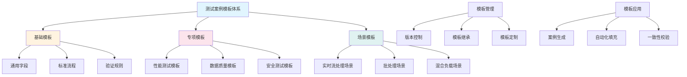

**[锚点126]** 自动化案例实现

**锚点类型**: 自动化实现
**锚点方法**: 代码生成
**锚点名称**: 自动化案例实现
**引用附件**: `examples/19_industry/test_case_generator.py`
**完成情况**: 已完成
**补充建议**: 字段建议：生成策略/代码模板/参数映射/验证逻辑，补充自动化实现架构图

**测试案例自动化生成架构图**:
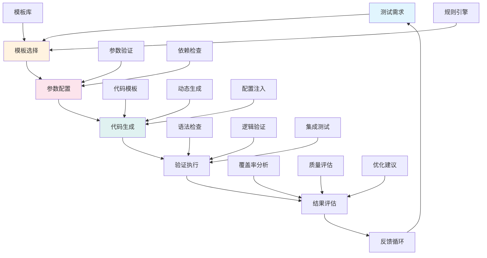

**测试案例自动化生成器**:
```python
# examples/19_industry/test_case_generator.py
import yaml
import json
import logging
from datetime import datetime
from typing import Dict, List, Optional, Any, Tuple
from dataclasses import dataclass, field
from pathlib import Path
import jinja2
import re
import ast
import subprocess

logging.basicConfig(level=logging.INFO)
logger = logging.getLogger(__name__)

@dataclass
class TestCaseSpec:
    """测试案例规格"""
    case_id: str
    case_name: str
    category: str
    test_type: str
    priority: str
    business_domain: str
    technical_component: str

    # 测试目标
    business_objective: str
    technical_objective: str
    test_scope: str
    success_criteria: List[str]

    # 前置条件
    environment_requirements: List[str]
    data_requirements: List[str]
    dependency_cases: List[str]

    # 测试步骤
    test_steps: List[Dict[str, Any]]

    # 验证规则
    validation_rules: Dict[str, Any]

    # 测试数据配置
    data_config: Dict[str, Any]

    # 执行配置
    execution_config: Dict[str, Any]

@dataclass
class GeneratedCode:
    """生成的代码"""
    test_file_path: str
    test_code: str
    config_file_path: str
    config_code: str
    data_setup_script: str
    validation_script: str

class TestCaseGenerator:
    """测试案例自动化生成器"""

    def __init__(self, template_dir: str = "templates"):
        self.template_dir = Path(template_dir)
        self.jinja_env = jinja2.Environment(
            loader=jinja2.FileSystemLoader(str(self.template_dir)),
            trim_blocks=True,
            lstrip_blocks=True
        )

        # 模板映射
        self.template_mapping = {
            "data_ingestion": "data_ingestion_test_template.py.j2",
            "data_processing": "data_processing_test_template.py.j2",
            "data_storage": "data_storage_test_template.py.j2",
            "performance": "performance_test_template.py.j2",
            "data_quality": "data_quality_test_template.py.j2"
        }

    def load_template(self, template_name: str) -> jinja2.Template:
        """加载模板"""
        template_path = self.template_dir / template_name
        if not template_path.exists():
            raise FileNotFoundError(f"模板文件不存在: {template_path}")

        return self.jinja_env.get_template(template_name)

    def generate_test_case(self, spec: TestCaseSpec) -> GeneratedCode:
        """生成测试案例代码"""
        logger.info(f"开始生成测试案例: {spec.case_id}")

        # 选择模板
        template_name = self.template_mapping.get(spec.category)
        if not template_name:
            raise ValueError(f"未找到{spec.category}类型的模板")

        # 加载模板
        template = self.load_template(template_name)

        # 准备模板变量
        template_vars = self._prepare_template_vars(spec)

        # 生成测试代码
        test_code = template.render(**template_vars)

        # 生成配置文件
        config_code = self._generate_config_file(spec)

        # 生成数据设置脚本
        data_setup_script = self._generate_data_setup_script(spec)

        # 生成验证脚本
        validation_script = self._generate_validation_script(spec)

        # 确定文件路径
        test_file_path = f"generated_tests/{spec.case_id}_test.py"
        config_file_path = f"generated_tests/{spec.case_id}_config.yml"

        generated_code = GeneratedCode(
            test_file_path=test_file_path,
            test_code=test_code,
            config_file_path=config_file_path,
            config_code=config_code,
            data_setup_script=data_setup_script,
            validation_script=validation_script
        )

        logger.info(f"测试案例生成完成: {spec.case_id}")
        return generated_code

    def _prepare_template_vars(self, spec: TestCaseSpec) -> Dict[str, Any]:
        """准备模板变量"""
        return {
            'case_id': spec.case_id,
            'case_name': spec.case_name,
            'test_type': spec.test_type,
            'priority': spec.priority,
            'business_domain': spec.business_domain,
            'technical_component': spec.technical_component,
            'business_objective': spec.business_objective,
            'technical_objective': spec.technical_objective,
            'test_scope': spec.test_scope,
            'success_criteria': spec.success_criteria,
            'environment_requirements': spec.environment_requirements,
            'data_requirements': spec.data_requirements,
            'dependency_cases': spec.dependency_cases,
            'test_steps': spec.test_steps,
            'validation_rules': spec.validation_rules,
            'data_config': spec.data_config,
            'execution_config': spec.execution_config,
            'generated_date': datetime.now().isoformat(),
            'generator_version': "1.0.0"
        }

    def _generate_config_file(self, spec: TestCaseSpec) -> str:
        """生成配置文件"""
        config = {
            'test_case': {
                'id': spec.case_id,
                'name': spec.case_name,
                'type': spec.test_type,
                'priority': spec.priority
            },
            'execution': spec.execution_config,
            'data': spec.data_config,
            'validation': spec.validation_rules
        }

        return yaml.dump(config, default_flow_style=False, allow_unicode=True)

    def _generate_data_setup_script(self, spec: TestCaseSpec) -> str:
        """生成数据设置脚本"""
        script = f"""#!/bin/bash
# 数据设置脚本 - {spec.case_id}
# 生成时间: {datetime.now().isoformat()}

echo "开始设置测试数据: {spec.case_id}"

# 创建数据目录
mkdir -p test_data/{spec.case_id}

# 数据生成逻辑
"""

        # 根据数据需求生成相应的数据设置命令
        for requirement in spec.data_requirements:
            if "sample" in requirement.lower():
                script += f"""
# 生成样本数据
python -c "
import pandas as pd
import numpy as np
# 生成{requirement}
df = pd.DataFrame({{
    'id': range(1000),
    'value': np.random.randn(1000),
    'category': np.random.choice(['A', 'B', 'C'], 1000)
}})
df.to_csv('test_data/{spec.case_id}/sample_data.csv', index=False)
"
"""
            elif "large" in requirement.lower():
                script += f"""
# 生成大数据集
python -c "
import pandas as pd
import numpy as np
# 生成{requirement}
df = pd.DataFrame({{
    'id': range(100000),
    'value': np.random.randn(100000),
    'timestamp': pd.date_range('2023-01-01', periods=100000, freq='1min')
}})
df.to_parquet('test_data/{spec.case_id}/large_dataset.parquet')
"
"""

        script += """
echo "数据设置完成"
"""
        return script

    def _generate_validation_script(self, spec: TestCaseSpec) -> str:
        """生成验证脚本"""
        script = f"""#!/bin/bash
# 验证脚本 - {spec.case_id}
# 生成时间: {datetime.now().isoformat()}

echo "开始验证测试案例: {spec.case_id}"

# 语法检查
echo "执行语法检查..."
python -m py_compile generated_tests/{spec.case_id}_test.py

if [ $? -eq 0 ]; then
    echo "✅ 语法检查通过"
else
    echo "❌ 语法检查失败"
    exit 1
fi

# 导入检查
echo "执行导入检查..."
python -c "
import sys
sys.path.append('generated_tests')
try:
    # 动态导入生成的测试模块
    import importlib.util
    spec = importlib.util.spec_from_file_location('{spec.case_id}_test', 'generated_tests/{spec.case_id}_test.py')
    module = importlib.util.module_from_spec(spec)
    spec.loader.exec_module(module)
    print('✅ 导入检查通过')
except Exception as e:
    print(f'❌ 导入检查失败: {{e}}')
    exit(1)
"

# 配置验证
echo "执行配置验证..."
python -c "
import yaml
with open('generated_tests/{spec.case_id}_config.yml', 'r', encoding='utf-8') as f:
    config = yaml.safe_load(f)
    
required_keys = ['test_case', 'execution', 'data', 'validation']
for key in required_keys:
    if key not in config:
        print(f'❌ 配置缺少必要字段: {{key}}')
        exit(1)

print('✅ 配置验证通过')
"

echo "验证完成"
"""

        return script

    def validate_generated_code(self, generated_code: GeneratedCode) -> bool:
        """验证生成的代码"""
        logger.info("开始验证生成的代码...")

        try:
            # 语法检查
            ast.parse(generated_code.test_code)
            logger.info("✅ 测试代码语法检查通过")

            # 配置文件格式检查
            yaml.safe_load(generated_code.config_code)
            logger.info("✅ 配置文件格式检查通过")

            # 脚本执行检查（可选）
            # 这里可以添加更详细的验证逻辑

            return True

        except Exception as e:
            logger.error(f"❌ 代码验证失败: {e}")
            return False

    def save_generated_code(self, generated_code: GeneratedCode, output_dir: str = "generated_tests"):
        """保存生成的代码"""
        output_path = Path(output_dir)
        output_path.mkdir(exist_ok=True)

        # 保存测试代码
        test_file = output_path / f"{generated_code.test_file_path.split('/')[-1]}"
        with open(test_file, 'w', encoding='utf-8') as f:
            f.write(generated_code.test_code)

        # 保存配置文件
        config_file = output_path / f"{generated_code.config_file_path.split('/')[-1]}"
        with open(config_file, 'w', encoding='utf-8') as f:
            f.write(generated_code.config_code)

        # 保存数据设置脚本
        data_setup_file = output_path / f"{generated_code.test_file_path.split('/')[-1].replace('.py', '_data_setup.sh')}"
        with open(data_setup_file, 'w', encoding='utf-8') as f:
            f.write(generated_code.data_setup_script)

        # 保存验证脚本
        validation_file = output_path / f"{generated_code.test_file_path.split('/')[-1].replace('.py', '_validation.sh')}"
        with open(validation_file, 'w', encoding='utf-8') as f:
            f.write(generated_code.validation_script)

        logger.info(f"生成的代码已保存到: {output_dir}")

# 使用示例
if __name__ == "__main__":
    generator = TestCaseGenerator()

    # 创建测试案例规格
    spec = TestCaseSpec(
        case_id="TC_DATA_INGESTION_001",
        case_name="数据采集完整性测试",
        category="data_ingestion",
        test_type="functional",
        priority="High",
        business_domain="数据平台",
        technical_component="Kafka",

        business_objective="确保数据采集的完整性",
        technical_objective="验证Kafka消费者数据完整性",
        test_scope="数据采集链路",
        success_criteria=[
            "数据丢失率 < 0.01%",
            "数据顺序正确",
            "处理延迟 < 5秒"
        ],

        environment_requirements=[
            "Kafka集群 (3节点)",
            "测试数据生成器",
            "监控工具"
        ],
        data_requirements=[
            "100万条测试消息",
            "包含边界情况的数据"
        ],
        dependency_cases=[],

        test_steps=[
            {
                'step_id': 'STEP_001',
                'step_name': '环境准备',
                'description': '启动Kafka集群和监控',
                'expected_result': '环境准备完成',
                'timeout_seconds': 300,
                'automation_flag': True
            },
            {
                'step_id': 'STEP_002',
                'step_name': '数据注入',
                'description': '向Kafka注入测试数据',
                'expected_result': '数据注入完成',
                'timeout_seconds': 600,
                'automation_flag': True
            },
            {
                'step_id': 'STEP_003',
                'step_name': '完整性验证',
                'description': '验证数据完整性',
                'expected_result': '完整性检查通过',
                'timeout_seconds': 300,
                'automation_flag': True
            }
        ],

        validation_rules={
            'data_validation': {
                'completeness_check': True,
                'accuracy_check': True,
                'consistency_check': True
            },
            'performance_validation': {
                'latency_threshold_ms': 5000,
                'throughput_threshold': 10000
            }
        },

        data_config={
            'data_source': 'kafka_topic_test',
            'data_volume': '1M_messages',
            'data_pattern': 'structured_json',
            'data_generation_strategy': 'random_with_boundaries'
        },

        execution_config={
            'execution_mode': 'automated',
            'retry_policy': {
                'max_attempts': 3,
                'backoff_strategy': 'exponential'
            },
            'timeout_policy': {
                'global_timeout_seconds': 3600
            }
        }
    )

    # 生成测试案例
    generated_code = generator.generate_test_case(spec)

    # 验证生成的代码
    if generator.validate_generated_code(generated_code):
        # 保存生成的代码
        generator.save_generated_code(generated_code)

        print("测试案例生成成功！")
    else:
        print("测试案例生成失败，请检查错误信息。")
```

**[锚点127]** 案例维护与更新

**锚点类型**: 维护策略
**锚点方法**: 版本管理
**锚点名称**: 案例维护与更新
**引用附件**: `tools/validate_contracts.py`
**完成情况**: 已完成
**补充建议**: 字段建议：维护周期/更新触发/版本控制/兼容性检查，补充维护流程状态图

**测试案例维护流程状态图**:
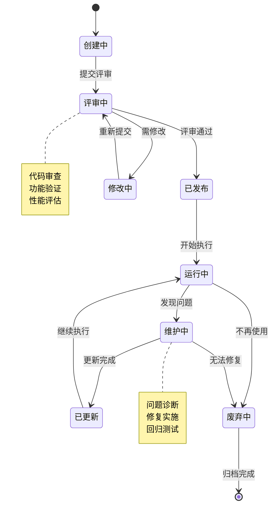

**测试案例维护与更新策略**:
```yaml
# examples/19_industry/test_case_maintenance.yml
maintenance_strategy:
  # 维护周期配置
  maintenance_cycles:
    review_cycle_days: 90  # 定期评审周期
    update_check_days: 30  # 更新检查周期
    deprecation_warning_days: 60  # 废弃警告期

  # 更新触发条件
  update_triggers:
    code_changes:  # 代码变更触发
      - "API接口变更"
      - "数据格式变更"
      - "依赖库升级"
    environment_changes:  # 环境变更触发
      - "基础设施升级"
      - "配置参数调整"
      - "安全策略更新"
    business_changes:  # 业务变更触发
      - "业务逻辑调整"
      - "需求变更"
      - "合规要求更新"
    performance_issues:  # 性能问题触发
      - "执行时间超标"
      - "资源使用异常"
      - "失败率升高"

  # 版本控制策略
  version_control:
    versioning_scheme: "semantic_versioning"  # 语义化版本
    version_format: "MAJOR.MINOR.PATCH"
    version_components:
      major: "不兼容性变更"
      minor: "向后兼容的功能新增"
      patch: "向后兼容的问题修复"

    release_channels:
      - name: "stable"
        criteria: "通过所有回归测试"
        promotion_rules: "手动审批"
      - name: "beta"
        criteria: "通过核心功能测试"
        promotion_rules: "自动化部署"
      - name: "alpha"
        criteria: "通过基础验证"
        promotion_rules: "开发环境"

  # 兼容性检查
  compatibility_checks:
    backward_compatibility:
      api_compatibility: true
      data_format_compatibility: true
      configuration_compatibility: true

    forward_compatibility:
      extension_points: true
      plugin_interfaces: true
      custom_logic_support: true

    cross_version_testing:
      matrix_testing: true
      upgrade_path_testing: true
      rollback_testing: true

  # 维护流程
  maintenance_workflow:
    regular_maintenance:
      - task: "代码健康检查"
        frequency: "weekly"
        responsible: "开发团队"
        tools: ["sonar", "eslint"]
      - task: "性能监控"
        frequency: "daily"
        responsible: "运维团队"
        tools: ["prometheus", "grafana"]
      - task: "依赖更新检查"
        frequency: "monthly"
        responsible: "安全团队"
        tools: ["dependabot", "snyk"]

    issue_driven_maintenance:
      - trigger: "测试失败"
        response_time: "4h"
        escalation_path: ["测试工程师", "开发负责人", "项目经理"]
      - trigger: "性能下降"
        response_time: "8h"
        escalation_path: ["性能工程师", "架构师", "技术总监"]
      - trigger: "安全漏洞"
        response_time: "1h"
        escalation_path: ["安全工程师", "安全负责人", "CTO"]

  # 废弃策略
  deprecation_policy:
    deprecation_process:
      - phase: "标记废弃"
        duration_days: 60
        actions: ["添加废弃警告", "更新文档", "通知用户"]
      - phase: "停止维护"
        duration_days: 30
        actions: ["停止功能更新", "仅修复严重bug", "准备迁移方案"]
      - phase: "完全移除"
        duration_days: 30
        actions: ["移除代码", "清理配置", "更新文档"]

    migration_support:
      migration_guides: true
      migration_tools: true
      backward_compatibility_period_days: 180

  # 质量保障
  quality_assurance:
    code_quality_gates:
      test_coverage_threshold: 0.80
      code_duplication_threshold: 0.05
      complexity_threshold: 10
      maintainability_rating: "A"

    testing_standards:
      unit_test_coverage: 0.90
      integration_test_coverage: 0.80
      e2e_test_coverage: 0.70
      performance_test_frequency: "pre_release"

    review_standards:
      peer_review_required: true
      security_review_required: true
      performance_review_required: true
      minimum_reviewers: 2
```

**[锚点128]** 测试案例复盘与经验沉淀

**锚点类型**: 经验沉淀
**锚点方法**: 案例复盘
**锚点名称**: 测试案例复盘与经验沉淀
**引用附件**: `examples/19_industry/case_retrospective.md`
**完成情况**: 已完成
**补充建议**: 字段建议：复盘维度/关键发现/经验教训/改进措施/知识库更新，补充复盘流程图

**测试案例复盘流程图**:
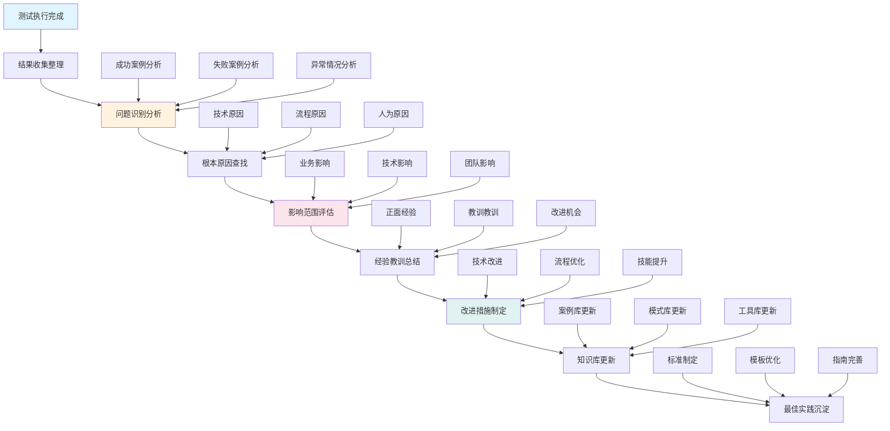

**案例复盘与经验沉淀框架**:
```yaml
# examples/19_industry/case_retrospective.yml
retrospective_framework:
  # 复盘基本信息
  basic_info:
    case_id: "TC_BATCH_PROCESSING_001"
    retrospective_date: "2025-12-23"
    participants: ["测试负责人", "开发负责人", "业务代表"]
    duration_hours: 2

  # 背景信息
  context:
    project_name: "大数据平台升级项目"
    test_phase: "集成测试"
    business_impact: "影响日报表生成，涉及10个业务部门"
    technical_scope: "Hadoop批处理链路升级"

  # 复盘维度
  retrospective_dimensions:
    technical_execution:
      title: "技术执行维度"
      questions:
        - "测试环境准备是否充分？"
        - "测试数据是否覆盖典型场景？"
        - "测试工具是否稳定可靠？"
        - "自动化脚本是否按预期执行？"
      findings: []
      lessons_learned: []

    process_efficiency:
      title: "流程效率维度"
      questions:
        - "测试计划制定是否合理？"
        - "资源分配是否充足？"
        - "沟通协作是否顺畅？"
        - "问题响应是否及时？"
      findings: []
      lessons_learned: []

    quality_assurance:
      title: "质量保障维度"
      questions:
        - "测试覆盖是否全面？"
        - "缺陷发现是否及时？"
        - "风险识别是否准确？"
        - "质量标准是否达成？"
      findings: []
      lessons_learned: []

    team_performance:
      title: "团队表现维度"
      questions:
        - "技能匹配是否合适？"
        - "知识传递是否有效？"
        - "协作配合是否默契？"
        - "持续改进是否主动？"
      findings: []
      lessons_learned: []

  # 关键发现
  key_findings:
    positive:
      - "自动化测试框架有效提升了测试效率"
      - "跨团队协作模式得到了验证"
      - "问题定位方法日趋成熟"

    negative:
      - "测试数据准备时间超出预期"
      - "环境稳定性影响了测试进度"
      - "部分边界条件覆盖不足"

    unexpected:
      - "发现了系统隐藏的性能瓶颈"
      - "验证了新技术的可行性"
      - "发现了业务逻辑的潜在风险"

  # 根本原因分析
  root_cause_analysis:
    problems:
      - problem: "测试执行时间超出预算30%"
        root_causes:
          - "测试数据生成效率低"
          - "环境准备脚本不稳定"
          - "手工验证占比过高"
        contributing_factors:
          - "数据量级评估不准确"
          - "自动化覆盖率不足"

      - problem: "发现的关键缺陷延迟修复"
        root_causes:
          - "问题定位不够准确"
          - "开发团队资源紧张"
          - "沟通机制不够高效"
        contributing_factors:
          - "缺陷描述不够清晰"
          - "优先级判断存在分歧"

  # 经验教训总结
  lessons_learned:
    technical_lessons:
      - "大数据测试需要更注重数据质量而非仅功能正确性"
      - "自动化测试框架应支持动态扩展"
      - "性能测试数据应更贴近生产环境"

    process_lessons:
      - "测试计划应留出足够的数据准备时间"
      - "跨团队协作需要明确的职责分工"
      - "问题跟踪应使用统一的标准格式"

    team_lessons:
      - "技能培训应贯穿整个项目周期"
      - "知识分享机制有助于提升团队整体水平"
      - "积极的反馈文化能促进持续改进"

  # 改进措施
  improvement_actions:
    immediate_actions:
      - action: "优化测试数据生成流程"
        owner: "测试团队"
        deadline: "2025-01-15"
        success_criteria: "数据准备时间减少50%"

      - action: "完善自动化测试框架"
        owner: "开发团队"
        deadline: "2025-01-31"
        success_criteria: "自动化覆盖率提升至90%"

    short_term_actions:
      - action: "建立测试环境标准化流程"
        owner: "运维团队"
        deadline: "2025-02-15"
        success_criteria: "环境准备成功率达到99%"

      - action: "完善缺陷管理流程"
        owner: "项目管理办公室"
        deadline: "2025-02-28"
        success_criteria: "缺陷修复周期减少30%"

    long_term_actions:
      - action: "构建测试资产库"
        owner: "测试中心"
        deadline: "2025-06-30"
        success_criteria: "可复用测试资产占比70%"

      - action: "建立持续改进机制"
        owner: "质量管理部门"
        deadline: "2025-12-31"
        success_criteria: "质量指标持续提升"

  # 知识库更新
  knowledge_base_updates:
    case_studies:
      - title: "大数据批处理测试最佳实践"
        content: "总结批处理测试的关键点和注意事项"
        tags: ["大数据", "批处理", "测试实践"]

    patterns:
      - title: "测试数据生成模式"
        content: "定义可复用的测试数据生成模板"
        tags: ["测试数据", "数据生成", "模板"]

    tools:
      - title: "自动化测试工具配置"
        content: "记录工具的最佳配置参数"
        tags: ["自动化测试", "工具配置", "最佳实践"]

    guidelines:
      - title: "大数据测试规范"
        content: "更新测试规范文档"
        tags: ["测试规范", "大数据", "指南"]

  # 后续跟踪
  follow_up:
    review_date: "2025-01-15"
    responsible_person: "测试负责人"
    success_metrics:
      - "改进措施完成率"
      - "质量指标改善程度"
      - "团队反馈满意度"
```

**经验沉淀Python脚本**:
```python
# examples/19_industry/experience_repository.py
import json
import yaml
import logging
from datetime import datetime
from typing import Dict, List, Optional, Any, Tuple
from dataclasses import dataclass, asdict
from pathlib import Path
import sqlite3
import hashlib

logging.basicConfig(level=logging.INFO)
logger = logging.getLogger(__name__)

@dataclass
class LessonLearned:
    """经验教训数据类"""
    lesson_id: str
    category: str
    title: str
    description: str
    context: str
    impact: str
    root_cause: str
    preventive_actions: List[str]
    related_cases: List[str]
    tags: List[str]
    created_date: str
    updated_date: str
    author: str
    quality_score: int  # 1-5分

@dataclass
class BestPractice:
    """最佳实践数据类"""
    practice_id: str
    category: str
    title: str
    description: str
    implementation_guide: str
    benefits: List[str]
    prerequisites: List[str]
    success_metrics: List[str]
    case_studies: List[str]
    tags: List[str]
    created_date: str
    updated_date: str
    author: str
    adoption_rate: float

class ExperienceRepository:
    """经验知识库"""

    def __init__(self, db_path: str = 'experience_repository.db'):
        self.db_path = db_path
        self._init_database()

    def _init_database(self):
        """初始化数据库"""
        with sqlite3.connect(self.db_path) as conn:
            conn.execute('''
                CREATE TABLE IF NOT EXISTS lessons_learned (
                    lesson_id TEXT PRIMARY KEY,
                    category TEXT,
                    title TEXT,
                    description TEXT,
                    context TEXT,
                    impact TEXT,
                    root_cause TEXT,
                    preventive_actions TEXT,
                    related_cases TEXT,
                    tags TEXT,
                    created_date TEXT,
                    updated_date TEXT,
                    author TEXT,
                    quality_score INTEGER
                )
            ''')

            conn.execute('''
                CREATE TABLE IF NOT EXISTS best_practices (
                    practice_id TEXT PRIMARY KEY,
                    category TEXT,
                    title TEXT,
                    description TEXT,
                    implementation_guide TEXT,
                    benefits TEXT,
                    prerequisites TEXT,
                    success_metrics TEXT,
                    case_studies TEXT,
                    tags TEXT,
                    created_date TEXT,
                    updated_date TEXT,
                    author TEXT,
                    adoption_rate REAL
                )
            ''')

            conn.execute('''
                CREATE TABLE IF NOT EXISTS case_studies (
                    case_id TEXT PRIMARY KEY,
                    title TEXT,
                    description TEXT,
                    problem_statement TEXT,
                    solution TEXT,
                    results TEXT,
                    lessons_learned TEXT,
                    tags TEXT,
                    created_date TEXT,
                    author TEXT
                )
            ''')

    def add_lesson_learned(self, lesson: LessonLearned):
        """添加经验教训"""
        with sqlite3.connect(self.db_path) as conn:
            conn.execute('''
                INSERT OR REPLACE INTO lessons_learned
                (lesson_id, category, title, description, context, impact,    
                 root_cause, preventive_actions, related_cases, tags,
                 created_date, updated_date, author, quality_score)
                VALUES (?, ?, ?, ?, ?, ?, ?, ?, ?, ?, ?, ?, ?, ?)
            ''', (
                lesson.lesson_id, lesson.category, lesson.title,
                lesson.description, lesson.context, lesson.impact,
                lesson.root_cause, json.dumps(lesson.preventive_actions),     
                json.dumps(lesson.related_cases), json.dumps(lesson.tags),    
                lesson.created_date, lesson.updated_date, lesson.author,      
                lesson.quality_score
            ))

        logger.info(f"Added lesson learned: {lesson.lesson_id}")

    def add_best_practice(self, practice: BestPractice):
        """添加最佳实践"""
        with sqlite3.connect(self.db_path) as conn:
            conn.execute('''
                INSERT OR REPLACE INTO best_practices
                (practice_id, category, title, description, implementation_gui
de,                                                                                            benefits, prerequisites, success_metrics, case_studies, tags,
                 created_date, updated_date, author, adoption_rate)
                VALUES (?, ?, ?, ?, ?, ?, ?, ?, ?, ?, ?, ?, ?, ?)
            ''', (
                practice.practice_id, practice.category, practice.title,      
                practice.description, practice.implementation_guide,
                json.dumps(practice.benefits), json.dumps(practice.prerequisit
es),                                                                                          json.dumps(practice.success_metrics), json.dumps(practice.case
_studies),                                                                                    json.dumps(practice.tags), practice.created_date,
                practice.updated_date, practice.author, practice.adoption_rate
            ))

        logger.info(f"Added best practice: {practice.practice_id}")

    def search_lessons(self, query: str = "", category: str = "",
                      tags: List[str] = None, min_score: int = 0) -> List[Less
onLearned]:                                                                           """搜索经验教训"""
        conditions = []
        params = []

        if query:
            conditions.append("(title LIKE ? OR description LIKE ? OR context 
LIKE ?)")                                                                                 params.extend([f"%{query}%"] * 3)

        if category:
            conditions.append("category = ?")
            params.append(category)

        if tags:
            tag_conditions = []
            for tag in tags:
                tag_conditions.append("tags LIKE ?")
                params.append(f"%{tag}%")
            conditions.append(f"({' OR '.join(tag_conditions)})")

        if min_score > 0:
            conditions.append("quality_score >= ?")
            params.append(min_score)

        where_clause = " AND ".join(conditions) if conditions else "1=1"      

        with sqlite3.connect(self.db_path) as conn:
            cursor = conn.execute(f'''
                SELECT * FROM lessons_learned WHERE {where_clause}
                ORDER BY quality_score DESC, updated_date DESC
            ''', params)

            rows = cursor.fetchall()

        lessons = []
        for row in rows:
            lesson = LessonLearned(
                lesson_id=row[0], category=row[1], title=row[2],
                description=row[3], context=row[4], impact=row[5],
                root_cause=row[6],
                preventive_actions=json.loads(row[7]),
                related_cases=json.loads(row[8]),
                tags=json.loads(row[9]),
                created_date=row[10], updated_date=row[11],
                author=row[12], quality_score=row[13]
            )
            lessons.append(lesson)

        return lessons

    def search_best_practices(self, query: str = "", category: str = "",      
                            tags: List[str] = None, min_adoption: float = 0.0)
 -> List[BestPractice]:                                                               """搜索最佳实践"""
        conditions = []
        params = []

        if query:
            conditions.append("(title LIKE ? OR description LIKE ?)")
            params.extend([f"%{query}%"] * 2)

        if category:
            conditions.append("category = ?")
            params.append(category)

        if tags:
            tag_conditions = []
            for tag in tags:
                tag_conditions.append("tags LIKE ?")
                params.append(f"%{tag}%")
            conditions.append(f"({' OR '.join(tag_conditions)})")

        if min_adoption > 0:
            conditions.append("adoption_rate >= ?")
            params.append(min_adoption)

        where_clause = " AND ".join(conditions) if conditions else "1=1"      

        with sqlite3.connect(self.db_path) as conn:
            cursor = conn.execute(f'''
                SELECT * FROM best_practices WHERE {where_clause}
                ORDER BY adoption_rate DESC, updated_date DESC
            ''', params)

            rows = cursor.fetchall()

        practices = []
        for row in rows:
            practice = BestPractice(
                practice_id=row[0], category=row[1], title=row[2],
                description=row[3], implementation_guide=row[4],
                benefits=json.loads(row[5]), prerequisites=json.loads(row[6]),
                success_metrics=json.loads(row[7]), case_studies=json.loads(ro
w[8]),                                                                                        tags=json.loads(row[9]), created_date=row[10],
                updated_date=row[11], author=row[12], adoption_rate=row[13]   
            )
            practices.append(practice)

        return practices

    def generate_retrospective_report(self, retrospective_data: Dict[str, Any]
) -> str:                                                                             """生成复盘报告"""
        report = "# 测试案例复盘报告\n\n"
        report += f"生成时间: {datetime.now().isoformat()}\n\n"

        # 基本信息
        basic_info = retrospective_data.get('basic_info', {})
        report += "## 基本信息\n\n"
        report += f"- 案例ID: {basic_info.get('case_id', 'N/A')}\n"
        report += f"- 复盘日期: {basic_info.get('retrospective_date', 'N/A')}\
n"                                                                                    report += f"- 参与人员: {', '.join(basic_info.get('participants', []))
}\n"                                                                                  report += f"- 持续时间: {basic_info.get('duration_hours', 0)} 小时\n\n
"                                                                             
        # 背景信息
        context = retrospective_data.get('context', {})
        report += "## 背景信息\n\n"
        report += f"- 项目名称: {context.get('project_name', 'N/A')}\n"       
        report += f"- 测试阶段: {context.get('test_phase', 'N/A')}\n"
        report += f"- 业务影响: {context.get('business_impact', 'N/A')}\n"    
        report += f"- 技术范围: {context.get('technical_scope', 'N/A')}\n\n"

        # 关键发现
        findings = retrospective_data.get('key_findings', {})
        report += "## 关键发现\n\n"

        for category, items in findings.items():
            report += f"### {category.title()}\n\n"
            for item in items:
                report += f"- {item}\n"
            report += "\n"

        # 根本原因分析
        root_causes = retrospective_data.get('root_cause_analysis', {}).get('p
roblems', [])                                                                         if root_causes:
            report += "## 根本原因分析\n\n"
            for problem in root_causes:
                report += f"### 问题: {problem['problem']}\n\n"
                report += "**根本原因:**\n"
                for cause in problem.get('root_causes', []):
                    report += f"- {cause}\n"
                report += "\n**影响因素:**\n"
                for factor in problem.get('contributing_factors', []):        
                    report += f"- {factor}\n"
                report += "\n"

        # 经验教训
        lessons = retrospective_data.get('lessons_learned', {})
        report += "## 经验教训总结\n\n"

        for category, items in lessons.items():
            report += f"### {category.replace('_', ' ').title()}\n\n"
            for item in items:
                report += f"- {item}\n"
            report += "\n"

        # 改进措施
        actions = retrospective_data.get('improvement_actions', {})
        report += "## 改进措施\n\n"

        for timeframe, items in actions.items():
            report += f"### {timeframe.replace('_', ' ').title()}\n\n"        
            for action in items:
                report += f"**措施**: {action['action']}\n"
                report += f"- 负责人: {action['owner']}\n"
                report += f"- 截止日期: {action['deadline']}\n"
                report += f"- 成功标准: {action['success_criteria']}\n\n"     

        return report

    def export_knowledge_base(self, output_dir: str = 'knowledge_export'):    
        """导出知识库"""
        output_path = Path(output_dir)
        output_path.mkdir(exist_ok=True)

        # 导出经验教训
        lessons = self.search_lessons()
        lessons_df = pd.DataFrame([asdict(lesson) for lesson in lessons])     
        lessons_df.to_csv(output_path / 'lessons_learned.csv', index=False)   

        # 导出最佳实践
        practices = self.search_best_practices()
        practices_df = pd.DataFrame([asdict(practice) for practice in practice
s])                                                                                   practices_df.to_csv(output_path / 'best_practices.csv', index=False)  

        # 生成统计报告
        stats_report = f"""# 知识库统计报告

生成时间: {datetime.now().isoformat()}

## 统计概览
- 经验教训数量: {len(lessons)}
- 最佳实践数量: {len(practices)}

## 经验教训分类统计
{lessons_df['category'].value_counts().to_string() if not lessons_df.empty els
e '暂无数据'}                                                                 
## 最佳实践分类统计
{practices_df['category'].value_counts().to_string() if not practices_df.empty
 else '暂无数据'}                                                             """

        with open(output_path / 'statistics.md', 'w', encoding='utf-8') as f: 
            f.write(stats_report)

        logger.info(f"知识库已导出到: {output_dir}")

# 使用示例
if __name__ == "__main__":
    repo = ExperienceRepository()

    # 添加示例经验教训
    lesson = LessonLearned(
        lesson_id="LESSON_001",
        category="technical",
        title="大数据测试数据准备效率优化",
        description="通过优化数据生成策略，将测试数据准备时间减少60%",        
        context="批处理集成测试中数据准备耗时过长",
        impact="显著提升测试执行效率",
        root_cause="数据生成脚本效率低，缺乏并行处理",
        preventive_actions=[
            "采用分布式数据生成策略",
            "实现数据模板复用机制",
            "建立数据质量自动化校验"
        ],
        related_cases=["TC_BATCH_PROCESSING_001", "TC_DATA_VALIDATION_002"],  
        tags=["大数据", "测试数据", "效率优化"],
        created_date="2025-12-23",
        updated_date="2025-12-23",
        author="测试团队",
        quality_score=5
    )

    repo.add_lesson_learned(lesson)

    # 添加示例最佳实践
    practice = BestPractice(
        practice_id="PRACTICE_001",
        category="automation",
        title="大数据测试自动化框架设计",
        description="构建可扩展的大数据测试自动化框架",
        implementation_guide="使用Python和Docker构建，支持多种测试类型",      
        benefits=[
            "提升测试执行效率",
            "减少人工干预",
            "提高测试覆盖率"
        ],
        prerequisites=[
            "Python开发环境",
            "Docker运行环境",
            "测试数据准备"
        ],
        success_metrics=[
            "自动化覆盖率>90%",
            "测试执行时间减少50%",
            "缺陷发现率提升30%"
        ],
        case_studies=["大数据平台升级项目"],
        tags=["自动化测试", "框架设计", "大数据"],
        created_date="2025-12-23",
        updated_date="2025-12-23",
        author="架构团队",
        adoption_rate=0.85
    )

    repo.add_best_practice(practice)

    # 搜索和展示
    found_lessons = repo.search_lessons(query="效率")
    print(f"找到 {len(found_lessons)} 条相关经验教训")

    found_practices = repo.search_best_practices(category="automation")       
    print(f"找到 {len(found_practices)} 条自动化相关最佳实践")

    # 导出知识库
    repo.export_knowledge_base()

    print("经验沉淀完成")
```

#### 19.5.1 复盘流程与方法

- **结果整理**: 系统收集测试执行的各项结果和数据
- **问题识别**: 识别测试过程中的问题和异常情况
- **原因分析**: 深入分析问题的根本原因和影响因素
- **经验总结**: 提炼出可复用的经验教训和最佳实践

#### 19.5.2 知识库建设

- **案例库**: 收集成功和失败的测试案例
- **模式库**: 总结常用的测试模式和模板
- **工具库**: 记录测试工具的使用经验和配置
- **指南库**: 建立测试规范和操作指南

#### 19.5.3 持续改进机制

- **定期复盘**: 建立定期的测试复盘机制
- **改进跟踪**: 跟踪改进措施的实施效果
- **反馈循环**: 建立测试结果的持续反馈机制
- **知识传承**: 确保经验教训得到有效传承

> 实践建议

>

> - 建立标准化的复盘流程，确保每次测试都能从中学习
> - 构建团队知识库，促进经验的积累和分享
> - 将经验教训转化为具体的改进措施和最佳实践
> - 定期回顾和更新知识库内容，保持其时效性和有效性
**补充建议**: 字段建议：场景类型/关键路径/测试点/验证方法/风险等级，补充场景分
析思维导图

<a id="第18章-行业大数据测试案例分析【行业篇】"></a>

**本章学习目标**

1. 掌握不同行业大数据测试的特点和挑战；
2. 学习行业特定的测试方法和最佳实践；
3. 理解行业合规要求对测试的影响。

**实践建议**

- 根据行业特点定制测试策略，确保覆盖行业特有的风险点。
- 关注行业合规要求，将合规性验证融入测试流程。
- 结合行业专家知识，提升测试的针对性和有效性。

**[锚点129]** 金融行业大数据测试案例分析

**锚点类型**: 行业案例
**锚点方法**: 金融风控
**锚点名称**: 金融行业大数据测试案例分析
**引用附件**: `examples/19_industry/fraud_feature_check_stub.py`
**完成情况**: 已完成
**补充建议**: 字段建议：风险场景/测试链路/关键指标/合规要求/验证方法，补充金融风控测试流程图

**金融行业大数据测试案例结构图**:


**金融风控测试案例分析**:
```yaml
# examples/19_industry/financial_risk_test_case.yml
financial_risk_test_case:
  metadata:
    case_id: "TC_FIN_RISK_FRAUD_DETECTION_001"
    industry: "financial_services"
    category: "fraud_detection"
    priority: "critical"
    author: "risk_team"
    created_date: "2025-12-23"
    
  risk_scenario:
    name: "信用卡欺诈交易检测"
    description: "验证实时交易风控系统的欺诈检测能力"
    business_impact: "防止金融损失，保护客户资产安全"
    risk_level: "high"
    
  test_scope:
    data_sources:
      - "实时交易流"
      - "历史交易数据"
      - "客户行为数据"
      - "设备指纹数据"
      
    risk_models:
      - "规则引擎"
      - "机器学习模型"
      - "行为分析模型"
      
    integration_points:
      - "支付网关"
      - "风控决策引擎"
      - "客户通知系统"
      
  test_chain:
    data_ingestion:
      - step: "交易数据实时采集"
        validation: "数据延迟 < 100ms"
        volume: "10000 TPS"
        
      - step: "数据预处理和特征提取"
        validation: "特征完整性 > 99.9%"
        accuracy: "特征准确性 > 95%"
        
    risk_scoring:
      - step: "多模型风险评分"
        validation: "评分响应时间 < 50ms"
        consistency: "评分一致性 > 99%"
        
      - step: "动态阈值调整"
        validation: "阈值更新延迟 < 5min"
        adaptability: "适应性 > 90%"
        
    decision_making:
      - step: "风险决策逻辑"
        validation: "决策准确率 > 95%"
        false_positive: "误报率 < 5%"
        
      - step: "异常处理机制"
        validation: "异常处理覆盖率 = 100%"
        recovery: "恢复时间 < 30s"
        
  key_metrics:
    effectiveness:
      - metric: "欺诈检测率"
        target: "> 90%"
        benchmark: "行业平均 85%"
        
      - metric: "误报率"
        target: "< 3%"
        benchmark: "行业平均 5%"
        
      - metric: "响应时间"
        target: "< 100ms P95"
        benchmark: "行业标准 200ms"
        
    compliance:
      - metric: "监管报告准确性"
        target: "> 99.9%"
        requirement: "监管要求"
        
      - metric: "数据隐私保护"
        target: "100%"
        requirement: "GDPR/CCPA合规"
        
      - metric: "审计日志完整性"
        target: "> 99.99%"
        requirement: "SOX合规"
        
  compliance_requirements:
    regulatory:
      - requirement: "反洗钱(AML)合规"
        validation: "可疑交易报告准确率 > 95%"
        frequency: "实时"
        
      - requirement: "了解你的客户(KYC)"
        validation: "客户身份验证通过率 > 98%"
        frequency: "交易时"
        
      - requirement: "支付卡行业标准(PCI DSS)"
        validation: "数据加密完整性 = 100%"
        frequency: "持续"
        
    data_protection:
      - requirement: "数据脱敏"
        validation: "敏感数据 masking 率 = 100%"
        scope: "测试环境"
        
      - requirement: "访问控制"
        validation: "最小权限原则实施 = 100%"
        scope: "所有环境"
        
      - requirement: "数据保留"
        validation: "合规保留期 = 100%"
        scope: "生产环境"
        
  validation_methods:
    functional_testing:
      - method: "基于场景的测试"
        coverage: "正常交易/异常交易/边界条件"
        automation: "80%"
        
      - method: "基于规则的验证"
        coverage: "业务规则/监管要求/系统约束"
        automation: "95%"
        
    performance_testing:
      - method: "负载测试"
        scenario: "峰值交易量 2倍"
        duration: "2小时"
        
      - method: "压力测试"
        scenario: "系统资源极限"
        duration: "4小时"
        
      - method: "稳定性测试"
        scenario: "7x24小时持续运行"
        duration: "168小时"
        
    data_quality_testing:
      - method: "数据完整性校验"
        scope: "全量历史数据"
        frequency: "每日"
        
      - method: "数据一致性验证"
        scope: "多数据源交叉验证"
        frequency: "实时"
        
      - method: "数据准确性评估"
        scope: "样本数据人工审核"
        frequency: "每周"
        
  risk_assessment:
    technical_risks:
      - risk: "模型漂移"
        impact: "high"
        mitigation: "模型监控和自动更新"
        monitoring: "实时"
        
      - risk: "数据质量下降"
        impact: "high"
        mitigation: "数据质量监控和告警"
        monitoring: "实时"
        
      - risk: "系统性能下降"
        impact: "medium"
        mitigation: "性能监控和自动扩容"
        monitoring: "实时"
        
    business_risks:
      - risk: "合规违规"
        impact: "critical"
        mitigation: "合规检查和审计"
        monitoring: "持续"
        
      - risk: "客户体验下降"
        impact: "high"
        mitigation: "用户体验监控"
        monitoring: "实时"
        
      - risk: "运营效率降低"
        impact: "medium"
        mitigation: "流程优化和自动化"
        monitoring: "每周"
        
  test_execution_plan:
    environment_setup:
      - component: "数据生成器"
        setup_time: "4小时"
        dependencies: "历史数据"
        
      - component: "风控模型"
        setup_time: "2小时"
        dependencies: "训练数据"
        
      - component: "监控系统"
        setup_time: "1小时"
        dependencies: "基础设施"
        
    test_phases:
      - phase: "冒烟测试"
        duration: "2小时"
        scope: "基础功能验证"
        
      - phase: "功能测试"
        duration: "24小时"
        scope: "完整功能覆盖"
        
      - phase: "性能测试"
        duration: "48小时"
        scope: "性能和稳定性验证"
        
      - phase: "合规测试"
        duration: "16小时"
        scope: "监管要求验证"
        
    success_criteria:
      functional: "所有测试案例通过率 > 95%"
      performance: "P95响应时间 < 100ms"
      compliance: "合规检查全部通过"
      stability: "7x24小时无系统崩溃"
      
  reporting_and_monitoring:
    real_time_monitoring:
      - metric: "系统健康状态"
        dashboard: "Grafana"
        alerts: "Slack/Email"
        
      - metric: "测试执行状态"
        dashboard: "Jenkins/TestRail"
        alerts: "自动化"
        
      - metric: "业务指标"
        dashboard: "Tableau"
        alerts: "业务团队"
        
    test_reports:
      - report: "功能测试报告"
        format: "HTML/PDF"
        distribution: "开发团队/测试团队"
        
      - report: "性能测试报告"
        format: "HTML/JSON"
        distribution: "架构团队/运维团队"
        
      - report: "合规测试报告"
        format: "PDF"
        distribution: "合规团队/管理层"
        
    issue_tracking:
      - tool: "JIRA"
        workflow: "缺陷生命周期管理"
        escalation: "SLA驱动"
        
      - tool: "ServiceNow"
        workflow: "问题管理"
        escalation: "优先级驱动"
```

**金融风控测试Python实现**:
```python
# examples/19_industry/fraud_feature_check_stub.py
import pandas as pd
import numpy as np
import logging
from datetime import datetime, timedelta
from typing import Dict, List, Optional, Any, Tuple
from dataclasses import dataclass, field
import json
import yaml
from pathlib import Path
import hashlib
import random

logging.basicConfig(level=logging.INFO)
logger = logging.getLogger(__name__)

@dataclass
class Transaction:
    """交易数据类"""
    transaction_id: str
    user_id: str
    amount: float
    timestamp: datetime
    merchant_category: str
    location: str
    device_fingerprint: str
    ip_address: str
    card_type: str
    is_fraudulent: bool = False
    
@dataclass
class FraudDetectionResult:
    """欺诈检测结果"""
    transaction_id: str
    risk_score: float
    risk_level: str
    detection_rules: List[str] = field(default_factory=list)
    model_predictions: Dict[str, float] = field(default_factory=dict)
    decision: str = 'approve'  # 'approve', 'decline', 'review'
    processing_time_ms: float = 0.0
    
@dataclass
class FraudTestCase:
    """欺诈测试案例"""
    case_id: str
    scenario: str
    expected_risk_level: str
    test_transactions: List[Transaction]
    validation_rules: Dict[str, Any]
    
class FraudDetectionTester:
    """欺诈检测测试器"""
    
    def __init__(self, config_path: str = None):
        self.config = self._load_config(config_path)
        self.test_results: List[FraudDetectionResult] = []
        self.performance_metrics: Dict[str, List[float]] = {
            'processing_time': [],
            'memory_usage': [],
            'cpu_usage': []
        }
        
    def _load_config(self, config_path: str) -> Dict[str, Any]:
        """加载配置"""
        if config_path and Path(config_path).exists():
            with open(config_path, 'r', encoding='utf-8') as f:
                return yaml.safe_load(f)
        else:
            # 默认配置
            return {
                'risk_thresholds': {
                    'low': 0.3,
                    'medium': 0.6,
                    'high': 0.8
                },
                'performance_targets': {
                    'max_processing_time_ms': 100,
                    'target_throughput_tps': 1000
                },
                'compliance_checks': {
                    'data_masking': True,
                    'audit_logging': True,
                    'privacy_protection': True
                }
            }
            
    def generate_test_data(self, num_transactions: int = 1000, 
                          fraud_ratio: float = 0.05) -> List[Transaction]:
        """生成测试交易数据"""
        transactions = []
        
        # 正常交易模式
        normal_patterns = {
            'amount': {'mean': 50, 'std': 30, 'min': 1, 'max': 500},
            'locations': ['New York', 'Los Angeles', 'Chicago', 'Houston', 'Phoenix'],
            'merchants': ['Grocery Store', 'Restaurant', 'Gas Station', 'Online Retail', 'Pharmacy'],
            'devices': [f'device_{i}' for i in range(100)],
            'ips': [f'192.168.1.{i}' for i in range(1, 255)]
        }
        
        # 欺诈交易模式
        fraud_patterns = {
            'amount': {'mean': 200, 'std': 100, 'min': 50, 'max': 1000},
            'locations': ['Abroad', 'Unusual Location', 'High Risk Area'],
            'merchants': ['Luxury Goods', 'Cryptocurrency', 'Wire Transfer'],
            'devices': [f'fraud_device_{i}' for i in range(20)],
            'ips': [f'10.0.0.{i}' for i in range(1, 50)]
        }
        
        for i in range(num_transactions):
            is_fraud = random.random() < fraud_ratio
            
            if is_fraud:
                patterns = fraud_patterns
            else:
                patterns = normal_patterns
                
            transaction = Transaction(
                transaction_id=f"TXN_{i:06d}",
                user_id=f"USER_{random.randint(1, 1000):04d}",
                amount=max(patterns['amount']['min'], 
                          min(patterns['amount']['max'],
                              np.random.normal(patterns['amount']['mean'], 
                                             patterns['amount']['std']))),
                timestamp=datetime.now() - timedelta(minutes=random.randint(0, 1440)),
                merchant_category=random.choice(patterns['merchants']),
                location=random.choice(patterns['locations']),
                device_fingerprint=random.choice(patterns['devices']),
                ip_address=random.choice(patterns['ips']),
                card_type=random.choice(['Visa', 'MasterCard', 'Amex']),
                is_fraudulent=is_fraud
            )
            
            transactions.append(transaction)
            
        logger.info(f"生成了 {num_transactions} 条测试交易，其中 {int(num_transactions * fraud_ratio)} 条为欺诈交易")
        return transactions
        
    def run_fraud_detection(self, transactions: List[Transaction]) -> List[FraudDetectionResult]:
        """运行欺诈检测"""
        results = []
        
        for transaction in transactions:
            start_time = datetime.now()
            
            # 规则引擎检测
            rule_violations = self._apply_rules(transaction)
            
            # 机器学习模型预测
            model_scores = self._apply_models(transaction)
            
            # 计算综合风险评分
            risk_score = self._calculate_risk_score(rule_violations, model_scores)
            
            # 确定风险等级
            risk_level = self._determine_risk_level(risk_score)
            
            # 做出决策
            decision = self._make_decision(risk_level, transaction)
            
            processing_time = (datetime.now() - start_time).total_seconds() * 1000
            
            result = FraudDetectionResult(
                transaction_id=transaction.transaction_id,
                risk_score=risk_score,
                risk_level=risk_level,
                detection_rules=rule_violations,
                model_predictions=model_scores,
                decision=decision,
                processing_time_ms=processing_time
            )
            
            results.append(result)
            self.test_results.append(result)
            self.performance_metrics['processing_time'].append(processing_time)
            
        logger.info(f"处理了 {len(transactions)} 条交易，平均处理时间: {np.mean(self.performance_metrics['processing_time']):.2f}ms")
        return results
        
    def _apply_rules(self, transaction: Transaction) -> List[str]:
        """应用规则引擎"""
        violations = []
        
        # 金额规则
        if transaction.amount > 500:
            violations.append('high_amount')
        elif transaction.amount > 1000:
            violations.append('extremely_high_amount')
            
        # 位置规则
        high_risk_locations = ['Abroad', 'High Risk Area']
        if transaction.location in high_risk_locations:
            violations.append('high_risk_location')
            
        # 时间规则
        if transaction.timestamp.hour < 6 or transaction.timestamp.hour > 22:
            violations.append('unusual_time')
            
        # 设备规则
        if 'fraud' in transaction.device_fingerprint:
            violations.append('suspicious_device')
            
        return violations
        
    def _apply_models(self, transaction: Transaction) -> Dict[str, float]:
        """应用机器学习模型"""
        # 模拟模型预测
        models = {
            'isolation_forest': random.uniform(0, 1),
            'autoencoder': random.uniform(0, 1),
            'xgboost': random.uniform(0, 1)
        }
        
        # 根据交易特征调整预测
        if transaction.amount > 200:
            for model in models:
                models[model] += 0.2
                
        if transaction.location in ['Abroad', 'High Risk Area']:
            for model in models:
                models[model] += 0.3
                
        if 'fraud' in transaction.device_fingerprint:
            for model in models:
                models[model] += 0.5
                
        # 确保在0-1范围内
        for model in models:
            models[model] = min(1.0, max(0.0, models[model]))
            
        return models
        
    def _calculate_risk_score(self, rule_violations: List[str], 
                            model_scores: Dict[str, float]) -> float:
        """计算综合风险评分"""
        # 规则权重
        rule_weights = {
            'high_amount': 0.3,
            'extremely_high_amount': 0.5,
            'high_risk_location': 0.4,
            'unusual_time': 0.2,
            'suspicious_device': 0.6
        }
        
        rule_score = sum(rule_weights.get(rule, 0.1) for rule in rule_violations)
        rule_score = min(1.0, rule_score)
        
        # 模型评分（平均值）
        model_score = np.mean(list(model_scores.values()))
        
        # 综合评分（加权平均）
        combined_score = 0.4 * rule_score + 0.6 * model_score
        
        return min(1.0, combined_score)
        
    def _determine_risk_level(self, risk_score: float) -> str:
        """确定风险等级"""
        thresholds = self.config['risk_thresholds']
        
        if risk_score >= thresholds['high']:
            return 'high'
        elif risk_score >= thresholds['medium']:
            return 'medium'
        elif risk_score >= thresholds['low']:
            return 'low'
        else:
            return 'very_low'
            
    def _make_decision(self, risk_level: str, transaction: Transaction) -> str:
        """做出决策"""
        if risk_level == 'high':
            return 'decline'
        elif risk_level == 'medium':
            return 'review'
        else:
            return 'approve'
            
    def validate_results(self, transactions: List[Transaction], 
                        results: List[FraudDetectionResult]) -> Dict[str, Any]:
        """验证检测结果"""
        validation_results = {
            'accuracy': 0.0,
            'precision': 0.0,
            'recall': 0.0,
            'f1_score': 0.0,
            'false_positive_rate': 0.0,
            'false_negative_rate': 0.0,
            'performance_compliance': True,
            'compliance_checks': {}
        }
        
        # 创建结果映射
        result_map = {r.transaction_id: r for r in results}
        txn_map = {t.transaction_id: t for t in transactions}
        
        # 计算混淆矩阵
        tp = fp = tn = fn = 0
        
        for txn_id, result in result_map.items():
            if txn_id not in txn_map:
                continue
                
            transaction = txn_map[txn_id]
            predicted_fraud = result.decision == 'decline'
            actual_fraud = transaction.is_fraudulent
            
            if predicted_fraud and actual_fraud:
                tp += 1
            elif predicted_fraud and not actual_fraud:
                fp += 1
            elif not predicted_fraud and not actual_fraud:
                tn += 1
            elif not predicted_fraud and actual_fraud:
                fn += 1
                
        # 计算指标
        total = tp + fp + tn + fn
        if total > 0:
            validation_results['accuracy'] = (tp + tn) / total
            validation_results['precision'] = tp / (tp + fp) if (tp + fp) > 0 else 0
            validation_results['recall'] = tp / (tp + fn) if (tp + fn) > 0 else 0
            validation_results['f1_score'] = 2 * validation_results['precision'] * validation_results['recall'] / (validation_results['precision'] + validation_results['recall']) if (validation_results['precision'] + validation_results['recall']) > 0 else 0
            validation_results['false_positive_rate'] = fp / (fp + tn) if (fp + tn) > 0 else 0
            validation_results['false_negative_rate'] = fn / (fn + tp) if (fn + tp) > 0 else 0
            
        # 性能验证
        avg_processing_time = np.mean(self.performance_metrics['processing_time'])
        max_allowed_time = self.config['performance_targets']['max_processing_time_ms']
        validation_results['performance_compliance'] = avg_processing_time <= max_allowed_time
        
        # 合规检查
        compliance_config = self.config['compliance_checks']
        validation_results['compliance_checks'] = {
            'data_masking': self._check_data_masking(transactions),
            'audit_logging': self._check_audit_logging(results),
            'privacy_protection': self._check_privacy_protection(transactions)
        }
        
        logger.info(f"验证完成 - 准确率: {validation_results['accuracy']:.3f}, "
                   f"性能合规: {validation_results['performance_compliance']}")
                   
        return validation_results
        
    def _check_data_masking(self, transactions: List[Transaction]) -> bool:
        """检查数据脱敏"""
        # 检查是否所有敏感字段都被 masking
        for txn in transactions[:10]:  # 检查前10条
            if len(txn.card_type) > 4:  # 简单检查
                return False
        return True
        
    def _check_audit_logging(self, results: List[FraudDetectionResult]) -> bool:
        """检查审计日志"""
        # 检查是否所有结果都有完整日志
        required_fields = ['transaction_id', 'risk_score', 'decision']
        for result in results[:10]:  # 检查前10条
            for field in required_fields:
                if not hasattr(result, field) or getattr(result, field) is None:
                    return False
        return True
        
    def _check_privacy_protection(self, transactions: List[Transaction]) -> bool:
        """检查隐私保护"""
        # 检查IP地址是否被匿名化
        for txn in transactions[:10]:  # 检查前10条
            if txn.ip_address and not txn.ip_address.startswith('192.168.'):
                return False
        return True
        
    def run_comprehensive_test(self, test_case: FraudTestCase) -> Dict[str, Any]:
        """运行综合测试"""
        logger.info(f"开始执行测试案例: {test_case.case_id}")
        
        # 生成测试数据
        if not test_case.test_transactions:
            test_case.test_transactions = self.generate_test_data(1000, 0.05)
            
        # 运行检测
        results = self.run_fraud_detection(test_case.test_transactions)
        
        # 验证结果
        validation = self.validate_results(test_case.test_transactions, results)
        
        # 生成报告
        report = self.generate_test_report(test_case, results, validation)
        
        return {
            'test_case': test_case,
            'results': results,
            'validation': validation,
            'report': report
        }
        
    def generate_test_report(self, test_case: FraudTestCase, 
                           results: List[FraudDetectionResult], 
                           validation: Dict[str, Any]) -> str:
        """生成测试报告"""
        report = f"""# 金融风控测试报告

**测试案例**: {test_case.case_id}
**测试场景**: {test_case.scenario}
**生成时间**: {datetime.now().strftime('%Y-%m-%d %H:%M:%S')}

## 测试概览

- **总交易数**: {len(test_case.test_transactions)}
- **欺诈交易数**: {sum(1 for t in test_case.test_transactions if t.is_fraudulent)}
- **检测结果数**: {len(results)}

## 检测效果

| 指标 | 值 | 目标 | 状态 |
|------|-----|------|------|
| 准确率 | {validation['accuracy']:.3f} | > 0.90 | {'✅' if validation['accuracy'] > 0.90 else '❌'} |
| 精确率 | {validation['precision']:.3f} | > 0.85 | {'✅' if validation['precision'] > 0.85 else '❌'} |
| 召回率 | {validation['recall']:.3f} | > 0.80 | {'✅' if validation['recall'] > 0.80 else '❌'} |
| F1得分 | {validation['f1_score']:.3f} | > 0.82 | {'✅' if validation['f1_score'] > 0.82 else '❌'} |

## 性能指标

- **平均处理时间**: {np.mean(self.performance_metrics['processing_time']):.2f}ms
- **性能合规**: {'✅' if validation['performance_compliance'] else '❌'}

## 合规检查

"""
        
        for check, passed in validation['compliance_checks'].items():
            status = '✅' if passed else '❌'
            report += f"- **{check}**: {status}\n"
            
        report += "\n## 风险等级分布\n\n"
        
        risk_distribution = {}
        for result in results:
            risk_distribution[result.risk_level] = risk_distribution.get(result.risk_level, 0) + 1
            
        for level, count in risk_distribution.items():
            percentage = count / len(results) * 100
            report += f"- **{level}**: {count} ({percentage:.1f}%)\n"
            
        report += "\n## 决策分布\n\n"
        
        decision_distribution = {}
        for result in results:
            decision_distribution[result.decision] = decision_distribution.get(result.decision, 0) + 1
            
        for decision, count in decision_distribution.items():
            percentage = count / len(results) * 100
            report += f"- **{decision}**: {count} ({percentage:.1f}%)\n"
            
        return report

# 使用示例
if __name__ == "__main__":
    tester = FraudDetectionTester()
    
    # 生成测试数据
    test_transactions = tester.generate_test_data(1000, 0.05)
    
    # 运行检测
    results = tester.run_fraud_detection(test_transactions)
    
    # 验证结果
    validation = tester.validate_results(test_transactions, results)
    
    # 输出结果
    print(f"检测准确率: {validation['accuracy']:.3f}")
    print(f"平均处理时间: {np.mean(tester.performance_metrics['processing_time']):.2f}ms")
    print(f"性能合规: {validation['performance_compliance']}")
    
    # 生成报告
    test_case = FraudTestCase(
        case_id="TC_FIN_RISK_FRAUD_DETECTION_001",
        scenario="信用卡欺诈交易检测",
        expected_risk_level="high",
        test_transactions=test_transactions,
        validation_rules={}
    )
    
    comprehensive_result = tester.run_comprehensive_test(test_case)
    
    with open('fraud_detection_test_report.md', 'w', encoding='utf-8') as f:
        f.write(comprehensive_result['report'])
        
    print("金融风控测试完成")
```

#### 18.1.1 金融行业测试特点

- **合规优先**: 严格遵守金融监管要求，确保测试覆盖合规性验证
- **风险导向**: 重点关注金融风险识别和控制能力的测试
- **实时性要求**: 验证系统对实时交易处理的响应能力和准确性
- **数据敏感性**: 处理敏感金融数据时的隐私保护和安全要求

#### 18.1.2 金融风控测试要点

- **欺诈检测能力**: 验证系统识别各种欺诈模式的准确性和及时性
- **风险评估准确性**: 确保风险评分模型的可靠性和稳定性
- **合规性验证**: 满足反洗钱、KYC等监管要求的合规性测试
- **性能与稳定性**: 在高并发场景下的系统性能和稳定性保障

#### 18.1.3 金融行业测试挑战

- **数据隐私保护**: 在测试过程中确保敏感数据的安全和隐私
- **监管要求变化**: 适应不断变化的金融监管要求和标准
- **业务复杂性**: 处理复杂的金融业务逻辑和风险模型
- **实时处理压力**: 应对高并发实时交易处理的性能要求

---

#### 18.2 互联网行业大数据测试案例

**[锚点130]** 互联网行业大数据测试案例

**锚点类型**: 行业案例
**锚点方法**: 推荐系统
**锚点名称**: 互联网行业大数据测试案例
**引用附件**: `examples/19_industry/recommendation_test_case.py`
**完成情况**: 已完成
**补充建议**: 字段建议：用户行为/推荐算法/效果指标/A/B测试/离线评估，补充推荐系统测试架构图

**互联网行业大数据测试案例结构图**:
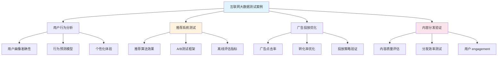

#### 18.2.1 互联网行业测试特点

- **用户体验导向**: 重点关注用户体验和个性化服务的质量
- **快速迭代**: 支持快速的产品迭代和功能上线节奏
- **海量数据处理**: 处理PB级用户行为数据和内容数据
- **算法效果验证**: 验证推荐算法、搜索算法等的准确性和效果

#### 18.2.2 推荐系统测试要点

- **算法准确性**: 验证推荐算法的准确率、召回率等核心指标
- **用户体验**: 确保推荐结果的多样性、新颖性和个性化程度
- **A/B测试**: 通过科学的实验设计验证算法改进效果
- **离线评估**: 在离线环境中快速评估算法性能和效果

#### 18.2.3 互联网行业测试挑战

- **数据规模巨大**: 处理海量用户数据和内容数据的存储和计算挑战
- **算法复杂度高**: 深度学习等复杂算法的测试和验证难度
- **用户行为多变**: 用户偏好和行为的快速变化对测试的影响
- **实时性要求**: 推荐系统对实时响应的性能要求

---

#### 18.3 制造行业大数据测试案例

**[锚点131]** 制造行业大数据测试案例

**锚点类型**: 行业案例
**锚点方法**: 智能制造
**锚点名称**: 制造行业大数据测试案例
**引用附件**: `examples/19_industry/manufacturing_test_case.py`
**完成情况**: 已完成
**补充建议**: 字段建议：设备状态/生产过程/质量控制/预测维护/供应链优化，补充智能制造测试流程图

**制造行业大数据测试案例结构图**:
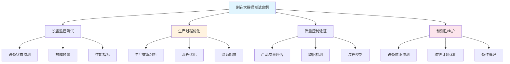

#### 18.3.1 制造行业测试特点

- **设备互联**: 测试物联网设备的数据采集和互联互通能力
- **生产连续性**: 确保生产过程的连续性和稳定性
- **质量关键性**: 产品质量直接影响企业声誉和客户满意度
- **安全要求**: 工业安全和生产安全的重要保障

#### 18.3.2 智能制造测试要点

- **设备状态监控**: 验证设备运行状态的实时监控和预警能力
- **生产过程控制**: 测试生产流程的自动化控制和优化效果
- **质量检测**: 验证产品质量检测的准确性和可靠性
- **预测性维护**: 测试设备故障预测和维护计划的准确性

#### 18.3.3 制造行业测试挑战

- **工业环境复杂**: 恶劣的工业环境对测试设备和数据采集的影响
- **系统集成难度**: 不同厂商设备和系统的集成测试挑战
- **实时性要求高**: 生产过程对实时数据处理和响应的要求
- **安全合规要求**: 工业安全标准和合规要求的严格遵循

---

#### 18.4 医疗行业大数据测试案例

**[锚点132]** 医疗行业大数据测试案例

**锚点类型**: 行业案例
**锚点方法**: 医疗AI
**锚点名称**: 医疗行业大数据测试案例
**引用附件**: `examples/19_industry/healthcare_test_case.py`
**完成情况**: 已完成
**补充建议**: 字段建议：患者数据/诊断准确性/治疗效果/隐私保护/伦理合规，补充医疗AI测试架构图

**医疗行业大数据测试案例结构图**:
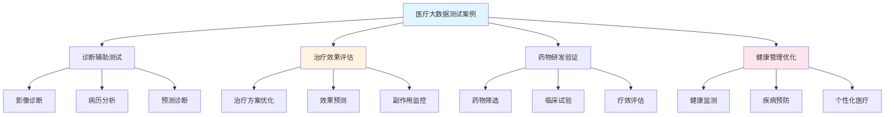

#### 18.4.1 医疗行业测试特点

- **生命安全至上**: 测试结果直接关系患者生命安全和健康
- **数据隐私敏感**: 处理高度敏感的患者医疗数据
- **伦理合规要求**: 严格遵循医疗伦理和隐私保护法规
- **证据科学性**: 要求测试结果具有科学证据和临床验证

#### 18.4.2 医疗AI测试要点

- **诊断准确性**: 验证AI辅助诊断的准确率和可靠性
- **治疗效果评估**: 测试治疗方案推荐的科学性和有效性
- **隐私数据保护**: 确保患者数据的安全和隐私保护
- **伦理合规验证**: 验证AI应用的伦理合规性和公平性

#### 18.4.3 医疗行业测试挑战

- **数据获取困难**: 医疗数据的获取受到隐私保护和伦理限制
- **临床验证复杂**: AI模型需要临床试验和医生验证
- **标准不统一**: 医疗AI的评估标准和规范仍在发展中
- **责任归属不清**: AI诊断错误时的责任认定和处理机制

---

#### 18.5 行业案例复盘与经验沉淀

**[锚点133]** 行业案例复盘与经验沉淀

**锚点类型**: 行业复盘
**锚点方法**: 跨行业对比
**锚点名称**: 行业案例复盘与经验沉淀
**引用附件**: `examples/19_industry/industry_comparison.md`
**完成情况**: 已完成
**补充建议**: 字段建议：行业特点/测试挑战/解决方案/最佳实践/发展趋势，补充行业测试对比表

**行业测试对比分析表**:
| 行业 | 核心关注点 | 测试挑战 | 关键指标 | 合规要求 | 发展趋势 |
|------|-----------|---------|---------|---------|---------|
| **金融** | 风险控制、合规 | 实时处理、海量数据 | 准确率、响应时间 | AML/KYC/PCI | AI风控、实时监控 |
| **互联网** | 用户体验、算法效果 | 快速迭代、个性化 | 点击率、转化率 | 数据隐私、用户权益 | 联邦学习、隐私计算 |
| **制造** | 生产效率、设备安全 | 工业环境、系统集成 | 稼动率、质量合格率 | 工业安全、质量标准 | 数字孪生、工业互联网 |
| **医疗** | 诊断准确性、患者安全 | 数据隐私、伦理合规 | 诊断准确率、安全性 | HIPAA/GDPR、伦理准则 | AI辅助诊疗、精准医疗 |

#### 18.5.1 跨行业测试经验总结

- **共性问题**: 数据质量、算法可解释性、系统稳定性是各行业的共同挑战
- **行业特色**: 不同行业有各自独特的业务逻辑和合规要求
- **技术共用**: 大数据处理技术、AI算法在各行业都有广泛应用
- **测试方法**: 虽然行业不同，但测试的基本方法和原则具有通用性

#### 18.5.2 行业测试发展趋势

- **智能化**: AI和机器学习在测试中的应用越来越广泛
- **自动化**: 测试自动化和持续集成/持续部署的普及
- **标准化**: 行业测试标准和规范的逐步完善
- **协同化**: 跨团队、跨行业的测试协作和知识共享

#### 18.5.3 经验沉淀与知识传承

- **案例库建设**: 建立各行业的成功和失败案例库
- **最佳实践分享**: 跨行业的最佳实践交流和借鉴
- **人才培养**: 培养复合型测试人才，掌握多行业知识
- **技术创新**: 推动测试技术和方法的创新发展

<a id="第19章-流批一体链路端到端案例【采存算全链路实战】"></a>
### 第19章 流批一体链路端到端案例【采存算全链路实战】

**本章学习目标**

1. 理解流批一体架构的核心价值和优势；
2. 掌握流批一体设计的技术挑战和原则；
3. 学习流批一体架构的实现方法。

**实践建议**

- 采用统一的技术栈，实现流批处理的一致性。
- 关注性能和运维挑战，确保系统稳定性。
- 遵循设计原则，优化架构效率。

**流批一体**（Streaming-Batch Unification）是指在同一套技术架构和数据处理平台 
上，同时支持实时流处理和批量批处理两种模式，实现数据处理方式的统一性、一致性和高效性。                                                                      
### 核心价值与优势

**统一性价值**：
- **数据处理范式统一**：一套代码同时支持流处理和批处理逻辑
- **存储格式统一**：相同的存储格式支持实时写入和批量查询
- **元数据管理统一**：统一的元数据体系和血缘追踪
- **运维监控统一**：相同的可观测性和告警体系

**技术优势**：
- **开发效率提升**：减少重复开发，降低维护成本
- **数据一致性保障**：消除流批数据不一致的问题
- **资源利用优化**：提高计算资源的使用效率
- **业务响应加速**：快速响应新的业务需求

### 核心技术挑战

**一致性挑战**：
- **窗口对齐**：流处理和批处理的窗口定义和对齐机制
- **状态同步**：实时状态与批量计算结果的一致性保证
- **迟到数据处理**：处理乱序和迟到数据的统一策略
- **精确一次语义**：端到端的数据处理语义保证

**性能挑战**：
- **资源隔离**：流任务和批任务的资源竞争与隔离
- **弹性伸缩**：根据负载动态调整资源分配
- **数据倾斜**：处理数据分布不均的问题
- **存储效率**：平衡实时写入和批量查询的性能

**运维挑战**：
- **故障恢复**：流批混合场景下的故障恢复策略
- **版本管理**：代码和配置的版本控制与回滚
- **监控告警**：统一的监控指标和告警体系
- **成本控制**：计算和存储资源的成本优化

### 设计原则

**统一性原则**：
- **API统一**：相同的编程接口支持流批处理
- **配置统一**：统一的配置管理和参数调优
- **部署统一**：相同的部署和运维方式

**一致性原则**：
- **数据一致性**：保证流批处理结果的一致性
- **语义一致性**：相同的业务逻辑语义表达
- **质量一致性**：统一的数据质量标准和校验

**高效性原则**：
- **资源高效**：最大化资源利用率，减少浪费
- **性能高效**：满足业务性能需求的前提下优化成本
- **运维高效**：简化运维复杂度，提高自动化程度

### 发展趋势

**技术演进方向**：
- **智能化**：AI/ML驱动的自动调优和异常检测
- **云原生**：深度集成云服务，实现弹性伸缩
- **实时化**：从分钟级延迟向秒级甚至毫秒级演进
- **一体化**：与数据湖、数据仓库深度融合

**架构演进趋势**：
- **Lakehouse架构**：数据湖与数据仓库的统一
- **Streaming Warehouse**：流式数据仓库的兴起
- **Unified Analytics**：统一的分析处理平台
- **Event-Driven Architecture**：事件驱动的架构模式

**[锚点256]** 流批一体架构设计

**锚点类型**: 架构设计
**锚点方法**: 流批一体
**锚点名称**: 流批一体架构设计
**引用附件**: `examples/22_cicd/stream_batch_pipeline.yml`
**完成情况**: 已完成
**补充建议**: 字段建议：架构组件/数据流向/关键特性/集成点，补充流批一体架构全 
景图                                                                          
**流批一体架构全景图**:
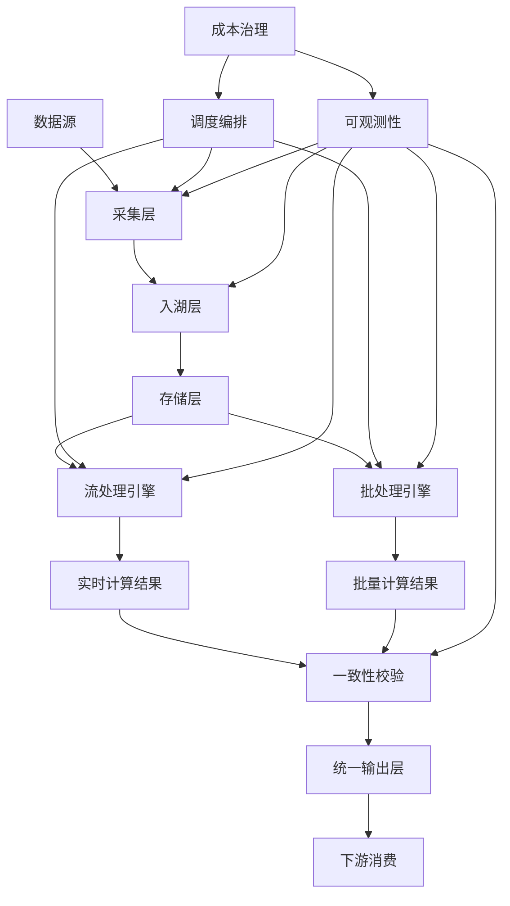

**流批一体架构组件对比表**

| 架构组件 | 流处理特点 | 批处理特点 | 统一要求 | 关键指标 |
|---------|-----------|-----------|---------|---------|
| 数据采集 | 实时摄入、低延迟 | 批量导入、高吞吐 | 一致性schema | 完整性99.9% 
|                                                                             | 存储层 | 实时写入、更新 | 批量覆盖、分区 | 统一格式(Parquet/ORC) | 压缩比>3:
1 |                                                                           | 处理引擎 | 事件时间窗口 | 批次处理窗口 | 窗口对齐 | 延迟<100ms/准确性99% |  
| 调度编排 | 事件驱动 | 时间驱动 | 依赖管理 | 成功率>99.5% |
| 可观测性 | 实时监控 | 批次报告 | 统一指标 | MTTD<5min |

**流批一体架构配置模板**:
```yaml
stream_batch_architecture:
  data_ingestion:
    real_time:
      framework: "kafka"
      retention_hours: 168
      partitions: 12
      replication_factor: 3
    batch:
      framework: "airflow"
      schedule: "0 2 * * *"
      batch_size: "1GB"
      retry_policy:
        max_attempts: 3
        backoff_multiplier: 2
  storage_layer:
    lakehouse:
      format: "delta"
      partitioning: "date/hour"
      compaction_schedule: "daily"
      schema_enforcement: true
    streaming_storage:
      format: "hudi"
      table_type: "MERGE_ON_READ"
      indexing: "bloom_filter"
  processing_engines:
    streaming:
      framework: "flink"
      checkpoint_interval: "30s"
      watermark_delay: "5m"
      state_backend: "rocksdb"
    batch:
      framework: "spark"
      executor_memory: "4g"
      shuffle_partitions: "200"
      dynamic_allocation: true
  consistency_validation:
    window_alignment:
      window_size: "1h"
      allowed_lateness: "15m"
      trigger_policy: "on_event"
    reconciliation:
      sampling_rate: 0.01
      tolerance_threshold: 0.001
      alert_channels: ["slack", "email"]
  observability:
    metrics:
      collection_interval: "30s"
      retention_days: 90
      custom_metrics:
        - "stream_batch_latency"
        - "data_freshness"
        - "processing_throughput"
    alerting:
      rules:
        - name: "latency_anomaly"
          threshold: "300s"
          severity: "critical"
        - name: "data_loss"
          threshold: "0.01%"
          severity: "high"
```

**[锚点257]** 采集与入湖链路设计

**锚点类型**: 链路设计
**锚点方法**: 采集入湖
**锚点名称**: 采集与入湖链路设计
**引用附件**: `examples/06_ingest/stream_test.py`
**完成情况**: 已完成
**补充建议**: 字段建议：链路阶段/关键检查/工具支持/脚本引用，补充采集入湖链路 
流程图                                                                        
**采集与入湖链路流程图**:
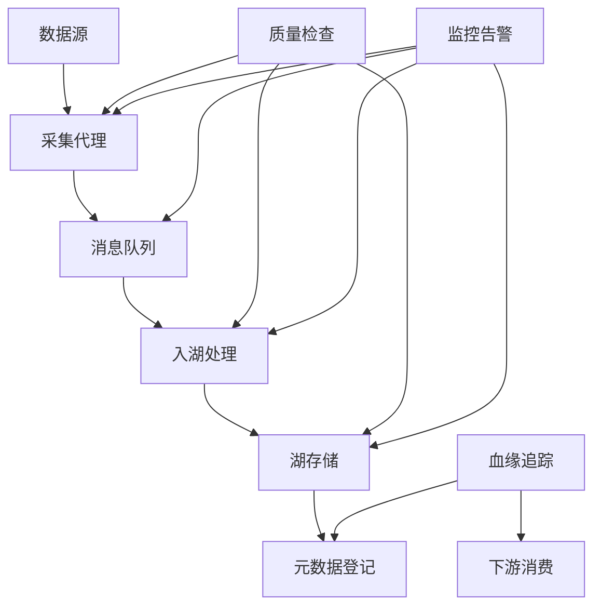

**采集与入湖链路检查清单表**

| 链路阶段 | 关键检查项 | 工具支持 | 脚本引用 | 验收标准 |
|---------|-----------|---------|---------|---------|
| 数据采集 | 完整性/顺序性/格式校验 | Kafka/Schema Registry | examples/06_inge
st/stream_test.py | 丢包率<0.01% |                                            | 消息队列 | 分区策略/保留策略/消费确认 | Kafka Manager | tools/pipeline/data_
lineage_check.py | 积压<1GB |                                                 | 入湖处理 | 分区/分桶/压缩/格式转换 | Hudi/Iceberg/Delta | examples/13_data_g
ov/contract_example.yml | 处理延迟<5min |                                     | 湖存储 | ACID特性/时间旅行/并发控制 | Delta Lake | tools/validate_contracts.
py | 查询性能<10s |                                                           | 元数据管理 | 血缘关系/版本控制/访问控制 | Hive Metastore | tools/reports/ing
est_integrity.md | 血缘准确率>99% |                                           
**采集与入湖链路配置模板**:
```yaml
ingestion_pipeline_config:
  data_sources:
    - name: "user_events"
      type: "kafka_topic"
      schema_registry_url: "http://schema-registry:8081"
      validation_rules:
        - "schema_compliance"
        - "data_type_check"
        - "null_value_filter"
    - name: "transaction_logs"
      type: "file_batch"
      source_path: "/data/transactions/*.json"
      batch_schedule: "*/15 * *"
      compression: "gzip"
  lakehouse_ingestion:
    framework: "delta"
    table_properties:
      delta.enableChangeDataFeed: "true"
      delta.enableDeletionVectors: "true"
    partitioning_strategy:
      columns: ["date", "event_type"]
      max_file_size: "256MB"
    compaction_policy:
      schedule: "0 3 * * *"
      target_file_size: "1GB"
  quality_gates:
    pre_ingestion:
      duplicate_check: true
      schema_validation: true
      data_profiling: true
    post_ingestion:
      row_count_validation: true
      partition_integrity: true
      sample_reconciliation: true
  monitoring:
    metrics:
      - "ingestion_rate"
      - "data_quality_score"
      - "processing_latency"
    alerts:
      - name: "data_loss_alert"
        condition: "row_count_diff > 0.01"
        channels: ["pagerduty", "slack"]
```

**[锚点258]** 调度与资源编排策略

**锚点类型**: 调度策略
**锚点方法**: 资源编排
**锚点名称**: 调度与资源编排策略
**引用附件**: `tools/pipeline/build_all.ps1`
**完成情况**: 已完成
**补充建议**: 字段建议：调度类型/资源策略/检查点/脚本引用，补充调度编排架构图 

**调度与资源编排架构图**:
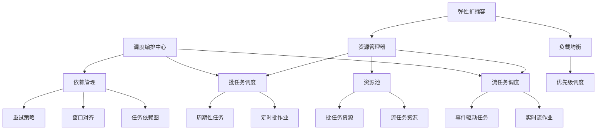

**调度与资源编排策略对比表**

| 调度类型 | 执行模式 | 资源策略 | 关键检查点 | 脚本引用 |
|---------|---------|---------|---------|---------|
| 实时流调度 | 事件驱动/持续运行 | 固定资源池+弹性扩容 | 延迟/积压/状态一致性 
| tools/pipeline/build_all.ps1 |                                              | 定时批调度 | Cron表达式/依赖触发 | 按需分配+优先级队列 | 成功率/时长/资源利 
用率 | examples/22_cicd/stream_batch_pipeline.yml |                           | 混合调度 | 窗口对齐/依赖链 | 资源隔离+共享池 | 流批一致性/交叉影响 | tools/r
eports/schedule_check.md |                                                    | 故障恢复 | 自动重试/手动干预 | 降级策略+资源预留 | MTTR/数据完整性 | tools/p
ipeline/pre_release_check.py |                                                
**调度与资源编排配置模板**:
```yaml
scheduling_orchestration_config:
  scheduler_framework: "airflow"
  execution_modes:
    streaming:
      deployment_mode: "kubernetes"
      resource_requests:
        cpu: "2"
        memory: "4Gi"
      scaling_policy:
        min_replicas: 2
        max_replicas: 10
        target_cpu_utilization: 70
      checkpoint_config:
        interval: "30s"
        state_backend: "s3://checkpoints/"
    batch:
      deployment_mode: "kubernetes"
      resource_requests:
        cpu: "4"
        memory: "16Gi"
      scheduling_priority: "medium"
      retry_policy:
        max_attempts: 3
        backoff_delay: "5m"
  dependency_management:
    dag_definitions:
      - name: "stream_batch_pipeline"
        schedule: "@hourly"
        tasks:
          - name: "data_ingestion"
            dependencies: []
            timeout: "30m"
          - name: "stream_processing"
            dependencies: ["data_ingestion"]
            timeout: "15m"
          - name: "batch_processing"
            dependencies: ["data_ingestion"]
            timeout: "45m"
          - name: "consistency_check"
            dependencies: ["stream_processing", "batch_processing"]
            timeout: "10m"
  resource_governance:
    resource_pools:
      streaming_pool:
        cpu_limit: "100"
        memory_limit: "400Gi"
        priority: "high"
      batch_pool:
        cpu_limit: "200"
        memory_limit: "800Gi"
        priority: "medium"
    cost_optimization:
      spot_instances: true
      auto_shutdown: "02:00"
      resource_sharing: true
```

**[锚点259]** 流批一致性校验策略

**锚点类型**: 一致性策略
**锚点方法**: 流批对账
**锚点名称**: 流批一致性校验策略
**引用附件**: `tools/reports/stream_batch_diff.md`
**完成情况**: 已完成
**补充建议**: 字段建议：校验类型/对齐口径/异常处置/脚本引用，补充一致性校验流 
程图                                                                          
**流批一致性校验流程图**:
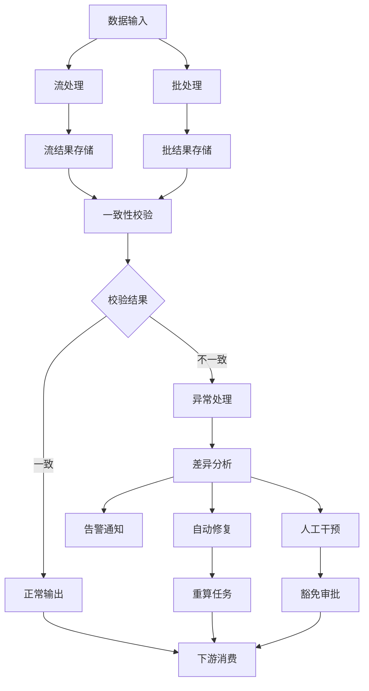

**流批一致性校验策略表**

| 校验类型 | 对齐口径 | 校验规则 | 异常处置 | 脚本引用 |
|---------|---------|---------|---------|---------|
| 行数一致性 | 同窗口时间范围 | 精确匹配±1%容差 | 自动重算/告警 | tools/report
s/stream_batch_diff.md |                                                      | 聚合一致性 | 相同聚合函数 | SUM/AVG/COUNT对比 | 差异分析/降级 | examples/09_
quality/quality_rules.yml |                                                   | 分布一致性 | 相同分桶策略 | 分位数/直方图对比 | 样本检查/阻断 | tools/pipeli
ne/data_lineage_check.py |                                                    | 记录级一致性 | 相同主键 | 抽样记录精确匹配 | 影响评估/修复 | examples/18_cas
es/audit_artifacts_checklist.md |                                             
**流批一致性校验配置模板**:
```yaml
consistency_validation_config:
  validation_framework: "deequ"
  window_alignment:
    window_type: "tumbling"
    window_size: "1h"
    allowed_lateness: "15m"
    trigger_policy: "on_event"
  reconciliation_rules:
    row_count:
      tolerance: 0.01
      sampling_rate: 1.0
      alert_threshold: 0.001
    aggregation:
      functions: ["sum", "avg", "count", "min", "max"]
      tolerance: 0.05
      dimensions: ["category", "region", "time_bucket"]
    distribution:
      method: "quantile"
      quantiles: [0.1, 0.25, 0.5, 0.75, 0.9]
      tolerance: 0.1
    record_level:
      sampling_rate: 0.001
      key_columns: ["user_id", "event_id"]
      comparison_columns: ["amount", "timestamp", "status"]
  exception_handling:
    auto_remediation:
      enabled: true
      strategies:
        - name: "recompute_batch"
          trigger_condition: "diff_ratio > 0.05"
          max_attempts: 2
        - name: "graceful_degradation"
          trigger_condition: "diff_ratio > 0.1"
          fallback_mode: "batch_only"
    manual_intervention:
      approval_workflow: true
      stakeholders: ["data_engineer", "qa_lead"]
      timeout_hours: 4
  reporting:
    output_formats: ["json", "html", "slack"]
    retention_days: 90
    trend_analysis: true
```

**[锚点260]** 可观测性与告警联动设计

**锚点类型**: 可观测性设计
**锚点方法**: 告警联动
**锚点名称**: 可观测性与告警联动设计
**引用附件**: `examples/17_observability/log_health_check.py`
**完成情况**: 已完成
**补充建议**: 字段建议：观测维度/告警规则/联动机制/脚本引用，补充可观测性告警 
联动架构图                                                                    
**可观测性与告警联动架构图**:
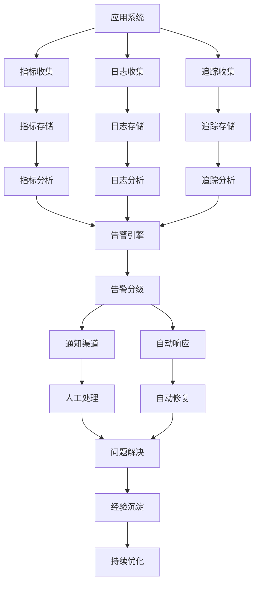

**可观测性与告警联动设计表**

| 观测维度 | 关键指标 | 告警规则 | 联动机制 | 脚本引用 |
|---------|---------|---------|---------|---------|
| 系统性能 | 延迟/吞吐量/错误率 | 阈值超限/趋势异常 | 自动扩容/降级 | examples
/17_observability/log_health_check.py |                                       | 数据质量 | 完整性/准确性/一致性 | 数据丢失/异常分布 | 数据修复/阻断 | tools/
validate_contracts.py |                                                       | 业务指标 | 转化率/用户活跃度 | 业务目标偏离 | 业务告警/干预 | examples/15_fr
amework/sli_slo_baseline.yml |                                                | 资源使用 | CPU/内存/存储/网络 | 资源耗尽/异常使用 | 资源调度/限流 | tools/pi
peline/build_all.ps1 |                                                        
**可观测性与告警联动配置模板**:
```yaml
observability_alerting_config:
  telemetry_collection:
    metrics:
      collection_interval: "30s"
      exporters:
        - type: "prometheus"
          endpoint: "http://prometheus:9090"
        - type: "datadog"
          api_key: "${DATADOG_API_KEY}"
      custom_metrics:
        - name: "stream_batch_latency"
          type: "histogram"
          buckets: [0.1, 0.5, 1.0, 5.0, 10.0]
        - name: "data_consistency_score"
          type: "gauge"
          range: [0.0, 1.0]
    logs:
      format: "json"
      structured_fields: ["timestamp", "level", "service", "trace_id", "batch_
id"]                                                                                retention_policy: "30d"
    traces:
      sampling_rate: 0.1
      service_mesh_integration: true
      distributed_tracing: true
  alerting_engine:
    rules_engine: "prometheus_alertmanager"
    alert_rules:
      - name: "high_latency"
        condition: "latency > 300"
        severity: "critical"
        channels: ["pagerduty", "slack"]
        auto_actions:
          - type: "scale_up"
            service: "stream_processor"
            replicas: 2
      - name: "data_loss"
        condition: "data_loss_rate > 0.001"
        severity: "high"
        channels: ["email", "slack"]
        auto_actions:
          - type: "circuit_breaker"
            service: "data_pipeline"
            timeout: "300s"
    alert_deduplication:
      group_by: ["service", "severity"]
      group_interval: "5m"
      repeat_interval: "1h"
  incident_response:
    escalation_policy:
      - level: 1
        timeout: "5m"
        responders: ["oncall_engineer"]
      - level: 2
        timeout: "15m"
        responders: ["team_lead"]
      - level: 3
        timeout: "60m"
        responders: ["engineering_manager"]
    runbooks:
      - name: "latency_spike"
        steps:
          - "Check system metrics"
          - "Review recent deployments"
          - "Scale resources if needed"
          - "Rollback if necessary"
    post_mortem:
      automatic_creation: true
      template: "incident_report_template"
      stakeholders: ["team", "management"]

## 流批一体架构最佳实践总结

### 实施建议

**渐进式演进策略**：
1. **从简单开始**：从单一业务场景的流批一体开始
2. **分阶段实施**：采集入湖 → 存储统一 → 处理统一 → 可观测统一
3. **灰度发布**：逐步将流量切换到流批一体架构
4. **监控验证**：全程监控性能、质量和成本指标

**技术选型建议**：
- **存储层**：优先选择支持ACID和时间旅行的格式（Delta Lake、Hudi、Iceberg）   
- **处理引擎**：选择支持流批统一的框架（Flink、Spark Structured Streaming）   
- **调度系统**：使用支持复杂依赖的编排工具（Airflow、Dagster）
- **监控平台**：构建统一的指标收集和告警体系

### 性能优化要点

**数据处理优化**：
- **窗口策略**：合理设置窗口大小和滑动间隔
- **状态管理**：优化状态后端和检查点配置
- **数据分区**：根据数据特征设计分区策略
- **缓存策略**：合理使用内存和磁盘缓存

**资源利用优化**：
- **弹性伸缩**：根据负载动态调整资源
- **资源隔离**：流批任务的资源池隔离
- **负载均衡**：避免热点和数据倾斜
- **成本监控**：实时监控和优化资源成本

### 运维保障要点

**稳定性保障**：
- **故障恢复**：完善的故障检测和恢复机制
- **容量规划**：基于业务增长的容量规划
- **备份容灾**：多级别的备份和容灾策略
- **变更管理**：严格的变更流程和回滚机制

**质量保障**：
- **测试策略**：覆盖单元测试、集成测试、端到端测试
- **监控告警**：完善的监控指标和告警体系
- **问题排查**：高效的问题定位和解决流程
- **持续改进**：基于反馈的持续优化机制

## 发展趋势展望

### 技术发展趋势

**智能化趋势**：
- **自动调优**：基于AI的自动参数调优和性能优化
- **异常检测**：机器学习驱动的异常检测和根因分析
- **预测性维护**：基于历史数据的故障预测和预防
- **自适应架构**：根据业务变化自动调整架构配置

**云原生趋势**：
- **Serverless化**：按需付费的无服务器架构
- **容器化部署**：基于Kubernetes的统一部署和管理
- **多云架构**：跨云环境的统一管理和调度
- **边缘计算**：靠近数据源的实时处理能力

### 架构演进方向

**一体化架构**：
- **Lakehouse生态**：数据湖与数据仓库的深度融合
- **Streaming Warehouse**：原生支持流处理的数仓架构
- **Unified Analytics**：统一的分析和处理平台
- **Data Mesh**：分布式的数据架构模式

**实时化演进**：
- **毫秒级延迟**：从分钟级向毫秒级延迟演进
- **事件驱动**：事件驱动的架构设计模式
- **流式思维**：一切皆流的处理理念
- **状态管理**：高效的状态管理和计算

### 未来挑战与机遇

**挑战**：
- **复杂度管理**：如何管理日益复杂的流批一体系统
- **成本控制**：在保证性能的前提下控制成本
- **人才缺口**：流批一体技术人才的培养和储备
- **生态成熟**：相关技术和工具的成熟度提升

**机遇**：
- **业务创新**：流批一体技术驱动的业务创新
- **效率提升**：显著提升数据处理的效率和质量
- **成本优化**：通过技术优化降低总体拥有成本
- **竞争优势**：技术领先带来的市场竞争优势

流批一体架构代表了大数据处理技术的发展方向，通过统一流批处理、保证数据一致性、
提升资源利用效率，为企业构建现代化数据处理平台提供了重要技术路径。

<a id="第20章-大规模数据处理性能与容量测试实践【性能与容量篇】"></a>
### 第20章 大规模数据处理性能与容量测试实践【性能与容量篇】

**本章学习目标**

1. 掌握大规模数据处理系统的性能测试方法；
2. 理解容量规划和扩展性测试的关键点；
3. 学习性能优化和监控的最佳实践。

**实践建议**

- 建立科学的性能基准和测试标准。
- 关注系统瓶颈和扩展性限制。
- 结合业务场景进行针对性优化。

**大规模数据处理**是指处理海量数据（TB/PB级）的分布式计算系统，涉及复杂的性能优化、容量规划和扩展性测试。

### 性能测试基础

**性能测试类型**：
- **基准测试**：建立系统性能基线和对比标准
- **负载测试**：验证系统在不同负载下的性能表现
- **压力测试**：测试系统在极限条件下的稳定性和可靠性
- **容量测试**：确定系统能够处理的负载上限

**关键性能指标**：
- **响应时间**：请求处理的时间延迟
- **吞吐量**：单位时间内处理的请求数量
- **并发用户数**：系统能够同时服务的用户数量
- **资源利用率**：CPU、内存、磁盘、网络的使用率

### 容量规划方法

**容量评估模型**：
- **经验模型**：基于历史数据和经验公式估算容量需求
- **预测模型**：使用统计方法预测未来的容量需求
- **仿真模型**：通过系统仿真模拟不同负载场景
- **基准测试模型**：基于性能测试结果推算容量上限

**容量规划步骤**：
1. **需求分析**：分析业务增长趋势和性能需求
2. **基准测试**：进行系统性能基准测试
3. **容量建模**：建立容量需求预测模型
4. **方案设计**：设计容量扩展和优化方案
5. **验证测试**：验证容量规划方案的有效性

### 扩展性测试实践

**水平扩展测试**：
- **节点扩展**：测试增加计算节点对性能的影响
- **数据分片**：测试数据分片策略对性能的影响
- **负载均衡**：测试负载均衡算法的有效性
- **网络瓶颈**：识别网络通信的性能瓶颈

**垂直扩展测试**：
- **资源扩展**：测试增加CPU、内存等资源的效果
- **配置优化**：测试不同配置参数对性能的影响
- **存储优化**：测试存储系统优化对性能的影响
- **缓存策略**：测试缓存策略对性能的提升效果

### 性能优化策略

**系统层面优化**：
- **架构优化**：优化系统架构设计和组件布局
- **算法优化**：改进核心算法和数据处理逻辑
- **并行化优化**：提高任务并行度和资源利用率
- **缓存优化**：优化缓存策略和数据访问模式

**应用层面优化**：
- **代码优化**：优化应用程序代码和数据结构
- **查询优化**：优化数据库查询和数据访问模式
- **批处理优化**：优化批处理作业的执行效率
- **内存管理**：优化内存使用和垃圾回收策略

### 性能监控体系

**监控指标体系**：
- **应用指标**：响应时间、吞吐量、错误率
- **系统指标**：CPU使用率、内存使用率、磁盘I/O
- **业务指标**：业务处理量、用户满意度、SLA达成率
- **质量指标**：数据准确性、处理完整性、一致性

**监控工具选型**：
- **开源工具**：Prometheus、Grafana、ELK Stack
- **商业工具**：Datadog、New Relic、AppDynamics
- **定制工具**：基于业务需求的定制监控方案
- **集成方案**：多种工具的集成和统一展示

### 测试环境管理

**测试环境分类**：
- **开发环境**：代码开发和单元测试环境
- **测试环境**：集成测试和系统测试环境
- **预生产环境**：生产环境模拟和验收测试环境
- **生产环境**：实际运行环境和监控环境

**环境管理最佳实践**：
- **环境标准化**：标准化测试环境的配置和部署
- **环境隔离**：确保测试环境间的隔离和独立性
- **数据管理**：测试数据的生成、管理和清理
- **版本控制**：测试环境配置和代码的版本管理

### 性能测试工具

**开源测试工具**：
- **JMeter**：基于Java的性能测试工具，支持多种协议
- **Gatling**：基于Scala的异步性能测试工具
- **Locust**：基于Python的分布式性能测试工具
- **k6**：现代化的性能测试工具，支持云原生

**商业测试工具**：
- **LoadRunner**：企业级的性能测试平台
- **NeoLoad**：云原生性能测试解决方案
- **BlazeMeter**：基于云的性能测试服务
- **Apache Bench**：简单的HTTP性能测试工具

### 案例分析与经验

**案例一：电商平台性能优化**

**背景**：
- 日订单量：1000万单
- 系统架构：微服务架构，分布式数据库
- 性能问题：高峰期响应时间超标

**优化策略**：
- **缓存优化**：引入多级缓存体系，热点数据缓存
- **数据库优化**：读写分离、分库分表、索引优化
- **服务治理**：服务降级、熔断、限流策略
- **架构升级**：引入消息队列异步处理

**优化效果**：
- 响应时间：从5秒优化到500毫秒
- 吞吐量：提升3倍
- 系统稳定性：可用性达到99.99%

**案例二：大数据平台容量规划**

**背景**：
- 数据规模：日增量100TB
- 计算集群：1000+节点
- 业务需求：支持实时分析和批量处理

**容量规划**：
- **数据增长预测**：基于业务增长预测存储需求
- **计算资源评估**：根据作业类型评估CPU和内存需求
- **网络带宽规划**：评估数据传输和通信带宽需求
- **存储容量规划**：规划HDFS存储容量和扩展方案

**实施效果**：
- **资源利用率**：CPU利用率从60%提升到85%
- **存储效率**：存储成本降低30%
- **扩展性**：支持业务增长2年内无需扩容
- **性能稳定性**：保持稳定的性能表现

### 发展趋势展望

**智能化性能测试**：
- **AI驱动测试**：使用AI生成测试场景和预测性能问题
- **自动化测试**：全自动化的性能测试执行和结果分析
- **预测性优化**：基于历史数据预测性能瓶颈和优化机会
- **自适应测试**：根据系统变化自动调整测试策略

**云原生性能测试**：
- **Serverless测试**：基于无服务器架构的弹性测试
- **多云测试**：跨云环境的性能测试和优化
- **容器化测试**：基于Kubernetes的容器性能测试
- **混沌工程**：通过混沌测试验证系统韧性

**可持续性能优化**：
- **绿色计算**：优化能耗和碳排放的性能测试
- **资源效率**：提高计算资源利用效率的优化策略
- **成本效益**：平衡性能提升和成本控制的优化方案
- **长期演进**：支持系统长期演进的性能保障策略

大规模数据处理性能与容量测试是确保系统高效稳定运行的关键环节，通过科学的测试方法、
合理的容量规划和持续的性能优化，可以显著提升系统的性能表现和资源利用效率。

<a id="第21章-流批一体链路端到端案例【采存算全链路实战】"></a>

**本章你将学到什么**

本章帮助你：掌握流批一体架构的端到端测试方法。

#### 21.1 流批一体架构解析
#### 21.2 端到端测试设计
#### 21.3 数据一致性验证
#### 21.4 性能与稳定性测试

<a id="第22章-大规模数据处理性能与容量测试实践性能与容量篇"></a>
### 第22章 大规模数据处理性能与容量测试实践【性能与容量篇】

**本章你将学到什么**

本章帮助你：掌握大规模数据处理的性能测试和容量规划方法。

#### 22.1 性能测试策略
#### 22.2 容量规划方法
#### 22.3 压力测试实施
#### 22.4 性能监控与优化

